<h1 class='title'>Cloud Developer</h1>

### Table of Content

- [AWS Identity and Access Management](#aws-identity-and-access-management)
  - [Access through identity-based policies](#access-through-identity-based-policies)
    - [Understand how IAM grants access](#understand-how-iam-grants-access)
  - [Policy types](#policy-types)
  - [Who is requesting access?](#who-is-requesting-access)
  - [Passing a role to an AWS service](#passing-a-role-to-an-aws-service)
  - [Federating Users in AWS](#federating-users-in-aws)
    - [Web-Based Federation](#web-based-federation)
      - [The AssumeRoleWithWebIdentity request](#the-assumerolewithwebidentity-request)
      - [Amazon Cognito for mobile applications](#amazon-cognito-for-mobile-applications)
- [EC2 Fundamentals](#ec2-fundamentals)
  - [EC2 Instance Storage](#ec2-instance-storage)
    - [EBS](#ebs)
      - [EBS Snapshots](#ebs-snapshots)
      - [EBS Volume Types:](#ebs-volume-types)
      - [EBS Multi-Attach - io1/io2 family](#ebs-multi-attach---io1io2-family)
    - [EFS](#efs)
    - [EBS vs EFS - Elastic Block Storage](#ebs-vs-efs---elastic-block-storage)
- [Load Balancers](#load-balancers)
  - [Application Load Balancer](#application-load-balancer)
    - [ALBs](#albs)
    - [ALB Target Groups:](#alb-target-groups)
  - [Network Load Balancer](#network-load-balancer)
  - [Gateway Load Balancer](#gateway-load-balancer)
  - [Cross-Zone Load Balancing](#cross-zone-load-balancing)
  - [SSL/TLS - Basics](#ssltls---basics)
    - [How SSL works (SSL handshake):](#how-ssl-works-ssl-handshake)
    - [Load Balancer - SSL Certificates](#load-balancer---ssl-certificates)
      - [SSL – Server Name Indication (SNI)](#ssl--server-name-indication-sni)
- [Auto Scaling Group (ASG)](#auto-scaling-group-asg)
    - [Good metrics to scale on:](#good-metrics-to-scale-on)
- [Amazon RDS](#amazon-rds)
  - [Advantage of RDS versus deploying DB on EC2](#advantage-of-rds-versus-deploying-db-on-ec2)
    - [RDS – Storage Auto Scaling:](#rds--storage-auto-scaling)
    - [RDS Read Replicas for Read Scalability](#rds-read-replicas-for-read-scalability)
      - [RDS Read Replicas – Use Cases](#rds-read-replicas--use-cases)
    - [RDS Multi AZ (Disaster Recovery)](#rds-multi-az-disaster-recovery)
    - [RDS – From Single-AZ to Multi-AZ](#rds--from-single-az-to-multi-az)
  - [Amazon Aurora](#amazon-aurora)
    - [Aurora DB Cluster](#aurora-db-cluster)
    - [RDS \& Aurora Security](#rds--aurora-security)
  - [Amazon RDS Proxy](#amazon-rds-proxy)
  - [Amazon ElastiCache](#amazon-elasticache)
    - [ElastiCache Solution Architecture - DB Cache](#elasticache-solution-architecture---db-cache)
      - [Cache Evictions and Time-to-live (TTL)](#cache-evictions-and-time-to-live-ttl)
    - [Amazon MemoryDB for Redis](#amazon-memorydb-for-redis)
- [Route 53](#route-53)
      - [Amazon Route 53](#amazon-route-53)
      - [Route 53 – Records](#route-53--records)
      - [Route 53 – Hosted Zones](#route-53--hosted-zones)
      - [Route 53 – Records TTL (Time To Live)](#route-53--records-ttl-time-to-live)
    - [CNAME vs Alias](#cname-vs-alias)
      - [Route 53 – Alias Records Targets](#route-53--alias-records-targets)
      - [Route 53 – Routing Policies](#route-53--routing-policies)
      - [Routing Policies – Geolocation](#routing-policies--geolocation)
      - [Routing Policies – Geoproximity](#routing-policies--geoproximity)
      - [Routing Policies – IP-based Routing](#routing-policies--ip-based-routing)
      - [Routing Policies – Multi-Value](#routing-policies--multi-value)
    - [Domain Registar vs. DNS Service](#domain-registar-vs-dns-service)
- [VPC](#vpc)
      - [NACL (Network ACL)](#nacl-network-acl)
      - [Security Groups](#security-groups)
      - [VPC Flow Logs](#vpc-flow-logs)
    - [VPC Endpoints](#vpc-endpoints)
      - [Direct Connect (DX)](#direct-connect-dx)
- [Amazon S3](#amazon-s3)
    - [Amazon S3 - Objects](#amazon-s3---objects)
    - [Amazon S3 - Buckets](#amazon-s3---buckets)
    - [Amazon S3 – Security](#amazon-s3--security)
    - [Amazon S3 – Static Website Hosting](#amazon-s3--static-website-hosting)
    - [Amazon S3 – Replication (CRR \& SRR)](#amazon-s3--replication-crr--srr)
    - [S3 Storage Classes](#s3-storage-classes)
    - [Amazon S3 – Moving between Storage Classes](#amazon-s3--moving-between-storage-classes)
    - [Amazon S3 – Lifecycle Rules](#amazon-s3--lifecycle-rules)
    - [Amazon S3 – Lifecycle Rules (Scenario 1)](#amazon-s3--lifecycle-rules-scenario-1)
    - [Amazon S3 – Lifecycle Rules (Scenario 2)](#amazon-s3--lifecycle-rules-scenario-2)
    - [Amazon S3 Analytics – Storage Class Analysis](#amazon-s3-analytics--storage-class-analysis)
    - [S3 Event Notifications](#s3-event-notifications)
    - [S3 Event Notifications with Amazon EventBridge](#s3-event-notifications-with-amazon-eventbridge)
    - [S3 Performance: how to improve upload performance](#s3-performance-how-to-improve-upload-performance)
    - [S3 Select \& Glacier Select](#s3-select--glacier-select)
    - [S3 User-Defined Object Metadata \& S3 Object Tags](#s3-user-defined-object-metadata--s3-object-tags)
  - [Amazon S3 Security](#amazon-s3-security)
    - [Amazon S3 – Object Encryption](#amazon-s3--object-encryption)
      - [Amazon S3 Encryption – SSE-S3](#amazon-s3-encryption--sse-s3)
      - [Amazon S3 Encryption – SSE-KMS](#amazon-s3-encryption--sse-kms)
        - [SSE-KMS Limitation](#sse-kms-limitation)
      - [Amazon S3 Encryption – SSE-C](#amazon-s3-encryption--sse-c)
      - [Amazon S3 Encryption – Client-Side Encryption](#amazon-s3-encryption--client-side-encryption)
      - [Amazon S3 – Encryption in transit (SSL/TLS)](#amazon-s3--encryption-in-transit-ssltls)
      - [Amazon S3 – Default Encryption vs. Bucket Policies](#amazon-s3--default-encryption-vs-bucket-policies)
      - [What is CORS?](#what-is-cors)
      - [Amazon S3 – CORS](#amazon-s3--cors)
      - [S3 Access Logs](#s3-access-logs)
      - [Amazon S3 – Pre-Signed URLs](#amazon-s3--pre-signed-urls)
      - [S3 – Access Points](#s3--access-points)
      - [S3 – Access Points – VPC Origin](#s3--access-points--vpc-origin)
      - [S3 – Access Points – Lambda](#s3--access-points--lambda)
- [CloudFront](#cloudfront)
    - [Amazon CloudFront](#amazon-cloudfront)
  - [CloudFront – Origins](#cloudfront--origins)
    - [CloudFront vs S3 Cross Region Replication](#cloudfront-vs-s3-cross-region-replication)
    - [CloudFront Caching](#cloudfront-caching)
      - [CloudFront Policies – Cache Policy](#cloudfront-policies--cache-policy)
      - [CloudFront Caching – Cache Policy HTTP Headers](#cloudfront-caching--cache-policy-http-headers)
      - [CloudFront Policies – Origin Request Policy](#cloudfront-policies--origin-request-policy)
      - [CloudFront – Cache Invalidations](#cloudfront--cache-invalidations)
      - [CloudFront – Cache Behaviors](#cloudfront--cache-behaviors)
      - [CloudFront Geo Restriction](#cloudfront-geo-restriction)
      - [CloudFront Signed URL / Signed Cookies](#cloudfront-signed-url--signed-cookies)
      - [CloudFront Signed URL vs S3 Pre-Signed URL](#cloudfront-signed-url-vs-s3-pre-signed-url)
      - [CloudFront Signed URL Process](#cloudfront-signed-url-process)
      - [CloudFront – Price Classes](#cloudfront--price-classes)
    - [CloudFront – Multiple Origin](#cloudfront--multiple-origin)
      - [CloudFront – Origin Groups](#cloudfront--origin-groups)
      - [CloudFront – Field Level Encryption](#cloudfront--field-level-encryption)
- [Developing on AWS](#developing-on-aws)
    - [EC2 Instance Metadata (IMDS)](#ec2-instance-metadata-imds)
      - [MFA with CLI](#mfa-with-cli)
      - [AWS Limits (Quotas)](#aws-limits-quotas)
      - [Exponential Backoff (any AWS service)](#exponential-backoff-any-aws-service)
      - [AWS CLI Credentials Provider Chain](#aws-cli-credentials-provider-chain)
      - [AWS SDK Default Credentials Provider Chain](#aws-sdk-default-credentials-provider-chain)
      - [AWS Credentials Best Practices](#aws-credentials-best-practices)
- [Amazon ECS/EKS](#amazon-ecseks)
  - [Containers: Docker](#containers-docker)
    - [Docker vs. Virtual Machines](#docker-vs-virtual-machines)
  - [AWS ECS](#aws-ecs)
    - [Amazon ECS - EC2 Launch Type](#amazon-ecs---ec2-launch-type)
    - [Amazon ECS – Fargate Launch Type](#amazon-ecs--fargate-launch-type)
    - [Amazon ECS – Task Definitions](#amazon-ecs--task-definitions)
    - [Amazon ECS – Load Balancer Integrations](#amazon-ecs--load-balancer-integrations)
      - [Amazon ECS – Load Balancing (EC2 Launch Type)](#amazon-ecs--load-balancing-ec2-launch-type)
      - [Amazon ECS – Load Balancing (Fargate)](#amazon-ecs--load-balancing-fargate)
      - [Amazon ECS – Environment Variables](#amazon-ecs--environment-variables)
    - [Amazon ECS – Data Volumes (EFS)](#amazon-ecs--data-volumes-efs)
    - [ECS Service Auto Scaling](#ecs-service-auto-scaling)
    - [EC2 Launch Type – Auto Scaling EC2 Instances](#ec2-launch-type--auto-scaling-ec2-instances)
    - [ECS Rolling Updates](#ecs-rolling-updates)
    - [ECS tasks invoked by Event Bridge](#ecs-tasks-invoked-by-event-bridge)
  - [Amazon EKS Overview](#amazon-eks-overview)
    - [Amazon EKS – Node Types](#amazon-eks--node-types)
    - [Amazon EKS – Data Volumes](#amazon-eks--data-volumes)
- [AWS Elastic Beanstalk](#aws-elastic-beanstalk)
    - [Beanstalk Deployment Options for Updates](#beanstalk-deployment-options-for-updates)
    - [Elastic Beanstalk Migration](#elastic-beanstalk-migration)
      - [Decouple Databases](#decouple-databases)
      - [Running Multiple Containers in Elastic BeansTalk Environment](#running-multiple-containers-in-elastic-beanstalk-environment)
- [AWS Integration \& Messaging](#aws-integration--messaging)
  - [Amazon SQS - Standard Queue](#amazon-sqs---standard-queue)
    - [SQS – Producing Messages](#sqs--producing-messages)
    - [SQS – Consuming Messages](#sqs--consuming-messages)
    - [SQS – Multiple EC2 Instances Consumers](#sqs--multiple-ec2-instances-consumers)
    - [SQS with Auto Scaling Group (ASG)](#sqs-with-auto-scaling-group-asg)
    - [SQS to decouple between application tiers](#sqs-to-decouple-between-application-tiers)
  - [Amazon SQS - Security](#amazon-sqs---security)
    - [SQS Queue Access Policy](#sqs-queue-access-policy)
    - [SQS – Message Visibility Timeout](#sqs--message-visibility-timeout)
    - [Amazon SQS – FIFO Queue](#amazon-sqs--fifo-queue)
    - [Amazon SQS – Dead Letter Queue (DLQ)](#amazon-sqs--dead-letter-queue-dlq)
    - [SQS DLQ – Redrive to Source](#sqs-dlq--redrive-to-source)
    - [Amazon SQS – Delay Queue](#amazon-sqs--delay-queue)
    - [Amazon SQS - Long Polling](#amazon-sqs---long-polling)
    - [SQS Extended Client](#sqs-extended-client)
    - [SQS – Must know API](#sqs--must-know-api)
    - [SQS – Must know API](#sqs--must-know-api-1)
    - [SQS FIFO – Deduplication](#sqs-fifo--deduplication)
    - [SQS FIFO – Message Grouping](#sqs-fifo--message-grouping)
  - [Amazon SNS](#amazon-sns)
    - [SNS integrates with a lot of AWS services](#sns-integrates-with-a-lot-of-aws-services)
    - [Amazon SNS – How to publish](#amazon-sns--how-to-publish)
    - [Amazon SNS – Security](#amazon-sns--security)
    - [SNS + SQS: Fan Out](#sns--sqs-fan-out)
    - [Application: S3 Events to multiple queues](#application-s3-events-to-multiple-queues)
    - [SNS – Message Filtering](#sns--message-filtering)
- [Kinesis Overview](#kinesis-overview)
  - [Kinesis Data Streams](#kinesis-data-streams)
    - [Kinesis Data Streams – Capacity Modes](#kinesis-data-streams--capacity-modes)
    - [Kinesis Data Streams Security](#kinesis-data-streams-security)
    - [Kinesis Producers](#kinesis-producers)
    - [Kinesis Consumers Types](#kinesis-consumers-types)
    - [Kinesis Consumers – AWS Lambda](#kinesis-consumers--aws-lambda)
    - [Kinesis Client Library (KCL)](#kinesis-client-library-kcl)
    - [Kinesis Operation – Shard Splitting/Merging](#kinesis-operation--shard-splittingmerging)
    - [Ordering Data into Kinesis](#ordering-data-into-kinesis)
  - [Kinesis Data Firehose](#kinesis-data-firehose)
    - [Kinesis Data Streams vs Firehose](#kinesis-data-streams-vs-firehose)
    - [Kinesis Data Analytics for SQL Applications](#kinesis-data-analytics-for-sql-applications)
    - [Kinesis Data Analytics for Apache Flink](#kinesis-data-analytics-for-apache-flink)
    - [Kinesis vs SQS ordering](#kinesis-vs-sqs-ordering)
    - [SQS vs SNS vs Kinesis](#sqs-vs-sns-vs-kinesis)
- [AWS Monitoring, Troubleshooting, Auditing](#aws-monitoring-troubleshooting-auditing)
    - [Why Monitoring is Important](#why-monitoring-is-important)
  - [Monitoring Tools in AWS](#monitoring-tools-in-aws)
  - [AWS CloudWatch Metrics](#aws-cloudwatch-metrics)
    - [EC2 Detailed monitoring](#ec2-detailed-monitoring)
    - [CloudWatch Custom Metrics](#cloudwatch-custom-metrics)
  - [CloudWatch Logs](#cloudwatch-logs)
    - [CloudWatch Logs - Sources](#cloudwatch-logs---sources)
    - [CloudWatch Logs Insights](#cloudwatch-logs-insights)
    - [CloudWatch Logs – S3 Export](#cloudwatch-logs--s3-export)
    - [CloudWatch Logs Subscriptions](#cloudwatch-logs-subscriptions)
    - [CloudWatch Logs Aggregation Multi-Account \& Multi Region](#cloudwatch-logs-aggregation-multi-account--multi-region)
    - [CloudWatch Logs Subscriptions](#cloudwatch-logs-subscriptions-1)
    - [CloudWatch Logs for EC2](#cloudwatch-logs-for-ec2)
    - [CloudWatch Logs Agent \& Unified Agent](#cloudwatch-logs-agent--unified-agent)
    - [CloudWatch Unified Agent – Metrics](#cloudwatch-unified-agent--metrics)
    - [CloudWatch Logs Metric Filter](#cloudwatch-logs-metric-filter)
  - [CloudWatch Alarms](#cloudwatch-alarms)
    - [CloudWatch Alarm Targets](#cloudwatch-alarm-targets)
    - [CloudWatch Alarms – Composite Alarms](#cloudwatch-alarms--composite-alarms)
    - [CloudWatch Synthetics Canary](#cloudwatch-synthetics-canary)
    - [CloudWatch Synthetics Canary Blueprints](#cloudwatch-synthetics-canary-blueprints)
  - [Amazon EventBridge (formerly CloudWatch Events)](#amazon-eventbridge-formerly-cloudwatch-events)
    - [Amazon Eventbridge Rules](#amazon-eventbridge-rules)
    - [Amazon EventBridge](#amazon-eventbridge)
    - [Amazon EventBridge – Schema Registry](#amazon-eventbridge--schema-registry)
    - [Amazon EventBridge – Resource-based Policy](#amazon-eventbridge--resource-based-policy)
  - [AWS X-Ray](#aws-x-ray)
    - [AWS X-Ray, Visual analysis of our applications](#aws-x-ray-visual-analysis-of-our-applications)
    - [AWS X-Ray advantages](#aws-x-ray-advantages)
    - [X-Ray compatibility](#x-ray-compatibility)
    - [AWS X-Ray Leverages Tracing](#aws-x-ray-leverages-tracing)
    - [AWS X-Ray, how to enable it?](#aws-x-ray-how-to-enable-it)
    - [AWS X-Ray Troubleshooting- If X-Ray is not working on EC2](#aws-x-ray-troubleshooting--if-x-ray-is-not-working-on-ec2)
    - [X-Ray Instrumentation in your code](#x-ray-instrumentation-in-your-code)
    - [X-Ray Concepts](#x-ray-concepts)
    - [X-Ray Sampling Rules](#x-ray-sampling-rules)
    - [X-Ray Custom Sampling Rules](#x-ray-custom-sampling-rules)
    - [X-Ray Write APIs (used by the X-Ray daemon)](#x-ray-write-apis-used-by-the-x-ray-daemon)
    - [X-Ray Read APIs – continued](#x-ray-read-apis--continued)
    - [X-Ray with Elastic Beanstalk](#x-ray-with-elastic-beanstalk)
    - [X-Ray and ECS](#x-ray-and-ecs)
    - [AWS Distro for OpenTelemetry](#aws-distro-for-opentelemetry)
  - [AWS CloudTrail](#aws-cloudtrail)
    - [CloudTrail Events](#cloudtrail-events)
    - [CloudTrail Events Retention](#cloudtrail-events-retention)
- [AWS Lambda](#aws-lambda)
    - [What’s serverless?](#whats-serverless)
    - [Serverless in AWS](#serverless-in-aws)
    - [Why AWS Lambda](#why-aws-lambda)
    - [Example: Serverless Thumbnail creation](#example-serverless-thumbnail-creation)
    - [Example: Serverless CRON Job](#example-serverless-cron-job)
    - [Lambda – Synchronous Invocations](#lambda--synchronous-invocations)
    - [Lambda Integration with ALB](#lambda-integration-with-alb)
    - [Lambda – Asynchronous Invocations](#lambda--asynchronous-invocations)
    - [CloudWatch Events / EventBridge](#cloudwatch-events--eventbridge)
    - [S3 Events Notifications](#s3-events-notifications)
  - [Lambda – Event Source Mapping](#lambda--event-source-mapping)
    - [Streams \& Lambda (applies to Kinesis \& DynamoDB)](#streams--lambda-applies-to-kinesis--dynamodb)
      - [Streams \& Lambda – Error Handling](#streams--lambda--error-handling)
    - [Lambda – Event Source Mapping SQS \& SQS FIFO](#lambda--event-source-mapping-sqs--sqs-fifo)
  - [Queues \& Lambda](#queues--lambda)
    - [Lambda Event Mapper Scaling](#lambda-event-mapper-scaling)
  - [Lambda Input: Event and Context Objects](#lambda-input-event-and-context-objects)
    - [Lambda Destinations - Async](#lambda-destinations---async)
  - [Lambda Execution Role (IAM Role)](#lambda-execution-role-iam-role)
  - [Lambda Resource Based Policies](#lambda-resource-based-policies)
  - [Lambda Environment Variables](#lambda-environment-variables)
  - [Lambda Logging \& Monitoring](#lambda-logging--monitoring)
    - [Lambda Tracing with X-Ray](#lambda-tracing-with-x-ray)
  - [Customization At The Edge](#customization-at-the-edge)
    - [CloudFront Functions \& Lambda@Edge Use Cases](#cloudfront-functions--lambdaedge-use-cases)
    - [CloudFront Functions](#cloudfront-functions)
    - [Lambda@Edge](#lambdaedge)
    - [CloudFront Functions vs. Lambda@Edge - Use Cases](#cloudfront-functions-vs-lambdaedge---use-cases)
  - [Lambda in VPC](#lambda-in-vpc)
  - [Lambda Function Configuration](#lambda-function-configuration)
  - [Lambda Execution Environment](#lambda-execution-environment)
    - [Initialize outside the handler](#initialize-outside-the-handler)
    - [Lambda Functions `/tmp` space](#lambda-functions-tmp-space)
  - [Lambda Layers](#lambda-layers)
    - [Lambda – File Systems Mounting](#lambda--file-systems-mounting)
    - [Lambda Concurrency and Throttling](#lambda-concurrency-and-throttling)
    - [Lambda Concurrency Issue](#lambda-concurrency-issue)
    - [Concurrency and Asynchronous Invocations](#concurrency-and-asynchronous-invocations)
    - [Cold Starts \& Provisioned Concurrency](#cold-starts--provisioned-concurrency)
    - [Reserved and Provisioned Concurrency](#reserved-and-provisioned-concurrency)
  - [Lambda Function Dependencies](#lambda-function-dependencies)
  - [Test Lambda Locally: Lambda Container Images](#test-lambda-locally-lambda-container-images)
    - [Lambda Container Images – Best Practices](#lambda-container-images--best-practices)
  - [AWS Lambda Versions](#aws-lambda-versions)
    - [AWS Lambda Aliases](#aws-lambda-aliases)
    - [Lambda \& CodeDeploy](#lambda--codedeploy)
  - [Lambda \& CodeDeploy – AppSpec.yml](#lambda--codedeploy--appspecyml)
  - [Lambda – Function URL](#lambda--function-url)
    - [Lambda – Function URL Security](#lambda--function-url-security)
    - [Lambda – Function URL Security](#lambda--function-url-security-1)
  - [Lambda and CodeGuru Profiling](#lambda-and-codeguru-profiling)
  - [AWS Lambda Limits to Know - per region](#aws-lambda-limits-to-know---per-region)
  - [AWS Lambda Best Practices](#aws-lambda-best-practices)
- [DynamoDB](#dynamodb)
    - [Traditional Architecture](#traditional-architecture)
    - [NoSQL databases](#nosql-databases)
  - [Amazon DynamoDB](#amazon-dynamodb)
    - [DynamoDB - Basics](#dynamodb---basics)
  - [DynamoDB – Primary Keys](#dynamodb--primary-keys)
  - [DynamoDB – Read/Write Capacity Modes](#dynamodb--readwrite-capacity-modes)
    - [R/W Capacity Modes – Provisioned](#rw-capacity-modes--provisioned)
    - [DynamoDB – Write Capacity Units (WCU)](#dynamodb--write-capacity-units-wcu)
    - [Strongly Consistent Read vs. Eventually Consistent Read](#strongly-consistent-read-vs-eventually-consistent-read)
    - [DynamoDB – Read Capacity Units (RCU)](#dynamodb--read-capacity-units-rcu)
    - [DynamoDB – Throttling](#dynamodb--throttling)
    - [R/W Capacity Modes – On-Demand](#rw-capacity-modes--on-demand)
    - [DynamoDB – Writing Data](#dynamodb--writing-data)
    - [DynamoDB – Reading Data](#dynamodb--reading-data)
    - [DynamoDB – Reading Data (Query)](#dynamodb--reading-data-query)
    - [DynamoDB – Reading Data (Scan)](#dynamodb--reading-data-scan)
    - [DynamoDB – Deleting Data](#dynamodb--deleting-data)
    - [DynamoDB – Batch Operations](#dynamodb--batch-operations)
    - [DynamoDB – PartiQL](#dynamodb--partiql)
    - [DynamoDB – Conditional Writes](#dynamodb--conditional-writes)
    - [Conditional Writes – Example on Update Item](#conditional-writes--example-on-update-item)
    - [Conditional Writes – Example on Delete Item](#conditional-writes--example-on-delete-item)
      - [attribute\_not\_exists](#attribute_not_exists)
    - [Conditional Writes – Do Not Overwrite Elements](#conditional-writes--do-not-overwrite-elements)
      - [Conditional Writes – Example of String Comparisons](#conditional-writes--example-of-string-comparisons)
    - [DynamoDB – Local Secondary Index (LSI)](#dynamodb--local-secondary-index-lsi)
    - [DynamoDB - Global Secondary Index (GSI)](#dynamodb---global-secondary-index-gsi)
    - [DynamoDB – Indexes and Throttling](#dynamodb--indexes-and-throttling)
    - [DynamoDB – Optimistic Locking](#dynamodb--optimistic-locking)
  - [DynamoDB Accelerator (DAX)](#dynamodb-accelerator-dax)
    - [DynamoDB Accelerator (DAX) vs. ElastiCache](#dynamodb-accelerator-dax-vs-elasticache)
  - [DynamoDB Streams](#dynamodb-streams)
    - [DynamoDB Streams](#dynamodb-streams-1)
    - [DynamoDB Streams \& AWS Lambda](#dynamodb-streams--aws-lambda)
  - [DynamoDB – Time To Live (TTL)](#dynamodb--time-to-live-ttl)
  - [DynamoDB CLI – Good to Know](#dynamodb-cli--good-to-know)
  - [DynamoDB Transactions](#dynamodb-transactions)
  - [DynamoDB as Session State Cache](#dynamodb-as-session-state-cache)
    - [DynamoDB - Large Objects](#dynamodb---large-objects)
  - [DynamoDB – Security \& Other Features](#dynamodb--security--other-features)
    - [DynamoDB - Fine-Grained Control](#dynamodb---fine-grained-control)
- [API Gateway](#api-gateway)
    - [API Gateway – Integrations High Level](#api-gateway--integrations-high-level)
    - [API Gateway – AWS Service Integration](#api-gateway--aws-service-integration)
      - [Kinesis Data Streams example](#kinesis-data-streams-example)
    - [API Gateway - Endpoint Types](#api-gateway---endpoint-types)
    - [API Gateway – Security](#api-gateway--security)
    - [API Gateway – Deployment Stages](#api-gateway--deployment-stages)
  - [API Gateway – Stage Variables](#api-gateway--stage-variables)
    - [API Gateway Stage Variables \& Lambda Aliases](#api-gateway-stage-variables--lambda-aliases)
    - [API Gateway – Canary Deployment](#api-gateway--canary-deployment)
    - [API Gateway - Integration Types](#api-gateway---integration-types)
    - [Mapping Templates (AWS \& HTTP Integration)](#mapping-templates-aws--http-integration)
      - [Mapping Example: JSON to XML with SOAP](#mapping-example-json-to-xml-with-soap)
    - [Mapping Example: Query String parameters](#mapping-example-query-string-parameters)
  - [API Gateway - Open API spec](#api-gateway---open-api-spec)
  - [REST API – Request Validation](#rest-api--request-validation)
    - [REST API – RequestValidation – OpenAPI](#rest-api--requestvalidation--openapi)
  - [Caching API responses](#caching-api-responses)
    - [API Gateway Cache Invalidation](#api-gateway-cache-invalidation)
  - [API Gateway – Usage Plans \& API Keys](#api-gateway--usage-plans--api-keys)
    - [API Gateway – Correct Order for API keys](#api-gateway--correct-order-for-api-keys)
  - [API Gateway – Logging \& Tracing](#api-gateway--logging--tracing)
    - [API Gateway – CloudWatch Metrics](#api-gateway--cloudwatch-metrics)
  - [API Gateway Throttling](#api-gateway-throttling)
  - [API Gateway - Errors](#api-gateway---errors)
  - [AWS API Gateway - CORS](#aws-api-gateway---cors)
  - [API Gateway – Security](#api-gateway--security-1)
    - [API Gateway – Resource Policies](#api-gateway--resource-policies)
    - [API Gateway – Security: Cognito](#api-gateway--security-cognito)
      - [Cognito User Pools](#cognito-user-pools)
    - [API Gateway – Security](#api-gateway--security-2)
    - [API Gateway – Security – Summary](#api-gateway--security--summary)
  - [API Gateway – HTTP API vs REST API](#api-gateway--http-api-vs-rest-api)
  - [API Gateway – WebSocket API – Overview](#api-gateway--websocket-api--overview)
    - [Connecting to the API](#connecting-to-the-api)
    - [Client to Server Messaging ConnectionID is re-used](#client-to-server-messaging-connectionid-is-re-used)
    - [Server to Client Messaging](#server-to-client-messaging)
    - [API Gateway – WebSocket API – Routing](#api-gateway--websocket-api--routing)
  - [API Gateway - Architecture](#api-gateway---architecture)
- [Step Functions \& AppSync](#step-functions--appsync)
  - [AWS Step Functions](#aws-step-functions)
    - [Step Function – Task States](#step-function--task-states)
    - [Example – Invoke Lambda Function](#example--invoke-lambda-function)
  - [Step Function - States](#step-function---states)
    - [Visual workflow in Step Functions](#visual-workflow-in-step-functions)
    - [Error Handling in Step Functions](#error-handling-in-step-functions)
    - [Step Functions – Retry (Task or Parallel State)](#step-functions--retry-task-or-parallel-state)
    - [Step Functions – Catch (Task or Parallel State)](#step-functions--catch-task-or-parallel-state)
    - [Step Function – ResultPath](#step-function--resultpath)
    - [Step Functions – Wait for Task Token](#step-functions--wait-for-task-token)
    - [Step Functions – Activity Tasks](#step-functions--activity-tasks)
    - [Step Functions – Standard vs. Express](#step-functions--standard-vs-express)
  - [AWS AppSync - Overview](#aws-appsync---overview)
    - [AppSync – Security](#appsync--security)
  - [AWS Amplify: Create mobile and web applications](#aws-amplify-create-mobile-and-web-applications)
  - [AWS Amplify](#aws-amplify)
    - [AWS Amplify – Important Features](#aws-amplify--important-features)
    - [AWS Amplify Hosting](#aws-amplify-hosting)
- [Advanced Identity](#advanced-identity)
    - [AWS STS – Security Token Service](#aws-sts--security-token-service)
    - [Using STS to Assume a Role](#using-sts-to-assume-a-role)
    - [STS with MFA](#sts-with-mfa)
    - [IAM Best Practices – General](#iam-best-practices--general)
    - [IAM Best Practices – IAM Roles](#iam-best-practices--iam-roles)
    - [IAM Best Practices – Cross Account Access](#iam-best-practices--cross-account-access)
    - [Advanced IAM - Authorization Model Evaluation of Policies, simplified](#advanced-iam---authorization-model-evaluation-of-policies-simplified)
      - [Example 1](#example-1)
      - [Example 2](#example-2)
      - [Example 3](#example-3)
      - [Example 4](#example-4)
    - [Dynamic Policies with IAM](#dynamic-policies-with-iam)
    - [Granting a User Permissions to Pass a Role to an AWS Service](#granting-a-user-permissions-to-pass-a-role-to-an-aws-service)
    - [Can a role be passed to any service?](#can-a-role-be-passed-to-any-service)
- [Amazon Cognito](#amazon-cognito)
    - [Cognito User Pools (CUP) – User Features](#cognito-user-pools-cup--user-features)
    - [Cognito User Pools (CUP) – Diagram](#cognito-user-pools-cup--diagram)
    - [Cognito User Pools (CUP) - Integrations](#cognito-user-pools-cup---integrations)
    - [Cognito User Pools – Hosted Authentication UI](#cognito-user-pools--hosted-authentication-ui)
    - [CUP – Hosted UI Custom Domain](#cup--hosted-ui-custom-domain)
    - [CUP – Adaptive Authentication](#cup--adaptive-authentication)
    - [Decoding a ID Token; JWT – JSON Web Token](#decoding-a-id-token-jwt--json-web-token)
  - [Application Load Balancer – Authenticate Users](#application-load-balancer--authenticate-users)
    - [Application Load Balancer – Cognito Auth.](#application-load-balancer--cognito-auth)
    - [ALB – Auth through Cognito User Pools](#alb--auth-through-cognito-user-pools)
    - [Application Load Balancer – OIDC Auth.](#application-load-balancer--oidc-auth)
    - [ALB – Auth. Through an Identity Provider (IdP) that is OpenID Connect (OIDC) Compliant](#alb--auth-through-an-identity-provider-idp-that-is-openid-connect-oidc-compliant)
  - [Cognito Identity Pools (Federated Users)](#cognito-identity-pools-federated-users)
    - [Cognito Identity Pools – Diagram](#cognito-identity-pools--diagram)
    - [Cognito Identity Pools – IAM Roles](#cognito-identity-pools--iam-roles)
    - [Cognito Identity Pools – Policyon S3](#cognito-identity-pools--policyon-s3)
  - [Cognito Identity Pools – DynamoDB](#cognito-identity-pools--dynamodb)
  - [Cognito User Pools vs Identity Pools](#cognito-user-pools-vs-identity-pools)
    - [Cognito Identity Pools – Diagram with CUP](#cognito-identity-pools--diagram-with-cup)
- [AWS Security \& Encryption](#aws-security--encryption)
    - [Encryption in flight (SSL)](#encryption-in-flight-ssl)
    - [Server side encryption at rest](#server-side-encryption-at-rest)
    - [Client side encryption](#client-side-encryption)
  - [AWS KMS (Key Management Service)](#aws-kms-key-management-service)
    - [KMS Keys Types by mechanism](#kms-keys-types-by-mechanism)
    - [Types of KMS Keys by Management](#types-of-kms-keys-by-management)
      - [](#)
      - [](#-1)
    - [Copying Snapshots across regions](#copying-snapshots-across-regions)
    - [KMS Key Policies](#kms-key-policies)
    - [Copying Snapshots across accounts](#copying-snapshots-across-accounts)
  - [Envelope Encryption](#envelope-encryption)
  - [Deep dive into Envelope Encryption: Client side encrypt-decrypt](#deep-dive-into-envelope-encryption-client-side-encrypt-decrypt)
    - [GenerateDataKey API](#generatedatakey-api)
    - [Decrypt envelope data](#decrypt-envelope-data)
    - [Encryption SDK](#encryption-sdk)
    - [KMS Symmetric – API Summary](#kms-symmetric--api-summary)
    - [KMS Request Quotas](#kms-request-quotas)
  - [S3 Bucket Key for SSE-KMS encryption](#s3-bucket-key-for-sse-kms-encryption)
  - [SSM Parameter Store](#ssm-parameter-store)
    - [SSM Parameter Store Hierarchy](#ssm-parameter-store-hierarchy)
  - [Parameters Policies (for advanced parameters)](#parameters-policies-for-advanced-parameters)
  - [AWS Secrets Manager](#aws-secrets-manager)
    - [AWS Secrets Manager – Multi-Region Secrets](#aws-secrets-manager--multi-region-secrets)
    - [Secrets Manager CloudFormation Integration RDS \& Aurora](#secrets-manager-cloudformation-integration-rds--aurora)
    - [Secrets Manager CloudFormation - Dynamic Reference](#secrets-manager-cloudformation---dynamic-reference)
    - [SSM Parameter Store vs Secrets Manager](#ssm-parameter-store-vs-secrets-manager)
    - [SSM Parameter Store vs. Secrets Manager Rotation](#ssm-parameter-store-vs-secrets-manager-rotation)
  - [CloudWatch Logs - Encryption](#cloudwatch-logs---encryption)
    - [CodeBuild Security](#codebuild-security)
- [AWS CICD](#aws-cicd)
  - [Continuous Integration (CI)](#continuous-integration-ci)
  - [Continuous Delivery (CD)](#continuous-delivery-cd)
    - [Technology Stack for CICD](#technology-stack-for-cicd)
  - [AWS CodeCommit](#aws-codecommit)
    - [CodeCommit – Security](#codecommit--security)
  - [AWS CodePipeline](#aws-codepipeline)
    - [CodePipeline – Troubleshooting](#codepipeline--troubleshooting)
    - [CodePipeline – Events vs. Webhooks vs. Polling](#codepipeline--events-vs-webhooks-vs-polling)
    - [CodePipeline – Manual Approval Stage](#codepipeline--manual-approval-stage)
  - [AWS CodeBuild](#aws-codebuild)
    - [AWS CodeBuild](#aws-codebuild-1)
    - [CodeBuild – `buildspec.yml`](#codebuild--buildspecyml)
    - [CodeBuild – Inside VPC](#codebuild--inside-vpc)
    - [CodePipeline – CloudFormation Integration](#codepipeline--cloudformation-integration)
  - [AWS CodeDeploy](#aws-codedeploy)
    - [CodeDeploy – EC2/On-premises Platform](#codedeploy--ec2on-premises-platform)
  - [CodeDeploy Agent](#codedeploy-agent)
    - [CodeDeploy – ECS Platform](#codedeploy--ecs-platform)
    - [CodeDeploy – Redeploy \& Rollbacks](#codedeploy--redeploy--rollbacks)
    - [CodeDeploy – Troubleshooting](#codedeploy--troubleshooting)
  - [AWS CodeStar](#aws-codestar)
    - [AWS CodeArtifact](#aws-codeartifact)
    - [CodeArtifact – Upstream Repositories](#codeartifact--upstream-repositories)
    - [CodeArtifact – External Connection](#codeartifact--external-connection)
    - [AWS Cloud9](#aws-cloud9)
  - [AWS SAM](#aws-sam)
    - [AWS SAM – Recipe](#aws-sam--recipe)
    - [Deep Dive into SAM Deployment](#deep-dive-into-sam-deployment)
    - [SAM – Exam Summary](#sam--exam-summary)
- [AWS Cloud Development Kit (CDK)](#aws-cloud-development-kit-cdk)
    - [CDK vs SAM](#cdk-vs-sam)
    - [CDK Constructs](#cdk-constructs)
    - [CDK Constructs – Layer 1 Constructs (L1)](#cdk-constructs--layer-1-constructs-l1)
    - [CDK Constructs – Layer 2 Constructs (L2)](#cdk-constructs--layer-2-constructs-l2)
    - [CDK Constructs – Layer 3 Constructs (L3)](#cdk-constructs--layer-3-constructs-l3)
    - [CDK – Important Commands to know](#cdk--important-commands-to-know)
  - [CDK – Bootstrapping](#cdk--bootstrapping)
    - [CDK – Testing](#cdk--testing)

-------------

AWS Global Infrastructures: 
- Regions, 
- Azs, 
- local AZs

How to choose regions? Decision is based on 
- Compliance with data governance and legal requirements (for example, data should never leaves the country), 
- Proximity to customers to reduce the latency, 
- Availability of a specific service, 
- Pricing could be different from region to region. 

Each region consists of multiple AZs (3 to 6 AZs) which are isolated from disasters. They are connected with high bandwidth, ultra-low latency networking. 

**Ways to access AWS**: 
- AWS console management (protected by password + MFA), 
- AWS CLI (connect from shell or shell script using command line interface), 
- AWS SDK (connect from within your application code such as `boto` for Python; protected by access keys). 

**Access keys** are generated through AWS console and they are secret, just like passwords themself. So don’t share them. **Access Key ID** is like a username and **Secret Access Key** is like a password.


## AWS Identity and Access Management

<!-- ### API calls: Authentication and authorization -->
Everything you do on AWS, whether you’re using the management console, the AWS CLI, or one of the AWS SDKs, requires API calls. What you’re basically doing is sending an API request to an AWS service API endpoint. Even when an AWS service talks to another service, it’s through API calls. Every inbound call to AWS is verified by AWS Identity and Access Management, or AWS IAM for the authentication of the caller’s credentials and the authorization of the requested action.

When you open an AWS account, the identity you begin with has access to all AWS services and resources in that account. You use this identity to establish less-privileged users and role-based access in AWS Identity and Access Management (IAM). IAM is a centralized mechanism for creating and managing individual users and their permissions with your AWS account.  

An IAM group is a collection of users. With groups, you can specify permissions for similar types of users.

### Access through identity-based policies
You manage access in AWS by creating **policies** and attaching them to **IAM identities** or **AWS resources**. An identity-based policy defines the permissions for IAM identities. AWS evaluates these policies when a principal entity (IAM user or role) makes a request. Permissions in the policies determine whether the request is allowed or denied. Most policies are stored in AWS as JSON documents. There are three types of identity-based policies: 
- **AWS managed**: AWS manages and creates these types of policies. They can be attached to multiple users, groups, and roles. If you are new to using policies, AWS recommends that you start by using AWS managed policies. 
- Customer managed: These are policies that you create and manage in your AWS account. This type of policy provides more precise control than AWS managed policies and can also be attached to multiple users, groups, and roles. 
- Inline: Inline policies are embedded directly into a single user, group, or role. In most cases, AWS doesn’t recommend using inline policies. This type of policy is useful if you want to maintain a strict one-to-one relationship between a policy and the principal entity that it's applied to. For example, use this type of policy if you want to be sure that the permissions in a policy are not inadvertently assigned to a principal entity other than the one they're intended for. 


#### Understand how IAM grants access
When you use the AWS API, the AWS CLI, or the AWS Management Console to take an action, such as creating a role or activating an IAM user access key, you send a request for that action. IAM checks that the user (the principal) is authenticated (signed in) to perform the specified action on the specified resource. Then, IAM confirms that the user is authorized (has the proper permissions) by checking all the policies attached to your user. During authorization, IAM verifies that the requested actions are allowed by the policies. IAM also checks any policies attached to the resource that the user is trying to access. These policies are known as resource-based policies. If the identity-based policy allows a certain action but the resource-based policy does not, the result will be a deny. AWS authorizes the request only if each part of your request is allowed by the policies. By default, all requests are denied. An explicit allow overrides this default, and an explicit deny overrides any allows. After your request has been authenticated and authorized, AWS approves the actions in your request. Then, those actions can be performed on the related resources within your account. 

IAM allows you to add conditions to your policy statements. The Condition element is optional and lets you specify conditions for when a policy is in effect. In the condition element, you build expressions in which you use condition operators (equal, less than, etc.) to match the condition keys and values in the policy against keys and values in the request.
```ini
"Condition" : { "{condition-operator}" : { "{condition-key}" : "{condition-value}" }}

"Condition" : { "StringEquals" : { "aws:username" : "JohnDoe" }}

"Condition": {"IpAddress": {"aws:SourceIp": "203.0.113.0/24"}}
```
There are various different condition keys available depending on your use case. You can have multiple conditions in a single policy, which are evaluated using a logical AND.


### Policy types
- **Identity-based**: Also known as IAM policies, identity-based policies are managed and inline policies attached to IAM identities (users, groups to which users  belong, or roles). Impacts IAM principal permissions
  - Permissions boundaries: Restricts permissions for the IAM entity attached to it. 

- **Resource-based**: These are inline policies that are attached to AWS resources. The most common examples of resource-based policies are Amazon S3 bucket policies and IAM role trust policies. Resource-based policies grant permissions to the principal that is specified in the policy; hence, *the principal policy element is required*. Grants permission to principals or accounts (same or different accounts). The resource-based policy below is attached to an Amazon S3 bucket. According to the policy, only the IAM user carlossalzar can access this bucket.
    <p align="center">
    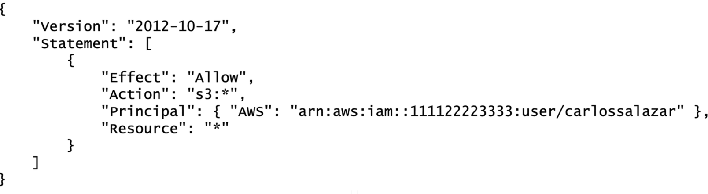
    </p>


### Who is requesting access?
A principal is a person, role, or application that can make a request for an action or operation on an AWS resource. The principal is authenticated as the AWS account root user or an IAM entity to make requests to AWS. When a call is authenticated, IAM gathers context about the principal and the call itself. The principal can be 
- AWS account 
  <p align="center">
    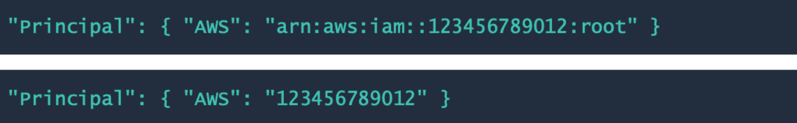
    </p>
	
- An individual IAM user (or array of users):
    <p align="center">
    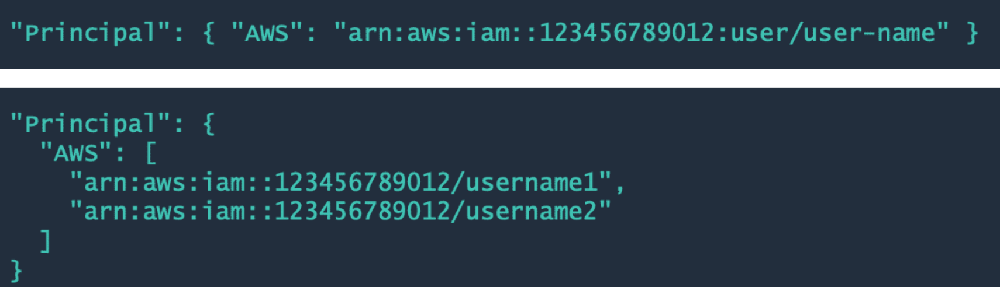
    </p>
	
	When you specify users in a Principal element, you cannot use a wildcard (*) to mean "all users." Principals must always name a specific user or users.

- Federated Users: If you already manage user identities outside AWS, you can use IAM identity providers instead of creating IAM users in your AWS account. With an identity provider (IdP), you can manage your user identities outside AWS and give these external user identities permissions to use AWS resources in your account. IAM supports SAML-based IdPs and web identity providers, such as Login with Amazon, Amazon Cognito, Facebook, or Google.  
    <p align="center">
    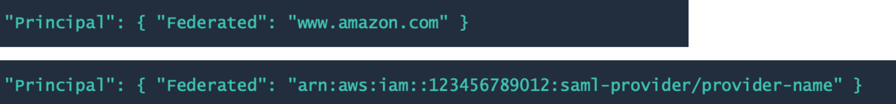
    </p>
																						

- IAM Roles: delegate access to users, applications, or services that don't normally have access to your AWS resources. 
    <p align="center">
    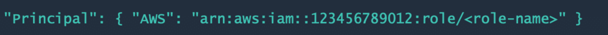
    </p>
	
- AWS Services: IAM roles that can be assumed by an AWS service are called service roles. Service roles must include a trust policy, which are resource-based policies that are attached to a role that define which principals can assume the role. Some service roles have predefined trust policies. However, in some cases, you must specify the service principal in the trust policy. A service principal is an identifier that is used to grant permissions to a service. The following example shows a policy that can be attached to a service role.
    <p align="center">
    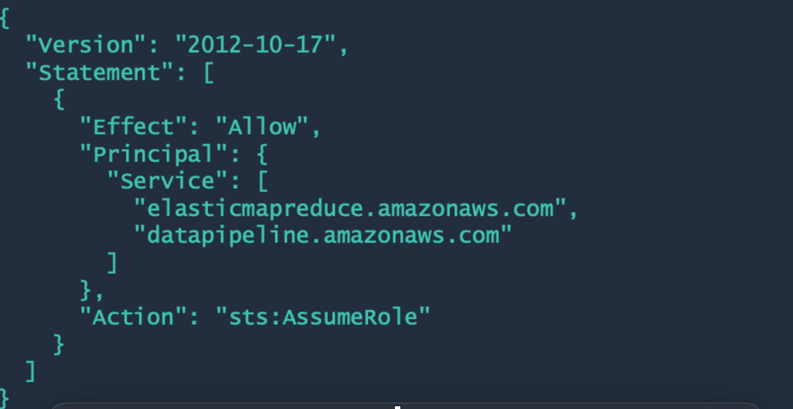
    </p>

### Passing a role to an AWS service
There are many AWS services that require permissions via a role to perform actions on your behalf. To configure these services, you need to pass the role to the service only once during setup. For example, assume that you have an application running on an Amazon EC2 instance that requires access to an Amazon DynamoDB table. The application needs temporary credentials for authentication and authorization to interact with the table. When you set up the application, you must pass a role to Amazon EC2 to use with the instance that provides those credentials. The application assumes the role every time it needs to perform the actions that the role allows. 

### Federating Users in AWS
Identity federation is a system of trust between two parties for the purpose of authenticating users and conveying information needed to authorize their access to resources. In this system, an **identity provider (IdP)** is responsible for user authentication, and a service provider, such as a service or an application, controls access to resources. 

<p align="center">
    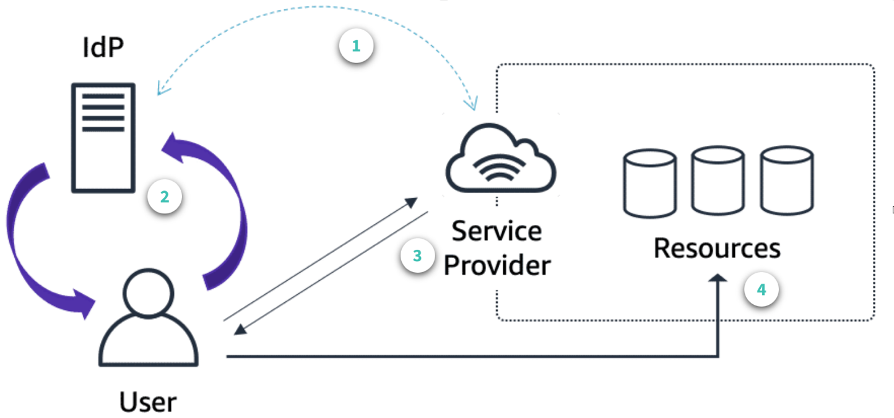
    </p>

- A trust relationship is configured between the IdP and service provider. The service provider trusts the IdP to authenticate users and relies on the information provided by IdP about the users.
- After authenticating a user, the IdP returns a message, called an assertion, containing the user’s sign-in name and other attributes that the service provider needs to establish a session with the user and to determine the scope of the resources access.
- The service provider receives the assertion from the user, validates the level of access requested and sends the user the necessary credentials to access the desired resources.
 - With the right credentials from the service provider, the user has now direct access to the requested resources via an established session.

AWS offers different solutions for federating your employees, contractors, and partners (workforce) to AWS accounts and business applications, and for adding federation support to your customer-facing web and mobile applications. AWS supports commonly used open identity standards, including **Security Assertion Markup Language 2.0 (SAML 2.0)**, **Open ID Connect (OIDC)**, and **OAuth 2.0**. AWS services that support identity federation use cases are **AWS IAM**, **AWS Cognito**, **AWS SSO (single sign-on)**.

#### Web-Based Federation

Identity federation is also available for your AWS customer-facing web and mobile applications via a web identity provider. Examples of web identity providers supported by AWS include Amazon Cognito, Login with Amazon, Facebook, Google, or any OpenID Connect-compatible identity provider.


##### The AssumeRoleWithWebIdentity request
Before your application can call `AssumeRoleWithWebIdentity`, you must have an identity token from a supported identity provider and create a role that the application can assume. The role that your application assumes must trust the identity provider that is associated with the identity token. In other words, the identity provider must be specified in the role's trust policy.

Calling `AssumeRoleWithWebIdentity` does not require the use of AWS security credentials. Therefore, you can distribute an application (for example, on mobile devices) that requests temporary security credentials without including long-term AWS credentials in the application. You also don't need to deploy server-based proxy services that use long-term AWS credentials. Instead, the identity of the caller is validated by using a token from the web identity provider. The temporary security credentials returned by this API consist of an access key ID, a secret access key, and a security token. Applications can use these temporary security credentials to sign calls to AWS service API operations.

##### Amazon Cognito for mobile applications
The preferred way to use web identity federation for mobile applications is to use Amazon Cognito. Amazon Cognito lets you add user sign-up, sign-in, and access controls to your web and mobile apps. *You can define roles and map users to different roles so that your app can access only the resources that are authorized for each user*. Amazon Cognito scales to millions of users and supports sign-in with social identity providers, such as Apple, Facebook, Google, and Amazon, and enterprise identity providers via SAML 2.0. User sign-in can also be done directly via Amazon Cognito.

The following diagram shows a simplified flow for how this might work using Login with Amazon as the IdP.

<p align="center">
    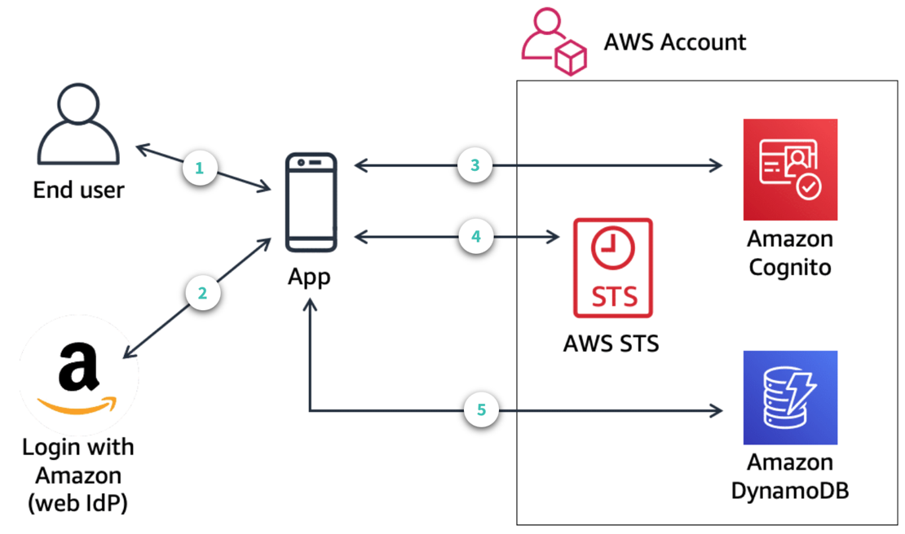
    </p>

An end user starts the app on a mobile device. The app asks user to sign in. The app uses Login with Amazon resources to accept the user’s credentials. The app uses Amazon Cognito API operations to exchange the Login with Amazon ID token for an Amazon Cognito token. The app requests temporary security credentials from AWS STS, passing the Amazon Cognito token. The app can use the temporary security credentials to access any AWS resources required by the app to operate. The role associated with the temporary security credentials and its assigned policies determine what can be accessed. 

SAML-Based Federation works similarly. Imagine that your organization actively hires developers as contractors based on the changing number of projects. These developers need access to certain AWS accounts to build applications, but you don’t want to manually provision IAM users with long-term credentials. All contractors happen to be authenticated via an on-premises SAML 2.0-based identity provider. With the identity provider configured in a trust relationship with the AWS account, the developer browses to your company’s identity provider portal and selects the option to access the AWS Management Console. The developer is then authenticated against the identity store. The identity provider returns a **SAML assertion** to the user, which includes information about the developer such as their identity and attributes that map to an IAM role. The browser then makes the `AssumeRoleWithSAML API` call to AWS STS, passing information regarding the identity provider, the role to assume, and the SAML assertion. Temporary security credentials are then returned to the developer’s browser, and the developer is redirected to the AWS Management Console.

From the user’s perspective, the process happens transparently. The developer starts at your organization's internal portal and ends up at the AWS Management Console without ever having to supply any AWS credentials. Behind the scene, the AssumeRoleWithSAML call returns a set of temporary security credentials for users who have been authenticated via a SAML authentication response. This operation provides a mechanism for tying an enterprise identity store or directory to role-based AWS access without user-specific credentials or configuration.

Before your application can call AssumeRoleWithSAML, you must configure your SAML IdP to issue the claims that AWS requires. Additionally, you must use IAM to create a SAML provider entity in your AWS account that represents your identity provider. You must also create an IAM role that specifies this SAML provider in its trust policy.

AWS SSO for User Federation
See 
https://explore.skillbuilder.aws/learn/course/104/play/60920/deep-dive-with-security-aws-identity-and-access-management-iam;lp=1044


For testing IAM policies and permission, use IAM Policy Simulator
and IAM Access Analyzer . 


## EC2 Fundamentals

Backbone compute service for AWS. It comes with various sizing and configurations such as Operating Systems (Linux, Windows, Mac OS), different compute powers and cores CPUs, Random-access memory (RAM), storage space which could be network-attached (EBS, EFS) or hardware (EC2 Instance Store), Network card (speed of the card, Public IP address), Firewall rules (Security Groups), Bootstrap script (launching command when the machine starts only once and never runs again: User Data for EC2 that runs commands as root user). 

EC2 Instance naming convention: example: m5.2xlarge . Letter m refers to instance class (compute optimized, memory optimized … ), number 5 refers to generation, 2xlarge refers to the size within the instance class. 

EC2 instances are general purpose (good balance of CPU, memory and networking), Compute Optimized from c series in names (great for compute intensive tasks requiring high performance processors such as batch processing, media transcoding, high performance web servers, HPC, scientific modeling and machine learning, dedicated gaming servers), Memory-Optimized from r series in names (high performance relational/non relational databases, distributed web cache stores, In-memory databases optimized for BI, applications performing real time processing of big unstructured data), Storage Optimized (great for storage-intensive tasks, high frequency online transaction processing OLTP systems, relational & NoSQL databases, Cache for in-memory databases, Data warehousing applications). 


### EC2 Instance Storage
#### EBS
A network drive you can attach to your instances while they run. This allows data to exist even after instances are terminated. 
- They can be mounted to one instance at a time. They can detached from an instance and attached to another one very quickly. 
- They are bound to a specific availability zone which means they can be attached in instances in the same AZ. To move volumes across AZs, you first need to snapshot it. 
 
Think of them as network USB stick. You have to provision capacity in advance.  

After you attach an Amazon EBS volume to your instance, it is exposed as a block device. You can format the volume with any file system and then mount it. After you make the EBS volume available for use, you can access it in the same ways that you access any other volume. Any data written to this file system is written to the EBS volume and is transparent to applications using the device. 

New volumes are raw block devices and do not contain any partition or file system. You need to login to the instance and then format the EBS volume with a file system, and then mount the volume for it to be usable. Volumes that have been restored from snapshots likely have a file system on them already; if you create a new file system on top of an existing file system, the operation overwrites your data. Use the `sudo file -s device` command to list down the information about your volume, such as file system type.

##### EBS Snapshots
Make a backup of your EBS volume at a point of time, its recommended to detach the volume before snapshots, can copy snapshots across AZ or regions. You can move a snapshot to an archive tier that is 75% cheaper. Takes within 24 to 72 hours for restoring the archive.

##### EBS Volume Types: 
EBS Volumes come in 6 types:
- gp2/gp3 (SSD): general purpose SSD volume that balances price and performance for a wide variety of worlds
- io1/io2 (SSD): Highest-performance SSD volume for mission-critical low-latency or high-throughput workloads
- st 1 (HDD): low cost HDD volume designed for frequently accessed, throughput-intensive workloads
- sc 1 (HDD): lowest cost HDD volume designed for less frequently accessed workloads 

##### EBS Multi-Attach - io1/io2 family
- Attach the same EBS volume to multiple EC2 instances in the same AZ
- Each instance has full read & write permissions to the high-performance volume
- Use case: 
  - Achieve higher application availability in clustered Linux application
- Applications must manage concurrent write operations
- Up to 16 EC2 Instances at a time
- Must use a file system that’s cluster-aware

#### EFS
- Amazon EFS - Elastic File System
- Managed NFSv4.1 protocol (network file system) that can be mounted on many EC2
- EFS works with EC2 instances in multi-AZ
- Highly available, scalable, expensive (3x gp2), pay per use
- Use cases: content management, web serving, data sharing, Wordpress
- Uses security group to control access to EFS
- Compatible with Linux based AMI (not Windows)
- Can enable Encryption at rest using KMS
- Scales automatically (1000+ concurrent NFS clients with 10GB+/sec throughput, grows to Petabyte-scale network file system, automatically), pay-per-use, no capacity planning!
- Performance Mode (set at EFS creation time): 
    - General Purpose: latency-sensitive use cases (web server, CMS, etc…)
    - Max I/O: high latency, throughput, highly parallel (big data, media processing)
- Throughput Mode: 
  - Bursting - 1 TB = 50MiB/s + burst of up to 100MiB/s
  - Provisioned - set your throughput up or down based on your workloads
  - Elastic - automatically scales throughput up or down on your workloads, Use this for unpredictable workloads

#### EBS vs EFS - Elastic Block Storage
EBS volumes
- One instance (except multi-attach io1/io2)
- Locked at AZ level (can only be attached to EC2s in the same AZ as EBS volume)
- To migrate EBS to another AZ, take a snapshot and restore it to the new AZ
- EBS backup use IO so you shouldn’t run it when the application is running as it will impact the performance of the application

EFS volumes
- Mounting 100s of instances across AZs
- EFS share website files (WordPress)
- Only for Linux Instances (POSIX)
- EFS has a higher price point than EBS
- Can leverage EFS-IA for cost savings


## Load Balancers
They are managed servers (autoscaling, high availability across AZs) that forward traffic to multiple downstream servers (EC2s) and it provides a single point of access (DNS) to your application, a fixed hostname (`XXX.region.elb.amazonaws.com`). It seamlessly handles the failure of the downstream instance by checking their health before sending traffic to them. It can also provide SSL/TLS termination (HTTPS) for your websites. It will cost you less to use compared to making your own. 

In terms of security, the common practise that the instances behind the load balancers only allow incoming traffic through the load balancer. This can be done by setting the security groups of instances to be the security group of the load balancer (so the source of traffic is not a IP range but it is load balancer security group). 

There are 3 types of load balancers: 
- Application Load Balancer, 
- Network Load Balancer, 
- Gateway Load Balancer.


### Application Load Balancer
The Application Load Balancer is known as a layer 7 load balancer from the Open Systems Interconnection (OSI) model. Layer 7 means that the Application Load Balancer can inspect data that is passed through it and can understand the application layer, such as HTTP and HTTPs. The Application Load Balancer can then take actions based on things in that protocol such as paths, headers, and hosts. 

Application Load Balancers can be internet-facing or internal; the difference is that internet facing Application Load Balancers will have *public IP addresses* and internal Application Load Balancers will have *private IP addresses*. Application Load Balancers are billed at an hourly rate and an additional rate based on the load placed on your load balancer. 

#### ALBs 
- Distribute traffic to multiple HTTP applications across machines (target groups)
- Distribute traffic to multiple applications on the same machines (containers)
- Support for HTTP/2 and WebSocket
- Supports redirects (from HTTP to HTTPS for ex.)
- Routing tables to different target groups
  - Routing based on path in URL (example.com/users & example.com/posts)
  - Routing based on hostname in URL (one.example.com & other.example.com)
  - Routing based on Query String, Headers (example.com/users?id=123&order=false)
- ALB are a great fit for microservices & container-based application
- Has a port mapping feature to redirect to a dynamic port in ECS
The application servers don’t see the IP of the client directly
	- The true IP of the client is inserted in the header `X-Forwarded-For`
	- We can also get Port (X-Forwarded-Port) and protocol (X-Forwarded-Proto)

#### ALB Target Groups:
- EC2 instances (can be managed by an Auto Scaling Group) – HTTP
- ECS tasks (managed by ECS itself) – HTTP
- Lambda functions – HTTP request is translated into a JSON event
- IP Addresses – must be private IPs
- ALB can route to multiple target groups (EC2s and on-premise servers for ex.)
- Health checks are at the target group level

### Network Load Balancer

Network Load Balancers (Layer 4) have advantages over Application Load Balancers because a Network Load Balancer does not need to worry about the upper layer protocol and it is much faster. Network Load Balancers are able to handle high-end workloads and can allocate static IP addresses so they are easier to integrate with security and firewall products. 

Network Load Balancers also support routing requests on multiple applications on a single Amazon EC2 instance and supports the use of containerized applications. Application Load Balancers are great for high end layer 7 protocol support, and Network Load Balancers support all other protocols and can handle millions of requests. 

Network load balancers (Layer 4) allow to:
- Forward TCP & UDP traffic to your instances
- Handle millions of request per seconds
- Less latency ~100 ms (vs 400 ms for ALB)
- NLB has one static IP per AZ, and supports assigning Elastic IP (helpful for whitelisting specific IP)
- NLB are used for extreme performance, TCP or UDP traffic

NLB Target Groups
- EC2 instances
- Private IP Addresses
-  Application Load Balancer
-  Health Checks support the TCP, HTTP and HTTPS Protocols

### Gateway Load Balancer

- Deploy, scale, and manage a fleet of 3rd party network virtual appliances in AWS
  - Example: Firewalls, Intrusion Detection and Prevention Systems, Deep Packet Inspection Systems, payload manipulation, ...
- Operates at Layer 3 (Network Layer) – IP Packets
- Combines the following functions:
	- Transparent Network Gateway – single entry/exit for all traffic
	- Load Balancer – distributes traffic to your virtual appliances
- Uses the GENEVE protocol on port 6081
- Target groups are EC2 instances and IP Addresses – must be private IPs
 
 <p align="center">
    
    </p>

### Cross-Zone Load Balancing
- Application Load Balancer
	- Enabled by default (can be disabled at the Target Group level)
	- No charges for cross AZ data through load balancer
- Network Load Balancer & Gateway Load Balancer
	- Disabled by default
	- You pay charges ($) for inter AZ data if enabled

### SSL/TLS - Basics
- SSL refers to Secure Sockets Layer, used to encrypt connections
    - An SSL Certificate allows traffic between your clients and your load balancer to be encrypted in transit (in-flight encryption)
- TLS refers to Transport Layer Security, which is an updated and more secure version of SSL. HTTPS appears in the URL when a website is secured by an SSL/TLS certificate.
- Nowadays, TLS certificates are mainly used, but people still refer as SSL
- Beyond encryption, TLS certificates also authenticate the identity of a website owner. Public SSL certificates are issued by Certificate Authorities (CA) such as Comodo, Symantec, GoDaddy, GlobalSign, Digicert, Letsencrypt, etc...
- SSL certificates have an expiration date (you set) and must be renewed

#### How SSL works (SSL handshake): 
1. **Authentication**: For every new session a user begins on your website, their browser and your server exchange and validate each other’s SSL certificates.
2. **Encryption**: Your server shares its public key with the browser, which the browser then uses to create and encrypt a pre-master key. This is called the key exchange.
3. **Decryption**: The server decrypts the pre-master key with its private key, establishing a secure, encrypted connection used for the duration of the session.

SSL/TLS is supported by all major web browsers. An SSL certificate can be supported by any server. Most cloud-based email providers use SSL encryption.

#### Load Balancer - SSL Certificates
- The load balancer uses an X.509 certificate (SSL/TLS server certificate)
- You can manage certificates using ACM (AWS Certificate Manager)
- You can create, upload your own certificates alternatively
- HTTPS listener:
	- You must specify a default certificate
	- You can add an optional list of certs to support multiple domains
	- Clients can use SNI (Server Name Indication) 	to specify the hostname they reach
	- Ability to specify a security policy to support older versions of SSL / TLS (legacy clients)

  <p align="center">
    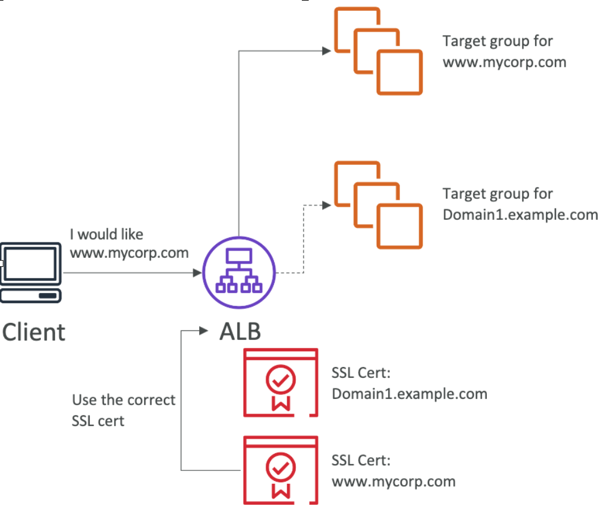
    </p>

##### SSL – Server Name Indication (SNI)
- SNI solves the problem of loading multiple SSL certificates onto one web server (to serve multiple websites)
- It’s a “newer” protocol, and requires the client to indicate the hostname of the target server in the initial SSL handshake
- The server will then find the correct certificate, or return the default one

Note: SNI only works for ALB & NLB (newer generation), CloudFront

## Auto Scaling Group (ASG)

- The load on your websites and application can change. In the cloud, you can create/remove servers very quickly
- The goal of an Auto Scaling Group (ASG) is to:
	- Scale out (add EC2 instances) to match an increased load
	- Scale in (remove EC2 instances) to match a decreased load
	- Ensure we have a minimum and a maximum number of EC2 instances running
	- Automatically register new instances to a load balancer
	- Re-create an EC2 instance in case a previous one is terminated (ex: if unhealthy)
	- ASG are free (you only pay for the underlying EC2 instances)

To create ASG, you need to create a **launch template** containing the following information and configure the rest:
  - AMI + Instance Type
  -  EC2 User Data
  -  EBS Volumes
  -  Security Groups
  -  SSH Key Pair
  -  IAM Roles for your EC2 Instances
  -  Network + Subnets Information
  -  Load Balancer Information
  -  Min Size / Max Size / Initial Capacity
  -   Scaling Policies

It is possible to scale an ASG based on CloudWatch alarms
- An alarm monitors a metric (such as Average CPU, or a custom metric)
- Metrics such as Average CPU are computed for the overall ASG instances
- Based on the alarm we can create scale-out/scale-in policies

In general, ASG has a number of ways to *scale dynamically*:
- *Target Tracking Scaling*: most simple and easy to set-up; Example: I want the average ASG CPU to stay at around 40%
- *Simple / Step Scaling*: when a CloudWatch alarm is triggered (example CPU > 70%), then add 2 units or when a CloudWatch alarm is triggered (example CPU < 30%), then remove 1
- *Scheduled Actions*: anticipate a scaling based on known usage patterns; Example: increase the min capacity to 10 at 5 pm on Fridays 
- *Predictive scaling*: continuously forecast load based on historical data and schedule scaling ahead

#### Good metrics to scale on:
- **CPU Utilization**: Average CPU utilization across your instances
- **RequestCountPerTarget**: to make sure the number of requests per EC2 instances is stable
- **Average Network In/Out** (if your application is network bound)
- **Any custom metric** (that you push using CloudWatch)

After a scaling activity happens, you are in the cooldown period (default 300 seconds). During the cooldown period, the ASG will not launch or terminate additional instances (to allow for metrics to stabilize). Advice: Use a ready-to-use AMI to reduce configuration time in order to be serving request fasters and reduce the cooldown period

## Amazon RDS

- RDS stands for Relational Database Service
- It’s a AWS managed DB service for DB use SQL as a query language.
- Includes Postgres, MySQL, MariaDB, Oracle, Microsoft SQL Server, Aurora (AWS Proprietary relational database)


### Advantage of RDS versus deploying DB on EC2
- RDS is a managed service:
	- Automated provisioning, OS patching
	- Continuous backups and restore to specific timestamp (Point in Time Restore)!
	- Monitoring dashboards
	- Read replicas for improved read performance
	- Multi AZ setup for DR (Disaster Recovery)
	- Maintenance windows for upgrades
	- Scaling capability (vertical and horizontal)
	- Storage backed by EBS (gp2 or io1)
- BUT you can’t SSH into your instances


#### RDS – Storage Auto Scaling:
- Helps you increase storage on your RDS DB instance dynamically
- When RDS detects you are running out of free database storage, it scales automatically
- Avoid manually scaling your database storage
- You have to set Maximum Storage Threshold (maximum limit for DB storage)
- Automatically modify storage if:
	- Free storage is less than 10% of allocated stora
	- Low-storage lasts at least 5 minutes
	- 6 hours have passed since last modification
- Useful for applications with unpredictable workloads
- Supports all RDS database engines


#### RDS Read Replicas for Read Scalability
- Up to 15 Read Replicas
- Within AZ, Cross AZ or Cross Region
- **Replication is ASYNC, so reads are eventually consistent**
- Replicas can be promoted to their own DB
- Applications must update the connection string to leverage read replicas
- For RDS Read Replicas within the same region, you don’t pay that fee. Cross region will have a fee for network.

##### RDS Read Replicas – Use Cases
You have a production database that is taking on normal load. You want to run a reporting application to do some analytics. You create a Read Replica to run the new workload there. The production application is unaffected.

- NOTE: Read replicas are used for SELECT (=read) only kind of statements (not INSERT, UPDATE, DELETE)

#### RDS Multi AZ (Disaster Recovery)
- Create a SYNC replication to a Standby RDS DB instance 
- One DNS name – automatic app failover to standby in case of failure of master DB
- Increases availability
- Failover in case of loss of AZ, loss of network, instance or storage failure
- No manual intervention in apps
- Not used for scaling, no-one can read or write to it

Note: A Read Replicas can be setup as Multi AZ for Disaster Recovery


#### RDS – From Single-AZ to Multi-AZ
- Zero downtime operation (no need to stop the DB)
- Just click on “modify” for the database. The following happens internally:
	- A snapshot is taken
	- A new DB is restored from the snapshot in a new AZ
	- Synchronization is established between the two databases

Snapshots: A database snapshot is a read-only, static view of a SQL Server database (the source database). The database snapshot is transactionally consistent with the source database as of the moment of the snapshot's creation. A database snapshot always resides on the same server instance as its source database

### Amazon Aurora
- Aurora is “AWS cloud optimized” and claims 5x performance improvement over MySQL on RDS, over 3x the performance of Postgres on RDS
- Aurora storage automatically grows in increments of 10GB, up to 128 TB.
- Aurora can have up to 15 replicas and the replication process is faster than MySQL (sub 10 ms replica lag)
- Failover in Aurora is instantaneous. It’s High Availability native.
- Aurora costs more than RDS (20% more) – but is more efficient
- Creates 6 copies of your data across 3 AZ:
	- 4 copies out of 6 needed for writes
	- 3 copies out of 6 need for reads
	- Self healing with peer-to-peer replication
	- Storage is striped across 100s of volumes
- One Aurora Instance takes writes (master)
- Automated failover for master in less than 30 seconds
- Master + up to 15 Aurora Read Replicas serve reads
- Support for Cross Region Replication

#### Aurora DB Cluster
- Automatic fail-over
- Backup and Recovery
- Isolation and security
- Industry compliance
- Push-button scaling
- Automated Patching with Zero Downtime
- Advanced Monitoring
- Routine Maintenance
- Backtrack: restore data at any point of time without using backups	

#### RDS & Aurora Security
- At-rest encryption:
	- Database master & replicas encryption using AWS KMS, must be defined as launch time
	- If the master is not encrypted, the read replicas cannot be encrypted
	- To encrypt an un-encrypted database, go through a DB snapshot & restore as encrypted
- In-flight encryption: TLS-ready by default, use the AWS TLS root certificates client-side
- IAM Authentication: IAM roles to connect to your database (instead of username/pw)
- Security Groups: Control Network access to your RDS / Aurora DB
- No SSH available except on RDS Custom
- Audit Logs can be enabled and sent to CloudWatch Logs for longer retention

### Amazon RDS Proxy
- Amazon RDS Proxy is a fully managed, highly available database proxy for Amazon RDS that pools and shares application database connections
- Allows apps to pool and share DB connections established with the database
- Improving database efficiency by reducing the stress on database resources (e.g., CPU, RAM) and minimize open connections (and timeouts)
- Serverless, autoscaling, highly available (multi-AZ)
- Reduced RDS & Aurora failover time by up 66%
- No code changes required for most apps
- Enforce IAM Authentication for DB, and securely store credentials in AWS Secrets Manager
- RDS Proxy is never publicly accessible (must be accessed from VPC)


### Amazon ElastiCache

<p align="center">
    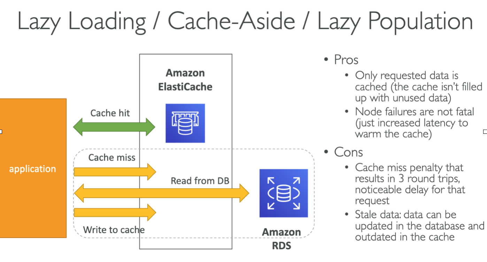
    </p>

A fully managed, in-memory data store supporting Redis, Valkey, and Memcached engines. It is used to accelerate application performance by caching database queries, session data, and user activity, offering both node-based and serverless options.

- The same way RDS is to manage Relational Databases...
- Caches are in-memory databases with really high performance, low latency
- Helps reduce load off of databases for read intensive workloads
- Helps make your application stateless
- AWS takes care of OS maintenance / patching, optimizations, setup, configuration, monitoring, failure recovery and backups

Note: *Using ElastiCache involves heavy application code changes*

  <p align="center">
    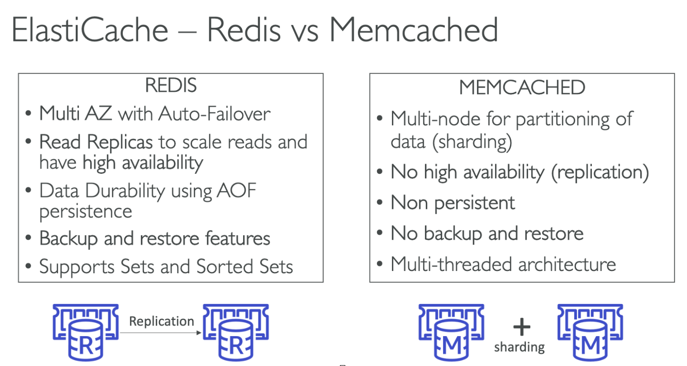
    </p>


#### ElastiCache Solution Architecture - DB Cache
- Applications queries ElastiCache, if not available, get from RDS and store in ElastiCache.
- Helps relieve load on RDS
- Cache must have an **invalidation strategy** to make sure only the most current data is used in there

- An example of use case: 
  - User login session: User logs into the application. The application writes the session data into ElastiCache. The user hits another instance of our application. The instance retrieves the data from ElastiCashe and the user is already logged in!

    <p align="center">
    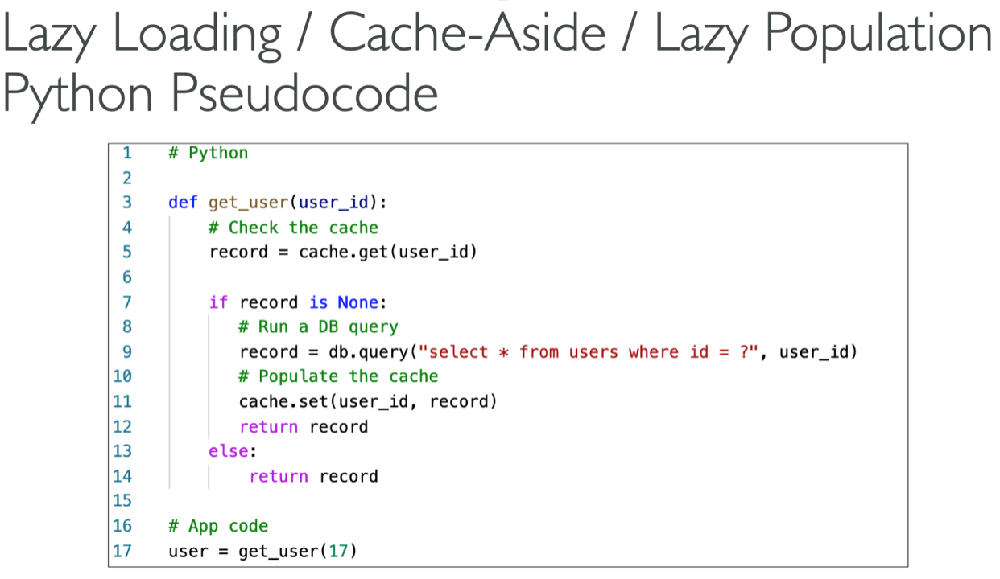
    </p>

To reduce cache data stale, we can implement **write through** strategy, that is to write to cache when writing to DB. This way, data stays fresh in cache but more write quota needed. 
<p align="center">
    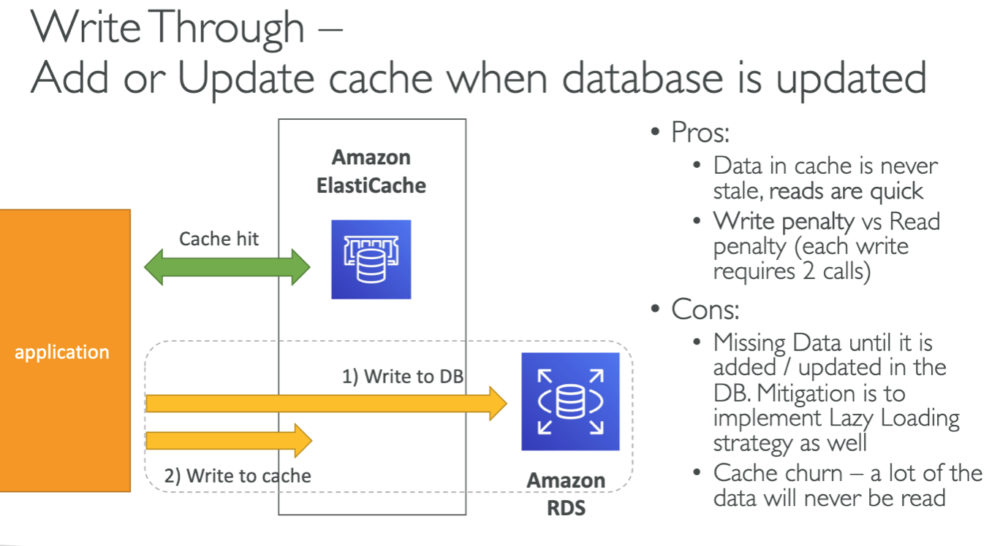
    </p>

##### Cache Evictions and Time-to-live (TTL)
- Cache eviction can occur in three ways:
	- You delete the item explicitly in the cache
	- Item is evicted because the memory is full and it’s not recently used (LRU)
	- You set an item time-to-live (or TTL)
- TTL are helpful for any kind of data:
	- Leaderboards
	- Comments
	- Activity streams
- TTL can range from few seconds to hours or days
- If too many evictions happen due to memory, you should scale up or out

#### Amazon MemoryDB for Redis
- Redis-compatible, durable, in-memory database service
- Ultra-fast performance with over 160 millions requests/second
- Durable in-memory data storage with Multi-AZ transactional log
- Scale seamlessly from 10s GBs to 100s TBs of storage
- Use cases: web and mobile apps, online gaming, media streaming

## Route 53
What is DNS?
- Domain Name System is a globally distributed service which translates the human friendly hostnames to ip addresses and vice versa; It also maps names to names into the machine numerical IP addresses
- www.google.com => 172.217.18.36
- DNS is the backbone of the Internet. DNS uses hierarchical naming structure called domain namespace; Different levels of hierarchy are separated by dots; Domain names are interpreted from right to left! From root (‘.’  are omitted in practice but inserted by the applications automatically before performing DNS resolution) to **top-level domains (TLD)** to second-level domain to subdomain. 
  
  <p align="center">
    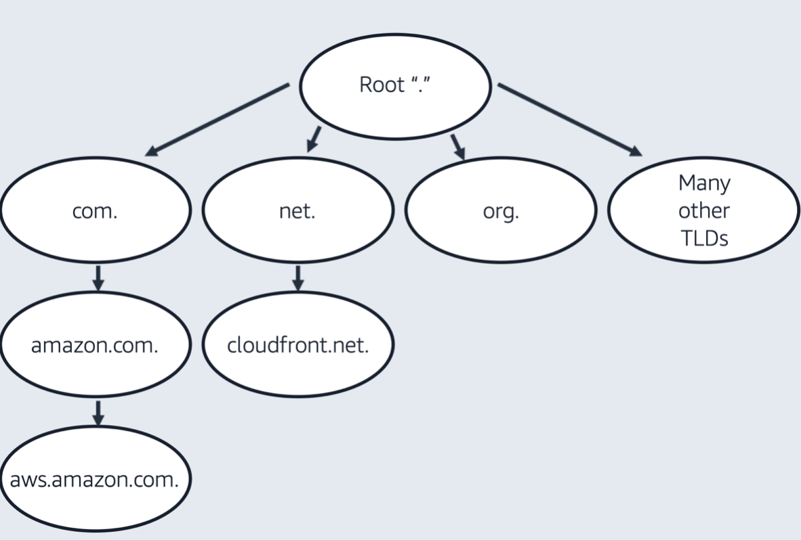
    </p>
  
    There can be any number of subdomains under the second-level domain such as www., aws. For example, `aws.amazon.com` is a **subdomain** of `amazon.com`. Essentially, all domains are subdomains of their parent domains. For example, `.com` is a subdomain of the root. A **fully qualified domain name** is the one that represents its exact location in the tree hierarchy; it specifies all domain levels. 

- Domain Registrar: Amazon Route 53, GoDaddy, …
- DNS Records: A, AAAA, CNAME, NS, …
- Zone File: contains DNS records
- Name Server: resolves DNS queries (Authoritative or Non-Authoritative)
- Top Level Domain (TLD): .com, .us, .in, .gov, .org, …
- Second Level Domain (SLD): amazon.com, google.com, …
  
  <p align="center">
    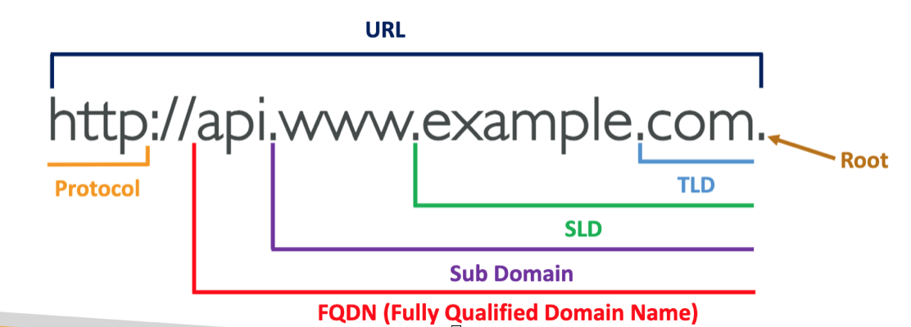
    </p>

How DNS Works? Recursive name server (resolvers) extract information from name servers in response to client requests by traversing DNS hierarchy to provide full resolution. They cache the results based on the records time to live TTL. 										

<p align="center">
    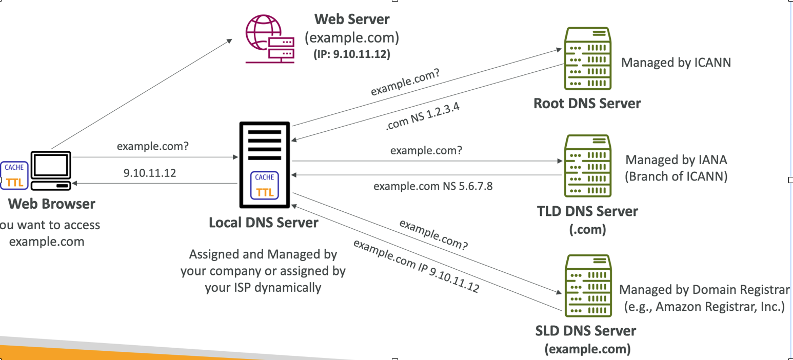
    </p>

The user browse example.com on the web. This request is sent to local DNS sever first to find the corresponding IP address. If founding in its cache, it is return to the client and the client will talk to that IP address after. Otherwise, the DNS server first sends the request to Root DNS server and it will get back a identifier for .com. After DNS server talks to TLD DNS server to search for example.com in .com range. After directing to SLD DNS server, the IP address of example.com will be sent to the DNS server and DNS server will cache this information (for some duration TTL) for later use and will send the client the IP address. 

##### Amazon Route 53
- A highly available, scalable, fully managed and Authoritative DNS
- Authoritative = the customer (you) can update the DNS records
- Route 53 is also a Domain Registrar
- Ability to check the health of your resources
- The only AWS service which provides 100% availability SLA
- Why Route 53? 53 is a reference to the traditional DNS port


##### Route 53 – Records
- Route 53 supports the following DNS record types:
	- (must know) A / AAAA / CNAME / NS
	- (advanced) CAA / DS / MX / NAPTR / PTR / SOA / TXT / SPF / SRV
- Each record contains:
	- Domain/subdomain Name – e.g., example.com
	- Record Type – e.g., A or AAAA
		- A – maps a hostname to IPv4
		- AAAA – maps a hostname to IPv6
		- CNAME – maps a hostname to another hostname. A CNAME (Canonical Name) record is a DNS record type that maps an alias domain name (e.g., blog.example.com) to a target domain name (e.g., elb-123.us-east-1.elb.amazonaws.com) which must have an A or AAAA record
    		-  It directs traffic to another hostname, which is useful for routing, but cannot be used for root domains (apex) and cannot coexist with other records for the same name. 
    		-  Use cases: Redirecting traffic from custom subdomains to AWS resource URLs (e.g., Load Balancers).
			- Example:
                - Alias: `www.example.com`
                - Canonical Name (Target): `example.com`
                - Result: `www.example.com` directs to the same place as `example.com`. 
    	- NS: NS – domain name of a name server for the Hosted Zone. Example: example.com. NS ns-2048.awsdns.com
- Control how traffic is routed for a domain
	- Value/ record data – e.g., 12.34.56.78
	- Routing Policy – how Route 53 responds to queries
	- TTL – amount of time the record cached at DNS Resolvers
    - Type: A, AAAA …


##### Route 53 – Hosted Zones
- Public Hosted Zones – contains records that specify how to route traffic on the Internet (public domain names) application1.mypublicdomain.com. Anybody from internet can query your record.
- Private Hosted Zones – contain records that specify how you route traffic within one or more VPCs (private domain names) application1.company.internal. Only resources inside a VPC can query the records.
- You pay $0.50 per month per hosted zone
  
  <p align="center">
    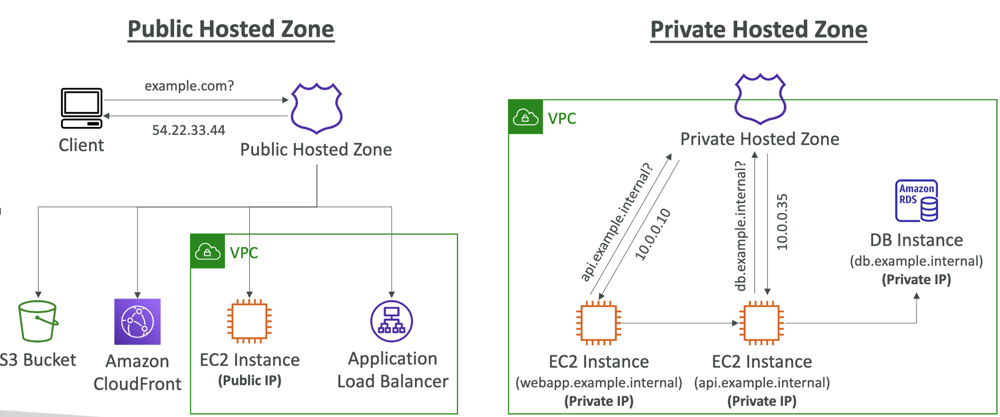
    </p>

##### Route 53 – Records TTL (Time To Live)
Will ask the client to cache the record for the duration of TTL to prevent extra load on Route 53. So the client will not issue a new query to Route 53 if TTL still valid assuming the information do not change often. 
- High TTL – e.g., 24 hr
	- Pro: Less traffic on Route 53
	- Con: Possibly outdated records
- Low TTL – e.g., 60 sec.
	- More traffic on Route 53 ($$)
	- Records are less outdated
	- Easy to change records

Except for Alias records, TTL is mandatory for each DNS record

#### CNAME vs Alias
AWS Resources (Load Balancer, CloudFront...) expose an AWS hostname:
`lb1-1234.us-east-2.elb.amazonaws.com` and you want `myapp.mydomain.com`

- CNAME: Points a hostname to any other hostname. (app.mydomain.com => blabla.anything.com)
	- ONLY FOR NON ROOT DOMAIN (aka. something.mydomain.com)

- Alias: Points a hostname to an AWS Resource (app.mydomain.com => blabla.amazonaws.com). This extends DNS functionality.
	- Works for ROOT DOMAIN and NON ROOT DOMAIN (aka mydomain.com)
	- Automatically recognizes changes in the resource’s IP addresses
	- Unlike CNAME, it can be used for the top node of a DNS namespace (Zone Apex), e.g.: example.com
	- Alias Record is always of type A/AAAA for AWS resources (IPv4 / IPv6)
	- You can’t set the TTL
	- Free of charge
	- Native health check

##### Route 53 – Alias Records Targets
- Load Balancers
- CloudFront Distributions
- API Gateway
- Elastic Beanstalk environments
- S3 Websites
- VPC Interface Endpoints
- Global Accelerator
  - Route 53 record in the same hosted zone
  - You cannot set an Alias record for an EC2 DNS name


##### Route 53 – Routing Policies
- Define how Route 53 responds to DNS queries. This trrafic goes through DNS server
- Don’t get confused by the word “Routing”. It’s not the same as Load Balancer routing which routes the traffic not through DNS 
- Route 53 supports the following Routing Policies:
	-  Simple: routes traffic to a single resource; can specify multiple values in 				the same record in which case multiple values are returned to the client and a 			random one is chosen by the client. When Alias	enabled, specify only one AWS 			resource. Can’t be associated with Health Checks.
	- Weighted: Control the % of the requests that go to 					each specific resource. DNS records must 	have the same 			name and type. Can be associated with Health Checks. Use 			cases: load balancing between regions, testing new 				application versions (Assign a weight of 0 to a record to stop 			sending traffic to a resource)
	- Latency based: Redirect to the resource that has the least 			latency close to us. Super helpful when latency for users is a 			priority. Latency is based on traffic between users and AWS 			Regions. Germany users may be directed to the US (if that’s 
the lowest latency). Can be associated with Health Checks (has a failover capability). Say we deploy our application in 2 parts of the world, one in us-east-1 and ap-southeast-1. Latency is evaluated by Route 53 and users will be directed to destinations with least latency.
	-  Geolocation
	-  Multi-Value Answer
	- Geoproximity (using Route 53 Traffic Flow feature)


##### Routing Policies – Geolocation
- Different from Latency-based!
-  This routing is based on user location
-  Specify location by Continent, Country or by US State (if there’s overlapping, most precise location selected)
-  Should create a “Default” record (in case there’s no match on location)
- Use cases: website localization, restrict content distribution, load balancing,
- Can be associated with Health Checks

##### Routing Policies – Geoproximity
- Route traffic to your resources based on a defined geographic location of users and resources
- Ability to shift more traffic to resources based on the defined bias
- To change the size of the geographic region, specify bias values:
	- To expand (1 to 99) – more traffic to the resource
	- To shrink (-1 to -99) – less traffic to the resource
- Resources can be:
	- AWS resources (specify AWS region)
	- Non-AWS resources (specify Latitude and Longitude)


##### Routing Policies – IP-based Routing
- Routing is based on clients’ IP addresses
- You provide a list of CIDRs for your clients and the corresponding endpoints/locations (user-IP-to-endpoint mappings)
- Use cases: Optimize performance, reduce network costs…
- Example: route end users from a particular ISP to a specific endpoint


##### Routing Policies – Multi-Value
- Use when routing traffic to multiple resources
- Route 53 return multiple values/resources
- Can be associated with Health Checks (return only values for healthy resources)
- Up to 8 healthy records are returned for each Multi-Value query
- Multi-Value is not a substitute for having an ELB

  <p align="center">
    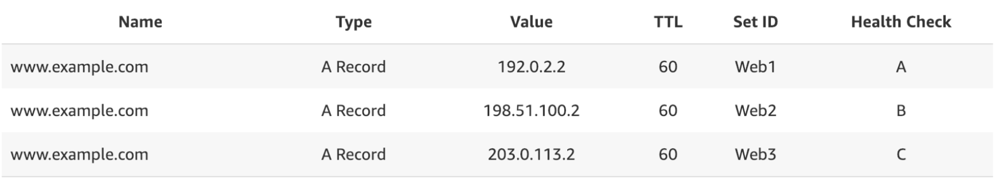
    </p>

#### Domain Registar vs. DNS Service
-  You buy or register your domain name with a Domain Registrar typically by paying annual charges (e.g., GoDaddy, Amazon Registrar Inc., …)
- The Domain Registrar usually provides you with a DNS service to manage your DNS records
- But you can use another DNS service to manage your DNS records
Example: purchase the domain from GoDaddy and use Route 53 to manage your DNS records
- If you buy your domain on a 3rd party registrar, you can still use Route 53 as the DNS Service provider
  - Create a Hosted Zone in Route 53
  - Update NS Records on 3rd party website to use Route 53 Name Servers
- Domain Registrar != DNS Service
- But every Domain Registrar usually comes with some DNS feature

`dig` is a command line utility that is useful in troubleshooting many common DNS resolution issues. 


## VPC

- VPC: private network to deploy your resources (regional resource)
- Subnets allow you to partition your network inside your VPC (Availability Zone resource)
- A public subnet is a subnet that is accessible from the internet
- A private subnet is a subnet that is not accessible from the internet
   <p align="center">
    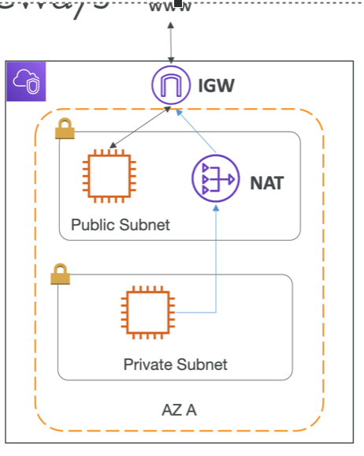
    </p>
- To define access to the internet and between subnets, we use **Route Tables** 
- Internet Gateways helps our VPC instances connect with the internet. Public Subnets have a route to the internet gateway.
- NAT Gateways (AWS-managed) & NAT Instances (self-managed) allow your instances in your Private Subnets to access the internet while remaining private

##### NACL (Network ACL)
- A firewall which controls traffic from and to subnet. Default NACL allows anything in&out
- Can have ALLOW and DENY rules
- Are attached at the Subnet level
- Rules only include IP addresses

#####  Security Groups
- A firewall that controls traffic to and from an ENI(elastic network interface) / an EC2 Instance
- Can have only ALLOW rules
- Rules include IP addresses and other security
<p align="center">
    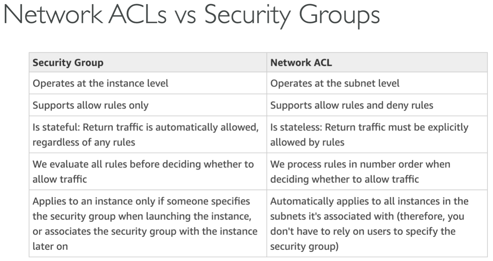
    </p>

##### VPC Flow Logs
- Capture information about IP traffic going into your interfaces:
	- VPC Flow Logs
	- Subnet Flow Logs
	- Elastic Network Interface Flow Logs
- Helps to monitor & troubleshoot connectivity issues. Example:
	- Subnets to internet
	- Subnets to subnets
	- Internet to subnets
- Captures network information from AWS managed interfaces too: Elastic Load Balancers, ElastiCache, RDS, Aurora, etc…
- VPC Flow logs data can go to S3, CloudWatch Logs, and Kinesis Data Firehose  


#### VPC Endpoints
- VPC Endpoints allow you to connect to AWS resources within VPC through a private network not the public network
- This gives you enhanced security and lower latency to access AWS services
- VPC Endpoint Gateway: S3 & DynamoDB
- VPC Endpoint Interface: the rest
- Only used within your VPC
- Site to Site VPN
	- Connect an on-premise VPN to AWS
	- The connection is automatically encrypted
	- Goes over the public internet
  <p align="center">
    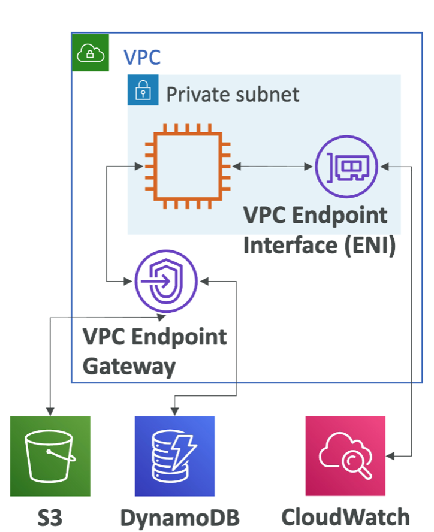
    </p>

#####  Direct Connect (DX)
- Establish a physical connection between on-premises and AWS
- The connection is private, secure and fast
- Goes over a private network
- Takes at least a month to establish

  <p align="center">
    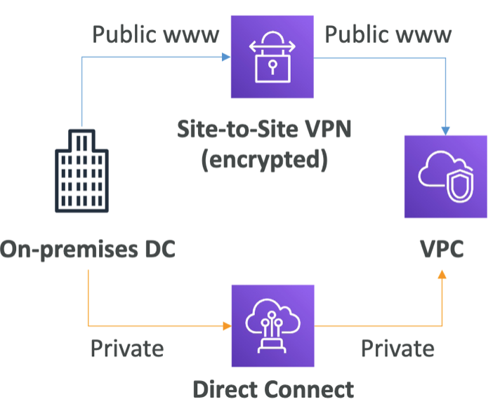
    </p>

    As an example of an application and network architecture, see the following:

     <p align="center">
    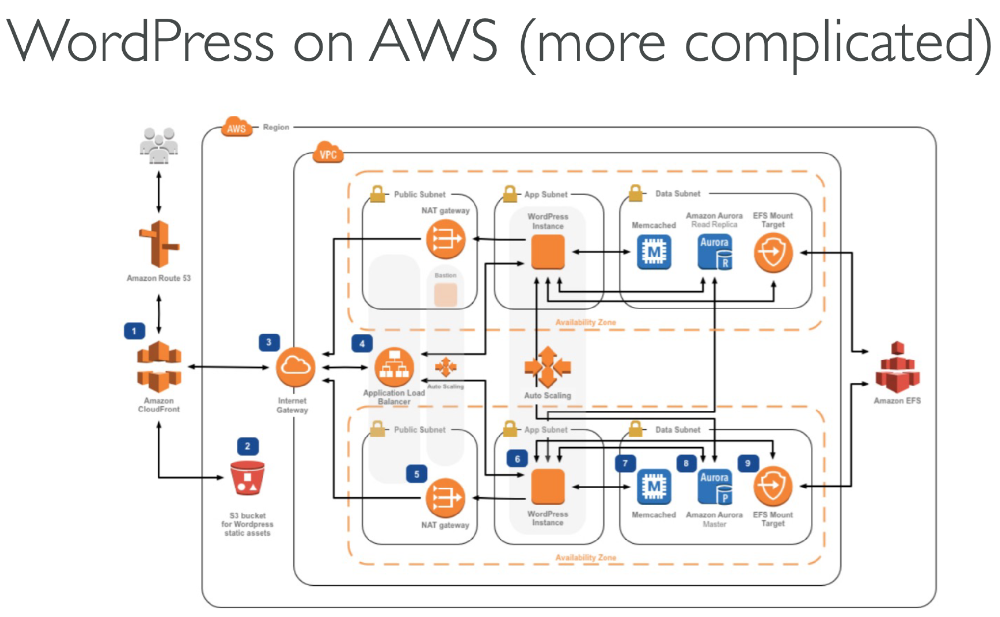
    </p>


## Amazon S3
Amazon S3 is one of the main building blocks of AWS. It’s advertised as ”infinitely scaling” storage. Many websites use Amazon S3 as a backbone. Many AWS services use Amazon S3 as an integration as well. We’ll have a step-by-step approach to S3. 
- Backup and storage
- Disaster Recovery
- Archive
- Hybrid Cloud Storage
- Application hosting
- Media hosting
- Data lakes & big data analytics
- Software delivery
- Static website

#### Amazon S3 - Objects
- Objects (files) have a Key
- The key is the FULL path:
	- s3://my-bucket/my_file.txt
	- s3://my-bucket/my_folder1/another_folder/my_file.txt
- The key is composed of **prefix + object name**
	- s3://my-bucket/my_folder1/another_folder/my_file.txt
- There’s no concept of “directories” within buckets (although the UI will trick you to think otherwise)
- Just keys with very long names that contain slashes (“/”)

#### Amazon S3 - Buckets
- Amazon S3 allows people to store objects (files) in “buckets” (directories)
- Buckets must have a globally unique name (across all regions all accounts)
- S3 looks like a global service but buckets are created and defined in a region
- S3 Bucket Policies : JSON based policies

#### Amazon S3 – Security
- Identity-Based
	- IAM Policies – which API calls should be allowed for a specific identity
- Resource-Based
	- Bucket Policies – bucket wide rules from the S3 console - allows cross account
	- Object Access Control List (ACL) – finer grain (can be disabled)
	- Bucket Access Control List (ACL) – less common (can be disabled)
Encryption: encrypt objects in Amazon S3 using encryption keys


#### Amazon S3 – Static Website Hosting
- S3 can host static websites and have them accessible on the Internet
- The website URL will be (depending on the region)
	- http://bucket-name.s3-website-aws-region.amazonaws.com
	OR
	- http://bucket-name.s3-website.aws-region.amazonaws.com
- If you get a 403 Forbidden error, make sure the bucket policy allows public reads!

#### Amazon S3 – Replication (CRR & SRR)
- Must enable Versioning in source and destination buckets
- Cross-Region Replication (CRR)
- Same-Region Replication (SRR)
- Buckets can be in different AWS accounts
- Copying is asynchronous
- Must give proper IAM permissions to S3
- Use cases:
	- CRR – compliance, lower latency access, replication across accounts
	- SRR – log aggregation, live replication between production and test accounts
- After you enable Replication, only new objects are replicated
- Optionally, you can replicate existing objects using S3 Batch Replication
- Replicates existing objects and objects that failed replication
- For DELETE operations:
    - Can replicate delete markers from source to target (optional setting). Deletions with a version ID are not replicated (to avoid malicious deletes)
    - There is no “chaining” of replication. If bucket 1 has replication into bucket 2, which has replication into bucket 3, then objects created in bucket 1 are not replicated to bucket 3

#### S3 Storage Classes
- Amazon S3 Standard - General Purpose
	- 99.99% Availability
	- Used for frequently accessed data
	- Low latency and high throughput
	- Sustain 2 concurrent facility failures
	- Use Cases: Big Data analytics, mobile & gaming applications, content distribution
- Amazon S3 Standard-Infrequent Access (IA)
    - For data that is less frequently accessed, but requires rapid access when needed
	- Lower cost than S3 Standard
	- Amazon S3 Standard-Infrequent Access (S3 Standard-IA)
	- 99.9% Availability
	- Use cases: Disaster Recovery, backups
- Amazon S3 One Zone-Infrequent Access (S3 One Zone-IA)
	- High durability (99.999999999%) in a single AZ; data lost when AZ is destroyed
	- 99.5% Availability
	- Use Cases: Storing secondary backup copies of on-premises data, or dat you 			can recreate
- Amazon S3 Glacier Instant Retrieval
	- Millisecond retrieval, great for data accessed once a quarter
	- Minimum storage duration of 90 days
- Amazon S3 Glacier Flexible Retrieval
	- Expedited (1 to 5 minutes), Standard (3 to 5 hours), Bulk (5 to 12 hours) – free
	- Minimum storage duration of 90 days
- Amazon S3 Glacier Deep Archive
	- Standard (12 hours), Bulk (48 hours)
	- Minimum storage duration of 180 days
- Amazon S3 Intelligent Tiering
- Can move between classes manually or using S3 Lifecycle configurations

#### Amazon S3 – Moving between Storage Classes
- You can transition objects between storage classes
- For infrequently accessed object, move them to Standard IA
- For archive objects that you don’t need fast access to, move them to Glacier or Glacier Deep Archive
- Moving objects can be automated using a Lifecycle Rules

    <p align="center">
    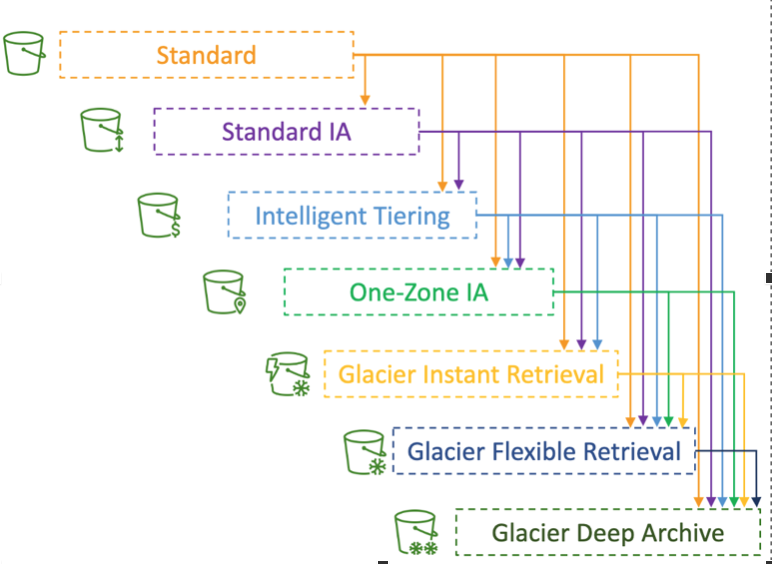
    </p>

#### Amazon S3 – Lifecycle Rules
- Transition Actions – configure objects to transition to another storage class
	- Move objects to Standard IA class 60 days after creation
	- Move to Glacier for archiving after 6 months
- Expiration actions – configure objects to expire (delete) after some time
	- Access log files can be set to delete after a 365 days
	- Can be used to delete old versions of files (if versioning is enabled)
	- Can be used to delete incomplete Multi-Part uploads
- Rules can be created for a certain prefix (example: s3://mybucket/mp3/*)
- Rules can be created for certain objects Tags (example: Department: Finance)

#### Amazon S3 – Lifecycle Rules (Scenario 1)
Your application on EC2 creates images thumbnails after profile photos are uploaded to Amazon S3. These thumbnails can be easily recreated, and only need to be kept for 60 days. The source images should be able to be immediately retrieved for these 60 days, and afterwards, the user can wait up to 6 hours. How would you design this?

- S3 source images can be on Standard, with a lifecycle configuration to transition them to Glacier after 60 days
- S3 thumbnails can be on One-Zone IA, with a lifecycle configuration to expire them (delete them) after 60 days

#### Amazon S3 – Lifecycle Rules (Scenario 2)
A rule in your company states that you should be able to recover your deleted S3 objects immediately for 30 days, although this may happen rarely. After this time, and for up to 365 days, deleted objects should be recoverable within 48 hours.

- Enable S3 Versioning in order to have object versions, so that “deleted objects” are in fact hidden by a “delete marker” and can be recovered
- Transition the “noncurrent versions” of the object to Standard IA
- Transition afterwards the “noncurrent versions” to Glacier Deep Archive


#### Amazon S3 Analytics – Storage Class Analysis
- Help you decide when to transition objects to the right storage class
- Recommendations for Standard and Standard IA
- Does NOT work for One-Zone IA or Glacier
- Report is updated daily
- 24 to 48 hours to start seeing data analysis
- Good first step to put together Lifecycle Rules (or improve them)!

#### S3 Event Notifications
- Events such as: S3:ObjectCreated, S3:ObjectRemoved, S3:ObjectRestore, S3:Replication, Object name filtering possible (*.jpg)
- IAM resource policy needed to be attached to target resources
- Use case: generate thumbnails of images uploaded to S3
- Can create as many “S3 events” as desired 
- S3 event notifications typically deliver events in seconds but can sometimes take a minute or longer

  <p align="center">
    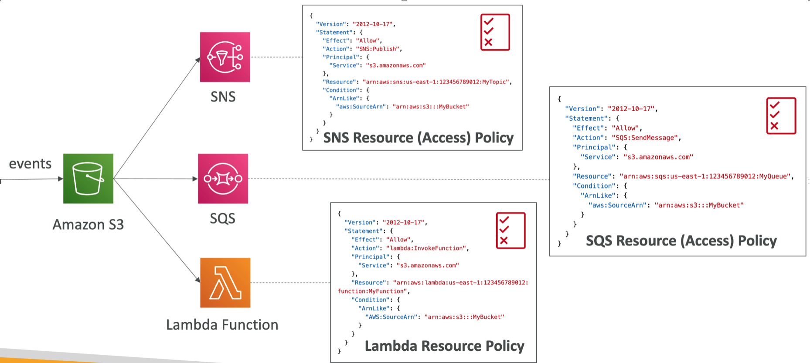
    </p>


#### S3 Event Notifications with Amazon EventBridge
In general, all events go through Amazon EventBridge which has powerful features to design complicated events for delivery to over 18 AWS services
- Advanced filtering options with JSON rules (metadata, object size, name...)
- Multiple Destinations – ex Step Functions, Kinesis Streams / Firehose…
- EventBridge Capabilities – Archive, Replay Events, Reliable delivery

#### S3 Performance: how to improve upload performance 
- Multi-Part upload:
	- recommended for files > 100MB, must use for files > 5GB
	- Can help parallelize uploads (speed up transfers)
- S3 Transfer Acceleration
	- Increase transfer speed by transferring file to an AWS edge location which will forward the data to the S3 bucket in the target region and minimizes exposure to public internet
	- Compatible with multi-part upload

S3 Performance – How to get object, S3 Byte-Range Fetches
- Parallelize GETs by requesting specific byte ranges
- Better resilience in case of failures

#### S3 Select & Glacier Select
- Retrieve less data using SQL by performing server-side filtering
- Can filter by rows & columns (simple SQL statements)
- Less network transfer, less CPU cost client-side

#### S3 User-Defined Object Metadata & S3 Object Tags
- S3 User-Defined Object Metadata
	- When uploading an object, you can also assign metadata
	- Name-value (key-value) pairs
	- User-defined metadata names must begin with "x-amz-meta-”
	- Amazon S3 stores user-defined metadata keys in lowercase
	- Metadata can be retrieved while retrieving the object
- S3 Object Tags
	- Key-value pairs for objects in Amazon S3
	- Useful for fine-grained permissions (only access specific objects with specific tags)
	- Useful for analytics purposes (using S3 Analytics to group by tags)
- You cannot search the object metadata or object tags
- Instead, you must use an external DB as a search index such as DynamoDB

### Amazon S3 Security
#### Amazon S3 – Object Encryption
You can encrypt objects in S3 buckets using the following methods:
- Server-Side Encryption (SSE)
	- Amazon S3-Managed Keys (SSE-S3) – Enabled by Default
    	-  Encrypts S3 objects using keys handled, managed, and owned by AWS
	- Encryption with KMS Keys stored in AWS KMS (SSE-KMS)
		- Leverage AWS Key Management Service (AWS KMS) to manage encryption keys
	-  Encryption with Customer-Provided Keys (SSE-C)
		- When you want to manage your own encryption keys
- Client-Side Encryption

##### Amazon S3 Encryption – SSE-S3
Encryption using keys handled, managed, and owned by AWS (you dont have access to this key). Object is encrypted server-side with Encryption type is AES-256.
- Must set header `"x-amz-server-side-encryption": “AES256"`
- Enabled by default for new buckets & new objects

##### Amazon S3 Encryption – SSE-KMS
Encryption using keys handled and managed by AWS KMS (Key Management Service). You have more control to handle the keys.
- KMS advantages: user control + audit key usage using CloudTrail
- Must set header `"x-amz-server-side-encryption": "aws:kms"`

###### SSE-KMS Limitation
If you use SSE-KMS, you may be impacted by the KMS limits. When you upload, it calls the GenerateDataKey KMS API. When you download, it calls the Decrypt KMS API. Count towards the KMS quota per second (5500, 10000, 30000 req/s based on region). You can request a quota increase using the Service Quotas Console. 

##### Amazon S3 Encryption – SSE-C
- Server-Side Encryption using keys fully managed by the customer outside of AWS
- Amazon S3 does NOT store the encryption key you provide
- HTTPS must be used. Encryption key must be provided in HTTP headers, for every HTTP request made
  <p align="center">
    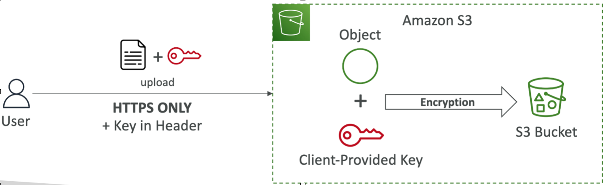
    </p>
- When you retrieve an object, you must provide the same encryption key as part of your request. Amazon S3 first verifies that the encryption key that you provided matches, and then it decrypts the object before returning the object data to you.

##### Amazon S3 Encryption – Client-Side Encryption
- Use client libraries such as Amazon S3 Client-Side Encryption Library
- Clients must encrypt data themselves before sending to Amazon S3
- Clients must decrypt data themselves when retrieving from Amazon S3
- Customer fully manages the keys and encryption cycle

##### Amazon S3 – Encryption in transit (SSL/TLS)
- Encryption in flight is also called SSL/TLS
- Amazon S3 exposes two endpoints:
  -  HTTPS Endpoint – encryption in flight - RECOMMENDED
  -  HTTP Endpoint – non encrypted - NOT RECOMMENDED	
- HTTPS is mandatory for SSE-C

Most clients would use the HTTPS endpoint by default

##### Amazon S3 – Default Encryption vs. Bucket Policies
- SSE-S3 encryption is automatically applied to new objects stored in S3 bucket
- Optionally, you can “force encryption” using a bucket policy and refuse any API call to PUT an S3 object without encryption headers (SSE-KMS or SSE-C)
    <p align="center">
    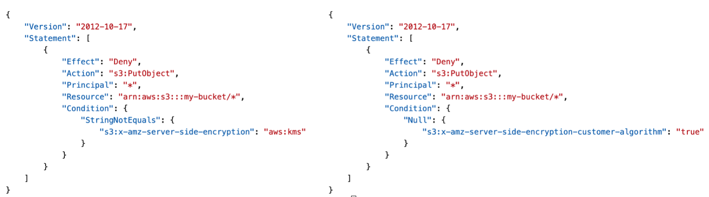
    </p>

##### What is CORS?
- Stands for Cross-Origin Resource Sharing (CORS)
- Origin = scheme (protocol) + host (domain) + port
	- example: `https://www.example.com` (implied port is 443 for HTTPS, 80 for HTTP)
-  Web Browser based mechanism to allow requests to other origins while visiting the main origin
   - Same origin: `http://example.com/app1` & `http://example.com/app2`
   - Different origins: `http://www.example.com` & `http://other.example.com`
- The requests won’t be fulfilled unless the other origin allows for the requests, using CORS Headers (example: Access-Control-Allow-Origin)

##### Amazon S3 – CORS 
For websites hosted on S3, remember that S3 needs permission to allow cross connection between websites if requested from inside of one to another. For example, if a client makes a cross-origin request on our S3 bucket, we need to enable the correct CORS headers. This could happen when a client browses a website stored on S3 which requires to grab some content (some images for example) from another S3 bucket with different origin. 

You can allow CORS for a specific origin or for * (all origins). 

<p align="center">
    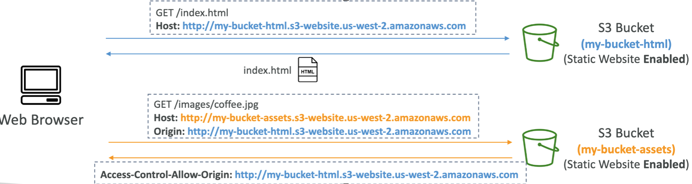
    </p>

##### S3 Access Logs
For audit purpose, you may want to log all access to S3 buckets. Any request made to S3, from any account, authorized or denied, will be logged into another S3 bucket. That data can be analyzed using data analysis tools.  The target logging bucket must be in the same AWS region.

Warning
- Do not set your logging bucket to be the monitored bucket. It will create a logging loop, and your bucket will grow exponentially

##### Amazon S3 – Pre-Signed URLs

- Generate pre-signed URLs using the S3 Console, AWS CLI or SDK with expiration from 1 min up to 720 mins (12 hours)
- AWS CLI – configure expiration with `--expires-in` parameter in seconds
(default 3600 secs, max. 604800 secs ~ 168 hours)
- Users given a pre-signed URL inherit the permissions of the user
that generated the URL for GET / PUT
- Examples:
	- Allow only logged-in users to download a premium video from your S3 bucket
	- Allow an ever-changing list of users to download files by generating URLs dynamically
	- Allow temporarily a user to upload a file to a precise location in your S3 bucket

 ##### S3 – Access Points
Access Points simplify security management for S3 Buckets when a bucket contains data that should be accessed by specific groups only
- Each Access Point has:
	- its own DNS name (Internet Origin or VPC Origin)
	- an access point policy (similar to bucket policy) – manage security at scale

##### S3 – Access Points – VPC Origin
- We can define the access point to be accessible only from within the VPC
- You must create a VPC Endpoint to access the Access Point (Gateway or Interface Endpoint)
- The VPC Endpoint Policy must allow access to the target bucket and Access Point

##### S3 – Access Points – Lambda
- Use AWS Lambda Functions to change the objects in a S3 bucket before it is retrieved by the caller application
- Only one S3 bucket is needed, on top of which we create S3 Access Point and S3 Object Lambda Access Points.
- Use Cases: Redacting personally identifiable information for analytics or non- production environments, Converting across data formats, such as converting XML to JSON, Resizing and watermarking images on the fly using caller-specific details, such as the user who requested the object.

  <p align="center">
    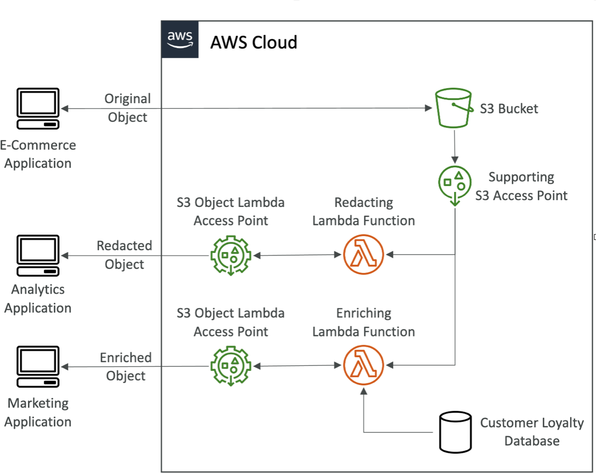
    </p>

## CloudFront
#### Amazon CloudFront
- Content Delivery Network (CDN) with a caching mechanism
- Improves read performance (users experience), content is cached at an edge location
- 216 Point of Presence globally (edge locations)
- DDoS protection (because worldwide), integration with Shield, AWS Web Application Firewall

  <p align="center">
    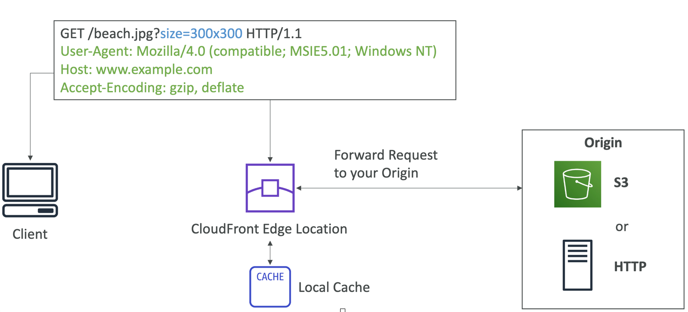
    </p>

### CloudFront – Origins
- S3 bucket
	- For distributing files and caching them at the edge
	- Enhanced security with CloudFront Origin Access Control (OAC)
	- OAC is replacing Origin Access Identity (OAI)
	- CloudFront can be used as an ingress (to upload files to S3)
- Custom Origin (HTTP)
  - Any HTTP backend you want:
	- Application Load Balancer
	- EC2 instance
	- S3 website (must first enable the bucket as a static S3 website)
	- API Gateway

#### CloudFront vs S3 Cross Region Replication
- CloudFront:
	- Global Edge network
	- Files are cached for a TTL (maybe a day)
	- Great for static content that must be available everywhere
- S3 Cross Region Replication:
	- Must be setup for each region you want replication to happen
	- Files are updated in near real-time
	- Read only
	- Great for dynamic content that needs to be available at low-latency in few regions

#### CloudFront Caching
- The cache lives at each CloudFront Edge Location. CloudFront identifies each object in the cache using a unique identifier call the Cache Key which by default, consists of hostname + resource portion of the URL. 
- If you have an application that serves up content that varies based on user, device, language, location. You can add other elements (HTTP headers, cookies, query strings) to the Cache Key using CloudFront Cache Policies
- You want to maximize the Cache Hit ratio to minimize requests to the origin
- You can invalidate part of the cache using the `CreateInvalidation API`

##### CloudFront Policies – Cache Policy
 - Cache based on:
	- HTTP Headers: None – Whitelist
	- Cookies: None – Whitelist – Include All-Except – All
	- Query Strings: None – Whitelist – Include All-Except – All
- Control the TTL (0 seconds to 1 year), can be set by the origin using the Cache-Control header, Expires header…
- Create your own policy or use Predefined Managed Policies
- All HTTP headers, cookies, and query strings that you include in the Cache Key are automatically included in origin requests

##### CloudFront Caching – Cache Policy HTTP Headers
- None:
	- Don’t include any headers in the Cache Key (except default)
	- Headers are not forwarded (except default)
	- Best caching performance
- Whitelist:
	- only specified headers included in the Cache Key
	- Specified headers are also forwarded to Origin

##### CloudFront Policies – Origin Request Policy
- Specify values that you want to include in origin requests without including them in the Cache Key (no duplicated cached content)
- You can include:
	- HTTP headers: None – Whitelist – All viewer headers options
	- Cookies: None – Whitelist – All
	- Query Strings: None – Whitelist – All
- Ability to add CloudFront HTTP headers and Custom Headers to an origin request that were not included in the viewer request
- Create your own policy or use Predefined Managed Policies

##### CloudFront – Cache Invalidations
In case you update the back-end origin, CloudFront doesn’t know about it and will only get the refreshed content after the TTL has expired. However, you can force an entire or partial cache refresh (thus bypassing the TTL) by performing a CloudFront Invalidation. This action cleans all the cache so when new requisition comes in, CloudFront request a new version.
- You can invalidate all files (*) or a special path (/images/*)


##### CloudFront – Cache Behaviors
- Configure different settings for a given URL path pattern. Example: one specific cache behavior for images/*.jpg files on your origin web server
- Route to different kind of origins/origin groups based on the content type or path pattern 
Ex. For /images/* go to S3, for /api/* go to my origin,  or for /* got to my default origin (called default cache behavior)
- When adding additional Cache Behaviors, the Default Cache Behavior is always the last to be processed and is always /*

As another use case we can control how to get access to S3 bucket for user that are properly signed in. We can define a cache behaviour for /login so the users hiding /login will be redirected to our EC2 instance which generates signed cookies to be sent back to users to sign in to default /* which redirects the user to the default origin S3 bucket

  <p align="center">
    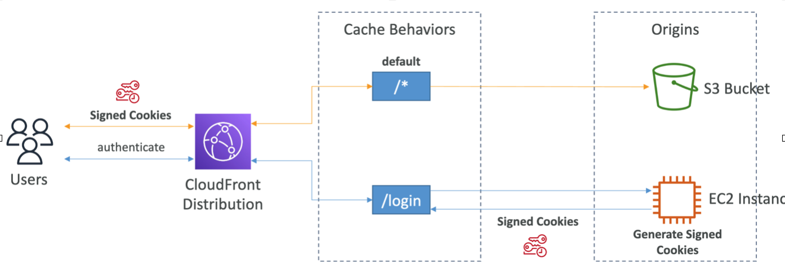
    </p>


Another use case is to maximize cache hits by separating static and dynamic distributions. Static requests may go to S3 where we do not have any cash policy/header or session. For dynamic that used a REST API or HTTP server that uses ALB and EC2, you may want to cache based on correct headers and cookies based on cache policy.

  <p align="center">
    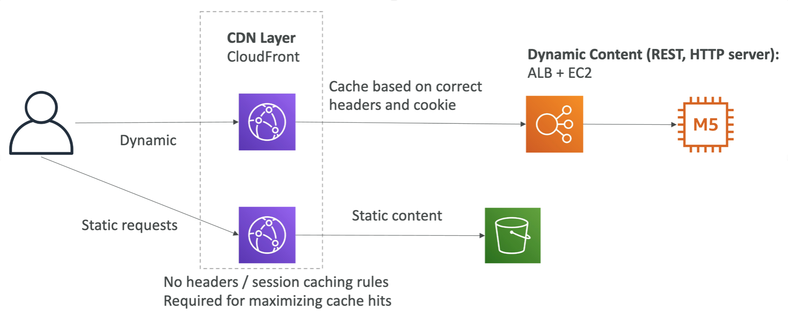
    </p>


##### CloudFront Geo Restriction
- You can restrict who can access your distribution
	- Allowlist: Allow your users to access your content only if they're in one of the countries on a list of approved countries.
	- Blocklist: Prevent your users from accessing your content if they're in one of the countries on a list of banned countries.
  - The “country” is determined using a 3rd party Geo-IP database
- Use case: Copyright Laws to control access to content

##### CloudFront Signed URL / Signed Cookies
- You want to distribute paid shared content to premium users over the world
- We can use CloudFront Signed URL / Cookie. We attach a policy with:
  - Includes URL expiration
  - Includes IP ranges to access the data from
- Trusted signers (which AWS accounts can create signed URLs)
- How long should the URL be valid for?
- Shared content (movie, music): make it short (a few minutes)
- Private content (private to the user): you can make it last for years
- Signed URL = access to individual files (one signed URL per file)
- Signed Cookies = access to multiple files (one signed cookie for many files)

##### CloudFront Signed URL vs S3 Pre-Signed URL
CloudFront Signed URL:
- Allow access to a path, no matter the origin
- Account wide key-pair, only the root can manage it
- Can filter by IP, path, date, expiration
- Can leverage caching features

S3 Pre-Signed URL:
- Issue a request as the person who pre-signed the URL 
- Uses the IAM key of the signing
- IAM principal
- Limited lifetime

##### CloudFront Signed URL Process
- Two types of signers:
	- Either a trusted key group (recommended)
		- Can leverage APIs to create and rotate keys (and IAM for API security)
	- An AWS Account that contains a CloudFront Key Pair
		- Need to manage keys using the root account and the AWS console
		- Not recommended because you shouldn’t use the root account for this
- In your CloudFront distribution, create one or more trusted key groups
- You generate your own public / private key
	- The private key is used by your applications (e.g. EC2) to sign URLs
	- The public key (uploaded) is used by CloudFront to verify URLs

##### CloudFront – Price Classes
- You can reduce the number of edge locations for cost reduction
- Three price classes:
	1. Price Class All: all regions – best performance
	2. Price Class 200: most regions, but excludes the most expensive regions
	3. Price Class 100: only the least expensive regions

#### CloudFront – Multiple Origin
- To route to different kind of origins based on the content type
- Based on path pattern:
	- /images/*
	- /api/*
	- /*

##### CloudFront – Origin Groups
- To increase high-availability and do failover
- Origin Group: one primary and one secondary origin
- If the primary origin fails, the second one is used

 <p align="center">
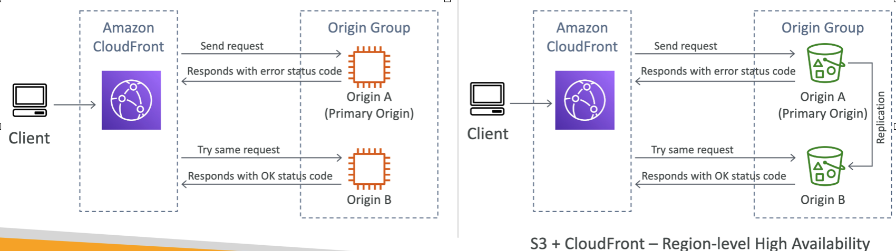
</p>

##### CloudFront – Field Level Encryption
- Protect user sensitive information through application stack
- Adds an additional layer of security along with HTTPS
- Sensitive information encrypted at the edge close to user
- Uses asymmetric encryption
- Usage:
	- Specify set of fields in POST requests that you want to be encrypted (up to 10 fields)
	- Specify the public key to encrypt them


## Developing on AWS
#### EC2 Instance Metadata (IMDS)
- AWS EC2 Instance Metadata (IMDS) is powerful. It allows AWS EC2 instances to ”learn about themselves” without using an IAM Role for that purpose.
- The URL for accessing IMDSv1 is http://169.254.169.254/latest/meta-data
- IMDSv2 is more secure and is done in two steps:
    1. Get Session Token (limited validity) – using headers & PUT
    2. Use Session Token in IMDSv2 calls – using headers
- You can retrieve the IAM Role name from the metadata, but you CANNOT retrieve the IAM Policy
- Metadata = Info about the EC2 instance including IAM Role name
- Userdata = launch script of the EC2 instance

##### MFA with CLI
- To use MFA with the CLI, you must create a temporary session
- To do so, you must run the STS GetSessionToken API call
    ```sh
	aws sts get-session-token --serial-number arn-of-the-mfa-device —token-code code-from-token --duration-seconds 3600
    ```

##### AWS Limits (Quotas)
- API Rate Limits
	- `DescribeInstances API` for EC2 has a limit of 100 calls per seconds
	- GetObject on S3 has a limit of 5500 GET per second per prefix
	- For Intermittent Errors: implement Exponential Backoff
	- For Consistent Errors: request an API throttling limit increase
- Service Quotas (Service Limits)
	- Running On-Demand Standard Instances: 1152 vCPU
	- You can request a service limit increase by opening a ticket
	- You can request a service quota increase by using the Service Quotas API

##### Exponential Backoff (any AWS service)
- If you get ThrottlingException intermittently, use exponential backoff
- Retry mechanism already included in AWS SDK API calls
- Must implement yourself if using the AWS API as-is or in specific cases
- Must only implement the retries on 5 hundreds server errors and throttling
- Do not implement on the 4 hundreds client errors

##### AWS CLI Credentials Provider Chain
The CLI will look for credentials in this order
1. Command line options – -`-region`, `--output`, and `--profile`
2. Environment variables – `AWS_ACCESS_KEY_ID`, `AWS_SECRET_ACCESS_KEY`,
and `AWS_SESSION_TOKEN`
3. CLI credentials file –aws configure `~/.aws/credentials` on Linux / Mac & `C:\Users\user\.aws\credentials` on Windows
4. CLI configuration file – aws configure
`~/.aws/config` on Linux / macOS & `C:\Users\USERNAME\.aws\config` on Windows
5. Container credentials – for ECS tasks
6. Instance profile credentials – for EC2 Instance Profiles

##### AWS SDK Default Credentials Provider Chain
The Java SDK (example) will look for credentials in this order
1. Java system properties – `aws.accessKeyId` and `aws.secretKey`
2. Environment variables – `AWS_ACCESS_KEY_ID` and `AWS_SECRET_ACCESS_KEY`
3. The default credential profiles file – ex at: `~/.aws/credentials`, shared by many SDK
4. Amazon ECS container credentials – for ECS containers
5. Instance profile credentials– used on EC2 instances

##### AWS Credentials Best Practices
- Overall, NEVER EVER STORE AWS CREDENTIALS IN YOUR CODE
- Best practice is for credentials to be inherited from the credentials chain
- If using working within AWS, use IAM Roles
    - => EC2 Instances Roles for EC2 Instances
    - => ECS Roles for ECS tasks
    - => Lambda Roles for Lambda functions
- If working outside of AWS, use environment variables / named profiles


## Amazon ECS/EKS
### Containers: Docker
Docker is a set of platform as a service (PaaS) products that use OS-level virtualization to deliver software in packages called **containers**. The software that hosts the containers is called **Docker Engine**. Docker is a tool that is used to automate the deployment of applications in lightweight containers so that applications can work efficiently in different environments in isolation including any Linux, Windows, or macOS computer. This enables the application to run in a variety of locations, such as on-premises, in public (see decentralized computing, distributed computing, and cloud computing) or private cloud. Docker on macOS uses a Linux virtual machine to run the containers. Because Docker containers are lightweight, a single server or virtual machine can run several containers simultaneously. Docker implements a high-level API to provide lightweight containers that run processes in isolation. 

When running on Linux, Docker uses the resource isolation features of the Linux kernel (such as *cgroups* and *kernel namespaces*) and a union-capable file system (such as OverlayFS) to allow containers to run within a single Linux instance, avoiding the overhead of starting and maintaining virtual machines. The Linux kernel's support for namespaces mostly isolates an application's view of the operating environment, including process trees, network, user IDs and mounted file systems, while the kernel's cgroups provide resource limiting for memory and CPU. 

**Docker Compose** is a tool for defining and running multi-container Docker applications. It uses YAML files to configure the application's services and performs the creation and start-up process of all the containers with a single command. **Docker Volume** facilitates the independent persistence of data, allowing data to remain even after the container is deleted or re-created. Docker containers run on any machine with no compatibility issues, Predictable behavior, Less work. Easier to maintain and deploy, Works with any language, any OS, any technology. 

Use cases: 
- microservices architecture, 
- lift-and-shift apps from on-premises to the AWS cloud

#### Docker vs. Virtual Machines
- Docker is ”sort of ” a virtualization technology, but not exactly
- Resources are shared with the host => many containers on one server

<p align="center">
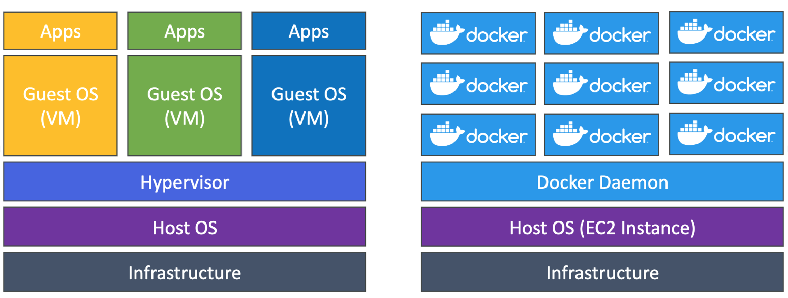
</p>

### AWS ECS
Amazon Elastic Container Service (ECS) is a proprietary, AWS-native container orchestration service designed specifically for the AWS ecosystem. It functions as a managed, high-performance service that allows you to run and scale Docker-based containerized applications without needing to manage a Kubernetes control plane. 

Here are the key details regarding ECS as a "proprietary Kubernetes-like" service:
- **Proprietary Nature**: Unlike Kubernetes, which is open-source, ECS is developed, owned, and maintained by Amazon. It is designed to work exclusively within the AWS environment (though ECS Anywhere allows for on-premises use).
- **Deep Integration**: Because it is native to AWS, ECS integrates seamlessly with other AWS services, such as Application Load Balancers (ALB), IAM for security, and CloudWatch for monitoring.
- **Managed Control Plane**: A major difference from traditional Kubernetes is that with ECS, you do not manage a "master node" or control plane. AWS handles the backend infrastructure, simplifying the operation compared to managing your own Kubernetes cluster.
- **Conceptual Parallels**: While not Kubernetes, ECS uses similar concepts:
  - **ECS Task**: Similar to a Kubernetes Pod.
  - **ECS Service**: Similar to a Kubernetes Deployment.


#### Amazon ECS - EC2 Launch Type
- You must provision & maintain the infrastructure (the EC2 instances). Each EC2 Instance must run the **ECS Agent** to register in the ECS Cluster
- AWS takes care of starting / stopping containers (ECS Tasks) on ECS Clusters

#### Amazon ECS – Fargate Launch Type
- Launch Docker containers on AWS without needing to provision the infrastructure (no EC2 instances to manage). It’s all Serverless!
- Create **task definitions** and AWS just runs ECS Tasks for you based on the CPU / RAM you need. To scale, it just increases the number of containers and instances

#### Amazon ECS – Task Definitions
Task definitions are metadata in JSON form to tell ECS how to run a Docker container. It contains crucial information, such as:
- Image Name
- Port Binding for Container and Host
- Memory and CPU required
- Environment variables
- Networking information
- IAM Role
- Logging configuration (ex CloudWatch)
- Can define up to 10 containers in a Task Definition

#### Amazon ECS – Load Balancer Integrations
Application Load Balancer supported and works for most use cases. Network Load Balancer recommended only for high throughput / high performance use cases, or to pair it with AWS Private Link


##### Amazon ECS – Load Balancing (EC2 Launch Type)
We get a Dynamic Host Port Mapping if you define only the container port in the task definition. ALB finds the right port on your EC2 Instances
You must allow on the EC2 instance’s Security Group any port from the ALB’s Security Group

<p align="center">
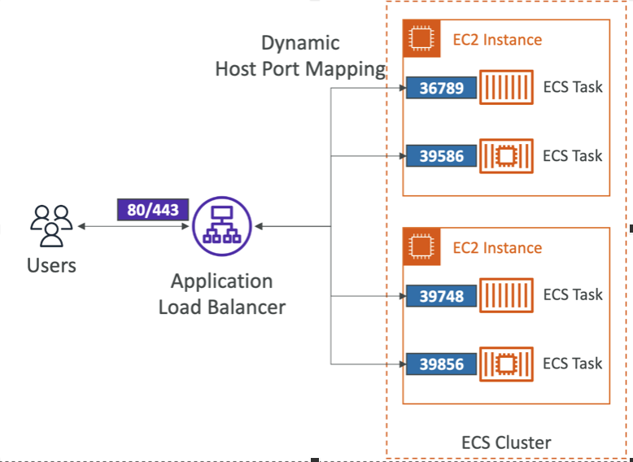
</p>

##### Amazon ECS – Load Balancing (Fargate)
Each task has a unique private IP. Only define the container port (host port is not applicable)
- Example
	- ECS ENI Security Group
		- Allow port 80 from the ALB
	- ALB Security Group
		- Allow port 80/443 from web

<p align="center">
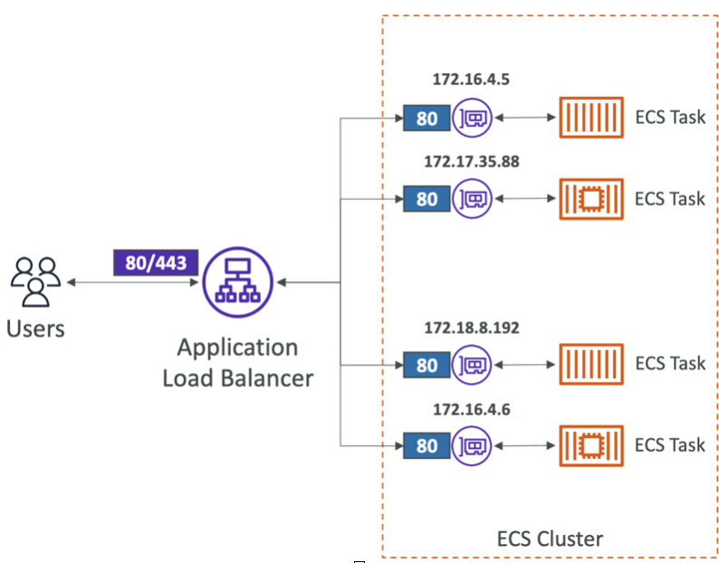
</p>

##### Amazon ECS – Environment Variables
- Environment Variable
	- Hardcoded – e.g., URLs
	- SSM Parameter Store – sensitive variables (e.g., API keys, shared configs)
	- Secrets Manager – sensitive variables (e.g., DB passwords)
- Environment Files (bulk) – Amazon S3

#### Amazon ECS – Data Volumes (EFS)
- Mount EFS file systems onto ECS tasks. Works for both EC2 and Fargate launch types. Tasks running in any AZ will share the same data in the EFS file system
- Fargate + EFS = Serverless
- Use cases: persistent multi-AZ shared storage for your containers
- Amazon S3 cannot be mounted as a file system

#### ECS Service Auto Scaling
- Automatically increase/decrease the desired number of ECS tasks
- Amazon ECS Auto Scaling uses AWS Application Auto Scaling
	- ECS Service Average CPU Utilization
	- ECS Service Average Memory Utilization - Scale on RAM
	- ALB Request Count Per Target – metric coming from the ALB
- Target Tracking Scaling – scale based on target value for a specific - CloudWatch metric
- Step Scaling – scale based on the size of CloudWatch Alarm breach
- Scheduled Scaling – scale based on a specified date/time (predictable changes)
- ECS Service Auto Scaling (task level) ≠ EC2 Auto Scaling (EC2 instance level)
- Fargate Auto Scaling is much easier to setup (because Serverless)

#### EC2 Launch Type – Auto Scaling EC2 Instances
- Accommodate ECS Service Scaling by adding underlying EC2 Instances
- Auto Scaling Group Scaling
	- Scale your ASG based on CPU Utilization
- ECS Cluster Capacity Provider
	- Used to automatically provision and scale the infrastructure for your ECS Tasks
	- Capacity Provider paired with an Auto Scaling Group
	- Add EC2 Instances when you’re missing capacity (CPU, RAM…)

#### ECS Rolling Updates
When updating from v1 to v2, we can control how many tasks can be started and stopped and in which order by adjusting Minimum/Maximum healthy percent. For example:
- ECS Rolling Update – Min 50%, Max 100%
- ECS Rolling Update – Min 100%, Max 150%
  <p align="center">
  
  </p>

#### ECS tasks invoked by Event Bridge
EX.: Run an ECS task on an object in S3 once uploaded

 <p align="center">
  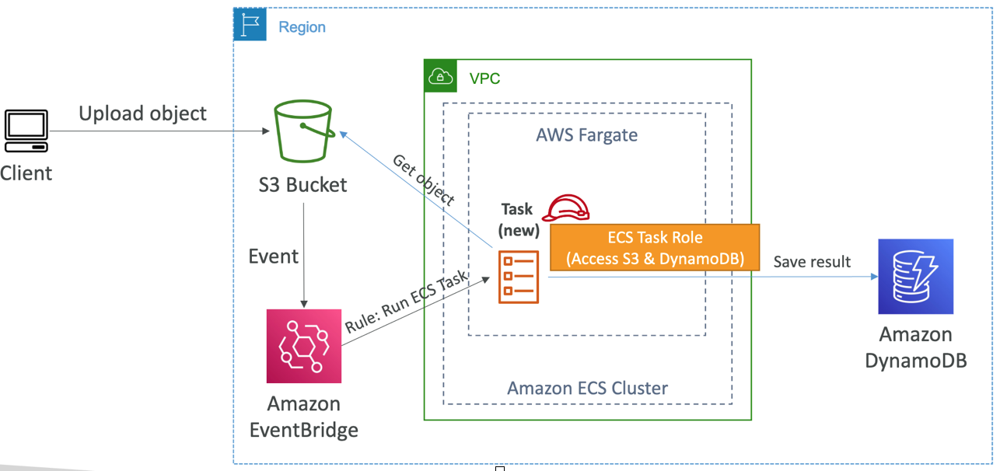
  </p>

Or ECS tasks is invoked by Event Bridge **by schedule**, EX.: Run an ECS task every one hour. Or ECS – SQS Queue Example

 <p align="center">
  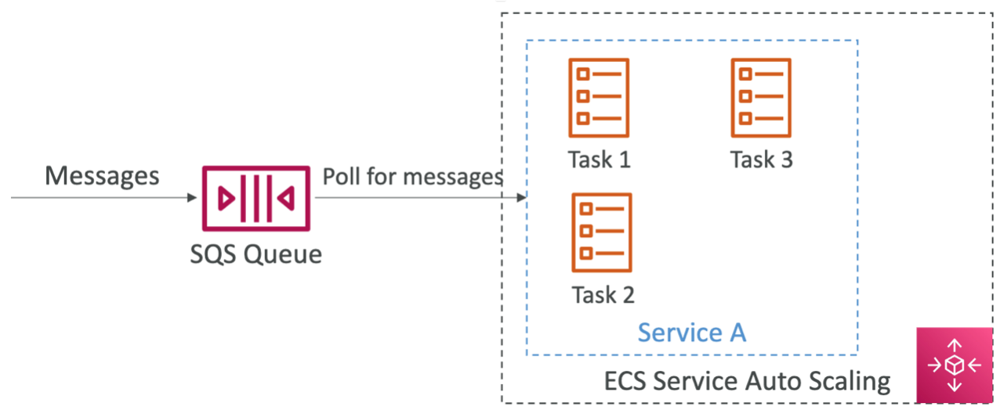
  </p>

  Or Intercept Stopped Tasks using EventBridge

<p align="center">
  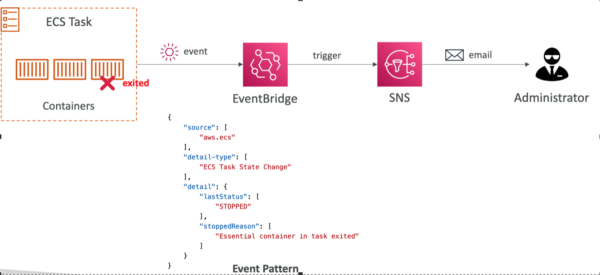
  </p>

### Amazon EKS Overview
- Amazon EKS = Amazon Elastic Kubernetes Service
- It is a way to launch managed Kubernetes clusters on AWS
- Kubernetes is an open-source system for automatic deployment, scaling and management of containerized application
- EKS supports EC2 if you want to deploy worker nodes or Fargate to deploy serverless containers
- Use case: if your company is already using Kubernetes on-premises or in
another cloud, and wants to migrate to AWS using Kubernetes
- Kubernetes is cloud-agnostic (can be used in any cloud – Azure, GCP…)
- For multiple regions, deploy one EKS cluster per region
- Collect logs and metrics using CloudWatch Container Insights

#### Amazon EKS – Node Types
- **Managed Node Groups**
	- Creates and manages Nodes (EC2 instances) for you. Nodes are part of an ASG managed by EKS
	- Supports On-Demand or Spot Instances
- **Self-Managed Nodes**
	- Nodes created by you and registered to the EKS cluster and managed by an ASG
	- You can use prebuilt AMI - Amazon EKS Optimized AMI
	- Supports On-Demand or Spot Instances

  <p align="center">
  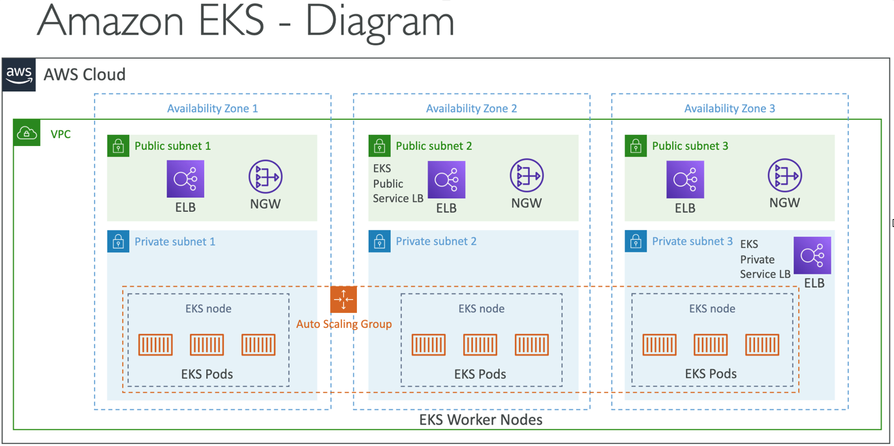
</p>

#### Amazon EKS – Data Volumes
- Need to specify StorageClass manifest on your EKS cluster
- Leverages a Container Storage Interface (CSI) compliant driver
- Support for Amazon EBS, Amazon EFS (works with Fargate), Amazon FSx for Lustre, Amazon FSx for NetApp ONTAP

## AWS Elastic Beanstalk

Elastic Beanstalk is a developer centric view of deploying an application on AWS. It uses all the component’s we’ve seen before: EC2, ASG, ELB, RDS.
- Managed service
- Automatically handles capacity provisioning, load balancing, scaling, application health monitoring, instance configuration, …
- Just the application code is the responsibility of the developer
- We still have full control over the configuration
- Beanstalk is free but you pay for the underlying instances
- You can create multiple environments (dev, test, prod, …) or create versions for your application which gives more control on staging and deploying
- Deployment mode has two options: single instance which is great for dev, high availability with load balancer which is great for production


#### Beanstalk Deployment Options for Updates
- **All at once** (deploy all in one go): fastest, but instances aren’t available to serve traffic for a bit (downtime) until new version becomes ready, no additional cost, great for quick iterations in dev env

- **Rolling**: similar to min 50%, max 100%. update a few instances at a time (bucket), and then move onto the next bucket once the first bucket is healthy, no downtime, running both versions simultaneously 

- **Rolling with additional batches**: similar to min 100%, max 150%. like rolling, but spins up new instances to move the batch (so that the old application is still available). Good for prod

- **Immutable**: spins up new instances in a new ASG, deploys version to these instances, and then swaps all the instances when everything is healthy
   <p align="center">
  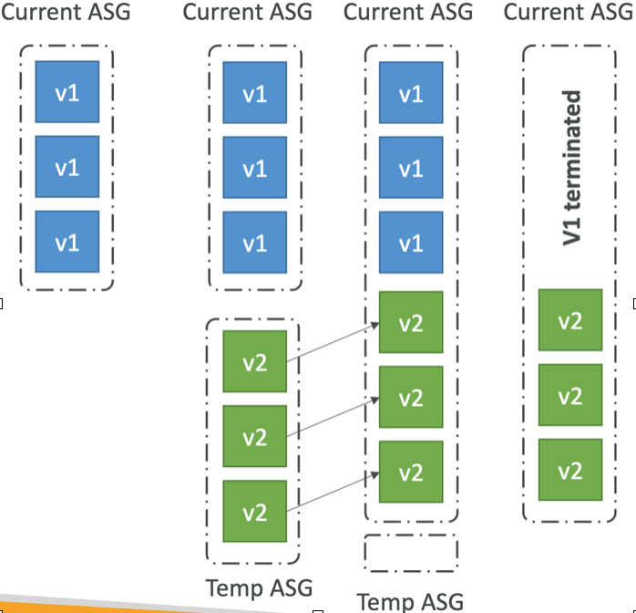
</p>
- **Blue Green**: creates a new environment (runs independently of your production database) and switch over when ready. Not a “direct feature” of Elastic Beanstalk, Zero downtime and release facility. Create a new “stage” environment and deploy v2 there
	- The new environment (green) can be validated independently 		and roll back if issues occur
	- Route 53 can be setup using weighted policies to redirect a 		little bit of traffic to the stage environment
	- Using Beanstalk, “swap URLs” when done with the environment test. Elastic Beanstalk swaps the CNAME records of the old and new environments, redirecting traffic from the old version to the new version.
    
<p align="center">
  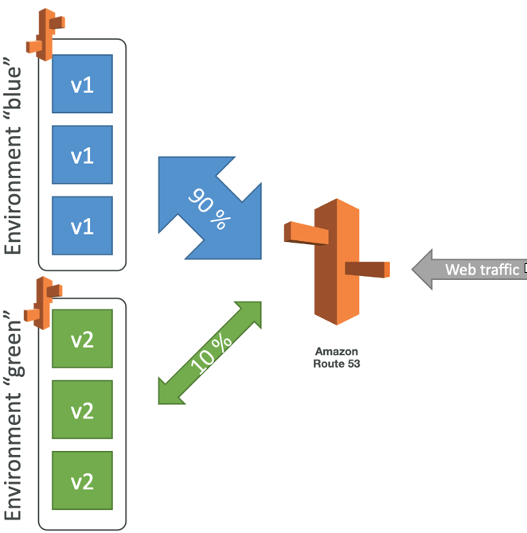
</p>

- **Traffic Splitting**: canary testing – send a small % of traffic to new deployment. New application version is deployed to a temporary ASG with the same capacity. A small % of traffic is sent to the temporary ASG for a configurable amount of time. Deployment health is monitored. If there’s a deployment failure, this triggers an automated rollback (very quick). No application downtime. New instances are migrated from the temporary to the original ASG. Old application version is then terminated.


We can install an additional CLI called the “EB cli” which makes working with Beanstalk from the CLI easier. To deploy an app, first describe dependencies (requirements.txt for Python, package.json for Node.js), then package code as zip, and describe dependencies (Python: requirements.txt, Node.js: package.json), create new app version using CLI (uploads zip), and then deploy. Elastic Beanstalk will deploy the zip on each EC2 instance, resolve dependencies and start the application. It’s helpful for your automated deployment pipelines! Under the hood, Elastic Beanstalk relies on CloudFormation to provision other AWS services.  You can define CloudFormation resources in your .ebextensions to provision ElastiCache, an S3 bucket, anything you want! 

You can clone an environment with the exact same configuration. This is useful for deploying a “test” version of your application; All resources and configuration are preserved:
- Load Balancer type and configuration
- RDS database type (but the data is not preserved)
- Environment variables

After cloning an environment, you can change setting

#### Elastic Beanstalk Migration
After creating an Elastic Beanstalk environment, you cannot change the Elastic Load Balancer type (only the configuration). To migrate:
1. create a new environment with the same configuration except LB (can’t clone)
2. deploy your application onto the new environment
3. perform a CNAME swap or Route 53 update

##### Decouple Databases 
RDS can be provisioned with Beanstalk, which is great for dev / test but this is not great for prod as the database lifecycle is tied to the Beanstalk environment lifecycle. The best for prod is to separately create an RDS database and provide our EB application with the connection string.

1. Create a snapshot of RDS DB (as a safeguard)
2. Go to the RDS console and protect the RDS database from deletion
3. Create a new Elastic Beanstalk environment, without RDS, point your 		    application to existing RDS
4. Perform a CNAME swap (blue/green) or Route 53 update, confirm working
5. Terminate the old environment (RDS won’t be deleted)
6. Delete CloudFormation stack (in DELETE_FAILED state)

##### Running Multiple Containers in Elastic BeansTalk Environment
Standard generic and preconfigured Docker platforms on Elastic Beanstalk support only a single Docker container per Elastic Beanstalk environment. In order to get the most out of Docker, Elastic Beanstalk lets you create an environment where your Amazon EC2 instances run multiple Docker containers side by side. The following diagram shows an example Elastic Beanstalk environment configured with three Docker containers running on each Amazon EC2 instance in an Auto Scaling group: 		

Container instances—Amazon EC2 instances running Multicontainer Docker in an Elastic Beanstalk environment—require a configuration file named Dockerrun.aws.json. This file is specific to Elastic Beanstalk and can be used alone or combined with source code and content in a source bundle to create an environment on a Docker platform.

## AWS Integration & Messaging

There are two patterns of application communication
- Synchronous (application to application)
- Asynchronous / Event based (application to queue to application)

<p align="center">
  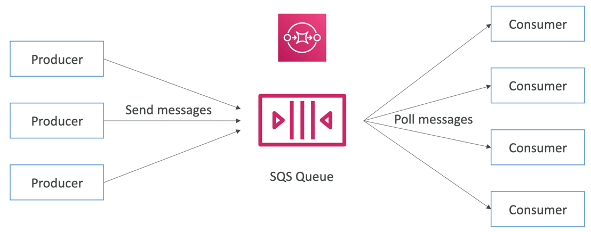
</p>

Synchronous between applications can be problematic if there are sudden spikes of traffic. It’s better to decouple your applications using:
- SQS: queue model
- SNS: pub/sub model
- Kinesis: real-time streaming model

These services can scale independently from our application!

### Amazon SQS - Standard Queue
What’s a queue?
- Fully managed service, used to decouple applications
- Unlimited throughput, unlimited number of messages in queue
- Default retention of messages: 4 days, maximum of 14 days
- Low latency (<10 ms on publish and receive)
- Limitation of 256KB per message sent
- Can have duplicate messages (at least once delivery, occasionally)
- Can have out of order messages (best effort ordering)

#### SQS – Producing Messages
- Produced to SQS using the SDK (SendMessage API)
- The message is persisted in SQS until a consumer deletes it
- Message retention: default 4 days, up to 14 days
- Example: send an order to be processed
	- Order id
	- Customer id
	- Any attributes you want

#### SQS – Consuming Messages
- Consumers (running on EC2 instances, servers, or AWS Lambda)…
- Poll SQS for messages (receive up to 10 messages at a time)
- Process the messages (example: insert the message into an RDS database)
- Delete the messages using the DeleteMessage API

#### SQS – Multiple EC2 Instances Consumers
- Consumers receive and process messages in parallel
- At least once delivery
- Best-effort message ordering
- Consumers delete messages after processing them
- We can scale consumers horizontally to improve throughput of processing
- To avoid reprocess the same message by different consumers, messages become invisible after pooled by a consumer. See message visibility below

#### SQS with Auto Scaling Group (ASG)

We can scale consumers horizontally to improve throughput of processing
To avoid reprocess the same message by different consumers, messages become invisible after pooled by a consumer. See message visibility below


#### SQS to decouple between application tiers

<p align="center">
  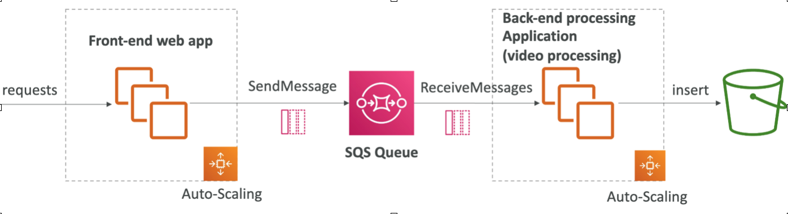
</p>

### Amazon SQS - Security
- Encryption:
	- In-flight encryption using HTTPS API
	- At-rest encryption using KMS keys
	- Client-side encryption if the client wants to perform encryption/decryption itself
- Access Controls: IAM policies to regulate access to the SQS API
- SQS Access Policies (similar to S3 bucket policies)
	- Useful for cross-account access to SQS queues
	- Useful for allowing other services (SNS, S3…) to write to an SQS queue

#### SQS Queue Access Policy

<p align="center">
  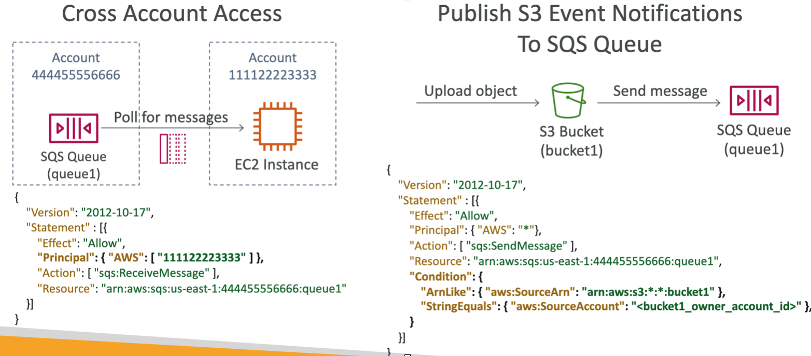
</p>

#### SQS – Message Visibility Timeout
- After a message is polled by a consumer, it becomes invisible to other consumers 
- By default, the **message visibility timeout** is 30 seconds. That means the message has 30 seconds to be processed
- After the message visibility timeout is over, the message is “visible” in SQS
- If a message is not processed within the visibility timeout, it will be processed twice
- A consumer could call the `ChangeMessageVisibility API` to get more time
- If visibility timeout is high (hours), and consumer crashes, re-processing will take time
- If visibility timeout is too low (seconds), we may get duplicates

#### Amazon SQS – FIFO Queue
- FIFO = First In First Out (ordering of messages in the queue)
- Limited throughput: 300 msg/s without batching, 3000 msg/s with
- Exactly-once send capability (by removing duplicates)
- Messages are processed in order by the consumer

#### Amazon SQS – Dead Letter Queue (DLQ)
- If a consumer fails to process a message within the Visibility Timeout. the message goes back to the queue! We can set a threshold of how many times a message can go back to the queue
- After the MaximumReceives threshold is exceeded, the message goes into a Dead Letter Queue (DLQ)
- Useful for debugging or manual inspection
- DLQ of a FIFO queue must also be a FIFO queue
- DLQ of a Standard queue must also be a Standard queue
- Make sure to process the messages in the DLQ before they expire:
- Good to set a retention of 14 days in the DLQ

#### SQS DLQ – Redrive to Source
- Feature to help consume messages in the DLQ to understand what is wrong with them
- When our code is fixed, we can redrive the messages from the DLQ back into the source queue (or any other queue) in batches without writing custom code

#### Amazon SQS – Delay Queue
- Delay a message (consumers don’t see it immediately) up to 15 minutes
- Default is 0 seconds (message is available right away)
- Can set a default at queue level
- Can override the default on send using the DelaySeconds parameter

#### Amazon SQS - Long Polling
- When a consumer requests messages from the queue, it can optionally “wait” for messages to arrive if there are none in the queue. This is called **Long Polling**
- LongPolling decreases the number of API calls made to SQS while increasing the efficiency and latency of your application
- The wait time can be between 1 sec to 20 sec (20 sec preferable)
- Long Polling is preferable to Short Polling
- Long polling can be enabled at the queue level or at the API level using `ReceiveMessageWaitTimeSeconds`


#### SQS Extended Client
 Message size limit is 256KB, how to send large messages, e.g. 1GB? Using the **SQS Extended Client** (Java Library)! OR the producer sends them to S3 and then retrieve them from S3

 #### SQS – Must know API
- CreateQueue (MessageRetentionPeriod), DeleteQueue
- PurgeQueue: delete all the messages in queue
- SendMessage (DelaySeconds), ReceiveMessage, DeleteMessage
- MaxNumberOfMessages: default 1, max 10 (for ReceiveMessage API)
- ReceiveMessageWaitTimeSeconds: Long Polling
- ChangeMessageVisibility: change the message timeout
- Batch APIs for SendMessage, DeleteMessage, ChangeMessageVisibility helps decrease your costs

#### SQS – Must know API
- CreateQueue (MessageRetentionPeriod), DeleteQueue
- PurgeQueue: delete all the messages in queue
- SendMessage (DelaySeconds), ReceiveMessage, DeleteMessage
- MaxNumberOfMessages: default 1, max 10 (for ReceiveMessage API)
- ReceiveMessageWaitTimeSeconds: Long Polling
- ChangeMessageVisibility: change the message timeout
- Batch APIs for SendMessage, DeleteMessage, ChangeMessageVisibility
  helps decrease your costs

#### SQS FIFO – Deduplication
- De-duplication interval is 5 minutes
- Two de-duplication methods:
	- **Content-based deduplication**: will do a SHA-256 hash of the message body
	- Explicitly provide a **Message Deduplication ID**

  <p align="center">
  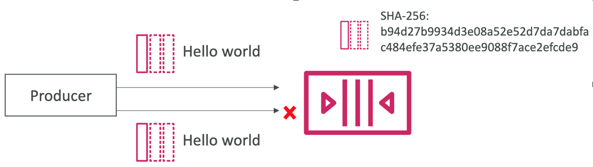
</p>

#### SQS FIFO – Message Grouping
- If you specify the same value of **MessageGroupID** in an SQS FIFO queue, you can only have one consumer, and all the messages are in order
- To get ordering at the level of a subset of messages, specify different values for MessageGroupID
	- Messages that share a common Message Group ID will be in order within the group
	- Each Group ID can have a different consumer (parallel processing!)
	- Ordering across groups is not guaranteed

  <p align="center">
  
</p>

### Amazon SNS
What if you want to send one message to many receivers?

- The “event producer” only sends message to one SNS topic
As many “event receivers” (**subscribers**) as we want to listen to the SNS topic notifications
- Each subscriber to the topic will get all the messages (note: new feature to filter messages)
- Up to 12,500,000 subscriptions per topic
- 100,000 topics limit

 <p align="center">
  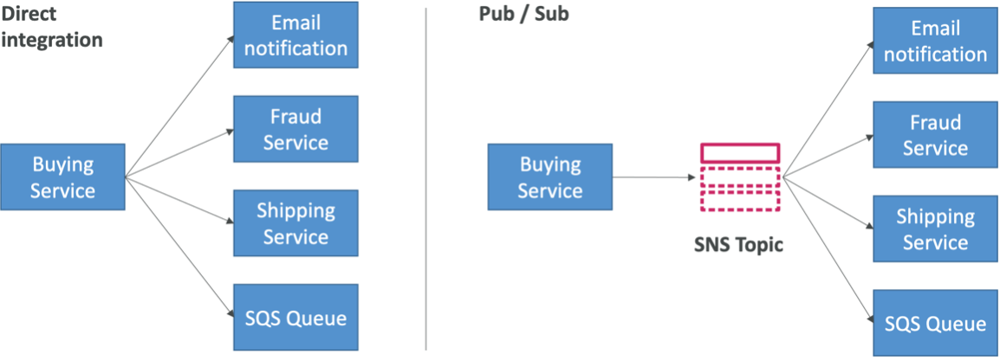
  </p>


#### SNS integrates with a lot of AWS services
Many AWS services can send data directly to SNS for notifications

<p align="center">
  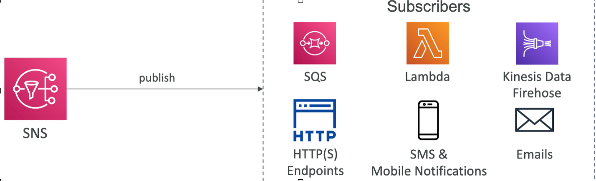
  </p>

#### Amazon SNS – How to publish
- Topic Publish (using the SDK)
	- Create a topic
	- Create a subscription (or many)
	- Publish to the topic
- Direct Publish (for mobile apps SDK)
	- Create a platform application
	- Create a platform endpoint
	- Publish to the platform endpoint
	- Works with Google GCM, Apple APNS, Amazon ADM…


#### Amazon SNS – Security
- Encryption:
    - In-flight encryption using HTTPS API
	- At-rest encryption using KMS keys
	- Client-side encryption if the client wants to perform encryption/decryption itself
- Access Controls: IAM policies to regulate access to the SNS API
- SNS Access Policies (similar to S3 bucket policies)
	- Useful for cross-account access to SNS topics
	- Useful for allowing other services ( S3…) to write to an SNS topic

#### SNS + SQS: Fan Out
<p align="center">
  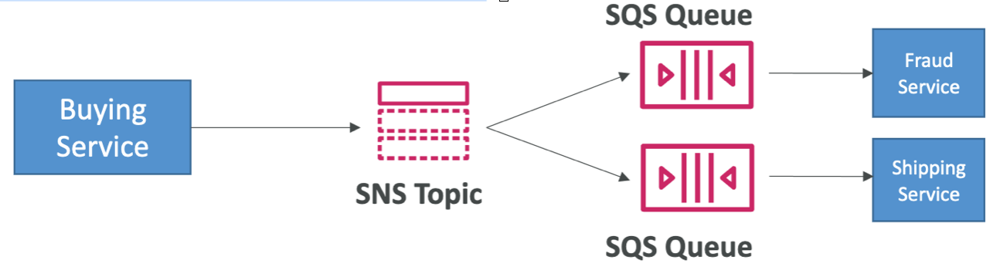
  </p>

- Push once in SNS, receive in all SQS queues that are subscribers
- Fully decoupled, no data loss
- SQS allows for: data persistence, delayed processing and retries of work
- Ability to add more SQS subscribers over time
- Make sure your SQS queue access policy allows for SNS to write
- Cross-Region Delivery: works with SQS Queues in other regions

#### Application: S3 Events to multiple queues
- For the same combination of: event type (e.g. object create) and prefix (e.g. images/) you can only have one S3 Event rule
- If you want to send the same S3 event to many SQS queues, use fan-out

<p align="center">
  
  </p>

  SNS can send to Kinesis Data Firehose and from there to S3 or any supported KDF destination

  #### SNS – Message Filtering
- JSON policy used to filter messages sent to SNS topic’s subscriptions
- If a subscription doesn’t have a filter policy, it receives every message

  <p align="center">
  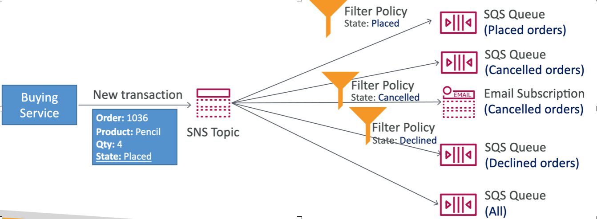
  </p>


## Kinesis Overview
- Makes it easy to collect, process, and analyze streaming data in real-time
- Ingest real-time data such as: Application logs, Metrics, Website clickstreams, IoT telemetry data
- Kinesis Data Streams: capture, process, and store data streams
- Kinesis Data Firehose: load data streams into AWS data stores
- Kinesis Data Analytics: analyze data streams with SQL or Apache Flink
- Kinesis Video Streams: capture, process, and store video streams

### Kinesis Data Streams

- Retention between 1 day to 365 days
- Ability to reprocess (replay) data
- Once data is inserted in Kinesis, it can’t be deleted (immutability)
- Data that shares the same partition goes to the same shard (ordering)
- Producers: AWS SDK, Kinesis Producer Library (KPL), Kinesis Agent
- Consumers:
	- Write your own: Kinesis Client Library (KCL), AWS SDK - Classic or Enhanced Fan-Out
	- Managed: AWS Lambda, Kinesis Data Firehose, Kinesis Data Analytics


<p align="center">
  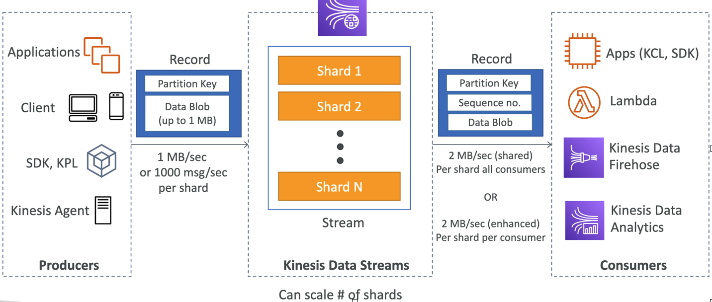
  </p>

  #### Kinesis Data Streams – Capacity Modes
- Provisioned mode:
	- You *choose the number of shards provisioned*, scale manually or using API
	- Each shard gets 1MB/s in (or 1000 records per second)
	- Each shard gets 2MB/s out (classic or enhanced fan-out consumer)
	- You **pay per shard provisioned per hour**
- On-demand mode:
	- No need to provision or manage the capacity
	- Default capacity provisioned (4 MB/s in or 4000 records per second)
	- Scales automatically based on observed throughput peak during the last 30 days
	- **Pay per stream per hour & data in/out per GB**

#### Kinesis Data Streams Security
- Control access / authorization using IAM policies
- Encryption in flight using HTTPS endpoints
- Encryption at rest using KMS
    - You can implement encryption/decryption of data on client side (harder)
    - VPC Endpoints available for Kinesis to access within VPC
    - Monitor API calls using CloudTrail

<p align="center">
  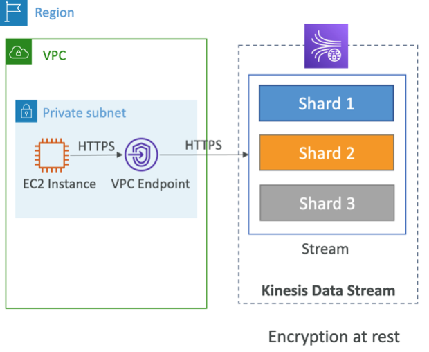
  </p>

  <p align="center">
  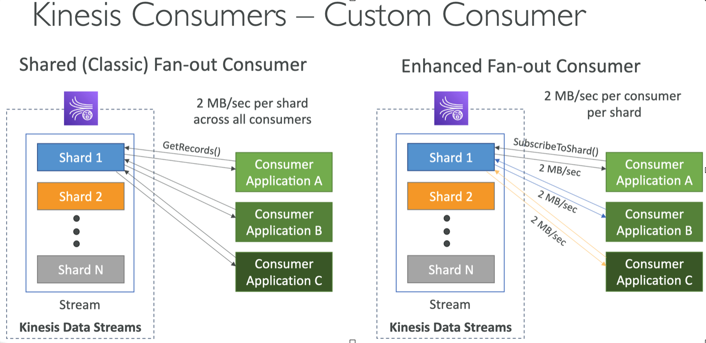
  </p>

#### Kinesis Producers
- Puts data records into data streams
- Data record consists of:
	- Sequence number (unique per partition-key within shard)
	- Partition key (must specify while put records into stream)
	- Data blob (up to 1 MB)
- Producers:
	- AWS SDK: simple producer
	- Kinesis Producer Library (KPL): C++, Java, batch, compression, retries
	- Kinesis Agent: monitor log files
- Write throughput: 1 MB/sec or 1000 records/sec per shard
- Use batching with PutRecords API to reduce costs & increase throughput

<p align="center">
  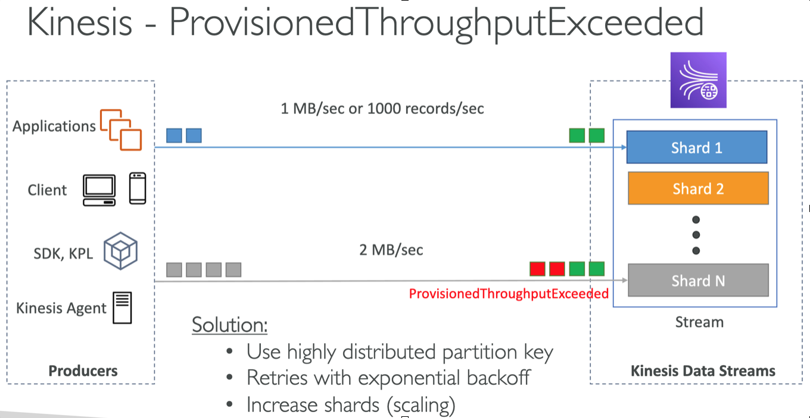
  </p>

  <p align="center">
  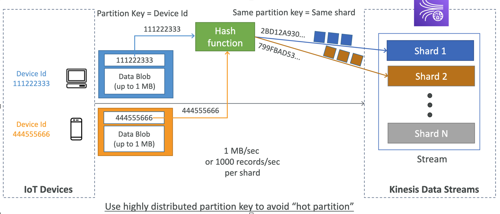
  </p>


#### Kinesis Consumers Types
 
 <p align="center">
  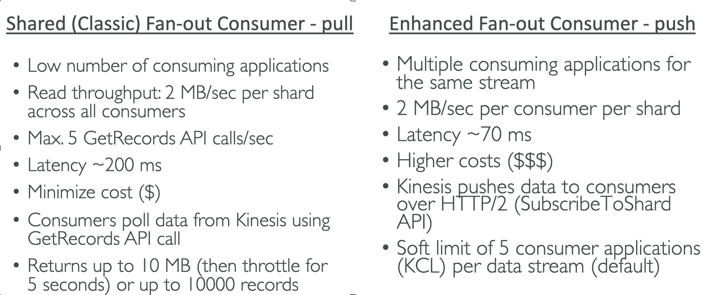
  </p>

#### Kinesis Consumers – AWS Lambda

<p align="center">
  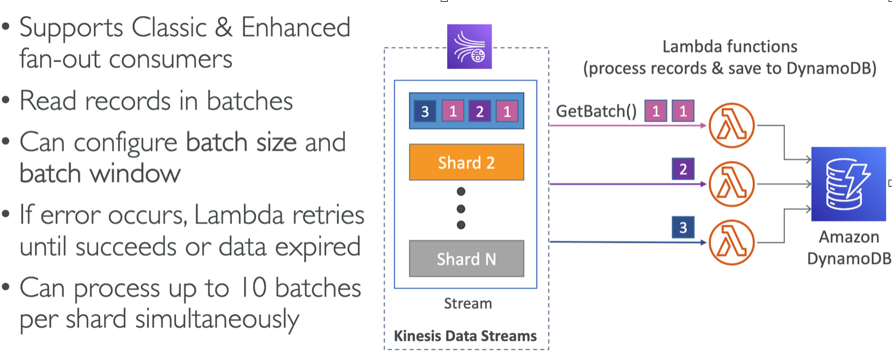
  </p>

#### Kinesis Client Library (KCL)
- A Java library that helps read record from a Kinesis Data Stream with distributed applications sharing the read workload
- Each shard is to be read by only one KCL instance
	- 4 shards = max. 4 KCL instances
	- 6 shards = max. 6 KCL instances
- Progress is checkpointed into DynamoDB (needs IAM access)
- Track other workers and share the work amongst shards using DynamoDB
- KCL can run on EC2, Elastic Beanstalk, and on-premises
- Records are read in order at the shard level
- Versions:
	- KCL 1.x (supports shared consumer)
	- KCL 2.x (supports shared & enhanced fan-out consumer)

<p align="center">
  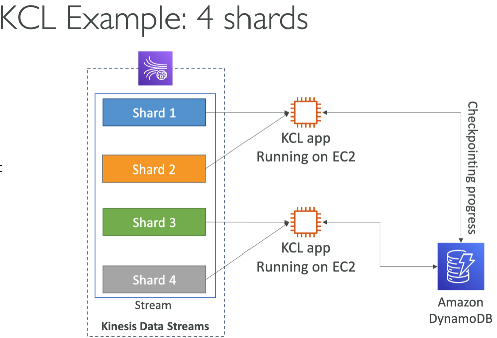
  </p>

#### Kinesis Operation – Shard Splitting/Merging
- Splitting Shards:
	- Used to increase the Stream capacity (1 MB/s data in per shard)
	- Used to divide a “hot shard”
	- The old shard is closed and will be deleted once the data is expired
	- No automatic scaling (manually increase/decrease capacity-merging shards)
    - Can’t split into more than two shards in a single operation
- Merging shards : 
  - decrease the Stream capacity and save costs 
  -  Can be used to group two shards with low traffic (cold shards)
  -  Old shards are closed and will be deleted once the data is expired
  -  Can’t merge more than two shards in a single operation

#### Ordering Data into Kinesis

<p align="center">
  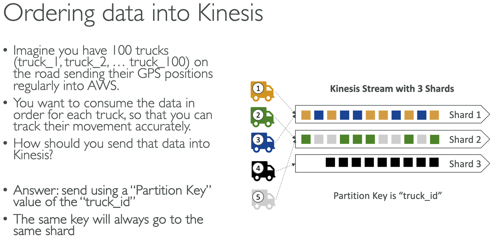
  </p>

### Kinesis Data Firehose
- Fully Managed Service, no administration, automatic scaling, serverless. Destinations:
	- AWS: Redshift / Amazon S3 / OpenSearch
	- 3rd party partner: Splunk / MongoDB / DataDog / NewRelic /
	- Custom: send to any HTTP endpoint
- Pay for data going through Firehose
- Near Real Time
	- 60 seconds latency minimum for non full batches
	- Or minimum 1 MB of data at a time
- Supports many data formats, conversions, transformations, compression
- Supports custom data transformations using AWS Lambda
Can send failed or all data to a backup S3 bucket

  <p align="center">
  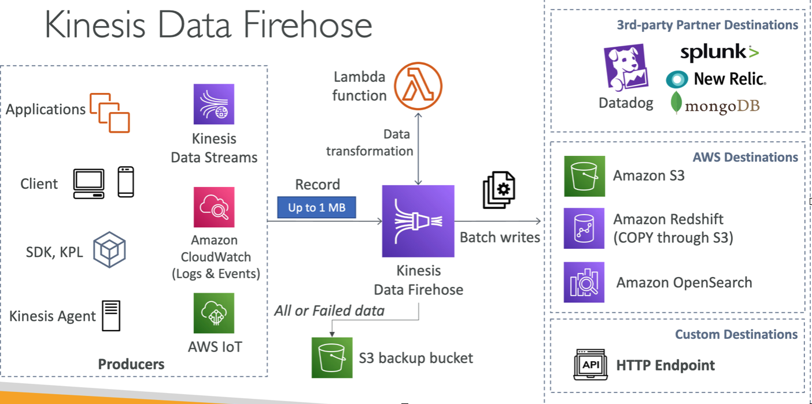
  </p>

#### Kinesis Data Streams vs Firehose

<p align="center">
  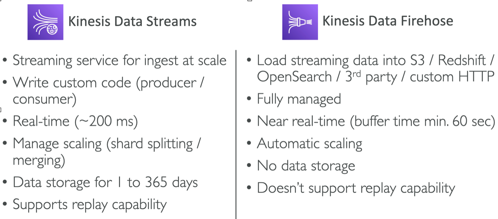
  </p>

  #### Kinesis Data Analytics for SQL Applications

- Real-time analytics on Kinesis Data Streams & Firehose using SQL
- Add reference data from Amazon S3 to enrich streaming data
- Fully managed, no servers to provision
- Automatic scaling
- Pay for actual consumption rate
- Output:
	- Kinesis Data Streams: create streams out of the real-time analytics queries
	- Kinesis Data Firehose: send analytics query results to destinations
- Use cases:
	- Time-series analytics
	- Real-time dashboards
	- Real-time metrics


<p align="center">
  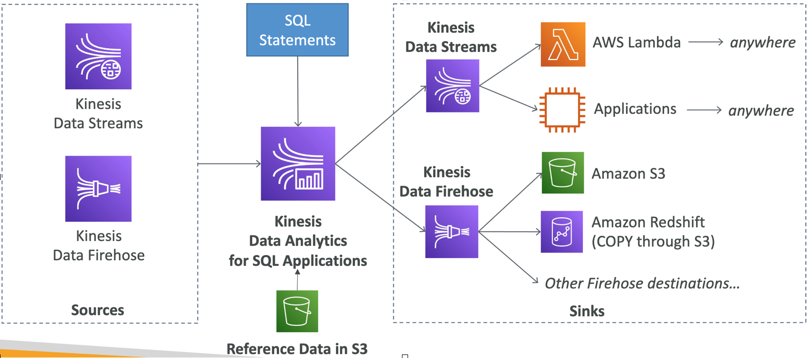
  </p>

  #### Kinesis Data Analytics for Apache Flink
- Use Flink (Java, Scala or SQL) to process and analyze streaming data
- Run any Apache Flink application on a managed cluster on AWS
	- provisioning compute resources, parallel computation, automatic scaling
	- application backups (implemented as checkpoints and snapshots)
	- Use any Apache Flink programming features
	- Flink does not read from Firehose (use Kinesis Analytics for SQL instead)

#### Kinesis vs SQS ordering
- Let’s assume 100 trucks, 5 kinesis shards, 1 SQS FIFO
- Kinesis Data Streams:
	- On average you’ll have 20 trucks per shard
	- Trucks will have their data ordered within each shard
	- The maximum amount of consumers in parallel we can have is 5
	- Can receive up to 5 MB/s of data
- SQS FIFO
	- You only have one SQS FIFO queue
	- You will have 100 Group ID
	- You can have up to 100 Consumers (due to the 100 Group ID)
	- You have up to 300 messages per second (or 3000 if using batching)


#### SQS vs SNS vs Kinesis

<p align="center">
  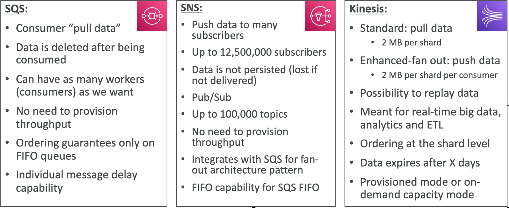
  </p>


## AWS Monitoring, Troubleshooting, Auditing

#### Why Monitoring is Important
We know how to deploy applications safely, automatically, using Infrastructure as Code, leveraging the best AWS components. Our applications are deployed, and our users don’t care how we did it. Our users only care whether the application is working efficiently! That means:
- **Latency**: will it increase over time?
- **Outages**: customer experience should not be degraded
- Users contacting the IT department or complaining is not a good outcome
- Troubleshooting and remediation

To have a way to check these elements, internal monitoring becomes important:
- Can we prevent issues before they happen?
- Performance and Cost
- Trends (scaling patterns)
- Learning and Improvement

### Monitoring Tools in AWS
- **AWS CloudWatch**:
  - **Metrics**: Collect and track key metrics
  - **Logs**: Collect, monitor, analyze and store log files
  - **Events**: Send notifications when certain events happen in your AWS
  - **Alarms**: React in real-time to metrics / events
- **AWS X-Ray**:
  - **Troubleshooting performance and errors**
  - **Distributed tracing** of microservices
- **AWS CloudTrail**:
  - Internal **monitoring of API calls** being made
  - **Audit changes to AWS Resources** by your users

### AWS CloudWatch Metrics
- CloudWatch provides metrics for every services in AWS
- Metric is a variable to monitor (CPUUtilization, NetworkIn…)
- Metrics belong to namespaces
- Dimension is an attribute of a metric (instance id, environment, etc…). Up to 30 dimensions per metric- Metrics have timestamps
- Can create CloudWatch dashboards of metrics

#### EC2 Detailed monitoring
- EC2 instance metrics have metrics “every 5 minutes”
-  With detailed monitoring (for a cost), you get data “every 1 minute”
- Use detailed monitoring if you want to scale faster for your ASG!
- The AWS Free Tier allows us to have 10 detailed monitoring metrics
- Note: EC2 Memory usage is by default not pushed (must be pushed from inside the instance as a custom metric)

#### CloudWatch Custom Metrics
- Possibility to define and send your own custom metrics to CloudWatch
- Example: memory (RAM) usage, disk space, number of logged in users
- Use API call `PutMetricData`
- Ability to use dimensions (attributes) to segment metrics
  - `Instance.id`
  - `Environment.name`
- Metric resolution (StorageResolution API parameter – two possible value):
  - Standard: 1 minute (60 seconds)
  - High Resolution: 1/5/10/30 second(s) – Higher cost
- Important: Accepts metric data points two weeks in the past and two hours in the
future (make sure to configure your EC2 instance time correctly)

### CloudWatch Logs
- Log groups: arbitrary name, usually representing an application
- Log stream: instances within application / log files / containers
- Can define log expiration policies (never expire, 1 day to 10 years…)
- CloudWatch Logs can send logs to:
  - Amazon S3 (exports)
  - Kinesis Data Streams
  - Kinesis Data Firehose
  - AWS Lambda
  - OpenSearch
- Logs are encrypted by default
- Can setup KMS-based encryption with your own keys

#### CloudWatch Logs - Sources
- SDK, CloudWatch Logs Agent, CloudWatch Unified Agent
- Elastic Beanstalk: collection of logs from application
- ECS: collection from containers
- AWS Lambda: collection from function logs
- VPC Flow Logs: VPC specific logs
- API Gateway
- CloudTrail based on filter
- Route53: Log DNS queries

#### CloudWatch Logs Insights
- Search and analyze log data _stored in CloudWatch Logs_. Example: find a specific IP inside a log, count occurrences of “ERROR” in your logs…
- Provides a purpose-built query language
  - Automatically discovers fields from AWS services and JSON log events
  - Fetch desired event fields, filter based on conditions, calculate aggregate 	statistics, sort events, limit number of events…
  - Can save queries and add them to CloudWatch Dashboards
- Can query multiple Log Groups in different AWS accounts
- It’s a query engine, not a real-time engine

<p align="center">
  
  </p>

#### CloudWatch Logs – S3 Export
- Log data can take up to 12 hours to become available for export
- The API call is `CreateExportTask`
Not near-real time or real-time… use Logs Subscriptions instead

#### CloudWatch Logs Subscriptions
- Get a real-time log events from CloudWatch Logs for processing and analysis- Send to Kinesis Data Streams, Kinesis Data Firehose, or Lambda
Subscription Filter: filter which logs are events delivered to your destination

  <p align="center">
  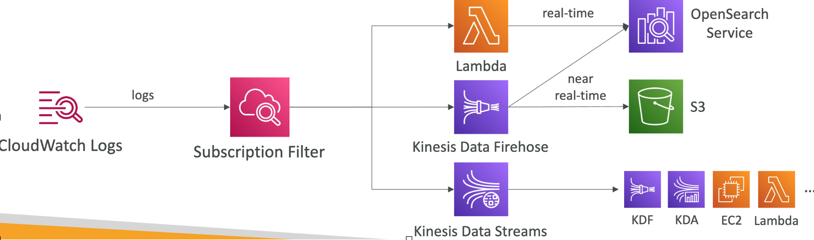
  </p>

#### CloudWatch Logs Aggregation Multi-Account & Multi Region

  <p align="center">
  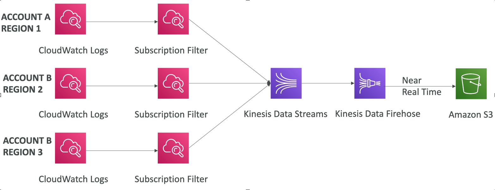
  </p>

#### CloudWatch Logs Subscriptions
Cross-Account Subscription – send log events to resources in a different AWS account (KDS, KDF)

<p align="center">
  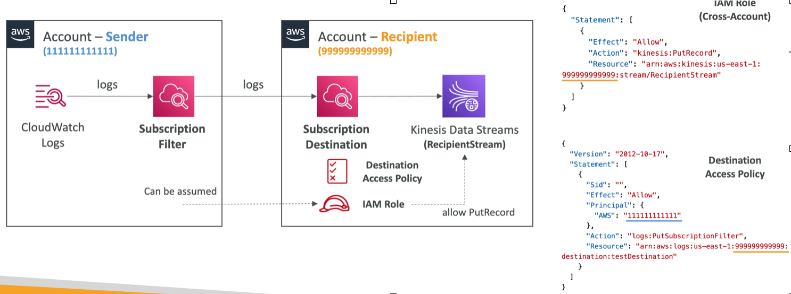
  </p>

#### CloudWatch Logs for EC2
- By default, no logs from your EC2 machine will go to CloudWatch
- You need to run a **CloudWatch agent** on EC2 to push the log files you want
- Make sure IAM permissions are correct
- The CloudWatch log agent can be setup on-premises too

#### CloudWatch Logs Agent & Unified Agent
- CloudWatch Logs Agent
  - Old version of the agent
  - Can only send to CloudWatch Logs
- CloudWatch Unified Agent
  - Collect additional system-level metrics such as RAM, processes, etc…
  - Collect logs to send to CloudWatch Logs
  - Centralized configuration using SSM Parameter Store

#### CloudWatch Unified Agent – Metrics
- Collected directly on your Linux server / EC2 instance
- CPU (active, guest, idle, system, user, steal)
- Disk metrics (free, used, total), Disk IO (writes, reads, bytes, iops)
- RAM (free, inactive, used, total, cached)
- Netstat (number of TCP and UDP connections, net packets, bytes)
- Processes (total, dead, bloqued, idle, running, sleep)
- Swap Space (free, used, used %)
- Reminder: out-of-the box metrics for EC2 – disk, CPU, network (high level)

#### CloudWatch Logs Metric Filter
- CloudWatch Logs can use filter expressions
  - For example, find a specific IP inside of a log
  - Or count occurrences of “ERROR” in your logs
  - Metric filters can be used to trigger alarms
- Filters do not retroactively filter data. Filters only publish the metric data points for events that happen after the filter was created.
- Ability to specify up to 3 Dimensions for the Metric Filter (optional)

  <p align="center">
  
  </p>


### CloudWatch Alarms
- Alarms are used to trigger notifications for any metric
- Various options (sampling, %, max, min, etc…)
- Alarm States:
  - OK
  - INSUFFICIENT_DATA
  - ALARM
- Period:
  - Length of time in seconds to evaluate the metric
  - High resolution custom metrics: 10 sec, 30 sec or multiples of 60 sec

#### CloudWatch Alarm Targets

 <p align="center">
  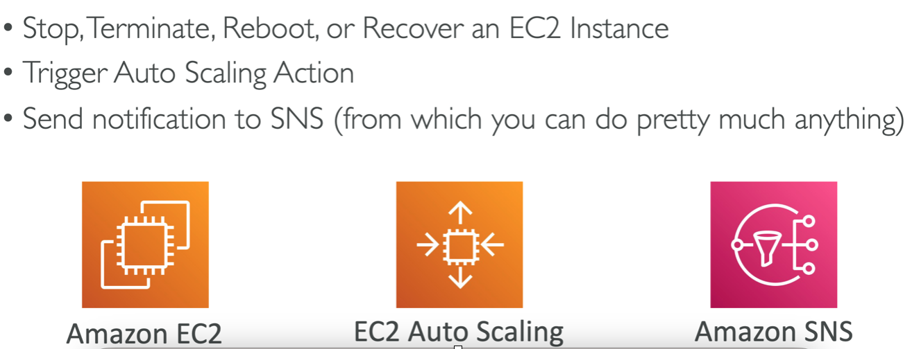
  </p>


#### CloudWatch Alarms – Composite Alarms
- CloudWatch Alarms are on a single metric
- Composite Alarms are monitoring the states of multiple other alarms
- AND and OR conditions
  - Helpful to reduce “alarm noise” by creating complex composite alarms

<p align="center">
  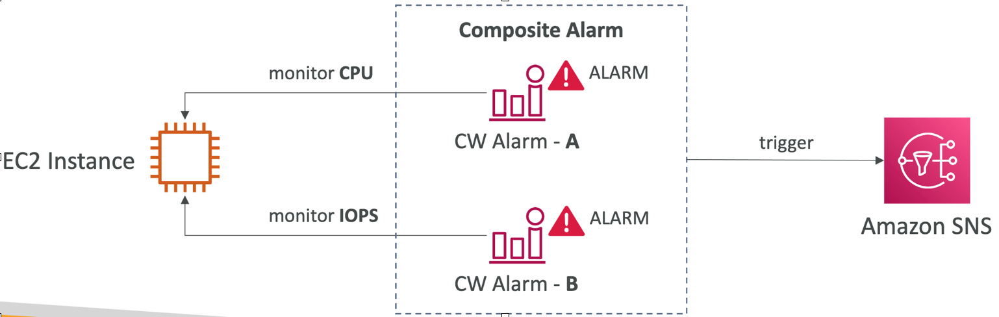
  </p>


CloudWatch Alarm: Good to Know

<p align="center">
  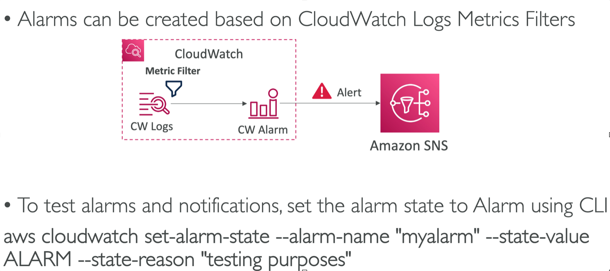
  </p>


#### CloudWatch Synthetics Canary
- Configurable script that runs in CW to monitor your APIs, URLs, Websites
- Reproduce what your customers do programmatically to find issues before customers are impacted
- Checks the availability and latency of your endpoints and can store load time data and screenshots of the UI
- Integration with CloudWatch Alarms
- Scripts written in Node.js or Python
- Programmatic access to a headless Google Chrome browser
- Can run once or on a regular schedule

The figure on the right shows in case of failure of an EC2 us-east-1 triggers CloudWatch alarm to provoke a Lambda function that updates a DNS record to another instance in us-west-2.

 <p align="center">
  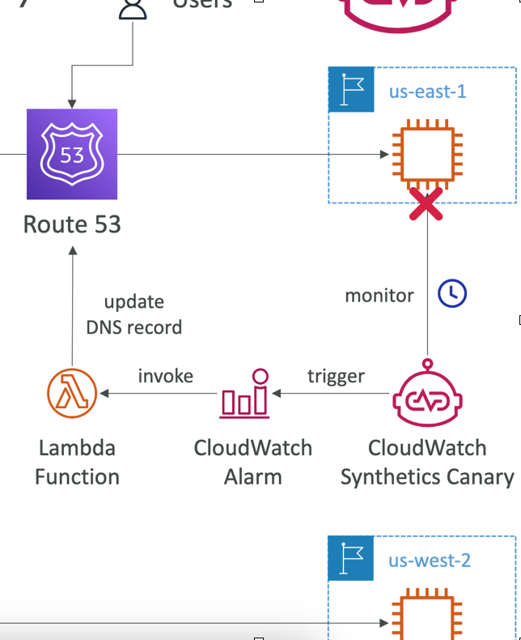
  </p>


#### CloudWatch Synthetics Canary Blueprints
- Heartbeat Monitor – load URL, store screenshot and an HTTP archive file
- API Canary – test basic read and write functions of REST APIs
- Broken Link Checker – check all links inside the URL that you are testing
- Visual Monitoring – compare a screenshot taken during a canary run with a baseline screenshot
- Canary Recorder – used with CloudWatch Synthetics Recorder (record your actions on a website and automatically generates a script for that)
- GUI Workflow Builder – verifies that actions can be taken on your webpage (e.g., test a webpage with a login form)

### Amazon EventBridge (formerly CloudWatch Events)
- Schedule: Cron Jobs (scheduled scripts)
  - Schedule every hour to invoke a Lambda function
- Event Pattern: Event rules to react to service doing something
  - IAM root  signs in an event then SNS sends email notifications

#### Amazon Eventbridge Rules

<p align="center">
  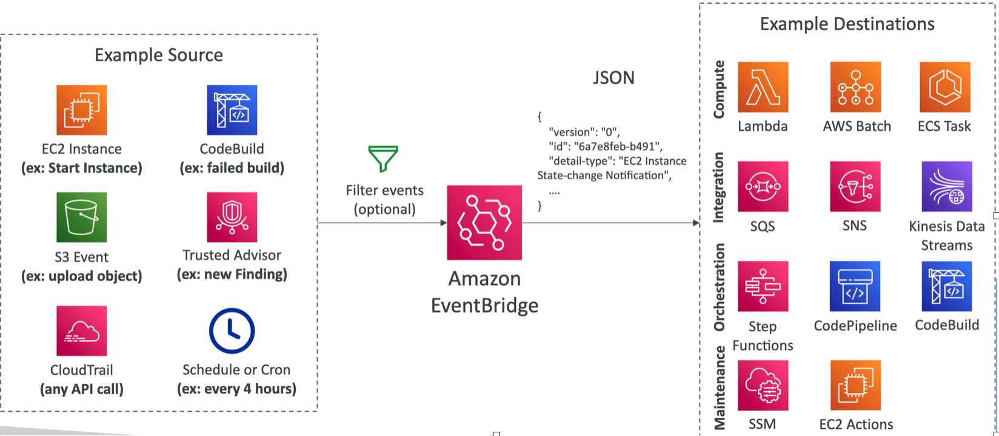
  </p>

#### Amazon EventBridge
- Event buses can be accessed by other AWS accounts using Resource-based Policies
- You can archive events (all/filter) sent to an event bus (indefinitely or set period)
- Ability to replay archived events

#### Amazon EventBridge – Schema Registry
-  EventBridge can analyze the events in your bus and infer the schema
- The Schema Registry allows you to generate code for your application, that will know in advance how data is structured in the event bus
- Schema can be versioned

#### Amazon EventBridge – Resource-based Policy
- Manage permissions for a specific Event Bus- Example: allow/deny events from another AWS account or AWS region
- Use case: aggregate all events from your AWS Organization in a single AWS account or AWS region
- A resource policy should be attached to the EventBus in the central account to receive events from another accounts. Then one could create event rule in the central account to trigger SNS.

  <p align="center">
  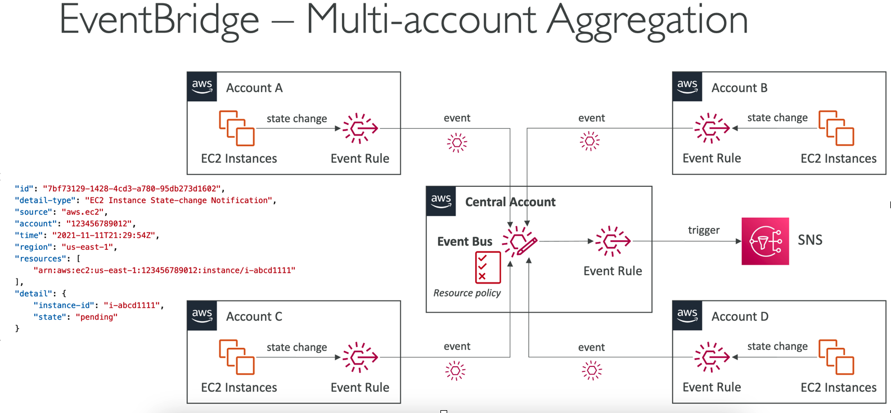
  </p>


### AWS X-Ray
- Debugging in Production, the good old way:
  - Test locally
  - Add log statements everywhere
  - Re-deploy in production
-  Log formats differ across applications using CloudWatch and analytics is hard
-  Debugging: monolith “easy”, distributed services and microservices are “hard”
- Need unified views of your entire architecture!? Answer is … AWS X-Ray!

AWS X-Ray helps developers *analyze and debug production, distributed applications, such as those built using a microservices architecture*. With X-Ray, you can understand how your application and its underlying services are performing to identify and troubleshoot the root cause of performance issues and errors. X-Ray provides an end-to-end view of requests as they travel through your application, and shows a map of your application’s underlying components. You can use X-Ray to analyze both applications in development and in production, from simple three-tier applications to complex microservices applications consisting of thousands of services.

#### AWS X-Ray, Visual analysis of our applications


<p align="center">
  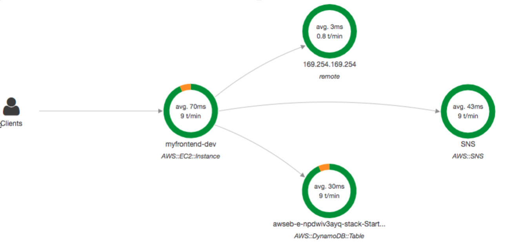
  </p>


#### AWS X-Ray advantages
- Troubleshooting performance (bottlenecks)
- Understand dependencies in a microservice architecture
- Pinpoint service issues
- Review request behavior
- Find errors and exceptions
- Are we meeting time SLA?
- Where I am throttled? Which service?
- Identify users that are impacted


#### X-Ray compatibility
- AWS Lambda
- Elastic Beanstalk
- ECS
- ELB
- API Gateway
- EC2 Instances or any application server (even on premise)


#### AWS X-Ray Leverages Tracing
- Tracing is an end to end way to following a “request”
- Each component dealing with the request adds its own “trace”
- Tracing is made of segments (+ sub segments)
- Annotations can be added to traces to provide extra information
- Ability to trace:
  - Every request
  - Sample request (as a % for example or a rate per minute)
- X-Ray Security:
  - IAM for authorization
  - KMS for encryption at rest

#### AWS X-Ray, how to enable it?
- Your code (Java, Python, Go, Node.js, .NET) must import the AWS X-Ray SDK
  - Very little code modification needed
  - The application SDK will then capture:
	- Calls to AWS services
	- HTTP / HTTPS requests
- Install the **X-Ray daemon** (for EC2) or enable X-Ray AWS Integration
  - X-Ray daemon works as a low level UDP packet interceptor (Linux / Windows / Mac…). The 	X-Ray daemon uses the AWS SDK to upload trace data to X-Ray, and it needs AWS credentials with permission (IAM rights) to do that.
  - AWS Lambda / other AWS services already run the X-Ray daemon for you

The AWS X-Ray daemon is a software application that _listens for traffic on UDP port 2000, gathers raw segment data, and relays it to the AWS X-Ray API_. The daemon works in conjunction with the AWS X-Ray SDKs and must be running so that data sent by the SDKs can reach the X-Ray service. The X-Ray daemon is an open source project. You can follow the project and submit issues and pull requests on GitHub. On AWS Lambda and AWS Elastic Beanstalk, use those services' integration with X-Ray to run the daemon. Lambda runs the daemon automatically any time a function is invoked for a sampled request. On Elastic Beanstalk, use the XRayEnabled configuration option to run the daemon on the instances in your environment. To run the X-Ray daemon locally, on-premises, or on other AWS services, download it, run it, and then give it permission to upload segment documents to X-Ray. 

<p align="center">
  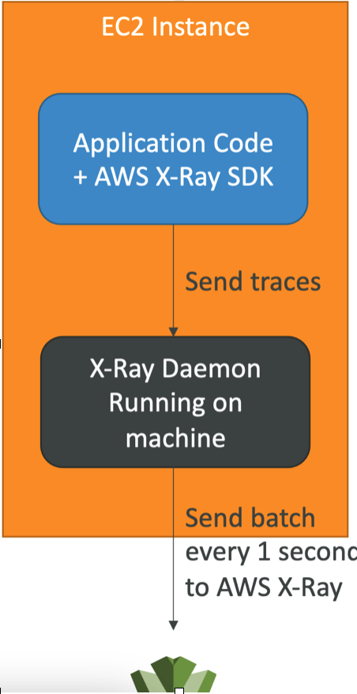
  </p>

On Amazon EC2, the daemon uses the instance's instance profile role automatically for IAM access. To use the daemon on Amazon EC2, create a new instance profile role or add the managed policy to an existing one.
Note
You can now use the CloudWatch agent to collect metrics, logs and traces from Amazon EC2 instances and on-premise servers. CloudWatch agent version 1.300025.0 and later can collect traces from OpenTelemetry or X-Ray client SDKs, and send them to X-Ray. Using the CloudWatch agent instead of the AWS Distro for OpenTelemetry (ADOT) Collector or X-Ray daemon to collect traces can help you reduce the number of agents that you manage. See the CloudWatch agent topic in the CloudWatch User Guide for more information.


#### AWS X-Ray Troubleshooting- If X-Ray is not working on EC2
- Ensure the EC2 IAM Role has the proper permissions
- Ensure the EC2 instance is running the X-Ray Daemon- To enable on AWS Lambda:
- Ensure it has an IAM execution role with proper policy (AWSX RayWriteOnlyAccess)
- Ensure that X-Ray is imported in the code
- Enable Lambda X-Ray Active Tracing


#### X-Ray Instrumentation in your code
<p align="center">
  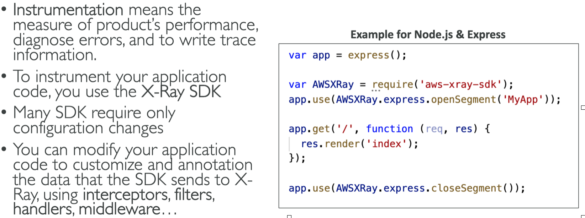
  </p>

#### X-Ray Concepts

- **Segments**: The compute resources running your application logic send data about their work as segments; A segment provides the resource's name, details about the request, and details about the work done
- **Subsegments**: if you need more details in your segment. A segment can break down the data about the work done into subsegments. Subsegments represent your application's view of a downstream call as a client. If the downstream service is also instrumented, the segment that it sends replaces the inferred segment generated from the upstream client's subsegment.
- **Trace**: segments collected together to form an end-to-end trace. A trace ID tracks the path of a request through your application. A trace collects all the segments generated by a single request. That request is typically an HTTP GET or POST request that travels through a load balancer, hits your application code, and generates downstream calls to other AWS services or external web APIs.
- **Sampling**: decrease the amount of requests sent to X-Ray, reduce cost. To ensure efficient tracing and provide a representative sample of the requests that your application serves, the X-Ray SDK applies a sampling algorithm to determine which requests get traced. By default, the X-Ray SDK records the first request each second, and five percent of any additional requests.
- **Annotations**: Key Value pairs used to index traces and use with filters. When you instrument your application, the X-Ray SDK records information about incoming and outgoing requests, the AWS resources used, and the application itself. You can add other information to the segment document as annotations and metadata.
- **Metadata**: Key Value pairs, not indexed, not used for searching-
-  The **X-Ray daemon / agent** has a config to send traces cross account:
   - Make sure the IAM permissions are correct – the agent will assume the role
   - This allows to have a central account for all your application tracing

#### X-Ray Sampling Rules
- With sampling rules, you control the amount of data that you record
- You can modify sampling rules without changing your code
- By default, the X-Ray SDK records the first request each second, and five percent of any additional requests.
- One request per second is the reservoir, which ensures that at least one trace is recorded each second as long the service is serving requests.
- Five percent is the rate at which additional requests beyond the reservoir size are sampled.

#### X-Ray Custom Sampling Rules
You can create your own rules with the reservoir and rate

<p align="center">
  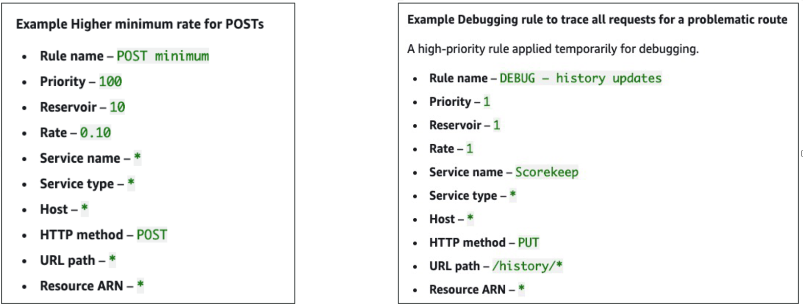
  </p>

#### X-Ray Write APIs (used by the X-Ray daemon)

- PutTraceSegments: Uploads segment documents to AWS X-Ray
- PutTelemetryRecords: Used by the AWS X-Ray daemon to upload telemetry
  - SegmentsReceivedCount, SegmentsRejectedCounts, BackendConnectionErrors
  - GetSamplingRules: Retrieve all sampling rules (to know what/when to send)
  - GetSamplingTargets & GetSamplingStatisticSummaries: advanced
- The X-Ray daemon needs to have an IAM policy authorizing the correct API calls to function correctly

#### X-Ray Read APIs – continued
- GetServiceGraph: main graph
- BatchGetTraces: Retrieves a list of traces specified by ID. Each trace is a collection of segment documents that originates from a single request.
- GetTraceSummaries: Retrieves IDs and annotations for traces available for a specified time frame using an optional filter. To get the full traces, pass the trace IDs to BatchGetTraces.
- GetTraceGraph: Retrieves a service graph for one or more specific trace IDs.


#### X-Ray with Elastic Beanstalk
-  AWS Elastic Beanstalk platforms include the X-Ray daemon
- You can run the daemon by setting an option in the Elastic Beanstalk console or with a configuration file (in .ebextensions/xray-daemon.config)
- Make sure to give your instance profile the correct IAM permissions so that the X-Ray daemon can function correctly
- Then make sure your application code is instrumented with the X-Ray SDK
- Note: The X-Ray daemon is not provided for Multicontainer Docker

#### X-Ray and ECS

<p align="center">
  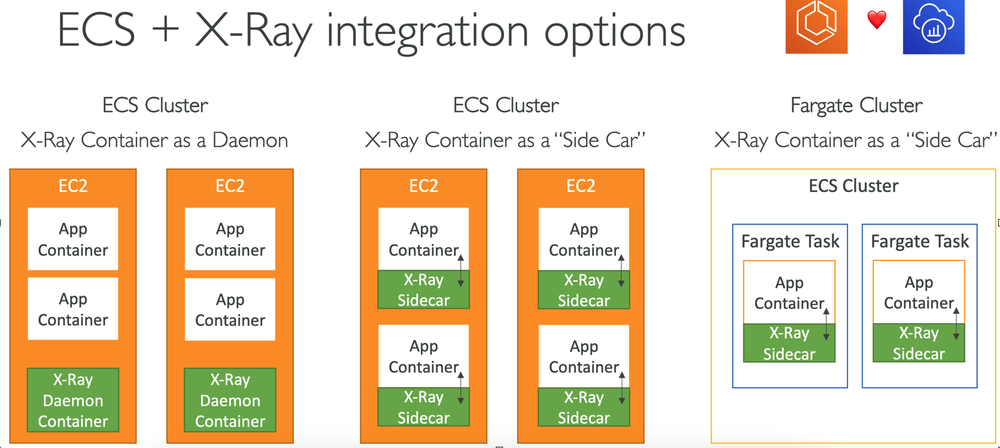
  </p>

#### AWS Distro for OpenTelemetry
- Secure, production-ready AWS-supported distribution of the open-source project OpenTelemetry project
- Provides a single set of APIs, libraries, agents, and collector services
- Collects distributed traces and metrics from your apps
-  Collects metadata from your AWS resources and services
-  Auto-instrumentation Agents to collect traces without changing your code
- Send traces and metrics to multiple AWS services and partner solutions: X-Ray, CloudWatch, Prometheus…
- Instrument your apps running on AWS (e.g., EC2, ECS, EKS, Fargate, Lambda) as well as on-premises
- Migrate from X-Ray to AWS Distro for Temeletry if you want to standardize with open-source APIs from Telemetry or send traces to multiple destinations simultaneously

<p align="center">
  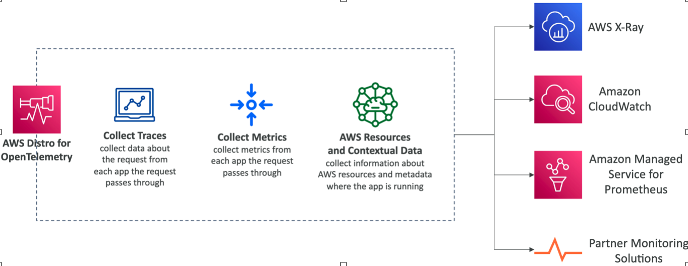
  </p>


### AWS CloudTrail
- Provides governance, compliance and audit for your AWS Account
- CloudTrail is enabled by default!
- Get an history of events / API calls made within your AWS Account by:
  - Console
  - SDK
  - CLI
  - AWS Services
- Can put logs from CloudTrail into CloudWatch Logs or S3
- A trail can be applied to All Regions (default) or a single Region.
- If a resource is deleted in AWS, investigate CloudTrail first!

<p align="center">
  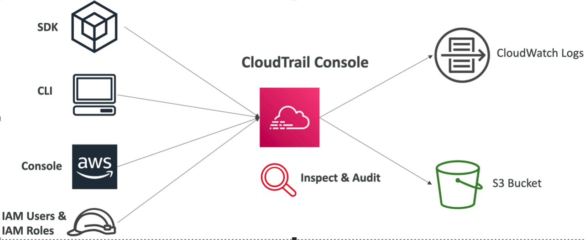
  </p>


#### CloudTrail Events
- Management Events:
  - Operations that are performed on resources in your AWS account
  - Examples:
    - Configuring security (IAM AttachRolePolicy)
    - Configuring rules for routing data (Amazon EC2 CreateSubnet)
    - Setting up logging (AWS CloudTrail CreateTrail)
  - By default, trails are configured to log management events
  - Can separate Read Events (that don’t modify resources) from Write Events (that may modify resources)
- Data Events:
  - By default, data events are not logged (because high volume operations)
  - Amazon S3 object-level activity (ex: GetObject, DeleteObject, PutObject): can separate Read and Write Events
  - AWS Lambda function execution activity (the Invoke API)
- CloudTrail Insights Events:
  - Enable CloudTrail Insights to detect unusual activity in your account:
  	- inaccurate resource provisioning
  	- hitting service limits
  	- Bursts of AWS IAM actions
  	- Gaps in periodic maintenance activity
  - CloudTrail Insights analyzes normal management events to create a baseline
  - And then continuously analyzes write events to detect unusual patterns
  	- Anomalies appear in the CloudTrail console
  	- Event is sent to Amazon S3
  	- An EventBridge event is generated (for automation needs)


#### CloudTrail Events Retention
- Events are stored for 90 days in CloudTrail
- To keep events beyond this period, log them to S3 and use Athena

<p align="center">
  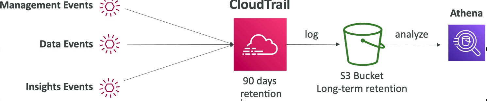
  </p>


Amazon EventBridge – Intercept API Calls

<p align="center">
  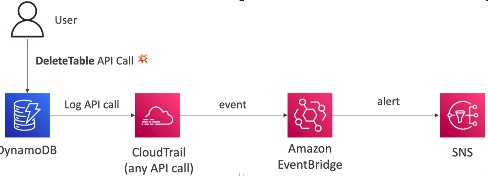
  </p>


Amazon EventBridge + CloudTrail

<p align="center">
  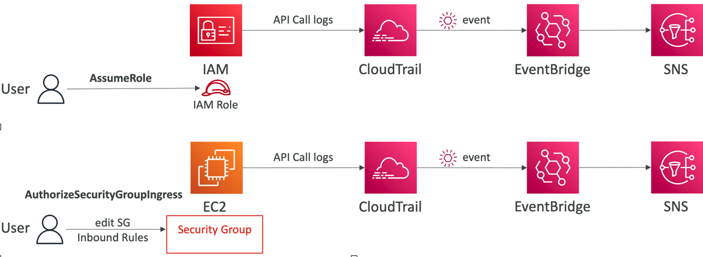
  </p>

CloudTrail vs CloudWatch vs X-Ray
- CloudTrail:
  - Audit API calls made by users / services / AWS console
  - Useful to detect unauthorized calls or root cause of changes
- CloudWatch:
  - CloudWatch Metrics over time for monitoring
  - CloudWatch Logs for storing application log
  - CloudWatch Alarms to send notifications in case of unexpected metrics
- X-Ray:
  - Automated Trace Analysis & Central Service Map Visualization
  - Latency, Errors and Fault analysis
  - Request tracking across distributed systems


## AWS Lambda

#### What’s serverless?
- Developers don’t have to manage servers anymore. They just deploy code. They just deploy… functions ! Serverless does not mean there are no servers. It means you just don’t manage / provision / see them
- Initially... Serverless == FaaS (Function as a Service). Serverless was pioneered by AWS Lambda but now also includes anything that’s managed: databases, messaging, storage, etc.

#### Serverless in AWS
- AWS Lambda
- DynamoDB
- AWS Cognito
- AWS API Gateway
- Amazon S3
- AWS SNS & SQS
- AWS Kinesis Data Firehose
- Aurora Serverless
- Step Functions
- Fargate

#### Why AWS Lambda
- Virtual functions – no servers to manage!
- Limited by time - short executions
- Run on-demand
- Scaling is automated!
- Integrated with the whole AWS suite of services
- Support for many programming languages (Custom Runtime API (community supported, example Rust)
- Easy monitoring through AWS CloudWatch
- Easy to get more resources per functions (up to 10GB of RAM!)
- Increasing RAM will also improve CPU and network!
- Lambda Container Image
	- The container image must implement the Lambda Runtime API
	- ECS / Fargate is preferred for running arbitrary Docker images
- It is usually very cheap to run AWS Lambda so it’s very popular

#### Example: Serverless Thumbnail creation

<p align="center">
  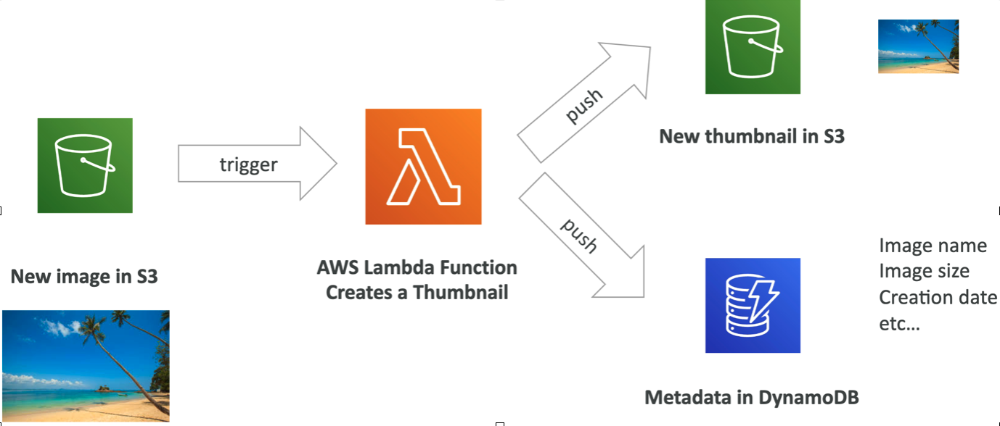
  </p>


#### Example: Serverless CRON Job

<p align="center">
  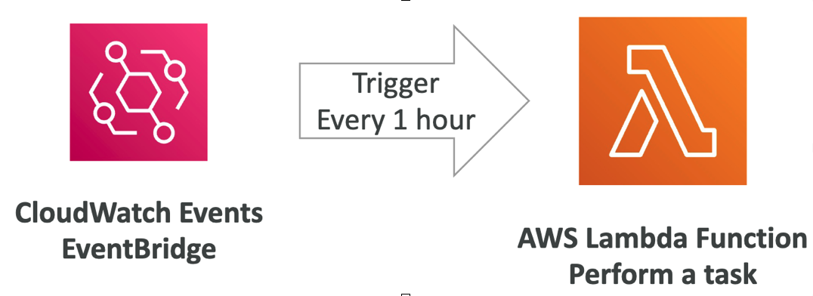
  </p>


#### Lambda – Synchronous Invocations
CLI, SDK, API Gateway, Application Load Balancer invoke Lambda **synchronously**! Results are returned right away and error handling must happen client side (retries, exponential backoff, etc. ) 

#### Lambda Integration with ALB
To expose a Lambda function as an HTTP(S) endpoint, you can use the Application Load Balancer or an API Gateway. The Lambda function must be registered in a target group. 

How ALB invokes Lambda? An HTTP request will be converted into JSON. From Lambda to ALB, the opposite happens: JSON will be turned into HTTP. 


<p align="center">
  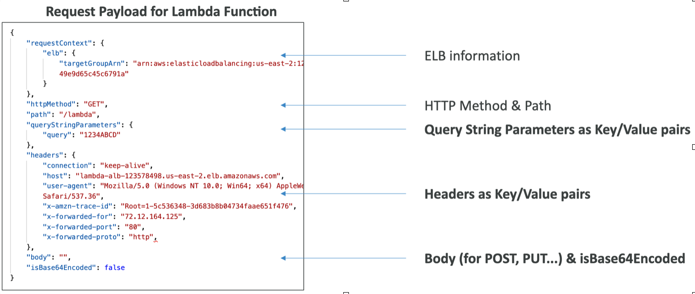
  </p>


<p align="center">
  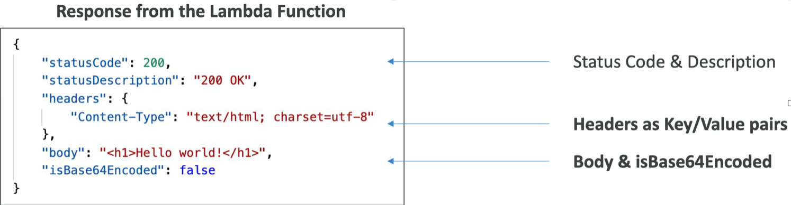
  </p>


- ALB can support multi header values (ALB setting)
When you enable multi-value headers, HTTP headers and query string parameters that are sent with multiple values are shown as arrays within the AWS Lambda event and response objects

<p align="center">
  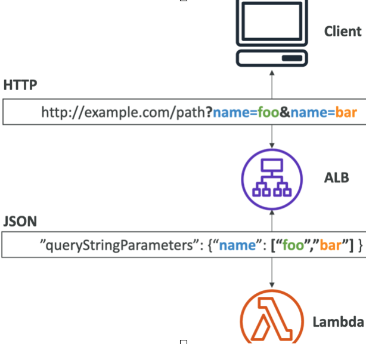
  </p>


For ALB to be able to invoke Lambda, a resource policy should be attached to Lambda!


#### Lambda – Asynchronous Invocations
- S3, SNS, CloudWatch Events. The events are placed in an Event Queue.
- Lambda attempts to retry on errors
	- 3 tries total
	- 1 minute wait after 1st , then 2 minutes wait
- Make sure the processing is idempotent (in case of retries)
    - If the function is retried, you will see duplicate logs entries in CloudWatch Logs
- Can define a DLQ (dead-letter queue) – SNS or SQS – for failed processing (need correct IAM permissions)
- Asynchronous invocations allow you to speed up the processing if you don’t need to wait for the result (ex: you need 1000 files processed)

    <p align="center">
  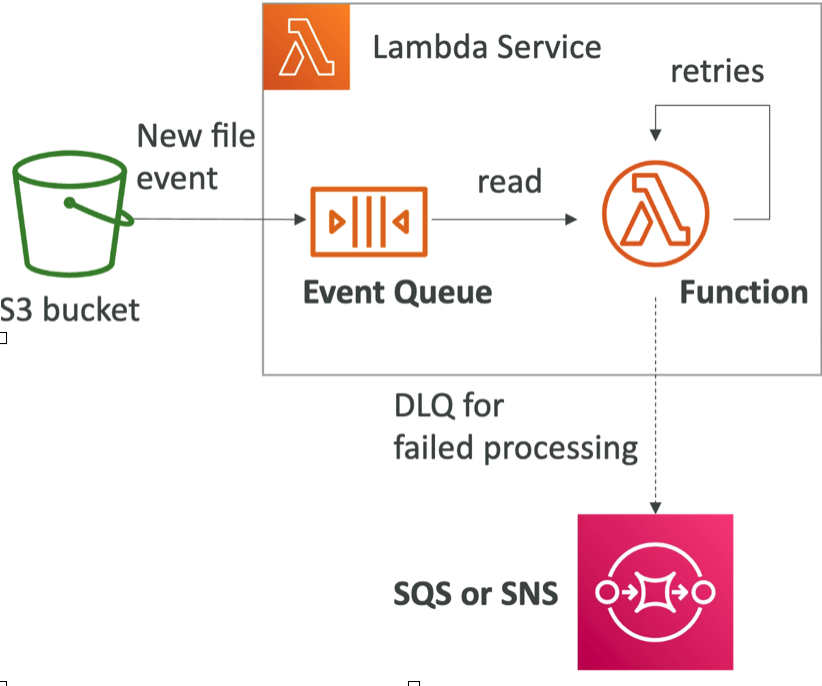
  </p>


#### CloudWatch Events / EventBridge

<p align="center">
  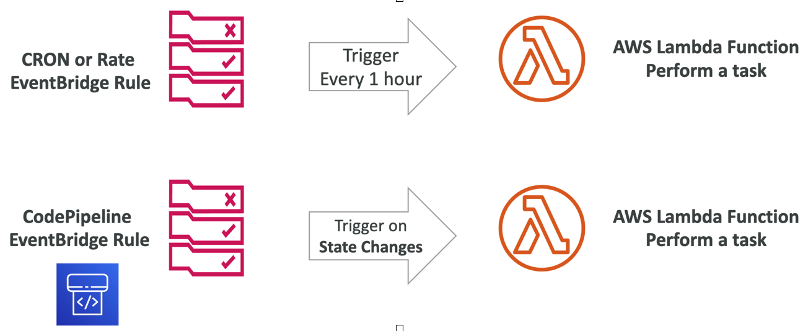
  </p>

#### S3 Events Notifications
- S3:ObjectCreated, S3:ObjectRemoved, S3:ObjectRestore, S3:Replication…
- Object name filtering possible (*.jpg)
- Use case: generate thumbnails of images uploaded to S3
- S3 event notifications typically deliver events in seconds but can sometimes take a minute or longer
- If two writes are made to a single non-versioned object at the same time, it is possible that only a single event notification will be sent
- If you want to ensure that an event notification is sent for every successful write, you can enable versioning on your bucket

<p align="center">
  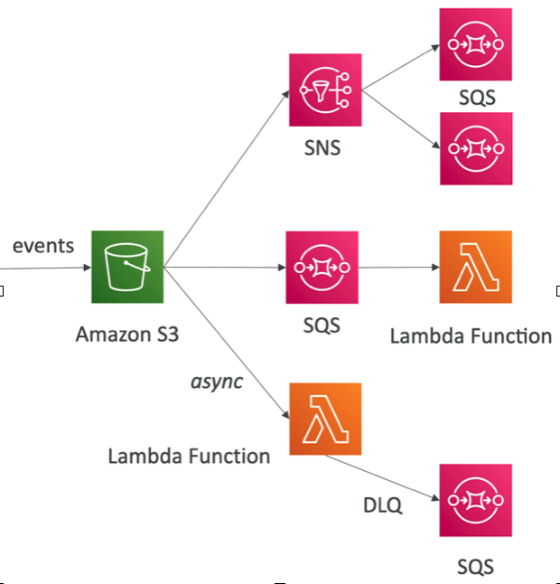
  </p>


Another form of synchronous invocation is called Event Source Mapping:

### Lambda – Event Source Mapping
- Kinesis Data Streams
- SQS & SQS FIFO queue
- DynamoDB Streams
- Common denominator: records need to be pulled from and returned to the source using event source mapping
- Your Lambda function is invoked synchronously
- There are two types of event source mapper: stream and queue

<p align="center">
  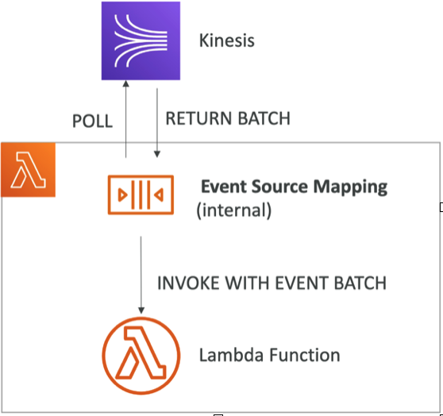
  </p>


#### Streams & Lambda (applies to Kinesis & DynamoDB)
- For Lambda functions that process Kinesis or DynamoDB streams using a poll-based event source mapping, the number of shards is the unit of concurrency. If your stream has 100 active shards, there will be at most 100 Lambda function invocations running concurrently. This is because Lambda processes each shard’s events in sequence.
- An event source mapping creates an iterator for each shard, processes items in order starting with new items, from the beginning or from timestamp
- Processed items aren't removed from the stream (other consumers can read them)
- For low traffic use batch window to accumulate records before processing
- With high throughput stream, you can process multiple batches in parallel up to 10 batches per shard with in-order processing is still guaranteed for each partition key

<p align="center">
  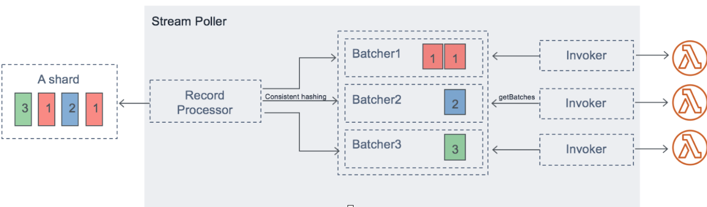
  </p>


##### Streams & Lambda – Error Handling
- By default, if your function returns an error, the entire batch is reprocessed until the function succeeds, or the items in the batch expire
- To ensure in-order processing, processing for the affected shard is paused until the error is resolved
- You can configure the event source mapping to:
	- discard old events
	- restrict the number of retries
	- split the batch on error (to work around Lambda timeout issues)
	- Discarded events can go to a Destination

#### Lambda – Event Source Mapping SQS & SQS FIFO
- Event Source Mapping will poll SQS (Long Polling)
- Specify batch size (1-10 messages)
- Recommended: Set the queue visibility timeout to 6x the timeout of your Lambda function
- To use a DLQ
	- set-up on the SQS queue, not Lambda (DLQ   	for Lambda is only for async invocations)
	- Or use a Lambda destination for failures


### Queues & Lambda
- Lambda also supports in-order processing for FIFO (first-in, first-out) queues, scaling up to the number of active message groups
- For standard queues, items aren't necessarily processed in order
- Lambda scales up to process a standard queue as quickly as possible
When an error occurs, batches are returned to the queue as individual items and might be processed in a different grouping than the original batch
- Occasionally, the event source mapping might receive the same item from the queue twice, even if no function error occurred
- Lambda deletes items from the queue after they're processed successfully.
- You can configure the source queue to send items to a dead-letter queue if they can't be processed

#### Lambda Event Mapper Scaling
- Kinesis Data Streams & DynamoDB Streams:
	- One Lambda invocation per stream shard
	- If you use parallelization, up to 10 batches processed per shard simultaneously
- SQS Standard:
	- Lambda adds 60 more instances per minute to scale up
	- Up to 1000 batches of messages processed simultaneously
- SQS FIFO:
	- Messages with the same GroupID will be processed in order
	- The Lambda function scales to the number of active message groups

### Lambda Input: Event and Context Objects
- **Event** Object:
	- JSON-formatted document contains data for the function to process
	- Contains information from the invoking service (e.g., EventBridge, custom, …)
	- Lambda runtime converts the event to an object (e.g., dict type in Python)
	- Example: input arguments, invoking service arguments, …
- **Context** Object:
	- Includes methods and properties that provide information about the invocation, function, and runtime environment
	- Passed to your function by Lambda at runtime
	- Example: aws_request_id, function_name, memory_limit_in_mb


<p align="center">
  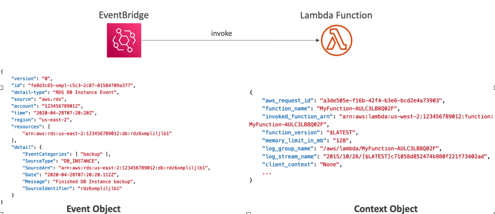
  </p>

#### Lambda Destinations - Async 
- Asynchronous invocations - can define destinations for successful and failed event:
    - Amazon SQS
    - Amazon SNS
    - AWS Lambda
    - Amazon EventBridge bus
- Note: AWS recommends you use destinations instead of DLQ now (but both can be used at the same time)
- Event Source mapping: for discarded event batches
    - Amazon SQS
    - Amazon SNS

- Note: you can send events to a DLQ directly from SQS


### Lambda Execution Role (IAM Role)
- Grants the Lambda function permissions to AWS services / resources
- Sample managed policies for Lambda:
- AWSLambdaBasicExecutionRole – Upload logs to CloudWatch.
- AWSLambdaKinesisExecutionRole – Read from Kinesis
- AWSLambdaDynamoDBExecutionRole – Read from DynamoDB Streams
- AWSLambdaSQSQueueExecutionRole – Read from SQS
- AWSLambdaVPCAccessExecutionRole – Deploy Lambda function in VPC
- AWSXRayDaemonWriteAccess – Upload trace data to X-Ray.
- When you use an event source mapping to invoke your function, Lambda uses the execution role to read event data
- Best practice: create one Lambda Execution Role per function

### Lambda Resource Based Policies
Use resource-based policies to give other accounts and AWS services permission to use your Lambda resources
• Similar to S3 bucket policies for S3 bucket
• An IAM principal can access Lambda:
	• If the IAM policy attached to the principal authorizes it (e.g. user access)
	• OR if the resource-based policy authorizes (e.g. service access)
When an AWS service like Amazon S3 calls your Lambda function, the resource-based policy gives it access


### Lambda Environment Variables
- Environment variable = key / value pair in “String” form
- Adjust the function behavior without updating code
- The environment variables are available to your code
- Lambda Service adds its own system environment variables as well
- Helpful to pass secrets (encrypted by KMS)
- Secrets can be encrypted by the Lambda service key, or your own CMK

### Lambda Logging & Monitoring
- CloudWatch Logs:
	- AWS Lambda execution logs are stored in AWS CloudWatch Logs
	- Make sure your AWS Lambda function has an execution role with an IAM policy that authorizes writes to CloudWatch Logs
- CloudWatch Metrics:
	- AWS Lambda metrics are displayed in AWS CloudWatch Metrics
	- Invocations, Durations, Concurrent Executions
	- Error count, Success Rates, Throttles
	- Async Delivery Failures
    - Iterator Age (Kinesis & DynamoDB Streams)


#### Lambda Tracing with X-Ray
- Enable in Lambda configuration (Active Tracing)
- Runs the X-Ray daemon for you
- Use AWS X-Ray SDK in Code
- Ensure Lambda Function has a correct IAM Execution Role
	- The managed policy is called `AWSXRayDaemonWriteAccess`
- Environment variables to communicate with X-Ray
	- `_X_AMZN_TRACE_ID`: contains the tracing header
	- `AWS_XRAY_CONTEXT_MISSING`: by default, LOG_ERROR
	- `AWS_XRAY_DAEMON_ADDRESS`: the X-Ray Daemon IP_ADDRESS:PORT


### Customization At The Edge
- Many modern applications execute some form of the logic at the edge
- Edge Function:
	- A code that you write and attach to CloudFront distributions
	- Runs close to your users to minimize latency
- CloudFront provides two types: **CloudFront Functions** & **Lambda@Edge**
- You don’t have to manage any servers, **deployed globally**
- Use case: customize the CDN content
- Pay only for what you use
- Fully serverless


#### CloudFront Functions & Lambda@Edge Use Cases
- Website Security and Privacy
- Dynamic Web Application at the Edge
- Search Engine Optimization (SEO)
- Intelligently Route Across Origins and Data Centers
- Bot Mitigation at the Edge
- Real-time Image Transformation
- A/B Testing
- User Authentication and Authorization
- User Prioritization
- User Tracking and Analytics

<p align="center">
  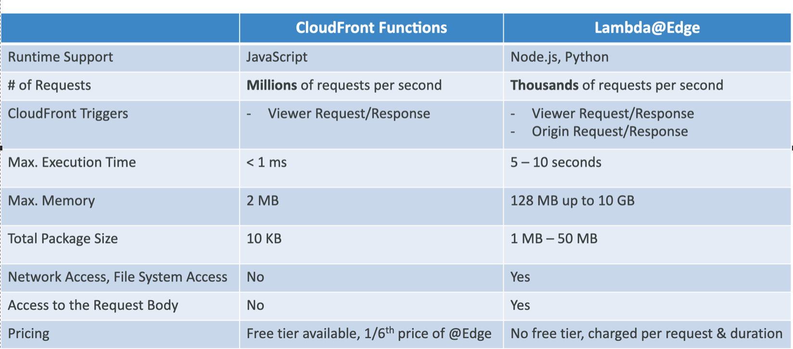
  </p>


#### CloudFront Functions
- Lightweight functions written in JavaScript
- For high-scale, latency-sensitive CDN customizations
- Sub-ms startup times, millions of requests/second
- Used to change Viewer requests and responses:
    - Viewer Request: after CloudFront receives a request from a viewer
    - Viewer Response: before CloudFront forwards the response to the viewer
- Native feature of CloudFront (manage code entirely within CloudFront)


#### Lambda@Edge
- Lambda functions written in NodeJS or Python
- Scales to 1000s of requests/second
- Used to change CloudFront requests and responses:
    - Viewer Request – after CloudFront receives a request from a viewer
    - Origin Request – before CloudFront forwards the request to the origin
    - Origin Response – after CloudFront receives the response from the origin
    - Viewer Response – before CloudFront forwards the response to the viewer
- Author your functions in one AWS Region (us-east-1), then CloudFront replicates to its locations

#### CloudFront Functions vs. Lambda@Edge - Use Cases
<p align="center">
  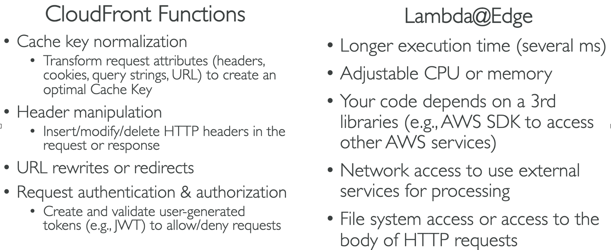
  </p>


### Lambda in VPC
By default, your Lambda function is launched outside your own VPC (in an AWS-owned VPC). Therefore it cannot access resources in your VPC (RDS, ElastiCache, internal ELB…)
- You must define the VPC ID, the Subnets and the Security Groups
- Lambda will create an ENI (Elastic Network Interface) in your subnets
-  AWSLambdaVPCAccessExecutionRole
- A Lambda function in your VPC does not have internet access
- Deploying a Lambda function in a public subnet does not give it internet access or a public IP
- Deploying a Lambda function in a private subnet gives it internet access if you have a NAT Gateway / Instance
- You can use VPC endpoints to privately access AWS services without a NAT

<p align="center">
  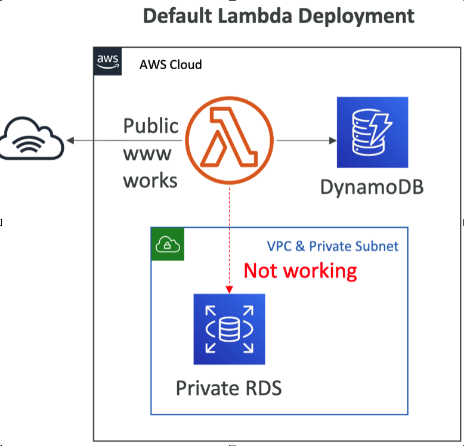
  </p>

  <p align="center">
  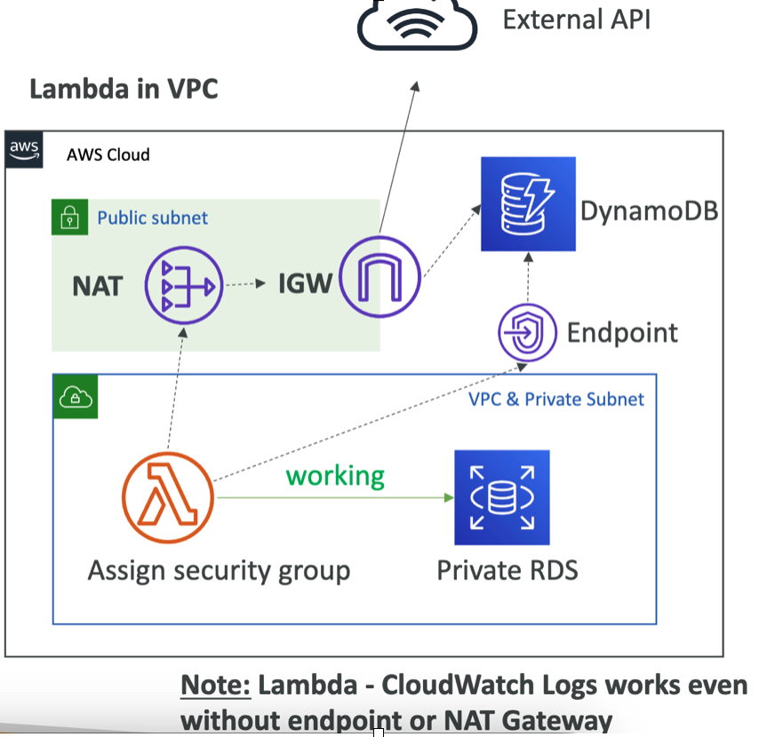
  </p>

### Lambda Function Configuration
- RAM:
    - From 128MB to 10GB in 1MB increments
    - The more RAM you add, the more vCPU credits you get
    - At 1,792 MB, a function has the equivalent of one full vCPU
    - After 1,792 MB, you get more than one CPU, and need to use multi-threading in your code to benefit from it (up to 6 vCPU)
- If your application is CPU-bound (computation heavy), increase RAM
- Timeout: default 3 seconds, maximum is 900 seconds (15 minutes)


### Lambda Execution Environment
- The execution context is a temporary runtime environment that initializes any external dependencies of your lambda code
- Great for database connections, HTTP clients, SDK clients…
- The execution environment is maintained for some time in anticipation of another Lambda function invocation
- The next function invocation can “re-use” the context to execution time and save time in initializing connections objects
- The execution environment includes the `/tmp` directory


#### Initialize outside the handler

<p align="center">
  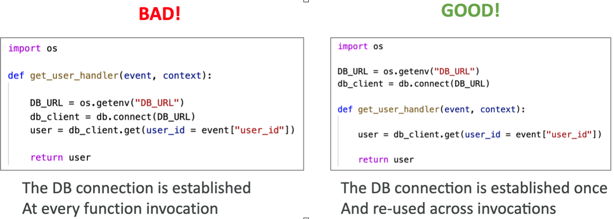
  </p>

#### Lambda Functions `/tmp` space
- If your Lambda function needs to download a big file to work or if your Lambda function needs disk space to perform operations, you can use the `/tmp` directory
- Max size is 10GB
- The directory content remains when the execution context is frozen, providing transient cache that can be used for multiple invocations (helpful to checkpoint your work)
- For permanent persistence of object (non temporary), use S3
- To encrypt content on `/tmp`, you must generate KMS Data Keys


### Lambda Layers
- Custom Runtimes
	- Ex: C++ https://github.com/awslabs/aws-lambda-cpp
	- Ex: Rust https://github.com/awslabs/aws-lambda-rust-runtime
- Externalize Dependencies to re-use them


  <p align="center">
  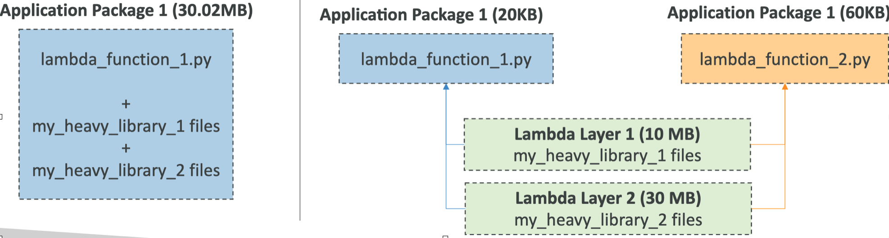
  </p>


#### Lambda – File Systems Mounting
- Lambda functions can access EFS file systems if they are running in a VPC
- Configure Lambda to mount EFS file systems to local directory during 
- initialization
  - Must leverage **EFS Access Points**
- Limitations: watch out for the EFS connection limits (one function instance = one connection) and connection burst limits

<p align="center">
  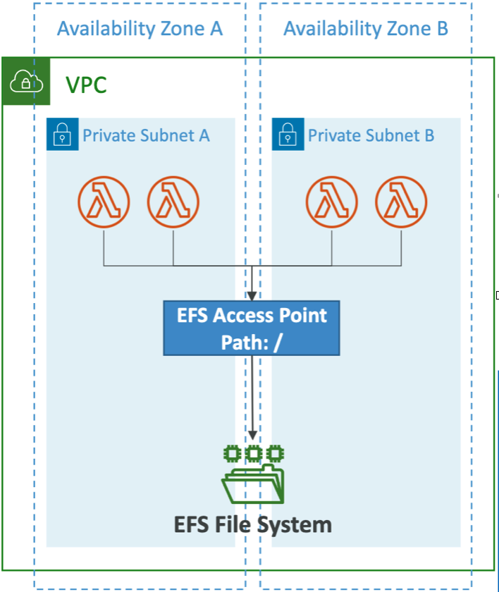
  </p>

#### Lambda Concurrency and Throttling
- Concurrency limit: up to 1000 concurrent executions
- Can set a “reserved concurrency” at the function level (=limit)
- Each invocation over the concurrency limit will trigger a “Throttle”
- Throttle behavior:
	- If synchronous invocation => return ThrottleError - 429
	- If asynchronous invocation => retry automatically and then go to DLQ
- If you need a higher limit, open a support ticket

  <p align="center">
  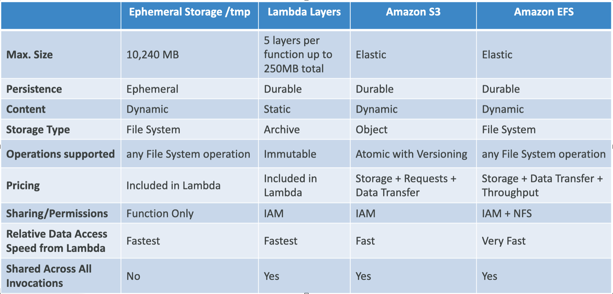
  </p>

#### Lambda Concurrency Issue
- If you don’t reserve (=limit) concurrency, the following can happen:

<p align="center">
  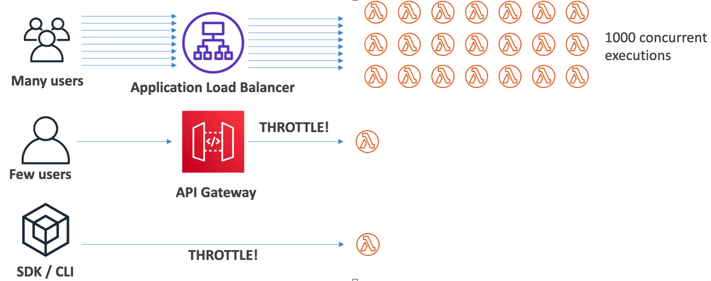
  </p>

#### Concurrency and Asynchronous Invocations

<p align="center">
  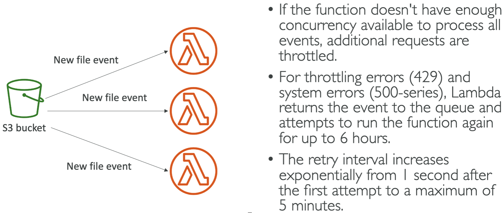
  </p>


#### Cold Starts & Provisioned Concurrency
- Cold Start:
	- New instance => code is loaded and code outside the handler run (init)
	- If the init is large (code, dependencies, SDK…) this process can take some time.
	- First request served by new instances has higher latency than the rest
- Provisioned Concurrency:
	- Concurrency is allocated before the function is invoked (in advance)
	- So the cold start never happens and all invocations have low latency
	- Application Auto Scaling can manage concurrency (schedule or target utilization)


#### Reserved and Provisioned Concurrency


<p align="center">
  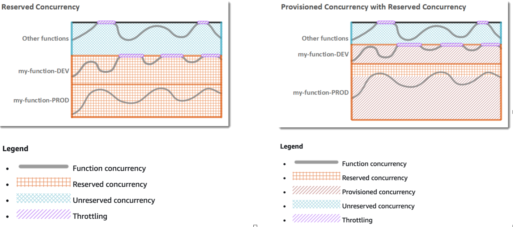
  </p>


### Lambda Function Dependencies

- If your Lambda function depends on external libraries: for example AWS X-Ray SDK, Database Clients, etc, you need to install the packages alongside your code and zip it together
  - For Node.js, use npm & “node_modules” directory
  - For Python, use pip --target options
  - For Java, include the relevant .jar files
- Upload the zip straight to Lambda if less than 50MB, else to S3 first
- Native libraries work: they need to be compiled on Amazon Linux
- AWS SDK comes by default with every Lambda function


### Test Lambda Locally: Lambda Container Images
- Deploy Lambda function as container images of up to 10GB from ECR
- Pack complex dependencies, large dependencies in a container
- Base images are available for Python, Node.js, Java, .NET, Go, Ruby
- Can create your own image as long as it implements the Lambda Runtime API
- Test the containers locally using the Lambda Runtime Interface Emulator
- Unified workflow to build apps

<p align="center">
  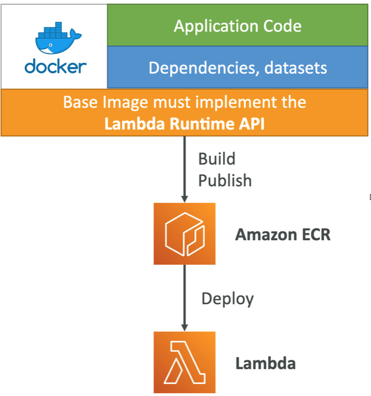
  </p>


#### Lambda Container Images – Best Practices
- Strategies for optimizing container images:
	- Use AWS-provided Base Images
		- Stable, Built on Amazon Linux 2, cached by Lambda service
	- Use Multi-Stage Builds
		- Build your code in larger preliminary images, copy only the artifacts you 					need in your final container image, discard the preliminary steps
	- Build from Stable to Frequently Changing
		- Make your most frequently occurring changes as late in your Dockerfile as possible
- Use a Single Repository for Functions with Large Layers
	- ECR compares each layer of a container image when it is pushed to avoid 					uploading and storing duplicates
- Use them to upload large Lambda Functions (up to 10 GB)


### AWS Lambda Versions
- When you work on a Lambda function, we work on $LATEST
- When we’re ready to publish a Lambda function, we create a version
- Versions are immutable
- Versions have increasing version numbers
- Versions get their own ARN (Amazon Resource Name)
- Version = code + configuration (nothing can be changed - immutable)
- Each version of the lambda function can be accessed

#### AWS Lambda Aliases
- Aliases are ”pointers” to Lambda function versions and have their own ARNs
- We can define a “dev”, ”test”, “prod” aliases and have them point at different lambda versions
- Aliases are mutable
- Aliases enable Canary deployment by assigning weights to lambda functions
- Aliases enable stable configuration of our event triggers / destinations
- Aliases cannot reference aliases

<p align="center">
  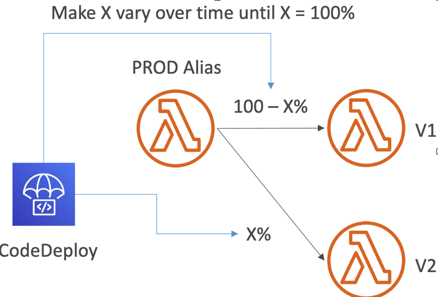
  </p>

#### Lambda & CodeDeploy
- CodeDeploy can help you automate traffic shift for Lambda aliases
- Feature is integrated within the SAM framework
- Linear: grow traffic every N minutes until 100%
  - Linear10PercentEvery3Minutes
  - Linear10PercentEvery10Minutes
- Canary: try X percent then 100%
  - Canary10Percent5Minutes
  - Canary10Percent30Minutes
- AllAtOnce: immediate
- Can create Pre & Post Traffic hooks to check the health of the Lambda function

### Lambda & CodeDeploy – AppSpec.yml

<p align="center">
  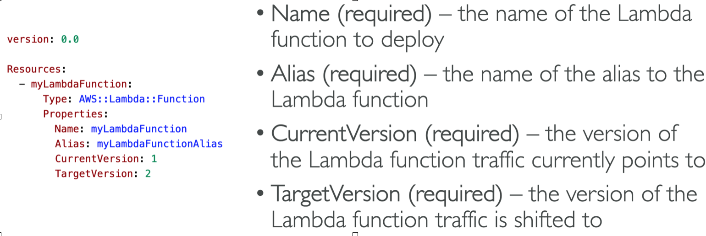
  </p>

### Lambda – Function URL
- Dedicated HTTP(S) endpoint for your Lambda function
- A unique URL endpoint is generated for you (never changes), which looks like this:
`https://<url-id>.lambda-url.<region>.on.aws` (dual-stack IPv4 & IPv6)
- Then it can be invoked via a web browser, curl, Postman, or any HTTP client
- Access your function URL through the public Internet only
- Doesn’t support PrivateLink (Lambda functions do support)
- Supports Resource-based Policies & CORS configurations
- Can be applied to any function alias or to $LATEST (can’t be applied to other function versions)
- Create and configure using AWS Console or AWS API
- Throttle your function by using Reserved Concurrency

<p align="center">
  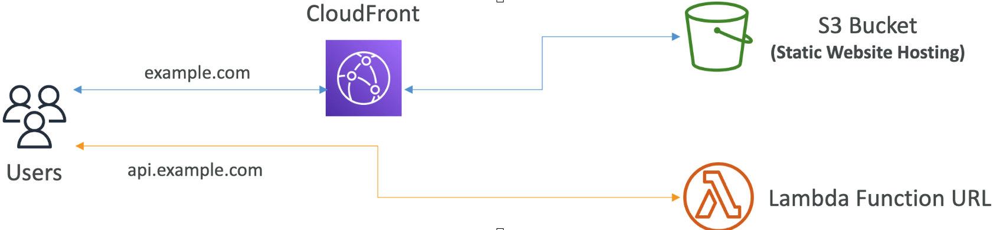
  </p>

#### Lambda – Function URL Security
- Resource-based Policy
	- Authorize other accounts / specific CIDR / IAM principals
- Cross-Origin Resource Sharing (CORS)
	- If you call your Lambda function URL from a different domain


<p align="center">
  
  </p>


#### Lambda – Function URL Security
- **AuthType NONE** – allow public and unauthenticated access
	- Resource-based Policy is always in effect (must grant public access)

        <p align="center">
        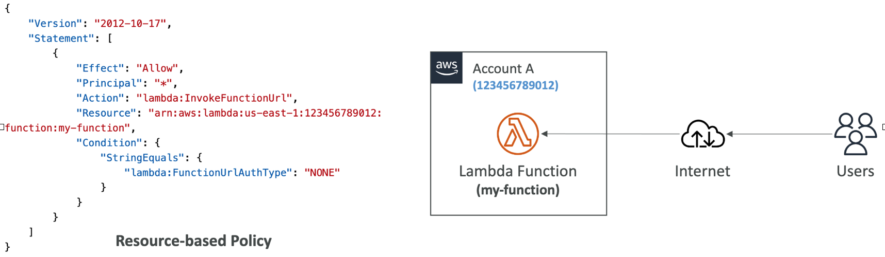
    </p>

- **AuthType AWS_IAM** 
   - IAM is used to authenticate and authorize requests
   - Both Principal’s Identity-based Policy & Resource-based Policy are evaluated
	-  Principal must have `lambda:InvokeFunctionUrl` permissions
	- Same account 
    	- Identity-based Policy OR Resource-based Policy as ALLOW
	- Cross account 
        -  Identity-based Policy AND Resource Based Policy as ALLOW

    <p align="center">
  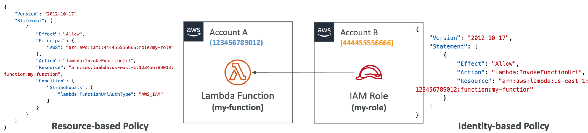
  </p>


### Lambda and CodeGuru Profiling
- Gain insights into runtime performance of your Lambda functions using CodeGuru Profiler
- CodeGuru creates a Profiler Group for your Lambda function
- Supported for Java and Python runtimes
- Activate from AWS Lambda Console
- When activated, Lambda adds:
	- CodeGuru Profiler layer to your function
	- Environment variables to your function
	- AmazonCodeGuruProfilerAgentAccess policy to your function


### AWS Lambda Limits to Know - per region
- Execution:
	- Memory allocation: 128 MB – 10GB (1 MB increments)
	- Maximum execution time: 900 seconds (15 minutes)
	- Environment variables (4 KB)
	- Disk capacity in the “function container” (in `/tmp`): 512 MB to 10GB
	- Concurrency executions: 1000 (can be increased)
- Deployment:
	- Lambda function deployment size (compressed .zip): 50 MB
	- Size of uncompressed deployment (code + dependencies): 250 MB
	- Can use the /tmp directory to load other files at startup
	- Size of environment variables: 4 KB


### AWS Lambda Best Practices
- Perform heavy-duty work outside of your function handler
	- Connect to databases outside of your function handler
	- Initialize the AWS SDK outside of your function handler
	- Pull in dependencies or datasets outside of your function handler
- Use environment variables for:
	- Database Connection Strings, S3 bucket, etc… don’t put these values in your code
	- Passwords, sensitive values… they can be encrypted using KMS
- Minimize your deployment package size to its runtime necessities.
	- Break down the function if need be
	- Remember the AWS Lambda limits
	- Use Layers where necessary
- Avoid using recursive code, never have a Lambda function call itself


## DynamoDB

#### Traditional Architecture
Traditional applications leverage RDBMS databases. These databases have the SQL query language. Strong requirements about how the data should be modeled. They provide ability to do query joins, aggregations, complex computations. Could be scaled vertical (replaced by a more powerful CPU / RAM / IO) or horizontal scaling (increasing reading capability by adding EC2 / RDS Read Replicas).

#### NoSQL databases
- NoSQL databases are non-relational databases and are distributed
- NoSQL databases include MongoDB, DynamoDB, …
- NoSQL databases do not support query joins (or just limited support), don’t perform aggregations such as “SUM”, “AVG”
- All the data that is needed for a query is present in one row
- NoSQL databases scale horizontally


### Amazon DynamoDB
- Fully managed, highly available with replication across multiple AZs
- Scales to massive workloads, distributed database
- Millions of requests per seconds, trillions of row, 100s of TB of storage
- Fast and consistent in performance (low latency on retrieval)
- Integrated with IAM for security, authorization and administration
- Enables event driven programming with DynamoDB Streams
- Low cost and auto-scaling capabilities
- Standard & Infrequent Access (IA) Table Class

#### DynamoDB - Basics
- DynamoDB is made of Tables
- Each table has a **Primary Key **(must be decided at creation time)
- Data is stored in partitions. **Partition Keys** go through a hashing algorithm to know to which partition they go to
- Each table can have an infinite number of items (= rows)
- Each item has attributes (can be added over time – can be null)
- Maximum size of an item is 400KB
- Data types supported are:
  - Scalar Types – String, Number, Binary, Boolean, Null
  - Document Types – List, Map
    - Set Types – String Set, Number Set, Binary Set

### DynamoDB – Primary Keys
- Option 1: **Partition Key (HASH)**
  - Partition key must be unique for each item
  - Partition key must be “diverse” so that the data is well distributed
  - Example: “User_ID” for a users table

<p align="center">
  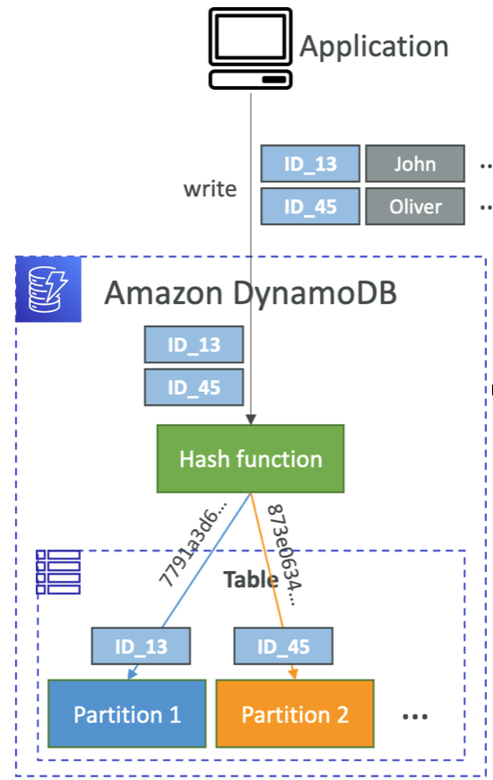
  </p>

- Option 2: **Partition Key + Sort Key (HASH + RANGE)**
  - The combination must be unique for each item
  - Data is grouped by partition key
  - Example: users-games table, “User_ID” for Partition Key and “Game_ID” for Sort Key


  <p align="center">
  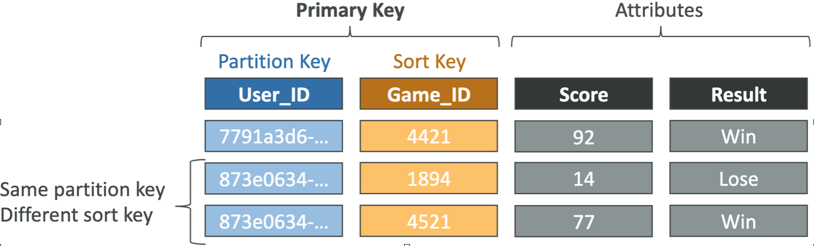
  </p>


### DynamoDB – Read/Write Capacity Modes
Control how you manage your table’s capacity of read/write throughput
- **Provisioned Mode** (default)
  - You need to plan capacity beforehand. 
    - You specify the number of reads/writes per second
  - Pay for provisioned read & write capacity units
- **On-Demand** Mode
  - Read/writes automatically scale up/down with your workloads
  - No capacity planning needed
  - Pay for what you use, more expensive ($$$)

You can switch between different modes once every 24 hours

#### R/W Capacity Modes – Provisioned
- Table must have provisioned read and write capacity units
- Read Capacity Units (RCU) – throughput for reads
- Write Capacity Units (WCU) – throughput for writes
- Option to setup auto-scaling of throughput to meet demand
- Throughput can be exceeded temporarily using “Burst Capacity”
- If Burst Capacity has been consumed, you’ll get a
  `ProvisionedThroughputExceededException`
- It’s then advised to do an exponential backoff retry


#### DynamoDB – Write Capacity Units (WCU)
- One Write Capacity Unit (WCU) represents one write per second for an item up to 1 KB in size
- If the items are larger than 1 KB, more WCUs are consumed
- Example 1: we write 10 items per second, with item size 2 KB
  - We need 10 ∗ (2 KB/1 KB) = 20 𝑊𝐶𝑈𝑠
- Example 2: we write 6 items per second, with item size 4.5 KB
  - We need 6 ∗ (5 KB/ 1 KB) = 30 𝑊𝐶𝑈𝑠 (4.5 gets rounded to the upper KB)
- Example 3: we write 120 items per minute, with item size 2 KB
  - We need 120/60 ∗ (2 KB / 1 KB) = 4 𝑊𝐶𝑈𝑠

#### Strongly Consistent Read vs. Eventually Consistent Read
- **Eventually Consistent Read (default)**
  - If we read just after a write, it’s possible we’ll get some stale 			data because of replication
- **Strongly Consistent Read**
  - If we read just after a write, we will get the correct data
  - Set “ConsistentRead” parameter to True in API calls 				(GetItem, BatchGetItem, Query, Scan)
  - **Consumes twice the RCU**


#### DynamoDB – Read Capacity Units (RCU)
One Read Capacity Unit (RCU) represents one Strongly Consistent Read per second, or two Eventually Consistent Reads per second, for an item up to 4 KB in size
- Example: 16 Eventually Consistent Reads per second, with item size 12 KB
  - We need 16/2 * 12 KB/4 KB = 24 𝑅𝐶𝑈𝑠
- Example: 10 Strongly Consistent Reads per second, with item size 6 KB
  - We need 10 ∗ 8 KB/ 4 KB = 20 𝑅𝐶𝑈𝑠 (we must round up 6 KB to 8 KB)


#### DynamoDB – Throttling
WCUs and RCUs are spread evenly across partitions. If we exceed provisioned RCUs or WCUs, we get `ProvisionedThroughputExceededException`
- Reasons:
  - Hot Keys – one partition key is being read too many times (e.g., popular item)
  - Hot Partitions
  - Very large items, remember RCU and WCU depends on size of items
- Solutions:
  - **Exponential backoff** when exception is encountered (already in SDK)
  - **Distribute partition keys** as much as possible
  - If RCU issue, we can use **DynamoDB Accelerator (DAX)**


#### R/W Capacity Modes – On-Demand
- Read/writes automatically scale up/down with your workloads
- No capacity planning needed (WCU / RCU)
- Unlimited WCU & RCU, no throttle, more expensive
- You’re charged for reads/writes that you use in terms of RRU and WRU
- Read Request Units (RRU) – throughput for reads (same as RCU)
- Write Request Units (WRU) – throughput for writes (same as WCU)
- 2.5x more expensive than provisioned capacity (use with care)
- Use cases: unknown workloads, unpredictable application traffic, …


#### DynamoDB – Writing Data
- `PutItem`
  - Creates a new item or fully replace an old item (same Primary Key)
  - Consumes WCUs
- `UpdateItem`
  - Edits an existing item’s attributes or adds a new item if it doesn’t exist
  - Can be used to implement Atomic Counters – a numeric attribute that’s unconditionally incremented
- **Conditional Writes**
  - Accept a write/update/delete only if conditions are met, otherwise returns an error
  - Helps with concurrent access to items
  - No performance impact

#### DynamoDB – Reading Data
- `GetItem`
  - Read based on Primary key. Primary Key can be HASH or HASH+RANGE
  - Eventually Consistent Read (default)
  - Option to use Strongly Consistent Reads (more RCU - might take longer)
  - ProjectionExpression can be specified to retrieve only certain attributes


#### DynamoDB – Reading Data (Query)
- Query returns items based on:
  - KeyConditionExpression
    - Partition Key value (must be = operator) – required
    - Sort Key value (=, <, <=, >, >=, Between, Begins with) – optional
  - FilterExpression
    - Additional filtering after the Query operation (before data returned to you)
    - Use only with non-key attributes (does not allow HASH or RANGE attributes)
- Returns:
  - The number of items specified in Limit Or up to 1 MB of data
  - Ability to do pagination on the results
- Can query table, a Local Secondary Index, or a Global Secondary Index


#### DynamoDB – Reading Data (Scan)
- Scan the entire table and then filter out data (inefficient)
- Returns up to 1 MB of data – use pagination to keep on reading
- Consumes a lot of RCU
- Limit impact using Limit or reduce the size of the result and pause
- For faster performance, use **Parallel Scan**
  - Multiple workers scan multiple data segments at the same time
  - Increases the throughput and RCU consumed
  - Limit the impact of parallel scans just like you would for Scans
- Can use ProjectionExpression & FilterExpression (no changes to RCU)


#### DynamoDB – Deleting Data
- `DeleteItem`
  - Delete an individual item
  - Ability to perform a conditional delete
- `DeleteTable`
  - Delete a whole table and all its items
  - Much quicker deletion than calling DeleteItem on all items


#### DynamoDB – Batch Operations
- Allows you to save in latency by reducing the number of API calls
- Operations are done in parallel for better efficiency
- Part of a batch can fail; in which case we need to try again for the failed items
- `BatchWriteItem`
  - Up to 25 PutItem and/or DeleteItem in one call
  - Up to 16 MB of data written, up to 400 KB of data per item
  - Can’t update items (use UpdateItem)
  - UnprocessedItems for failed write operations (exponential backoff or add WCU)
- `BatchGetItem`
  - Return items from one or more tables
  - Up to 100 items, up to 16 MB of data
  - Items are retrieved in parallel to minimize latency
  - UnprocessedKeys for failed read operations (exponential backoff or add RCU)

#### DynamoDB – PartiQL
- SQL-compatible query language for DynamoDB
- Allows you to select, insert, update, and delete data in DynamoDB using SQL
- Run queries across multiple DynamoDB tables
- Run PartiQL queries from:
  - AWS Management Console
  - NoSQL Workbench for DynamoDB
  - DynamoDB APIs
  - AWS CLI
  - AWS SDK
- It supports Batch operations


#### DynamoDB – Conditional Writes
- For PutItem, UpdateItem, DeleteItem, and BatchWriteItem
- You can specify a Condition Expression to determine which items should be modified:
  - attribute_exists
  - attribute_not_exists
  - attribute_type
  - contains (for string)
  - begins_with (for string)
  - ProductCategory IN (:cat1, :cat2) and Price between :low and :high
  - size (string length)

Note: Filter Expression filters the results of read queries, while Condition Expressions are for write operations


#### Conditional Writes – Example on Update Item

<p align="center">
  
  </p>


#### Conditional Writes – Example on Delete Item

<p align="center">
  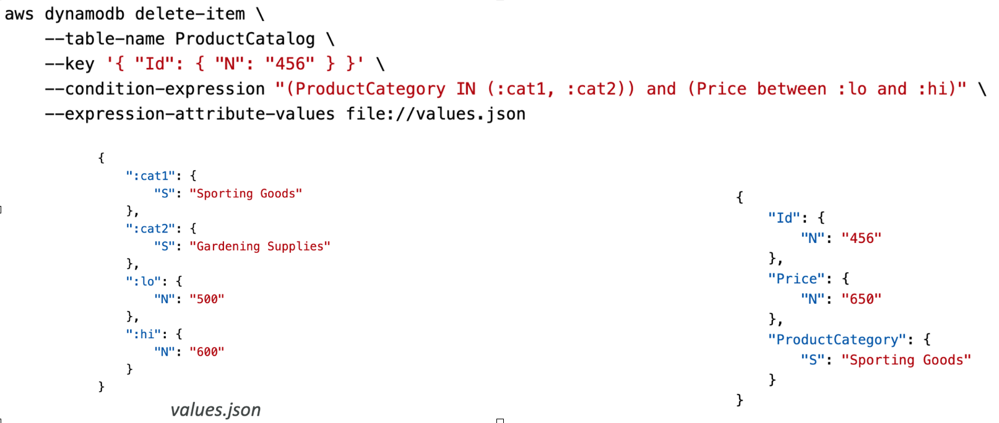
  </p>


##### attribute_not_exists
- Only succeeds if the attribute doesn’t exist yet (no value)

  <p align="center">
  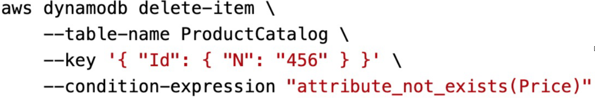
  </p>


#### Conditional Writes – Do Not Overwrite Elements
- attribute_not_exists(partition_key)
  - Make sure the item isn’t overwritten
- attribute_not_exists(partition_key) and attribute_not_exists(sort_key)
  - Make sure the partition / sort key combination is not overwritten


##### Conditional Writes – Example of String Comparisons
- begins_with – check if prefix matches
- contains – check if string is contained in another string


<p align="center">
  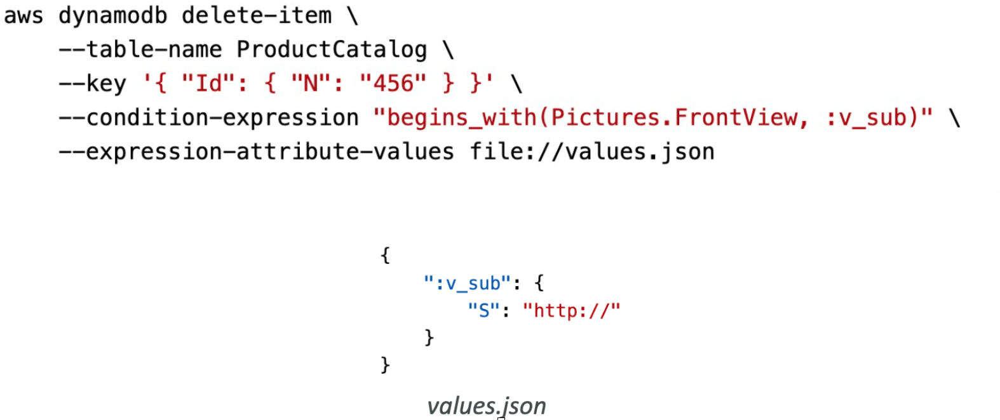
  </p>


#### DynamoDB – Local Secondary Index (LSI)
- Alternative Sort Key for your table (same Partition Key as that of base table)
- The Sort Key consists of one scalar attribute (String, Number, or Binary)
- Up to 5 Local Secondary Indexes per table
- **Must be defined at table creation time**
- Attribute Projections – can contain some or all the attributes of the base table (KEYS_ONLY, INCLUDE, ALL)

<p align="center">
  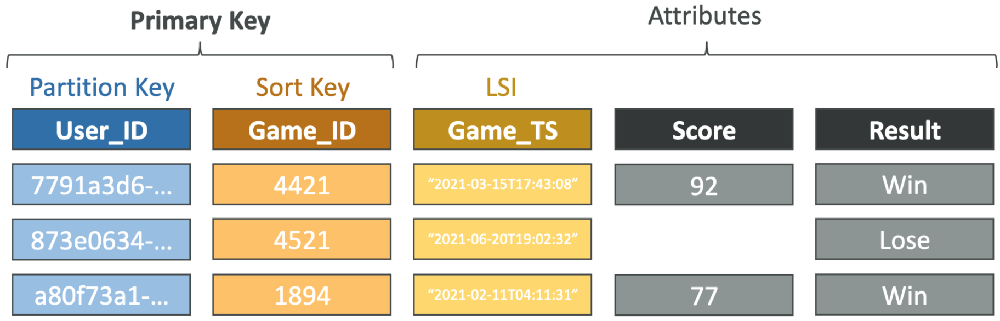
  </p>


#### DynamoDB - Global Secondary Index (GSI)
- **Alternative Primary Key (HASH or HASH+RANGE)** from the base table
- S*peed up queries on non-key attributes*
- The Index Key consists of scalar attributes (String, Number, or Binary)
- Attribute Projections – some or all the attributes of the base table (KEYS_ONLY, INCLUDE, ALL)
- Must provision RCUs & WCUs for the index
- Can be added/modified after table creation
- Queries on this index **support eventual consistency only**


<p align="center">
  
  </p>

#### DynamoDB – Indexes and Throttling
- **Global Secondary Index (GSI)**:
  - If the writes are throttled on the GSI, then the main table will be throttled! Even if the WCU on the main tables are fine
  - Choose your GSI partition key carefully!
  - Assign your WCU capacity carefully!
- **Local Secondary Index (LSI)**:
  - **Uses the WCUs and RCUs of the main table**
  - No special throttling considerations

#### DynamoDB – Optimistic Locking
- DynamoDB has a feature called “Conditional Writes”
- A strategy to ensure an item hasn’t changed before you update/delete it (**avoid concurrent writing**)
- Each item has an attribute that acts as a **version number**


### DynamoDB Accelerator (DAX)
- Solves the **“Hot Key” problem** (too many reads) by caching the most frequently used items in DynamoDB table 
- Fully-managed, highly available, seamless **in-memory cache** for 	DynamoDB
- Microseconds latency for cached reads & queries
- Doesn’t require application logic modification (compatible with 		existing DynamoDB APIs)
- 5 minutes TTL for cache (default)
- Up to 10 nodes in the cluster
- Multi-AZ (3 nodes minimum recommended for production)
- Secure (Encryption at rest with KMS, VPC, IAM, CloudTrail, …)

<p align="center">
  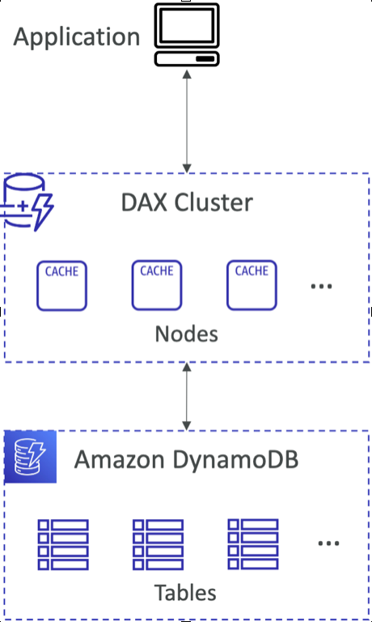
  </p>


#### DynamoDB Accelerator (DAX) vs. ElastiCache


<p align="center">
  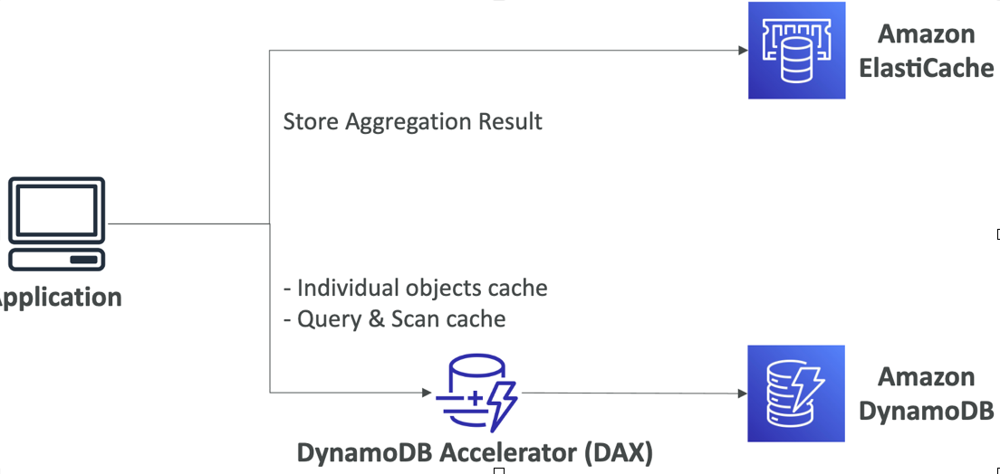
  </p>


### DynamoDB Streams
- Stream is ordered sequence of item-level modifications (create/update/delete) in a table
- Stream records can be:
  - Sent to Kinesis Data Streams
  - Read by AWS Lambda
  - Read by Kinesis Client Library applications
- Data Retention for up to 24 hours
- Use cases:
  - React to changes in real-time (welcome email to users)
  - Analytics
  - Insert into derivative tables
  - Insert into OpenSearch Service
  - Implement cross-region replication


<p align="center">
  
  </p>


#### DynamoDB Streams
- Ability to choose the information that will be written to the stream:
  - KEYS_ONLY – only the key attributes of the modified item
  - NEW_IMAGE – the entire item, as it appears after it was modified
  - OLD_IMAGE – the entire item, as it appeared before it was modified
  - NEW_AND_OLD_IMAGES – both the new and the old images of the item
- DynamoDB Streams are made of shards, just like Kinesis Data Streams
- You don’t provision shards, this is automated by AWS
- Records are not retroactively populated in a stream after enabling it


#### DynamoDB Streams & AWS Lambda

- You need to define an Event Source Mapping to read from a DynamoDB Streams
- You need to ensure the Lambda function has the appropriate permissions
- Your Lambda function is invoked synchronously

  <p align="center">
  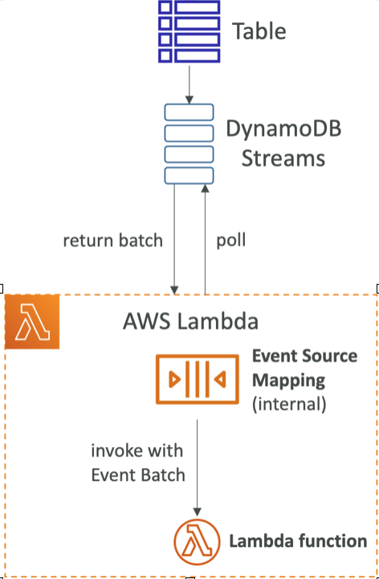
  </p>

### DynamoDB – Time To Live (TTL)
- Automatically delete items after an expiry timestamp
- Doesn’t consume any WCUs (i.e., no extra cost)
- The TTL attribute must be a “Number” data type with “Unix Epoch timestamp” value
- Expired items deleted within 48 hours of expiration
- Expired items, that haven’t been deleted, appears in reads/queries/scans (if you don’t want them, filter them out)
- Expired items are deleted from both LSIs and GSIs
- A delete operation for each expired item enters the DynamoDB Streams (can help recover expired items)
- Use cases: reduce stored data by keeping only current items, adhere to regulatory obligations, …

<p align="center">
  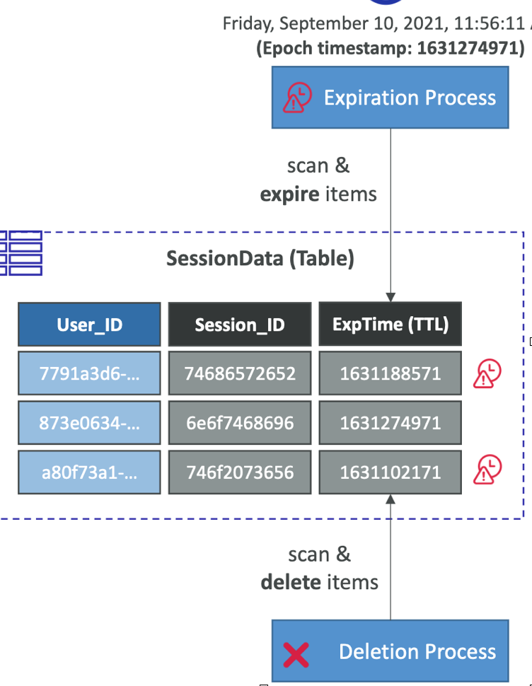
  </p>

### DynamoDB CLI – Good to Know
- --projection-expression: one or more attributes to retrieve
- --filter-expression: filter items before returned to you
- General AWS CLI Pagination options (e.g., DynamoDB, S3, …)
- --page-size: specify that AWS CLI retrieves the full list of items but with a larger
number of API calls instead of one API call (default: 1000 items)
- --max-items: max. number of items to show in the CLI (returns NextToken)
- --starting-token: specify the last NextToken to retrieve the next set of items

  <p align="center">
  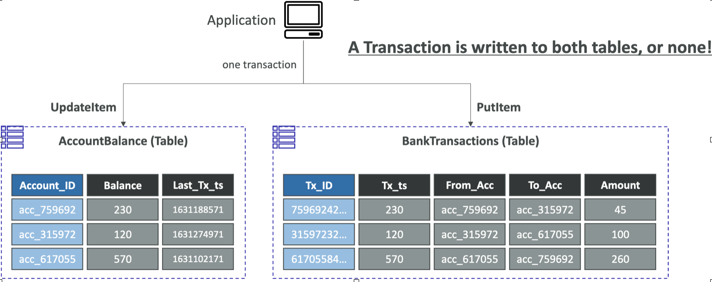
  </p>

### DynamoDB Transactions
- Coordinated, all-or-nothing operations (add/update/delete) to multiple items across one or more tables
- Provides **Atomicity**, **Consistency**, **Isolation**, and **Durability** (ACID)
- Read Modes – Eventual Consistency, Strong Consistency, Transactional
- Write Modes – Standard, Transactional
- Consumes 2x WCUs & RCUs
  - DynamoDB performs 2 operations for every item (prepare & commit)
- Two operations:
  - TransactGetItems – one or more GetItem operations
  - TransactWriteItems – one or more PutItem, UpdateItem, and DeleteItem operations
- Use cases: financial transactions, managing orders, multiplayer games, …

  <p align="center">
  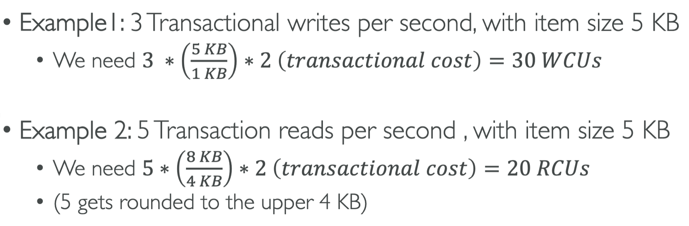
  </p>


### DynamoDB as Session State Cache
- It’s common to use DynamoDB to store session states
- vs. ElastiCache
  - ElastiCache is in-memory, but DynamoDB is serverless
  - Both are key/value stores
- vs. EFS
  - EFS must be attached to EC2 instances as a network drive
- vs. EBS & Instance Store
  - EBS & Instance Store can only be used for local caching, not shared caching
- vs. S3
  - S3 is higher latency, and not meant for small objects


#### DynamoDB - Large Objects
- DynamoDB  provides a metadata storage for large data in S3
- User search items is DynamoDB
- Application finds the associated object in S3 and retunr it to the user

<p align="center">
  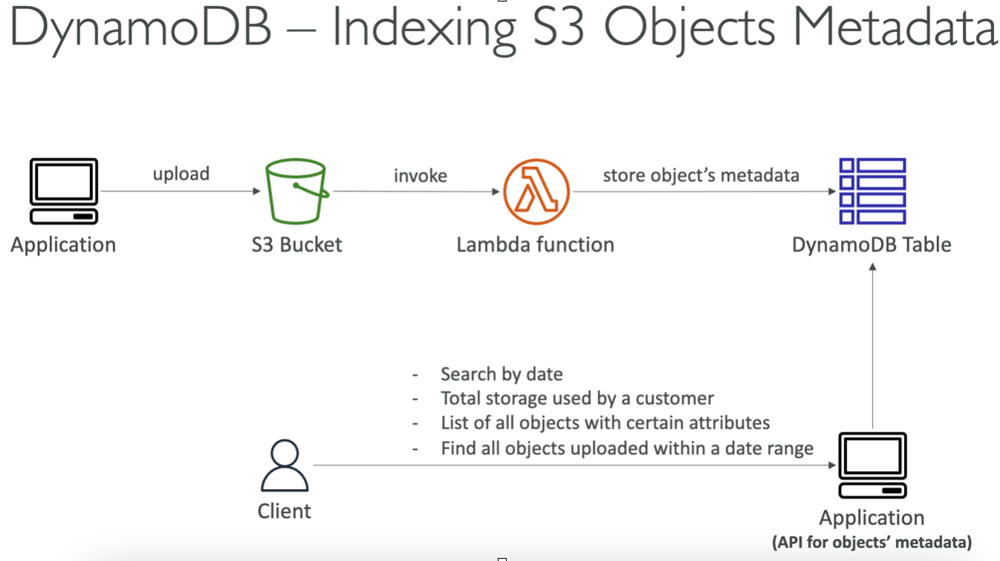
  </p>


### DynamoDB – Security & Other Features
- Security
  - VPC Endpoints available to access DynamoDB without using the Internet
  - Access fully controlled by IAM
  - Encryption at rest using AWS KMS and in-transit using SSL/TLS
- Backup and Restore feature available
  - Point-in-time Recovery (PITR) like RDS
  - No performance impact
- Global Tables
  - Multi-region, multi-active, fully replicated, high performance
- DynamoDB Local
  - Develop and test apps locally without accessing the DynamoDB web service 				(without Internet)
- AWS Database Migration Service (AWS DMS) can be used to migrate to DynamoDB (from MongoDB, Oracle, MySQL, S3, …)


<p align="center">
  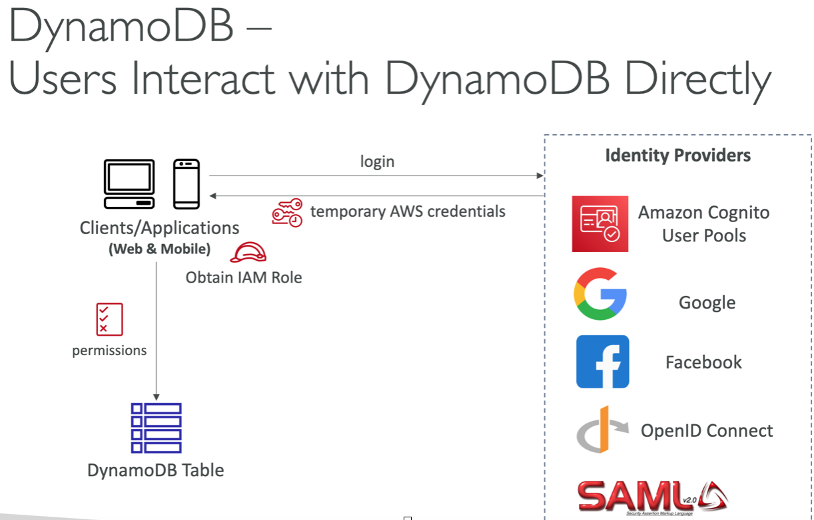
  </p>


#### DynamoDB - Fine-Grained Control

<p align="center">
  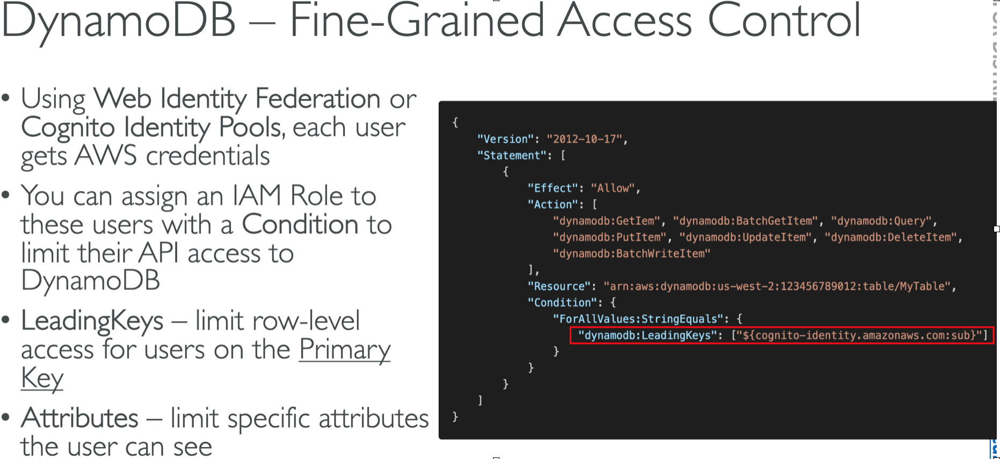
  </p>


## API Gateway


AWS API Gateway
- AWS Lambda + API Gateway: No infrastructure to manage
- Support for the **WebSocket Protocol**
- Handle **API versioning** (v1, v2…), handle different environments (dev, test, prod…)
- Handle **security** (Authentication and Authorization)
- Create API keys, handle **request throttling**
- Swagger / Open API import to quickly define APIs
- Transform and validate requests and responses
- Generate SDK and API specifications
- Cache API responses


<p align="center">
  
  </p>


#### API Gateway – Integrations High Level
- **Lambda Function**
  - Invoke Lambda function
  - Easy way to expose REST API backed by AWS Lambda
- **HTTP**
  - Expose HTTP endpoints in the backend
    - Example: internal HTTP API on premise, Application Load Balancer…
  - Why? **Add rate limiting**, **caching**, **user authentications**, API keys, etc…
- **AWS Service**
  - Expose any AWS API through the API Gateway
  - Example: start an AWS Step Function workflow, post a message to SQS
  - Why? Add authentication, deploy publicly, rate control…


#### API Gateway – AWS Service Integration
##### Kinesis Data Streams example
For sending data to AWS API Gateway, you can use the standard HTTP API to upload data in chunks. However, for a truly continuous data stream from or to the gateway, WebSockets are the more appropriate technology. You can learn how to build a WebSocket API in the AWS documentation. 


<p align="center">
  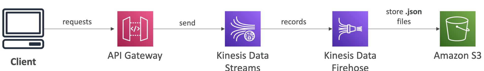
  </p>

#### API Gateway - Endpoint Types
- Edge-Optimized (default): For global clients
  - Requests are routed through the CloudFront Edge locations (improves latency)
  - The API Gateway still lives in only one region
- Regional:
  - For clients within the same region
  - Could manually combine with CloudFront (more control over the caching strategies and the distribution)
- Private:
  - Can only be accessed from your VPC using an interface VPC endpoint (ENI)
  - Use a resource policy to define access

#### API Gateway – Security
- User Authentication through
  - IAM Roles (useful for internal applications)
  - Cognito (identity for external users – example mobile users)
  - Custom Authorizer (your own logic)
- Custom Domain Name HTTPS security through integration with AWS Certificate Manager (ACM)
  - If using Edge-Optimized endpoint, then the certificate must be in us-east-1
  - If using Regional endpoint, the certificate must be in the API Gateway region
  - Must setup CNAME or A-alias record in Route 53

#### API Gateway – Deployment Stages
- Making changes in the API Gateway does not mean they’re effective
- You need to make a “deployment” for them to be in effect
- Changes are deployed to “Stages” (as many as you want)
- Use the naming you like for stages (dev, test, prod)
- Each stage has its own configuration parameters
- Stages can be rolled back as a history of deployments is kept

API Gateway – Stages v1 and v2 API breaking change


<p align="center">
  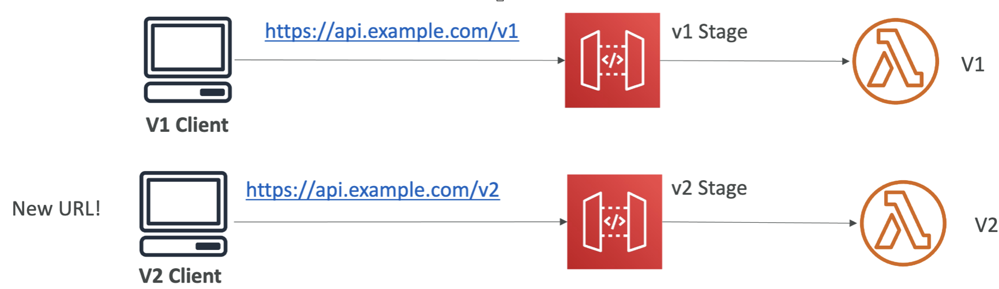
  </p>


### API Gateway – Stage Variables
- Stage variables are like environment variables for API Gateway
- Use them to change often changing configuration values
- They can be used in:
  - Lambda function
  - HTTP Endpoint
  - Parameter mapping templates
- Use cases:
  - Configure HTTP endpoints your stages talk to (dev, test, prod…)
  - Pass configuration parameters to AWS Lambda through mapping templates
- Stage variables are passed to the ”context” object in AWS Lambda
- Format: `${stageVariables.variableName}`


#### API Gateway Stage Variables & Lambda Aliases
We create a stage variable to indicate the corresponding Lambda alias. Our API gateway will automatically invoke the right Lambda function


<p align="center">
  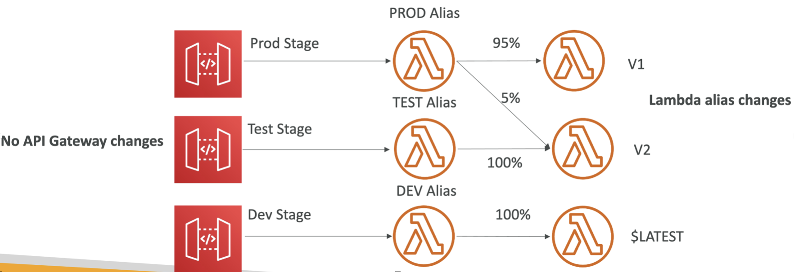
  </p>


#### API Gateway – Canary Deployment
- Possibility to enable canary deployments for any stage (usually prod); allows small amount of traffic on the new changes in your API Gateway to monitor the performance
- Choose the % of traffic the canary channel receives


<p align="center">
  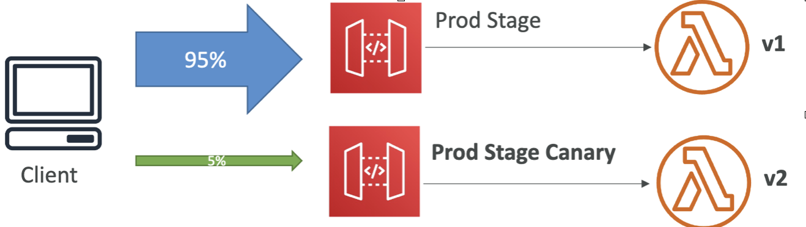
  </p>


• Metrics & Logs are separate (for better monitoring)
• Possibility to override stage variables for canary
• This is blue / green deployment with AWS Lambda & API Gateway

#### API Gateway - Integration Types
- Integration **Type MOCK**
  - API Gateway returns a response without sending the request to the backend
- Integration **Type HTTP** / AWS (Lambda & AWS Services)
  - You must configure both the **integration request** and **integration response**
  - Setup **data mapping** using mapping templates for the request & response


<p align="center">
  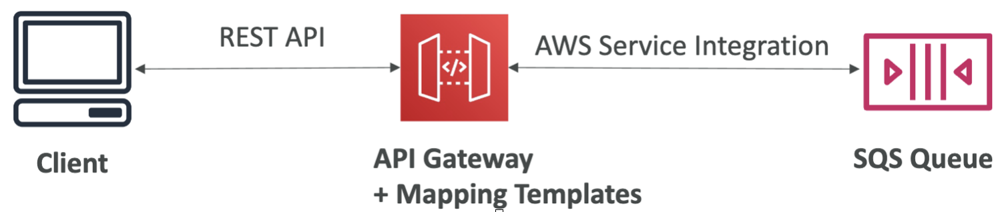
  </p>


- Integration Type **AWS_PROXY** (Lambda Proxy)
  • Incoming request from the client is the input to Lambda
  • The function is responsible for the logic of request / response
  • No mapping template, headers, query string parameters… are passed as arguments


<p align="center">
  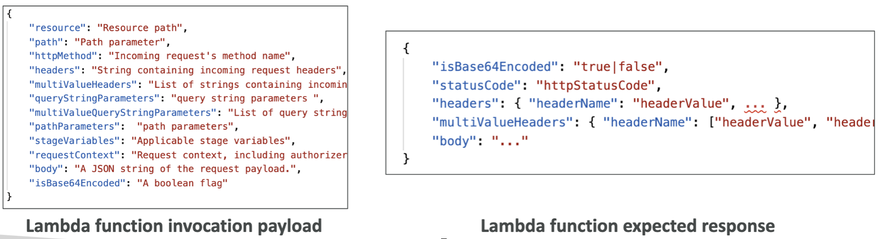
  </p>


• Integration Type **HTTP_PROXY**
  • No mapping template
  • The HTTP request is passed to the backend
  • The HTTP response from the backend is forwarded by API Gateway
  • Possibility to add HTTP Headers if need be (ex: API key)


<p align="center">
  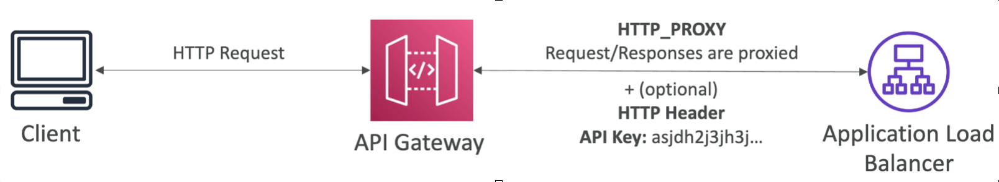
  </p>


#### Mapping Templates (AWS & HTTP Integration)
- Only applicable if we integrate with a AWS service or HTTP without using proxy methods
- Mapping templates can be used to modify request / responses
- Rename / Modify query string parameters, Modify body content, Add headers
- Uses Velocity Template Language (VTL): for loop, if etc…
- Filter output results (remove unnecessary data)
- Content-Type can be set to application/json or application/xml


##### Mapping Example: JSON to XML with SOAP
- SOAP API are XML based, whereas REST API are JSON based
- In this case, API Gateway should:
  - Extract data from the request: either path, payload or header
  - Build SOAP message based on request data (mapping template)
  - Call SOAP service and receive XML response
  - Transform XML response to desired format (like JSON), and respond to the user


<p align="center">
  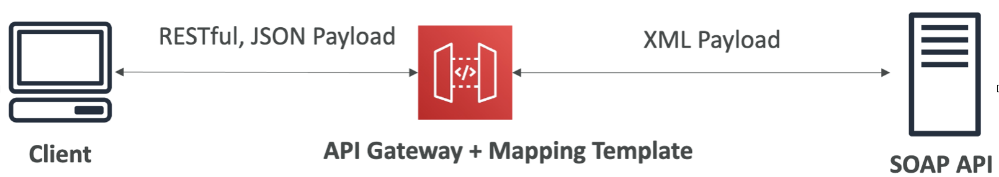
  </p>


#### Mapping Example: Query String parameters


<p align="center">
  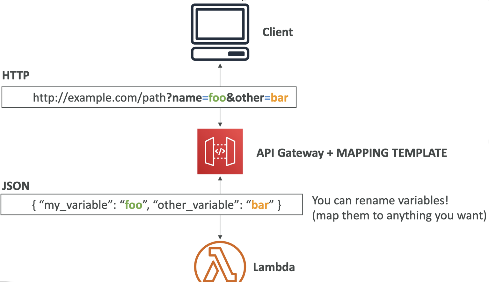
  </p>


### API Gateway - Open API spec
- Common way of defining REST APIs, using API definition as code
- Import existing OpenAPI 3.0 spec to API Gateway in YAML or JSON containing
  - Method
  - Method Request
  - Integration Request
  - Method Response
  - AWS extensions for API gateway and setup every single option
- Can also export current API as OpenAPI spec
- Using OpenAPI we can generate SDK for our applications


### REST API – Request Validation
- You can configure API Gateway to perform basic validation of an API request before proceeding with the integration request
- Checks:
  - The required request parameters in the URI, query string, and headers of an incoming request are included and non-blank
  - The applicable request payload adheres to the configured JSON Schema request model of the method
- When the validation fails, API Gateway immediately fails the request
  - Returns a 400-error response to the caller
- This reduces unnecessary calls to the backend


#### REST API – RequestValidation – OpenAPI
Setup request validation by importing OpenAPI definitions file


<p align="center">
  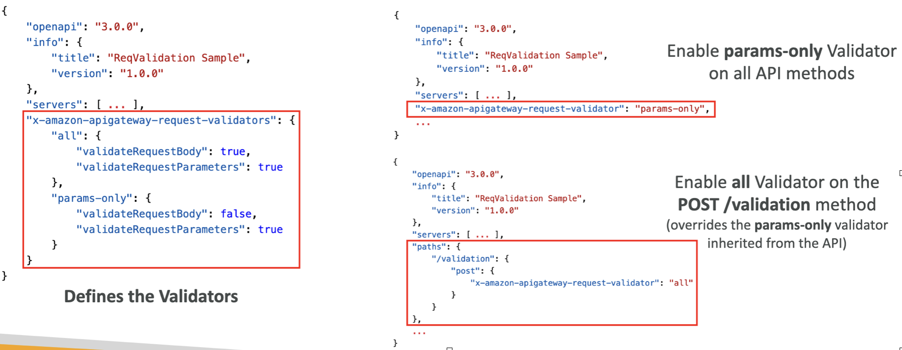
  </p>


### Caching API responses
- API first checks cache to find a response before using the backend
- Caching reduces the number of calls made to the backend
- Default TTL (time to live) is 300 seconds (min: 0s, max: 3600s)
- Caches are defined **per stage**
- Possible to override cache settings per method
- Cache encryption option
- Cache capacity between 0.5GB to 237GB
- Cache is expensive, makes sense in production, may not make sense in dev / test

<p align="center">
  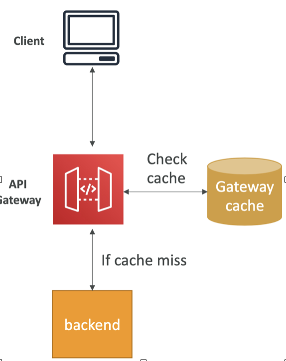
  </p>


#### API Gateway Cache Invalidation
- Able to flush the entire cache (invalidate it) immediately
- Clients can invalidate the cache with header: `Cache-Control: max-age=0` (with proper IAM authorization)
- If you don't impose an **InvalidateCache policy** (or choose the Require authorization check box in the console), any client can invalidate the API cache

<p align="center">
  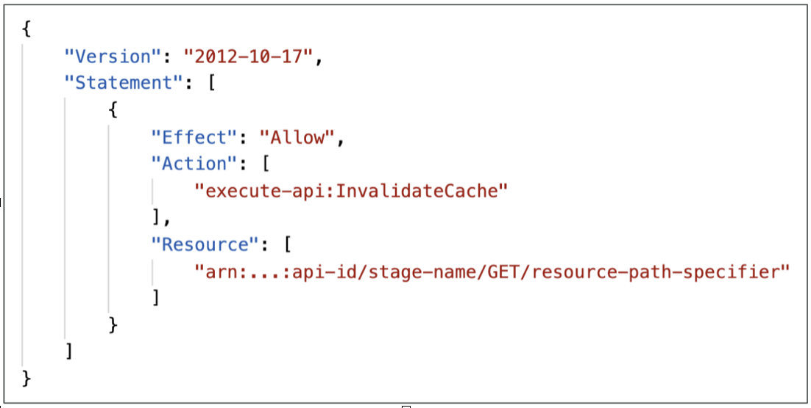
  </p>


### API Gateway – Usage Plans & API Keys
If you want to make an API available as an offering ($) to your customers, you have 2 options:
- **Usage Plan**:
  - who can access one or more deployed API stages and methods
  - how much and how fast they can access them
  - uses API keys to identify API clients and meter access
  - configure throttling limits and quota limits that are enforced on individual client
- **API Keys**:
  - alphanumeric string values to distribute to your customers
    - Ex: WBjHxNtoAb4WPKBC7cGm64CBibIb24b4jt8jJHo9
  - Can use with usage plans to control access
  - Throttling limits are applied to the API keys
  - Quotas limits is the overall number of maximum requests

#### API Gateway – Correct Order for API keys
To configure a usage plan:
1. Create one or more APIs, configure the methods to require an API key, and 			    deploy the APIs to stages
2. Generate or import API keys to distribute to application developers (your customers) who will be using your API.
3. Create the usage plan with the desired throttle and quota limits.
4. Associate API stages and API keys with the usage plan.
Callers of the API must supply an assigned API key in the x-api-key header in requests to the API

### API Gateway – Logging & Tracing
- **CloudWatch Logs**
  - Log contains information about request/response body
  - Enable CloudWatch logging at the Stage level (with Log Level - ERROR, DEBUG, INFO)
  - Can override settings on a per API basis


<p align="center">
  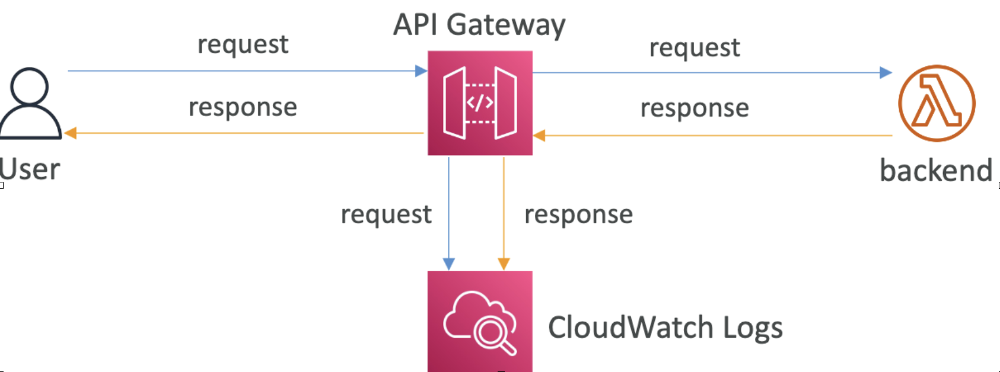
  </p>


- **X-Ray**
  - Enable tracing to get extra information about requests in API Gateway
  - X-Ray API Gateway + AWS Lambda gives you the full picture


#### API Gateway – CloudWatch Metrics
Metrics are *by stage*, Possibility to enable detailed metrics
- `CacheHitCount` & `CacheMissCount`: efficiency of the cache
- **Count**: The total number API requests in a given period.
- **IntegrationLatency**: The time between when API Gateway relays a request to the backend and when it receives a response from the backend
- **Latency**: The time between when API Gateway receives a request from a client and when it returns a response to the client. *The latency includes the integration latency and other API Gateway overhead*.
- **4XXError (client-side) & 5XXError (server-side)**


### API Gateway Throttling
- **Account Limit**
  - API Gateway throttles requests at 10000 rps across all API
  - Soft limit that can be increased upon request
- **In case of throttling** => 429 Too Many Requests (retriable error)
- Can set **Stage limit & Method limits** to improve performance
- Or you can define **Usage Plans** to throttle per customer
- Just like Lambda Concurrency, one API that is overloaded, if not limited, can cause the other APIs to be throttled

### API Gateway - Errors
- 4xx means Client errors
  - 400: Bad Request
  - 403: Access Denied, WAF filtered
  - 429: Quota exceeded, Throttle
- 5xx means Server errors
  - 502: Bad Gateway Exception, usually for an incompatible output returned from a Lambda proxy integration backend and occasionally for out-of-order invocations due to heavy loads.
  - 503: Service Unavailable Exception
  - 504: Integration Failure – ex Endpoint Request Timed-out Exception. API Gateway requests time out after 29 second maximum

### AWS API Gateway - CORS
- CORS must be enabled when you receive API calls from another domain.
- The OPTIONS pre-flight request must contain the following headers:
  - Access-Control-Allow-Methods
  - Access-Control-Allow-Headers
  - Access-Control-Allow-Origin
- CORS can be enabled through the console


CORS – Enabled on the API Gateway


<p align="center">
  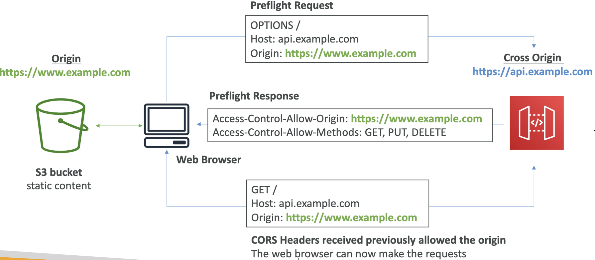
  </p>


If our website with example.com domain makes a request to our api domain at api.example.com , this request need CORS permission to go through! Allow CORS on your API Gateway so your website can get connected to your api. Note that if Proxy is used for integration, you also need to include ‘access-control- allow-origin’ : ’*’ in your response from integration function (Lambda function for example)


### API Gateway – Security
IAM Permissions
- Create an IAM policy authorization and attach to User/Role
- Authentication = IAM | Authorization = IAM Policy
- Good to provide access within AWS (EC2, Lambda, IAM users…)
- Leverages “Sig v4” capability where IAM credential are in headers

<p align="center">
  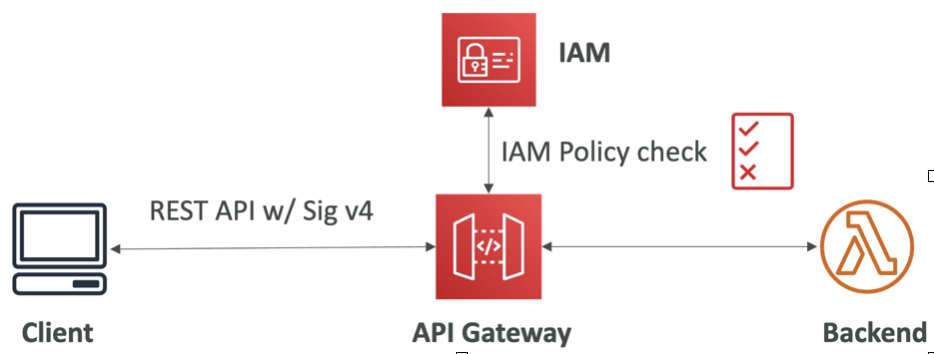
  </p>


#### API Gateway – Resource Policies
- Allow for Cross Account Access (combined with IAM Security)
- Allow for a specific source IP address
- Allow for a VPC Endpoint

<p align="center">
  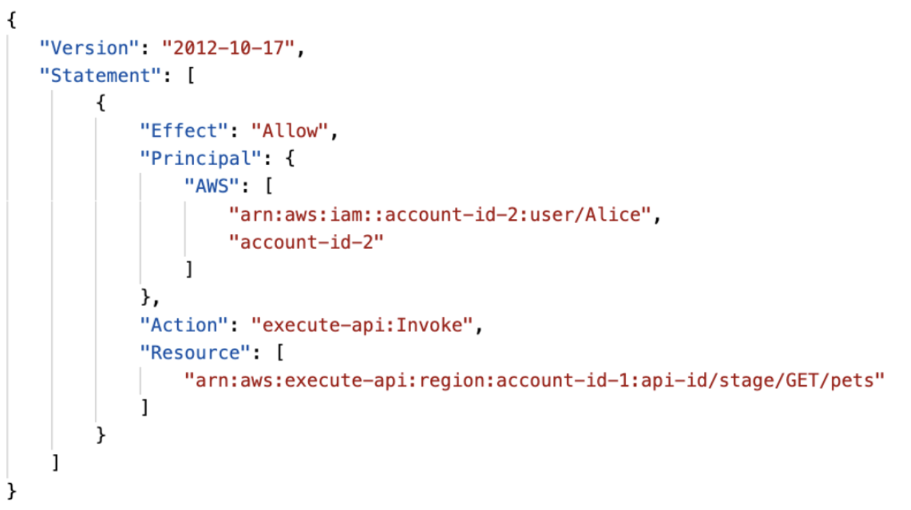
  </p>


#### API Gateway – Security: Cognito
##### Cognito User Pools
- Cognito fully manages user lifecycle, token expires automatically
- API gateway verifies identity automatically from AWS Cognito
- No custom implementation required
- *Authentication = Cognito User Pools $\rightarrow$  Authorization = API Gateway Methods*

<p align="center">
  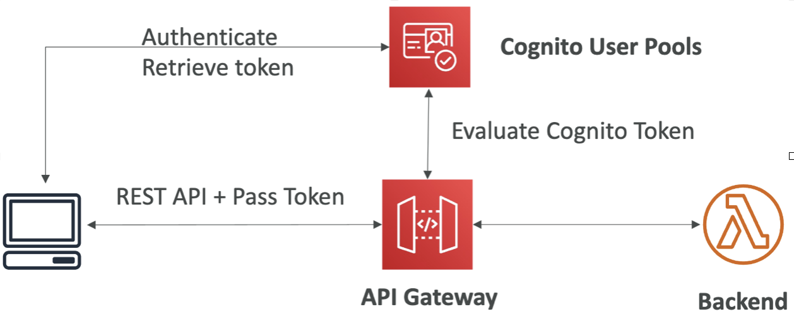
  </p>


#### API Gateway – Security
Lambda Authorizer (formerly Custom Authorizers)
- Token-based authorizer (bearer token) – ex JWT (JSON Web Token) or OAuth
- A request parameter-based Lambda authorizer (headers, query string, stage var)
- Lambda must return an IAM policy for the user, result policy is cached
- Authentication = External | Authorization = Lambda function

<p align="center">
  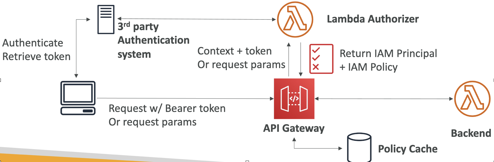
  </p>


First the client authenticates with 3rd party authentication system (OAuth2.0, for example). We retrieve the token from there and then pass its to API Gateway either through header or request params. The API Gateway sends that to a Lambda function (Lambda authorizer) to collect some info about the token etc or talk to 3rd party authentication to check for authenticity of the token. After verified, Lambda creates and send a IAM policy. This is done once and is cached into a policy cache and then api allows talking to the backend. This is usually used when 3rd part authentication system is involved.

#### API Gateway – Security – Summary
- IAM:
  - Great for users / roles already within your AWS account, + resource policy for cross account
  - Handle authentication + authorization
  - Leverages Signature v4
- Custom Authorizer:
  - Great for 3rd party tokens
  - Very flexible in terms of what IAM policy is returned
  - Handle Authentication verification + Authorization in the Lambda function
  - Pay per Lambda invocation, results are cached
- Cognito User Pool:
  - You manage your own user pool (can be backed by Facebook, Google login etc…)
  - No need to write any custom code
  - Must implement authorization in the backend

### API Gateway – HTTP API vs REST API
- HTTP APIs
  - low-latency, cost-effective AWS Lambda proxy, HTTP proxy APIs and private integration (no data mapping)
  - support OIDC and OAuth 2.0 authorization, and built-in support for CORS
  - No usage plans and API keys
- REST APIs
  - All features (except Native OpenID Connect / OAuth 2.0)

### API Gateway – WebSocket API – Overview
- What’s WebSocket?
  - Two-way interactive communication between a user’s browser and a server
  - Server can push information to the client . This enables stateful application use cases
- WebSocket APIs are often used in real-time applications such as chat applications, collaboration platforms, multiplayer games, and financial trading platforms with persistent open connection.
- Works with AWS Services (Lambda, DynamoDB) or HTTP endpoints

<p align="center">
  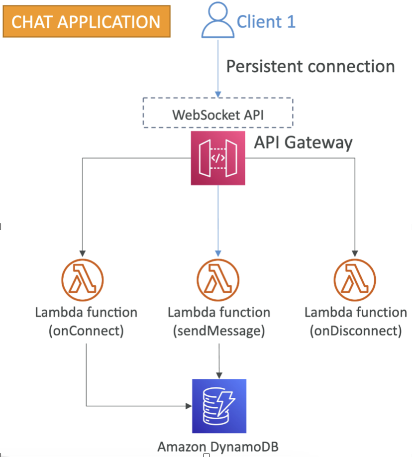
  </p>


#### Connecting to the API
- **ConnectionID** is passed to lambda which is persistent as long as connection is open. ConnectionID can be used for user related data in DynamoDB. 

<p align="center">
  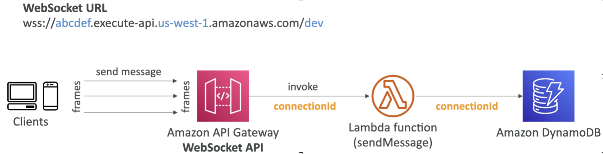
  </p>


#### Client to Server Messaging ConnectionID is re-used
Messages (called frames) are sent through connections. These frames invoke a Lambda function using the same ConnectionID. 


<p align="center">
  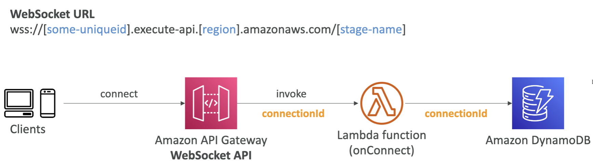
  </p>


#### Server to Client Messaging
Connection URL callback is used for replying back to the client. To do this, Lambda send its respond to URL callback as HTTP POST. This goes to the client. These are the operations for URL callback:

<p align="center">
  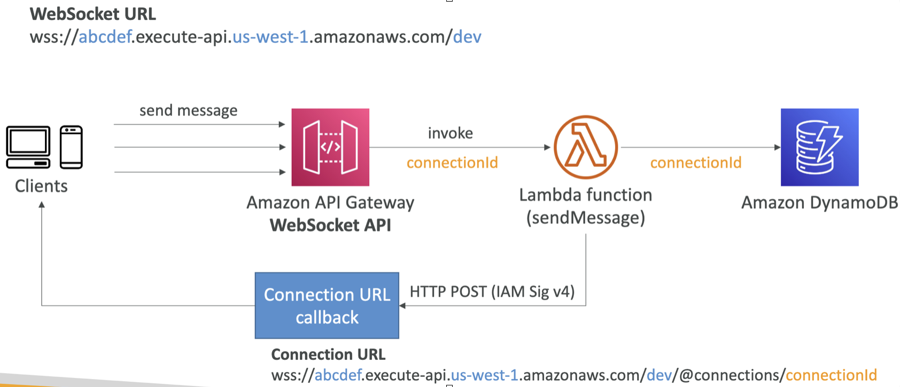
  </p>


<p align="center">
  
  </p>


How does the client know which lambda to invoke?

#### API Gateway – WebSocket API – Routing
- Incoming JSON messages are routed to different backend
- If **no routes => sent to $default**
- You request a route selection expression to select the field on JSON to route from
- Sample expression: $request.body.action
- The result is evaluated against the route keys available in your API Gateway
- The route is then connected to the backend you’ve setup through API Gateway (lambda function or anything else)

<p align="center">
  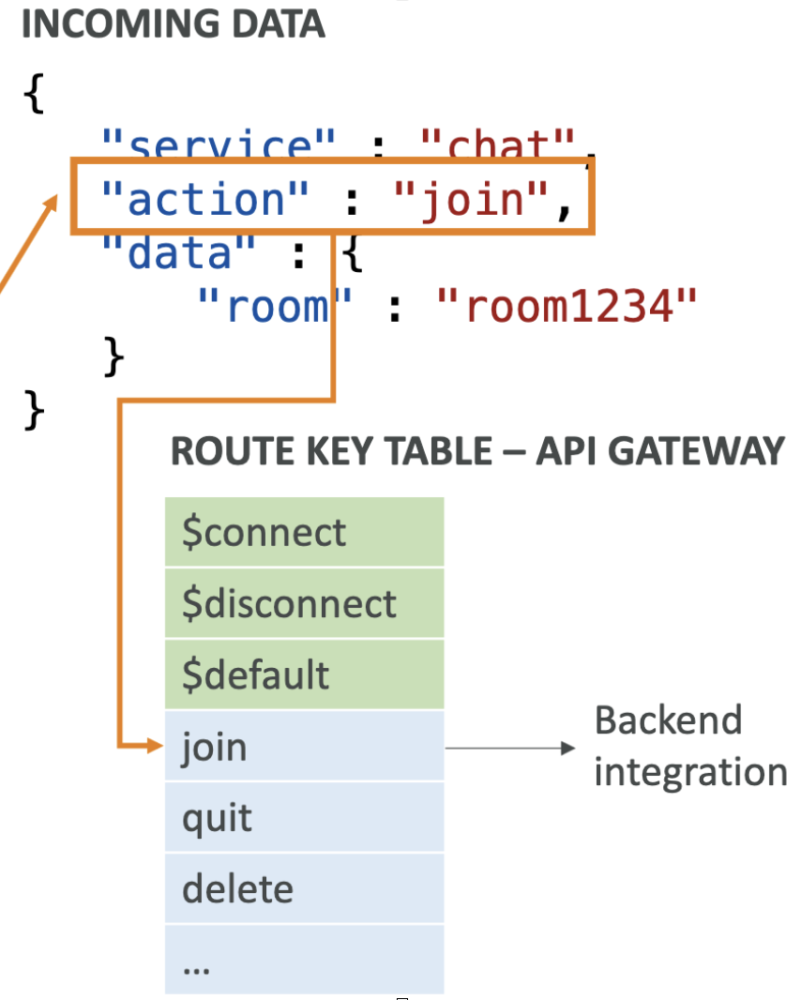
  </p>


### API Gateway - Architecture
- Create a single interface for all the microservices in your company
-  Use API endpoints with various resources
- Apply a simple domain name and SSL certificates
- Can apply forwarding and transformation rules at the API Gateway level


<p align="center">
  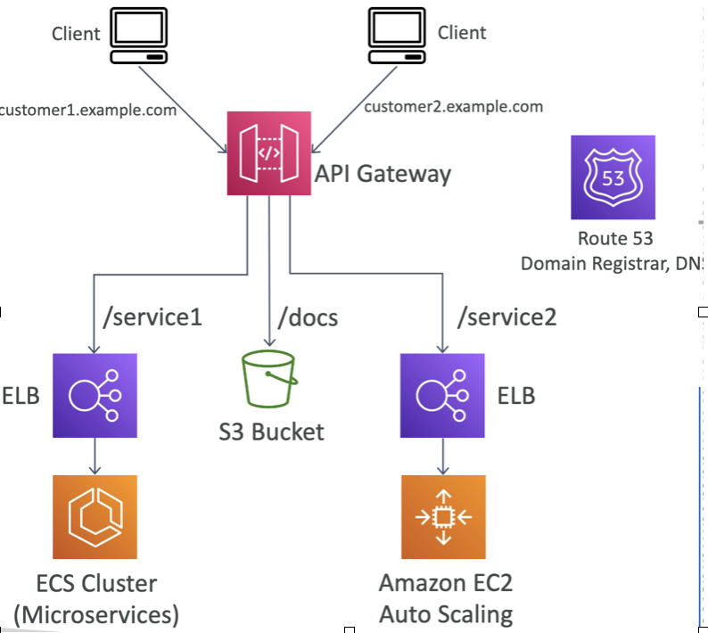
  </p>


## Step Functions & AppSync

**State Machine** is a technique in modeling systems whose output depends on the entire history of their inputs, not just on the most recent input. In this case, the Lambda functions invoke one another, creating a large state machine. AWS Step Functions lets you coordinate multiple AWS services into serverless workflows so you can build and update apps quickly. Using Step Functions, you can design and run workflows that stitch together services, such as AWS Lambda, AWS Fargate, and Amazon SageMaker, into feature-rich applications.

Step Functions automatically triggers and tracks each step, and retries when there are errors so your application executes in order and as expected. With Step Functions, you can craft long-running workflows such as machine learning model training, report generation, and IT automation. You can manage the coordination of a state machine in Step Functions using the Amazon States Language. The Amazon States Language is a JSON-based, structured language used to define your state machine, a collection of states, that can do work (Task states), determine which states to transition to next (Choice states), stop execution with an error (Fail states), and so on.

### AWS Step Functions
Model your workflows as state machines (one per workflow)
- Order fulfillment, Data processing
- Web applications, Any workflow
- Written in JSON
- Visualization of the workflow and the execution of the workflow, as well as history
- Start workflow with SDK call, API Gateway, Event Bridge (CloudWatch Event)

<p align="center">
  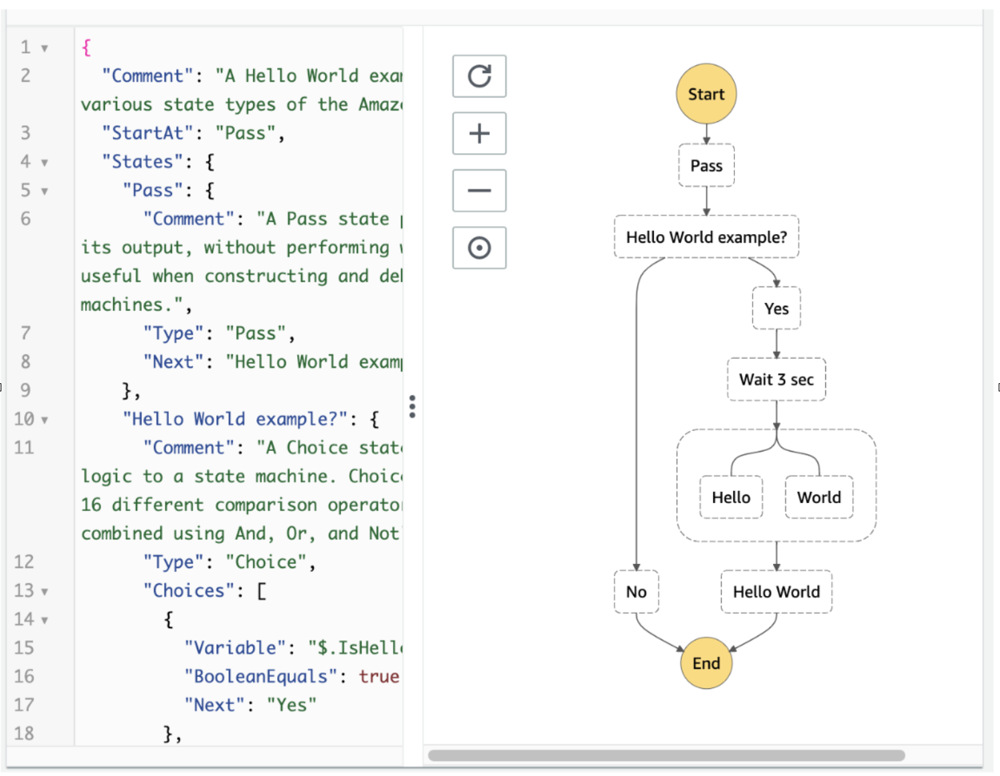
  </p>


#### Step Function – Task States
- Do some work in your state machine
- Invoke one AWS service
  - Can invoke a Lambda function
  - Run an AWS Batch job
  - Run an ECS task and wait for it to complete
  - Insert an item from DynamoDB
  - Publish message to SNS, SQS
  - Launch another Step Function workflow…
- Run an Activity
  - EC2, Amazon ECS, on-premises
  - Activities poll the Step functions for work
  - Activities send results back to Step Functions

<p align="center">
  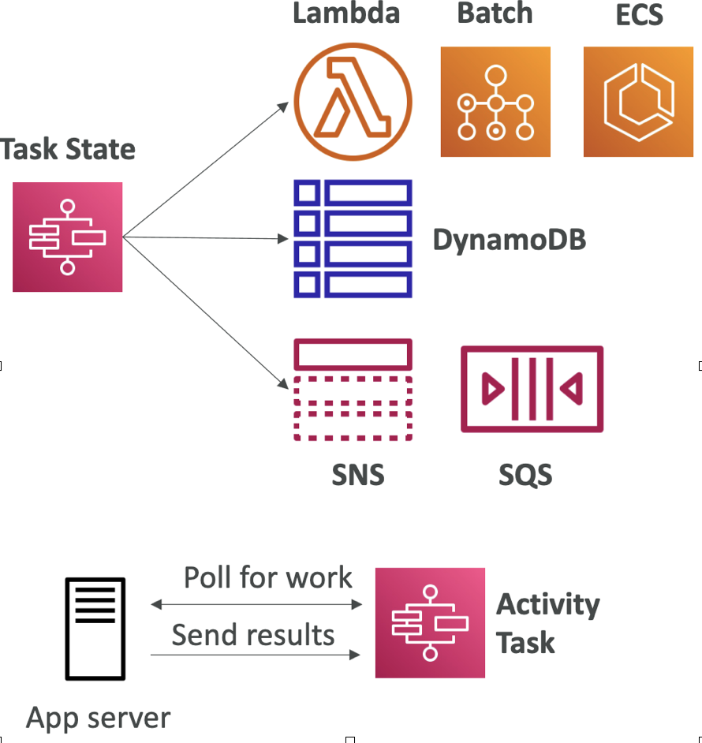
  </p>

#### Example – Invoke Lambda Function


<p align="center">
  
  </p>


### Step Function - States
- **Choice State** - Test for a condition to send to a branch (or default branch)
- **Fail or Succeed State** - Stop execution with failure or success
- **Pass State** - Simply pass its input to its output or inject some fixed data, without performing work
- **Wait State** - Provide a delay for a certain amount of time or until a specified time/date.
- **Map State** - Dynamically iterate steps.
- **Parallel State** - Begin parallel branches of execution.


#### Visual workflow in Step Functions

<p align="center">
  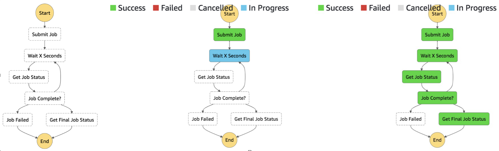
  </p>

#### Error Handling in Step Functions
- Any state can encounter runtime errors for various reasons:
  - State machine definition issues (for example, no matching rule in a Choice state)
  - Task failures (for example, an exception in a Lambda function)
  - Transient issues (for example, network partition events)
- Use Retry (to retry failed state) and/or Catch (transition to failure path) to handle the errors in the State Machine instead of inside the Application Code (lambda)
- Predefined error codes:
  - `States.ALL` : matches any error name
  - `States.Timeout`: Task ran longer than TimeoutSeconds or no heartbeat received
  - `States.TaskFailed`: execution failure
  - `States.Permissions`: insufficient privileges to execute code
- The state may report its own errors

#### Step Functions – Retry (Task or Parallel State)


- Evaluated from top to bottom
- ErrorEquals: match a specific kind of error
- IntervalSeconds: initial delay before retrying
- BackoffRate: multiple the delay after each retry
- MaxAttempts: default to 3, set to 0 for never retried
- When max attempts are reached, the Catch kicks in


<p align="center">
  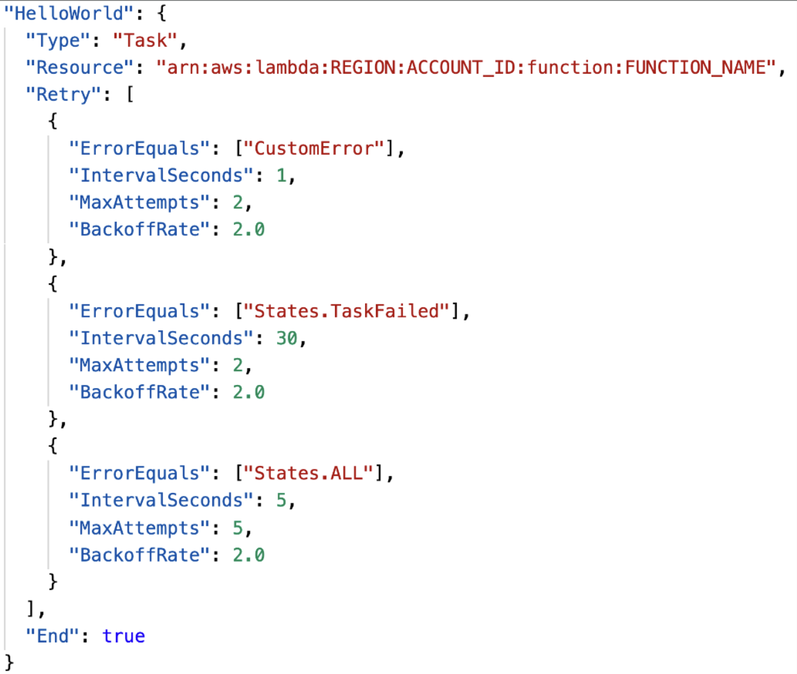
  </p>


#### Step Functions – Catch (Task or Parallel State)
- Evaluated from top to bottom
- ErrorEquals: match a specific kind of error
- Next: State to send to
ResultPath - A path that determines what input is sent to the state specified in the Next field


#### Step Function – ResultPath


<p align="center">
  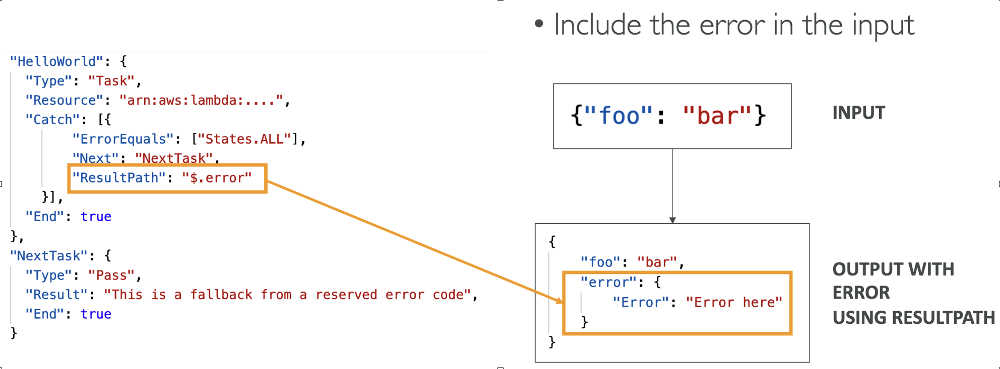
  </p>


#### Step Functions – Wait for Task Token
- Allows you to pause Step Functions during a Task until a Task Token is returned
- Task might wait for other AWS services, human approval, 3rd party integration, call legacy systems
- Append `.waitForTaskToken` to the Resource field to tell Step Functions to wait for the Task Token to be returned
- Task will pause until it receives that Task Token back with a `SendTaskSuccess` or `SendTaskFailure API` call

<p align="center">
  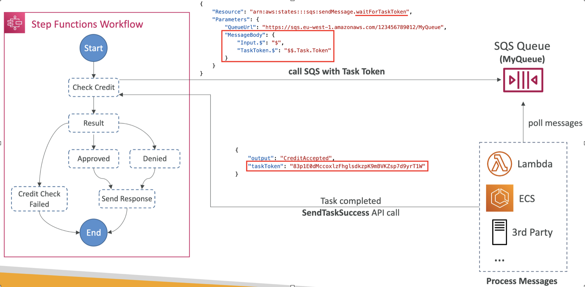
  </p>


#### Step Functions – Activity Tasks
• Enables you to have the Task work performed by an Activity Worker by polling  a task (instead of pushing)
• Activity Worker apps can be running on EC2, Lambda, mobile device
• Activity Worker poll for a Task using GetActivityTask API
• After Activity Worker completes its work, it sends a response of its success/failure using SendTaskSuccess or
SendTaskFailure
• To keep the Task active:
  • Configure how long a task can wait by setting TimeoutSeconds
  • Periodically send a heartbeat from your Activity Worker using SendTaskHeartBeat within the time you set in 	HeartBeatSeconds
By configuring a long TimeoutSeconds and actively sending a heartbeat, Activity Task can wait up to 1 year


<p align="center">
  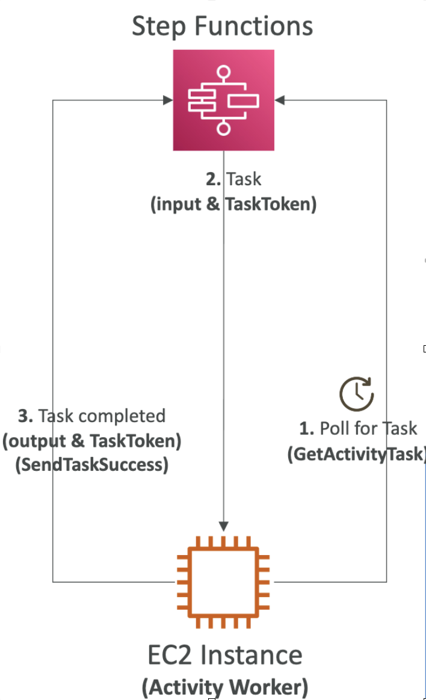
  </p>

#### Step Functions – Standard vs. Express


<p align="center">
  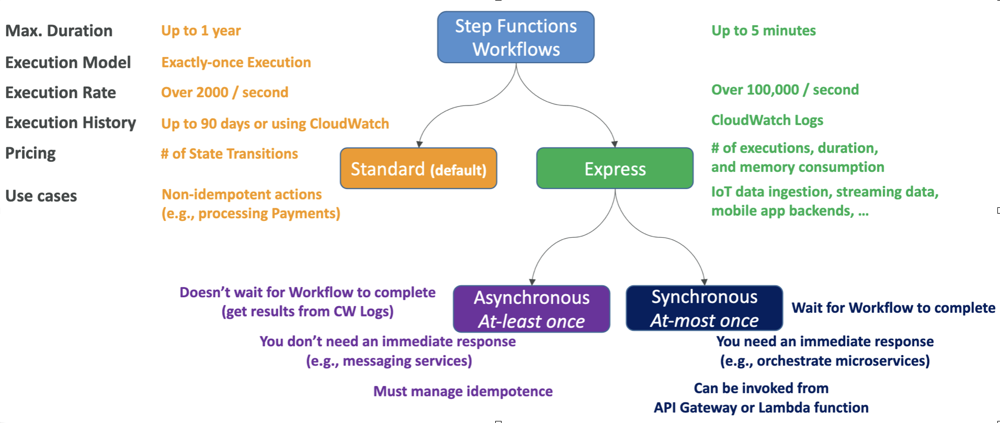
  </p>


### AWS AppSync - Overview
- AppSync is a managed service that uses GraphQL
- GraphQL makes it easy for applications to get exactly the data they need
- This includes combining data from one or more sources, NoSQL data stores, Relational databases, HTTP APIs…
- Integrates with DynamoDB, Aurora, OpenSearch & others
- Custom sources with AWS Lambda
- Retrieve data in real-time with WebSocket or MQTT on WebSocket
- For mobile apps: local data access & data synchronization
- It all starts with uploading one GraphQL schema


<p align="center">
  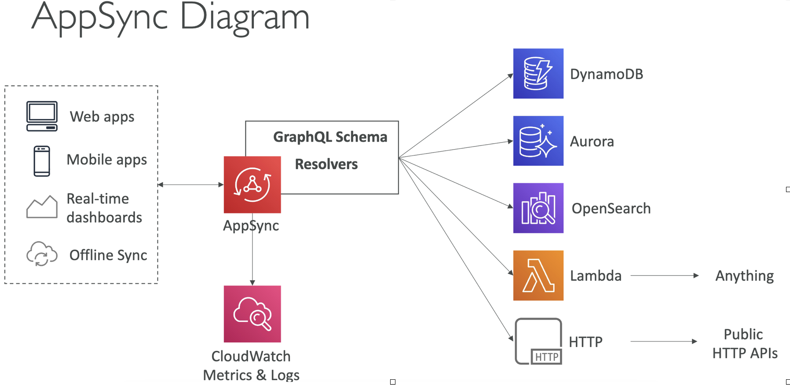
  </p>


#### AppSync – Security
 There are four ways you can authorize applications to interact with your AWS AppSync GraphQL API:
- API_KEY
- AWS_IAM: IAM users / roles / cross-account access
- OPENID_CONNECT: OpenID Connect provider / JSON Web Token
- AMAZON_COGNITO_USER_POOLS
- For custom domain & HTTPS, use CloudFront in front of AppSync

<p align="center">
  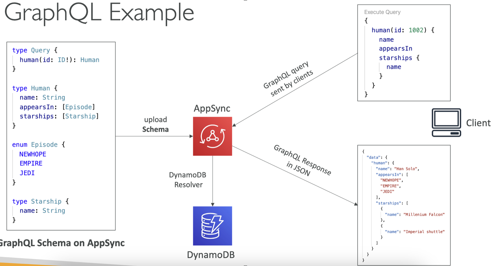
  </p>


### AWS Amplify: Create mobile and web applications


### AWS Amplify
- Set of tools to get started with creating mobile and web applications
- “Elastic Beanstalk for mobile and web applications”
- Must-have features such as data storage, authentication, storage, and machine learning, all powered by AWS services
- Front-end libraries with ready-to-use components for React.js, Vue, Javascript, iOS, Android, Flutter, etc…
- Incorporates AWS best practices to for reliability, security, scalability
- Build and deploy with the Amplify CLI or Amplify Studio


<p align="center">
  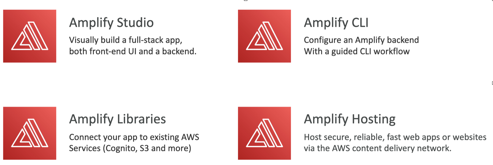
  </p>

<p align="center">
  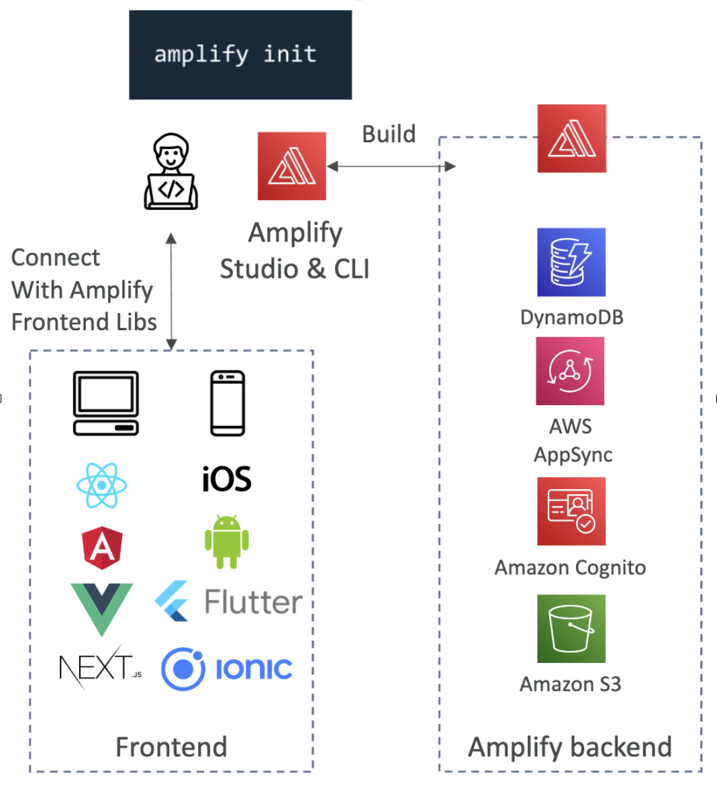
  </p>

#### AWS Amplify – Important Features


<p align="center">
  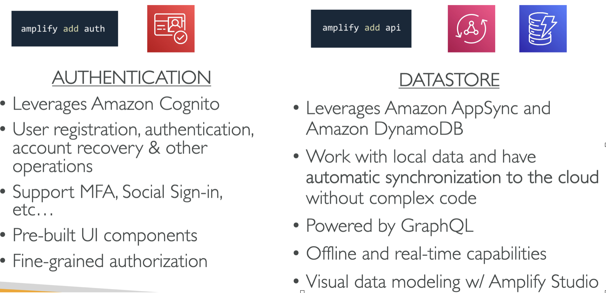
  </p>


#### AWS Amplify Hosting


<p align="center">
  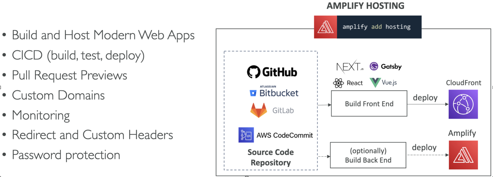
  </p>


## Advanced Identity
#### AWS STS – Security Token Service
AWS STS is an AWS service that allows you to request temporary security credentials for your AWS resources, for IAM authenticated users and users that are authenticated in AWS such as federated users via OpenID or SAML2.0. You use STS to provide trusted users with temporary access to resources via API calls, your AWS console or the AWS command line interface (CLI). The temporary security credentials work exactly like regular long term security access key credentials allocated to IAM users only the lifecycle of the access credentials is shorter. Typically an application will make an API request to AWS STS endpoint for credentials, these access keys are not stored with the user, they are instead dynamically generated by STS when the request is made. The STS generated credentials will expire at which point the user can request new ones as long as they still have permission to do so.
- Allows to grant limited and temporary access to AWS resources (up to 1 hour).
- AssumeRole: Assume roles within your account or cross account
- AssumeRoleWithSAML: return credentials for users logged with SAML
- GetSessionToken: for MFA, from a user or AWS account root user
- GetFederationToken: obtain temporary creds for a federated user
- GetCallerIdentity: return details about the IAM user or role used in the API call
- DecodeAuthorizationMessage: decode error message when an AWS API is denied

<p align="center">
  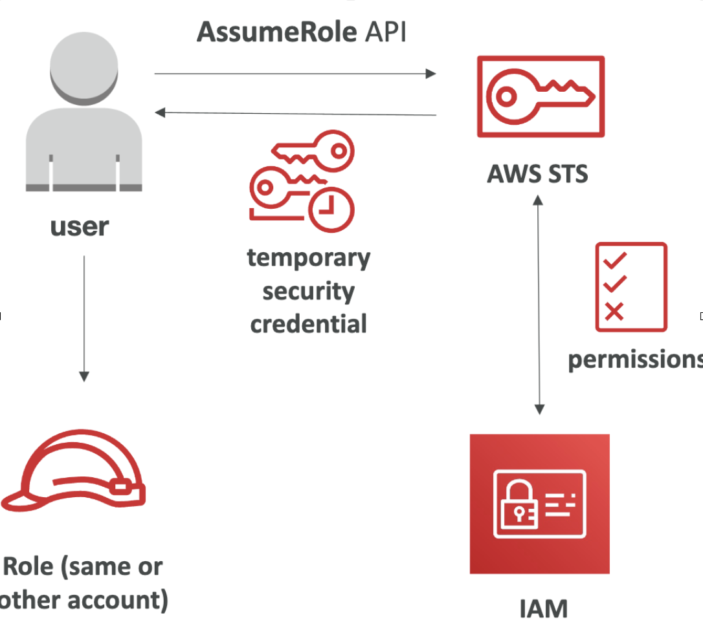
  </p>

#### Using STS to Assume a Role
- Define an IAM Role within your account or cross-account that has STS associated with it
- Define which principals can access this IAM Role
- Select the type of trusted entity that you want to grant permissions to, which will ultimately be the service or user that will be making the API calls to STS for temporary access credentials
- Use AWS STS (Security Token Service) to retrieve credentials and impersonate the IAM Role you have access to (AssumeRole API). This can be done by CLI for example: 

  `aws sts assume-role --role-arn arn:aws:iam::xxxxxxxxxxxx:role/sts_role --role-session-name "Session1"`

- Temporary credentials can be valid between 15 minutes to 1 hour

#### STS with MFA
- Use GetSessionToken from STS
- Appropriate IAM policy using IAM Conditions
- aws:MultiFactorAuthPresent:true
- Reminder, GetSessionToken returns:
  - Access ID
  - Secret Key
  - Session Token
  - Expiration date

<p align="center">
  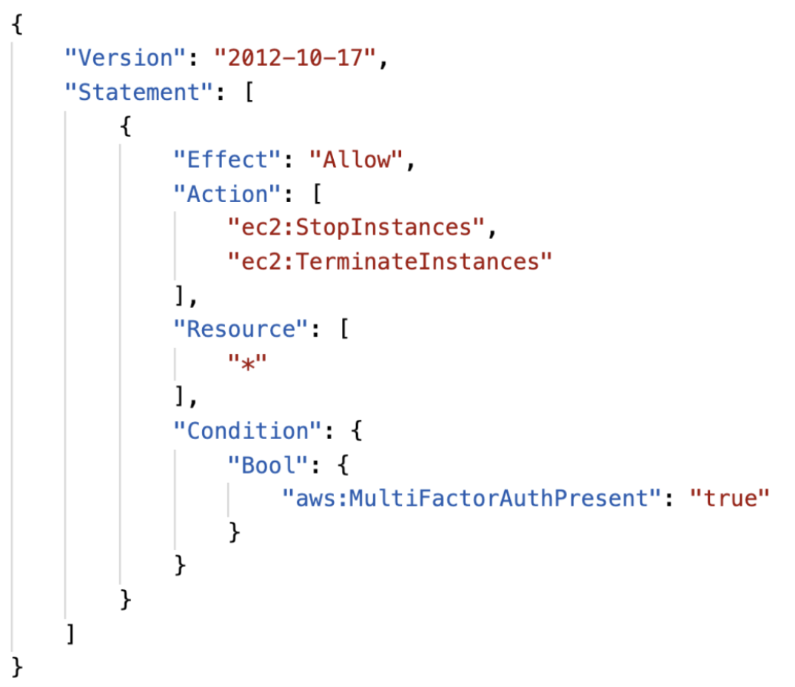
  </p>

#### IAM Best Practices – General
- Never use Root Credentials, enable MFA for Root Account
- Grant Least Privilege
- Each Group / User / Role should only have the minimum level of permission it needs
- Never grant a policy with “*” access to a service
- Monitor API calls made by a user in CloudTrail (especially Denied ones)
- Never ever ever store IAM key credentials on any machine but a personal computer or on-premise server
- On premise server best practice is to call STS to obtain temporary security credentials

#### IAM Best Practices – IAM Roles
- EC2 machines should have their own roles
- Lambda functions should have their own roles
- ECS Tasks should have their own roles (ECS_ENABLE_TASK_IAM_ROLE=true)
- CodeBuild should have its own service role
- Create a least-privileged role for any service that requires it
- Create a role per application / lambda function (do not reuse roles)

#### IAM Best Practices – Cross Account Access
- Define an IAM Role for another account to access
- Define which accounts can access this IAM Role
- Use AWS STS (Security Token Service) to retrieve credentials and impersonate the IAM Role you have access to (AssumeRole API)
- Temporary credentials can be valid between 15 minutes to 1 hour


#### Advanced IAM - Authorization Model Evaluation of Policies, simplified
1. If there’s an explicit DENY, end decision and DENY
2. If there’s an ALLOW, end decision with ALLOW
3. Else DENY


##### Example 1
- IAM Role attached to EC2 instance, authorizes RW to “my_bucket”
- No S3 Bucket Policy attached
=> EC2 instance can read and write to “my_bucket”


##### Example 2
- IAM Role attached to EC2 instance, authorizes RW to “my_bucket”
- S3 Bucket Policy attached, explicit deny to the IAM Role
=> EC2 instance cannot read and write to “my_bucket”


##### Example 3
- IAM Role attached to EC2 instance, no S3 bucket permissions
- S3 Bucket Policy attached, explicit RW allow to the IAM Role
=> EC2 instance can read and write to “my_bucket”


##### Example 4
- IAM Role attached to EC2 instance, explicit deny S3 bucket permissions
- S3 Bucket Policy attached, explicit RW allow to the IAM Role
=> EC2 instance cannot read and write to “my_bucket”


#### Dynamic Policies with IAM
How do you assign each user a /home/<user> folder in an S3 bucket?
Ans: Create one dynamic policy with IAM, leverage the special policy variable ${aws:username}

<p align="center">
  
  </p>


#### Granting a User Permissions to Pass a Role to an AWS Service
• To configure many AWS services, you must pass an IAM role to the service (this happens only once during setup)
• The service will later assume the role and perform actions
• Example of passing a role:
  • To an EC2 instance
  • To a Lambda function
  • To an ECS task
  • To CodePipeline to allow it to invoke other services
• For this, you need the IAM permission iam:PassRole
It often comes with iam:GetRole to view the role being passed

<p align="center">
  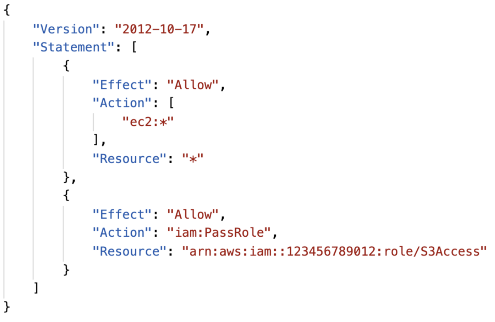
  </p>

#### Can a role be passed to any service?
- No: Roles can only be passed to what their trust allows
- A trust policy for the role that allows the service to assume the role

<p align="center">
  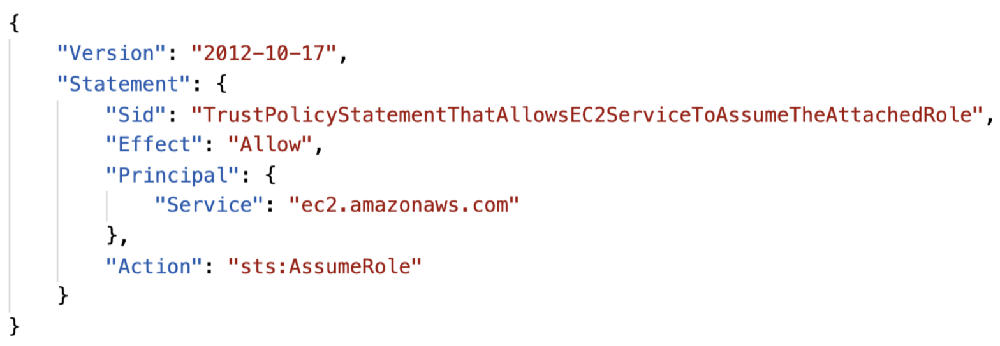
  </p>


## Amazon Cognito

Give users an identity to interact with our application
- **Cognito User Pools**:
  - Sign-in functionality for app users
  - Integrate with API Gateway & Application Load Balancer
- **Cognito Identity Pools** (Federated users):
  - Provide AWS credentials to users so they can access AWS resources directly
  - Integrate with Cognito User Pools as an identity provider

- Cognito vs IAM: “hundreds of users”, ”mobile users”, “authenticate with SAML”

#### Cognito User Pools (CUP) – User Features
- Create a serverless database of users for your web & mobile apps
- Simple login: Username (or email) / password combination
- Password reset
- Email & Phone Number Verification
- Multi-factor authentication (MFA)
- Federated users: users from Facebook, Google, SAML…
- Feature: block users if their credentials are compromised elsewhere
- Login sends back a **JSON Web Token (JWT)**

#### Cognito User Pools (CUP) – Diagram


<p align="center">
  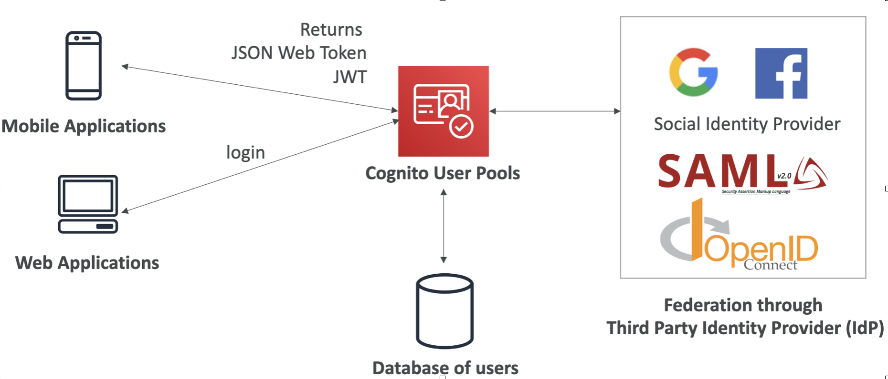
  </p>


#### Cognito User Pools (CUP) - Integrations
- CUP integrates with API Gateway and Application Load Balancer


<p align="center">
  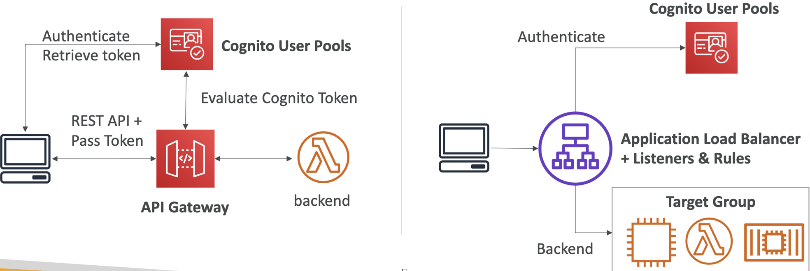
  </p>


- Cognito User Pools – Lambda Triggers
CUP can invoke a Lambda function synchronously on these triggers:

<p align="center">
  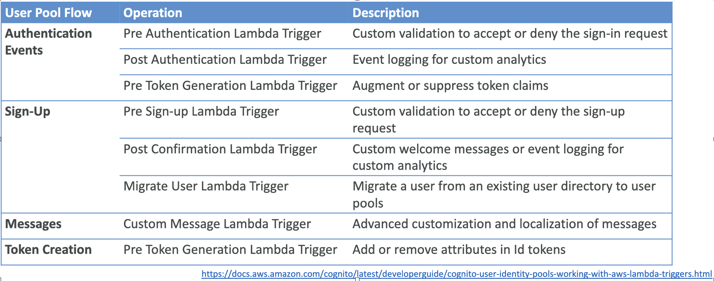
  </p>


#### Cognito User Pools – Hosted Authentication UI
- Cognito has a hosted authentication UI that you can add to your app to handle sign-up and sign-in workflows
- Using the hosted UI, you have a foundation for integration with social logins, OIDC or SAML
- Can customize with a custom logo and custom CSS


<p align="center">
  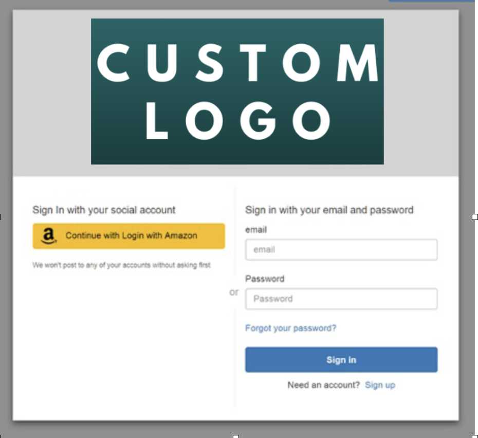
  </p>

#### CUP – Hosted UI Custom Domain
- For custom domains, you must create an ACM certificate in us-east-1
- The custom domain must be defined in the “App Integration” section


<p align="center">
  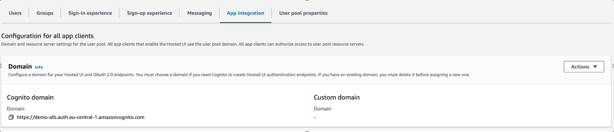
  </p>


#### CUP – Adaptive Authentication
- Cognito examines each sign-in attempt and generates a risk score (low, medium, high) for how likely the sign-in request is to be from a malicious attacker
- Block sign-ins or require MFA if the login appears suspicious
- Users are prompted for a second MFA only when risk is detected
- Risk score is based on different factors such as if the user has used the same device, location, or IP address
- Checks for compromised credentials, account takeover protection, and phone and email verification
- Integration with CloudWatch Logs (sign-in attempts, risk score, failed challenges…)

<p align="center">
  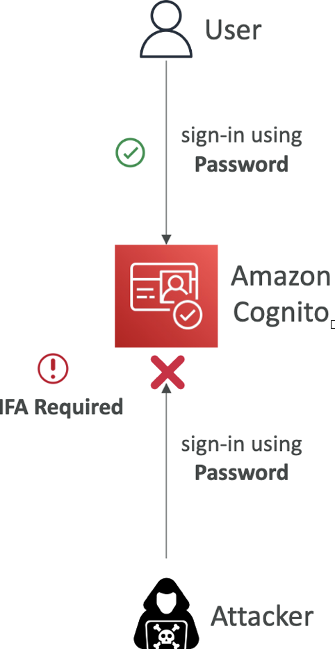
  </p>


#### Decoding a ID Token; JWT – JSON Web Token
- CUP issues JWT tokens (**Base64 encoded**):
  - Header
  - Payload
  - Signature
- The signature must be verified to ensure the JWT can be trusted
- Libraries can help you verify the validity of JWT tokens issued by Cognito User Pools
- The Payload will contain the user information (sub UUID, given_name, email, phone_number, attributes…)
- From the sub UUID, you can retrieve all users details from Cognito / OIDC

<p align="center">
  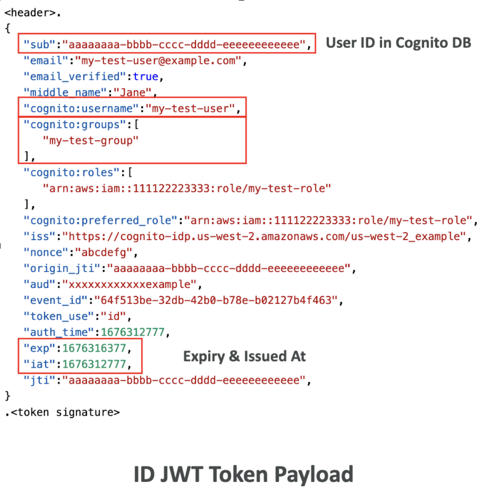
  </p>


### Application Load Balancer – Authenticate Users
- Your Application Load Balancer can securely authenticate users
  - Offload the work of authenticating users to your load balancer
  - Your applications can focus on their business logic
- Authenticate users through:
  - Identity Provider (IdP): OpenID Connect (OIDC) compliant
  - Cognito User Pools:
    - Social IdPs, such as Amazon, Facebook, or Google
    - Corporate identities using SAML, LDAP, or Microsoft AD
- Must use an HTTPS listener to set authenticate-oidc & authenticate-cognito rules
- OnUnauthenticatedRequest – authenticate (default), deny, allow


#### Application Load Balancer – Cognito Auth.


<p align="center">
  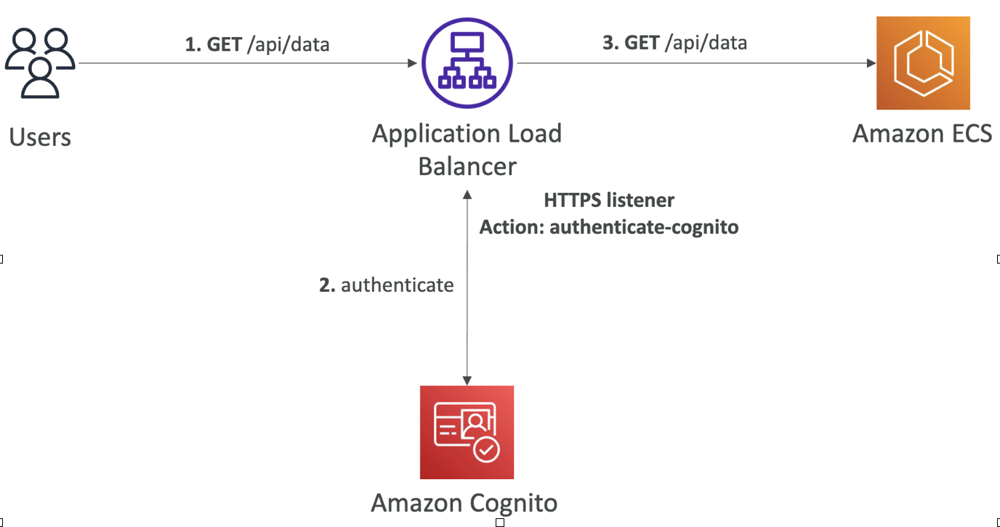
  </p>


#### ALB – Auth through Cognito User Pools
- Create Cognito User Pool, Client and Domain
- Make sure an ID token is returned
- Add the social or Corporate IdP if needed
- Several URL redirections are necessary
- Allow your Cognito User Pool Domain on your IdP app's callback URL. For example:
  - `https://domain- prefix.auth.region.amazoncognito.com/saml2/idpresponse`
  - `https://user-pool-domain/oauth2/idpresponse`


#### Application Load Balancer – OIDC Auth.


<p align="center">
  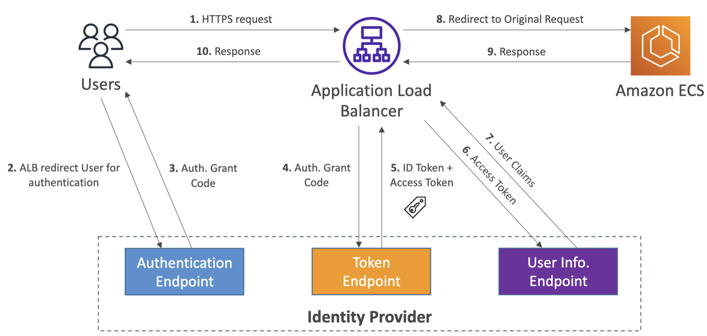
  </p>


#### ALB – Auth. Through an Identity Provider (IdP) that is OpenID Connect (OIDC) Compliant
• Configure a Client ID & Client Secret
• Allow redirect from OIDC to your Application Load Balancer DNS name (AWS provided) and CNAME (DNS Alias of your app)
  • https://DNS/oauth2/idpresponse
  • https://CNAME/oauth2/idpresponse


### Cognito Identity Pools (Federated Users)
- Get identities for “users” so they obtain temporary AWS credentials
- Your identity pool (e.g identity source) can include:
  - Public Providers (Login with Amazon, Facebook, Google, Apple)
  - Users in an Amazon Cognito user pool
  - OpenID Connect Providers & SAML Identity Providers
  - Developer Authenticated Identities (custom login server)
  - Cognito Identity Pools allow for unauthenticated (guest) access
- Users can then access AWS services directly or through API Gateway
  - The IAM policies applied to the credentials are defined in Cognito
  - They can be customized based on the user_id for fine grained control


#### Cognito Identity Pools – Diagram


<p align="center">
  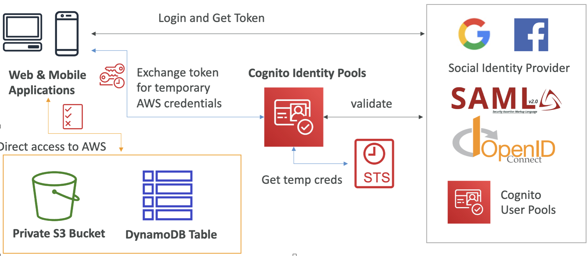
  </p>


#### Cognito Identity Pools – IAM Roles
- Default IAM roles for authenticated and guest users (unauthenticated)
- Define rules to choose the role for each user based on the user’s ID
- You can partition your users’ access using policy variables
- IAM credentials are obtained by Cognito Identity Pools through STS
- The roles must have a “trust” policy of Cognito Identity Pools


#### Cognito Identity Pools – Policyon S3

Access for authorized users to a prefix in S3 buckets which is available only to authorized users

<p align="center">
  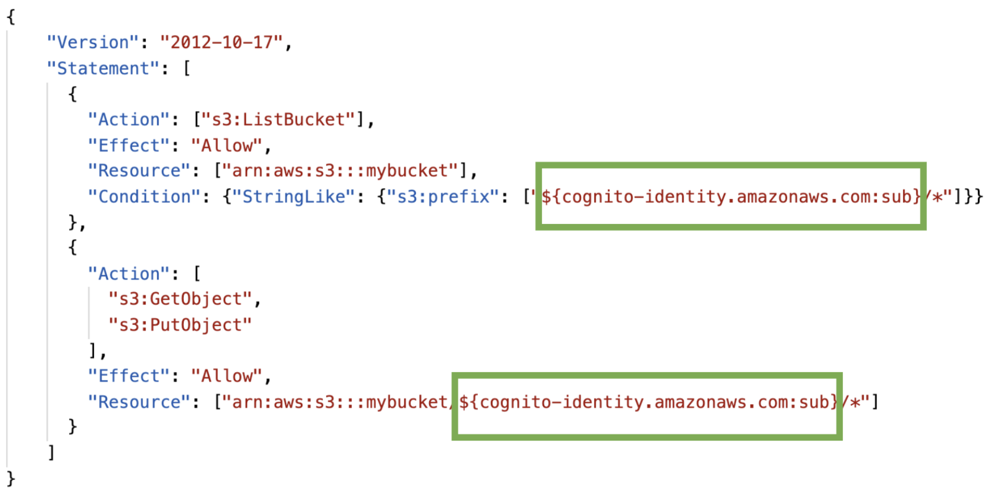
  </p>


### Cognito Identity Pools – DynamoDB


<p align="center">
  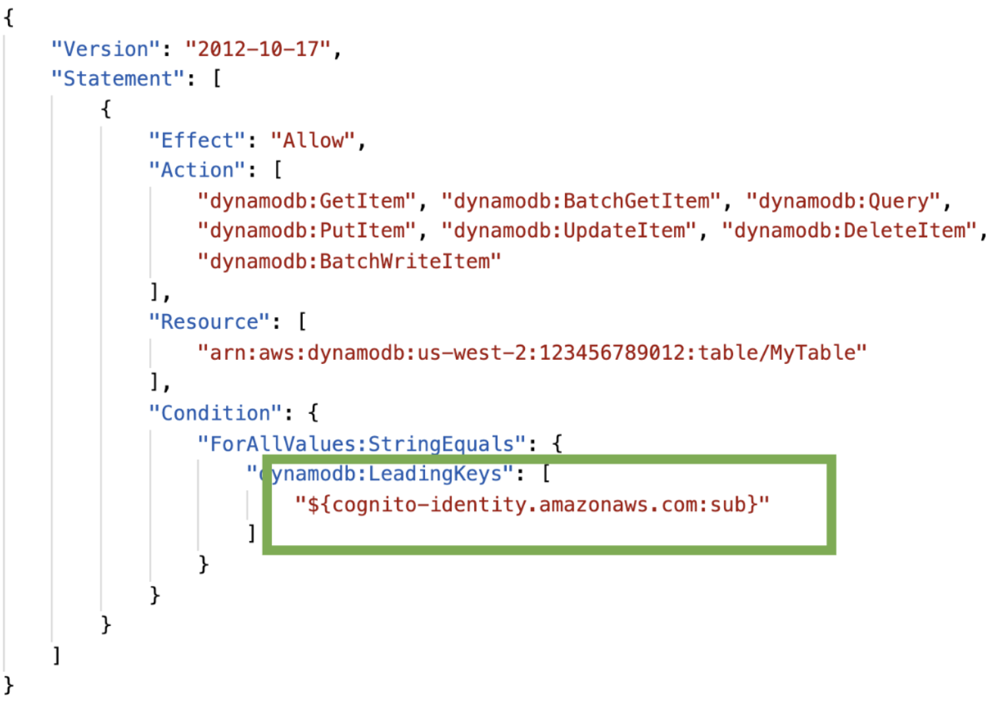
  </p>


### Cognito User Pools vs Identity Pools
- Cognito User Pools (for authentication = identity verification)
  - Database of users for your web and mobile application
  - Allows federate logins through Public Social, OIDC, SAML…
  - Can customize the hosted UI for authentication (including the logo)
  - Has triggers with AWS Lambda during the authentication flow
  - Adapt the sign-in experience to different risk levels (MFA, adaptive authentication, etc…)
- Cognito Identity Pools (for authorization = access control)
  - Obtain AWS credentials for your users
  - Users can login through Public Social, OIDC, SAML & Cognito User Pools
  - Users can be unauthenticated (guests)
  - Users are mapped to IAM roles & policies, can leverage policy variables
- CUP + CIP = authentication + authorization

#### Cognito Identity Pools – Diagram with CUP


<p align="center">
  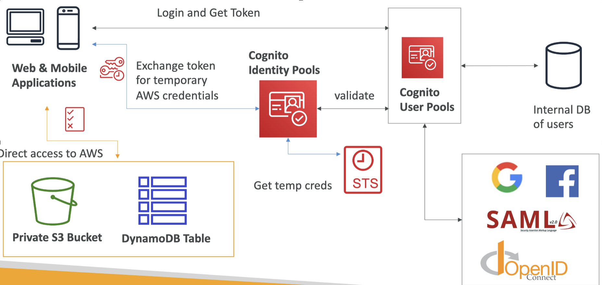
  </p>


## AWS Security & Encryption

#### Encryption in flight (SSL)
- Data is encrypted before sending and decrypted after receiving
- SSL certificates help with encryption (HTTPS)
- Encryption in flight ensures no MITM (man in the middle attack) can happen


#### Server side encryption at rest
- Data is encrypted after being received by the server
- Data is decrypted before being sent
- It is stored in an encrypted form thanks to a key (usually a data key)
- The encryption / decryption keys must be managed somewhere and the server must have access to it


#### Client side encryption
- Data is encrypted by the client and never decrypted by the server
- Data will be decrypted by a receiving client
- The server should not be able to decrypt the data
- Could leverage Envelope Encryption


### AWS KMS (Key Management Service)
- Anytime you hear “encryption” for an AWS service, it’s most likely KMS
- AWS manages encryption keys for us
- Fully integrated with IAM for authorization
- Easy way to control access to your data
- Able to audit KMS Key usage using CloudTrail
- Seamlessly integrated into most AWS services (EBS, S3, RDS, SSM…)
- Never ever store your secrets in plaintext, especially in your code!
  - KMS Key Encryption also available through API calls (SDK, CLI)
  - Encrypted secrets can be stored in the code / environment variables


#### KMS Keys Types by mechanism
- **Symmetric (AES-256 keys)**
  - Single encryption key that is used to Encrypt and Decrypt data up to 4KB in size
  - AWS services that are integrated with KMS use Symmetric CMKs
  - You never get access to the KMS Key unencrypted (must call KMS API to use)
- **Asymmetric (RSA & ECC key pairs)**
  - Public (Encrypt) and Private Key (Decrypt) pair
  - Used for Encrypt/Decrypt, or Sign/Verify operations
  - The public key is downloadable, but you can’t access the Private Key unencrypted
  - Use case: encryption outside of AWS by users who can’t call the KMS API


#### Types of KMS Keys by Management
- AWS Owned Keys (free): SSE-S3, SSE-SQS, SSE-DDB (default key)
- AWS Managed Key: free (aws/service-name, example: aws/rds or aws/ebs)
- Customer managed keys created in KMS: $1 / month
- Customer managed keys imported (must be symmetric key): $1 / month
-  pay for API call to KMS ($0.03 / 10000 calls)

#####

#####

- Automatic Key rotation:
  - AWS-managed KMS Key: automatic every 1 year
  - Customer-managed KMS Key: (must be enabled) automatic every 1 year
  - Imported KMS Key: only manual rotation possible using alias


#### Copying Snapshots across regions
KMS keys are scoped by region. That means if you have an encrypted key for EBS in one region, you need to go several steps to transfer it to another region:

First take a snapshot of EBS, which will have the same KMS key. To copy the snapshot to a different region, you need to encrypt the snapshot using a different key. Then restore it into its own EBS volume. 

#### KMS Key Policies
- Control access to KMS keys, “similar” to S3 bucket policies
- Difference: you cannot control access without them

- Default KMS Key Policy:
  - Created if you don’t provide a specific KMS Key Policy
  - Complete access to the key to the root user = entire AWS account
- Custom KMS Key Policy:
  - Define users, roles that can access the KMS key
  - Define who can administer the key
  - Useful for cross-account access of your KMS key


#### Copying Snapshots across accounts
1. Create a Snapshot, encrypted with your 		own KMS Key (Customer Managed Key)
2. Attach a KMS Key Policy to authorize 			cross-account access
3. Share the encrypted snapshot
4. (in target) Create a copy of the Snapshot, 		encrypt it with a CMK in your account
5. Create a volume from the snapshot


<p align="center">
  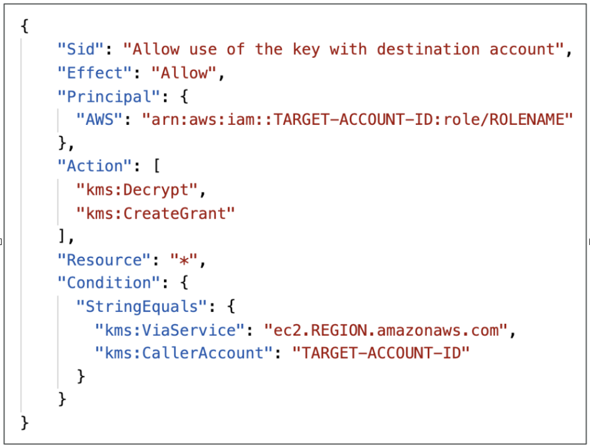
  </p>

How does KMS work? API – Encrypt and Decrypt

<p align="center">
  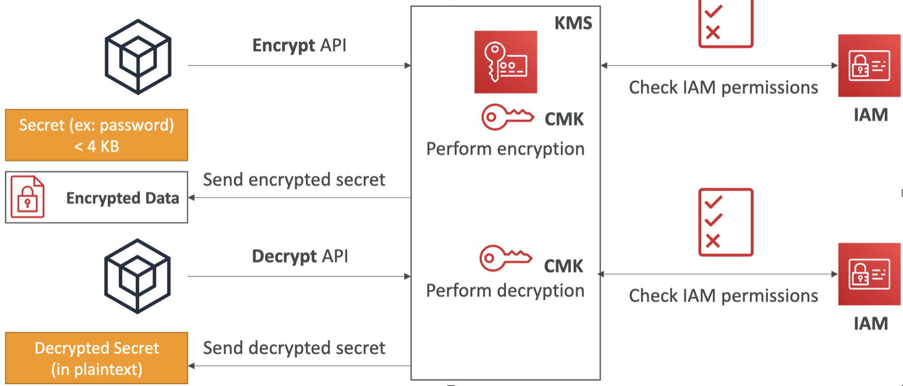
  </p>


### Envelope Encryption
- KMS Encrypt API call has a limit of 4 KB
- If you want to encrypt >4 KB, we need to use **Envelope Encryption**
- The main API that will help us is the `GenerateDataKey` API
- For the exam: anything over 4 KB of data that needs to be encrypted must use the Envelope Encryption == GenerateDataKey API
- The AWS Encryption SDK implemented Envelope Encryption for us. Use it!


### Deep dive into Envelope Encryption: Client side encrypt-decrypt

#### GenerateDataKey API
The client application can run the following steps:
- A request is made under a KMS key for a new data key. An encrypted data key and a plaintext version of the data key are returned.
- Within the AWS Encryption SDK, the plaintext data key is used to encrypt the message. The plaintext data key is then deleted from memory. 
- The encrypted data key and encrypted message are combined into a single ciphertext byte array. 

<p align="center">
  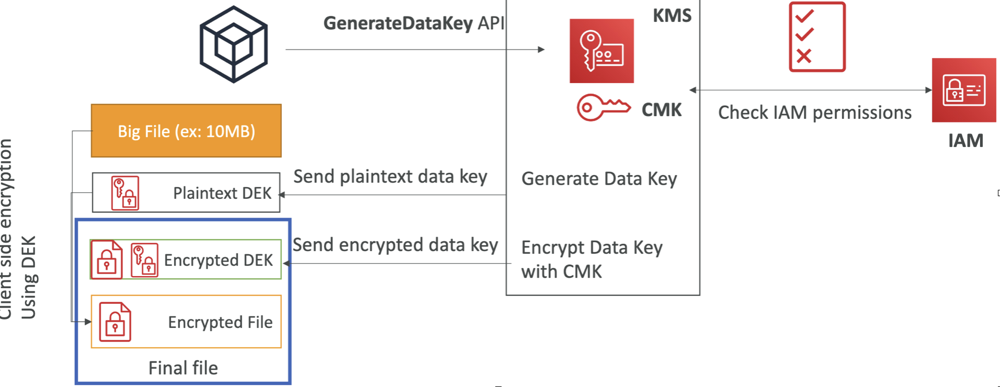
  </p>

#### Decrypt envelope data
- The AWS Encryption SDK parses the envelope-encrypted message to obtain the encrypted data key and make a request to AWS KMS to decrypt the data key.
- The AWS Encryption SDK receives the plaintext data key from AWS KMS. 
- The data key is then used to decrypt the message, returning the initial plaintext.

<p align="center">
  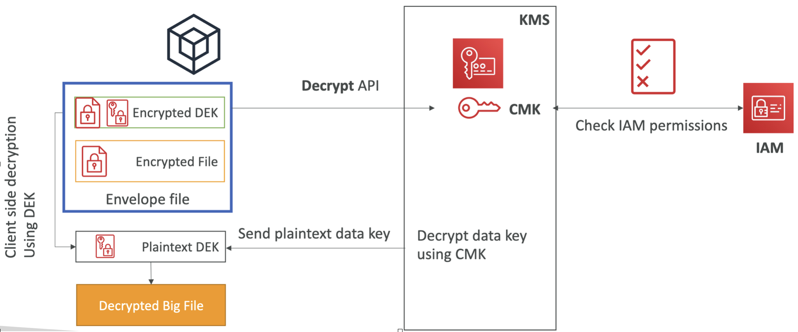
  </p>

#### Encryption SDK
- The AWS Encryption SDK implemented Envelope Encryption for us
- The Encryption SDK also exists as a CLI tool we can install
- Implementations for Java, Python, C, JavaScript
- Feature - Data Key Caching:
  - re-use data keys instead of creating new ones for each encryption
  - Helps with reducing the number of calls to KMS with a security trade-off
  - Use LocalCryptoMaterialsCache (max age, max bytes, max number of messages)

#### KMS Symmetric – API Summary
- Encrypt: encrypt up to 4 KB of data through KMS
- GenerateDataKey: generates a unique symmetric data key (DEK)
  - returns a plaintext copy of the data key
  - AND a copy that is encrypted under the CMK that you specify
- GenerateDataKeyWithoutPlaintext:
  - Generate a DEK to use at some point (not immediately)
  - DEK that is encrypted under the CMK that you specify (must use Decrypt later)
- Decrypt: decrypt up to 4 KB of data (including Data Encryption Keys)
GenerateRandom: Returns a random byte string


#### KMS Request Quotas
- When you exceed a request quota, you get a ThrottlingException:
- To respond, use exponential backoff (backoff and retry)
- For cryptographic operations, they share a quota
- This includes requests made by AWS on your behalf (ex: SSE-KMS)
- For GenerateDataKey, consider using DEK caching from the Encryption SDK
- You can request a Request Quotas increase through API or AWS support

<p align="center">
  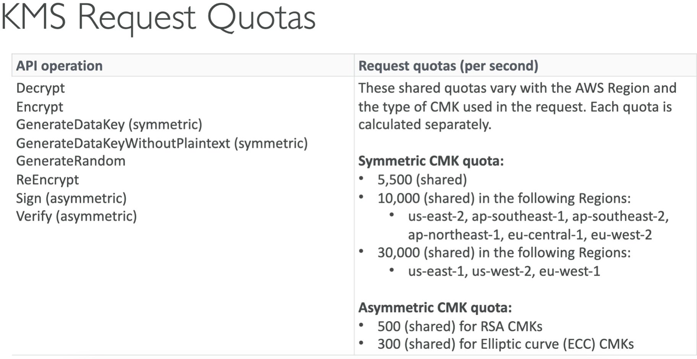
  </p>


### S3 Bucket Key for SSE-KMS encryption
New setting to decrease 
- the number of API calls made to KMS from S3 by 99%
- Costs of overall KMS encryption with Amazon S3 by 99%

This leverages data keys
• A “S3 bucket key” is generated
• That key is used to encrypt KMS objects with new data keys
- You will see less KMS CloudTrail events in CloudTrail

<p align="center">
  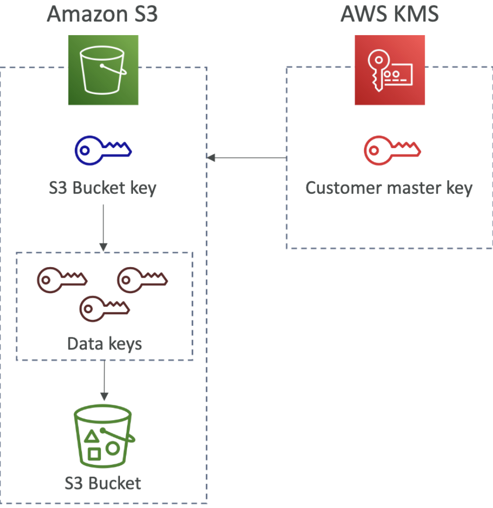
  </p>


### SSM Parameter Store
- Secure storage for **configuration and secrets**
- Optional Seamless Encryption using KMS
- Serverless, scalable, durable, easy SDK
- Version tracking of configurations / secrets
- Security through IAM
- Notifications with Amazon EventBridge
- Integration with CloudFormation

<p align="center">
  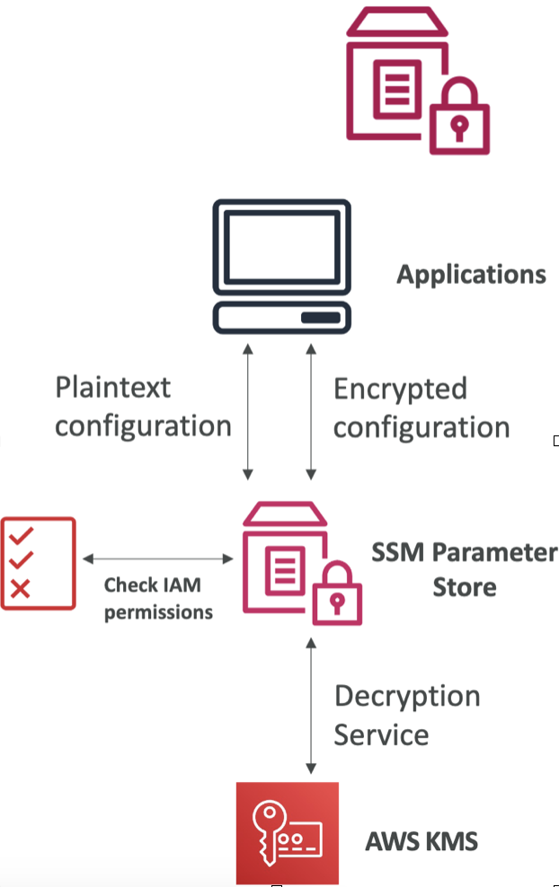
  </p>

#### SSM Parameter Store Hierarchy

<p align="center">
  
  </p>


### Parameters Policies (for advanced parameters)
Allow to assign a TTL to a parameter (expiration date) to force updating or deleting sensitive data such as passwords
Can assign multiple policies at a time

<p align="center">
  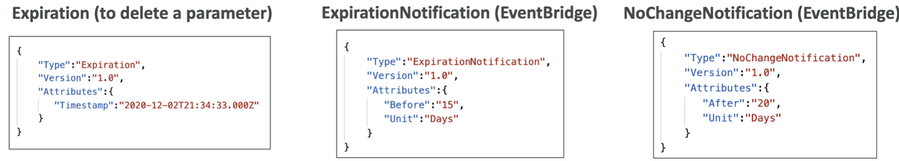
  </p>

### AWS Secrets Manager
- Newer service, meant for storing secrets
- Capability to force rotation of secrets every X days
- Automate generation of secrets on rotation (uses Lambda)
- Integration with Amazon RDS (MySQL, PostgreSQL, Aurora)
- Secrets are encrypted using KMS
- Mostly meant for built-in integration for Amazon RDS, Amazon Redshift, and Amazon DocumentDB (with MongoDB compatibility) and automatically rotates these database credentials on your behalf
- Pay for the number of secrets managed in Secrets Manager and the number of Secrets Manager API calls made.

#### AWS Secrets Manager – Multi-Region Secrets
- Replicate Secrets across multiple AWS Regions
- Secrets Manager keeps read replicas in sync with the primary Secret
- Ability to promote a read replica Secret to a standalone Secret
Use cases: multi-region apps, disaster recovery strategies, multi-region DB…


<p align="center">
  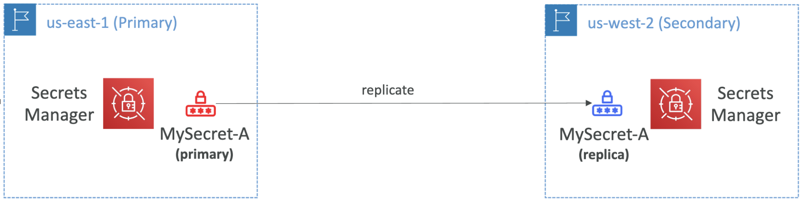
  </p>


#### Secrets Manager CloudFormation Integration RDS & Aurora
- ManageMasterUserPassword – creates admin secret implicitly
- RDS, Aurora will manage the secret in Secrets Manager and its rotation

<p align="center">
  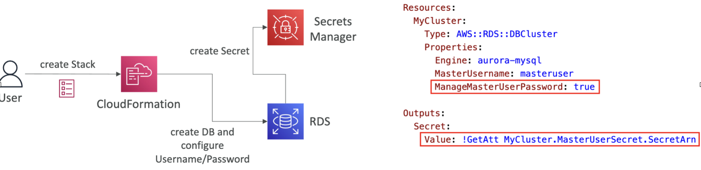
  </p>


#### Secrets Manager CloudFormation - Dynamic Reference

<p align="center">
  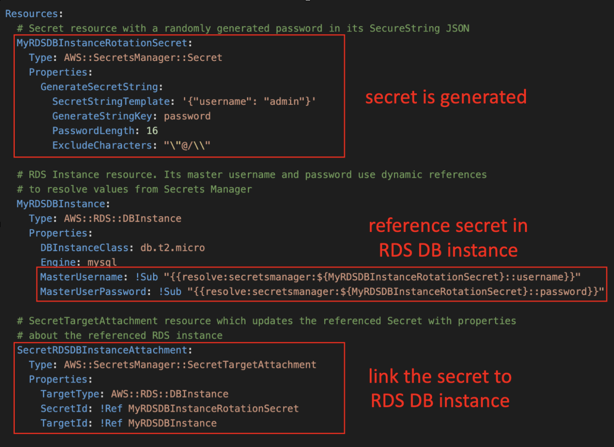
  </p>


#### SSM Parameter Store vs Secrets Manager
- Secrets Manager ($$$):
  - Automatic rotation of secrets with AWS Lambda
  - Lambda function is provided for RDS, Redshift, DocumentDB
  - KMS encryption is mandatory
  - Can integration with CloudFormation
- SSM Parameter Store ($):
  - Simple API
  - No secret rotation (can enable rotation using Lambda triggered by CW Events)
  - KMS encryption is optional
  - Can integration with CloudFormation
  - Can pull a Secrets Manager secret using the SSM Parameter Store API

#### SSM Parameter Store vs. Secrets Manager Rotation


<p align="center">
  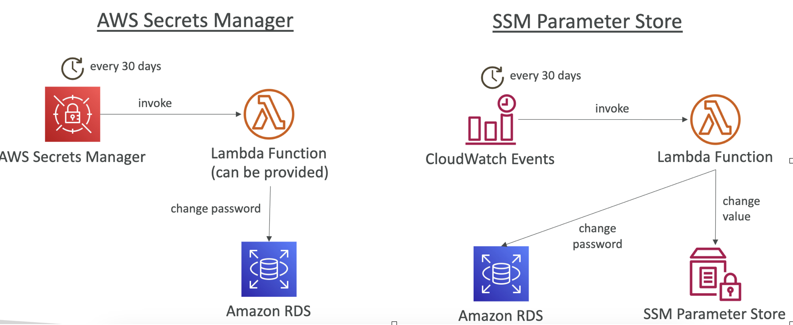
  </p>


### CloudWatch Logs - Encryption
- You can encrypt CloudWatch logs with KMS keys
- Encryption is enabled at the log group level, by associating a CMK with a log group, either when you create the log group or after it exists
- You cannot associate a CMK with a log group using the 

CloudWatch console
- You must use the CloudWatch Logs API:
  - associate-kms-key : if the log group already exists
  - create-log-group: if the log group doesn’t exist yet

#### CodeBuild Security
- To access resources in your VPC, make sure you specify a VPC configuration for your CodeBuild
- Secrets in CodeBuild:
  - Don’t store them as plaintext in environment variables
  - Instead:
      - Environment variables can reference parameter store parameters
      - Environment variables can reference secrets manager secrets


## AWS CICD

CICD – Introduction
- We have learned how to:
  - Create AWS resources, manually (fundamentals)
  - Interact with AWS programmatically (AWS CLI)
  - Deploy code to AWS using Elastic Beanstalk
- All these manual steps make it very likely for us to make mistakes!
- We would like our code “in a repository” and have it deployed onto AWS
  - Automatically
  - The right way
  - Making sure it’s tested before being deployed
  - With possibility to go into different stages (dev, test, staging, prod)
  - With manual approval where needed

To be a proper AWS developer… we need to learn AWS CICD. CICD stack consists of:
- AWS **CodeCommit** – storing our code
- AWS **CodePipeline** – automating our pipeline from code to Elastic Beanstalk
- AWS **CodeBuild** – building and testing our code
- AWS **CodeDeploy** – deploying the code to EC2 instances (not Elastic Beanstalk)
- AWS **CodeStar** – manage software development activities in one place
- AWS CodeArtifact – store, publish, and share software packages
- AWS CodeGuru – automated code reviews using Machine Learning

### Continuous Integration (CI)
- Developers push the code to a code repository often (e.g., GitHub, CodeCommit, Bitbucket…)
- A testing / build server checks the code as soon as it’s pushed (CodeBuild, Jenkins CI, …)
- The developer gets feedback about the tests and checks that have passed / failed
- Find bugs early, then fix bugs
- Deliver faster as the code is tested
- Deploy often
- Happier developers, as they’re unblocked

<p align="center">
  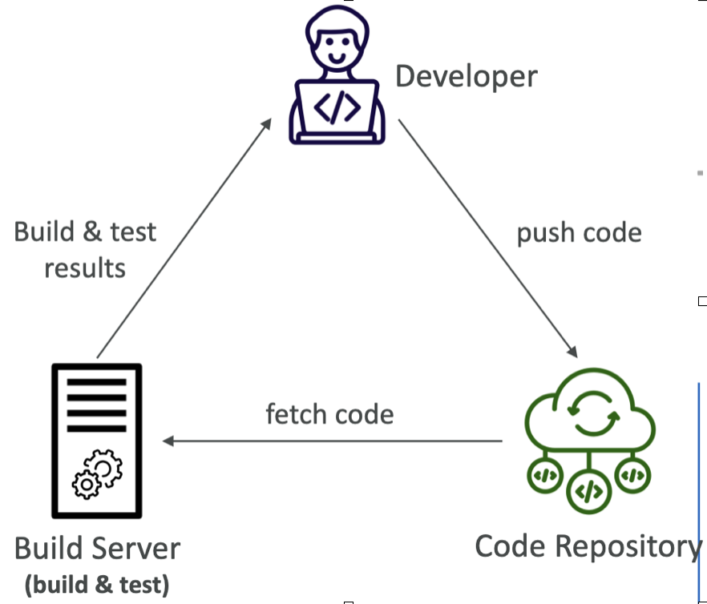
  </p>

### Continuous Delivery (CD)
- Ensures that the software can be released reliably whenever needed
- Ensures deployments happen often and are quick
- Shift away from “one release every 3 months” to ”5 releases a day”
- That usually means automated deployment (e.g., CodeDeploy, Jenkins CD, Spinnaker, …)

<p align="center">
  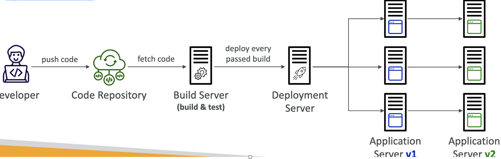
  </p>
  


#### Technology Stack for CICD


<p align="center">
  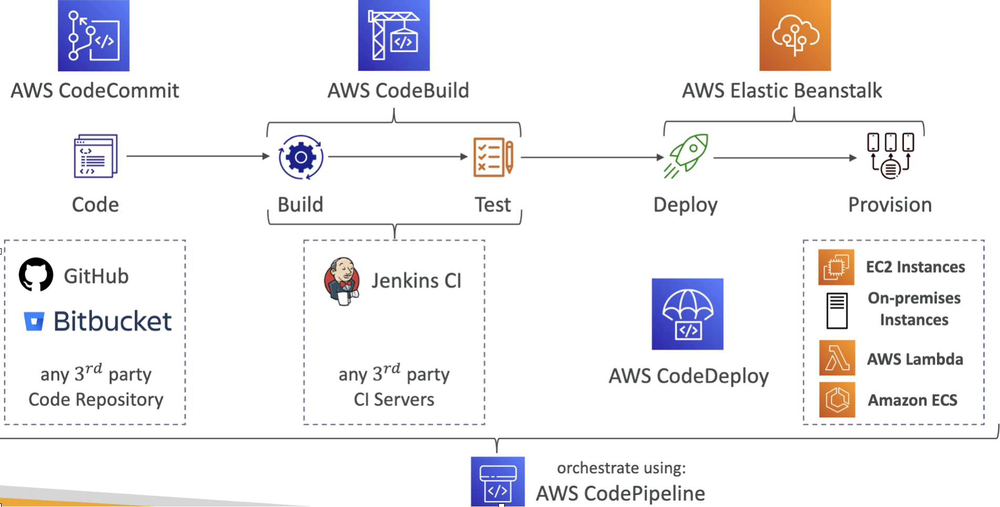
  </p>
  


### AWS CodeCommit
- Version control is the ability to understand the various changes that happened to the code over time (and possibly roll back)
- All these are enabled by using a version control system such as Git
- A Git repository can be synchronized on your computer, but it usually is uploaded on a central online repository
- Benefits are:
  - Collaborate with other developers
  - Make sure the code is backed-up somewhere
  - Make sure it’s fully viewable and auditable
- Git repositories can be expensive
- The industry includes GitHub, GitLab, Bitbucket, …
- And AWS CodeCommit:
  - Private Git repositories
  - No size limit on repositories (scale seamlessly)
  - Fully managed, highly available
  - Code only in AWS Cloud account => increased security and compliance
  - Security (encrypted, access control, …)
  - Integrated with Jenkins, AWS CodeBuild, and other CI tools

#### CodeCommit – Security
- Interactions are done using Git (standard)
- Authentication
  - SSH Keys – AWS Users can configure SSH keys in their IAM Console
  - HTTPS – with AWS CLI Credential helper or Git Credentials for IAM user
- Authorization
  - IAM policies to manage users/roles permissions to repositories
- Encryption
  - Repositories are automatically encrypted at rest using AWS KMS
  - Encrypted in transit (can only use HTTPS or SSH – both secure)
- Cross-account Access
  - Do NOT share your SSH keys or your AWS credentials
  - Use an IAM Role in your AWS account and use AWS STS (AssumeRole API)

### AWS CodePipeline
- Visual Workflow to orchestrate your CICD
- Source – CodeCommit, ECR, S3, Bitbucket, GitHub
- Build – CodeBuild, Jenkins, CloudBees, TeamCity
- Test – CodeBuild, AWS Device Farm, 3rd party tools, …
- Deploy – CodeDeploy, Elastic Beanstalk, CloudFormation, ECS, S3, …
- Invoke – Lambda, Step Functions
- Consists of stages:
  - Each stage can have sequential actions and/or parallel actions
  - Example: Build -> Test -> Deploy -> Load Testing -> …
  - Manual approval can be defined at any stage
- Each pipeline stage can create artifacts. Artifacts stored in an S3 bucket and passed on to the next stage

  
#### CodePipeline – Troubleshooting
- For CodePipeline Pipeline/Action/Stage Execution State Changes
- Use CloudWatch Events (Amazon EventBridge). Example:
  - You can create events for failed pipelines
  - You can create events for cancelled stages
- If CodePipeline fails a stage, your pipeline stops, and you can get information in the console
- If pipeline can’t perform an action, make sure the “IAM Service Role” attached does have enough IAM permissions (IAM Policy)
- AWS CloudTrail can be used to audit AWS API calls

#### CodePipeline – Events vs. Webhooks vs. Polling


<p align="center">
  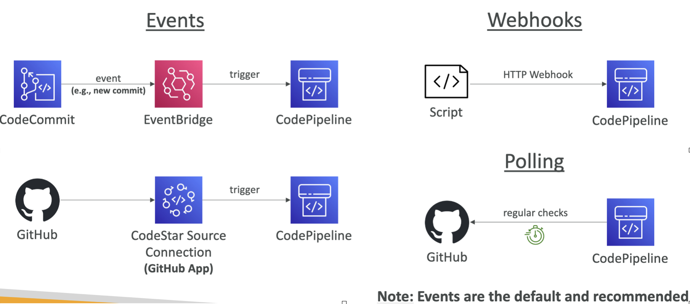
  </p>


#### CodePipeline – Manual Approval Stage

<p align="center">
  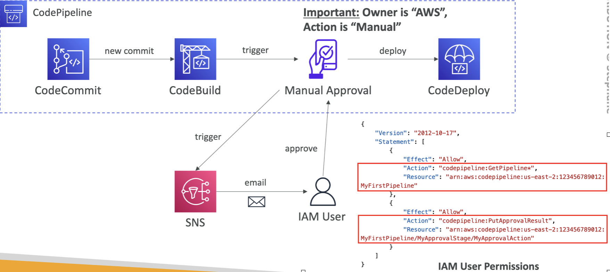
  </p>


### AWS CodeBuild
- A fully managed continuous integration (CI) service
- Continuous scaling (no servers to manage or provision – no build queue)
- Compile source code, run tests, produce software packages, …
- Alternative to other build tools (e.g., Jenkins)
- Charged per minute for compute resources (time it takes to complete the builds)
- Leverages Docker under the hood for reproducible builds
- Use prepackaged Docker images or create your own custom Docker image
- Security:
  - Integration with KMS for encryption of build artifacts
  - IAM for CodeBuild permissions, and VPC for network security
  - AWS CloudTrail for API calls logging


#### AWS CodeBuild
- Source – CodeCommit, S3, Bitbucket, GitHub
- Build instructions: Code file buildspec.yml or insert manually in Console
- Output logs can be stored in Amazon S3 & CloudWatch Logs
- Use CloudWatch Metrics to monitor build statistics
- Use EventBridge to detect failed builds and trigger notifications
- Use CloudWatch Alarms to notify if you need “thresholds” for failures
Build Projects can be defined within CodePipeline or CodeBuild
How it works:


<p align="center">
  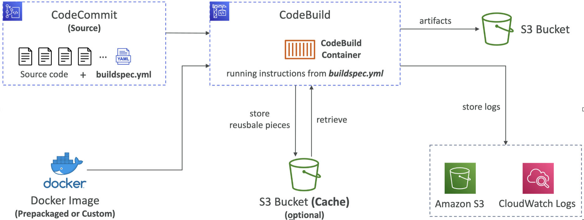
  </p>


#### CodeBuild – `buildspec.yml`
- buildspec.yml file must be at the root of your code
- env – define environment variables
  - variables – plaintext variables
  - parameter-store – variables stored in SSM Parameter Store
  - secrets-manager – variables stored in AWS Secrets Manager
- phases – specify commands to run:
  - install – install dependencies you may need for your build
  - pre_build – final commands to execute before build
  - Build – actual build commands
  - post_build – finishing touches (e.g., zip output)
- artifacts – what to upload to S3 (encrypted with KMS)
- cache – files to cache (usually dependencies) to S3 for future build speedup

<p align="center">
  
  </p>


#### CodeBuild – Inside VPC
By default, your CodeBuild containers are launched outside your VPC. It cannot access resources in a VPC
- You can specify a VPC configuration:
  - VPC ID
  - Subnet IDs
  - Security Group IDs
- Then your build can access resources in your VPC (e.g., RDS, ElastiCache, EC2, ALB, …)
- Use cases: integration tests, data query, internal load balancers, …

#### CodePipeline – CloudFormation Integration
- CloudFormation is used to deploy complex infrastructure using an API
  - CREATE_UPDATE – create or update an existing stack
  - DELETE_ONLY – delete a stack if it exists


<p align="center">
  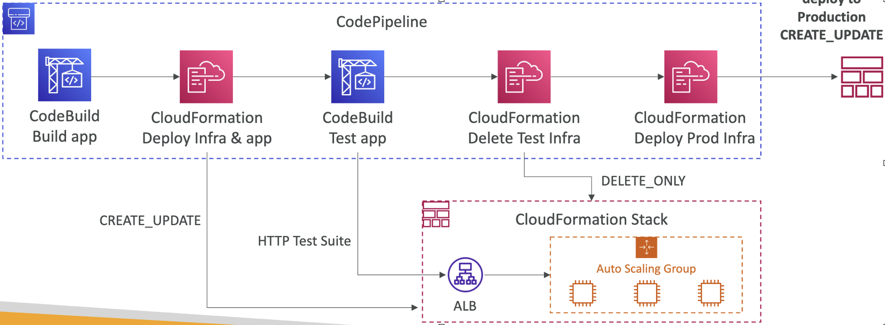
  </p>


### AWS CodeDeploy
- Deployment service that automates application deployment
- Deploy new applications versions to EC2 Instances, On-premises servers, Lambda functions, ECS Services
- **Automated Rollback** capability in case of failed deployments, or trigger CloudWatch Alarm
- **Gradual deployment** control
- A file named `appspec.yml` defines how the deployment happens

#### CodeDeploy – EC2/On-premises Platform
- Can deploy to EC2 Instances & on-premise servers
- In-place deployments, Blue/green deployments work with EC2 instances only!
- Must run the CodeDeploy Agent on the target instances
- Define deployment speed
  - **AllAtOnce**: most downtime
  - **HalfAtATime**: reduced capacity by 50%
  - **OneAtATime**: slowest, lowest availability impact
  - **Custom**: define your %
- Define how to deploy the application using `appspec.yml` + Deployment Strategy
- Will do In-place update to your fleet of EC2 instances
- Can use hooks to verify the deployment after each deployment phase

### CodeDeploy Agent
The CodeDeploy agent is a software package that, when installed and configured on an instance, makes it possible for that instance to be used in CodeDeploy deployments. The CodeDeploy agent communicates outbound using HTTPS over port 443. It is also important to note that the CodeDeploy agent is required only if you deploy to an EC2/On-Premises compute platform. 

- It can be installed and updated automatically if you’re using Systems Manager
- The EC2 Instances must have sufficient permissions to access Amazon S3 to get deployment bundles

CodeDeploy – Lambda Platform
- CodeDeploy can help you automate traffic shift for Lambda aliases
- Feature is integrated within the SAM framework
All AWS Lambda compute platform deployments are blue/green deployments
- Linear: grow traffic every N minutes until 100%
  - LambdaLinear10PercentEvery3Minutes
  - LambdaLinear10PercentEvery10Minutes
- Canary: try X percent then 100%
  - LambdaCanary10Percent5Minutes
  - LambdaCanary10Percent30Minutes
- AllAtOnce: immediate

#### CodeDeploy – ECS Platform
- CodeDeploy can help you automate the deployment of a new ECS Task Definition
- Only Blue/Green Deployments
- Linear: grow traffic every N minutes until 100%
  - ECSLinear10PercentEvery3Minutes
  - ECSLinear10PercentEvery10Minutes
- Canary: try X percent then 100%
  - ECSCanary10Percent5Minutes
  - ECSCanary10Percent30Minutes
- AllAtOnce: immediate

#### CodeDeploy – Redeploy & Rollbacks
- Rollback = redeploy a previously deployed revision of your application
- Deployments can be rolled back:
  - Automatically – rollback when a deployment fails or rollback when a CloudWatch Alarm thresholds are met
  - Manually
- Disable Rollbacks — do not perform rollbacks for this deployment

If a roll back happens, CodeDeploy redeploys the last known good revision as a new 	deployment (not a restored version)

#### CodeDeploy – Troubleshooting
- Deployment Error: “InvalidSignatureException – Signature expired: [time] is now earlier than [time]”
  - For CodeDeploy to perform its operations, it requires accurate time references
  - If the date and time on your EC2 instance are not set correctly, they might not match the signature date of your deployment request, which CodeDeploy rejects
- Check log files to understand deployment issues
  - For Amazon Linux, Ubuntu, and RHEL log files stored at
    `/opt/codedeploy-agent/deployment-root/deployment-logs/codedeploy-agent-deployments.log` 

### AWS CodeStar
An integrated solution that groups: GitHub, CodeCommit, CodeBuild, CodeDeploy, CloudFormation, CodePipeline, CloudWatch, …

- Quickly create “CICD-ready” projects for EC2, Lambda, Elastic Beanstalk
- Supported languages: C#, Go, HTML 5, Java, Node.js, PHP, Python, Ruby
- Issue tracking integration with JIRA / GitHub Issues
- Ability to integrate with Cloud9 to obtain a web IDE (not all regions)
- One dashboard to view all your components
- Free service, pay only for the underlying usage of other services
- Limited Customization

#### AWS CodeArtifact
Software packages depend on other softwares to be built (also called code dependencies), and new ones are created
- Storing and retrieving these dependencies is called artifact management
- Traditionally you need to setup your own artifact management system
- CodeArtifact is a secure, scalable, and cost-effective artifact management for software development
- Works with common dependency management tools such as Maven,Gradle, npm, yarn, twine, pip, and NuGet
- Developers and CodeBuild can then retrieve dependencies straight from CodeArtifact


#### CodeArtifact – Upstream Repositories
- A CodeArtifact repository can have other CodeArtifact repositories as Upstream Repositories
- Allows a package manager client to access the packages that are contained in more than one repository using a single repository endpoint
- Up to 10 Upstream Repositories
Only one external connection


#### CodeArtifact – External Connection
- An External Connection is a connection between a CodeArtifact Repository and an external/public repository (e.g., Maven, npm, PyPI, NuGet…)
- Allows you to fetch packages that are not already present in your CodeArtifact Repository
- A repository has a maximum of 1 external connection
- Create many repositories for many external connections
- Example – Connect to npmjs.com
- Configure one CodeArtifact Repository in your domain with an external connection to npmjs.com
- Configure all the other repositories with an upstream to it
- Packages fetched from npmjs.com are cached in the Upstream Repository, rather than fetching and storing them in each Repository

#### AWS Cloud9
- Cloud-based Integrated Development Environment (IDE) - Code editor, debugger, terminal in a browser
- Work on your projects from anywhere with an Internet connection
Prepackaged with essential tools for popular programming languages (JavaScript, Python, PHP, …)
- Share your development environment with your team (pair programming)
Fully integrated with AWS SAM & Lambda to easily build serverless applications


### AWS SAM

- SAM = Serverless Application Model
- Framework for developing and deploying serverless applications
- All the configuration is YAML code
- Generate complex CloudFormation from simple SAM YAML file
- Supports anything from CloudFormation: Outputs, Mappings, Parameters, Resources
- Only two commands to deploy to AWS
- SAM can use CodeDeploy to deploy Lambda functions
SAM can help you to run Lambda, API Gateway, DynamoDB locally

#### AWS SAM – Recipe
- Transform Header indicates it’s SAM template:
  - Transform: 'AWS::Serverless-2016-10-31'
- Write Code
  - AWS::Serverless::Function
  - AWS::Serverless::Api
  - AWS::Serverless::SimpleTable
- Package & Deploy:
  - aws cloudformation package / sam package
aws cloudformation deploy / sam deploy


#### Deep Dive into SAM Deployment

<p align="center">
  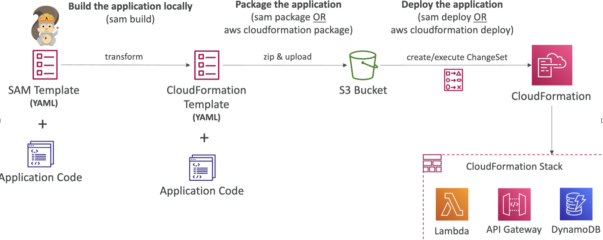
  </p>


#### SAM – Exam Summary
- SAM is built on CloudFormation
- SAM requires the Transform and Resources sections
- Commands to know:
  - sam build: fetch dependencies and create local deployment artifacts
  - sam package: package and upload to Amazon S3, generate CF template
  - sam deploy: deploy to CloudFormation
- SAM Policy templates for easy IAM policy definition
- SAM is integrated with CodeDeploy to do deploy to Lambda aliases


## AWS Cloud Development Kit (CDK)
- Define your cloud infrastructure using a familiar language:
  - JavaScript/TypeScript, Python, Java, and .NET
- Contains high level components called constructs
- The code is “compiled” into a CloudFormation template (JSON/YAML)
- You can therefore deploy infrastructure and application runtime code together
  - Great for Lambda functions
  - Great for Docker containers in ECS / EKS

#### CDK vs SAM
- SAM:
  - Serverless focused
  - Write your template declaratively in JSON or YAML
  - Great for quickly getting started with Lambda
  - Leverages CloudFormation
- CDK:
  - All AWS services
  - Write infra in a programming language JavaScript/TypeScript, Python, Java, and .NET
  - Leverages CloudFormation


#### CDK Constructs
- CDK Construct is a component that encapsulates everything CDK needs to create the final CloudFormation stack
- Can represent a single AWS resource (e.g., S3 bucket) or multiple related resources (e.g., worker queue with compute)
- AWS Construct Library
- A collection of Constructs included in AWS CDK which contains Constructs for every AWS resource
- Contains 3 different levels of Constructs available (L1, L2, L3)
- Construct Hub – contains additional Constructs from AWS, 3rd parties, and open-source CDK community

#### CDK Constructs – Layer 1 Constructs (L1)
- Can be called CFN Resources which represents all resources directly available in CloudFormation
- Constructs are periodically generated from CloudFormation Resource Specification
- Construct names start with Cfn (e.g., CfnBucket)
- You must explicitly configure all resource properties

#### CDK Constructs – Layer 2 Constructs (L2)
- Represents AWS resources but with a higher level (intent-based API)
- Similar functionality as L1 but with convenient defaults and boilerplate
- You don’t need to know all the details about the resource properties
- Provide methods that make it simpler to work with the resource (e.g., `bucket.addLifeCycleRule()`)

#### CDK Constructs – Layer 3 Constructs (L3)
- Can be called Patterns, which represents multiple related resources
- Helps you complete common tasks in AWS
- Examples:
  - aws-apigateway.LambdaRestApi represents an API Gateway backed by a Lambda function
  - `aws-ecs-patterns.ApplicationLoadBalancerFargateService` which represents an architecture that includes a Fargate cluster with Application Load Balancer

#### CDK – Important Commands to know

<p align="center">
  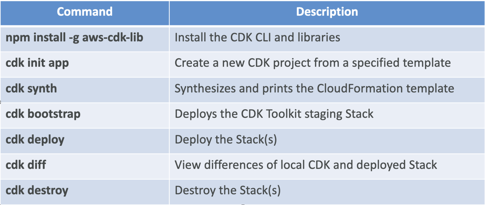
  </p>


### CDK – Bootstrapping
The process of provisioning resources for CDK before you can deploy CDK apps into an AWS environment
- AWS Environment = account & region
- CloudFormation Stack called CDKToolkit is created and contains:
- S3 Bucket – to store files
- IAM Roles – to grant permissions to perform deployments
- You must run the following command for each new environment:
- `cdk bootstrap aws://<aws_account>/<aws_region>`, Otherwise, you will get an error “Policy contains a statement with one or more invalid principal”

<p align="center">
  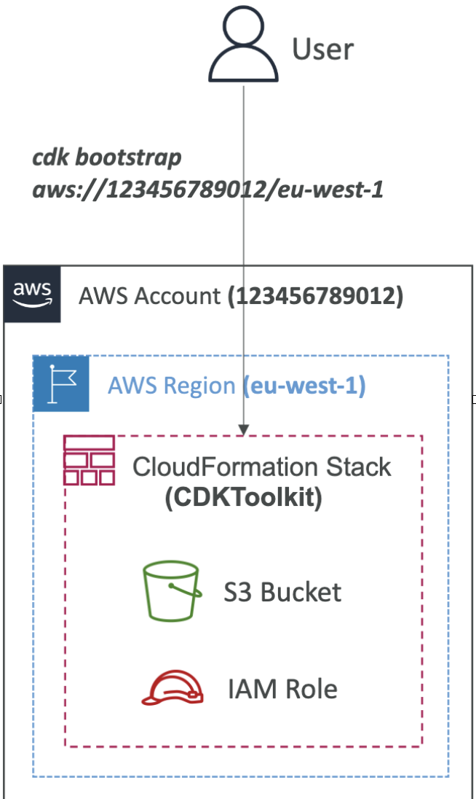
  </p>

#### CDK – Testing
- To test CDK apps, use CDK Assertions Module combined with popular test frameworks such as Jest (JavaScript) or Pytest (Python)
- Verify we have specific resources, rules, conditions, parameters…
- Two types of tests:
  - Fine-grained Assertions (common) – test specific aspects of the CloudFormation 		template (e.g., check if a resource has this property with this value)
  - Snapshot Tests – test the synthesized CloudFormation template against a previously 			stored baseline template
- To import a template
  - Template.fromStack(MyStack) : stack built in CDK
  - Template.fromString(mystring) : stack build outside CDK

<p align="center">
  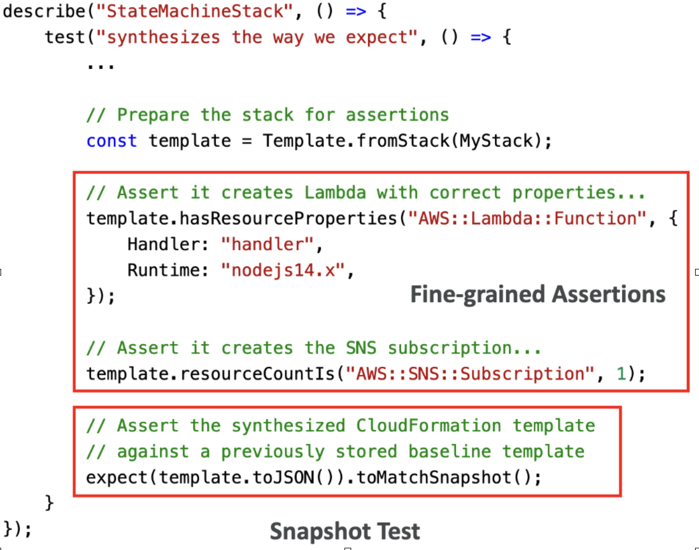
  </p>


