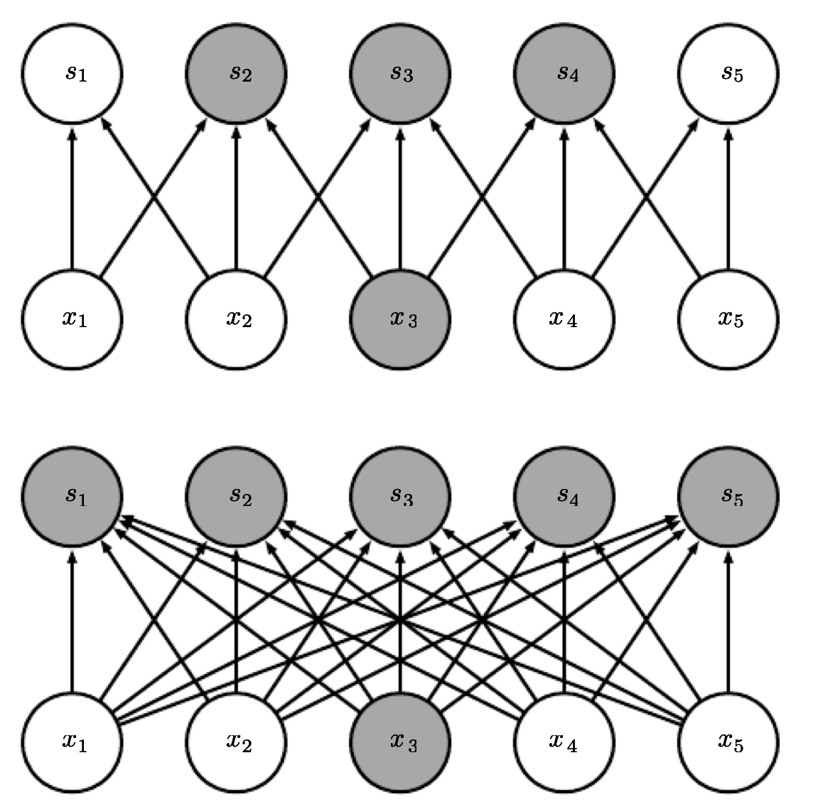
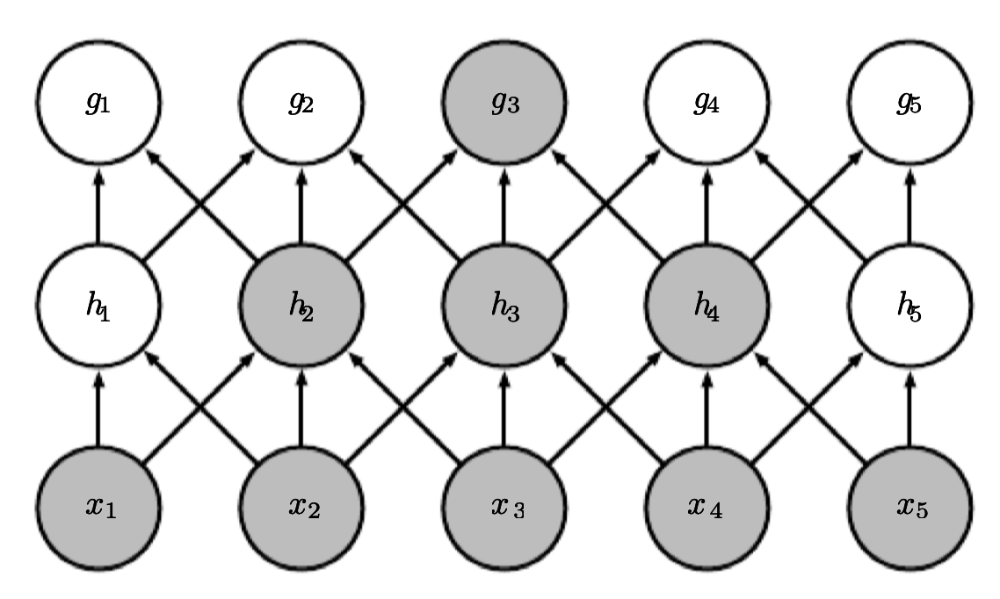
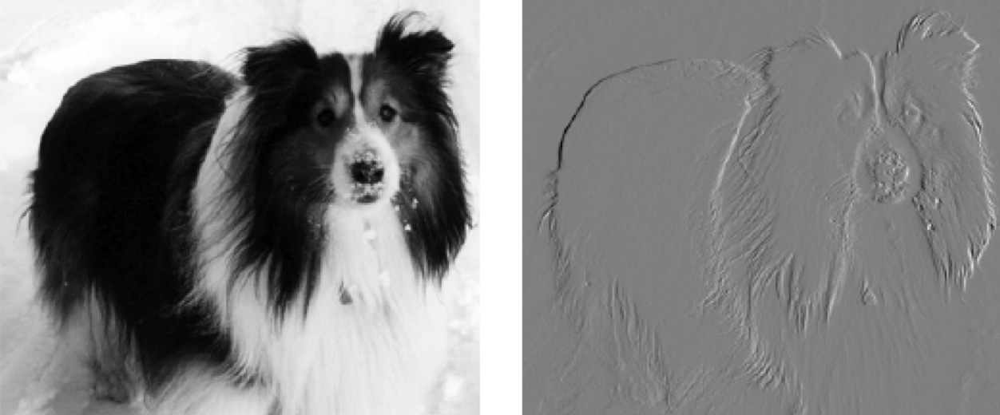
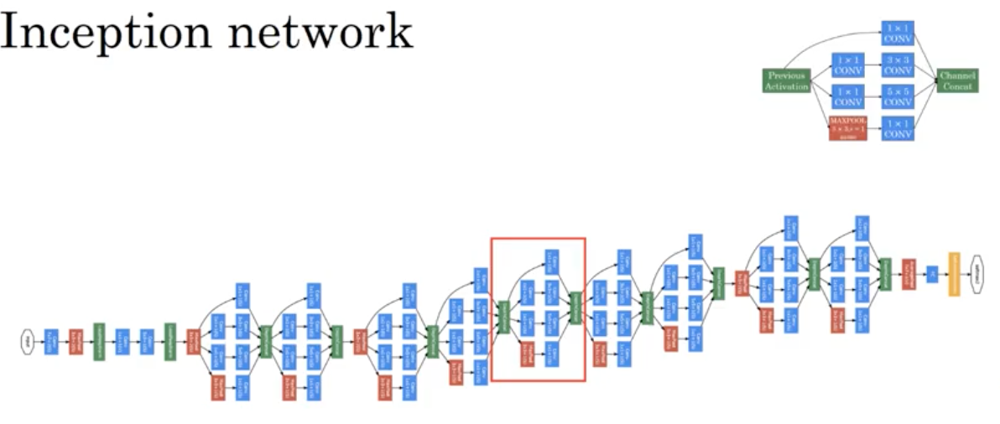

# Convolutional Neural Networks

**Convolutional networks networks** (LeCun 1989), also known as convolutional neural or CNNs, are a specialized kind of neural network for processing data that has a known, grid-like topology. Examples include time-series data, which can be thought of as a 1D grid taking samples at regular time intervals, and image data, which can be thought of as a 2D grid of pixels. Most commonly, ConvNet architectures make the explicit assumption that the inputs are images.

The name _convolutional neural network_ indicates that the network employs a  mathematical operation called **convolution**. Convolution is a specialized kind of linear operation. Convolutional networks are simply neural networks that use convolution in place of general matrix multiplication in at least one of their layers. Convolution of two functions is defined as:

$$
  (x*w)(t) = \int_{-\infty}^{\infty} x(s)w(t-s) ds
$$

Convolution natuarally appears in different areas of Mathematics such as Probability Theory. For example, the pdf of the sum of two random variables is convolution of their pdfs.

If `x` and `w` are defined only on integer `t`, we can define the discrete convolution:

$$
(x*w)(t) = \sum_{s = -\infty}^{\infty} x(s)w(t-s)
$$


The first argument `x` to the convolution is often referred to as the **input** and the second `w` argument as the **filter** (or **kernel**). The output is sometimes referred to as the **feature map**. 

In machine learning applications, the input is usually a multidimensional array of data and the kernel is usually a multidimensional array of parameters that are adapted by the learning algorithm. We will refer to these multidimensional arrays as **tensors**. Because each element of the input and kernel must be explicitly stored separately, we usually assume that these functions are zero everywhere but the finite set of points for which we store the values. 

We often use convolutions over more than one axis at a time. For example, if we use a two-dimensional image I as our input, we probably also want to use a two-dimensional kernel:
$$
(I*K)(i,j) = \sum_m\sum_n I(m,n) K(i+m, j+n).
$$
Also, 
$$I*K = K*I.$$ 
In the above formula, the kernel is not flipped (+ not - ) which is the common way to implement convolution in machine learning. 

It is also rare for convolution to be used alone in machine learning; instead convolution is used simultaneously with other functions, and the combination of these functions does not commute regardless of whether the convolution operation flips its kernel or not. Discrete convolution can be viewed as multiplication by a matrix. However, the matrix has several entries constrained to be equal to other entries. For example, for univariate discrete convolution, each row of the matrix is constrained to be equal to the row above shifted by one element. This usually corresponds to a very sparse matrix (a matrix whose entries are mostly equal to zero) because the kernel is usually much smaller than the input image.

<p align="center">
    
</p>

Convolution leverages three important ideas that can help improve a machine learning system: 
- **Local Connectivity**: In traditional neural network layers, every output unit interacts with every input unit through matrix multiplication meaning a separate parameter describing the interaction between each input unit and each output unit. When dealing with high-dimensional inputs such as images, it is impractical to connect units to all units in the previous volume. In convolutional networks instead, we will connect each unit to only a local region of the input volume. So conv nets typically have sparse interactions referred to as sparse connectivity (also or sparse weights). This is accomplished by making the kernel smaller than the input. This means that we need to store fewer parameters, which both reduces the memory requirements of the model and improves its statistical efficiency. It also means that computing the output requires fewer operations.

    <p align="center">
        
    </p>

    <p align="center">
        
    </p>


    We highlight one output unit `s3` and also highlight the input units in `x` that affect this unit. These units are known as the **receptive field** of `s3`. The **receptive field** is the spatial extent of a filter (or in other words, the connectivity). Note that the extent of the connectivity along the depth axis (depth of the filter) is always equal to the depth of the input volume. The connections are local in 2D space (along width and height), but always full along the entire depth of the input volume. (Top) When s is formed by convolution with a kernel of width , only three inputs affect s3. When (Bottom) s is formed by matrix multiplication, connectivity is no longer sparse, so all of the inputs affect s3.

    <p align="center">
        
    </p>

    The receptive field of the units in the deeper layers of a convolutional network is larger than the receptive field of the units in the shallow layers. This effect increases if the network includes architectural features like strided convolution or pooling. This means that even though direct connections in a convolutional net are very sparse, units in the deeper layers can be indirectly connected to all or most of the input image.

- **Parameter Sharing**: In a traditional neural net, each element of the weight matrix is used exactly once when computing the output of a layer. It is multiplied by one element of the input and then never revisited. The parameter sharing used by the convolution operation means that rather than learning a separate set of parameters.

    <p align="center">
        
    </p>

    Black arrows indicate the connections that use a particular parameter in two different models. (Top) The black arrows indicate uses of the central element of a 3-element kernel in a convolutional model. Due to parameter sharing, this single parameter is used at all input locations. (Bottom) The single black arrow indicates the use of the central element of the weight matrix in a fully connected model. This model has no parameter sharing so the parameter is used only once.

- **Equivariant**: The particular form of parameter sharing causes the layer to have a property called equivariance to translation. With images, convolution creates a 2-D map of where certain features appear in the input. If we move the object in the input, its representation will move the same amount in the output. When processing images, it is useful to detect edges in the first layer of a convolutional network. The same edges appear more or less everywhere in the image, so it is practical to share parameters across the entire image. In some cases, we may not wish to share parameters across the entire image. For example, if we are processing images that are cropped to be centered on an individual’s face, we probably want to extract different features at different locations—the part of the network processing the top of the face needs to look for eyebrows, while the part of the network processing the bottom of the face needs to look for a chin.

#### Efficiency of Edge Detection
The image below on the right was formed by taking each pixel in the original image and subtracting the value of its neighboring pixel on the left.

<p align="center">
    
</p>

This shows the strength of all of the vertically oriented edges in the input image, which can be a useful operation for object detection. Both images are 280 pixels tall. The input image is 320 pixels wide while the output image is 319 pixels wide. This transformation can be described by a convolution kernel containing two elements, and 319 × 280 × 3 = 267,960 floating point operations (two multiplications and requires 319 one addition per output pixel) to compute using convolution. 

As a more clear example, suppose you have a simple image of a square split into white (left) and gray (right) area from the middle. Convolute this matrix with a filter that will turn out to be the vertical edge detector.  The following matrix a a representation of this:

$$
\begin{bmatrix}
10&10&0&0\\
10&10&0&0\\
10&10&0&0\\
10&10&0&0
\end{bmatrix}
*
\begin{bmatrix}
1&-1\\
1&-1
\end{bmatrix}=
\begin{bmatrix}
0&20&0\\
0&20&0\\
0&20&0
\end{bmatrix}
$$

which activates the middle pixels vertically in the image as the border between white and gray.


To describe the same transformation with a matrix multiplication would take 320× 280× 319 × 280, or over eight billion, entries in the matrix, making convolution four billion times more efficient for representing this transformation. The straightforward matrix multiplication algorithm performs over sixteen billion floating point operations, making convolution roughly 60,000 times more efficient computationally.


Convolution with a single kernel can only extract one kind of feature, albeit at many spatial locations. Usually we want each layer of our network to extract many kinds of features, at many locations. So we use several filters to capture more information. 


### Pooling
A typical layer of a convolutional network consists of three stages. In the first stage, the layer performs several convolutions in parallel to produce a set of linear activations. In the second stage, each linear activation is run through a nonlinear activation function, such as the rectified linear activation function. This stage is sometimes called the **detector stage**. In the third stage, we use a **pooling function** to modify the output of the layer further. A pooling function replaces the output of the net at a certain location with a summary statistic of the nearby outputs. 


<p align="center">
        
    </p>

For example, the **max pooling** operation reports the maximum output within a rectangular neighborhood. Max pooling introduces invariance. The image below demonstrate a view of the middle of the output of a convolutional layer. The bottom row shows outputs of the nonlinearity. The top row shows the outputs of max pooling, with a stride of one pixel between pooling regions and a pooling region width of three pixels. The Bottom is a view of the same network, after the input has been shifted to the right by one pixel. Every value in the bottom row has changed, but only half of the values in the top row have changed, because the max pooling units are only sensitive to the maximum value in the neighborhood, not its exact location.


<p align="center">
        
    </p>

Pooling over spatial regions produces invariance to translation, but if we pool over the outputs of separately parametrized convolutions, the features can learn which transformations to become invariant to.

<p align="center">
    
</p>

A pooling unit that pools over multiple features that are learned with separate filters can learn to be invariant to transformations of the input. Each filter attempts to match a slightly different orientation of the 5. When a 5 appears in the input, the corresponding filter will match it and cause a large activation in a detector unit. The max pooling unit then has a large activation regardless of which detector unit was activated. Max pooling over spatial positions is naturally invariant to translation; this multi-channel approach is only necessary for learning other transformations.

Pooling is also used for **downsampling**. Here we use max-pooling with a pool width of 3 and a stride between pools of 2. This reduces the representation size by a factor of 2, which reduces the computational and statistical burden on the next layer. Note that the rightmost pooling region has a smaller size, but must be included if we do not want to ignore some of the detector units.

<p align="center">
    
</p>

In all cases, pooling helps to make the representation become approximately invariant to small translations of the input. The pooled outputs do not change. Invariance to local translation can be a very useful property if we care more about whether some feature is present than exactly where it is. When determining whether an image contains a face, we need not know the location of the eyes with pixel-perfect accuracy, we just need to know that there is an eye on the left side of the face and an eye on the right side of the face. In other contexts, it is more important to preserve the location of a feature. For example, if we want to find a corner defined by two edges meeting at a specific orientation, we need to preserve the location of the edges well enough to test whether they meet. 

Other popular pooling functions include the **average** of a rectangular neighborhood, the **L2 norm** of a rectangular neighborhood, or a **weighted average** based on the distance from the central pixel. 

Pooling can complicate some kinds of neural network architectures that use top-down information, such as Boltzmann machines and autoencoders. Convolution and pooling can cause **underfitting**. If a task relies on preserving precise spatial information, then using pooling on all features can increase the training error. Discarding pooling layers has also been found to be important in training good generative models, such as variational autoencoders (VAEs) or generative adversarial networks (GANs).


### Hyperparameters
Three hyperparameters control the size of the output volume of a convlutional layer: 

- **Depth**: a hyperparameter corresponding to the number of filters we would like to use, each learning to look for something different in the input. For example, if the first Convolutional Layer takes as input the raw image, then different neurons along the depth dimension may activate in presence of _various oriented edges, or blobs of color_. We will refer to a set of neurons that are all looking at the same region of the input as a **depth column**.

- **Stride**: specifies the stride with which we slide the filter. When the stride is 1 then we move the filters one pixel at a time. When the stride is 2 (or uncommonly 3 or more, though this is rare in practice) then the filters jump 2 pixels at a time as we slide them around. This will produce smaller output volumes spatially.

- **Zero-Padding**: One essential feature of any convolutional network implementation is the ability to implicitly **zero-pad**. Without this feature, the width of the representation shrinks by one pixel less than the filter width at each layer. Zero padding the input allows us to control the filter width and the size of the output independently. Without zero padding, we are forced to choose between shrinking the spatial extent of the network rapidly and using small filters—both scenarios that significantly limit the expressive power of the network.  The nice feature of zero padding is that it will allow us to control the spatial size of the output volumes (most commonly as we’ll see soon we will use it to exactly preserve the spatial size of the input volume so the input and output width and height are the same).


We can compute the spatial size of the output volume as a function of the input volume size (W), the receptive field size of the Conv Layer neurons (F), the stride with which they are applied (S), and the amount of zero padding used (P) on the border. You can convince yourself that the correct formula for calculating how many neurons “fit” is given by `(W−F+2P)/S+1`. For example for a 7x7 input and a 3x3 filter with stride 1 and pad 0 we would get a 5x5 output. With stride 2 we would get a 3x3 output.

Suppose that the input volume X has shape X.shape: (11,11,4). Suppose further that we use no zero padding (P=0), that the filter size is F=5, and that the stride is S=2. The output volume would therefore have spatial size (11-5)/2+1 = 4, giving a volume with width and height of 4. The activation map in the output volume (call it V), would then look as follows (only some of the elements are computed in this example):
```
V[0,0,0] = np.sum(X[:5,:5,:] * W0) + b0
V[1,0,0] = np.sum(X[2:7,:5,:] * W0) + b0
V[2,0,0] = np.sum(X[4:9,:5,:] * W0) + b0
V[3,0,0] = np.sum(X[6:11,:5,:] * W0) + b0
```
Remember that in numpy, the operation * above denotes elementwise multiplication between the arrays. Notice also that the weight vector W0 is the weight vector of that neuron and b0 is the bias. Here, W0 is assumed to be of shape W0.shape: (5,5,4), since the filter size is 5 and the depth of the input volume is 4. Notice that at each point, we are computing the dot product as seen before in ordinary neural networks. Also, we see that we are using the same weight and bias (due to parameter sharing), and where the dimensions along the width are increasing in steps of 2 (i.e. the stride). To construct a second activation map in the output volume, we would have:
```
V[0,0,1] = np.sum(X[:5,:5,:] * W1) + b1
V[1,0,1] = np.sum(X[2:7,:5,:] * W1) + b1
V[2,0,1] = np.sum(X[4:9,:5,:] * W1) + b1
V[3,0,1] = np.sum(X[6:11,:5,:] * W1) + b1
V[0,1,1] = np.sum(X[:5,2:7,:] * W1) + b1 (example of going along y)
V[2,3,1] = np.sum(X[4:9,6:11,:] * W1) + b1 (or along both)
...
```

where we see that we are indexing into the second depth dimension in V (at index 1) because we are computing the second activation map, and that a different set of parameters (W1) is now used. In the example above, we are for brevity leaving out some of the other operations the Conv Layer would perform to fill the other parts of the output array V. Additionally, recall that these activation maps are often followed elementwise through an activation function such as ReLU, but this is not shown here. 

To summarize, the Conv Layer:

- Accepts a volume of size W1×H1×D1
- Requires four hyperparameters:
    - Number of filters K,
    - their spatial extent F,
    - the stride S,
    - the amount of zero padding P.
- Produces a volume of size W2×H2×D2 where:
    - W2=(W1−F+2P)/S+1
    - H2=(H1−F+2P)/S+1 (i.e. width and height are computed equally by symmetry)
    - D2=K

In the output volume, the d-th depth slice (of size W2×H2) is the result of performing a valid convolution of the d-th filter over the input volume with a stride of S, and then offset by d-th bias. A common setting of the hyperparameters is F=3,S=1,P=1. However, there are common conventions and rules of thumb that motivate these hyperparameters. 


### Backpropagation

The backward pass for a convolution operation (for both the data and the weights) is also a convolution (but with spatially-flipped filters). This is easy to derive in the 1-dimensional case with a toy example.

Recall from the backpropagation chapter that the backward pass for a `max(x, y)` operation has a simple interpretation as only routing the gradient to the input that had the highest value in the forward pass. Hence, during the forward pass of a pooling layer it is common to keep track of the index of the max activation (sometimes also called the switches) so that gradient routing is efficient during backpropagation. This way max pooling layer add no cost for backpropogation.


## Converting FC layers to CONV layers

It is worth noting that the only difference between FC (fully connected) and CONV layers is that the neurons in the CONV layer are connected only to a local region in the input, and that many of the neurons in a CONV volume share parameters. However, the neurons in both layers still compute dot products, so their functional form is identical. Therefore, it turns out that it’s possible to convert between FC and CONV layers:

- For any CONV layer there is an FC layer that implements the same forward function. The weight matrix would be a large matrix that is mostly zero except for at certain blocks (due to local connectivity) where the weights in many of the blocks are equal (due to parameter sharing). This is extremely computationally wastful.

-  Any FC layer can be converted to a CONV layer. For example, an FC layer with K=4096 units that is looking at some input volume of size 7×7×512 can be equivalently expressed as a CONV layer with F=7,P=0,S=1,K=4096 (K is the number of filters). In other words, we are setting the filter size to be exactly the size of the input volume, and hence the output will simply be 1×1×4096 since only a single depth column “fits” across the input volume, giving identical result as the initial FC layer. 

**FC -> CONV** conversion is particularly useful in practice. Consider a ConvNet architecture that takes a 224x224x3 image, and then uses a series of CONV layers and POOL layers to reduce the image to an activations volume of size 7x7x512 (this is done by use of 5 pooling layers that downsample the input spatially by a factor of two each time, making the final spatial size 224/2/2/2/2/2 = 7). From there, an AlexNet uses two FC layers of size 4096 and finally the last FC layers with 1000 neurons that compute the class scores. We can convert each of these three FC layers to CONV layers as described above:

- Replace the first FC layer that looks at [7x7x512] volume with a CONV layer that uses filter size F=7, giving output volume [1x1x4096].
- Replace the second FC layer with a CONV layer that uses filter size F=1, giving output volume [1x1x4096]
- Replace the last FC layer similarly, with F=1, giving final output [1x1x1000]

It turns out that this conversion allows us to “slide” the original ConvNet very efficiently across many spatial positions in a larger image, in a single forward pass. For example, if 224x224 input image gives a volume of size [7x7x512] - i.e. a reduction by 32, then forwarding an unput image of size 384x384 through the converted architecture would give the equivalent volume in size [12x12x512], since 384/32 = 12. Following through with the next 3 CONV layers that we just converted from FC layers (applied 3 Conv layers: 4096 filters of size  each, then another 4096 filter of size 1 each, 1000 filters of size 1 each) would now give the final volume of size [6x6x1000], since (12 - 7)/1 + 1 = 6. Note that instead of a single vector of class scores of size [1x1x1000], we’re now getting an entire 6x6 array of class scores across the 384x384 image. Here is the benefit: 

_Evaluating the original ConvNet (with FC layers) independently across 224x224 crops of the 384x384 image in strides of 32 pixels gives an identical result to forwarding the converted ConvNet one time but the second option is much more efficient_. 

Naturally, forwarding the converted ConvNet a single time is much more efficient than iterating the original ConvNet over all those 36 locations, since the 36 evaluations share computation. This trick is often used in practice to get better performance, where for example, it is common to resize an image to make it bigger, use a converted ConvNet to evaluate the class scores at many spatial positions and then average the class scores.

Lastly, what if we wanted to efficiently apply the original ConvNet over the image but at a stride smaller than 32 pixels? We could achieve this with multiple forward passes. For example, note that if we wanted to use a stride of 16 pixels we could do so by combining the volumes received by forwarding the converted ConvNet twice: First over the original image and second over the image but with the image shifted spatially by 16 pixels along both width and height.


## ConvNet Architectures

We have seen that Convolutional Networks are commonly made up of only three layer types: CONV, POOL (Max pool unless stated otherwise) and FC (fully-connected). We will also explicitly write the RELU activation function as a layer, which applies elementwise non-linearity. 

#### Layer Patterns

The most common form of a ConvNet architecture stacks a few CONV-RELU layers, follows them with POOL layers, and repeats this pattern until the image has been merged spatially to a small size. At some point, it is common to transition to fully-connected layers. The last fully-connected layer holds the output, such as the class scores. In other words, the most common ConvNet architecture follows the pattern:

`INPUT -> [[CONV -> RELU]*N -> POOL?]*M -> [FC -> RELU]*K -> FC`

where the `*` indicates repetition, and the POOL? indicates an optional pooling layer. Moreover, `N >= 0` (and usually N <= 3), `M >= 0`, `K >= 0` (and usually K < 3). Or there is a single CONV layer between every POOL layer

`INPUT -> [CONV -> RELU -> POOL]*2 -> FC -> RELU -> FC`

Or we see two CONV layers stacked before a POOL layer. This is generally a good idea for larger and deeper networks, because multiple stacked CONV layers can develop more complex features of the input volume before the destructive pooling operation.:

`INPUT -> [CONV -> RELU -> CONV -> RELU -> POOL]*3 -> [FC -> RELU]*2 -> FC`

Here we see two CONV layers stacked before every POOL layer. This is generally a good idea for larger and deeper networks, because multiple stacked CONV layers can develop more complex features of the input volume before the destructive pooling operation.

_Prefer a stack of small filter CONV to one large receptive field CONV layer_. Suppose that you stack three 3x3 CONV layers on top of each other (with non-linearities in between, of course). In this arrangement, each neuron on the first CONV layer has a 3x3 view of the input volume. A neuron on the second CONV layer has a 3x3 view of the first CONV layer, and hence by extension a 5x5 view of the input volume. Similarly, a neuron on the third CONV layer has a 3x3 view of the 2nd CONV layer, and hence a 7x7 view of the input volume. Suppose that instead of these three layers of 3x3 CONV, we only wanted to use a single CONV layer with 7x7 receptive fields. These neurons would have a receptive field size of the input volume that is identical in spatial extent (7x7), but with several disadvantages. First, the neurons would be computing a linear function over the input, while the three stacks of CONV layers contain non-linearities that make their features more expressive. Second, if we suppose that all the volumes have C channels, then it can be seen that the single 7x7 CONV layer would contain C×(7×7×C)=49C2 parameters, while the three 3x3 CONV layers would only contain 3×(C×(3×3×C))=27C2 parameters. Intuitively, stacking CONV layers with tiny filters as opposed to having one CONV layer with big filters allows us to express more powerful features of the input, and with fewer parameters. As a practical disadvantage, we might need more memory to hold all the intermediate CONV layer results if we plan to do backpropagation.

#### In practice

Use whatever works best on **ImageNet**. In 90% or more of applications you should not have to worry about these. Instead of rolling your own architecture for a problem, you should look at whatever architecture currently works best on ImageNet, download a pretrained model and finetune it on your data. You should rarely ever have to train a ConvNet from scratch or design one from scratch.

### Layer Sizing Patterns

We will first state the common rules of thumb for sizing the architectures and then follow the rules with a discussion of the notation:

- The **input layer** (that contains the image) should be divisible by 2 many times. Common numbers include 32 (e.g. CIFAR-10), 64, 96 (e.g. STL-10), or 224 (e.g. common ImageNet ConvNets), 384, and 512.

- The **conv layers** should be using small filters (e.g. 3x3 or at most 5x5), using a stride of S=1, and crucially, padding the input volume with zeros in such way that the conv layer does not alter the spatial dimensions of the input. That is, when F=3, then using P=1 will retain the original size of the input. When F=5, P=2. For a general F, it can be seen that P=(F−1)/2 preserves the input size. If you must use bigger filter sizes (such as 7x7 or so), it is only common to see this on the very first conv layer that is looking at the input image.

- The most common setting for **pool layers** is to use max-pooling with 2x2 receptive fields (i.e. F=2), and with a stride of 2 (i.e. S=2). Note that this discards exactly 75% of the activations (1 out of 4 kept) in an input volume. Another slightly less common setting is to use 3x3 receptive fields with a stride of 2, but this makes “fitting” more complicated (e.g., a 32x32x3 layer would require zero padding to be used with a max-pooling layer with 3x3 receptive field and stride 2). It is very uncommon to see receptive field sizes for max pooling that are larger than 3 because the pooling is then too lossy and aggressive. This usually leads to worse performance.

The scheme presented above is pleasing because all the CONV layers preserve the spatial size of their input, while the POOL layers alone are in charge of down-sampling the volumes spatially. In an alternative scheme where we use strides greater than 1 or don’t zero-pad the input in CONV layers, we would have to very carefully keep track of the input volumes throughout the CNN architecture and make sure that all strides and filters “work out”, and that the ConvNet architecture is nicely and symmetrically wired. In general:

- **Smaller strides** work better in practice. Additionally, as already mentioned stride 1 allows us to leave all spatial down-sampling to the POOL layers, with the CONV layers only transforming the input volume depth-wise.

- If the CONV layers were to not **zero-pad** the inputs and only perform valid convolutions, then the size of the volumes would reduce by a small amount after each CONV, and the information at the borders would be “washed away” too quickly.

- Compromising based on **memory constraints**. In some cases (especially early in the ConvNet architectures), the amount of memory can build up very quickly with the rules of thumb presented above. For example, filtering a 224x224x3 image with three 3x3 CONV layers with 64 filters each and padding 1 would create three activation volumes of size [224x224x64]. This amounts to a total of about 10 million activations, or 72MB of memory (per image, for both activations and gradients). Since GPUs are often bottlenecked by memory, it may be necessary to compromise. In practice, people prefer to make the compromise at only the first CONV layer of the network. For example, one compromise might be to use a first CONV layer with filter sizes of 7x7 and stride of 2 (as seen in a ZF net). As another example, an AlexNet uses filter sizes of 11x11 and stride of 4.


## Case studies

There are several architectures in the field of Convolutional Networks that have a name. The most common are:

- **LeNet** (1998). The first successful applications of Convolutional Networks were developed by Yann LeCun in 1990’s. Of these, the best known is the LeNet architecture that was used to read zip codes, handwritten digits, etc. It was trained on grayscale images with input 32x32x1. Very small architecture with only 60K parammeter, No padding, average pooling (not common today), nonlinearity after the pooling layer (unlike today), width x height dimension shrinks layer to layer up to the FC layer and the output layer of size 10 and a classification function (useless today) to spit the probabilities.  

- **AlexNet**. The first work that popularized Convolutional Networks in Computer Vision was the AlexNet, developed by Alex Krizhevsky, Ilya Sutskever and Geoff Hinton. The AlexNet was trained on the ImageNet dataset for ILSVRC challenge in 2012 and significantly outperformed the second runner-up (top 5 error of 16% compared to runner-up with 26% error). The Network had a very similar architecture to LeNet, but was deeper, much bigger (60M parameters), and featured Convolutional Layers stacked on top of each other (previously it was common to only have a single CONV layer always immediately followed by a POOL layer). Input size was 227x227x3 (224x224x3 in the paper, a mistake?). It used Relu activation function and some times strides 4 (not common today). It had a complicated way to train layer on multiple GPUs (were very slow then). It was this paper that attracted reseacher to take computer vision and beyond more seriously.

- **GoogLeNet (Inception Network)**. The ILSVRC 2014 winner was a Convolutional Network from Szegedy et al. from Google. Its main contribution was the development of Inception Module that dramatically reduced the number of parameters in the network (4M, compared to AlexNet with 60M). Additionally, this paper uses Average Pooling instead of Fully Connected layers at the top of the ConvNet, eliminating a large amount of parameters that do not seem to matter much. What the inception layer says is that instead of having to choosing filter size in conv layer or even pooling layer, let do them all. There are also several followup versions to the GoogLeNet, most recently Inception-v4. For example, you might apply 1x1, 3x3, 5x5 filters and/or pooling all together and stack up the results.

    <p align="center">
        
    </p>

    So let the network learn whatever combination of these filter sizes needed to get better results. There is a computational cost here that can be eleviated by using 1x1 convolutions. For example, imagine 28x28x192 input and 5x5 filter size, same applied to it to ouput 28x28x32. The number of multiplications required here is 28x28x5x5x192x32 ~ 120M. Alternatively, we first apply a 1x1 Conv layer to output 28x28x16 (called bottle neck) and then apply 5x5 Conv layer to get 28x28x32. The number of maultiplications now is 28x28x192x16 + 28x28x16x5x5x32 ~ 2.4M + 10M = 12.4M which order of magnitude smaller (# additions are similar). The bottle neck laer doesnt seem to hurt the performance. The following shows inception module.
    
    <p align="center">
    
    </p>
    Inception network stackes several of these inception modules blocks 

    <p align="center">
    
    </p>

    Another feature of architecture in Inception networks is that it output softmax layers a few times (before and other than the final sofmax layer) to ensure the units in the intermediate layers also trained against the labels directly which appears to have a regularization effect as well.


- **VGG-16**. The runner-up in ILSVRC 2014 was the network from Karen Simonyan and Andrew Zisserman that became known as the VGGNet. Its main contribution was in showing that the depth of the network is a critical component for good performance. Their final best network contains 16 CONV/FC layers and, appealingly, features an extremely homogeneous architecture that only performs 3x3 convolutions and 2x2 pooling, with stride 1 or 2 from the beginning to the end. So it simplfied the archhitecture. Their pretrained model is available for plug and play use in Caffe. A downside of the VGGNet is that it is more expensive to evaluate and uses a lot more memory and parameters (138M). Dimension width x height keeps decreasing but the depth of filters decreases and then increases. Most of these parameters are in the first fully connected layer, and it was since found that these FC layers can be removed with no performance downgrade, significantly reducing the number of necessary parameters.

    Lets break down the VGGNet in more detail as a case study. The whole VGGNet is composed of CONV layers that perform 3x3 convolutions with stride 1 and pad 1, and of POOL layers that perform 2x2 max pooling with stride 2 (and no padding). We can write out the size of the representation at each step of the processing and keep track of both the representation size and the total number of weights:

    ```
    INPUT: [224x224x3]        memory:  224*224*3=150K   weights: 0
    CONV3-64: [224x224x64]  memory:  224*224*64=3.2M   weights: (3*3*3)*64 = 1,728
    CONV3-64: [224x224x64]  memory:  224*224*64=3.2M   weights: (3*3*64)*64 = 36,864
    POOL2: [112x112x64]  memory:  112*112*64=800K   weights: 0
    CONV3-128: [112x112x128]  memory:  112*112*128=1.6M   weights: (3*3*64)*128 = 73,728
    CONV3-128: [112x112x128]  memory:  112*112*128=1.6M   weights: (3*3*128)*128 = 147,456
    POOL2: [56x56x128]  memory:  56*56*128=400K   weights: 0
    CONV3-256: [56x56x256]  memory:  56*56*256=800K   weights: (3*3*128)*256 = 294,912
    CONV3-256: [56x56x256]  memory:  56*56*256=800K   weights: (3*3*256)*256 = 589,824
    CONV3-256: [56x56x256]  memory:  56*56*256=800K   weights: (3*3*256)*256 = 589,824
    POOL2: [28x28x256]  memory:  28*28*256=200K   weights: 0
    CONV3-512: [28x28x512]  memory:  28*28*512=400K   weights: (3*3*256)*512 = 1,179,648
    CONV3-512: [28x28x512]  memory:  28*28*512=400K   weights: (3*3*512)*512 = 2,359,296
    CONV3-512: [28x28x512]  memory:  28*28*512=400K   weights: (3*3*512)*512 = 2,359,296
    POOL2: [14x14x512]  memory:  14*14*512=100K   weights: 0
    CONV3-512: [14x14x512]  memory:  14*14*512=100K   weights: (3*3*512)*512 = 2,359,296
    CONV3-512: [14x14x512]  memory:  14*14*512=100K   weights: (3*3*512)*512 = 2,359,296
    CONV3-512: [14x14x512]  memory:  14*14*512=100K   weights: (3*3*512)*512 = 2,359,296
    POOL2: [7x7x512]  memory:  7*7*512=25K  weights: 0
    FC: [1x1x4096]  memory:  4096  weights: 7*7*512*4096 = 102,760,448
    FC: [1x1x4096]  memory:  4096  weights: 4096*4096 = 16,777,216
    FC: [1x1x1000]  memory:  1000 weights: 4096*1000 = 4,096,000
    ```

    TOTAL memory: 24M * 4 bytes ~= 93MB / image (only forward! ~*2 for bwd)

    TOTAL params: 138M parameters

    As is common with Convolutional Networks, notice that most of the memory (and also compute time) is used in the early CONV layers, and that most of the parameters are in the last FC layers. In this particular case, the first FC layer contains 100M weights, out of a total of 138M.

- **ResNet**. Residual Network developed by Kaiming He et al. was the winner of ILSVRC 2015. It features special skip connections and a heavy use of batch normalization. The architecture is also missing fully connected layers at the end of the network. The reader is also referred to Kaiming’s presentation (video, slides), and some recent experiments that reproduce these networks in Torch. ResNets are currently by far the state of the art Convolutional Neural Network models and are the default choice for using ConvNets in practice (as of May 10, 2016). In particular, also see more recent developments that tweak the original architecture from Kaiming He et al. Identity Mappings in Deep Residual Networks (published March 2016). An interesting feature in ResNet is _Residual Block_ design which is the output of layer l (which is the putput of layer l+1) is added to the linear part of of layer l+2 (if dimensions of the two are not equal, multiply it with a matrix of appropriate size  with entries to be learnt during training:$$z^{[l+2]} + wa^{[l]}$$ where w=0 if dimension of a and z are the same) before applying its non-linearity relu. 

<p align="center">
    
</p>

This is called a shortcut because layer l+1 is totally skipped (skip connection). The authors realized that using residual blocks allow training much deeper nets if they are stacked. This trick can strenthen the backprop gradient signal so convergence is stronger and reduce the loss for much longer interations. 


## Computational Considerations

The largest bottleneck to be aware of when constructing ConvNet architectures is the **memory bottleneck**. Many modern GPUs have a limit of 3/4/6GB memory, with the best GPUs having about 12GB of memory. There are three major sources of memory to keep track of:

- From the intermediate volume sizes: These are the raw number of activations at every layer of the ConvNet, and also their gradients (of equal size). Usually, most of the activations are on the earlier layers of a ConvNet (i.e. first Conv Layers). These are kept around because they are needed for backpropagation, but a clever implementation that runs a ConvNet only at test time could in principle reduce this by a huge amount, by only storing the current activations at any layer and discarding the previous activations on layers below.

- From the parameter sizes: These are the numbers that hold the network parameters, their gradients during backpropagation, and commonly also a step cache if the optimization is using momentum, Adagrad, or RMSProp. Therefore, the memory to store the parameter vector alone must usually be multiplied by a factor of at least 3 or so.

- Every ConvNet implementation has to maintain miscellaneous memory, such as the image data batches, perhaps their augmented versions, etc.

Once you have a rough estimate of the total number of values (for activations, gradients, and misc), the number should be converted to size in GB. Take the number of values, multiply by 4 to get the raw number of bytes (since every floating point is 4 bytes, or maybe by 8 for double precision), and then divide by 1024 multiple times to get the amount of memory in KB, MB, and finally GB. If your network doesn’t fit, a common heuristic to “make it fit” is to decrease the batch size, since most of the memory is usually consumed by the activations.


## Transfer Learning

In practice, very few people train an entire Convolutional Network from scratch (with random initialization), because it is relatively rare to have a dataset of sufficient size. Instead, it is common to pretrain a ConvNet on a very large dataset (e.g. ImageNet, which contains 1.2 million images with 1000 categories), and then use the ConvNet either as an _initialization_ or _a fixed feature extractor_ for the task of interest. The three major Transfer Learning scenarios look as follows:

1. **ConvNet as fixed feature extractor**: 

    - Take a ConvNet pretrained on ImageNet
    - Remove the last fully-connected layer (this layer’s outputs are the 1000 class scores for a different task like ImageNet)
    - Treat the rest of the ConvNet as a fixed feature extractor for the new dataset 

    In an AlexNet, this would compute a 4096-D vector for every image that contains the activations of the hidden layer immediately before the classifier. We call these features **CNN codes**. It is important for performance that these codes are ReLUd (i.e. thresholded at zero) if they were also thresholded during the training of the ConvNet on ImageNet (as is usually the case). Once you extract the 4096-D codes for all images, train a linear classifier (e.g. Linear SVM or Softmax classifier) for the new dataset.

2. **Fine-tuning the ConvNet**: The second strategy is to not only replace and retrain the classifier on top of the ConvNet on the new dataset, but to also fine-tune the weights of the pretrained network by continuing the backpropagation. It is possible to fine-tune all the layers of the ConvNet, or it’s possible to keep some of the earlier layers fixed (due to overfitting concerns) and only fine-tune some higher-level portion of the network. This is motivated by the observation that the earlier features of a ConvNet contain more generic features (e.g. edge detectors or color blob detectors) that should be useful to many tasks, but later layers of the ConvNet becomes progressively more specific to the details of the classes contained in the original dataset. In case of ImageNet for example, which contains many dog breeds, a significant portion of the representational power of the ConvNet may be devoted to features that are specific to differentiating between dog breeds.

3. **Pretrained models**. Since modern ConvNets take 2-3 weeks to train across multiple GPUs on ImageNet, it is common to see people release their final ConvNet checkpoints for the benefit of others who can use the networks for fine-tuning. For example, the Caffe library has a [Model Zoo](https://github.com/BVLC/caffe/wiki/Model-Zoo) where people share their network weights.

When and how to fine-tune? How do you decide what type of transfer learning you should perform on a new dataset? This is a function of several factors, but the two most important ones are the size of the new dataset (small or big), and its similarity to the original dataset (e.g. ImageNet-like in terms of the content of images and the classes, or very different, such as microscope images). Keeping in mind that ConvNet features are more generic in early layers and more original-dataset-specific in later layers, here are some common rules of thumb for navigating the 4 major scenarios:

- New dataset is small and similar to original dataset. Since the data is small, it is not a good idea to fine-tune the ConvNet due to overfitting concerns. Since the data is similar to the original data, we expect higher-level features in the ConvNet to be relevant to this dataset as well. Hence, the best idea might be to train a linear classifier on the CNN codes.

- New dataset is large and similar to the original dataset. Since we have more data, we can have more confidence that we won’t overfit if we were to try to fine-tune through the full network.

- New dataset is small but very different from the original dataset. Since the data is small, it is likely best to only train a linear classifier. Since the dataset is very different, it might not be best to train the classifier form the top of the network, which contains more dataset-specific features. Instead, it might work better to train the SVM classifier from activations somewhere earlier in the network.

- New dataset is large and very different from the original dataset. Since the dataset is very large, we may expect that we can afford to train a ConvNet from scratch. However, in practice it is very often still beneficial to initialize with weights from a pretrained model. In this case, we would have enough data and confidence to fine-tune through the entire network.


### Practical Advice
There are a few additional things to keep in mind when performing Transfer Learning:

- **Constraints from pretrained models**. Note that if you wish to use a pretrained network, you may be slightly constrained in terms of the architecture you can use for your new dataset. For example, you can’t arbitrarily take out Conv layers from the pretrained network. However, some changes are straight-forward: Due to parameter sharing, you can easily run a pretrained network on images of different spatial size. This is clearly evident in the case of Conv/Pool layers because their forward function is independent of the input volume spatial size (as long as the strides “fit”). In case of FC layers, this still holds true because FC layers can be converted to a Convolutional Layer: For example, in an AlexNet, the final pooling volume before the first FC layer is of size [6x6x512]. Therefore, the FC layer looking at this volume is equivalent to having a Convolutional Layer that has receptive field size 6x6, and is applied with padding of 0.

- **Learning Rates**. It’s common to use a smaller learning rate for ConvNet weights that are being fine-tuned, in comparison to the (randomly-initialized) weights for the new linear classifier that computes the class scores of your new dataset. This is because we expect that the ConvNet weights are relatively good, so we don’t wish to distort them _too quickly and too much_ (especially while the new Linear Classifier above them is being trained from random initialization).

- **Data Augmentation**: use _mirroring_, _random cropping_, _rotation_, _sheering_, _color shifting_ (RGB channels), _PCA color augmentation_ to keep the tint controlled. These _distortions_ can be implemented in separate threads during training in each mini batches. In other words, one or more threads become responsible for loading and implementing these distortions in parallel to training. 

- **Open Source**: use the models in open source community usually implemented by the authors of the paers themselves rather than implemnting them yourself from scratch. These resources can be found on github. 


--------------

References:
- [Deep Learning by Ian Goodfellow, Yoshua Bengio, Aaron Courville](https://www.amazon.ca/Deep-Learning-Ian-Goodfellow/dp/0262035618/ref=asc_df_0262035618/?tag=googleshopc0c-20&linkCode=df0&hvadid=706745562943&hvpos=&hvnetw=g&hvrand=4165137193847264239&hvpone=&hvptwo=&hvqmt=&hvdev=c&hvdvcmdl=&hvlocint=&hvlocphy=9000826&hvtargid=pla-416263148149&psc=1&mcid=d1d85934bcd73af29621fd70386e098c&gad_source=1)
- [CS231n: Convolutional Neural Networks for Visual Recognition.](https://cs231n.github.io)
- [Convolutional Neural Netwroks - DeepLearning.AI](https://www.coursera.org/learn/convolutional-neural-networks?specialization=deep-learning)