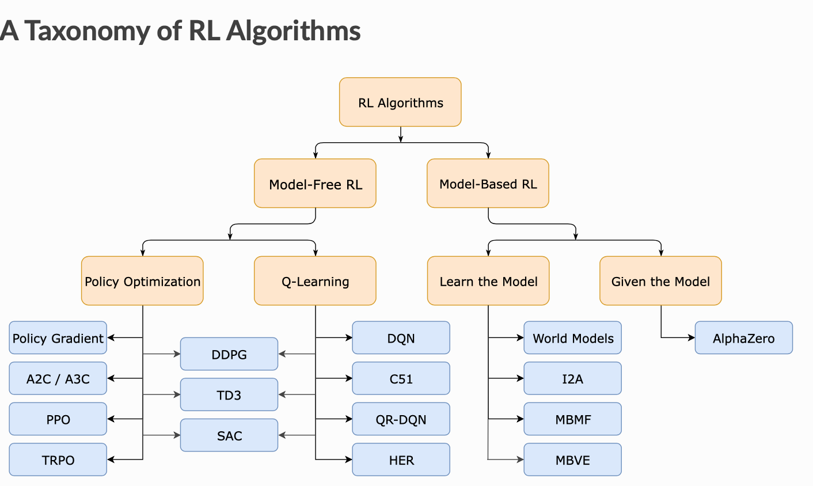

<h1 class='title'>Deep Reinforcement Learning</h1>

### Table of Content

- [Terminology and Notation](#terminology-and-notation)
  - [States and Observations](#states-and-observations)
  - [Action Spaces](#action-spaces)
  - [Policies](#policies)
  - [Trajectories](#trajectories)
  - [Reward and Return](#reward-and-return)
  - [The RL Problem](#the-rl-problem)
  - [Value Functions](#value-functions)
  - [The Optimal Q-Function and the Optimal Action](#the-optimal-q-function-and-the-optimal-action)
  - [Bellman Equations](#bellman-equations)
  - [Advantage Functions](#advantage-functions)
- [RL Algorithms](#rl-algorithms)
  - [What to Learn in Model-Free RL](#what-to-learn-in-model-free-rl)
    - [Trade-offs Between Policy Optimization and Q-Learning](#trade-offs-between-policy-optimization-and-q-learning)
    - [Interpolating Between Policy Optimization and Q-Learning](#interpolating-between-policy-optimization-and-q-learning)
- [Intro to Policy Optimization](#intro-to-policy-optimization)
  - [Deriving the Simplest Policy Gradient](#deriving-the-simplest-policy-gradient)
  - [Don’t Let the Past Distract You](#dont-let-the-past-distract-you)
  - [Baselines in Policy Gradients](#baselines-in-policy-gradients)
  - [Other Forms of the Policy Gradient](#other-forms-of-the-policy-gradient)
  - [Some Policy Gradient Optimization Algorithms](#some-policy-gradient-optimization-algorithms)
    - [Vanilla Policy Gradient (VPG)](#vanilla-policy-gradient-vpg)
  - [Proximal Policy Optimization](#proximal-policy-optimization)


Main Source: 

- [SpinningUp - OpenAI](https://spinningup.openai.com/en/latest/spinningup/rl_intro.html)

<!-- - [Hugging Face](https://huggingface.co/learn/deep-rl-course/en/unit1/hands-on) -->

**Reinforcement Learning** is a framework for solving control tasks (also called decision problems) by building agents that learn from the environment by interacting with it through trial and error and receiving rewards (positive or negative) as unique feedback.

Reinforcement Learning is a computational approach to learning from actions. We build an agent that learns from the environment by interacting with it through _trial and error_ and receiving _rewards_ (negative or positive) as feedback.

The main characters of RL are the **agent** and the **environment**. The environment is the world that the agent lives in and interacts with. At every step of interaction, the agent sees a (possibly partial) observation of the state of the world, and then decides on an action to take. The environment changes when the agent acts on it, but may also change on its own.

<p align="center">

</p>

The agent also perceives a **reward** signal from the environment, a number that tells it how good or bad the current world state is. The goal of the agent is to maximize its cumulative reward, called **return**. Reinforcement learning methods are ways that the agent can learn behaviors to achieve its goal.


## Terminology and Notation

To talk more specifically what RL does, we need to introduce additional terminology:

- States and observations
- Action spaces
- Policies
- Trajectories
- Different formulations of return
- The RL optimization problem
- Value functions

### States and Observations

A **state** $s$ is a complete description of the state of the world. There is no information about the world which is hidden from the state. An observation $o$ is a partial description of a state, which may omit information.

In deep RL, we almost always represent states and observations by a real-valued vector, matrix, or higher-order tensor. For instance, a visual observation could be represented by the RGB matrix of its pixel values; the state of a robot might be represented by its joint angles and velocities.

When the agent is able to observe the complete state of the environment, we say that the environment is **fully observed**. When the agent can only see a partial observation, we say that the environment is **partially observed**. Reinforcement learning notation sometimes puts the symbol for state, $s$, in places where it would be technically more appropriate to write the symbol for observation, $o$. Specifically, this happens when talking about how the agent decides an action: we often signal in notation that the action is conditioned on the state, when in practice, the action is conditioned on the observation because the agent does not have access to the state.

### Action Spaces

Different environments allow different kinds of actions. The set of all valid actions in a given environment is often called the **action space**. Some environments, like Atari and Go, have **discrete action spaces**, where only a finite number of moves are available to the agent. Other environments, like where the agent controls a robot in a physical world, have **continuous action space**s. In continuous spaces, actions are real-valued vectors.

This distinction has some quite-profound consequences for methods in deep RL. Some families of algorithms can only be directly applied in one case, and would have to be substantially reworked for the other.

### Policies

A **policy** is a rule used by an agent to decide what actions to take. It can be **deterministic**, in which case it is usually denoted by $\mu$:
$$
a_t = \mu(s_t),
$$
or it may be **stochastic**, in which case it is usually denoted by $\pi$:

$$
a_t \sim \pi(\cdot | s_t).
$$

Because the policy is essentially the agent’s brain, it’s not uncommon to substitute the word “policy” for “agent”, eg saying “The policy is trying to maximize reward.”

In deep RL, we deal with parameterized policies: policies whose outputs are computable functions that depend on a set of parameters (eg the weights and biases of a neural network) which we can adjust to change the behavior via some optimization algorithm. We often denote the parameters of such a policy by $\theta$ or $\phi$, and then write this as a subscript on the policy symbol to highlight the connection:
$$
\begin{align*}
a_t &= \mu_{\theta}(s_t) \\
a_t &\sim \pi_{\theta}(\cdot | s_t)
\end{align*}
$$

For example, **deterministic** policies can be obtained using a neural network that outputs a particular action in a discrete action space, given a specific observation as the input. This architecture is similar to the one used for solving a hard classification (as opposed to soft) problem. Here is a code snippet in PyTorch, using the `torch.nn` package:

```python
pi_net = nn.Sequential(
              nn.Linear(obs_dim, 64),
              nn.Tanh(),
              nn.Linear(64, 64),
              nn.Tanh(),
              nn.Linear(64, act_dim)
            )
```
which builds a multi-layer perceptron (MLP) network with two hidden layers of size 64 and $\tanh$ activation functions. If `obs` is a Numpy array containing a batch of observations, `pi_net` can be used to obtain a batch of actions as follows:

```python
obs_tensor = torch.as_tensor(obs, dtype=torch.float32)
actions = pi_net(obs_tensor)
```

The two most common kinds of **stochastic policies** in deep RL are **categorical** policies and **diagonal Gaussian** policies. Categorical policies can be used in discrete action spaces, while diagonal Gaussian policies are used in continuous action spaces. 

A stochastic categorical policy outputs a probability distribution over the set of actions in the action space followed by a sampling technique. You build the neural network for a categorical policy the same way you would for a classifier as mentioned before. The input is the observation and the output is logits followed by a softmax. We then sample from this distribution to find the action. Frameworks like PyTorch and Tensorflow have built-in tools for sampling. For example, see the documentation for [Categorical distributions in PyTorch](https://pytorch.org/docs/stable/distributions.html#categorical), [torch.multinomial](https://pytorch.org/docs/stable/torch.html#torch.multinomial), [tf.distributions.Categorical](https://www.tensorflow.org/versions/r1.15/api_docs/python/tf/distributions/Categorical), or [tf.multinomial](https://www.tensorflow.org/versions/r1.15/api_docs/python/tf/random/categorical).

A multivariate Gaussian distribution (or multivariate normal distribution) is described by a mean vector $\mu$, and a covariance matrix $\Sigma$. A diagonal Gaussian distribution is a special case where the covariance matrix only has entries on the diagonal. As a result, we can represent it by a vector $\sigma$. A diagonal Gaussian policy always has a neural network that maps from observations to mean actions, $\mu_{\theta}(s)$. There are two different ways that the variance is typically represented:

- $\sigma$ is not a function of the state, so it's a constant
- $\sigma$ is a function of the state. So there is a neural network that maps from states to the logits leading to the standard deviation. It may optionally share some layers with the mean network

Note that there is an additonal condition for the output of the network to represent standard deviations: they have to be positive. 

Given the mean action $\mu_{\theta}(s)$ and standard deviation $\sigma_{\theta}(s)$, and a vector $z$ of noise from a spherical Gaussian $z \sim \mathcal{N}(0, I)$, an action sample can be computed with
$$
a = \mu_{\theta}(s) + \sigma_{\theta}(s) \odot z,
$$
where $\odot$ denotes the elementwise product of two vectors. Standard frameworks have built-in ways to generate the noise vectors, such as `torch.normal` or `tf.random_normal`. Alternatively, you can build distribution objects, eg through `torch.distributions.Normal` or `tf.distributions.Normal`, and use them to generate samples. (The advantage of the latter approach is that those objects can also calculate log-likelihoods for you.)


### Trajectories

A trajectory $\tau$ is a sequence of states and actions in the world, $\tau = (s_0, a_0, s_1, a_1, ...)$. The very first state of the world, $s_0$, is randomly sampled from the start-state distribution, sometimes denoted by $\rho_0$, $s_0 \sim \rho_0(\cdot)$.

_State transitions_ (what happens to the world between the states $s_t$ and $s_{t+1})$, are governed by the natural laws of the environment, and depend on only the most recent action, $a_t$. They can be either deterministic, $s_{t+1} = f(s_t, a_t)$ or stochastic, $s_{t+1} \sim P(\cdot|s_t, a_t)$. Actions come from an agent according to its policy. Trajectories are also frequently called *episodes* or *rollouts*.


### Reward and Return

The reward function $R$ is critically important in reinforcement learning. It depends on the current state of the world, the action just taken, and the next state of the world:

$$
r_t = R(s_t, a_t, s_{t+1})
$$

although frequently this is simplified to just a dependence on the current state, $r_t = R(s_t)$, or state-action pair $r_t = R(s_t,a_t)$. While the line between these two formulations of return are quite stark in RL formalism, deep RL practice tends to blur the line a fair bit—for instance, we frequently set up algorithms to optimize the undiscounted return, but use discount factors in estimating value functions.

The goal of the agent is to maximize some notion of cumulative reward over a trajectory, but this actually can mean a few things. We’ll notate all of these cases with $R(\tau)$, and it will either be clear from context which case we mean, or it won’t matter (because the same equations will apply to all cases).

One kind of return is the **finite-horizon undiscounted return**, which is just the sum of rewards obtained in a fixed window of steps:

$$
R(\tau) = \sum_{t=0}^T r_t.
$$

Another kind of return is the **infinite-horizon discounted return**, which is the sum of all rewards ever obtained by the agent, but discounted by how far off in the future they’re obtained. This formulation of reward includes a discount factor $\gamma \in (0,1)$:
$$
R(\tau) = \sum_{t=0}^{\infty} \gamma^t r_t.
$$

Why would we ever want a discount factor, though? Don’t we just want to get all rewards? We do, but the discount factor is both intuitively appealing and mathematically convenient. On an intuitive level: cash now is better than cash later. Mathematically: an infinite-horizon sum of rewards may not converge to a finite value, and is hard to deal with in equations. But with a discount factor and under reasonable conditions, the infinite sum converges.


### The RL Problem

Whatever the choice of return measure, and whatever the choice of policy, the goal in RL is to _find an optimal policy_. In fact we need to select a policy which maximizes expected return when the agent acts according to it.

To talk about expected return, we first have to talk about probability distributions over trajectories. Let’s suppose that both the environment transitions and the policy are stochastic. In this case, the probability of a $T$-step trajectory is:
$$
P(\tau|\pi) = \rho_0 (s_0) \prod_{t=0}^{T-1} P(s_{t+1} | s_t, a_t) \pi(a_t | s_t).
$$

The expected return (for whichever measure), denoted by $J(\pi)$, is then:

$$
J(\pi) = \int_{\tau} P(\tau|\pi) R(\tau) = \underset{\tau \sim \pi}{\mathbb E}[R(\tau)].
$$

The central optimization problem in RL is to find the **optimal policy**:

$$
\pi^* = \arg \max_{\pi} J(\pi).
$$

### Value Functions

It’s often useful to know the value of a state, or state-action pair. By value, we mean the expected return if you start in that state or state-action pair, and then act according to a particular policy forever after. Value functions are used, one way or another, in almost every RL algorithm.

There are four main functions of note here.

1. The **On-Policy Value Function**, $V^{\pi}(s)$, which gives the expected return if you start in state $s$ and always act according to policy $\pi$:

$$
V^{\pi}(s) = \underset{\tau \sim \pi}{\mathbb E}[{R(\tau)\left| s_0 = s\right.}]
$$

2. The **On-Policy Action-Value Function**, $Q^{\pi}(s,a)$, which gives the expected return if you start in state $s$, take an arbitrary action $a$ (which may not have come from the policy), and then forever after act according to policy $\pi$:

$$
Q^{\pi}(s,a) = \underset{\tau \sim \pi}{\mathbb E}[{R(\tau)\left| s_0 = s, a_0 = a\right]}
$$

3. The **Optimal Value Function**, $V^*(s)$, which gives the expected return if you start in state $s$ and always act according to the optimal policy in the environment:

$$
V^*(s) = \max_{\pi} \underset{\tau \sim \pi}{\mathbb E}[{R(\tau)\left| s_0 = s\right.}]
$$

4. The **Optimal Action-Value Function**, $Q^*(s,a)$, which gives the expected return if you start in state $s$, take an arbitrary action $a$, and then forever after act according to the optimal policy in the environment:

$$
Q^*(s,a) = \max_{\pi} \underset{\tau \sim \pi}{\mathbb E}[{R(\tau)\left| s_0 = s, a_0 = a\right.}]
$$

When we talk about value functions, if we do not make reference to time-dependence, we only mean expected infinite-horizon discounted return. Value functions for finite-horizon undiscounted return would need to accept time as an argument.

There are two key connections between the value function and the action-value function that come up pretty often:

$$
V^{\pi}(s) = \underset{\tau \sim \pi}{\mathbb E}[Q^{\pi}(s,a)],
$$

and

$$
V^*(s) = \max_a Q^* (s,a).
$$

These relations follow pretty directly from the definitions since $\mathbb E_Y[\mathbb E[Z|X,Y]]= \mathbb E[Z|X]$.

### The Optimal Q-Function and the Optimal Action

There is an important connection between the optimal action-value function $Q^*(s,a)$ and the action selected by the optimal policy. By definition, $Q^*(s,a)$ gives the expected return for starting in state $s$, taking (arbitrary) action $a$, and then acting according to the optimal policy forever after. The optimal policy in $s$ will select whichever action maximizes the expected return from starting in $s$. As a result, if we have $Q^*$, we can directly obtain the optimal action, $a^*(s)$, via

$$
a^*(s) = \arg \max_a Q^* (s,a).
$$

Note: there may be multiple actions which maximize $Q^*(s,a)$, in which case, all of them are optimal, and the optimal policy may randomly select any of them. But there is always an optimal policy which deterministically selects an action.

### Bellman Equations

All four of the value functions obey special self-consistency equations called **Bellman equations**. The basic idea behind the Bellman equations is this:

> The value of your starting point is the reward you expect to get from being there, plus the value of wherever you land next.

<br>
The Bellman equations for the on-policy value functions are:

$$
\begin{align*}
V^{\pi}(s) &= \underset{a \sim \pi, s'\sim P}{\mathbb E}[r(s,a) + \gamma V^{\pi}(s')], \\
Q^{\pi}(s,a) &= \underset{a \sim \pi, s'\sim P}{\mathbb E}[{r(s,a) + \gamma \underset{a'\sim \pi}{\mathbb E}[{Q^{\pi}(s',a')}]}]
\end{align*}
$$

where $s' \sim P$ is shorthand for $s' \sim P(\cdot |s,a)$, indicating that the next state $s'$ is sampled from the environment’s transition rules; $a \sim \pi$ is shorthand for $a \sim \pi(\cdot|s)$; and $a' \sim \pi$ is shorthand for $a' \sim \pi(\cdot|s')$.

The Bellman equations for the optimal value functions are

$$
\begin{align*}
V^*(s) &= \max_a \underset{s'\sim P}{\mathbb E}[r(s,a) + \gamma V^*(s')], \\
Q^*(s,a) &= \underset{s'\sim P}{\mathbb E}[r(s,a) + \gamma \max_{a'} Q^*(s',a')].
\end{align*}
$$

The crucial difference between the Bellman equations for the on-policy value functions and the optimal value functions, is the absence or presence of the \max over actions. Its inclusion reflects the fact that whenever the agent gets to choose its action, in order to act optimally, it has to pick whichever action leads to the highest value.

### Advantage Functions

Sometimes in RL, we don’t need to describe how good an action is in an absolute sense, but only how much better it is than others on average. That is to say, we want to know the relative advantage of that action. We make this concept precise with the advantage function.

The advantage function $A^{\pi}(s,a)$ corresponding to a policy $\pi$ describes how much better it is to take a specific action a in state $s$, over randomly selecting an action according to $\pi(\cdot|s)$, assuming you act according to $\pi$ forever after. Mathematically, the advantage function is defined by

$$
A^{\pi}(s,a) = Q^{\pi}(s,a) - V^{\pi}(s).
$$

So far, we’ve discussed the agent’s environment in an informal way, but if you try to go digging through the literature, you’re likely to run into the standard mathematical formalism for this setting: **Markov Decision Processes (MDPs)**. An MDP is a 5-tuple, $\langle S, A, R, P, \rho_0 \rangle$, where

- $S$ is the set of all valid states,
- $A$ is the set of all valid actions,
- $R : S \times A \times S \to \mathbb{R}$ is the reward function, with $r_t = R(s_t, a_t, s_{t+1})$,
- $P : S \times A \to \mathcal{P}(S)$ is the transition probability function, with $P(s'|s,a)$ being the probability of transitioning into state $s'$ if you start in state $s$ and take action $a$,
- $\rho_0$ is the starting state distribution.

The name **Markov Decision Process** refers to the fact that the system obeys the **Markov property**: _transitions only depend on the most recent state and action, and no prior history_.


## RL Algorithms

Some of the most foundational design choices in deep RL algorithms are about what to learn and how to learn, how to expose the trade-offs in those choices, and to place a few prominent modern algorithms into context with respect to those choices.

<p align="center">

</p>

One of the most important branching points in an RL algorithm is the question of whether the agent has access to (or learns) a model of the environment. By a model of the environment, we mean a function which predicts state transitions and rewards.

The main upside to having a model is that it allows the agent to plan by thinking ahead, seeing what would happen for a range of possible choices, and explicitly deciding between its options. Agents can then distill the results from planning ahead into a learned policy. A particularly famous example of this approach is AlphaZero. When this works, it can result in a substantial improvement in sample efficiency over methods that don’t have a model.

The main downside is that a ground-truth model of the environment is usually not available to the agent. If an agent wants to use a model in this case, it has to learn the model purely from experience, which creates several challenges. The biggest challenge is that bias in the model can be exploited by the agent, resulting in an agent which performs well with respect to the learned model, but behaves sub-optimally (or super terribly) in the real environment. Model-learning is fundamentally hard, so even intense effort—being willing to throw lots of time and compute at it—can fail to pay off.

Algorithms which use a model are called **model-based** methods, and those that don’t are called **model-free**. While model-free methods forego the potential gains in sample efficiency from using a model, they tend to be easier to implement and tune. As of the time of writing this introduction (September 2018), model-free methods are more popular and have been more extensively developed and tested than model-based methods.

Another critical branching point in an RL algorithm is the question of what to learn. The list of usual suspects includes

- policies, either stochastic or deterministic,
- action-value functions (Q-functions),
- value functions,
- and/or environment models.

### What to Learn in Model-Free RL

There are two main approaches to representing and training agents with model-free RL:


- **Policy Optimization**: Methods in this family represent a policy explicitly as $\pi_{\theta}(a|s)$. They optimize the parameters $\theta$ either directly by gradient ascent on the performance objective $J(\pi_{\theta})$, or indirectly, by maximizing local approximations of $J(\pi_{\theta})$. This optimization is almost always performed on-policy, which means that each update only uses data collected while acting according to the most recent version of the policy. Policy optimization also usually involves learning an approximator $V_{\phi}(s)$ for the on-policy value function $V^{\pi}(s)$, which gets used in figuring out how to update the policy. A couple of examples of policy optimization methods are:

    - [A2C / A3C](https://arxiv.org/abs/1602.01783), which performs gradient ascent to directly maximize performance
    - [PPO](https://arxiv.org/abs/1707.06347), whose updates indirectly maximize performance, by instead maximizing a surrogate objective function which gives a conservative estimate for how much $J(\pi_{\theta})$ will change as a result of the update


- **$Q$-Learning**: Methods in this family learn an approximator $Q_{\theta}(s,a)$ for the optimal action-value function, $Q^*(s,a)$. Typically they use an objective function based on the Bellman equation. This optimization is almost always performed off-policy, which means that each update can use data collected at any point during training, regardless of how the agent was choosing to explore the environment when the data was obtained. The corresponding policy is obtained via the connection between $Q^*$ and $\pi^*$: the actions taken by the $Q$-learning agent are given by

    $$
    a(s) = \arg \max_a Q_{\theta}(s,a).
    $$


    Examples of $Q$-learning methods include

    - [DQN](https://www.cs.toronto.edu/~vmnih/docs/dqn.pdf), a classic which substantially launched the field of deep RL,
    - [C51](https://arxiv.org/abs/1707.06887), a variant that learns a distribution over return whose expectation is $Q^*$.

#### Trade-offs Between Policy Optimization and Q-Learning

The primary strength of policy optimization methods is that they are principled, in the sense that you directly optimize for the thing you want. This tends to make them stable and reliable. By contrast, $Q$-learning methods only indirectly optimize for agent performance, by training $Q_{\theta}$ to satisfy a self-consistency equation. There are many failure modes for this kind of learning, so it tends to be less stable. But, $Q$-learning methods gain the advantage of being substantially more sample efficient when they do work, because they can reuse data more effectively than policy optimization techniques.

#### Interpolating Between Policy Optimization and Q-Learning

Serendipitously, policy optimization and $Q$-learning are not incompatible (and under some circumstances, it turns out, equivalent), and there exist a range of algorithms that live in between the two extremes. Algorithms that live on this spectrum are able to carefully trade-off between the strengths and weaknesses of either side. Examples include

- [DDPG](https://arxiv.org/abs/1509.02971), an algorithm which concurrently learns a deterministic policy and a $Q$-function by using each to improve the other,
- [SAC](https://arxiv.org/abs/1801.01290), a variant which uses stochastic policies, entropy regularization, and a few other tricks to stabilize learning and score higher than DDPG on standard benchmarks


See [Part 2: Kinds of RL Algorithms](https://spinningup.openai.com/en/latest/spinningup/rl_intro2.html) to learn more about what to learn for model-based algorithms.


## Intro to Policy Optimization

In this section, we’ll discuss the mathematical foundations of policy optimization algorithms, and connect the material to sample code. 

<!-- We will cover three key results in the theory of policy gradients:

- The simplest equation describing the gradient of policy performance with respect to policy parameters,
a rule which allows us to drop useless terms from that expression,
and a rule which allows us to add useful terms to that expression.
In the end, we’ll tie those results together and describe the advantage-based expression for the policy gradient—the version we use in our Vanilla Policy Gradient implementation. -->

### Deriving the Simplest Policy Gradient

Here, we consider the case of a stochastic, parameterized policy, $\pi_{\theta}$. We aim to maximize the expected return 

$$
J(\pi_{\theta}) = \underset{\tau \sim P}{\mathbb E}[R(\tau)].
$$

For the purposes of this derivation, we’ll take $R(\tau)$ to give the finite-horizon undiscounted return, but the derivation for the infinite-horizon discounted return setting is almost identical. We would like to optimize the policy by gradient ascent, eg

$$
\theta_{k+1} = \theta_k + \alpha \left. \nabla_{\theta} J(\pi_{\theta}) \right|_{\theta_k}.
$$

The gradient of policy performance, $\nabla_{\theta} J(\pi_{\theta})$, is called the **policy gradient**, and algorithms that optimize the policy this way are called **policy gradient algorithms**. (Examples include Vanilla Policy Gradient and **TRPO**. **PPO** is often referred to as a policy gradient algorithm, though this is slightly inaccurate.)

To actually use this algorithm, we need an expression for the policy gradient which _we can numerically compute_. This involves two steps: 
1) deriving the analytical gradient of policy performance, which turns out to have the form of an expected value, and then, 
2) forming a sample estimate of that expected value, which can be computed with data from a finite number of agent-environment interaction steps.

<!-- In this subsection, we’ll find the simplest form of that expression. In later subsections, we’ll show how to improve on the simplest form to get the version we actually use in standard policy gradient implementations. -->

Remember that the probability of a trajectory $\tau = (s_0, a_0, ..., s_{T+1})$ given that actions come from $\pi_{\theta}$ is:

$$
P(\tau|\theta) = \rho_0 (s_0) \prod_{t=0}^{T} P(s_{t+1}|s_t, a_t) \pi_{\theta}(a_t |s_t).
$$

Now, we have:

$$
\begin{align*}
\nabla_{\theta} J(\pi_{\theta}) &= \nabla_{\theta} \underset{\tau\sim P}{\mathbb E}[R(\tau)] & \\
&= \nabla_{\theta} \int_{\tau} P(\tau|\theta) R(\tau)  \\
&= \int_{\tau} \nabla_{\theta} P(\tau|\theta) R(\tau) \\
&= \int_{\tau} P(\tau|\theta) \nabla_{\theta} \log P(\tau|\theta) R(\tau) \\
&= \underset{\tau \sim P}{\mathbb E}[{\nabla_{\theta} \log P(\tau|\theta) R(\tau)}]
\end{align*}
$$

The Log-Derivative Trick was used here:
$$
\nabla_{\theta} P(\tau | \theta) = P(\tau | \theta) \nabla_{\theta} \log P(\tau | \theta).
$$

Now,

$$
\begin{align*}
\nabla_{\theta} \log P(\tau | \theta) &= \cancel{\nabla_{\theta} \log \rho_0 (s_0)} + \sum_{t=0}^{T} \bigg( \cancel{\nabla_{\theta} \log P(s_{t+1}|s_t, a_t)}  \\ &+ \nabla_{\theta} \log \pi_{\theta}(a_t |s_t)\bigg) \\
&= \sum_{t=0}^{T} \nabla_{\theta} \log \pi_{\theta}(a_t |s_t),
\end{align*}
$$

because the environment has no dependence on our parameter $\theta$, so gradients of $\rho_0(s_0)$, $P(s_{t+1}|s_t, a_t)$, and $R(\tau)$ are zero. Therefore, the computable basic policy gradient is
$$
\nabla_{\theta} J(\pi_{\theta}) = \underset{\tau \sim P}{\mathbb E}\Big[\sum_{t=0}^{T} \nabla_{\theta} \log \pi_{\theta}(a_t |s_t) R(\tau)\Big].
$$

This is an expectation, which means that we can estimate it with a sample mean. If we collect a set of trajectories $\mathcal{D} = \{\tau_i\}_{i=1,...,N}$ where each trajectory is obtained by letting the agent act in the environment using the policy $\pi_{\theta}$, the policy gradient can be estimated with
$$
\hat{g} = \frac{1}{N} \sum_{\tau \in \mathcal{D}} \sum_{t=0}^{T} \nabla_{\theta} \log \pi_{\theta}(a_t |s_t) R(\tau).
$$

This last expression is the simplest version of the computable expression we desired. Assuming that we have represented our policy in a way which allows us to calculate $\nabla_{\theta} \log \pi_{\theta}(a|s)$, and if we are able to run the policy in the environment to collect the trajectory dataset, we can compute the policy gradient and take an update step.

In practice we would sample an action from the output of a network, apply this action in an environment, and then use `log_prob` to construct an equivalent loss function. Note that we use a negative because optimizers use gradient descent to minimize, whilst we want to maximize our target.  With a categorical policy, the code for implementing REINFORCE for  a single transition in a trajectory could be as follows:

```python
probs = policy_network(state)
m = Categorical(probs)
action = m.sample()
next_state, reward = env.step(action)
loss = -m.log_prob(action) * reward
loss.backward()
```
For the next transition, `next_state` is fed to the network, action is sampled from the policy and applied, reward is calculated followed by loss and then backpropogated. This should be repeated for $N$ sampled tranjectory before the policy is updated (considered one epoch).

It is important to notice two points:

1. The data distribution depends on the parameters of the network. A loss function is usually defined on a fixed data distribution which is independent of the parameters we aim to optimize. Not so here, where the data must be sampled on the most recent policy.

2. The function we defined as the "loss function" does not measure the expected return. A loss function usually evaluates the performance metric that we care about. Here, we care about expected return, $J(\pi_{\theta})$, but our “loss” function does not approximate this at all, even in expectation. The “loss” function 
$$
\frac{1}{N} \sum_{\tau \in \mathcal{D}} \sum_{t=0}^{T} \log \pi_{\theta}(a_t |s_t) R(\tau)
$$ 

    is only useful to us because, when evaluated at the current parameters, with data generated by the current parameters, _its gradient approximates the gradient of the expected return (performance)_. In general, policy gradient methods work by computing an estimator of the policy gradient and plugging it into a stochastic gradient ascent algorithm. 

This means that minimizing this “loss” function, for a given batch of data, has no guarantee whatsoever of improving expected return. You can send this loss to $-\infty$ and policy performance could crater; in fact, it usually will. Sometimes a deep RL researcher might describe this outcome as the policy “overfitting” to a batch of data. This is descriptive, but should not be taken literally because it does not refer to generalization error. We raise this point because it is common for ML practitioners to interpret a loss function as a useful signal during training—”if the loss goes down, all is well.” In policy gradients, this intuition is wrong, and you should only care about average return.

### Don’t Let the Past Distract You

Examine our most recent expression for the policy gradient:

$$
\nabla_{\theta} J(\pi_{\theta}) = \underset{\tau \sim \pi_\theta}{\mathbb E}\Big[{\sum_{t=0}^{T} \nabla_{\theta} \log \pi_{\theta}(a_t |s_t) R(\tau)}\Big].
$$

Taking a step with this gradient pushes up the log-probabilities of each action at every time step in proportion to the same value $R(\tau)$, the sum of all rewards ever obtained. But this doesn’t make much sense. Agents should really only reinforce actions on the basis of their consequences. Rewards obtained before taking an action should not have bearing on how good that action was: only rewards that come after should. It turns out that this intuition shows up in the math, and we can show that the policy gradient can also be expressed by

$$
\nabla_{\theta} J(\pi_{\theta}) = \underset{\tau \sim \pi_\theta}{\mathbb E}\Big[{\sum_{t=0}^{T} \nabla_{\theta} \log \pi_{\theta}(a_t |s_t) \sum_{t'=t}^T R(s_{t'}, a_{t'}, s_{t'+1})}\Big].
$$

In this form, actions are only reinforced based on rewards obtained after they are taken. We’ll call this form the “**reward-to-go policy gradient**” because the sum of rewards after a point in a trajectory,

$$
\hat{R}_t \doteq \sum_{t'=t}^T R(s_{t'}, a_{t'}, s_{t'+1}),
$$

is called the **reward-to-go** from that point, and this policy gradient expression depends on the reward-to-go from state-action pairs.

A key problem with policy gradients is how many sample trajectories are needed to get a low-variance sample estimate for them. The formula we started with included terms for reinforcing actions proportional to past rewards, all of which had zero mean, but nonzero variance: as a result, they would just add noise to sample estimates of the policy gradient. By removing them, we reduce the number of sample trajectories needed.

### Baselines in Policy Gradients

Suppose that P_{\theta} is a parameterized probability distribution over a random variable, x. Then:
$$
\underset{x \sim P_\theta}{\mathbb E}\Big[{\nabla_{\theta} \log P_{\theta}(x)}\Big] = 0.
$$

Because $\int_x P_{\theta}(x) = 1$. After Taking the gradient of both sides of the normalization condition:
$$
\begin{align*}
0 &= \nabla_{\theta} \int_x P_{\theta}(x) \\
&= \int_x \nabla_{\theta} P_{\theta}(x) \\
&= \int_x P_{\theta}(x) \nabla_{\theta} \log P_{\theta}(x) \\
&= \underset{x \sim P_\theta}{\mathbb E}\Big[{\nabla_{\theta} \log P_{\theta}(x)}\Big].
\end{align*}
$$

As an immediate consequence of this, for any function $b$ which only depends on state not action, we have
$$
\underset{a_t \sim \pi_\theta}{\mathbb E}\Big[{\nabla_{\theta} \log \pi_{\theta}(a_t|s_t) b(s_t)}\Big] = 0.
$$

This allows us to add or subtract any number of terms like this from our expression for the policy gradient, without changing it in expectation:

$$
\nabla_{\theta} J(\pi_{\theta}) = \underset{\tau \sim \pi_\theta}{\mathbb E}\Big[{\sum_{t=0}^{T} \nabla_{\theta} \log \pi_{\theta}(a_t |s_t) \left(\sum_{t'=t}^T R(s_{t'}, a_{t'}, s_{t'+1}) - b(s_t)\right)}\Big].
$$

Any function $b$ used in this way is called a **baseline**. The most common choice of baseline is the on-policy value function $V^{\pi}(s_t)$. Recall that this is the average return an agent gets if it starts in state $s_t$ and then acts according to policy $\pi$ for the rest of its life.

Empirically, the choice $b(s_t) = V^{\pi}(s_t)$ has the desirable effect of reducing variance in the sample estimate for the policy gradient. This results in faster and more stable policy learning. It is also appealing from a conceptual angle: it encodes the intuition that if an agent gets what it expected, it should “feel” neutral about it.

In practice, $V^{\pi}(s_t)$ cannot be computed exactly, so it has to be approximated. This is usually done with a neural network, $V_{\phi}(s_t)$, which is updated concurrently with the policy so that the value network always approximates the value function of the most recent policy. The simplest method for learning $V_{\phi}$, used in most implementations of policy optimization algorithms (including VPG, TRPO, PPO, and A2C), is to minimize a mean-squared-error objective:
$$
\phi_k = \arg \min_{\phi}\underset{s_t, \hat R_t \sim \pi_k}{\mathbb E}\left[{\left( V_{\phi}(s_t) - \hat{R}_t \right)^2}\right ],
$$

where $\pi_k$ is the policy at epoch $k$. This is done with one or more steps of gradient descent, starting from the previous value parameters $\phi_{k-1}$.

### Other Forms of the Policy Gradient

What we have seen so far is that the policy gradient has the general form

$$
\nabla_{\theta} J(\pi_{\theta}) = \underset{\tau \sim \pi_
\theta}{\mathbb E}\left [{\sum_{t=0}^{T} \nabla_{\theta} \log \pi_{\theta}(a_t |s_t) \Phi_t}\right ],
$$

where $\Phi_t$ could be any of
$$
\Phi_t = R(\tau),
$$

or
$$
\Phi_t = \sum_{t'=t}^T R(s_{t'}, a_{t'}, s_{t'+1}),
$$

or
$$
\Phi_t = \sum_{t'=t}^T R(s_{t'}, a_{t'}, s_{t'+1}) - b(s_t).
$$

All of these choices lead to the same expected value for the policy gradient, despite having different variances. It turns out that there are two more valid choices of weights $\Phi_t$ which are important to know.

1. On-Policy Action-Value Function. The choice
$$
\Phi_t = Q^{\pi_{\theta}}(s_t, a_t)
$$

    is also valid. See this page for an (optional) proof of this claim.

2. The Advantage Function. Recall that the advantage of an action, defined by $A^{\pi}(s_t,a_t) = Q^{\pi}(s_t,a_t) - V^{\pi}(s_t)$, describes how much better or worse it is than other actions on average (relative to the current policy). This choice,
$$
\Phi_t = A^{\pi_{\theta}}(s_t, a_t)
$$

    is also valid. The proof is that it’s equivalent to using $\Phi_t = Q^{\pi_{\theta}}(s_t, a_t)$ and then using a value function baseline, which we are always free to do.

The formulation of policy gradients with advantage functions is extremely common, and there are many different ways of estimating the advantage function used by different algorithms. For a more detailed treatment of this topic, you should read the paper on [Generalized Advantage Estimation (GAE)](https://arxiv.org/abs/1506.02438), which goes into depth about different choices of $\Phi_t$ in the background sections.

That paper then goes on to describe GAE, a method for approximating the advantage function in policy optimization algorithms which enjoys widespread use. For instance, Spinning Up’s implementations of VPG, TRPO, and PPO make use of it. As a result, we strongly advise you to study it.

### Some Policy Gradient Optimization Algorithms

As explained above, the key idea underlying policy gradients is to push up the probabilities of actions that lead to higher return, and push down the probabilities of actions that lead to lower return, until you arrive at the optimal policy. Here are some commonly used policy optimization algorithms:

#### Vanilla Policy Gradient (VPG)

- VPG is an on-policy algorithm
- VPG can be used for environments with either discrete or continuous action spaces
- OpenAI Spinning Up implementation of VPG supports parallelization with MPI.

Let $\pi_{\theta}$ denote a policy with parameters $\theta$, and $J(\pi_{\theta})$ denote the expected finite-horizon undiscounted return of the policy. The gradient of $J(\pi_{\theta})$ is
$$
\nabla_{\theta} J(\pi_{\theta}) = \underset{\tau \sim \pi_\theta}{\mathbb E}\left[{
    \sum_{t=0}^{T} \nabla_{\theta} \log \pi_{\theta}(a_t|s_t) A^{\pi_{\theta}}(s_t,a_t)
    }\right],
$$

where $\tau$ is a trajectory and $A^{\pi_{\theta}}$ is the advantage function for the current policy. The policy gradient algorithm works by updating policy parameters via stochastic gradient ascent on policy performance:
$$
\theta_{k+1} = \theta_k + \alpha \nabla_{\theta} J(\pi_{\theta_k})
$$

Policy gradient implementations typically compute advantage function estimates based on the infinite-horizon discounted return, despite otherwise using the finite-horizon undiscounted policy gradient formula.


VPG trains a stochastic policy in an on-policy way. This means that it explores by sampling actions according to the latest version of its stochastic policy. The amount of randomness in action selection depends on both initial conditions and the training procedure. Over the course of training, the policy typically becomes progressively less random, as the update rule encourages it to exploit rewards that it has already found. This may cause the policy to get trapped in local optima.

<p align="center">

</p>

Source: [SpinningUp OpenAI - VPG](https://spinningup.openai.com/en/latest/algorithms/vpg.html)


### Proximal Policy Optimization

The most commonly used gradient estimator has the form
$$
\hat g = \underset{\tau \sim \pi_\theta}{\hat {\mathbb E}}\left[{
    \sum_{t=0}^{T} \nabla_{\theta} \log \pi_{\theta}(a_t|s_t) \hat {A}(s_t,a_t)
    }\right],
$$

where $π_\theta$ is a stochastic policy, $\hat {A}(s_t,a_t)$ is an estimator of the advantage function at timestep t and  the expectation $\mathbb {\hat E}$ indicates the empirical average over a finite batch of samples, in an algorithm that alternates between sampling and optimization. Implementations that use automatic differentiation software work by constructing an objective function whose gradient is the policy gradient estimator; the estimator $\hat g$ is obtained by differentiating the objective:

$$
\underset{\tau \sim \pi_\theta}{\hat {\mathbb E}}\left[{
    \sum_{t=0}^{T} \log \pi_{\theta}(a_t|s_t) \hat {A}(s_t,a_t)
    }\right].
$$
 
While it is appealing to perform multiple steps of optimization on this loss using the same trajectory, doing so is not well-justified, and empirically it often leads to destructively large policy updates.

[TRPO](https://arxiv.org/pdf/1502.05477) updates policies by taking the largest step possible to improve performance, while satisfying a special constraint on how close the new and old policies are allowed to be. The constraint is expressed in terms of **KL-Divergence**, a measure of (something like, but not exactly) distance between probability distributions.

This is different from normal policy gradient, which keeps new and old policies close in parameter space. But even seemingly small differences in parameter space can have very large differences in performance—so a single bad step can collapse the policy performance. This makes it dangerous to use large step sizes with vanilla policy gradients, thus hurting its sample efficiency. TRPO nicely avoids this kind of collapse, and tends to quickly and monotonically improve performance.

In TRPO, an objective function (the “surrogate” objective) is maximized subject to a constraint on the size of the policy update. Specifically, 

$$
\begin{align*}
\hat g &= \underset{\tau \sim \pi_\theta}{\hat {\mathbb E}}\left[{
    \sum_{t=0}^{T} \nabla_{\theta} \log \pi_{\theta}(a_t|s_t) \hat {A}(s_t,a_t)
    }\right]\\
    &= \underset{\tau \sim \pi_{\theta_{\text{old}}}}{\hat {\mathbb E}}\left[{
    \sum_{t=0}^{T} \frac{\pi_{\theta}(a_t|s_t)}{\pi_{\theta_{\text{old}}}(a_t|s_t)} \nabla_{\theta} \log \pi_{\theta}(a_t|s_t) \hat {A}(s_t,a_t)
    }\right]\\
    &= \underset{\tau \sim \pi_{\theta_{\text{old}}}}{\hat {\mathbb E}}\left[{
    \sum_{t=0}^{T} \frac{\nabla_{\theta} \pi_{\theta}(a_t|s_t)}{\pi_{\theta_{\text{old}}}(a_t|s_t)}  \hat {A}(s_t,a_t)
    }\right]
\end{align*}
$$
So the off policy objective can be expressed as:

$$
\hat g = \underset{\tau \sim \pi_{\theta_{\text{old}}}}{\hat {\mathbb E}}\left[{
    \sum_{t=0}^{T} \frac{ \pi_{\theta}(a_t|s_t)}{\pi_{\theta_{\text{old}}}(a_t|s_t)}  \hat {A}(s_t,a_t)
    }\right]
$$
Therefore the new optimization problems is:
$$
\begin{align*}
\underset{\theta}{\text{maximize}}\;\;\underset{\tau \sim \pi_\theta}{\hat {\mathbb E}} \left[ \frac{\pi_\theta (a_t|s_t)}{\pi_{\theta_{\text{old}}} (a_t|s_t)} \hat A(s_t,a_t) \right]\\
\text{subject to}\;\;\underset{\tau \sim \pi_\theta}{\hat {\mathbb E}} \left[ KL[\pi_{\theta_{\text{old}}}(.|s_t), \pi_{\theta}(.|s_t)] \right]\leq \delta
\end{align*}
$$

Here, $\theta_{\text{old}}$ is the vector of policy parameters before the update. This problem can efficiently be approximately solved using the conjugate gradient algorithm, after making a linear approximation to the objective and a quadratic approximation to the constraint.

- TRPO is an on-policy algorithm
- TRPO can be used for environments with either discrete or continuous action spaces
- The [Spinning Up implementation of TRPO](https://spinningup.openai.com/en/latest/algorithms/trpo.html) supports parallelization with MPI

**[Proximal Policy Optimization (PPO)](https://arxiv.org/pdf/1707.06347)** is motivated by the same question as TRPO: how can we take the biggest possible improvement step on a policy using the data we currently have, without stepping so far that we accidentally cause performance collapse? Where TRPO tries to solve this problem with a complex second-order method, PPO is a family of first-order methods that use a few other tricks to keep new policies close to old. PPO methods are significantly simpler to implement, and empirically seem to perform at least as well as TRPO.

Let $r_t(\theta)$ denote the probability ratio $r_t(\theta) =\frac{\pi_{\theta}(a_t|s_t)}{\pi_{\theta_{\text{old}}}(a_t|s_t)}$, so $r(\pi_{\theta_{\text{old}}}) = 1$. TRPO maximizes a “surrogate” objective

$$
\hat {\mathbb E}_t \left[ \frac{\pi_\theta (a_t|s_t)}{\pi_{\theta_{\text{old}}} (a_t|s_t)} \hat A(s_t,a_t) \right] = \hat {\mathbb E}_t \left[ r_t(\theta) \hat A \right]
$$

Without a constraint, maximization of this objective function would lead to an excessively large policy update; hence, we now consider how to modify the objective, to penalize changes to the policy that move $r_t(\theta)$ away from 1. The main objective PPO proposes is the following:

$$
\hat {\mathbb E}_t \left[ \min(r_t(\theta) \hat A_t, \text{clip}(r_t(\theta), 1-\epsilon, 1+\epsilon)\hat A_t)\right]
$$

where epsilon is a hyperparameter, say, $\epsilon = 0.2$. The first term inside the min is TRPO objective function. The second term, $\text{clip}(r_t(\theta), 1-\epsilon, 1+\epsilon)\hat A_t)$ modifies the surrogate objective by clipping the probability ratio, which removes the incentive for moving $r_t$ outside of the interval $[1−ϵ,1 + ϵ]$. Finally, we take the minimum of the clipped and unclipped objective, so the final objective is a lower bound (i.e., a pessimistic bound) on the unclipped objective. With this scheme, we only ignore the change in probability ratio when it would make the objective improve, and we include it when it makes the objective worse.


There are two primary variants of PPO: **PPO-Clip** that was just explained and **PPO-Penalty**.

- PPO-Clip doesn’t have a KL-divergence term in the objective and doesn’t have a constraint at all. Instead relies on specialized clipping in the objective function to remove incentives for the new policy to get far from the old policy.

- PPO-Penalty approximately solves a KL-constrained update like TRPO, but penalizes the KL-divergence in the objective function instead of making it a hard constraint, and automatically adjusts the penalty coefficient over the course of training so that it’s scaled appropriately.

PPO trains a stochastic policy in an on-policy way. This means that it explores by sampling actions according to the latest version of its stochastic policy. The amount of randomness in action selection depends on both initial conditions and the training procedure. Over the course of training, the policy typically becomes progressively less random, as the update rule encourages it to exploit rewards that it has already found. This may cause the policy to get trapped in local optima. While PPO clipping method goes a long way towards ensuring reasonable policy updates, it is still possible to end up with a new policy which is too far from the old policy, and there are a bunch of tricks used by different PPO implementations to stave this off. [Spinning UP implementation](https://spinningup.openai.com/en/latest/algorithms/ppo.html) uses a particularly simple method: **early stopping**. If the mean KL-divergence of the new policy from the old grows beyond a threshold, taking gradient steps is stoped.

Useful Ref: [newfacade](https://newfacade.github.io/notes-on-reinforcement-learning/17-ppo-trl.html)