# DevOps

## What is DevOps

DevOps is the combination of cultural philosophies (combining software development and IT operations), practices, and tools that increases an organization’s ability to deliver applications and services at high velocity using automation. DevOps requires a

- Change in the application design
- Change in the culture
- Leveraging automation (nobody can deploy manually micro services) such as CI/CD
- Programmable platform (you can not wait for somebody to provision a server)

DevOps is not just development and operation working together while remaining is a separate silos. DevOps is not a separate team (if you know anything about agile, you don’t make an agile team), DevOps is not tools either, its not one size fit all

There are 3 pillar to agility:

- DevOps (cultural change, automated pipeline, infrastructure as a code, immutable infrastructure)
- Microservices (loose coupling/binding, RESTful API, design to resist failure, test by breaking/failing fast)
- Containers (portability, fast startup, developer centric)

### Application Evolution

<p align="center">
    
</p>

### Problems with Traditional Development Practices

- Proven slow and inefficient, and fail to support teams' efforts to quickly deliver stable, high-quality applications
- Challenges of Waterfall development, monolithic applications, manual processes, and siloed team structures cause bottlenecks and delays

**Waterfall development projects** are

- slow, not iterative, resistant to change, and have long release cycles
- Requirements are rigid, set at project start, and will likely not change
- Development phases are siloed, each starting after the previous phase has ended
- Testing and security come after implementation, making corrective actions irresponsive and expensive.

In the waterfall model, we have limitations of one-way working and lack of communication with customers.

This was overcome in Agile by including the communication between the customer and the company by taking feedback. But in this model, another issue is faced regarding communication between the Development team and operations team due to which there is a delay in the speed of production.

This is where DevOps is introduced. It bridges the gap between the development team and the operation team by including the automation feature. Due to this, the speed of production is increased. By including automation, testing is integrated into the development stage which resulted in finding the bugs at the very initial stage which increased the speed and efficiency.
CI/CD pipelines must be used instead.

**Monolithic applications** are hard to update and deploy because they:

- Are developed and deployed as a unit, so when changes are made, the entire application must be redeployed
- Have tightly coupled functionality, so if the application is large enough, maintenance becomes an issue because developers have a hard time understanding the entire application
- Are implemented using a single development stack, so changing technology is difficult and costly

**Microservices** should be used instead. Manual processes throughout the application lifecycle are slow, inconsistent, and error-prone.

To fully leverage DevOps, you need to think differently about the application design: you need to think about _cloud native microservices_.

- Each service is independent of the other and is a particular domain of the application.
- These are small services based around business domain.
- The line between services point to REST APIs.
- No service is accessing another services database. In fact databases are not even included in the picture.

<p align="center">
    
</p>

This is cloud native design using micro services which take advantage of horizontal scalability the cloud has to offer.

In cloud native design, the applications are a collection of **stateless micorservices**. Stateless doesn’t mean the application doesn’t have state but it means each service maintains its own database. If the state are shared, you don’t have microservices but you just have distributed monolith.
<span style="background-color:rgb(0, 119, 255)">_The stateless in microservices allows scaling horizontally possible_
</span>.
I can scale one service without touching others. You can and should use CD pipeline to help manage continuous delivery of these services.

<span style="background-color:rgb(0, 119, 255)">
Microservice architecture style is an approach to developing a single application as a suite of small services, each running in its own process and communicating with lightweight mechanisms, often an HTTP resource API
</span>.
These services are built around business capabilities and independently deployable by full automated deployment machinery.
<br/><br/>
<p align="center">
    
</p>

In monolithic design, if I need to change a the design of a table I would need to communicate with different departments because they depend on it for order and shipping. With microservices, I don’t need to call other teams because they are simply calling my api. They don’t care what my table looks like whether it is SQL database or NoSQL database. They want their data and I will deliver it their data.

## Challenges of Microservices: Embrace Failure

Once you develop your application as a stateless collection of microservices, there are a lot of moving parts. This means there is a lot that can go wrong:

- Services can be occasionally slow to respond or even have outages, So you can not always rely on them when you need them. You don’t want your application to fail just because one of the services is slow or there is a lot of network latency on a particular day.
This is why you need to design for failure at the application level. You must build your application to be resilient to failure and scale horizontally. Embrace failure! In DevOps we talk about mean time to recovery instead of _mean time to failure_ to make sure when failure happens and it will, you can recover quickly.
- Application failure is not a operational concern but it is the developer concern. The developer needs to build that resilient right from the start.
  - Plan to be throttled. Lets say you pick a plan that allow 20 units of reads per second. Once you exceed that limit the service is going to throttle you! You will get a 429 "TooMany Request Error" instead of "200 OK". In this case, you need to plan to retry (with exponential backoff). This logic needs to be in your application code. The idea is to degrade gracefully. If you cant, cache when appropriate so you don’t have to make  these remote calls to these services if the answer is not been changed.

There are some patterns of making your application resilient:

- Retry pattern: This enables the application to handle transient failures when it tries to connect to a service or a network resort by transparently retrying and failing the operation. You can not say ppl should deploy the database before they start my service because it expects the database to be there when it starts. That is a fragile design! And is not appropriate for cloud native applications. If the database is not there, you application should wait patiently and then retry again. You must be able to connect, reconnect, fail the connect and then connect again. That s how you design robust microservices. The key here is retrying. Back off exponentially and retry again until you get connected (increase the wait time by some factor)

<p align="center">
    
</p>

- Circuit Breaker Pattern: It is similar to the circuit breaker in your home. You may have done something that exceeds the power of the circuit. In our case, it is used to identify the problem and do something about it to _avoid cascading failures_. Cascading failure is when one service is not available and is causing many other services to fail. Circuit breaker can return something useful to calm the situation until that service is available. But everything works normally as long as circuit is closed. Circuit breaker monitor for failure until some threshold, then circuit breaker activates.  Using bulkhead pattern isolate the consumers from the services as cascading services by allowing to preserve some functionality in the event of service failure.

    <p align="center">
    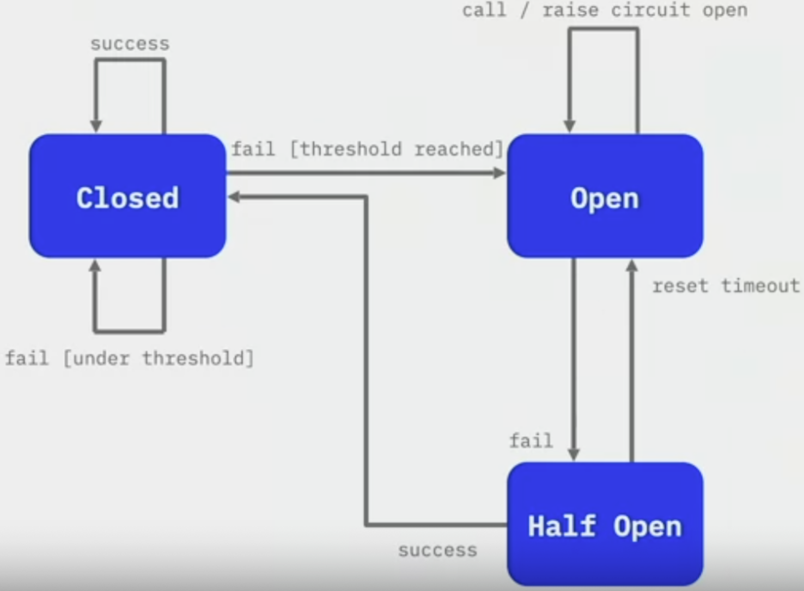

</p>

- Chaos engineering: not a software design pattern but a good practise to check your all design pattern work at the time of unexpected failure. You deliberately kill services to see how the services are affected.

    <p align="center">
    

</p>

------

## Why DevOps?

An extension of agile

- **Agility**: allows teams to move at high velocity and continuously deliver controlled, small updates as needed

- **Rapid delivery**: Increase the frequency and peace of releases so you can innovate and improve your product faster. The faster you can release new features and fix bugs, the faster you can respond to your customers’needs and build competitive advantage. Continuous integration and continuous delivery automates the software release process from build to deploy

- **Reliability**: use CI/CD to test each change is functional and safe. Monitoring and observability practices help you stay informed of performance in real time. Ensure the quality of application updates and infrastructure changes so you can quickly and reliably deliver at a more rapid pace while maintaining a positive experience for users. Practices of CI/CD allow you to test that each change is functional and safe

- **Scale**: manage a single or multiple instance by simplifying provisioning, configuration and scaling. Automation and consistency help you manage complex or changing systems efficiently and with reduced risk

- **Improved collaboration**: build more effective teams under DevOps cultural model emphasizing ownership and accountability. Sharing responsibility reduces inefficiencies and saves time. For example, writing code that takes into account the environment in which it is run, reduces handover periods between developers and operations

- **Security**: DevOps model uses automatic enforcement rules, fine grained controls and configuration management techniques to move quickly while ensuring compliance policies

    <p align="center">
    

</p>

### DevOps Culture

- Create a highly collaborative environment
- Automate when possible
- Focus on customer needs
- Develop small and release often
- Include security at every phase
- Continuously experiment and learn
- Continuously improve

### DevOps Best Practices

- Communication and collaboration: Increased communication and collaboration in an organization is a key cultural aspect of DevOps. The use of DevOps tooling and automation of the software delivery process establishes collaboration by physically bringing together the workflows and responsibilities of development and operations.

- Monitoring and observability: Companies monitor metrics and logs to see how application and infrastructure performance impact the experience of their product’s user

- Continuous integration CI: A software development practice where developers regularly merge their code changes into a central repository, after which automated builds and tests are run

- Continuous delivery/continuous deployment CD: A software development practice where code changes are automatically built, tested, and prepared for a release to production. It expands on continuous integration by deploying all code changes to a testing environment, production environment or both, after the build stage with or without the need for a manual process

- Microservices architecture (containers/Kubernetes, Cloud): A design approach to build a single application as a set of small services. You can build a microservices architecture by using serverless or container platforms

- Infrastructure as a code: A practice in which infrastructure is provisioned and managed using code and software development techniques, such as version control and continuous integration

## What are the different phases in DevOps?

<p align="center">
    
</p>

- Plan: in this stage, all the requirements of the project and everything regarding the project like time for each stage, cost, etc are discussed. This will help everyone in the team to get a brief idea about the project.
- Code: the code is written over here according to the client’s requirements. Here codes are written in the form of small codes called units.
- Build: building of the units is done in this step.
- Test: testing is done in this stage and if there are mistakes found it is returned for re-build.
- Integrate: all the units of the codes are integrated into this step.
- Deploy: app is deployed in this step on the client’s environment.
- Operate: operations are performed on the code if required.
- Monitor: monitoring of the application is done over here in the client’s environment.

## DevOps Tools

- Cloud
- Development: IDEs, SDKs, Git
- CI/CD: Examples: Build tools: Jenkins (integrates with docker and K8s), Travis CI, AWS CodeBuild
  - Source control tools, repositories: Git, AWS CodeCommit
  - Deployment tools: AWS CodeDeploy, AWS CloudFormation
  - Pipeline automation tools: AWS CodePipeline, Jenkins, GitLab
- Infrastructure Automation:
  - Infrastructure automation tools: AWS CloudFormation, Terraform, AWS CDK
  - Configuration management tools: Chef, Puppet, AWS OpsWorks
- Containers and serverless: Containers package code, configuration settings, and dependencies needed to run the application. Examples:
  - Serverless services: AWS Lambda, AWS Fargate, AWS Elastic Beanstalk
  - Container services: Runtimes: Docker, Containerd
  - Orchestration: Amazon Elastic Container Service (Amazon ECS), Kubernetes, Amazon Elastic Kubernetes Service (Amazon EKS)
- Monitoring and observability: Monitoring and observability are key aspects of DevOps, helping you be proactive in preventing challenges before they occur. With tools, you can collect metrics on the health and performance of your application. You can capture deployment frequency, identify successful or failed deployments, application usage traffic, and more.Examples: AWS X-Ray, Amazon CloudWatch, AWS Config, AWS CloudTrail

### What benefits does DevOps have in business?

DevOps can bring several benefits to a business, such as:

- _Faster time to market_: DevOps practices can help to streamline the development and deployment process, allowing for faster delivery of new products and features
- _Increased collaboration_: DevOps promotes collaboration between development and operations teams, resulting in better communication, more efficient problem-solving, and higher-quality software
- _Improved agility_: DevOps allows for more rapid and flexible responses to changing business needs and customer demands
- _Increased reliability_: DevOps practices such as continuous testing, monitoring, and automated deployment can help to improve the reliability and stability of software systems by reducing human error, and allowing for better resource allocation
- _Greater scalability_: DevOps practices can help to make it easier to scale systems to meet growing business needs and user demand
- _Cost savings_: DevOps can help to reduce the costs associated with the development, deployment, and maintenance of software systems by automating many manual processes and reducing downtime
- _Better security_: DevOps practices such as continuous testing and monitoring can help to improve the security of software systems
- _Increase customer satisfaction and competitiveness_:  DevOps helps organizations to quickly address customer issues and provide new features, leading to improved customer satisfaction. DevOps enables organizations to move faster and more efficiently than their competitors, giving them a competitive advantage

### What is configuration management?

Configuration management is the process of keeping track of and directing how software, hardware, and IT system parts are set up. It includes

- keeping track of versions
- managing changes
- automating deployment
- keeping settings the same

This makes sure that the system is reliable, consistent, and follows standards. In current IT operations, software release and system management cannot be done without configuration management. In software development, configuration management is commonly used alongside version control and CI/CD infrastructure. Configuration management helps engineering teams build robust and stable systems through the use of tools that automatically manage and monitor updates to configuration data.

For a more concrete example consider a microservice architecture. Each service uses configuration metadata to register itself and initialize. Some examples of software configuration metadata are

- specifications of computational hardware resource allocations for CPU, RAM, etc
- endpoints that specify external connections to other services, databases, or domains
- secrets like passwords and encryption keys

It’s easy for these configuration values to become an afterthought, leading to the configuration to become disorganized and scattered. Imagine numerous post-it notes with passwords and URLs blowing around an office. Configuration management solves this challenge by creating a “source of truth” with a central location for configuration.

Git is a fantastic platform for managing configuration data. Moving configuration data into a Git repository enables version control and the repository to act as a source of truth. Managing unexpected changes through the use of code review and version control helps to minimize downtime as it enables rollback or “undo” functionality to configuration, which helps avoid unexpected breakage.

### Explain configuration management in DevOps

Configuration Management (CM) is a practice in DevOps that involves organizing and maintaining the configuration of software systems and infrastructure. It includes

- Version control, monitoring, and change management of software systems, configurations, and dependencies. The goal of CM is to ensure that software systems are consistent and reliable to make tracking and managing changes to these systems easier. This helps to minimize downtime, increase efficiency, and ensure that software systems remain up-to-date and secure

- Configuration Management is often performed using tools such as Ansible, Puppet, Chef, and SaltStack, which automate the process and make it easier to manage complex software systems at scale.

- Configuration management is a key part of a DevOps lifecycle. DevOps configuration is the evolution and automation of the systems administration role, bringing automation to infrastructure management and deployment. DevOps configuration also brings system administration responsibility under the umbrella of software engineering.

- Automating configuration management is essential to establishing a **reliable, consistent, and well-maintained IT environment at scale**
  - Automation allows teams to consistently deploy and decommission infrastructure components in less time, with fewer opportunities for human mistakes and without relying on individuals to perform time-consuming manual configuration tasks
  - Automation makes it possible to maintain consistent system settings across datacenter, cloud, and edge environments for an application’s entire life cycle, minimizing both performance and security issues

- Automation can help enterprises **reduce costs, complexity, and manual errors in a variety of IT use cases**:

  - **Infrastructure automation**: configure and manage server infrastructure to enforce consistency and eliminate configuration drift.
  - **Cloud automation**: configure and manage cloud resources including operating systems, security groups, load balancers, and virtual private clouds
  - **Network automation**: configure and manage network devices such routers and switches
  - **Security automation**: configure and manage security devices such as firewalls and intrusion detection systems — and apply consistent network access policies
  - **Edge automation**: configure and manage remote infrastructure systems including network, security, IoT devices, and server equipment.

Enterprises today utilize it to empower software engineers to request and provision needed resources on demand. This removes a potential organizational dependency bottleneck of a software development team waiting for resources from a separate system administration team.

CI/CD configuration management utilizes pull request-based code review workflows to automate deployment of code changes to a live software system. This same flow can be applied to configuration changes. CI/CD can be set up so that approved configuration change requests can immediately be deployed to a running system. A perfect example of this process is a **GitOps workflow**.

### 4 actionable metrics for DevOps

- **Mean lead time**: how long it takes for an idea to get to production. It measures the mean time taken from committing a change to code repository to the time it becomes available in production

- **Deployment frequency**: It measures the number of times changes are deployed to production in a given period of time - You don’t want to be disrupted by a competitor and take a long time to respond

- **Change failure rate**: speed is meaningless if it destabilizes the system

- **Mean time to recover (MTTR)**: It measures the average time taken to recover from a service disruption or failure.

## What is Version control?

It is a system that **records changes to a file or set of files** over time so that you can recall specific versions later. This allows

- collaboration in coding by a group: teams can work independently on different project components and easily merge them when completed
- reverting the entire project back to a previous state: vcs systems package all previous versions. This can be convenient if you want to revert to a previous version to manage changes to the source code over time
- compare changes over time, who introduced a problem and when

A popular VCS is Git and GitHub which provides a Distributed Version Control system and is the industry standard.

### How do you setup a script to run every time a repository receives new commits through push?

There are three ways to configure a script to run every time a repository receives new commits through push, one needs to define either a _pre-receive, update, or a post-receive hook_ depending on when exactly the script needs to be triggered.

- Pre-receive hook in the destination repository is invoked when commits are pushed to it. Any script bound to this hook will be executed before any references are updated. This is a useful hook to run scripts that help enforce development policies such as scan for secrets.
- Update hook works in a similar manner to pre-receive hook, and is also triggered before any updates are actually made. However, the update hook is called once for every commit that has been pushed to the destination repository.
- post-receive hook in the repository is invoked after the updates have been accepted into the destination repository. This is an ideal place to configure simple deployment scripts, invoke some continuous integration systems, dispatch notification emails to repository maintainers, etc.

Hooks are local to every Git repository and are not versioned. Scripts can either be created within the hooks directory inside the “.git” directory, or they can be created elsewhere and links to those scripts can be placed within the directory.

### What is the difference between Git Merge and Git Rebase?

Here, both are merging mechanisms but the difference between the Git Merge and Git Rebase is, in Git Merge logs will be showing the complete history of commits.
However, when one does Git Rebase, the logs are rearranged. The rearrangement is done to make the logs look linear and simple to understand. This is also a drawback since other team members will not understand how the different commits were merged into one another.

### How AWS CodeCommit differs from other Git-based source control systems?

There is no need to host, maintain, and backup your own source control servers.

- It automatically encrypts your files in transit and at rest.
- It is built on highly available, redundant, and durable AWS services.
- It increases the speed and frequency of your development lifecycle by keeping repositories close to your builds.

### Explain some common practices of CI/CD

Continuous Integration (CI) and Continuous Deployment/Delivery (CD) are software development practices that aim to automate and improve the software development process. Some common CI/CD practices include:

- Code reviews and collaboration: Teams review code changes and provide feedback before they are merged into the main codebase

- Automated building and testing of code changes: Every code change is automatically built and tested to ensure that it does not break the existing functionality

- Automated deployment: The process of deploying code changes to a production environment is automated and can be triggered by a successful build and test

- Infrastructure as Code (IaC): The infrastructure that supports the application is managed as code and versioned, allowing for easier and more consistent deployment

- Continuous monitoring and logging: The application is continuously monitored for performance and errors, and logs are automatically collected and analyzed

- Rollback capabilities: The ability to quickly and easily roll back to a previous version of the application in case of failure

- Security scans: Security scans are performed on the code and infrastructure to identify vulnerabilities and security risks

### What are the key elements of Continuous Testing tools?

Key elements of Continuous Testing are:

- Risk Assessment: It Covers risk mitigation tasks, technical debt, quality assessment and test coverage optimization to ensure the build is ready to progress toward next stage
- Policy Analysis: It ensures all processes align with the organization’s evolving business and compliance demands are met
- Requirements Traceability: It ensures true requirements are met and rework is not required. An object assessment is used to identify which requirements are at risk, working as expected or require further validation
- Advanced Analysis: It uses automation in areas such as static code analysis, change impact analysis and scope assessment/prioritization to prevent defects in the first place and accomplishing more within each iteration
- Test Optimization: It ensures tests yield accurate outcomes and provide actionable findings. Aspects include Test Data Management, Test Optimization Management and Test Maintenance
- Service Virtualization: It ensures access to real-world testing environments. Service visualization enables access to the virtual form of the required testing stages, cutting the waste time to test environment setup and availability

### How does automate Testing work in the DevOps lifecycle?

Automated testing in DevOps refers to the use of tools and scripts to automatically run tests on _applications, infrastructure, and services_. It is integrated into the continuous delivery pipeline and helps to ensure that new code changes do not introduce bugs or negatively impact performance.

The following is a basic overview of how automated testing works in the DevOps lifecycle:

1. Code changes are pushed to a version control system such as Git.
2. The continuous integration (CI) system triggers a build and test process, which includes automated tests. The tests are run automatically, and results are reported back to the CI system.
3. If all tests pass, the code is automatically deployed to a staging environment for further testing including manual testing by testers or the development team.
4. If all tests are successful, the code is then promoted to the production environment.
5. Ongoing monitoring and testing of the production environment help to catch any issues that may arise.

The goal of automated testing in DevOps is to increase the speed and efficiency of the testing process while also reducing the risk of bugs being introduced into the production environment.

## Infrastructure as a Code

Configure infrastructure using an executable script know as code. We’re talking about textual code that you can hand to an IaC tool. And that tool reads the code and then builds your servers, and networks, and storage, etc.—essentially the core infrastructure elements that you need. Using these tools with this textual code means that everyone gets the same environment every time, so it’s _consistent and repeatable_. Textual code is normally written in the YAML format, which is a very common way to write and declare IaC. So, why are we discussing Infrastructure as Code in this course? Well, performing these system configurations manually is **error-prone**, not to mention, _time-consuming_.

You can use templates or commands to describe how to install and configure the system according to your needs, how much storage you want, how much processing power you want, and so on. In the early days of DevOps, Configuration Management Systems (or CMSs) made this possible, and they predated the newer IaC tools.

Infrastructure as code tools can be either declarative or imperative:

- With the declarative approach, you specify the desired state of the infrastructure resources you want to provision, and then the IaC tool determines how to achieve this state. It handles dependencies and executes commands in the proper order without you having to specify the order of execution. Tools that use this approach include **Terraform, Puppet, SaltStack, CloudFormation**, and to some extent, Ansible.
- The imperative approach, in contrast, requires that you define the specific order of the commands needed to achieve the desired state. It’s up to you to get the dependencies correct as the tool will execute commands in the order you specify. Tools like **Chef** are imperative and to some extent, Ansible can be as well.

These tools are also called that make this possible are called configuration management system (Ansible, Puppet, Chief) which enable you to describe your infrastructure as code and then create that infrastructure and keep it in that state. You never want to perform system changes and software configurations manually which is not reproducible and extremely error-prone. You want to use templates and scripts that describe how to install and automatically configure elements such as systems and devices and software and users. You can take that textual code and store it in your version control system so that you have history of all the changes. This way, everyone knows which version is the latest version and how the infrastructure should look.

Docker, Terraform, Kubernetes also allow you to describe your infrastructure as code which can be checked into a version control.

So, what are the benefits of IaC?

- IaC automation dramatically speeds up the process of provisioning infrastructure for development, test, and production (and for scaling or taking down production infrastructure as needed). It can even automate the provisioning of legacy infrastructure, which might otherwise be governed by time-consuming processes like requiring you to open a ticket and wait for someone to do it manually. Developers can quickly provision sandboxes and Continuous Integration/Continuous Delivery environments, and QA can quickly provide full-fidelity test environments. IaC ensures that provisioning intelligence always remains with the organization.

- In the past, the knowledge of how to configure servers may have been known by only a few people in your organization. Once you codify this knowledge using infrastructure as code, everyone is able to provision what they need, and the fear of losing tribal knowledge through staff churn is no longer an issue.
- Finally, IaC lets organizations take maximum advantage of cloud computing's consumption-based cost structure. It reduces the time, effort, and specialized skill required to provision and scale infrastructure. It also enables developers to spend less time on plumbing and more time on mission-critical software solutions.

Now, let’s briefly discuss some of the main IaC tools available. **Terraform** is an IaC tool by Hashi Corp that is free and open source. It uses declarative approach to IaC with a pre-execution check to ensure that it will do what you expect it to do.
<u>You can use Terraform as a base tool in combination with Ansible where Terraform provisions the base infrastructure and Ansible configures the software on top of it</u>.
It is a very popular tool for cloud provisioning. **Ansible** is an open source tool that automates IT tools such as intra-service orchestration, application deployment, cloud provisioning, and more. It uses familiar YAML files to describe the state that you want to achieve. Ansible is simple to set up because it doesn't require any client-side agents or bespoke security infrastructure, and it works simply delivering modules to the clients. This makes it ideal for memory-constrained environments like configuring Internet of Things devices. These modules are run on the client side and the results are sent back to the Ansible server.

**Chef** describes the necessary steps to reach a final state rather than describing the state itself. Using “Cookbooks,” you can describe various processes by which you can configure a system to achieve the desired state. One of the strengths of Chef is that it’s a popular tool and has lots of support but one of the drawbacks is that its cookbooks are written in Ruby so you need to have Ruby skills on your team. With **Puppet**, you can use any existing platform. The main difference between Puppet and Chef is that Puppet is declarative, which some consider to be a preferred method.

#### Ephemeral immutable infrastructure

- Service drift is a major source of failure: services updated by new ppl may be different or not matching
- Services are cattle not pets: don’t spend time fixing servers - replace them by identical servers that are working properly
- Infrastructure is transient. It only exist for the time you need it then removed when not used
- Build through parallel infrastructure - like in blue green deployment

#### Immutable delivery with containers

- Applications are packaged in containers, which are isolated environments. Docker supports IaC by allowing you to specify how to build an image from code (Dockerfile). These files make the same image from the the same files all the times and Docker makes the same container from that image every time it is deployed. The same container in the production can be run in the developer laptop.
- No variance limits side effects
- Rolling updates with immediate roll-back
- You never make changes to a running container
- You make changes to the image. Then redeploy the new container
Keep images up to date

## Testing

Testing stages: most to least frequently performed, cheapest to most expensive processes, least to most time consuming to run

- Unit tests: small in scope for specific part of applications, prevents bad code for being deployed into production
- Service/Integration tests: should verify that application component can communicate and interact with each other(connection to database or ability to call a third party web services)
- Performance/Compliance tests: tests how responsiveness and stability under a specific workload can reveal issues with scalability, system issues, insufficient hardware resources; security tests determine if application’s code conforms to security standards and required specifications. For example, you might test for the use of server-side encryption when uploading objects to S3
- UI/End-to-End tests: experience as a whole to ensure the application operates correctly according to user’s workflow. They are typically more complex. For example, check to see if user is able to create an account and log in with those credentials, if they can upload, GUI can work properly etc

Automating testing practices across the development lifecycle offers four key benefits:

- Improve developer productivity: Automated testing can increase your team’s productivity by freeing developers from manual tasks. It encourages behaviors that help reduce the number of errors and bugs released to customers.
- Find and address bugs faster: Implementing tests early in the development process enables developers to discover bugs faster. In turn, you can address the issues within your application before they grow into a larger problem. - When combined with automation, each build will validate your application.
- Deliver updates more quickly: Manual processes take time. Exactly how much time is determined by a tester’s availability and the amount of time the approval process requires. When you reduce the number of manual processes in your pipeline, you increase the speed of your development pipeline, enabling you to deliver updates more quickly.
- Automate the software release process: Automating your code pipeline enables your team to automatically build, test, and prepare code changes for release to production. This leads to rapid and efficient software delivery. It also enables you to push innovations to your customers faster without causing bottlenecks in your software release process.

------------------------------------------
-------------------

## Continuous Integration vs. Continuous Delivery

- CI and CD are not the same. It’s two separate and distinct processes that happen right after each other. Continuous Integration is continuously integrating your code back into the main or master or trunk branch. Whereas Continuous Delivery is then taking that integrated code and deploying it somewhere. You may deploy it every time you integrate it, or you may not deploy it every time you integrate it. You may have Continuous Integration on one loop testing branches and pull requests. And then, when you finally merge to main, you kick off the Continuous Delivery part.

- CI is continues building, testing, and merging to master. Continuous Integration consists of the Plan, Code, Build, and Test phases. This is where developers plan and then code the solution, and then build it and test it in several repeating cycles until it’s complete. And then the solution is ready to be delivered.

- Continuous Delivery is made up of Release, Deploy, and Operate phases, where the solution is released, and the binaries are deployed into a given environment in repeating cycles, and the solution is then in live operation from that point on. CD is a series of practices to ensure the code can be rapidly and safely deployed into production by delivering every change to a production-like environment (like development, test, stage environment that mimics the production environment). For example, if the production environment is containers on Kubernetes, you should deploy in Kubernetes as well. ‘Continuous Delivery’ is when you deploy it somewhere, like a development server, a staging server, a test server, or a pre-production server, whereas ‘Continuous Deployment’ is reserved for when you actually continuously push to production

### Continuous Integration

- CI is continues building, testing, and merging to master
- Developers push code often (daily). Commit regularly. The more time passed between merges, the greater risk of merge conflicts. Working for a week on code and check it in at once increases conflict between features. These conflicts can be difficult and time consuming to resolved
- They work in short-lived feature branches that are merged into the master once the feature is complete. This means you integrate features as it is completed and The branch is deleted after it’s merged as its only purpose was to develop that small feature. It reduces drift that may occur between feature branches and the main branch.
- Frequent pull requests back to the master or main branch is a best practice. It allow team members to communicate about the changes and review the code they are making.

The main features of CI are: Short-lived branches, frequent pull requests, and automated CI tools

<p align="center">
    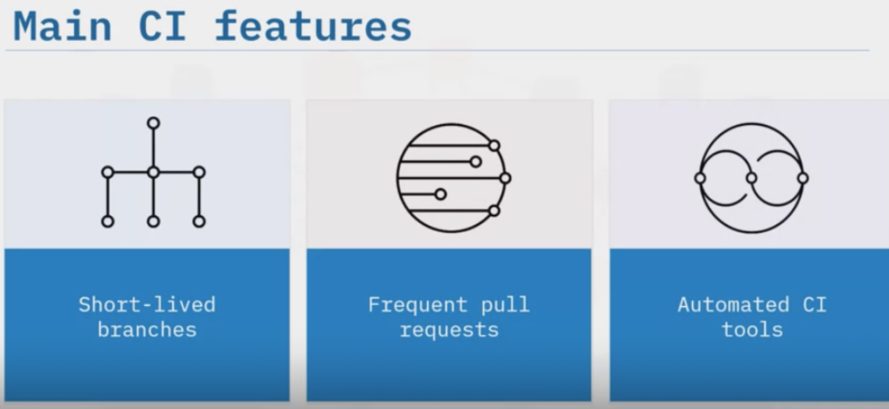
</p>

### CI Automation

Continuous Integration can be automated. But what does that mean? Automated CI tools subscribe to events such as pull requests and file changes using webhooks that can then trigger a workflow. That workflow can be anything, such as building an application. Once complete, these tools report back with messages of a successful or failed build

- Build and test every pull request automatically. The system should build the changes of the current working version to verify that the integration works correctly
- CI tools monitor changes in the version control to get started with building and testing
- Test should run after the build to ensure all the features are working properly
- Never merge a pull request with failing tests

### Benefits of Continuous Integration

- Faster reaction times to changes
- Reduces the risk of integration - less changes make less room for breaking things
- Higher quality of code: you get higher code quality with CI/CD, because things are constantly being reviewed and constantly being tested, and every pull request is an opportunity for a code review.
- The code in the version control works - The master branch should always be deployable. So you can not start testing when the code is merge in the master brach. Its late!
- Never merge untest code into the master branch

## Tools

Jenkins is CI/CD software that is installed on a server where the central build will take place. It is one of the oldest, most popular, and most complex of all the CI/CD tools. Circle CI is a CI/CD platform that can be used to implement DevOps practices. It performs deployments for Continuous Delivery and you define workflows inside a ‘circle.yaml’ file. GitHub Actions is a CI/CD platform that enables you to automate your build, test, and deploy GitHub workflows. Unlike other tools, it only works with GitHub.

### A CI/CD pipeline needs

- A code repository
- A build server: build from the source code - GitHubActions
- An integration server to automate the build and run the quality automated test - This orchestration capability is provided by all cloud providers
An artifact repository to store binaries, the artifacts of the application- Java jar file, Python wheels, Docker images that have been tested and proven to work
- Automatic configuration and development - provided by most cloud providers

    <p align="center">
        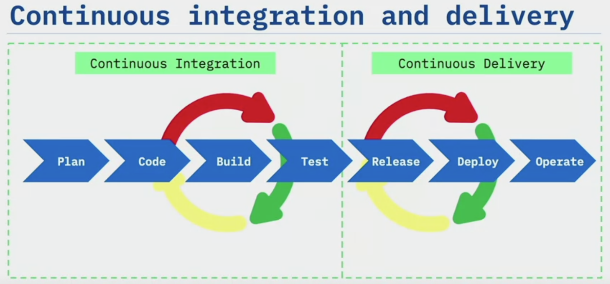
    </p>

- The word continuous deployment is reserved for deployment into production environment.

    <p align="center">
        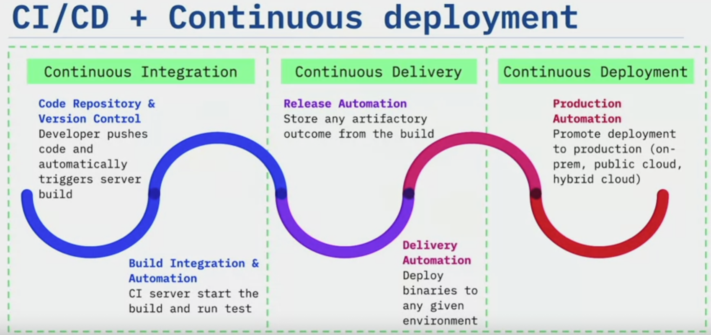
    </p>

## Continuous Integration

### Code Standards

Code standards are technical definitions and guidelines for developers that help establish the technical requirements for the code, and practices that all members of the team will follow Code standard examples:

- Maximum number of parameters for a method
- Use of comments
- How variables, functions, and methods should be named
- Method complexity
- Security standards
- Accessibility

Code standards are to ensure the code is:

- Safe and can be used without harm
- Secure and cannot be hacked
- Reliable and works as expected every time  
- Testable
- Is readable and easy to understand
- Portable to different environments

Examples of industry coding standard for Python is PEP8 and AUTOSAR C++ for C++.

### Static code analysis

Static code analysis can be paired with code standards as a method to ensure coding standards are followed as code is checked into the code repository. In a CI/CD pipeline, code is automatically analyzed by tools on each check-in to the repository and verified against the organization’s coding standards. These tools do not replace peer reviews of code but rather can be used to flag potential problems early in the development lifecycle. For example a Lambda function in the pipeline can check if a security group is open to public? (Port 22 is open to public means everyone can ssh into our build)

### Linting

A linter is a program that examines your code looking for syntax problems or bugs that can lead to errors when you run the code. A linter can be integrated into build automation or authoring tools. Historical linting functions have often moved into modern compilers. Modern linting tools have evolved to scan for undeclared variables, deprecated functions, spacing and formatting conventions, misuse of scope, and other potential code issues. Example:PyLint, Flake8, Ruff

### Unit Testing

The main purpose of unit testing is to ensure a unit of software performs as it is designed. Unit testing quickly identifies and isolates issues in individual units of application code. Every commit made to each branch should initiate an automated test. The unit tests run on the compiled code. This ensures that as developers commit code to the repository, the changes don’t break the old code. One measure of unit testing quality is **code coverage**. Code coverage is a measure of how much of the source code is tested. Best practices:

- Run for every code change to verify quality
- Ensure good code coverage
- Test a unit of code in isolation
- Run fast and fail quickly

Example: Pytest, coverage

Here are two different development methodologies that leverage testing:

- TDD(Test Driven Development)
- BDD(Behaviour Driven Development).

  - **TDD** means your test case drives the design and the development of your code. You don’t write code and then test it. You write the test cases first. You write the test for the code you wish you had. Then you write the code to make them pass. The test case define the behaviour you desire the code to have. This keeps your focus on the purpose of the code. TDD development encourages simple designs and inspires confidence in the code. The process takes requirements and turns them into test cases after which code is written or improved so that the test cases pass. TDD focuses on the functionality.
    Start with writing the test first for every new feature added to the project. Use cases and user stories can help the developer understand the requirements
    Run the new test to see if it fails so the developer can verify the test harness is working correctly. The test should fail the first time it’s run.
    Write the code that will cause the test to pass
    Run the tests and verify that the new code passes
    Refactor the code, remove duplication, and clean up old code
    Repeat by starting with a new test cycle

  - **BDD** describes the behaviour of the system from outside. It is great for integration testing. It is an agile software development process that encourages collaboration among developers, quality assurance, and business partners. Behavior Driven Development is an extension of TDD that makes use of simple domain-specific scripting languages (DSL). These DSLs can be converted into tests. BDD focuses on the behavior of the application for the end-user.
    - The behavior of a user is defined in simple English
    - The English words are converted into automated scripts against functional code
    - The development team writes code to pass the test case
        User behaviors are often scenario-based, for example:
        A given user visited the site
        A user clicked the Orders button
        A user accessed the Orders page

    A testing framework is a set of guidelines or rules for creating and designing test cases.
    Testing frameworks are often called test automation frameworks. They define the overall system in which the test will be automated. Testing frameworks help improve the efficiency of writing tests by helping teams organize their test suites. Pytest for Python, JUnit for Java, .Net for C#, etc.

### Frequent commits

The goal of Continuous Integration is primarily to improve Communication
Frequent communication quickly alerts developers to changes. Committing code every couple of hours, for example, enables developers to undo a particular problematic issue in their code. Pushing code frequently to a shared repository can quickly identify a conflict between two developers and make it much easier to resolve.
Developers frequently commit to a shared repository using a version control system such as CodeCommit.  A continuous integration service automatically builds and runs unit tests on the new code changes to immediately surface any errors.  Developers who merge code early and often will have fewer integration issues down the road, and errors will be cheaper and easier to fix. What are some best practices around frequent commits?
    - Break down work into smaller chunks
    - Commit locally early and often
    - Regularly push code to a centralized repository
    - Instruct developers not to hold code in isolation
    - Merge feature branches as often as possible
    - Eliminate confusion and time-consuming merges

### Pull requests

A pull request makes the proposed (committed) changes available for others to review and use. So others can review, comment on, and interactively iterate on code changes.  

- How do you create a pull request?

  - The developer clones the destination branch on their system.
  - The developer creates a new feature branch.
  - The developer makes changes to the feature branch and commits them locally. The commits are not merged into the destination branch
  - The developer pushes the changes of the feature branch to the shared repository.
  - The developer creates a pull request from the differences in the two branches
  - Team members review and approve the pull request. The pull request can be updated with additional commits that contain changes based on reviewer comments
  - The feature branch is merged into the destination branch when team members are happy with the pull request. Commits are applied to the destination branch in the same order they were added to the pull request
  - The feature branch is deleted.

_Note that GitHub automatically makes a pull request on your behalf if you make a change on a branch that you don’t own. Log files record the approval of the merge_.

Lets understand the workflow with a use case. A company assigns a team of developers, testers and product managers to a new web application project. A developer initializes a git repo in their local environment, stage them and does the initial commit. She then pushes the commit to a remote repository she created. All the developers clone the repository and start working on it by creating branches.  

Another developer John is responsible for user authentication feature. He clones the repo and creates a new branch called user-auth from the main branch. John completes the feature development and commits to the user auth branch. After thorough testing, he pushes the branch to the remote repository and creates a pull request. The pull request is reviewed and approves it to merge it to the main branch so other developers can access the change made by John. Similarly other developers push the commit to the remote repo for the features they worked on. At this stage feature development is complete and the project tis ready to be released. One can create a release branch and call it Release 1.0 in the remote repo. The team pulls the changes to their local repo so it is up to date. They perform final testing and documentation updates in the release 1.0. After testing, they commit the changes, push the commit to the remote repo and create a pull request and reviews and merge the changes to the main branch and tag the release as Release 1.0.

The git branching workflow is crucial in version control and collaboration when working on software development projects. The workflow allows the teams to work on different features, bug fixes, or experiment in isolation without disrupting one another's code.

## Continuous Delivery

A practise where code changes are automatically built, tested, and prepared for a release to production. The goal of continuous deliver to ensure that every change is ready to go int production. But before that, usually a manual approval is needed. To do this, we can implement a decision process to ensure the production is authorized. This decision can be made by a person and executed by tools. This is a business decision rather than technical.

At this stage where we are in a staging environment (production like), and before deploying into production, we might want to conduct some serious testing to ensure performance/compliance and to collect inofrmation about them. Here are some common types of testing:

### Types of testing

- **Functional testing**: Functional testing is a process of determining if a piece of software is acting in accordance with requirements. It tests the functionality of part of the whole system rather than a single function.
<span style="background-color:rgb(0, 119, 255)">

During all functional testing, the goal should be to fail the code to discover software defects and increase software quality
</span>.
During all functional testing, the goal should be to fail the code to discover software defects and increase software quality. Functional testing involves six steps:

 1. Identify functions the software is expected to perform
 2. Create input data based on the function's specifications
 3. Determine function output based on the function's specifications
 4. Run the test case
 5. Compare actual and expected outcomes
    6. Verify the function works based on customer needs.

- **Regression testing**: Regression testing ensures your changes to the codebase do not disrupt already existing functions and cause something to break elsewhere.
Regression testing is expensive in terms of time and money, especially when done manually. Regression testing accounts for almost one half of software maintenance costs and up to 80% of the testing budget.
  - Built-in: Fuzz: The built-in fuzz test randomly sends user interface events to devices and then reports results.
  - Built-in: Explorer: The built-in explorer test crawls your app by analyzing each screen and interacting with it as if it were an end-user, taking screenshots as it explores. You can also provide Device Farm with credentials so the test can sign in.

    <u>Customized test types</u>:
  - Appium: An open-source test automation framework for use with native, hybrid, and mobile web apps
  - Calabash: A mobile testing framework you can use to run automated interface acceptance tests
  - Espresso: Instrumentation tests that make it possible for you to invoke callback methods in your test code so you can run through the lifecycle of a component step by step
  - UI Automator: Automates user interface tests in your iOS app through test scripts that you write
  - XCTest: A new UI framework introduced with Xcode 7 that extends XCTest with UI testing capabilities

- **Performance testing**: Performance testing
<span style="background-color:rgb(0, 119, 255)">

determines how your system performs in terms of responsiveness and stability under a specific workload. Performance testing will show issues with scalability constraints, software configuration issues, and insufficient hardware resources
</span>.
Issues discovered with this test can lead to performance bottlenecks and reduced reliability if they're not remediated. AWS CodePipeline is a powerful automation framework for the continuous delivery process. It can _inject automated load tests_ in your delivery workflow. Performance testing in continuous delivery can be performed using AWS CodePipeline and **BlazeMeter**.

<u> Performance testing types </u>:

- <span style="background-color:rgb(0, 119, 255)">Load testing</span>:  Determines performance of a system under load
Simulates multiple users concurrently accessing the system with test scripts, Measures an application’s quality of service
- <span style="background-color:rgb(0, 119, 255)">Stress testing</span>: Understands limits of the system, Discovers at what point the software fails, Helps determine how long it takes to recover from failure
- <span style="background-color:rgb(0, 119, 255)">Spike testing</span>:
Increases workloads quickly and repeatedly, Helps determine if dramatic increases or decreases in load affect performance
- <span style="background-color:rgb(0, 119, 255)">Breakpoint testing</span>: Measures the maximum capacity the system can run and still meet its service-level agreements, Helps determine what metrics should be used to determine a scale-out event
- <span style="background-color:rgb(0, 119, 255)">Configuration testing</span>: Tests the effects of configuration changes,
Helps determine optimal combinations of hardware and software
- <span style="background-color:rgb(0, 119, 255)">Isolation testing</span>:
Repeats a test that resulted in a system problem to determine fault
Helps isolate and confirm the fault domain  

<u>What performance metrics should you collect</u>?

- Average response time
- Peak response time
- Error rates
- Concurrent users
- Requests per second
- Throughput

**BlazeMeter** is a performance-testing platform, also accessible directly from AWS CodePipeline anywhere load tests are performed. BlazeMeter extends Apache JMeter by providing some additional capabilities such as _automatic scaling and professional reporting_.

- Testing with BlazeMeter:
Add a testing stage to your existing pipeline in CodePipeline
In the action category, choose Test and set the Action provider to BlazeMeter. Choose Connect to BlazeMeter.
Log in to BlazeMeter.
Configure the types of requests you want to make. You can add the URL, specify the HTTP verb (GET, POST, PUT, DELETE), and add custom headers if required. Configure any JavaScript Object Notation (JSON) payload required.
Configure the integration with CloudWatch so BlazeMeter reviews the metrics for your resources involved in the test. Define target thresholds as per your test plan.

- **User acceptance testing**:
User acceptance testing (UAT) is the last phase of your software testing process.

    The goal of UAT is to verify that the software works for the users of the system and meets the documented requirements. UAT can cover:
    Real-life scenarios:
        - Run the most common tasks
        - Perform the most difficult tasks
        - Often run against test scenarios
        - Can be functional testing of a user story

- **Alpha Beta testing**:
Alpha testing is done in the development environment.
Beta testing is done as a field test on the client site.

- **Regulation acceptance testing**:
Tests whether the software complies with relevant regulations

- **Synthetic testing**: Synthetic testing is a method of understanding your user’s experience in an application by predicting behavior. Synthetic testing is often accomplished by using web browser emulation or scripted recordings of web transactions.

    <span style="background-color:rgb(0, 119, 255)">
    Scripts are created to simulate the <u>path or action</u> an end user would take on a site. Those paths are then continuously monitored for performance, availability, and response time measures
    </span>.
    Synthetic testing is useful because it can help you identify problems before a user experiences them. Monitoring results push to a monitoring service, which can then trigger alerts in the case of failures or slowdowns.

    Synthetic testing can run in a CI/CD pipeline to block a release that would break the product. Alternatively, it can run as part of the CD process, evaluating the state of the application immediately after a deployment is finished. The uses of synthetic testing is
  - Monitor application uptime.
  - Establish baseline of performance across countries.
  - Monitor performance.
  - Detect problems caused by third-party scripts.
  - Monitor database uptime.

### Security checks

Security breaches are significant threats in our world today.

According to the 2022 Thales Cloud Security report, 45% of businesses have experienced a cloud-based data breach or failed audit in the past 12 months.

DevSecOps is a methodology that covers security of and in the CI/CD pipeline, including automating security operations and auditing. It also advocates that security should be built into the product rather than added at the end of the project.

There are two main goals of DevSecOps:

- Embed security knowledge into DevOps teams to secure pipelines they design and automate
- Embed application security knowledge, automated tools, and processes into security teams to provide security at scale in the cloud

Control Categories:

- Directive controls establish the governance, risk, and compliance models.
- Preventive controls protect workloads and mitigate threats and vulnerabilities.
- Detective controls provide visibility and transparency over the operation of deployments.
- Responsive controls drive the remediation of potential deviations from security baselines.

Example Security Test:

- Common vulnerability exploits
- Open-port scanning
- Secrets scanning
- Runtime security risks

Tools:

- Snyk
- Nessus
- Qualys
- Nmap
- OWASP Dependency-Check

## Continuous Deployment

With both ontinuous deployment and continuous delivery, every code change is built and tested and then pushed to a non production testing or staging environment first. There will be multiple parallel stages before production deployment. However the difference between continuous delivery or deployment is the **manual approval** to update to production. With continue deployment production happens _automatically_. Doing this requires a robust and effective testing strategy. That’s why we discuss testing in various deployment strategies.

Now that your application is ready to go, you'll learn strategies you can employ to get it into production.

- **Rolling deployment**:
With a rolling deployment, _your production fleet is divided into groups so the entire fleet isn’t upgraded at once_. Your fleet will run both the new and existing software versions during the deployment process.This method enables a zero-downtime update. If the deployment fails, only the upgraded portion of the fleet will be affected. This is in contrast to a blue/green deployment where an entirely new environment containing the updated application is created, and traffic is shifted over to the new environment.

With rolling deployments, you are updating your live production environment. The updated application is not being applied to all compute nodes at once. It’s only being deployed to some. This enables your application to remain available during the upgrade. Additionally, you have the opportunity to test your new application in the production environment after the upgrade completes. If you find it is not behaving properly, you can roll back the deployment. After a portion of the application has been deployed, the rolling deployment moves to the next portion of your environment until all compute nodes have been updated with your application. You can use a variety of rolling deployment options through CodeDeploy.

- One at a time: Deploys the application revision to only one instance at a time.
- Half at time: Deploys to as many as half of the instances at a time (with fractions rounded down). The overall deployment succeeds if the application revision is deployed to at least half of the instances (with fractions rounded up). Otherwise, the deployment fails.
- Custom: Deploys a set number or percentage of resources selected by you, at time intervals you specify.

    Advantages to a rolling deployment include:
- Zero downtime
- Lower overall risk of bringing down your entire production application
- No additional resources required, which minimizes deployment costs

    Disadvantages to a rolling deployment you need to keep in mind:
- Complexity:  While your application is deploying, you must remember there are two different application versions operating at once in the same environment. You will need to make sure your application can handle interoperability between these versions.
- Getting back to previous version: If a resource in a rolling deployment fails to deploy correctly, reverting to a previous version can be complicated. It might require you to redeploy the previous application version in a new resource or fix the failed resource manually.
- Speed: Because resources are deployed in small increments, it could take a long time to deploy all the necessary hosts in a large environment.

The benefits of Continuous Delivery are many and varied and they include the following:

- Enabling your development teams to automate the steps that transport software through the various stages of the software development lifecycle (or SDLC)
- Automation leads to <u>reducing the deployment</u> time by nonstop testing and deployment cycles. The more you deploy, the more confidence you have that your next deployment will work, and the less time you spend debugging deployments
- <u>Reducing the costs</u> that are normally common with standard deployment strategies. This could be people costs, infrastructure costs, and the cost of lost time due to manual failures. Continuous Delivery enables your development team to scale their software deployments based on the size of the project.
- And enabling you to deploy code automatically into the various stages of the software development lifecycle. Once you have deployed to the development environment without incident, and to the test environment, and then the staging environment all without incident, the chances are pretty good that when you deploy to production that will also be without incident

## Health checks

Health checks are tests performed on resources. These resources might be your application, compute resources like Amazon EC2 instances, and even your Elastic Load Balancers. The results can determine if a deployment was successful or if an application is working as intended.

- Liveness checks:
Liveness checks test the basic connectivity to a service and the presence of a server process. They are often performed by a load balancer or external monitoring agent, and they are unaware of the details about how an application works. Liveness checks tend to be included with the service and do not require an application author to implement anything.
Some examples of liveness checks used at Amazon include the following:
  - Tests that confirm a server is listening on its expected port and accepting new TCP connections
  - Tests that perform basic HTTP requests and make sure the server responds with a 200 status code
  - Status checks for Amazon EC2 that test for basic things necessary for any system to operate, such as network reachability

- Local health checks:
Local health checks go further than liveness checks to verify that the application is likely to be able to function. These health check test resources are not shared with the server’s peers. Therefore, they are unlikely to fail on many servers in the fleet simultaneously.
Some examples of situations local health checks can identify are:
  - Inability to write to or read from disk: It might be tempting to believe a stateless service doesn't require a writable disk. Many services tend to use their disks for such things as monitoring, logging, and publishing asynchronous metering data.
  - Critical processes crashing or breaking: Some services take requests using an on-server proxy (similar to NGINX) and perform their business logic in another server process. A liveness check might only test whether the proxy process is running. A local health check process might pass through from the proxy to the application to check that both are running and answering requests correctly.
  - Missing support processes: Hosts missing their monitoring daemons might leave operators unaware of the health of their services. Other support processes push metering and billing usage records or receive credential updates. Servers with broken support processes put functionality at risk in subtle, difficult-to-detect ways.

- Dependency health checks:
Dependency health checks thoroughly inspect the ability of an application to interact with its adjacent systems. These checks ideally catch problems local to the server, such as expired credentials, that are preventing it from interacting with a dependency. They can also have false positives when there are problems with the dependency itself. Because of those false positives, we must be careful about how we react to dependency health check failures. Dependency health checks might test for the following:
  - A process might asynchronously look for updates to metadata or configuration but the update mechanism might be broken on a server. The server can become significantly out of sync with its peers. The server might misbehave in an unpredictable and untested way. When a server doesn’t see an update, it doesn’t know whether the update mechanism is broken or the central update system has stopped publishing.
  - Inability to communicate with peer servers or dependencies: Strange network behavior can affect the ability of a subset of servers in a fleet to talk to dependencies. This behavior might occur without affecting the ability for traffic to be sent to that server. Software issues, such as deadlocks or bugs in connection pools, can also hinder network communication.
Other unusual software bugs that require a process bounce: Deadlocks, memory leaks, or state corruption bugs can make a server spew errors.

- Anomaly detection: Anomaly detection checks all servers in a fleet to determine if any server is behaving oddly compared to its peers. By aggregating monitoring data per server, you can continuously compare error rates, latency data, or other attributes to find anomalous servers and automatically remove them from service. Anomaly detection can find divergence in the fleet that a server cannot detect about itself, such as the following:
  - Clock skew: When servers are under high load, their clocks have been known to skew abruptly and drastically. Security measures, such as those used to evaluate signed requests, require that the time on a client's clock is within five minutes of the actual time. If it is not, requests fail.
  - Old code: A server might disconnect from the network or power off for a long time. When it comes back on line, it could be running dangerously outdated code that is incompatible with the rest of the fleet.
  - Any unanticipated failure mode: Sometimes, servers fail in such a way that they return errors they identify as the client’s instead of theirs (HTTP 400 instead of 500). Servers might slow down instead of failing, or they might respond faster than their peers, which is a sign they’re returning false responses to their callers. Anomaly detection is an incredible catchall for unanticipated failure modes.

Health checks can be implemented in the deployment of your application in several different ways.
One is with CodeDeploy and the help of your application specification (AppSpec) file. We will cover the AppSpec file in an upcoming lesson but the file indicates several different stages of your application’s deployment.
You can initiate an action after each stage or a subset of stages. You can check if an application’s main page generates a 200 response before allowing production traffic to flow to it.You could specify a test that is performed on a server before an application is installed. This will ensure your environment is performing the way you expect before allowing the installation to continue.

While health checks can identify problems, the key to a successful continuous delivery strategy is to also implement remediations when these tests fail. You can build logic into your tests that indicate to CodeDeploy that the deployment was unsuccessful and start the rollback process.

## Components of DevOps Pipeline

A DevOps pipeline is a workflow that automates software delivery. It is a series of interconnected steps that enable efficient and consistent execution of tasks such as building, testing, deploying and releasing software. It automates the software delivery lifecycle by streamlining and standardizing the process. A DevOps pipeline enables continuous integration of code changes, integrates with repositories, automates testing and building, and facilitates conflict resolution and bug detection. Pipelines are essential for implementing continuous integration and continuous deployment or CI/CD practices in DevOps. Organizations utilize continuous integration and continuous delivery pipelines for a comprehensive build and delivery process.

- The CI pipeline validates packages and builds essential components, creating deployable artifacts like container images and helm charts. It ensures versioning and resource preparation.
- The CD pipeline is mainly responsible for deploying the prepared artifacts into specific target environments, thereby ensuring a smooth transition from development to production.

<p align="center">
        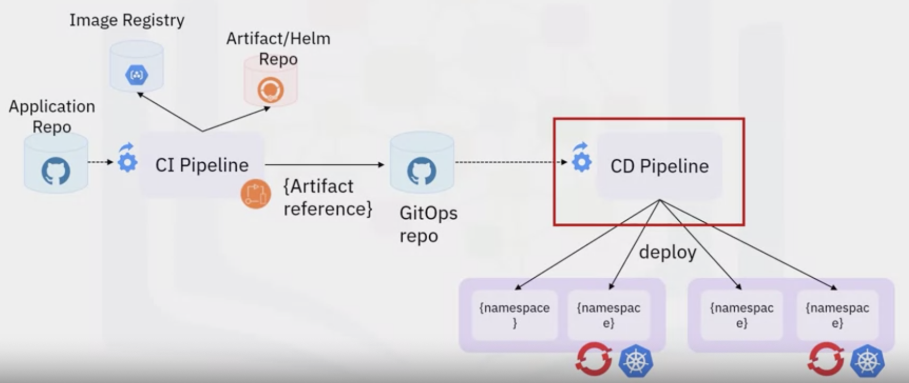
</p>

A CI pipeline consists of various components that work together to streamline the development and delivery process. This is just one example of how a CI pipeline might look. You may use more or less tools than yours.

<p align="center">
        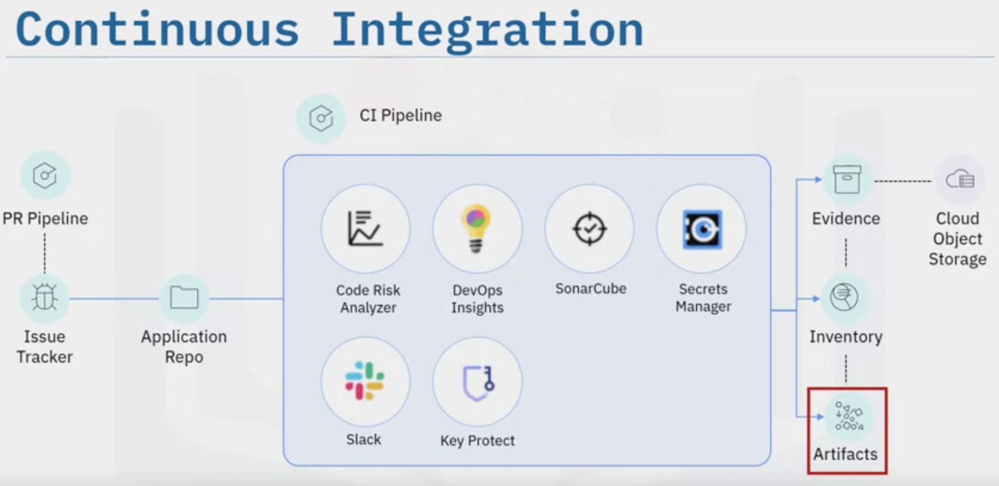
</p>

Let's look at the role of the different components:

- Pull requests in the application repository trigger the PR pipeline. It runs automated tests to validate code changes, ensuring the integrity of the code base.
- The issue tracker integrates with the CI pipeline and highlights associated issues or tasks linked to the pull request and facilitates issue resolution.
- The application repository stores the source code which the CI pipeline pulls for build and testing operations.
- The Code Risk Analyzer analyzes the code for potential risks, vulnerabilities, or code quality issues. It provides feedback and recommendations based on static code analysis.
- Slack integration enables efficient communications by sending notifications and reports to the development team.
- DevOps Insights collects data from the CI pipeline, generating reports to identify bottlenecks and areas for improvement.
- SonarCube, a code quality management platform, performs static code analysis, measures code coverage and assesses maintainability.
- A secrets manager securely stores sensitive information and integrates with the CI pipeline to provide authorized access during build and deployment.
- An evidence component stores artifacts and documentation gathered during pipeline execution for traceability and auditing.
- The inventory component tracks deployed applications, dependencies and infrastructure configurations, ensuring consistency and control over software deployments.
- Artifacts generated by the CI pipeline, such as binaries and container images, play a crucial role in subsequent stages of the software delivery process.

Overall, the CI pipeline leverages various components to automate code validation, testing, analyzing, and collaboration. The integration of these components enables developers to continuously integrate changes into the code base while maintaining quality and security standards.

After the continuous integration pipeline, the continuous delivery pipeline is triggered to facilitate the deployment process. A change request tool manages and tracks system changes. It integrates with the pipeline to ensure documented and validated changes before deployment. Key Protect securely stores cryptographic keys and sensitive information, providing secure access during deployment. The Security and Compliance Center enforces policies, conducts security scans, vulnerability assessments, and compliance checks. DevOps Insights collects data, and generates reports to identify bottlenecks and areas for improvement. The Secrets Manager securely stores sensitive information, providing secure access during deployment through integration with the pipeline.

<p align="center">
        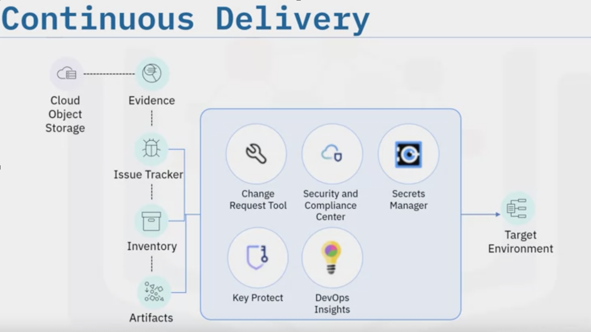
</p>

The pipeline validates the application code against predefined security and compliance rules.

- Static code analysis tools like SonarCube scan the code base and identify any potential security, vulnerabilities and compliance issues.

- The pipeline includes compliance checks to verify that the application meets industry-specific or regulatory compliance requirements. Tools like IBM Cloud Continuous Compliance evaluate the application against predefined compliance policies and generate compliance reports.

- Key Protect is responsible for securely securing and managing cryptographic keys, certificates, and other sensitive information.

- The Security and Compliance Center evaluates the application against predefined security policies and compliance requirements.

- DevOps Insights, a monitoring and analytics tool collects data from various stages of the pipeline.

- During the pipeline execution, Secrets Manager securely stores and manages sensitive information such as API keys, passwords, or certificates. It securely provides the necessary credentials to the pipeline stages, requiring access to protect resources.

- Slack notifications keep team members informed about pipeline status, compliance issues, and other important events throughout the pipeline.

- The team collects evidence to demonstrate compliance and track the execution of the pipeline. This evidence includes logs, reports, test results or other artifacts that provide evidence of compliance and successful pipeline execution.

The combination of these components in the continuous compliance pipeline enables organizations to automate security and compliance validation, effectively manage secrets and keys, and collect evidence for compliance purposes. This comprehensive approach ensures that applications and infrastructure align with security and compliance standards throughout the development and deployment process.

# Observability and Monitoring

If you want to improve the fitness or the health of your systems, your applications it is important to start measuring the current performance and analyze it over a period of time and that is where observability matters a lot.

With observability, you can generate the data plotted over time, and then look at the metrics, analyzing the immediate feedback about your infrastructure. To centrally collect this data from all your systems, you can set up, some agents that send the data out to maybe one centralized system, and from there, you have another system which plots this data to visualize it using graphs.

When you want to troubleshoot your system or your application issues, or your network issues, you look at the logs or the monitoring systems to have a good insight about what happened. Apart from that you can measure the metrics, you can fetch the logs. Also, if you have distributed systems it is important to know how and where the packet is going, how long it takes in a particular span, and based on that, you can also get not only feedback, but also will help you to point out issues that oh, this is where the problem is. You can set up alerts and monitoring based on that for further action later on. So, all of this information is a treasure for a systems engineer, DevOps engineer, or a site reliability engineer and this is the reason why observability is very important.

## Metrics, Logs and Traces: What To Observe and Why

Let's talk about observability and the three types of things that you would want to observe.

- The first one includes the metrics that become the charts and graphs that you would plot (maybe from a time series database) to observe the system's health, the network health, maybe the application health, and so on. So, you may want to monitor all the parameters possible in your system and, then you can map it to your business goals, the application of time, and so on. Tools such as Prometheus which is a very popular tool along with a visualizer, such as Grafana

- The second type data to monitor, a very important from a DevOps and SRE point of view, is the logs. Logs are the treasure trove of information for a debugger. Now,
<span style="background-color:rgb(0, 119, 255)">
   when you talk about the building and managing of infrastructure at scale, it is important to collect the logs centrally from each of your servers, each of your containers, and storage centrally somewhere, and then plot it, and visualize the logs as well. And a very popular stack that you use in the open source world is the ELK stack

</span>.
So, you have _Elasticsearch_, which stores all this information (indexing all the information) , and you have feeders like, Logstash or Kibana and that's where the L of ELK stacks comes from, E from Elasticsearch, L for Logstash, K for Kibana. Just like how Prometheus and Grafana work together most of the time, you'll find Elasticsearch and Kibana working in tandem, because Kibana is a specialized visualizer for Elasticsearch.

- And the third part of your observability helps you understand where the problem is, especially with a microservices environment. So, traces give you the span information, how your packet or the application is traveling, how long it is taking in. Let's say you have five services and a workflow connecting these services in a sequence. When you have a problem like your application is slowing down, how do you find out where the problem is? You'll have to go and check each span. Let's say one is two milliseconds, next takes 1 milliseconds, but next, this particular span, it's taking about seven milliseconds. Now you know where it is taking longer, where you would optimize, that part. So, once you look at a trace, you can actually check the logs for that application, or you can look at the metrics you have collected for that application, either with Kibana or with Prometheus. There are many open tracing infrastructure, there are tools like Jaeger which help you visualize your traces as well.

## Introduction to Monitoring

So, you've been developing apps and focusing a lot of your attention on making an app that is useful and interesting. But how is it performing? This is where application monitoring comes into play. Creating an app is only part of making a quality application that is valuable and essential. Monitoring brings together quality and development for a reliable and profitable application.

Through monitoring, application management tools can identify, measure, and evaluate how well an application is working. Monitoring allows developers to collect data, measure, and visualize any issues or unexpected events that may occur while an application is running. It also allows the tracking of important data, such as application availability, occurrences of issues and bugs, resources being used, and changes that might alter the user experience.

Monitoring allows application developers to proactively watch how an application is performing. With monitoring data, developers can isolate and fix any issues with an application.
The tools used for application monitoring provide a visual means of seeing how events are connected through dependency and flow mapping. Application monitoring can be accomplished by using specific tools for monitoring apps or by collecting and analyzing logs using log management tools. The end goal is to maximize the application’s availability and give customers the best experience!

Application monitoring is difficult due to its distribution at on-premises, hybrid-cloud, or cloud-native environments. Most modern approaches incorporate full stack monitoring from the front-end user experience to the back-end infrastructure. This effective method delivers complete visibility for developers into the application’s performance.

- Access: Monitoring ensures that an application is healthy and responds to all requests accurately and quickly. It helps avoiding major outages or  partial outages or intermittent problems.
- User Experience: An application can appear healthy by responding to requests, but monitoring might uncover that the application is responding in an extremely slow manner. This is why you need to also do performance monitoring. Application performance monitoring tools continuously monitor performance and send alerts when an application is not performing as it should.
- Scope: With all of this information about the application, developers can make decisions that are in the best interest of the business and the customer. Helps developers and businesses see where and how their application is being used on different computers, web browsers, smart phones, or tablets. Real-time monitoring determines the scope of usage.

    <p align="center">
        

</p>

- Safty: Monitoring can also reduce costs due to unavailability of the app or poor performance so users of the application have the experience they are expecting. And monitoring can ensure that applications are safe from any unwelcome or unwanted intrusions.

App dashboards and alerts give an overview of the application performance and alerts draw attention to specific problems.

Anomaly detection is a critical part of monitoring, and it allows developers to observe simple threshold issues, which helps advance machine learning pattern recognition. Developers can also track how one event connects across multiple nodes to detect the origins of errors by using distributed tracing. And dependency and flow mapping is another way of monitoring apps with a visual representation of how information travels between services.

<p align="center">
        
</p>

### Types of Monitoring

1. **System monitoring** is designed to provide developers with information about the availability of their software
information about system uptime and the performance of applications. Server management, infrastructure monitoring and management network monitoring and management.

    Uptime, or availability monitoring, continuously checks the application to confirm that it’s up and responding to the data and service requests it receives. Availability is a fundamental metric of system monitoring because if the application is unavailable or unreachable when it’s needed, no other data will matter.

2. **Dependency monitoring** starts with mapping the resources that an application depends on. Applications running over distributed IT infrastructures can be dependent on a variety of network nodes, other application components, and services.
<span style="background-color:rgb(0, 119, 255)">
   These dependencies are mapped by evaluating the incoming network connections

</span>.

For example: If your application isn’t working properly, your dependency monitoring tool could tell you where the error originates from, based on the mapped connections to your application. In this example, the server is offline. Monitoring dependencies allows you to watch your applications and identify any issues with their performance, so you can give your users the best experience with your application.

<p align="center">
        
</p>

3 - **Integration monitoring**. Most likely, your apps won’t be stand-alone applications. Instead, they will allow for integration with third parties. Modern applications and services rely on third-party integrations, and developers should monitor these external systems for data processing, resource capacity, and other functional processes. Integration monitoring identifies the availability and uptime performance of the third-party integrations. And it’s important for you to monitor those integrated apps and services, so your application can perform at its best.

<p align="center">
        
</p>

4 - **Web performance monitoring** is designed to monitor the availability of a web server or service, but it also provides more in-depth details. These tools can capture information such as page loading time, the location of errors that are generated, and individual load times of various web elements. This information helps developers fine-tune a website or a web-based application’s performance.

<p align="center">
        
</p>

5 - **Business Activity Monitoring** (or B-A-M) tools take key business performance metrics and track them over time. For example, these metrics could include information about retail sales, application downloads or the volume of financial transactions. This type of monitoring is useful because it helps businesses understand how their application is used and how it impacts business.

6 - **Application Performance Monitoring** (or APM) observes how well apps behave in an IT environment. The scope of APM is extended from the application to the underlying infrastructure components and dependencies. APM aggregates and analyzes inbound network data to evaluate the state of the IT environment and identify the problem root cause when apps perform sub-optimally. This monitoring also ensures that your software launches fast and responds to commands in a timely manner. APM metrics include: Resource consumption, Error rates at the software level, App response times, and App request rates, and also the User experience.

Sometimes applications behave differently than they do in application testing environments, so

7 - **Real User Monitoring** (or R-U-M) provides an accurate perspective on how users perceive and respond to applications or service performance. For example, the number of users staying on a website for more than a few seconds might tell you many things, like satisfaction with the site and how quickly the page loads. RUM is designed to record such interactions and provide the historical performance of a service delivered to users over the network. Security attacks and network infringements impact the flow of data traffic and network behavior. So it’s important to track unusual activities that occur. Security monitoring collects network log data, which can be analyzed and potential threats can be blocked before they impact the business.

### Golden Signals of Monitoring

Now imagine the application you’ve developed stops working correctly. How do you determine what the problem is? By monitoring your app, you’re able to identify where a problem is and isolate it.

<p align="center">
            
    </p>

Golden signals are the gold standard for monitoring a web application’s metrics. Regardless of whether you have an established Application Performance Monitoring (or APM) tool or you are just getting started with monitoring, focusing on the golden signals allows you to see an overview of the health of your application and proactively monitor it. While a team could always monitor more metrics or logs across the system, the four golden signals are the basic, essential building blocks for any effective monitoring strategy.

What are the Golden Signals? By tracking “latency,” “traffic” “errors,” and “saturation,” you’re able to identify and resolve an issue, sometimes even before it becomes a problem.

1. Latency, measures the time between when a request is sent and when a request is completed. The longer it takes for a user to load a page or make another request, the more likely it is for a user to abandon your application for a competitor’s. Measuring the average latency of requests can give you a bird’s eye view of a web application’s performance, but keep in mind that successful and failed requests both have latency. So you must track both. For example, a response to a database might be tracked as fast. However, when you look more closely, you see that the response is actually a connection loss error, which is a failed request.Additionally, you should also look at longer latency times because they may indicate slower connection errors. It’s important to include error latencies along with all other latencies for a complete overview of the health of your application.

    <p align="center">
            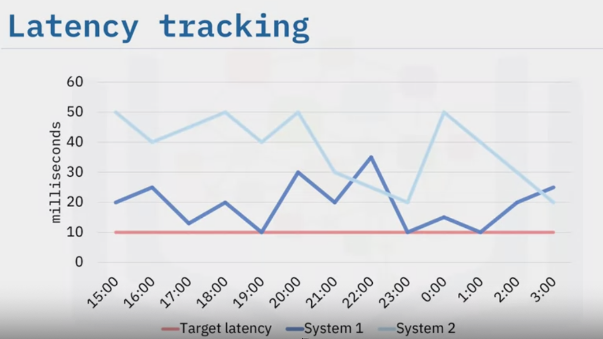
    </p>

    When you measure latency, you should set a good latency rate target and monitor the successful requests against failed ones to track the system’s health. In the example shown, the latency target is set. System 1 is hitting the target latency sometimes, but not always.

    So this might indicate that there are some intermittent problems. The graph also shows that system 2 is never hitting the target latency, which indicates that there’s a serious issue with it. With this data, you know you should look at system 2 to resolve any latency problems.

2. Traffic is associated with the number of users who visit the site. But with application monitoring, the term “traffic” refers to how in-demand your service is. When you measure traffic, you have a better understanding of your users and you can fine-tune their experience.

    <p align="center">
            
    </p>

    You should be aware that traffic monitoring can measure different things. In a storage system, traffic might be transactions per second or retrievals per second. For web applications, you might measure the total number of website requests per second. You can also look at traffic by page or resource, which will show you which of your pages are the most successful or which pages need work.

3. The third Golden Signal is “errors.” One of the main reasons for monitoring applications is to find and fix errors before they affect users. An error could be that a request fails or it might mean a request is completed but with the wrong information. You should monitor all errors across the system and at individual service levels to define which errors are critical and which are less severe. When you track errors, you can understand the health of your system from the user’s perspective and take rapid action to fix frequent errors.

    <p align="center">
            
    </p>

    You should be tracking obvious errors. These include all server errors, like an HTTP 500 Internal Server Error, and Client errors, like an HTTP 404 Page Not Found error. But you should also watch for other errors that might be harder to catch. For example, a request might return an HTTP 200 OK status code. However, if the request doesn’t return the right content, it’s considered an error because the request was completed incorrectly. You need to track these errors and also identify errors to match your service-level objectives.

4. The fourth Golden Signal is “saturation”. This measures the percentage of use of a system, like how much memory or CPU resources your system utilizes. If a web application is approaching 100 percent saturation, performance degradation is likely, and your users will be negatively impacted. On the other hand, if saturation is consistently at 50 percent or less, you might be over-provisioning and paying too much for services that you’re not using. By measuring the saturation of a web application, you get insights on how to optimize the services you’re using. Be sure to set a utilization target, as it will help ensure the service performance and availability. And you should be aware that an increase in latency is often a leading indicator of saturation.

    Because large systems can get complicated with too many components, issues, and alerts to monitor, it’s in your best interest to use the four Golden Signals. When you track latency, traffic, errors, and saturation, you can focus on your application's most critical performance indicators and proactively monitor applications. With the Golden Signals, you can: Troubleshoot components of a system to find the root cause and fix problems. Alert your team about an incident, so they can identify the problem and work towards a remediation, and Aid in capacity-planning to monitor and improve things for your applications or services.

So now imagine that your monitoring tool notifies you of a latency issue with your application, App A. Instead of going through hundreds of possibilities, you start by using the four Golden Signals to identify the issue. You check service B, but the service is not experiencing any issues. Next, using the Golden Signals, you check service C. It’s working as expected. So you check service D, and—uh oh—it’s showing signs of high saturation levels. Using the Golden Signals, you quickly identify that service D is likely the cause of App A’s latency issues, and You take the necessary steps to fix the issue, possibly before your users even notice the problem.

<p align="center">
            
    </p>

### Components of a Monitoring System

There are three essential components that form the basis of a monitoring system: _**metrics, observability, and alerting**_. These metrics can provide visibility into the health of your systems, understanding of trends in usage or behavior, and awareness about the impact of changes you make. If the metrics fall outside your expected ranges, these systems can send notifications to prompt an operator to take a look and assist in identifying the possible causes.

- **Metrics** represent resource usage or behavior that can be observed and collected throughout your systems. These might be low-level usage summaries provided by the operating system, or they can be higher-level types of data tied to a component's specific functionality or work, like requests served per second or membership in a pool of web servers. Some metrics are presented as a total capacity, while others are represented as a rate that indicates how busy a component is. Metrics are useful because they provide insight into the behavior and health of your systems, especially when analyzed in aggregate. Metrics are the basic values used in understanding historical trends, correlate diverse factors, and measure changes in your performance, consumption, or error rates. While monitoring is the process of collecting, aggregating, and watching different services, observing is analyzing those values to improve awareness of your components’ characteristics and behavior.

- **Observability** also includes recognizing and understanding patterns between data collected, aggregated information, and resources and values across services. For example, if an application experiences a spike in error rates, an administrator observing the monitoring system can discover what event contributed to the spike.

- **Alerting** is the responsive component of a monitoring system that performs actions based on changes in metric values.
<span style="background-color:rgb(0, 119, 255)">
   Alerts definitions are composed of two parts: a metric-based condition or threshold, and an action to perform when the value falls outside of the acceptable conditions

</span>.
Alerts allow administrators to disengage from the system so they do not need to watch the applications nonstop.

The main purpose of alerting is to bring human attention to the status of systems if there are any issues or problems. Some important qualities of an ideal monitoring system are: Independently operates on its own infrastructure. It is a reliable system. Easy-to-use dashboards views are available. Effective maintenance of historical data to help establish trends, patterns, and consistencies over long timelines. You have the ability to correlate from different sources. Tracking new metrics or a new infrastructure is easy to start, and Flexible and powerful alerting is available.

### Types of Metrics in a Monitoring System

One of the main components of a monitoring system is metrics. Why are metrics important to track? Metrics represent how your applications use resources and provide insight into your systems' behavior and health. Important metrics you should track are
<span style="background-color:rgb(0, 119, 255)">
   host-based, application, network and connectivity, and server pool
</span>.
Metrics tracking can help you plan and analyze your monitoring strategy since systems usually function hierarchically, with more complex layers building on top of the more primitive infrastructure.

- Host-based metrics measure: CPU, Memory, Disk space, Processes. Indicators are anything involved in evaluating the health and performance of an individual machine, disregarding for the moment its application stacks and services. Host-based metrics are mainly comprised of usage or performance of the operating system or hardware.

- Application metrics focus on units of processing or work that depend on resources like services or applications. The specific types of metrics to look at depends on what the service is providing, what dependencies it has, and what other components it interacts with. Metrics at this level indicate an application's health, performance, or load. Indicators to look for include:
<span style="background-color:rgb(0, 119, 255)">
   Error and success rates, service failures and restarts, Performance and latency of responses, and resource usage

</span>.
These indicators help determine whether an application is functioning correctly and with efficiency.

- For most types of infrastructure, network and connectivity indicators are important gauges of outward-facing availability, but they are also essential signs that services are accessible to other machines for any systems that span more than one machine. Like the other metrics, networks should be checked for their overall functional correctness and their ability to deliver necessary performance by looking at:
<span style="background-color:rgb(0, 119, 255)">
   connectivity, error rates and packet loss, latency, and bandwidth utilization

</span>.
Monitoring your networking layer can help you improve the availability and responsiveness of both your internal and external services.

- When dealing with horizontally scaled infrastructure, server pools are another layer of infrastructure you will need to add metrics for. While metrics about individual servers are useful, service is better represented at scale as the ability of a collection of machines to perform work and respond adequately to requests. This metric type is in many ways just a higher-level extrapolation of application and server metrics, but the resources in this case are homogeneous servers instead of machine-level components. Collecting data that summarizes the health of collections of servers is important for understanding the actual capabilities of your system to handle load and respond to changes.

    <p align="center">
            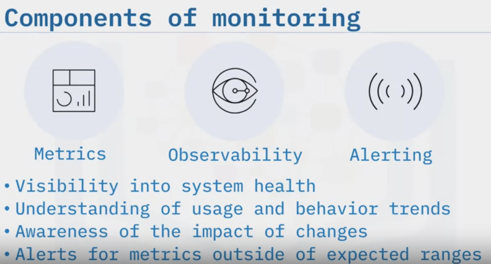
    </p>

Other metrics you may wish to add are those related to external dependencies. These allow you to track your system’s interactions with external systems that your application uses. Some dependency services may provide status pages about outages. However, if you track these within your systems you can identify problems with your providers that may affect your operations. Some items to track at this level are: Service status and availability Success and error rates Run rate and operational costs, and Resource exhaustion. Of course, there are many other types of metrics that can be helpful to collect. Conceptualizing the most important information at varying levels of focus can help you identify the most useful indicators for predicting or identifying problems.

A few factors that can affect what you choose to collect and act on are:

- Resources available for tracking: Depending on your human resources, infrastructure, and budget, you will have to limit the scope of what you keep track of to what you can afford to implement and reasonably manage.
- The complexity and purpose of your application: The complexity of your application or systems can greatly impact what you choose to track. Items that might be mission critical for some software might not be important in others.
- The deployment environment: While robust monitoring is most important for production systems, staging and testing systems also benefit from monitoring, though there may be differences in severity, granularity, and the overall metrics measured.
- The potential usefulness of the metric: One of the most important factors affecting whether something is measured is its potential to help in the future. Each additional metric tracked increases the complexity of the system and takes up resources. The necessity of data can change over time as well, requiring reevaluation at regular intervals.
- How essential stability is: For certain types of personal or early-stage projects, stability and uptime might not be priorities.

Keep in mind that the factors that influence your decisions will depend on your available resources, the maturity of your project, and the level of service you require.

## Introduction to Prometheus

Prometheus is an open-source
<span style="background-color:rgb(0, 119, 255)">
   monitoring, and alerting solution
</span>.
 built by a company called SoundCloud. With Prometheus,

- You can use it to monitor your servers, virtual machines (or VMs), and databases
- Prometheus analyzes, tracks, and reports system health, application behavior and prediction, and performance.
- It also provides detailed, actionable metrics using a robust data model and query language.
- Prometheus is a reliable, go-to system, so you can diagnose problems quickly during an outage or regular monitoring of applications.
- Once configured, Prometheus works by Automatically discovering services running in your infrastructure. Or you can manually define the services you want metrics pulled from.
- Prometheus sends requests from HTTP/HTTPS endpoints to expose metrics in plain text format via the HTTP endpoints. It then scrapes (or pulls) real-time metrics, unique identifiers, and timestamps from your applications and hosts at defined intervals. Next, Prometheus organizes, compresses, and stores the collected data in its time-series database. You can then view the data in the dashboard using Prometheus Query Language (PromQL) and use it to send alerts to the alert manager via email or other notification methods.

<span style="background-color:rgb(0, 119, 255)">
Because metrics don't automatically spring forth from applications,
   developers must add the instrumentation that produces them
   Application instrumentation requires client libraries
</span>.

With two or three lines of code, you can define a metric and insert your instrumentation inside the source code you control. This method is called direct instrumentation.

- You can also perform instrumentation using client libraries. In client libraries, Prometheus includes official libraries for Go, Python, and Ruby, and Third-party libraries, which support C+, .Net, Node.js, and others such as Haskell, Erlang, Rust, Java, and Scala.

- Another way to obtain metrics from an application is through an
<span style="background-color:rgb(0, 119, 255)">

exporter
</span>.
An exporter is a piece of software you deploy beside the application from which you want to obtain metrics.
<span style="background-color:rgb(0, 119, 255)">
Think of an exporter as a one-to-one proxy that converts data between the metrics interface of an application and the Prometheus exposition (or text) format
</span>.
It takes in requests from Prometheus. It gathers metrics from the application and then transforms that data into the correct Prometheus format. Finally, it returns the data via a response to the Prometheus server.

Prometheus servers are autonomous and don't rely on distributed or networked storage or other remote services. They can be deployed in the cloud or on-premises.

- Some Prometheus implementations can use a dedicated time-series database to store Prometheus data rather than relying on the Prometheus server itself. Prometheus uses a time-series database which simplifies the taking of incremental backups of monitoring data.
<span style="background-color:rgb(0, 119, 255)">

Prometheus provides native support to some services, which means monitoring agents are not required. A few examples are: Kubernetes, etcd, SkyDNS, and other database management systems and application systems
</span>.

- <span style="background-color:rgb(0, 119, 255)">Alert manager
</span> is a flexible metrics collection and alerting tool that can be combined with Prometheus. When an alert condition is detected, the Prometheus server generates the alert and sends it to alert manager. Alertmanager handles these alerts and sends the alert notifications using email, on-call notification systems, and chat platforms.

You'll benefit from using Prometheus if one of your primary goals is to collect and evaluate metrics, especially for recording purely numeric time-series data. Prometheus provides for multidimensional data collection and querying. Additionally, it's a good fit for both machine-centric monitoring as well as monitoring of highly dynamic service-oriented architectures.
<span style="background-color:rgb(0, 119, 255)">
A properly tuned and deployed Prometheus cluster can collect millions of metrics every second, which makes it well suited for complex workloads. Prometheus is typically used in combination with Grafana.
</span>

### Choosing the Right Application Monitoring Tool

Let's review the essential aspects of application monitoring.

- The first essential aspect is performance monitoring. Performance monitoring involves tracking metrics like response time, throughput, error rates, and resource utilization to ensure optimal performance. You can receive notifications when certain metrics exceed predefined limits by setting thresholds and alerts.
- The next aspect is availability monitoring. It's important to know if your application is always accessible to users. Availability monitoring checks the uptime and downtime of your application by periodically sending requests to verify its responsiveness.
- Error monitoring is another aspect. Tracking errors and exceptions helps identify bugs or other issues in your code. Error monitoring tools can capture stack traces and provide detailed information about the root cause of errors enabling efficient debugging.
- Log monitoring is the next aspect that analyzes logs generated by your application, allowing you to gain insights into its behavior, detect patterns, trace specific events or transactions, and troubleshoot issues effectively.
- Another aspect is user experience monitoring. Monitoring the user experience tells you how users interact with your application. It includes tracking user actions, session duration, conversion rates, and other relevant metrics to measure customer satisfaction.

Combining these different aspects helps you determine the best suited approach to implement application monitoring and dive deep into the application's health to make informed decisions.

Now, let's look into the steps for implementing application monitoring.

- First, you must identify monitoring goals. You should determine what aspects of your application require monitoring, including performance, availability, errors, or specific metrics relevant to your application's functionality.

- Secondly, you need to choose a monitoring tool.

<p align="center">
            
    </p>

- Third, you should define the key metrics you want to monitor in your application. For example, you could focus on response time, CPU or memory usage, database queries or error rates.

- Fourth is instrumentation. Here, you need to instrument, that is, write and execute code to expose business data for your application to track the defined metrics. Depending on the language and platform used, you can simplify this process by leveraging available libraries or existing frameworks.
- Fifth, you must set up alerts. Configuring alerts based on specific thresholds or conditions for critical metrics will notify you when anomalies occur or certain thresholds are exceeded.
- Sixth, you should focus on data storage and visualization. You must determine how to store and visualize the collected monitoring data. You can consider standard options, including databases, time-series databases, and dashboards that provide real-time insights.
- Seventh, you must test and validate that the application monitoring implementation works correctly. You can generate test scenarios and verify that the monitoring tools accurately capture the expected data. In the eighth and last step, you should focus on continuous improvement. You must regularly review and refine the monitoring implementation to ensure it remains effective as your application evolves.

Let's review critical factors for choosing the right APM tool.

- The first factor is
<span style="background-color:rgb(0, 119, 255)">

functionalities
</span>
. Does the tool offer comprehensive monitoring functionalities such as real-time performance tracking, error detection, log analysis, and resource utilization monitoring?

- Consider scalability. Can the tool scale with your applications growth and handle increased traffic and data volume without compromising application performance?

- Evaluate ease of use. Does the tool provide a user-friendly interface and intuitive navigation to swiftly set up the monitoring system and interpret the collected data effectively?

- Determine integration capabilities. Can the tools seamlessly integrate with other tools or platforms in your application ecosystem? Compatibility with popular frameworks, libraries, and infrastructure components can save time and effort and configuration.

- Explore alerting mechanisms. Does the tool provide customizable alerting mechanisms such as email notification or SMS alerts to secure prompt responses to critical application performance issues?

- Another factor is performance analytics. Does the tool provide insightful analytics and visualizations to help identify bottlenecks, optimize performance, and improve user experience?

- Other important factors are support and community. Do the technical support or community forums assist with potential issues or questions during implementation or usage?

## Introduction to Grafana

<span style="background-color:rgb(0, 119, 255)">
Grafana is a professional cross-platform, open-source data visualization and metrics analysis tool. It gives you time-series analytics, which can help you study, analyze and monitor data metrics over time. You can also use Grafana to query, visualize, alert on, and understand metrics no matter where your data is stored
</span>
. Grafana transforms your time-series database (or TSDB) into graphs and visualizations that help you make sense of massive amounts of monitored data. <u>Grafana is also commonly used with Prometheus</u>.

Here’s how Grafana works: After you have deployed Grafana, on-premises or in the cloud, and created a connection to your data source (like a database), you will set up and configure your alerts and notifications. Then, Grafana retrieves the desired metrics from the database. Using the metrics, you can visualize and analyze your data. Additionally, if you are using a paid, enterprise version of Grafana, you can set up the Reporting feature.

Grafana is a browser-based application. You can easily install it on-premises or on any cloud platform you choose. <u>However, Grafana only works on data stored in databases</u>. It doesn’t perform data collection. It connects to a data source retrieves metrics. Grafana’s customizable dashboards facilitate the interpretation of massive amounts of data.

Grafana provides native support for dozens of databases, including: Microsoft SQL Server, AWS CloudWatch, Graphite, Prometheus, ElasticSearch, MySQL, PostgreSQL, and others.

Some of the benefits of using Grafana are that it:

- Integrates all your data sources into one single, organized view.
- Helps you guide your business decisions with its powerful analytics. Additionally, it helps you track user and application behavior, error frequencies, and types of errors occurring in your organization. You can also use Grafana to gain a deeper understanding of how your applications and infrastructure performs.

- Since Grafana’s user interface (or UI) is browser-based, all data is accessible by your entire team. Accessible data can help foster a data-driven culture in your organization.

Features of Grafana are:

- Visualization: Grafana supports graphs, histograms, single stat tables, heatmaps, and free text panels, which businesses typically require to study data.
- Grafana is also customizable: You can fully customize your panels with color and transparency or create your own visualization plugins if you want something more specific to your use case.
- The Grafana application is open source and includes a thriving community of enthusiasts who share reusable dashboards. You can also use Grafana for alerts to define thresholds visually and send notifications.
- Grafana allows you to explore logs more efficiently, using label filters, filtering, and search.
- Manageability is also a key feature of Grafana. You can add roles and permissions to panels and dashboards to create organizations and teams for your company.

## Introduction to Synthetic Monitoring

As a shopping website owner, you want your customers to have a smooth and enjoyable shopping experience. It's you are aware that any technical issues or slow performance can frustrate users and lead to lost sales. To prevent such problems, you implement synthetic monitoring.

Synthetic monitoring, also called synthetic testing or proactive monitoring, is a method used to

- keep track of how well an application or website is performing
- Scripted recordings simulating user interactions. It involves creating a set of predefined actions or requests that a user would typically make on the website or application
- These actions are then recorded and replayed periodically to simulate real user interactions. In a nutshell, it uses predictive behavior to help you understand your user's experience and improve website performance.
- As an active approach, synthetic performance is carried out through continuous testing, which provides information on essential business operations, application availability, website speed, and other factors.
- Synthetic monitors operate like bots that connect to websites, web services, APIs, and servers. The monitors check if the website is working well and performing correctly by using a network of checkpoints outside the website's own servers. These checkpoints are located in different parts of the network or world.

On the surface, the goal of active synthetic monitoring is to ensure that an application or service, for example, a web page or DNS, is up and responding to actual end users promptly.

You can use synthetic monitoring tools to answer questions such as

- Are the websites and apps in operation or are they down?
- At the moment how quickly is the website loading or operating?
- Are there any third party APIs that continue to operate?
- What is your CPU or memory utilization look like?
- Have there been any problems with the server's hardware components?

So, to answer such questions,
<span style="background-color:rgb(0, 119, 255)">
the synthetic transaction monitor generally measures two things. The availability of the resource over time for example, 99.99% uptime and the responsiveness in milliseconds of the resource over time
</span>
.

<p align="center">
            
    </p>

In order to model how a typical user interaction would appear, synthetic monitoring works by simulating a web transaction between a virtual client and your application or website. To test and gather information on availability, response time, downtime, and faults, these simulated transactions are initiated by various operating systems and locations around the globe. Every transaction performs a predetermined test with the goal of accurately simulating a user's interaction with the website. Synthetic monitoring involves other computers or checkpoints that attempt on a regularly scheduled basis to interact with a web or network entity. The process requires four or five steps, depending on whether an error occurred during the test.

Let's look at this process. The monitoring system chooses a checkpoint to do the check and sends the instructions to the checkpoint. The checkpoint initiates contact, checks, the response, and proceeds based on the type of check the monitor requires. The checkpoint reports its results and findings back to the monitoring system. The system records the information for reporting. If the check resulted in an error, the service immediately requests a new test from another checkpoint. If the checkpoint reports the same error, the system declares the error confirmed. The system sends out an alert for the confirmed error based on the escalation settings and duty schedules. Depending on the type of test, this process may occur as frequently as every minute or up to once an hour.
<p align="center">
            
    </p>

The importance of synthetic monitoring lies in the fact that a company or brand that provides content or services through a network or Internet needs synthetic monitoring to protect productivity, revenue and reputation. When availability and performance are mission critical, a brand can't wait for users to notify them of a problem.

So what does synthetic monitoring do? It offers quick problem resolution. When using synthetic monitoring, poor performance and outages appear quickly. It also provides instant access to detailed reports about an error, allowing teams to quickly respond. Often, teams can find the root cause and implement a fix before the user becomes aware. Alerts should be triggered before users run into a problem with their website or service. The proactive approach of synthetic monitoring is very effective in alerting teams to problems before they occur.

Third party content comes in forms such as advertising, payment management systems, content distribution networks or CDNs and analytics solutions. The use of synthetic monitoring allows consumers of such third party services to monitor service level objectives. Performance degradations, and unavailability events to hold the vendors responsible. If you are running a company, you can use synthetic monitoring to validate service level agreements or SLAs besides focusing on performance and function. Detailed reports allow websites or apps the ability to show the exact availability percentage for any given period. You need to check the availability and uptime of your APIs and applications when you are striving to deliver a high quality application performance. Synthetic monitoring enables you to simulate business processes or use user transactions from various geographies and track their performance. Including logging in, searching, filling out forms, adding items to a cart, and checking out. When you search for a website or application monitoring solution, you'll come across two different types real user monitoring or RUM, which is a passive monitoring, and synthetic or active monitoring. RUM relies on real users to collect performance data on user paths or transactions.

On the other hand, synthetic monitoring tracks simulated user transactions to resolve issues quickly. In order to help teams monitor and ensure that applications and pages are responsive and operating as intended, RUM solutions typically use a snippet of JavaScript code that tracks individual users. And reports back on various performance metrics and data, including response times, load times, errors, browsers locations, and others. This data is then provided to a single dashboard. Synthetic monitoring allows us to create a consistent testing environment by eliminating the variables.

### Tools of Synthetic Monitoring

Synthetic monitoring tools facilitate this monitoring by helping IT teams simulate website visitor requests to test specific functions, availability, and performance of their applications, websites and API services.

Let's understand what synthetic monitoring tools are. Synthetic monitoring tools are useful for a variety of reasons, such as benchmarking and baseline, getting ready for heavy traffic, monitoring complex transactions and business processes and measuring and adhering to SLAs. They support different types of monitoring such as user journey transaction testing, HTTP monitoring, mobile simulation, SaaS monitoring, API monitoring, FTP monitoring, and many more.

There are well-known synthetic monitoring tools that can simulate user interactions on your website and generate extensive data on how well your applications are performing. The list includes Datadog, Simatext, SolarWinds Pingdom, AppDynamics, SmartBear AlertSite, Dynatrace, New Relic, Site24*7, AlertBot and Uptrends.

Synthetic monitoring is a simple idea that involves simulating app users in the form of scripts, which then go over some predefined page flows to verify that everything is working as it should. To your application, there's no actual difference. The requests work as if they're coming from an actual user. They involve pressing buttons and filling out forms on the pages exactly the way a user would do. If you set up a suite of such tests and run it regularly, it allows you to always answer critical questions like

- Is the system up?
- Are all the important subsystems up?
- Are customers able to login?
- Are customers able to locate what they were expecting and in the right place?
- Has any recent code changes broke some part of the customer experience?
- Are customers able to filter results in download reports?
- Are customers able to make payments?

Your list can vary, but once you set up synthetic monitoring, you'll be able to have 100% confidence in your system at all times.

When evaluating synthetic monitoring tools, you want to look for capabilities that maximize their strengths. Let's look at a few features that will help you get the most out of your integrated surveillance solution:

- One of the key features of synthetic monitoring is capturing business transactions. The ability to specify the precise actions of a test with synthetic monitoring enables you to walk through important application flows, such as a checkout flow or a sign-up flow to evaluate the functionality and performance of the system. This process is known as scripting and a tool scripting potential directly determines how valuable it can be.
- The next feature is that synthetic monitoring measures and compares performance experiments. The ability to test out various "What If" scenarios and see how they affect performance is a major benefit of synthetic tools. It is crucial to make sure you have the flexibility and choices that make it simple to see how your performance initiatives have an impact.
- Synthetic monitoring also has a robust alerting, a notification feature. It is one of the best ways to identify outages or availability issues since it actively test your site from the outside. What's really important is to understand the tools capabilities when it comes to defining an outage and sending the notification.
- Synthetic monitoring allows for well-rounded testing functionalities. One of the primary strengths of synthetic monitoring solutions is their ability to help you assess the performance and the user experience of a site without needing large amounts of real users driving traffic, unknown weakness of real user monitoring or application performance monitoring solutions, To understand the performance of your site while it's still under development, synthetic monitoring tools can be used in pre-production and lower environments like staging, user acceptance testing or UAT, quality assurance or QA and so on.

Finally, synthetic monitoring tools are good with benchmarking and comparisons. The measurement of an industry's or your competitors performance to gain a clear understanding of how your performance compares to others in the market is a significant use case for synthetic tools.

The application of synthetic monitoring is unique from real user monitoring or application performance monitoring, because those tools require you to add a JavaScript tag to the website or a software agent to the back-end infrastructure, which is obviously impossible to do in a competitor's website. Finally, synthetic monitoring systems can send out alerts for confirmed errors based on the escalation settings and duty schedules. When choosing a synthetic monitoring tool, several criteria should be considered to ensure it aligns with your specific needs and requirements.

Some key factors to consider are monitoring capabilities of the tools, your tools
ability to monitor your application
at desired frequency and intervals,
checking the alerting and notification capabilities to the tools,
looking for robust reporting and analytics capabilities.
Take into consideration the tool's user friendliness and ease of setup.
Finally, consider the cost of the tool and the value it provides.


-----------------------------------
--------------------

# Introduction to Testing

I read a quote on agiledata.org by Scott Ambler, a software engineer and author who’s an authority on Agile development. He said, “If it’s worth building, it’s worth testing. If it’s not worth testing, why are you wasting your time working on it?” When you think about it, how do you know if something works if you don’t test it?

Testing is important, and automated testing is critical for DevOps. It has to do with building your continuous integration and continuous delivery pipelines and making sure that we can test the code that we are about to automatically deploy to production. Methodologies like **Test Driven Development** and **Behavior Driven Development** keep you focused on the client experience: the person who’s going to call your code, the requirements that they have, the tools that they have to call it with, the expectations that they have for what you give back to them. You focus on all these aspects before you even write a single line of code.

Do you know who this woman is?
I want to take you through the design principles that Margaret Hamilton and her team created for the Apollo guidance system software back in 1969 because they are still relevant today. As you can imagine they needed to test for every eventuality and create a robust software that could land a man on the Moon. The first principle:

- _Use a high-level language_. At that time, programming was mostly using machine language, and that was very low-level and specific to the computer architecture. Margaret’s team realized that being able to use a higher-level language that expressed algebraic formulas made calculating trajectories easier and less error-prone.

- _Divide into jobs_. The Apollo computer had a limited amount of memory, and not all of the software instructions could be loaded into memory at once. So they divided the software into smaller jobs. The astronauts had to load many small jobs throughout the mission by punching in a verb and noun on the computer’s keypad. We still divide our software today by dividing our code into main routines and subroutines and macros.

_Restart on failure_. Something the team learned was that once a job failed, they couldn’t trust the state the job was in, so they came up with the next principle: If a job failed, they would not try to figure out what went wrong; they would just restart the job from the beginning. We still do this today in modern systems like Kubernetes where when a container fails, we simply restart it. As you might imagine, starting a job can be expensive if you lose all of your calculations up to that point, so the next principle solves this problem.

_Checkpoint good state_. This means that when you get a good calculation, you checkpoint it or save it somewhere. That way, if the job has to restart, it restarts from the last checkpoint and it doesn’t have to recalculate all the telemetry again. It just starts from the last checkpoint and keeps going. Today when working with containers, we recommend that they are stateless and all of the state is saved in external storage this way, if a container needs to be restarted it can pick up where it left off.

The next design principle was _hardware monitors the software_. They were using cooperative multitasking back then, so the software had to yield control of the CPU for the next task. As you can imagine, a hung job could hang the entire system. So to prevent this problem, they designed the hardware to monitor the software. We now have preemptive multitasking systems, which solves most of this problem today in mostly the same way.

The final principle was send _telemetry_. Maybe you’ve heard about the famous 1202 Program Restart alarm. That alarm almost caused a mission to abort of the Lunar Module so it wouldn’t land on the Moon. Mission Control in Houston wasn’t sure whether this alarm was happening. But because the telemetry data was still streaming back to Houston, they could determine that the Lunar Module was still on the correct flying trajectory and that it was OK to continue landing. Today we stream logs from our software and collect real-time metrics to understand what is happening during runtime just like they did all those years ago in the Apollo program.

### Testing Levels and Release Cycle

- At the lowest level is **unit testing**:
<span style="background-color:rgb(0, 119, 255)">
    At this level the software testing process, you test individual units or components of a software system. The purpose of these tests is to validate that each unit performs as designed

</span>.
 This is what a single developer does in their single module. The purpose of unit testing is to determine “Is my module working?” At this level, you are completely aware of what’s going on inside each module and you want to test both of what we call “happy” paths and “sad” paths. The happy paths are where you pass in good data and everything works as expected. The sad paths are where you pass in bad data or data that causes alternate paths; and you do this to make sure the paths run correctly and that you trap errors. So if you know there is an if, then, else statement in the module, you want to write a test case that tests the “if” path and tests the “else” path. If the module has code to catch an exception, you want to be sure that you write a test case that causes the exception so that you can test that the exception handlers work correctly.

    Unit testing requires intimate knowledge of how the module works. You are passing in various inputs and expecting the proper outputs. 
    <span style="background-color:rgb(0, 119, 255)">
        Unit tests are run in the CI server when you integrate your code let you know if you broke something. This is the level at which you perform Test Driven Development
    </span>.

- At the next level up is **integration testing**.
<span style="background-color:rgb(0, 119, 255)">
    At this level of the software testing process, you’re combining individual units and testing them as a group. The purpose of this test is to expose flaws in the interaction between the integrated units

</span>.
    At this level, you are testing several modules to make sure they work together and see how they behave with various inputs. You probably don’t know anything about the inner workings of these modules like you did with unit testing. But it’s a good thing. Right, maybe the modules work correctly on their own, but they don’t talk to each other correctly. Are they calling each other’s API correctly?
    <span style="background-color:rgb(0, 119, 255)">
    This is the level at which you perform Behavior Driven Development. You are testing the behavior of several modules that make up the system together
    </span>.

- The next level is **system testing**. At this level, the entire software process is tested right, you test a complete, integrated system. The purpose of this is to evaluate the system’s compliance with the specific requirements and to make sure that the whole system works together. This is the level where you’re putting the whole system together. In integration testing, you’re still probably in a development environment. But
<span style="background-color:rgb(0, 119, 255)">
    in system testing, you’ve probably moved into a staging or pre-production environment that looks more like production. And you’re making sure that the whole system works together

</span>.

- Finally, there’s **user acceptance testing**. At this level of the software testing process, the system is tested for acceptability. The purpose of this test is to evaluate the system’s compliance with the business requirements and assess whether it is acceptable for delivery. This test is often done by the end user before they can say, “Yes, I accept this system.” This testing is usually performed in the same environment or similar environment as the system settings right, it's maybe a special environment that only users have access to.

## TDD, BDD

Let’s compare behavior driven and test driven development.

Behavior driven development (BDD), as its name implies, focuses on the behavior of the system as observed from the outside, not from the inside. BDD is great for integration testing to see if all of the components are behaving together. It forces you to think "from the outside in.” In other words, you implement only those behaviors that contribute most directly to business outcomes.

Test driven development (TDD) focuses on how the system works from the inside. TDD means that your test drives the design and development of your code. You don't write code and then write tests. You write the tests first. You write the tests for the code you wish you had, then you write the code to make the tests pass. You describe how the code should behave and then you write code that behaves that way.

For BDD, you might ask, “When I add something to my cart, does it appear in my cart?” I don't care what API was called, and I don't care about the data that was transferred. I just care that I expect to appear in my cart does it appear in my cart.
<span style="background-color:rgb(0, 119, 255)">
    BDD is used for integration and acceptance testing
</span>.
Test driven development tests the functions of the system from the inside out or from the bottom up. So for TDD, you care about the call. Did the right call get called? Did the right return come back? Did it bring back the right data in the right format? And so on.
<span style="background-color:rgb(0, 119, 255)">
    TDD is used for this unit testing
</span>.
So TDD is a lower level of testing, while BDD is a higher level of testing. When developing, you are going to cycle back and forth between TDD tests, BDD, and then TDD again. They are coming from opposite directions, but you need both because they complement each other. BDD is testing the outside behavior of the system while looking at the system from a consumer’s perspective. TDD is testing the functions inside the system. It’s making sure that each component is working correctly while

### Testing Case Study

You’re asked to write a function that calculates the area of a triangle. You start by defining a function. You call it “area_of_a_triangle.” Following good Python conventions, you use underscores to separate the words in the name because Python uses snake case. Since this function can be implemented by a single line of code you return the result of the formula: base divided by two times the height.

At this point you’re pretty proud of yourself. I mean… what could go wrong? It's one line of code. It's done. Push it to production and move on to the next task.

Then you remember that you should test your code by running some test cases that you write for it. So you start by writing some tests in Python using no particular test framework. Since you didn’t include a docstring or Python hints in your function to tell programmers how to call it, they can pass in any type of data they want into your function. You need testing to ensure that none of the data types that the caller of your program might pass in will break the behavior. You start by creating a list of tuples that will represent the base and height of your test triangles, respectively.

<p align="center">
        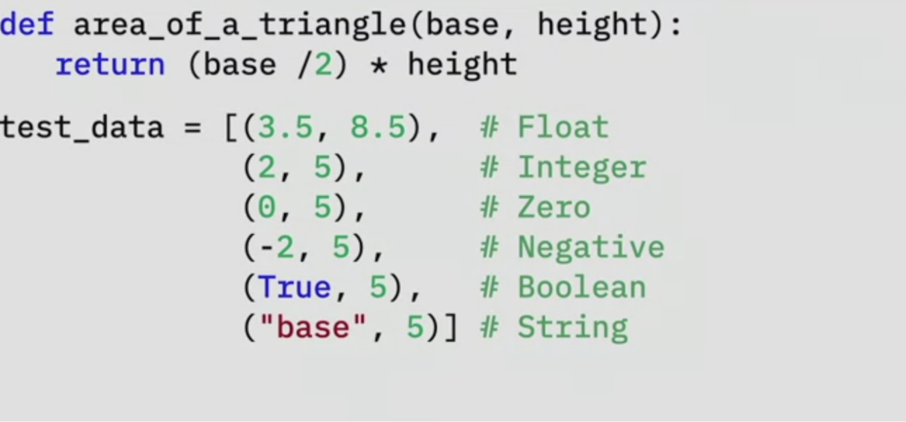
</p>

You test for all these because you don't know what's going to get passed in. A web application might get some data from a URL or an API call and then just go and pass on the data to your function. The application operates under the assumption that your function knows what to do with the data. Next you create a “for” loop to iterate over the list: One time, "The area of a triangle (0, 5) is: 0.0". The code still works. A triangle with a zero base means no area.

Then, you get your first bug: "The area of a triangle (-2, 5) is: -5.0". Hmmm… that’s clearly a bug for negative numbers. Then it returns, "The area of a triangle (True, 5) is: 2.5".
Maybe in this case “True” is being cast to 1. So I guess the best cast that Python could do was to cast “True” to 1 as if it was an integer. It’s still a bug, though.

<span style="background-color:rgb(0, 119, 255)">
   The scarier problem here is that up until this point, no errors have been thrown. This function quietly gives wrong answers. That problem is going to be difficult to find in production because the function appears to work yet it returns the wrong answer
</span>.

Then, you pass in a string and it all blows up! Finally, you have your first error acknowledged by Python. You get this “TypeError: unsupported operand type(s) for divide”, telling you that it was expecting an integer but you passed in a string.

So, clearly, that function wasn't ready to put in production just quite yet. A single line of code that performs a seemingly simple calculation needs more defensive programming wrapped around it to make sure that the function does in fact receive the correct input it requires to perform correctly.

Next, you check to make sure that you have a positive number, so if "base" or "height" is less than zero, then you <u>raise a ValueError exception</u>. While the first exception was a TypeError because the type was wrong, this one has the correct type; it’s just not within the value range that you are expecting so you use ValueError exception instead. I should point out that you want to avoid raising too broad an exception; you want to be as explicit as possible. The ValueError returns the message "The base must be a positive number" or "The height must be a positive number" depending on which one caused the error.

It's important to let the caller know which parameter caused the error. This gives good information to the caller that it needs to send in a positive number.
Finally, you get the original one line of code that does the calculation "one half the base times height" and returns the result.

<p align="center">
        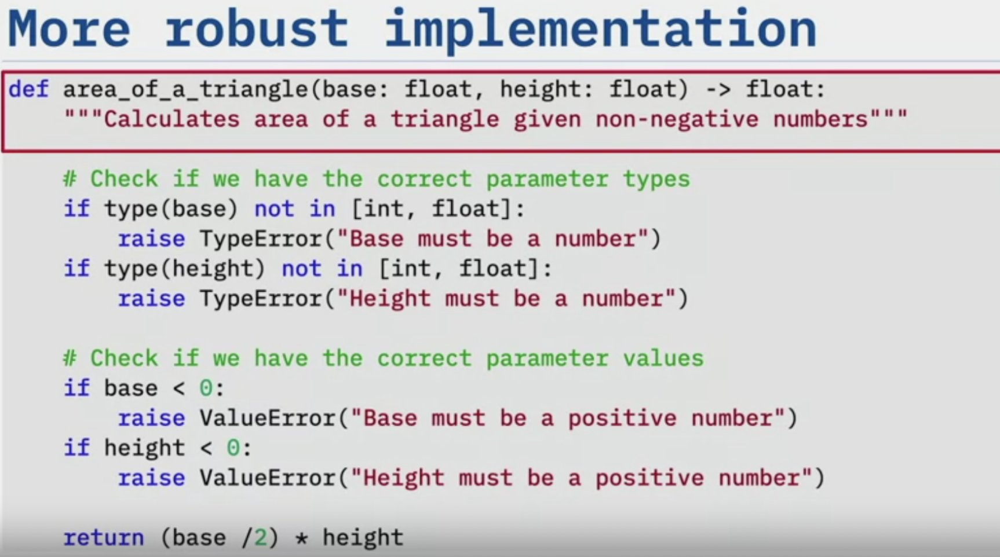
</p>

That’s the difference between writing a line of code as a hobby and applying good software engineering practices for developing code that you want to put into production.

In production, your function will be called and you don't know who's going to call it, or what’s going to be passed in, so you must code defensively and you must write test cases for as many possible outcomes as there are ways to break your code.

Like I said, “Code that hasn't been tested shouldn’t be trusted.” If you can't prove to me with a test case that it works, then as far as I’m concerned it doesn't work. It may look like it works, but if you throw some goofy data at it, I bet it's going to blow up. You don’t want that happening to your code. Test cases force us to think about what ways in which our code can break, and then write test cases to make the code break, and then write the code needed to make the code again, fail gracefully, and get the test cases to pass.

This is the basic workflow for test driven development.

Write a failing test case for the code you wish you had. This expresses how to call the code and what you expect in return. Then you write just enough code to make that test case pass. It doesn’t have to be perfect. It doesn't have to be pretty. It does have to make the test case pass. Then, now you refactor the code to improve the quality. Maybe you initially returned a fixed value and now it’s time to calculate the real value. Finally, repeat the process. This entire workflow is known as Red/Green/Refactor. Many testing tools follow this scheme. These tools output failing test cases in red and passing test cases in green. This is how Red/Green/Refactor got its name.

<p align="center">
        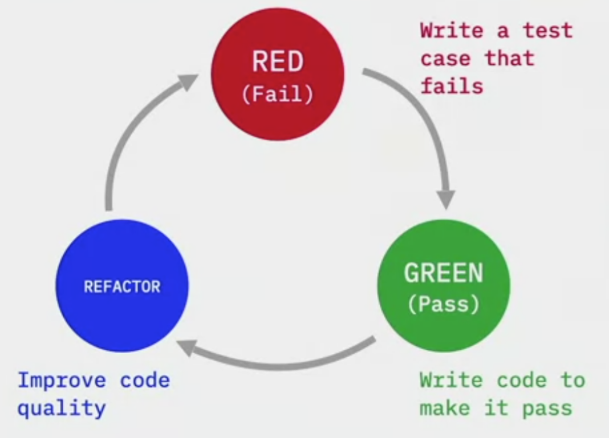
</p>

### Benefits of Test Driven Development

- TDD keeps you focused on the purpose of the code. What is it supposed to do? What inputs does it need? And what is the outputs that should be produced?

- It saves time for developers so it is important for devops. As you write the features of the code, you change existing features, your test cases will quickly let you know if something broke. It allows you to code faster because you are more confident. When you refactor the code, you can move much faster because the test cases will catch any changes in the behavior.
- The tests ensure that the code is working as you expected. If you write the test case first to define the behavior you want, you will know when you have achieved that behavior when the test case passes. And test cases also ensure that future changes don’t break the code.
- Finally, and most importantly, in order to create a DevOps pipeline, you need to automate all testing unless you want to push bugs to production faster. You can't have a CI/CD pipeline without automating testing.

### TDD Tools

PyUnit, PyTest for Python. Unittest is built in python module which is very helpful for organizing tests.
Write a class with appropriate name which inherits from TestCase class.
This class has some prebuilt methods that run in specific order.

These methods include setUp() that executes first, tearDown() that executes last. These methods are called test features. Test fixture allows you to specify the initial state of the system before a test case is run. setUp() and tearDown() will execute before and after each test, respectively.

Also it has simple but very useful `assert` type of methods such as: `assertEqual`, `assertAlmostEqual`, `assertRaises` for rasing different types of errors or custome errors.

### Methods for Test Driven Development

Lets say we want to test functionality of a stack data structure. I start writing my test cases by declaring a class that is a subclass of TestCase that we imported from unittest. I’ve called this class StackTestCase.

Next, I define two test fixtures. setUp() is declaring an instance variable called self.stack and assigning it to a new Stack. That will be the stack that we will test. tearDown() is setting self.stack to None to make sure that it doesn’t get reused, which could cause side effects.
<span style="background-color:rgb(0, 119, 255)">
   When we run the test case, first it executes setUp(), which creates a new stack and assigns it to the instance variable self.stack.
**Remember: setUp() will run before every test.**
</span>.

The next line of code executes an assertion. Where did that method come from? The self in front of it gives us a clue. It came from the parent class TestCase. This is why we’re subclassing TestCase to inherit a set of methods that we can use to make assertions. This method asserts that whatever is passed in as two arguments will be equal.

### Test Fixtures

How do you know what state the system is in before you run a test? What if your tests assume that there is certain data in the database before you run them? How do you handle this? The answer to all of these questions is to use **test fixtures**.
<span style="background-color:rgb(0, 119, 255)">
   We use test fixtures to establish an initial known state before and after running tests. With test fixtures, we can describe what the test environment looks like before a test, or suite of tests, is run, and then again after the test. With this feature, we can run tests in isolation. We ensure that the system is reset after every test so that changes made to one test will not affect the behavior of another test
</span>.
 In turn, this reset ensures we get repeatable results because every time a test is run, we know that it is running from the same initial state.

 <span style="background-color:rgb(0, 119, 255)">
   Some useful test fixtures are preparing data, as well as setting up or creating fake objects or mock objects. We will dive deeper into fakes and mocks later but for now, think of them as “test dummies” or “stand-ins.”
</span>.

 They mimic real objects which might not be available at the time of testing and so you can create these with a test fixture.

<span style="background-color:rgb(0, 119, 255)">
   Another use is loading a database with a specific, known set of data
</span>.
Let’s say you’re going to test the manipulation of customer accounts. This might assume that there's some customers are in the database. You can use a test fixture to populate the database with some sample customers. An important feature of fixtures to keep in mind is that they always start from the same state. So in this case, the database will contain the exact same customer data for each test. This will make sure, for example, that deleting a customer in one test doesn’t affect finding that customer in another test.

You could also use test fixtures for copying a specific known set of files so that your tests can find them if needed. Anything you need to do to set up the proper environment to run your tests can be accomplished with test fixtures.

Let’s look at the six test fixtures that **PyUnit** gives us.

There’s setUpModule. That runs once before the entire Python module. Remember: a module is just a Python file. In this case it’s the file that contains your tests. If the module has multiple TestCase classes it runs once before any of those classes run.

Likewise we have tearDownModule, which runs once at the end of the module, after all the tests have run. We use this fixture to clean up once after all the test have been completed.

Next we have the TestCase class. It can have a class method called setUpClass() that will run once before all the tests in that class.

Likewise we have tearDownClass(), which is another class level method that will run once after all the tests in that class have run.

The last two test fixtures are at the instance level. The first, setUp(), will run before each test. And tearDown(), will run after each test. If you use all of these test fixtures in your test module, the test runner will execute setUpModule, then setUpClass, then setUp; and then run a test. After the test it would call tearDown. And then for each additional test in that test case, the test runner will execute setUp, then the next test, then tearDown again. After running all the tests in that test case, the test runner executes tearDownClass. If there are more TestCase classes, the test runner calls them now, and then runs tearDownModule once finished. Let’s look at a code example for testing user accounts. We start by declaring a class called TestAccountModel that is a subclass of TestCase.

Next we use the class method setUpClass() to establish a database connection. Database connections are usually expensive to make so we don’t want to make one for every test case. This will only connect to the database once for all of the tests in this class.

Next we'll define the reciprocal class method tearDownClass() which closes the database connection. This ensures that after all of the tests have run the database connection is closed.

Next we'll use the setUp() instance method which runs before every test, to drop all the tables and recreate them. If there was another way to remove the data by truncating the tables you might want to use that instead.

<span style="background-color:rgb(0, 119, 255)">
   Of course, we hope that these tests are connecting to a test database where it doesn’t matter that you are removing and recreating data. I would only use this with a dedicated test database
</span>.

Finally we define the reciprocal instance method tearDown() which removes the current database session and drops all of the tables. This ensures that after each test run, the database session is removed and the tables are cleared. This is just one example of using test fixtures in PyUnit to make sure that every test has a database connection and a clean set of tables to start testing.

Sometimes you need to load a known set of data before you run tests. Here’s what I like to do. Under my test folder where the test cases are stored. I like to create a folder called fixtures. There is no special meaning to this folder name other than it signals to developers that the files inside have to do with test fixtures.

### Test Coverage

_How do you know you've written enough tests? Test coverage_!
<span style="background-color:rgb(0, 119, 255)">
   Test coverage is the percentage of lines of code that are executed during all of the tests. When you call for test coverage, your coverage tool counts all of the executable lines of code and then monitors the tests to see which lines of code the tests execute
</span>.

 The tool then divides the number of executable lines of code by the total number of lines of code. And the result is the percentage of lines that your test cases covered. High test coverage gives you confidence that a large amount of code executed during the tests. In turn, the more lines of code executed through tests, the more confident you can be that the lines of code works as expected. To determine your level of test coverage, you use test coverage reports. These reports can reveal which lines of code were tested. But more importantly, they can reveal which lines were not tested so that you can write more test cases that execute those lines of code.

Let’s look at what a test coverage reports looks like. Specifically, we’ll use the report from a Python, tool, called coverage. We start by running the coverage command and requesting a report with the “-m” option. This option will show us the missing lines of code, that is, lines that do not have test cases that execute them. We get a nice report that lists all of the program files with their statistics. Another way to configure this to create `pytest.ini` with addopts to configure pytest. Add term missing so the pytest report include missing lines left without testing. Add -v (-vv) for verbosity, —con=<module name that is being tested>  so it only includes test coverage report for this file not any other file.

As you write more tests, your coverage score for the module you are testing increases. But remember this: even with 100% test coverage your code can still have bugs. 100% test coverage only means that every line of code has been tested with some known good data. You can still pass bad data into your code and find bugs. So don't stop testing when your code cover reaches 100%. Keep challenging the integrity of your code with bad data, corner cases make sure your code behaves as expected under both favorable and adverse conditions.

### Factories and Fakes

You often need fake data to test against. You can, of course, use some sample data in your tests. But what if you need hundreds of records, or even thousands of records, of test data? Then it can get tedious to create and maintain. Sometimes you just need a fake version of a class in your program but you want to have it be realistic data that behaves like the real class. Factories and fakes make this all of this possible.

Lets say we need to test a data model that handles customer accounts. We'll start by creating this data model. We will use a popular object relational mapper (ORM) called SQLAlchemy and so we create a db instance of the SQLAlchemy class. Now we build our model. We create a class called Accounts that inherits from the base model of SQLAlchemy. Now we can add our columns, which will be represented as class variables. We add an id. It will serve as a non-information bearing key so we label the id as the primary key. We add a name as a string and an email field as a string. We also add a phone number as a string. We make that phone number optional, so we set nullable to True. Let's add a Boolean field to determine if this account is disabled, and let’s make the default False. And finally, we'll add a date joined column as a DateTime and make it optional as well. When we create our factory that produces fake accounts, these are the fields we'll expect to see.

Now we're going to use a Python package called **FactoryBoy** to generate our fake accounts. We start by importing FactoryBoy which is simply called factory. We also imported datetime for creating timestamps. Then we import our model that we just created. Importing this model is important because we will use it here to provide the same functionality as the real class.
Next we'll create an AccountFactory class and have it inherit from the Factory class in FactoryBoy. Then we create an inner class called Meta and one class attribute that is model equals Account. This attribute is how the factory knows which model class it creates fakes for. That is why we imported the Account class from models.

Finally, we add the same attributes that the original class has but we substitute fake versions of these attributes. We'll start with an id. Because it is a non-information bearing key and most databases just use a sequence as the primary key we will use the factory Sequence class to provide an increasing sequence number each time this field is called.

Next we'll add a name and we take advantage of the fact that FactoryBoy includes the Faker class. With Faker, we can generate fake data for a set of providers that Faker knows about. It has a provider for names so we'll just use that. You just instantiate a Faker object passing it the provider “name” as a parameter in the constructor. Next we add an email field and Faker also has a provider for fake emails so we'll use that. The next field we make is phone number. Luckily, Faker supports phone number provider as well so we use that. The next field we make is the disabled field. Faker doesn't have a provider for Booleans, but FactoryBoy has a method called FuzzyChoice which randomly chooses between options we give it. We could pass a list of values to FuzzyChoice property and FuzzyChoice will select one randomly from the list. This is great when you need data that doesn't have a provider. For our case we will give it the only two values that a Boolean can be: True and False. Finally we add the date joined field. Here we use the datetime class as a parameter to the LazyFunction method, which only generate the timestamp when the AccountFactory is created. This way, if we create five accounts they will have five different timestamps for date joined.

We're now ready to use our AccountFactory in our unit testing. We start by importing AccountFactory from factories module. Then we create a test case called test_update_account. Here we instantiate an AccountFactory and assign it to a variable called account. Next we'll call the create() method on the account. You might be asking yourself, "How can we call a method on a fake class?" Because AccountFactory doesn't have any methods. Remember how we used that inner class called Meta and assigned the model variable to our "real" Account class? This allows the AccountFactory to behave exactly like a real account. Now any method that you can call on the Account class, you can also call on the AccountFactory class. It is truly a "body double" or "stand-in" for an account. Next we retrieve the account that we just created. We set a new value for the email, to a value that we know won’t show up in the test data, and then we call update() method to save this new email. Finally, we retrieve the account from the database one more time, and we assert that the email that was saved matches the email that we set it to. Faking account data is that simple.

Anywhere you can use an Account, you can now use an AccountFactory and have instant sample data. Any method that you can call on Account, you can also call on AccountFactory because it behaves exactly the same as a real Account, even though it's a fake. Here are the standard providers that the Fake class supports. You can see that there are address providers, automotive providers, bank providers, a host of other providers to help you build sample data for your applications. There are even community providers that expand on this list.

Let's take a look at some of these providers. We'll start by importing Faker from the factory package. Then we create an instance of Faker that will produce names. To do this, we pass in the provider name, in this case "name", to the Faker() class and store it in a variable called name. Next we create a loop that iterates five times and calls name.generate() to generate a name each time through the loop. When we execute this code we see five random names: Cristina Mitchell, Tammy Sandoval, Cristopher Dawson, Elizabeth Dawson, and Kimberly Kennedy. Let's go through this process again but with a different provider. This time we'll use the company provider by creating an instance of Faker passing in "company" as the provider name. Again, we'll create a loop and generate five fake companies. When we execute this code we get "Parks and Sons," "Peterson, Evans and West," "Maxwell LLC," and so on. Let's try one more time, using the "job" provider. When we execute this code we get five job names like "Financial adviser,” “Technical author,” “Lawyer,” and so on." By using fakes we can create Cristina Mitchell who works for Parks and Sons as a financial advisor; or Tammy Sandoval, who works for Peterson, Evans and West as a lawyer; or any number of people, companies, and jobs; or any combination of any of the providers. And I'm not Faking! Factories and fakes are useful for creating and maintaining a large amount of test data. Factories generate fakes with realistic test data. And fakes behave like real objects during testing, so developers test fakes like they test real data.

### Mocking

<span style="background-color:rgb(0, 119, 255)">
   Understanding mocking is critical for making sure that you are only testing your code, and not someone else’s system. Mocking can be very useful when your code calls another system that it depends on
</span>.

Mocking is a process for creating objects that mimic the behavior of real objects. You might ask yourself, "Why would I want to mock something?"
When you're running a test case, do you really want to call the IMDB 1000 times a second? Would the IMDB servers even let you call it 1000 times a second? What if the IMDB service is down? Now through no fault of your own, your test cases don't run. This is why you want to mock systems like this during tests. You should mock any external service that is not under test.
To do so, you create mock objects that behave like that system. You mock it because the system isn’t what you're testing; you’re testing whether your code can call the system, get back data, and then do something with that data. Mocking the external system isolates the test to just your code. By mocking the system, you're gaining another advantage. Sometimes you need to change the behavior of a dependent system under test. Say you mock the IMDB database. Then you can make it send back whatever type of reviews you need: good reviews, bad reviews, even no reviews. By mocking an external system, you have complete control of the data that comes back from that mocked system. You can change the behavior of a mocked system. You can have it fail. You can have it bring back a bad return code and check that your error handlers are working properly. Mocking allows you to create any condition that you need to test. But mocking isn’t limited to external systems. Mocking is also useful if you don’t have a remote connection to another component that’s important for your testing. This component could just be a part of your application that isn't available during testing.

There are two types of new methods of mocking:

- One method is through a patch: you can patch a function call, allowing you to change the call’s behavior. This is powerful tool to simulate error conditions and control what is returned from a call to any function. When I say any function, I'm including third-party libraries that you have no control over.
- The other method is through a test framework’s mock object, which mocks an entire object, changing its behavior. The best use for these mocks is when you need an entire object that behaves like another object, not just a function call. You can also use these fake calls that returns an object instead, the call returns a mock object that behaves like the object you expect to return from the function call.

<span style="background-color:rgb(0, 119, 255)">
   In Python, two of these mock objects are built into PyUnit: Mock and MagicMock. By using a combination of patches and your framework’s provided mock objects, you can gain complete control over external dependencies under test conditions so that you can achieve repeatable results

</span>.

The first type of mocking we will explore is called "patching." With patching, you can change the behavior of a function call. Patching is especially useful when the function calls an external system that is not under your control. This is also useful when you want to simulate error conditions but you can’t actually cause those errors while under test.
The mock library in Python gives you two ways of patching: patching a function’s return value, and replacing a function with another function. This is known as a side effect.

Let’s discuss each in turn.
You can patch a function's return value. This is useful for testing error handlers because you can pass back error condition codes and see how your application behaves when it receives these return codes. This is also useful for controlling the data that's returned from a function call. You can pass back any data structure or object that your program expects. By using the return_value patch, you can return anything that can be sent back as a return value from a function call.

Let's see how to patch a function’s return value. We’ll revisit the IMDB database example and see how we can use the "with" expression to cause a variety of behaviors from the same call.

We want to create a function that calls the IMDB database and we name it "imdb_info". We pass in the title of a movie as a parameter.
The first step in this function is to print a message that shows us the title we are searching for. You'll see why we’re including this in a little bit.

Next, we call the IMBD API, telling it which movie title to look for. Finally, we return the results as a JavaScript Object Notation otherwise known as JSON.
Now let's test how this call to our new function handles error conditions. To do this, we'll use a patch and two different return values.

First, we use "with" and patch the function imdb_info to return a status code of 200. 200 equates to OK, meaning the call was successful. When we run this test, the imdb_info function will never execute. Instead, a return value of status_code 200 will immediately be returned to the caller.

Next, we'll make the call to imdb_info(), passing in "Bambi" as the title, and we print the return value. Sure enough, it returns a status code of 200. What it does not return is the message that we printed as the first line of the imdb_info function. This proves to us that the function was never called. By patching return value, we bypassed the function entirely.

Next, we'll patch the call to imdb_info() again but this time we will use the imdb variable that we declared at the end of the "with" statement. This is just an alternate way of patching. We set the imdb variable to have a return value of "status_code 404." A 404 means "not found." Perhaps your web browser returned this code to you once or twice before because it couldn't find a web page In this case it means that the movie could not be found.

Now when we make the call to our imdb_info function, passing in the title "Bambi," we get back a status code of 404.
In order to cause this error condition in real life, you would need to pass in a title that really wasn't found. But with patching, we can prevent real, existing information from being found to test for these error conditions. This example shows, with patching we can take complete control over what a function returns to us. In turn, we can test for good return codes and bad return codes without calling the actual service or trying to get it to return a bad return code.

Let’s dig a bit deeper on patching. You can patch with precision. You’re not limited to patching some function that you wrote. You can actually patch a third-party library to return whatever you want. Let's look at a small variation on the previous example.

We start off with the same imdb_info function as before.

This time we use mock.patch to patch the get() function in the "requests" package. We imported this Python library on the first line. Normally we would have no control over it. But with our patch, any time requests.get() is called, the function will return the value that we specify without ever being called.

That means it won't actually call the IMDB database service while under test.

Now the imdb_info() function runs as normal. All the lines will be executed. Just the remote call will be patched.

Finally, when we call the imdb function, it prints the message from the first line of the function. And then the function calls requests.get() but that call is never actually completed. Only the return value is passed back. The imdb_info function continues and returns the status code of 200 without every knowing that it never actually contacted the IMDB database.

This example shows that you can be very precise with your patching. We only patched a remote call within our function. If there was more code that checked return codes or processed the return values further, they would have been executed as well.

Sometimes you need a patch to do more than just return a value. With patching, you can also replace a function with another function. This is known as a "side effect." With the "side effect" technique, you can provide your own function to get called instead of the real function while under test. Let's see how to use a side effect.

First we import patch from the unittest.mock library. (This is another reason why I like unittest library; lots of helpful tools are built in.)

After we import patch, I define two functions: one called bye() that returns a string “bye,” and another called hello() that returns a string “hello.” Then we define a function called test(). This function returns the results from a call to the hello() function that we just wrote. Under normal conditions, we would expect the return value from this function to be the string "hello."

But these are not normal conditions. I decorate this test function with a mock, specifically, a mock.patch. In Python, decorators are a way of wrapping code around a function. You can always identify a decorator because it starts with the "@" symbol signifying that this function is a decorator. With a decorator, whenever anyone calls the test() function, patch() is called first and then patch() calls the test function. Also notice that we're passing in some parameters to patch().

The first is a string that represents the function that we want to patch. In this case we are patching the hello function from our main Python program. The second parameter can be either a side effect or return value. In this example we're using a side effect. A side effect takes an alternate path.

Notice the value of the side effect is a pointer to the bye function. If you haven't guessed yet, when this patch is in effect, any call to hello function will instead call the bye function. Think about how powerful this is. We can write a function that does exactly what we want to do under test to create any condition that we need. That way, we can control exactly what comes back when the test runs. Finally we write a main program, and when we run it, it calls the hello() function and prints "hello." It calls the bye() function and prints "bye." However, when it calls the test() function it prints "bye" because we patched the hello function to call the bye function instead.

A mock object is an object that simulates, or mimics, the behavior of a real object in ways that you can control. You can control how the mock object behaves and whatever it returns. You can set multiple attributes on it and make it behave just like the real object that it's replacing. The two Mock objects that come with Python’s unittest package are Mock and MagicMock. The only difference between them is that MagicMock implements all of the magic functions in Python. Those are the functions whose names are surrounded by double underscores. With magic functions, you can use mock objects in place of containers or other objects that implement the Python protocols. If you don't need those magic functions, the Mock class will fit your needs perfectly.

Let's look at how the Mock class works. We can create an instance of the Mock class just like any other class. If we call a method on it, like foo(), it happily returns a mocked method with no error. Any method that you call on a mock object will work without error. We can pass a mock object into a function and then later interrogate it to see if that function called its method correctly. In this example, if we check if the foo() method was called and it was, so it will return True. If we didn't call the bar() method and we check if it was called, it will return False.

We can add attributes to the mock object while creating it. These can be any attributes we need for our test case. In this example, we create a mock object, and give it an attribute of status_code, and set status_code to 200. If we then check the status_code we’ll get back the 200 that we set when we created it. We can also set attributes after the object is created just like we can with real objects. In this example, we’re setting the name attribute to "Foo." Even though the mock object doesn't have an attribute called "name," it creates one on-the-fly without any error and accepts the assigned value.

When we print the name attribute we get "Foo" back just as expected with a real object.

You can also have a mock mimic a specific class instead of creating attributes and method calls on the fly.

In this example, we’re importing Response from the requests package. This is the class we’ll mock.

Then, we create a Mock using the "spec" parameter to indicate that we want this mock to behave like a Response class. We also set a status_code of 404 and a content attribute with an error message in it.

Now, when we call m.foo() we receive an AttributeError because the Response class doesn't have a method called foo(). Remember that foo() worked before we used the spec parameter. Now we have a mock class that is behaving like a Response class.

Next, we'll call m.json(). The Mock class dynamically creates a json() method and returns it with no error because the Response class actually has a method called json().

When we call m.status_code we get back the 404 code just like the real object would have. If we call m.text we get no error because the real Response class has an attribute called text. However, if we call m.name it raises an AttributeError because the real Response class does not have an attribute called name.

Again, mock objects can behave exactly the way we expect a real object, in this case, the Response object.

Now let's put it all together by using a patch and a mock object. We’ll use the same patch technique as before to address a more complicated mock.

We start by importing the requests package. This is the package where we’ll patch the get() function.
Then, from unittest.mock we import patch and MagicMock. We’ll use the patch function and the MagicMock class in our tests.

Now, we’ll rewrite the imdb_info() method to make it more robust. It still accepts the title as a string and returns a dictionary.
We give it a good docstring so programmers know what it does. Then, we print out the name of the movie we're looking for. If this were production code, we would use logging instead of print statements, but you get the idea.

Now, we make a call to the IMDB database. This is the requests.get() call that we are going to patch later.

Remember I said we've made this implementation a little more robust. This time we check that the return code is good before we try and get the results. This line of code is one reason that we can't just substitute a return value like in the previous example. We need to return something that behaves like the real results that come back from a requests.get() method.

If the return code is 200, we then call the results.json() function to return the result in JavaScript Object Notation, or JSON. Hopefully, you can see that mocking this will involve a lot more than just a single return value as in the previous example.

If the return code is not 200, we return an empty dictionary.
Now we're ready to write the main part of our test. We use a "with" statement to patch the requests.get() function in our main program. We create a variable called "imdb_mock" that represents the patched function.

This next line of code sets the return_value of the imdb_mock to a MagicMock. This means that when requests.get() is called in our imdb_info() function, the MagicMock object is going to be returned instead. Next, we use the spec parameter to tell MagicMock that it should implement the requests.Response specification. We know that requests.get() returns a Response object so when this MagicMock gets returned, we want it to behave like the Response object that our code expects.

Next, we set the status_code to 200 because we know the new imdb_info() function expects this return code. In later tests, we could set this to other values to simulate error conditions. We know that the imdb_info() function is going to call the json() function on the Response object that it gets back from the requests.get() call. So we need to tell MagicMock to create a json() method and set its return_value to the JSON that we want returned for our test. Note how we are in complete control of what gets returned.

The last step is to actually call the imdb_info() function and pass in a movie name. When we do, everything works as expected and we get back the movie information that we specified in our mock.

Just to reiterate, when the line to call requests.get() is called, it activates the patch to substitute the mock in its place.
The result returned is actually the MagicMock that we had specced to behave like a real Response object.
When the status code is checked, it will return 200 just as we specified. And when the json() method is called to get the payload, it will return the exact data that we specified.

Hopefully, this shows you how powerful using mock objects like Mock and MagicMock can be, especially as return values from patched function calls.

With mock objects, you get complete control to mimic any behavior that your test case needs. You can control any return code that you need so that you can simulate good return codes as well as bad return codes. And you can even control what function calls return like the json() function in our example. We use mocks to create conditions under tests that may be impossible under normal circumstances. But, you should use mocks sparingly because you want to be sure that you are testing your code, and not your mocks.

### What is Behavior Driven Development?

As its name implies, behavior driven development, or BDD, focuses on the system’s behavior as observed from the outside in. It’s not concerned with the internal workings of the system like test driven development, or TDD. It is observing how the system behaves just like a user of the system would.
<span style="background-color:rgb(0, 119, 255)">
   This makes BDD great for integration testing to see if all of the components are behaving together. It forces you to think "from the outside in”
</span>.
 In other words, you implement those behaviors that contribute most directly to business outcomes. One advantage of BDD is that it describes behaviors in a single syntax that domain experts, testers, developers, and customers can easily understand. This improves communication across the team.

 Let’s think about how BDD differs from TDD. In TDD, you test the system’s functions from the inside out or the bottom up. It’s testing the inner workings of the functions. For TDD, you care about the call. Did it get the right return code? Did it bring back the right data in the right format? And so on. We use TDD for unit testing. Like TDD, BDD is a test-first approach for development. However, BDD is a higher level of testing. It tests the behavior of the system from the outside in and considers how the system should behave. It’s not concerned with the internal workings of the system like TDD. In BDD, you’re observing how the system behaves just like a user of the system would experience it. For example, think of your virtual shopping cart when ordering items online. For BDD, you might ask, “When I add something to my shopping cart, does it appear in my shopping cart?” I don’t care what API was called, and I don’t care about the data that was transferred. I just care what I expect to see appear in my shopping cart does appear there. You’re concerned with the outward behavior of the system. That is, when you click the button labeled “remove from cart,” you expect the item to be removed from your cart and, therefore, no longer present.

Let’s briefly review the software testing process to find out where BDD fits in:

- At the lowest level, we have unit testing. At this level of the software testing process, you test individual units or components of a software system. The purpose is to validate that each unit is performing as designed.

- The next layer up is integration testing. At this level, you’re combining individual units and testing them as a group, and the purpose of this is to expose faults in the interactions between the units.

- The next level up is system testing. At this level, you’re testing the complete system end to end. The purpose is to evaluate the system’s compliance with the specified high-level requirements and make sure that the whole system is working together.

- And then finally, there’s user acceptance testing. At this level, the user tests the system for acceptability.

So where does BDD fit into the process? Usually, you perform BDD at the integration, system, or acceptance test levels. At those levels, enough of the system is running that you can evaluate its behavior.

BDD describes behaviors in a single syntax—one that domain experts, testers, developers, stakeholders can easily understand. So the domain experts can be really specific about what they need and you can express this easily. I can't overemphasize how beneficial it is to be able to describe behaviors in a single syntax that is directly accessible to everyone. It significantly improves communications across all involved parties. This leads to the next benefit. Notations originating in the BDD approach --particularly the given-when-then syntax-- are closer to everyday language than notations in the TDD tools, and they have a shallower learning curve.

The language is very natural, making BDD very approachable. The most commonly used syntax in BDD is called **Gherkin**, and this is the syntax that we’ll use in this course. It got the name Gherkin because one of the first BDD tools was called Cucumber (cucumbers are used to make pickles, and a gherkin is a pickle—you figure it out). Other benefits related to BDD specifications is that in the specification it describes how the system should behave in a situation. Tools targeting the BDD approach generally afford automatic generation of technical and user documentation from the BDD specification. This automatic generation means that the documentation is always in sync with what you’re building. A related benefit is that you can generate tests directly from the BDD specification to confirm that the behavior was implemented. So you use the specification to test the system and prove to your stakeholders that the delivered behavior is exactly they asked for.

### BDD Workflow and Gherkin Syntax

Let’s step through the BDD workflow.

- First, the developers, testers, and stakeholders explore the problem domain to make sure that everyone understands it, and they collaborate to produce concrete examples, or scenarios, that describe the behavior they want. You document these examples in the Gherkin syntax. The result is a specification of the behavior of the system that you will build.
- Next, the team uses a BDD test runner like Behave to run those examples in that specification as automated test cases.
<span style="background-color:rgb(0, 119, 255)">
   Behave parses the Gherkin syntax and looks for test steps that it can use to confirm that the system behaves as expected

</span>.
Running these examples with Behave tells you what test steps are missing. You'll get a report that says, “Here are the test steps that you need to write to improve the behavior of the system.” Then you write those steps and you make everything work. As the team works on the solution, Behave tells you which examples are implemented and working and warns you about the ones that aren’t. Before you know it, you have one document that acts as both specification and tests for your software. It represents exactly how the system should work. This document is not some Word document in some library that somebody forgets about, and then later you find out that the system doesn’t even work that way because you’ve made changes and you forgot to update the documentation. This is a living document checked into your source control system, and you run test cases against it. Nobody ever forgets about this document because every time you run your test suite, the document is used to confirm the way the system should behave. It’s almost like the documentation drives the system instead of the other way around. Let’s talk about the language that you use to write your examples and scenarios.

- Write Gherkin: in Gherkin syntax, every example has at least three lines, referred to as steps, and each step must start with a keyword. Gherkin syntax is commonly referred to as "Given", "When", "Then" for the three required keywords.

  - We’ll start with the first keyword: Given. Given a set of preconditions. These are the conditions required to put the system into the state it needs to be to perform the tests. For example, take an e-commerce application. I might write,
    “Given I have two items in my shopping cart.”
    This tells the test system that we need to make sure that there are two items in the shopping cart before we proceed.

  - The next keyword is When. When an event occurs. These events are the actions that the user takes to interact with the system under test. In our shopping cart example, it might be,
    “When I remove an item from my cart.”
    This tells the test system that it needs to remove an item from the cart under test.

  - The final keyword is Then. Then some testable outcome is observed. This is the expected outcome of the action that the user performs. Using the shopping cart example again, I might write,
    “Then I should only have one item in my shopping cart.”
    This step tells the test system to check that an item is actually removed from the cart by the When event.

    To improve readability, you can also use the And and But keywords. Say you have a series of steps, and each step begins with the same keyword: “Given this, Given that, Given some other thing.” That’s three Givens in a row. To make a series more readable and more fluid, you could use And keywords to replace each repeated keyword after the first step in the series. So in this example, you could say, “Given this, And that, And some other thing.” It reads a lot nicer. You can also write, “When this happens, And that happens,” or “Then this is observed, And that is observed.” "And" will always take on the meaning of the previous Given, When, or Then that comes before it. For steps that state what should not occur, you could also replace the keyword with But instead of And. For example, you can write, “But that is not observed.” You can still use And, but the But keyword is just an extra option to improve readability. That’s all there is to it, the Gherkin syntax. Given some precondition, When some event happens, Then some testable outcome is observed. If you have more than one Given, When, or Then, you can substitute it for an And or a But to make the reading easier. With these keywords, you can create sentences that will both express and test the system’s expected and actual behavior.

### Example of BDD

Another popular BDD tool for Python is **Behave**, which is the tool that we’re going to use in this course.
<span style="background-color:rgb(0, 119, 255)">
   It supports Python. It also supports plain text files that you can check into version control. Finally, it supports feature files written in Gherkin and steps written in Python. It also supports environment setup and test fixtures to set up and tear down the environment at different stages, giving you tremendous control over the test environment
</span>.
These features are why I use Behave on all of my Python projects. The key to selecting one of these tools is starting with the tool that supports the programming language that you’re using. For example, if you choose Cucumber, you have to write your step files in Ruby. The next important factor is the support specification syntax. For me, that means the tool needs to support Gherkin. Not all BDD tools support it, so I always look for the ones that do because Gherkin provides a simple syntax that both stakeholders and developers can easily write and understand. This perk is just too good for me to pass up. Behave is just a powerful, feature-rich tool for BDD that I think you’ll find incredibly useful.

### Overview of Behave

I’d like to give you a little “behind the scenes” at how the Behave tool works.

1. I’ll start with the required file structure:

    - Behave looks for a folder named <u>`features`</u>. All of the files that control Behave must be under the top-level features folder. Inside the features folder, Behave looks for files with an extension of `.feature`. You can name those files whatever you want. You can have multiple feature files or just one; it’s up to you. Behave will process each one it finds in the features folder.

    - The features folder also contains a subfolder called `steps`.
    <span style="background-color:rgb(0, 119, 255)">
   Inside the steps folder is a collection of Python files that have the steps that match the Gherkin statements in the feature files
</span>.
     It doesn’t matter what you name these steps files, but most people use “_steps” in the name to signify that they’re steps files. Best practice suggests that you place all of the generic steps that manipulate the web interface, regardless of application, into a file called `web_steps.py`. I usually copy this file from one project to the next because it rarely changes. If you have additional Python files containing steps, you could store them in the steps folder as well. Behave will load all of the steps in the Python files in this folder. You can include a file called `load_steps.py`; I usually use this to load sample data to set up the scenarios. As long as the Python steps cover all of the statements in the feature files, everything will work.

2. So to use Behave, first you need to set up your folder structure correctly. You create your features folder and your feature files and your steps folder under that for your Python steps files. And once your folders and files are set up, you run the Behave tool from within the parent of that features folder. Behave reads the steps in each feature file, looks for a matching Python step in the steps files, and executes those functions.

Now let’s look at some sample steps files to see how this step matching happens. You have a feature file. This file contains the scenarios that you built with your stakeholders. On the other hand, you have a steps file. It contains the Python statements that Behave will match to the feature file. Notice that all of the Python functions in this file have the same name: “step_impl.” Behave will ignore these function names.

It only looks for the Python decorators that wrap the functions. When Behave begins to execute, it scans the feature file (`.feature` file) to find the first scenario. Then it processes the first sentence of that scenario: “Given some known state.” At this point, Behave looks for a Python step that starts with the Given keyword and has the text “some known state.” Behave finds the step in the steps.py file and executes it.
Then Behave looks for the next sentence in the scenario: “And some other known state.” Because And comes after a Given, Behave will look in the steps file for a Python step that starts with the Given keyword and matches the string “some other known state.” Behave finds the step and executes it. Notice the steps do not have to be in any particular order in the steps file. Behave will find them regardless of the order of appearance in the file. The next sentence in the feature file is “When some action is taken.” This time, Behave looks in the steps file for the When keyword followed by “some action is taken.” It doesn’t match the Given or Then steps even if they have the same text. A When in the feature file will only match a When in the steps file. Behave finds the step and executes it. Next, Behave processes “Then some outcome is observed.” It looks for a Then step with the text “some outcome is observed,” and it executes that function. Finally, it processes “And some other outcome is observed.” Because the And keyword follows the Then, Behave looks for a Then step with the text “some other outcome is observed” and executes it. That’s how the magic happens. Behave reads through each scenario of the feature file, step by step. It processes each step’s keyword and text string, finds a matching keyword and text string pair in the Python steps file, and it executes that function. It’s simple yet eloquent.

Behave has a set of test fixtures that you could run before or after feature scenarios, steps, or tags to control the test execution environment. Let's look at each of these functions. One set of test fixtures includes `before_all` and `after_all`. As their name implies,
<span style="background-color:rgb(0, 119, 255)">
   any code you place in these fixtures will execute once before all the features and then again after all the features
</span>.
This set is ideal for setting up web drivers from tools like Selenium. With Selenium drivers, you can use a real browser to perform your testing. This set is also ideal for establishing the context values that all the steps can access and for shutting down any drivers after Behave processes all the features. The next point is before _feature and after_feature. These functions run before and after each feature. Every feature pass-in is an instance of the feature class. If you use multiple features, this set can be ideal for setting up a clean environment before and after each feature runs. The next control set is before_scenario and after_scenario. As you might have guessed from their names, these functions run before and after each scenario.

The scenario is passed in as an instance of the scenario class. With these functions, you could have even more granular control over each scenario execution environment. Then there's before_step and after_step. These run before and after every step. The step passed in is an instance of the step class. That's very granular control. I have never found a need to modify the environment between every step, but you can do it if you need to. One final set of functions that control the environment is before_tag and after_tag. I don't cover tags in this course because tagging is a more advanced function, so I'll only discuss these functions briefly. Behave invokes tags by the order they're found in the feature file.

You set up your behave environment in a file called `environment.py`, and this is where you declare your test fixtures. Let's look at a simple environment.py that uses the before_all and after_all functions. You start with your imports.
<span style="background-color:rgb(0, 119, 255)">
   You need to import any configuration parameters from the environment. So first, you should import the get environment function from the OS package
</span>.
In this example, you will also
<span style="background-color:rgb(0, 119, 255)">
   use Selenium to manipulate your application's user interface during the test
</span>.
Next import is WebDriver from the Selenium package. Next, you should declare any global variables you want to get from the environment. In this example, you get an environment variable called `wait_seconds` that controls how long Selenium waits for a response from the UI.

You will also get an environment variable called Base_URL that tells you the location of the system under test. By changing the base URL environment variable, you can point Behave to your local computer or any remote computer that you want to test. The first function you define is before_all, which will run before Behave processes any feature files. Notice that this function has one parameter passed in the context. This context will be passed to every step in your test suite. Therefore, anything you assign to this context will be available to all of the steps. The first item you define in place in the context is the WebDriver. You set the options to use Headless Chrome driver, but you could have used Firefox or Safari driver or any number of other drivers. The only prerequisite is that web browser is installed in the test system that's running Behave. You assign this driver to a variable called driver in the context. Again, this context is parsed to each step, thus, all the steps will have access to the WebDriver by simply referencing context.driver and we'll use it to drive their actions on the UI. Next, you save the wait_seconds global variable in the context. That way, all the steps can access it to know how long to wait for the UI to respond. You then set an attribute on the WebDriver to implicitly wait this number of seconds by default. Finally, you create a variable called base_ URL in the context and set it to the global variable base_URL that you got from the environment. This way every step, we'll know what URL to run the test against. All of these Python statements will execute once before Behave processes any of the feature files. Together these statements set up the initial environment for running the BDD tests. The last function that you define is, after_all, and it has one line of code, context.driver.quit. This function tells the web browser to close down after all tests are complete, ensuring that you don't leave multiple web browsers running in memory afterwards. Obviously, you could add more text fixtures to this file and you can have them execute before and after each feature, scenario, step, or tag. This one file environment.py controls the environment at whatever level of granularity you need.

### Selenium

<span style="background-color:rgb(0, 119, 255)">
   Selenium is a collection of tools for automating web browser activity. At its core, Selenium is a WebDriver, an interface to write instruction sets that you can run interchangeably across popular browsers like Chrome, Firefox, Safari, and Edge, just to name a few. With only a few lines of code, you can control a web browser just like a real person would. You can enter data into fields, read data back from fields, click links, click buttons… everything a real user can do
</span>.

This control makes Selenium perfect for integration testing of multiple microservices that share a common user interface. Selenium saves hours of running these tests manually. To initialize Selenium:

- First, you must have the web browser that you want to use installed on the test system. If you want to test with Chrome, you need to have Chrome installed. If you want to test with Firefox, you need to have Firefox installed. Selenium uses a real web browser, not emulation, so you need to install the actual web browser software.
- Next, you instantiate a driver of the same type: a driver for Chrome, Firefox, or whatever browser that you want to use.

In this example, I’m setting up some options for the Chrome driver. One option is that the driver is headless, which means I don’t want the browser GUI to show up. Another option turns off security features like sandboxing that might interfere with testing. Then I create a Chrome driver with those options. To use Selenium, you must first tell it which element on the HTML page you want to interact with. Selenium can find elements by class name, CSS selector, id, name, Xpath, links, partial links, text, tag names-- it's a rich set of selectors to choose from.  Selenium for Python has function calls for each of these selectors. Selenium also has a version, “find_by_elements” with an “s,” that finds multiples of the elements on the web page.

Let’s look at an example of how to use these methods. You start with a function that is a step implementation for finding an element by its id. This function has two parameters. One is the context, which is passed into each Python step. The other is a text string to look for, which is an additional parameter that you need for a selector method. Next, you create a variable called element and you assign it the results of calling find_element_by_id() on the driver, passing in the name of the element id that you’re looking for: “customer_id.” Then you specify what happens when Selenium finds this element. You assert that the text string must be present in the element’s value attribute. Now, let’s look at the web page element that goes along with this. It's a text input element. When find_element_by_id() is called, the function will search the HTML for an element that has an id of “customer_id” and will return the text input element. This element becomes the one that you are manipulating in your code. That’s all there is to finding elements. You could have used a method to find elements by name, class, Xpath, any other method. I find using the ids to be the most accurate because I can easily control their uniqueness and they don’t change if you move elements around on the page. Once you find an element, you can do more with it than just inspect its contents. You can clear that element and then type the text string into the input field using the send_keys() function. This is most of what your test cases do; they look for text, enter text, and click buttons and links. We should also discuss waiting for a value. Often, you experience latency when testing in a web UI, so you need to wait for something to appear. Luckily, the web driver has a WebDriverWait function to do just that. The code on-screen is an equivalent of find_element_by_id using WebDriverWait. It tells the driver to wait a certain number of seconds for something to appear. It looks like a lot of code, but it’s very helpful when making calls to remote applications that may involve latency.

-------------------------------
----------------

# DevOps with AWS

- **CodeCommit** is a fully managed source control service that hosts secure Git-based repositories.
  - Fully managed: CodeCommit eliminates the need to host, maintain, back up, and scale your own source control servers.
  - Secure: CodeCommit automatically encrypts your files in transit and at rest. CodeCommit is integrated with AWS Identity and Access Management (IAM), enabling you to customize user-specific access to your repositories.
  - High Availability: highly scalable, redundant, and durable architecture.
  - Collaborate on code: CodeCommit helps you collaborate on code with teammates through pull requests, branching, and merging. You can implement workflows that include code reviews and feedback by default, and control who can make changes to specific branches.
  - Faster development cycle: keeps your repositories close to your build, staging, and production environments in the AWS Cloud.

- **CodeBuild** is a fully managed CI service that compiles source code, runs tests, and produces software packages that are ready to deploy.
  - Fully managed build service: AWS CodeBuild eliminates the need to set up, patch, update, and manage your own build servers and software. There is no software to install or manage.
  - Continuous scaling: AWS CodeBuild scales up and down automatically to meet your build volume. It immediately processes each build you submit and can run separate builds concurrently, which means your builds are not left waiting in a queue.
  - Extensible: In addition to the prepackaged build tools and runtimes supported by CodeBuild, you can bring your own build tools and programming runtimes to use with CodeBuild and create customized build environments.
  - Enables continuous integration and delivery: AWS CodeBuild belongs to a family of AWS developer tools, which you can use to create complete, automated software release workflows for continuous integration and delivery (CI/CD). You can also integrate CodeBuild into your existing CI/CD workflow. For example, you can use CodeBuild as a worker node for your existing Jenkins server setup for distributed builds.
  - Secure: With CodeBuild, your build artifacts are encrypted with customer-specific keys that are managed by the AWS Key Management Service (AWS KMS). CodeBuild is integrated with IAM, so you can assign user-specific permissions to your build projects.

- CodeDeploy: is a fully managed deployment service that automates software deployments to a variety of compute services.
  - Automated deployments: AWS CodeDeploy fully automates your software deployments, enabling you to deploy reliably and rapidly. You can consistently deploy your application across your development, test, and production environments whether deploying to Amazon EC2, Fargate, Lambda, or your on-premises servers. The service scales with your infrastructure.
  - Minimize downturn: AWS CodeDeploy helps maximize your application availability during the software deployment process. It introduces changes incrementally and tracks application health according to configurable rules. Software deployments can easily be stopped and rolled back if there are errors.
  - Centralized control: AWS CodeDeploy enables you to easily launch and track the status of your application deployments through the AWS Management Console or the AWS Command Line Interface (AWS CLI). CodeDeploy gives you a detailed report enabling you to view when and to where each application revision was deployed. You can also create push notifications to receive live updates about your deployments.
  - Easy to adopt: AWS CodeDeploy is platform and language agnostic, works with any application, and provides the same experience whether you’re deploying to Amazon EC2, Fargate, or Lambda. You can easily reuse your existing setup code. CodeDeploy can also integrate with your existing software release process or continuous delivery toolchain (e.g., CodePipeline, GitHub, Jenkins).

- **CodePipeline**: CodePipeline is a fully managed continuous delivery service that helps you automate your release pipelines for fast and reliable application and infrastructure updates.
  - Rapid delivery: CodePipeline automates your software release process, enabling you to rapidly release new features to your users. With CodePipeline, you can quickly iterate on feedback and get new features to your users faster. Automating your build, test, and release process enables you to quickly and easily test each code change and catch bugs while they are small and simple to fix. You can ensure the quality of your application or infrastructure code by running each change through your staging and release process.
  - Configurable workflow: CodePipeline enables you to model the different stages of your software release process using the console interface, the AWS CLI, AWS CloudFormation, or the AWS SDKs. You can easily specify the tests to run and customize the steps to deploy your application and its dependencies.
  - Get started fast: With CodePipeline, you can immediately begin to model your software release process. There are no servers to provision or set up. CodePipeline is a fully managed continuous delivery service that connects to your existing tools and systems.
  - Easy to integrate: AWS CodePipeline can easily be extended to adapt to your specific needs. You can use AWS pre-built plugins or your own custom plugins in any step of your release process. For example, you can pull your source code from GitHub or use your on-premises Jenkins build server. You can run load tests using a third-party service or pass on deployment information to your custom operations dashboard

Serverless options are a great way to run actions based on events that take place within your code pipeline and your development lifecycle. For example, you can use a Lambda function to perform tests that can approve a revision through your pipeline.

### AmazonCodeGuru

Amazon CodeGuru is a service that scans pull requests, gives a description of the issue, and recommends how to remediate it. CodeGuru has reviewer and profiler.

Developer workflow:

- Add the repository details to CodeGuru
  - git branch NewBranch
  - git checkout NewBranch
- Make changes or additions to the code and commit those changes.
- Then push the code to the shared code repository.
- Creating a new pull request. See the Pull Requests lesson in this course.
- When a code review is completed, recommendations appear in the  -
- CodeGuru Reviewer Console:
  - Amazon Web Services best practices
  - Concurrency
  - Resource leak prevention
  - Sensitive information leak prevention
  - Common coding best practices
  - Refactoring
  - Input validation

### Build specification for CodeBuild

CodeBuild needs a build project to define how to gather application dependencies, run tests, and build the output to be used in preparing the deployment.

A project includes information such as:

- Source code location
- Build environment to use
- Build commands to run
- Storage of build output

A build environment is the combination of operating system, programming language runtime, and tools used by CodeBuild to run a build.

You use `buildspec.yml` file to specify build commands. The buildspec file is a YAML Ain't Markup Language (YAML)-formatted file used by CodeBuild that includes a collection of build commands and related settings that CodeBuild uses to run a build.
You can include a buildspec as part of the source code or define a buildspec when you create a build project. When included as part of the source code, the buildspec file is named buildspec.yml and is located in the root of the source directory. It can be overridden with create-project or update-project commands.

Sections of the `buildspec` file are:

- Version: The versions of the buildspec standard
- Phases: Define the build phases during which you can instruct CodeBuild to run commands.
  - Install: Commands, if any, that CodeBuild runs during installation
             Runtime versions are supported with Ubuntu standard images or Amazon Linux 2 standard. Other runtimes are supported in the runtimes versions of the buildspec file. For example:

  - Pre-Build: Commands to run before the build
  - Build: Commands to run during the build
  - Post-build: Commands to run after the build
  - Finally blocks: These can be called after each section’s command blocks run even if a command in the command block fails.

- Artifacts: represent a set of build artifacts that CodeBuild uploads to the output bucket discard-paths specifies if the build artifact directories are flattened in the output
  - No: The build artifacts are output with their directory structure intact.
  - Yes: The build artifacts are placed in the same directory.
base-directory represents one or more top-level directories relative to the original build location. CodeBuild uses this to determine which files and subdirectories to include in the build output artifact.

- Reports
Location where the test reports are stored (see the Test reporting module below)

- Cache
  - Location where you can cache dependencies for reuse between projects
  - Can be an S3 location or local
  - Improves the build time by reducing the amount of dependencies downloaded
  - Can be invalidated

Here is an example of `buildspec.yml`:

```YAML
version: 0.2

env:
  variables:
    JAVA_HOME: "/usr/lib/jvm/java-8-openjdk-amd64"
  parameter-store:
    LOGIN_PASSWORD: /CodeBuild/dockerLoginPassword

phases:
  install:
    commands:
      - echo Entered the install phase...
      - apt-get update -y
      - apt-get install -y maven
    finally:
      - echo This always runs even if the update or install command fails 
  pre_build:
    commands:
      - echo Entered the pre_build phase...
      - docker login –u User –p $LOGIN_PASSWORD
    finally:
      - echo This always runs even if the login command fails 
  build:
    commands:
      - echo Entered the build phase...
      - echo Build started on `date`
      - mvn install
    finally:
      - echo This always runs even if the install command fails
  post_build:
    commands:
      - echo Entered the post_build phase...
      - echo Build completed on `date`

reports:
  arn:aws:codebuild:your-region:your-aws-account-id:report-group/report-group-name-1:
    files:
      - "**/*"
    base-directory: 'target/tests/reports'
    discard-paths: no
  reportGroupCucumberJson:
    files:
      - 'cucumber/target/cucumber-tests.xml'
    discard-paths: yes
    file-format: CucumberJson # default is JunitXml
artifacts:
  files:
    - target/messageUtil-1.0.jar
  discard-paths: yes
  secondary-artifacts:
    artifact1:
      files:
        - target/artifact-1.0.jar
      discard-paths: yes
    artifact2:
      files:
        - target/artifact-2.0.jar
      discard-paths: yes
cache:
  paths:
    - '/root/.m2/**/*'   
```

### Test reporting

CodeBuild allows you to view reports generated by functional or integration tests. The reports can be in the JUnit XML or Cucumber JavaScript Object Notation (JSON) format. You can view metrics such as Pass Rate %, Test Run Duration, and number of Passed versus Failed/Error test cases in one location.  Builders can use any testing framework as long as the reports are generated in the standard format.

To view test reports, you must configure the reports section of the `buildspec.yml` file.

- Create a reports section in the `buildspec.yml`
- Specify the tests in the build or post_build section
- CodeBuild needs the IAM Permissions:
  - codebuild:CreateReportGroup
  - codebuild:CreateReport
  - codebuild:UpdateReport
  - codebuild:BatchPutTestCases

### Synthetic testing with canaries

Synthetic testing is automated testing that emulates user activity on your application every minute of every day. This allows you to continually verify your customer experience even when you don't have customer traffic on your applications.

You can use Amazon CloudWatch Synthetics to create canaries, (configurable scripts that run on a schedule, to monitor your endpoints and APIs). They follow the same routes and perform the same actions as a customer. By using canaries, you can discover issues before your customers do. Canaries work over HTTP and HTTPS protocols as well as APIs. You can run a canary once or on a regular schedule. Scheduled canaries can be set to run continuously, with tests performed as often as once per minute. Below are other benefits of CloudWatch Synthetics.
Customization: CloudWatch Synthetics can be customized to check for page-load errors, load latencies for UI assets, transaction completions, broken or dead links, complex wizard flows, or checkout flows in your applications. In case of application errors, there are multiple debugging artifacts including screenshots, HTTP Archive (HAR) files, and log files. You can even check for unauthorized changes from phishing, code injection, and cross-site scripting.
Isolate alarming application endpoints: CloudWatch Synthetics enables you to isolate alarming application endpoints and map them back to underlying infrastructure issues. You can also use CloudWatch Synthetics to easily monitor internal endpoints in addition to public-facing endpoints. CloudWatch Synthetics lets you integrate endpoint monitoring in your CI/CD pipelines through support for AWS CloudFormation, AWS SDK, and CloudWatch Synthetics APIs.
Metrics: By default, canaries create CloudWatch metrics in the CloudWatchSynthetics namespace. They create metrics with the names SuccessPercent, Failed, and Duration. These metrics have CanaryName as a dimension.

### Manual and automatic approvals

This is a point where you want the pipeline actions to stop so someone with appropriate permissions can approve or reject the build. This individual must have the required AWS Identity and Access Management (IAM)permissions to approve or reject the build. If the action is approved, the pipeline resumes. If the action is rejected, the result is the same as an action failing and the pipeline actions do not continue. A rejection also results if no one approves or rejects the action within seven days of the pipeline reaching the approval action. There are two ways to approach approvals: manual and automatic.

- Manual approvals

    Common use cases:
  - You want someone to perform a code review or change management review before a revision is allowed into the next stage of a pipeline.
  - You want someone to perform manual quality assurance testing on the latest version of an application, or to confirm the integrity of a build artifact, before it is released.
  - You want someone to review new or updated text before it is published to a company website.

    Manual approvals require human intervention, which means these approvals can lengthen your release cycle.
    Manual approval would require someone to receive a notification and take the time to perform the testing and review. Manual testing can introduce deviance and is generally more time-consuming than an automated test.

- Automatic approvals

    The more efficient way to approach approvals is to automate the process. By introducing automation in your approval cycle, you:

  - Eliminate the waiting time for manual resources to become available and to perform the prescribed tests.
  - Gain reliability because tests run in the same way each time and no test is skipped
  - Speed up your application’s deployment time and quality.
  - One challenge experienced by companies with frequent application commits is a bottleneck around the approval actions. Each application revision requires a manual approval and you can quickly become oversaturated with testing tasks. This is why moving to an automated approval approach will help you successfully implement a robust continuous deployment practice. In the next lesson, you'll learn how to put these automated tests in place and automatically approve or deny an approval.

Here is a Python code that approve an approval action:

```Python
client = boto3.client('codepipeline')
response = client.get_pipeline_state(name=pipeline_name)

approve = _json_parsing_magic(response)

if approve:
  client.put_approval_result(
    pipelineName=pipeline_name,
    stageName=stage_name,
    actionName=action_name,
    result={
        'summary': 'Automatically approved by Lambda.',
        'status': 'Approved'
    },
    token=token
  )
```

Disable transitions and re-enable:
Transitions are links between pipeline stages that can be disabled or enabled.
When transitions are enabled, application revisions can pass between stages. They are enabled by default. There might be situations where you need to put a stop in your pipeline.
Example: Your company is on a holiday break and does not need the pipeline to be active. You can disable a transition that would prevent anything from proceeding through those stages. This is the preferred method to stopping movement through your pipeline as opposed to deleting the pipeline entirely.

Open a terminal or command prompt and use the AWS CLI to run the disable-stage-transition command. Specify the name of the pipeline, the name of the stage to which you want to disable transitions, and the transition type. You’ll also specify the reason you are disabling transitions to that stage. Unlike using the console, you must also specify whether you are disabling transitions into the stage (inbound) or transitions out of the stage after all actions complete (outbound).

For example, to disable the transition to a stage named Staging in a pipeline named MyFirstPipeline, you would type a command similar to the following:

```Shell
aws codepipeline disable-stage-transition --pipeline-name 
MyFirstPipeline --stage-name Staging --transition-type Inbound --reason "My Reason"
```

The command returns nothing.

For enabling:
Open a terminal or command prompt and use the AWS CLI to run the enable-stage-transition command, specifying the name of the pipeline, the name of the stage to which you want to enable transitions, and the transition type.

For example, to enable the transition to a stage named Staging in a pipeline named MyFirstPipeline, you would type a command similar to the following:

```Shell
aws codepipeline enable-stage-transition --pipeline-name MyFirstPipeline --stage-name Staging  --transition-type Inbound
```

Halt promotions:
There are many situations in which you might need to halt a promotion. For example, a critical bug or issue is found with a currently deploying application and you need to stop that deployment and roll back.
CodeDeploy rolls back deployments by redeploying a previously deployed revision of an application. These rolled-back deployments are technically new deployments rather than restored versions of a previous one. You can initiate the rollback process to activate automatically or manually.

Automatic rollbacks
You can configure a deployment group or deployment to automatically roll back when a deployment fails or when a monitoring threshold you specify is met. In this case, the last known good version of an application revision is deployed. You configure automatic rollbacks when you create an application or create or update a deployment group.

Manual rollbacks
If you have not set up automatic rollbacks, you can manually roll back a deployment. This is done by creating a new deployment that uses any previously deployed application revision and following the steps to redeploy a revision. You might do this if an application is in an unknown state. Rather than spending a lot of time troubleshooting, you can redeploy the application to a known working state.

### CodeDeploy - Deployment Types

CodeDeploy can deploy your application on Amazon EC2 instances, Amazon Elastic Container Service (Amazon ECS) containers, Lambda functions, and even an on-premises environment. Each deployment platform requires a deployment configuration. This is a set of deployment rules and deployment success and failure conditions used by CodeDeploy during a deployment:

- If your deployment uses the Amazon EC2 or on-premises compute platform, you can specify the minimum number of healthy instances for the deployment
- If your deployment uses the Lambda compute platform or the Amazon ECS compute platform, you can specify how traffic is routed to your updated task set

<span style="background-color:rgb(0, 119, 255)">
   When using CodeDeploy, there are two types of deployments available to you: in-place and blue/green
</span>.

- **In-place deployment**: The application on each instance is stopped, the latest application revision is installed, and the new version of the application is started and validated. Only deployments that use the Amazon EC2 or on-premises compute platform can use in-place deployments

- **Blue-green deployment**: A blue/green deployment is used to update your applications while minimizing interruptions caused by the changes of a new application version. CodeDeploy provisions your new application version alongside the old version before rerouting your production traffic. This means during deployment, you’ll have two versions of your application running at the same time.
<span style="background-color:rgb(0, 119, 255)">
   All Lambda and Amazon ECS deployments are blue/green

</span>.
An Amazon EC2 or on-premises deployment can be in-place or blue/green.Blue/green deployments offer a number of advantages over in-place deployments:
    - Testing on the green environment without disrupting the blue environment
    - Switching to the green environment involves no downtime. It only requires the redirecting of user traffic
    - Rolling back from the green environment to the blue environment in the event of a problem is easy. You can redirect traffic to the blue environment without having to rebuild it

Blue/Green deployments also work differently depending on the compute platform used.

- <span style="background-color:rgb(0, 119, 255)">Blue/green on EC2 or on-premise
</span>:
the instances in a deployment group (original environment) are replaced by a different set of instances (replacement environment) using these steps:

- Instances are provisioned for replacement environment
- Latest application revision is installed on replacement instances
- <u>Optional wait time occurs for activities such as application testing and system verification</u>
- Instances in replacement environment are registered with an Elastic Load Balancing load balancer, causing traffic to be rerouted to them
- Instances in original environment are deregistered and can be terminated or kept running for other uses

- <span style="background-color:rgb(0, 119, 255)">Blue/green on Lambda compute platform
</span>:
Traffic is shifted from your current serverless environment to one with your updated Lambda function versions.
You can specify Lambda functions that perform validation tests and choose the way traffic shifting occurs.
All Lambda compute platform deployments are blue/green deployments. For this reason, you do not need to specify a deployment type.

- <span style="background-color:rgb(0, 119, 255)">Blue/green on ECS compute platform
</span>:
Traffic is shifted from the task set with the original version of an application in an Amazon ECS service to a replacement task set in the same service.
You can set the traffic shifting to linear or canary through the deployment configuration.
The protocol and port of a specified load balancer listener are used to reroute production traffic.
During a deployment, a test listener can be used to serve traffic to the replacement task set while validation tests are run.~

### Trrafic Shifting Options for Blue/Green Deployments

When using a blue/green deployment, you have several options for shifting traffic to the new green environment.

- **Canary**:
You can choose from predefined canary options that specify the percentage of traffic shifted to your updated application version in the first increment. Then the interval, specified in minutes, indicates when the remaining traffic is shifted in the second increment. Canary deployment lowers your overall risk by reducing the impact of deployment failures. Because you are only affecting a small portion of trrafic to your new app, the remaining part will go to the old one which was functioning before. Another benefit is the ability to perform tests on canary deployment before directing the full teraffic. If you find an error, you can roll back.
    With canary deployments in CodeDeploy, traffic is shifted in two increments.
  - The first shifts some traffic to the canary.
  - The next shifts all traffic to the new application at the end of the selected interval.

    You design the application to run the canary tests during the interval and review alarms based on technical or business metrics. If the results meet the acceptable criteria, continue with the deployment or else rollback gracefully.
The following example demonstrates a simple version of a serverless application using CodeDeploy to gradually shift customers to your newly-deployed version of the Lambda function:

    ```YAML
    Resources:
    MyLambdaFunction:
    Type: AWS::Serverless::Function
    Properties:
        Handler: index.handler
        Runtime: nodejs12.x
        CodeUri: s3://bucket/code.zip

        AutoPublishAlias: live

        DeploymentPreference:
        Type: Canary10Percent10Minutes 
        Alarms:
            # A list of alarms that you want to monitor
            - !Ref AliasErrorMetricGreaterThanZeroAlarm
            - !Ref LatestVersionErrorMetricGreaterThanZeroAlarm
        Hooks:
            # Validation Lambda functions that are run before & after traffic shifting
            PreTraffic: !Ref PreTrafficLambdaFunction
            PostTraffic: !Ref PostTrafficLambdaFunction
    ```

- **Linear**:
Traffic is shifted in equal increments with an equal number of minutes between each increment. You can choose from predefined linear options that specify the percentage of traffic shifted in each increment and the number of minutes between each increment.
- **All-at-once**:
All traffic is shifted from the original environment to the updated environment at once.

To summarize, you have different deployment options within CodeDeploy. These include your choice of compute platform (such as Lambda or Amazon EC2), blue/green and in-place deployments, and ways to handle the traffic shift to your new application version.

### Review AppSpec file for CodeDeploy

An AppSpec file is a YAML or JSON file used in CodeDeploy.

The AppSpec file is used to manage each deployment as a series of lifecycle event hooks, which are defined in the file. The structure of the AppSpec file can differ depending on the compute platform you choose.
When using Amazon EC2 or on-premises as your compute platform, the AppSpec file must be placed in the root of the directory structure of an application's source code.

#### LifeCycle Hooks

<span style="background-color:rgb(0, 119, 255)">
    Lifecycle hooks are areas where you can specify Lambda functions or local scripts to run tests and verify during the deployment of your application
</span>.

- Some tests might be as simple as checking a dependency before an application is installed using the BeforeInstall hook.
- Some might be as complex as checking your application’s output before allowing production traffic to flow through using the BeforeAllowTraffic hook.

These Lambda functions or local scripts can also be used to gather traffic metrics. Here is an example of AppSpec file for an ECS deployment:

```YAML
version: 0.0
Resources:
  - TargetService:
      Type: AWS::ECS::Service
      Properties:
        TaskDefinition: "arn:aws:ecs:us-east-1:111222333444:task-definition/my-task-definition-family-name:1"
        LoadBalancerInfo:
          ContainerName: "SampleApplicationName"
          ContainerPort: 80
# Optional properties
        PlatformVersion: "LATEST"
        NetworkConfiguration:
          AwsvpcConfiguration:
            Subnets: ["subnet-1234abcd","subnet-5678abcd"]
            SecurityGroups: ["sg-12345678"]
            AssignPublicIp: "ENABLED"
Hooks:
  - BeforeInstall: "LambdaFunctionToValidateBeforeInstall"
  - AfterInstall: "LambdaFunctionToValidateAfterTraffic"
  - AfterAllowTestTraffic: "LambdaFunctionToValidateAfterTestTrafficStarts"
  - BeforeAllowTraffic: "LambdaFunctionToValidateBeforeAllowingProductionTraffic"
  - AfterAllowTraffic: "LambdaFunctionToValidateAfterAllowingProductionTraffic"
```

This is a description of what's happening in the above AppSpec file:

1. Before the updated Amazon ECS application is installed on the replacement task set, the Lambda function called LambdaFunctionToValidateBeforeInstall runs
2. After the updated Amazon ECS application is installed on the replacement task set, but before it receives any traffic, the Lambda function called LambdaFunctionToValidateAfterTraffic runs
3. After the Amazon ECS application on the replacement task set starts receiving traffic from the test listener, the Lambda function called LambdaFunctionToValidateAfterTestTrafficStarts runs. This function likely runs validation tests to determine if the deployment continues. If you do not specify a test listener in your deployment group, this hook is ignored
4. After validation tests in AfterAllowTestTraffic are complete, and before production traffic is served to the updated application, the Lambda function called LambdaFunctionToValidateBeforeAllowingProductionTraffic runs
5. After production traffic is served to the updated Amazon ECS application on the replacement task set, the Lambda function called LambdaFunctionToValidateAfterAllowingProductionTraffic runs.

Examples of deployment hooks:

- Before install: used for preinstall tasks such as decrypting files, creating a backup of the current version
- After install: used for tasks such as configuring your application or changing file permissions
- Application start: used to start services that stopped during application stop
- Validate service: used to verify the deployment was completed successfully
- Before allow traffic: run tasks on EC2 instances before registered to the load balancer

Example: perform health checks on the application and fail the deployment if the health checks are not successful  before we have real traffic from load balancer

## Configuration Management and IaC

I - CloudFormation:

- What is CloudFormation? A declarative way of outlining your AWS infrastructure in the right order and specific configurations.
- Benefits of CloudFormation?
  - Infrastructure as a code:
    - No resources are manually created, which is excellent for control
    - The code can be version controlled using git
    - Changes to infrastructure are reviewed through code
  - Cost
    - Each resource within the stack is tagged with an identifier so you can easily see how much a stack costs you
    - You can estimate the costs of your resources using CloudFormation template
    - Allows for saving strategy: In Dev, you could automation deletion of templates at 5PM and recreated at 8 AM, safely
  - Productivity
    - Destroy and recreate an infrastructure on the cloud on the fly as many times as you want
    - Automate the generation of Diagram for your templates
    - Declarative programming (no need to figure out ordering and orchestration)
    - Modular design: different stacks for different parts such as VPC stacks, Network stacks, App stacks

### CloudFormation Components

- Resources: 224 of them. Look at AWS website/CloudFormation for sample yaml templates
- Parameters: a way to provide inputs to your AWS CloudFormation, can prevent error from happening thanks to types. Used when a resource configuration likely to change in the future. To reference a parameter, use a function called !Ref.
- Mappings: Fixed variables within your CloudFormation template. Very handy to differentiate between different environments (dev/prod), regions, AMI types … All values are hardcoded. To access mapping values, use !FindInMap [MapName, TopLevelKey, SecondLevelKey]
- Output: You can also view the outputs in AWS Console or using AWS CLI. Useful for example if you want to define a network CloudFormation and output the variables such as VPC ID or subnet IDs. <u>This is useful for performing cross stack using ImportValue function and let you export handle their own part of the stack</u>:
Example:

```YAML
Export:
 Name: SSHSecurityGroup

SecurityGroups:
 -  !ImportValue: SSHSecurityGroup
```

(Note: you can not delete your stack if its being used/referenced somewhere else)

- Intrinsic Functions:
  - Fn::Ref: referencing parameters(returns the value of the parameters), referencing resources (returns the physical ID of the underlying resource). In YAML is !Ref
  - Fn::GetAtt: attributes are attached to any resources you create. To know the attributes of your resources, the best place to look at is the documentation. Example: we want to use the availability zone one a EC2 resource named “MyEC2instance” and use it somewhere else:  !GetAtt MyEC2instance.AvailabilityZone
  - Fn::FindInMap: returns a named value from a specific key.
  - Fn::ImportValue:
  - Fn::Join: Join values with delimiter: !Join [ delimiter, [comma-delimited list of values ]]  Example: !Join [ “:”, [a,b,c]]
  - Fn::Sub: sub values in strings
  - Condition Functions: condition the actions  Example: CreateProdResources: !Equals [ !Ref EnvType, prod]

- Stack Policies: A stack policy is a JSON document that defines the update actions that are allowed on the specific resources during stack updates. By default, any update is allowed

- Nested Stacks: they allow to isolate repeated patterns/common components in separate stacks and call them from other stacks; example: load balancer configuration that is reused or security group that is reused. To update the nested stack, you need to update the parent (root).

- Deletion Policy: Can be put on any resource to control what happens when the CloudFormation template is deleted. `DeletionPolicy=Retain` : it backs up/preserve the resource in case of CLoudFormation deletes it. `DeletionPolicy=Snapshot` : only applies to EBS Volume, ElastCache, Cluster, ElastiCache ReplicationGroup, RDS DBInstance, RDS DBCluster, Redshift Cluster. `DeletionPolicy=Delete`
- Termination Protection: To prevent accidental deletes of CloudFormation templates, use TerminationProtection
- EC2 User Data: Allows for including a short script to be run at initialization of an EC2 instance. If the script is extended then you can use Init Script.
- CFN Init Scripts: very powerful tool for controling or configuring EC2 instances. A more readable substitution for user-data part. A way to know or signal that EC2 user-data script competed successfully
  - cfn-init: Used to retrieve and interpret the resource metadata, installing packages, creating files and starting services
  - cfn-signal: A simple wrapper to signal with a CreationPolicy or WaitCondition, enabling you to synchronize the resources in the stack with application being ready
  - cfn-get-metadata: A wrapper script making it easy to retrieve either all metadata defined for resource or path to a specific key or subtree of the resource metadata
  - cfn-hub: A daemon to check for updates to the metadata and execute custom hooks when the charges are detected

## What is AWS CDK?

AWS Cloud Development Kit (AWS CDK) is an _open-source software development framework for defining cloud infrastructure as code_. Using AWS CloudFormation, AWS CDK then provisions the cloud infrastructure resources with the help of command line tools. Think of AWS CDK as a compiler that compiles your source code into an AWS CloudFormation template. A developer interacts with AWS CDK and its three main components (App, Stack, and Construct) to synthesize an AWS CloudFormation template, then deploy AWS resources for their organization's users.

- Constructs are the basic building blocks of AWS CDK apps. A construct represents a cloud component and encapsulates everything that AWS CloudFormation needs to create the component. A construct can represent a single cloud resource (such as an AWS Lambda function), or it can represent a higher-level component consisting of multiple AWS CDK resources.
- Stacks are a unit of deployment in AWS CDK. All AWS resources defined within the scope of a stack, directly or indirectly, are provisioned as a single unit. Because AWS CDK stacks are implemented through AWS CloudFormation stacks, they have the same limitations. You can define _any_ number of stacks in an AWS CDK app.
- Apps: Your CDK application is an app, and is represented by the AWS CDK App class. To provision infrastructure resources, all constructs that represent AWS resources must be defined, directly or indirectly, within the scope of a stack construct.

With AWS CDK, you can design your own reusable components that meet your organization’s security, compliance, and governance requirements.

### Advantages of using AWS CDK

- Achieving faster deployment by using expressive programming languages for defining infrastructure
- Incorporating features such as object-oriented techniques, loops, and conditions to improve the ease with which you can define your infrastructure
- Organize your project into logical modules
- Share and reuse your infrastructure as a library
- Staying in your integrated development environment (IDE)
Writing your runtime code and defining your AWS resources with the same programming language. AWS CDK currently supports TypeScript, JavaScript, Python, Java, and C# the main .Net language, with future support for other languages
- Test your infrastructure code using open-standard protocols

AWS resource constructs represent AWS resources but with a higher level of purpose. They provide the same resource functionality, but they handle many of the details required by AWS CloudFormation resource constructs. AWS resource constructs use established defaults, reducing the need to know all the details about the AWS resources the construct is representing. This provides a convenient method to work with the resource.
AWS CloudFormation Resource constructs are the lowest-level (L1) constructs. They mirror the AWS CloudFormation resource types and are updated with each release of AWS CDK.

### AWS CDK Concepts

- Identifiers: Identifiers must be unique within the scope in which they were created. Types of identifiers used:
  - Construct IDs: id is the most common identifier. It is passed as the second argument when instantiating a construct.
  - Paths: The constructs in an AWS CDK application form a hierarchy rooted in the App class. This hierarchy is called a path.
  - Unique IDs: AWS CDK requires that all identifiers in an AWS CloudFormation template are unique.
  - Logical IDs: Unique IDs serve as the logical identifiers of resources in the generated AWS CloudFormation templates for those constructs that represent AWS resources. Logical identifiers are sometimes called logical names.

- Apps: contain all child constructs that represent the application as a whole.  
- Stacks: The singular unit of deployment in the AWS CDK, stacks define all AWS resources, such as Amazon S3 buckets or DynamoDB tables, in an AWS CDK application.  
- Constructs: The basic building blocks of an AWS CDK application, constructs represent a cloud component and include all the elements that AWS CloudFormation needs to create the construct.

### Some Interview Questions

1 - What are the skills and experience you have had in your job related to DevOps:
My Ans: DevOps is a culture and tools for deploying software fast, reliable and secure. It is practices in
Developing: TDD, BDD, fault tolerant coding (retry when connecting to database, circuit breaker to avoid cascading failure), best coding standards, code analysis(linting)
Operations:  implement highly customized CI/CD pipelines for integration and delivery
Infrastructure: IaC tools such as Terraform, CloudFormation or CDK for programable platform
Design: microservices(REAST APIs), containers (Docker, Containerd) and container orchestration (K8s, ECS, EKS) tools

2- Explain CI/CD pipeline you built for your project?
3- What do you know about security, DevSecOps in the cloud?
4- What are the networking components in the cloud?
5- How to improve network performance and what are optimization practices for these?
