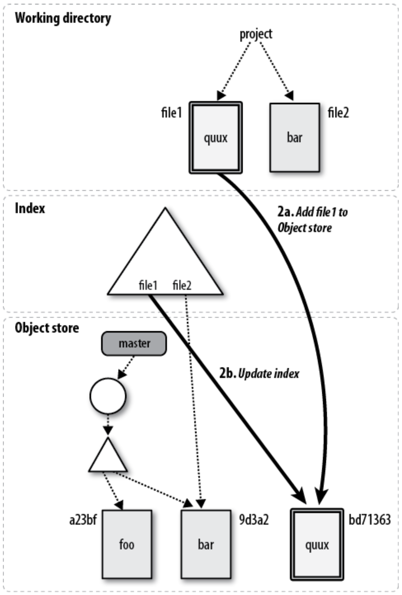

<h1 class='title'>Git</h1>


**Git** is a distributed source code management tool used by developers worldwide. It was invented by Linus Torvalds in 2005 for Linux kernel development and is now the most widely used version control system. Code can be completely local, or it can be kept in a remote repository so that developers can collaborate. Every developer also has a full copy of the code. Git is the current standard for version control software. It completely changed how developers do their job, allowing them greater control over their code, and the ability to roll back changes precisely if needed.

Start a local git repository by running:

- `git init <dirname>`:
  - Turns a directory into a Git repository
  - Creates a hidden direcotry called _.git_ where Git store all
  its revision information or metadata with each commit including
  log message and author of the change
- `git add <filename>`: add a file to the reposiroty
- `git add  .` : Git adds all the files in a direcotry and all subdirecotries

- `git add -p`: begin an interactive staging session that lets you choose portions of a file to add to the next commit. This will present you with a chunk of changes and prompt you for a command. Use y to stage the chunk, n to ignore the chunk, s to split it into smaller chunks, e to manually edit the chunk, and q to exit

- At a bare minimum, Git must know your name and email address. You may specify your identity on every commit using the following commands:
  - `git config user.name "Jon Loeliger"`
  - `git config user.email "jdl@example.com"`

- `git commit <filename> <options>`:  useful when you want to commits new changes when the file is already added to the repository using `git add`. Using a generic git commit without naming the file would not have worked in this case
- `git status`: shows the status of changes in the repository
- `git rm -f <filename>`: forcefully removes the staged file from both the index and the working directory. Flag -f can be dropped if file is not staged yet
- `git rm --cached <filename>`: removes the file from the index but leaves it in the working directory and untracked
- `git mv stuff newstuff`: Git removes the pathname `stuff` from the index, adds the new pathname `newstuff`, keeps the original content for stuff in the object store, and reassociates that content with the pathname `newstuff`
- `git clone <repository_name> <new_repository_name>`: makes a copy of a repository.
The new Git repositories now contain exactly the same objects, files, and directories. You are able to modify the cloned version, make new commits, inspect its logs and history, and so on. It is a complete repository with full history

- `git stash`: temporarily shelves (or stashes) changes you've made to your working copy so you can work on something else, and then come back and re-apply them later on. Stashing is handy if you need to quickly switch context and work on something else

- `git submodule add <url_of_repository>`: repository inside a repository; It often happens that while working on one project, you need to use another project from within it. For example, `git submodule add https://github.com/chaconinc/DbConnector`. Submodules will add the subproject into a directory named the same as the repository. Although DbConnector is a subdirectory in your working directory, Git sees it as a submodule and doesn’t track its contents when you’re not in that directory. Instead, Git sees it as a particular commit from that repository. Now stage and commit the submodule to your repository. When cloning, you need to run: `git submodule init` and `git submodule update` to download the submodules as well. Also when we want to make a separate repository out of a change we make a submodule.  

## Configuration Files

- `.git/config`: repository-specific configuration settings manipulated with the `--file` option or by default. These settings have the highest precedence
- `~/.gitconfig`: user-specific configuration settings manipulated with the `--global` option
- `/etc/gitconfig`: system-wide configuration settings manipulated with the `--system` option if you have proper Unix file write permissions on it

- Author name and email address that will be used on all the commits you make for all of your repositories, configure values for `user.name` and `user.email` in your `$HOME/.gitconfig` file using git config `--global`:
  - `git config --global user.name "Jon Loeliger"`
  - `git config --global user.email "jdl@example.com"`
  - To set a repository-specific name and email address that would override a
`--global` setting, simply omit the `--global` flag

- If there is a common but complex Git command that you type frequently, consider setting up a simple Git alias for it:
  - `git config --global alias.show-graph 'log --graph --abbrev-commit --pretty=oneline'`
  - I’ve made up the show-graph alias and made it available for use in any repository I make

----------------------------------
## Basic Git Concepts

- Within a repository, Git maintains two primary data structures, the **object store** and the **index**. All of this repository data is stored at the root of your working directory in a hidden subdirectory named `.git`
- Git places only four types of objects in the **object store**:
  - _blobs_: A blob holds a file’s data but does not contain any metadata about the file or even its name
  - _trees_: Represents one level of directory information. It records blob identifiers, path names, and a bit of metadata for all the files in one directory
  - _commits_: A commit object holds metadata for each change introduced into the repository, including the author, committer, commit date, and log message
  - _tags_: Assigns an arbitrary yet presumably human readable name to a specific object, usually a commit
  
- Each object in the object store has a unique name produced by applying SHA1 to the contents of the object, yielding an SHA1 hash value which is unique to that content
- Any tiny change to a file causes the SHA1 hash to change, causing the new version of the file to be indexed separately

- The **index** is a temporary and dynamic binary file that describes the directory structure of the entire repository
  - You execute Git commands to stage changes in the index. Changes usually add, delete, or edit some file or set of files. The index records and retains those changes, keeping them safe until you are ready to commit them. You can also remove or replace changes in the index

### Pathname Versus Content

- Git’s object store is based on the hashed computation of the contents of its objects, not on the file or directory names from the user’s original file layout. Thus, when Git places a file into the object store, it does so based on the hash of the data and not on the name of the file
- If two separate files have exactly the same content, whether in the same or different directories, Git stores a single copy of that content as a blob within the object store. Git computes the hash code of each file according solely to its content.
- Git does not really care about the file names. Git merely records each pathname and makes sure it can accurately reproduce the files and directories from its content, which is indexed by a hash value
- Git’s internal database efficiently stores every version of every file—not their differences—as files go from one revision to the next. Because Git uses the hash of a file’s complete content as the name for that file, it must operate on each complete copy of the file
- Git computes the history as a set of changes between different blobs with varying hashes, rather than storing a file name and set of differences directly
  <p align="center">
  
  </p>

### Pack Files: Git's more efficient storage mechanism

- To create a packed file, Git first locates files whose content is very similar and stores the complete content for one of them. It then computes the differences, or deltas, between similar files and stores just the differences
- Git is able to construct a series of deltas from one version of a file to a second, to a third, etc

- Git also maintains the knowledge of the original blob SHA1 for each complete file (either the complete content or as a reconstruction after deltas are applied) within the packed representation

### Object Store Pictures

- The blob object is at the “bottom” of the data structure; it references nothing and is
referenced only by tree objects
- A commit points to one particular tree that is introduced into the repository by the commit
- Each tag can point to, at most, one commit
- The branch plays a crucial role in naming commits. Each branch is pictured as a rounded rectangle

This diagram shows the state of a repository after a single, initial commit added two files. Both files are in the top-level directory. Both the master branch and a tag named V1.0 point to the commit with ID 1492.

<p align="center">

</p>

Let’s leave the original two files as is, adding a new subdirectory with one file in it. The resulting object store looks like

<p align="center">

</p>

- The new commit has added one associated tree object to represent the total state of directory and file structure. In this case, it is the tree object with ID cafed00d. Because the top-level directory is changed by the addition of the new subdirectory, the content of the top-level tree object has changed as well, so Git introduces a new tree, cafed00d

- Pay attention to the direction of the arrows between commits. The parent commit or commits come earlier in time. Therefore, in Git’s implementation, each commit points back to its parent or parents.

### Objects, Hashes, and Blobs

- Suppose you create a file hello.txt in the repository containing string "Hello World". Git performs a few operations on this blob (content of the file), calculates its SHA1 hash, and enters it into the object store as a file named after the hexadecimal representation of the hash.

- The hash in this case is 3b18e512dba79e4c8300dd08aeb37f8e728b8dad. The 160 bits of an SHA1 hash correspond to 20 bytes, which takes 40 bytes of hexadecimal to display, so the content is stored as .git/objects/3b/18e512dba79e4c8300dd08aeb37f8e728b8dad. Git inserts a / after the first two digits to improve filesystem efficiency

- Now you can use the hash to pull it back out of the object store any time you want to see its content:

  ```sh
  git cat-file -p 3b18e512dba79e4c8300dd08aeb37f8e728b8dad
  hello world
  ```

- What happens to the filename? Git tracks the pathnames of files through another kind of object called a tree

- When you use `git add`, Git updates the index. The index is found in `.git/index` and keeps track of file pathnames and corresponding blobs. Each time you run commands such as git add, git rm, or git mv, Git updates the index with the new pathname and blob information

- `git ls-files -s`: lists all the files in the index
- `git cat-file -p <commit>`: shows tree, parent and more info about the object name "3ede462"

### File Management and the Index

- Git’s index doesn’t contain any file content; it simply tracks what you want to commit. When you run `git commit`, Git checks the index rather than your working directory to discover what to commit

- File Classifications in Git: Tracked, Ignored, Untracked
- Editors and build environments often leave temporary or transient files among your source code. Such files usually shouldn’t be tracked as source files in a repository. To
have Git ignore a file within a directory, simply add that file’s name to the special file `.gitignore`. It is managed just like any other normal file within your repository. Until `.gitignore` is added so index is updated (`git add .gitignore`), Git considers it untracked
- `.gitignore` is treated as a regular file within your repository, it is copied during clone operations and applies to all copies of your repository.

### Some Notes on Using `git commit`

- The -a or --all option to git commit causes it to automatically stage all unstaged, tracked file changes—including removals of tracked files from the working copy— before it performs the commit.

- If you run `git commit --all`, Git recursively traverses the entire repository; stages all known, modified files and commits those. In this case, when your editor presents the commit message template, it should indicate that the modified and known file not yet will, in fact, be committed as well

### A Detailed View of Git’s Object Model and Files

Let’s follow a series of four pictures to visualize the progress of a single file named `file1` as it is edited, staged in the index, and finally committed. The working directory contains two files named `file1` and `file2`, with contents “foo” and “bar,” respectively. In addition to `file1` and `file2` in the working directory, the master branch has a commit that records a tree with exactly the same “foo” and “bar,” contents for files `file1` and `file2`. Furthermore, the index records SHA1 values a23bf and 9d3a2 (respectively) for exactly those same file contents. The working directory, the index, and the object store are all synchronized and in agreement.

<p align="center">

</p>

Some interesting changes take place when you use the command `git add file1` to stage the edit of file1:

- Git first takes the version of file1 from the working directory, computes a SHA1 hash ID (bd71363) for its contents, and places that ID in the object store
- Next, Git records in the index that the pathname file1 has been updated to the new bd71363 SHA1. Because the contents of file2 haven’t changed and no git add staged file2, the index continues to reference the original blob object for it.

  <p align="center">
  
  </p>

  At this point, you have staged file1 in the index, and the working directory and index agree. However, the index is considered dirty with respect to HEAD because it differs from the tree recorded in the object store for the HEAD commit of the master branch.

- Finally, after all changes have been staged in the index, a commit applies them to the repository. The effects of git commit are depicted:

<p align="center">

</p>

The commit initiates three steps:

- First, the virtual tree object that is the index gets converted into a real tree object and placed into the object store under its SHA1 name
- Second, a new commit object is created with your log message. The new commit points to the newly created tree object and also to the previous or parent commit
- Third, the master branch ref is moved from the most recent commit to the newly created commit object, becoming the new master HEAD

______________________________________________

## Commits

- When a commit occurs, Git records a snapshot of the index and places that snapshot in the object store. This snapshot does not contain a copy of every file and directory in the index, because such a strategy would require enormous and prohibitive amounts of storage. Instead, Git compares the current state of the index to the previous snapshot and so derives a list of affected files and directories. Git creates new blobs for any file that has changed and new trees for any directory that has changed, and it reuses any blob or tree object that has not changed

- Another way of thinking of a commit is that it is just a diff; an individual change compared to the previous commit. Every commit contains its history which is about the commits that came before it.

- There is a one-to-one correspondence between a set of changes in the repository and a commit: A commit is the only method of introducing changes to a repository, and any change in the repository must be introduced by a commit

- The unique, 40-hexadecimal-digit SHA1 commit ID is an explicit reference, whereas HEAD, which always points to the most recent commit, is an implied reference

- Each commit ID is globally unique, not just for one repository but for any and all repositories. For example, if a developer writes you with reference to a particular commit ID in his repository and if you find the same commit in your repository, then you can be certain that you both have the same commit with the same content

- HEAD always refers to the most recent commit on the current branch. When you change branches, HEAD is updated to refer to the new branch’s latest commit

- The ~ character is useful for making relative references to the parent of a commit. For example, 3157e~1 refers to the commit before 3157e, and HEAD~3 is the great-grandparent of the current commit

- Git makes use of a special graph called a directed acyclic graph (DAG). Git implements the history of commits within a repository as a DAG. In the commit graph, each node is a single commit, and all edges are directed from one descendant node to another parent node, forming an ancestor relationship

### Commit History

- `git log`: acts like `git log HEAD`, printing the log message associated with every commit in your history that is reachable from HEAD in chronological order

- `log AB^C`: displays commits reachable from A and B but not from C. This is to filter out unrelevant commits

- `git log --oneline`: show one line for each commit

- `git log --stat`: show more stats

- `git log -p`: show maximum details

- `git log --author="<pattern>"`

- `git log --grep="<pattern>"`: Search for commits with a commit message that matches <pattern>, which can be a plain string or a regular expression.

- `git log <file_name>`
- `git log --author="John Smith" -p hello.py`: This will display a full diff of all the changes John Smith has made to the file hello.py

- `git log --graph --decorate --oneline`: A few useful options to consider: The `—graph` flag that will draw a text based graph of the commits on the left hand side of the commit messages. `—decorate` adds the names of branches or tags of the commits that are shown. —oneline shows the commit information on a single line making it easier to browse through commits at-a-glance

______________________________________________

# Branches

A branch is the fundamental means of launching a separate line of development within a software project.

A branch is a split from a kind of unified, primal state, allowing development to continue in multiple directions simultaneously and, potentially, to produce different versions of the project.

### Reasons for Using Branches

- A branch often represents an individual customer release. If you want to start version 1.1 of your project but you know that some of your customers want to stick with version 1.0, then keep the old version alive as a separate branch

- A branch can encapsulate a development phase, such as the prototype, beta, stable, or bleeding-edge release. You can think of the version 1.1 release as a separate phase, too; the maintenance release

- A branch can isolate the development of a single feature or research into a particularly complex bug. You can introduce a branch for a well-defined and conceptually isolated task or to facilitate a merge of several branches prior to a release

- The default branch in a repository is named _main_. If you prefer, you can rename or  even delete the main branch

- The most recent commit on a branch is called the tip or head of the branch

- A merge is the complement of a branch. When you merge, the content of one or more branches is joined with an implicit target branch. However, a merge does not eliminate any of the source branches or those branches’ names

- Each of your branch names, as well as the committed content on each branch, is local to your repository. However, when making your repository available to others, you can publish or elect to make one or any number of branches and the associated commits available, too

- The dev branch name points to the head commit, Z. If you wanted to rebuild the repository state at Z, then all the commits reachable from Z back to the original commit, A, are needed. The reachable portion of the graph is highlighted with thick lines and covers every commit except (S, G, H, J, K, L)<br></br>

  <p align="center">
  
  </p>

### Creating Branches

- Git supports an arbitrarily complex branching structure, including branching branches and forking multiple branches from the same commit

- The command which creates a named branch at the given commit:

  ```sh
  git branch <branch_name> <commit>
  ```

  When no starting-commit is specified, the default is the revision committed most recently on the current branch

- `git branch` command lists branch names found in the repository

- `git show-branch` traverses through all the commits on all branches being shown, stopping the listing on the most recent common commit present on all of them

- `git branch -m <old_name> <new_name>`: change branch name

- Your working directory can reflect only one branch at a time. Start working on a different branch, issue the git checkout command: `git checkout <another_branch_name>` switches to another branch, that is, it moves the HEAD pointer to another branch in the tree.

- Your local modifications to NewStuff in your working directory would be overwritten by the version from dev

### Checking out when you have uncommitted changes

- Files and directories in your working directory that are not being tracked are always left alone; Git won’t remove or modify them. However, if you have local modifications to a file that are different from changes that are present on the new branch you are switching to, Git issues an error message such as the following and refuses to check out the target branch

  ```sh
  git checkout dev
  error: Your local changes to the following files would be overwritten by checkout:
  NewStuff
  Please, commit your changes or stash them before you can switch branches.
  Aborting
  ```

  If Git brashly honored the request to check out the dev branch, your local modifications to NewStuff in your working directory (in master branch) would be overwritten by the version from dev. Git detects this potential loss and prevents it from happening. You can stage and commit changes before checking out.

- If specifically requested with the -m option, Git attempts to carry your local change into the new working directory by performing a merge operation between your local modifications and the target branch:

  ```sh
  git checkout -m dev
  M     NewStuff
  Switched to branch "dev"
  ```

  It does not introduce a merge commit on any branch. Although it may look like the merge was performed cleanly and all is well, Git has simply modified the file and left the merge conflict indicators within it. You must still resolve any conflicts that are present

- `git checkout <commit> <file>`:
Check out a previous version of a file (not a branch!). This turns the `file` that resides in the working directory into an exact copy of the one from <commit> and adds it to the staging area. You can now commit this old version of that file. You can get back by doing `git checkout HEAD <file>`. If you omit the file in git checkout commit, the entire dir is updated (downdated?) to match that commit here, your state is preserved and not affected. You can change files when the head is detached (and you are in an old commit), and if you wish to save that work, you can create a new branch for it

### Create/delete new branches

When you want to both create a new branch and simultaneously switch to it, Git provides a shortcut for this with the `-b <new-branch>` option:

```sh
git checkout -b bug/pr-3
```

To delete a branch:

```sh
git branch -d bug/pr-3
```

______________________________________________

# diff

- A diff is a compact summary of the differences (hence the name “diff”) between two items. Unix and Linux diff command compares the files line by line and summarizes the deviations in a diff

- `diff -u <original_file> <new_file>`: -u option produces a unified diff, a standardized format used widely to share modifications

- `git diff <commit>`: This form summarizes the differences between your working directory and the given commit. Simialirly `git diff HEAD` or `git diff commit1 commit2` or `git diff --stat main~5 main`, or `git diff HEAD~1 HEAD` or `git diff <branch1> <branch2>`

- `git diff --cached <commit>`: This command shows the differences between the staged changes in the index and the given commit

- `git diff` doesn’t care about the history of the files it compares or anything about branches; `git log` is extremely conscious of how one file changed to become another—for example, when two branches diverged and what happened on each branch

______________________________________________

# Merges

- A merge unifies two or more commit history branches. Most often, a merge unites just two branches, although Git supports a merge of three, four, or more branches at the same time
  
- When modifications in one branch do not conflict with modifications found in another branch, Git computes a merge result and creates a new commit that represents the new, unified state. But when branches conflict, which occurs whenever changes compete to alter the same line of the same file, Git does not resolve the dispute. Instead, Git marks such contentious changes as “unmerged” in the index and leaves reconciliation up to you, the developer.

- To merge other_branch into branch:

  ```sh
  git checkout branch
  git merge other_branch
  ```

- If decided for some reason that you don’t want to complete a merge, prior to executing the final git commit on the merge commit, use `git reset --hard HEAD`. This command restores both your working directory and the index to the state immediately prior to the git merge command.

- If you want to abort or discard the merge after it has finished (that is, after it’s introduced a new merge commit), use `git reset --hard ORIG_HEAD` to prior to beginning the merge operation, Git saves your original branch HEAD in the ORIG_HEAD ref for just this sort of purpose.

---------------------------

## Merge Strategies

- `git merge` will automatically select a merge strategy unless explicitly specified. The `git merge` and `git pull` commands can be passed an `-s` (strategy) option. The `-s` option can be appended with the name of the desired merge strategy. If not explicitly specified, Git will select the most appropriate merge strategy based on the provided branches. The following is a list of the available merge strategies

- There are two common degenerate scenarios that lead to merges when neither of them actually introduces a new merge commit after performing the `git merge`:
  - _Already up-to-date_: when all the commits from the other branch (its HEAD) are already present in your target branch, even if it has advanced on its own, the target branch is said to be already up-to-date. As a result, no new commits are added to your branch. Very trivial!
  - _Fast-forward_: when your branch HEAD is already fully present and represented in the other branch. This is the inverse of the Already up-to-date case. Because your HEAD is already present in the other branch, Git then just moves your branch HEAD to point to the final, new commit. The fast-forward case is particularly common on tracking branches because they simply fetch and record the remote commits from other repositories.

- The follwoing merge strategies all produce a final commit, added to your current branch, that represents the combined state of the merge:

  - _Resolve_. The resolve strategy locates the obvious common ancestor as the merge basis and performing a direct three-way merge by applying the changes from the merge base to the tip of the other branch HEAD onto the tip of the current branch (3 commits involved to create the merge commit). <br></br>
  <p align="center">
    
    </p>  
  
    Because resolve is no longer Git’s default, if Alice wanted to use it then she would make an explicit request: `git merge -s resolve devel` <br></br>
    <p align="center">
    
    </p>  
  
  - _Recursive_: The recursive strategy is designed to handle the scenario where there is more than one merge base between the two branches. In these cases, Git forms a temporary merge of all of the common merge bases and then uses that as the base from which to derive the resulting merge of the two given branches via a normal three-way merge algorithm. The temporary merge basis is thrown away, and the final merge state is committed on your target branch. Recursive is now the default strategy for git merge.
    - The follwoing image shows a simple criss-cross merge. The nodes a and b are both merge bases for a merge between A and B. Either one could be used as the merge base and yield reasonable results. In this case, the recursive strategy would merge a and b into a temporary merge base, using that as the merge base for A and B. Because a and b could have the same problem, merging them could require another merge of still older commits. That is why this algorithm is called recursive

      <p align="center">
      
      </p>
    Here is another illustration: HEAD of 2 branches have more than one ancestar.
      <p align="center">
      
      </p>

    First merge ancestors using temp commit, then finish the final 3-way merge.

      <p align="center">
      
      </p>

    [Resourse](https://stackoverflow.com/questions/55998614/merge-made-by-recursive-strategy)

  - _Octopus_: Unlike previous strategies, it supports merging multiple branches together all at once
  - _Ours_ and _Subtree_ are other types of merges

  If you want to use a graphical tool to resolve these issues, you can run `git mergetool`, which fires up an appropriate visual merge tool and walks you through the conflicts.

______________________________________________

# Altering Commits: Change History

***NEVER CHANCE COMMITS THAT OTHERS MIGHT HAVE PULLED (PUBLIC COMMITS)***

You should feel free to alter and improve your repository commit history as long as no other developer has obtained a copy of your repository.

You shouldn’t rewrite, alter, or change any part of a branch that’s been made available and might be present in a different repository.  More clealy, leave the published commits alone but you can change unpublished ones as you want.

## Using 'git reset' to change history

The whole point of this command is to establish and recover known states for the HEAD, index, and working directory. So it can overwrite and destroy changes in your working directory.

It has has three main options: --soft, --mixed, and --hard

- `git reset --soft <commit>`: changes the HEAD ref to  point to the given commit. The contents of your index and working directory are left unchanged. It undoes that commit but keep the changes in the staging area. For example:

  ```sh
  git reset --soft HEAD^
  git commit
  ```

  This command moves you back to the prior place in the commit graph but keeps the index exactly the same. Everything is staged just as it was prior to the git reset command. You just get another shot at the commit message.  If you want to totally change the last commit, use `git commit --amend` which is a convenient way to modify the most recent commit by replacing it with a new commit. Again, dont apply these commands on a public commit

  - `git reset –soft HEAD~N && git commit`: squash (or combine) last N commits into a single commit. You might want to combine all N last commits into a single commit to keep commit history less messy

- `git reset --mixed <commit>`: changes HEAD to point to the given commit.
  Your _index contents are also modified_ to align with the tree structure  named by commit, but your working directory contents are left unchanged. It _unstages_ the changes represented by commit, and it tells you what remains modified in your working directory. For example, you can  use this for deleting multpile commits and replace with only one.
  **--mixed is the default mode for `git reset`**

  - After `git reset` you can use `git restore <commit> <filename>` to recover working direcotry to that commit as well. If you want to do both at the same time, use `git reset --hard`

- `git reset --hard <commit>`: This variant changes the HEAD ref to point to  the given commit. The contents of your index are also modified to  agree with the tree structure named by the named commit. Furthermore, your working directory contents are changed to reflect the state of the tree represented by the given commit. When changing your working directory, the complete directory structure is altered to correspond to the given commit. Modifications are lost and new files are removed. Files that are in the given commit but no longer exist in your working directory are reinstated.

- You might want to use `git clean -f` to remove all untracked files from your working directory

## Using 'git cherry-pick'

The command git cherry-pick is typically used to introduce particular commits from one branch within a repository onto a different branch.

- In the follwoing picture the dev branch has normal development, whereas the rel_2.3 contains commits for the maintenance of release 2.3. <br></br>

  <p align="center">
  
  </p>

  During the course of normal development, a bug is fixed on the development line with commit F. If that bug turns out to be present in the 2.3 release also, the bug fix, F, can be made to the rel_2.3 branch using `git cherry-pick`:

  ```sh
  git checkout rel_2.3
  git cherry-pick dev~2      # commit F, above
  ```

  After cherry-pick, the graph resembles as follows:

  <p align="center">
  
  </p>

  Commit F' is substantially similar to commit F, but it is a new commit and will have to be adjusted—perhaps with conflict resolutions—to account for its application to commit Z rather than commit E. None of the commits following F are applied after F'; only the named commit is picked and applied.

- Another common use for cherry-pick is to rebuild a series of commits by selectively picking a batch from one branch and introducing them onto a new branch. Suppose you had a series of commits on your development branch, my_dev, as shown below, and you wanted to introduce them onto the master branch but in a substantially different order.<br></br>

  <p align="center">
    
  </p>

  To apply them on the master branch in the order Y, W, X, Z, you could use the following commands:

  ```sh
  git checkout master
  git cherry-pick my_dev^      #Y
  git cherry-pick my_dev~3   #W
  git cherry-pick my_dev~2   #X
  git cherry-pick my_dev       #Z
  ```

  Afterward, your commit history would look like below: <br></br>

  <p align="center">
    
  </p>

- `git cherry-pick` allowes a range of commits to be selected and reapplied in a single command. For example, the following command:
  
  ```sh
  # on branch master
  $ git cherry-pick X..Z
  ```

  would apply new commits X', Y', and Z' on the master branch. This is particularly handy in porting or moving a large sequence of commits from one line of development to another without necessarily using the entire source branch at one time.

## Using 'git revert'

This command is used to introduce a new commit that reverses the effects of a given commit. A common application for git revert is to “undo” the effects of a commit that is buried, perhaps deeply, in the history of a branch.

For some reason, perhaps through testing, commit
D has been deemed faulty.
<p align="center">
    
  </p>

Simply run git revert:

```sh
git revert master~3      # commit D
```

 <p align="center">
    
  </p>

This is a new commit and might have to be adjusted for conflicts.

If another developer has cloned your repository or fetched some of your commits, there are implications for changing the commit history. In this case, you probably should not use commands that alter history within your repository. Instead, use git revert; do not use `git reset` nor the `git commit --amend`. Use `git invert` to undo the mistake

### Changing the Top Commit

- One of the easiest ways to alter the most recent commit on your current branch is with `git commit --amend`. A frequent use of `git commit --amend` is to fix typos immediately after a commit.

- The command can edit the meta-information on a commit. For example, by specifying --author you can alter the author of the commit

  ```sh
  git commit --amend --author "Bob Miller <kbob@example.com>" 
  ```

- `git commit --amend --no-edit`: amends a commit without changing its commit message. Replaces the tip of the current branch by creating a new commit

- If you amend a commit that other developers have based their work on, it will look like the basis of their work vanished from the project history. This is a confusing situation for developers to be in and it’s complicated to recover from. Again, it is recommended not to use this if your code is published in a public repo.

## Rebasing Commits

- This command is used to move the starting point of a sequence of commits in one branch to a specific commit in another branch as if you'd created your branch from a different commit. Git accomplishes this by creating new commits and applying them to the specified base. It's very important to understand that even though the branch looks the same, it's composed of entirely new commits. The primary reason for rebasing is to maintain a linear project history. This gives the later benefit of a clean merge of your feature branch back into the main branch, so you get a much cleaner project history. Also it eliminates the unnecessary merge commits required by `git merge`. You can follow the tip of feature all the way to the beginning of the project without any forks. This makes it easier to navigate your project with commands like git log, git bisect, and gitk.

- `git rebase` allows you to literally rewrite history — automatically applying commits in your current working branch to the passed branch head. Since your new commits will be replacing the old, it's important to not use git rebase on commits that have been pushed public, or it will appear that your project history disappeared.

This command requires at least the name of the other branch onto which your commits will be relocated. By default, the commits from the current branch that are not already on the other branch are rebased

- A common use for `git rebase` is to keep a series of commits that you are developing up-to-date with respect to another branch, usually a _main_ branch or a tracking branch from another repository. In the follwoing, the _topic_ branch started on the _main_ branch when it was at commit B. In the meantime, it has progressed to commit E.

  <p align="center">
    
  </p>

  You can keep your commit series up-to-date with respect to the main branch by writing the commits so that they are based on commit E rather than B.  

  ```sh
  git checkout topic
  git rebase master
  ```

  <p align="center">
    
  </p>

- The rebase operation relocates commits one at a time from each respective original commit location to a new commit base. As a result, each commit that is moved might have conflicts to resolve. If a conflict is found, the rebase operation suspends its processing temporarily so you can resolve the conflict. The final result is a linear sequence of commits.

- If the rebase operation turns out to be the totally wrong thing to do, `git rebase --abort` abandons the operation and restores the repository to the state prior to issuing the original git rebase.

- If your feature branch was actually as small as a few commits, you would probably be better off rebasing it onto main and doing a fast-forward merge. This prevents superfluous merge commits from cluttering up the project history. While you can use either of these merge strategies, many developers like to use fast-forward merges (facilitated through rebasing) for small features or bug fixes, while reserving 3-way merges for the integration of longer-running features.

### Using 'git rebase -i'

Interactive rebasing gives you the opportunity to alter commits as they are moved to the new branch. This is even more powerful than an automated rebase, since it offers complete control over the branch’s commit history.

This command allows you to interactively reorder the commits, edit, rewrite commit messages, remove, squash multiple commits into one, and split a commit into several using the `-i` or `--interactive` option.  This command allows you to modify the commits that make up a branch and  place them back onto the same branch or onto a different branch. Typically, this is used to clean up a messy history before merging a feature branch into main .

```sh
git checkout feature
git rebase -i main
```

This will open a text editor listing all of the commits that are about to be moved:

```sh
pick 33d5b7a Message for commit #1
pick 9480b3d Message for commit #2
pick 5c67e61 Message for commit #3
```

This listing defines exactly what the branch will look like after the rebase is performed. By changing the pick command and/or re-ordering the entries, you can make the branch’s history look like whatever you want. For example, if the 2nd commit fixes a small problem in the 1st commit, you can condense them into a single commit with the fixup command:

```sh
pick 33d5b7a Message for commit #1
fixup 9480b3d Message for commit #2
pick 5c67e61 Message for commit #3
```

When you save and close the file, Git will perform the rebase according to your instructions, resulting in project history that looks like the following:

<p align="center">
    
  </p>

Once you understand what rebasing is, the most important thing to learn is when not to do it. The golden rule of git rebase is to never use it on public branches (the branches being changed by others, such as main branch as other developers are working on it). For example, think about what would happen if you rebased main onto your feature branch (as opposed to rebasing feature brach onto main which we did before):

<p align="center">
    
  </p>

The rebase moves all of the commits in main onto the tip of feature. The problem is that this only happened in your repository. All of the other developers are still working with the original main. Since rebasing results in brand new commits, Git will think that your main branch’s history has diverged from everybody else’s. The only way to synchronize the two main branches is to merge them back together, resulting in an extra merge commit and two sets of commits that contain the same changes (the original ones, and the ones from your rebased branch). Needless to say, this is a very confusing situation.

Another example is when you push a feature branch to a remote repo and then rebase it on your local machine. Now the old commits after rebase get new hash id, so they are not recognized as the same commits as the old same ones on the remote branch. When you try to push, then git will be confused and can not identify that the commits are actually the same. This is even worse when other ppl have already pulled those commits from the remote. This might overwrite some commits or lead to lose of work for the team. Of course, this doesn’t happen when you use `git merge` since it doesn’t touch history of commits.

[Watch](https://www.youtube.com/watch?v=DkWDHzmMvyg&t=7s)

So, before you run git rebase, always ask yourself, “Is anyone else looking at this branch?” Or “if this branch is already push in remote so possibly somebody might have changed something already?”If the answer is yes, take your hands off the keyboard and start thinking about a non-destructive way to make your changes (e.g., the git revert command). Otherwise, you’re safe to re-write history as much as you like.
Note that when rebasing your feature branch, you might still get some conflicts if some changes on the main branch conflict with your changes in the feature branch. In this case, you need to resolve the conflict just like you do with merging.

[Reference](https://git-scm.com/book/en/v2/Git-Branching-Rebasing)

-----------------------------------

# Remote Repositories

It’s time to explore the much lauded distributed features of Git and learn how to collaborate with other developers via shared repositories.

- A _clone_ is a copy of a repository. A clone allows each developer to work locally and independently without centralization, polls, or locks. Ultimately, it’s cloning that allows Git to easily scale and permit many geographically separated contributors

- A _remote_ is a reference, or handle for connection to another repository through a filesystem (on the same machine) or network path through a Git URL. Once a remote is established, Git can transfer data from one repository to another using either a _push_ or a _pull_ model

- Use the `git remote` command to create, remove, manipulate, and view a remote. All the remotes you introduce are recorded in the `.git/config` file and can be manipulated using `git config`

- `git remote -v` lists all remote repos your local repo is connected to, along with the URLs associated

- `git remote add origin <URL>` connects a remote repo named `origin` to your your local
- `git remote rm <name>` removes a remote repo from the list of connected ones
- `git remote rename <name>` renames the remote repo

- `git fetch`: Retrieves objects and their related metadata from a remote repository

- `git pull`: Like git fetch, but also merges changes into a corresponding local branch. `git pull` implies `git fetch` followed by either `git merge` or
`git rebase`. By default, the second step is merge because this is almost always the desired behavior.

- `git push`: Transfers objects and their related metadata to a remote repository

- `git ls-remote`: Shows a list of references held by a given remote (on an upstream server). This command indirectly answers the question “Is an update available?”

- During a clone operation, Git creates a _remote-tracking branch_ in the clone for each branch in the upstream repository. The set of remote-tracking branches is introduced in a new, separate namespace (clear separation between branches made in a repository by you (topic branches)) within the local repository that is specific to the remote being cloned. They are not branches in a remote repository. The local repository
uses its remote-tracking branches to follow or track changes made in the remote repository.

### Referring to Remote Repositories

Git supports several forms of Uniform Resource Locators (URLs) that can be used to name remote repositories.

- The simplest form of Git URL refers to a repository on a local file system, be it a true physical filesystem or a virtual filesystem mounted locally via the Network File System (NFS). There are two permutations:

  ```sh
  /path/to/repo.git
  file:///path/to/repo.git
  ```

  To avoid issues associated with shared repositories, the file:// form is recommended. As a convenience, the .git suffix is not required; both `/tmp/Depot/public_html` and `/tmp/Depot/public_html.git` will work.

- When you have a truly remote repository whose data must be retrieved across a network, use a native protocol URL such as:

  ```sh
  git://example.com/path/to/repo.git
  git://example.com/~user/path/to/repo.git
  ```

  These forms are used by git-daemon to publish repositories for anonymous read. You can both clone and fetch using these URL forms. The clients that use these formats are not authenticated, and no password will be requested.

- For secure, authenticated connections, the Git native protocol can be tunneled over Secure Shell(SSH) connection using the following URL templates:

  ```sh
  ssh://[user@]example.com[:port]/path/to/repo.git
  ssh://[user@]example.com/path/to/repo.git
  ssh://[user@]example.com/~user2/path/to/repo
  ```

- The http:// and https:// URL forms are more important and popular. Notably, most corporate firewalls allow the HTTP port 80 and HTTPS port 443 to remain open while the default Git port 9418 is typically blocked and would require an act of Congress to open it. Furthermore, these URL forms are being favored by popular Git hosting sites like GitHub.

  ```sh
  http://example.com/path/to/repo.git
  https://example.com/path/to/repo.git
  ```

### Make Your Own Origin Remote

So far the repository in your home directory was created
using git init and not via a clone,  lacks an origin. In fact, it has no remote configured at all. A remote is needed if the goal is to perform more development in your initial repository and then push that development to the newly established, authoritative repository. In a sense, you must manually convert your initial repository into a derived clone.

- The command for manipulating remotes is `git remote`. This operation introduces a few new settings in the `.git/config` file:

  ```sh
  git remote add origin /tmp/Depot/public_html
  # Or
  git remote add origin githubrepoaddress
  ```

  This registers a remote destination to which Git can push contents.

  Now, within this repository, the name origin can be used as a shorthand reference for the remote repository. You can update the remote origin using `git remote update remote_name`. Now your repository has two branches, one (main) with the new commit on it, and the other (origin/main) that is tracking the remote repository

- Run `git remote show origin` command to extract all the information about the remote origin

- The command `git remote rm <name>` removes the given remote and all of its associated remote-tracking branches from your local repository

- To remove just one remote-tracking branch from your local repository, use the command `git branch -r -d origin/dev`. You shouldn’t really do this unless the corresponding remote branch really has been removed from the upstream repository. To keep even more in sync with an upstream remote, use the command `git remote update --prune remote` to first get updates from the remote and then prune stale tracking branches all in one step

- To rename a remote and all of its refs, use `git remote rename <old_name> <new_name>`. For example, after this command `git remote rename jon jdl`
any ref like jon/bugfixes will be renamed as jdl bugfixes

- The `git config` command can be used to manipulate the entries in your configuration file directly including several config variables for remotes:

  ```sh
  git config remote.publish.url 'ssh://git.example.org/pub/repo.git'
  ```

- You may clone multiple remotes into your repository:

  ```sh
  # Grab GitHub's repository
  git clone git://github.com/gitster/git.git

  # Grab git.kernel.org's repository
  git remote add korg git://git.kernel.org/pub/scm/git/git.git

  # fetch both
  git remote update
  ```

- If you already have a topic branch that you decide should be associated with an upstream repository’s remote-tracking branch, you can establish the relationship using the --upstream option. Typically, this is done after adding a new remote, like this:

  ```sh
  # Create remote-tracking branch in your reposity
  git remote add upstreamrepo git://git.example.org/upstreamrepo.git
  # Branch mydev already existed.
  # Leave it alone, but associated it with upstreamrepo/dev.
  git branch --set-upstream mydev upstreamrepo/dev
  ```

### Pushing Your Changes

- Any change that you commit is completely local to your repository; it is not yet present in the remote repository. A convenient way to get your commits from your main branch into the origin remote repository is to use the `git push` command: `git push origin main`. Note that you need to set the upstream repository for push command: `git push --set-upstream origin <branch_name>`.

- Git has taken your master branch changes, bundled them up, and sent them to the remote repository named _origin_. Git has also performed one more step here: it has taken those same changes and added them to the _origin/main_ branch in your repository as well. If your remote repository is on a local filesystem, as it is here, then you can easily check by going to the depot directory:

  ```sh
  $ cd /tmp/Depot/public_html.git
  $ git show-branch
  [master] Add a hairy poem.
  ```

- If the remote history has diverged from your history, you need to pull the remote branch first and then merge it into your local repository. After that, try pushing up again

- To perform branch add and delete operations on a remote repository, you need to specify it in a git push command:

  ```sh
  # First create the new branch locally and then push it 
  git checkout -b foo 
  git push origin foo   
  ```

  This will create a new branch foo in remote. `git push origin mystuff:dev` will push the local branch mystuff (source) to the upstream repository and either create or extend a branch named dev (destination).

- To delete a remote branch _foo_ from remote repo, run `git push origin --delete foo` or equivalently `git push origin :foo` (no source maps to destination foo means deletion)

### Adding a new developer

Once you have established an authoritative repository, it’s easy to add a new developer to a project simply by letting him clone the repository and begin working. They can run the following command:

  ```sh
  cd /tmp/bob
  git clone /tmp/Depot/public_html.git
  ```

  Now they have it locally:

  ```sh
  cat .git/config
  git branch -a
  ```

### Getting Repository Updates

- You get the updates from remote repo and refresh your clone of the repository, run `git pull`. If the repository is not specified on the command line, either as a Git URL or indirectly through a remote name, then the default remote origin is used.

- You may want to fetch updates into your repository to inspect them but not necessarily merge immediately. In this case, you can simply perform the fetch, and then perform other operations on the remote-tracking branch such as `git log`, `git diff` etc.. Later, when you are ready (if ever!), you may perform the merge at your convenience using `git merge origin/main`

- `git pull --rebase` will cause Git to rebase (rather than merge) your local-tracking branch onto the remote-tracking branch instead of merging. To make rebase the normal operation for a branch, set the `branch.branch_name.rebase` configuration variable to `true`. If you want more control, use `fetch` and `rebase -i`:

  ```sh
  git checkout main
  git fetch origin main 
  git rebase -i origin main
  ```

  Now you can squash commits, fix messages etc. and then push up to the remote

- When your local commits are not sync with the ones in remote (_ahead_ or _behind_ or both), `git status` usually reports this status. To see which commits you have in main that are not in origin/main, use a command like this:

  ```sh
  git log origin/main..main 
  ```

### Should you merge or rebase when pulling?

The short answer is “Do either as you wish.”. Up to you!

- By using merge, you will potentially incur an additional merge commit at each pull to record the updated changes simultaneously present in each branch. In a sense, this is a true reflection of the two paths of independent development merged together. Conflicts will have to be resolved during the merge. Each sequence of commits on each branch will be based on exactly the commit on which it was originally written. When pushed upstream, any merge commits will continue to be present. Some consider these superfluous merges and would rather not see them cluttering up the history. Others consider these merges a more accurate portrayal of the development history and want to see them retained.

- As a rebase fundamentally changes the notion of when and where a sequence of commits was started to develop, some aspects of the development history will be lost. Specifically, the original commit on which your development was originally based will be changed to be the newly pulled HEAD of the remote-tracking branch. That will make the development appear to happen later (in commit sequence) than it actually did. It’ll just be different and simpler than if the history was merged. Naturally, you will have to resolve conflicts during the rebase operation as needed still. As the changes that are being rebased are still strictly local within your repository and haven’t been published yet, there’s really no reason to fear the “don’t change history” mantra with this rebase.

- I tend to like to see simpler, linear histories. During most of my personal development, I’m usually not too concerned by a slight reordering of my changes with respect to those of my coworker’s that came in on a remote-tracking branch fetch, so I am fond of using the rebase option. If you really want to set up one consistent approach, consider setting config options `branch.autosetupmerge` or `branch.autosetuprebase` to `true`, `false`, or always as desired.

- In the case you choose to abort the merge and reset your main branch to its prior ORIG_HEAD state, use the command `git reset --hard ORIG_HEAD`. Doing so in this example would move master to the prior HEAD value, Y, and change your working directory to match

- If your objective is only to incorporate the latest updates from origin into your repository, then you are finished when your merge is resolved. On the other hand, a simple `git push` can return the unified and merged history from your main branch back to the origin repository

-----------------------------

# GitHub

<p align="center">
    
  </p>

In order to work on a project already exists, you can just fork it first, then clone it to your local machine and start working on it. To fork a public project, you can go to its GitHub project page and select Fork at the top of the page. This fork option is available only while using the web interface. There is no native git command to create a fork. The repo from which you create the fork is referred to as the original upstream repository. Once you fork the original upstream, the forked copy of the repo becomes the origin, and developers with access to the origin can create clones of it on their local machines. After cloning, you can create branches and easily make changes to the code base, like adding features, enhancements, or fixing bugs. But what if you want to contribute your changes back to the original upstream that you do not have right access to from where it was forked? You can submit a pull request for your proposed changes by selecting

## Creating Pull Request

- Forking is the enabling step of creating a personal copy of a project, but the real value for the core project lies in the second action, formally called a _pull request_. Pull requests allow any user with a commit that she feels makes a useful contribution to the project to announce that contribution to the core project owners.

  <p align="center">
    
  </p>

- Once a contributor has finished coding a feature, committed that new code to a well-named branch, and pushed that new branch to a fork, it can be turned into a pull request.

- When the newly pushed branch has been selected from the branch selector drop-down control, the context-sensitive Pull Request button is pressed to initiate the assembly of the pull request announcement. The default behavior of a pull request is to include all of the commits on the current topic branch. However, in cases that call for it, a specific range of commits, as well as the source and target branch, can be manually altered

- With the pull request now created, it is up to the core project owners (or anyone that is a collaborator on this core instance of the project) to review, evaluate, comment on, and potentially merge in these changes in each PR in the queue.

- Part of the concept behind pull requests is turning a typically binary accept/deny operation into a conversation. That conversation happens with comments on pull requests or comments on specific commits. Comments can be made at one of three levels of precision: pull request, commit, or line of code.

- When the solution in the pull request is sufficiently polished and ready to be merged in, typically to the master branch, then the changes are merged ( or use the automatic merge button on the
GitHub which a real Git commit).

## Notifications

A social system like GitHub needs a strong notification mechanism to announce potentially important changes on the projects, organizations, and users that a contributor has elected to watch. Notifications are driven by watches of the previously mentioned three types of items on GitHub. The summary of all notifications that pertain to you are centrally located on a notifications page that is reachable by an icon in the top level navigation.

## GitHub Pages (Git for Websites)

If the wiki page idea sounded attractive, what about having Git-tracked Markdown files as the foundation of a tool for publishing entire websites. GitHub pages based on
Jekyll provide exactly that, and can even be mapped to a Domain Name System (DNS) CNAME record as content for a subdomain or primary domain name.

## Notes

If you are writing to your repository from a remote machine, you can have GitHub to generate a GitHub Personal Access Token (with appripriate permissions for a limited time, usually repo and write permissions for some days) so you can push code back to your repository from the server. When git promps you for a password, use your PAT instead.

Reference:

I. [Version Control with Git, 2nd Edition](https://www.oreilly.com/library/view/version-control-with/9781449345037/)
