<h1 class='title'>Kubernetes</h1>

## From Monolith to Microservices

Most new companies today run their business processes in the cloud. Newer startups and enterprises which realized early enough the direction technology was headed developed their applications for the cloud.
Not all companies were so fortunate. Some built their success decades ago on top of legacy technologies - monolithic applications with all components tightly coupled and almost impossible to separate, a nightmare to manage and deployed on super expensive hardware.

- A monolith has a rather **expensive taste in hardware**. Being a large, single piece of software which continuously grows, it has to run on a single system which has to satisfy its compute, memory, storage, and networking requirements. 
- The hardware of such capacity is not only complex and extremely pricey, but at times challenging to procure. Since the entire monolith application runs as a single process, the **scaling of individual features of the monolith is almost impossible**. It internally supports a hardcoded number of connections and operations. 
- However, scaling the entire application can be achieved by manually deploying a new instance of the monolith on another server, typically behind a load balancing appliance - another pricey solution. During upgrades, patches or migrations of the monolith application **downtime is inevitable and maintenance windows have to be planned** well in advance as disruptions in service are expected to impact clients. 
- While there are third party solutions to minimize downtime to customers by setting up monolith applications in a highly available active/passive configuration, they introduce new challenges for system engineers to keep all systems at the same patch level and may introduce new possible licensing costs.

In contrast,

- Microservices can be deployed individually on separate servers provisioned with fewer resources - only what is required by each service and the host system itself, helping to lower compute resource expenses. 
- Microservices-based architecture is aligned with Event-driven Architecture  and  Service-Oriented Architecture (SOA) principles, where complex applications are composed of small independent processes which communicate with each other through Application Programming Interfaces (APIs) over a network. 
- APIs allow access by other internal services of the same application or external, third-party services and applications.
- Each microservice is developed and written in a modern programming language, selected to be the best suitable for the type of service and its business function. This offers a great deal of flexibility when matching microservices with specific hardware when required, allowing deployments on inexpensive commodity hardware. 
- Although the distributed nature of microservices adds complexity to the architecture, one of the greatest benefits of microservices is scalability. With the overall application becoming modular, each microservice can be scaled individually, either manually or automated through demand-based autoscaling. 
- Seamless upgrades and patching processes are other benefits of microservices architecture. There is virtually no downtime and no service disruption to clients because upgrades are rolled out seamlessly - one service at a time, rather than having to recompile, rebuild and restart an entire monolithic application. 
- As a result, businesses are able to develop and roll-out new features and updates a lot faster, in an agile approach, having separate teams focusing on separate features, thus being more productive and cost-effective.
  

Refactoring features out of monolith is an incremental approach that offers a gradual transition from a legacy monolith to modern microservices architecture and allows for phased migration of application features into the cloud. The refactoring phase slowly transforms the monolith into a cloud-native application which takes full advantage of cloud features, by coding in new programming languages and applying modern architectural patterns. Through refactoring, a legacy monolith application receives a second chance at life - to live on as a modular system adapted to fully integrate with today's fast-paced cloud automation tools and services.

## Container Orchestration
Container images allow us to confine the application code, its runtime, and all of its dependencies in a pre-defined format. The container runtimes like `runC`, `containerd`, or `cri-o` can use pre-packaged images as a source to create and run one or more containers. These runtimes are capable of running containers on a single host, however, in practice, we would like to have a fault-tolerant and scalable solution, achieved by building a single controller/management unit, a collection of multiple hosts connected together. This controller/management unit is generally referred to as a container orchestrator.

Microservices are lightweight applications written in various modern programming languages, with specific dependencies, libraries and environmental requirements. To ensure that an application has everything it needs to run successfully it is packaged together with its dependencies.

Containers encapsulate microservices and their dependencies but do not run them directly. Containers run container images. _A container image bundles the application along with its runtime, libraries, and dependencies, and it represents the source of a container deployed to offer an isolated executable environment for the application_. Containers can be deployed from a specific image on many platforms, such as workstations, Virtual Machines, public cloud, etc.

In Development (Dev) environments, running containers on a single host for development and testing of applications may be a suitable option. However, when migrating to Quality Assurance (QA) and Production (Prod) environments, that is no longer a viable option because the applications and services need to meet specific requirements:
- Fault-tolerance
- On-demand scalability
- Optimal resource usage
- Auto-discovery to automatically discover and communicate with each other
- Accessibility from the outside world
- Seamless updates/rollbacks without any downtime.

Container orchestrators are tools which group systems together to form clusters where containers' deployment and management is automated at scale while meeting the requirements mentioned above. Among some are Amazon Elastic Container Service (AWS ECS), Kubernetes (CNCF project), Azure Container Instances (Microsoft Azure) and Docker Swarm (part of Docker Engine).

Most container orchestrators can:
- Group hosts together while creating a cluster.
- Schedule containers to run on hosts in the cluster based on resources availability.
- Enable containers in a cluster to communicate with each other regardless of the host they are deployed to in the cluster.
- Bind containers and storage resources.
- Group sets of similar containers and bind them to load-balancing constructs to simplify access to containerized applications by creating an interface, a level of abstraction between the containers and the client.
- Manage and optimize resource usage.
- Allow for implementation of policies to secure access to applications running inside containers.

**Kubernetes** is one of the most in-demand container orchestration tools available today.
Most container orchestrators can be deployed on the infrastructure of our choice - on bare metal, Virtual Machines, on-premises, on public and hybrid clouds. Kubernetes, for example, can be deployed on a workstation, with or without an isolation layer such as a local hypervisor or container runtime, inside a company's data center, in the cloud on AWS Elastic Compute Cloud (EC2) instances, Google Compute Engine (GCE) VMs, DigitalOcean Droplets, OpenStack, etc. There are turnkey solutions which allow Kubernetes clusters to be installed, with only a few commands, on top of cloud Infrastructures-as-a-Service, such as GCE, AWS EC2, IBM Cloud, Rancher, VMware Tanzu, and multi-cloud solutions through IBM Cloud Private or StackPointCloud.
Last but not least, there is the managed container orchestration as-a-Service, more specifically the managed Kubernetes as-a-Service solution, offered and hosted by the major cloud providers, such as Amazon Elastic Kubernetes Service (Amazon EKS), Azure Kubernetes Service (AKS), DigitalOcean Kubernetes, Google Kubernetes Engine (GKE), IBM Cloud Kubernetes Service, Oracle Container Engine for Kubernetes, or VMware Tanzu Kubernetes Grid.

# Kubernetes

"Kubernetes is an open-source system for automating deployment, scaling, and management of containerized applications". According to the abstract of Google's Borg paper, published in 2015, "Google's Borg system is a cluster manager that runs hundreds of thousands of jobs, from many thousands of different applications, across a number of clusters each with up to tens of thousands of machines".

For more than a decade, Borg has been Google's secret, running its worldwide containerized workloads in production. Services we use from Google, such as Gmail, Drive, Maps, Docs, etc., are all serviced using Borg. Among the initial authors of Kubernetes were Google employees who have used Borg and developed it in the past. They poured in their valuable knowledge and experience while designing Kubernetes. Several features/objects of Kubernetes that can be traced back to Borg, or to lessons learned from it, are:
- API servers
- Pods
- IP-per-Pod
- Services
- Labels

Kubernetes offers a very rich set of features for container orchestration. Some of its fully supported features are:
- **Automatic bin packing**: Kubernetes automatically schedules containers based on resource needs and constraints, to maximize utilization without sacrificing availability
- **Designed for extensibility**: A Kubernetes cluster can be extended with new custom features without modifying the upstream source code.
- **Self-healing**: Kubernetes automatically replaces and reschedules containers from failed nodes. It terminates and then restarts containers that become unresponsive to health checks, based on existing rules/policy. It also prevents traffic from being routed to unresponsive containers.
- **Horizontal scaling**: With Kubernetes applications are scaled manually or automatically based on CPU or custom metrics utilization.
- **Service discovery and load balancing**: Containers receive IP addresses from Kubernetes, while it assigns a single Domain Name System (DNS) name to a set of containers to aid in load-balancing requests across the containers of the set.
  
Additional fully supported Kubernetes features are:

- **Automated rollouts and rollbacks**: Kubernetes seamlessly rolls out and rolls back application updates and configuration changes, constantly monitoring the application's health to prevent any downtime.
- **Secret and configuration management**: Kubernetes manages sensitive data and configuration details for an application separately from the container image, in order to avoid a rebuild of the respective image. Secrets consist of sensitive/confidential information passed to the application without revealing the sensitive content to the stack configuration, like on GitHub.
- Storage orchestration: Kubernetes automatically mounts software-defined storage (SDS) solutions to containers from local storage, external cloud providers, distributed storage, or network storage systems.
- Batch execution: Kubernetes supports batch execution, long-running jobs, and replaces failed containers.
- IPv4/IPv6 dual-stack: Kubernetes supports both IPv4 and IPv6 addresses.

There are many additional features currently in alpha or beta phase. They will add great value to any Kubernetes deployment once they become stable features. For example, support for role-based access control (RBAC) is stable only as of the Kubernetes 1.8 release.
Another one of Kubernetes' strengths is portability. It can be deployed in many environments such as local or remote Virtual Machines, bare metal, or in public/private/hybrid/multi-cloud setups. Kubernetes extensibility allows it to support and to be supported by many 3rd party open source tools which enhance Kubernetes' capabilities and provide a feature-rich experience to its users. It's architecture is modular and pluggable. Not only does it orchestrate modular, decoupled microservices type applications, but also its architecture follows decoupled microservices patterns. _Kubernetes' functionality can be extended by writing custom resources, operators, custom APIs, scheduling rules or plugins_.

## Kubernetes Architecture

At a very high level, Kubernetes is a cluster of compute systems categorized by their distinct roles:
- One or more control plane nodes
- One or more worker nodes (optional, but recommended).

<p align="center">
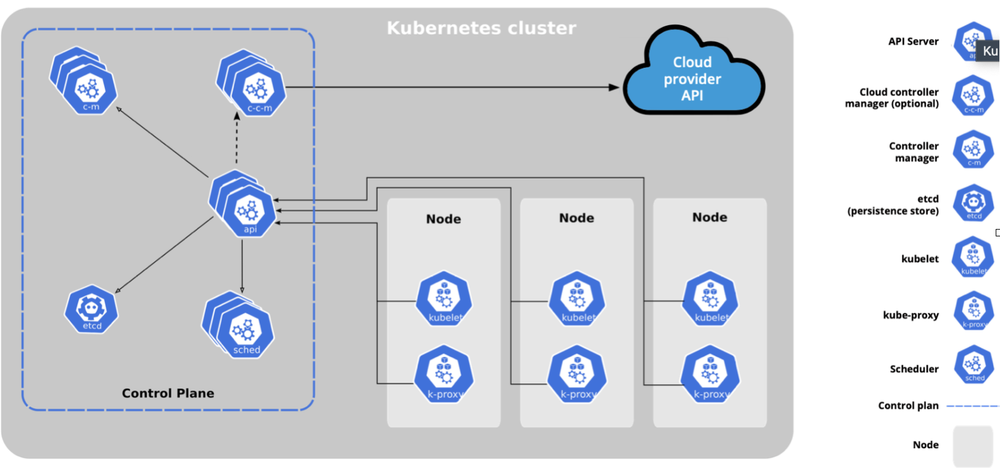
</p>

### Control Plane

- The control plane node provides a running environment for the control plane agents responsible for managing the state of a Kubernetes cluster, and it is the brain behind all operations inside the cluster. 

- In order to communicate with the Kubernetes cluster, users send requests to the control plane via a Command Line Interface (CLI) tool, a Web User-Interface (Web UI) Dashboard, or an Application Programming Interface (API)
 
- It is important to keep the control plane running at all costs. Losing the control plane may introduce downtime, causing service disruption to clients, with possible loss of business. 

- To ensure the control plane's fault tolerance, control plane node replicas can be added to the cluster, configured in High-Availability (HA) mode. While only one of the control plane nodes is dedicated to actively managing the cluster, the control plane components stay in sync across the control plane node replicas. This type of configuration adds resiliency to the cluster's control plane, should the active control plane node fail.
  
- To persist the Kubernetes cluster's state, all cluster configuration data is saved to a distributed key-value store which only holds cluster state related data, no client workload generated data. The key-value store may be configured on the control plane node (stacked topology), or on its dedicated host (external topology) to help reduce the chances of data store loss by decoupling it from the other control plane agents. 
    - In the stacked key-value store topology, HA control plane node replicas ensure the key-value store's resiliency as well. However, that is not the case with external key-value store topology, where the dedicated key-value store hosts have to be separately replicated for HA, a configuration that introduces the need for additional hardware, hence additional operational costs.

- A control plane node runs the following essential control plane components and agents:
  1. **API Server**
  2. **Scheduler**
  3. **Controller Managers**
  4. **Key-Value Data Store**
  
    In addition, the control plane node runs: Container Runtime, Node Agent, Proxy, Optional add-ons for cluster-level monitoring and logging.

#### API Server

All the administrative tasks are coordinated by the _kube-apiserver_, a central control plane component running on the control plane node. The API Server intercepts RESTful calls from users, administrators, developers, operators and external agents, then validates and processes them. During processing the API Server reads the Kubernetes cluster's current state from the key-value store, and after a call's execution, the resulting state of the Kubernetes cluster is saved in the key-value store for persistence. The API Server is the only control plane component to talk to the key-value store, both to read from and to save Kubernetes cluster state information - acting as a middle interface for any other control plane agent inquiring about the cluster's state.

#### Scheduler
A scheduler watches for newly created Pods that have no Node assigned. For every Pod that the scheduler discovers, and becomes responsible for finding the best Node for that Pod to run on. The scheduler reaches this placement decision taking into account the scheduling principles described below.

_kube-scheduler_ is the default scheduler for Kubernetes and is designed so that, if you want and need to, you can write your own scheduling component and use that instead. Kube-scheduler selects an optimal node to run newly created or not yet scheduled (unscheduled) pods. Since containers in pods - and pods themselves - can have different requirements, the scheduler filters out any nodes that don't meet a Pod's specific scheduling needs. 

In a cluster, Nodes that meet the scheduling requirements for a Pod are called feasible nodes. If none of the nodes are suitable, the pod remains unscheduled until the scheduler is able to place it.

The scheduler runs a set of functions to score the feasible Nodes and picks a Node with the highest score to run the Pod. The scheduler then notifies the API server about this decision in a process called binding.

Factors that need to be taken into account for scheduling decisions include individual and collective resource requirements, hardware, software, policy constraints, affinity and anti-affinity specifications, data locality, inter-workload interference, and so on.


#### Controller Managers

The controller managers are components of the control plane node running controllers or operator processes to regulate the state of the Kubernetes cluster. Controllers are watch-loop processes continuously running and comparing the cluster's desired state (provided by objects' configuration data) with its current state (obtained from the key-value store via the API Server). In case of a mismatch, corrective action is taken in the cluster until its current state matches the desired state.

The _kube-controller-manager_ runs controllers or operators responsible to act when nodes become unavailable, to ensure container pod counts are as expected, to create endpoints, service accounts, and API access tokens.

The _cloud-controller-manager_ runs controllers or operators responsible to interact with the underlying infrastructure of a cloud provider when nodes become unavailable, to manage storage volumes when provided by a cloud service, and to manage load balancing and routing.

#### Key-Value Data Store

**`etcd`** is an open source project under the Cloud Native Computing Foundation (CNCF). `etcd` is a 
- Strongly consistent, 
- Distributed key-value data store used to persist a Kubernetes cluster's state.
- New data is written to the data store only by appending to it, data is never replaced in the data store. Obsolete data is compacted (or shredded) periodically to minimize the size of the data store. 
- Out of all the control plane components, only the API Server is able to communicate with the etcd data store. 
- In Kubernetes, besides storing the cluster state, etcd is also used to store configuration details such as subnets, ConfigMaps, Secrets, etc.

### Data Plane 
A **worker node** provides a running environment for client applications. These applications are microservices running as application containers. In Kubernetes the application containers are encapsulated in Pods, controlled by the cluster control plane agents running on the control plane node. Pods are scheduled on worker nodes, where they find required compute, memory and storage resources to run, and networking to talk to each other and the outside world. 

A **Pod** is the smallest scheduling work unit in Kubernetes. It is a logical collection of one or more containers scheduled together, and the collection can be started, stopped, or rescheduled as a single unit of work. Also, in a multi-worker Kubernetes cluster, the network traffic between client users and the containerized applications deployed in Pods is handled directly by the worker nodes, and is not routed through the control plane node.

A worker node has the following components:
- Container Runtime
- Node Agent - kubelet
- Proxy - kube-proxy
- Add-ons for DNS, Dashboard user interface, cluster-level monitoring and logging
  

#### Container Runtime
Although Kubernetes is described as a "container orchestration engine", it lacks the capability to directly handle and run containers. In order to manage a container's lifecycle, Kubernetes requires a container runtime on the node where a Pod and its containers are to be scheduled. Runtimes are required on all nodes of a Kubernetes cluster, both control plane and worker. 

Kubernetes supports several container runtimes:
- CRI-O: A lightweight container runtime for Kubernetes, supporting quay.io and Docker Hub image registries
- containerd: A simple, robust, and portable container runtime
- Docker Engine: A popular and complex container platform which uses containerd as a container runtime
- Mirantis Container Runtime

- Formerly known as the Docker Enterprise Edition.

#### Node Agent - kubelet
The kubelet is an agent running on each node, control plane and workers, and communicates with the control plane. It receives Pod definitions, primarily from the API Server, and interacts with the container runtime on the node to run containers associated with the Pod. It also monitors the health and resources of Pods running containers.

The kubelet connects to container runtimes through a plugin based interface, the Container Runtime Interface (CRI). The CRI consists of protocol buffers, gRPC API, libraries, and additional specifications and tools. 

<p align="center">
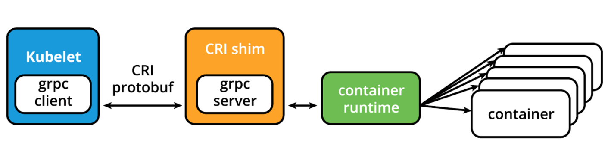
</p>

In order to connect to interchangeable container runtimes, kubelet uses a CRI shim, an application which provides a clear abstraction layer between kubelet and the container runtime. 

#### Proxy-Kube-proxy
The kube-proxy is the network agent which runs on each node, control plane and workers, responsible for dynamic updates and maintenance of all networking rules on the node. It abstracts the details of Pods networking and forwards connection requests to the containers in the Pods. The kube-proxy is responsible for TCP, UDP, and SCTP stream forwarding or random forwarding across a set of Pod backends of an application, and it implements forwarding rules defined by users through Service API objects.

#### Add-ons
Add-ons are cluster features and functionality not yet available in Kubernetes, therefore implemented through 3rd-party pods and services.

- DNS: Cluster DNS is a DNS server required to assign DNS records to Kubernetes objects and resources
- Dashboard: A general purpose web-based user interface for cluster management
- Monitoring: Collects cluster-level container metrics and saves them to a central data store
- Logging: Collects cluster-level container logs and saves them to a central log store for analysis

### Networking Challenges
Decoupled microservices based applications rely heavily on networking in order to mimic the tight-coupling once available in the monolithic era. Networking, in general, is not the easiest to understand and implement. Kubernetes is no exception - as a containerized microservices orchestrator it needs to address a few distinct networking challenges:
- **Container-to-Container** communication inside Pods
- **Pod-to-Pod** communication on the same node and across cluster nodes
- **Service-to-Pod** communication within the same namespace and across cluster namespaces
- **External-to-Service** communication for clients to access applications in a cluster
  
All these networking challenges must be addressed before deploying a Kubernetes cluster.

When a grouping of containers defined by a Pod is started, a special infrastructure **Pause Container** is initialized by the Container Runtime for the sole purpose of creating a network namespace for the Pod. All additional containers, created through user requests, running inside the Pod will share the pause container's network namespace so that they can all talk to each other via localhost. 

In a Kubernetes cluster Pods, groups of containers, are scheduled on nodes in a nearly unpredictable fashion. Regardless of their host node, Pods are expected to be able to communicate with all other Pods in the cluster, all this _without the implementation of Network Address Translation (NAT)_. This is a fundamental requirement of any networking implementation in Kubernetes. 

The Kubernetes network model aims to reduce complexity, and it treats Pods as VMs on a network, where each VM is equipped with a network interface - thus _each Pod receiving a unique IP address_. This model is called **IP-per-Pod** and ensures Pod-to-Pod communication, just as VMs are able to communicate with each other on the same network.

Let's not forget about containers though. They share the Pod's network namespace and must coordinate ports assignment inside the Pod just as applications would on a VM, all while being able to communicate with each other on **localhost** - inside the Pod. However, containers are integrated with the overall Kubernetes networking model through the use of the Container Network Interface (CNI) supported by CNI plugins. CNI is a set of specifications and libraries which allow plugins to configure the networking for containers. While there are a few core plugins, most CNI plugins are 3rd-party Software Defined Networking (SDN) solutions implementing the Kubernetes networking model. In addition to addressing the fundamental requirement of the networking model, some networking solutions offer support for Network Policies. **Flannel**, **Weave**, **Calico** are only a few of the SDN solutions available for Kubernetes clusters.

A successfully deployed containerized application running in Pods inside a Kubernetes cluster may require accessibility from the outside world. Kubernetes enables external accessibility through **Services**, complex encapsulations of network routing rule definitions stored in **iptables** on cluster nodes and implemented by **kube-proxy** agents. By exposing services to the external world with the aid of kube-proxy, applications become accessible from outside the cluster over a virtual IP address and a dedicated port number.

### kubeadm
**kubeadm** is a first-class citizen of the Kubernetes ecosystem. It is a secure and recommended method to bootstrap a multi-node production ready Highly Available Kubernetes cluster, on-premises or in the cloud. kubeadm can also bootstrap a single-node cluster for learning. It has a set of building blocks to set up the cluster, but it is easily extendable to add more features. Please note that kubeadm does not support the provisioning of hosts - they should be provisioned separately with a tool of our choice.

#### kubectl 
**kubectl** allows us to manage local Kubernetes clusters, or remote clusters deployed in the cloud. To access the Kubernetes cluster, the kubectl client needs the control plane node endpoint and appropriate credentials to be able to securely interact with the API Server running on the control plane node. 

When not using the kubectl proxy, we need to authenticate to the API Server when sending API requests. We can **authenticate** by providing a **Bearer Token** when issuing a curl command, or by providing a set of keys and certificates. A Bearer Token is an access token that can be generated by the authentication server (the API Server on the control plane node) at the client's request. Using that token, the client can securely communicate with the Kubernetes API Server without providing additional authentication details, and then, access resources. The token may need to be provided again for subsequent resource access requests. 

#### Namespaces
If multiple users and teams use the same Kubernetes cluster we can partition the cluster into virtual sub-clusters using **Namespaces**. The names of the resources/objects created inside a Namespace are unique, but not across Namespaces in the cluster. Generally, Kubernetes creates four Namespaces out of the box: kube-system, kube-public, kube-node-lease, and default. 
- The kube-system Namespace contains the objects created by the Kubernetes system, mostly the control plane agents. 
- The default Namespace contains the objects and resources created by administrators and developers, and objects are assigned to it by default unless another Namespace name is provided by the user. 
- kube-public is a special Namespace, which is unsecured and readable by anyone, used for special purposes such as exposing public (non-sensitive) information about the cluster. 
- The newest Namespace is kube-node-lease which holds node lease objects used for node heartbeat data. 
  
Good practice, however, is to create additional Namespaces, as desired, to virtualize the cluster and isolate users, developer teams, applications, or tiers.

### Pods

A **Pod** is the smallest Kubernetes workload object. It is the unit of deployment in Kubernetes, which represents a single instance of the application. A Pod is a logical collection of one or more containers, enclosing and isolating them to ensure that they:
- Are scheduled together on the same host with the Pod
- Share the same network namespace, meaning that they share a single IP address originally assigned to the Pod
- Have access to mount the same external storage (volumes) and other common dependencies
  
```Yaml
apiVersion: v1
kind: Pod
metadata:  
  name: nginx-pod  
  labels:   
    run: nginx-pod
spec:
  containers:
  - name: nginx   
    image: nginx:1.22.1 
    ports:    
    - containerPort: 80
```

The `apiVersion` field must specify `v1` for the Pod object definition. The second required field is kind specifying the Pod object type. The third required field metadata, holds the object's name and optional `labels` and `annotations`. The fourth required field `spec` marks the beginning of the block defining the desired state of the Pod object - also named the PodSpec. Our Pod creates a single container running the `nginx:1.22.1` image pulled from a container image registry, in this case from Docker Hub. The `containerPort` field specifies the container port to be exposed by Kubernetes resources for inter-application access or external client access - to be explored in the Services chapter. The contents of spec are evaluated for scheduling purposes, then the kubelet of the selected node becomes responsible for running the container image with the help of the container runtime of the node. The Pod's name and labels are used for workload accounting purposes.

### Labels
**Labels** are key-value pairs attached to Kubernetes objects (e.g. Pods, ReplicaSets, Nodes, Namespaces, Persistent Volumes). Labels are used to organize and select a subset of objects, based on the requirements in place. Many objects can have the same Label(s). Labels do not provide uniqueness to objects. Controllers use Labels to logically group together decoupled objects, rather than using objects' names or IDs.
Controllers, or operators, and Services, use label selectors to select a subset of objects. Kubernetes supports two types of Selectors:

- Equality-Based Selectors: allow filtering of objects based on label keys and values. Matching is achieved using the =, == (equals, used interchangeably), or != (not equals) operators. For example, with `env==dev` or `env=dev`, we are selecting the objects where the env label key is set to value dev. 
  
- Set-Based Selectors: allow filtering of objects based on a set of values. We can use `in`, `notin` operators for Label values, and `exist`/`does not exist` operators for Label keys. For example, with `env in (dev,qa)`, we are selecting objects where the env Label is set to either `dev` or `qa`; with `!app` we select objects with no Label key app.


<p align="center">
    
</p>

### Deployment

Generally, we do not deploy a Pod independently, as it would not be able to re-start itself if terminated in error because a Pod misses the much desired self-healing feature that Kubernetes otherwise promises. The recommended method is to use some type of an operator to run and manage Pods. The default recommended controller is the **Deployment** which configures a **ReplicaSet** controller to manage application Pods' lifecycle. A ReplicaSet is, in part, the next-generation ReplicationController, as it implements the replication and self-healing aspects of the ReplicationController. ReplicaSets support both equality- and set-based Selectors, whereas ReplicationControllers only support equality-based Selectors. 

The lifecycle of the application defined by a Pod will be overseen by the ReplicaSet. With the help of the ReplicaSet, we can scale the number of Pods running a specific application container image. Scaling can be accomplished manually or through the use of an autoscaler. Deployments manage the creation, deletion, and updates of Pods. 

A Deployment automatically creates a ReplicaSet, which then creates a Pod. There is no need to manage ReplicaSets and Pods separately, the Deployment will manage them on our behalf.

Deployment objects provide declarative updates to Pods and ReplicaSets. The **DeploymentController** is part of the control plane node's controller manager, and as a controller it also ensures that the current state always matches the desired state of our running containerized application. It allows for seamless application updates and rollbacks, known as the default **RollingUpdate** strategy, through **rollouts** and **rollbacks**, and it directly manages its ReplicaSets for application scaling. It also supports a disruptive, less popular update strategy, known as Recreate.

```Yaml
apiVersion: apps/v1
kind: Deployment
metadata:
  name: nginx-deployment
  labels:
    app: nginx
spec:
  replicas: 3
  selector:
    matchLabels:
      app: nginx
  template:
    metadata:
      labels:
        app: nginx
    spec:
      containers:
      - name: nginx
        image: nginx:1.14.2
        ports:
        - containerPort: 80
  strategy:
   type: RollingUpdate
   rollingUpdate:
     maxUnavailable: 1
```
 
The `apiVersion` field is the first required field, and it specifies the API endpoint on the API server which we want to connect to; it must match an existing version for the object type defined. The second required field is `kind`, specifying the object type - in our case it is Deployment, but it can be Pod, ReplicaSet, Namespace, Service, etc. The third required field `metadata`, holds the object's basic information, such as `name`, `annotations`, `labels`, `namespaces`, etc. Our example shows two `spec` fields (`spec` and `spec.template.spec`). The fourth required field `spec` marks the beginning of the block defining the desired state of the Deployment object. In our example, we are requesting that 3 replicas, that is 3 instances of the Pod, are running at any given time. The Pods are created using the **Pod Template** defined in `spec.template`. A nested object, such as the Pod being part of a Deployment, retains its metadata and spec and loses its own apiVersion and kind - both being replaced by template. In `spec.template.spec`, we define the desired state of the Pod. 

A **`rolling update`** is triggered when we update specific properties of the Pod Template for a deployment. While planned changes such as updating the container image, container port, volumes, and mounts would trigger a new Revision, other operations that are dynamic in nature, like scaling or labeling the deployment, do not trigger a rolling update, thus do not change the Revision number.
Once the rolling update has completed, the Deployment will show both ReplicaSets A and B, where A is scaled to 0 (zero) Pods, and B is scaled to 3 Pods. This is how the Deployment records its prior state configuration settings, as Revisions. Once ReplicaSet B and its 3 Pods versioned 1.21.5 are ready, the Deployment starts actively managing them. However, the Deployment keeps its prior configuration states saved as Revisions which play a key factor in the **rollback** capability of the Deployment - returning to a prior known configuration state (`kubectl rollout undo deployment/nginx-deployment`).

### Service

A containerized application deployed to a Kubernetes cluster may need to reach other such applications, or it may need to be accessible to other applications and possibly clients. This is problematic because the container does not expose its ports to the cluster's network, and it is not discoverable either. The solution would be a simple **port mapping**, as offered by a typical container host. However, due to the complexity of the Kubernetes framework, such a simple port mapping is not that "simple". The solution is much more sophisticated, with the involvement of the kube-proxy node agent, IP tables, routing rules, cluster DNS server, all collectively implementing a micro-load balancing mechanism that exposes a container's port to the cluster's network, even to the outside world if desired. This mechanism is called a **Service**, and it is the recommended method to expose any containerized application to the Kubernetes network. The benefits of the Kubernetes Service becomes more obvious when exposing a multi-replica application, when multiple containers running the same image need to expose the same port. This is where the simple port mapping of a container host would no longer work, but the Service would have no issue implementing such a complex requirement. 


# Authorization

After a successful authentication, users can send the API requests to perform different operations. Here, these API requests get authorized by Kubernetes using various authorization modules that allow or deny the requests.

Some of the API request attributes that are reviewed by Kubernetes include **user**, **group**, **Resource**, **Namespace**, or **API group**, to name a few. Next, these attributes are evaluated against policies. If the evaluation is successful, then the request is allowed, otherwise it is denied. 

### Node
Node authorization is a special-purpose authorization mode which specifically authorizes API requests made by kubelets. It authorizes the kubelet's read operations for services, endpoints, or nodes, and writes operations for nodes, pods, and events.

### Webhook

In Webhook mode, Kubernetes can request authorization decisions to be made by third-party services, which would return true for successful authorization, and false for failure. In order to enable the Webhook authorizer, we need to start the API server with the `--authorization-webhook-config-file=SOME_FILENAME` option, where `SOME_FILENAME` is the configuration of the remote authorization service.

### Role-Based Access Control (RBAC)

In general, with RBAC we regulate the access to resources based on the Roles of individual users.  While creating the Roles, we restrict resource access by specific operations, such as create, get, update, patch, etc. These operations are referred to as verbs that can appear in `kubectl` command for example (`kubectl get pods`, `kubectl patch deployment ...`).

In RBAC, we can create two kinds of Roles:

- **Role**: A Role grants access to resources within a specific Namespace
- **ClusterRole**: A ClusterRole grants the same permissions as Role does, but its scope is cluster-wide

An RBAC Role or ClusterRole contains rules that represent a set of permissions. Permissions are purely additive (there are no "deny" rules).

If you want to define a role within a namespace, use a Role; if you want to define a role cluster-wide, use a ClusterRole. For example, use ClusterRole for 

- cluster-scoped resources (like nodes)
- non-resource endpoints (like /healthz)
- namespaced resources (like Pods), across all namespaces

Example: you can use a ClusterRole to allow a particular user to run `kubectl get pods --all-namespaces`. 

A **RoleBinding** grants the permissions defined in a role to a user or set of users. It holds a list of subjects (users, groups, or service accounts), and a reference to the role being granted. A RoleBinding grants permissions within a specific namespace whereas a **ClusterRoleBinding** grants that access cluster-wide.

Below you will find an example:

```yaml
apiVersion: rbac.authorization.k8s.io/v1
kind: Role
metadata:
  namespace: lfs158
  name: pod-reader
rules:
- apiGroups: [""] # "" indicates the core API group
  resources: ["pods"]
  verbs: ["get", "watch", "list"]
```


The manifest defines a pod-reader role, which has access only to read the Pods of `lfs158` namespace. 

Once the role is created, we can _bind it to users with a RoleBinding object_. There are two kinds of RoleBindings:

- **RoleBinding**: allows us to bind users to the same namespace as a Role. We could also refer to a ClusterRole in RoleBinding, which would grant permissions to Namespace resources defined in the ClusterRole within the RoleBinding’s Namespace.
- **ClusterRoleBinding**: allows us to grant access to resources at a cluster-level and to all Namespaces.
 
 
Below, you will find an example of RoleBinding:

```yaml
apiVersion: rbac.authorization.k8s.io/v1
kind: RoleBinding
metadata:
  name: pod-read-access
  namespace: lfs158
subjects:
- kind: User
  name: bob
  apiGroup: rbac.authorization.k8s.io
roleRef:
  kind: Role
  name: pod-reader
  apiGroup: rbac.authorization.k8s.io
```

The manifest defines a bind between the pod-reader Role and user bob, to restrict the user to only read the Pods of the `lfs158` Namespace.

To enable the RBAC mode, we start the API server with the `--authorization-mode=RBAC` option, allowing us to dynamically configure policies. For more details, please review the [RBAC mode](https://kubernetes.io/docs/reference/access-authn-authz/rbac/).

### Example of User Autherization using RBAC

You can find users or context by running command 
```sh
$ kubectl config view
```

Create lfs158 namespace:
```sh
$ kubectl create namespace lfs158
namespace/lfs158 created
```

Create the rbac directory and cd into it:
```sh
$ mkdir rbac
$ cd rbac/
```

Create a new user bob on your workstation, and set bob's password as well (the system will prompt you to enter the password twice) :

```sh
~/rbac$ sudo useradd -s /bin/bash bob
~/rbac$ sudo passwd bob
```

Create a private key for the new user bob with the `openssl` tool, then create a certificate signing request for bob with the same `openssl` tool:

```sh
~/rbac$ openssl genrsa -out bob.key 2048
Generating RSA private key, 2048 bit long modulus (2 primes)
.................................................+++++
.........................+++++
e is 65537 (0x010001)
~/rbac$ openssl req -new -key bob.key \
  -out bob.csr -subj "/CN=bob/O=learner"
```

Create a YAML definition manifest for a certificate signing request object, and save it with a blank value for the request field: 

```sh
~/rbac$ vim signing-request.yaml
```

```yaml
apiVersion: certificates.k8s.io/v1
kind: CertificateSigningRequest
metadata:
  name: bob-csr
spec:
  groups:
  - system:authenticated
  request: <assign encoded value from next cat command>
  signerName: kubernetes.io/kube-apiserver-client
  usages:
  - digital signature
  - key encipherment
  - client auth
```

View the certificate, encode it in `base64`, and assign it to the request field in the `signing-request.yaml` file:

```sh
~/rbac$ cat bob.csr | base64 | tr -d '\n','%'
LS0tLS1CRUd...1QtLS0tLQo=
```

```sh
~/rbac$ vim signing-request.yaml
```

```yaml
apiVersion: certificates.k8s.io/v1
kind: CertificateSigningRequest
metadata:
  name: bob-csr
spec:
  groups:
  - system:authenticated
  request: LS0tLS1CRUd...1QtLS0tLQo=
  signerName: kubernetes.io/kube-apiserver-client
  usages:
  - digital signature
  - key encipherment
  - client auth
```

Create the certificate signing request object, then list the certificate signing request objects. It shows a pending state:

```sh
~/rbac$ kubectl create -f signing-request.yaml
certificatesigningrequest.certificates.k8s.io/bob-csr created
```

```sh
~/rbac$ kubectl get csr
NAME      AGE   SIGNERNAME                            REQUESTOR       CONDITION
bob-csr   12s   kubernetes.io/kube-apiserver-client   minikube-user   Pending
```

Approve the certificate signing request object, then list the certificate signing request objects again. It shows both approved and issued states:

```sh
~/rbac$ kubectl certificate approve bob-csr
certificatesigningrequest.certificates.k8s.io/bob-csr approved
```

```sh
~/rbac$ kubectl get csr
NAME      AGE   SIGNERNAME                            REQUESTOR       CONDITION
bob-csr   57s   kubernetes.io/kube-apiserver-client   minikube-user   Approved,Issued
```

Extract the approved certificate from the certificate signing request, decode it with base64 and save it as a certificate file. Then view the certificate in the newly created certificate file:

```sh
~/rbac$ kubectl get csr bob-csr \
  -o jsonpath='{.status.certificate}' | \
  base64 -d > bob.crt
```

```sh
~/rbac$ cat bob.crt
-----BEGIN CERTIFICATE-----
MIIDGzCCA...
...
...NOZRRZBVunTjK7A==
-----END CERTIFICATE-----
```

Configure the kubectl client's configuration manifest with user bob's credentials by assigning his key and certificate: 

```sh
~/rbac$ kubectl config set-credentials bob \
  --client-certificate=bob.crt --client-key=bob.key
User "bob" set.
```

Create a new context entry in the kubectl client's configuration manifest for user bob, associated with the `lfs158` namespace in the minikube cluster:

```sh
~/rbac$ kubectl config set-context bob-context \
  --cluster=minikube --namespace=lfs158 --user=bob
Context "bob-context" created.
```

View the contents of the kubectl client's configuration manifest again, observing the new context entry bob-context, and the new user entry bob (the output is redacted for readability):

```sh
~/rbac$ kubectl config view

apiVersion: v1
clusters:
- cluster:
    certificate-authority: /home/student/.minikube/ca.crt
    ...
    server: https://192.168.99.100:8443
  name: minikube
contexts:
- context:
    cluster: minikube
    ...
    user: minikube
  name: minikube
- context:
    cluster: minikube
    namespace: lfs158
    user: bob
  name: bob-context
current-context: minikube
kind: Config
preferences: {}
users:
- name: minikube
  user:
    client-certificate: /home/student/.minikube/profiles/minikube/client.crt
    client-key: /home/student/.minikube/profiles/minikube/client.key
- name: bob
  user:
    client-certificate: /home/student/rbac/bob.crt
    client-key: /home/student/rbac/bob.key
```

While in the default minikube context, create a new deployment in the `lfs158` namespace:

```sh
~/rbac$ kubectl -n lfs158 create deployment nginx --image=nginx:alpine
deployment.apps/nginx created
```

From the new context `bob-context`, try to list pods. The attempt fails because user bob has no permissions configured for the bob-context:

```sh
~/rbac$ kubectl --context=bob-context get pods
Error from server (Forbidden): pods is forbidden: User "bob" cannot list resource "pods" in API group "" in the namespace "lfs158"
```

The following steps will assign a limited set of permissions to user bob in the `bob-context`.
 
Create a YAML configuration manifest for a pod-reader Role object, which allows only get, watch, list actions/verbs in the `lfs158` namespace against pod resources. Then create the role object and list it from the default minikube context, but from the `lfs158` namespace:

```sh
~/rbac$ vim role.yaml

apiVersion: rbac.authorization.k8s.io/v1
kind: Role
metadata:
  name: pod-reader
  namespace: lfs158
rules:
- apiGroups: [""]
  resources: ["pods"]
  verbs: ["get", "watch", "list"]
```

```sh
~/rbac$ kubectl create -f role.yaml
role.rbac.authorization.k8s.io/pod-reader created
```

```sh
~/rbac$ kubectl -n lfs158 get roles
NAME         CREATED AT
pod-reader   2022-04-11T03:47:45Z
```

```sh
~/rbac$ vim rolebinding.yaml

apiVersion: rbac.authorization.k8s.io/v1
kind: RoleBinding
metadata:
  name: pod-read-access
  namespace: lfs158
subjects:
- kind: User
  name: bob
  apiGroup: rbac.authorization.k8s.io
roleRef:
  kind: Role
  name: pod-reader
  apiGroup: rbac.authorization.k8s.io
```

```sh
~/rbac$ kubectl create -f rolebinding.yaml
role.rbac.authorization.k8s.io/pod-read-access created
```
Now bob can list the pods by runing the command `kubectl --context=bob-context get pods` to see the pod `nginx` without getting error.


### ServiceAccount Permissions

A [service account](https://kubernetes.io/docs/concepts/security/service-accounts/) is a type of non-human account that, in Kubernetes, provides a distinct identity in a Kubernetes cluster. Application Pods, system components, and entities inside and outside the cluster can use a specific ServiceAccount's credentials to identify as that ServiceAccount. This identity is useful in various situations, including authenticating to the API server or implementing identity-based security policies.

Service accounts exist as ServiceAccount objects in the API server. Service accounts have the following properties:

- Namespaced: Each service account is bound to a Kubernetes namespace. Every namespace gets a default ServiceAccount upon creation.

- Lightweight: Service accounts exist in the cluster and are defined in the Kubernetes API. You can quickly create service accounts to enable specific tasks.

- Portable: A configuration bundle for a complex containerized workload might include service account definitions for the system's components. The lightweight nature of service accounts and the namespaced identities make the configurations portable.

Service accounts are different from user accounts, which are authenticated human users in the cluster. By default, user accounts don't exist in the Kubernetes API server; instead, the API server treats user identities as opaque data. You can authenticate as a user account using multiple methods. Some Kubernetes distributions might add custom extension APIs to represent user accounts in the API server.

### Use cases for Kubernetes Service Accounts

As a general guideline, you can use service accounts to provide identities in the following scenarios:

- Your Pods need to communicate with the Kubernetes API server, for example in situations such as the following:
    - Providing read-only access to sensitive information stored in Secrets.
    - Granting cross-namespace access, such as allowing a Pod in namespace example to read, list, and watch for Lease objects in the kube-node-lease namespace.
- Your Pods need to communicate with an external service. For example, a workload Pod requires an identity for a commercially available cloud API, and the commercial provider allows configuring a suitable trust relationship
- Authenticating to a private image registry using an imagePullSecret
- An external service needs to communicate with the Kubernetes API server. For example, authenticating to the cluster as part of a CI/CD pipeline.
- You use third-party security software in your cluster that relies on the ServiceAccount identity of different Pods to group those Pods into different contexts.

#### Grant Permissions to Service Accounts

You can use RBAC mechanism to grant the minimum permissions required by each service account. You create a role, which grants access, and then bind the role to your ServiceAccount. RBAC lets you define a minimum set of permissions so that the service account permissions follow the principle of least privilege. Pods that use that service account don't get more permissions than are required to function correctly.

For instructions, refer to [ServiceAccount permissions](https://kubernetes.io/docs/reference/access-authn-authz/rbac/#service-account-permissions).

To assign a ServiceAccount to a Pod, you set the `spec.serviceAccountName` field in the Pod specification. Kubernetes then automatically provides the credentials for that ServiceAccount to the Pod. In v1.22 and later, Kubernetes gets a short-lived, automatically rotating token using the TokenRequest API and mounts the token as a projected volume.

By default, Kubernetes provides the Pod with the credentials for an assigned ServiceAccount, whether that is the default ServiceAccount or a custom ServiceAccount that you specify.

### Admission Control
**Admission controllers** are used to specify granular access control policies, which include allowing privileged containers, checking on resource quota, etc. We force these policies using different admission controllers, like ResourceQuota, DefaultStorageClass, AlwaysPullImages, etc. They come into effect only after API requests are authenticated and authorized.

To use admission controls, we must start the Kubernetes API server with the `--enable-admission-plugins`, which takes a comma-delimited, ordered list of controller names:

`--enable-admission-plugins=NamespaceLifecycle,ResourceQuota,PodSecurity,DefaultStorageClass`

Kubernetes has some admission controllers enabled by default. For more details, please review the [list of admission controllers](https://kubernetes.io/docs/reference/access-authn-authz/admission-controllers/#what-does-each-admission-controller-do).

Kubernetes admission control can also be implemented though custom plugins, for a [dynamic admission control method](https://kubernetes.io/docs/reference/access-authn-authz/extensible-admission-controllers/). These plugins are developed as extensions and run as admission webhooks.


# Services

### Connecting Users or Applications to Pods

To access the application, a user or another application need to connect to the Pods. As Pods 
- are ephemeral in nature, resources like IP addresses allocated to them cannot be static
- could be terminated abruptly or be rescheduled based on existing requirements. 
  
To overcome this situation, Kubernetes provides a higher-level abstraction called Service, which logically groups Pods and defines a policy to access them. This grouping is achieved via Labels and Selectors. Labels and Selectors use a key-value pair format. In the following graphical representation, app is the Label key, frontend and db are Label values for different Pods.

<p align="center">
    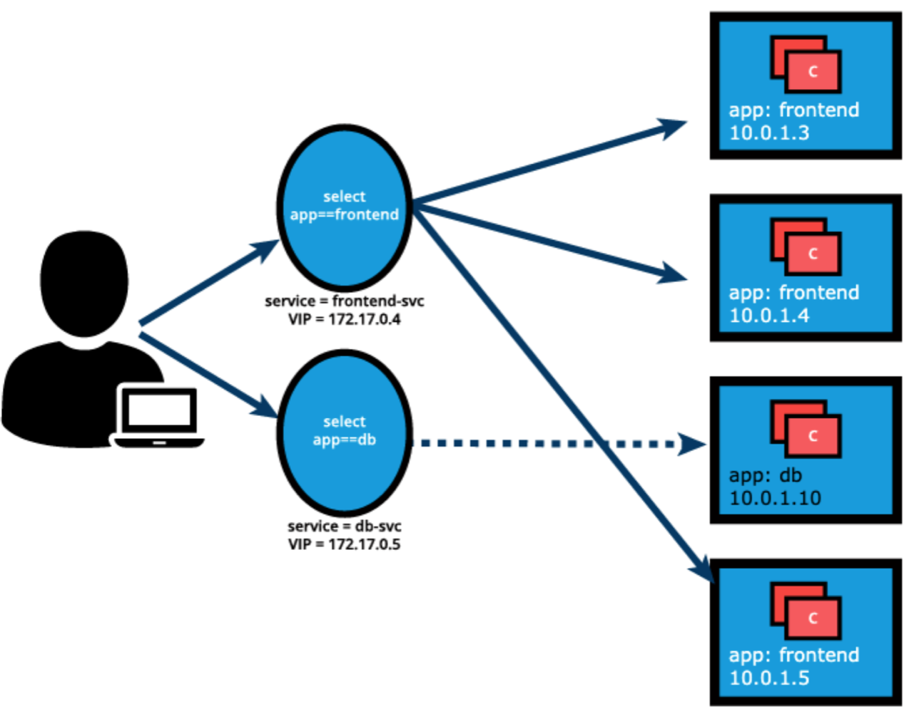
</p>

Services can expose single Pods, ReplicaSets, Deployments, DaemonSets, and StatefulSets. When exposing the Pods managed by an operator, the Service's Selector may use the same label(s) as the operator.

The following is an example of a Service object definition:

```yaml
apiVersion: v1
kind: Service
metadata:
  name: frontend-svc
spec:
  selector:
    app: frontend
  ports:
  - protocol: TCP
    port: 80
    targetPort: 5000
```

In this example, we are creating a `frontend-svc` Service by selecting all the Pods that have the label key=`app` set to value=`frontend`. By default, each Service receives an IP address routable only inside the cluster, known as **ClusterIP**. In our example, we have 172.17.0.4 and 172.17.0.5 as ClusterIPs assigned to our frontend-svc and db-svc Services, respectively. The user/client now connects to a Service via its ClusterIP, which forwards traffic to one of the Pods attached to it. A Service provides **load balancing** by default while selecting the Pods for traffic forwarding.

While the Service forwards traffic to Pods, we can select the targetPort on the Pod which receives the traffic. In our example, the frontend-svc Service receives requests from the user/client on port: 80 and then forwards these requests to one of the attached Pods on the targetPort: 5000. If the targetPort is not defined explicitly, then traffic will be forwarded to Pods on the port on which the Service receives traffic. It is very important to ensure that the value of the targetPort, which is 5000 in this example, matches the value of the containerPort property of the Pod spec section.
 
A logical set of a Pod's IP address, along with the targetPort is referred to as a **Service endpoint**. In our example, the frontend-svc Service has 3 endpoints: `10.0.1.3:5000`, `10.0.1.4:5000`, and `10.0.1.5:5000`. Endpoints are created and managed automatically by the Service, not by the Kubernetes cluster administrator. 

### kube-proxy
Each cluster node runs a daemon called kube-proxy, a node agent that watches the API server on the master node for the addition, updates, and removal of Services and endpoints. kube-proxy is responsible for implementing the Service configuration on behalf of an administrator or developer, in order to enable traffic routing to an exposed application running in Pods. 

In the example below, for each new Service, on each node, kube-proxy configures iptables rules to capture the traffic for its ClusterIP and forwards it to one of the Service's endpoints. Therefore any node can receive the external traffic and then route it internally in the cluster based on the iptables rules. When the Service is removed, kube-proxy removes the corresponding iptables rules on all nodes as well.

<p align="center">
    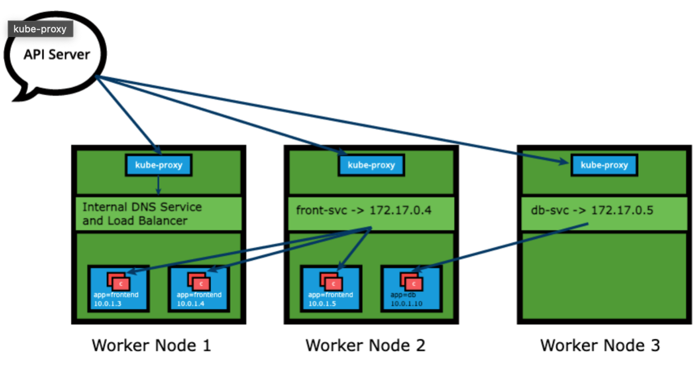
</p>

## Traffic Policies

The kube-proxy node agent together with the iptables implement the load-balancing mechanism of the Service when traffic is being routed to the application Endpoints. Due to restricting characteristics of the iptables this load-balancing is random by default. This means that the Endpoint Pod to receive the request forwarded by the Service will be randomly selected out of many replicas. This mechanism does not guarantee that the selected receiving Pod is the closest or even on the same node as the requester, therefore not the most efficient mechanism. Since this is the iptables supported load-balancing mechanism, if we desire better outcomes, we would need to take advantage of traffic policies. 

Traffic policies allow users to instruct the kube-proxy on the context of the traffic routing. The two options are **Cluster** and **Local**:

- The Cluster option allows kube-proxy to target all ready Endpoints of the Service in the load-balancing process
- The Local option, however, isolates the load-balancing process to only include the Endpoints of the Service located on the same node as the requester Pod. While this sounds like an ideal option, it does have a shortcoming - if the Service does not have a ready Endpoint on the node where the requester Pod is running, the Service will not route the request to Endpoints on other nodes to satisfy the request
 
Both the Cluster and Local options are available for requests generated internally from within the cluster, or externally from applications and clients running outside the cluster.

As Services are the primary mode of communication between containerized applications managed by Kubernetes, it is helpful to be able to discover them at runtime. Kubernetes supports two methods for discovering Services:

- Environment Variables:
  As soon as the Pod starts on any worker node, the kubelet daemon running on that node adds a set of environment variables in the Pod for all active Services. For example, if we have an active Service called redis-master, which exposes port 6379, and its ClusterIP is 172.17.0.6, then, on a newly created Pod, we can see the following environment variables:

    ```sh  
    REDIS_MASTER_SERVICE_HOST=172.17.0.6
    REDIS_MASTER_SERVICE_PORT=6379
    REDIS_MASTER_PORT=tcp://172.17.0.6:6379
    REDIS_MASTER_PORT_6379_TCP=tcp://172.17.0.6:6379
    REDIS_MASTER_PORT_6379_TCP_PROTO=tcp
    REDIS_MASTER_PORT_6379_TCP_PORT=6379
    REDIS_MASTER_PORT_6379_TCP_ADDR=172.17.0.6
    ```

    With this solution, we need to be careful while ordering our Services, as the Pods will not have the environment variables set for Services which are created after the Pods are created. This is not the recommended method to used for service discovery though.

- **DNS**: Kubernetes has an add-on for DNS, which creates a DNS record for each Service and its format is `my-svc.my-namespace.svc.cluster.local`. Services within the same Namespace find other Services just by their names. If we add a Service redis-master in `my-ns` Namespace, all Pods in the same `my-ns` Namespace lookup the Service just by its name, `redis-master`. Pods from other Namespaces, such as `test-ns`, lookup the same Service by adding the respective Namespace as a suffix, such as `redis-master.my-ns` or providing the FQDN of the service as `redis-master.my-ns.svc.cluster.local`.
  
    This is the most common and highly recommended solution. For example, in the previous section's image, we have seen that an internal DNS is configured, which maps our Services `frontend-svc` and `db-svc` to 172.17.0.4 and 172.17.0.5 IP addresses respectively. 

### ServiceType: ClusterIP and NodePort
While defining a Service, we can also choose its access scope. We can decide whether the Service:
- Is only accessible within the cluster
- Is accessible from within the cluster and the external world
- Maps to an entity which resides either inside or outside the cluster.

Access scope is decided by ServiceType property, defined when creating the Service. 

ClusterIP is the default ServiceType. A Service receives a Virtual IP address, known as its ClusterIP. This Virtual IP address is used for communicating with the Service and is accessible only from within the cluster. 

With the NodePort ServiceType, in addition to a ClusterIP, a high-port, dynamically picked from the default range 30000-32767, is mapped to the respective Service, from all the worker nodes. For example, if the mapped NodePort is 32233 for the service `frontend-svc`, then, if we connect to any worker node on port 32233, the node would redirect all the traffic to the assigned ClusterIP - 172.17.0.4. If we prefer a specific high-port number instead, then we can assign that high-port number to the NodePort from the default range when creating the Service. 

<p align="center">
    
</p>

The NodePort ServiceType is useful when we want to make our Services accessible from the external world. The end-user connects to any worker node on the specified high-port, which proxies the request internally to the ClusterIP of the Service, then the request is forwarded to the applications running inside the cluster. Let's not forget that the Service is load balancing such requests, and only forwards the request to one of the Pods running the desired application. 

```yaml
apiVersion: v1
kind: Service
metadata:
  name: web-service
  labels:
    app: nginx
spec:
  type: NodePort
  ports:
  - port: 80
    protocol: TCP
  selector:
    app: nginx 
```

To manage access to multiple application Services from the external world, administrators can configure a reverse proxy - an ingress, and define rules that target specific Services within the cluster.


### ServiceType: LoadBalancer
With the [LoadBalancer ServiceType](https://kubernetes.io/docs/concepts/services-networking/service/#loadbalancer) NodePort and ClusterIP are automatically created, and the external load balancer will route to them. The Service is exposed at a static port on each worker node. The Service is exposed externally using the underlying cloud provider's load balancer feature.

<p align="center">
    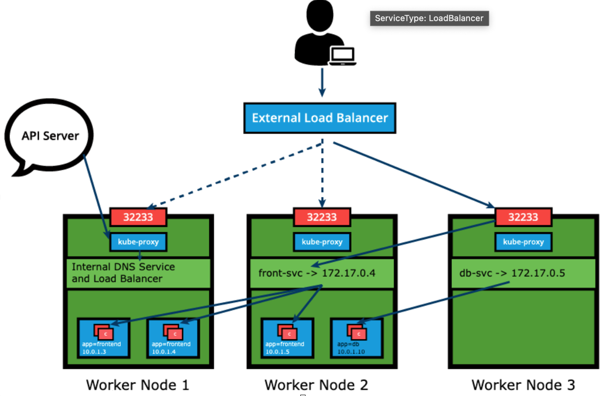
</p>

NOTE: The LoadBalancer ServiceType will only work if the underlying infrastructure supports the automatic creation of Load Balancers and have the respective support in Kubernetes, as is the case with the Google Cloud Platform and AWS. If no such feature is configured, the LoadBalancer IP address field is not populated, it remains in Pending state, but the Service will still work as a typical NodePort type Service.


## Liveness and Readiness Probes
While containerized applications are scheduled to run in pods on nodes across our cluster, at times the applications may become unresponsive or may be delayed during startup. Implementing [Liveness and Readiness Probes](https://kubernetes.io/docs/tasks/configure-pod-container/configure-liveness-readiness-startup-probes/) allows the kubelet to control the health of the application running inside a Pod's container and force a container restart of an unresponsive application. When defining both Readiness and Liveness Probes, it is recommended to allow enough time for the Readiness Probe to possibly fail a few times before a pass, and only then check the Liveness Probe. If Readiness and Liveness Probes overlap there may be a risk that the container never reaches ready state, being stuck in an infinite re-create - fail loop.

### Liveness
If a container in the Pod has been running successfully for a while, but the application running inside this container suddenly stopped responding to our requests, then that container is no longer useful to us. This kind of situation can occur, for example, due to application deadlock or memory pressure. In such a case, it is recommended to restart the container to make the application available.

Rather than restarting it manually, we can use a **Liveness Probe**. Liveness Probe checks on an application's health, and if the health check fails, kubelet restarts the affected container automatically.

Liveness Probes can be set by defining:
- Liveness command
- Liveness HTTP request
- TCP Liveness probe
  
Liveness Command
In the following example, the liveness command is checking the existence of a file `/tmp/healthy`:

```yaml
apiVersion: v1
kind: Pod
metadata:
  labels:
    test: liveness
  name: liveness-exec
spec:
  containers:
  - name: liveness
    image: k8s.gcr.io/busybox
    args:
    - /bin/sh
    - -c
    - touch /tmp/healthy; sleep 30; rm -rf /tmp/healthy; sleep 600
    livenessProbe:
      exec:
        command:
        - cat
        - /tmp/healthy
      initialDelaySeconds: 15
      failureThreshold: 1
      periodSeconds: 5
```

The existence of the `/tmp/healthy` file is configured to be checked every 5 seconds using the `periodSeconds` parameter. The `initialDelaySeconds` parameter requests the kubelet to wait for 15 seconds before the first probe. When running the command line argument to the container, we will first create the `/tmp/healthy` file, and then we will remove it after 30 seconds. The removal of the file would trigger a probe failure, while the failureThreshold parameter set to 1 instructs kubelet to declare the container unhealthy after a single probe failure and trigger a container restart as a result.

### Liveness HTTP Request
In the following example, the kubelet sends the HTTP GET request to the /healthz endpoint of the application, on port 8080. If that returns a failure, then the kubelet will restart the affected container; otherwise, it would consider the application to be alive:

```yaml
...
     livenessProbe:
       httpGet:
         path: /healthz
         port: 8080
         httpHeaders:
         - name: X-Custom-Header
           value: Awesome
       initialDelaySeconds: 15
       periodSeconds: 5
```

### TCP Liveness Probe

With TCP Liveness Probe, the kubelet attempts to open the TCP Socket to the container which is running the application. If it succeeds, the application is considered healthy, otherwise the kubelet would mark it as unhealthy and restart the affected container.

```yaml
...
    livenessProbe:
      tcpSocket:
        port: 8080
      initialDelaySeconds: 15
      periodSeconds: 5
```

### Readiness Probes
Sometimes, while initializing, applications have to meet certain conditions before they become ready to serve traffic. These conditions include ensuring that the dependent service is ready, or acknowledging that a large dataset needs to be loaded, etc. In such cases, we use **Readiness Probes** and wait for a certain condition to occur. Only then, the application can serve traffic.
A Pod with containers that do not report ready status will not receive traffic from Kubernetes Services.

```yaml
...
    readinessProbe:
          exec:
            command:
            - cat
            - /tmp/healthy
          initialDelaySeconds: 5 
          periodSeconds: 5
...
```

Readiness Probes are configured similarly to Liveness Probes. Their configuration also remains the same.


# Kubernetes Volume Management
As we know, containers running in Pods are ephemeral in nature. All data stored inside a container is deleted if the container crashes. However, the kubelet will restart it with a clean state, which means that it will not have any of the old data.

To overcome this problem, Kubernetes uses **Volumes**, storage abstractions that allow various storage technologies to be used by Kubernetes and offered to containers in Pods as storage media. A Volume is essentially a mount point on the container's file system backed by a storage medium. The storage medium, content and access mode are determined by the Volume Type. In Kubernetes, a Volume is linked to a Pod and can be shared among the containers of that Pod. Although the Volume has the same life span as the Pod, meaning that it is deleted together with the Pod, the Volume outlives the containers of the Pod - this allows data to be preserved across container restarts.
 
## PersistentVolumes

In a typical IT environment, storage is managed by the storage/system administrators. The end user will just receive instructions to use the storage but is not involved with the underlying storage management.

In the containerized world, we would like to follow similar rules, but it becomes challenging, given the many Volume Types we have seen earlier. Kubernetes resolves this problem with the [PersistentVolume](https://kubernetes.io/docs/concepts/storage/persistent-volumes/) (PV) subsystem, which provides APIs for users and administrators to manage and consume persistent storage. To manage the Volume, it uses the PersistentVolume API resource type, and to consume it, it uses the PersistentVolumeClaim API resource type.

A Persistent Volume is a storage abstraction backed by several storage technologies, which could be local to the host where the Pod is deployed with its application container(s), network attached storage, cloud storage, or a distributed storage solution. A Persistent Volume is statically provisioned by the cluster administrator. 

<p align="center">
    
</p>

PersistentVolumes can be [dynamically](https://kubernetes.io/docs/concepts/storage/dynamic-provisioning/) provisioned based on the StorageClass resource. A StorageClass contains predefined provisioners and parameters to create a PersistentVolume. Using PersistentVolumeClaims, a user sends the request for dynamic PV creation, which gets wired to the StorageClass resource.

### Persistent Volume Claims

A PersistentVolumeClaim (PVC) is a request for storage by a user. Users request for PersistentVolume resources based on storage class, access mode, size, and optionally volume mode. There are four access modes: `ReadWriteOnce` (read-write by a single node), `ReadOnlyMany` (read-only by many nodes), `ReadWriteMany` (read-write by many nodes), and `ReadWriteOncePod` (read-write by a single pod). The optional volume modes, filesystem or block device, allow volumes to be mounted into a pod's directory or as a raw block device respectively. Once a suitable PersistentVolume is found, it is bound to a PersistentVolumeClaim. 

After a successful bound, the PersistentVolumeClaim resource can be used by the containers of the Pod.

Once a user finishes its work, the attached PersistentVolumes can be released. The underlying PersistentVolumes can then be reclaimed (for an admin to verify and/or aggregate data), deleted (both data and volume are deleted), or recycled for future usage (only data is deleted), based on the configured persistentVolumeReclaimPolicy property. 

### Container Storage Interface (CSI)
Container orchestrators like Kubernetes, Mesos, Docker or Cloud Foundry used to have their own methods of managing external storage using Volumes. For storage vendors, it was challenging to manage different Volume plugins for different orchestrators. A maintainability challenge for Kubernetes as well, it involved in-tree storage plugins integrated into the orchestrator's source code. Storage vendors and community members from different orchestrators started working together to standardize the Volume interface - a volume plugin built using a standardized Container Storage Interface (CSI) designed to work on different container orchestrators with a variety of storage providers. Explore the CSI specifications for more details.

Between Kubernetes releases v1.9 and v1.13 CSI matured from alpha to stable support, which makes installing new CSI-compliant Volume drivers very easy. With CSI, third-party storage providers can develop solutions without the need to add them into the core Kubernetes codebase. These solutions are CSI drivers installed only when required by cluster administrators.

#### Using a Shared hostPath Volume Type Demo Guide

This exercise guide includes a Deployment definition manifest that can be used as a template to define other similar objects as needed. In addition to the volumes and volume mounts specified for each container, a command stanza allows us to run a desired command in one of the containers. The debian container's shell command line interpreter (sh) is invoked to run the echo and sleep commands (-c).

```sh
$ vim app-blue-shared-vol.yaml

apiVersion: apps/v1
kind: Deployment
metadata:
  creationTimestamp: null
  labels:
    app: blue-app
  name: blue-app
spec:
  replicas: 1
  selector:
    matchLabels:
      app: blue-app
  strategy: {}
  template:
    metadata:
      creationTimestamp: null
      labels:
        app: blue-app
        type: canary
    spec:
      volumes:
      - name: host-volume
        hostPath:
          path: /home/docker/blue-shared-volume
      containers:
      - image: nginx
        name: nginx
        ports:
        - containerPort: 80
        volumeMounts:
        - mountPath: /usr/share/nginx/html
          name: host-volume
      - image: debian
        name: debian
        volumeMounts:
        - mountPath: /host-vol
          name: host-volume
        command: ["/bin/sh", "-c", "echo Welcome to BLUE App! > /host-vol/index.html ; sleep infinity"]
status: {}
```


# ConfigMaps and Secrets

ConfigMaps allow us to decouple the configuration details from the container image. Using ConfigMaps, we pass configuration data as key-value pairs, which are consumed by Pods or any other system components and controllers, in the form of environment variables, sets of commands and arguments, or volumes. We can create ConfigMaps from literal values, from configuration files, from one or more files or directories.

Create the ConfigMap:

```sh
$ kubectl create configmap my-config \
  --from-literal=key1=value1 \
  --from-literal=key2=value2
configmap/my-config created 
```

Display the ConfigMap details for my-config:

```sh
$ kubectl get configmaps my-config -o yaml

apiVersion: v1
data:
  key1: value1
  key2: value2
kind: ConfigMap
metadata:
  creationTimestamp: 2022-04-02T07:21:55Z
  name: my-config
  namespace: default
  resourceVersion: "241345"
  selfLink: /api/v1/namespaces/default/configmaps/my-config
  uid: d35f0a3d-45d1-11e7-9e62-080027a46057
```

With the `-o` yaml option, we are requesting the kubectl command to produce the output in the YAML format. As we can see, the object has the ConfigMap kind, and it has the key-value pairs inside the data field. The name of ConfigMap and other details are part of the metadata field. 

### Use ConfigMaps Inside Pods: As Environment Variables

Inside a Container, we can retrieve the key-value data of an entire ConfigMap or the values of specific ConfigMap keys as environment variables.

In the following example all the myapp-full-container Container's environment variables receive the values of the `full-config-map` ConfigMap keys:

```yaml
...
  containers:
  - name: myapp-full-container
    image: myapp
    envFrom:
    - configMapRef:
      name: full-config-map
...
```

In the following example the myapp-specific-container Container's environment variables receive their values from specific key-value pairs from two separate ConfigMaps, config-map-1 and config-map-2:

```yaml
...
  containers:
  - name: myapp-specific-container
    image: myapp
    env:
    - name: SPECIFIC_ENV_VAR1
      valueFrom:
        configMapKeyRef:
          name: config-map-1
          key: SPECIFIC_DATA
    - name: SPECIFIC_ENV_VAR2
      valueFrom:
        configMapKeyRef:
          name: config-map-2
          key: SPECIFIC_INFO
...
```

With the configuration presented above, we will get the `SPECIFIC_ENV_VAR1` environment variable set to the value of `SPECIFIC_DATA` key from `config-map-1` ConfigMap, and `SPECIFIC_ENV_VAR2` environment variable set to the value of `SPECIFIC_INFO` key from `config-map-2` ConfigMap.

#### Using ConfigMaps as Volumes Demo Guide

This exercise includes an `index.html` file and a Deployment definition manifest that can be used as templates to define other similar objects as needed. The goal of the demo is to store the custom webserver `index.html` file in a ConfigMap object, which is mounted by the nginx container specified by the Pod template nested in the Deployment definition manifest.

The webserver index file:

```sh
$ vim index.html

<!DOCTYPE html>
<html>
<head>
<title>Welcome to GREEN App!</title>
<style>
    body {
        width: 35em;
        margin: 0 auto;
        font-family: Tahoma, Verdana, Arial, sans-serif;
        background-color: GREEN;
    }
</style>
</head>
<body>
<h1 style=\"text-align: center;\">Welcome to GREEN App!</h1>
</body>
</html>
```

The Deployment definition file:

```sh
$ vim web-green-with-cm.yaml

apiVersion: apps/v1
kind: Deployment
metadata:
  creationTimestamp: null
  labels:
    app: green-web
  name: green-web
spec:
  replicas: 1
  selector:
    matchLabels:
      app: green-web
  strategy: {}
  template:
    metadata:
      creationTimestamp: null
      labels:
        app: green-web
    spec:
      volumes:
      - name: web-config
        configMap:
          name: green-web-cm
      containers:
      - image: nginx
        name: nginx
        ports:
        - containerPort: 80
        volumeMounts:
        - mountPath: /usr/share/nginx/html
          name: web-config
status: {}
```

## Secrets

Let's assume that we have a Wordpress blog application, in which our wordpress frontend connects to the MySQL database backend using a password. While creating the Deployment for wordpress, we can include the MySQL password in the Deployment's YAML file, but the password would not be protected. The password would be available to anyone who has access to the configuration file.

In this scenario, the Secret object can help by allowing us to encode the sensitive information before sharing it. With Secrets, we can share sensitive information like passwords, tokens, or keys in the form of key-value pairs, similar to ConfigMaps; thus, we can control how the information in a Secret is used, reducing the risk for accidental exposures. In Deployments or other resources, the Secret object is referenced, without exposing its content.

It is important to keep in mind that by default, the Secret data is stored as plain text inside etcd, therefore administrators must limit access to the API server and etcd. However, Secret data can be encrypted at rest while it is stored in etcd, but this feature needs to be enabled at the API server level. 

To create a Secret, we can use the kubectl create secret command:

```sh
$ kubectl create secret generic my-password \
  --from-literal=password=mysqlpassword
```

The above command would create a secret called `my-password`, which has the value of the password key set to `mysqlpassword`. After successfully creating a secret, we can analyze it with the get and describe commands. They do not reveal the content of the Secret. The type is listed as Opaque.

```sh
$ kubectl get secret my-password
NAME          TYPE     DATA   AGE
my-password   Opaque   1      8m
```

```sh
$ kubectl describe secret my-password
Name:          my-password
Namespace:     default
Labels:        <none>
Annotations:   <none>
Type Opaque
Data
====
password: 13 bytes
```

We can create a Secret manually from a YAML definition manifest. The example manifest below is named `mypass.yaml`. There are two types of maps for sensitive information inside a Secret: data and stringData. With data maps, each value of a sensitive information field must be encoded using `base64`. If we want to have a definition manifest for our Secret, we must first create the `base64` encoding of our password:

```sh
$ echo mysqlpassword | base64
bXlzcWxwYXNzd29yZAo=
```

and then use it in the definition manifest:

```yaml
apiVersion: v1
kind: Secret
metadata:
  name: my-password
type: Opaque
data:
  password: bXlzcWxwYXNzd29yZAo=
```

Please note that base64 encoding does not mean encryption, and anyone can easily decode our encoded data:

```sh
$ echo "bXlzcWxwYXNzd29yZAo=" | base64 --decode
mysqlpassword
```

Therefore, make sure you do not commit a Secret's definition file in the source code.

With stringData maps, there is no need to encode the value of each sensitive information field. The value of the sensitive field will be encoded when the my-password Secret is created:

```yaml
apiVersion: v1
kind: Secret
metadata:
  name: my-password
type: Opaque
stringData:
  password: mysqlpassword
```

Using the `mypass.yaml` definition file we can now create a secret with kubectl create command: 

```sh
$ kubectl create -f mypass.yaml
secret/my-password created
```

To create a Secret from a File, we can use the kubectl create secret command. 
First, we encode the sensitive data and then we write the encoded data to a text file:

```sh
$ echo mysqlpassword | base64
bXlzcWxwYXNzd29yZAo=
```

```sh
$ echo -n 'bXlzcWxwYXNzd29yZAo=' > password.txt
```

Now we can create the Secret from the password.txt file:

```sh
$ kubectl create secret generic my-file-password \
  --from-file=password.txt
secret/my-file-password created
```

After successfully creating a secret we can analyze it with the get and describe commands. They do not reveal the content of the Secret. The type is listed as Opaque.

```sh
$ kubectl get secret my-file-password
NAME               TYPE     DATA   AGE 
my-file-password   Opaque   1      8m
```

```sh
$ kubectl describe secret my-file-password
Name:          my-file-password
Namespace:     default
Labels:        <none>
Annotations:   <none>
Type  Opaque
Data
====
password.txt:  13 bytes 
```

#### Use Secrets Inside Pods: As Environment Variables

Secrets are consumed by Containers in Pods as mounted data volumes, or as environment variables, and are referenced in their entirety or specific key-values.
Below we reference only the password key of the my-password Secret and assign its value to the WORDPRESS_DB_PASSWORD environment variable:

```yaml
....
spec:
  containers:
  - image: wordpress:4.7.3-apache
    name: wordpress
    env:
    - name: WORDPRESS_DB_PASSWORD
      valueFrom:
        secretKeyRef:
          name: my-password
          key: password
….
```

### Use Secrets Inside Pods: As Volumes
We can also mount a Secret as a Volume inside a Pod. The following example creates a file for each my-password Secret key (where the files are named after the names of the keys), the files containing the values of the respective Secret keys:

```sh
....
spec:
  containers:
  - image: wordpress:4.7.3-apache
    name: wordpress
    volumeMounts:
    - name: secret-volume
      mountPath: "/etc/secret-data"
      readOnly: true
  volumes:
  - name: secret-volume
    secret:
      secretName: my-password
....
```

# Ingress

In an earlier chapter, we saw how we can access our deployed containerized application from the external world via Services. Among the ServiceTypes the NodePort and LoadBalancer are the most often used. For the LoadBalancer ServiceType, we need to have support from the underlying infrastructure. Even after having the support, we may not want to use it for every Service, as LoadBalancer resources are limited and they can increase costs significantly. Managing the NodePort ServiceType can also be tricky at times, as we need to keep updating our proxy settings and keep track of the assigned ports.

In this chapter, we will explore the Ingress API resource, which represents another layer of abstraction, deployed in front of the Service API resources, offering a unified method of managing access to our applications from the external world.

With Services, routing rules are associated with a given Service. They exist for as long as the Service exists, and there are many rules because there are many Services in the cluster. If we can somehow decouple the routing rules from the application and centralize the rules management, we can then update our application without worrying about its external access. This can be done using the Ingress resource.

According to kubernetes.io, "An Ingress is a collection of rules that allow inbound connections to reach the cluster Services". To allow the inbound connection to reach the cluster Services, Ingress configures a Layer 7 HTTP/HTTPS load balancer for Services and provides the following:

- TLS (Transport Layer Security)
- Name-based virtual hosting
- Fanout routing
- Loadbalancing
- Custom rules

With Ingress, users do not connect directly to a Service. Users reach the Ingress endpoint, and, from there, the request is forwarded to the desired Service. You can see an example of a Name-Based Virtual Hosting Ingress definition below:

```yaml
apiVersion: networking.k8s.io/v1 
kind: Ingress 
metadata:
  annotations:
    kubernetes.io/ingress.class: "nginx"
  name: virtual-host-ingress 
  namespace: default 
spec: 
  rules: 
  - host: blue.example.com 
    http: 
      paths: 
      - backend: 
          service: 
            name: webserver-blue-svc 
            port: 
              number: 80 
        path: / 
        pathType: ImplementationSpecific 
  - host: green.example.com 
    http: 
      paths: 
      - backend: 
          service: 
            name: webserver-green-svc 
            port: 
              number: 80 
        path: / 
        pathType: ImplementationSpecific
```

In the example above, user requests to both `blue.example.com` and `green.example.com` would go to the same Ingress endpoint, and, from there, they would be forwarded to `webserver-blue-svc`, and `webserver-green-svc`, respectively.
This diagram presents a Name-Based Virtual Hosting Ingress rule: 

<p align="center">
    
</p>


We can also define Fanout Ingress rules, presented in the example definition and the diagram below, when requests to example.com/blue and example.com/green would be forwarded to webserver-blue-svc and webserver-green-svc, respectively:

```yaml
apiVersion: networking.k8s.io/v1 
kind: Ingress 
metadata:
  annotations:
    kubernetes.io/ingress.class: "nginx"
  name: fan-out-ingress 
  namespace: default 
spec: 
  rules: 
  - host: example.com 
    http: 
      paths: 
      - path: /blue
        backend: 
          service: 
            name: webserver-blue-svc 
            port: 
              number: 80 
        pathType: ImplementationSpecific
      - path: /green
        backend: 
          service: 
            name: webserver-green-svc 
            port: 
              number: 80 
        pathType: ImplementationSpecific
```

<p align="center">
    
</p>


The Ingress resource does not do any request forwarding by itself, it merely accepts the definitions of traffic routing rules. The ingress is fulfilled by an **Ingress Controller**, which is a reverse proxy responsible for traffic routing based on rules defined in the Ingress resource.

### Ingress Controller

An Ingress Controller is an application watching the Control Plane Node's API server for changes in the Ingress resources and updates the Layer 7 Load Balancer accordingly. Ingress Controllers are also known as Controllers, **Ingress Proxy**, **Service Proxy**, **Reverse Proxy**, etc. Kubernetes supports an array of Ingress Controllers, and, if needed, we can also build our own. GCE L7 Load Balancer Controller and Nginx Ingress Controller are commonly used Ingress Controllers. Other controllers are Contour, HAProxy Ingress, Istio Ingress, Kong, Traefik, etc. In order to ensure that the ingress controller is watching its corresponding ingress resource, the ingress resource definition manifest needs to include an ingress class annotation with the name of the desired controller `kubernetes.io/ingress.class: "nginx"` (for an nginx ingress controller).

#### Deploy an Ingress Resource

Once the Ingress Controller is deployed, we can create an Ingress resource using the kubectl create command. For example, if we create a `virtual-host-ingress.yaml` file with the Name-Based Virtual Hosting Ingress rule definition that we saw in the Ingress (2) section, then we use the following command to create an Ingress resource:

```sh
$ kubectl create -f virtual-host-ingress.yaml
```

#### Access Services Using Ingress

With the Ingress resource we just created, we should now be able to access the `webserver-blue-svc` or `webserver-green-svc` services using the `blue.example.com` and `green.example.com` URLs. As our current setup is on Minikube, we will need to update the host configuration file (`/etc/hosts` on Mac and Linux) on our workstation to the Minikube IP for those URLs. After the update, the file should look similar to:

```sh
$ sudo vim /etc/hosts
127.0.0.1        localhost
::1              localhost
192.168.99.100   blue.example.com green.example.com 
```

Now we can open `blue.example.com` and `green.example.com` on the browser and access each application.


# Advanced Topics

### Annotations
With Annotations, we can attach arbitrary non-identifying metadata to any objects, in a key-value format:
```
"annotations": {
  "key1" : "value1",
  "key2" : "value2"
}
```

Unlike Labels, annotations are not used to identify and select objects. Annotations can be used to:

- Store build/release IDs, PR numbers, git branch, etc.
- Phone/pager numbers of people responsible, or directory entries specifying where such information can be found
- Pointers to logging, monitoring, analytics, audit repositories, debugging tools, etc
- Ingress controller information
- Deployment state and revision information
  
For example, while creating a Deployment, we can add a description as seen below:

```
apiVersion: apps/v1
kind: Deployment
metadata:
  name: webserver
  annotations:
    description: Deployment based PoC dates 2nd Mar'2022
....
```

Annotations are displayed while describing an object:

```sh
$ kubectl describe deployment webserver
Name:                webserver
Namespace:           default
CreationTimestamp:   Fri, 25 Mar 2022 05:10:38 +0530
Labels:              app=webserver
Annotations:         deployment.kubernetes.io/revision=1
                     description=Deployment based PoC dates 2nd Mar'2022
...
```
 
As another example, we use annotation in an ingress resource to specify route matching:

```yaml
  annotations:
    nginx.ingress.kubernetes.io/rewrite-target: /$1
```

If you haven't defined any capture groups in your rules,  this directive is rewriting all requests to /. If a client asks for `/foo/tea/darjeeling`, you request /. If a client requests `/foo/this/does/not/exist`, you request `/.`

### Quota and Limits Management

When there are many users sharing a given Kubernetes cluster, there is always a concern for fair usage. A user should not take undue advantage. To address this concern, administrators can use the **ResourceQuota** API resource, which provides constraints that limit aggregate resource consumption per Namespace.

We can set the following types of quotas per Namespace:
- Compute Resource Quota: we can limit the total sum of compute resources (CPU, memory, etc.) that can be requested in a given Namespace
- Storage Resource Quota: we can limit the total sum of storage resources (PersistentVolumeClaims, requests.storage, etc.) that can be requested
- Object Count Quota: we can restrict the number of objects of a given type (pods, ConfigMaps, PersistentVolumeClaims, ReplicationControllers, Services, Secrets, etc.)

An additional resource that helps limit resources allocation to pods and containers in a namespace, is the **LimitRange**, used in conjunction with the ResourceQuota API resource. A LimitRange can:
- Set compute resources usage limits per Pod or Container in a namespace.
- Set storage request limits per PersistentVolumeClaim in a namespace.
- Set a request to limit ratio for a resource in a namespace.
- Set default requests and limits and automatically inject them into Containers' environments at runtime.

### Autoscaling

While it is fairly easy to manually scale a few Kubernetes objects, this may not be a practical solution for a production-ready cluster where hundreds or thousands of objects are deployed. We need a dynamic scaling solution which adds or removes objects from the cluster based on resource utilization, availability, and requirements. 

Autoscaling can be implemented in a Kubernetes cluster via controllers which periodically adjust the number of running objects based on single, multiple, or custom metrics. There are various types of autoscalers available in Kubernetes which can be implemented individually or combined for a more robust autoscaling solution:
- **Horizontal Pod Autoscaler** (HPA): HPA is an algorithm-based controller API resource which automatically adjusts the number of replicas in a ReplicaSet, Deployment or Replication Controller based on CPU utilization
- **Vertical Pod Autoscaler** (VPA): VPA automatically sets Container resource requirements (CPU and memory) in a Pod and dynamically adjusts them in runtime, based on historical utilization data, current resource availability and real-time events
- **Cluster Autoscaler**: Cluster Autoscaler automatically re-sizes the Kubernetes cluster when there are insufficient resources available for new Pods expecting to be scheduled or when there are underutilized nodes in the cluster

### Jobs and CronJobs
A Job creates one or more Pods to perform a given task. The Job object takes the responsibility of Pod failures. It makes sure that the given task is completed successfully. Once the task is complete, all the Pods have terminated automatically. 

Job configuration options include:

- parallelism - to set the number of pods allowed to run in parallel
- completions - to set the number of expected completions
- activeDeadlineSeconds - to set the duration of the Job
- backoffLimit - to set the number of retries before Job is marked as failed
- ttlSecondsAfterFinished - to delay the cleanup of the finished Jobs
  
Starting with the Kubernetes 1.4 release, we can also perform Jobs at scheduled times/dates with `CronJobs`, where a new Job object is created about once per each execution cycle. The `CronJob` configuration options include:

- startingDeadlineSeconds - to set the deadline to start a Job if scheduled time was missed
- concurrencyPolicy - to allow or forbid concurrent Jobs or to replace old Jobs with new ones 
  
### StatefulSets
The [StatefulSet](https://kubernetes.io/docs/concepts/workloads/controllers/statefulset/) controller is used for stateful applications which require a unique identity, such as name, network identifications, or strict ordering. For example, MySQL cluster, etcd cluster.

The StatefulSet controller provides identity and guaranteed ordering of deployment and scaling to Pods. However, the StatefulSet controller has very strict Service and Storage Volume dependencies that make it challenging to configure and deploy. It also supports scaling, rolling updates, and rollbacks.

### Network Policies

Kubernetes was designed to allow all Pods to communicate freely, without restrictions, with all other Pods in cluster Namespaces. In time it became clear that it was not an ideal design, and mechanisms needed to be put in place in order to restrict communication between certain Pods and applications in the cluster Namespace. Network Policies are sets of rules which define how Pods are allowed to talk to other Pods and resources inside and outside the cluster. 

Pods not covered by any Network Policy will continue to receive unrestricted traffic from any endpoint. 

Network Policies are very similar to typical Firewalls. They are designed to protect mostly assets located inside the Firewall but can restrict outgoing traffic as well based on sets of rules and policies.
 
The Network Policy API resource specifies podSelectors, Ingress and/or Egress policyTypes, and rules based on source and destination ipBlocks and ports. Very simplistic default allow or default deny policies can be defined as well. As a good practice, it is recommended to define a default deny policy to block all traffic to and from the Namespace, and then define sets of rules for specific traffic to be allowed in and out of the Namespace. 

Let's keep in mind that not all the networking solutions available for Kubernetes support Network Policies. Review the Pod-to-Pod Communication section from the Kubernetes Architecture chapter if needed. By default, Network Policies are namespaced API resources, but certain network plugins provide additional features so that Network Policies can be applied cluster-wide. 

### Monitoring, Logging, and Troubleshooting

In Kubernetes, we have to collect resource usage data by Pods, Services, nodes, etc., to understand the overall resource consumption and to make decisions for scaling a given application. Two popular Kubernetes monitoring solutions are the Kubernetes **Metrics Server** and **Prometheus**. 

Metrics Server: is a cluster-wide aggregator of resource usage data - a relatively new feature in Kubernetes
Prometheus: now part of CNCF (Cloud Native Computing Foundation), can also be used to scrape the resource usage from different Kubernetes components and objects. Using its client libraries, we can also instrument the code of our application. 

Another important aspect for troubleshooting and debugging is **logging**, in which we collect the logs from different components of a given system. In Kubernetes, we can collect logs from different cluster components, objects, nodes, etc. Unfortunately, however, Kubernetes does not provide cluster-wide logging by default, therefore third party tools are required to centralize and aggregate cluster logs. A popular method to collect logs is using **Elasticsearch** together with **Fluentd** with custom configuration as an agent on the nodes. Fluentd is an open source data collector, which is also part of CNCF.

The third-party troubleshooting tools are addressing a shortcoming of Kubernetes with regards to its logging capability. Although we can extract container logs from the cluster, we are limited only to logs of currently running containers, and in the case of several consecutive container restarts due to failures - the logs of the very last failed container (using the -p or --previous flags). The logs can be displayed for a single container pod or a specific container of a multi-container pod (using the -c flag):
```
$ kubectl logs <pod-name>
$ kubectl logs <pod-name> -c <container-name>
$ kubectl logs <pod-name> -c <container-name> -p
```

In addition, a user can run a custom command in a running container of a pod, or interact with the running container from the terminal (using the -it flag and invoking the shell command line interpreter of the container):

```
$ kubectl exec <pod-name> -- ls -la /
$ kubectl exec <pod-name> -c <container-name> -- env
$ kubectl exec <pod-name> -c <container-name> -it -- /bin/sh
```

There are scenarios when the pods of an application do not reach the expected running state, visible in the output of the kubectl get pods command. In order to discover what prevents the pod from running - whether a missing dependency, container image or runtime issue, we can view the events for the entire cluster or for a specific pod in the output of the describe command:

```
$ kubectl get events
$ kubectl describe pod <pod-name>
```

### Helm

To deploy a complex application, we use a large number of Kubernetes manifests to define API resources such as Deployments, Services, PersistentVolumes, PersistentVolumeClaims, Ingress, or ServiceAccounts. It can become counter productive to deploy them one by one. We can bundle all those manifests after templatizing them into a well-defined format, along with other metadata. Such a bundle is referred to as Chart. These Charts can then be served via repositories, such as those that we have for rpm and deb packages. 

**Helm** is a package manager (analogous to yum and apt for Linux) for Kubernetes, which can install/update/delete those Charts in the Kubernetes cluster. Helm is a CLI client that may run side-by-side with kubectl on our workstation, that also uses kubeconfig to securely communicate with the Kubernetes API server. 

The helm client queries the Chart repositories for Charts based on search parameters, downloads a desired Chart, and then it requests the API server to deploy in the cluster the resources defined in the Chart. Charts submitted for Kubernetes are available [here](https://artifacthub.io). 

### Service Mesh
Service Mesh is a third party solution alternative to the Kubernetes native application connectivity and exposure achieved with Services paired with Ingress Controllers. Service Mesh tools are gaining popularity especially with larger organizations managing larger, more dynamic Kubernetes clusters. These third party solutions introduce features such as service discovery, multi-cloud routing, and traffic telemetry.

A Service Mesh is an implementation that relies on a proxy component part of the Data Plane, which is then managed through a Control Plane. The Control Plane runs agents responsible for the service discovery, telemetry, load balancing, network policy, and gateway. The Data Plane proxy component is typically injected into Pods, and it is responsible for handling all Pod-to-Pod communication, while maintaining a constant communication with the Control Plane of the Service Mesh.

Istio is one of the most popular service mesh solutions, backed by Google, IBM and Lyft

### Application Deployment Strategies
A method presented earlier for new application release rollouts was the Rolling Update mechanism supported by the Deployment operator. The Rolling Update mechanism, and its reverse - the Rollback, are practical methods to manage application updates by allowing one single controller, the Deployment, to handle all the work it involves. However, while transitioning between the old and the new versions of the application replicas, the Service exposing the Deployment eventually forwards traffic to all replicas, old and new, without any possibility for the default Service to isolate a subset of the Deployment's replicas. Because of the traffic routing challenges these update mechanisms introduce, many users may steer away from the one Deployment and one Service model, and embrace more complex deployment mechanism alternatives. 

The **Canary** strategy runs two application releases simultaneously managed by two independent Deployment controllers, both exposed by the same Service. The users can manage the amount of traffic each Deployment is exposed to by separately scaling up or down the two Deployment controllers, thus increasing or decreasing the number of their replicas receiving traffic.
 
The **Blue/Green** strategy runs the same application release or two releases of the application on two isolated environments, but only one of the two environments is actively receiving traffic, while the second environment is idle, or may undergo rigorous testing prior to shifting traffic to it. This strategy would also require two independent Deployment controllers, each exposed by their dedicated Services, however, a traffic shifting mechanism is also required. Typically, the traffic shifting can be implemented with the use of an Ingress. 


# Introduction to Istio

[Reference: learning.edx.org](https://learning.edx.org/course/course-v1:LinuxFoundationX+LFS144x+3T2022/home)

Service meshes are becoming a vital component of a company’s infrastructure. **Istio** is an open-source project and the leading service mesh implementation that is gaining rapid adoption. To understand why service meshes are so important and why they are becoming increasingly common, we must look back at the shift from monoliths to microservices and cloud-native applications, and understand the problems that stemmed from this shift.

Service meshes elegantly solve problems in the areas of **security**, **observability**, **high availability**, and **scalability**. They enable enterprises to respond to situations quickly without requiring development teams to modify and redeploy their applications to effect a policy change. A service mesh serves as the foundation for running cloud-native applications.

By the end of this chapter, you should be able to explain:
- What problems stemmed from the shift to cloud-native applications.
- How these problems were mitigated before service meshes existed.
- How service meshes address these problems.
- The design and architecture of Istio.

### The Shift to Cloud-Native Applications
The term "cloud-native" represents a list of characteristics that are desirable in a software system, traits such as:
- High availability
- Horizontal scalability
- Zero-downtime deployments and upgrades
- Security built-in

Enterprises' bottom lines became increasingly dependent on system uptime and availability, and the old model of large monolithic applications presented a variety of obstacles to becoming cloud-native. Too many developers in a single codebase complicates continuous integration. 

The landscape is littered with business cases of enterprises' difficult journeys toward microservices. In the end, these journeys took the enterprise to a better place, one where the use of automation had increased, where continuous delivery was taking place with increasing frequency. Development and operations became less siloed from one another, allowing developers to self-serve the deployment of their applications, and to become more involved with operating their applications in production. Teams got better at monitoring their systems and were able to lower **mean time to detection** and improved their **mean time to recover**y.

Teams shared their experiences, and before long, many were striving to emulate these successes in their own organizations. Platform companies such as Heroku shared their experience and provided guidance for moving to cloud-native with the publication of the **Twelve-Factor App**. Others built on this foundation, and added to the wisdom by raising the importance of **API-first development**, having **security built-in**, and the importance of **telemetry**. To read more about this topic, check out the book [Beyond the Twelve-Factor App](https://www.vmware.com/docs/ebook-beyond-the-12-factor-app).

These transitions took a long time and required significant effort, primarily because the new microservices architecture, also known as distributed applications, brought its own challenges.

### New Problems
Microservices brought several benefits:

1. Organizations were able to organize into smaller teams. 
2. Codebases didn't all have to be written in the same language. Individual codebases shrank and consequently became simpler and easier to maintain and deploy 
3. The deployment of a single microservice entailed less risk. Continuous integration got easier 
4. There now existed contracts in the form of APIs for accessing other services, and developers had fewer dependencies to contend with

But the new architecture also brought with it a new set of challenges. Certain operations that used to be simple became difficult. What used to be a method call away became a call over the network

Here are some of the challenges that the new architecture posed:

- **Service discovery**: 
  How does a service discover the network address of other services?
- **Load balancing**: 
  Given that each service is scaled horizontally, the problem of load-balancing was no longer an ingress-only problem
- **Service call handling**: 
  How to deal with situations where calls to other services fail or take an inordinately long time? An increasing portion of developers' codebases had to be dedicated to handling the failures and dealing with long response times, by sprinkling in retries and network timeouts
- **Resilience**: 
  Developers had to learn (perhaps the hard way) to build distributed applications that are resilient and that prevent cascading failures
- **Security**: 
  How do we secure our systems given this new architecture has a much larger attack surface? Can a service trust calls from other services? How does a service identify its caller?
- **Programming models**: 
  Developers began exploring alternative models to traditional multithreading to deal more efficiently with network IO (input and output, see [ReactiveX](https://reactivex.io))
- **Diagnosis and troubleshooting**: 
  Stack traces no longer provided complete context for diagnosing an issue. Logs were now distributed. How does a developer diagnose issues that span multiple microservices?
- **Resource utilization**: 
  Managing resource utilization efficiently became a challenge, given the larger deployment footprint of a system made up of numerous smaller services.
- **Automated testing**: 
  End-to-end testing became more difficult
- **Traffic management**: 
  The ability to route requests flexibly to different services under different conditions started becoming a necessity

### Early Solutions
Netflix was one such company that, out of necessity, had made the move to cloud-native. Netflix was growing at such a rapid pace that they had but a few months to migrate their systems to AWS before they ran out of capacity in their data center.
In the process of that transition, they ran into many of the above-described problems. Netflix teams began addressing their issues by developing several projects, which they chose to open-source. Netflix teams built the _Eureka_ service registry to solve the problems of service discovery. They wrote _Ribbon_ to support client-side load balancing. They developed the _Hystrix_ library (and dashboards) to deal with cascading failures, and the _Zuul_ proxy was designed to give them the routing flexibility they needed for a variety of needs from blue-green deployments to failover, troubleshooting, and chaos engineering.

Shortly thereafter, the _Spring_ engineering team adapted these projects to the popular Spring framework under the umbrella name Spring cloud. These new services became accessible to any Spring developer by adding client libraries as dependencies to their Spring projects. Many enterprises adopted these projects. But their use implied certain constraints. To participate in this ecosystem, services had to be written for the JVM and had to use the Spring framework. A growing list of third-party dependencies had to be added to the footprint of each application. Using these services was not a completely transparent operation either. Developers often had to annotate their applications to enable features and configure them. Specific methods required custom annotations, and in other cases, specific client APIs were required to use a feature.

The use of these infrastructure services represented an important improvement over the previous state of affairs. For example, development teams no longer had to write their own retry logic. At the same time, use of these infrastructure services was not transparent to participating applications and represented an added burden on development teams. Dependencies had to be kept up to date and versions in sync, adding a certain measure of configuration fragility. What if these infrastructural concerns could be removed from these individual microservice applications, and "pushed down" into the fabric of the underlying platform?

While there are a number of advantages for adopting microservices architecture on a distributed system like Kubernetes, it has its fair share of complexities. Since distributed services have to communicate with each other, we have to think about discovery, routing, retries, and fail-over.

Now, building these communication capabilities within each service can be quite tedious — even more so when the service landscape grows and communication becomes complex. This is precisely where a service mesh can help us. Basically, _a service mesh takes away the responsibility of managing all service-to-service communication within a distributed software system_. The way service mesh is able to do that is through an array of **network proxies**. Essentially, requests between services are routed through proxies that run alongside the services but sit outside in the infrastructure layer. These proxies basically create a _mesh network_ for the services — hence the name, service mesh! Through these proxies, a service mesh is able to control every aspect of service-to-service communication. As such, we can use it to address the [eight fallacies of distributed computing](https://en.wikipedia.org/wiki/Fallacies_of_distributed_computing), a set of assertions that describe false assumptions we often make about a distributed application.

Fundamentally, Istio works by deploying an extended version of [**Envoy**](https://www.envoyproxy.io) as proxies to every microservice as a sidecar. This network of proxies constitutes the **data plane** of the Istio architecture. The configuration and management of these proxies are done from the **control plane**. The control plane is basically the brain of the service mesh. It provides **discovery**, **configuration**, and **certificate management** to Envoy proxies in the data plane at runtime.

<p align="center">
    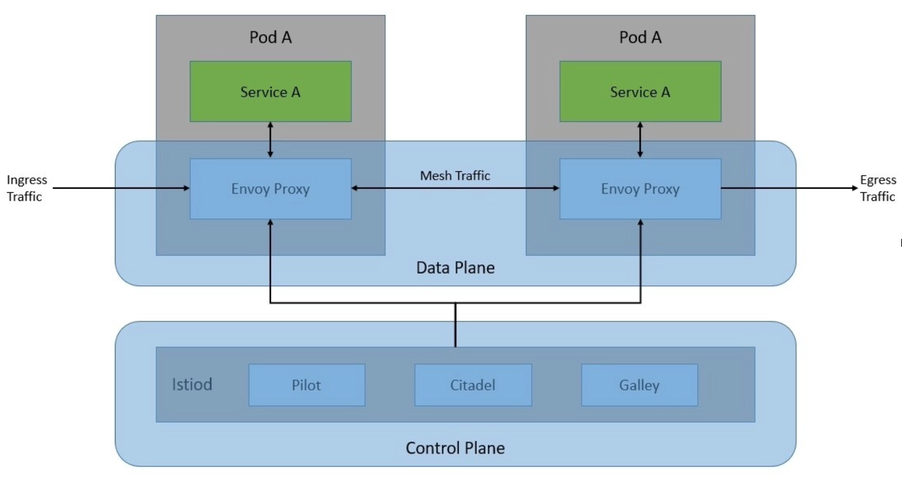
</p>

Of course, we can only realize the benefit of Istio when we have a large number of microservices that communicate with each other. Here, the sidecar proxies form a complex service mesh in a dedicated infrastructure layer:

<p align="center">
    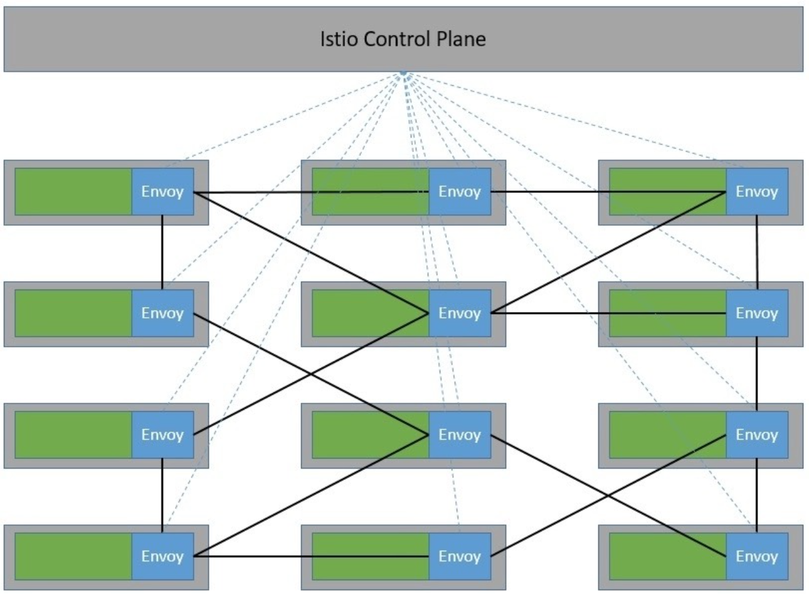
</p>

Istio is quite flexible in terms of integrating with external libraries and platforms. For instance, we can integrate Istio with an external logging platform, telemetry, or policy system. See [here](https://www.baeldung.com/ops/istio-service-mesh) for more.

## Service Meshes

Engineers struggled with similar problems at Lyft, moving away from monoliths toward a cloud-native architecture. At Lyft, Matt Klein and others proposed a different approach to solving these same problems: to bundle infrastructural capabilities completely out of process, in a manner separate from the main running application. Essentially every service in a distributed system would be accompanied by its own dedicated proxy running out-of-process. By routing requests in and out of a given application through its proxy, the proxy would have the opportunity to perform services on behalf of its application in a transparent fashion. This proxy could
- retry failed requests
- be configured with specific network timeouts, and circuit-breaking logic
- could encapsulate the logic of performing client-side load balancing requests to other services
- could act as a security gateway, also known as a Policy Enforcement Point. Connections can be upgraded from plain HTTP to encrypted traffic with mutual TLS
- could collect metrics such as request counts, durations, response codes and more, and expose those metrics to a monitoring system, thereby removing the burden of managing metrics collection and publishing from the development teams
  
The application of this proxy at Lyft helped solve many of the problems that its development teams were running into, and helped make their migration away from monoliths a success. Matt Klein subsequently open-sourced the project and named it Envoy. At the same time, the advent of containerization (Docker) and container orchestrators (Kubernetes) began addressing problems of resource utilization and freed operators from the mundane task of determining where to run workloads. Kubernetes Pods provided an important intermediary construct that, on the one hand, allowed for isolation within the container but on the other, for multiple loosely coupled containers to be bundled together as a single unit. Kubernetes came from Google, and Google was looking to build this same out-of-process infrastructural capability on top of Kubernetes. The Istio project started at Google, and as it turns out, Istio saw in Envoy the perfect building block for its service mesh. The Istio control plane would automate the configuration and synchronization of proxies deployed onto Kubernetes as sidecars inside each Pod. The Kubernetes API server's capabilities could be leveraged to automate service discovery and communicate the locations of service endpoints directly to each proxy. Fine-grained configuration of proxies could be performed by exposing Kubernetes Custom Resource Definitions (CRDs).

The Istio project was born as one of the implementations of service mesh. Istio is the first and most widely used open source project to make service mesh accessible to a wider audience. Istio service mesh 

- serves as a networking layer, automating and securing communications between applications 
- is independent of any specific programming language
- provides a control plane to define and implement the way microservices communicate with each other
- based on a foundation layer of lightweight network proxy instances derived from the Envoy proxy. Envoy is responsible for all service interaction in Kubernetes or virtual machines (VMs)
- services do not know they are working alongside Envoy instances or using a sidecar proxy.

Using Istio service mesh, platform teams can address needs for 
- **Traffic Management** 
- **Service Security** 
- **Application Monitoring** 
  
Istio is designed to run in various environments like on-premises, multi-cloud, Kubernetes containers, and virtual machines (VMs), so Istio helps platform teams manage and monitor all the service traffic across clusters and data centers.


### Features of Istio Service Mesh
Istio provides numerous features that make software development and delivery faster, easier, and more secure. Istio offers 
- Authentication 
- Authorization 
- Load balancing 
- Circuit breaker
- Time outs, retries, and deployment strategies
- Service discovery
- Observability
 
Following is a brief description of key capabilities that you can expect Istio + Envoy software to provide:

### Security
Istio helps application teams to achieve zero trust security with the ability to define and implement **authentication**, **authorization**, and **access control policies**. All your data communicated among the services, in and outside of the cluster or data center, will be encrypted based on **mTLS protocols** provided by Istio resources. You can also ensure **authentication of apps from internal and external users using JSON Web Tokens (JWT)** provided by Istio.

### Service Discovery
One of the primary needs of an application running in a production environment is to be highly available. This requires one to scale up the number of service instances with increasing load and scale down when needed to save costs. Istio’s service discovery capability keeps track of all the available nodes ready to pick up new tasks. In case of node unavailability, service discovery removes a node from the list of available nodes and stops sending new requests to the node.

### Traffic Management
Using Envoy proxies, Istio provides flexibility to finely control the traffic among the available services. Istio provides features like **load balancing**, **health checks**, and **deployment strategies**. Istio allows load balancing based on algorithms that include round robin, random selection, weighted algorithms, etc. Istio performs constant health checks of service instances to ensure they are available before routing the traffic request. And based on the deployment type used in the configuration, Istio drives traffic to new nodes in a weighted pattern.

### Resilience
Istio removes the need for coding **circuit breakers** within an application. Istio helps platform architects to define mechanisms such as **timeouts** to a service, number of **retries** to be made and planned **automatic failover** of high availability (HA) systems, without the application knowing about them.

### Observability
Istio keeps _track of network requests and traces_ each call across multiple services. Istio provides the **telemetry** (such as latency, saturation, traffic health, and errors) that helps SREs to understand service behavior and troubleshoot, maintain, and optimize their applications.

#### Advanced Deployment
Istio provides **visibility** and **fine-grained network controls** for traditional and modern workloads, including containers and virtual machines. Istio helps to achieve **canary** and **blue-green deployment** by providing the capability to route specific user groups to newly deployed applications.

## Istio Architecture
As shown in the illustration in the previous section, the basic idea behind Istio is to push microservices concerns into the infrastructure by leveraging Kubernetes. This is implemented by bundling the Envoy proxy as a sidecar container directly inside every Pod.

Note: in the Advanced Topics chapter, we show how a service mesh can be extended to include workloads running on VMs, outside Kubernetes.
In terms of implementation, Istio's main concerns are, therefore, solving the following problems:
- Ensuring that each time a workload is deployed, an Envoy sidecar is deployed alongside it.
- Ensuring traffic into and out of the application is transparently diverted through the proxy.
- Assigning each workload a cryptographic identity as the basis for a more secure computing environment.
- Configuring the proxies with all the information they need to handle incoming and outgoing traffic.

We will explore each of these concerns more in-depth in the following sections.

### How Does Istio Work?
Istio has two components which together make up a service mesh.

- **Data Plane**:
The data plane is responsible for translating, forwarding, and monitoring every network packet flowing to and from an instance. It owns key features such as health checking, routing, service discovery, load balancing, security, and telemetry. Istio uses Envoy proxy alongside each service in a cluster to observe, validate and manage all inbound and outbound requests. All incoming traffic from APIs is directed to an instance of Envoy (called, in this case, an ingress proxy). The proxy then follows rules or policies, specified in the Istio control plane, to decide how, when, or what service to route the traffic. Using these rules, Istio also enables techniques such as fault injections, circuit breaking, and canary deployments without any change to services.

- **Control Plane**
The Istio control plane provides rules and logic to carry out the communication between proxies in the service mesh. Say, when a new service is discovered, the control plane populates the existing list of services, which is then used by other proxies in the mesh to direct traffic. All the logic and configurations related to circuit breaking, retries, timeouts, load balancing, and security information are stored in the control plane. Whenever a new deployment happens, the data plane becomes aware of the new node but the mechanism of routing and shifting traffic will be defined by the control plane. The control plane provides policy, rules and configuration to the data plane without modifying any data in the mesh. Refer to the image below:


    <p align="center">
        
    </p>

    Most of the features stated in the data plane such as routing, health checking, service discovery, load balancing, security, etc, are available in projects such as HAProxy, Nginx, and Envoy. However, the configuration has to be written, deployed, and maintained manually using multiple other tools. Istio combines all these and provides an integrated platform, removing boilerplate configurations and offering durability in the solution.

Under the hood , Istio uses five major tools:
- **Envoy Proxy**: Istio uses Envoy proxy as a sidecar proxy in the data plane. Envoy in the data plane is responsible for functionalities like failure handling, health checks, service discovery, and load balancing. Envoy proxies provide detailed information about each service request
- **Mixer**: in the control plane, it acts as Istio’s telemetry hub, gathering attributes about service requests from Envoy proxies in the mesh. Mixer provides an API to fetch those attributes for monitoring and logging purposes
- **Pilot**: Istio uses Pilot in the control plane to provide traffic controls and load balancing based on the service mesh. All the traffic rules can be specified in Istio, and Pilot under the hood can communicate with Kubernetes infrastructure about deployment changes affecting traffic. Istio also uses Pilot to distribute security policies (such as authentication and authorization policies) to all Envoy proxies.
- **Citadel**: Istio uses Citadel to provide policy-driven and secured communication between Envoy proxies. All the authentication and key-based credential management between sidecar proxies is managed by Citadel.
- **Galley**: Istio control plane uses Galley for interpreting user-defined Kubernetes YAML files into a format that Istio understands. Galley stores the user configuration, validates it, and then sends it to Pilot for further action.


### Sidecar Injection

Modifying Kubernetes deployment manifests to bundle proxies as sidecars with each pod is both a burden to development teams, error-prone, and not maintainable. Part of Istio's codebase is dedicated to providing the capability to automatically modify Kubernetes deployment manifests to include sidecars with each pod. This capability is exposed in two ways, the first and simpler mechanism is known as manual sidecar injection, and the second is called automatic sidecar injection.

- **Manual sidecar injection**:
Istio has a command-line interface (CLI) named **istioctl** with the subcommand kube-inject. The subcommand processes the original deployment manifest to produce a modified manifest with the sidecar container specification added to the pod (or pod template) specification. The modified output can then be applied to a Kubernetes cluster with the `kubectl apply -f` command. With manual injection, the process of altering the manifests is explicit.

- **Automatic sidecar injection**:
With automatic injection, the bundling of the sidecar is made transparent to the user. This process relies on a Kubernetes feature known as Mutating Admission Webhooks, a mechanism that allows for the registration of a webhook that can intercept the application of a deployment manifest and mutate it before the final, modified specification is applied to the Kubernetes cluster. The webhook is triggered according to a simple convention, where the application of the label `istio-injection=enabled` to a Kubernetes namespace governs whether the webhook should modify any deployment or pod resource applied to that namespace to include the sidecar.


#### Routing Application Traffic Through the Sidecar

With the sidecar deployed, the next problem is ensuring that the proxy transparently captures the traffic. The outbound traffic should be diverted from its original destination to the proxy, and inbound traffic should arrive at the proxy before the application has a chance to handle the incoming request. This is performed by applying **iptables** rules. The video by Matt Turner titled [Life of a Packet through Istio](https://www.youtube.com/watch?v=oZrZlx2fmcM) explains elegantly how this process works.

In addition to the Envoy sidecar, the sidecar injection process injects a Kubernetes **init container**. This init-container is a process that applies these iptables rules before the Pod containers are started. Today Istio provides two alternative mechanisms for configuring a Pod to allow Envoy to intercept requests. The first is the original iptables method and the second uses a [Kubernetes CNI plugin](https://istio.io/latest/docs/setup/additional-setup/cni/).


### Install Istio - Commmand Line

First download Istio:

```sh
$ curl -L https://istio.io/downloadIstio | sh -
```

The command above downloads the latest release (numerically) of Istio. To download a specific version of Istio eg. 1.20.2 for the x86_64 architecture, run:
`curl -L https://istio.io/downloadIstio | ISTIO_VERSION=1.20.2 TARGET_ARCH=x86_64 sh -`

To run the istioctl from any folder, we should include its fully-qualified path in the PATH environment variable:

```sh
$ cd istio-1.14.3
/istio-1.20.2$ export PATH=$PWD/bin:$PATH
```

To check that the Istio CLI is on the path, run `istioctl version`. Usinf istioctl, you can install Istio:

```sh
/istio-1.20.2$ istioctl install -f demo-profile.yaml

This will install the Istio 1.14.3 demo profile with ["Istio core" "Istiod" "Ingress gateways" "Egress gateways"] components into the cluster. Proceed? (y/N) y
✔ Istio core installed
✔ Istiod installed
✔ Egress gateways installed
✔ Ingress gateways installed
✔ Installation complete
Making this installation the default for injection and validation.
Thank you for installing Istio 1.22. Please take a few minutes to tell us about your install/upgrade experience! 
ht‌tps://forms.gle/yEtCbt45FZ3VoDT5A

```
To check the deployed resource, we can look at the status of the pods in the `istio-system` namespace:

```sh
$ kubectl get po -n istio-system
```

We can enable automatic sidecar injection on any Kubernetes namespace. By labeling the namespace with the label `istio-injection=enabled`, the Istio control plane will monitor that namespace for new Kubernetes deployments. It will automatically intercept the deployments and inject Envoy sidecars into each pod.

```sh
kubectl label namespace default istio-injection=enabled
```

## Observability

Monitoring vs Observability
The term observability is broader than monitoring. It encompasses not only monitoring but anything that assists system engineers in understanding how a system behaves. Observability in microservices includes not only the collection and visualization of metrics but also log aggregation and dashboards that help visualize distributed traces.

Each facet of observability complements the other. 
- Dashboards exposing metrics may indicate a performance problem somewhere in the system. 
- Distributed traces can help locate the performance bottleneck to a specific service. 
- Service's logs can provide the context necessary to determine what specifically may be the issue.
  
This trio: **metrics**, **logs**, and **distributed traces** are the foundation for modern distributed systems observability.

### How Service Meshes Simplify and Improve Observability

Before service meshes, the burden of capturing, exposing, and publishing metrics was on the shoulders of application developers. So was the burden of constructing dashboards for the purpose of monitoring application health. Not only was this an added burden, but it created a situation where the implementation of observability from one team to the next was not uniform. What metrics are exposed, how they are captured, what they are named, and even what monitoring system is used could all be different from one application to another.

Through the Envoy sidecar, Istio is able to collect metrics and expose scrape endpoints that allow for the collection of a uniform set of metrics for all microservices. Istio further allows for the development of dashboards that are uniform across all services. The burden is lifted from the shoulders of the developers responsible for a given microservice, and the end result is a uniform treatment of metrics collection and observability across the entire platform.

### How Istio Exposes Workload Metrics (1)
Ensure that Istio is deployed with the demo profile:
```sh
$istioctl install --set profile=demo
```
Next, ensure that the default namespace is labeled for sidecar injection:
```sh
$ kubectl label ns default istio-injection=enabled
```
Verify that the label has been applied with the following command:
```sh
$ kubectl get ns -L istio-injection
NAME              STATUS   AGE   ISTIO-INJECTION
default           Active   42h   enabled
istio-system      Active   21h
kube-node-lease   Active   42h
kube-public       Active   42h
kube-system       Active   42h
metallb-system    Active   22h
```
Deploy the [BookInfo](https://istio.io/latest/docs/examples/bookinfo/) sample application that is bundled with the Istio distribution.

```sh
$ kubectl apply -f samples/bookinfo/platform/kube/bookinfo.yaml
```
Finally, deploy the bundled sleep sample service:

```sh
$ kubectl apply -f samples/sleep/sleep.yaml
$ kubectl exec $SLEEP_POD -it -- curl productpage:9080/productpage | head
```

The output should show the start of the HTML response from the productpage service, like so:

```html
<!DOCTYPE html>
<html>
      <head>
            <title>Simple Bookstore App</title>
        <meta charset="utf-8">
        <meta http-equiv="X-UA-Compatible" content="IE=edge">
        <meta name="viewport" content="width=device-width, initial-scale=1.0">
    
        <!-- Latest compiled and minified CSS -->
         <link rel="stylesheet" href="static/bootstrap/css/bootstrap.min.css">
```

The name of the sidecar container in Istio is `istio-proxy` which lives in the same pod as the service:

```sh
$ kubectl get pod $PRODUCTPAGE_POD -ojsonpath='{.spec.containers[*].name}'
productpage istio-proxy
```

One of the benefits of running a sidecar is that it can expose a metrics collection endpoint, also known as the **Prometheus** "scrape endpoint," on behalf of the workload it proxies. We can query the scrape endpoint as follows:

```sh
$ kubectl exec $PRODUCTPAGE_POD -c istio-proxy curl localhost:15090/stats/prometheus
```
Now we can deploy **Prometheus** and run some queries directly against the Prometheus server. Prometheus is configured to collect metrics from all workloads at a regular 15-second interval. Run the following command, which will deploy Prometheus to the istio-system namespace:

```sh
$ kubectl apply -f samples/addons/prometheus.yaml
```

With Prometheus now running and collecting metrics, send another request to the productpage service:

```sh
$ kubectl exec $SLEEP_POD -it -- curl productpage:9080/productpage | head
```

or just visit the page productpage after exposing it (ingress gateway, for example.) . Now expose prometheus server using the following command:

```sh
$ kubectl expose svc prometheus -n istio-system --type=NodePort —name=prometheus-ext 
```

Use the specified port to visit the prometheus server page. For example, to find out the subset of requests that returned an HTTP 200 response code, the query would be: `istio_requests_total{response_code=“200"}`. By collecting this extra metadata with each metric, we can obtain answers to many interesting questions. For example, to locate the call we made earlier from the sleep pod to the productpage service, the query would be: `istio_requests_total{source_app="sleep",destination_app="productpage"}`.

A more interesting question that applies to COUNTER-type metrics in general, is the rate of incoming requests (over a particular time window, say the last 5 minutes) against a particular service:
`rate(istio_requests_total{destination_app=“productpage”[5m])`

Look at the output from the **Graph** tab. Since there currently exists no load against our service, the rate should be zero. If, on the other hand, we query the productpage service every 1-2 seconds, like so...

```sh
$ while true; do kubectl exec $SLEEP_POD -it -- curl productpage:9080/productpage > /dev/null; sleep 1; done
```

..then, within a couple of minutes, the rate of requests will rise from zero to a value between 0.5 and 1.0.

Prometheus' PromQL query language is powerful and can help diagnose issues, as illustrated by Karl Stoney in his blog entry Istio: 503's with UC's and TCP Fun Times. But Prometheus queries are no substitute for a set of properly designed monitoring dashboards, to which we turn our attention in the next lab.


### Grafana Dashboards for Istio (1)

**Grafana** is a popular open-source tool that makes it easy to construct custom monitoring dashboards from a backing metrics source. Grafana has built-in support for Prometheus.

The Istio project team has developed a set of Grafana dashboards specifically designed for monitoring a service mesh. Deploy Grafana with the following command:

```sh
$ kubectl apply -f samples/addons/grafana.yaml
```
Expose the Grafana service to have access to its UI. To view the Istio dashboards in Grafana, navigate from the main page with the aid of the navigation bar on the left-hand side of the screen. Under Dashboards select Browse. To the right of the folder labeled Istio, click on the link captioned Go to folder. Inside that folder, you will find six dashboards:
- Mesh: provides a high-level overview of the health of services in the mesh.
- Service: for monitoring a specific service. The metrics shown here are aggregated from multiple workloads.
- Workload: this allows you to inspect the behavior of a single workload.
- Control Plane: designed to monitor the health of istiod, the Control plane itself. It helps determine whether the control plane is healthy and able to synchronize the Envoy sidecars to the state of the mesh.
- Performance: this allows you to monitor the resource consumption of istiod and the sidecars.
- Wasm Extension: For monitoring the health of custom Web Assembly extensions deployed to the mesh.
  
Let us send some traffic to the productpage service so that we have something to observe.

```sh
$ while true; do kubectl exec $SLEEP_POD -it -- curl productpage:9080/productpage > /dev/null; sleep 0.3; done
```

You should see a global request volume of 2-3 operations per second, no 4xx or 5xx errors, and all services should show a 100% success rate. Some other metrics will show "N/A" ("Not Applicable") for the moment. Later in this course, you will define custom Istio resources, including Gateways, Virtual Services, and Destination Rules, and at that time, the count of each type of resource will display on this dashboard. Next, visit the Istio Service Dashboard, select the service named `productpage.default.svc.cluster.local`, and expand the General panel. There you will find the typical golden signals, including **request volume**, **success rate (or errors)**, and **request duration**. The other two panels, Client Workloads and Service Workloads, break down incoming requests to this service by source and by destination, respectively.

### Distributed Tracing

Distributed tracing is an important component of observability that complements metrics dashboards. The idea is to provide the capability to "see" the end-to-end request-response flow through a series of microservices and to draw important information from it. From a view of a distributed trace, developers can discover potential **latency issues** in their applications.

#### Terms
The end-to-end request-response flow is known as a **trace**. Each component of a trace, such as a single call from one service to another, is called a **span**. Traces have unique IDs, and so do spans. All spans that are part of the same trace bear the same trace ID. The IDs are propagated across the calls between services in HTTP headers whose names begin with **x-b3** and are known as B3 trace headers (see [**B3 Propagation**](https://github.com/openzipkin/b3-propagation)).

When Envoy sidecars receive the initial request that does not contain a B3 header and realize that this span represents the beginning of a new trace, they assign the request a new trace ID. However, the propagation of these headers onto other services cannot be performed automatically by Envoy, and so developers must ensure that they propagate these headers in upstream calls to other services (see [Istio / FAQ](https://istio.io/latest/about/faq/#how-to-support-tracing)). This task is often easily accomplished by including a tracing client library as a dependency to the services.


### Deploy Jaeger and Review Some Traces

Next, run the following command to send requests to the productpage service every 1-2 seconds:

```sh
$ while true; do kubectl exec $SLEEP_POD -it -- curl productpage:9080/productpage > /dev/null; sleep 1; done
```

Requests will be tagged with trace and span IDs and be sent and consequently collected by Jaeger.

**Kiali** is an open-source graphical console specifically designed for Istio and includes numerous features. Through alerts and warnings, it can help validate that the service mesh configuration is correct and that it does not have any problems.

With Kiali, one can view Istio custom resources, services, workloads, or applications. As an alternative to drafting and applying Istio custom resources by hand, Kiali exposes actions that allow the operator to 
- define routing rules
- perform traffic shifting 
- configure timeouts and 
- inject faults
  
Kiali relies on the metrics collected in Prometheus. In addition, Kiali has the ability to combine information from metrics, traces, and logs to provide deeper insight into the functioning of the mesh. One feature of Kiali that stands out is the Graph section, which provides a live visualization of traffic inside the mesh. Begin by deploying Kiali to your Kubernetes cluster:

```sh
$ kubectl apply -f samples/addons/kiali.yaml
```

Next, run the following command to send requests to the productpage service at a 1-2 second interval:

```sh
$ while true; do kubectl exec $SLEEP_POD -it -- curl productpage:9080/productpage; sleep 1; done
```

In the UI, select the Graph option from the sidebar, and select the default namespace. Through the Display options, interesting bits of additional information can be overlaid on the graph, including whether calls between services are encrypted with mutual TLS, traffic rate, and traffic animations that reflect the relative rate of requests between services.

One can also navigate directly from the Graph view to a particular service. The screenshot below is a view of the ratings service, where one can clearly see that both reviews-v2 and reviews-v3 call this service and that those calls are indeed using mutual TLS encryption. The green color of the arrows linking the services indicate that requests are succeeding with HTTP 200 response codes.

<p align="center">
    
</p>


Monitoring solutions are often referred to as Application Performance Monitoring (APM tools). There exist many alternative APM tools and solutions out in the marketplace. One popular open-source option is the [Apache Foundation's Skywalking project](https://skywalking.apache.org). Apache Skywalking supports monitoring service meshes. This blog entry provides a tutorial for installing Apache Skywalking on a Kubernetes cluster and configuring it to work with Istio. Skywalking can be installed with the popular Helm package manager. Up-to-date instructions for installing Skywalking with Helm can be found on [Apache Skywalking's GitHub repository](https://github.com/apache/skywalking-helm).
Once Apache Skywalking is up and running, we can proceed to access its dashboard, which provides features similar to some of the other dashboards we visited in this chapter. Below is a screenshot of the Topology view from the Apache Skywalking dashboard showing traffic making its way through Istio's bookinfo sample application.


##  Traffic Management

### Gateways

In the earlier installation lab, when we installed Istio using the demo profile, it included the ingress and egress gateways. Both gateways are Kubernetes deployments that run an instance of the Envoy proxy, and they operate as load balancers at the edge of the mesh. The ingress gateway receives inbound connections, while the egress gateway receives connections going out of the cluster. Using the ingress gateway, we can apply route rules to the inbound traffic entering the cluster. As part of the ingress gateway, a Kubernetes service of type LoadBalancer is deployed, giving us an external IP address. 

We will deploy a Hello World application to the cluster. We will then deploy a Gateway resource and a VirtualService that binds to the Gateway to expose the application on an external IP address. Ensure you have a Kubernetes cluster with Istio installed, and the default namespace labeled for Istio sidecar injection before continuing.

<p align="center">
    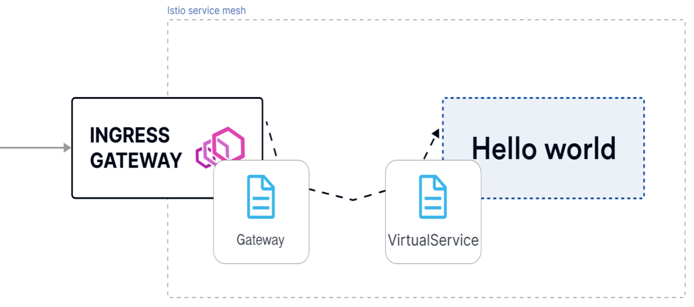
</p>

Let us start by deploying the Gateway resource. We will set the hosts field to * (* is a wildcard matcher) to access the ingress gateway directly from the external IP address, without any hostname. If we wanted to access the ingress gateway through a domain name, we could set the hosts' value to a domain name (e.g., example.com) and add the external IP address as an A record in the domain's DNS settings. 

At the same time, create a **VirtualService** for the hello-world service and bind it to the Gateway resource. We use the * in the hosts field, just like in the Gateway resource. We have also added the Gateway resource we created earlier (gateway) to the gateway array. We say that we have attached the Gateway to the VirtualService.


```yaml
apiVersion: networking.istio.io/v1alpha3
kind: Gateway
metadata:
  name: gateway
spec:
  selector:
    istio: ingressgateway
  servers:
    - port:
        number: 80
        name: http
        protocol: HTTP
      hosts:
        - ‘*'
——
apiVersion: networking.istio.io/v1alpha3
kind: VirtualService
metadata:
  name: hello-world
spec:
  hosts:
    - "*"
  gateways:
    - gateway
  http:
    - route:
        - destination:
            host: hello-world.default.svc.cluster.local
            port:
              number: 80
```

Using a fully qualified service name is the preferred way to reference the services in Istio resources. We can also use a short name (e.g., hello-world), which might lead to confusion and unexpected behavior if we have multiple services with the same name running in different namespaces.
Save the above YAML to `hello-world-gateway.yaml` and create the VirtualService:

```sh
$ kubectl apply -f hello-world-gateway.yaml
```

The following creates a deployment and a service for hello-world app.

```yaml
apiVersion: apps/v1
kind: Deployment
metadata:
  name: hello-world
  labels:
    app: hello-world
spec:
  replicas: 1
  selector:
    matchLabels:
      app: hello-world
  template:
    metadata:
      labels:
        app: hello-world
    spec:
      containers:
        - image: gcr.io/tetratelabs/hello-world:1.0.0
          imagePullPolicy: Always
          name: svc
          ports:
            - containerPort: 3000
---
kind: Service
apiVersion: v1
metadata:
  name: hello-world
  labels:
    app: hello-world
spec:
  selector:
    app: hello-world
  ports:
    - port: 80
      name: http
      targetPort: 3000
```

Apply this manifest to the cluster. Now if we run `curl` against GATEWAY_IP or open it in the browser, we will get back a response Hello World:

```
$ curl -v http://$GATEWAY_IP/
* Trying $GATEWAY_IP...
* TCP_NODELAY set
* Connected to $GATEWAY_IP ($GATEWAY_IP) port 80 (#0)
> GET / HTTP/1.1
> Host: $GATEWAY_IP
> User-Agent: curl/7.64.1
> Accept: */*
>
< HTTP/1.1 200 OK
< date: Mon, 18 Jul 2022 02:59:37 GMT
< content-length: 11
< content-type: text/plain; charset=utf-8
< x-envoy-upstream-service-time: 1
< server: istio-envoy
<
* Connection #0 to host $GATEWAY_IP left intact
Hello World* Closing connection 0
```

Also, notice the server header set to istio-envoy, indicating that the request went through the sidecar proxy. 

### Traffic Routing in Istio
Istio features a couple of resources we can use to configure how traffic is routed within the mesh. We have already mentioned the VirtualService and the Gateway resource in the Gateway section. 

We can use the VirtualService resource to configure routing rules for services within the Istio service mesh. For example, in the [VirtualService](https://istio.io/latest/docs/reference/config/networking/virtual-service/) resource, we match the incoming traffic based on the request properties and then route the traffic to one or more destinations. For example, once we match the traffic, we can split it by weight, inject failures and/or delays, mirror the traffic, and so on.

The [**DestinationRule**](https://istio.io/latest/docs/reference/config/networking/destination-rule/) resource contains the rules applied after routing decisions (from the VirtualService) have already been made. With the DestinationRule, we can configure how to reach the target service. For example, we can configure outlier detection, load balancer settings, connection pool settings, and TLS settings for the destination service.

The last resource we should mention is the [**ServiceEntry**](https://istio.io/latest/docs/reference/config/networking/service-entry/). This resource allows us to take an external service or an API and make it appear as part of the mesh. The resource adds the external service to the internal service registry, allowing us to use Istio features such as traffic routing, failure injection, and others against external services.

#### Where to Route the Traffic?

Before the Envoy proxy can decide where to route the requests, we need a way to describe what our system and services look like. Let us look at an example where we have a `web-frontend` service and two versions (v1 and v2) of a customers service running in the cluster. Regarding resources, we have the following deployed in the cluster:

- Kubernetes deployments: `customers-v1`, `customers-v2` and `web-frontend`.
- Kubernetes services: `web-frontend` and `customers`
  
To describe the different service versions, we use the concept of labels in Kubernetes. The pods created from the two customer deployments have the labels `version: v1` and `version: v2` set.

Note that we only have a single customers service that load-balances the traffic across all customer service pods (regardless of which deployment they were created from). How does Istio know or distinguish between the different versions of the service? We can set different labels in the pod spec template in each versioned deployment and then use these labels to make Istio aware of the two distinct versions or destinations for traffic. The labels are used in a construct called subset that can be defined in the DestinationRule.

To describe the two versions of the service, we would create a DestinationRule that looks like this:

```yaml
apiVersion: networking.istio.io/v1alpha3
kind: DestinationRule
metadata:
  name: customers
spec:
  host: customers.default.svc.cluster.local
  subsets:
    - name: v1
      labels:
        version: v1
    - name: v2
      labels:
        version: v2
```

Under the hood, when Istio translates these resources into Envoy proxy configuration, unique Envoy clusters get created that correspond to different versions. Istio takes the Kubernetes Service endpoints and applies the labels defined in the subsets to create separate collections of endpoints. The logical collection of these endpoints in Envoy is called a cluster.

The Envoy clusters are named by concatenating the traffic direction, port, subset name, and service hostname. 

In the VirtualService, we can specify the traffic matching and routing rules that decide which destinations traffic is routed to. We have multiple options when deciding on how we want the traffic to be routed:
- Route based on weights
- Match and route the traffic
- Redirect the traffic (HTTP 301)
- Mirror the traffic to another destination

The above options of routing the traffic can be applied and used individually or together within the same VirtualService resource. Additionally, we can add, set or remove request and response headers, and configure CORS settings, timeouts, retries, and fault injection.

Let us look at some examples:

1. **Weight-based routing**

```sh
apiVersion: networking.istio.io/v1alpha3
kind: VirtualService
metadata:
  name: customers-route
spec:
  hosts:
  - customers.default.svc.cluster.local
  http:
  - name: customers-v1-routes
    route:
    - destination:
        host: customers.default.svc.cluster.local
        subset: v1
      weight: 70
  - name: customers-v2-routes
    route:
    - destination:
        host: customers.default.svc.cluster.local
        subset: v2
      weight: 30
```

In this example, we split the traffic based on weight to two subsets of the same service, where 70% goes to subset v1 and 30% to subset v2.

2. **Match and route the traffic**

```yaml
apiVersion: networking.istio.io/v1alpha3
kind: VirtualService
metadata:
  name: customers-route
spec:
  hosts:
  - customers.default.svc.cluster.local
  http:
  - match:
    - headers:
        user-agent:
          regex: ".*Firefox.*"
    route:
    - destination:
        host: customers.default.svc.cluster.local
        subset: v1
  - route:
    - destination:
        host: customers.default.svc.cluster.local
        subset: v2
```
In this example, we provide a regular expression and try to match the User-Agent header value. If the header value matches, we route the traffic to subset v1. Otherwise, if the User-Agent header value doesn’t match, we route the traffic to subset v2.

3. **Redirect the traffic**

```yaml
apiVersion: networking.istio.io/v1alpha3
kind: VirtualService
metadata:
  name: customers-route
spec:
  hosts:
  - customers.default.svc.cluster.local
  http:
  - match:
    - uri:
        exact: /api/v1/helloWorld
    redirect:
      uri: /v1/hello
      authority: hello-world.default.svc.cluster.local
```
In this example, we combine the matching on the URI and then redirect the traffic to a different URI and a different service.

4. **Traffic mirroring**

```yaml
apiVersion: networking.istio.io/v1alpha3
kind: VirtualService
metadata:
  name: customers-route
spec:
  hosts:
    - customers.default.svc.cluster.local
  http:
  - route:
    - destination:
        host: customers.default.svc.cluster.local
        subset: v1
      weight: 100
    mirror:
      host: customers.default.svc.cluster.local
      subset: v2
    mirrorPercentage:
      value: 100.0
```

In this example, we mirror 100% of the traffic to the v2 subset. Mirroring takes the same request sent to subset v1 and “mirrors” it to the v2 subset. The request is “fire and forget”. Mirroring can be used for testing and debugging the requests by mirroring the production traffic and sending it to the service version of our choice.


### Advanced Traffic Routing

Earlier, we learned how to route traffic between multiple subsets using the proportion of the traffic (weight field). In some cases, pure weight-based traffic routing or splitting is enough. However, there are scenarios and cases where we might need more granular control over how the traffic is split and forwarded to destination services. Istio allows us to use parts of the incoming requests and match them to the defined values. For example, we can check the URI prefix of the incoming request and route the traffic based on that. The table below shows the different properties we can match on.

<p align="center">
    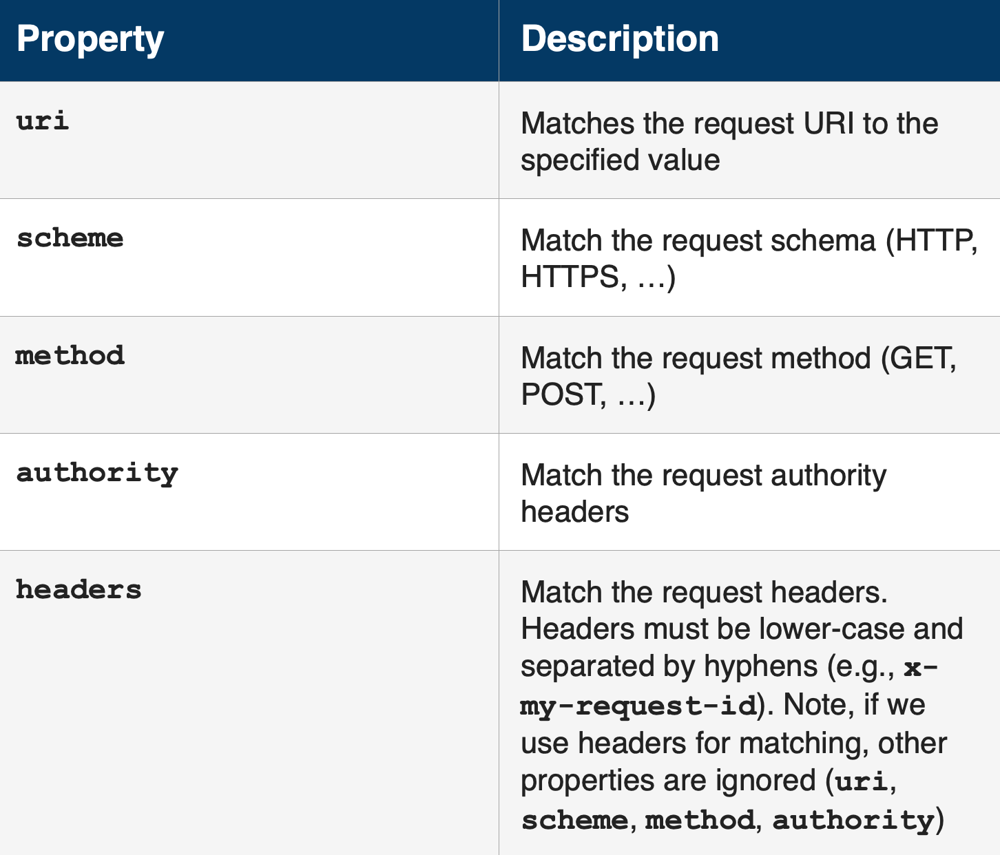
</p>


Each of the above properties can get matched using one of these methods:
- Exact match: e.g., exact: "value" matches the exact string
- Prefix match: e.g., prefix: "value" matches the prefix only
- Regex match: e.g., regex: "value" matches based on the ECMAScript style regex
- 
For example, let's say the request URI looks like this:
`htt‌ps://dev.example.com/v1/api`. To match the request URI, we could write the configuration like this:

```yaml
http: 
- match: 
  - uri: 
      prefix: /v1 
```

The above snippet would match the incoming request, and the request would get routed to the destination defined in that route. Another example would be using Regex and matching on a header:

```yaml
...
http: 
- match: 
  - headers: 
      user-agent: 
        regex: '.*Firefox.*'
...
```
 
The above match will match any request where the User Agent header matches the Regex.

### Rewriting and Redirecting Traffic
In addition to matching on properties and then directing the traffic to a destination, sometimes we also need to rewrite the incoming URI or modify the headers. For example, let us consider a scenario where we match the incoming requests to the `/v1/api` path. Once matched, we want to route the requests to a different URI, `/v2/api`, for example. We can do that using the rewrite functionality.

```yaml
...
http:
  - match:
    - uri:
        prefix: /v1/api
    rewrite:
      uri: /v2/api
    route:
      - destination:
          host: customers.default.svc.cluster.local
...
```

The above snippet will match the prefix and then rewrite the matched prefix portion with the URI we provide in the rewrite field. Even though the destination service doesn't expose or listen on the `/v1/api` endpoint, we can rewrite those requests to a different path, `/v2/api` in this case. We also can redirect or forward the request to a completely different service. Here is how we could match on a header and then redirect the request to another service:

```yaml
...
http:
  - match:
    - headers:
        my-header:
          exact: hello
    redirect:
      uri: /hello
      authority: my-service.default.svc.cluster.local:8000
...
```

The redirect and destination fields are mutually exclusive. If we use the redirect, there is no need to set the destination.

---------------------------
---------------------

# Security

Security in Istio involves multiple components:
- A Certificate Authority (CA) for key and certificate management
- The configuration API server distributes to the proxies:
  - authentication policies
  - authorization policies
  - secure naming information
- Sidecar and perimeter proxies work as Policy Enforcement Points (PEPs) to secure communication between clients and servers
-  A set of Envoy proxy extensions to manage telemetry and auditing. 
  
The control plane handles configuration from the API server and configures the PEPs in the data plane. The PEPs are implemented using Envoy. 


## Access Control
The question access control tries to answer is: can a principal perform an action on an object? For example, consider the following two questions:
- Can a user delete a file?
- Can a user execute a script?

The user in the above example is the principal, actions are deleting and executing, and an object is a file and a script. If we stated a similar example using Kubernetes and Istio, we would ask: "Can service A perform an action on service B?" The key terms are **authentication** and **authorization** when discussing security and answering the access control question.

### Authentication (authn)

Authentication is all about the principal or, in our case, about services and their identities. It’s an act of validating a credential and ensuring the credential is valid and authentic. Once the authentication is performed, we can say that we have an authenticated principal.

In Kubernetes, each workload automatically gets assigned a unique identity. This identity is used when workloads communicate. The identity in Kubernetes takes the form of a Kubernetes **service account**. The pods in Kubernetes use the service account as their identity and present it at runtime. Specifically, Istio uses the **X.509 certificate** from the service account, creating a new identity according to the specification called **SPIFFE** (Secure Production Identity Framework For Everyone). SPIFFE  defines a universal naming scheme that’s based on a URI. For example `spiffe://cluster.local/ns/default/sa/my-service-account`. The spec describes how to take the identity and encode it into different documents. The document we care about in this case is the X.509 certificate. 

Based on the SPIFFE specification, when we create an X.509 certificate and fill out the **Subject Alternative Name** (SAN) field based on the naming scheme above and check that name during the certificate validation, we can authenticate the identity encoded in the certificate. We get a valid SPIFFE identity which is an authenticated principal.

The Envoy proxy sidecars are modified and can perform the extra validation step required by SPIFFE (i.e., checking the SAN), allowing those authenticated principals to be used for policy decisions. 

Istio provides two types of authentication:
1. **Peer authentication**: used for service-to-service authentication to verify the client making the connection. Istio offers **mutual TLS** as a full stack solution for transport authentication, which can be enabled without requiring service code changes. This solution:
    - Provides each service with a strong identity representing its role to enable interoperability across clusters and clouds.
    - Secures service-to-service communication.
    - Provides a key management system to automate key and certificate generation, distribution, and rotation.
2. **Request authentication**: Used for end-user authentication to verify the credential attached to the request. Istio enables request-level authentication with **JSON Web Token (JWT)** validation and a streamlined developer experience using a custom authentication provider or any OpenID Connect providers, for example:
     - ORY Hydra
     - Keycloak
     - OAuth
     - Firebase Auth
     - Google Auth

In all cases, Istio stores the authentication policies in the Istio **config store** via a custom Kubernetes API. Istiod keeps them up-to-date for each proxy, along with the keys where appropriate. You can specify authentication requirements for workloads receiving requests in an Istio mesh using peer and request authentication policies.

Client services, those that send requests, are responsible for following the necessary authentication mechanism. For request authentication, the application is responsible for acquiring and attaching the JWT credential to the request. For peer authentication, Istio automatically upgrades all traffic between two PEPs to mutual TLS. If authentication policies disable mutual TLS mode, Istio continues to use plain text between PEPs.


#### Mutual TLS

By default, Istio creates its own CA to issue control plane and workload certificates that identify workload proxies. When a workload starts its envoy proxy requests a certificate from the istio control plane via **istio-agent**. You can disable the default Istio CA to use a custom CA such as using A[WS Private CA](https://github.com/aws-samples/istio-on-eks/tree/main/modules/04-security/peer-authentication) as the external CA for Peer Authentication through Cert-Manager and its plugin “istio-csr”.

##### Provisioning Identities at Runtime

Istio securely provisions strong identities to every workload with X.509 certificates. Istio agents, running alongside each Envoy proxy, work together with istiod to automate key and certificate rotation at scale. The following diagram shows the identity provisioning flow.

<p align="center">
    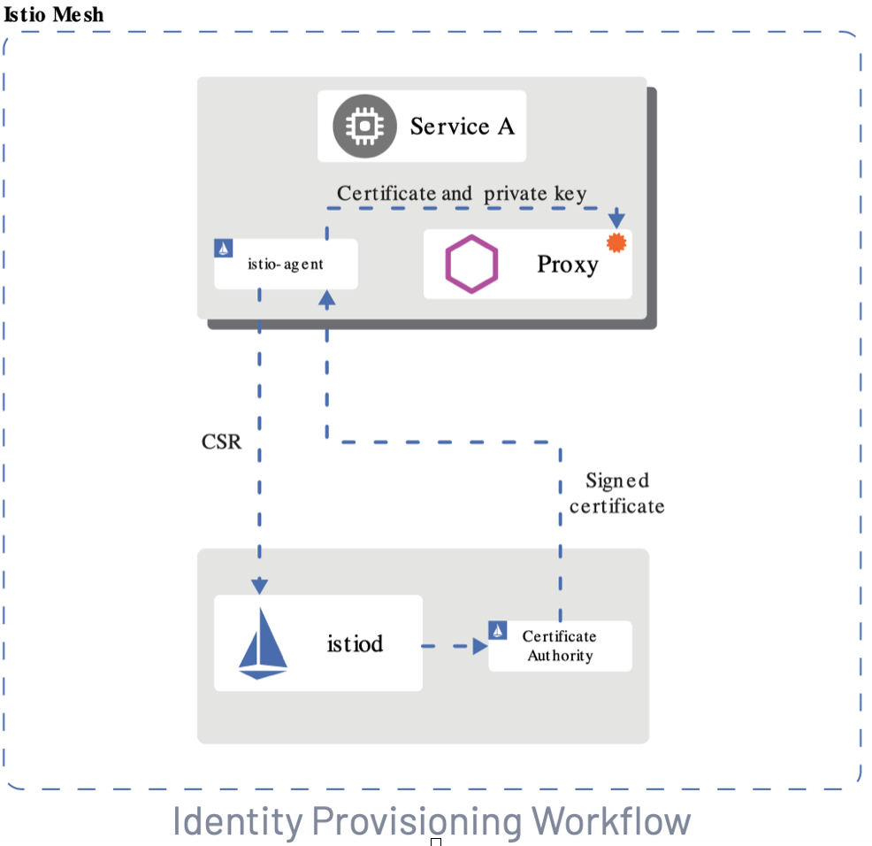
</p>


The process of provisioning identities involves the following components of the service mesh:
- Istio agent, running in the sidecar
- Envoy’s Secret Discovery Service (SDS)
- Citadel (part of Istio control plane)

The Istio agent (a binary called pilot-agent) runs in the sidecar and works with Istio’s control plane to automate key and certificate rotation. Even though the agent runs in the sidecar containers, it’s still considered part of the control plane.

<p align="center">
    
</p>

The Envoy proxy in the sidecar gets its initial bootstrap configuration as a JSON file. Amongst other settings, the JSON file configures the Istio agent as the SDS server, telling the Envoy proxy to go to the SDS server for any certificate/key needs. For example, the SDS server will automatically push the certificate to the Envoy proxy, removing the need for creating the certificates as Kubernetes secrets and mounting them inside the containers’ file system. The Istio agent is responsible for launching the Envoy proxy. When the Envoy proxy starts, it reads its bootstrap configuration and sends the SDS request to the Istio agent, telling it the workloads service account.
 

##### Certificate issuance flow in Istio
The Istio agent sends a request to the certificate authority (CA), which in this case is Citadel, for a new workload certificate. The Citadel component plays the role of the certificate authority. By default, Citadel uses a self-signed root certificate to sign all workload certificates. We can change that by providing our root certificate, signing certificate, and key for Citadel to use.

The request to the CA involves creating a certificate signing request (CSR) and includes proof of the workloads’ service account. In Kubernetes, that’s the pods’ service account JWT. Next, Citadel performs authentication and authorization and responds with a signed X.509 certificate. The Istio agent takes the signed certificate and caches it in memory. Additionally, the Istio agent registers the certificate for automatic rotation before the certificate expires. The default expiration of mesh certificates is **24 hours**. This value is configurable and can be changed. In the last step, the Istio agent streams back the signed certificate to the Envoy proxy via SDS over a Unix domain socket. This allows Envoy proxy to use the certificate when needed.

Once workloads have a strong identity, we can use them at runtime to do mutual TLS authentication (mTLS). Traditionally, TLS is done one way. Let’s take the example of going to https://google.com. If you navigate to the page, you will notice the lock icon, and you can click on it to get the certificate details. However, we did not give any proof of identity to google.com, we just opened the website. This is where mTLS is fundamentally different. When two services try to communicate using mTLS, it’s required that both of them provide certificates to each other. That way, both parties know the identity of who they are talking to. Using mTLS both client and server verify each others’ identities. 

As we already learned, all communication between workloads goes through the Envoy proxies. When a workload sends a request to another, Istio re-routes the traffic to the sidecar Envoy proxy, regardless of whether mTLS or plain text communication is used. In the case of mTLS, once the mTLS connection is established, the request is forwarded from the client Envoy proxy to the server-side Envoy proxy. Then, the sidecar Envoy starts an mTLS handshake with the server-side Envoy. The workloads themselves aren’t performing the mTLS handshake - it’s the Envoy proxies doing the work. During the handshake, the caller does a secure naming check to verify the service account in the server certificate is authorized to run the target service. After the authorization on the server-side, the sidecar forwards the traffic to the workload.

The sidecars are involved in intercepting the incoming inbound traffic and facilitating or sending the outbound traffic. For that reason, two distinct resources control the inbound and outbound traffic. The **PeerAuthentication** for inbound traffic and the **DestinationRule** for outbound traffic.

<p align="center">
    
</p>

 
PeerAuthentication is used to configure mTLS settings for inbound traffic, and DestinationRule for configuring TLS settings for outbound traffic.

##### Inbound Traffic to the Proxy

The resource that configures what type of mTLS traffic the sidecar accepts is PeerAuthentication. It supports four operating modes, as shown in the table below.

 <p align="center">
    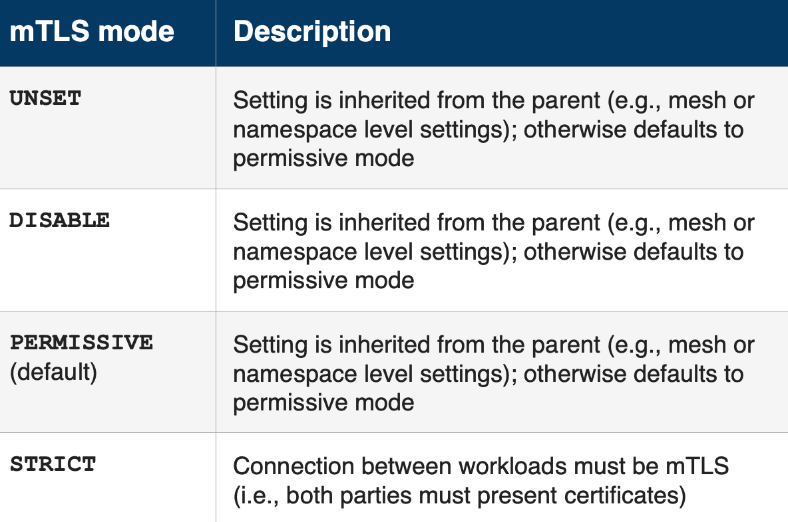
</p>

The default mTLS mode is PERMISSIVE, which means that if a client tries to connect to a service via mTLS, the Envoy proxy will serve mTLS. The server will respond in plain text if the client uses plain text. With this setting, we are allowing the client to choose whether to use mTLS or not. The permissive mode is useful to help you understand how a policy change can affect your security posture before it is enforced. It helps when onboarding existing applications to the service mesh as it allows us to roll out mTLS to all workloads gradually. Once all applications are onboarded, we can turn on the STRICT mode. The strict mode says that workloads can only communicate using mTLS. The connection will be closed if a client tries to connect without presenting their certificate.

We can configure the mTLS mode at the mesh, namespace, workload, and port level. While Istio automatically upgrades all traffic between the proxies and the workloads to mutual TLS, workloads can still receive plain text traffic in permissive mode which is the default mode. To prevent non-mutual TLS traffic for the whole mesh, set a mesh-wide peer authentication policy with the mutual TLS mode set to STRICT. The mesh-wide peer authentication policy should not have a selector and must be applied in the root namespace. 

Similarly we might prefer to set the STRICT mode at the namespace level and then individually set permissive mode or disable mTLS at either workload level using selectors or at the individual port level.

Here’s an example of how we could set STRICT mTLS mode for all workloads matching a specific label:

```yaml
apiVersion: security.istio.io/v1beta1
kind: PeerAuthentication
metadata:
  name: default
  namespace: foo
spec:
  selector:
    matchLabels:
      app: hello-world
  mtls:
    mode: STRICT
```

##### Outbound Traffic from the Proxy
We use the DestinationRule resource to control and configure what type of TLS traffic the sidecar sends.

The supported TLS modes are shown in the table below.

<p align="center">
    
</p>

Based on the configuration, the traffic can be sent as plain text (DISABLE), or a TLS connection can be initiated using SIMPLE for TLS and MUTUAL or ISTIO_MUTUAL for mTLS.

If the DestinationRule and the TLS mode are not explicitly set, the sidecar uses Istio’s certificates to initiate the mTLS connection. That means, by default, all traffic inside the mesh is encrypted. The configuration can be applied to individual hosts by their fully qualified domain names (e.g., `hello-world.my-namespace.svc.cluster.local`). A workload selector with labels can be set up to select specific workloads on which to apply the configuration.

We can configure specific ports on the workloads to apply the settings for even more fine-grained control.

```yaml
apiVersion: networking.istio.io/v1alpha3
kind: DestinationRule
metadata:
  name: tls-example
spec:
  host: "*.example.com"
  trafficPolicy:
    tls:
      mode: SIMPLE
```

The above YAML specifies that TLS connection should be initiated when talking to services whose domain matches the `*.example.com`.

#### Gateways and TLS

In the case of gateways, we also talk about inbound and outbound connections. With ingress gateways, the inbound connection typically comes from the outside of the mesh (i.e., a request from the browser, curl, etc.), and the outgoing connection goes to services inside the mesh. The inverse applies to the egress gateway, where the inbound connection typically comes from within the mesh, and outbound connections go outside the mesh. In both cases, the configuration and resources used are identical. Behind the scenes, the mesh's ingress and egress gateway deployments are identical - it’s the configuration that specializes and adapts them for either ingress or egress traffic. The configuration of gateways is controlled with the Gateway resource. 

The tls field in the Gateway resource controls how the gateway decodes the inbound traffic. The protocol field specifies whether the inbound connection is plaintext HTTP, HTTPS, GRCP, MONGO, TCP, or TLS. When the inbound connection is TLS, we have a couple of options to control the behavior of the gateway. _Do we want to terminate the TLS connection, pass it through, or do mTLS?_ These additional options can be configured using the TLS mode in the Gateway resource. The table below describes the different TLS modes.

<p align="center">
    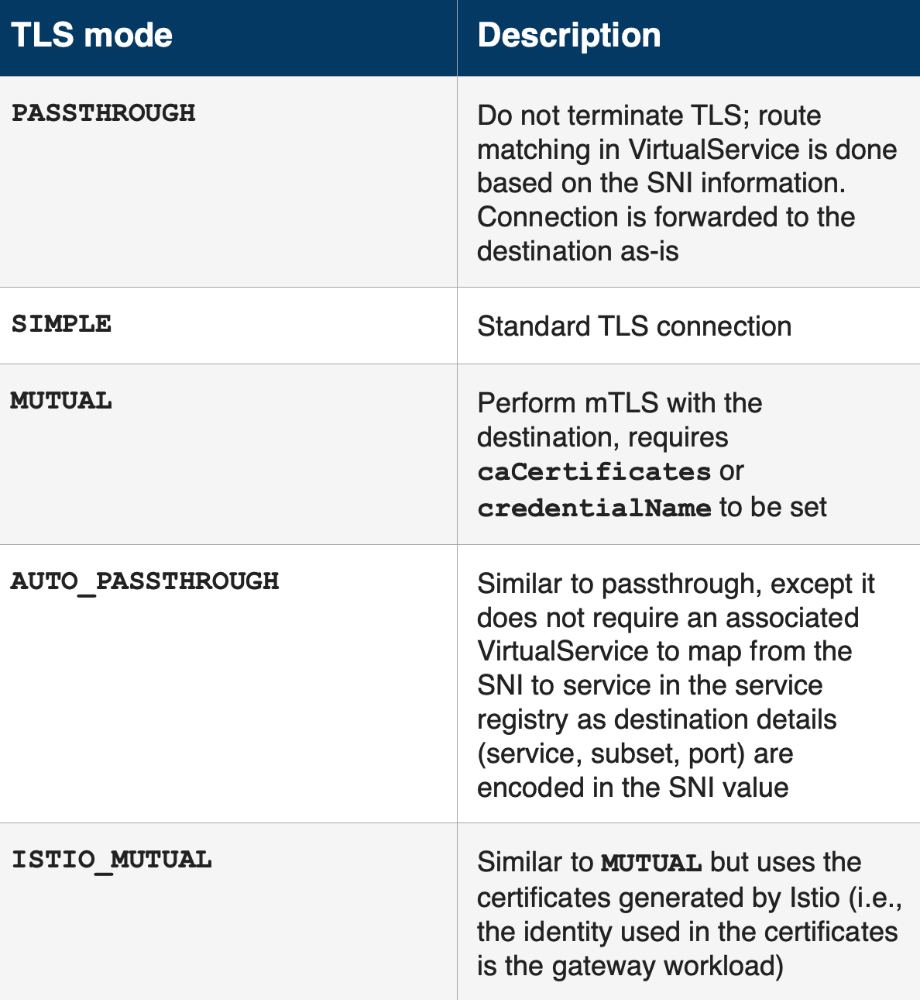
</p>

Other TLS-related configurations in the Gateway resource, such as TLS versions, can be found in the [documentation](https://istio.io/latest/docs/reference/config/networking/gateway/#ServerTLSSettings) and [secure gateways](https://istio.io/latest/docs/tasks/traffic-management/ingress/secure-ingress/). When configuring TLS settings for outgoing traffic through the egress gateway, the same configuration applies to the regular Envoy sidecar proxies in the mesh - the DestinationRule is used.

### Mutual TLS - Lab
In this lab, we will deploy the sample application (web-frontend and customers service). The web-frontend will be deployed without an Envoy proxy sidecar, while the customers service will have the sidecar injected. With this setup, we will see how Istio can send both mTLS and plain text traffic and change the TLS mode to STRICT.

Let's start by deploying a Gateway resource:

```yaml
apiVersion: networking.istio.io/v1alpha3
kind: Gateway
metadata:
  name: gateway
spec:
  selector:
    istio: ingressgateway
  servers:
    - port:
        number: 80
        name: http
        protocol: HTTP
      hosts:
        - '*'
```

 NOTE: You can download the supporting YAML and other files from this Github repo.

Save the above YAML to `gateway.yaml` and deploy the Gateway using the following command:

```sh
$ kubectl apply -f gateway.yaml
```

Next, we will create the web-frontend, the customers-v1 deployments, and related Kubernetes services.

##### Disabling Sidecar Injection

Before deploying the applications, we will disable the automatic sidecar injection in the default namespace so the proxy doesn't get injected into the web-frontend deployment. Before we deploy the customers-v1 service, we will enable the injection again so the workload gets the proxy injected.

We are doing this to simulate a scenario where one workload is not part of the mesh.

```sh
$ kubectl label namespace default istio-injection-
namespace/default labeled
```

With injection disabled, let's create the web-frontend deployment, service, and the VirtualService resource:

```yaml
apiVersion: apps/v1
kind: Deployment
metadata:
  name: web-frontend
  labels:
    app: web-frontend
spec:
  replicas: 1
  selector:
    matchLabels:
      app: web-frontend
  template:
    metadata:
      labels:
        app: web-frontend
        version: v1
    spec:
      containers:
        - image: gcr.io/tetratelabs/web-frontend:1.0.0
          imagePullPolicy: Always
          name: web
          ports:
            - containerPort: 8080
          env:
            - name: CUSTOMER_SERVICE_URL
              value: 'ht‌tp://customers.default.svc.cluster.local'
---
kind: Service
apiVersion: v1
metadata:
  name: web-frontend
  labels:
    app: web-frontend
spec:
  selector:
    app: web-frontend
  ports:
    - port: 80
      name: http
      targetPort: 8080
---
apiVersion: networking.istio.io/v1alpha3
kind: VirtualService
metadata:
  name: web-frontend
spec:
  hosts:
    - '*'
  gateways:
    - gateway
  http:
    - route:
        - destination:
            host: web-frontend.default.svc.cluster.local
            port:
              number: 80
```

Save the above YAML to `web-frontend.yaml` and create the deployment, service, and VirutalService using the following command:

```sh
$ kubectl apply -f web-frontend.yaml
```

If we look at the running Pods, we should see one Pod with a single container running, indicated by the 1/1 in the READY column:

```sh
$ kubectl get po
NAME                          READY  STATUS   RESTARTS  AGE
web-frontend-659f65f49-cbhvl  1/1    Running  0         7m31s
```

Let's re-enable the automatic sidecar proxy injection:

```sh
$ kubectl label namespace default istio-injection=enabled
namespace/default labeled
```

And then deploy the customers-v1 workload:

```yaml
apiVersion: apps/v1
kind: Deployment
metadata:
  name: customers-v1
  labels:
    app: customers
    version: v1
spec:
  replicas: 1
  selector:
    matchLabels:
      app: customers
      version: v1
  template:
    metadata:
      labels:
        app: customers
        version: v1
  spec:
    containers:
      - image: gcr.io/tetratelabs/customers:1.0.0
        imagePullPolicy: Always
        name: svc
        ports:
          - containerPort: 3000
---
kind: Service
apiVersion: v1
metadata:
  name: customers
  labels:
    app: customers
spec:
  selector:
    app: customers
  ports:
    - port: 80
      name: http
      targetPort: 3000
---
apiVersion: networking.istio.io/v1alpha3
kind: VirtualService
metadata:
  name: customers
spec:
  hosts:
    - 'customers.default.svc.cluster.local'
  http:
    - route:
        - destination:
            host: customers.default.svc.cluster.local
            port:
             number: 80
```

Save the above to `customers-v1.yaml` and crete the resources using the following command:

```sh
$ kubectl apply -f customers-v1.yaml
```

We should have both applications deployed and running. The `customers-v1` pod will have two containers, and the `web-frontend` pod will have one:

```sh
$ kubectl get po 
NAME                           READY  STATUS   RESTARTS  AGE
customers-v1-7857944975-qrqsz  2/2    Running  0         4m1s
web-frontend-659f65f49-cbhvl   1/1    Running  0         13m
```

##### Permissive Mode in Action

Let’s set the environment variable called GATEWAY_IP that stores the gateway IP address:

```sh
$ export GATEWAY_IP=$(kubectl get svc -n istio-system istio-ingressgateway -ojsonpath='{.status.loadBalancer.ingress[0].ip}')
```

If we try to navigate to the GATEWAY_IP, we will get the web page with the customer service's response. Accessing the GATEWAY_IP works because of the permissive mode, where plain text traffic gets sent to the services that do not have the proxy. In this case, the ingress gateway sends plain text traffic to the web-frontend because there's no proxy.


##### Observing the Permissive Mode in Kiali

To  install observability tools such as **Kiali**, **Prometheus**, **Grafana**, **Jaeger**, look at https://istio.io/latest/docs/tasks/observability/gateways/  to build a secure (https) or insecure (http) access for these services.

If we open Kiali with `istioctl dash kiali` and look at the Graph, you will notice that Kiali detects calls made from the ingress gateway to the web frontend. Make sure you select both the default namespace and the `istio-system` namespace. However, the calls made to the customers service are coming from unknown service. This is because there's no proxy next to the web-frontend. Therefore Istio doesn't know who, where or what that service is. Calls to customers-v1 service are coming from an unknown service because there’s no proxy injected

<p align="center">
    
</p>


##### Exposing the "customers" Service
Let's update the customers VirtualService and attach the gateway to it. Attaching the gateway allows us to make calls directly to the service.

```yaml
apiVersion: networking.istio.io/v1alpha3
kind: VirtualService
metadata:
  name: customers
spec:
  hosts:
    - 'customers.default.svc.cluster.local'
  gateways:
    - gateway
  http:
    - route:
        - destination:
            host: customers.default.svc.cluster.local
            port:
              number: 80
```

Save the above to `vs-customers-gateway.yaml` and update the VirtualService using the following command:
```sh
$ kubectl apply -f vs-customers-gateway.yaml
```

##### Generating Traffic to the "customers" Service
We can now specify the Host header and send the requests through the ingress gateway (GATEWAY_IP) to the customers service:

```sh
$ curl -H "Host: customers.default.svc.cluster.local" http://$GATEWAY_IP
[{"name":"Jewel Schaefer"},{"name":"Raleigh Larson"},{"name":"Eloise Senger"},{"name":"Moshe Zieme"},{"name":"Filiberto Lubowitz"},{"name":"Ms.Kadin Kling"},{"name":"Jennyfer Bergstrom"},{"name":"Candelario Rutherford"},{"name":"Kenyatta Flatley"},{"name":"Gianni Pouros"}]
```

To generate some traffic to both the `web-frontend` and `customers-v1` deployments through the ingress, open the two terminal windows and run one command in each:

```sh
// Terminal 1
$ while true; do curl -H "Host: customers.default.svc.cluster.local" http://$GATEWAY_IP; done
// Terminal 2
$ while true; do curl ht‌tp://$GATEWAY_IP; done
```

##### Observing the Traffic in Kiali

Open Kiali and look at the Graph. From the Display dropdown, make sure you check the Security option. You should see a graph showing the traffic between istio-ingressgateway and customers-v1 is using mTLS as indicated by the padlock icon which means the traffic gets sent using mTLS.

NOTE: If you do not see the padlock icon, click the Display dropdown and ensure the "Security" option is selected. 

However, there's no padlock between the unknown and the `customers-v1` service, as well as the istio-ingress-gateway and web-frontend. Proxies send plain text traffic between services that do not have the sidecar injected. 

##### Enabling "STRICT" mode

Let's see what happens if we enable mTLS in STRICT mode. We expect the calls from the web-frontend to the customers-v1 service to fail because there's no proxy injected to do the mTLS communication. On the other hand, the calls from the ingress gateway to the customers-v1 service will continue working.

```yaml
apiVersion: security.istio.io/v1beta1
kind: PeerAuthentication
metadata:
  name: default
  namespace: default
spec:
  mtls:
    mode: STRICT
```

Save the above YAML to `strict-mtls.yaml` and create the PeerAuthentication resource using the following command:

```sh
$ kubectl apply -f strict-mtls.yaml
```

If we still have the request loop running, we will see the ECONNRESET error message from the web-frontend. This error indicates that the `customers-v1` service closed the connection. In our case, it was because it was expecting an mTLS connection. On the other hand, the requests we make directly to the customers-v1 service continue to work because the customers-v1 service has an Envoy proxy running next to it and can do mTLS. If we delete the PeerAuthentication resource deployed earlier using `kubectl delete peerauthentication default`, Istio returns to its default, the PERMISSIVE mode, and the errors will disappear.

###### Cleanup
To clean up the resources, run:
```sh
$ kubectl delete deploy web-frontend customers-v1
$ kubectl delete svc customers web-frontend
$ kubectl delete vs customers web-frontend
$ kubectl delete gateway gateway
```

## Authenticating Users

While the PeerAuthentication resource is used to control service authentication, the **RequestAuthentication** resource is used for end-user authentication. The authentication is done per request and verifies the credentials attached to the request in JSON Web Tokens (JWTs). Just like we used the SPIFFE identity to identify services, we can use JWT to authenticate users.

Request authentication policies specify the values needed to validate a JSON Web Token (JWT). These values include, among others, the following:
- The location of the token in the request
- The issuer or the request
- The public JSON Web Key Set (JWKS)

Istio checks the presented token against the rules in the request authentication policy, and rejects requests with invalid tokens. When requests carry no token, they are accepted by default. To reject requests without tokens, provide authorization rules that specify the restrictions for specific operations, for example paths or actions.


Let’s look at an example RequestAuthentication resource:

```yaml
apiVersion: security.istio.io/v1beta1
kind: RequestAuthentication
metadata:
name: customers-v1
namespace: default
spec:
 selector:
   matchLabels:
     app: customers-v1
 jwtRules:
 - issuer: "issuer@tetrate.io"
   jwksUri: "someuri"
```

The above resource applies to all workloads in the default namespace that match the selector labels. The resource is saying that any requests made to those workloads will need a JWT attached to the request. The RequestAuthentication resource configures how the token and its signature are authenticated using the settings in the jwtRules field. If the request doesn’t have a valid JWT attached, the request will be rejected because the token doesn’t conform to JWT rules. The request will not be authenticated if we do not provide a token. If the token is valid, then we have an authenticated principal. We can use the principal to configure authorization policies.

### Authorization (authz)
Authorization is answering the access control question. Is a principal allowed to perform an action on an object? Even though we might have an authenticated principal, we still might not be able to perform a certain action. For example, you can be an authenticated user, but you won’t be able to perform administrative actions if you are not authorized. Similarly, a service can be authenticated but is not allowed to make POST requests to other services, for example.

To properly enforce access control, we need both authentication and authorization. _If we only authenticate the principles without authorizing them, the principals can perform any action on any objects._ Similarly, if we only authorize the actions or requests, a principal can pretend to be someone else and perform all actions again. 

Istio’s authorization features provide mesh-, namespace-, and workload-wide access control for your workloads in the mesh. This level of control provides the following benefits:
- Workload-to-workload and end-user-to-workload authorization.
- A simple API: it includes a single AuthorizationPolicy CRD, which is easy to use and maintain.
- Flexible semantics: use `CUSTOM`, `DENY` and `ALLOW` actions.
- High performance: Istio authorization (ALLOW and DENY) is enforced natively on Envoy.
- High compatibility: supports `gRPC`, `HTTP`, `HTTPS` and `HTTP/2` natively, as well as any plain `TCP` protocols.


#### Authorization Policies

The authorization policy enforces access control to the inbound traffic in the server side Envoy proxy. Each Envoy proxy runs an authorization engine that authorizes requests at runtime. When a request comes to the proxy, the authorization engine evaluates the request context against the current authorization policies, and returns the authorization result, either ALLOW or DENY.

To configure an authorization policy, you create an **AuthorizationPolicy** custom resource. An authorization policy includes a **selector**, an **action**, and a list of **rules**:
- The selector field specifies the target of the policy
- The action field specifies whether to allow or deny the request
- The rules specify when to trigger the action
- The **from** field in the rules specifies the sources of the request
- The **to** field in the rules specifies the operations of the request
- The **when** field specifies the conditions needed to apply the rule

For more info see istio [security](https://istio.io/latest/docs/concepts/security/), [authz-tcp](https://istio.io/latest/docs/tasks/security/authorization/authz-tcp/) and [authz-http](https://istio.io/latest/docs/tasks/security/authorization/authz-http/).

When you use peer authentication policies and mutual TLS, Istio extracts the identity from the peer authentication into the `source.principal`. Similarly, when you use request authentication policies, Istio assigns the identity from the JWT to the `request.auth.principal`.

Whether we get the principals from the PeerAuthentication resource or RequestAuthentication, we can use these identities to write authorization policies with the AuthorizationPolicy resource. We can use the **principal** field to write policies based on service identities and the **requestPrincipals** field to write policies based on users.

Let’s look at an example:

```yaml
apiVersion: security.istio.io/v1beta1
kind: AuthorizationPolicy
metadata:
  name: require-jwt
  namespace: default
spec: 
 selector:
   matchLabels:
     app: hello-world
 action: ALLOW
rules:
- from:
  - source:
     requestPrincipals: ["*"]
```

The policy applies to all workloads in the default namespace matching the selector labels. Each AuthorizationPolicy includes an action - that says whether the action is allowed or denied based on the rules set in the rules field. Note that there are other actions we can set, and we will explain them later. In this example, we aren’t checking for any specific principal. Instead, we just need a principal to be set. With this combination and a corresponding RequestAuthentication resource, we guarantee that only authenticated requests will reach the workloads in the default namespace, labeled with the app: hello-world label.

Let’s look at the three possible scenarios we can encounter in this case:
- Token is not present: it means that the request is not authenticated (that’s what RequestAuthentication resource ensures). Because the request is not authenticated, the requestPrincipal field value won’t be set. However, because we require a request principal to be set (the * notation) in the AuthorizationPolicy, but there isn’t one, the request will be denied

- Token is present but invalid: The validity of the JWT is checked by the RequestAuthentication. If that fails, the AuthorizationPolicy won’t even be processed.

- Token is valid: the requestPrincipals field will be set. In the rules field of the AuthorizationPolicy, we only allow the calls to be made from sources with the request principal set. Since that is set, we can send the requests to the workloads with the `app: hello-world` labels set.
  
##### Sources Identities ("from" field)

Using the from field we can set the source identities of a request. The sources we can use are:
- **principals**
- **request principals**
- **namespaces**
- **IP blocks**
- **remote IP blocks**

We can also provide a list of negative matches for each one of the sources and combine them with logical `AND`.

For example:

```yaml
rules:
- from:
  - source:
      ipBlocks: ["10.0.0.1", “10.0.0.2”]
  - source:
      notNamespaces: ["prod"]
  - source:
      requestPrincipals:
      - "tetrate.io/peterj"
```

The above rules would apply to sources coming from one of the two IP addresses that are not in the prod namespace and have the request principal set to `etrate.io/peterj`.

##### Request Operation ("to" field)

The `to` field specifies the operations of a request. We can use the following operations:

- hosts
- ports
- methods
- paths
  
For each of the above, we can set the list of negative matches and combine them with the logical `AND`. For example:

```yaml
to:
  - operation:
      host: ["*.hello.com"]
      methods: ["DELETE"]
      notPaths: ["/admin*"]
```

The above operation matches if the host ends with `*.hello.com` and the method is `DELETE`, but the path doesn’t start with `/admin`.

##### Conditions ("when" field)

With the when field, we can specify any additional conditions based on the Istio attributes. The attributes include headers, source and remote IP address, auth claims, destination port and IP addresses, and others.

For example:

```yaml
when:
   - key: request.auth.claims[iss]
     values: ["ht‌tps://accounts.google.com"]
   - key: request.headers[User-Agent]
     notValues: ["curl/*"]
```

The above condition evaluates to true if the iss claim from the authenticated JWT equals the provided value and the User Agent header doesn’t start with `curl/`.

##### Configure the "action" Field

Once we have written the rules, we can also configure the action field. We can either `ALLOW` or `DENY` the requests matching those rules. The additional supported actions are `CUSTOM` and `AUDIT`.

For example:

```yaml
spec:
  action: DENY
  rules:
  - from:
    to:
    when:
    ...
```

The `CUSTOM` action is when we specify our custom extension to handle the request. The custom extension needs to be configured in the `MeshConfig`. An example of using this is if we wanted to integrate a custom external authorization system to delegate the authorization decisions to it. Note that the `CUSTOM action is experimental, so it might break or change in future Istio versions.

The `AUDIT` action can be used to audit a request that matches the rules. If the request matches the rules, the `AUDIT` action triggers logging that request. This action doesn’t affect whether the requests are allowed or denied. Only `DENY`, `ALLOW`, and `CUSTOM` actions can do that. A sample scenario for when one would use the `AUDIT` action is when you are migrating workloads from `PERMISSIVE` to `STRICT` mTLS mode.

#### How Are Rules Evaluated?

If we set any authorization policies, everything will be allowed. However, requests that do not conform to the allow policy rules will be denied as soon as we set any `ALLOW` policies. The rules get evaluated in the following order:

- CUSTOM policies
- DENY policies
- ALLOW policies
  
If we have multiple policies defined, they are aggregated and evaluated, starting with the `CUSTOM` policies. So, if we have two rules - one for `ALLOW` and one for `DENY`, the `DENY` rule will be enforced. If we use all three actions, the `CUSTOM` action is evaluated first.

Assume we have defined policies that use all three actions. We will evaluate the `CUSTOM` policies and then deny or allow the request based on that. Next, the `DENY` policies matching the request get evaluated. If we get past those, and if there are no ALLOW policies set, we will allow the request. If any `ALLOW` policies match the request, we will also allow it. If they do not, the request gets denied. For a complete flowchart of authorization policy precedence, refer to [this](https://istio.io/latest/docs/concepts/security/#implicit-enablement) page.

A good practice is to create a policy denying all requests. Once we have that in place, we can create individual ALLOW policies and explicitly allow communication between services.

### Access Control - Lab

In this lab, we will learn how to use an authorization policy to control access between workloads. Let's start by deploying the Gateway:

```yaml
apiVersion: networking.istio.io/v1alpha3
kind: Gateway
metadata:
  name: gateway
spec:
  selector:
    istio: ingressgateway
  servers:
    - port:
        number: 80
        name: http
        protocol: HTTP
      hosts:
        - '*'
```


NOTE: You can download the supporting YAML and other files from [this](https://tetr8.io/cncf-source-files) Github repo.

Save the above YAML to file and apply it to the cluster. Next, we will create the `web-frontend` deployment, service account, Kubernetes service, and a VirtualService.

```yaml
apiVersion: v1
kind: ServiceAccount
metadata:
  name: web-frontend
---
apiVersion: apps/v1
kind: Deployment
metadata:
  name: web-frontend
  labels:
    app: web-frontend
spec:
  replicas: 1
  selector:
    matchLabels:
      app: web-frontend
  template:
    metadata:
      labels:
        app: web-frontend
        version: v1
    spec:
      serviceAccountName: web-frontend
      containers:
        - image: gcr.io/tetratelabs/web-frontend:1.0.0
          imagePullPolicy: Always
          name: web
          ports:
            - containerPort: 8080
          env:
            - name: CUSTOMER_SERVICE_URL
              value: 'ht‌tp://customers.default.svc.cluster.local'
---
kind: Service
apiVersion: v1
metadata:
  name: web-frontend
  labels:
    app: web-frontend
spec:
  selector:
    app: web-frontend
  ports:
    - port: 80
      name: http
      targetPort: 8080
---
apiVersion: networking.istio.io/v1alpha3
kind: VirtualService
metadata:
  name: web-frontend
spec:
  hosts:
    - '*'
  gateways:
    - gateway
  http:
    - route:
        - destination:
            host: web-frontend.default.svc.cluster.local
            port:
              number: 80
```

Apply it. Finally, we will deploy the customers v1 service:

```yaml
apiVersion: v1
kind: ServiceAccount
metadata:
  name: customers-v1
---
apiVersion: apps/v1
kind: Deployment
metadata:
  name: customers-v1
  labels:
    app: customers
    version: v1
spec:
  replicas: 1
  selector:
    matchLabels:
      app: customers
      version: v1
  template:
    metadata:
      labels:
        app: customers
        version: v1
    spec:
      serviceAccountName: customers-v1
      containers:
        - image: gcr.io/tetratelabs/customers:1.0.0
          imagePullPolicy: Always
          name: svc
          ports:
            - containerPort: 3000
---
apiVersion: v1
kind: Service
metadata:
  name: customers
  labels:
    app: customers
spec:
  selector:
    app: customers
  ports:
    - port: 80
      name: http
      targetPort: 3000
---
apiVersion: networking.istio.io/v1alpha3
kind: VirtualService
metadata:
  name: customers
spec:
  hosts:
    - 'customers.default.svc.cluster.local'
  gateways:
    - gateway
  http:
    - route:
        - destination:
            host: customers.default.svc.cluster.local
            port:
              number: 80
```

Apply it. We can set the environment variable called GATEWAY_IP that stores the gateway IP address:

```sh
$ export GATEWAY_IP=$(kubectl get svc -n istio-system istio-ingressgateway -ojsonpath='{.status.loadBalancer.ingress[0].ip}')
```

If we open the GATEWAY_IP, the web page with the data from the customers-v1 service is displayed as shown in the figure.
 
Let's start by creating an AuthorizationPolicy resource that denies all requests between services in the default namespace.

```yaml
apiVersion: security.istio.io/v1beta1
kind: AuthorizationPolicy
metadata:
  name: deny-all
  namespace: default
spec:
   {}
```
Apply it. If we try to send a request to GATEWAY_IP we will get back the access denied response:

```sh
$ curl $GATEWAY_IP 
RBAC: access denied
```

Similarly, if we run a pod inside the cluster and make a request from within the default namespace to either the web-frontend or the `customers-v1` service, we will get the same error.
```sh
$ kubectl run curl --image=radial/busyboxplus:curl -i --tty
If you don't see a command prompt, try pressing enter.
[ root@curl:/ ]$ curl customers 
RBAC: access denied
[ root@curl:/ ]$ curl web-frontend
RBAC: access denied
```
In both cases, we get back the access denied error. You can type exit, to exit the container.

#### Enabling Requests from Ingress to “web-frontend"

We will first allow requests to be sent from the ingress gateway to the web-frontend workload using the ALLOW action. The rules section specifies the source namespace (istio-system) where the ingress gateway is running and the ingress gateway's service account name in the principals field.

```yaml
apiVersion: security.istio.io/v1beta1
kind: AuthorizationPolicy
metadata:
  name: allow-ingress-frontend
  namespace: default
spec:
  selector:
    matchLabels:
      app: web-frontend
  action: ALLOW
  rules:
    - from:
        - source:
            namespaces: ["istio-system"]
        - source:
            principals: ["cluster.local/ns/istio-system/sa/istio-ingressgateway-service-account"]
```

Apply it. Suppose we try to send a request to the GATEWAY_IP. In that case, we will get a different error:

```sh
$ curl ht‌tp://$GATEWAY_IP
"Request failed with status code 403"
```

Note:  It takes a couple of seconds for Istio to distribute the policy to all proxies, so you might still see the RBAC: access denied message for the first couple of requests.

This error is coming from the `customers-v1` service - remember, we allowed calls from the ingress gateway to the web-frontend. However, web-frontend still isn’t allowed to make calls to the customers-v1 service. If we go back to the curl pod we are running inside the cluster and try to send a request to ht‌tp://web-frontend we will get an RBAC error:

```sh
$ kubectl run curl --image=radial/busyboxplus:curl -i --tty
$ curl ht‌tp://web-frontend
RBAC: access denied
```

The initial DENY policy we deployed is still in effect. We only allow calls to be made from the ingress gateway to the web-frontend. Calls between other services (including the curl pod) will be denied.

When we deployed the web-frontend, we created a service account and assigned it to the pod. The service account represents the pods’ identity. Each namespace in Kubernetes has a default service account. If we do not explicitly assign a service account to the pod, the default service account from the namespace is used. It is good practice to create a separate service account for each deployment. Otherwise, all pods in the same namespace will have the same identity, which is useless when trying to enforce access policies.

##### Enabling Requests from "web-frontend" to “customers"
We can use the service account to configure which workloads can make requests to the customer.

```yaml
apiVersion: security.istio.io/v1beta1
kind: AuthorizationPolicy
metadata:
  name: allow-web-frontend-customers
  namespace: default
spec:
  selector:
    matchLabels:
        app: customers
        version: v1
  action: ALLOW
  rules:
  - from:
    - source:
        namespaces: ["default"]
      source:
        principals: ["cluster.local/ns/default/sa/web-frontend"]
```

Apply it. As soon as the policy gets created, we can send a couple of requests to `$GATEWAY_IP`, and we will get back the responses from customers service. If we would go back to the curl and try sending requests to web-frontend or customers, we would still get back the `RBAC: access denied` error message because the curl pod is not permitted to make calls to those services.

In this lab, we have used multiple authorization policies to explicitly allow calls from the ingress to the front end and the front end to the backend service. _Using a deny-all approach is an excellent way to start because we can control, manage, and then explicitly allow the communication we want to happen between individual services._

#### Gateway and Auth

The Istio ingress gateway supports routing based on authenticated JWT, which is useful for routing based on end user identity and more secure compared using the unauthenticated HTTP attributes (e.g. path or header).

1. First create the request authentication policy to enable JWT validation. Apply the policy in the namespace of the workload it selects:

    ```sh
    $ kubectl apply -f - <<EOF
    apiVersion: security.istio.io/v1
    kind: RequestAuthentication
    metadata:
      name: "jwt-example"
      namespace: istio-system # namespace in which gateway exists 
    spec:
      selector:
        matchLabels:
          istio: ingressgateway
      jwtRules:
      - issuer: "testing@secure.istio.io"
        jwksUri: "https://raw.githubusercontent.com/istio/istio/release-1.22/security/tools/jwt/samples/jwks.json"
    EOF
    ```
    If you provide a token in the authorization header, its implicitly default location, Istio validates the token using the [public key set](https://raw.githubusercontent.com/istio/istio/release-1.22/security/tools/jwt/samples/jwks.json), and rejects requests if the bearer token is invalid. However, requests without tokens are accepted.

2. Add a Authorization policy to only allow requests with valid JWT tokens or deny any request without JWT token (means, it has to have request principals …)

    ```sh
    $ kubectl apply -f - <<EOF
    apiVersion: security.istio.io/v1
    kind: AuthorizationPolicy
    metadata:
      name: "frontend-ingress"
      namespace: istio-system
    spec:
      selector:
        matchLabels:
          istio: ingressgateway
      action: DENY
      rules:
      - from:
        - source:
            notRequestPrincipals: ["*"]
    EOF
    ```
For more info see [auth policies](https://istio.io/latest/docs/tasks/security/authentication/authn-policy/) and [jwt-route](https://istio.io/latest/docs/tasks/security/authentication/jwt-route/).

## Policy storage
Istio stores mesh-scope policies in the **root namespace** (default: istio-system). These policies have an empty selector apply to all workloads in the mesh. Policies that have a namespace scope are stored in the corresponding namespace. They only apply to workloads within their namespace. 

If you configure a selector field, the authentication policy only applies to workloads matching the conditions you configured. Peer and request authentication policies are stored separately by kind, PeerAuthentication and RequestAuthentication respectively. Peer and request authentication policies use selector fields to specify the label of the workloads to which the policy applies. If you don’t provide a value for the selector field, Istio matches the policy to all workloads in the storage scope of the policy. Thus, the selector fields help you specify the scope of the policies:
- **Mesh-wide policy**: A policy specified for the root namespace without or with an empty selector field.
- **Namespace-wide policy**: A policy specified for a non-root namespace without or with an empty selector field.
- **Workload-specific policy**: a policy defined in the regular namespace, with non-empty selector field.
  
There can be only one mesh-wide peer authentication policy, and only one namespace-wide peer authentication policy per namespace. When you configure multiple mesh- or namespace-wide peer authentication policies for the same mesh or namespace, Istio ignores the newer policies. When more than one workload-specific peer authentication policy matches, Istio picks the oldest one. Istio applies the narrowest matching policy for each workload using the following order:
- workload-specific
- namespace-wide
- mesh-wide

--------------
# Advanced Topics for Istio

## External Authorization
Istio provides a way to integrate external auth providers into your auth flow. To do this, 

1. Define the external authorizer
CUSTOM Action: In order to use the CUSTOM action in the authorization policy, you must define the external authorizer that is allowed to be used in the mesh. This is currently defined in the extension provider in the **mesh config**. Currently, the only supported extension provider type is the Envoy **ext_authz** provider. The external authorizer must implement the corresponding Envoy ext_authz check API. Add the extension provider
2. Enable with external authorization
Apply an authorization policy with the CUSTOM action value. Then at runtime, requests to destination workload will be paused by the ext_authz filter, and a check request will be sent to the external authorizer to decide whether the request should be allowed or denied

To see external auth implemented using Kubernetes Ingress, look at [K8s Ingress External Authentication with OAuth2 Proxy](https://ibrahimhkoyuncu.medium.com/kubernetes-ingress-external-authentication-with-oauth2-proxy-and-keycloak-9924a3b2d34a) for session storage.


Ingress external authentication is a mechanism that enables authentication for incoming requests to services deployed within a Kubernetes cluster through an Ingress controller. It allows you to enforce authentication before granting access to your applications, providing an additional layer of security and control. Benefits of using Kubernetes Ingress external authentication:
	- Centralized Authentication: With external authentication, you can centralize the authentication logic for multiple services deployed within your Kubernetes cluster. This eliminates the need for individual authentication mechanisms for each service.
	- Flexible Authentication Providers: including OAuth2 providers like Google, GitHub, or OpenID Connect providers. This flexibility allows you to leverage existing authentication systems or choose the one that best suits your needs.
	- Simplified User Experience: External authentication allows users to authenticate using their existing credentials from well-known providers. This simplifies the user experience, as users don’t need to create new accounts or remember additional usernames and passwords.
	
For more details, see [istio better-external-authz](https://istio.io/latest/docs/tasks/security/authorization/authz-custom/
https://istio.io/v1.16/blog/2021/better-external-authz/) and [more security problems](https://istio.io/v1.7/docs/ops/common-problems/security-issues/)


**Tip**: It’s hard to figure out where the Envoy configuration gets hooked up. Use `istioctl proxy-status`
to see what envoy is doing. Verify the Envoy proxy configuration of the target workload using `istioctl proxy-config` command.
```sh
$ POD=$(kubectl get pod -l app=httpbin -n foo -o jsonpath={.items..metadata.name})
$ istioctl proxy-config listener ${POD} -n foo --port 80 -o json
```


## Deployment Models for Serice Mesh

### Multi-cluster Deployments

A multi-cluster deployment (two or more clusters) gives us greater isolation and availability, but the cost we pay is increased complexity. We will deploy clusters across multiple zones and regions if the scenarios require high availability (HA).
The next decision we need to make is to decide if we want to run the clusters within one network or if we want to use multiple networks. The following figure shows a multi-cluster scenario (Cluster A, B, and C) deployed across two networks.
 
<p align="center">
    
</p>

##### Network Deployment Models
When multiple networks are involved, the workloads running inside the clusters must use Istio gateways to reach workloads in other clusters. Using various networks allows for better fault tolerance and scaling of network addresses.
 
<p align="center">
    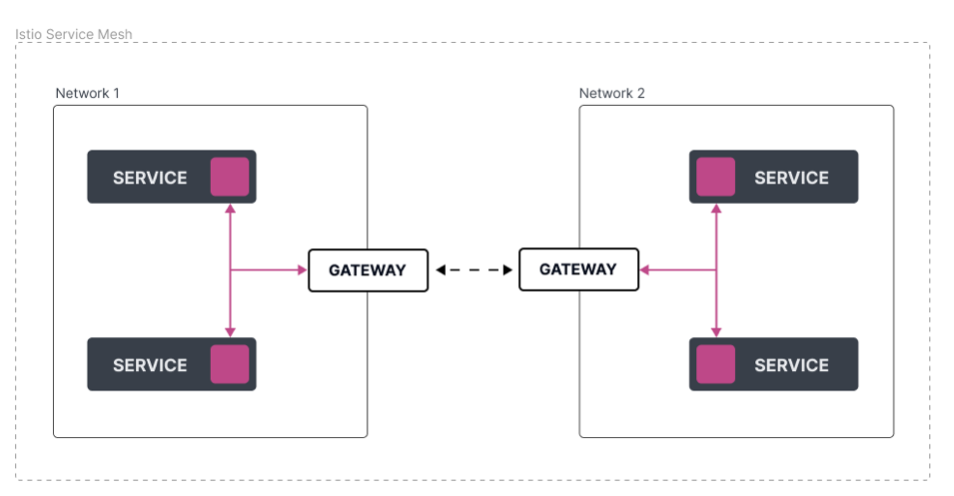
</p>

The gateways services use to communicate across or within the cluster are called east-west gateways.

##### Control Plane Deployment Models
Istio service mesh uses the control plane to configure all communications between workloads inside the mesh. The control plane the workloads connect to depends on their configuration. In the simplest case, we have a service mesh with a single control plane in a single cluster. This is the configuration we've been using throughout this course.

<p align="center">
    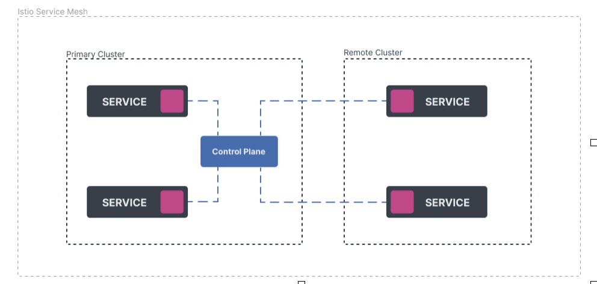
</p>

The shared control plane model involves multiple clusters where the control plane only runs in one cluster. That cluster is referred to as a primary cluster, while other clusters in the deployment are called remote clusters. These clusters don't have their control plane. Instead, they are sharing the control plane from the primary cluster.

Another deployment model is where we treat all clusters as remote clusters controlled by an external control plane. The external control plane gives us a complete separation between the control plane and the data plane. A typical example of an external control plane is when a cloud vendor manages it.
For high availability, we should deploy multiple control plane instances across multiple clusters, zones, or regions, as shown in the figure below.

<p align="center">
    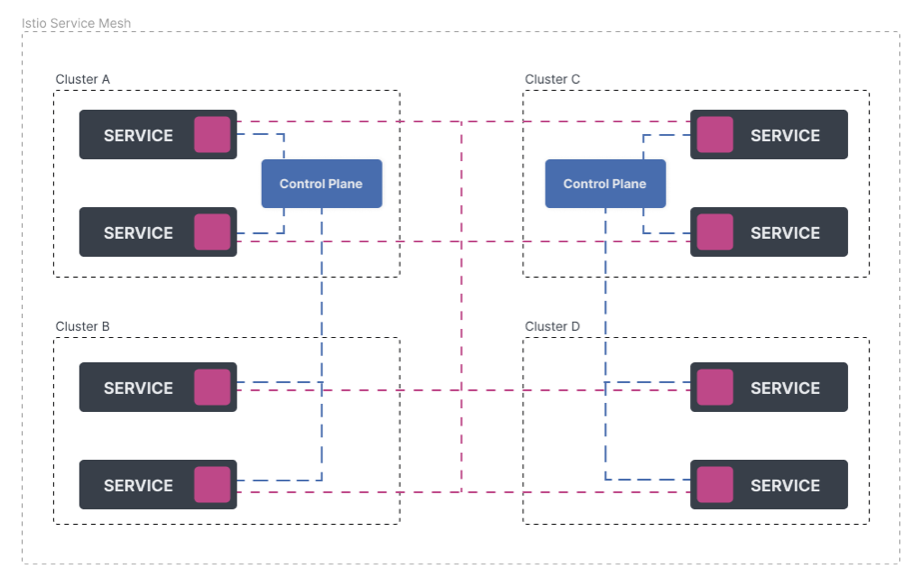
</p> 

This model offers **improved availability** and **configuration isolation**. If one of the control planes becomes unavailable, the outage is limited to that one control plane. To improve that, you can implement failover and configure workload instances to connect to another control plane in case of failure.
For the highest availability possible, we can deploy a control plane inside each cluster.

#### Mesh Deployment Models
All scenarios we have discussed so far use a single mesh. In a single mesh model, all services are in one mesh, regardless of how many clusters and networks they are spanning. A deployment model where multiple meshes are federated together is called a multi-mesh deployment. In this model, services can communicate across mesh boundaries. The model gives us a cleaner organizational boundary and stronger isolation and reuses service names and namespaces.

When federating two meshes, each mesh can expose a set of services and identities that all participating meshes can recognize. To enable cross-mesh service communication, we have to enable trust between the two meshes. Trust can be established by importing a trust bundle to a mesh and configuring local policies for those identities.

### Tenancy Models
A tenant is a group of users sharing common access and privileges to a set of workloads. Isolation between the tenants gets done through network configuration and policies. Istio supports namespace and cluster tenancies. Note that the tenancy we discuss here is **soft multi-tenancy**, not hard. There is no guaranteed protection against noisy neighbor problems when multiple tenants share the same Istio control plane.

Within a mesh, Istio uses namespaces as a unit of tenancy. If using Kubernetes, we can grant permissions for workloads deployments per namespace. By default, services from different namespaces can communicate with each other through fully qualified names. In the security section, we learned how to improve isolation using authorization policies and restrict access to only the appropriate callers. In the multi-cluster deployment models, the namespaces in each cluster sharing the same name are considered the same. Service customers from namespace default in cluster A refers to the same service as service customers from namespace default in cluster B. Load balancing is done across merged endpoints of both services when traffic is sent to service customers, as shown in the following figure.

<p align="center">
    
</p> 


To configure cluster tenancy in Istio, we must configure each cluster as an independent service mesh. The meshes can be controlled and operated by separate teams, and we can connect the meshes into a multi-mesh deployment. Suppose we use the same example as before. In that case, service customers running in the default namespace in cluster A does not refer to the same service as service customers from the default namespace in cluster B.

Another critical part of the tenancy is isolating configuration from different tenants. At the moment, Istio does not address this issue. However, it encourages it through the namespace scoped configuration.

A typical multi-cluster deployment topology is one where each cluster has its control plane. For regular service mesh deployments at scale, you should use multi-mesh deployments and have a separate system orchestrating the meshes externally.

It is always recommended to use ingress gateways across clusters, even if they span a single network. Direct pod-to-pod connectivity requires populating endpoint data across multiple clusters, which can slow down and complicate things. A more straightforward solution is to have traffic flow through ingresses across clusters instead.

### Locality Failover
When dealing with multiple clusters, we need to understand the definition of the term locality, which determines a geographical location of a workload inside the mesh. The locality comprises region (ex. canada), zone (central), and subzone (a1), like AWS `ca-centrl-1`. The region and zone are typically set automatically if your Kubernetes cluster runs on cloud providers' infrastructure. For example, nodes of a cluster running GCP in the `us-west1` region and zone `us-west1-a` will have the following labels set:
```sh
topology.kubernetes.io/region=us-west1
topology.kubernetes.io/zone=us-west1-a
```

The sub-zones allow us to divide individual zones further. However, the concept of sub-zones doesn’t exist in Kubernetes. To use sub-zones, we can use the label `topology.istio.io/subzone`.

Once set up, Istio can use the locality information to control load balancing, and we can configure locality failover or locality weighted distribution. The failover settings can be configured in the DestinationRule under the localityLbSettings field. For example:

```yaml
apiVersion: networking.istio.io/v1beta1
kind: DestinationRule
metadata:
  name: helloworld
spec:
  host: helloworld.sample.svc.cluster.local
  trafficPolicy:
    loadBalancer:
      simple: ROUND_ROBIN
      localityLbSetting:
        enabled: true
        failover:
          - from: us-west
            to: us-east
    outlierDetection:
      consecutive5xxErrors: 100
      interval: 1s
      baseEjectionTime: 1m
```

The above example specifies that when the endpoints within the us-west region are unhealthy, the traffic should failover to any zones and sub-zones in the us-east region. Note that the outlier detection settings are required for the failover to function properly. The outlier tells Envoy how to determine whether the endpoints are unhealthy.

Similarly, we can use the locality information to control the distribution of traffic using weights. Consider the following example:

```yaml
apiVersion: networking.istio.io/v1beta1
kind: DestinationRule
metadata:
  name: helloworld
spec:
  host: helloworld.sample.svc.cluster.local
  trafficPolicy:
    loadBalancer:
      simple: ROUND_ROBIN
      localityLbSetting:
        enabled: true
        distribute:
          - from: "us-west1/us-west1-a/*"
            to:
              "us-west1/us-west1-a/*": 50
              "us-west1/us-west1-b/*": 30
              "us-east1/us-east1-a/*": 20
  outlierDetection:
    consecutive5xxErrors: 100
    interval: 1s
    baseEjectionTime: 1m
```

In the above example, we’re distributing traffic that originates in us-west1/us-west1-a in the following manner:
- 50% of the traffic is sent to workloads in `us-west1/us-west1-a
- 30% of the traffic is sent to workloads in `us-west1/us-west1-b`
- 20% of the traffic is sent to workloads in `us-east1/us-east1-a

Upon completing this chapter, you should now be able to:
Understand the purpose of the Sidecar resource.
Understand the process of onboarding virtual machines to the mesh.
Understand the different facets of deploying Istio in multi-cluster scenarios.


### Onboarding VMs
So far, we have assumed that all our workloads run inside Kubernetes clusters as pods. In production, you will most likely have a services architecture with a mix of workloads: some will be containerized and running on a Kubernetes cluster, but others will be running on Virtual Machines (VMs). It's important for a service mesh to support this use case and to be able to onboard workloads running on VMs.

Let us explore how a workload running on a VM can be made a part of the Istio service mesh. 

- The VM workload will need to be accompanied by a sidecar. Istio makes its istio-proxy sidecar available as a Debian (.deb) or CentOS (.rpm) package and can simply be installed on a Linux VM and configured as a **systemd service**. 
- Services on the cluster should be able to call a service backed by a workload running on a VM, using the same fully-qualified hostname resolution used for on-cluster workloads. Conversely, a workload running on the VM should be able to call a service running on the Kubernetes cluster.
In Kubernetes, the endpoints of a service consist of pod IP addresses. A workload running on a VM is akin to a pod, so it's important to be able to target these workloads using labels as selectors.

- A pod running on Kubernetes is associated with a Kubernetes service account and a namespace. That is the basis for its SPIFFE identity. Similarly, the workload running on a VM will require an associated namespace and service account. Istio provides the [**WorkloadEntry**](https://istio.io/latest/docs/reference/config/networking/workload-entry/) custom resource as a mechanism for configuring the VM workload and providing all of these details: the namespace, labels, and service account. Istio also provides the [WorkloadGroup](https://istio.io/latest/docs/reference/config/networking/workload-group/) custom resource as a template for WorkloadEntry resources, which can be automatically created when Istio registers a workload with the mesh. The WorkloadGroup also has a provision for specifying a readiness probe for VM workloads to support health-checking.

<p align="center">
    
</p>


On the left-hand side in the above illustration, we see a Kubernetes cluster with Istio installed and a service (Service A) running inside the cluster. On the right are two additional workloads (Services B and C), each running on a VM. Note how these VMs have an Envoy proxy running as a sidecar. The east-west gateway depicted in the center allows communication between the sidecars running on the VMs and the Istio control plane.

The green arrows show how, in this particular configuration, the services communicate directly with one another (because they all exist within a single network). In a scenario where the VMs reside in a separate network, that traffic would route through the east-west gateway.

The general procedure for onboarding a VM can be summarized by the following steps:
- Create and configure the east-west gateway as described above
- Construct the WorkloadGroup resource
- Install the sidecar on the VM
- Generate the configuration files for the sidecar and copy them to the VM.
- Place all configuration files in their proper locations on the VM.
- Start the sidecar service on the VM

#### Connect a VM Workload to the Istio Mesh
This lab demonstrates how a workload running on a VM can join the Istio service mesh.

Prerequisites
This exercise was developed on GCP, and some of the steps shown are specific to that infrastructure. We begin with a Kubernetes cluster with Istio installed, and running the BookInfo sample application. Next, we will turn off the ratings deployment running inside the Kubernetes cluster, and in its place, we will provision a VM to run the ratings application on it.

##### Create a Kubernetes Cluster
Armed with your GCP (or other) cloud account, create a Kubernetes cluster:

```sh
$ gcloud container clusters create my-istio-cluster \
  --cluster-version latest \
  --machine-type "n1-standard-2" \
  --num-nodes "3" \
  --network "default"
```

Note: make sure you specify a zone or region close to you in the command above.

Wait until the cluster is ready. Install Istio:

```sh
$ istioctl install \
  --set values.pilot.env.PILOT_ENABLE_WORKLOAD_ENTRY_AUTOREGISTRATION=true \
  --set values.pilot.env.PILOT_ENABLE_WORKLOAD_ENTRY_HEALTHCHECKS=true
```

The essential difference between previous installations of Istio and the above command are the two new pilot configuration options that enable workload entry auto-registration and health checks. Auto-registration means that when a workload is created on a VM, Istio will automatically create a WorkloadEntry custom resource.

Finally, deploy the BookInfo sample application, as follows:

```sh
$ kubectl label ns default istio-injection=enabled
$ cd ~/istio-1.14.3
istio-1.14.3$ kubectl apply -f samples/bookinfo/platform/kube/bookinfo.yaml
```
Topology of the BookInfo application:

<p align="center">
    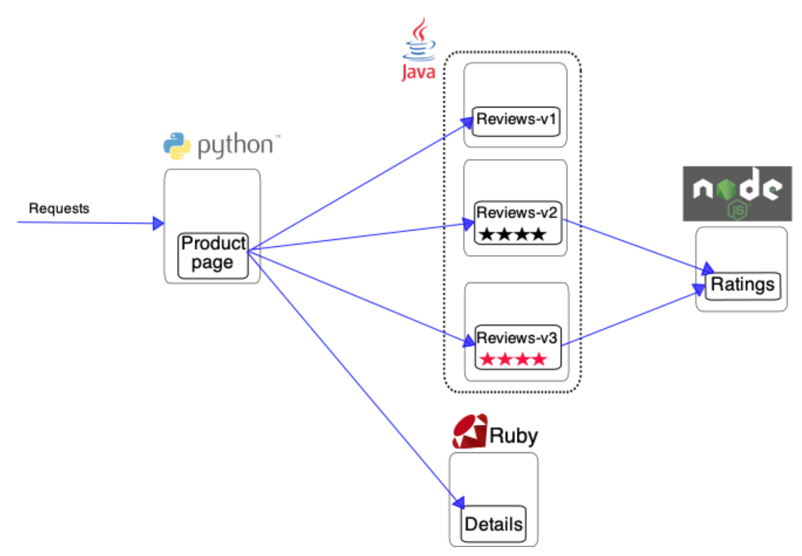
</p>

 
In the following steps, we will focus specifically on BookInfo's ratings service. We will be inspecting the "star" ratings shown on BookInfo's product page as a means of determining whether the service is up and reachable. Notice in the above illustration that the product page load balances requests to the reviews service between three different versions of the application and that reviews-v1 never calls ratings. To ensure that we can see the ratings each time we request the product page, scale down reviews-v1 to zero replicas, effectively turning off that endpoint:

```sh
$ kubectl scale deploy reviews-v1 —replicas=0
```

Expose the BookInfo application via the ingress gateway:

```sh
$ kubectl apply -f samples/bookinfo/networking/bookinfo-gateway.yaml
```

Grab your load balancer public IP address:
```sh
$ GATEWAY_IP=$(kubectl get svc -n istio-system istio-ingressgateway -ojsonpath='{.status.loadBalancer.ingress[0].ip}')
```
Open a browser and visit the BookInfo product page at `http://$GATEWAY_IP/productpage`. Make sure to replace the $GATEWAY_IP in the URL with an actual IP address you got from running the previous command. Verify that you can see ratings stars on the page. With the BookInfo application fully deployed with ingress and functioning, we can now turn our attention to the VM.

Scale down the ratings-v1 deployment running inside the Kubernetes cluster to zero replicas:
```sh
$ kubectl scale deploy ratings-v1 --replicas=0
```
Refresh the page in your browser and ensure the ratings stars are now gone and have been replaced with the message "Ratings service is currently unavailable." This indicates that the ratings service has no available endpoints to handle requests.

In the subsequent steps, we replace this workload with an instance running on a VM.  Start by creating a VM in the same network that the Kubernetes cluster is running:

```sh
$ gcloud compute instances create my-mesh-vm --tags=mesh-vm \
  --machine-type=n1-standard-2 \
  --network=default --subnet=default \
  --image-project=ubuntu-os-cloud \
  --image-family=ubuntu-2204-lts
```
The above command is specific to the GCP cloud environment; please adapt the command to your specific environment. Wait for the machine to be ready.


##### Install the Ratings Service on the VM
The ratings service is a Node.js application.
SSH onto the VM:
```sh
$ gcloud compute ssh ubuntu@my-mesh-vm
```
Install Node.js. The ratings service is a Node.js application.
```sh
$ sudo apt-get update
$ sudo apt-get install nodejs npm jq
```
Grab a copy of the ratings app source code from the Istio GitHub repository.

```sh
$ mkdir ratings && cd ratings
/ratings$ wget ht‌tps://raw.githubusercontent.com/istio/istio/master/samples/bookinfo/src/ratings/package.json 
/ratings$ wget ht‌tps://raw.githubusercontent.com/istio/istio/master/samples/bookinfo/src/ratings/ratings.js
```

Install the application's dependencies:
```sh
npm install
```
Run the app:
```sh
npm run start 9080 &
> start
> node ratings.js "9080"
Server listening on: link 
*Note that the ampersand (&) in the above command causes the process to run in the background. If desired, the fg command can be used to bring the process back to the foreground.
```

Test the app by retrieving a rating:
```sh
$ curl ht‌tp://localhost:9080/ratings/123 | jq
{
      "id": 123,
      "ratings": {
        "Reviewer1": 5,
        "Reviewer2": 4
      }
    }
```


##### Allow POD-to-VM Traffic on Port 9080

Open another terminal window and set up a variable that captures the CIDR IP address range of the pods in the Kubernetes cluster.

```sh
$ CLUSTER_POD_CIDR=$(gcloud container clusters describe my-istio-cluster --format=json | jq -r '.clusterIpv4Cidr')
```

Note: use `--zone` or `--region` to specify the location for the above command.

The variable `CLUSTER_POD_CIDR` is used as an input to the following command, which creates a firewall rule to allow communication from the pods to the VM.
```sh
$ gcloud compute firewall-rules create "cluster-pods-to-vm" \
  --source-ranges=$CLUSTER_POD_CIDR \
  --target-tags=mesh-vm \
  --action=allow \
  --rules=tcp:9080
```

Above, the `target-tags=mesh-vm` matches the tag given to the VM when it was created. 

##### Install the East-West Gateway and Expose Istiod
An east-west gateway is necessary to enable communication between the sidecar that will be running on the VM and istiod, the Istio control plane (see the [Istio documentation](https://istio.io/latest/docs/ops/deployment/vm-architecture/)).

Install the east-west gateway:
```sh
$ /samples/multicluster/gen-eastwest-gateway.sh --single-cluster | istioctl install -y -f -
```
If you list the pods in the istio-system namespace you’ll notice the istio-eastwestgateway instance was created. Expose istiod though the east-west gateway:
```sh
$ kubectl apply -n istio-system -f ./samples/multicluster/expose-istiod.yaml
```
##### Create the WorkloadGroup
A WorkloadGroup is a template for WorkloadEntry objects.

```yaml
apiVersion: networking.istio.io/v1alpha3
kind: WorkloadGroup
metadata:
  name: ratings
  namespace: default
spec:
  metadata:
    labels:
      app: ratings
  template:
    serviceAccount: bookinfo-ratings
```

Apply it. This WorkloadGroup will ensure that our VM workload is labeled with `app: ratings` and associated with the service account `bookinfo-ratings` (this service account was one of the resources deployed together with the BookInfo application).

We now focus on installing and configuring the sidecar on the VM.

##### Generate VM Artifacts
The Istio CLI provides a command to automatically generate all artifacts needed to configure the VM. Create a subdirectory to collect the artifacts to be generated:
```sh
$ mkdir vm_files
/vm_files$ istioctl x workload entry configure \
     --file ratings-workloadgroup.yaml \
     --output vm_files \
     --autoregister
```

Inspect the contents of the folder vm_files. There, you will find five files, including a root certificate, an addition to the VM's hosts file that resolves the istiod endpoint to the IP address of the east-west gateway, a token used by the VM to securely join the mesh, an environment file containing metadata about the workload running on the VM (ratings), and a mesh configuration file necessary to configure the proxy.

In the next few steps, we copy these files to the VM and install them to their proper locations.
##### VM Configuration Recipe
Copy the generated artifacts to the VM:
```sh
$ gcloud compute scp vm_files/* ubuntu@my-mesh-vm:
```
SSH onto the VM:
```sh
$ gcloud compute ssh ubuntu@my-mesh-vm
```

On the VM, run the following commands (see reference):
```sh
# place the root certificate in its proper place:
$ sudo mkdir -p /etc/certs
$ sudo cp ~/root-cert.pem /etc/certs/root-cert.pem 
# place the token to the correct location on the file system:
$ sudo mkdir -p /var/run/secrets/tokens
$ sudo cp ~/istio-token /var/run/secrets/tokens/istio-token
# fetch and install the istio sidecar package:
$ curl -LO ht‌tps://storage.googleapis.com/istio-release/releases/1.14.3/deb/istio-sidecar.deb
$ sudo dpkg -i istio-sidecar.deb
# copy over the environment file and mesh configuration file:
$ sudo cp ~/cluster.env /var/lib/istio/envoy/cluster.env
$ sudo cp ~/mesh.yaml /etc/istio/config/mesh
# add the entry for istiod to the /etc/hosts file:
$ sudo sh -c 'cat $(eval echo ~$SUDO_USER)/hosts >> /etc/hosts'
$ sudo mkdir -p /etc/istio/proxy
# make the user "istio-proxy" the owner of all these files:
$ sudo chown -R istio-proxy /etc/certs /var/run/secrets /var/lib/istio /etc/istio/config /etc/istio/proxy
```

The VM is now configured. Watch the WorkloadEntry get created as a consequence of the VM registering with the mesh. Run the following kubectl command against your Kubernetes cluster:
```sh
$ kubectl get workloadentry --watch
```

On the VM, start the sidecar (istio-proxy) service:
```sh
$ sudo systemctl start istio
NAME                 AGE  ADDRESS
ratings-10.138.0.53  0s   10.138.0.53
```

The workload entry will appear in the listing (this can take up to a minute). If we were to stop the sidecar service, we would see the WorkloadEntry resource removed. With the VM on-boarded to the mesh, we can proceed to verify communications between the VM and other services. Although the ratings service does not need to call back into the mesh, we can manually test communication from the VM to the mesh. For example, we can call the details service from the VM with the following command:
```sh
curl details.default.svc:9080/details/123 | jq
{
      "id": 123,
      "author": "William Shakespeare",
      "year": 1595,
      "type": "paperback",
      "pages": 200,
      "publisher": "PublisherA",
      "language": "English",
      "ISBN-10": "1234567890",
      "ISBN-13": "123-1234567890"
  }
```

This capability is supported via a DNS proxy bundled with the sidecar. Next, let us test the communication in the reverse direction: to the ratings application running on the VM. Head back to the web browser, and refresh the `ht‌tp://$GATEWAY_IP/productpage` URL. You should see that the ratings service is once more available, and the ratings stars are displaying.
The workload entry has become an effective endpoint for the ratings service!
We can verify this with the `istioctl proxy-config command` (which lists the endpoints of the reviews service), as follows:

```sh
$ istioctl proxy-config endpoints deploy/reviews-v2.default | grep ratings
A10.128.0.45:9080    HEALTHY       OK outbound|9080||ratings.default.svc.cluster.local
```
Compare the above IP address of the endpoint with the address of the WorkloadEntry for the VM workload:
```sh
$ kubectl get workloadentry
NAME                 AGE    ADDRESS
ratings-10.128.0.45  5m55s  10.128.0.45
```

The two addresses match.


### Custom CA Integration using Kubernetes CSR

#### What Is a Certificate?
There are many types of certificates, but in this article, we am explicitly referring to X.509 V3 certificates. X.509 certificates are a standard digital format used to identify entities in computer networks. X.509 is the international standard for public key infrastructure (PKI) and is primarily used for identity authentication and information encryption, such as TLS. The contents of a certificate are hashed using a hash function and then signed with the issuer’s private key. This way, when a certificate is received, the recipient can use the issuer’s public key to verify the certificate’s validity.

A hash function is a function that maps an input of any length (also called a message) to a fixed-length output, also called a **hash value** or message digest. There are many hash functions, such as **MD5**, **SHA-1**, etc.
A certificate is like a business card issued by an authoritative agency for the user to prove their identity, and it can also be used to encrypt information to ensure the security and integrity of communication. The following diagram shows the general steps of TLS communication, where the certificate proves the server’s identity and encrypts the communication. The figure below shows an example of an HTTP call to a website, issuing a digital certificate, authenticating, and encrypting the communication.

<p align="center">
    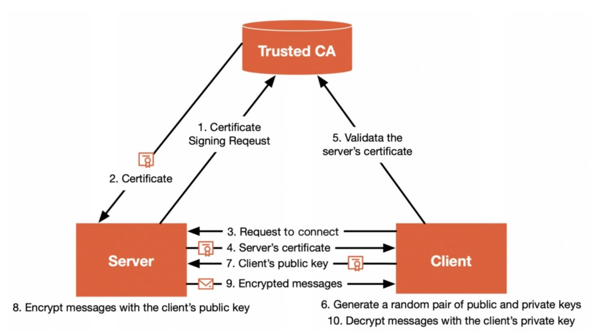
</p>

Here are the detailed steps:
- The server (website owner) submits a **certificate signing request** to the CA
- The CA verifies the server’s identity and the authenticity of the website and issues a digital certificate to the server, which the server installs so that visitors can verify the website’s security
- The user sends a request to the website through a browser (client)
- The server returns the TLS certificate to the client
- The client verifies the certificate’s validity with the CA and establishes the connection if the certificate is valid, or prompts the user to reject the connection if it is invalid
- The client generates a pair of random public and private keys
- The client sends its public key to the server
- The server encrypts the message using the client’s public key
- The server sends the encrypted data to the client
- The client decrypts the data sent by the server using its private key
  
At this point, both parties have established a secure channel and can transmit encrypted data in both directions.

#### Certificate Trust Chain
The validation of a certificate requires using a certificate trust chain (Certificate Trust Chain). A certificate trust chain refers to a series of certificates used for identity verification, which form a chain starting from a trusted root certificate issuing agency, connecting downward step by step, until a specific intermediate or terminal certificate is used for verifying a particular certificate. The trustworthiness of a digital certificate increases as the certificate level increases in the certificate trust chain.

In the figure below, you can see four trust chains.

<p align="center">
    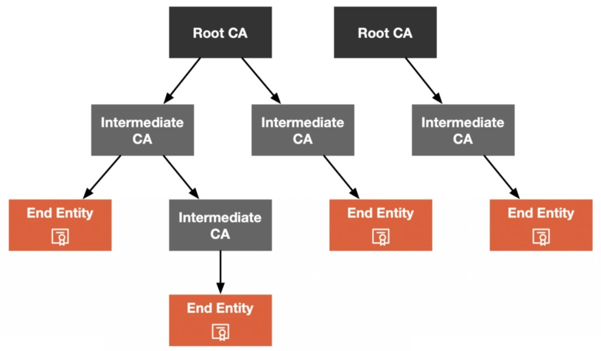
</p>

Certificate trust chains are tree-like structures, where each CA can have one or more child CAs. There are three roles:
- Root CA: The top-level CA can issue certificates to intermediate CAs.
- Intermediate CA: They can issue end-entity certificates.
- End entity: A device or service that holds an end-entity certificate.

Root CAs are the top-level issuing authorities for digital certificates, so the certificates they issue are the most trustworthy. Root certificate authorities are usually operated and regulated by government agencies or other authoritative organizations such as the International Infrastructure Security Organization. Common root CAs include:
- Symantec/VeriSign
- Comodo
- DigiCert
- GlobalSign
- GoDaddy
- Entrust
- GeoTrust
- RapidSSL
- Baltimore CyberTrust Root

Please note that the above list is just a sample. There are many other root CAs.

The certificate trust chain allows the client (such as a web browser) to verify each certificate step by step when verifying the terminal certificate to determine whether it is trustworthy. The principle of digital certificate issuance is that the CA binds the certificate owner’s public key and identity information together. Then the CA uses its proprietary private key to generate a formal digital signature to indicate that the CA issued this certificate. The digital signature on the certificate can be verified using the CA’s public key during certificate verification.

#### How to Incorporate Istio into the PKI Certificate Trust Chain

Before using Istio, enterprises usually have their own internal public key infrastructure . How can Istio be incorporated into the PKI certificate trust chain?

Istio has built-in certificate management functions that can be used out of the box. When Istio is started, it will create a self-signed certificate for istiod as the root certificate for all workloads in the mesh. _The problem with this is that the built-in root certificate cannot achieve mutual trust between meshes if you have multiple meshes_. The correct approach is not to use Istio’s self-signed certificate, but to incorporate Istio into your certificate trust chain and integrate Istio into your PKI, creating an intermediate certificate for each PKI mesh. In this way, two meshes have a shared trust root and can achieve mutual trust between meshes.

Integrate the Istio mesh into your internal PKI certificate trust chain by creating an intermediate CA, as shown in Figure 4.

<p align="center">
    
</p>

There are many benefits to incorporating Istio into your company’s internal PKI certificate trust chain:
- Secure communication across grids/clusters: with a common trust root, clusters can verify each other’s identities and communicate with each other;
- More granular certificate revocation: you can revoke the certificate of an individual entity or intermediate CA to revoke the certificate for service or cluster;
- Easy implementation of certificate rotation: you can rotate certificates by cluster/mesh rather than rotating the root node certificate, which reduces downtime. 
 
It is recommended to use [**cert-manager**](https://github.com/cert-manager/cert-manager) to achieve automated large-scale CA certificate rotation in production. For more information, see [Automate Istio CA Rotation](https://tetrate.io/blog/automate-istio-ca-rotation-in-production-at-scale/) in Production at Scale. For detailed instructions on incorporating Istio into your company’s internal PKI certificate trust chain, see this [blog post](https://tetrate.io/blog/istio-trust/).

By default, the Istio CA generates a self-signed root certificate and key and uses them to sign workload certificates. To protect the root CA key, you should use a root CA that runs offline on a secure machine and the root CA to issue **intermediate certificates** to the **Istio CA** running on each cluster. The Istio CA can then use the administrator-specified certificate and key to sign workload certificates and distribute the administrator-specified root certificate as the trusted root to workloads. 

<p align="center">
    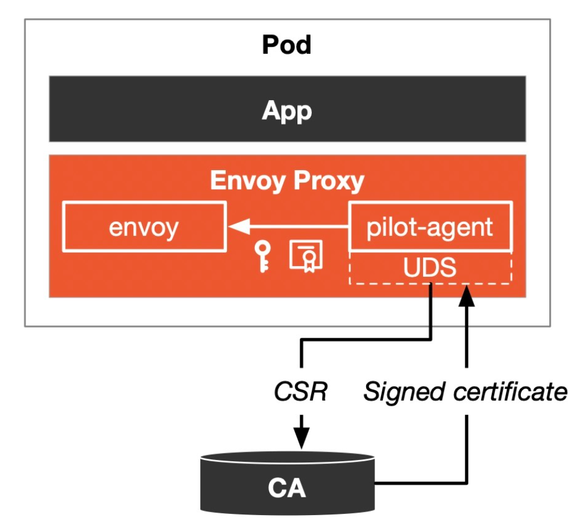
</p>

Here is how the certificate issuance and mounting process in Istio works:
- In Istio, the Envoy proxy injects two processes into the Pod: Envoy and istio-agent (or pilot-agent). The istio-agent generates a private key and uses the Secret Discovery Service (SDS) via a Unix Domain Socket (UDS) to request a certificate signing request (CSR) from the Certificate Authority (CA) through the `istiod`, if you have not configured the CA plugin 
- `istiod`, which has a built-in CA, returns the certificate to the istio-agent
- The istio-agent then sends the generated private key and the CA-returned certificate to the Envoy instance to mount.

Istio defaults to using the CA built into `istiod`, but also supports injecting other CAs, see the [Istio documentation](https://istio.io/latest/docs/tasks/security/cert-management/plugin-ca-cert/). Suppose you want to create identities for your services using custom CA certificates and keys. In that case, you will need to:
- Create a CA configuration file and use it to create self-signed CA root certificates and keys
- Create a private key and signing request configuration files for the service
- Create a certificate signing request (CSR) for the service.
- Use the root certificate and key, along with the service’s signing request file, to create a certificate for the service

[Reference](https://tetrate.io/blog/how-are-certificates-managed-in-istio/
)

There are two ways available for integrate custom CA in Istio. The first is to use cert-manger plug-in called [`istio-csr`](https://cert-manager.io/docs/usage/istio-csr/installation/) which uses cert-manager to issue Istio certificates, and needs to be able to reference an issuer resource to do this.You can choose to configure an issuer when installing with the Helm chart and / or to configure a ConfigMap to watch which can then be used to configure an issuer at runtime.

The alternative is to use Kubernetes CSR instead(without using cert-manager csr agent). For implementation, we are following `https://istio.io/latest/docs/tasks/security/cert-management/custom-ca-k8s/` using **Helm** and **Kustomization** to manipulate charts.

#### Steps for Using a Custom CA in Istio

This task shows how to provision workload certificates using a custom certificate authority that integrates with the Kubernetes CSR API. Different workloads can get their certificates signed from different cert-signers. Each cert-signer is effectively a different CA. It is expected that workloads whose certificates are issued from the same cert-signer can talk mTLS to each other while workloads signed by different signers cannot. This feature leverages Chiron, a lightweight component linked with `istiod` that signs certificates using the **Kubernetes CSR API**.

For this example, we use open-source cert-manager. Cert-manager has added experimental Support for Kubernetes CertificateSigningRequests starting with version 1.4.

##### Deploy cert-manager according to the installation doc.

Make sure to enable feature gate: `—feature-gates=ExperimentalCertificateSigningRequestControllers=true`

```sh
$ helm repo add jetstack https://charts.jetstack.io
$ helm repo update
$ helm install cert-manager jetstack/cert-manager --namespace cert-manager --create-namespace --set featureGates="ExperimentalCertificateSigningRequestControllers=true" --set crds.enabled=true
```


##### Create self-signed cluster issuers 

Use cert-manager to create `istio-system`, `tenanta` and `tenantb` for cert-manager. Namespace issuers and other types of issuers can also be used.

```yaml
apiVersion: cert-manager.io/v1
kind: ClusterIssuer
metadata:
  name: selfsigned-tenanta-issuer
spec:
  selfSigned: {}
---
apiVersion: cert-manager.io/v1
kind: Certificate
metadata:
  name: tenanta-ca
  namespace: cert-manager
spec:
  isCA: true
  duration: 87600h # 10 years
  commonName: tenanta
  secretName: tenanta-ca-selfsigned
  privateKey:
    algorithm: ECDSA
    size: 256
  issuerRef:
    name: selfsigned-tenanta-issuer
    kind: ClusterIssuer
    group: cert-manager.io
---
apiVersion: cert-manager.io/v1
kind: ClusterIssuer
metadata:
  name: tenanta
spec:
  ca:
    secretName: tenanta-ca-selfsigned
---
apiVersion: cert-manager.io/v1
kind: ClusterIssuer
metadata:
  name: selfsigned-tenantb-issuer
spec:
  selfSigned: {}
---
apiVersion: cert-manager.io/v1
kind: Certificate
metadata:
  name: tenantb-ca
  namespace: cert-manager
spec:
  isCA: true
  duration: 87600h # 10 years
  commonName: tenantb
  secretName: tenantb-ca-selfsigned
  privateKey:
    algorithm: ECDSA
    size: 256
  issuerRef:
    name: selfsigned-tenantb-issuer
    kind: ClusterIssuer
    group: cert-manager.io
---
apiVersion: cert-manager.io/v1
kind: ClusterIssuer
metadata:
  name: tenantb
spec:
  ca:
    secretName: tenantb-ca-selfsigned
---
apiVersion: cert-manager.io/v1
kind: ClusterIssuer
metadata:
  name: selfsigned-istio-issuer
spec:
  selfSigned: {}
---
apiVersion: cert-manager.io/v1
kind: Certificate
metadata:
  name: istio-ca
  namespace: cert-manager
spec:
  isCA: true
  duration: 87600h # 10 years
  commonName: istio-system
  secretName: istio-ca-selfsigned
  privateKey:
    algorithm: ECDSA
    size: 256
  issuerRef:
    name: selfsigned-istio-issuer
    kind: ClusterIssuer
    group: cert-manager.io
---
apiVersion: cert-manager.io/v1
kind: ClusterIssuer
metadata:
  name: istio-system
spec:
  ca:
    secretName: istio-ca-selfsigned
```

**ClusterIssuer** is not bound to any namespace. An **Issuer** is a namespaced resource, and it is not possible to issue certificates from an Issuer in a different namespace. This means you will need to create an Issuer in each namespace you wish to obtain Certificates in. If you want to create a single Issuer that can be consumed in multiple namespaces, you should consider creating a ClusterIssuer resource.

##### Deploy Istio on the cluster
```sh
$ export ISTIOCA=$(kubectl get clusterissuers istio-system -o jsonpath='{.spec.ca.secretName}' | xargs kubectl get secret -n cert-manager -o jsonpath='{.data.ca\.crt}' | base64 -d | sed 's/^/        /')
$ export TENANTACA=$(kubectl get clusterissuers tenanta -o jsonpath='{.spec.ca.secretName}' | xargs kubectl get secret -n cert-manager -o jsonpath='{.data.ca\.crt}' | base64 -d | sed 's/^/        /')
$ export TENANTBCA=$(kubectl get clusterissuers tenantb -o jsonpath='{.spec.ca.secretName}' | xargs kubectl get secret -n cert-manager -o jsonpath='{.data.ca\.crt}' | base64 -d | sed 's/^/        /')
```
Use Helm with the following configuration. The ISTIO_META_CERT_SIGNER is the default cert-signer for workloads. Use environment variables with caution as these environment variables are experimental and can change anytime. Save the follwoing as `istiod_values.yaml`.

```yaml
global:
  pilotCertProvider: istiod
  # List of cert-signers to allow "approve" action in the cluster role
  certSigners:
    - clusterissuers.cert-manager.io/istio-system
    - clusterissuers.cert-manager.io/tenanta
    - clusterissuers.cert-manager.io/tenantb
pilot:
  # Use with caution as these environment variables are experimental and can change anytime
  env:
    # External CA Integration Type. Permitted value is ISTIOD_RA_KUBERNETES_API
    EXTERNAL_CA: ISTIOD_RA_KUBERNETES_API
    CERT_SIGNER_DOMAIN: clusterissuers.cert-manager.io
meshConfig:
  accessLogFile: /dev/stdout
  # Default proxy config for mesh wide defaults, used by gateways and sidecars
  defaultConfig:
    proxyMetadata:
      ISTIO_META_CERT_SIGNER: istio-system
  caCertificates:
    - pem: |
$ISTIOCA
      certSigners:
      - clusterissuers.cert-manager.io/istio-system
    - pem: |
$TENANTACA
      certSigners:
      - clusterissuers.cert-manager.io/tenanta
    - pem: |
$TENANTBCA
      certSigners:
      - clusterissuers.cert-manager.io/tenantb
```

The environment variable `PILOT_CERT_PROVIDER` is hidden with the default value `istiod`. We need set this value to `k8s.io/clusterissuers.cert-manager.io/istio-system` but only for `istiod` pilot and not gloablly for all Envoy proxies. The problem is that the helm chart only allows setting this value globally (under global) which will set it for all proxies. To resolve this problem, we use `kustomize` to patch the charts using [**post rendered kustomization**](https://istio.io/v1.14/docs/setup/additional-setup/customize-installation-helm/). Save the followings in a folder called `kustomize`.

```sh
cat > cert-provider-patch.yaml << EOF
apiVersion: apps/v1
kind: Deployment
metadata:
  namespace: istio-system
  name: istiod
spec:
  template:
    spec:
      containers:
        - name: discovery
          env:
          - name: PILOT_CERT_PROVIDER
            value: "k8s.io/clusterissuers.cert-manager.io/istio-system"
EOF
```

```sh
cat > kustomize.sh << EOF
#!/bin/bash
cat > base.yaml
exec kubectl kustomize && rm base.yaml
EOF
```
```sh
cat > kustomization.yaml << EOF
resources:
- base.yaml
patchesStrategicMerge:
- cert-provider-patch.yaml
EOF
```

##### Install Istio

```sh
$ helm repo add istio https://istio-release.storage.googleapis.com/charts
$ helm repo update
 
$ kubectl create namespace istio-ingress
$ helm install istio-base istio/base \
    --namespace istio-system \
    --create-namespace \
    --version ${ISTIO_VERSION} \
    --wait
```

After installing istio base, install istiod with the patch:

```sh
/kustomize$ helm install istiod istio/istiod \
   --namespace istio-system \
   --post-renderer ./kustomize.sh \
   --values ../istiod_values.yaml \
   --wait
``` 

Or if already installed, upgrade it:

```sh
/kustomize$ helm upgrade istio-istiod istio/istiod \
   --namespace istio-system \
   --post-renderer ./kustomize.sh \
   --values ../istiod_values.yaml \
   --wait
```
Restart istiod for changings to take effect:

```sh
$ kubectl rollout restart deploy/istiod -n istio-system
```

Note: To ensure the desired changes are reflected in the final chart before committing it to the cluster, use 

```sh
/kustomize$ helm template istiod istio/istiod \
   --namespace istio-system \
   --post-renderer ./kustomize.sh \
   --values ../istiod_values.yaml
```
before the installing `istiod`. The final `yaml` file is now printed for checking. 


To see the installed charts with values in action after installation, use:

```sh
$ helm get manifest istiod -n istio-system
```
##### Congigure sidecars to use custom CA in each namespace
Deploy the `proxyconfig-tenanta.yaml` in the tenanta namespace to define cert-signer for workloads in that namespace. 

```sh
cat <<EOF > ./proxyconfig-tenanta.yaml
apiVersion: networking.istio.io/v1beta1
kind: ProxyConfig
metadata:
  name: tenantapc
  namespace: tenanta
spec:
  environmentVariables:
    ISTIO_META_CERT_SIGNER: tenanta
EOF
```

```sh
cat <<EOF > ./proxyconfig-tenantb.yaml
apiVersion: networking.istio.io/v1beta1
kind: ProxyConfig
metadata:
  name: tenantbpc
  namespace: tenantb
spec:
  environmentVariables:
    ISTIO_META_CERT_SIGNER: tenantb
EOF
```
##### Test 
Deploy two workload in two namespaces to see they cannot communicate.

```sh
$ kubectl label ns tenanta istio-injection=enabled
$ kubectl label ns tenantb istio-injection=enabled
$ kubectl apply -f samples/httpbin/httpbin.yaml -n tenanta
$ kubectl apply -f samples/sleep/sleep.yaml -n tenanta
$ kubectl apply -f samples/httpbin/httpbin.yaml -n tenantb
```

When the workloads are deployed, they send CSR requests with related signer info in `istiod`. `istiod` forwards the CSR request to the custom CA for signing. The custom CA will use the correct cluster issuer to sign the cert back. Workloads under `tenanta` namespace will use `tenanta` cluster issuers while workloads under `tenentb` namespace will use the `tenantb` cluster issuers. To verify that they have indeed been signed by correct cluster issuers, we can check istiod logs 
```sh
$ kubectl logs <pod_name> -n istio-system
```

Also can verify workloads under the same namespace can communicate while workloads under the different namespace cannot communicate.
```sh
$ kubectl exec sleep-64fc688f66-cq8b4 -n tenanta -c sleep -- curl http://httpbin.tenanta:8000/html
```

Custom CA Integration - By specifying a Signer name in the Kubernetes CSR Request, this feature allows Istio to integrate with custom Certificate Authorities using the Kubernetes CSR API interface. This does require the custom CA to implement a Kubernetes controller to watch the CertificateSigningRequest Resources and act on them. This provide better multi-tenancy - By specifying a different cert-signer for different workloads, certificates for different tenant’s workloads can be signed by different CAs.


### Secure Gatways using TLS self-signed certificates

[**cert-manager**](https://cert-manager.io) is a tool that automates certificate management. This can be integrated with Istio gateways to manage TLS certificates. Consult the [cert-manager installation documentation](https://cert-manager.io/docs/releases/) to get started. cert-manager can be used to write a secret to Kubernetes, which can then be referenced by a Gateway. To get started, configure a Certificate resource, following the cert-manager documentation. The Certificate should be created in the same namespace as the istio-ingressgateway is deployed. The follwoing is an example of certificate created: 

```yaml
#ingress-issuer.yaml
apiVersion: cert-manager.io/v1
kind: Issuer
metadata:
  name: gateway-issuer
  namespace: istio-ingress
spec:
  selfSigned: {}
---
apiVersion: cert-manager.io/v1
kind: Certificate
metadata:
  name: gateway-tls
  namespace: istio-ingress
spec:
  isCA: true
  duration: 87600h # 10 years
  secretName: gateway-ca-tls
  commonName: example.com
  privateKey:
    algorithm: ECDSA
    size: 256
  issuerRef:
    name: gateway-issuer
    kind: Issuer
    group: cert-manager.io
  dnsNames:
  - 'example.com'
  - 'tenanta.example.com'
  - 'tenantb.example.com'
```

Once we have the certificate created, we should see the secret created in the istio-system namespace:
```sh
$ kubectl get secrets —all-namespaces=true
```

While it's possible to configure Istio such that it can automatically "discover" the root CA, this can be dangerous in some specific scenarios involving other security holes, enabling signer hijacking attacks. As such, we'll export our Root CA and configure Istio later using that static cert. Also we need the root key in this secret to be fed into browser so it trusts ours endpoint later. 

```sh
$ kubectl get -n istio-ingress secret gateway-ca-tls -ogo-template='{{index .data "tls.crt"}}' | base64 -d > ~/Downloads/ca.pem 
# Out of interest, we can check out what our CA looks like
$ openssl x509 -in ca.pem -noout -text
```

##### Add our CA to a secret

```sh
$ kubectl create secret generic -n cert-manager istio-root-ca —from-file=ca.pem=~/Downloads/ca.pem
```

Use this command to check our secrets are ready and active at ingress gateway:
```sh
$ istioctl -n istio-ingress proxy-config secret deploy/istio-ingressgateway
RESOURCE NAME                   TYPE           STATUS     VALID CERT     SERIAL NUMBER                        NOT AFTER                NOT BEFORE
default                         Cert Chain     ACTIVE     true           713f96b97b33b02f920f9f018edaf954     2024-07-16T04:42:20Z     2024-07-15T04:42:20Z
kubernetes://gateway-ca-tls     CA             ACTIVE     true           d06e57986e3cc1ac630b289c6feda894     2034-07-13T17:16:39Z     2024-07-15T17:16:39Z
ROOTCA                          CA             ACTIVE     true           563955dc6f7dff4fb998d06f4390eefc     2034-07-09T13:39:34Z     2024-07-11T13:39:34Z
```

Also see the issuers are ready:

```sh
$ kubectl get clusterissuers —-all-namespaces
```
This can then be referenced in the tls config for a Gateway under credentialName:

```yaml
apiVersion: networking.istio.io/v1alpha3
kind: Gateway
metadata:
  name: mygateway
spec:
  selector:
    istio: ingressgateway
  servers:
  - port:
      number: 443
      name: https
      protocol: HTTPS
    tls:
      mode: SIMPLE
      credentialName: gateway-ca-tls
    hosts:
    - tenanta.example.com
    - tenantb.example.com
```

Use this command to see the route is added to the ingress.
```sh
$ istioctl -n istio-ingress proxy-config route deploy/istio-ingressgateway
```

Now, [install your application](https://istio.io/latest/docs/tasks/traffic-management/ingress/secure-ingress/):
```sh
$ kubectl apply -f samples/httpbin/httpbin.yaml
```
Next, configure the gateway’s ingress traffic routes by defining a corresponding virtual service

```sh
$ cat <<EOF | kubectl apply -f -
apiVersion: networking.istio.io/v1
kind: VirtualService
metadata:
  name: httpbin
spec:
  hosts:
  - "tenanta.example.com"
  gateways:
  - mygateway
  http:
  - match:
    - uri:
        prefix: /status
    - uri:
        prefix: /delay
    route:
    - destination:
        port:
          number: 8000
        host: httpbin
EOF
```

Add record 10.0.0.240  tenanta.example.com to `/etc/hosts` on your machine. Now, the moment of truth:

```sh
$ curl -v -HHost:tenanta.example.com --resolve "tenanta.example.com:443:10.0.0.240" \
  --cacert ~/Downloads/ca.pem "https://tenanta.example.com:443/status/418"
* Added tenanta.example.com:443:10.0.0.240 to DNS cache
* Hostname tenanta.example.com was found in DNS cache
*   Trying 10.0.0.240:443...
* Connected to tenanta.example.com (10.0.0.240) port 443
* ALPN: curl offers h2,http/1.1
* (304) (OUT), TLS handshake, Client hello (1):
*  CAfile: /Users/yas/Downloads/ca.pem
*  CApath: none
* (304) (IN), TLS handshake, Server hello (2):
* (304) (IN), TLS handshake, Unknown (8):
* (304) (IN), TLS handshake, Certificate (11):
* (304) (IN), TLS handshake, CERT verify (15):
* (304) (IN), TLS handshake, Finished (20):
* (304) (OUT), TLS handshake, Finished (20):
* SSL connection using TLSv1.3 / AEAD-CHACHA20-POLY1305-SHA256
* ALPN: server accepted h2
* Server certificate:
*  subject: CN=example.com
*  start date: Jul 15 17:16:39 2024 GMT
*  expire date: Jul 13 17:16:39 2034 GMT
*  subjectAltName: host "tenanta.example.com" matched cert's "tenanta.example.com"
*  issuer: CN=example.com
*  SSL certificate verify ok.
* using HTTP/2
* [HTTP/2] [1] OPENED stream for https://tenanta.example.com:443/status/418
* [HTTP/2] [1] [:method: GET]
* [HTTP/2] [1] [:scheme: https]
* [HTTP/2] [1] [:authority: tenanta.example.com]
* [HTTP/2] [1] [:path: /status/418]
* [HTTP/2] [1] [user-agent: curl/8.4.0]
* [HTTP/2] [1] [accept: */*]
> GET /status/418 HTTP/2
> Host:tenanta.example.com
> User-Agent: curl/8.4.0
> Accept: */*
>
< HTTP/2 418
< server: istio-envoy
< date: Mon, 15 Jul 2024 19:35:49 GMT
< x-more-info: http://tools.ietf.org/html/rfc2324
< access-control-allow-origin: *
< access-control-allow-credentials: true
< content-length: 135
< x-envoy-upstream-service-time: 10
<

    -=[ teapot ]=-

       _...._
     .'  _ _ `.
    | ."` ^ `". _,
    \_;`"---"`|//
      |       ;/
      \_     _/
        `"""`
Connection #0 to host tenanta.example.com left intact
```

And the browser works fine. Gateway and virtual service should be in the same namespace. Use `istioctl analyze` for troubleshooting.


## Use Envoy as Front Proxy (or Reverse Proxy)

The implementation of proxy servers is essential for businesses that serve content over the internet. Proxy servers are intermediaries connecting end users and the servers where content is located. They effectively manage network traffic and ensure optimal performance and security. By utilizing a proxy server, companies benefit from better load distribution and minimal service downtime. Envoy and HAProxy are among the leading proxy solutions. Both offer unique features and capabilities suited to different needs. Envoy is a cutting edge, high performance edge and service proxy that caters to an array of network protocols and functions. In contrast, HAProxy is a reliable and high performance proxy that’s a popular choice for load balancing. 

Envoy is an open source, high performance, edge and service proxy designed to manage and route network traffic between microservices in modern, distributed architectures for cloud native applications So it is an ideal choice for cloud native applications and service mesh implementations. This Proxy is written in C++ language allowing for efficient memory and resource management. Envoy is designed to be scalable, resilient, and easy to operate, making it a popular choice for modern, distributed application architectures. Usually, you run Envoy as a sidecar alongside each service within an application, which in turn abstracts the network from the central business logic. 

It receives requests and directs them to services that are positioned behind it. The 2 methods to deploy Envoy are:

- **Front Proxy** – behaves similarly to HAProxy, NGINX, or Apache web server. The Envoy server has its IP address and is positioned separately on the network from the services it guards. Internet traffic comes in and is forwarded to several different services that sit behind it.
- **Sidecar Proxy** – In this mode of deployment, the Envoy server sits at the same IP address as all the services that it protects. When Envoy is deployed as a sidecar it only has a single instance behind it. The sidecar method intercepts all incoming traffic and optionally all outgoing traffic on behalf of the service instance. Use the IP Table rules to configure the OS to capture and route this traffic to Envoy.
  
**HAProxy** runs in two modes: HTTP or TCP. In HTTP mode, it acts as a layer 7 proxy. In TCP mode it acts as a layer 4 proxy. When running in TCP mode, HAProxy has access to the port and IP address that the client is trying to connect to on the backend server. It intercepts information by replacing the server with the target IP address and port. 

As part of external auth solution, Envoy was deployed as front proxy (or reverse peoxy) to fan out the traffic from downstream (called **listeners**, in our case is Istio ingress gateway) to its upstream (called **clusters**, in our case is **oauth2 proxies** per tanent). In general, we need to configure listeners and clusters for Envoy in yaml files. This is done dynamically that means, when the files are changed on the filesystem replaced by a file move, and not when the file is edited in place, Envoy will automatically update its configuration. You will need node to uniquely identify the proxy node and dynamic_resources to tell Envoy where to find its dynamic configuration. In dynamic configuration, you need **lds.yaml** for listeners, **cds.yaml** for clusters. See [this page](https://www.envoyproxy.io/docs/envoy/latest/start/quick-start/configuration-dynamic-filesystem) for more information.

<p align="center">
      
  </p>


The linked lds_config should be an implementation of a Listener discovery service (LDS). The linked cds_config should be an implementation of a Cluster discovery service (CDS). Envoy is usable in a variety of different scenarios, however it’s most useful when [deployed](https://www.envoyproxy.io/docs/envoy/latest/intro/deployment_types/deployment_types) as a mesh across all hosts in an infrastructure. 

- **Service to service only**

  <p align="center">
      
  </p>

    The above diagram shows the simplest Envoy deployment which uses Envoy as a communication bus for all traffic internal to a service oriented architecture (SOA). In this scenario, Envoy exposes several listeners that are used for local origin traffic as well as service-to-service traffic.

- **Service to service plus front proxy**

    <p align="center">
        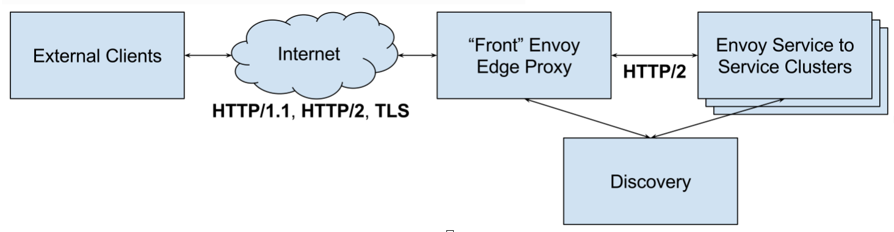
    </p>

    The above diagram shows the service to service configuration sitting behind an Envoy cluster used as an HTTP L7 edge reverse proxy. This is the same as istio ingress gateway deployment of Envoy. The reverse proxy provides the following features:
    - Terminates TLS
    - Supports HTTP/1.1, HTTP/2, and HTTP/3
    - Full HTTP L7 routing support
    - Talks to the service to service Envoy clusters via the standard ingress port and using the discovery service for host lookup. Thus, the front Envoy hosts work identically to any other Envoy host, other than the fact that they do not run collocated with another service. This means that are operated in the same way and emit the same statistics.

To get a flavor of what Envoy has to offer as a front proxy, we are releasing a docker compose sandbox that deploys a front Envoy and a couple of services (simple aiohttp apps) colocated with a running service Envoy. Below you can see a graphic showing the docker compose deployment. The three containers will be deployed inside a virtual network called `envoymesh`. 


<p align="center">
      
  </p>


All incoming requests are routed via the front Envoy, which is acting as a reverse proxy sitting on the edge (or in front) of the envoymesh network. Port 8080, 8443, and 8001 are exposed by docker compose (see docker-compose.yaml) to handle HTTP, HTTPS calls to the services and requests to `/admin` respectively. Moreover, notice that all traffic routed by the front Envoy to the service containers is actually routed to the service Envoys (routes setup in `envoy.yaml`). See [this](https://www.envoyproxy.io/docs/envoy/latest/start/sandboxes/front-proxy) and [here](https://cloudinfrastructureservices.co.uk/envoy-vs-haproxy-whats-the-difference/) for more info.

Similarly, in our application, we used Envoy in front of two OAuth proxies that check authentications with two id providers using AWS Cognito service. 


### Proxy Protocol and Envoy

The **PROXY protocol** allows for exchanging and preservation of client attributes between TCP proxies, without relying on L7 protocols such as HTTP and the **X-Forwarded-For** and X-Envoy-External-Address headers. 

It is intended for scenarios where an external TCP load balancer (eg. AWS Netwotk Load Balancer) needs to proxy TCP traffic to a backend TCP service and still expose client attributes such as **source IP** to upstream TCP service endpoints. PROXY protocol can be enabled via **EnvoyFilter**.

When processing the request, the backend often needs to know the client’s “Real” IP address for various reasons, below are some of them:
- **Fraud Prevention**: The client IP address can help identify malicious actors and enable blocking of specific IP addresses associated with abusive behavior, hacking attempts, or denial-of-service attacks.
- **Access Control**: Some systems restrict access to certain resources based on IP addresses. Knowing the client IP address allows you to implement whitelisting policies.
- **User Experience**: Geolocation data derived from client IP addresses can be used to tailor content to users based on their location, such as displaying localized content or language.
- **Application Performance**: Client IP addresses are used to implement rate limiting to prevent abuse and ensure fair usage of resources. It can also be used to distribute traffic effectively and maintain session affinity.

Envoy provides several methods to obtain the client’s IP address, including using 
- X-Forwarded-For HTTP header
- custom HTTP headers
- proxy protocol
  
The X-Forwarded-For header is a widely accepted de facto standard, making it simple to implement and read, as most proxy servers and load balancers support it. Envoy offers two ways to extract the client’s IP address from the X-Forwarded-For header: through the HTTP Connection Manager (HCM) and the IP Detection Extension.

To configure Envoy’s HTTP Connection Manager (HCM) to extract the client’s IP from the X-Forwarded-For header, you need to set **xffNumTrustedHops**. This parameter defines the number of IP addresses in the X-Forwarded-For header that Envoy should trust. Adjust xffNumTrustedHops according to your network topology for proper configuration. For instance, consider a request path like this: client -> proxy1 -> proxy2 -> Envoy. If proxy1 and proxy2 are in a trusted network and both modify the X-Forwarded-For header, we need to set xffNumTrustedHops to 2, telling Envoy to extract the second rightmost IP address in the X-Forwarded-For header and use it as the client’s IP address for the request. Here’s an example of the Envoy configuration for this setting:
```
"name": "envoy.filters.network.http_connection_manager",
"typedConfig": {
  "@type": "type.googleapis.com/envoy.extensions.filters.network.http_connection_manager.v3.HttpConnectionManager",
  // omitted for brevity
  // ...
   
  "xffNumTrustedHops": 2
}
```

As long as the number of hops set in xffNumTrustedHops is correct and these hops can be trusted, we can ensure that malicious users cannot forge the client IP address.

Passing the client’s IP address via HTTP headers works well, but it has a limitation: it only works with HTTP!. If your service also needs to support other protocols, consider using the Proxy Protocol.

#### What is the Proxy Protocol?
_Proxy Protocol operates at the transport layer (TCP) to convey the client’s IP address between a proxy and a backend server_.

The Proxy Protocol works by adding a header that contains the client’s IP address at the beginning of a TCP connection. This header is inserted immediately after the TCP handshake and before any application data is transmitted. As a result, it’s transparent to the application protocol and can be used with any application protocol, including HTTP, HTTPS, SMTP, and more.


<p align="center">
    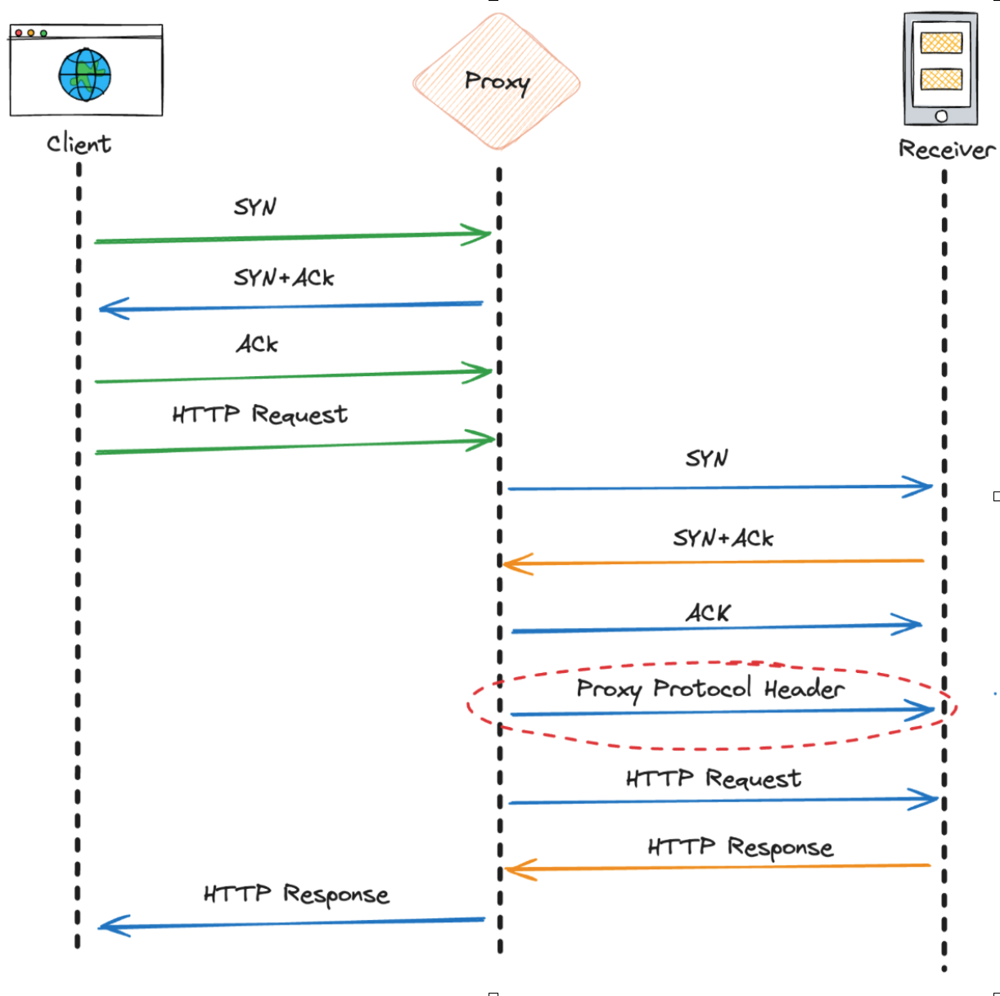
</p>


Proxy Protocol has two versions: version 1 and version 2. Version 1 uses a text format that’s human-readable, while version 2 uses a binary format that’s more efficient but less readable. When using Proxy Protocol, we need to ensure that the sending and receiving servers are configured with the same version.

After the TCP connection handshake (SYN(Synchronize Sequence Number), SYN + ACK, SYN) is complete, the sender sends a Proxy Protocol Header to the receiver. This header contains a few fields, what we are interested in is the client’s IP address. Then the proxy server forwards the client’s data right after the Proxy Protocol Header. When the receiver receives a new TCP connection with a Proxy Protocol Header, it first parses this header to extract the client’s IP address and other information. Then it strips the Proxy Protocol Header from the TCP data, ensuring that the actual HTTP request can be processed normally. If the receiver is also an intermediate hop supporting the Proxy Protocol, it can forward the client’s IP address to the next hop in the network, thus preserving the client’s identity throughout the request’s journey. 

Here’s how to configure the Proxy Protocol in Envoy. The Proxy Protocol header is inserted during the TCP handshake, so we need to enable it in the Listener settings. We need to add an `envoy.filters.listener.proxy_protocol` Listener Filter in the Listener configuration. This filter will extract the client’s IP address by parsing the Proxy Protocol Header from the first data packet of the TCP connection. After that, it strips the Proxy Protocol Header and forwards the actual application data to the HTTP Connection Manager (HCM) for further processing. 
```
"listener": {
  "@type": "type.googleapis.com/envoy.config.listener.v3.Listener",
  "address": {
    "socketAddress": {
      "address": "0.0.0.0",
      "portValue": 10080
    }
  },
  // omitted for brevity
  // ...

  "listenerFilters": [
    { 
      "name": "envoy.filters.listener.proxy_protocol",
      "typedConfig": {
        "@type": "type.googleapis.com/envoy.extensions.filters.listener.proxy_protocol.v3.ProxyProtocol"
      }
    }
  ],
}
```
 
Look at the following for more info: [1](https://www.zhaohuabing.com/post/2024-05-17-client-ip-en/), [2](https://docs.tetrate.io/service-bridge/howto/gateway/https-with-proxy-protocol), [3](https://www.envoyproxy.io/docs/envoy/latest/configuration/listeners/listener_filters/proxy_protocol)


Note that the Envoy TLS Inspector filter is needed to examine the initial TLS handshake of a connection, allowing Envoy to extract crucial information like the server name indication (SNI) and application-layer protocol negotiation (ALPN) from the client, which can then be used to dynamically route traffic to the appropriate backend based on the identified protocols or hostnames, even when the connection is encrypted with TLS. The Envoy TLS Inspector filter needs the Proxy Protocol filter because it allows Envoy to accurately identify the original source IP address of a connection, even when the connection is behind a load balancer or proxy that might have modified the source address, which is crucial for security analysis and routing decisions when inspecting TLS traffic that is typically encrypted and hides the source information. 

If the connection is TLS encrypted, Envoy needs tls-listener filter as well to properly extract proxy protocol header. When a connection arrives at Envoy, the TLS Inspector filter analyzes the TLS handshake to extract information like the Server Name Indication (SNI). If the Proxy Protocol header is present, the filter also parses it to retrieve the original client IP address. SNI detection is the primary reason for using the TLS Inspector filter, as it allows Envoy to identify the intended hostname within a TLS connection, enabling features like SNI-based routing. While the TLS Inspector filter needs to decrypt the initial part of the TLS handshake to extract the necessary information, it does not decrypt the entire communication stream, making it a relatively secure way to leverage TLS information for routing decisions. If you are forwarding HTTP to the upstream not TCP, just use XFF filter (not proxy protocol) to pass user ip address to the upstream.  

In the case Envoy is not configured to accept proxy protocol while load balancer is sending proxy protocol header to Envoy, TLS handshake will not be completed and a message like the following will return!


<p align="center">
    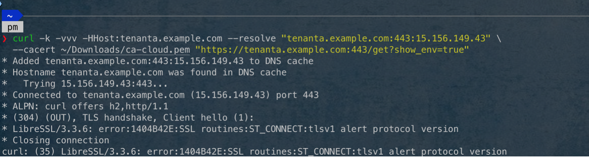
</p>

It was very painful for me to troubleshoot this!

-------------------------------------
----------------------
# GitOps: FluxCD

GitOps is an operating model for Kubernetes and other cloud native technologies. It provides a set of best practices that unifies deployment, management, and monitoring for clusters and applications. With the declarative definitions of your system stored in Git, and serving as your canonical source of truth, there is a single place from which your cluster can be managed. This also trivializes rollbacks and roll forwards to take you back to a ‘good state’ if needed. 

With Git’s excellent security guarantees, SSH key signed commits to enforce strong security guarantees about authorship as well as the code’s provenance.
With the desired state of your entire system kept under version control, and running in the cluster, you can now employ software controllers to bring the actual state of the cluster in alignment with that desired state, and inform you whenever reality doesn’t match your expectations. The use of a GitOps controller like Flux in combination with these software agents ensures that your entire system is self-healing in the case of human error, for example. In this case, software agents act as the feedback and control loop for your operations.


### Control and feedback loop
An essential component of GitOps is feedback and control. But what is meant exactly by that? In order to have control so that developers can ship faster, they need observability built into their deployment workflows. Built in observability allows developers to experiment and make informed decisions on real-time data. For example, when a deployment is being rolled out, a final health check can be made against your running cluster before committing to that update. Or maybe that update didn’t go as planned and needs to be rolled back to a good state. With a feedback control loop, you can effectively answer the following questions:

- How do I know if my deployment succeeded?
- How do I know if the live system has converged to the desired state?
- Can I be notified when this differs?
- Can I trigger a convergence between the cluster and source control?

While Git is the source of truth for the desired state of the system, observability is the benchmark for the actual production state of the running system. GitOps takes advantage of both to manage both applications and infrastructure to increase your team’s productivity.

### Key GitOps benefits
With GitOps, your organization immediately benefits with the following:
- Stronger security guarantees: Git’s strong correctness and security guarantees, backed by Git’s strong cryptography used to track and manage changes, as well as the ability to SSH sign changes to prove authorship and origin are key to a correct and secure definition of the cluster’s desired state. 
- If a security breach does occur, the immutable and auditable source of truth can be used to recreate a new system independently of the compromised one, reducing downtime and allowing for a much better incident response and more effective disaster recovery to meet compliance.
- Increased speed and productivity: continuous deployment automation with an integrated feedback and control loop speeds up your mean time to deployment by supporting more frequent releases. Declarative definitions kept in Git enable developers to use familiar workflows, reducing the time it takes to spin up new development or test environments to deploy new features. Your teams can ship more changes per day and this translates into faster turnaround for new features and functionality to the customer
- Reduced mean time to detect and mean time to recovery: the amount of time it takes to recover from a cluster meltdown is also decreased with GitOps best practices. With Git’s built in capability to **revert/rollback** and **fork**, you gain stable and reproducible rollbacks. Since your entire system is described in Git, you have a single source of truth for what to recover after a cluster failure, reducing your meantime to recovery (MTTR) from hours or days to minutes. GitOps provides real time feedback and control loops. In conjunction with other tools like Prometheus for observability and Jaeger for end-to-end tracing, problems can be detected and tracked down, preventing entire cluster meltdowns more quickly, and overall reducing mean time to detect (MTTD) and mean time to locate (MTTL).

- Improved stability and reliability: due to GitOps providing a single operating model for making infrastructure and apps, you have consistent end-to-end workflows across your entire organization. Not only are your continuous integration and continuous deployment pipelines all driven by pull requests, but your operations tasks are also fully reproducible through Git.
- Easier compliance and auditing: by incorporating Git as part of your cluster management strategy, you automatically gain a convenient audit trail of who did what and when for all cluster changes outside of Kubernetes that can be used to meet SOC 2 compliance and also ensure stability.

The Flux controllers together with a set of custom Kubernetes resources act on behalf of the cluster. It listens to events relating to custom resource changes, and then applies those changes (depending on the deployment policy) or it can send an alert indicating a divergence from the desired state kept in Git. The GitOps pipeline ensures that what’s in Git matches what’s running in the cluster.

### GitOps delivery pipeline
GitOps implements a Kubernetes **reconciler** like Flux that listens for and synchronizes deployments to your Kubernetes cluster. Flux makes use of a set of controllers to reconcile divergences that are significant in two ways:
- More secure than depending on your CI tool to deploy your application or infrastructure after testing, building, and pushing the image to the container registry
- Automates complex error prone tasks like manually updating YAML manifests.

- GitOps is a more secure way to deploy changes: Docker images are pulled into the cluster using **Read Only** access to the container registry.  Your CI tool is not granted cluster privileges, reducing attack surface and eliminating significant security risks to your pipeline (known as common attack vectors). With GitOps, cluster credentials are kept within the domain of the cluster and not embedded within bespoke scripts outside of the cluster.

The table below shows how read/write privileges are distributed between the cluster, your CI and CD tooling, and the container repository, as well as 
provides your team with a more secure method of creating updates to Kubernetes.

Table 1: GitOps separation of privileges
<p align="center">
    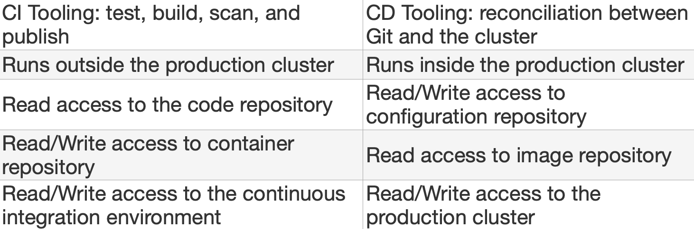
</p>

### FluxCD

**FluxCD** is a GitOps tool developed by Weaveworks that allows you to implement continuous and progressive delivery of your applications on Kubernetes. It is a CNCF graduated project that offers a set of controllers to monitor Git repositories and reconciles the cluster’s actual state with the desired state defined by manifests committed in the repo. 

- Flux keeps Kubernetes clusters in sync with configuration kept under source control like Git repositories, and automates updates to that configuration when there is new code to deploy. 
- It is built using Kubernetes’ API extension server CRDs, and can integrate with Prometheus and other core components of the Kubernetes ecosystem. 
- Flux supports multi-tenancy and syncs an arbitrary number of Git repositories. 
- In order to create the reconciliation repository for Flux, you’ll need a personal access token for your GitHub account that has permissions to create repositories. The token must have all permissions under repo checked off.

You need to

1. Have a code repo ready 
2. Have a container registry ready
3. Set up a CI pipeline using GitHub Actions. The actions builds a new container on a `git push`, tags it with the git-sha, and then pushes it to the container registry. It also updates and commits the image tag change to your kustomize file. Once the new image is in the repository, Flux notices the new image and then deploys it to the cluster
4. Create secrets with proper permission (principle of least privilege) to allows access to these repos
5. Install Flux. 

```sh
$ export GITHUB_TOKEN=[your-github-token]
$ export GITHUB_USER=[your-github-username]
```

When **bootstrapping** a repository with Flux, it’s also possible to apply only a sub-directory in the repo and therefore connect to multiple clusters or locations on which to apply configuration. 
[Reference](https://aws.amazon.com/blogs/containers/building-a-gitops-pipeline-with-amazon-eks/)

#### Bootstrap Flux:
Bootstrap Flux using the following command:

```sh
$ flux bootstrap github create \
  --owner=$GITHUB_USER \
  --repository=EKS-Istio-Multitenant\
  --personal \
  --path=./clusters/dev \
  --branch=istio \
  --reconcile \
  --network-policy \
  —components-extra=image-reflector-controller,image-automation-controller
```

Flux uses the PAT we provided in the environment to bootstrap. The structure of the repo can be different based on different factors such as the number of clusters, number of environments in the clusters (multi-tenancy, namespaces etc.) or even multiple repos. 

For us, the flux folders reside in a folder called `flux-cd` to separate it from the CDK app that creates the cloud infrastructure. This folder will be created and pushed by AWS CodeBuild when the infrastructure is being deployed.  


#### Create a K8s secret to be used by flux to access repos instead of PAT:

```sh
$ GITHUB_REPO_URL='https://github.com/Yas2020/EKS-Istio-Multitenant.git'
$ flux create secret git chatbot-flux \
  --url=$GITHUB_REPO_URL \
  --username=$GITHUB_USER \
  --password=$GITHUB_TOKEN
```

#### Specify the source repo for flux to monitor
We need to tell the `FluxCD` to connect to our GitHub repo and monitor the main branch for changes. To do this, we create a source repo using the following command:

```sh
$ flux create source git chatbot-source \
  --url=$GITHUB_REPO_URL \
  --branch=main \
  --interval=1m \
  --secret-ref=chatbot-flux \
  --export > ./flux-cd/clusters/dev/chatbot-source.yaml
```

#### Specify the location of manifests in the source repo
We also tell Flux resource where to look for our manifests. So we create a **kustomization** resource that takes all the manifests in the base folder and adds some other manifests in the `path=./flux-cd/overlays/dev` using kustomize command to create the manifests for our dev environment:

```sh
$ flux create kustomization chatbot \
  --source=chatbot-source \
  --path="./flux-cd/overlays/dev" \
  --prune=true \
  --wait=true \
  --interval=1m \
  --retry-interval=2m \
  --health-check-timeout=3m \
  --export > ./flux-cd/clusters/dev/chatbot-kustomization.yaml
```

We fill up the base folder with the manifest resources that are to be deployed in possibly different environments (dev, test, prod). Next, run this command:

```sh
$ kustomize create -- autodetect 
``` 

#### Create a kustomization resource 
This kustomization resource collects all manifests in the base folder to be deployed in the cluster. We now create another kustomization resource that will refer to this kustomization resource to implement it. This how we can customize the base manifests for different purposes, such as patching image tag to latest or changing anything else. The following allows acreating new deployments by patching image tag of container images of our apps so the latest version is deployed. This requires creating image policy whcih will be done in the next step.

To this end, add a kustomization resource in path `./overlays/dev`:

```yaml
apiVersion: kustomize.config.k8s.io/v1beta1
kind: Kustomization
resources:
- tenanta-ns.yaml
- tenantb-ns.yaml
- ../../base
images:
- name: ghcr.io/yas2020/eks-istio-multitenant/app-ui
  newName: ghcr.io/yas2020/eks-istio-multitenant/app-ui # {"$imagepolicy": "flux-system:app-ui:name"}
  newTag: 1.0.6 # {"$imagepolicy": "flux-system:app-ui:tag"}
- name: ghcr.io/yas2020/eks-istio-multitenant/rag-api
  newName: ghcr.io/yas2020/eks-istio-multitenant/rag-api # {"$imagepolicy": "flux-system:rag-api:name"}
  newTag: 1.0.6 # {"$imagepolicy": "flux-system:rag-api:tag"}
```

which contains other resources for creating new namespaces. Very simple in our case here! The section images inside this file will patch the image address in the deployment manifests to have the update release tag and thats how the app is upgraded. The part starts with hashtag mark points to the specific image policy (will be created later) that specifies which conditions should be satisfied for images to be updated.  Use the following commands to see the resources:

```sh
$ flux get kustomization
$ flux get sources git
```

Now you can also see flux reconciling the cluster. Run this:
```sh
$ flux reconcile kustomization chatbot-source --with-source
```

Get info about the kustomization resource

```sh
$ flux get kustomization chatbot-source -n flux-system
```

Flux version 2 lets you easily work with multiple clusters and multiple repositories. New cluster configurations and applications can be applied from the same repo by specifying a new path for each.

#### Automating Image Updates
The goal here is to streamline the process of updating your application deployments in your cluster when new release is available. Here is our intended workflow:
- Modify application code, then commit and push the change to the repo
- Use GitHub Actions to create a new release in GitHub which kicks off a release workflow to build and push an updated container image to a GitHub Container Registry
- FluxCD detects the new image and updates the image tag in the deployment manifest and rolls out the new image to the cluster

Add `release-chatbot.yaml` to `github/wrokflow/` folder that builds the images and the release.

Using the FluxCLI, run the following command to create the manifest for the ImageRepository resource.

```sh
$ flux create image repository app-ui \
  --image=ghcr.io/yas2020/eks-istio-multitenant/app-ui \
  --interval=1m \
  --export > ./flux-cd/clusters/dev/app-ui-image-source.yaml

$ flux create image repository rag-api \
  --image=ghcr.io/yas2020/eks-istio-multitenant/rag-api \
  --interval=1m \
  --export > ./flux-cd/clusters/dev/rag-api-image-source.yaml
```

Run the following command to create an ImagePolicy resource to tell FluxCD how to determine the newest image tags. We’ll use the `semver` filter to only allow image tags that are **valid semantic versions** and equal to or greater than 1.0.0.

```sh
$ flux create image policy app-ui \
  --image-ref=app-ui \
  --select-semver='>=1.0.0' \
  --export > ./flux-cd/clusters/dev/app-ui-image-policy.yaml

$ flux create image policy rag-api \
  --image-ref=rag-api \
  --select-semver='>=1.0.0' \
  --export > ./flux-cd/clusters/dev/rag-api-image-policy.yaml
```

There are [other filter tags](https://fluxcd.io/flux/guides/image-update/#imagepolicy-examples) that exists and you can use.

Finally, run the following command to create an `ImageUpdateAutomation` resource which enables FluxCD to update images tags in our YAML manifests.

```sh
$ flux create image update app-ui \
  --interval=1m \
  --git-repo-ref=chatbot-source \
  --git-repo-path="./flux-cd/overlays/dev" \
  --checkout-branch=main \
  --author-name=fluxcdbot \
  --author-email=fluxcdbot@users.noreply.github.com \
  --commit-template="{{range .Updated.Images}}{{println .}}{{end}}" \
  --export > ./flux-cd/clusters/dev/app-ui-image-update.yaml

$ flux create image update rag-api \
  --interval=1m \
  --git-repo-ref=chatbot-source \
  --git-repo-path="./flux-cd/overlays/dev" \
  --checkout-branch=main \
  --author-name=fluxcdbot \
  --author-email=fluxcdbot@users.noreply.github.com \
  --commit-template="{{range .Updated.Images}}{{println .}}{{end}}" \
  --export > ./flux-cd/clusters/dev/rag-api-image-update.yaml
```

If you are uncomfortable with FluxCD making changes directly to the checkout branch (in this case main), you can create a separate branch for FluxCD (using the --push-branch parameter) to specify where commits should be pushed to. This will then enable you to follow your normal Git workflows (e.g., create a pull request to merge the changes into the main branch).

```sh
$ flux get image repository store-front
$ flux get image policy store-front
$ flux get image update store-front
```

Update the manifest
We’ll need to update the store-front deployment manifest to use the ImagePolicy resource we created earlier. This can be done by marking the manifest with a comment like this:

`image: ghcr.io/<REPLACE_THIS_WITH_YOUR_GITHUB_USERNAME>/aks-store-demo/store-front:latest # {"$imagepolicy": "flux-system:store-front"}`
But ideally, it should be set in the kustomization manifest instead. We have done this before.

To test things, make a change in the app code and push. Create a new 2.0.0 release. This will trigger the release workflow.

```sh
$ gh release create 2.0.0 --generate-notes

# wait about 5 seconds then run the following command
$ gh run watch 
```

Now check the deployment to see the changes:
```sh
$ kubectl get deploy chatbot -n dev -o yaml | grep image:
```
Done! 
[Reference](https://paulyu.dev/article/automating-image-updates-with-fluxcd-on-aks/)


### Progressive Deployment: Flagger
You can use helm to [install **Flagger**](https://docs.flagger.app/install/flagger-install-with-flux), or create flux resources (helm repo, helmrelease- see ). Also install load tester.

Then deploy a canary. Create a **canary resource** and leave it in base folder. In our case, append it to each deployment that you want to deploy progressively. Flagger uses Prometheus for obtaining metrics (see https://docs.flagger.app/usage/metrics) to test new deployment during canary deployments. These tests are defined in canary resources. For simplicity, we use Istio build-in Prometheus. So when installing Flagger, pass Istio Prometheus endpoint to Flagger like this:
`-- set metricServer=http://prometheus.istio-system:9090`

Get Flux to reconcile the changes:
```sh
$ flux reconcile kustomization chatbot --with-source 
```
Check for deployments:
```sh
$ kubectl get canary -n dev store-front -w
# press ctrl-c to exit 
```

Also
```sh
$ kubectl logs -n flagger-system deployment/flagger-system-flagger
```

#### Test the Canary:
```sh
CURRENT_VERSION=2.0.0
$ gh release create $CURRENT_VERSION --generate-notes
$ gh run watch

$ kubectl logs -n flagger-system deployment/flagger -f | jq .msg
```

Image update automation is cool, but it’s even cooler when you can implement some sort of gating process around it. Flagger is a great tool to help you implement progressive delivery strategies in your Kubernetes cluster. It works well with Istio and can be configured to use a variety of metrics providers and if it detects an issue, it will rollback the deployment. It’s a great tool to have in your GitOps tool belt and will help you automate your deployments with confidence.
[Reference](https://paulyu.dev/article/more-gitops-with-fluxcd-and-flagger-on-aks/)

##### Prometheus
Install :
```sh
$ helm repo add prometheus-community https://prometheus-community.github.io/helm-charts
$ helm upgrade -i prometheus prometheus-community/kube-prometheus-stack \
--namespace monitoring \
--create-namespace 
```
See prometheus [value](https://github.com/prometheus-community/helm-charts/blob/main/charts/kube-prometheus-stack/values.yaml) charts.


Istio has a version of Prometheus that comes in `sample/addons/extras` folder. This deployment of Prometheus is intentionally configured with a very short retention window (6 hours) and is also configured to collect metrics from each Envoy proxy running in the mesh, augmenting each metric with a set of labels about their origin (instance, pod, and namespace).

The recommended approach for production-scale monitoring of Istio meshes with Prometheus is to use **hierarchical federation** in combination with a collection of recording rules. 

##### Workload-level aggregation via recording rules

It is a good idea to aggregate metrics by Istio prometheus and have the central prometheus to scrape the federate endpoint of istio prometheus. In order to aggregate metrics across instances and pods, update the default Prometheus configuration with the following recording rules:

```sh
$ kubectl edit configmap prometheus -n istio-system
```
And then add the following under recording_rules.yml: 
```yaml
groups:
- name: "istio.recording-rules"
  interval: 5s
  rules:
  - record: "workload:istio_requests_total"
    expr: |
      sum without(instance, kubernetes_namespace, kubernetes_pod_name) (istio_requests_total)

  - record: "workload:istio_request_duration_milliseconds_count"
    expr: |
      sum without(instance, kubernetes_namespace, kubernetes_pod_name) (istio_request_duration_milliseconds_count)

  - record: "workload:istio_request_duration_milliseconds_sum"
    expr: |
      sum without(instance, kubernetes_namespace, kubernetes_pod_name) (istio_request_duration_milliseconds_sum)

  - record: "workload:istio_request_duration_milliseconds_bucket"
    expr: |
      sum without(instance, kubernetes_namespace, kubernetes_pod_name) (istio_request_duration_milliseconds_bucket)

  - record: "workload:istio_request_bytes_count"
    expr: |
      sum without(instance, kubernetes_namespace, kubernetes_pod_name) (istio_request_bytes_count)
```
Or something like:

```yaml
apiVersion: v1
data:
  alerting_rules.yml: |
    {}
  alerts: |
    {}
  prometheus.yml: |
  ...
  recording_rules.yml: |
    groups:
    - name: istio.workload.istio_requests_total
      interval: 10s
      rules:
      - record: workload:istio_requests_total
        expr: |
          sum(istio_requests_total{source_workload="istio-ingressgateway"})
          by (
            source_workload,
            source_workload_namespace,
            destination_service,
            source_app,
            destination_app,
            destination_workload,
            destination_workload_namespace,
            response_code,
            response_flags,
            reporter
          )
  rules: |
    {}
kind: ConfigMap
```

Reference: https://docs.solo.io/gloo-mesh-gateway/2.3.x/observability/tools/prometheus/customize/

Then deploy another Prometheus instance to scrape the federated metrics from the Prometheus instance. I used the prometheus instance that is already deployed when we installed Prometheus using helm. We need to create a **ServiceMonitor** resource to scrape the federated metrics:

```yaml
apiVersion: monitoring.coreos.com/v1
kind: ServiceMonitor
metadata:
  name: istio-federation
  namespace: monitoring
  labels:
    app: kube-prometheus-stack-prometheus
    app.kubernetes.io/part-of: kube-prometheus-stack
    release: "prometheus"
spec:
  namespaceSelector:
    matchNames:
    - istio-system
  selector:
    matchLabels:
      app.kubernetes.io/name: prometheus
  endpoints:
  - interval: 30s
    scrapeTimeout: 30s
    params:
      'match[]':
      - '{__name__=~"workload:(.*)"}'
      - '{__name__=~"pilot(.*)"}'
      - '{job="envoy-stats", namespace=~"dev"}' #You can delete namespace to scrape all the metrics over your cluster
      - '{job="prometheus"}'
      - '{__name__=~"job:.*"}'
      - '{__name__=~"istio:(.*)"}'
    path: /federate
    targetPort: 9090
    honorLabels: true
    metricRelabelings:
    - sourceLabels: ["__name__"]
      regex: 'workload:(.*)'
      targetLabel: "__name__"
      action: replace 
```
Now, expose Prometheus to have access to Prometheus webpage:

```sh
$ kubectl patch svc prometheus-prometheus -n monitoring -p '{"spec": {"type": "LoadBalancer"}}'
```

You see that the federate endpoint is recognized by Prometheus. Wait a bit and then query the metrics to see them available.

**Grafana** comes installed with prometheus helm installation. Expose it as well as Kiali. Install Kiali yaml from istio folder…

Ref:
https://aws.amazon.com/blogs/mt/how-to-reduce-istio-sidecar-metric-cardinality-with-amazon-managed-service-for-prometheus/
https://istio.io/latest/docs/ops/best-practices/observability/  
https://istio.io/latest/docs/tasks/observability/metrics/querying-metrics/

Ref - Prometheus:
https://github.com/prometheus-operator/prometheus-operator/blob/main/Documentation/user-guides/getting-started.md#include-servicemonitors
https://github.com/prometheus-operator/prometheus-operator/blob/main/Documentation/proposals/202212-scrape-config.md
https://github.com/prometheus-operator/prometheus-operator/blob/main/Documentation/additional-scrape-config.md
https://github.com/prometheus-operator/prometheus-operator/tree/main/Documentation
https://github.com/prometheus-operator/prometheus-operator/blob/main/Documentation/api.md#monitoring.coreos.com/v1.ServiceMonitor
https://aws.amazon.com/blogs/mt/how-to-reduce-istio-sidecar-metric-cardinality-with-amazon-managed-service-for-prometheus/

Send traffic to app endpoint:
```sh
$ while true; do curl 10.0.0.240:80 > /dev/null; sleep 3; done
```
Useful Resources for expansions in future projects:
https://www.eksworkshop.com/docs/automation/gitops/
https://sayantansamanta098.medium.com/github-actions-amazon-eks-ci-cd-pipeline-2b32d9bd761f

 

--------------------------------------------------
----------------------------

# Kubernetes on Linux 

We install kubernetes cluster + networking add-on (Calico) + Load Balancer (MetalLB) on Ubuntu 24.04

[Ref](https://hbayraktar.medium.com/how-to-install-kubernetes-cluster-on-ubuntu-22-04-step-by-step-guide-7dbf7e8f5f99)


Step 1: Update and Upgrade Ubuntu (all nodes)
```sh
$ sudo apt update && sudo apt upgrade
```

Step 2: Disable Swap (all nodes)
```sh
$ sudo swapoff -a
$ sudo sed -i '/ swap / s/^\(.*\)$/#\1/g' /etc/fstab
```
Or you can manually comment out the line for swap setting at `/etc/fstab`. 


Step 3: Add Kernel Parameters (all nodes)
Load the required kernel modules on all nodes:
```sh
$ sudo tee /etc/modules-load.d/containerd.conf <<EOF
overlay
br_netfilter
EOF
$ sudo modprobe overlay
$ sudo modprobe br_netfilter
```

Configure the critical kernel parameters for Kubernetes:

```sh
$ sudo tee /etc/sysctl.d/kubernetes.conf <<EOF
net.bridge.bridge-nf-call-ip6tables = 1
net.bridge.bridge-nf-call-iptables = 1
net.ipv4.ip_forward = 1
EOF
```

reload the changes:
```sh
$ sudo sysctl --system
```

Step 4: Install Containerd Runtime (all nodes)
We are using the containerd runtime. Install containerd and its dependencies:
```sh
$ sudo apt install -y curl gnupg2 software-properties-common apt-transport-https ca-certificates
```
Enable the Docker repository:

```sh
$ sudo curl -fsSL https://download.docker.com/linux/ubuntu/gpg | sudo gpg --dearmour -o /etc/apt/trusted.gpg.d/docker.gpg
$ sudo add-apt-repository "deb [arch=amd64] https://download.docker.com/linux/ubuntu $(lsb_release -cs) stable"
```
Update the package list and install containerd:
```sh
$ sudo apt update
$ sudo apt install -y containerd.io
```

Configure containerd to start using systemd as cgroup:
```sh
$ containerd config default | sudo tee /etc/containerd/config.toml >/dev/null 2>&1
$ sudo sed -i 's/SystemdCgroup \= false/SystemdCgroup \= true/g' /etc/containerd/config.toml
```
Restart and enable the containerd service:
```sh
$ sudo systemctl restart containerd
$ sudo systemctl enable containerd
```
Step 5: Add Apt Repository for Kubernetes (all nodes)
Kubernetes packages are not available in the default Ubuntu 22.04 repositories. Add the Kubernetes repositories:
```sh
$ curl -fsSL https://pkgs.k8s.io/core:/stable:/v1.30/deb/Release.key | $ sudo gpg --dearmor -o /etc/apt/keyrings/kubernetes-apt-keyring.gpg
$ sudo chmod 644 /etc/apt/keyrings/kubernetes-apt-keyring.gpg
echo 'deb [signed-by=/etc/apt/keyrings/kubernetes-apt-keyring.gpg] https://pkgs.k8s.io/core:/stable:/v1.30/deb/ /' | sudo tee /etc/apt/sources.list.d/kubernetes.list
$ sudo chmod 644 /etc/apt/sources.list.d/kubernetes.list
```

[Ref](https://v1-30.docs.kubernetes.io/docs/tasks/tools/install-kubectl-linux/)
Step 6: Install Kubectl, Kubeadm, and Kubelet (all nodes)
```sh
$ sudo apt update
$ sudo apt install -y kubelet kubeadm kubectl
$ sudo apt-mark hold kubelet kubeadm kubectl
```

—————————MASTER——————————

Step 7: Initialize Kubernetes Cluster with Kubeadm (master node)
```sh
$ sudo kubeadm init
```

After the initialization is complete make a note of the kubeadm join command for future reference. Run the following commands on the master node:

```sh
$ mkdir -p $HOME/.kube
$ sudo cp -i /etc/kubernetes/admin.conf $HOME/.kube/config
$ sudo chown $(id -u):$(id -g) $HOME/.kube/config
```

Now, you just need to add worker nodes by running the command suggested by Kubernetes after you initialized the cluster; something like this:

```sh
$ kubeadm join 146.190.135.86:6443 --token f1h95l.u4nkex9cw8d0g63w  --discovery-token-ca-cert-hash sha256:6d15f2a79bdb38d1666af50c85f060b9fadc73f13c932e0e2a9eeef08f51f91a
```
Your token and hash is generated by kubeadm. These tokens have expiry date and should be regenerated if you wanted to add more nodes after tokens expire.

```sh
$ kubeadm token create ——print—join—command
```
Step :9 Install Kubernetes Network Plugin (master node)
To enable communication between pods in the cluster, you need a network plugin. Install the Calico network plugin:
```sh
$ kubectl apply -f https://raw.githubusercontent.com/projectcalico/calico/v3.28.0/manifests/calico.yaml
```
Step 10: Verify the cluster and test (master node)
```sh
$ kubectl get pods -n kube-system
$ kubectl get nodes
```
Now your cluster is ready to deploy your pods!

#### MetalLB Installation
[Ref](https://metallb.universe.tf/installation/)

**MetalLB** provides a network load-balancer implementation for Kubernetes clusters that do not run on a supported cloud provider, effectively allowing the usage of LoadBalancer Services within any cluster. In the case of bare metal installation of Kubernetes on premise, one needs a load balancer to make applications easily available out of Kubernetes cluster through a single endpoint. MetalLB is one of the popular options that works inside Kubernetes cluster as opposed to cloud LB that operate outside. Then ingress-nginx will be installed as another layer to for routing traffic based on domain or path. It is a good idea to install MetalLB.


Preparation
If you are using kube-proxy in IPVS mode, starting from Kubernetes v1.14.2, you need to enable strict ARP mode. By default, Kube-router enables strict ARP, so this feature is not required if you are using Kube-router as a service proxy. 

Before applying strict ARP mode, check the current mode.
```sh
# see what changes would be made, returns nonzero returncode if different
$ kubectl get configmap kube-proxy -n kube-system -o yaml | grep strictARP
```
If `strictARP: false` is outputted, run the following to change it to strictARP: true. (If strictARP: true is already outputted, you do not need to execute the following command).
```sh
# actually apply the changes, returns nonzero returncode on errors only
$ kubectl get configmap kube-proxy -n kube-system -o yaml | \
$ sed -e "s/strictARP: false/strictARP: true/" | \
$ kubectl apply -f - -n kube-system
```

##### Installation - Manifest

To install MetalLB, apply the manifest:
```sh
$ kubectl apply -f https://raw.githubusercontent.com/metallb/metallb/v0.13.12/config/manifests/metallb-native.yaml
```
Wait until both pods in the metallb-system namespace are Running. Check:
```sh
$ kubectl get pod -n metallb-system
```

##### Configuration
Setting up the load balancing policy of MetalLB can be done by deploying a configmap containing the related configuration information. There are two modes that can be configured in MetalLB:
- Layer 2 Mode
- BGP Mode
  
Here we will proceed with Layer 2 mode. Define The IPs To Assign To The Load Balancer Services:

Create a file called metallb-config.yaml and fill it as follows:

```yaml
apiVersion: metallb.io/v1beta1
kind: IPAddressPool
metadata:
  name: first-pool
  namespace: metallb-system
spec:
  addresses:
  # The ip address range should be from the same network that the nodes belong to.
  - 192.168.1.240-192.168.1.250
---
apiVersion: metallb.io/v1beta1
kind: L2Advertisement
metadata:
  name: example
  namespace: metallb-system
spec:
  ipAddressPools:
  - first-pool
```

Apply the changes:
```sh
$ kubectl create -f metallb-config.yaml
```

Test MetalLB:
```sh
$ kubectl create deploy my-nginx —-image=nginx
$ kubectl expose deploy my-nginx --port 80 --type LoadBalancer
$ kubectl get all
$ curl http://$EXTERNAL_IP
```
This show show you the nginx welcome page.

#### Install Helm
[Installing Helm](https://helm.sh/docs/intro/install/)
Helm is a package management for Kubernetes

From Apt (Debian/Ubuntu)
Members of the Helm community have contributed a Helm package for Apt. This package is generally up to date.
```sh
$ curl https://baltocdn.com/helm/signing.asc | gpg --dearmor | sudo tee /usr/share/keyrings/helm.gpg > /dev/null

echo "deb [arch=$(dpkg --print-architecture) signed-by=/usr/share/keyrings/helm.gpg] https://baltocdn.com/helm/stable/debian/ all main" | sudo tee /etc/apt/sources.list.d/helm-stable-debian.list

$ sudo apt update

$ sudo apt install helm
```

#### Useful commands for Kubernetes:
```sh
$ kubectl get pods -n <namespace> -o wide
$ kubectl get svc  -n <namespace> -o wide
$ kubectl logs <pod name> n <namespace>
$ kubectl get pods —all-namespaces
$ kubectl delete pod <pod name> -n <namespace>
$ kubectl delete svc <service name> -n <namespace>
#delete forcefully
$ kubectl delete pod <pod name> --grace-period=0 --force --namespace <namespace>
$ kubectl create -f <name>.yaml
$ kubectl apply -f <name>.yaml
$ kubectl delete -f <name>.yaml
# print all resources in a ns
$ kubectl -n <namespace> get all
$ kubectl get ns
# quickly deploy and expose a pod given an image 
$ kubectl create deploy mynginx --image nginx
$ kubectl expose deploy mynginx --port=80 —type=LoadBalancer
```

The command to convert a service type to a NodePort (or LoadBalancer) service type

```sh
$ kubectl patch svc <service-name> -n <namespace> -p '{"spec": {"type": “NodePort”}}'
```

Very useful command used on worker nodes to see the logs of changes in the node
```sh
$ journalctl -f -u kubelet
```
Reslove a domain into an ip+port
```sh
$ curl --resolve hello-world.info:80:10.0.2.8 -i http://hello-world.info
```
Restart the cluster:
```sh
$ sudo swapoff -a
$ sudo systemctl restart containerd
$ sudo systemctl restart kubelet.service 
```
Copy files a VM - port forwarding, Nat networking
```sh
$ scp -P 2220 -r ~/Downloads/k8s-config generic@10.0.0.67:.
```
Delete pod:
```sh
$ kubectl delete pod <PODNAME> --grace-period=0 --force --namespace <NAMESPACE>

```
##### kubectl exec Syntax
You can use `kubectl exec` to connect to a running container and then execute single commands. Connecting to a container is useful to view logs, inspect processes, mount points, environment variables, and package versions, amongst other things. `kubectl exec` will give you full shell access to the container, so modifying it and installing packages that are not part of the container image is possible but is not recommended unless for temporary troubleshooting purposes. If extra modifications or packages are required permanently for the container, the image should be modified, and the new version should be deployed to maintain immutability and reproducibility.

Let’s take a look at the syntax of the kubectl exec command with an example.

```sh
$ kubectl exec --stdin --tty aks-helloworld-one-56c7b8d79d-xqx5t -- /bin/bash
#Or
$ kubectl exec -ti -n <namespace> pingtest-7b5d44b647-kz5lc -- sh
```


### How to find unused IP address on my network?
Probably the best way is to use **NMAP** (http://nmap.org/) in ARP Ping scan mode. The usage will be something like `nmap -sP -PR 192.168.0.*` (or whatever your network is).

The advantage of this approach is that it uses the Address Resolution Protocol to detect if IP addresses are assigned to machines. Any machine that wants to be found on a network needs to answer the ARP, so this approach works where ping scans, broadcast pings and port scans don't (due to firewalls, OS policy, etc.).
