<h1 class='title'>Machine Learning</h1>

### Table of Content
- [Introduction](#introduction)
- [Probability](#probability)
    - [Independent Events](#independent-events)
    - [Conditional Probability](#conditional-probability)
    - [Random Variable](#random-variable)
    - [Distribution Functions and Probability Functions](#distribution-functions-and-probability-functions)
      - [Some Important Discrete Random Variables](#some-important-discrete-random-variables)
      - [Some Important Continuous Random Variables](#some-important-continuous-random-variables)
    - [Bivariate Distributions](#bivariate-distributions)
    - [Marginal Distributions](#marginal-distributions)
    - [Independent Random Variables](#independent-random-variables)
    - [Conditional Distributions](#conditional-distributions)
  - [Bayesian Probabilities](#bayesian-probabilities)
  - [Gaussian Distribution](#gaussian-distribution)
  - [Random Sample](#random-sample)
  - [Expectation of a Random Variable](#expectation-of-a-random-variable)
    - [Properties of Expectations](#properties-of-expectations)
    - [Variance and Covariance](#variance-and-covariance)
    - [Conditional Expectation](#conditional-expectation)
    - [Inequalities For Expectations](#inequalities-for-expectations)
- [Some Statistics](#some-statistics)
  - [Descriptive Statistics](#descriptive-statistics)
      - [Data Visualization (EDA)](#data-visualization-eda)
      - [Core Distributions](#core-distributions)
  - [Statistical Inference](#statistical-inference)
    - [Confidence Intervals](#confidence-intervals)
      - [Normal-based Confidence Interval](#normal-based-confidence-interval)
    - [Estimating the cdf and Statistical Functionals](#estimating-the-cdf-and-statistical-functionals)
      - [The Empirical Distribution Function](#the-empirical-distribution-function)
      - [Plug-in Estimators](#plug-in-estimators)
    - [Bootstrap](#bootstrap)
    - [Parametric Inference](#parametric-inference)
      - [Maximum Likelihood](#maximum-likelihood)
      - [Properties of Maximum Likelihood Estimators](#properties-of-maximum-likelihood-estimators)
    - [Hypothesis Testing and p-values](#hypothesis-testing-and-p-values)
      - [Power of a test:](#power-of-a-test)
      - [p-value](#p-value)
      - [How to calculate p-value](#how-to-calculate-p-value)
      - [Choosing $α$:](#choosing-α)
      - [$t$\_distribution:](#t_distribution)
    - [Examples](#examples)
    - [The $χ^2$ Distribution](#the-χ2-distribution)
      - [Independence Testing](#independence-testing)
    - [ANOVA (Analysis of Variance):](#anova-analysis-of-variance)
    - [Bootstrapping for hypothesis testing](#bootstrapping-for-hypothesis-testing)
- [Decision Theory](#decision-theory)
  - [Minimizing the Expected Loss for Classification](#minimizing-the-expected-loss-for-classification)
    - [Rejection Option](#rejection-option)
  - [Minimizing the Expected Loss for Regression](#minimizing-the-expected-loss-for-regression)
  - [Entropy](#entropy)
- [Linear Models for Regression](#linear-models-for-regression)
  - [Maximum Likelihood and Least Squares](#maximum-likelihood-and-least-squares)
    - [Hypothesis Testing](#hypothesis-testing)
  - [Training Models](#training-models)
    - [Gradient Descent](#gradient-descent)
    - [Early Stopping](#early-stopping)
    - [Batch and Online Learning](#batch-and-online-learning)
  - [Regularized Least Squares](#regularized-least-squares)
  - [Bias-Variance Decomposition](#bias-variance-decomposition)
    - [The Bias/Variance Tradeoff](#the-biasvariance-tradeoff)
  - [Bayesian Linear Regression](#bayesian-linear-regression)
    - [Parameter Distribution](#parameter-distribution)
    - [Predictive Distribution](#predictive-distribution)
  - [Model Selection: Testing and Validating](#model-selection-testing-and-validating)
- [Linear Models for Classifications](#linear-models-for-classifications)
  - [Discriminant Functions](#discriminant-functions)
    - [Multiclass Classification](#multiclass-classification)
    - [Performance Measures for Classification](#performance-measures-for-classification)
    - [Least Squares for Classification](#least-squares-for-classification)
  - [Probabilistic Generative Models](#probabilistic-generative-models)
    - [Continuous Inputs](#continuous-inputs)
    - [Maximum Likelihood Solution for LDA](#maximum-likelihood-solution-for-lda)
    - [Regularized Discriminant Analysis (RDA)](#regularized-discriminant-analysis-rda)
    - [Discrete Features](#discrete-features)
  - [Probabilistic Discriminative Models](#probabilistic-discriminative-models)
    - [Logistic Regression](#logistic-regression)
- [Combining Models](#combining-models)
  - [Tree-Based Methods](#tree-based-methods)
    - [Regression Trees](#regression-trees)
    - [Classification Trees](#classification-trees)
        - [Advantages of decision trees over KNN](#advantages-of-decision-trees-over-knn)
        - [Advantages of KNN over decision trees](#advantages-of-knn-over-decision-trees)
  - [Bagging](#bagging)
    - [Random Forest](#random-forest)
      - [Feature Importance](#feature-importance)
  - [Boosting](#boosting)
    - [Gradient Boosting Trees (XGBoost)](#gradient-boosting-trees-xgboost)
  - [Stacking](#stacking)
    - [Voting Ensemble](#voting-ensemble)
- [Support Vector Machine](#support-vector-machine)
    - [Hard Margin SVM (Linearly Separable)](#hard-margin-svm-linearly-separable)
    - [Soft Margin SVM (Real-World, Noisy Data)](#soft-margin-svm-real-world-noisy-data)
      - [Dual Form \& Kernel Trick](#dual-form--kernel-trick)
    - [Support Vector Machines and Kernels](#support-vector-machines-and-kernels)
- [Neural Networks](#neural-networks)
  - [Fitting Neural Networks](#fitting-neural-networks)
    - [Backpropogation](#backpropogation)
    - [Neural Nets: Non-convex Optimization](#neural-nets-non-convex-optimization)
    - [Training Neural Networks](#training-neural-networks)
      - [Random Initialization](#random-initialization)
      - [Vanishing/Exploding Gradients](#vanishingexploding-gradients)
      - [Batch Normalization](#batch-normalization)
      - [Clipping Gradients](#clipping-gradients)
      - [Number of Hidden Units and Layers](#number-of-hidden-units-and-layers)
      - [Regularization in Neural Networks](#regularization-in-neural-networks)
      - [Dropout](#dropout)
      - [Early stopping](#early-stopping-1)
      - [Faster Optimizers](#faster-optimizers)
      - [Learning Rate, Batch Size and other Hyperparameters](#learning-rate-batch-size-and-other-hyperparameters)
      - [Reusing Pretrained Layers](#reusing-pretrained-layers)
  - [Mixture Density Networks (Optional)](#mixture-density-networks-optional)
- [Convolutional Neural Networks](#convolutional-neural-networks)
    - [Efficiency of Edge Detection](#efficiency-of-edge-detection)
    - [Pooling](#pooling)
    - [Hyperparameters](#hyperparameters)
    - [Backpropagation](#backpropagation)
  - [Converting FC layers to CONV layers](#converting-fc-layers-to-conv-layers)
  - [ConvNet Architectures](#convnet-architectures)
      - [Layer Patterns](#layer-patterns)
      - [In practice](#in-practice)
    - [Layer Sizing Patterns](#layer-sizing-patterns)
  - [Case studies](#case-studies)
  - [Computational Considerations](#computational-considerations)
  - [Transfer Learning](#transfer-learning)
    - [Practical Advice](#practical-advice)
- [Unsupervised Learning: PCA, K-Means, GMM](#unsupervised-learning-pca-k-means-gmm)
  - [Curse of Dimensionality](#curse-of-dimensionality)
  - [Why Reducing Dimensionality?](#why-reducing-dimensionality)
  - [Main Approaches for Dimensionality Reduction](#main-approaches-for-dimensionality-reduction)
  - [Linear Dimensionality Reduction (PCA)](#linear-dimensionality-reduction-pca)
    - [Spectral Decomposition:](#spectral-decomposition)
    - [Singular Value Decomposition](#singular-value-decomposition)
      - [Limitation of PCA](#limitation-of-pca)
  - [Autoencoders (Advanced PCA) and Nonlinear Dimensionality Reduction](#autoencoders-advanced-pca-and-nonlinear-dimensionality-reduction)
  - [Unsupervised Learning Techniques: Clustering](#unsupervised-learning-techniques-clustering)
    - [K-Means](#k-means)
    - [Mixtures of Gaussians](#mixtures-of-gaussians)
    - [The General EM Algorithm](#the-general-em-algorithm)
    - [Relation to K-means](#relation-to-k-means)
    - [Bayesian Gaussian Mixture Models](#bayesian-gaussian-mixture-models)
    - [The EM Algorithm: Why it Works](#the-em-algorithm-why-it-works)
- [Interpreting ML](#interpreting-ml)
    - [SHAPLEY Values](#shapley-values)
  - [SHAP](#shap)
      - [Force plot](#force-plot)
- [MLOps: Machine Learning Pipelines in Production](#mlops-machine-learning-pipelines-in-production)
  - [Workspace Setup](#workspace-setup)
    - [Python Environment](#python-environment)
  - [Data Mining Tools](#data-mining-tools)
        - [When to Use Dask](#when-to-use-dask)
      - [Spark:](#spark)
        - [When to Use Apache Spark](#when-to-use-apache-spark)
    - [Cloud-by-Cloud Breakdown](#cloud-by-cloud-breakdown)
  - [Data Pipeline Setup](#data-pipeline-setup)
  - [EDA and Feature Selection](#eda-and-feature-selection)
  - [Model Training, Selection and Evaluation](#model-training-selection-and-evaluation)
  - [Evaluate Your System on the Test Set:](#evaluate-your-system-on-the-test-set)
  - [Deployment-Ready Inference](#deployment-ready-inference)
  - [Launch, Monitor, and Maintain Your System](#launch-monitor-and-maintain-your-system)
  - [Best Practices for Production](#best-practices-for-production)
  - [Full Life Cycle of MLOps Pipeline](#full-life-cycle-of-mlops-pipeline)
    - [Typical ML pipeline:](#typical-ml-pipeline)
      - [Full ML pipeline diagram for the project](#full-ml-pipeline-diagram-for-the-project)
      - [Key Best Practice Highlights](#key-best-practice-highlights)
    - [Airflow DAGs](#airflow-dags)
    - [DVC’s Role in ML Pipelines](#dvcs-role-in-ml-pipelines)
      - [How to Use DVC](#how-to-use-dvc)
    - [Scenario](#scenario)
      - [What `dvc push` does?](#what-dvc-push-does)
      - [What are deps and outs?](#what-are-deps-and-outs)
      - [Key differences vs manual version tags](#key-differences-vs-manual-version-tags)
      - [Controlling what you push](#controlling-what-you-push)
    - [Git vs DVC](#git-vs-dvc)
      - [Best practices for version control](#best-practices-for-version-control)
      - [Best practices for DVC+Airflow](#best-practices-for-dvcairflow)
      - [How DVC + Airflow works](#how-dvc--airflow-works)
      - [How versioning works in this DAG](#how-versioning-works-in-this-dag)
    - [Airflow for ML pipelines](#airflow-for-ml-pipelines)
      - [Initialize Airflow and Create a Dag](#initialize-airflow-and-create-a-dag)
    - [Deep MLOps Pipeline (Full ML Lifecycle)](#deep-mlops-pipeline-full-ml-lifecycle)
      - [Fraud Detection](#fraud-detection)
      - [ML Pipeline: DVC + Airflow](#ml-pipeline-dvc--airflow)
      - [Airflow DAG — Automate Entire Lifecycle](#airflow-dag--automate-entire-lifecycle)
      - [Enforce Data Consistency](#enforce-data-consistency)
      - [DVC+Airflow+MinIO](#dvcairflowminio)
      - [Why use DVC with S3/MinIO remote?](#why-use-dvc-with-s3minio-remote)
      - [What you shouldn't do with DVC + S3 remote](#what-you-shouldnt-do-with-dvc--s3-remote)
    - [Model Registry: MLflow](#model-registry-mlflow)
      - [MLflow Model Registry](#mlflow-model-registry)
      - [MLflow vs DVC](#mlflow-vs-dvc)
      - [MinIO prep - daul network (docker compose)](#minio-prep---daul-network-docker-compose)
      - [MLFlow Model Registry (Docker)](#mlflow-model-registry-docker)
    - [Inference Pipeline](#inference-pipeline)
      - [Inference Pipeline Plan](#inference-pipeline-plan)
      - [Project Layout](#project-layout)
      - [Inference Types](#inference-types)
      - [Robust Inference – Best Practices](#robust-inference--best-practices)
    - [Monitoring](#monitoring)
    - [Complete ML System Monitoring](#complete-ml-system-monitoring)
      - [Model Performance Monitoring - Example](#model-performance-monitoring---example)
        - [Two Key Alerts in Grafana](#two-key-alerts-in-grafana)
      - [Monitoring Blueprint](#monitoring-blueprint)
    - [Inference Monitoring](#inference-monitoring)
      - [Instrument FastAPI](#instrument-fastapi)
    - [Prometheus Alerts](#prometheus-alerts)
      - [How to Set Prometheus Alerts Up - Alertmanager](#how-to-set-prometheus-alerts-up---alertmanager)
    - [Alerts to Trigger an Action: Model Rollback via MLflow](#alerts-to-trigger-an-action-model-rollback-via-mlflow)
      - [Automated Rollback Triggers:](#automated-rollback-triggers)
      - [How Models Get Loaded](#how-models-get-loaded)
      - [Most Common Situations for Model Rollback :](#most-common-situations-for-model-rollback-)
      - [Model Rollback Mechanism based on High Latency Inference](#model-rollback-mechanism-based-on-high-latency-inference)
      - [Grafana as Code](#grafana-as-code)
    - [Logging and Tracing](#logging-and-tracing)
        - [Instrument your FastAPI app](#instrument-your-fastapi-app)


# Introduction 
Machine Learning is about making machines get better at some task by learning from data, instead of having to explicitly code rules. There are many different types of ML systems: supervised or not, batch or online, instance-based or model-based, and so on. Some common problems we encounter in machine learning include:
- **Nonrepresentative Training Data**: your training data is not representative of the new cases you want to generalize to. If the sample is too small, you will have sampling noise, but even very large samples can be nonrepresentative if the sampling method is flawed. This is called **sampling bias**.

- **Poor-Quality Data**: If some instances are clearly *outliers*, it may help to simply discard them or try to fix the errors manually. If some instances are *missing a few features* (e.g., 5% of your customers did not specify their age), you must decide whether you want to ignore this attribute altogether, ignore these instances, fill in the missing values (e.g., with the median age), or train one model with the feature and one model without it, and so on.

- **Irrelevant Features**: it is important to select the most useful features to train on among existing features or even extraction features by combining existing features to produce a more useful one. Nowadays, neural networks create and extract important features automatically due to deep sequential hidden layers.

- **Overfitting/Underfitting the Training Data**: the model performs well on the training data, but it does not generalize well. The amount of regularization to apply during learning can be controlled by a hyperparameter. Underfitting occurs when your model is too simple to learn the underlying structure of the data.
  
In a machine learning project, we start with **framing the problem**. This is important because it will determine 
- how you frame the problem, 
- what algorithms you will select, 
- what performance measure you will use to evaluate your model, and
-  how much effort you should spend tweaking it. 
-  Then **select a performance measure**  (RMSE, MSE, MAE, MAPE, log-prob, cross-entropy, etc.)

We now quickly review some prerequisites from probability and statistics. The following sources was used to prepare this note:
- [Pattern Recognition and Machine Learning](https://www.microsoft.com/en-us/research/wp-content/uploads/2006/01/Bishop-Pattern-Recognition-and-Machine-Learning-2006.pdf)
- [The Elements of Statistical Learning](https://www.sas.upenn.edu/~fdiebold/NoHesitations/BookAdvanced.pdf)
-  [All of Statistics](https://www.stat.cmu.edu/~brian/valerie/617-2022/0%20-%20books/2004%20-%20wasserman%20-%20all%20of%20statistics.pdf)
-  Machine Learning (CSC2515) - UoT - Graduate Course by R. Grosse 

# Probability

A function $p$ that assigns a real number $p(A)$ to each event $A$ is a **probability distribution** or a **probability measure** if it satisfies the following three axioms:
- Axiom 1: $p(A) ≥ 0$ for every $A$
- Axiom 2: $p(Ω) = 1$
- Axiom 3: If $A_1, A_2, . . . $ are disjoint then

\[
p(\bigcup_{i=1}^\infty A_i ) = \sum_{i=1}^\infty p(A_i)
\]

If $Ω$ is finite and if each outcome $A$ is equally likely, then $p(A) =\frac{|A|}{|Ω|}$, which is called the _uniform probability distribution_.  To compute probabilities, we need to count the number of points in an event $A$. Generally, it is not feasible to assign probabilities to all subsets of a sample space $Ω$. Instead, one restricts attention to a set of events called a **σ-algebra** or a **σ-field** which is a class $\mathcal A$ that satisfies:
- (i) $\phi ∈ \mathcal A$,
- (ii) if $A_1, A_2, . . . , ∈ \mathcal A$ then $\bigcup_{i}^\infty A_i \in \mathcal A$,
- (iii) $A ∈ \mathcal A$ implies that $A^c ∈ \mathcal A$.

The sets in $\mathcal A$ are said to be measurable. We call $(Ω, \mathcal A)$ a **measurable space**. If $p$ is a probability measure defined on $\mathcal A$, then $(Ω, \mathcal A, p)$ is called a **probability space**. When $Ω$ is the real line, we take $\mathcal A$ to be the smallest σ-field that contains all the open subsets, which is called the **Borel σ-field**.

### Independent Events

If we flip a fair coin twice, then the probability of two heads is 1/2 × 1/2. We multiply the probabilities because we regard the two tosses as independent. Two events $A$ and $B$ are independent if $p(AB) = p(A)p(B)$. A set of events $\{A_i : i ∈ I\}$ is independent if 

\[
p(\bigcap_{i\in J} A_i) = \prod_{i\in J} p(A_i)
\]

for every finite subset $J$ of $I$.

For example, in tossing a fair die, let $A= \{2, 4, 6\}$ and let $B= \{1, 2, 3, 4\}$. Then, $A B= \{2, 4\}$, $P(AB) = 2/6 = P(A)P(B) = (1/2) × (2/3)$ and so $A$ and $B$ are independent. Suppose that $A$ and $B$ are disjoint events, each with positive probability. Can they be independent? No. This follows since $p(A)p(B) > 0$ yet $p(AB) = p(\phi) = 0$. Except in this special case, there is no way to judge independence by looking at the sets in a Venn diagram.


### Conditional Probability

If $p(B) > 0$ then the conditional probability of $A$ given $B$ is defined by 

\[
p(A\mid B) = \frac{p(AB)}{p(B)}
\]

As a consequence of this definition, $A$ and $B$ are independent events if and only if

\[
     p(A \mid B) = p(A).
\]

Also, for any pair of events $A$ and $B$, 
\[
p(AB) = p(A\mid B)p(B) = p(B\mid A)p(A).
\]

For any fixed $B$ such that $p(B) > 0$, $P(· \mid B)$ is a probability (i.e., it satisfies the three axioms of probability). In particular, 
- $p(A \mid B) ≥ 0$, 
- $p(Ω \mid B) = 1$ and, 
- if $A_1, A_2, . . .$ are disjoint then 

\[
p(\bigcup_{i=1}^\infty A_i \mid B) = \sum_{i=1}^\infty p(A_i \mid B)
\]

But it is in general not true that $p(A\mid B\cup C) = p(A\mid B) + p(A\mid C)$. The rules of probability apply to events on the left of the bar.

<!-- ### Bayes’ Theorem

Bayes’ theorem is the basis of **expert systems** and **Bayes’ nets**.  Let $A_1, . . . , A_k$ be a partition of $Ω$ such that $p(A_i) > 0$ for each $i$. If $p(B) > 0$ then,

\[
p(A_i \mid B) = \frac{p(B \mid A_i) p(A_i)}{ \sum_{i=1}^n p(B \mid A_i) p(A_i)}
\]

for every $i=1,\dots,n$. -->


### Random Variable

A random variable is a mapping $X : Ω → \mathbb R$ that assigns a real number $X(ω)$ to each outcome $ω$.

### Distribution Functions and Probability Functions

Given a random variable X, we define the cumulative distribution function (or distribution function) as follows:

The **cumulative distribution function**, or cdf, is the function $F_X : \mathbb R → [0, 1]$ defined by $F_X (x) = p(X ≤ x)$.  It can be shown that if $X$ have cdf $F$ and let $Y$ have cdf $G$ and $F (x) = G(x)$ for all $x$, then $p(X ∈ A) = p(Y ∈ A)$ for all $A$. 

We define the **probability function** or **probability mass function** for a discrete $X$ (takes countably many values) by $f_X (x) = p(X= x)$. Thus, $f_X (x) ≥ 0$ for all $x ∈ \mathbb R$ and $\sum_i f_X (x_i) = 1$. The cdf of $X$ is related to $f_X$ by

\[
F_X (x) = p(X ≤ x) = \sum_{x_i \le x} f_X (x_i).
\]

For a continuous random variable $X$,  $f_X$ is called the probability density function (pdf) if $f_X (x) ≥ 0$ for all $x$ and 

\[
\int_{-\infty}^\infty f_X(x)dx = 1
\]

and for every $a ≤ b$,

\[
p(a < X < b) = \int_a^b f_X(x)dx
\]

Also, $f_X (x) = F'_X (x)$ at all points $x$ at which $F_X$ is differentiable. Note that if $X$ is continuous then $p(X= x) = 0$ for every $x$. We get probabilities from a pdf by integrating. A pdf can be bigger than 1 (unlike a mass function). In fact, a pdf can be unbounded.  We call $F^{−1}(1/4)$ the **first quartile**, $F^{−1}(1/2)$ the **median** (or **second quartile**), and $F^{−1}(3/4)$ the **third quartile**. 

#### Some Important Discrete Random Variables

- **The Discrete Uniform Distribution**. 
  Let $k > 1$ be a given integer. Suppose that $X$ has probability mass function given by 
  \[
  f (x) =
  \begin{cases}
  \frac{1}{k} & \text{for}  \; x = 1, . . . , k,\\  
  0 & \text{otherwise} 
  \end{cases}
  \]
  
  We say that $X$ has a uniform distribution on $\{1, . . . , k\}$.

- **The Bernoulli Distribution**. 
  Let $X$ represent a binary coin flip. Then $p(X= 1) = p$ and $p(X= 0) = 1− p$ for some $p ∈ [0, 1]$. We say that $X$ has a Bernoulli distribution written $X∼ \text{Bernoulli}(p)$. The probability function is 
  \[
  f (x) = p^x(1− p)^{1−x} \;\; \text{for} \;\; x ∈ \{0, 1\}.
  \]

- **The Binomial Distribution**. 
  Suppose we have a coin which falls heads up with probability $p$ for some $0 ≤ p ≤ 1$. Flip the coin $n$ times and let $X$ be the number of heads. Assume that the tosses are independent. Let $f(x) = P(X= x)$ be the mass function. It can be shown that
 \[
  f (x) =
  \begin{cases}
  {n\choose x } p^x  (1-p)^{n-x}& \text{for}  \; x = 0, . . . , n\\  
  0 & \text{otherwise} 
  \end{cases}
  \]

  A random variable with this mass function is called a Binomial random variable and we write $X∼ \text{Binomial}(n, p)$. If $X_1 ∼ \text{Binomial}(n_1, p)$ and $X_2 ∼ \text{Binomial}(n_2, p)$ then $X_1 +   X_2 ∼ \text{Binomial}(n_1+n_2, p) $.

 - **The Poisson Distribution**. 
   $X$ has a Poisson distribution with parameter $λ$, written $X∼ \text{Poisson}(λ)$ if 
   \[
    f(x) = e^{-\lambda} \frac{\lambda^x}{x!}, \;\; x \ge 0.
   \]
The Poisson is often used as a model for counts of rare events like radioactive decay and traffic accidents. If $X_1 ∼ \text{Poisson}(λ_1)$ and $X_2 ∼ \text{Poisson}(λ_2)$ then $X_1 + X_2 ∼ \text{Poisson}(λ_1 + λ_2)$.

 Note that $X$ is a random variable in all the cases; $x$ denotes a particular value of the random variable; $n$, $p$ or $\lambda$ are **parameters**, that is, fixed real numbers. The parameters such as $p, \lambda$ are usually unknown and must be estimated from data; that’s what statistical inference is all about.

#### Some Important Continuous Random Variables

- **The Uniform Distribution.** 
  $X$ has a $\text{Uniform}(a, b)$ distribution, written $X∼ \text{Uniform}(a, b)$, if 
    \[
  f (x) =
  \begin{cases}
  \frac{1}{b-a} & \text{for}  \; x \in [a,b]\\  
  0 & \text{otherwise} 
  \end{cases}
  \]

- **Normal (Gaussian)**. 
  $X$ has a Normal (or Gaussian) distribution with
parameters $\mu$ and $\sigma$, denoted by $X∼ \mathcal N (\mu, \sigma^2)$, if
\[
f (x) = \frac{1}{σ\sqrt{2π}} \exp\{ -\frac{1}{2\sigma^2} (x-\mu)^2\}
\]

    for all $x ∈ \mathbb R$ where $\mu ∈ \mathbb R$ and $σ > 0$. The parameter $\mu$ is the “center” (or mean) of the distribution and $σ$ is the “spread” (or standard deviation) of the distribution. The Normal plays an important role in probability and statistics. Many phenomena in nature have approximately Normal distributions. Later, we shall study the Central Limit Theorem which says that the distribution of a sum of random variables can be approximated by a Normal distribution. We say that $X$ has a **standard Normal distribution** if $\mu = 0$ and $σ = 1$.  Tradition dictates that a standard Normal random variable is denoted by Z.  The pdf and cdf of a standard Normal are denoted by $\phi(z)$ and $\phi(z)$. There is no closed-form expression for $\phi$.

    -  If $X∼ \mathcal N (\mu, \sigma^2)$, then $Z= (X− µ)/σ ∼ \mathcal N (0, 1)$.
    -  If $X∼ \mathcal N (0, 1)$ then $X= \mu + \sigma Z ∼ \mathcal N (\mu, \sigma^2)$.
    -  If $X_i ∼ \mathcal N (\mu_i, \sigma^2_i)$,  $i= 1, . . . , n$ are _independent_, then 
        \[
            \sum_{i=1}^n X_i  ∼ \mathcal N \Big( \sum_{i=1}^n \mu_i, \sum_{i=1}^n \sigma_i^2\Big) 
        \]
    - If  $X∼ \mathcal N (\mu, \sigma^2)$, then
        \[
            \begin{align*}
            p(a<X<b) &= p\Big(\frac{a-\mu}{\sigma} < Z < \frac{b-\mu}{\sigma}\Big)\\
            &= \phi \Big(\frac{b-\mu}{\sigma}\Big) - \phi \Big(\frac{a-\mu}{\sigma}\Big)
            \end{align*}
        \]

        Thus we can compute any probabilities we want as long as we can compute
the cdf $\phi(z)$ of a standard Normal. For example, 
\[
    \begin{align*}
    p(X > 1) &= 1− p(X < 1) \\
    &=1−  p(Z < \frac{1-3}{\sqrt 5}) \\
    &= 1− \phi(−0.8944) = 0.81
    \end{align*}
\]

- **Exponential Distribution**. 
  $X$ has an Exponential distribution with parameter $β$, denoted by $X∼ \text{Exp}(β)$, if
  \[
    f(x) = \frac{1}{\beta} e^{-x/\beta}, \; x>0
  \]

  where $β > 0$. The exponential distribution is used to model the lifetimes of electronic components and the waiting times between rare events.

- **Gamma Distribution**. 
  For $α > 0$, the Gamma function is defined by
    \[
    Γ(α) = \int_0^\infty y^{\alpha -1} e^{-y} dy. 
    \]

    $X$ has a Gamma distribution with parameters $α$ and $β$, denoted by $X∼ \text{Gamma}(α, β)$, if
    \[
        f(x) = \frac{1}{\beta^\alpha \Gamma(\alpha)} x^{\alpha -1} e^{-\frac{x}{\beta}} 
    \]

    for $x>0$ and $\alpha, \beta > 0$.  The exponential distribution is just a $\text{Gamma}(1, β)$ distribution. If $X_i ∼ \text{Gamma}(α_i, β)$ are _independent_, then  $\sum_{i=1}^n X_i ∼ \text{Gamma}(\sum_{i=1}^n \alpha_i, β)$.

-  **The Beta Distribution**. $X$ has a Beta distribution with parameters $α > 0$ and $β > 0$, denoted by $X∼ \text{Beta}(α, β)$, if
  
    \[
    f(x) = \frac{\Gamma(\alpha + \beta)}{\Gamma(\alpha) \Gamma(\beta)} x^{\alpha -1} (1-x)^{\beta -1}
    \]

    for $0<x<1$. 

- **$t$ and Cauchy Distribution**.
$X$ has a $t$ distribution with $\nu$ degrees of freedom 

    \[
        f(x) = \frac{\Gamma \Big( \frac{\nu +1}{2}\Big)}{\Gamma \Big( \frac{\nu }{2}\Big)} \frac{1}{ \Big(1 + \frac{x^2}{\nu} \Big)^{(\nu +1)/2} }
    \]

    The $t$ distribution is similar to a Normal but it has thicker tails. In fact, the Normal corresponds to a $t$ with $\nu = ∞$. The Cauchy distribution is a special case of the $t$ distribution corresponding to $\nu = 1$. The density is
     
     \[
        f(x) = \frac{1}{\pi (1+x^2)}
     \]

- **The $χ^2$ distribution**. 
  $X$ has a $\chi^2$ distribution with $p$ degrees of freedom  if

  \[
    f(x) = \frac{1}{\Gamma(p/2) 2^{p/2}} x^{p/2-1}  e^{-x/2} 
  \]
 
    If $Z_1,\dots, Z_p$  are independent standard Normal random variables then $\sum_{i=1}^p Z^2_i ∼ \chi^2_p$.


### Bivariate Distributions

Given a pair of discrete random variables $X$ and $Y$ , define the **joint mass** function by $f (x, y) = P(X= x, Y= y)$. We write $f$ as $f_{X,Y}$ when we want to be more explicit. In the continuous case, we call a function $f (x, y)$ a pdf for the random variables $(X, Y )$ if
-  $f (x, y) ≥ 0$ for all $(x, y)$,
- $\int_{-\infty}^\infty \int_{-\infty}^\infty f (x, y)dxdy= 1$ and,
- For any set $A ⊂ \mathbb R × \mathbb R$, $p((X, Y ) ∈ A) = \iint_A f (x, y)dxdy$.


### Marginal Distributions
If $f(X, Y )$ have joint distribution with mass function $f_{X,Y}$ , then the marginal mass function for $X$ is defined by
\[
f_X (x) = p(X= x) = p(X= x, Y= y) = \sum_y f(x, y)
\]

It is similar for $Y$.  For continuous random variables, the marginal densities are 
\[
    f_X(x) = \int f (x, y)dy, \; \text{and} \;  f_Y (y) = \int f (x, y)dx.
\]

The corresponding marginal distribution functions are denoted by $F_X$ and $F_Y$.


### Independent Random Variables

Two random variables $X$ and $Y$ are **independent** if, for every $A$ and $B$,

\[
p(X\in A, Y\in B) = p(X\in A) p(Y\in B) 
\]

Otherwise we say that $X$ and $Y$ are **dependent**. Suppose that the range of $X$ and $Y$ is a (possibly infinite) rectangle. If $f (x, y) = g(x)h(y)$ for some functions $g$ and $h$ (not necessarily probability density functions) then $X$ and $Y$ are independent.

### Conditional Distributions

If $X$ and $Y$ are discrete, then we can compute the conditional distribution of $X$ given that we have observed $Y= y$. Specifically, 
\[
    p(X= x \mid Y= y) = \frac{P(X=x, Y= y)}{P(Y= y)}.
\]

This leads us to define the conditional probability mass function as follows. For continuous random variables, the conditional probability density function is
\[
f_{X\mid Y} (x \mid y) = \frac{f_{X,Y}(x,y)}{f_Y(y)}
\]

assuming that $f_Y (y) > 0$. Then,
\[
p(X ∈ A\mid Y= y) = \int_A  f_{X\mid Y} (x\mid y)dx.
\]

We are treading in deep water here. When we compute $p(X ∈ A\mid Y= y)$ in the continuous case we are conditioning on the event $\{Y= y\}$ which has probability 0. We avoid this problem by defining things in terms of the pdf. The fact that this leads to a well-defined theory is proved in more advanced courses. Here, we simply take it as a definition.


## Bayesian Probabilities

Bayes’ theorem is used to convert a prior probability $p(\bm w)$ into a posterior probability $p(\bm w\mid \mathcal{D})$ by incorporating the evidence $p(\mathcal{D}\mid \bm w)$ provided by the observed data. We capture our assumptions about $\bm w$, before observing the data, in the form of a prior probability distribution $p(\bm w)$. The effect of the observed data $\mathcal{D}= {t_1, . . . , t_N }$ is expressed through the conditional probability $p(\mathcal{D}\mid \bm w)$. Bayes’ theorem, which takes the form

$$
p(\bm w\mid \mathcal{D}) = \frac{p(\mathcal{D}\mid \bm w)p(\bm w)}{p(\mathcal{D})}
$$

then allows us to evaluate the uncertainty in $\bm w$ after we have observed $\mathcal{D}$ in the form of the posterior probability $p(\bm w|\mathcal{D})$. The quantity $p(\mathcal{D}\mid \bm w)$ on the right-hand side of Bayes’ theorem is evaluated for the observed dataset $\mathcal D$ and can be viewed as a function of the parameter vector $\bm w$, in which case it is called the **likelihood** function. It expresses how probable the observed dataset is for different settings of the parameter vector $\bm w$. Note that the likelihood is not a probability distribution over $\bm w$, and its integral with respect to $\bm w$ does not (necessarily) equal 1.

Given this definition of likelihood, we can state Bayes’ theorem in words `posterior ∝ likelihood × prior` where all of these quantities are viewed as functions of $\bm w$. The denominator in the equation above is the normalization constant, which ensures that the posterior distribution on the left-hand side is a valid probability density and integrates to 1. Indeed, integrating both sides of that equation with respect to $\bm w$, we can express the denominator in Bayes’ theorem in terms of the prior distribution and the likelihood function

$$
p(\mathcal{D}) = \int p(\mathcal{D}|\bm w)p(\bm w) d\bm w.
$$

In both the Bayesian and frequentist paradigms, the likelihood function $p(\mathcal{D}\mid \bm w)$ plays a central role. However, the manner in which it is used is fundamentally different in the two approaches:
- In a frequentist setting, $\bm w$ is considered to be a fixed parameter, whose value is determined by some form of ‘estimator’, and error bars on this estimate are obtained by considering the distribution of possible datasets $\mathcal{D}$. 
- By contrast, from the Bayesian viewpoint there is only a single dataset $\mathcal{D}$ (namely the one that is actually observed), and the uncertainty in the parameters is expressed through a probability distribution over $\bm w$.

A widely used frequentist estimator is **maximum likelihood**, in which $\bm w$ is set to the value that maximizes the likelihood function $p(\mathcal{D}\mid \bm w)$. This corresponds to choosing the value of $\bm w$ for which the probability of the observed dataset is maximized. In the machine learning literature, the negative log of the likelihood function is called an **error function**. Because the negative logarithm is a monotonically decreasing function, maximizing the likelihood is equivalent to minimizing the error.

One approach to determining frequentist error bars is the **bootstrap** (Efron, 1979; Hastie et al., 2001), in which multiple datasets are created as follows: Suppose our original data set consists of N data points $X= {x_1, \dots,  x_N }$. We can create a new data set $X_B$ by drawing $N$ points at random from $X$, with replacement, so that some points in $X$ may be replicated in $X_B$, whereas other points in $X$ may be absent from $X_B$. This process can be repeated $L$ times to generate $L$ datasets each of size $N$ and each obtained by sampling from the original data set $X$. The statistical accuracy of parameter estimates can then be evaluated by looking at the variability of predictions between the different bootstrap datasets.

One advantage of the Bayesian viewpoint is that the inclusion of prior knowledge arises naturally. Suppose, for instance, that a fair-looking coin is tossed three times and lands heads each time. A classical maximum likelihood estimate of the probability of landing heads would give 1 implying that all future tosses will land heads! By contrast, a Bayesian approach with any reasonable prior will lead to a much less extreme conclusion.

<!-- There has been much controversy and debate associated with the relative merits of the frequentist and Bayesian paradigms, which have not been helped by the fact that there is no unique frequentist, or even Bayesian, viewpoint. For instance, one common criticism of the Bayesian approach is that the prior distribution is often selected on the basis of mathematical convenience rather than as a reflection of any prior beliefs. Even the subjective nature of the conclusions through their dependence on the choice of prior is seen by some as a source of difficulty. Reducing the dependence on the prior is one motivation for so-called **noninformative priors**. However, these lead to difficulties when comparing different models, and indeed Bayesian methods based on poor choices of prior can give poor results with high confidence. Frequentist evaluation methods offer some protection from such problems, and techniques such as **cross-validation** remain useful in areas such as model comparison. -->

## Gaussian Distribution

It is convenient, however, to introduce here one of the most important probability distributions for continuous variables, called the normal or Gaussian distribution. For the case of a single real-valued variable x, the Gaussian distribution is defined by

$$
\mathcal{N}(x\mid \mu, \sigma^2) = \frac{1}{\sqrt{2\pi}\sigma} \exp\Bigg(-\frac{1}{2}\Big(\frac{x-\mu}{\sigma}\Big)^2\Bigg)
$$

which is governed by two parameters: $\mu$, called the **mean**, and $\sigma^2$, called the **variance**. The square root of the variance, given by $\sigma$, is called the **standard deviation**, and the reciprocal of the variance, written as β = 1/$\sigma^2$, is called the _precision_. Gaussian distribution defined over a D-dimensional vector $\bm x$ of continuous variables, which is given by

$$
\mathcal N(\bm x\mid \bm \mu,\bm \Sigma) = \frac{1}{(2π)^{D/2}} \frac{1}{|\Sigma|^{1/2}}\exp\Big(-\frac{1}{2}(\bm x-\bm \mu)^T\Sigma^{-1}(\bm x-\bm \mu)\Big)
$$

where the $D$-dimensional vector $\bm \mu$ is called the **mean**, the $D × D$ matrix $Σ$ is called the **covariance**, and $|Σ|$ denotes the determinant of $Σ$. The log likelihood function is:

$$
\ln p(\bm x \mid \mu, \sigma^2) = − \frac{1}{2\sigma^2}\sum_{n=1}^N\big(x_n-  \mu) ^2 + \frac{N}{2}\ln \sigma^2 − \frac{N}{2}\ln(2\pi)
.
$$

The maximum likelihood solution with respect to $\mu$ given by:

$$
\mu_{ML} = \frac{1}{N}\sum_{n=1}^N x_n
$$

which is the _sample mean_, i.e., the mean of the observed values $\{x_n\}$. Similarly, maximizing likelihood with respect to $σ^2$, we obtain the maximum likelihood solution for the variance in the form

$$
\sigma^2_{ML} = \frac{1}{N}\sum_{n=1}^N (x_n-\mu_{ML})^2
$$

which is the _sample variance_ measured with respect to the sample mean $\mu_{ML}$. Note that the maximum likelihood solutions $µ_{ML}$ and $\sigma^2_{ML}$ are functions of the dataset values $x_1, . . . , x_N$ . Consider the expectations of these quantities with respect to the dataset values, which themselves come from a Gaussian distribution with parameters $µ_{ML}$ and $\sigma^2_{ML}$. It is straightforward to show that

$$
\begin{align*}
\mathbb E[\mu_{ML}] &= \mu\\
\mathbb E[\sigma^2_{ML}] &= \frac{N-1}{N}\sigma^2
\end{align*}
$$

so that on average the maximum likelihood estimate will obtain the correct mean but will underestimate the true variance by a factor $(N− 1)/N$. It follows that the following estimate for the variance parameter is unbiased:

$$
\tilde\sigma^2 = \frac{N}{N-1}\sigma^2_{ML} = \frac{1}{N-1}\sum_{n=1}^N (x_n-\mu_{ML})^2
$$

<p align="center">
    
</p>

The green curve shows the true Gaussian distribution from which data is generated, and the three red curves show the Gaussian distributions obtained by fitting to three datasets, each consisting of two data points shown in blue, using the maximum likelihood results. Averaged across the three datasets, the mean is correct, but the variance is systematically under-estimated because it is measured relative to the sample mean and not relative to the true mean.

## Random Sample

If $X_1, . . . , X_n$ are independent and each has the same marginal distribution with cdf F , we say that $X_1, . . . , X_n$ are iid (independent and identically distributed) and we write $X_1, . . . X_n ∼ F$. If $F$ has density $f$ we also write $X_1, . . . X_n ∼ f$. We also call $X_1, . . . , X_n$ a **random sample** of size $n$ from $F$.


## Expectation of a Random Variable

The **expected value**, or **mean** of $X$ is defined to be
\[
\mathbb E(X) = \int x dF (x) = 
\begin{cases}
\sum_x xf (x) & \text{if $X$ is discrete} \\
\int xf (x)dx & \text{if $X$ is continuous}
\end{cases}
\]

assuming that the sum (or integral) is well defined. We use the following notation to denote the expected value of $X$:
\[
\mathbb E(X) = \int x dF (x) = \mu= \mu_X.
\]

If $\int_x |x| dF_X (x) < ∞$. Otherwise we say that the expectation does not exist.  The mean, or expectation, of a random variable $X$ is the average value of $X$.  If $Y = r(X)$ then

\[
\mathbb E(Y) = \int r(x) dF (x).
\]

### Properties of Expectations
If $X_1, . . . , X_n$ are random variables and $a_1, . . . , a_n$ are constants, then

\[
\mathbb E \Big( \sum_i a_i X_i \Big) = \sum_i a_i \mathbb E(X_i).
\]

If $X_1, . . . , X_n$ are independent random variables. Then

\[
\mathbb E \Big( \prod_{i=1}^n X_i \Big) = \prod_i \mathbb E(X_i)
\]


### Variance and Covariance
The variance measures the “spread” of a distribution. Let $X$ be a random variable with mean $\mu$. The **variance** of $X$,  $σ^2$ or $σ^2_X$ or $\mathbb V(X)$ is defined by
\[
σ^2 = \mathbb E(X− µ)^2 = \int (x− µ)^2dF (x)
\]

assuming this expectation exists. The **standard deviation** is $s(X) = \sqrt{\mathbb V(X)}$ and is also denoted by $σ$ and $σ_X$.  Assuming the variance is well defined, it has the following properties:
-  $\mathbb V(X) = \mathbb E(X^2)− µ^2$
- If $a$ and $b$ are constants then $\mathbb V(aX + b) = a^2 \mathbb V(X)$.
- If $X_1, . . . , X_n$ are _independent_ and $a_1, . . . , a_n$ are constants, then

\[
\mathbb V \Big(\sum_{i=1}^n a_i X_i \Big) = \sum_{i=1}^n a^2_i \mathbb V(X_i)
\]

If $X_1, . . . , X_n$ are random variables then we define the **sample mean** to be

\[
\bar X_n = \frac{1}{n} \sum_{i=1}^n X_i
\]

and the **sample variance** to be

\[
S^2_n = \frac{1}{n-1} \sum_{i=1}^n (X_i - \bar X_n)^2.
\]

Let $X_1, . . . , X_n$  be iid and let $\mu= \mathbb E(X_i)$, $σ^2 = \mathbb V(X_i)$. Then

\[
\mathbb E (\bar X_n) = \mu, \;\; \mathbb V(\bar X_n) = \frac{\sigma^2}{n}, \;\; \mathbb E(S^2_n) = \sigma^2 
\]

If $X$ and $Y$ are random variables, then the covariance and correlation between $X$ and $Y$ measure how strong the linear relationship is between $X$ and $Y$. Let $X$ and $Y$ be random variables with means $\mu_X$ and $\mu_Y$ and standard deviations $σ_X$ and $σ_Y$. Define the covariance between $X$ and $Y$ by

\[
\text{Cov}(X, Y ) = \mathbb E \Big((X− \mu_X )(Y− \mu_Y ) \Big),
\]

and the **correlation** by

\[
ρ= ρ_{X,Y} = ρ(X, Y ) = \frac{Cov(X, Y )}{σ_X σ_Y}.
\]

The covariance satisfies:
\[
Cov(X, Y ) = \mathbb E(XY )− \mathbb E(X) \mathbb E(Y ).
\]

The correlation satisfies: $−1 ≤ ρ(X, Y ) ≤ 1$. If $Y= aX + b$ for some constants $a$ and $b$ then $ρ(X, Y ) = 1$ if $a > 0$ and $ρ(X, Y ) =−1$ if $a < 0$. _If $X$ and $Y$ are independent, then $Cov(X, Y ) = ρ= 0$. The converse is not true in general_. In general, $\mathbb V(X + Y ) = \mathbb V(X) + \mathbb V(Y ) + 2Cov(X, Y )$ and $\mathbb V(X− Y ) = \mathbb V(X)+ \mathbb V(Y )−2Cov(X, Y )$. More generally, for random variables $X_1, . . . , X_n$,
\[
\mathbb V\Big( \sum_i a_i X_i \Big) = \sum_i a^2_i \mathbb V(X_i)  + 2 \sum \sum_{i<j} a_i a_j Cov(X_i, X_j)
\]

Consider a random vector $X$ of the form
\[
X = \begin{pmatrix}
X_1\\
\vdots\\
X_n
\end{pmatrix}
\]

Then the mean of $X$ is

\[
\mu = \begin{pmatrix}
\mathbb E(X_1)\\
\vdots\\
\mathbb E(X_n)
\end{pmatrix}
\]

The **variance-covariance matrix** $\Sigma$ is defined to be

\[
\mathbb V(X)= \begin{pmatrix}
\mathbb V(X_1) & Cov(X_1, X_2) & \dots & Cov(X_1, X_n)\\
Cov(X_1, X_2) & \mathbb V(X_2) & \dots & Cov(X_2, X_n)\\
\vdots& \vdots & \vdots & \vdots \\\
Cov(X_n, X_1) & \dots & Cov(X_n, X_{n-1}) & \mathbb V(X_n)
\end{pmatrix}
\]

If $a$ is a vector and $X$ is a random vector with mean $\mu$ and variance $Σ$, then $\mathbb E(a^T X) = a^T \mu$ and $\mathbb V(a^T X) = a^T Σa$. If $A$ is a matrix then $\mathbb E(AX) = A\mu$ and $\mathbb V(AX) = AΣA^T$.


### Conditional Expectation

Suppose that $X$ and $Y$ are random variables. What is the mean of $X$ among those times when $Y= y$? The answer is that we compute the mean of $X$ as before but we substitute $f_{X \mid Y} (x\mid y)$ for $f_X (x)$ in the definition of expectation. The conditional expectation of $X$ given $Y= y$ is

\[
E(X|Y= y) = \begin{cases}
\sum_x x f_{X\mid Y} (x\mid y)  \;\; \text{discrete case} \\
\int x f_{X\mid Y} (x\mid y) dx \;\; \text{continuous case}.
\end{cases}
\]

If $r(x, y)$ is a function of $x$ and $y$ then

\[
E(r(X,Y)|Y= y) = \begin{cases}
\sum_x r(x,y) f_{X\mid Y} (x\mid y)  \;\; \text{discrete case} \\
\int r(x,y) f_{X\mid Y} (x\mid y) dx \;\; \text{continuous case}.
\end{cases}
\]

Note that whereas $\mathbb E(X)$ is a number, $\mathbb E(X|Y= y)$ is a function of $y$. Before we observe $Y$, we don’t know the value of $\mathbb E(X|Y= y)$ so it is a random variable which we denote $\mathbb E(X|Y)$. 

(**The Rule of Iterated Expectations**). For random variables $X$ and $Y$, assuming the expectations exist, we have that

\[
\mathbb E (\mathbb E(Y |X)) = \mathbb E(Y ) \\ \mathbb E (\mathbb E(X|Y )) = \mathbb E(X).
\]

More generally, for any function $r(x, y)$ we have
\[
\mathbb E (\mathbb E(r(X, Y )|X)) = \mathbb E(r(X, Y )). 
\]

The **conditional variance** is defined as
\[
\mathbb V(Y |X= x) = \int (y− µ(x))^2 f (y|x)dy
\]

where $\mu(x) = \mathbb E(Y |X= x)$.  For random variables $X$ and $Y$,
\[
\mathbb V(Y ) = \mathbb E\mathbb V(Y |X) + \mathbb V\mathbb E(Y |X).
\]

### Inequalities For Expectations 

- (**Cauchy-Schwartz inequality**). If $X$ and $Y$ have finite variances then
\[
\mathbb E (|XY |) ≤ \sqrt{E(X^2)E(Y^2)}.
\]

- (**Jensen’s inequality**). If $g$ is convex, then
\[
\mathbb E(g(X)) ≥ g(\mathbb E(X))
\]

    If $g$ is concave, then
    \[
    \mathbb E(g(X)) \le g(\mathbb E(X))
    \]


# Some Statistics
In this part, we discuss basic of statistical inference.

## Descriptive Statistics

Descriptive Statistics
| Concept                | Description                               |
| ---------------------- | ----------------------------------------- |
| **Mean**               | Average: $\bar{x} = \frac{1}{n} \sum x_i$ |
| **Median**             | Middle value (robust to outliers)         |
| **Mode**               | Most frequent value                       |
| **Variance**           | Average squared deviation from mean       |
| **Standard Deviation** | Square root of variance                   |
| **IQR**                | Q3 - Q1 (middle 50% range)                |
| **Skewness**           | Measures asymmetry                        |
| **Kurtosis**           | Measures "tailedness" or peak heaviness   |

**When to use what**:
- Mean: Normal-like data
- Median: Skewed or outlier-heavy data
- Variance/Std Dev: Spread/uncertainty
- Skewness/Kurtosis: Shape and anomaly insight

#### Data Visualization (EDA)
- **Histograms**: A histogram is a bar plot showing the **distribution of a single numerical variable** by dividing the data range into intervals (bins) and counting how many values fall into each bin. It helps to
    - Visualize shape of distribution (e.g., normal, skewed, heavy tails)
    - Detect modes, outliers, spread
    - Good for large samples
  
- **Boxplot** (Box-and-Whisker Plot): summarizes five-number summary
    - Min
    - Q1 (25th percentile)
    - Median (Q2)
    - Q3 (75th percentile)
    - Max (excluding outliers)
    
    Box = interquartile range (IQR = Q3 - Q1)
Whiskers = extend to data within 1.5×IQR from Q1 and Q3
Dots = outliers (beyond whiskers)

    Purpose:
    - Compare distributions across categories
    - Detect skew, spread, and outliers
    - Much cleaner than histograms for comparative plots
- **Empirical Cumulative Distribution Function (ECDF)**: is a step function that shows, for each value $x$ the proportion of data less than or equal to $x$.
   \[
    ECDF(x) = \frac{\#\{ x_i \le x\}}{n}
   \]
   Purpose:
    - Show full distribution without binning (unlike histogram)
    - Allows for direct comparison of two distributions, visual test of normality, 
    -  The steepness of steps shows density
    - Makes it easy to read quantiles visually
  
- **QQ Plot**: compares the quantiles of your empirical data with the quantiles of a theoretical distribution (often Normal).
    - X-axis: Theoretical quantiles (e.g., from a standard normal distribution)
    - Y-axis: Sample quantiles (from your data)
    
    If your data comes from the specified theoretical distribution, the points will fall approximately along the 45-degree line (y = x).

    Purpose:
    - Check normality (most common use case)
    - Compare two distributions
    - Spot heavy tails, skew, outliers, or departures from assumptions
  
  Let’s say you're comparing your data to a Normal distribution:

    | Q-Q Plot Feature            | What It Tells You                                        |
    | --------------------------- | -------------------------------------------------------- |
    | Points lie on 45° line      | Data is **normally distributed**                         |
    | Curve is **S-shaped**       | Data is **skewed** (right or left depending on curve)    |
    | Tails are above line        | **Heavy right tail** (data has more extreme high values) |
    | Tails below line            | **Heavy left tail** (extreme low values)                 |
    | Points deviate at ends only | **Tail issues** (e.g., not enough kurtosis)              |
    | Random scatter              | Not matching theoretical distribution                    |

    Use Cases in ML/Data Science
    - Verifying residuals are normally distributed in regression
    - Checking feature distribution assumptions (before applying models like LDA)
    - Validating synthetic or bootstrapped data quality
  
  There are non-normal Q-Q plots for exponential or t-distribution as well.


#### Core Distributions

| Distribution                              | Use Case                                    |
| ----------------------------------------- | ------------------------------------------- |
| **Normal** ($\mathcal{N}(\mu, \sigma^2)$) | Natural data, CLT, errors                   |
| **Bernoulli/Binomial**                    | Yes/No events, coin flips                   |
| **Poisson**                               | Count of events in fixed time (λ rate)      |
| **Exponential**                           | Time until next event (e.g., arrival times) |
| **Uniform**                               | Equal likelihood over interval              |
| **Multivariate Normal**                   | Joint distribution over multiple features   |


Important Properties:
- Normal: symmetric, defined by mean/variance
- Poisson & Exponential are related (arrival vs wait)
- Binomial becomes Normal with large n (via CLT)

| Concept             | Why It Matters in ML                     |
| ------------------- | ---------------------------------------- |
| Mean, Std           | Feature normalization, loss functions    |
| Skewness, Outliers  | Scaling, robust modeling                 |
| Normal Distribution | Linear models assume normality of errors |
| Poisson, Binomial   | Modeling counts and probabilities        |
| Boxplots/Histograms | Feature exploration & preprocessing      |


## Statistical Inference

The main tools of inference: **confidence intervals** and **tests of hypotheses**. In a typical statistical problem, we have a random variable $X$ of interest, but its pdf $f(x)$ or is not known. In fact either
-  $f(x)$ is completely unknown.
- The form of $f(x)$ is known down up to a parameter $θ$, where $θ$ may be a vector. Because $θ$ is unknown, we want to estimate it.
  
Our information about the unknown distribution of $X$ or the unknown parameters of the distribution of $X$ comes from a **sample** on $X$. A function $T = T(X_1,\dots, X_n)$ of the sample  is called a **statistic**.

A typical statistical inference question is:

>Given a sample $X_1, . . . , X_n ∼ F$ , how do we infer $F$ ?

<br>

There are many approaches to statistical inference. The two dominant approaches are called **frequentist inference** and **Bayesian inference**. A **statistical model** $\mathfrak F$ is a set of distributions (or densities or regression functions). A **parametric model** is a set of statistical model $\mathfrak F$ that can be parameterized by a finite number of parameters.  In general, a parametric model takes the form
\[
\mathfrak F= \{ f (x; θ) : θ ∈ Θ \}
\]

where $θ$ is an unknown parameter (or vector of parameters) that can take values in the parameter space $Θ$.  A **nonparametric model** is a set $\mathfrak F$ that cannot be parameterized by a finite number of parameters. For example, $\mathfrak F_{\text{ALL}} = \{\text{all cdf 's}\}$ is nonparametric. 

For example, Suppose we observe pairs of data $(X_1, Y_1), . . ., (X_n, Y_n)$. Perhaps $X_i$ is the blood pressure of subject $i$ and $Y_i$ is how long they live. $X$ is called a **predictor** or **regressor** or **feature** or **independent variable**. $Y$ is called the **outcome** or the **response variable** or the **dependent variable**. We call $r(x) = \mathbb E(Y |X= x)$ the regression function. If we assume that $r ∈ \mathfrak F$ where $\mathfrak F$ is finite dimensional — the set of straight lines for example — then we have a  parametric regression model. If we assume that $r ∈ \mathfrak F$ where $\mathfrak F$ is not finite dimensional then we have a nonparametric regression model. The goal of predicting $Y$ for a new patient based on their $X$ value is called prediction. If $Y$ is discrete (for example, live or die) then prediction is instead called classification. If our goal is to estimate the function $r$, then we call this regression or curve estimation. Regression models are sometimes written as

\[
Y = r(X) + \epsilon
\]

where $\mathbb E(\epsilon) = 0$. Many inferential problems can be identified as being one of three types: 
- Estimation 
- Confidence Intervals
- Hypothesis Testing

**Point estimation** refers to providing a single “best guess” of some quantity of interest (like mean, proportion, or variance) from sample data. The quantity of interest could be a parameter in a parametric model, a cdf $F$, a probability density function $f$, a regression function $r$, or a prediction for a future value $Y$ of some random variable. By convention, we denote a point estimate of $θ$ by $\hat θ$ or $\hat θ_n$. Remember that $θ$ is a _fixed_, _unknown_ quantity. The estimate $\hat θ$ depends on the data so _$\hat θ$ is a random variable_. 

More formally, let $X_1, . . . , X_n$ be $n$ iid data points from some distribution $F$. A **point estimator** $\hat θ_n$ of a parameter $θ$ is some function of $X_1, . . . , X_n$:
\[
\hat θ_n = g(X_1, . . . , X_n).
\]

The **bias** of an estimator is defined by $\text{bias}(\hat θ_n) = \mathbb E (\hat θ_n)− θ$. We say that $\hat θ_n$ is **unbiased** if $\mathbb E(\hat θ_n) = θ$. Many of the estimators we will use are biased. A reasonable requirement for an estimator is that it should converge to the true parameter value as we collect more and more data. This requirement is quantified by the following definition:

A point estimator $\hat θ_n$ of a parameter $θ$ is **consistent** if $\hat \theta_n \xrightarrow[]{\; p \;}\theta$, which means  $\hat \theta_n$ converges to $\theta$ in probability. Equivalently, for every $\epsilon >0 $, 

\[
p(|X_n - X| > \epsilon) \rightarrow 0
\]

as $n \rightarrow \infty$. 

The distribution of $\hat θ_n$ is called the **sampling distribution**. Statistic $\hat \theta_n$ varies from sample to sample. This variability is captured by its sampling distribution. The standard deviation of $\hat \theta_n$ is called the **standard error**: $se = \sqrt{\mathbb V(\hat \theta_n)}$. Often, the standard error depends on the unknown $F$. In those cases, $se$ is an unknown quantity but we usually can estimate it. The estimated standard error is denoted by $\widehat {se}$. 

For example if $X_1, . . . , X_n ∼ \text{Bernoulli}(p)$ and let $\hat p_n = n^{−1} \sum_i X_i$. Then $\mathbb E (\hat p_n) = p$ so $\hat p_n$ is unbiased. The standard error is $se = \sqrt{\mathbb V(\hat p_n)} = \sqrt{p(1− p)/n}$ . The estimated standard error is $\hat s = \sqrt{\hat p_n(1− \hat p_n)/n}$ . 


The quality of a point estimate is sometimes assessed by the **mean squared error**:

\[
MSE(\hat \theta) = \mathbb E(\hat \theta_n - \theta)^2
\]

<!-- This expectation is calculated with respect to the distribution 
\[
    f(x_1,\dots,x_n; \theta) = \prod_{i=1}^n f(x_i;\theta)
\] -->

More specifically:

\[
    \begin{align*}
\mathbb E(\hat \theta_n - \theta)^2 & = \int_{-\infty}^\infty \big(\hat\theta_n(x_1,\dots,x_n) - \theta \big)^2 f(x_1,\dots,x_n; \theta) \; dx_1\dots dx_n\\
& = \int_{-\infty}^\infty \big(\hat\theta_n(x_1,\dots,x_n) - \theta \big)^2 \prod_{i=1}^n f(x_i;\theta) \; dx_1\dots dx_n
\end{align*}
\]

It is easy to see that 

\[
\begin{align*}
\mathbb E(\hat \theta_n - \theta)^2 & = (\mathbb E(\hat \theta_n) - \theta)^2 + \mathbb E(\hat \theta_n - \theta)^2 \\
& = \text{bias}^2(\hat\theta_n) + \mathbb V(\hat\theta_n)
\end{align*}
\]

That is,
\[
\color{green}\boxed{MSE(\hat \theta) = \text{bias}^2(\hat\theta_n) + \mathbb V(\hat\theta_n)}
\]

Many of the estimators we will encounter will turn out to have, approximately, a Normal distribution. An estimator is **asymptotically Normal** if

\[
\frac{\hat\theta_n - \theta}{se} \rightsquigarrow \mathcal N(0,1)
\]

which $\rightsquigarrow$ represents convergence in distribution. We say $X_n \rightsquigarrow X$ if  $\lim_{n \rightarrow \infty} F_n(t) = F(t)$ at all $t$ for which $F$ is continuous. 

### Confidence Intervals


A $1− α$ **confidence interval** for a parameter $θ$ is an interval $(a_n, b_n)$ where $a_n = a_n(X_1, . . . , X_n)$ and $b_n= b_n(X_1, . . . , X_n)$ are functions of the data such that
\[
p \big(a_n < θ< b_n \big) ≥ 1− α.
\]

In words, $(a_n, b_n)$ traps $θ$ with probability $1− α$. We call $1− α$ the **coverage** of the confidence interval. Note that *$(a_n, b_n)$  is random* and $θ$ is fixed. Commonly, people use 95% confidence intervals, which corresponds to choosing $α = 0.05$. Interpretation of confidence interval can be stated as follows: “If we repeated the study 100 times, ~95 of the intervals would contain $\theta$.” If $θ$ is a vector then we use a confidence set (such as a sphere or an ellipse) instead of an interval.  


In Bayesian methods we treat $θ$ as if it were a random variable and we do make probability statements about $θ$. In particular, we will make statements like “the probability that $θ$ is in $(a_n, b_n)$, given the data, is 95 percent.” However, these Bayesian intervals refer to degree- of-belief probabilities. These Bayesian intervals will not, in general, trap the parameter 95 percent of the time. As mentioned earlier, point estimators often have a limiting Normal distribution, that is, $\hat θ_n ≈ \mathcal N (θ, \hat s^2)$. In this case, we can construct (approximate) confidence intervals as follows.


#### Normal-based Confidence Interval
Suppose that $\hat θ_n ≈ \mathcal N (θ, \hat s^2)$. Let $\phi$ be the cdf of a standard Normal and let 
\[
    z_{α/2} = \phi^{−1}(1− α/2),
\]

that is, $p(Z > z_{α/2}) = α/2$ and $p(−z_{α/2} < Z < z_{α/2}) = 1− α$ where $Z∼ \mathcal N (0, 1)$. Then

\[
p ( \hat\theta_n - z_{\alpha/2}\widehat {se} <  \theta < \hat\theta_n + z_{\alpha/2}\widehat {se}) \rightarrow 1-\alpha.
\]

This is because if we assume $(\hat\theta_n -\theta)/\widehat {se} \rightsquigarrow Z ∼  \mathcal N(0,1)$, then 

\[
\begin{align*}
p ( \hat\theta_n - z_{\alpha/2}\widehat {se} <  \theta < \hat\theta_n + z_{\alpha/2}\widehat {se})  & = p( -z_{\alpha/2} < \frac{\hat\theta_n -\theta}{\widehat {se}} < z_{\alpha/2})  \\
& \rightarrow p(−z_{α/2} < Z < z_{α/2}) \\
& = 1 - \alpha
\end{align*}
\]

For 95% confidence intervals, $α = 0.05$ and $z_{α/2} = 1.96 ≈ 2$ leading to the approximate 95% confidence interval $\hat θ_n ± 2 \widehat {se}$.  


<!-- ## Hypothesis Testing

In **hypothesis testing**, we start with some default theory called a **null hypothesis** and we ask if the data provide sufficient evidence to reject the theory. If not we retain the null hypothesis. For example, suppose we are testing if a coin is fair. Let $X_1, . . . , X_n ∼ \text{Bernoulli}(p)$ be $n$ independent coin flips. Suppose we want to test if the coin is fair. Let $H_0$ denote the hypothesis that the coin is fair $p=1/2$ and let $H_1$ denote the hypothesis that the coin is not fair $p \ne 1/2$. $H_0$ is called the null hypothesis and $H_1$ is called the **alternative hypothesis**. We can write the hypotheses as -->

### Estimating the cdf and Statistical Functionals

Let $X_1, . . ., X_n$ be a random sample on a random variable $X$ with cdf $F(x)$. A **histogram** of the sample is an estimate of the pdf, $f(x)$, of $X$ depending on whether $X$ is discrete or continuous. Here we make no assumptions on the form of the distribution of $X$. In particular, we do not assume a parametric form of the distribution as we did for maximum likelihood estimates; hence, *the histogram is often called a **nonparametric estimator***. Similarly, we can consider a nonparametric estimation of the cdf $F$ as well as the functions of cdf such as the mean, the variance, and the correlation.


#### The Empirical Distribution Function
Let $X_1, . . . , X_n ∼ F$ be an iid sample where $F$ is a distribution function on the real line. We will estimate $F$ with the empirical distribution function, which is defined as follows.

\[
\hat F_n(x) = \frac{\# \{ X_i \le x\}}{n}.
\]

The following results are from a mathematical theorem:

- $\mathbb E(\hat F_n(x)) = F(x)$
- $\mathbb V(\hat F_n(x)) = \frac{F(x)(1-F(x))}{n}$
- $MSE = \frac{F(x)(1-F(x))}{n} \rightarrow 0$
- $\hat F_n(x) \xrightarrow[]{\; p \;} F(x)$

#### Plug-in Estimators

Many statistics are functions of $F$ such as 
- mean: $\mu = \int x dF(x)$
- variance: $\sigma^2 = \int (x - \mu)^2 dF(x)$
- median: $F^{-1}(1/2)$

A **plug-in estimator** of a statistic $\theta = T(F)$ is defined by $\hat \theta_n = T(\hat F_n)$. In other words, just plug-in $\hat F_n$ for the unknown $F$. Assume that somehow we can find an estimate $\widehat {se}$.  In many cases, it turns out that $T (F_n) ≈ N (T (F), \widehat {se}^2)$. An approximate $1− α$ confidence interval for $T (F)$ is then $T (F_n) ± z_{α/2} \widehat {se}$. We will call this the Normal-based interval. For a 95% confidence interval, $z_{α/2} = z_{.05/2} = 1.96 ≈ 2$ so the interval is $T (F_n) ± 2 \widehat {se}$.

Example (The Mean):  Let $\mu = T(F) = \int x dF(x)$.  The plug-in estimator is 
- $\hat \mu = \int x d\hat F_n(x) = \sum_i x_i (\hat F_n(x_i) - \hat F_n(x_{i-1})) = \frac{1}{n} \sum_i x_i = \bar X_n$. 
- The standard error is $se = \sqrt{\mathbb V(\bar X_n)} = \frac{\sigma}{\sqrt n}$. If $\hat \sigma$ denotes an estimate of $\sigma$, then the estimated standard error is $\frac{\hat \sigma}{\sqrt n}$. A normal based confidence interval for $\mu$ is $\bar X_n \pm z_{\alpha/2}\widehat {se}$. 

Example (The Variance): Let $σ^2 = T (F ) = \mathbb V(X) = \int x^2dF (x)− (\int xdF (x) )^2$. The plug-in estimator is:

\[
\begin{align*}
\hat \sigma^2 & = \int x^2 d\hat F(x) - \Big(\int xd\hat F_n(x) \Big)^2 \\
& = \frac{1}{n} \sum_i X_i^2 - \Big(\frac{1}{n} \sum_i X_i \Big)^2 \\
& = \frac{1}{n} \sum_i \Big( X_i - \bar X_i\Big)^2.
\end{align*}
\]

Another reasonable estimator of $\sigma^2$ is the sample variance
\[
    S^2_n = \frac{1}{n-1} \sum_i \Big( X_i - \bar X_i\Big)^2
\]

In practice, there is little difference between $σ^2$ and $S^2_n$ and you can use either one. Returning to the last example, we now see that the estimated standard error of the estimate of the mean is $\widehat {se} = \hat \sigma/ \sqrt n$.

Example (Correlation). Let $Z= (X, Y )$ and let 
\[
    ρ= T (F ) = \mathbb E(X−µ_X )(Y− µ_Y )/(σ_xσ_y )
\] 

denote the correlation between $X$ and $Y$, where $F (x, y)$ is bivariate. We can write

\[
\rho = a(T_1(F ), T_2(F ), T_3(F ), T_4(F ), T_5(F ))
\]

where
\[
\begin{align*}
&T_1(F) = \int x dF(z), \;\;\; T_2(F) = \int y dF(z), \;\;\; T_3(F) = \int xy dF(z), \\
&T_4(F) = \int x^2 dF(z),  \;\;\; T_5(F) = \int y^2 dF(z),
\end{align*}
\]

and 

\[
a(t_1,\dots,t_5) = \frac{t_3 - t_1t_2}{\sqrt{(t_4 - t_1^2)(t_5 - t_2^2)}}
\]

Replace $F$ with $\hat F_n$ in $T_1(F), \dots, T_5(F)$ and take

\[
\rho = a(T_1(\hat F_n ), T_2(\hat F_n ), T_3(\hat F_n ), T_4(\hat F_n ), T_5(\hat F_n ))
\]

We get
\[
\hat ρ= \frac{\sum_i(X_i− \bar X_n)(Y_i− \bar Y_n)}{\sqrt{\sum_i(X_i - \bar X_n)^2}\sqrt{\sum_i (Y_i - \bar Y_n)^2}}
\]

which is called the **sample correlation**.

Example (Quantiles). Let $F$ be strictly increasing with density $f$. For $0 < p < 1$, the $p$th **quantile** is defined by $T (F ) = F^{−1}(p)$. The estimate if $T (F )$ is $F^{−1}_n (p)$. We have to be a bit careful since $F_n$ is not invertible. To avoid ambiguity we define
\[
F^{−1}_n (p) = inf \{x : \hat F_n(x) ≥ p\}
\]

We call $T(\hat F_n) = \hat F^{-1}_n (p)$ the $p$th **sample quantile**.


### Bootstrap 

**Bootstrap** is a resampling technique used to estimate the distribution of a statistic (e.g., mean, median, variance, model accuracy) when the true sampling distribution is unknown or hard to derive analytically. It allows us to:

- Estimate standard errors
- Build confidence intervals
- Assess model stability

without strong parametric assumptions. 

Let $T_n = g(X_1, . . . , X_n)$ be a statistic, that is, $T_n$ is any function of the data. Suppose we want to know $\mathbb V_F (T_n)$, the variance of $T_n$. We have written $\mathbb V_F$ to emphasize that the variance usually depends on the unknown distribution function $F$. For example, if $T_n = \bar X_n$ then $\mathbb V_F (T_n) = σ^2/n$ where $σ^2 = \int (x− µ)^2dF (x)$ and $\mu= \int xdF (x)$. Thus the variance of $T_n$ is a function of $F$. The bootstrap idea has two steps:
- Step 1: Estimate $\mathbb V_F (T_n)$ with $\mathbb V_{\hat F_n} (T_n)$
- Step 2: Approximate $\mathbb V_{\hat F_n} (T_n)$ using simulation

For $T_n = \bar X_n$, we have for Step 1 that $\mathbb V_{\hat F_n} (T_n)= \hat σ^2/n$ where 
\[
\hat σ^2 = \frac{1}{n} \sum_i \Big( X_i - \bar X_i\Big)^2
\]

In this case, Step 1 is enough. However, in more complicated cases we cannot write down a simple formula for $\mathbb V_{\hat F_n} (T_n)$ which is why step 2 is needed. This is step is the bootstrap step which simply says to 
- sample $X_1^*, \dots, X_n^*$ from $\hat F_n$ and 
- then compute $T_n^* = g(X_1^*, \dots, X_n^*)$. 
  
This constitutes one draw from the distribution of $T_n$.  We repeat these two steps $m$ times to get $T_{n,1}^*, \dots, T_{n,m}^*$.  Now you have a empirical distribution of these  $T_{n,i}^*$s to estimate variance, standard error, confidence interval etc. For example, here is an example of using bootstrap to find the standard error for the median:

```python
import numpy as np
from sklearn.utils import resample

data = np.array([3, 5, 7, 8, 12, 13, 14, 18, 21])
boot_medians = [np.median(resample(data)) for _ in range(10000)]
ci_lower, ci_upper = np.percentile(boot_medians, [2.5, 97.5])
print(f"95% CI for the median: ({ci_lower:.2f}, {ci_upper:.2f})")
```

In the context of data science or ML engineer, we can describe the bootstrap as follows: suppose you have a dataset  $D = \{ x_1, x_2, \dots, x_n \}$.

1.  Resample with replacement:
Generate $m$ new datasets $D_1, \dots, D_m$, each of size $n$, drawn with replacement from $D$
1. Compute the statistic $\hat\theta^*_i$ on each $D_i$
2.  Use the empirical distribution of these $\hat \theta^*_i$ values to 
    - Estimate the standard error
    - Build confidence intervals
    - Estimate bias or other metrics 

Bootstrap  works well when:
- The sample size is moderate to large
- The statistic is smooth (e.g., mean, not max)


### Parametric Inference

We now turn our attention to parametric models, that is, models of the form
\[
\mathfrak F= \{ f (x; θ) : θ ∈ Θ \} 
\]
where the $Θ ⊂ R^k$ is the parameter space and $θ= (θ_1, . . . , θ_k )$ is the parameter. The problem of inference then reduces to the problem of estimating the parameter $θ$. You might ask: how would we ever know that the disribution that generated the data is in some parametric model? This is an excellent question. Indeed, we would rarely have such knowledge which is why nonparametric methods are preferable. Still, studying methods for parametric models is useful for two reasons. First, there are some cases where background knowledge suggests that a parametric model provides a reasonable approximation.

#### Maximum Likelihood
The most common method for estimating parameters in a parametric model is the maximum likelihood method. Let $X_1,. . ., X_n$ be iid with pdf $f (x; θ)$. The **likelihood function** is defined by
\[
\mathcal L_n(θ) =  \prod_{i=1}^nf (Xi; θ)
\]

The log-likelihood function is defined by $ℓ_n(θ) = \log \mathcal L_n(θ)$.  The likelihood function is just the joint density of the data, except that we treat it is a function of the parameter $θ$. Thus, $\mathcal L_n : Θ → [0, ∞)$. The likelihood function is not a density function: in general, it is not true that $\mathcal L_n(θ)$ integrates to 1 (with respect to $θ$). 

The **maximum likelihood estimator (MLE)**, denoted by $\hat θ_n$, is the value of $θ$ that maximizes $\mathcal L_n(θ)$. The maximum of $ℓ_n(θ)$ occurs at the same place as the maximum of $\mathcal L_n(θ)$, so maximizing the log-likelihood leads to the same answer as maximizing the likelihood. Often, it is easier to work with the log-likelihood. 

In some cases we can find the MLE $θ$ analytically in which frequently $\hat θ_n$ solves the equation $\frac{\partial \ell_n (\theta)}{\partial \theta} = 0$. If $θ$ is a vector of parameters, this results in a system of equations to be solved simultaneously. More often, we need to find the MLE by numerical methods. We will briefly discuss two commoused methods: 
-  **Newton-Raphson**
-  **The EM algorithm**
  
Both are iterative methods that produce a sequence of values $θ_0, θ_1, . . .$ that, under ideal conditions, converge to the MLE $θ$.

#### Properties of Maximum Likelihood Estimators

Under certain conditions on the model, the maximum likelihood estimator $θ_n$ possesses many properties that make it an appealing choice of estimator. The main properties of the MLE are:

- The MLE is **consistent**: $θ_n \xrightarrow[]{\; p \;} θ$ 
- The MLE is **invariant**: if $\hat θ_n$ is the MLE of $θ$ then $g(\hat θ_n)$ is the MLE of $g(θ)$
- The MLE is **asymptotically Normal**: $(\hat θ_n− θ)/\hat s \rightsquigarrow \mathcal N (0, 1)$; also, the estimated standard error $\hat s$ can often be computed analytically
- The MLE is **asymptotically optimal** or **efficient**: roughly, this means that among all well-behaved estimators, the MLE has the smallest variance, at least for large samples
- The MLE is approximately the Bayes estimator. (This point will be explained later.)


### Hypothesis Testing and p-values

Primary focus of inference is to learn about characteristics of the population given samples of that population. Probability theory is used as a basis for accepting/rejecting some hypotheses about the parameters of a population. Suppose that we partition the parameter space $Θ$ into two disjoint sets $Θ_0$ and $Θ_1$ and that we wish to test
\[
H_0 : θ ∈ Θ_0 \;\; \text{versus}\;\; H_1 : θ ∈ Θ_1. 
\]

We call $H_0$ the **null hypothesis** and $H_1$ the **alternative hypothesis**. *Given a random variable $X$ whose range is $\mathcal X$, we test a hypothesis about a **test statistic** $T$ related to variable $X$ by finding an appropriate subset of outcomes $R ⊂ \mathcal X$ called the **rejection region***. If $X ∈ R$ we reject the null hypothesis, otherwise, we do not reject the null hypothesis.

|   | Retain Null | Reject Null |
|--  |--------------  | -------------- |
| $H_0$ true | ✅  | Type I Error |
| $H_1$ true | Type II Error | ✅  |

Usually, the rejection region $R$ is of the form
\[
R = \{x: T(x) > c \}
\]

where $T$ is a test statistic and $c$ is a **critical value**. The problem in hypothesis testing is to find an appropriate test statistic $T$ and an appropriate critical value $c$. 

Null hypothesis always states some expectation regarding a population parameter, such as population mean, median, standard deviation or variance. It is never stated in terms of  expectations of a sample. In fact, sample statistics is rarely identical even if selected from the same population. For example, ten tosses of a single coin rarely results in 5 heads and 5 tails. The discipline of statistics sets rules for making an inductive leap from sample statistics to population parameters. Alternative hypothesis denies the null hypothesis. Note that *null and alternative hypothesis are mutually exclusive and exhaustive*; no other possibility exists. In fact, they state the opposite of each other. The null hypothesis can never be proven to be true by sampling. If you flipped a coin 1,000,000 times and obtained exactly 500,000 heads, wouldn’t that be a proof for fairness of the coin? No! It would merely indicates that, if a bias does exists, it must be exceptionally small. 

Although we can not prove the null hypothesis, we can set up some conditions that permit us to reject it. For example, if we get 950,000 heads, would anyone seriously doubt the bias of the coin? Yes, we would reject the nut hypothesis that the coin is fair. The frame of reference for statistical decision making is provided by **sampling distribution of a statistic**.  A sampling distribution is a theoretical probability distribution of the possible values of some sample statistic that would occur if we were to draw all possible samples of a fixed size from a given population. There is a sampling distribution for every statistic.

The **level of significance**  $\alpha$ set by the investigator for rejecting  is known as the **alpha level**. For example, if $\alpha=0.05$ and test statistic is 1.43 where null hypothesis assumes chance model is normal distribution, then we fail to reject $H_0$ because test statistic does not achieve the critical value (1.96). But if $\alpha=0.01$ and test statistic is 2.83, then we reject  because test statistic is in the region of rejection (exceeds 2.58). Thus if $\alpha=0.05$, about 5 times out of 100 we will falsely reject a true null hypothesis (Type I error). 

#### Power of a test:
Probability of Type I error is $\alpha$ . Probability of Type II error is $\beta$. *The power of a test is the probability of correctly rejecting $H_0$, which is $1-\beta$*. So, high power means a low chance of missing a real effect. In order to achieve the desired power, we need to choose the right sample size for our testing. 

Factors That Influence Power

| Factor                             | Effect on Power                                                |
| ---------------------------------- | -------------------------------------------------------------- |
| **Sample Size (n)**                | ↑ Power increases with larger n                                |
| **Effect Size (Δ)**                | ↑ Bigger difference = easier to detect = ↑ Power               |
| **Significance Level (α)**         | ↑ Loosening α (e.g. from 0.01 to 0.05) ↑ Power                 |
| **Standard Deviation (σ)**         | ↓ Less variability → ↑ Power                                   |
| **Test Type** (1-sided vs 2-sided) | 1-sided test has more power (but only if direction is correct) |

Power increases with sample size, meaning you're more likely to detect real effects. Researchers often aim for: Power ≥ 0.80, meaning, 80% chance of detecting a true effect if it exists.


#### p-value
**p_value** (1st definition): the smallest Type I error you have to be willing to tolerate if you want to reject the null hypothesis. If p describes an error rate you find intolerable, you must retain the null. In other words, for those tests in which p <=  p_value, you reject the null otherwise you retain the null. 

For each $α$ we can ask: does our test reject $H_0$ at level $α$? The p-value is the smallest $α$ at which we do reject $H_0$. If the evidence against $H_0$ is strong, the p-value will be small.


|p-value | evidence |
 | -| --------  |
< .01 | very strong evidence against $H_0$
.01 – .05 | strong evidence against $H_0$
.05 – .10 | weak evidence against $H_0$
|> .1 | little or no evidence against $H_0$|

Note that a large p-value is not strong evidence in favor of $H_0$. A large p-value can occur for two reasons: 
- $H_0$ is true or 
- $H_0$ is false but the test has low power.

Also do not confuse the p-value with $p(H_0|\text{Data})$. The p-value is not the probability that the null hypothesis is true. This is wrong in two ways: 
- Null hypothesis testing is a frequentist tool and the frequentist approach doesn’t allow you to assign probability to null hypothesis; null hypothesis is either true or false; it can not have the chance of 5% to be true!
- Even within the bayesian approach which allows you to assign probability to null, the p-value would not correspond to the probability that null is true.

Equivalently, p-value can be defined as: **The p-value is the probability (under $H_0$) of observing a value of the test statistic the same as or more extreme than what was actually observed**. Informally, the p-value is a measure of the evidence against $H_0$: the smaller the p-value, the stronger the evidence against $H_0$. If the p_value is low (lower than the significance level) we say that it would be very unlikely to observe the data if the null hypothesis were true, and hence reject. Otherwise we would not reject . In this case the result of sampling is perhaps due to chance or sampling variability only.

#### How to calculate p-value

Hypothesis Testing often contains these steps:
1) Set the hypothesis 
1) Calculate the point estimate from a sample 
2) Check the conditions (CLT conditions) if using CLT based tests
3) Draw sampling distribution, shade p_value, calculate test statistic (ex., for mean, $W = \frac{\bar X -\mu}{\hat s/\sqrt n}$), 
4) Make decision: based on p_value calculated, either reject or retain the null.

#### Choosing $α$:
- If Type I Error is dangerous or costly, choose a small significance level (e.g. 0.01). This is because we want to require very strong evidence against  in favour of .
- If Type II Error is relatively more dangerous  or much more costly, choose a higher significance level (e.g. 0.1). The goal is to be cautious about failing to reject  when the null is actually false.

Level of Confidence for two-sided test is $1-\alpha$ but it is $1-2\alpha$ for one sided test.

#### $t$_distribution: 
When the sample size is large or the data is not too skewed, the sampling distribution is near normal and standard error $\frac{s}{\sqrt n}$ is more accurate. If not, we address the uncertainty of standard error estimate by using $t$_distribution. Specially when $s$ is not known, it better to use $t$_distribution. For $t$_distribution, observations are slightly more likely to fall beyond 2 SDs from the mean because it has ticker tails compared to normal distribution. As degrees of freedom increases, $t$_distribution becomes more like normal.

For example, for estimating the mean using $t$_distribution, we use 
\[
\bar X \pm t^*_{df} \frac{\hat s}{\sqrt n}
\]

where $df = n-1$ for one sample mean test and $s$ is the sample variance. For inference for the comparison of two independent means, we use

\[
\bar X_1 - \bar X_2 \pm t^*_{df} \sqrt{\frac{s^2_1}{n_1} + \frac{s^2_2}{n_2}}
\]

where $df = \min(n_1-1, n_2-1)$ and, $s_1^2$ and $s_2^2$ are sample variances.

### Examples 

We use test statistic to calculate the p_value. For example, suppose you have two samples obtained in different ways with sample means $\bar X=216.2$ and $\bar Y= 195.3$ and $\widehat {se}(\hat \mu_1) = 5$, $\widehat {se}(\hat \mu_2) = 2.4$. The null hypothesis is the default case which claims they are from the same populations so they should be the same. To test if the means are different, we compute
\[
W= \frac{\hat δ− 0}{\hat s} = \frac{\bar X - \bar Y}{\sqrt{\frac{s_1^2}{m} + \frac{s_2^2}{n}}} = \frac{216.2− 195.3}{\sqrt{5^2 + 2.4^2}} = 3.78
\]

To compute the p-value, we consider $z$-test. Let $Z∼ \mathcal N (0, 1)$ and assume the conditions (CLT conditions) are met. Then, 

\[
\text{p-value} = p(|Z| > 3.78) = 2p(Z < - 3.78) = 2 \phi^{-1}(-3.78) = .0002
\]

which is very strong evidence against the null hypothesis. To test if the medians are different, let $\nu_1$ and $\nu_2$ denote the sample medians. Then,

\[
W= \frac{\nu_1 - \nu_2}{\widehat {se}} =  \frac{212.5− 194}{7.7} = 2.4
\]

where the standard error $\widehat {se} = 7.7$ of $\nu_1 - \nu_2$ was found using the bootstrap. The p-value is

\[
\text{p-value} = P(|Z| > 2.4) = 2P(Z <−2.4) =
.02
\]

which is strong evidence against the null hypothesis. In the above examples, we have been relied on  CLT-based tests (e.g. $t$-test, Z-test) which is based on the Central Limit Theorem which implies the distribution of sample mean (or other suitable statistics) is nearly normal, centred at the population mean, and with a standard deviation equal to the population standard deviation divided by square root of the sample size. Distribution of sample statistic approaches a normal distribution as the sample size increases, regardless of the shape of the population distribution, provided some conditions are met:
- **Independent and Identically Distributed (i.i.d.) Samples**
    - Each sample ​should be drawn independently.
    - Identically distributed means all samples come from the same distribution with the same parameters (mean, variance).
    - Violations: Autocorrelated time series, clustered samples, or adaptive sampling.
- **Finite Mean and Variance**
    - Population must have:
        - A finite mean $\mu$
        - A finite variance $\sigma^2$
    - If variance is infinite (e.g., heavy-tailed Cauchy distribution), CLT does not apply.
- **Sufficiently Large Sample Size (n)**
    - The more skewed or heavy-tailed the original distribution, the larger n must be.
    - Rules of thumb:
        - If population is normal, CLT not needed — small n (e.g., n ≥ 5) is fine.
        - If not normal, then n ≥ 30 is often sufficient.
        - In practice:
            - n ≥ 30 → good for symmetric or mildly skewed distributions
            - n ≥ 50–100 → better for skewed/heavy-tailed distributions
- **No Strong Outliers or Heavy Tails**
    - Extreme values inflate sample variance and bias the mean.
    - CLT breaks down under Cauchy-like distributions.
    - For heavy-tailed data, consider robust statistics or nonparametric methods.

### The $χ^2$ Distribution

Let $Z_1, . . . , Z_k$ be independent, standard Normals. Let 
\[
V=\sum_{i=1}^k Z^2
\]

Then we say that $V$ has a $χ^2$ distribution with $k$ degrees of freedom, written $V∼ χ_k^2$. It can be shown that $\mathbb E(V ) = k$ and $\mathbb V(V ) = 2k$. Pearson’s $χ^2$ test is used for multinomial data. Recall that if $X= (X_1, . . . , X_k )$ has a multinomial (n, p) distribution, then the mle of $p$ is $\hat p= (\hat p1, . . . , \hat pk) = (X_1/n, . . . , X_k /n)$. Let $p_0 = (p_{01}, . . . , p_{0k} )$ be some fixed vector and suppose we want to test
\[
H_0 : p= p_0 \;\; \text{versus}\;\; H_1 : p \ne p_0.
\]

Pearson’s $χ^2$ statistic is
\[
T = \sum_{j=1}^k \frac{(X_j - np_{0j})^2}{np_{0j}} = \sum_{j=1}^k \frac{(X_j - E_j)^2}{E_j}
\]

where $\mathbb E(X_j) = E_j = np_{0j}$ is the expected value of $X_j$ under $H_0$. It is shown that under $H_0$, $T\rightsquigarrow \chi^2_{k-1}$ (given, k−1 of X^js and the mean, we can find the other one). Hence, the test: reject $H_0$ if $T > \chi^2_{k-1, \alpha}$ has level $\alpha$ (means its probability should be $\alpha$ under $H_0$). The p-value is $p(\chi^2_{k-1} > t)$ where $t$ is the observed value of the test statistic. 

Example (Mendel’s peas). Mendel bred peas with round yellow seeds and wrinkled green seeds. There are four types of progeny: round yellow, wrinkled yellow, round green, and wrinkled green. The number of each type is multinomial with probability $p= (p1, p2, p3, p4)$. His theory of inheritance predicts that $p$ is equal to

\[
    p_0 ≡ \Big( \frac{9}{16},  \frac{3}{16},  \frac{3}{16},  \frac{1}{16}\Big)
\]

In $n = 556$ trials he observed $X= (315, 101, 108, 32)$. We will test $H_0 : p= p_0$ versus $H_1 : p \ne p_0$. Since, $np_{01} = 312.75$, $np_{02} = np_{03} = 104.25$, and $np_{04} =
34.75$, the test statistic is

\[
    \begin{align*}
\chi^2 = \frac{(315 - 312.75)^2}{312.75} &+ \frac{(110 - 104.25)^2}{104.25} \\ &+ \frac{(108 - 104.25)^2}{104.25} \\& + \frac{(32 - 34.75)^2}{34.75} = 0.47
\end{align*}
\]

The $\alpha = .05$ value for a $\chi^2_3$ is 7.815. Since 0.47 is not larger than 7.815 we do not reject the null. The p-value is
\[
\text{p-value} = P(χ^2_3 > .47) = .93
\]

which is not evidence against H0. Hence, the data do not contradict Mendel’s theory. This is how we use The Chi-Squared ($χ^2$) test as non-parametric statistical test to evaluate whether observed categorical data differs significantly from what we would expect under some assumption. This is called **goodness-of-fit** test. A simple example of this is we throw a dice 60 times and we expect to have 10 of each 1,...,6. Now we look at a sample to test if our assumption was supported by data.

#### Independence Testing
Another use of $\chi^2$ testing is the independence testing: Test whether two categorical variables are statistically independent (no relationship).

Example:
You survey 100 people about their gender and preferred pet, and organize it into a contingency table:
|        | Cat | Dog | Total |
| ------ | --- | --- | ----- |
| Male   | 20  | 30  | 50    |
| Female | 10  | 40  | 50    |
| Total  | 30  | 70  | 100   |

You can use a chi-squared test to see if pet preference is independent of gender.

Our test statistic is 

\[
\sum_{i,j} \frac{(O_{ij} - E_{ij})^2}{E_{ij}}
\]

with degrees of freedom  $df = (r-1)(c-1)$ where $r$ is #rows and $c$ is #cols. Calculate $E_{ij}$s:

|        | Cat                      | Dog                      | Total |
| ------ | ------------------------ | ------------------------ | ----- |
| Male   | $\frac{50×30}{100} = 15$ | $\frac{50×70}{100} = 35$ | 50    |
| Female | $\frac{50×30}{100} = 15$ | $\frac{50×70}{100} = 35$ | 50    |
| Total  | 30                       | 70                       | 100   |

and find the test statistic:

| Cell       | O  | E  | (O-E)² / E                                     |
| ---------- | -- | -- | ---------------------------------------------- |
| Male–Cat   | 20 | 15 | $\frac{(20-15)^2}{15} = \frac{25}{15} = 1.67$  |
| Male–Dog   | 30 | 35 | $\frac{(30-35)^2}{35} = \frac{25}{35} = 0.714$ |
| Female–Cat | 10 | 15 | $\frac{(10-15)^2}{15} = \frac{25}{15} = 1.67$  |
| Female–Dog | 40 | 35 | $\frac{(40-35)^2}{35} = \frac{25}{35} = 0.714$ |

So

$$\chi^2 = 1.67+0.714+1.67+0.714= 4.768$$

Using a $χ^2$ table or calculator:
At α = 0.05 and df = 1, the critical value is 3.84. Since 4.768 > 3.84, we reject the null hypothesis at the 5% level. There is evidence that gender and pet preference are not independent.

### ANOVA (Analysis of Variance): 

ANOVA is a statistical method used to compare means across multiple groups. It tells you whether at least one group mean is different — but not which one. Think of it as a generalization of the t-test, which only compares two groups.

ANOVA can be used when:
- You have 3+ groups
- You're testing whether the group means differ significantly
- Your data is:
    - Approximately normally distributed
    - Independent observations
    - Homogeneity of variances (equal variances)

For example, suppose you’re testing if three fertilizers (A, B, C) lead to different average plant growths. You measure growth in cm for each group:

- Group A: [20, 22, 19]
- Group B: [30, 28, 32]
- Group C: [25, 27, 29]

You want to test:
\[
\begin{align*}
H_0&:  μ_A = μ_B = μ_C \\
H_1&: \text{At least one $\mu_i$ differs}
\end{align*}
\]

ANOVA splits the total variability in the data into two parts:
- Between-group variability — differences between group means
- Within-group variability — variability inside each group

If the between-group variance is large compared to the within-group variance, the group means likely differ.
			
ANOVA test statistic is the $F$ ratio:

\[
F = \frac{\text{Variability between groups}}{\text{Variability within groups}} = \frac{MSG}{MSW}
\]

where 
\[
\begin{align*}
MSG &= \frac{SSG}{df_G} \\ 
MSW &=  \frac{SSW}{df_W}\\
SSG &= \sum_{i=1}^k n_i(\bar y_i - \bar y)^2\\
SSW &= \sum_{i=1}^k\sum_{j=1}^{n_i} (y_{ij} - \bar y_i)^2 \\
df_G & = k-1 \\
df_W &= N-k
\end{align*}
\]

Compare $F$ to critical value from $F$-distribution with $(k−1,N−k)$ degrees of freedom. Or use p-value: If $p < α$ (e.g., 0.05) → Reject $H_0$. Again, note that this analysis is assuming non-paired groups, i.e., groups are independent, approximately normal with roughly equal variance. 

### Bootstrapping for hypothesis testing

Bootstrapping is a powerful, non-parametric statistical technique used for:
- estimating the sampling distribution of a statistic (e.g., mean, median, correlation),
- constructing confidence intervals, and
- performing hypothesis testing,
when theoretical distributions (like normal or t-distribution) may not apply.

The very powerful method as a substitution for CLT-base tests is bootstrapping. For example, finding confidence interval for median!. We bootstrap data to the size of the original data. This means sampling with replacement. This way we can obtain many sample of median and have an idea of its distribution (as histogram, for instance).  For an approximate  90% confidence interval, we find 5% and 95% percentile. The desired interval is between this two numbers.  This is called percentile method.

Using bootstrapping for hypothesis testing is similar. Suppose you have two groups. You want to test whether the means are significantly different.
- H₀: μ₁ = μ₂ (no difference in means)
- H₁: μ₁ ≠ μ₂ (means are different)

Follow the steps:

- Compute the observed difference in means: $$\delta_{obs} = \bar x_1 - \bar x_2$$
- If $H_0$ is true, both samples come from the same population. So:
    - Pool all data into a single combined dataset.
- Generate Bootstrap Samples: Repeat the following B times (e.g., B = 10,000):
    - Resample two groups with replacement from the pooled dataset. Each sample is the same size as the original group.
    - Compute the difference in means for this pair of samples: $$\delta^b = \bar x_1^b - \bar x_2^b$$
    - Store each $\delta^b$
- Compute the p-value: compare your observed difference to the bootstrap distribution:
    - For two-sided test: $$p = \frac{\# \;of\; |\delta^b|\ge |\delta_{obs}|}{B}$$

    This estimates the probability of observing a difference at least as extreme as $\delta_{obs}$ under the null hypothesis.

- If $p < \alpha$ (e.g. 0.05), reject the null hypothesis. Otherwise, fail to reject — the observed difference could be due to chance.

Key Advantages of Bootstrapping
- No normality assumption.
- Works even with small sample sizes.
- Can be used for any statistic (median, correlation, etc.).
- Easy to implement with code (e.g., in NumPy or pandas).


<!-- ## Inference and Decision

For an input vector $\bm x$ together with a corresponding vector $\bm t$ of target variables, and our goal is to predict $\bm t$ given a new value for $\bm x$. For regression problems, $\bm t$ will comprise continuous variables, whereas for classification problems $\bm t$ will represent class labels. The joint probability distribution $p(\bm x, \bm t)$ provides a complete summary of the uncertainty associated with these variables. Determination of $p(\bm x, \bm t)$ from a set of training data is an example of **inference** and is typically a very difficult problem. Although $p(\bm x, \bm t)$ can be a very useful and informative quantity, in the end we must decide which target value is assigned to the new $\bm x$. This is the **decision** step, and it is the subject of decision theory to tell us how to make optimal decisions given the appropriate probabilities. We shall see that the decision stage is generally very simple, even trivial, once we have solved the inference problem.

In classification problems, we are interested in the probabilities of the two classes given input $\bm x$, which are given by $p(C_k\mid \bm x)$. Using Bayes’ theorem, these probabilities can be expressed in the form
$$
p(C_k \mid \bm x) = \frac{p(\bm x\mid C_k)p(C_k)}{p(\bm x)}
$$

Note that any of the quantities appearing in Bayes’ theorem can be obtained from the joint distribution $p(\bm x, C_k)$ by either marginalizing or conditioning with respect to the appropriate variables. We can now interpret $p(C_k)$ as the prior probability for the class $C_k$, and $p(C_k\mid \bm x)$ as its posterior probability. For example, $p(C_1)$ represents the probability that a person has cancer, before we take the X-ray measurement. Similarly, $p(C_1\mid \bm x)$ is the corresponding probability, revised using Bayes’ theorem in light of the information contained in the X-ray. If our aim is to minimize the chance of assigning $\bm x$ to the wrong class, then intuitively we would choose the class having the higher posterior probability.

We need a rule that assigns each value of $\bm x$ to one of the available classes. Such a rule will divide the input space into regions $R_k$ called **decision regions**, one for each class, such that all points in $R_k$ are assigned to class $C_k$. The boundaries between decision regions are called **decision boundaries**. Note that each decision region need not be contiguous but could comprise some number of disjoint regions. In the case of 2 classes, a mistake occurs when an input vector belonging to class $C_1$ is assigned to class $C_2$ or vice versa. The probability of this occurring is given by

$$
\begin{align*}
p(\text{mistake}) &= p(x ∈ R_1, C_2) + p(x ∈ R_2, C_1) \\
&= \int_{R_1} p(x, C_2) dx + \int_{R_2}p(x, C_1) dx.
\end{align*}
$$

To minimize $p(\text{mistake}) $, we should arrange that each $\bm x$ is assigned to whichever class has the smaller value of the integrand in this equation. Thus, if $p(\bm x, C_1)  > p(\bm x, C_2)$ for a given value of $\bm x$, then we should assign that $\bm x$ to class $C_1$. From the product rule of probability we have $p(\bm x, C_k) = p(C_k \mid \bm x)p(\bm x)$. Because the factor $p(\bm x)$ is common to both terms, we can restate this result as saying that the minimum probability of making a mistake is obtained if each value of $\bm x$ is assigned to the class for which the posterior probability $p(C_k \mid \bm x)$ is largest. -->

# Decision Theory
Suppose we have an input vector $x$ together with a corresponding vector $t$ of target variables, and our goal is to predict $t$ given a new value for $x$. For regression problems, $t$ will comprise continuous variables, whereas for classification problems $t$ will represent class labels. The joint probability distribution $p(x, t)$ provides a complete summary of the uncertainty associated with these variables. Determination of $p(x, t )$ from a set of training data is an example of inference and is typically a very difficult problem whose solution forms the subject of much of this book. In a practical application, however, we must often make a specific prediction for the value of $t$, or more generally take a specific action based on our understanding of the values $t$ is likely to take, and this aspect is the subject of decision theory.

## Minimizing the Expected Loss for Classification

For many applications, our objective will be more complex than simply minimizing the number of misclassifications. That is why we introduce a **loss function**, also called a _cost function_, which is a single, overall measure of loss incurred in taking any of the available decisions or actions. Our goal is then to minimize the total loss incurred. Suppose that, for a new value of $\bm x$, the true class is $C_k$ and that we assign $\bm x$ to class $C_j$ (where $j$ may or may not be equal to $k$). In so doing, we incur some level of loss that we denote by $L_{kj}$, which we can view as the $k, j$ element of a loss matrix. For a given input vector $\bm x$, our uncertainty in the true class is expressed through the joint probability distribution $p(\bm x, C_k)$ and so we seek instead to minimize the average loss, where the average is computed with respect to this distribution, which is given by

$$
\begin{align*}
\mathbb E[L] &= \sum_k \sum_j \int_{R_j} L_{jk} \; p(\bm x, C_k) d\bm x\\
&= \sum_j \int_{R_j} \sum_k L_{jk} \; p(\bm x, C_k) d\bm x
\end{align*}
$$

Each $\bm x$ can be assigned independently to one of the decision regions $R_j$. Our goal is to choose the regions $R_j$ in order to minimize the expected loss, which implies that for each $\bm x$, we should minimize $\sum_k L_{jk} \; p(\bm x, C_k)$. As before, we can use the product rule $p(\bm x, C_k) = p(C_k \mid \bm x)p(\bm x)$ to eliminate the common factor of $p(x)$. Thus the decision rule that minimizes the expected loss is the one that assigns each new $\bm x$ to the class $j$ for which the quantity 
$$
\sum_k L_{kj}p(C_k\mid \bm x)
$$

is a minimum. This is clearly trivial to do, once we know the posterior class probabilities $p(C_k\mid \bm x)$. 

### Rejection Option

Classification errors arise from the regions of input space where the largest of the posterior probabilities $p(C_k\mid \bm x)$ is significantly less than unity, or equivalently where the joint distributions $p(\bm x, C_k)$ have comparable values. These are the regions where we are relatively uncertain about class membership. In some applications, it will be appropriate to avoid making decisions on the difficult cases in anticipation of a lower error rate on those examples for which a classification decision is made. This is known as the **reject option**. We can achieve this by introducing a **threshold** $θ$ and rejecting those inputs $\bm x$ for which the largest of the posterior probabilities $p(C_k\mid \bm x)$ is less than or equal to $θ$.  Note that setting $θ = 1$ will ensure that all examples are rejected, whereas if there are $K$ classes then setting $θ < 1/K$ will ensure that no examples are rejected. Thus the fraction of examples that get rejected is controlled by the value of $θ$.

<p align="center">
    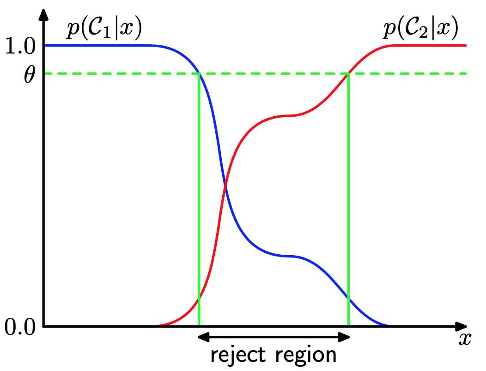
</p>

## Minimizing the Expected Loss for Regression
So far, we have discussed decision theory in the context of classification problems. We now turn to the case of regression problems, such as the curve fitting example discussed earlier. The decision stage consists of choosing a specific estimate $y(\bm x)$ of the value of $t$ for each input $\bm x$. Suppose that in doing so, we incur a loss $L(t, y(\bm x))$. The average, or expected, loss is then given by

$$
\mathbb E[L] = \int\int L(t, y(\bm x)) p(\bm x, t) d\bm xdt
$$

A common choice of loss function in regression problems is the squared loss given by $L(t, y(\bm x)) =\big( {y(\bm x)− t}\big) ^2$:

$$
\mathbb E[L] = \int\int \big(y(\bm x)− t)^2 p(\bm x, t\big) d\bm xdt
$$

Our goal is to choose $y(\bm x)$ so as to minimize $\mathbb E[L]$. It turns out that the optimal answer to this problem is $y(\bm x)= \mathbb E[ t|\bm x]$. To see this, we can expand the square term as follows

<!-- 
If we assume a completely flexible function $y(\bm x)$:

$$
\frac{\partial \mathbb E[L] }{\partial y(\bm x)} = 2 \int (y(\bm x)− t) p(\bm x, t) dt = 0.
$$

So:

$$
y(\bm x) = \frac{\int t p(\bm x, t) dt}{p(\bm x)} = \int t p(t\mid \bm x)dt = \mathbb E[t\mid \bm x]
$$

This can readily be extended to multiple target variables represented by the vector $\bm t$, in which case the optimal solution is the conditional average $y(\bm x) = \mathbb E[\bm t\mid \bm x]$.

<p align="center">
    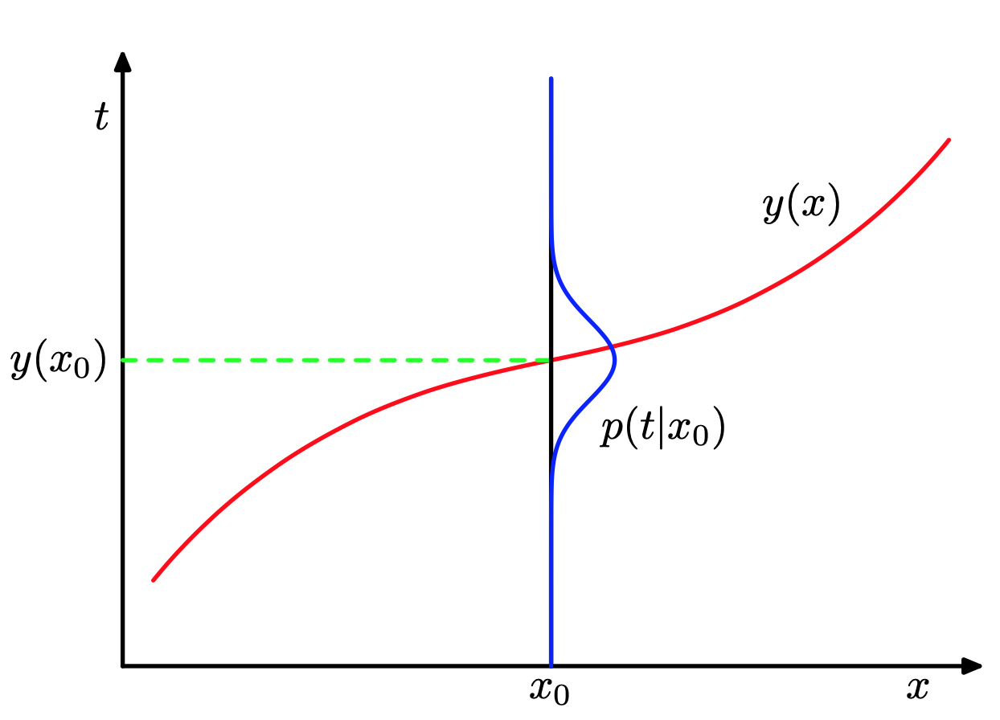
</p> -->


$$
\begin{align*}
\{y(\bm x)− t\}^2 &= \{y(\bm x)−  \mathbb E[ t\mid \bm x] +  \mathbb E[ t\mid \bm x] - t \}^2 \\
&= \{y(\bm x) −  \mathbb E[ t\mid \bm x] \}^2 \\
& \qquad +  2 \{y(\bm x) - \mathbb E[ t\mid \bm x] \} \{\mathbb E[ t\mid \bm x] - t \} \\
& \qquad +  \{\mathbb E[ t\mid \bm x] - t \}^2
\end{align*}
$$

Substituting into the loss function and performing the integral over $t$, we see that the cross-term vanishes and we obtain an expression for the loss function in the form

$$
\begin{align*}
\mathbb E[L] & = \int  \{y(\bm x) −  \mathbb E[ t|\bm x] \}^2 p(\bm x)d\bm x +  
\int \{\mathbb E[ t\mid \bm x] - t \}^2 p(\bm x, t)d\bm x dt  
% \int \text{Var}(t \mid \bm x)  p(\bm x)d\bm x
\end{align*}
$$

The function $y(\bm x)$ we seek to determine enters only in the first term, which will be minimized when $y(\bm x)= \mathbb E[ t|\bm x]$, in which case this term will vanish. rgets, and is called the Bayes error. The estimator $y(\bm x)= \mathbb E_t[ t|\bm x]$ is the best we can ever hope to do with any learning algorithm. This is simply the result that we derived previously and that shows that the optimal least squares predictor is given by the conditional mean. The second term (called Bayes error) is the variance of the distribution of $t$, averaged over $\bm x$:
\[
\int \text{Var}(t \mid \bm x)  p(\bm x)d\bm x
\]

It represents the intrinsic variability of the target data and can be regarded as **noise**. Because it is independent of $y(\bm x)$, it represents the irreducible minimum value of the loss function. 


## Entropy

Considere a discrete random variable $\bm x$ and we ask how much information is received when we observe a specific value for this variable. The amount of information can be viewed as the ‘degree of surprise’ on learning the value of $\bm x$. If we are told that a highly improbable event has just occurred, we will have received more information than if we were told that some very likely event has just occurred, and if we knew that the event was certain to happen we would receive no information. Our measure of information content will therefore depend on the probability distribution $p(x)$, and we therefore look for a quantity $h(x)$ that is a monotonic function of the probability p(x) and that expresses the information content. Note that if we have two events $x$ and $y$ that are unrelated, then the information gain from observing both of them should be the sum of the information gained from each of them separately, so that $h(x, y) = h(x) + h(y)$. Two unrelated events will be statistically independent and so $p(x, y) = p(x)p(y)$. From these two relationships, it is easily shown that $h(x)$ must be given by the logarithm of $p(x)$: $ h(x) = -\log p(x)$. Note that low probability events $x$ correspond to high information content. The average amount of information is obtained by taking the expectation with respect to the distribution $p(x)$:

$$
H[x] =− \sum_x p(x) \log p(x).
$$

This important quantity is called the **entropy** of the random variable $x$. Note that $\lim_{p→0} p \ln p = 0$ and so we shall take $p(x) \ln p(x) = 0$ whenever we encounter a value for x such that $p(x) = 0$. _Distributions $p(x)$ that are sharply peaked around a few values will have a relatively low entropy, whereas those that are spread more evenly across many values will have higher entropy_.  For example, when one of $p(x_i)$ is 1 and the rest is zero, entropy is at its minimum value 0. But if $p(x_1)=\dots=p(x_n)=1/n$ (all equal), the entropy is at maximum value $n$. Entropy defintion for continuous variables is similar: 

$$
H[x] = -\int  p(x) \log p(x) dx.
$$

The **cross entropy** between two probability distributions $p$ and $q$ is defined as $H(p, q) = − \sum_x p(x) \log q(x)$.

# Linear Models for Regression

The simplest form of linear regression models are also linear functions of the input variables. However, we can obtain a much more useful class of functions by taking linear combinations of a fixed set of nonlinear functions of the input variables, known as basis functions. Such models are linear functions of the parameters, which gives them simple analytical properties, and yet can be nonlinear with respect to the input variables. The simplest linear model for regression is one that involves a linear combination of the input variables

\[
y(\bm x,\bm w) = w_0 + w_1x_1 +. . . + w_Dx_D
\]

where $\bm x = (x_1, . . . , x_D)^T$. This is often simply known as **linear regression**. The key property of this model is that it is a linear function of the parameters $w_0, . . . , w_D$. It is also, however, a linear function of the input variables $x_i$, and this imposes significant limitations on the model. We therefore extend the class of models by considering linear combinations of fixed nonlinear functions of the input variables, of the form

\[
    y(\bm x,\bm w) = w_0 +\sum_{j=1}^{M−1} w_j \phi_j(\bm x)
\]

where $\phi_j(\bm x): \mathbb R^n \rightarrow \mathbb R$ are known as **basis functions**. By denoting the maximum value of the index $j$ by $M− 1$, the total number of parameters in this model will be $M$. The parameter $w_0$ allows for any fixed offset in the data and is sometimes called a bias parameter (not to be confused with ‘bias’ in a statistical sense). It is often convenient to define an additional dummy ‘basis function’ $φ_0(x) = 1$ so that

\[
    y(\bm x,\bm w) = \sum_{j=0}^{M−1} w_j \phi_j(\bm x) = \bm w^T \bm \phi(\bm x)
\]

where $\bm w = (w_0, . . . , w_{M−1})^T$ and $\bm \phi = (\phi_0, . . . , \phi_{M−1})^T$. The example of polynomial regression mentioned before is a particular example of this model in which there is a single input variable $x$, and the basis functions take the form of powers of $x$ so that $\phi_j(x) = x^j$. One limitation of polynomial basis functions is that they are global functions of the input variable, so that changes in one region of input space affect all other regions. There are many other possible choices for the basis functions, for example

\[
\phi_j(\bm x) = \exp\{-\frac{||\bm x-\bm \mu_j||^2}{2s^2} \}
\]

where the $\bm \mu_j$ govern the locations of the basis functions in input space, and the parameter $s$ governs their spatial scale. These are usually referred to as *Gaussian basis functions*, although it should be noted that they are not required to have a probabilistic interpretation, and in particular the normalization coefficient is unimportant because these basis functions will be multiplied by adaptive parameters $w_j$. Another possibility is the sigmoidal basis function of the form

\[
\phi_j(x) = \sigma \Big (\frac{x-\mu_j}{s} \Big)
\]
 
 where $σ(a)$ is the *sigmoid function*. Yet another possible choice of basis function is the *Fourier basis*, which leads to an expansion in sinusoidal functions. Each basis function represents a specific frequency and has infinite spatial extent. Most of the discussion in this chapter, however, is independent of the particular choice of basis function set, and so for most of our discussion we shall not specify the particular form of the basis functions including the identity $\bm \phi(\bm x) =\bm x$.

 ## Maximum Likelihood and Least Squares

 As before, we assume that the target variable $t$ is given by a deterministic function $y(\bm x,\bm w)$ with additive Gaussian noise so that

\[
t = y(\bm x,\bm w) + \epsilon,
\]

where $\epsilon$ is a zero mean Gaussian random variable with precision (inverse variance) $β$. Thus we can write

\[
p(t\mid \bm x, \bm w, β) = \mathcal N (t\mid y(\bm x,\bm w), β^{−1}).
\]

Here we have defined a precision parameter β corresponding to the inverse variance of the distribution $\beta^{-1}=\sigma^2$.

<p align="center">
    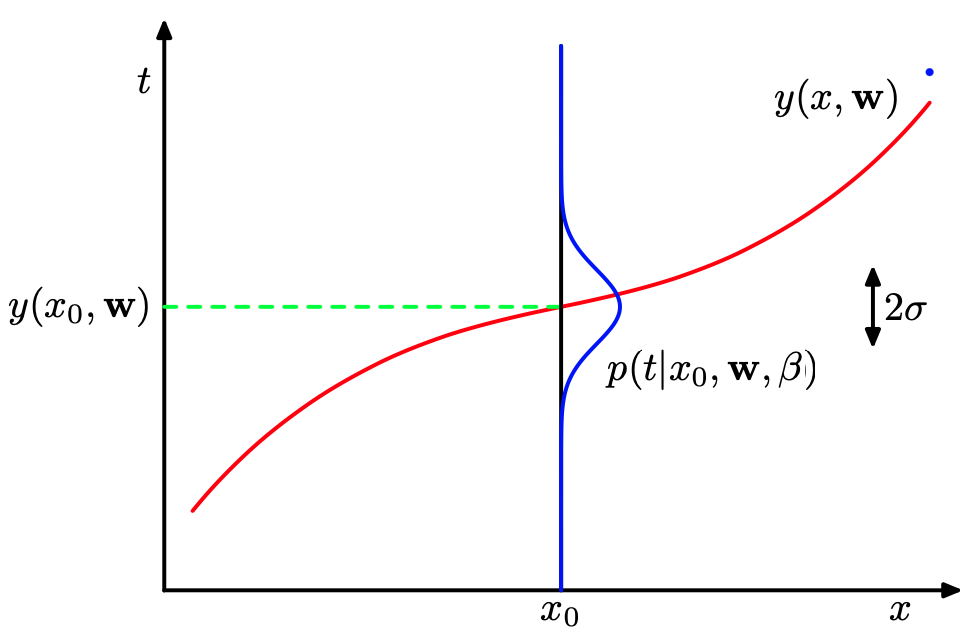
</p>

Recall that, if we assume a squared loss function, then the optimal prediction, for a new value of $\bm x$, will be given by the conditional mean of the target variable. In the case of a Gaussian conditional distribution of the form, the conditional mean will be simply

\[
\mathbb E[t\mid \bm x] = \int tp(t\mid \bm x) dt= y(\bm x, \bm w).
\]

*Note that the Gaussian noise assumption implies that the conditional distribution of $t$ given $\bm x$ is unimodal*, which may be inappropriate for some applications. An extension to mixtures of conditional Gaussian distributions, which permit multimodal conditional distributions, will be discussed later.

Now consider a dataset of inputs $\bm X= \{ \bm x_1, . . . ,\bm x_N \}$ with corresponding target values $\bm t = (t_1, . . . , t_N)$ .  Making the assumption that these data points are drawn independently from the distribution (equivalently, $ϵ_i$ are distributed IID), we obtain the following expression for the likelihood function, which is a function of the adjustable parameters $\bm w$ and $β$, in the form

\[
p(\bm t \mid \bm X, \bm w, \beta) = \prod_{n=1}^N \mathcal N(t_n \mid \bm w^T \bm \phi(\bm x_n), \beta^{-1})
\]

Note that in supervised learning problems such as regression and classification, we are not seeking to model the distribution of the input variables. Thus $\bm x$ will always appear in the set of conditioning variables, and so from now on we will drop the explicit $\bm x$ from expressions to keep the notation uncluttered. Taking the logarithm of the likelihood function, and making use of the standard form for the univariate Gaussian, we have

\[
\begin{align*}
\ln p(\bm t \mid \bm w, \beta) &= \sum_{n=1}^N \ln \mathcal N(t_n \mid \bm w^T \bm \phi(\bm x_n), \beta^{-1}) \\
& = \frac{N}{2} \ln \beta - \frac{N}{2} \ln 2\pi - \beta E_D(\bm w)
\end{align*}
\]

where 

\[
E_D(\bm w) = \frac{1}{2} \sum_{n=1}^N \{ t_n - \bm w^T \bm \phi(\bm x_n)\}^2 = \frac{1}{2} (\bm t - \bm  \Phi \bm w)^T(\bm t - \bm \Phi \bm w)
\]

Note: the terms “probability” and “likelihood” have different meanings in statistics: given a statistical model with some parameters $θ$, the word “probability” is used to describe how plausible a future outcome $x$ is (knowing the parameter values $θ$), while the word “likelihood” is used to describe how plausible a particular set of parameter values $θ$ are, after the outcome $x$ is known.

Having written down the likelihood function, we can use maximum likelihood to determine $\bm w$ and $β$. Consider first the maximization with respect to $\bm w$.  We see that **maximization of the likelihood function under a conditional Gaussian noise distribution for a linear model is equivalent to minimizing a sum-of-squares error function** given by $E_D(\bm w)$. The gradient of the log likelihood function takes the form

\[
\begin{align*}
\nabla_{\bm w} \ln p(\bm t \mid \bm w, \beta) &= \sum_{n=1}^N \bm \phi(\bm x_n)^T \{ t_n - \bm w^T \bm \phi(\bm x_n)\} = \bm \Phi^T(\bm t - \bm \Phi \bm w), \\
\nabla^2_{\bm w} \ln p(\bm t \mid \bm w, \beta) &= \bm \Phi^T \bm \Phi.
\end{align*}
\]

Setting this gradient to zero and solving for $\bm w$, we obtain:

\[
\begin{align*}
\bm w_{ML} = (\bm \Phi^T \bm \Phi)^{-1} \bm \Phi^T \bm t
\end{align*}
\]

which are known as the Normal Equation for the least squares problem. Here $Φ$ is an N×M matrix, called the _design matrix_, whose elements are given by $Φ_{nj}= φ_j(x_n)$, so that

\[
\Phi = 
\begin{pmatrix}
 \phi_0(\bm x_1) & \phi_0(\bm x_1) &\dots& \phi_{M-1}(\bm x_1) \\
 \phi_0(\bm x_2) & \phi_0(\bm x_2) &\dots& \phi_{M-1}(\bm x_2) \\
 \vdots & \vdots & \dots & \vdots\\
 \phi_0(\bm x_N) & \phi_0(\bm x_N) &\dots& \phi_{M-1}(\bm x_N) 
\end{pmatrix}
\]

The quantity $\bm \Phi^{\dagger} = (\bm \Phi^T \bm \Phi)^{-1} \bm \Phi^T$ is known as the Moore-Penrose pseudo-inverse of the matrix. It can be regarded as a generalization of the notion of matrix inverse to nonsquare matrices. We can also maximize the log likelihood function  with respect to the noise precision parameter $β$, giving

\[
\begin{align*}
\frac{1}{\beta_{ML}} = \frac{1}{N}\sum_{n=1}^N \big( y(x_n, \bm w_{ML}) - t_n\big)^2 = \frac{1}{N}\sum_{n=1}^N \{ t_n - \bm w^T_{ML} \bm \phi(\bm x_n)\}^2
\end{align*}
\]

and so we see that the inverse of the noise precision, that is $\frac{1}{N}\sum_{n=1}^N \{ t_n - \bm w^T_{ML} \bm \phi(\bm x_n)\}^2$ is given by the residual variance of the target values around the regression function and its being minimized. Geometrical interpretation of the least-squares solution is the following: **the least-squares regression function is obtained by finding the *orthogonal projection* $\bm y = \bm w^T_{ML} \bm \Phi$ of the data vector $\bm t=(t_1, . . . , t_N)$ onto the lower-dimensional subspace spanned by **feature vectors** $\bm φ_j = (\phi_j(\bm x_1),\dots, \phi_j(\bm x_N))$**. The reason for orthogonality is that this projection minimizes $||\bm t - \bm y || = || \bm t -  \bm w^T_{ML} \bm \Phi ||$.

<p align="center">
    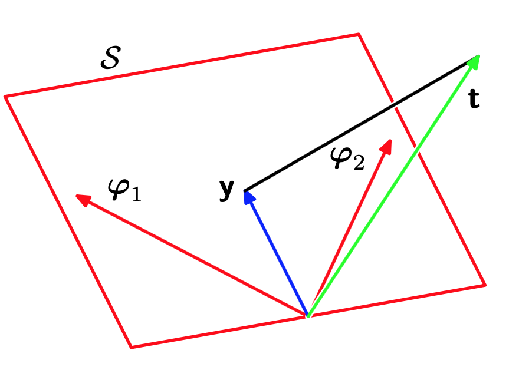
</p>


Having determined the parameters $\bm w$ and $β$, we can now make predictions for new values of $x$:

$$
p( t \mid  x,\bm w_{ML}, \beta_{ML}) = \mathcal{N}(t \mid y(x, \bm w_{ML}), \beta^{-1}_{ML})
$$

So far, we have considered the case of a single target variable $t$. In some applications, we may wish to predict K > 1 target variables, which we denote collectively by the target vector $t$. This could be done by introducing a different set of basis functions for each component of $t$, leading to multiple, independent regression problems. However, a more interesting, and more common, approach is to use the same set of basis functions to model all of the components of the target vector so that $y(\bm x, \bm w) = \bm W^T \bm \phi(\bm x)$ where $\bm W$ is a matrix. Everything goes similar to single output $t$:

\[
\bm W_{ML} = (\bm \Phi^T \bm \Phi)^{-1} \bm \Phi^T \bm T
\]

If we examine this result for each target variable $t_k$, we have $ \bm w_k = (\bm \Phi^T \bm \Phi)^{-1} \bm \Phi^T \bm t_k$. Thus the solution to the regression problem decouples between the different target variables, and we need only compute a single pseudo-inverse matrix $Φ^†$, which is shared by all of the vectors $\bm w_k$. 

The extension to general Gaussian noise distributions having arbitrary covariance matrices is straightforward. This leads to a decoupling into K independent regression problems. This result is unsurprising because the parameters $\bm W$ define only the mean of the Gaussian noise distribution, and we know that the maximum likelihood solution for the mean of a multivariate Gaussian is independent of the covariance. From now on, we shall therefore consider a single target variable $t$ for simplicity.

### Hypothesis Testing
Up to now we have made minimal assumptions about the true distribution of the data. We now assume that the observations $t_i$ are uncorrelated and we chose them to have precision $\beta$, or constant variance $\frac{1}{\beta}$. Recal that $\bm w_{ML}$ was an unbiased estimator of $\bm w$ becuase its expectations (conditioned on $X$) is the true paramter $\bm w:

\[
\begin{align*}
\mathbb E[\bm w_{ML}] = \mathbb E [(\bm \Phi^T \bm \Phi)^{-1} \bm \Phi^T \bm t] = (\bm \Phi^T \bm \Phi)^{-1} \bm \Phi^T \mathbb E [\bm t] = (\bm \Phi^T \bm \Phi)^{-1} \bm \Phi^T \bm \Phi \bm w = \bm w
\end{align*}
\]

 The variance–covariance matrix of the least squares parameter estimates $\bm w_{ML}$ is easily derived from its defining equation:

$$
\text{Var}(\bm w_{ML}) = \Big((\bm \Phi^T \bm \Phi)^{-1} \bm \Phi^T \Big)  \text{Var}(\bm t)  \Big ((\bm \Phi^T \bm \Phi)^{-1} \bm \Phi^T\Big)^T = \frac{1}{\beta}(\bm \Phi^T \bm \Phi)^{-1}
$$

because $\text{Var}(\bm t)  = \frac{1}{\beta} \bm I$. Note that $\frac{1}{\beta} = \sigma^2$. We gave the maximum likelihood estimate of $ \beta$ before which was biased. Typically one estimates the variance $ \frac{1}{\beta}$ by

$$
 \hat \sigma^2 = \frac{1}{\hat \beta} = \frac{1}{N-M}\sum_{n=1}^N \{ t_n - \bm w^T_{ML} \bm \phi(\bm x_n)\}^2
$$

The $N−M$ rather than $N$ in the denominator makes $  \hat \sigma^2$ an unbiased estimate of $ \sigma^2$. Therfore, we can say: $\bm w_{ML} \sim \mathcal N(\bm w, \frac{1}{\beta}(\bm \Phi^T \bm \Phi)^{-1})$. Assuming $t_i$s are independent, then $\frac{N-M}{\hat \beta} \sim \frac{1}{\beta} \chi^2_{N-M}$, a chi-squared distribution with $N−M$ degrees of freedom. In addition $\bm w_{ML} $ and $\frac{1}{\beta}$ are statistically independent. We use these distributional properties to form tests of hypothesis and confidence intervals for the parameters $\bm w^j_{ML}$. For example, to test the hypothesis that a particular coefficient $w_j = 0$, we form the standardized coefficient or $z$-score:

\[
    z_j = \frac{w^j_{ML} - 0}{\hat \sigma \sqrt{v_j}}
\]

where $v_j$ is the $j$th diagonal element of $(\Phi^T \Phi)^{−1}$. Under the null hypothesis that $w_j = 0$, $z_j$ is distributed as $t_{N−M}$ (a $t$ distribution with $N−M$ degrees of freedom), and hence a large (absolute) value of $z_j$ will lead to rejection of this null hypothesis. If $\hat σ$ is replaced by a known value $σ$, then $z_j$ would have a standard normal distribution. The difference between the tail quantiles of a t-distribution and a standard normal become negligible as the sample size increases, and so we typically use the normal quantiles.

## Training Models

The Normal Equation computes the inverse of $X^T X$, which is an (n + 1) × (n + 1) matrix (where n is the number of features). The computational complexity of inverting such a matrix is typically about $\mathcal O(n^{2.4})$ to $\mathcal O(n^3)$ (depending on the implementation). In practice, a direct solution of the normal equations can lead to numerical difficulties when $Φ^TΦ$ is close to singular. In particular, when two or more of the basis vectors $ϕ_j$ are **colinear** (perfectly correlated), or _nearly so_, the resulting parameter values can have large magnitudes or not uniquely defined. However, the fitted values are still the projection of $\bm t$ onto the space of $ϕ_j$s; there would just be more than one way to express that projection in terms of $ϕ_j$s. Such near degeneracies will not be uncommon when dealing with real datasets. Note that the addition of a regularization term ensures that the matrix is non-singular, even in the presence of degeneracies. 


 The *pseudoinverse* itself is computed using a standard matrix factorization technique called **Singular Value Decomposition (SVD)** that can decompose the training set matrix $X$ into the matrix multiplication of three matrices $U Σ V^T$ (see `numpy.linalg.svd()`). The pseudoinverse is computed as $X^+ = VΣ^+U^T$. To compute the matrix $Σ^+$, the algorithm takes $Σ$ and sets to zero all values smaller than a tiny threshold value, then it replaces all the non-zero values with their inverse, and finally it transposes the resulting matrix. This approach is more efficient than computing the Normal Equation, plus it handles edge cases nicely: indeed, the Normal Equation may not work if the matrix $X^TX$ is not invertible (i.e., singular), such as if m < n or if some features are redundant, but the pseudo-inverse is always defined. The SVD approach used by Scikit-Learn’s LinearRegression class is about $\mathcal O(n^2)$.


### Gradient Descent

In machine learning the more common way to optimize the objective function is to use iterative algorithms such as **Gradient descent**. Gradient Descent is a very generic optimization algorithm capable of finding optimal solutions to a wide range of problems. The general idea of Gradient Descent is to tweak parameters iteratively in order to minimize a cost function. An important parameter in Gradient Descent is the size of the steps, determined by the **learning rate** hyperparameter. If the learning rate is too small, then the algorithm will have to go through many iterations to converge, which will take a long time. 

$$
\bm w^{(\tau+1)} \leftarrow \bm w^{(\tau)} - \alpha \nabla_{\bm w} E_D(\bm w) 
$$

Learning rate typically with small values e.g. 0.01 or 0.0001. On the other hand, if the learning rate is too high, you might jump across the valley and end up on the other side, possibly even higher up than you were before.  When using Gradient Descent, you should ensure that all features have a similar scale (e.g., using Scikit-Learn’s StandardScaler class), or else it will take much longer to converge. With gradient descent, we never actually reach the optimum, but merely approach it gradually. Why, then, would we ever prefer gradient descent? Two reasons:

1. We can only solve the system of equations in closed-form like Normal Equations for a handful of models. By contrast, we can apply gradient descent to any model for which we can compute the gradient. Importantly, this can usually be done automatically, so software packages like `Theano` and `TensorFlow` can save us from ever having to compute partial derivatives by hand.

2. Solving a large system of linear equations can be expensive (matrix inversion is an $\mathcal O(D^3)$ algorithm), possibly many orders of magnitude more expensive than a single gradient descent update. Therefore, gradient descent can sometimes find a reasonable solution much faster than solving the linear system. Therefore, gradient descent is often more practical than computing exact solutions, even for models where we are able to derive the latter.

To implement algorithms in Python, we vectorize algorithms by expressing them in terms of vectors and matrices (using `Numpy` or deep learning libraries, for example). This way, the equations, and the code, will be simpler and more readable. Also we get rid of dummy variables/indices! Vectorized code is much faster. It cuts down on Python interpreter overhead. It uses highly optimized linear algebra libraries, fast matrix multiplication on a Graphics Processing Unit (GPU).

To implement Gradient Descent, compute the gradient of the cost function with regards to each model parameter. This could involve calculations over the full training set $X$, at each Gradient Descent step! This algorithm is called **Batch Gradient Descent**: it uses the whole batch of training data at every step. As a result it is terribly slow on very large training sets. However, Gradient Descent scales well with the number of features; training a Linear Regression model when there are hundreds of thousands of features is much faster using Gradient Descent than using the Normal Equation or SVD decomposition.

**Stochastic Gradient Descent** just picks a random instance in the training set at every step and computes the gradients based only on that single instance. Obviously this makes the algorithm much faster since it has very little data to manipulate at every iteration. It also makes it possible to train on huge training sets, since only one instance needs to be in memory at each iteration. When the cost function is very irregular, this can actually help the algorithm jump out of local minima, so Stochastic Gradient Descent has a better chance of finding the global minimum than Batch Gradient Descent does. To help SGD converges despite all the flunctuation due to it stochastic nature, we gradually reduce the learning rate. The function that determines the learning rate at each iteration is called the **learning schedule**. If the learning rate is reduced too quickly, you may get stuck in a local minimum, or even end up frozen halfway to the minimum. If the learning rate is reduced too slowly, you may jump around the minimum for a long time and end up with a suboptimal solution if you halt training too early. 

_When using Stochastic Gradient Descent, the training instances must be independent and identically distributed (IID), to ensure that the parameters get pulled towards the global optimum, on average_. A simple way to ensure this is to shuffle the instances during training (e.g., pick each instance randomly, or shuffle the training set at the beginning of each epoch). If you do not do this, for example if the instances are sorted by label, then SGD will start by optimizing for one label, then the next, and so on, and it will not settle close to the global minimum.

Another very common approach is  **Mini-batch Gradient Descent**: at each step, instead of computing the gradients based on the full training set (as in Batch GD) or based on just one instance (as in Stochastic GD), Mini-batch GD computes the gradients on small random sets of instances. The main advantage of Mini-batch GD over Stochastic GD is that you can get a performance boost from hardware optimization of matrix operations, especially when using GPUs.

### Early Stopping

As the epochs go by, the algorithm learns and its prediction error (RMSE) on the training set naturally goes down, and so does its prediction error on the validation set. However, after a while the validation error stops decreasing and actually starts to go back up. This indicates that the model has started to overfit the training data. With early stopping you just stop training as soon as the validation error reaches the minimum. It is such a simple and efficient regularization technique.

<p align="center">
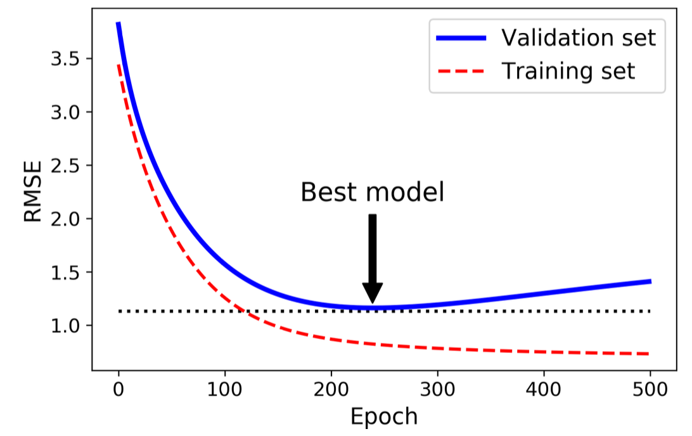
</p>


### Batch and Online Learning

 Another criterion used to classify Machine Learning systems is whether or not the system can learn incrementally from a stream of incoming data. In **batch learning**, the system is incapable of learning incrementally; it must be trained using all the available data which generally takes a lot of time and computing resources, so it is typically done offline. First the system is trained, and then it is launched into production and runs without learning anymore (*offline learning* ). If you want a batch learning system to know about new data (such as a new type of spam), you need to train a new version of the system from scratch on the full dataset (not just the new data, but also the old data), then stop the old system and replace it with the new one. If your system needs to adapt to rapidly changing data (e.g., to predict stock prices), then you need a more reactive solution. Also, training on the full set of data requires a lot of computing resources (CPU, memory space, disk space, disk I/O, network I/O, etc.). If you have a lot of data and you automate your system to train from scratch every day, it will end up costing you a lot of money. If the amount of data is huge, it may even be impossible to use a batch learning algorithm.

In **online learning**, you train the system incrementally by feeding it data instances sequentially, either *individually* or by small groups called *mini-batches*. Each learning step is fast and cheap, so the system can learn about new data on the fly, as it arrives. Online learning is great for systems that receive data as a continuous flow (e.g., stock prices) and need to adapt to change rapidly or autonomously. It is also a good option.  A big challenge with online learning is that if bad data is fed to the system, the system’s performance will gradually decline. If we are talking about a live system, your clients will notice.

## Regularized Least Squares

The idea of adding a regularization term to an error function in order to control over-fitting to improve generalization is common practice. So the total error to be minimized is $E_D(\bm w) + \lambda E_W(\bm w)$ where $λ$ is the regularization coefficient that controls the relative importance of the data-dependent error $E_D(\bm w)$ and the regularization term $E_W (\bm w)$. One of the simplest forms of regularizer is given by the sum-of-squares of the weight vector elements $E_W(\bm w) = \frac{1}{2}\bm w^T \bm w$. So the total error function becomes:

\[
\frac{1}{2} \sum_{n=1}^N \{  t_n - \bm w^T \bm \phi(\bm x_n)\}^2 + \frac{\lambda}{2}\bm w^T \bm w
\]

This particular choice of regularizer encourages weight values to decay towards zero, unless supported by the data. It has the advantage that the error function remains a quadratic function of $\bm w$, and so its exact minimizer can be found in closed form. Specifically, setting the gradient with respect to $\bm w$ to zero, and solving for $\bm w$ as before, we obtain:

\[
\bm w = (λ\bm I + \bm Φ^T\bm Φ)^{−1} \bm Φ^T \bm t
\]

The solution adds a positive constant to the diagonal of $\bm Φ^T\bm Φ$ before inversion. This makes the problem nonsingular, even if $\bm Φ^T\bm Φ$ is not of full rank, and was the main motivation for **ridge regression** when it was first introduced in statistics (Hoerl and Kennard, 1970). A more general regularizer is sometimes used, for which the regularized error takes the form

\[
\frac{1}{2} \sum_{n=1}^N \{  t_n - \bm w^T \bm \phi(\bm x_n)\}^2 + \frac{\lambda}{2} \sum_{j=1}^M | w_j|^q
\]

where $q = 2$ corresponds to the quadratic regularizer. The case of $q = 1$ is known as the **lasso** in the statistics literature . This is L1-regularizetion that encourages some of the coefficients $w_j$ to be exactly zero if $λ$ is sufficiently large, leading to a *sparse* model in which the corresponding basis functions play no role. To see this, we first note that minimizing the above objective is equivalent to minimizing the unregularized sum-of-squares error subject to the constraint

$$
\sum_{j=1}^M | w_j|^q \le \eta
$$

for an appropriate value of the parameter $η$, where the two approaches can be related using **Lagrange multipliers**. L1-regularizetion is useful in situations where you have lots of features, but only a small fraction of them are likely to be relevant (e.g. genetics). The above cost function is a quadratic program, a more difficult optimization problem than for L2 regularization. What would go wrong if you just apply gradient descent? Fast algorithms are implemented in frameworks like scikit-learn.

<p align="center">
    
</p>

As $λ$ is increased, so an increasing number of parameters are driven to zero. Regularization allows complex models to be trained on datasets of limited size without severe over-fitting, essentially by limiting the effective model complexity. It is important to scale the data (e.g., using a StandardScaler) before performing Ridge Regression, as it is sensitive to the scale of the input features. This is true of most regularized models.

**Elastic Net** is a middle ground between Ridge Regression and Lasso Regression. The regularization term is a simple mix of both Ridge and Lasso’s regularization terms, and you can control the mix ratio $r$. When $r = 0$, Elastic Net is equivalent to Ridge Regression, and when $r = 1$, it is equivalent to Lasso Regression

$$
L = \text{MSE}(\bm w) + r\alpha\sum_{i=1}^n |w_i| + \frac{1-r}{2}\alpha\sum_{i=1}^n w_i^2
$$

It is almost always preferable to have at least a little bit of regularization, so generally you should avoid plain Linear Regression. Ridge is a good default, but if you suspect that only a few features are actually useful, you should prefer Lasso or Elastic Net.


## Bias-Variance Decomposition

Let's consider a frequentist viewpoint of the model complexity issue, known as the _bias-variance trade-off_. When we discussed decision theory for regression problems, we considered various loss functions each of which leads to a corresponding optimal prediction once we are given the conditional distribution $p(t \mid \bm x)$. A popular choice is the squared loss function, for which the optimal prediction is given by the conditional expectation, which we denote by $h(x)$ and which is given by

\[
h(\bm x) = \mathbb E[t\mid \bm x] = \int t p(t\mid x)dt
\]

We showed that the expected squared loss can be written in the form

$$
\begin{align*}
\mathbb E[L] = \int  \Big(y(\bm x) −  h(\bm x) \Big)^2 p(\bm x)d\bm x  + \int \Big(h(\bm x) - t \Big)^2 p(\bm x, t)d\bm x dt
\end{align*}
$$

Recall that the second term, which is independent of $y(\bm x)$, arises from the intrinsic noise on the data and represents the minimum achievable value of the expected loss. The first term depends on our choice for the function $y(\bm x)$, and we will seek a solution for $y(\bm x)$ which makes this term a minimum. Because it is nonnegative, the smallest that we can hope to make this term is zero.  However, in practice we have a dataset $\mathcal D$ containing only a finite number N of data points not unlimited amount of data, and consequently we try to estimate the regression function $h(\bm x)$. If we model the $h(\bm x)$ using a parametric function $y(\bm x, \bm w)$ governed by a parameter vector $\bm w$, then from a Bayesian perspective the uncertainty in our model is expressed through a posterior distribution over $\bm w$. 

A frequentist treatment, however, involves making a point estimate of $\bm w$ based on the dataset $\mathcal D$, and tries instead to interpret the uncertainty of this estimate through the following thought experiment: Suppose we had a large number of datasets each of size N and each drawn independently from the distribution $p(t,\bm x)$. For any given dataset $\mathcal D$, we can run our learning algorithm and obtain a prediction function $y(\bm x; \mathcal D)$. Different datasets from the ensemble will give different functions and consequently different values of the squared loss. The performance of a particular learning algorithm is then assessed by taking the average over this ensemble of datasets. Now the expectation of squared error with respect to $\mathcal D$ is

$$
\begin{align*}
\mathbb E_{ \mathcal D} & \Big[ \Big( y(\bm x; \mathcal D) − h(t) \Big)  ^2 \Big] = \\
 & = \mathbb E_{ \mathcal D} \Big[ \Big ( y(\bm x; \mathcal D) −  \mathbb E_{ \mathcal D}[ y(\bm x; \mathcal D)] +  \mathbb E_{\mathcal D} [ y(\bm x; \mathcal D)] - h(t) \Big )^2\Big]  \\ 
 &= \mathbb E_{\mathcal D} \Big[ \Big( y(\bm x; \mathcal D) −  \mathbb E_{ \mathcal D}[ y(\bm x; \mathcal D)]  \Big )^2 \Big] + \\
& +  \cancel {\mathbb E_{ \mathcal D} \Big[ 2 \big( y(\bm x; \mathcal D) - \mathbb E_{ \mathcal D}[ y(\bm x; \mathcal D)]  \big)  \big (\mathbb E_{ \mathcal D}[ y(\bm x; \mathcal D)] - h(t) \big) \Big ] }\\ 
&+ \mathbb E_{ \mathcal D}\Big [  \big ( \mathbb E_{\mathcal D} [ y(\bm x; \mathcal D)]- h(t) \big ) ^2 \Big ] = \\
& =  \big ( \mathbb E_{\mathcal D} [ y(\bm x; \mathcal D)]- h(t) \big ) ^2  +  
\mathbb E_{\mathcal D} \Big[ \Big( y(\bm x; \mathcal D) −  \mathbb E_{ \mathcal D}[ y(\bm x; \mathcal D)]  \Big )^2 \Big]
\end{align*}
$$

We see that the expected squared difference between $y(\bm x; \mathcal D)$ and the regression function $h(\bm x)$ can be expressed as the sum of two terms. The first term, called the _squared bias_, represents the extent to which the average prediction over all datasets differs from the desired regression function. The second term, called the _variance_, measures the extent to which the solutions for individual datasets vary around their average, and hence this measures the extent to which the function $y(\bm x; \mathcal D)$ is sensitive to the particular choice of dataset.

So far, we have considered a single input value $\bm x$. If we substitute this expansion back into (2), we obtain the following decomposition of the expected squared loss:

>  $\;\;\;\;\;\;\;\;\;\;\;\;\;\;\;\;\;\;\;\text{expected loss} = (\text{bias})^2 + \text{variance} + \text{noise}$

<br>

where:

$$
\begin{align*}
\text{(bias)}^2 &=  \int   \big ( \mathbb E_{\mathcal D} [ y(\bm x; \mathcal D)]- h(t) \big ) ^2 p(\bm x) d\bm x \\
\text{variance of $y$} &= \int \mathbb E_{\mathcal D} \Big[ \Big( y(\bm x; \mathcal D) −  \mathbb E_{ \mathcal D}[ y(\bm x; \mathcal D)]  \Big )^2 \Big] p(\bm x) d\bm x \\
\text{noise (Bayes error)} &=  \int \Big(h(\bm x) - t \Big)^2 p(\bm x, t)d\bm x dt
\end{align*}
$$

and the bias and variance terms now refer to integrated quantities. To have an example for the above discussion to get clear, we create 100 datasets ($l=1,\dots,100$) each containing N=25 data points, independently from the sinusoidal curve $h(x) = \sin(2\pi x)$.  For each dataset $\mathcal D^l$, we fit a model with 24 Gaussina basis fucntion by minimizing the regularized error function (coefficient $\lambda$) to give a prediction function $y^l(x)$. Large value of the regularization coefficient $λ$ gives low variance but high bias. 

<p align="center">
    
</p>

Conversely on the bottom row, for which $λ$ is small, there is large variance (shown by the high variability between the red curves in the left plot) but low bias (shown by the good fit between the average model fit and the original sinusoidal function). Note that the result of averaging many solutions for the complex model with M = 25 is a very good fit to the regression function, which suggests that averaging may be a beneficial procedure. Indeed, a weighted averaging of multiple solutions lies at the heart of a Bayesian approach, although the averaging is with respect to the posterior distribution of parameters, not with respect to multiple datasets. The average prediction is estimated from
\[
\bar y(x) = \frac{1}{100} \sum_{l=1}^{100} y^l(x)
\]

and the integrated squared bias and integrated variance are then given by

$$
\begin{align*}
\text{(bias)}^2 &=  \frac{1}{25} \sum_{n=1}^{25} \big (\bar y(x_n) - h(x_n) \big)^2\\
\text{variance} &= \frac{1}{25} \sum_{n=1}^{25} \frac{1}{100} \sum_{n=1}^{100} \big (\bar y(x_n) - y^l(x_n) \big)^2 \\
% \text{noise} &=  \int \{h(\bm x) - t \}^2 p(\bm x, t)d\bm x dt
\end{align*}
$$

where the integral over $x$ weighted by the distribution $p(x)$ is approximated by a finite sum over data points drawn from that distribution. We see that small values of $λ$ allow the model to become finely tuned to the noise on each individual dataset leading to large variance. Conversely, a large value of $λ$ pulls the weight parameters towards zero leading to large bias. 


### The Bias/Variance Tradeoff


This above equation leads to an important theoretical result of statistics and Machine Learning which is the fact that a model’s expected error can be expressed as the sum of three very different errors: 

- **Bias**: how wrong the expected prediction is.  This part of the generalization error is due to wrong assumptions, such as assuming that the data is linear when it is actually quadratic. (corresponds to underfitting)
- **Variance**: the amount of variability in the predictions (corresponds to overfitting). This part is due to the model’s excessive sensitivity to small variations in the training data. A model with many degrees of freedom is likely to have high variance, and thus to overfit the training data.
- **Irreducible error (Bayes error)**: the inherent unpredictability of the targets. This part is due to the noisiness of the data itself. The only way to reduce this part of the error is to clean up the data (e.g., fix the data sources, such as broken sensors, or detect and remove outliers).

Our goal is to minimize the expected loss, which we have decomposed into the sum of a (squared) bias, a variance, and a constant noise term. As we shall see, there is a trade-off between bias and variance, with very flexible models having low bias and high variance, and relatively rigid models having high bias and low variance. The model with the optimal predictive capability is the one that leads to the best balance between bias and variance. If we have an overly simple model (e.g. KNN with large k), it might have
- high bias (because it’s too simplistic to capture the structure in the data)
- low variance (because there’s enough data to get a stable estimate of the decision boundary)

If you have an overly complex model (e.g. KNN with k = 1), it might have
- low bias (since it learns all the relevant structure)
- high variance (it fits the quirks of the data you happened to sample)

Increasing a model’s complexity will typically increase its variance and reduce its bias. Conversely, reducing a model’s complexity increases its bias and reduces its variance. This is why it is called a tradeoff.

<!-- Although the bias-variance decomposition may provide some interesting insights into the model complexity issue from a frequentist perspective, it is of limited practical value because the bias-variance decomposition is based on averages with respect to ensembles of datasets, whereas in practice we have only the single observed dataset. If we had a large number of independent training sets of a given size, we would be better off combining them into a single large training set, which of course would reduce the level of over-fitting for a given model complexity. -->


## Bayesian Linear Regression

We have seen that the effective model complexity, governed by the number of basis functions, needs to be controlled according to the size of the dataset. Adding a regularization term to the log likelihood function means the effective model complexity can then be controlled by the value of the regularization coefficient, although the choice of the number and form of the basis functions is of course still important in determining the overall behaviour of the model. This leaves the issue of deciding the appropriate model complexity for the particular problem, which cannot be decided simply by maximizing the likelihood function, because this always leads to excessively complex models and over-fitting. Independent hold-out data can be used to determine model complexity, but this can be both computationally expensive and wasteful of valuable data. We therefore turn to a Bayesian treatment of linear regression.

### Parameter Distribution

We begin our discussion of the Bayesian treatment of linear regression by introducing a prior probability distribution over the model parameters $\bm w$. For the moment, we shall treat the noise precision parameter $β$ as a known constant. First note that the likelihood function $p(\bm t \mid \bm w)$ (or $p(\bm t \mid \bm x, \bm w)$ - recall that we decided not to mention $\bm x$ because we are not modeling its distribution) is the exponential of a quadratic function of $\bm w$.  The corresponding conjugate prior is therefore given by a Gaussian distribution of the form 

$$
p(\bm w) = \mathcal N (\bm w \mid \bm m_0, \bm S_0)
$$ 

having mean $\bm m_0$ and covariance $\bm S_0$. Next we compute the posterior distribution, which is proportional to the product of the likelihood function and the prior. For simplicity, we consider a zero-mean isotropic Gaussian governed by a single precision parameter $α$ so that

$$
p(\bm w\mid \alpha) = \mathcal N (\bm w \mid \bm 0, \alpha^{-1}\bm I)  = \Big(\frac{α}{2π}\Big)^{(M+1)/2}\exp\{−\frac{α}{2}\bm w^T \bm w\}
$$

Variables such as $α$, which control the distribution of model parameters, are called _hyperparameters_. Using Bayes’ theorem, the posterior distribution for $\bm w$ is proportional to the product of the prior distribution and the likelihood function

$$
p(\bm w\mid \bm x, \bm t, α, β) = \frac{p(\bm t\mid \bm x, \bm w, β)p(\bm w \mid α)}{\int p(\bm t\mid \bm x,\bm w)p(\bm w)d\bm w}
$$

Or,

$$
p(\bm w\mid \bm x, \bm t, α, β) ∝ p(\bm t\mid \bm x, \bm w, β)p(\bm w\mid α).
$$

Due to the choice of a conjugate Gaussian prior distribution, the posterior distribution over $\bm w$ will also be Gaussian:

$$
p(\bm w \mid \bm t) = \mathcal N (\bm w \mid \bm m_N, \bm S_N)
$$

where

$$
\begin{align*}
m_N & = \beta S_N Φ^T\bm t \\
S^{−1}_N & = \alpha \bm I + βΦ^TΦ
\end{align*}
$$

We can now determine $\bm w$ by finding the most probable value of $w$ given the data, in other words by maximizing the posterior distribution. This technique is called **maximum posterior**, or simply **MAP**. The negative log of the posterior distribution is given by the sum of the log likelihood and the log of the prior and, as a function of $\bm w$, we find that the maximum of the posterior is given by the minimum of


\[
\begin{align*}
-\ln p( \bm w \mid \bm t) &= \frac{\beta}{2}\sum_{n=1}^N \{ t_n - \bm w^T \bm \phi(\bm x_n)\}^2  + \frac{\alpha}{2}\bm w^T \bm w  + \text{const.}
\end{align*}
\]

**Maximization of this posterior distribution with respect to $\bm w$ is equivalent to the minimization of the sum-of-squares error function with the addition of a quadratic regularization term $λ= α/β$**.

We can illustrate Bayesian learning in a linear basis function model, using a simple example involving straight-line fitting. Consider a single input variable $x$, a single target variable $t$ and a linear model of the form $y(x,\bm w) = w_0 + w_1x$. Because this has just two adaptive parameters, we can plot the prior and posterior distributions directly in parameter space. We generate synthetic data from the function $f(x,\bm a) = a_0 +a_1x$ with parameter values $a_0 =−0.3$ and $a_1 = 0.5$ by first choosing values of $x_n \sim  U(−1, 1)$ from the uniform distribution, then evaluating $f(x_n, \bm a)$, and finally adding Gaussian noise with standard deviation of 0.2 to obtain the target values $t_n$. 

Our goal is to recover the values of $a_0$ and $a_1$ from such data, and we will explore the dependence on the size of the dataset. We assume here that the noise variance is known and hence we set the precision parameter to its true value $β = (1/0.2)^2 = 25$. Similarly, we fix the parameter $α$ to 2.0.  The following Figure shows the results of Bayesian learning in this model as the size of the dataset increases and demonstrates the sequential nature of Bayesian learning in which the current posterior distribution forms the prior when a new data point is observed. 

<p align="center">
    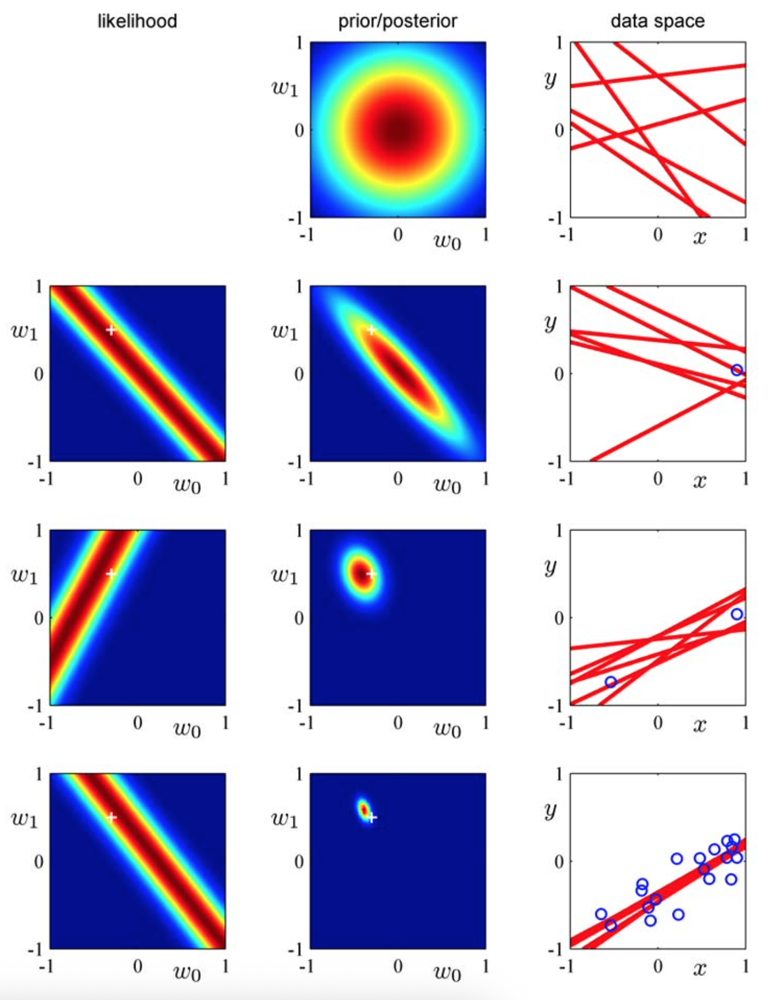
</p>

The first row of this figure corresponds to the situation before any data points are observed and shows a plot of the prior distribution in $\bm w$ space together with six samples of the function $y(\bm x,\bm w)$ in which the values of $\bm w$ are drawn from the prior. In the second row, we see the situation after observing a single data point. The location $(\bm x, t)$ of the data point is shown by a blue circle in the right-hand column. In the left-hand column is a plot of the likelihood function $p(t\mid \bm x, \bm w)$ for this data point as a function of $\bm w$. Note that the likelihood function provides a soft constraint that the line must pass close to the data point, where close is determined by the noise precision $β$. For comparison, the true parameter values $a_0 =−0.3$ and $a_1 = 0.5$ used to generate the dataset are shown by a white cross in the plots in the left column. When we multiply this likelihood function by the prior from the top row, and normalize, we obtain the posterior distribution shown in the middle plot on the second row. Samples of the regression function $y(\bm x,\bm w)$ obtained by drawing samples of $\bm w$ from this posterior distribution are shown in the right-hand plot. Note that these sample lines all pass close to the data point. The third row of this figure shows the effect of observing a second data point, again shown by a blue circle in the plot in the right-hand column. The corresponding likelihood function for this second data point alone is shown in the left plot. When we multiply this likelihood function by the posterior distribution from the second row, we obtain the posterior distribution shown in the middle plot of the third row. Note that this is exactly the same posterior distribution as would be obtained by combining the original prior with the likelihood function for the two data points. This posterior has now been influenced by two data points, and because two points are sufficient to define a line this already gives a relatively compact posterior distribution. Samples from this posterior distribution give rise to the functions shown in red in the third column, and we see that these functions pass close to both of the data points. The fourth row shows the effect of observing a total of 20 data points. The left-hand plot shows the likelihood function for the 20th data point alone, and the middle plot shows the resulting posterior distribution that has now absorbed information from all 20 observations. Note how the posterior is much sharper than in the third row. In the limit of an infinite number of data points, the posterior distribution would become a delta function centred on the true parameter values, shown by the white cross.

### Predictive Distribution

In practice, we are not usually interested in the value of $\bm w$ itself but rather in making predictions of $t$ for new values of $x$. This requires that we evaluate the predictive distribution defined by

$$
p(t|\bm t, α, β) = \int p(t|\bm w, β)p(\bm w|\bm t, α, β) d\bm w
$$

in which $t$ is the vector of target values from the training set, and we have omitted the corresponding input vectors. This equation involves the convolution of two Gaussian distributions, we see that the predictive distribution takes the form

$$
p(t \mid \bm x, \bm t, α, β) = \mathcal N (t \mid \bm m^T_N \bm \phi(\bm x), σ^2_N (\bm x))
$$

where the variance $σ^2_N (\bm x)$ of the predictive distribution is given by

$$
\sigma^2_N(\bm x) = \frac{1}{\beta} + \bm \phi(\bm x)^TS_N\bm \phi(\bm x)
$$

The first term in the above equation represents the noise on the data whereas the second term reflects the uncertainty associated with the parameters $\bm w$. Because the noise process and the distribution of $\bm w$ are independent Gaussians, their variances are additive. Note that, as additional data points are observed, the posterior distribution becomes narrower. As a consequence it can be shown that $\sigma^2_{N+1}(\bm x)\leq \sigma^2_N(\bm x)$. In the limit $N → ∞$, the second term goes to zero, and the variance of the predictive distribution arises solely from the additive noise governed by the parameter $β$. As an illustration of the predictive distribution for Bayesian linear regression models, let us return to the synthetic sinusoidal dataset.

<p align="center">
    
</p>

We fit a model comprising a linear combination of Gaussian basis functions to datasets of various sizes and then look at the corresponding posterior distributions. Here the green curves correspond to the function $\sin(2πx)$ from which the data points were generated (with the addition of Gaussian noise). Datasets of size N = 1, N = 2, N = 4, and N = 25 are shown in the four plots by the blue circles. For each plot, the red curve shows the mean of the corresponding Gaussian predictive distribution, and the red shaded region spans one standard deviation either side of the mean. Note that the predictive uncertainty depends on $x$ and is smallest in the neighbourhood of the data points. Also note that the level of uncertainty decreases as more data points are observed.

## Model Selection: Testing and Validating

The only way to know how well a model will generalize to new cases is to actually try it out on new cases. Split your data into two sets: the training set and the test set. As these names imply, you train your model using the training set, and you test it using the test set. The error rate on new cases is called the generalization error. The problem is that you measured the generalization error multiple times on the test set, and you adapted the model and hyperparameters to produce the best model for that particular set. This means that the model is unlikely to perform as well on new data.

<!-- With regularized least squares, the regularization coefficient $λ$ also controls the effective complexity of the model, whereas for more complex models, such as mixture distributions or neural networks there may be multiple parameters governing complexity.  -->

Furthermore, as well as finding the appropriate values for complexity parameters within a given model, we may wish to consider a range of different types of model in order to find the best one for our particular application. If data is plentiful, then one approach is simply to use some of the available data to train a range of models, or a given model with a range of values for its complexity parameters, and then to compare them on independent data, sometimes called a  **validation set** or sometimes the development set, or dev set. More specifically, you train multiple models with various hyperparameters on the reduced training set (i.e., the full training set minus the validation set), and you select the model that performs best on the validation set. After this holdout validation process, you train the best model on the full training set (including the validation set), and this gives you the final model. Lastly, you evaluate this final model on the test set to get an estimate of the generalization error. If the model design is iterated many times using a limited size dataset, then some over-fitting to the validation data can occur and so it may be necessary to keep aside a third _test set_ on which the performance of the selected model is finally evaluated. Not that if the validation set is too small, then model evaluations will be imprecise. One way to solve this problem is to perform repeated cross-validation, using many small validation sets.

In many applications, however, the supply of data for training and testing will be limited, and in order to build good models, we wish to use as much of the available data as possible for training. However, if the validation set is small, it will give a relatively noisy estimate of predictive performance. One solution to this dilemma is to use **cross-validation**.  This allows a proportion (S−1)/S of the available data to be used for training while making use of all of the data to assess performance. When data is particularly scarce, it may be appropriate to consider the case S = N, where N is the total number of data points, which gives the **leave-one-out** technique. In general, cross-validation works by taking the available data and partitioning it into S groups (in the simplest case these are of equal size). Then S− 1 of the groups are used to train a set of models that are then evaluated on the remaining group. This procedure is then repeated for all S possible choices for the held-out group, indicated here by the red blocks, and the performance scores from the S runs are then averaged.

<p align="center">
    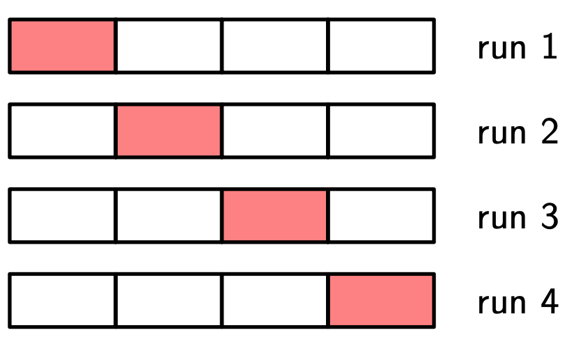
</p>


One major drawback of cross-validation is that the number of training runs that must be performed is increased by a factor of S, and this can prove problematic for models in which the training is *computationally expensive*. A further problem with techniques such as cross-validation that use separate data to assess performance is that we might have multiple complexity parameters for a single model (for instance, there might be several regularization parameters). Exploring combinations of settings for such parameters could, in the worst case, require a number of training runs that is exponential in the number of parameters.

# Linear Models for Classifications

The goal in classification is to take an input vector $x$ and to assign it to one of $K$ discrete classes $C_k$ where $k = 1, . . . , K$. In the most common scenario, the classes are taken to be disjoint, so that each input is assigned to one and only one class. The input space is thereby divided into decision regions whose boundaries are called **decision boundaries** or **decision surfaces**. Here we consider linear models for classification, by which we mean that the decision surfaces are linear functions of the input vector $\bm x$ and hence are defined by (D−1)-dimensional hyperplanes within the D-dimensional input space. Datasets whose classes can be separated exactly by linear decision surfaces are said to be **linearly separable**. For regression problems, the target variable t was simply the vector of real numbers. In the case of classification, there are various ways of using target values to represent class labels. In the case of two-class problems, is the binary representation in which there is a single target variable $t ∈ \{0, 1 \}$ such that $t = 1$ represents class $C_1$ and $t = 0$ represents class $C_2$. Also we can interpret the value of $t$ as the probability that the class is $C_1$, with the values of probability taking only the extreme values of 0 and 1. For $K > 2$ classes, it is convenient to use a **one-hot vector** in which $t$ is a vector of length $K$ such that if the class is $C_j$, then all elements $t_k$ of $t$ are zero except element $t_j$, which takes the value 1. For instance, if we have $K = 5$ classes, then a pattern from class 2 would be given the target vector $t = (0, 1, 0, 0, 0)^T$.

In general, there are two approaches to classification: 

- **Discriminative**: directly learn to predict $t$ as a function of $x$.
    - Sometimes this means modeling $p(t \mid x)$ (e.g. logistic regression).
    - Sometimes this means learning a decision rule without a probabilistic interpretation (e.g. KNN, SVM).
- **Generative**: model the data distribution for each class separately, and make predictions using posterior inference.
    - Fit models of $p(t)$ and $p(x \mid t)$.
    - Infer the posterior $p(t \mid x)$ using Bayes’ Rule.

## Discriminant Functions

The simplest representation of a linear discriminant function is obtained by taking a linear function of the input vector so that $y(\bm x) = \bm w^T\bm x + w_0$ where $\bm w$ is called a _weight vector_, and $w_0$ is a _bias_ (not in the statistical sense). The negative of the bias is sometimes called a _threshold_. An input vector $\bm x$ is assigned to class $C_1$ if $y(\bm x) \geq 0$ and to class $C_2$ otherwise. The corresponding decision boundary is therefore defined by the relation $y(\bm x) = 0$. It is more convenient to expres it as $y(\bm x) = \tilde {\bm w}^T\tilde {\bm  x}$ when $\tilde {\bm w} = (w_0, \bm w)$ and $\tilde x = (1, \bm x)$.

### Multiclass Classification

Some algorithms (such as Random Forest classifiers or Naive Bayes classifiers) are capable of handling multiple classes directly. Others (such as Support Vector Machine classifiers or Linear classifiers in general) are strictly binary classifiers. However, there are various strategies that you can use to perform multiclass classification using multiple binary classifiers. After training $K$ binary classifiers for $K$ classes, then when you want to classify a test example, you get the **decision score** from each classifier for that example and you select the class whose classifier outputs the highest score. This is called the **one-versus-all (OvA)** strategy (also called **one-versus-the-rest**). Another strategy is to train a binary classifier for every pair of classes, $K(K-1)/2$ classifiers. This is called the **one-versus-one (OvO)** strategy. Some algorithms (such as Support Vector Machine classifiers) scale poorly with the size of the training set, so for these algorithms OvO is preferred since it is faster to train many classifiers on small training sets than training few classifiers on large training sets. For most binary classification algorithms, however, OvA is preferred.

Now consider the extension of linear discriminants to $K > 2$ classes. We might be tempted be to build a $K$-class discriminant by combining a number of two-class discriminant functions. However, this leads to some serious difficulties.  Consider K(K− 1)/2 binary discriminant functions, one for every possible pair of classes (OVO). Each point is then classified according to a majority vote amongst the discriminant functions. However, this too runs into the problem of ambiguous regions, as illustrated in the right-hand follwing diagram.

<p align="center">
    
</p>

Alternaively, consider the use of K−1 classifiers each of which solves a two-class problem of separating points in a particular class $C_k$ from points not in that class (one-versus-the-rest). We can avoid these difficulties by considering a single K-class discriminant comprising K linear functions of the form 

$$
y_k(\bm x) = \bm w^T_k \bm x + w_{k0}
$$

and then assigning a point $\bm x$ to class $C_k$ if $y_k(\bm x) > y_j(\bm x)$ for all $j \neq k$. The decision boundary between class $C_k$ and class $C_j$ is therefore given by $y_k(\bm x) = y_j(\bm x)$ and hence corresponds to a (D−1)-dimensional hyperplane defined by

$$
(\bm w_k− \bm w_j)^T \bm x + (w_{k0}− w_{j0}) = 0,
$$

which has the same form as the decision boundary for the two-class. For two lines as the discriminants, an angle bisector of them becomes the decision boundry. The decision regions of such a discriminant are always **simply connected** and **convex**. To see this, consider two points $x_A$ and $x_B$ both of which lie inside decision region $\mathcal R_k$.  Any point $\hat x$ that lies on the line connecting $x_A$ and $x_B$ can be expressed in the form $\hat x = λx_A + (1− λ)x_B, 0 \leq \lambda \leq 1$. So $y_k(\hat x) = λy_k(x_A) + (1− λ)y_k(x_B)$. So  $y_k(\hat {\bm x}) > y_j(\hat {\bm x})$ for all $j\neq k$ . 

<p align="center">
    
</p>

Scikit-Learn detects when you try to use a binary classification algorithm for a multiclass classification task, and it automatically runs OvA (except for SVM classifiers for which it uses OvO). If you want to force ScikitLearn to use one-versus-one or one-versus-all, you can use the `OneVsOneClassifier` or `OneVsRestClassifier` classes.

Multilabel classification is a classification system that outputs multiple binary tags. One approach evaluate multilabel classifiers is to measure the $F_1$ score for each individual label (or any other binary classifier metric discussed earlier), then simply compute the average score. This code computes the average $F_1$ score across all labels. 

```python
f1_score(y_multilabel, y_train_knn_pred, average="macro")
```

This assumes that all labels are equally important, which may not be the case. One simple option is to give each label a weight equal to its support (i.e., the number of instances with that target label). To do this, simply set `average="weighted"` in the preceding code.

### Performance Measures for Classification
Evaluating a classifier is often significantly trickier than evaluating a regressor. 
- **Accuracy**: Generally not the preferred performance measure for classifiers, especially when you are dealing with imbalanced dataset.
- **Confusion Matrix**:  Counts the number of times instances of class A are classified as class B. Each row in a confusion matrix represents an actual class, while each column represents a predicted class. The confusion matrix  for a perfect classifier would have nonzero values only on its main diagonal! Confusion matrix is descriptive and does not provide a metric by its own. Analyzing the confusion matrix can often give you insights on ways to improve your classifier by analyzing the types of errors your model makes. (Diagnosis Tool)
   
    ```python
    conf_mx = confusion_matrix(y_train, y_train_pred)
    ```
- **Precision**: $\frac{TP}{TP + FP}$. A trivial way to have 100% precision is to make one single positive prediction and ensure it is correct. So precision is typically used along with recall.
- **Recall**: _sensitivity_ or _true positive rate_, $\frac{TP}{TP + FN}$.  A trivial way to have 100% recall is to predict everything positive. 
- **$F_1$ score**: The $F_1$ score is the harmonic mean of precision and recall. Whereas the regular mean, treats all values equally, the harmonic mean gives much more weight to low values. The F1 score favors classifiers that have similar high precision and recall which is not always what you want: in some contexts you mostly care about precision, and in other contexts you really care about recall. For example: cancer detection classifier (high recall - we do not want to have any FN while we do not mind some FP) or detecting safe videos for kids (high precision - we do not want FP while we do not mind FN).

Unfortunately, you can’t have it both ways: *increasing precision reduces recall, and vice versa*. This is called the **precision/recall tradeoff**. *Classifiers makes decisions based on a score computed by a decision function, and if that score is greater than a threshold, it assigns the instance to the positive class, or else it assigns it to the negative class*. Lowering the threshold increases true positive rates (Recall) and increasing the threshold, increases the precision (reducing FP).


<p align="center">
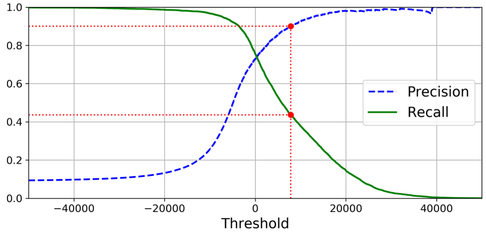
</p>

1. **PR Curve**: A way to select a good precision/recall tradeoff is to plot _precision directly against recall_. 

2. **The ROC Curve**: Very similar to the precision/recall curve, but instead of plotting precision versus recall, the ROC curve plots _the true positive rate (recall) against the false positive rate_.

<p align="center">
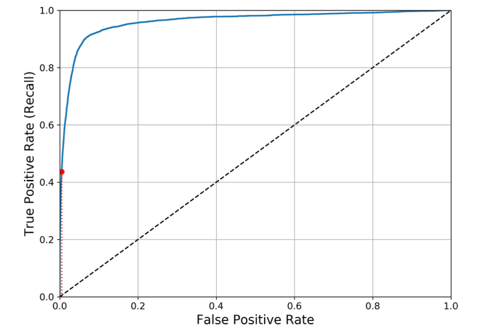
</p>

The dotted line represents the ROC curve of a purely random classifier; a good classifier stays as far away from that line as possible (toward the top-left corner). One way to compare classifiers is to measure the **area under the curve (AUC)**. A perfect classifier will have a ROC AUC equal to 1, whereas a purely random classifier will have a ROC AUC equal to 0.5. As a rule of thumb, you should prefer the PR curve whenever the positive class is rare or when you care more about the false positives than the false negatives, and the ROC curve otherwise. You can think about ROC as more of recall-based metric vs PR as more felxibale towards precision-based metric.


### Least Squares for Classification

Consider a general classification problem with $K$ classes, with a one-hot vector for the target vector $\bm t$ . One justification for using least squares in such a context is that it approximates the conditional expectation $\mathbb E[\bm t \mid \bm x]$ of the target values given the input vector. Each class $C_k$ is described by its own linear model so that

$$
y_k(\bm x) = \bm w^T_k \bm x +w_{k0}
$$

where $k = 1, . . . , K$. We can conveniently group these together using vector notation so that

$$
y(\bm x) = \tilde {\bm W}^T\bm {\tilde x}
$$

where $\tilde {\bm W}$ is a matrix whose $k$-th column comprises the (D+1)-dimensional vector $\bm {\tilde w_k}$ and $\bm {\tilde x}$ is the corresponding augmented input vector $(1,\bm x)^T$ with a dummy input $x_0 = 1$. We now determine the parameter matrix $\tilde {\bm W}$ by minimizing a sum-of-squares error function, as we did for regression. Consider a training dataset $\{x_n, t_n \}$ where $n = 1, . . . , N$, and define a matrix $\bm T$ whose $n$-th row is the vector $\bm t_n^T$ together with a matrix X whose $n$th row. The sum-of-squares error function can then be written as

$$
E_D(\tilde {\bm W}) = \frac{1}{2} Tr \{ (\tilde {\bm X}\tilde {\bm W}− \bm T)^T(\tilde {\bm X}\tilde {\bm W}− \bm T) \}.
$$

Setting the derivative with respect to $\tilde {\bm W}$ to zero, and rearranging, we then obtain the solution for $\tilde {\bm W}$ in the form

$$
\tilde {\bm W}_{LE} = (\tilde {\bm X}^T\tilde {\bm X})^{-1}\tilde {\bm X}^T\bm T
$$

We then obtain the discriminant function in the form

$$
y(\bm x) = \tilde {\bm W}^T_{LE}\tilde {\bm x} = {\bm T}^T \tilde {\bm X}({\bm X}^T\tilde {\bm X})^{-1} \tilde {\bm x}
$$

An interesting property of least-squares solutions with multiple target variables is that if every target vector in the training set satisfies some linear constraint  $\bm a^T\bm t_n + b = 0$,  for some constants $a$ and $b$, then the model prediction for any value of $\bm x$ will satisfy the same constraint so that $\bm a^Ty(\bm x) + b = 0$. Thus if we use one-hot vector for K classes, then the predictions made by the model will have the property that the elements of $y(\bm x)$ will sum to 1 for any value of $\bm x$. 

The least-squares approach gives an exact closed-form solution for the discriminant function parameters. However, even as a discriminant function (where we use it to make decisions directly and dispense with any probabilistic interpretation) it suffers from some severe problems. We have already seen that least-squares solutions lack robustness to outliers, and this applies equally to the classification application. The following figure shows  that the additional data points far from the cluster produce a significant change in the location of the decision boundary, even though these points would be correctly classified by the original decision boundary. *The sum-of-squares error function penalizes predictions that are ‘too correct’ in that they lie a long way on the correct side of the decision*. 

<p align="center">
    
</p>


However, problems with least squares can be more severe than simply lack of robustness. This shows a synthetic dataset drawn from three classes in a two-dimensional input space $(x_1, x_2)$, having the property that linear decision boundaries can give excellent separation between the classes. The follwoing figure shows the decision boundary found by least squares (magenta curve) and also by the logistic regression model (green curve). Indeed, the technique of logistic regression, described later, gives a satisfactory solution as seen in the right-hand plot. However, the least-squares solution gives poor results when extra data points are added at the bottom left of the diagram, showing that least squares is highly sensitive to outliers, unlike logistic regression.

<p align="center">
    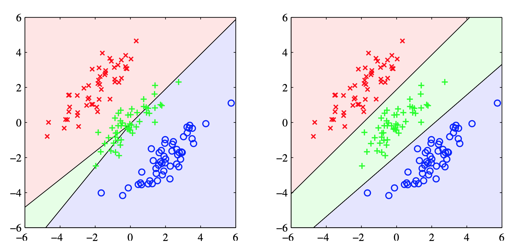
</p>

The failure of least squares should not surprise us when we recall that it corresponds to maximum likelihood under the assumption of a Gaussian conditional distribution, whereas binary or one-hot target vectors clearly have a distribution that is far from Gaussian. By adopting more appropriate probabilistic models, we shall obtain classification techniques with much better properties than least squares. From historical point of view, there is another linear discriminant model called  **perceptron algorithm**. See p.192 in [Pattern Recognition and Machine Learning](https://www.microsoft.com/en-us/research/wp-content/uploads/2006/01/Bishop-Pattern-Recognition-and-Machine-Learning-2006.pdf) for more. 

## Probabilistic Generative Models

Here we shall adopt a generative approach in which we model the **class-conditional densities** $p(\bm x\mid C_k)$, as well as the class priors $p(C_k)$, and then use these to compute posterior probabilities $p(C_k \mid \bm x)$ through Bayes’ theorem. 

First consider the case of two classes. The posterior probability for class $C_1$ can be written as

$$
\begin{align*}
p(C_1\mid x) & = \frac{p(\bm x\mid C_1) p(C_1)}{p(\bm x\mid C_1) p(C_1) + p(\bm x\mid C_2) p(C_2)} \\
& = \frac{1}{1+ e^{-a}} = \sigma(a)
\end{align*}
$$

where $σ(a)$ is the **logistic sigmoid**  function (the term ‘sigmoid’ means S-shaped) and 

$$
\begin{align*}
a & = \ln \frac{p(\bm x\mid C_1) p(C_1)}{p(\bm x \mid C_2) p(C_2)}\\
& = \ln \frac{p(C_1\mid \bm x)}{p(C_2 \mid \bm x)}
\end{align*}
$$

represents the log of the ratio of probabilities for the two classes, also known as the **log odds**.  We shall shortly consider situations in which $a(\bm x)$ is a linear function of $\bm x$, in which case the posterior probability is governed by a generalized linear model. For the case of $K > 2$ classes, we have

$$
\begin{align*}
p(C_k \mid \bm x) & =  \frac{p(\bm x\mid C_k) p(C_k)}{\sum_j p(\bm x \mid C_j) p(C_j)}\\
& =  \frac{e^{a_k}}{\sum_j e^{a_j}}
\end{align*}
$$

which is known as the normalized exponential and can be regarded as a multiclass generalization of the logistic sigmoid called the **softmax function** as it represents a smoothed version of the ‘max’ function because, if $a_k ≫ a_j$ for all $j \neq k$, then $p(C_k\mid \bm x) \approx 1$, and $p(C_j \mid \bm x) \approx 0$. Here the quantities $a_k$ are defined by 

$$a_k = \ln p(\bm x \mid C_k)p(C_k)$$ 

which are the unnormalized log probabilities called **logits**. To extract posterior probabilites from logits, we find their exponential followed by normalizationg which is what softmax does. We now investigate the consequences of choosing specific forms for the class-conditional densities, looking first at continuous input variables $\bm x$ and then discussing briefly the case of discrete inputs.

### Continuous Inputs

Let us assume that the class-conditional densities are Gaussian and then explore the resulting form for the posterior probabilities. To start with, we shall _assume that all classes share the same covariance matrix_. Thus the density for class $C_k$ is given by

$$
p(\bm x \mid C_k) = \frac{1}{(2π)^{D/2}} \frac{1}{|\Sigma|^{1/2}}\; e^{ -\frac{1}{2}(\bm x− \bm µ_k)^T \bm Σ^{−1}(\bm x− \bm µ_k)}
$$

Consider first the case of two classes: 

$$
p(C_1 \mid \bm x) = \sigma(\bm w^T \bm x + w_0)
$$

or equivalently, 

$$
\ln \frac{ p(C_1\mid \bm x)}{p(C_2\mid \bm x)} = \ln \frac{p(\bm x\mid C_1) p(C_1)}{p(\bm x \mid C_2) p(C_2)} = \bm w^T \bm x + w_0
$$

Due to the assumption of common covariance matrices, this last equation implies:

$$
\begin{align*}
\bm w & = \Sigma^{-1} (\bm \mu_1 - \bm \mu_2) \\
w_0 & =  -\frac{1}{2} \bm \mu_1^T \Sigma^{-1} \bm \mu_1 + \frac{1}{2} \bm \mu_2^T \Sigma^{-1} \bm \mu_2 + \ln \frac{p(C_1)}{p(C_2)}
\end{align*}
$$

This result is illustrated for the case of a two-dimensional input space $x$ in the following figure. The left-hand plot shows the class-conditional densities for two classes, denoted red and blue. On the right is the corresponding posterior probability $p(C_1\mid \bm x)$, which is given by a logistic sigmoid of a linear function of $\bm x$. The surface in the right-hand plot is coloured using a proportion of red ink given by $p(C_1 \mid \bm x)$ and a proportion of blue ink given by $p(C_2\mid \bm x) = 1 − p(C_1 \mid \bm x)$.

<p align="center">
    
</p>

The decision boundaries correspond to surfaces along which the posterior probabilities $p(C_k \mid \bm x)$ are constant and so will be given by linear functions of $\bm x$, and therefore the decision boundaries are _linear_ in input space. In the case of 2 classes, the decision boundry is $\bm w^T \bm x + w_0 = 0$. The prior probabilities $p(C_k)$ enter only through the bias parameter $w_0$ so that changes in the priors have the effect of making parallel shifts of the decision boundary and more generally of the parallel contours of constant posterior probability. For the general case of K classes we have:
$$
a_k(\bm x) = \bm w^T_k \bm x + w_{k0} = \ln p(\bm x \mid C_k)p(C_k)
$$

where:

$$
\begin{align*}
\bm w_k & = \Sigma^{-1} \bm \mu_k,  \\
w_0 & =  -\frac{1}{2} \bm \mu_k^T \Sigma^{-1} \bm \mu_k  + \ln p(C_k).
\end{align*}
$$

The resulting decision boundaries, corresponding to the minimum misclassification rate, will occur when two of the posterior probabilities (the two largest) are equal $a_k(\bm x) = a_j(\bm x) $, and so will be defined by linear functions of $\bm x$, and so again we have a generalized linear model called **linear discriminant (LDA)**. The $K$ centroids in $p$-dimensional input space lie in an affine subspace of dimension ≤ K−1, and if $p$ is much larger than $K$, this will be a considerable drop in dimension if we projects input space into this subspace. Moreover, in locating the closest centroid for a given $\bm x$, we can ignore orthogonal distance to this subspace, since they will contribute equally to each class. Thus we might just as well project the $\bm x$ onto this centroid-spanning subspace $H_{K−1}$, and make distance comparisons there. Thus there is a fundamental dimension reduction in LDA, namely, that we need only consider the data in a subspace of dimension at most $K−1$. If $K = 3$, for instance, this could allow us to view the data in a two-dimensional plot, color-coding the classes. 

If we relax the assumption of a shared covariance matrix and allow each class-conditional density $p(\bm x \mid C_k)$ to have its own covariance matrix $Σ_k$, then the earlier cancellations will no longer occur, and we will obtain quadratic functions of $\bm x$, giving rise to a **quadratic discriminant**. If we make the futher assumption of independence of features conditioned on classes, we get **Naive Bayes**:

$$
p(\bm x \mid C_k) = \prod_{j=1}^D p(x_j \mid C_k)
$$

The probabilities $p(x_j \mid C_k)$ could be modeled as 
- Guassians (diagonal covariance matrix) for continous features:
    $$p(x_j \mid C_k) = \mathcal N(x_j \mid \mu_{jk}, \sigma_{jk}^2)$$

- Bernouli for binary features (e.g., word present/not):
    $$p(x_j \mid C_k) = \theta_{jk}^{x_j}(1-\theta_{jk})^{1-x_j}$$

- Multinomial for count features (e.g., word frequencies in text classification)
    $$p(x_j \mid C_k) = \prod_j \frac{\theta_{jk}^{x_j}}{x_j!}$$

Maximum likelighod estimation of Naive Bayes parameters can be easily computed from empirical data:

$$
\log p(C_k \mid x) = \log p(C_k) + \sum_j \log p(x_j \mid C_k)
$$

From training data, estimate: 
- $p(C_k)$ class prior which is the frequency of class $C_k$
-  $p(x_j\mid C_k)$ conditional feature likelihood 

If a feature never appears in training for a class: use Laplace smoothing. We predict the category by performing inference in the model using Bayes’ Rule:

$$
\begin{align*}
p(C_k\mid \bm x)  & = \frac{p(\bm x\mid C_k)p(C_k)}{\sum_k p(\bm x\mid C_k)p(C_k)}\\
& = \frac{p(C_k) \prod_j p(x_j\mid C_k)}{\sum_k p(C_k)\prod_j p(x_j\mid C_k)}
\end{align*}
$$

We need not compute the denominator if we’re simply trying to determine the mostly likely class. Naive Bayes works surprisingly well but *can perform poorly when features are correlated*. It scales to very high-dimensional data and decision boundaries are linear in log-space. It is used for Text Classification (spam detection, sentiment) or as a quick baseline model for many tasks.

### Maximum Likelihood Solution for LDA

Once we have specified a parametric functional form for the class-conditional densities $p(\bm x \mid C_k)$, we can then determine the values of the parameters, together with the prior class probabilities $p(C_k)$, using maximum likelihood. This requires a dataset comprising observations of $\bm x$ along with their corresponding class labels.

Consider first the case of two classes, each having a Gaussian class-conditional density with a shared covariance matrix, and suppose we have a dataset $\{x_n, t_n \}$ where $n = 1, . . . , N$. Here $t_n = 1$ denotes class $C_1$ and $t_n = 0$ denotes class $C_2$. We denote the prior class probability $p(C_1) = π$, so that $p(C_2) = 1− π$. For example, for a data point $x_n$ from class $C_1$, we have:

$$
p(\bm x_n, C_1) = p(C_1)p(\bm x_n \mid C_1) = \pi \mathcal N(\bm x_n \mid \mu_1, \Sigma)
$$

Thus the likelihood function is given by:

$$
p(t \mid π, \mu_1, \mu_2, \Sigma) =  \prod_{n=1}^N [π \mathcal N (\bm x_n \mid \bm \mu_1, Σ)]^{t_n} [(1− π)\mathcal N (\bm x_n \mid \bm \mu_2, Σ)]^{1−t_n}
$$

where $\bm t = (t_1, \dots, t_N)^T$. Setting the derivative with respect to $π$ equal to zero and rearranging, we obtain:

$$
π = \frac{1}{N}\sum_{n=1}^N t_n = \frac{N_1}{N} = \frac{N_1}{N_1+N_2}
$$

Thus the maximum likelihood estimate for $π$ is simply the fraction of points in class $C_1$ as expected. This result is easily generalized to the multiclass case where again the maximum likelihood estimate of the prior probability associated. Setting the derivative with respect to $\mu_1$ to zero and rearranging, we obtain

$$
\mu_1 = \frac{1}{N_1}\sum_{n=1}^N t_n \bm x_n
$$

which is simply the mean of all the input vectors xn assigned to class $C_1$. It is similar for $\mu_2$. The maximum likelihood solution for the shared covariance matrix $\bm \Sigma$ is 

$$
\begin{align*}
\bm \Sigma & = \frac{N_1}{N}\bm S_1 + \frac{N_2}{N}\bm S_2,  \\
\bm S_1 &=  \frac{1}{N_1} \sum_{n\in C_1} (\bm x_n - \bm \mu_1)(\bm x_n - \bm \mu_1)^T,\\
\bm S_2 &=  \frac{1}{N_2} \sum_{n\in C_2} (\bm x_n - \bm \mu_2)(\bm x_n - \bm \mu_2)^T,
\end{align*}
$$

which represents a weighted average of the covariance matrices associated with each of the two classes separately. This result is easily extended to the $K$ class problem to obtain the corresponding maximum likelihood solutions for the parameters in which each class-conditional density is Gaussian with a shared covariance matrix. **Note that the approach of fitting Gaussian distributions to the classes is not robust to outliers, because the maximum likelihood estimation of a Gaussian is not robust as it was equivalent to minimizing least squares errors**.

### Regularized Discriminant Analysis (RDA)
Friedman (1989) proposed a compromise between LDA and QDA, which allows one to shrink the separate covariances of QDA toward a common covariance as in LDA. These methods are very similar in flavor to ridge regression. The regularized covariance matrices have the form
$$
\hat \Sigma_k^{(\text{RDA})}  = \alpha \hat \Sigma_k+ (1-\alpha) \hat \Sigma  + \gamma \bm I
$$

where $\hat \Sigma$ is the pooled covariance matrix as used in LDA and $\hat \Sigma_k$ are the class specific covariance matrix defined above like $S_1$. Here $α ∈[0,1]$ allows a continuum of models between LDA and QDA, and needs to be specified. Hyperparameter $γ ≥ 0$ adds a scaled identity matrix (ridge regularization) to stabilize covariance estimates and helps especially when the number of features is large compared to samples. In practice $α, \gamma$ can be chosen based on the performance of the model on validation data, or by cross-validation.


### Discrete Features
Let us now consider the case of discrete feature values $x_i$. For simplicity, we begin by looking at binary feature values $x_i \in \{0, 1 \}$ and discuss the extension to more general discrete features shortly. If there are D features, then a general distribution would correspond to a table of $2^D$ numbers for each class, containing $2^D− 1$ independent variables (due to the summation constraint). Because this grows exponentially with the number of features, we might seek a more restricted representation. Here we will make the Naive Bayes assumption in which _the feature values are treated as independent, conditioned on the class $C_k$_. Thus we have class-conditional distributions of the form

$$
p(\bm x \mid C_k) = \prod_{i=1}^D \mu^{x_i}_{ki} (1- \mu^{x_i}_{ki})^{1-x_i}
$$

which contain D independent parameters for each class. This implies that:

$$
a_k(\bm x) = \ln p(C_k) + \sum_{i=1}^D (x_i\ln \mu_{ki} + (1-x_i) \ln(1-\mu_{ki})) 
$$

which again are linear functions of the input features $x_i$. Analogous results are obtained for discrete variables each of which can take M > 2 states. For both Gaussian distributed and discrete inputs, the posterior class probabilities are given by generalized linear models with logistic sigmoid (K=2 classes) or softmax (K 2 classes) activation functions. These are particular cases of a more general result obtained by assuming that the class-conditional densities $p(\bm x|C_k)$ are members of the exponential family of distributions. Many techniques are based on models for the class densities:
- linear and quadratic discriminant analysis use Gaussian densities;
- more flexible mixtures of Gaussians allow for nonlinear decision boundaries
- general nonparametric density estimates for each class density allow the most flexibility 
- Naive Bayes models are a variant of the previous case, and assume that each of the class densities are products of marginal densities; that is, they assume that the features are conditionally independent in each class

## Probabilistic Discriminative Models

For the two-class classification problem, we have seen that the posterior probability of class $C_1$ can be written as a logistic sigmoid acting on a linear function of $x$, for a wide choice of class-conditional distributions $p(\bm x \mid C_k)$. Similarly, for the multiclass case, the posterior probability of class $C_k$ is given by a softmax transformation of a linear function of $\bm x$. For specific choices of the class-conditional densities $p(\bm x\mid C_k)$, we have used maximum likelihood to determine the parameters of the densities as well as the class priors $p(C_k)$ and then used Bayes’ theorem to find the posterior class probabilities.

However, an alternative approach is to use the functional form of the generalized linear model explicitly and to determine its parameters directly by using maximum likelihood. The indirect approach to finding the parameters of a generalized linear model, by fitting class-conditional densities and class priors separately and then applying Bayes’ theorem, represents an example of **generative modeling**, because we could take such a model and generate synthetic data by drawing values of $\bm x$ from the marginal distribution $p(\bm x)$. In the direct approach, we are maximizing a likelihood function defined through the conditional distribution $p(C_k \mid \bm x)$, which represents a form of **discriminative training**. One advantage of the discriminative approach is that there will typically be fewer adaptive parameters to be determined.

### Logistic Regression

The posterior probability of class $C_1$ can be written as a logistic sigmoid acting on a linear function of the feature vector $\phi$ so that

$$
p(C_1 \mid \phi(\bm x)) = y(\phi(\bm x)) = \sigma(\bm w^T \phi(\bm x))
$$

For an M-dimensional feature space $\phi$, this model has M adjustable parameters. By contrast, if we had fitted Gaussian class conditional densities using maximum likelihood, we would have used 2M parameters for the means and $M(M + 1)/2$ parameters for the (shared) covariance matrix. For a dataset $\{\phi_n, t_n\}$, where $t_n ∈ \{0, 1\}$ and $\phi_n= \phi(x_n)$ with $n=1, . . . , N$, the likelihood function can be written:

$$
p(\bm t \mid \bm w) = \prod_{n=1}^N  y_n^{t_n} (1-y_n )^{1-t_n}
$$

where $\bm t = (t_1, . . . , t_N )^T$ and $y_n = p(C_1 \mid φ_n) = \sigma(\bm w^T \phi_n)$. As usual, we can define an error function by taking the negative logarithm of the likelihood, which gives the **cross-entropy** error function in the form

$$
E(\bm w) =− \ln p(\bm t\mid \bm w) =− \sum_{n=1}^N (t_n \ln y_n + (1− t_n) \ln(1− y_n) )
$$

Taking the gradient of the error function with respect to $\bm w$, we obtain

$$
∇_wE(\bm w) = \sum_{n=1}^N (y_n− t_n)\phi_n
$$

It is worth noting that maximum likelihood can exhibit severe overfitting for datasets that are linearly separable. This arises because the maximum likelihood solution occurs when the hyperplane corresponding to $σ = 0.5$, equivalent to $\bm w^T \phi=0$, separates the two classes and the magnitude of $\bm w$ goes to infinity to maximize the likelihood. In this case, the logistic sigmoid function becomes infinitely steep in feature space, corresponding to a Heaviside step function, so that every training point from each class $k$ is assigned a posterior probability $p(C_k|\bm x) = 1$ which is unstable and overfitting effect (not good generalizable). Note that the problem will arise even if the number of data points is large compared with the number of parameters in the model, so long as the training data set is linearly separable. The singularity can be avoided by inclusion of a prior and finding a MAP solution for $\bm w$, or equivalently by adding a regularization term to the error function. In general, MLE will try to maximize the likelihood at all costs, even if:
- It memorizes training data patterns
- It leads to large weight magnitudes (sharp decision boundary)
- Generalization to unseen data suffers

In logistic regression, MLE can overfit because it has no mechanism to limit model complexity. In high dimensions or noisy data, it may assign extreme weights to maximize likelihood, leading to poor generalization. Regularization (e.g., L2) helps prevent this by penalizing large weights.

| Question              | Naive Bayes           | Logistic Regression    |
| --------------------- | --------------------- | ---------------------- |
| Probabilistic?        | ✅ Yes                 | ✅ Yes                  |
| Linear?               | ✅ Yes (in log-space)  | ✅ Yes                  |
| Learns from data?     | Estimates from counts | Learns optimal weights |
| Assumes independence? | ❗Yes                  | ❌ No                   |
| Fast to train?        | ✅ Extremely           | ❌ Slower               |

- Naive Bayes for speed, text, or high-dimensional sparse features
- Logistic Regression for interpretability, correlated features, and regularization

# Combining Models

Model combination is to select one of the models to make the prediction depending on the input variables. Thus different models become responsible for making predictions in different regions of input space. One widely used framework of this kind is known as a **decision tree** in which the selection process can be described as a sequence of binary selections corresponding to the traversal of a tree structure. In this case, the individual models are generally chosen to be very simple, and the overall flexibility of the model arises from the input-dependent selection process. Decision trees can be applied to both classification and regression problems. One limitation of decision trees is that the division of input space is based on hard splits in which only one model is responsible for making predictions for any given value of the input variables. The decision process can be softened by moving to a probabilistic framework for combining models like **Gaussian Mixture Models**. Such models can be viewed as mixture distributions in which the component densities, as well as the mixing coefficients, are conditioned on the input variables and are known as **mixtures of experts**.

An **ensemble** of models is a set of models whose individual decisions are combined in some way to to create a new model. For this to be nontrivial, the models must differ somehow, e.g.
- different algorithms
- different choice of hyperparameters of the same model
- trained on different samples of data
- trained with different weighting of the training examples

In fact, ensemble methods work best when the submodels are *as independent from one another as possible*. One way to get diverse models is to train them using very different algorithms. This increases the chance that they will make very different types of errors, improving the ensemble’s accuracy. 

##  Tree-Based Methods

Tree-based methods partition the feature space into a set of rectangles whose edges are aligned with the axes, and then assigning a simple model (for example, a constant) to each region. This process repeats recursively until the desired performance is reached. A well-known tree algorithm is the **Decision Tree**. Decision Trees make very few assumptions about the training data (as opposed to linear models, which obviously assume that the data is linear, for example). They can be viewed as a model combination method in which only one model is responsible for making predictions at any given point in input space. The process of selecting a specific model, given a new input $\bm x$, can be described by a sequential decision making process corresponding to the traversal of a _binary tree_ (one that splits into two branches at each node). At internal nodes, _spliting variable_ and _its threshold_ is calculated, branching is determined by threshold value and leaf nodes are outputs (predictions). Each path from root to a leaf defines a region $R_m$ of input space. The following figure illustration of a recursive binary partitioning of the input space, along with the corresponding tree structure.

<p align="center">
    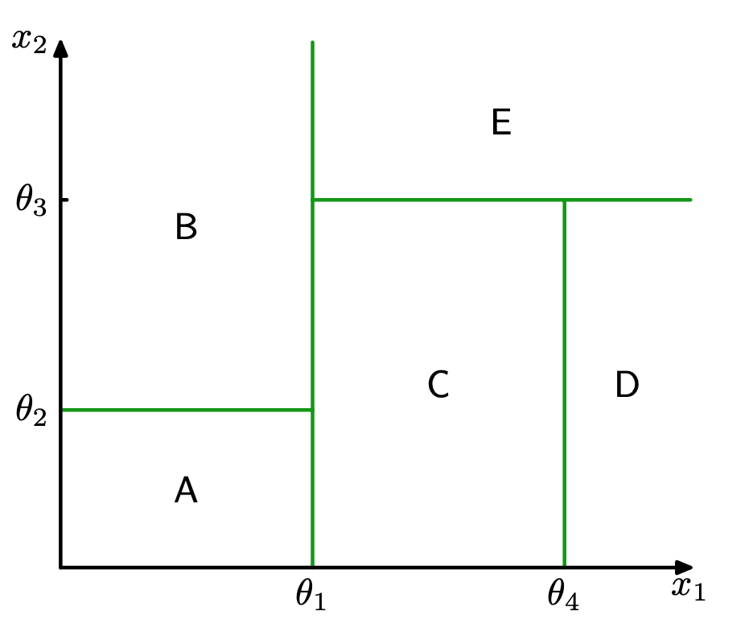
</p>

The first step divides the whole of the input space into two regions according to whether $x_1 \leq θ_1$ or $x_1 > θ_1$ where $θ_1$ is a parameter of the model. This creates two subregions, each of which can then be subdivided independently. For instance, the region $x_1 \leq θ_1$  is further subdivided according to whether $x_2 \leq θ_2$  or $x_2 > θ_2$, giving rise to the regions denoted $A$ and $B$. The recursive subdivision can be described by the traversal of the binary tree shown below:

<p align="center">
    
</p>

For any new input $\bm x$, we determine which region it falls into by starting at the top of the tree at the root node and following a path down to a specific leaf node according to the decision criteria at each node. If left unconstrained, the tree structure will adapt itself to the training data, fitting it very closely, and most likely overfitting it. Such a model is often called a **nonparametric model**, not because it does not have any parameters (it often has a lot) but because the number of parameters is not determined prior to training, so the model structure is free to stick closely to the data.  To avoid overfitting the training data, you need to restrict the Decision Tree’s freedom during training. As you know by now, this is called regularization. Reducing `max_depth` will regularize the model and thus reduce the risk of overfitting. Other parameters include `min_samples_split` (the minimum number of samples a node must have before it can be split), `min_samples_leaf` (the minimum number of samples a leaf node must have), min_weight_fraction_leaf (same as `min_samples_leaf` but expressed as a fraction of the total number of weighted instances), `max_leaf_nodes` (maximum number of leaf nodes), and `max_features` (maximum number of features that are evaluated for splitting at each node). Increasing `min_*`  hyperparameters or reducing `max_*` hyperparameters will regularize the model.


Decision tree follows a **greedy algorithm**: it greedily searches for an optimum split at the top level, then repeats the process at each level. It does not check whether or not the split will lead to the lowest possible impurity several levels down. A greedy algorithm often produces a reasonably good solution, but it is not guaranteed to be the global optimal solution. Unfortunately, finding the optimal tree is known to be an **NP-Complete** problem: it requires $\mathcal O(\exp(m))$ time, making the problem intractable even for fairly small training sets. This is why we must settle for a “reasonably good” solution. 

> Note: P is the set of problems that can be solved in polynomial time. NP is the set of problems whose solutions can be verified in polynomial time. An NP-Hard problem is a problem to which any NP problem can be reduced in polynomial time. An NP-Complete problem is both NP and NP-Hard. A major open mathematical question is whether or not P = NP. If P ≠ NP (which seems likely), then no polynomial algorithm will ever be found for any NP-Complete problem (except perhaps on a quantum computer).

<br>

A Decision Tree can also estimate the probability that an instance belongs to a particular class $k$: first it traverses the tree to find the leaf node for this instance, and then it returns the ratio of training instances of class $k$ in this node. Decision trees are not probabilistic graphical models.

### Regression Trees

Suppose our data consists of p inputs and a response, for each of $N$ observations: that is, $(x_i,y_i)$ for $i = 1,2,...,N$, with $x_i = (x_{i1},x_{i2},\dots,x_{ip})$. The algorithm needs to automatically decide on the splitting variables and split points, and also what topology (shape) the tree should have. Learning the simplest (smallest) decision tree is an NP complete problem. We proceed with a greedy algorithm. Starting with all of the data, consider a splitting variable $j$ and split point $s$, and define the pair of half-planes $R_1(j,s) = \{ X \mid X_j ≤s \}$ and $R_2(j,s) = \{ X \mid X_j >s \}$. Then we seek the splitting variable $j$ and split point $s$ that solve 

$$
\min_{j, s} \Big(
\min_{c_1} \sum_{x_i ∈R_1(j,s)} (y_i−c_1)^2 + \min_{c_2} \sum_{x_i ∈R_2(j,s)} (y_i−c_2)^2 \Big)
$$

if we adopt the sum of squares as a measure for distance. For any choice $j$ and $s$, the inner minimization is solved by
$$
\hat c_1 = \text{ave}(y_i \mid x_i ∈ R_1(j,s)),\\
\hat c_2 = \text{ave}(y_i\mid x_i ∈R_2(j,s)).
$$

For each splitting variable, the determination of the split point s can be done very quickly and hence by scanning through all of the inputs, determination of the best pair (j,s) is feasible. Having found the best split, we partition the data into the two resulting regions and repeat the splitting process on each of the two regions. Then this process is repeated on all of the resulting regions. If we have a partition into $M$ regions $R_1,R_2,\dots,R_M$ , and we model the response as a constant $c_m$ in each region: $f(x) = \sum_{m=1}^M c_m I(x∈R_m)$.

<!-- Clearly a very large tree might overfit the data, while a small tree might not capture the important structure. Tree size is a tuning parameter governing the model’s complexity. Some possible strategy could be to grow a large tree $T_0$, stopping the splitting process only when some minimum node size (say 5) is reached. Then this large tree could be pruned if needed. -->


### Classification Trees
If the target is a classification outcome taking values 1,2,...,K, the only changes needed in the tree algorithm pertain to the criteria for splitting nodes and pruning the tree. For regression we used the squared-error node but this is not suitable for classification. In a node $m$, representing a region $R_m$ with $N_m$ observations, let

$$
\hat p_{mk} = \frac{1}{N_m}\sum_{x_i \in R_m} I(y_i = k)
$$

The proportion of observation in class $k$ in node $m$. Then we classify the observations in node $m$ to class 
$$
k(m) = \argmax_k \hat p_{mk}
$$

the majority class in node $m$. Different measures of node impurity include the following:

$$
\begin{align*}
\text{Misclassification error}&: 1 - \hat p_{mk}\\
\text{Gini index}&: \sum _{k=1}^K \hat p_{mk}(1 - \hat p_{mk}) \\
\text{Cross-entropy}&: -  \sum _{k=1}^K \hat p_{mk}\log\hat p_{mk}
\end{align*}
$$

All three are similar, but cross-entropy and the Gini index are differentiable, and hence more amenable to numerical optimization. 

##### Advantages of decision trees over KNN
- Good when there are lots of attributes, but only a few are important
- Good with categorical variables
- Easily deals with missing values (just treat as another value)
- Robust to scale of inputs
- Fast at test time
- More interpretable
  
##### Advantages of KNN over decision trees
- Few hyperparameters
- Able to handle attributes/features that interact in complex ways (e.g. pixels)
- Can incorporate interesting distance measures (e.g. shape contexts)
- Typically make better predictions in practice

One major problem with trees is their high variance. Often a small change in the data can result in a very different series of splits, making interpretation somewhat precarious. The major reason for this instability is the hierarchical nature of the process: the effect of an error in the top split is propagated down to all of the splits below it. As we’ll see next lecture, ensembles of decision trees are much stronger at the cost of losing interpretability.


## Bagging

The simplest way to construct a ensemble is to average the predictions of a set of individual independent models. A common approach is to use the same training algorithm for every model, but to *train them on different random subsets of the training set*. Given we have only a single dataset, this allows us to introduce variability between the different models within the committee. One approach is to use *bootstrap datasets*. Consider a regression problem in which we are trying to predict the value of a single continuous variable, and suppose we generate $M$ bootstrap datasets and then use each to train a separate copy $y_m(\bm x)$ of a model where $m = 1, . . . , M$. The committee prediction is given by

$$
y_{\text{COM}} = \frac{1}{M}\sum_{m=1}^M y_m(\bm x)
$$

This procedure is known as **bootstrap aggregation** or **bagging**. Suppose the true regression function that we are trying to predict is given by $h(x)$, so that the output of each of the models can be written as the true value plus an error in the form $y_m(\bm x) = h(\bm x) + ϵ_m(\bm x)$ so that $\mathbb E [ϵ_m(\bm x)] = 0$. How does this affect the three terms of the expected loss in the bias-variance equation?
- Bayes error: unchanged because we have no control over it
- Bias: unchanged, since the averaged prediction has the same expectation 
  $$ 
  \mathbb E[y_{\text{COM}}] = \mathbb E[\frac{1}{M}\sum_{n=1}^M y_m(\bm x)] = \mathbb E[y_m(\bm x)]
  $$
- Variance: reduced, assuming errors are independent (independent samples and independent predictions):
  $$
    \text{Var} [y_{\text{COM}}] =  \text{Var} \Big( \frac{1}{M}\sum_{m=1}^M y_m(\bm x) \Big) = \frac{1}{M^2}\sum_{m=1}^M \text{Var} [y_m(\bm x)] = \frac{1}{M}\ \text{Var} [y_m(\bm x)]
  $$

This apparently dramatic result suggests that the average error of a model can be reduced by a factor of $M$ simply by averaging $M$ versions of the model. Unfortunately, it depends on the key assumption that the errors due to the individual models are uncorrelated. In practice, the errors are typically highly correlated, and the reduction in overall error is generally small. It can, however, be shown that the expected committee error will not exceed the expected error of the constituent models, so that $\text{Var} [y_{\text{COM}}] \leq \text{Var} [y_m(\bm x)]$. Ironically, it can be advantageous to introduce additional variability into your algorithm, as long as it reduces the correlation between sampled predictions. It can help to use average over multiple algorithms, or multiple configurations of the same algorithm. That is why *random forests* exists. 

### Random Forest

If all classifiers are able to estimate class probabilities (i.e., they have a pre `dict_proba()` method in Scikit-Learn) then you can predict the class with the highest class probability, averaged over all the individual classifiers. This is called *soft voting*. It often achieves higher performance than *hard voting* because it gives more weight to highly confident votes. Once all predictors are trained, the ensemble can make a prediction for a new instance by simply aggregating the predictions of all predictors. The aggregation function is typically the statistical mode (i.e., the most frequent prediction, just like a hard voting classifier) for classification, or the average for regression.

**The Random Forest (RF) algorithm is a bagging algorithm of decision trees, with one extra trick to decorrelate the predictions: when choosing the best feature to split each node of the decision tree, choose it from a random subset of $d$ input features, and only consider splits on those features**. This results in a greater tree diversity, which (once again) trades a higher bias for a lower variance, generally yielding an overall better model. Random forests often work well with no tuning whatsoever. In short, 
- bagging reduces overfitting by averaging predictions
- does not reduce bias
- random forest add more randomness to remove correlation between classifiers

#### Feature Importance

Yet another great quality of Random Forests is that they make it easy to measure the relative importance of each feature. Scikit-Learn measures a feature’s importance by looking at how much the tree nodes that use that feature reduce impurity on average across all trees in the forest. More precisely, it is a weighted average, where each node’s weight is equal to the number of training samples that are associated with it. Random Forests are very handy to get a quick understanding of what features actually matter, in particular if you need to perform feature selection.


## Boosting 

**Boosting** (originally called hypothesis boosting) refers to any ensemble method that can combine several weak learners into a strong learner. The general idea of most boosting methods is to train models sequentially, each trying to correct its predecessor. **AdaBoost** (short for Adaptive Boosting) and **Gradient Boosting** are popular ones. Boosting can achieve low bias but sensitive to overfitting without regularization. Boosting can give good results even if the base models have a performance that is only slightly better than random, and hence sometimes the base models are known as _weak learners_. Weak learner is a learning algorithm that outputs a hypothesis (e.g., a classifier) that performs slightly better than chance, e.g., it predicts the correct label with probability 0.6. We are interested in weak learners that are computationally efficient.
- Decision trees
- Even simpler: Decision Stump: A decision tree with only a single split (i.e. a single node)

AdaBoost improves models sequentially by increasing the weight of examples misclassified by the previous model implying higher cost for the loss function which the model needs to reduce. Given a vector of predictor variables $X$, a classifier $G(X)$ produces a prediction taking one of the two values $\{−1,1\}$. The error rate on the training sample is 

$$\text{err}_m = \frac{\sum_{i=1}^N w_i I(y_i \neq G(x_i))}{\sum_i w_i}.$$

The purpose of boosting is to sequentially apply the weak classification algorithm to repeatedly modified versions of the data, thereby producing a sequence of weak classifiers $G_m(x)$, $m = 1,2,...,M$. The data modifications at each boosting step consist of applying weights $w_1,w_2,\dots,w_N$ to each of the training observations $(x_i,y_i)$, $i= 1,2,...,N$. Initially all of the weights are set to $w_i = 1/N$, so that the first step simply trains the classifier on the data in the usual manner. For each successive iteration $m = 2,3,...,M$ the observation weights are individually modified and the classification algorithm is reapplied to the weighted observations:

$$
\begin{align*}
\alpha_m & = \log\big((1- \text{err}_m)/ \text{err}_m\big), \\
w_i^{(m+1)} & \leftarrow w_i^{(m)} e^{\alpha_m I(y_i \neq G_m(x_i))} 
\end{align*}
$$

At step $m$, those observations that were misclassified by the previous classifier $G_{m−1}(x)$ have their weights increased, whereas the weights are decreased for those that were classified correctly. Thus as iterations proceed, observations that are difficult to classify correctly receive ever-increasing influence. Each weak learner is thereby forced to concentrate on those training observations that are missed by previous ones in the sequence to reduce the weighted error because misclassifying a high-weight example hurts more than misclassifying a low-weight one. In AdaBoost, input weights tell the new learner which samples to focus on — they affect the loss function during training. *The learner is trained to do well on the weighted data distribution, not uniformly across the dataset*. Make predictions using the final model, which is given by

$$
Y_M (\bm x) = \text{sign} \Big( \sum_{m=1}^M \alpha_m y_m(\bm x) \Big)
$$

Key steps of AdaBoost:
-  At each iteration we re-weight the training samples by assigning larger weights to samples (i.e., data points) that were classified incorrectly
-  We train a new weak classifier based on the re-weighted samples 
-  We add this weak classifier to the ensemble of classifiers. This is our new classifier.
-  We repeat the process many times.

AdaBoost reduces bias by making each classifier focus on previous mistakes. Friedman et al. (2000) gave a different and very simple interpretation of boosting in terms of the sequential minimization of an exponential error function. See page 659 of [The Elements of Statistical Learning](https://www.sas.upenn.edu/~fdiebold/NoHesitations/BookAdvanced.pdf).

### Gradient Boosting Trees (XGBoost)

**Gradient Boosting** works by sequentially adding predictors to an ensemble, each one correcting its predecessor. However, instead of tweaking the instance weights at every iteration like AdaBoost does, this method tries to _fit the new predictor to the residual errors made by the previous predictor_. Boosting trees also have extra parameters to induce more variability in predictors. Parameters like `subsample` hyperparameter, which specifies the fraction of training instances to be used for training each tree. For example, if `subsample=0.25`, then each tree is trained on 25% of the training instances, selected randomly. As you can probably guess by now, this trades a higher bias for a lower variance. An optimized implementation of Gradient Boosting is available in the popular python library **XGBoost**, which stands for _Extreme Gradient Boosting_. XGBoost aims at being extremely fast, scalable and portable. 

XGBoost is a boosting algorithm where each training step will add one entirly new tree from scratch, so that at step $t$ the ensemble contains  $K=t$ trees. Mathematically, we can write our model in the form
$$
\hat y_i = \sum_{k=1}^K f_k(x_i)
$$

where functions $f_k$  each containing the structure of the tree and the leaf scores. It is intractable to learn all the trees at once. Instead, use an **additive strategy: fix what has been learned, and add one new tree at a time**. Which tree do we want at each step? Add the one that optimizes our objective!

$$
\begin{align*}
\text{obj}^{(t)} & = \sum_{i=1}^n l(y_i, \hat y_i^{(t)}) + \sum_{k=1}^t \omega(f_k) \\
& = \sum_{i=1}^n l(y_i, \hat y_i^{(t-1)} + f_t(x_i)) + \omega(f_t) + \text{const.} \\
&  \approx \sum_{i=1}^n \Big( l(y_i, \hat y_i^{(t-1)}) + g_i f_t(x_i) + \frac{1}{2}h_i f_t(x_i)^2 \Big) + \omega(f_t) + \text{const.} \\
& = \sum_{i=1}^n \Big(  g_i f_t(x_i) + \frac{1}{2}h_i f_t(x_i)^2 \Big) + \omega(f_t) + \text{const.}
\end{align*}
$$

where $l$ is our loss function and

$$
\begin{align*}
g_i & = \frac{\partial}{\partial y} l(y_i,y) |_{y=\hat y_i^{(t-1)}}, \\
h_i & = \frac{\partial^2}{\partial y^2} l(y_i,y) |_{y=\hat y_i^{(t-1)}},
\end{align*}
$$

and where $\omega(f_k)$ is the complexity of the tree $f_k$, defined in detail later. The third line is _Taylor expansion of the loss function $l$ up to the second order_ used by XGBoost. After removing constants, the objective approximately becomes: 

$$\sum_{i=1}^n \Big(  g_i f_t(x_i) + \frac{1}{2}h_i f_t(x_i)^2 \Big) + \omega(f_t) $$ 

which should be minimized for the new tree. One important advantage of this definition is that as long as loss function concerned, the value of the objective function only depends on $g_i$ and $h_i$. This is how XGBoost supports custom loss functions. We can optimize every loss function, including logistic regression and pairwise ranking, using exactly the same solver that takes $g_i$ and $h_i$  as input!  The value $f_t(x)$ is the score of the leaf where input $x$ belongs to in the tree $t$. Let $\bm w \in \mathbb R^T$ be the vector of scores on the leaves of tree $t$ where $T$ is the number of leaves. In XGBoost, we define:

$$
\omega(f) = \gamma T + \frac{1}{2}\lambda \sum_{j=1}^T w_j^2
$$

which is the regularization part of the objective define above. Now the objective is rewritten as 

$$
\begin{align*}
\text{obj}^{(t)} & \approx \sum_{i=1}^n \Big(  g_i w(x_i) + \frac{1}{2}h_i w^2(x_i) \Big) + \gamma T + \frac{1}{2}\lambda \sum_{j=1}^T w_j^2
\end{align*}
$$

where $w(x_i)$ is the score of the leaf $x_i$ falls into. Because $x_i$ in the same leaf $j$ get the same score $w_j$, we can rearrage this sum as

$$
\begin{align*}
\text{obj}^{(t)} & \approx \sum_{j=1}^T \Big(  G_j w_j + \frac{1}{2}(H_j + \lambda) w_j^2 \Big) + \gamma T 
\end{align*}
$$

where $G_j = \sum_{x_i \in \text{leaf}_j}g_i$ and $H_j = \sum_{x_i \in \text{leaf}_j}h_i$. Since this objective is quadratic with respect to $w_j$, we can find the optimal leaf score $w_j^\star$ that minimizes the objective:

$$
w_j^\star  = -\frac{G_j}{H_j+\lambda}
$$

So the minimum value of the objective with respect to leaf scores is 

$$
\text{obj}^\star  = - \frac{1}{2}\sum_{j=1}^T\frac{G_j^2}{H_j+\lambda} + \gamma T \tag{\maltese}
$$

So if we have the tree structure, then we have $G_j$ and $H_j$ from which we get the optimal leaf scores for that tree structure. Having this, we can only compare two trees and say which one is more optimal, i.e. gives smaller objective value (or smaller residual error). Now what is the best tree? ideally we would enumerate all possible trees and pick the best one.  In practice this is intractable, so we will go greedy and try to optimize one level of the tree at a time at every split. According to equation $\maltese$,  the difference in the objective because of a split at a node is:

$$
\text{Gain} = \frac{1}{2} \Big ( \frac{G^2_L}{H_L+\lambda} + \frac{G^2_R}{H_R+\lambda} - \frac{(G_L + G_R)^2}{H_L + H_R+\lambda} \Big) - \gamma
$$

If this is positive, the new objective is smaller. However the hyperparameter $\gamma$ is the minimum required gain to make a split. **In XGBoost, feature importance is calculated base on the total gain obtained by all splits using the feature.  These gains are summed (or averaged) per feature over all trees and reported as feature importance**. The best feature contributes most to reducing the error. On the other hand, increasing hyperparameter $\lambda$ would decrease the leaf scores at every split which in turn, makes splitting a more conservative because less gain would then be obatined from a split. So in XGBoost, splits are not made by impurity or variance like in standard decision trees. Instead, they’re made by directly minimizing the second-order Taylor approximation of the loss.

As it was clear from the objective $\text{obj}^t$, the new tree $f_t$ tries to decrease the residual of the previous model $y - \hat y^{(t-1)}$. In other words, it reduces the current model's error. The learning rate $\eta$ controls how much $f_t$ contributes to this reduction. So the new tree is added with a shrinkage to the model to imporve it. This how gradient boosting learns sequentially — always training the next model to fix the mistakes of the combined model so far.

<!-- Gradient boosting is a low-bias, high-variance model:

| 🔧 Tuning           | Effect                                        |
| ------------------- | --------------------------------------------- |
| Shallow trees       | Increases bias, reduces variance              |
| Many deep trees     | Lowers bias but risks overfitting (↑variance) |
| Small learning rate | More trees needed; better generalization      |
| Regularization      | Helps reduce variance (e.g. L1/L2 in XGBoost) |
 -->

Hyperparameter Tuning in XGBoost

| Hyperparameter      | Purpose                                                                             |
| ------------------- | ----------------------------------------------------------------------------------- |
| `max_depth`         | Controls complexity of each tree (↓ depth = ↑ bias)                                 |
| `learning_rate (η)` | Shrinks update per tree (smaller = better generalization, needs more trees)         |
| `n_estimators`      | Total trees to train                                                                |
| `subsample`         | Fraction of data used per tree (↓ = regularization)                                 |
| `colsample_bytree`  | Fraction of features used per tree (↓ = less overfitting)                           |
| `lambda`, `alpha`   | L2 and L1 regularization on weights                                                 |
| `min_child_weight`  | Minimum sum of instance weights (hessian) in a child — prevents small, noisy splits |


Reference: [Introduction to Boosted Trees](https://xgboost.readthedocs.io/en/stable/tutorials/model.html)


 A better alternative to XGBoost feature importance is to use **SHAP Values** as a more modern and precise way to evaluate feature impartance. It calculates feature attribution per prediction and can give:
- Global feature importance
- Local explanations (per prediction)
- Handles feature interaction and correlation better

SHAP is slower, but more accurate and interpretable, especially for regulated or sensitive domains. 


## Stacking

Stacking is based on a simple idea: instead of using trivial functions such as hard voting to aggregate the predictions of all predictors in an ensemble, why don’t we train a model to perform this aggregation? To train the blender, a common approach is to use a hold-out set. First, the training set is split in two subsets. The first subset is used to train the predictors in the first layer, say 3 predictors. To train the blender, a common approach is to use a hold-out set.  This ensures that the predictions are “clean,” since the predictors never saw these instances during training. Now for each instance in the hold-out set, there are three predicted values. We can create a new training set using these predicted values as input features (which makes this new training set three-dimensional), and keeping the target values. The blender is trained on this new training set, so it learns to predict the target value given the first layer’s predictions. It is actually possible to train several different blenders this way (e.g., one using Linear Regression, another using Random Forest Regression, and so on): we get a whole layer of blenders. The trick is to split the training set into three subsets.

- Stacking method combine diverse models (e.g., decision tree, SVM, neural net).
- Their predictions are passed to a **meta-learner** (often logistic regression or another tree).
- The meta-model learns to correct the weaknesses of the base models.
  
🔧 Example:
- Base models: Random Forest, Gradient Boosting, SVM
- Meta model: Logistic Regression trained on their predictions

### Voting Ensemble
Combine predictions of several models without training a meta-model.
Types:
- Hard Voting: Majority class vote (classification)
- Soft Voting: Average class probabilities

```python
from sklearn.ensemble import VotingClassifier

ensemble = VotingClassifier(estimators=[
    ('lr', LogisticRegression()),
    ('rf', RandomForestClassifier()),
    ('svc', SVC(probability=True))
], voting='soft')
```


# Support Vector Machine 

SVM is a supervised learning algorithm used for binary classification (and extended to regression or multiclass). It starts with finding a linear classifier so that,  given data points from two classes, the hyperplane best separates the two classes with the **maximum margin**. In SVM, the decision function is

$$
f(x) = \text{sign}\big(\bm w^T\bm x+b\big)
$$

 If $f(x) > 0$, $x$ is classified as +1.   If $f(x) < 0$, $x$ is classified as -1 in the binary classification of labels $\{ -1, 1\}$.

### Hard Margin SVM (Linearly Separable)
Mathematically, the objective becomes:

$$
\begin{cases}
\max_{\bm w, b} C \\
 \text{s.t.}\;\; \frac{t^{(i)}(\bm w^T\bm x^{(i)}+b)}{||\bm w||_2} \ge C &\forall i= 1,\dots, N
\end{cases}
$$

where $t_i \in \{ -1, 1\}$.  Because the left side is not dependent on the length of $||\bm w||_2$, whatever the optimal value of $C$ is, we can write $C = \frac{1}{||\bm w||_2}$ for some $||\bm w||_2$. Therefore the above optimization objective is equivalent to 

$$
\begin{cases}
\min_{\bm w, b} ||\bm w||^2_2 \\
 \text{s.t.}\;\; t^{(i)}(\bm w^T\bm x^{(i)}+b) \ge 1 &\forall i= 1,\dots, N
\end{cases}
$$

Note that distant points $x^{(i)}$ to the line do not affect the solution of this problem so, we could remove them from the training set and the optimal $\bm w$ would be the same. The important training examples are the ones with algebraic margin 1, and are called _support vectors_. Hence, this algorithm is called the hard Support Vector Machine (SVM) (or Support Vector Classifier). SVM-like algorithms are often called max-margin or large-margin. The support vectors in hard SVM lie exactly on the margin boundaries:

$$
t^{(i)}(\bm w^T\bm x^{(i)}+b) = 1
$$

Removing a support vector would change the decision boundary. How can we apply the max-margin principle if the data are not linearly separable?

### Soft Margin SVM (Real-World, Noisy Data)

The strategy for solving this is to:
- Allow some points to be within the margin or even be misclassified; we represent this with *slack variables* $ξ_i$.
- But constrain or penalize the total amount of slack as a regularizer.

<p align="center">
    
</p>

So the soft margin constraint could be expressed as:

$$
\begin{equation*}
\begin{cases}
\min_{\bm w, b, \bm \xi} ||\bm w||^2_2 + \gamma \sum_i \xi_i \\
 \text{s.t.}\;\; t^{(i)}(\bm w^T\bm x^{(i)}+b) \ge 1-\xi_i &\forall i= 1,\dots, N \\
 \xi_i \ge 0 &\forall i= 1,\dots, N
\end{cases}
\end{equation*}\tag{\dag}
$$

<!-- $γ$ is a hyperparameter that trades off the margin with the amount of slack.
- For $γ = 0$, we’ll get $\bm w = 0$ because $\xi_i = 0$, $b=1$ is a trivial solution.
- As $γ →∞$, we get the hard-margin objective because $\xi_i → 0$. -->

We can simplify the soft margin constraint by eliminating $ξ_i$. The constraint can be rewritten as $\xi_i \ge 1-t^{(i)}(\bm w^T\bm x^{(i)}+b)$. So:
- If $1- t^{(i)}(\bm w^T\bm x^{(i)}+b)$ is negative, $\xi_i = 0$ is the trivial solution.
- If $1- t^{(i)}(\bm w^T\bm x^{(i)}+b)$ is positive, then the trivial solution is $\xi_i = 1- t^{(i)}(\bm w^T\bm x^{(i)}+b)$.
  
In fact $\xi_i = \max\big (0, 1- t^{(i)}(\bm w^T\bm x^{(i)}+b)\big)$ is the solution for $\xi$. Therefore our objective is now summarizes to the following:

$$
\min_{\bm w, b} \sum_{i=1}^N \max\big (0, 1- t^{(i)}(\bm w^T\bm x^{(i)}+b)\big) + \frac{1}{2\gamma} ||\bm w||^2_2
$$

The loss function $L(y,t) = \max(0, 1-ty)$ is called the **hinge** loss. The second term is the L2-norm of the weights. Hence, t**he soft-margin SVM can be seen as a linear classifier with hinge loss and an L2 regularizer**.


#### Dual Form & Kernel Trick
The Lagrange (primal) function corresponding to the  optimization objective ($\dag$) is:

$$
L_p = ||\bm w||^2_2 + \gamma \sum_i \xi_i - \sum_i \alpha_i \big( t^{(i)}(\bm w^T\bm x^{(i)}+b) - (1-\xi_i) \big) - \sum_i\mu_i\xi_i
$$

which we minimize with respect to $\bm w, b$ and $\xi_i$. Setting the respective derivatives to zero, we get

$$
\begin{align}
\bm w & = \sum_i \alpha_it^{(i)} \bm x^{(i)} \\
0 & = \sum_i \alpha_i t^{(i)} \\
\alpha_i & = \gamma - \mu_i
\end{align}
$$

as well as the positivity constraints $α_i, µ_i, ξ_i ≥0$ for all $i$. By substituting the above equations into $L_P$, we obtain the **Lagrangian (Wolfe) dual** objective function

$$
\max_{\alpha} \sum_{i=1}^n \alpha_i - \frac{1}{2} \sum_{i=1}^N \sum_{j=1}^N \alpha_i\alpha_j t^{(i)} t^{(j)}   \bm {x^{(i)}}^T  \bm {x^{(j)}} 
$$

In addition to (1)–(3), the Karush–Kuhn–Tucker conditions include the constraints

$$
\begin{align}
\alpha_i \big( t^{(i)}(\bm w^T\bm x^{(i)}+b) - (1-\xi_i)\big) & = 0\\
\mu_i\xi_i & = 0\\
t^{(i)}(\bm w^T\bm x^{(i)}+b) - (1-\xi_i) & \ge 0
\end{align}
$$

From equation (1), we see that the solution for $\bm w$ has the form

$$
\begin{align}
\bm {\hat w}  = \sum_i \hat \alpha_it^{(i)} \bm x^{(i)} 
\end{align}
$$

with $\hat α_i > 0$ only for those observations $i$ for which 

$$
t^{(i)}(\bm {\hat w}^T\bm x^{(i)} + \hat b) = 1- \hat \xi_i
$$

otherwise condition (4) implies $\hat α_i = 0$. These observations are called the **support vectors**, since the solution $\bm {\hat w}$ only depends on them. Among these support points, some will lie on the edge of the margin $\hat ξ_i = 0$, some inside the margin $0 < \hat ξ_i < 1$, and others are misclassified $\hat ξ_i > 1$ and outside of the margin on the wrong side of the decision boundary.

### Support Vector Machines and Kernels

The support vector classifier described so far finds linear boundaries in the input feature space. As with other linear methods, we can make the procedure more flexible by enlarging the feature space using basis expansions such as polynomials or splines. Generally linear boundaries in the enlarged space achieve better training-class separation, and translate to nonlinear boundaries in the original space. Once the basis functions $h_m(\bm x), m= 1,...,M$ are selected, the procedure is the same as before. We fit the SV classifier using input features $h(\bm x_i) = (h_1(\bm x_i),h_2(\bm x_i),...,h_M (\bm x_i))$, $i = 1,...,N$, and produce the (nonlinear) function $f(\bm x) = \bm w^Th(\bm x) + b$.  The classifier is $\text{sign}  f(\bm x)$ as before. For example, if $\bm x = (x_1,x_2)$ then $h$ could be defined as 

$$
h(\bm x) = (x_1^2, \sqrt{2}x_1x_2, x_2^2, \sqrt{2}x_1, \sqrt{2}x_2,1)
$$ 

which is a mapping into 6-dim space. Then we can calculate 

$$
\begin{align*}
K(\bm x^{(i)}, \bm x^{(j)}) & = \left < h(\bm x^{(i)}) , h(\bm x^{(j)}) \right> =  \Big(\left < \bm x^{(i)} , \bm x^{(j)} \right> +1 \Big)^2 
\end{align*}
$$ 

The SVM optimization problem can be directly expressed for the transformed feature vectors $h(\bm x_i)$ so these inner products can be computed very cheaply. The Lagrange dual function has the form

$$
\sum_{i=1}^n \alpha_i - \frac{1}{2} \sum_{i=1}^N\sum_{j=1}^N \alpha_i\alpha_j t^{(i)} t^{(j)}   h(\bm x^{(i)})^Th(\bm x^{(j)})
$$

The SVM classifier on the feature mapping into 6-dim space has the solution $f(x)$ that can be written as the following using equation (7):

$$
\begin{align*}
f(x) = \bm w^T h(\bm x) + b & = \sum_i \hat \alpha_i t^{(i)} h(\bm x^{(i)})^Th(\bm x) + \hat b\\
& = \sum_i \hat \alpha_i t^{(i)} K(\bm x^{(i)}, \bm x) + \hat b
\end{align*} 
$$

In fact, we need not specify the transformation $h(\bm x)$ at all, but require only knowledge of the kernel function $K(\bm x^{(i)}, \bm x^{(j)}) = \left< h(\bm x^{(i)}), h(\bm x^{(j)})\right>$ that computes inner products in the transformed space. $K$ should be a symmetric positive (semi-) definite function. Three popular choices for $K$ in the SVM literature are:

- $d$th-Degree polynomial: $K(x,x') = (1 + ⟨x,x'⟩)^d$
- Radial basis: $K(x,x') = \exp(−γ∥x−x'∥^2)$,
- Neural network: $K(x,x') = \tanh(κ_1⟨x,x'⟩+ κ_2)$


# Neural Networks

The models we have seen are making some assumption about the data. Although they are powerful but still have limited power to handle many important tasks due to the complexity of data or the tasks. To expand their capabilities, they might require us to create new features to help them learn more complex and general patterns. Inspired by how human brain works or learn, neural networks created to overcome these difficulties more efficiently. In a basic neural network model, first we construct $M$ linear combinations of the input variables $x_1, . . . , x_D$ in the form

$$
a_j(x_i) = \sum_{i=1}^D w^{(1)}_{ji} x_i + w^{(1)}_{j0}
$$

where $j = 1, . . . , M$, and the superscript  `(1)` indicates that the corresponding parameters are in the first _layer_ of the network. We shall refer to the parameters $w^{(1)}_{ji}$ as **weights** and the parameters $w^{(1)}_{j0}$ as **biases**. The quantities $a_j$ are known as **activations**. Each of them is then transformed using a differentiable, nonlinear activation function $h(·)$ to give

$$
z_j(x_i) = h(a_j(x_i)).
$$

These quantities correspond to the outputs of the basis functions that, in the context of neural networks, are called **hidden units**. These units in the middle of the network, computing the derived features, are called hidden units because the values $z_j$ are not directly observed. The nonlinear functions $h(·)$ are generally chosen to be sigmoidal functions such as the logistic sigmoid or the `tanh` function. These values are again linearly combined to give output unit activations:

$$
a_k(x_i) = \sum_{i=1}^M w^{(2)}_{ki} z_i(x_i) + w^{(2)}_{k0}
$$

where $k = 1, . . . , K$, and $K$ is the total number of outputs. This transformation corresponds to the second layer of the network. A multilayer network consisting of fully connected layers is called a **multilayer perceptron (MLP)**. Finally, the output unit activations are transformed using an appropriate activation function to give a set of network outputs $\bm y_k$. 

Another generalization of the network architecture is to include skip-layer connections, each of which is associated with a corresponding adaptive parameter. Furthermore, the network can be sparse, with not all possible connections within a layer being present. While we can develop more general network mappings by considering more complex network diagrams. However, these must be restricted to a feed-forward architecture, in other words to one having no closed directed cycles, to ensure that the outputs are deterministic functions of the inputs.

<p align="center">
    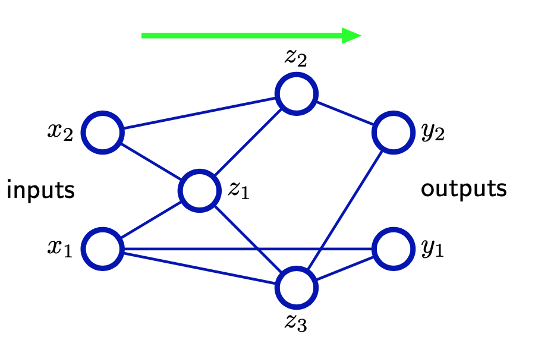
</p>

Neural networks are therefore said to be universal approximators. For example, a two-layer network with linear outputs can uniformly approximate any continuous function on a compact input domain to arbitrary accuracy provided the network has a sufficiently large number of hidden units. This result holds for a wide range of hidden unit activation functions, but excluding polynomials. Neural nets can be viewed as a way of learning features: the hidden units in the middle layers are the learned features that lead to the final output of the net. Suppose we’re trying to classify images of handwritten digits. Each image is represented as a vector of 28 ×28 = 784 pixel values. Each first-layer hidden unit computes $σ(\bm w^T_i \bm x)$. It acts as a **feature detector**. We can visualize $\bm w$ by reshaping it into an image to see that each image is a small learned feature such as edges of the original image. 

We can connect lots of units together into a _directed acyclic graph_. This gives a _feed-forward_ neural network. That’s in contrast to _recurrent_ neural networks, which can have cycles. Typically, units are grouped together into _layers_. Each layer connects N input units to M output units. In the simplest case, all input units are connected to all output units. We call this a _fully connected_ layer. Layer structure of neural networks provide modularity: we can implement each layer’s computations as a black box and then combine or stack them as need. Some common activation functions are:
- Linear: $y=x$ 
- **Rectified Linear Unit (ReLU)**: $y = \max(0, x)$
- Hyperbolic Tangent ($\tanh$)
- Logisic Sigmoid

The rate of activation of the sigmoid depends on the norm of $\bm a_k$, and if $||\bm a_k||$ is very small, the unit will indeed be operating in the linear part of its activation function.

<p align="center">
    
</p>

The choice of activation function is determined by the nature of the data and the assumed distribution of target variables. Sigmoid and tanh squash inputs to small ranges making their derivatives become tiny for large inputs (i.e., vanishing gradients). But with ReLU, the gradient is strong and doesn’t vanish for $x>0$. It is very fast to compute and empirically, ReLU often leads to faster training and better local minima in deep networks compared to sigmoid or tanh. On the other hand, If a neuron’s input is always negative, its output is always 0, and its gradient is 0 — it never learns. To fix this, **Leaky ReLU** is used: small slope for $x<0$, e.g., $\text{LeakyReLU}(x)=\max(0.01x,x)$. Since the output of ReLU is not bounded, gradient can explode in deep nets if not normalized properly which is why BatchNormalization becomes useful here.

If the activation functions of all the hidden units in a network are taken to be linear (or removed), then the entire model collapses to a linear model in the inputs. This follows from the fact that the composition of successive linear transformations is itself a linear transformation. In fact, networks of only linear units give rise to principal component analysis.  Hence a neural network can be thought of as a nonlinear generalization of the linear model, both for regression and classification. 

<!-- ### Regression MLPs -->

First, MLPs can be used for regression tasks. In genral, for standard regression problems, the activation function is the identity so that $\bm y_k =\bm  a_k$, regressing $K$ targets in multivariate regression. If you want to predict a single value (e.g., the price of a house given many of its features), then you just need a single output neuron: its output is the predicted value.   In general, when building an MLP for regression, you do not want to use any activation function for the output neurons, so they are free to output any range of values. However, if you want to guarantee that the output will always be positive, then you can use the ReLU activation function, or the softplus activation function in the output layer. Finally, if you want to guarantee that the predictions will fall within a given range of values, then you can use the logistic function or the hyperbolic tangent, and scale the labels to the appropriate range: 0 to 1 for the logistic function, or –1 to 1 for the hyperbolic tangent.

The loss function to use during training is typically the mean squared error, but if you have a lot of outliers in the training set, you may prefer to use the mean absolute error instead. Alternatively, you can use the **Huber loss**, which is a combination of both. The Huber loss is quadratic when the error is smaller than a threshold $δ$ (typically 1), but linear when the error is larger than $δ$. This makes it less sensitive to outliers than the mean squared error, and it is often more precise and converges faster than the mean absolute error.

<!-- ### Classification MLPs  -->

MLPs can also be used for classification tasks. For a binary classification problem, you just need a single output neuron using the logistic activation function: the output will be a number between 0 and 1, which you can interpret as the estimated probability of the positive class. Obviously, the estimated probability of the negative class is equal to one minus that number. MLPs can also easily handle multilabel binary classification tasks
 
Similarly, for multiple binary classification problems, each output unit activation is transformed using a logistic sigmoid function so that $\bm y_k = σ(\bm a_k)$.  For $K$-class multiclass classification, there are $K$ units at the top, with the $k$th unit modeling the probability of class $k$ using softmax activation function. There are $K$ target measurements $t_k$, $k= 1,...,K$, each being coded as a 0−1 variable for the $k$th class and the corresponding classifier is $C(x) = \argmax_k y_k(x_i)$. With the softmax activation function and the cross-entropy error function, the neural network model is exactly a linear logistic regression model in the hidden units, and all the parameters are estimated by maximum likelihood.
 
If the training set was very skewed, with some classes being overrepresented and others underrepresented, it would be useful to set the `class_weight` argument when calling the `fit()` method, giving a larger weight to underrepresented classes, and a lower weight to overrepresented classes. These weights would be used by Keras when computing the loss. If you need per-instance weights instead, you can set the `sample_weight` argument (it supersedes class_weight). This could be useful for example if some instances were labeled by experts while others were labeled using a crowdsourcing platform: you might want to give more weight to the former. 

<!-- You can also provide sample weights (but not class weights) for the validation set by adding them as a third item in the validation_data tuple. -->


## Fitting Neural Networks
The neural network model has unknown weights and we seek values for them that make the model fit the training data well, i.e, minimizing the error function. For regression, we use sum-of-squared errors as our measure of fit (error function):

$$
E(\bm w) = \sum_{k=1}^K \sum_{i=1}^N (y_k(x_i) - t_k(x_i))^2
$$

For classification we use either squared error or cross-entropy (deviance):

$$
E(\bm w) = - \sum_{k=1}^K \sum_{i=1}^N t_k(x_i)\log y_{k}(x_i)
$$

Because there is clearly no hope of finding an analytical solution to the equation $∇_{\bm w} E(\bm w) = 0$ we resort to iterative numerical procedures. Most techniques involve choosing some initial value $\bm w(0)$ for the weight vector and then moving through weight space in a succession of steps of the form $\bm w^{(τ+1)} = \bm w^{(τ)} + ∆\bm w^{(τ)} $ where $τ$ labels the iteration step. Different algorithms involve different choices for the weight vector update $∆\bm w^{(τ)}$. Many algorithms make use of gradient information and therefore require that, after each update, the value of $∇E(\bm w)$ is evaluated at the new weight vector $w^{(τ+1)}$. The generic approach to minimizing $E(\bm w)$ is by gradient descent, called **backpropagation** in this setting. Because of the compositional form of the model, the gradient can be easily derived using the chain rule for differentiation layer by layer from the output of the network toward the beginning. This is done by a forward and backward sweep over the network, keeping track only of quantities local to each unit. 

### Backpropogation

Backpropogation can be implemented with a two-pass algorithm. In the forward pass, the current weights are fixed and the predicted values $y_k (x_i)$ are computed. In the backward pass, the errors $∆\bm w^{(τ)}$ are computed, and then backpropagated to calculate the gradient. The gradient updates are a kind of batch learning, with the parameter updates being a sum over all of the training cases. Learning can also be carried out **online**—processing each observation one at a time, updating the gradient after each training case, and cycling through the training cases many times.  A training **epoch** refers to one sweep through the entire training set. Online training allows the network to handle very large training sets, and also to update the weights as new observations come in.

As an example of how backpropogation helps computing gradient, we try to compute the cost gradient $dJ/d\bm w$, which is the vector of partial derivatives. This is the average of $dL/d\bm w$ over all the training examples, so in this lecture we focus on computing $dL/d\bm w$. Take one layer perceptron as an example with regularizer:

$$
\begin{align*}
z & =  w x + b\\
y & = \sigma(z)\\
L & = \frac{1}{2}(y-t)^2\\
R &= \frac{1}{2} w^2\\
L_R & = L + \lambda R
\end{align*}
$$

We can diagram out the computations using a **computation graph**. The nodes represent all the inputs and computed quantities, and the edges represent which nodes are computed directly as a function of which other nodes. 

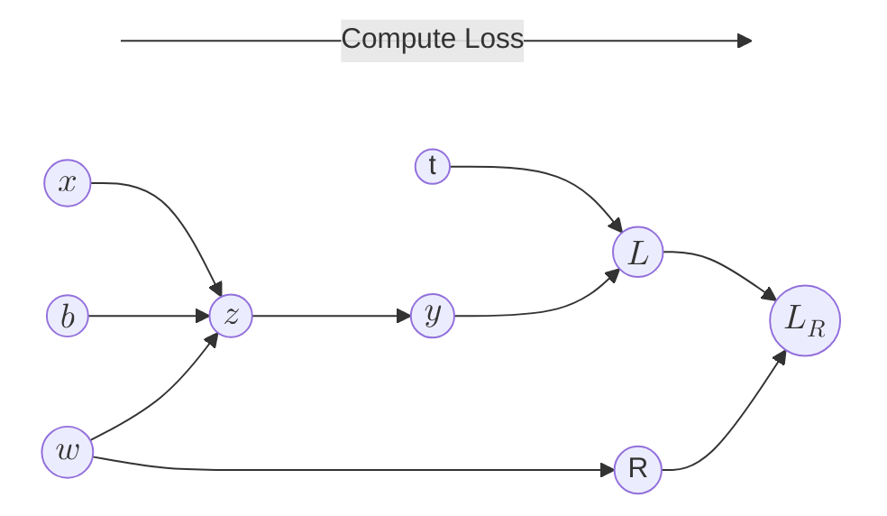
```mermaid
flowchart LR
    Start[ ] ----->|Compute Loss| End[ ]
    id1(($$x$$)) --> id4(($$z$$))
    id2(($$b$$)) --> id4(($$z$$))
    id3(($$w$$)) --> id4(($$z$$))
    id7((t)) --> id6(($$L$$))
    id4(($$z$$)) --> id5(($$y$$))
    id5(($$y$$)) --> id6(($$L$$))
    id6(($$L$$)) --> id9(($$L_R$$))
    id3(($$w$$)) --> id8(($$R$$))
    id8((R)) --> id9(($$L_R$$))
    style Start fill-opacity:0, stroke-opacity:0;
    style End fill-opacity:0, stroke-opacity:0;
```


The forward pass is straightforward. For now assume that we are dealing with single variables and single-value functions. The backward pass goes according to the chain rule:

> Notation: $\dot y = \frac{\partial L_R}{\partial y}$

$$
\begin{align*}
\dot L_R & =  1\\
\dot R & =  \dot L_R \frac{\partial L_R}{\partial R} = \dot L_R \lambda \\
\dot L & =  \dot L_R \frac{\partial L_R}{\partial L} =\dot L_R \\
\dot y & =  \dot L \frac{\partial L}{\partial y} = \dot L (y-t)\\
\dot z & = \dot y \frac{\partial y}{\partial z} = \dot y \sigma'(z) \\
\dot b & = \dot z \frac{\partial z}{\partial b} = \dot z  \\
\dot w & = \dot z \frac{\partial z}{\partial w} +  \dot R \frac{\partial R}{\partial w} = \dot z x +  \dot R w
\end{align*}
$$

To perform these computations efficiently, we need to vectorize these computations in matrix form. For a fully connected layer connection $z \rightarrow y$, the backprop rules will be:

$$
\dot z_j = \sum_i \dot y_i \frac{\partial y_i}{\partial z_j}
$$

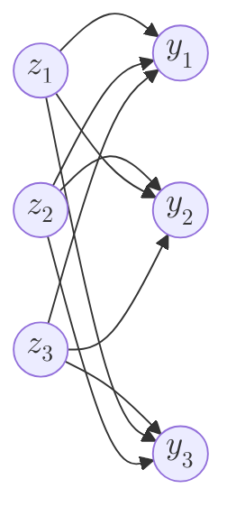
```mermaid
flowchart LR
    id1(($$z_1$$)) --> id2(($$y_1$$))
    id3(($$z_2$$)) --> id4(($$y_2$$))
    id5(($$z_3$$)) --> id6(($$y_3$$))
    id1(($$z_1$$)) --> id4(($$y_2$$))
    id1(($$z_1$$)) --> id6(($$y_3$$))
    id3(($$z_2$$)) --> id2(($$y_1$$))
    id3(($$z_2$$)) --> id6(($$y_3$$))
    id5(($$z_3$$)) --> id4(($$y_2$$))
    id5(($$z_3$$)) --> id2(($$y_1$$))
```

which looks like the following in matrix form:

$$
\dot {\bm z} =  \frac{\partial \bm y}{\partial \bm z}^T \dot {\bm y} 
$$

where 

$$ 
\frac{\partial \bm y}{\partial \bm z} =
\begin{pmatrix}
\frac{\partial y_1}{\partial z_1} &\dots &\frac{\partial y_1}{\partial z_n} \\
\vdots & \ddots & \vdots \\
\frac{\partial y_m}{\partial z_1} &\dots &\frac{\partial y_m}{\partial z_n} 
\end{pmatrix}
$$ 

is the Jacobian matrix. So If $\bm z = \bm W \bm x$, then $\frac{\partial \bm z}{\partial \bm x} = \bm W$ and $\dot {\bm x} = \bm W^T \dot {\bm z}$. Backprop is used to train the overwhelming majority of neural nets today. Check your derivatives numerically by plugging in a small value of h. This is known as **finite differences**.

$$
\frac{\partial }{\partial x_i} f(x_1, \dots, x_N) = \lim_{h \rightarrow 0} \frac{f(x_1,\dots, x_i+h,\dots, x_N) - f(x_1,\dots, x_i-h,\dots, x_N)}{2h}
$$

Run gradient checks on small, randomly chosen inputs. Use double precision floats (not the default for TensorFlow, PyTorch, etc.!), Compute the relative error: $|a−b| / (|a|+ |b|)$. The relative error should be very small, e.g. $10^{−6}$. Gradient checking is really important! Learning algorithms often appear to work even if the math is wrong.

### Neural Nets: Non-convex Optimization

Training a network with hidden units cannot be convex because of **permutation symmetries**. Suppose you have a simple feed-forward network: `x → Hidden Layer → Output`. Let’s say the hidden layer has 3 neurons. Each neuron applies:

$$
h_j = \sigma(w_j^T x + b_j)
$$

Then you compute:

$$
\hat y = \sum_{j=1}^3 v_j h_j + c
$$

Now suppose you pick two neurons 1, 2 in hidden layer, swap  their corresponding incoming weights $w_1 \leftrightarrow w_2$ and $b_1 \leftrightarrow b_2$, and then swap their outgoing weights  $v_1 \leftrightarrow v_2$ (their outgoing weights). The overall function computed by the network remains the same and the network's output does not change ss long as all connections are permuted consistently. This implied many different parameter configurations represent the same function. These configurations have the same loss. So the loss surface has many symmetric minima — but they are functionally identical. That is not the case for convex loss function as there is only one global optima for convex functions. On the other hand, suppose we average the parameters of any two of these permuted parameter configuration  permutations and substitute this average value for all the parameters we averaged. We get a model that is a degenerate because all the hidden units are identical. On the other hand, if the loss was a convex optimization problem, we should have obtained smaller loss for this degenerate configuration which is absurd. Hence, training multilayer neural nets is non-convex. Permutation symmetries imply that  the loss surface has many equivalent minima. These are not isolated points — they’re connected by symmetrical transformations.

​	
 

### Training Neural Networks

There is quite an art in training neural networks. The model is generally overparametrized, and the optimization problem is nonconvex and unstable unless certain guidelines are followed. Unfortunately, gradients often get smaller and smaller as the algorithm progresses down to the lower layers. As a result, the Gradient Descent update leaves the lower layer connection weights virtually unchanged, and training never converges to a good solution. This is called the **vanishing gradients** problem. In some cases, the opposite can happen: the gradients can grow bigger and bigger, so many layers get insanely large weight updates and the algorithm diverges. This is the **exploding gradients** problem, which is mostly encountered in recurrent neural networks. Looking at the logistic activation function, you can see that when inputs become large (negative or positive), the function saturates at 0 or 1, with a derivative extremely close to 0. Thus when backpropagation kicks in, it has virtually no gradient to propagate back through the network, and what little gradient exists keeps getting diluted as backpropagation progresses down through the top layers, so there is really nothing left for the lower layers.

We need the signal to flow properly in both directions: in the forward direction when making predictions, and in the reverse direction when backpropagating gradients. We don’t want the signal to die out, nor do we want it to explode and saturate. For the signal to flow properly, the researchers argue that we need the variance of the outputs of each layer to be equal to the variance of its inputs, and we also need the gradients to have equal variance before and after flowing through a layer in the reverse direction. 

#### Random Initialization

**Random Initialization**: the connection weights of each layer must be initialized randomly. this is called Xavier initialization. By default, Keras uses this initialization with a uniform distribution. Note that the use of exact zero weights leads to zero derivatives and perfect symmetry, and the algorithm never moves. Starting instead with large weights often leads to poor solutions.

#### Vanishing/Exploding Gradients
One of the insights in the 2010 paper by Glorot and Bengio was that the vanishing/exploding gradients problems were in part due to a poor choice of activation function. But it turns out that other activation functions than sigmoid behave much better in deep neural networks, in particular the ReLU activation function, mostly because it does not saturate for positive values (and also because it is quite fast to compute). Unfortunately, the ReLU activation function is not perfect. It suffers from a problem known as the dying ReLUs: during training, some neurons effectively die, meaning they stop outputting anything other than 0. In some cases, you may find that half of your network’s neurons are dead, especially if you used a large learning rate. A neuron dies when its weights get tweaked in such a way that the weighted sum of its inputs are negative for all instances in the training set. When this happens, it just keeps outputting 0s, and gradient descent does not affect it anymore since the gradient of the ReLU function is 0 when its input is negative. To solve this problem, you may want to use a variant of the ReLU function, such as the **leaky ReLU**. This function is defined as $\text{LeakyReLU}(z) = \max(αz, z)$

#### Batch Normalization

Batch Normalization (BN) was a technique to address the vanishing/exploding gradients problems. The technique consists of adding an operation in the model just before or after the activation function of each hidden layer, simply zero-centering and normalizing each input, then scaling and shifting the result using two new parameter vectors per layer: one for scaling, the other for shifting. In other words, this operation lets the model learn the optimal scale and mean of each of the layer’s inputs. In many cases, if you add a BN layer as the very first layer of your neural network, you do not need to standardize your training set (e.g., using a StandardScaler): the BN layer will do it for you (well, approximately, since it only looks at one batch at a time, and it can also rescale and shift each input feature).In order to zero-center and normalize the inputs, the algorithm needs to estimate each input’s mean and standard deviation. It does so by evaluating the mean and standard deviation of each input over the current mini-batch.

$$
\begin{align*}
\bm \mu_B & = \frac{1}{m_B} \sum_{i=1}^{m_B}\bm x_i\\
\bm \sigma_B^2 & = \frac{1}{m_B} \sum_{i=1}^{m_B} (\bm x_i - \bm \mu_B)^2 \\
\hat {\bm x_i} & = \frac{\bm x_i - \bm \mu_B}{\sqrt{\bm \sigma_B^2 + \epsilon}} \\
\bm z_i &= \bm \gamma \otimes \hat{\bm x_i} + \bm \beta
\end{align*}
$$

where $m_B$ is the mini-batch size and $\otimes$ represents element-wise multiplication. It was reported that BN is leading to a huge improvement in the ImageNet classification task (ImageNet is a large database of images classified into many classes and commonly used to evaluate computer vision systems). The vanishing gradients problem was strongly reduced, to the point that they could use saturating activation functions such as the `tanh` and even the logistic activation function. The networks were also much less sensitive to the weight initialization. They were able to use much larger learning rates, significantly speeding up the learning process.

You may find that training is rather slow, because each epoch takes much more time when you use batch normalization. However, this is usually counterbalanced by the fact that convergence is much faster with BN, so it will take fewer epochs to reach the same performance. All in all, wall time will usually be smaller (this is the time measured by the clock on your wall). Batch Normalization has become one of the most used layers in deep neural networks, to the point that it is often omitted in the diagrams, as it is assumed that BN is added after every layer.

#### Clipping Gradients

Another popular technique to lessen the exploding gradients problem is to simply clip the gradients during backpropagation so that they never exceed some threshold. This is called **Gradient Clipping**. This technique is most often used in recurrent neural networks, as Batch Normalization is tricky to use in RNNs. This will clip every component of the gradient vector to a value between –1.0 and 1.0.


<!-- ##### Scaling of the Inputs
Since the scaling of the inputs determines the effective scaling of the weights in the bottom layer, it can have a large effect on the quality of the final solution. At the outset it is best to standardize all inputs to have mean zero. and standard deviation one. This ensures all inputs are treated equally in the regularization process, and allows one to choose a meaningful range for the random starting weights. -->

#### Number of Hidden Units and Layers

It is most common to put down a reasonably large number of units and train them with regularization. Choice of the number of hidden layers is guided by background knowledge. and experimentation. Each layer extracts features of the input for regression or classification. Use of multiple hidden layers allows construction of hierarchical features at different levels of resolution.

#### Regularization in Neural Networks 

Note that $M$, the number of hidden units controls the number of parameters (weights and biases) in the network, and so we might expect that in a maximum likelihood setting there will be an optimum value of $M$ that gives the best generalization performance, corresponding to the optimum balance between under-fitting and over-fitting. The generalization error, however, is not a simple function of $M$ due to the presence of local minima in the error function. Here we see the effect of choosing multiple random initializations for the weight vector for a range of values of $M$. The overall best validation set performance in this case occurred for a particular solution having $M = 8$. In practice, one approach to choosing $M$ is in fact to plot a graph of the kind shown below and then to choose the specific solution having the smallest validation set error.

<p align="center">
    
</p>

Examples of two-layer networks trained on $10$ data points drawn from the sinusoidal dataset. The graphs show the result of fitting networks having $M = 1, 3$ and $10$ hidden units, respectively, by minimizing a sum-of-squares error function using a scaled conjugate-gradient algorithm. There are, however, other ways to control the complexity of a neural network model in order to avoid over-fitting. The simplest regularizer is the quadratic, giving a regularized error. The simplest regularizer is the quadratic, giving a regularized error of the form

$$
\tilde E(\bm w) = E(\bm w) + \frac{\lambda}{2} \bm w^T \bm w.
$$

This regularizer is also known as weight decay and has been discussed at length. Larger values of $λ$ will tend to shrink the weights toward zero: typically cross-validation is used to estimate λ. The effective model complexity is then determined by the choice of the regularization coefficient $λ$. As we have seen previously, this regularizer can be interpreted as the negative logarithm of a zero-mean Gaussian prior distribution over the weight vector $\bm w$. You can use ℓ1 and ℓ2 regularization to constrain a neural network’s connection weights (but typically not its biases). Here is how to apply ℓ2 regularization to a Keras layer’s connection weights, using a regularization factor of 0.01. The `l2()` function returns a regularizer that will be called to compute the regularization loss, at each step during training. This regularization loss is then added to the final loss.

#### Dropout
**Dropout** is one of the most popular regularization techniques for deep neural networks. It is a fairly simple algorithm: at every training step, every neuron (including the input neurons, but always excluding the output neurons) has a probability $p$ of being temporarily “dropped out,” meaning its output is set to zero during this training step and no gradients flow through it., but it may be active during the next training step. So it does not contribute to forward pass or backpropagation for that training step. This happens only during training. The hyperparameter $p$ is called the **dropout rate**, and it is typically set to 50%. At inference time, all neurons are used normally. Dropout 
- prevents the network from relying too heavily on specific neurons (co-adaptation).
- encourages the network to learn more robust, generalized representations.
- acts like training an ensemble of smaller networks, and averaging them at inference.

If you observe that the model is overfitting, you can increase the dropout rate. Conversely, you should try decreasing the dropout rate if the model underfits the training set. It can also help to increase the dropout rate for large layers, and reduce it for small ones. Moreover, many state-of-the-art architectures only use dropout after the last hidden layer, so you may want to try this if full dropout is too strong. Dropout does tend to significantly slow down convergence, but it usually results in a much better model when tuned properly. So, it is generally well worth the extra time and effort.


#### Early stopping

Often neural networks have too many weights and will overfit the data at the global minimum of R. In early developments of neural networks, either by design or by accident, an _early stopping_ rule was used to avoid overfitting.  The training of nonlinear network models corresponds to an iterative reduction of the error function defined with respect to a set of training data. For many of the optimization algorithms used for network training, such as conjugate gradients, the error is a nonincreasing function of the iteration index. However, the error measured with respect to independent data, generally called a validation set, often shows a decrease at first, followed by an increase as the network starts to over-fit. Training can therefore be stopped at the point of smallest error with respect to the validation dataset in order to obtain a network having good generalization performance. The behaviour of the network in this case is sometimes explained qualitatively in terms of the effective number of degrees of freedom in the network, in which this number starts out small and then to grows during the training process, corresponding to a steady increase in the effective complexity of the model. 

#### Faster Optimizers
Training a very large deep neural network can be painfully slow. So far we have seen four ways to speed up training (and reach a better solution): applying a good initialization strategy for the connection weights, using a good activation function, using Batch Normalization, and reusing parts of a pretrained network (possibly built on an auxiliary task or using unsupervised learning). Another huge speed boost comes from using a faster optimizer than the regular Gradient Descent optimizer. Some popular ones are **Adam**, **AdaGrad**, **RMSProp**.

If you set it way too high, training may actually diverge. If you set it too low, training will eventually converge to the optimum, but it will take a very long time. If you set it slightly too high, it will make progress very quickly at first, but it will end up dancing around the optimum, never really settling down. If you have a limited computing budget, you may have to interrupt training before it has converged properly, yielding a suboptimal solution.

#### Learning Rate, Batch Size and other Hyperparameters

The number of hidden layers and neurons are not the only hyperparameters you can tweak in an MLP. Here are some of the most important ones, and some tips on how to set them:

The **learning rate** is arguably the most important hyperparameter. In general, the optimal learning rate is about half of the maximum learning rate. So a simple approach for tuning the learning rate is to start with a large value that makes the training algorithm diverge, then divide this value by 3 and try again, and repeat until the training algorithm stops diverging. The **batch size** can also have a significant impact on your model’s performance and the training time. In general the optimal batch size will be lower than 32. A small batch size ensures that each training iteration is very fast, and although a large batch size will give a more precise estimate of the gradients, in practice this does not matter much since the optimization landscape is quite complex and the direction of the true gradients do not point precisely in the direction of the optimum. However, having a batch size greater than 10 helps take advantage of hardware and software optimizations, in particular for matrix multiplications, so it will speed up training. Moreover, if you use Batch Normalization, the batch size should not be too small. In general, the ReLU activation function will be a good default for all hidden layers. For the output layer, it really depends on your task. In most cases, the number of training iterations does not actually need to be tweaked: just use early stopping instead.

#### Reusing Pretrained Layers
It is generally not a good idea to train a very large DNN from scratch: instead, you should always try to find an existing neural network that accomplishes a similar task to the one you are trying to tackle, then just reuse the lower layers of this network: this is called **transfer learning**. It will not only speed up training considerably, but will also require much less training data. 

The output layer of the original model should usually be replaced since it is most likely not useful at all for the new task, and it may not even have the right number of outputs for the new task. Similarly, the upper hidden layers of the original model are less likely to be as useful as the lower layers, since the high-level features that are most useful for the new task may differ significantly from the ones that were most useful for the original task. You want to find the right number of layers to reuse.

Try freezing all the reused layers first (i.e., make their weights non-trainable, so gradient descent won’t modify them), then train your model and see how it performs. Then try unfreezing one or two of the top hidden layers to let backpropagation tweak them and see if performance improves. The more training data you have, the more layers you can unfreeze. It is also useful to reduce the learning rate when you unfreeze reused layers: this will avoid wrecking their fine-tuned weights.

If you still cannot get good performance, and you have little training data, try dropping the top hidden laye r(s) and freeze all remaining hidden layers again. You can iterate until you find the right number of layers to reuse. If you have plenty of training data, you may try replacing the top hidden layers instead of dropping them, and even add more hidden layers. So why did I cheat? Well it turns out that transfer learning does not work very well with small dense networks: it works best with deep convolutional neural networks, so we will revisit transfer learning.


## Mixture Density Networks (Optional)

The goal of supervised learning is to model a conditional distribution $p(\bm t \mid \bm x)$, which for many simple regression problems is chosen to be Gaussian. However, practical machine learning problems can often have significantly non-Gaussian distributions. These can arise, for example, with inverse problems in which the distribution can be multimodal, in which case the Gaussian assumption can lead to very poor predictions.

As demonstration, data for this problem is generated by sampling a variable $\bm x$ uniformly over the interval $(0, 1)$, to give a set of values $\{x_n \}$, and the corresponding target values $t_n$ are obtained by computing the function $x_n + 0.3 \sin(2πx_n)$ and then adding uniform noise over the interval $(−0.1,0.1)$. The inverse problem is then obtained by keeping the same data points but exchanging the roles of $x$ and $t$.

<p align="center">
    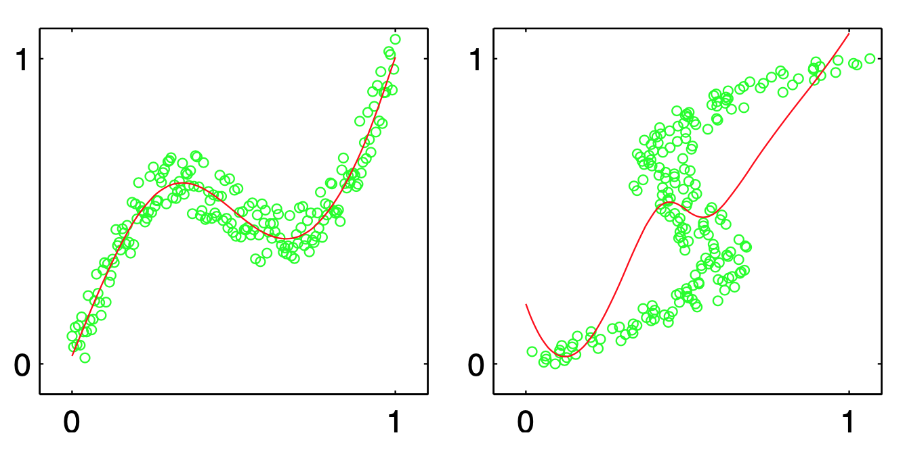
</p>

Least squares corresponds to maximum likelihood under a Gaussian assumption. We see that this leads to a very poor model for the highly non-Gaussian inverse problem. We therefore seek a general framework for modelling conditional probability distributions. This can be achieved by using a mixture model for $p(\bm t\mid \bm x)$ in which both the mixing coefficients as well as the component densities are flexible functions of the input vector $x$, giving rise to the mixture density network.  For any given value of $\bm x$, the mixture model provides a general formalism for modelling an arbitrary conditional density function $p(\bm t \mid \bm x)$. Here we shall develop the model explicitly for Gaussian components, so that
$$
p(\bm t\mid \bm x) =  \sum_{k=1}^K  p(\bm t \mid \bm x, c_k)p(c_k \mid \bm x) =  \sum_{k=1}^K π_k(\bm x) \mathcal N (\bm t \mid \bm \mu_k (\bm x), σ^2_k(\bm x))
$$

where $c_k$ is component $k$. This is an example of a heteroscedastic model since the noise variance on the data is a function of the input vector $x$. Instead of Gaussians, we can use other distributions for the components, such as Bernoulli distributions if the target variables are binary rather than continuous. We have also specialized to the case of isotropic covariances for the components, although the mixture density network can readily be extended to allow for general covariance matrices by representing the covariances using a Cholesky factorization. We now take the various parameters of the mixture model, namely the mixing coefficients $π_k(\bm x)$, the means $µ_k(\bm x)$, and the variances $σ^2_k(\bm x)$, to be governed by the outputs of a conventional neural network that takes $\bm x$ as its input.

If there are $L$ components in the mixture model, and if $\bm t$ has K components, then the network will have $L$ output unit activations denoted by $a^π_k$ that determine the mixing coefficients $π_k(\bm x)$, K outputs denoted by $a^σ_k$ that determine the kernel widths $σ_k(\bm x)$, and L × K outputs denoted by $a^µ_{kj}$ that determine the components $µ_{kj}(\bm x)$ of the kernel centres $µ_k(\bm x)$. The total number of network outputs is given by (K + 2) L, as compared with the usual K outputs for a network, which simply predicts the conditional means of the target variables. The mixing coefficients must satisfy the constraints

$$
\sum_{k=1}^K \pi_k(\bm x) = 1
$$

which can be achieved using a set of softmax outputs:

$$
\pi_k(\bm x) = \frac{e^{a^{\pi}_k}}{\sum_{l=1}^K e^{a^{\pi}_l}}
$$

Similarly, the variances must satisfy $σ^2_k(\bm x) \geq 0$ and so can be represented in terms of the exponentials of the corresponding network activations using $\sigma_k(\bm x) = e^{a^{\sigma}_k}$. Because the means $\bm µ_k(\bm x)$ have real components, they can be represented directly by the network output activations $\mu_{kj}(\bm x) = a^{\mu}_{kj}$.  The adaptive parameters of the mixture density network comprise the vector $\bm w$ of weights and biases in the neural network, that can be set by maximum likelihood, or equivalently by minimizing an error function defined to be the negative logarithm of the likelihood. For independent data, this error function takes the form

$$
E(\bm w) =− \sum_{k=1}^N \ln \Big( \sum_{k=1}^k \pi_k(\bm x, \bm w) \mathcal N (\bm t_n \mid \bm \mu_k(\bm x_n,  \bm w), \sigma^2_k(\bm x_n, \bm w)) \Big)
$$

where we have made the dependencies on $\bm w$ explicit.

<p align="center">
    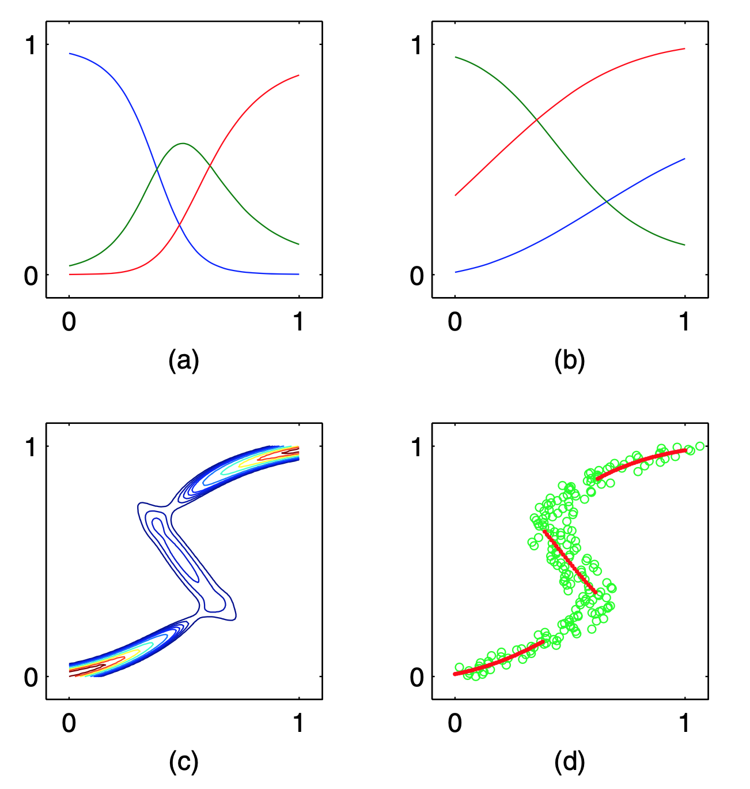
</p>

Plot of the mixing coefficients $π_k(\bm x)$ as a function of $\bm x$ for the three kernel functions in a mixture density network trained on the data. The model has three Gaussian components, and uses a two-layer multi-layer perceptron with five ‘tanh’ sigmoidal units in the hidden layer, and nine outputs (corresponding to the 3 means and 3 variances of the Gaussian components and the 3 mixing coefficients). At both small and large values of $\bm x$, where the conditional probability density of the target data is unimodal, only one of the kernels has a high value for its prior probability, while at intermediate values of $\bm x$, where the conditional density is trimodal, the three mixing coefficients have comparable values. (b) Plots of the means $\bm \mu_k(\bm x)$ using the same colour coding as for the mixing coefficients. (c) Plot of the contours of the corresponding conditional probability density of the target data for the same mixture density network. (d) Plot of the approximate conditional mode, shown by the red points, of the conditional density.

Once a mixture density network has been trained, it can predict the conditional density function of the target data for any given value of the input vector. This conditional density represents a complete description of the generator of the data, so far as the problem of predicting the value of the output vector is concerned. One of the simplest of these is the mean, corresponding to the conditional average of the target data, and is given by

$$
\mathbb E [\bm t\mid \bm x] = \int \bm t p(\bm t \mid \bm x) d\bm t= \sum_{k=1}^K π_k(\bm x) \bm \mu_k(\bm x)
$$

We can similarly evaluate the variance of the density function about the conditional average $\mathbb E [ || \bm t− \mathbb E[\bm t\mid x] ||^2 \mid \bm x]$ - see p277 in [Pattern Recognition and Machine Learning](https://www.microsoft.com/en-us/research/wp-content/uploads/2006/01/Bishop-Pattern-Recognition-and-Machine-Learning-2006.pdf).


# Convolutional Neural Networks

**Convolutional Neural Networks** (LeCun 1989), or ConvNet or CNNs, are a specialized kind of neural network for processing data that has a known, **grid-like topology**. Examples include time-series data, which can be thought of as a 1D grid taking samples at regular time intervals, and image data, which can be thought of as a 2D grid of pixels. Most commonly, ConvNet architectures make the explicit assumption that the inputs are images. The name _convolutional neural network_ indicates that the network employs a mathematical operation called **convolution**. Convolution is a specialized kind of linear operation. Convolutional networks are simply neural networks that use convolution in place of general matrix multiplication in at least one of their layers. Convolution of two functions is defined as:

$$
  (x*w)(t) = \int_{-\infty}^{\infty} x(s)w(t-s) ds
$$

Convolution natuarally appears in different areas of Mathematics such as Probability Theory. For example, the pdf of the sum of two random variables is convolution of their pdfs. If $x$ and $w$ are defined only on integer $t$, we can define the discrete convolution:

$$
(x*w)(t) = \sum_{s = -\infty}^{\infty} x(s)w(t-s)
$$


The first argument $x$ to the convolution is often referred to as the **input** and the second $w$ argument as the **filter** (or **kernel**). The output is sometimes referred to as the **feature map**. In machine learning applications, the input is usually a multidimensional array of data and the kernel is usually a multidimensional array of parameters that are adapted by the learning algorithm. We will refer to these multidimensional arrays as **tensors**. Because each element of the input and kernel must be explicitly stored separately, we usually assume that these functions are zero everywhere but the finite set of points for which we store the values. We often use convolutions over more than one axis at a time. For example, if we use a two-dimensional image I as our input, we probably also want to use a two-dimensional kernel:

$$
(I*K)(i,j) = \sum_m\sum_n I(m,n) K(i+m, j+n).
$$

Also, 

$$
I*K = K*I.
$$ 

In the above formula, the kernel is not flipped (+ not - ) which is the common way to implement convolution in machine learning. It is also rare for convolution to be used alone in machine learning; instead convolution is used simultaneously with other functions, and the combination of these functions does not commute regardless of whether the convolution operation flips its kernel or not. Discrete convolution can be viewed as multiplication by a matrix. However, the matrix has several entries constrained to be equal to other entries. For example, for univariate discrete convolution, each row of the matrix is constrained to be equal to the row above shifted by one element. This usually corresponds to a very sparse matrix (a matrix whose entries are mostly equal to zero) because the kernel is usually much smaller than the input image.

<p align="center">
    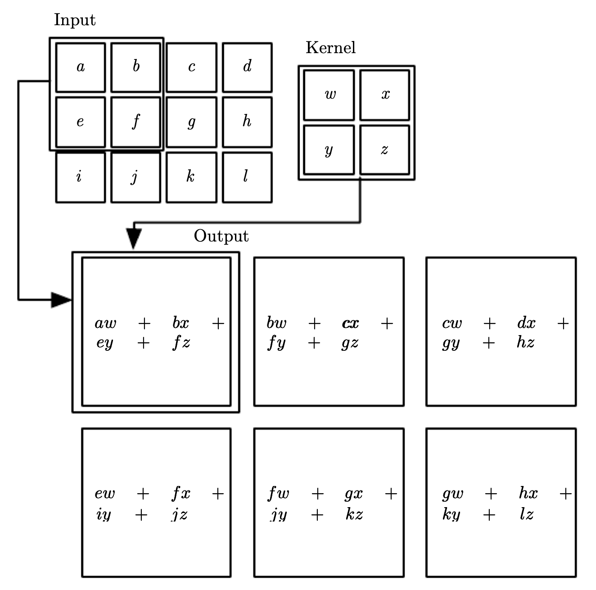
</p>

Convolution leverages three important ideas that can help improve a machine learning system: 
- **Local Connectivity**: In traditional neural network layers, every output unit interacts with every input unit through matrix multiplication meaning a separate parameter describing the interaction between each input unit and each output unit. When dealing with high-dimensional inputs such as images, it is impractical to connect units to all units in the previous volume. In convolutional networks instead, we will connect each unit to only a local region of the input volume. So conv nets typically have sparse interactions referred to as sparse connectivity (also or sparse weights). This is accomplished by making the kernel smaller than the input. This means that we need to store fewer parameters, which both reduces the memory requirements of the model and improves its statistical efficiency. It also means that computing the output requires fewer operations.

    <p align="center">
        
    </p>

    <p align="center">
        
    </p>


    We highlight one output unit $s_3$ and also highlight the input units in $x$ that affect this unit. These units are known as the **receptive field** of $s_3$. The **receptive field** is the spatial extent of a filter (or in other words, the connectivity). Note that the extent of the connectivity along the depth axis (depth of the filter) is always equal to the depth of the input volume. The connections are local in 2D space (along width and height), but always full along the entire depth of the input volume. (Top) When $s$ is formed by convolution with a kernel of width three, only three inputs affect $s_3$. When (Bottom) $s$ is formed by matrix multiplication, connectivity is no longer sparse, so all of the inputs affect $s_3$.

    <p align="center">
        
    </p>

    The receptive field of the units in the deeper layers of a convolutional network is larger than the receptive field of the units in the shallow layers. This effect increases if the network includes architectural features like strided convolution or pooling. This means that even though direct connections in a convolutional net are very sparse, units in the deeper layers can be indirectly connected to all or most of the input image.

- **Parameter Sharing**: In a traditional neural net, each element of the weight matrix is used exactly once when computing the output of a layer. It is multiplied by one element of the input and then never revisited. The parameter sharing used by the convolution operation means that rather than learning a separate set of parameters.

    <p align="center">
        
    </p>

    Black arrows indicate the connections that use a particular parameter in two different models. (Top) The black arrows indicate uses of the central element of a 3-element kernel in a convolutional model. Due to parameter sharing, this single parameter is used at all input locations. (Bottom) The single black arrow indicates the use of the central element of the weight matrix in a fully connected model. This model has no parameter sharing so the parameter is used only once.

- **Equivariant**: The particular form of parameter sharing causes the layer to have a property called equivariance to translation. With images, convolution creates a 2-D map of where certain features appear in the input. If we move the object in the input, its representation will move the same amount in the output. When processing images, it is useful to detect edges in the first layer of a convolutional network. The same edges appear more or less everywhere in the image, so it is practical to share parameters across the entire image. In some cases, we may not wish to share parameters across the entire image. For example, if we are processing images that are cropped to be centered on an individual’s face, we probably want to extract different features at different locations—the part of the network processing the top of the face needs to look for eyebrows, while the part of the network processing the bottom of the face needs to look for a chin.

### Efficiency of Edge Detection
The image below on the right was formed by taking each pixel in the original image and subtracting the value of its neighboring pixel on the left.

<p align="center">
    
</p>

This shows the strength of all of the vertically oriented edges in the input image, which can be a useful operation for **object detection**. Suppose you have a simple image of a square split into white (left) and gray (right) area from the middle. Convolute this matrix with a filter that will turn out to be the vertical edge detector.  The following matrix is a representation of this:

$$
\begin{bmatrix}
10&10&0&0\\
10&10&0&0\\
10&10&0&0\\
10&10&0&0
\end{bmatrix}
*
\begin{bmatrix}
1&-1\\
1&-1
\end{bmatrix}=
\begin{bmatrix}
0&20&0\\
0&20&0\\
0&20&0
\end{bmatrix}
$$

which is activating the middle pixels vertically in the image as the border between white and gray. If the input image is 320 x 280, the the ouput image will have dimension 319 x 279. To describe the same transformation with a matrix multiplication in a fully connected layer, we would need 320× 280× 319 × 279, or about eight billion entries in the matrix, making convolution two billion times more efficient for representing this transformation using only four parameters of the fiter which is a huge gain computationally. Convolution with a single kernel can only extract one kind of feature, albeit at many spatial locations. Usually we want each layer of our network to extract many kinds of features, at many locations. So we use several filters to capture more information. 


### Pooling
A typical layer of a convolutional network consists of three stages. In the first stage, the layer performs several convolutions in parallel to produce a set of linear activations. In the second stage, each linear activation is run through a nonlinear activation function, such as the rectified linear activation function. This stage is sometimes called the **detector stage**. In the third stage, we use a **pooling function** to modify the output of the layer further. *A pooling function replaces the output of the net at a certain location with a summary statistic of the nearby outputs*. 


<p align="center">
        
    </p>

For example, the **max pooling** operation reports the maximum output within a rectangular neighborhood. Max pooling introduces invariance. The image below demonstrate a view of the middle of the output of a convolutional layer. The bottom row shows outputs of the nonlinearity. The top row shows the outputs of max pooling, with a stride of one pixel between pooling regions and a pooling region width of three pixels. The Bottom is a view of the same network, after the input has been shifted to the right by one pixel. Every value in the bottom row has changed, but only half of the values in the top row have changed, because the max pooling units are only sensitive to the maximum value in the neighborhood, not its exact location.


<p align="center">
        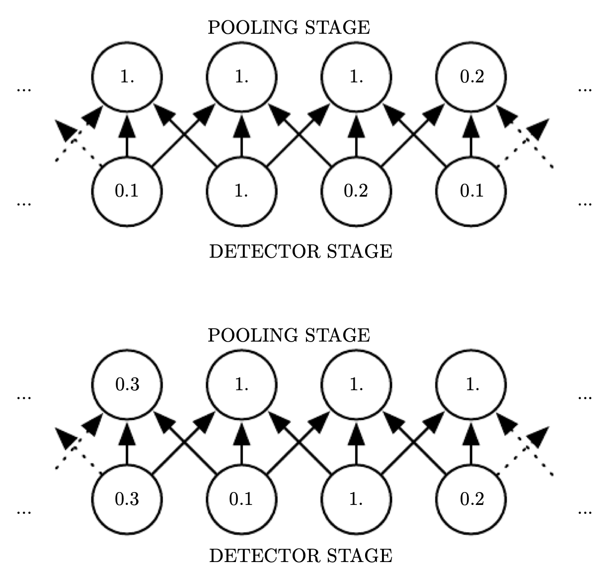
    </p>

Pooling over spatial regions produces invariance to translation, but if we pool over the outputs of separately parametrized convolutions, the features can learn which transformations to become invariant to.

<p align="center">
    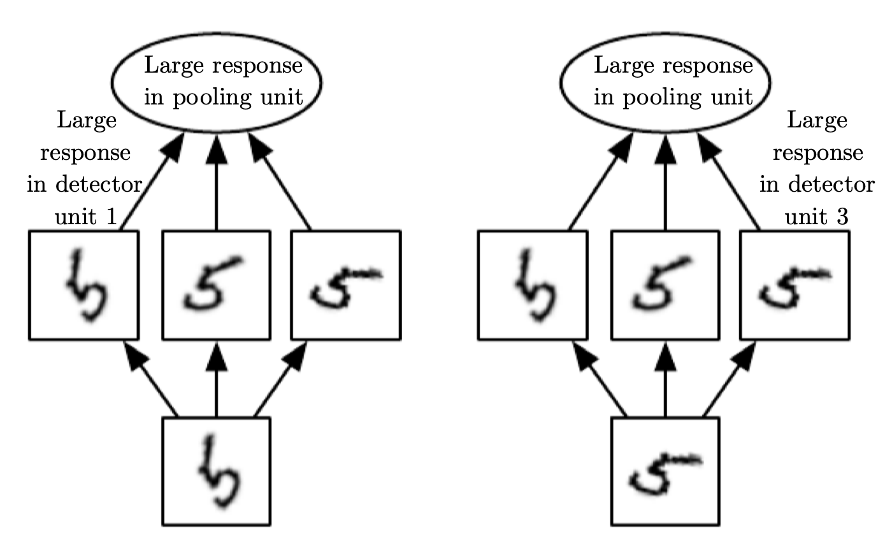
</p>

A pooling unit that pools over multiple features that are learned with separate filters can learn to be **invariant to transformations** of the input. Each filter attempts to match a slightly different orientation of the 5. When a 5 appears in the input, the corresponding filter will match it and cause a large activation in a detector unit. The max pooling unit then has a large activation regardless of which detector unit was activated. Max pooling over spatial positions is naturally **invariant to translation**; this multi-channel approach is only necessary for learning other transformations.

Pooling is also used for **downsampling**. Here we use max-pooling with a pool width of 3 and a stride between pools of 2. This reduces the representation size by a factor of 2, which reduces the computational and statistical burden on the next layer. Note that the rightmost pooling region has a smaller size, but must be included if we do not want to ignore some of the detector units.

<p align="center">
    
</p>

In all cases, *pooling helps to make the representation become approximately invariant to small translations of the input*.  The pooled outputs do not change. Invariance to local translation can be a very useful property if we care more about whether some feature is present than exactly where it is. When determining whether an image contains a face, we need not know the location of the eyes with pixel-perfect accuracy, we just need to know that there is an eye on the left side of the face and an eye on the right side of the face. In other contexts, it is more important to preserve the location of a feature. For example, if we want to find a corner defined by two edges meeting at a specific orientation, we need to preserve the location of the edges well enough to test whether they meet. 

Other popular pooling functions include the **average** of a rectangular neighborhood, the **L2 norm** of a rectangular neighborhood, or a **weighted average** based on the distance from the central pixel. Pooling can complicate some kinds of neural network architectures that use top-down information, such as Boltzmann machines and autoencoders. Convolution and pooling can cause **underfitting**. If a task relies on preserving precise spatial information, then using pooling on all features can increase the training error. Discarding pooling layers has also been found to be important in training good generative models, such as variational autoencoders (VAEs) or generative adversarial networks (GANs).


### Hyperparameters
Three hyperparameters control the size of the output volume of a convlutional layer: 

- **Depth**: the number of filters we would like to use, each learning to look for something different in the input. For example, if the first Convolutional Layer takes as input the raw image, then different neurons along the depth dimension may activate in presence of _various oriented edges, or blobs of color_. We will refer to a set of neurons that are all looking at the same region of the input as a **depth column**.

- **Stride**:  the stride with which we slide the filter. When the stride is 1 then we move the filters one pixel at a time. When the stride is 2 (or uncommonly 3 or more, though this is rare in practice) then the filters jump 2 pixels at a time as we slide them around. This will produce smaller output volumes spatially.

- **Zero-Padding**: One essential feature of any convolutional network implementation is the ability to implicitly **zero-pad**. Without this feature, the width of the representation shrinks by one pixel less than the filter width at each layer. *Zero padding the input allows us to control the filter width and the size of the output independently*. Without zero padding, we are forced to choose between shrinking the spatial extent of the network rapidly and using small filters—both scenarios that significantly limit the expressive power of the network.  The nice feature of zero padding is that it will allow us to control the spatial size of the output volumes (most commonly as we’ll see soon we will use it to exactly preserve the spatial size of the input volume so the input and output width and height are the same).


We can compute the spatial size of the output volume as a function of the input volume size (W), the receptive field size of the Conv Layer neurons (F), the stride with which they are applied (S), and the amount of zero padding used (P) on the border. You can convince yourself that the correct formula for calculating how many neurons “fit” is given by `(W−F+2P)/S+1`. For example for a 7x7 input and a 3x3 filter with stride 1 and pad 0 we would get a 5x5 output. With stride 2 we would get a 3x3 output.

Suppose that the input volume X has shape X.shape: (11,11,4). Suppose further that we use no zero padding (P=0), that the filter size is F=5, and that the stride is S=2. The output volume would therefore have spatial size (11-5)/2+1 = 4, giving a volume with width and height of 4. The activation map in the output volume (call it V), would then look as follows (only some of the elements are computed in this example):
```
V[0,0,0] = np.sum(X[:5,:5,:] * W0) + b0
V[1,0,0] = np.sum(X[2:7,:5,:] * W0) + b0
V[2,0,0] = np.sum(X[4:9,:5,:] * W0) + b0
V[3,0,0] = np.sum(X[6:11,:5,:] * W0) + b0
```
Remember that in numpy, the operation * above denotes elementwise multiplication between the arrays. Notice also that the weight vector W0 is the weight vector of that neuron and b0 is the bias. Here, W0 is assumed to be of shape W0.shape: (5,5,4), since the filter size is 5 and the depth of the input volume is 4. Notice that at each point, we are computing the dot product as seen before in ordinary neural networks. Also, we see that we are using the same weight and bias (due to parameter sharing), and where the dimensions along the width are increasing in steps of 2 (i.e. the stride). To construct a second activation map in the output volume, we would have:
```
V[0,0,1] = np.sum(X[:5,:5,:] * W1) + b1
V[1,0,1] = np.sum(X[2:7,:5,:] * W1) + b1
V[2,0,1] = np.sum(X[4:9,:5,:] * W1) + b1
V[3,0,1] = np.sum(X[6:11,:5,:] * W1) + b1
V[0,1,1] = np.sum(X[:5,2:7,:] * W1) + b1 (example of going along y)
V[2,3,1] = np.sum(X[4:9,6:11,:] * W1) + b1 (or along both)
...
```

where we see that we are indexing into the second depth dimension in V (at index 1) because we are computing the second activation map, and that a different set of parameters (W1) is now used. In the example above, we are for brevity leaving out some of the other operations the Conv Layer would perform to fill the other parts of the output array V. Additionally, recall that these activation maps are often followed elementwise through an activation function such as ReLU, but this is not shown here.  To summarize, the Conv Layer:

- Accepts a volume of size W1×H1×D1
- Requires four hyperparameters:
    - Number of filters K,
    - their spatial extent F,
    - the stride S,
    - the amount of zero padding P.
- Produces a volume of size W2×H2×D2 where:
    - W2=(W1−F+2P)/S+1
    - H2=(H1−F+2P)/S+1 (i.e. width and height are computed equally by symmetry)
    - D2=K

In the output volume, the d-th depth slice (of size W2×H2) is the result of performing a valid convolution of the d-th filter over the input volume with a stride of S, and then offset by d-th bias. A common setting of the hyperparameters is F=3,S=1,P=1. However, there are common conventions and rules of thumb that motivate these hyperparameters. 


### Backpropagation

The backward pass for a convolution operation (for both the data and the weights) is also a convolution (but with spatially-flipped filters). Recall from the backpropagation chapter that the backward pass for a `max(x, y)` operation has a simple interpretation as only routing the gradient to the input that had the highest value in the forward pass. Hence, during the forward pass of a pooling layer it is common to keep track of the index of the max activation (sometimes also called the switches) so that gradient routing is efficient during backpropagation. This way max pooling layer add no cost for backpropogation.


## Converting FC layers to CONV layers

It is worth noting that the only difference between FC (fully connected) and CONV layers is that the neurons in the CONV layer are connected only to a local region in the input, and that many of the neurons in a CONV volume share parameters. However, **the neurons in both layers still compute dot products, so their functional form is identical**. Therefore, it turns out that it’s possible to convert between FC and CONV layers:

- **For any CONV layer there is an FC layer that implements the same forward function**. The weight matrix would be a large matrix that is mostly zero except for at certain blocks (due to local connectivity) where the weights in many of the blocks are equal (due to parameter sharing). This is extremely computationally wastful.

-  Any FC layer can be converted to a CONV layer. For example, an FC layer with K=4096 units that is looking at some input volume of size 7×7×512 can be equivalently expressed as a CONV layer with F=7,P=0,S=1,K=4096 (K is the number of filters). In other words, we are setting the filter size to be exactly the size of the input volume, and hence the output will simply be 1×1×4096 since only a single depth column “fits” across the input volume, giving identical result as the initial FC layer. 

**FC -> CONV** conversion is particularly useful in practice. Consider a ConvNet architecture that takes a 224x224x3 image, and then uses a series of CONV layers and POOL layers to reduce the image to an activations volume of size 7x7x512 (this is done by use of 5 pooling layers that downsample the input spatially by a factor of two each time, making the final spatial size 224/2/2/2/2/2 = 7). From there, an AlexNet uses two FC layers of size 4096 and finally the last FC layers with 1000 neurons that compute the class scores. We can convert each of these three FC layers to CONV layers as described above:

- Replace the first FC layer that looks at [7x7x512] volume with a CONV layer that uses filter size F=7, giving output volume [1x1x4096].
- Replace the second FC layer with a CONV layer that uses filter size F=1, giving output volume [1x1x4096]
- Replace the last FC layer similarly, with F=1, giving final output [1x1x1000]

It turns out that this conversion allows us to “slide” the original ConvNet very efficiently across many spatial positions in a larger image, in a single forward pass. For example, if 224x224 input image gives a volume of size [7x7x512] - i.e. a reduction by 32, then forwarding an unput image of size 384x384 through the converted architecture would give the equivalent volume in size [12x12x512], since 384/32 = 12. Following through with the next 3 CONV layers that we just converted from FC layers (applied 3 Conv layers: 4096 filters of size  each, then another 4096 filter of size 1 each, 1000 filters of size 1 each) would now give the final volume of size [6x6x1000], since (12 - 7)/1 + 1 = 6. Note that instead of a single vector of class scores of size [1x1x1000], we’re now getting an entire 6x6 array of class scores across the 384x384 image. Here is the benefit: 

_Evaluating the original ConvNet (with FC layers) independently across 224x224 crops of the 384x384 image in strides of 32 pixels gives an identical result to forwarding the converted ConvNet one time but the second option is much more efficient_. 

Naturally, forwarding the converted ConvNet a single time is much more efficient than iterating the original ConvNet over all those 36 locations, since the 36 evaluations share computation. This trick is often used in practice to get better performance, where for example, it is common to resize an image to make it bigger, use a converted ConvNet to evaluate the class scores at many spatial positions and then average the class scores. Lastly, what if we wanted to efficiently apply the original ConvNet over the image but at a stride smaller than 32 pixels? We could achieve this with multiple forward passes. For example, note that if we wanted to use a stride of 16 pixels we could do so by combining the volumes received by forwarding the converted ConvNet twice: First over the original image and second over the image but with the image shifted spatially by 16 pixels along both width and height.


## ConvNet Architectures

We have seen that Convolutional Networks are commonly made up of only three layer types: CONV, POOL (Max pool unless stated otherwise) and FC (fully-connected). We will also explicitly write the RELU activation function as a layer, which applies elementwise non-linearity. 

#### Layer Patterns

The most common form of a ConvNet architecture stacks a few CONV-RELU layers, follows them with POOL layers, and repeats this pattern until the image has been merged spatially to a small size. At some point, it is common to transition to fully-connected layers. The last fully-connected layer holds the output, such as the class scores. In other words, the most common ConvNet architecture follows the pattern:

`INPUT -> [[CONV -> RELU]*N -> POOL?]*M -> [FC -> RELU]*K -> FC`

where the `*` indicates repetition, and the POOL? indicates an optional pooling layer. Moreover, `N >= 0` (and usually N <= 3), `M >= 0`, `K >= 0` (and usually K < 3). Or there is a single CONV layer between every POOL layer

`INPUT -> [CONV -> RELU -> POOL]*2 -> FC -> RELU -> FC`

Or we see two CONV layers stacked before a POOL layer. This is generally a good idea for larger and deeper networks, because multiple stacked CONV layers can develop more complex features of the input volume before the destructive pooling operation.:

`INPUT -> [CONV -> RELU -> CONV -> RELU -> POOL]*3 -> [FC -> RELU]*2 -> FC`

Here we see two CONV layers stacked before every POOL layer. This is generally a good idea for larger and deeper networks, because multiple stacked CONV layers can develop more complex features of the input volume before the destructive pooling operation.

_Prefer a stack of small filter CONV to one large receptive field CONV layer_. Suppose that you stack three 3x3 CONV layers on top of each other (with non-linearities in between, of course). In this arrangement, each neuron on the first CONV layer has a 3x3 view of the input volume. A neuron on the second CONV layer has a 3x3 view of the first CONV layer, and hence by extension a 5x5 view of the input volume. Similarly, a neuron on the third CONV layer has a 3x3 view of the 2nd CONV layer, and hence a 7x7 view of the input volume. Suppose that instead of these three layers of 3x3 CONV, we only wanted to use a single CONV layer with 7x7 receptive fields. These neurons would have a receptive field size of the input volume that is identical in spatial extent (7x7), but with several disadvantages. First, the neurons would be computing a linear function over the input, while the three stacks of CONV layers contain non-linearities that make their features more expressive. Second, if we suppose that all the volumes have C channels, then it can be seen that the single 7x7 CONV layer would contain C×(7×7×C)=49C2 parameters, while the three 3x3 CONV layers would only contain 3×(C×(3×3×C))=27C2 parameters. Intuitively, stacking CONV layers with tiny filters as opposed to having one CONV layer with big filters allows us to express more powerful features of the input, and with fewer parameters. As a practical disadvantage, we might need more memory to hold all the intermediate CONV layer results if we plan to do backpropagation.

#### In practice

Use whatever works best on **ImageNet**. In 90% or more of applications you should not have to worry about these. Instead of rolling your own architecture for a problem, you should look at whatever architecture currently works best on ImageNet, download a pretrained model and finetune it on your data. You should rarely ever have to train a ConvNet from scratch or design one from scratch.

### Layer Sizing Patterns

We will first state the common rules of thumb for sizing the architectures and then follow the rules with a discussion of the notation:

- The **input layer** (that contains the image) should be divisible by 2 many times. Common numbers include 32 (e.g. CIFAR-10), 64, 96 (e.g. STL-10), or 224 (e.g. common ImageNet ConvNets), 384, and 512.

- The **conv layers** should be using small filters (e.g. 3x3 or at most 5x5), using a stride of S=1, and crucially, padding the input volume with zeros in such way that the conv layer does not alter the spatial dimensions of the input. That is, when F=3, then using P=1 will retain the original size of the input. When F=5, P=2. For a general F, it can be seen that P=(F−1)/2 preserves the input size. If you must use bigger filter sizes (such as 7x7 or so), it is only common to see this on the very first conv layer that is looking at the input image.

- The most common setting for **pool layers** is to use max-pooling with 2x2 receptive fields (i.e. F=2), and with a stride of 2 (i.e. S=2). Note that this discards exactly 75% of the activations (1 out of 4 kept) in an input volume. Another slightly less common setting is to use 3x3 receptive fields with a stride of 2, but this makes “fitting” more complicated (e.g., a 32x32x3 layer would require zero padding to be used with a max-pooling layer with 3x3 receptive field and stride 2). It is very uncommon to see receptive field sizes for max pooling that are larger than 3 because the pooling is then too lossy and aggressive. This usually leads to worse performance. By “pooling” (e.g., taking max) filter esponses at different locations we gain robustness to the exact spatial location of features.

The scheme presented above is pleasing because all the CONV layers preserve the spatial size of their input, while the POOL layers alone are in charge of down-sampling the volumes spatially. In an alternative scheme where we use strides greater than 1 or don’t zero-pad the input in CONV layers, we would have to very carefully keep track of the input volumes throughout the CNN architecture and make sure that all strides and filters “work out”, and that the ConvNet architecture is nicely and symmetrically wired. In general:

- **Smaller strides** work better in practice. Additionally, as already mentioned stride 1 allows us to leave all spatial down-sampling to the POOL layers, with the CONV layers only transforming the input volume depth-wise.

- If the CONV layers were to not **zero-pad** the inputs and only perform valid convolutions, then the size of the volumes would reduce by a small amount after each CONV, and the information at the borders would be “washed away” too quickly.

- Compromising based on **memory constraints**. In some cases (especially early in the ConvNet architectures), the amount of memory can build up very quickly with the rules of thumb presented above. For example, filtering a 224x224x3 image with three 3x3 CONV layers with 64 filters each and padding 1 would create three activation volumes of size [224x224x64]. This amounts to a total of about 10 million activations, or 72MB of memory (per image, for both activations and gradients). Since GPUs are often bottlenecked by memory, it may be necessary to compromise. In practice, people prefer to make the compromise at only the first CONV layer of the network. For example, one compromise might be to use a first CONV layer with filter sizes of 7x7 and stride of 2 (as seen in a ZF net). As another example, an AlexNet uses filter sizes of 11x11 and stride of 4.


## Case studies

There are several architectures in the field of Convolutional Networks that have a name. The most common are:

- **LeNet** (1998). The first successful applications of Convolutional Networks were developed by Yann LeCun in 1990’s. Of these, the best known is the LeNet architecture that was used to read zip codes, handwritten digits, etc. It was trained on grayscale images with input 32x32x1. Very small architecture with only 60K parammeter, No padding, average pooling (not common today), nonlinearity after the pooling layer (unlike today), width x height dimension shrinks layer to layer up to the FC layer and the output layer of size 10 and a classification function (useless today) to spit the probabilities.  

- **AlexNet**. The first work that popularized Convolutional Networks in Computer Vision was the AlexNet, developed by Alex Krizhevsky, Ilya Sutskever and Geoff Hinton. The AlexNet was trained on the ImageNet dataset for ILSVRC challenge in 2012 and significantly outperformed the second runner-up (top 5 error of 16% compared to runner-up with 26% error). The Network had a very similar architecture to LeNet, but was deeper, much bigger (60M parameters), and featured Convolutional Layers stacked on top of each other (previously it was common to only have a single CONV layer always immediately followed by a POOL layer). Input size was 227x227x3 (224x224x3 in the paper, a mistake?). It used Relu activation function and some times strides 4 (not common today). It had a complicated way to train layer on multiple GPUs (were very slow then). It was this paper that attracted reseacher to take computer vision and beyond more seriously.

- **GoogLeNet (Inception Network)**. The ILSVRC 2014 winner was a Convolutional Network from Szegedy et al. from Google. Its main contribution was the development of Inception Module that dramatically reduced the number of parameters in the network (4M, compared to AlexNet with 60M). Additionally, this paper uses Average Pooling instead of Fully Connected layers at the top of the ConvNet, eliminating a large amount of parameters that do not seem to matter much. What the **inception layer** says is that instead of having to choosing filter size in conv layer or even pooling layer, let model do them all. There are also several followup versions to the GoogLeNet, most recently Inception-v4. For example, you might apply 1x1, 3x3, 5x5 filters and/or pooling all together and stack up the results.

    <p align="center">
        
    </p>

    So let the network learn whatever combination of these filter sizes needed to get better results. There is a computational cost here that can be eleviated by using 1x1 convolutions. For example, imagine 28x28x192 input and 5x5 filter size, same applied to it to ouput 28x28x32. The number of multiplications required here is 28x28x5x5x192x32 ~ 120M. Alternatively, we first apply a 1x1 Conv layer to output 28x28x16 (called bottle neck) and then apply 5x5 Conv layer to get 28x28x32. The number of multiplications now is 28x28x192x16 + 28x28x16x5x5x32 ~ 2.4M + 10M = 12.4M which order of magnitude smaller (# additions are similar). The bottle neck layer doesnt seem to hurt the performance. The following shows inception module.
    
    <p align="center">
    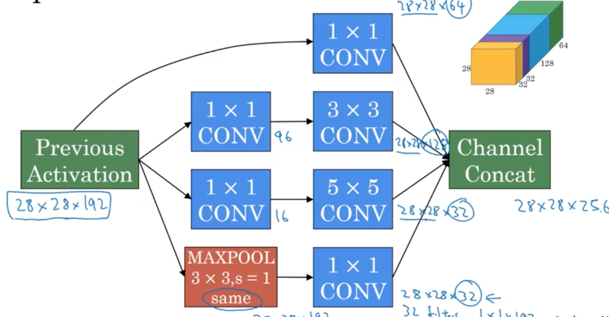
    </p>
    Inception network stackes several of these inception modules blocks 

    <p align="center">
    
    </p>

    Another feature of architecture in Inception networks is that it output softmax layers a few times (before and other than the final sofmax layer) to ensure the units in the intermediate layers also trained against the labels directly which appears to have a regularization effect as well.


- **VGG-16**. The runner-up in ILSVRC 2014 was the network from Karen Simonyan and Andrew Zisserman that became known as the VGGNet. Its main contribution was in showing that the depth of the network is a critical component for good performance. Their final best network contains 16 CONV/FC layers and, appealingly, features an extremely homogeneous architecture that only performs 3x3 convolutions and 2x2 pooling, with stride 1 or 2 from the beginning to the end. So it simplfied the archhitecture. Their pretrained model is available for plug and play use in Caffe. A downside of the VGGNet is that it is more expensive to evaluate and uses a lot more memory and parameters (138M). Dimension width x height keeps decreasing but the depth of filters decreases and then increases. Most of these parameters are in the first fully connected layer, and it was since found that these FC layers can be removed with no performance downgrade, significantly reducing the number of necessary parameters.

    Lets break down the VGGNet in more detail as a case study. The whole VGGNet is composed of CONV layers that perform 3x3 convolutions with stride 1 and pad 1, and of POOL layers that perform 2x2 max pooling with stride 2 (and no padding). We can write out the size of the representation at each step of the processing and keep track of both the representation size and the total number of weights:

    ```
    INPUT: [224x224x3]        memory:  224*224*3=150K   weights: 0
    CONV3-64: [224x224x64]  memory:  224*224*64=3.2M   weights: (3*3*3)*64 = 1,728
    CONV3-64: [224x224x64]  memory:  224*224*64=3.2M   weights: (3*3*64)*64 = 36,864
    POOL2: [112x112x64]  memory:  112*112*64=800K   weights: 0
    CONV3-128: [112x112x128]  memory:  112*112*128=1.6M   weights: (3*3*64)*128 = 73,728
    CONV3-128: [112x112x128]  memory:  112*112*128=1.6M   weights: (3*3*128)*128 = 147,456
    POOL2: [56x56x128]  memory:  56*56*128=400K   weights: 0
    CONV3-256: [56x56x256]  memory:  56*56*256=800K   weights: (3*3*128)*256 = 294,912
    CONV3-256: [56x56x256]  memory:  56*56*256=800K   weights: (3*3*256)*256 = 589,824
    CONV3-256: [56x56x256]  memory:  56*56*256=800K   weights: (3*3*256)*256 = 589,824
    POOL2: [28x28x256]  memory:  28*28*256=200K   weights: 0
    CONV3-512: [28x28x512]  memory:  28*28*512=400K   weights: (3*3*256)*512 = 1,179,648
    CONV3-512: [28x28x512]  memory:  28*28*512=400K   weights: (3*3*512)*512 = 2,359,296
    CONV3-512: [28x28x512]  memory:  28*28*512=400K   weights: (3*3*512)*512 = 2,359,296
    POOL2: [14x14x512]  memory:  14*14*512=100K   weights: 0
    CONV3-512: [14x14x512]  memory:  14*14*512=100K   weights: (3*3*512)*512 = 2,359,296
    CONV3-512: [14x14x512]  memory:  14*14*512=100K   weights: (3*3*512)*512 = 2,359,296
    CONV3-512: [14x14x512]  memory:  14*14*512=100K   weights: (3*3*512)*512 = 2,359,296
    POOL2: [7x7x512]  memory:  7*7*512=25K  weights: 0
    FC: [1x1x4096]  memory:  4096  weights: 7*7*512*4096 = 102,760,448
    FC: [1x1x4096]  memory:  4096  weights: 4096*4096 = 16,777,216
    FC: [1x1x1000]  memory:  1000 weights: 4096*1000 = 4,096,000
    ```

    TOTAL memory: 24M * 4 bytes ~= 93MB / image (only forward! ~*2 for bwd)

    TOTAL params: 138M parameters

    As is common with Convolutional Networks, notice that most of the memory (and also compute time) is used in the early CONV layers, and that most of the parameters are in the last FC layers. In this particular case, the first FC layer contains 100M weights, out of a total of 138M.

- **ResNet**. Residual Network developed by Kaiming He et al. was the winner of ILSVRC 2015. It features special **skip connections** and a heavy use of **batch normalization**. The architecture is also missing fully connected layers at the end of the network. The reader is also referred to Kaiming’s presentation (video, slides), and some recent experiments that reproduce these networks in Torch. ResNets are currently by far the state of the art Convolutional Neural Network models and are the default choice for using ConvNets in practice (as of May 10, 2016). In particular, also see more recent developments that tweak the original architecture from Kaiming He et al. Identity Mappings in Deep Residual Networks (published March 2016). An interesting feature in ResNet is **Residual Block** design which is the output of layer l (which is the input of layer $\ell+1$) is added to the linear part of  layer $\ell+2$. If dimensions of the two are not equal, multiply it with a matrix of appropriate size  with entries to be learnt during training.
  
  $$z^{[l+2]} + wa^{[l]}$$ 
  
  where $w=1$ if dimension of a and z are the same before applying its non-linearity relu. 

<p align="center">
    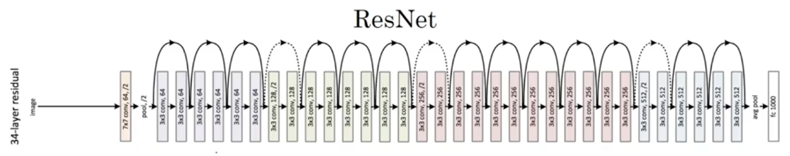
</p>

This is called a shortcut because layer $\ell+1$ is totally skipped (skip connection). The authors realized that using *residual blocks allow training much deeper nets if they are stacked*. This trick can strenthen the backprop gradient signal so convergence is stronger and reduce the loss for much longer interations. 


## Computational Considerations

The largest bottleneck to be aware of when constructing ConvNet architectures is the **memory bottleneck**. Many modern GPUs have a limit of 3/4/6GB memory, with the best GPUs having about 12GB of memory. There are three major sources of memory to keep track of:

- From the intermediate volume sizes: These are the raw number of activations at every layer of the ConvNet, and also their gradients (of equal size). Usually, most of the activations are on the earlier layers of a ConvNet (i.e. first Conv Layers). These are kept around because they are needed for backpropagation, but a clever implementation that runs a ConvNet only at test time could in principle reduce this by a huge amount, by only storing the current activations at any layer and discarding the previous activations on layers below.

- From the parameter sizes: These are the numbers that hold the network parameters, their gradients during backpropagation, and commonly also a step cache if the optimization is using momentum, Adagrad, or RMSProp. Therefore, the memory to store the parameter vector alone must usually be multiplied by a factor of at least 3 or so.

- Every ConvNet implementation has to maintain miscellaneous memory, such as the image data batches, perhaps their augmented versions, etc.

Once you have a rough estimate of the total number of values (for activations, gradients, and misc), the number should be converted to size in GB. Take the number of values, multiply by 4 to get the raw number of bytes (since every floating point is 4 bytes, or maybe by 8 for double precision), and then divide by 1024 multiple times to get the amount of memory in KB, MB, and finally GB. If your network doesn’t fit, a common heuristic to “make it fit” is to decrease the batch size, since most of the memory is usually consumed by the activations.


## Transfer Learning

In practice, very few people train an entire Convolutional Network from scratch (with random initialization), because it is relatively rare to have a dataset of sufficient size. Instead, it is common to pretrain a ConvNet on a very large dataset (e.g. ImageNet, which contains 1.2 million images with 1000 categories), and then use the ConvNet either as an _initialization_ or _a fixed feature extractor_ for the task of interest. The three major Transfer Learning scenarios look as follows:

1. **ConvNet as fixed feature extractor**: 

    - Take a ConvNet pretrained on ImageNet
    - Remove the last fully-connected layer (this layer’s outputs are the 1000 class scores for a different task like ImageNet)
    - Treat the rest of the ConvNet as a fixed feature extractor for the new dataset 

    In an AlexNet, this would compute a 4096-D vector for every image that contains the activations of the hidden layer immediately before the classifier. We call these **features CNN codes**. It is important for performance that these codes are ReLUd (i.e. thresholded at zero) if they were also thresholded during the training of the ConvNet on ImageNet (as is usually the case). Once you extract the 4096-D codes for all images, train a linear classifier (e.g. Linear SVM or Softmax classifier) for the new dataset.

2. **Fine-tuning the ConvNet**: The second strategy is to not only replace and retrain the classifier on top of the ConvNet on the new dataset, but to also fine-tune the weights of the pretrained network by continuing the backpropagation. It is possible to fine-tune all the layers of the ConvNet, or it’s possible to keep some of the earlier layers fixed (due to overfitting concerns) and only fine-tune some higher-level portion of the network. This is motivated by the observation that the earlier features of a ConvNet contain more generic features (e.g. edge detectors or color blob detectors) that should be useful to many tasks, but later layers of the ConvNet becomes progressively more specific to the details of the classes contained in the original dataset. In case of ImageNet for example, which contains many dog breeds, a significant portion of the representational power of the ConvNet may be devoted to features that are specific to differentiating between dog breeds.

3. **Pretrained models**. Since modern ConvNets take 2-3 weeks to train across multiple GPUs on ImageNet, it is common to see people release their final ConvNet checkpoints for the benefit of others who can use the networks for fine-tuning. For example, the Caffe library has a [Model Zoo](https://github.com/BVLC/caffe/wiki/Model-Zoo) where people share their network weights.

When and how to fine-tune? How do you decide what type of transfer learning you should perform on a new dataset? This is a function of several factors, but the two most important ones are the size of the new dataset (small or big), and its similarity to the original dataset (e.g. ImageNet-like in terms of the content of images and the classes, or very different, such as microscope images). Keeping in mind that ConvNet features are more generic in early layers and more original-dataset-specific in later layers, here are some common rules of thumb for navigating the 4 major scenarios:

- New dataset is small and similar to original dataset. Since the data is small, it is not a good idea to fine-tune the ConvNet due to overfitting concerns. Since the data is similar to the original data, we expect higher-level features in the ConvNet to be relevant to this dataset as well. Hence, the best idea might be to train a linear classifier on the CNN codes.

- New dataset is large and similar to the original dataset. Since we have more data, we can have more confidence that we won’t overfit if we were to try to fine-tune through the full network.

- New dataset is small but very different from the original dataset. Since the data is small, it is likely best to only train a linear classifier. Since the dataset is very different, it might not be best to train the classifier form the top of the network, which contains more dataset-specific features. Instead, it might work better to train the SVM classifier from activations somewhere earlier in the network.

- New dataset is large and very different from the original dataset. Since the dataset is very large, we may expect that we can afford to train a ConvNet from scratch. However, in practice it is very often still beneficial to initialize with weights from a pretrained model. In this case, we would have enough data and confidence to fine-tune through the entire network.


### Practical Advice
There are a few additional things to keep in mind when performing Transfer Learning:

- **Constraints from pretrained models**. Note that if you wish to use a pretrained network, you may be slightly constrained in terms of the architecture you can use for your new dataset. For example, you can’t arbitrarily take out Conv layers from the pretrained network. However, some changes are straight-forward: Due to parameter sharing, you can easily run a pretrained network on images of different spatial size. This is clearly evident in the case of Conv/Pool layers because their forward function is independent of the input volume spatial size (as long as the strides “fit”). In case of FC layers, this still holds true because FC layers can be converted to a Convolutional Layer: For example, in an AlexNet, the final pooling volume before the first FC layer is of size [6x6x512]. Therefore, the FC layer looking at this volume is equivalent to having a Convolutional Layer that has receptive field size 6x6, and is applied with padding of 0.

- **Learning Rates**. It’s common to use a smaller learning rate for ConvNet weights that are being fine-tuned, in comparison to the (randomly-initialized) weights for the new linear classifier that computes the class scores of your new dataset. This is because we expect that the ConvNet weights are relatively good, so we don’t wish to distort them _too quickly and too much_ (especially while the new Linear Classifier above them is being trained from random initialization).

- **Data Augmentation**: use _mirroring_, _random cropping_, _rotation_, _sheering_, _color shifting_ (RGB channels), _PCA color augmentation_ to keep the tint controlled. These _distortions_ can be implemented in separate threads during training in each mini batches. In other words, one or more threads become responsible for loading and implementing these distortions in parallel to training. 

- **Open Source**: use the models in open source community usually implemented by the authors of the papers themselves rather than implemnting them yourself from scratch. These resources can be found on GitHub. 


--------------

References:
- [Deep Learning by Ian Goodfellow, Yoshua Bengio, Aaron Courville](https://www.amazon.ca/Deep-Learning-Ian-Goodfellow/dp/0262035618/ref=asc_df_0262035618/?tag=googleshopc0c-20&linkCode=df0&hvadid=706745562943&hvpos=&hvnetw=g&hvrand=4165137193847264239&hvpone=&hvptwo=&hvqmt=&hvdev=c&hvdvcmdl=&hvlocint=&hvlocphy=9000826&hvtargid=pla-416263148149&psc=1&mcid=d1d85934bcd73af29621fd70386e098c&gad_source=1)
- [CS231n: Convolutional Neural Networks for Visual Recognition.](https://cs231n.github.io)
- [Convolutional Neural Netwroks - DeepLearning.AI](https://www.coursera.org/learn/convolutional-neural-networks?specialization=deep-learning)


# Unsupervised Learning: PCA, K-Means, GMM

Many Machine Learning problems involve thousands or even millions of features for each training instance. Not only does this make training extremely slow, it can also make it much harder to find a good solution, as we will see. This problem is often referred to as the **curse of dimensionality**. 


## Curse of Dimensionality

It turns out that many things behave very differently in high-dimensional space. For example, if you pick a random point in a unit square (a 1 × 1 square), it will have only about a 0.4% chance of being located less than 0.001 from a border (in other words, it is very unlikely that a random point will be “extreme” along any dimension). But in a 10,000-dimensional unit hypercube (a 1 × 1 × ⋯ × 1 cube, with ten thousand 1s), this probability is greater than 99.999999%. Most points in a high-dimensional hypercube are very close to the border.3
 
In theory, one solution to the curse of dimensionality could be to increase the size of the training set to reach a sufficient density of training instances. Unfortunately, in practice, the number of training instances required to reach a given density grows exponentially with the number of dimensions.

 An increase in the dimensions means an increase in the number of features. To model such data, we need to increase complexity of the model by increasing the number of parameters. The complexity of functions of many variables can grow exponentially with the dimension, and if we wish to be able to estimate such functions with the same accuracy as function in low dimensions, then we need the size of our training set to grow exponentially as well.

As another simple example, consider a sphere of radius $r = 1$ in a space of D dimensions, and ask what is the fraction of the volume of the sphere that lies between radius $r = 1−ϵ$ and $r = 1$. We can evaluate this fraction by noting that the volume of a sphere of radius $r$ in D dimensions must scale as $r$D, and so we write $V_D(r) = K_D r^D$ where K_D depends on D. Then 

$$
\frac{V_D(1)-V_D(1-\epsilon)}{V_D(1)} = 1 - (1-\epsilon)^D
$$

which tends to 1 ad D increases. Thus, in spaces of high dimensionality, most of the volume of a sphere is concentrated in a thin shell near the surface! Another similar example: in a high-dimensional space, most of the probability mass of a Gaussian is located within a thin shell at a specific radius. Simialrly, most of density for a multivariate unit uniform distribution is consentrated around the sides of the unit box. This leads to sparse sampling in high dimensions that means all sample points are close to an edge of the sample space.

One more example, consider the nearest-neighbor procedure for inputs uniformly distributed in a $d$-dimensional unit hypercube. Suppose we send out a hypercubical neighborhood about a target point to capture a fraction $r$ of the observations. Since this corresponds to a fraction r of the unit volume, the expected edge length will be $e_d(r) = r^{1/d}$. In ten dimensions $e_{10}(0.01) = 0.63$ and $e_{10}(0.1) = 0.80$, while the entire range for each input is only 1.0. So to capture 1% or 10% of the data to form a local average, we must cover 63% or 80% of the range of each input variable. Such neighborhoods are no longer “local”. Reducing $r$ dramatically does not help much either, since the fewer observations we average, the higher is the variance of our fit. 

Although the curse of dimensionality certainly raises important issues for pattern recognition applications, it does not prevent us from finding effective techniques applicable to high-dimensional spaces: 
- First, real data will often be confined to a region of the space having *lower effective dimensionality*, and in particular the directions over which important variations in the target variables occur may be so confined. 
- Second, real data will typically exhibit some smoothness properties (at least locally) so that for the most part small changes in the input variables will produce small changes in the target variables, and so we can exploit local interpolation-like techniques to allow us to make predictions of the target variables for new values of the input variables. For example, consider images captured of identical planar objects on a conveyor belt, in which the goal is to determine their orientation. Each image is a point in a high-dimensional space whose dimensionality is determined by the number of pixels. Because the objects can occur at different positions within the image and in different orientations, there are three degrees of freedom of variability between images, and a set of images will live on a three dimensional manifold embedded within the high-dimensional space.

## Why Reducing Dimensionality?

Fortunately, in real-world problems, it is often possible to reduce the number of features considerably, turning an intractable problem into a tractable one. For example in image data, two neighboring pixels are often highly correlated: if you merge them into a single pixel (e.g., by taking the mean of the two pixel intensities), you will not lose much information!

Reducing dimensionality does lose some information (just like compressing an image to JPEG can degrade its quality), so even though it will speed up training, it may also make your system perform slightly worse. It also makes your pipelines a bit more complex and thus harder to maintain. So you should first try to train your system with the original data before considering using dimensionality reduction if training is too slow. In some cases, however, reducing the dimensionality of the training data may filter out some noise and unnecessary details and thus result in higher performance (but in general it won’t; it will just speed up training). Apart from speeding up training, dimensionality reduction is also extremely useful for data visualization (or DataViz). Reducing the number of dimensions down to two (or three) makes it possible to plot a condensed view of a high-dimensional training set on a graph and often gain some important insights by visually detecting patterns, such as clusters. Moreover, DataViz is essential to communicate your conclusions to people who are not data scientists, in particular decision makers who will use your results.

In dimensionality reduction, we try to learn a mapping to a lower dimensional space that preserves as much information as possible about the input. Dimensionality reduction techniques can save computation/memory, reduce overfitting, help visualize in 2 dimensions.

## Main Approaches for Dimensionality Reduction

- In most real-world problems, training instances are not spread out uniformly across all dimensions. Many features are almost constant, while others are highly correlated. As a result, all training instances actually lie within or close to a much lower-dimensional subspace of the high-dimensional space. **Projection** finds a lower dimensional linear space and projects our data into that space. 

- Many dimensionality reduction algorithms work by modeling the manifold on which the training instances lie; this is called **Manifold Learning**. This approach is based on the assumption  that most real-world high-dimensional datasets lie close to a much lower-dimensional manifold. This assumption is very often empirically observed.


- **t-Distributed Stochastic Neighbor Embedding (t-SNE)** reduces dimensionality while trying to keep similar instances close and dissimilar instances apart. It is mostly used for visualization, in particular to visualize clusters of instances in high-dimensional space.
-  **Linear Discriminant Analysis (LDA)** is actually a classification algorithm, but during training it learns the most discriminative axes between the classes, and these axes can then be used to define a hyperplane onto which to project the data. The benefit is that the projection will keep classes as far apart as possible, so LDA is a good technique to reduce dimensionality before running another classification algorithm such as an SVM classifier.
  

## Linear Dimensionality Reduction (PCA)

**Principal Component Analysis (PCA)** is by far the most popular dimensionality reduction algorithm. First it identifies the hyperplane that lies closest to the data, and then it projects the data onto it. PCA identifies the axes called **Principal Components** that account for the largest amount of variance in the training set. PCA is defined as an orthogonal linear transformation on the feature vectors of a dataset that transforms the data to a new coordinate system such that the transformed feature vectors expand in the *directions of the greatest variances* and they are *uncorrelated*. So how can you find the principal components of a training set? Luckily, there is a standard matrix factorization technique called **Singular Value Decomposition (SVD)** which we will discuss shortly.

Suppose $X$ is a $n\times p$ data matrix of $n$ samples with $p$ features with column-wise zero empirical mean per feature. Otherwise replace rows $\bm x_i$ of $X$ with $\bm x_i - \bm \mu$ where $\bm \mu=1/n\sum_i \bm x_i$. We are looking for an orthonormal $p\times p$ matrix $W$ to change the basis of the space into a new basis representing the directions of maximum variances. The columns of $W$ are the unit basis vectors we are looking for.  Note that the sample variance of data along a unit vector $\bm w$ is $\frac{||X\bm w||^2}{n-1}$. So our first unit basis vector is obtained as follows:

$$
\bm w_1 = \argmax_{\bm w} \frac{||X\bm w||^2}{||\bm w||^2} =   \argmax_{\bm w} \frac{\bm w^T X^T X\bm w}{\bm w^T \bm w} 
$$

A standard result for a positive semidefinite matrix such as $X^TX$ is that the quotient's maximum possible value is the *largest eigenvalue* of the matrix, which occurs when $\bm w$ is the corresponding eigenvector. So $\bm w_1$ is the eigenvector of $X^TX$ corresponding to the largest eigenvalue. To find the second max variance unit basis vector, we repeat the same process for the new data matrix $X'$ whose rows are subtraction od $X$ rows from $\bm w_1$: $X' = X - X\bm w_1\bm w_1^T$ and so on until we find the $p$th vector $\bm w_p$. It turns out that each step gives the remaining eigenvectors of $X^TX$ in the decreasing order of eigenvalues. The basis vectors which are the eigenvectors of $X^TX$ are the principal components. The transformation $X W$ maps a data vector $x_i$ from an original space to a new space of p variables which are uncorrelated over the dataset.

A dimensionality reduction of data $X$ is obtained selecting the first few columns of $XW$ which represent the highest data variations in a smaller feature space of $<p$ dimensions.  For example, keeping only the first two principal components finds the two-dimensional plane through the high-dimensional dataset in which the data is most spread out, so if the data contains clusters these too may be most spread out, and therefore most visible to be plotted out in a two-dimensional diagram; whereas if any two random directions through the data are chosen, the clusters may be much less spread apart from each other, and may in fact be much more likely to substantially overlay each other, making them indistinguishable.

The explained variance ratio of each principal component indicates the proportion of the dataset’s variance that lies along the axis of each principal component. This can be used to choose the number of dimensions that add up to a sufficiently large portion of the variance, say 95%. There will usually be an elbow in the curve, where the explained variance stops growing fast. You can think of this as the intrinsic dimensionality of the dataset.

<p align="center">
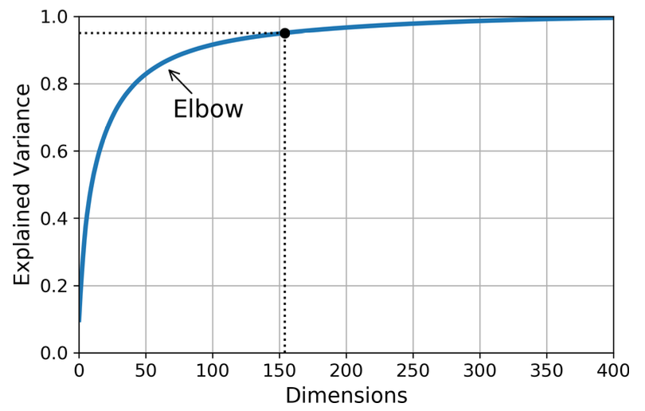
</p>

Similarly, in regression analysis, the larger the number of explanatory variables allowed, the greater is the chance of overfitting the model, producing conclusions that fail to generalize. One approach, especially when there are strong correlations between different possible explanatory variables, is to reduce them to a few principal components and then run the regression against them, a method called _principal component regression_. In machine learning, the orthogonal projection of a data point $\bm x$ onto the subspace $\mathcal S$ spanned by a subset of principal components is the point  $\bm {\tilde x} ∈ \mathcal S$ closest to $\bm x$ and is called the reconstruction of $\bm x$. Choosing a subspace to maximize the projected variance, or minimize the reconstruction error, is called principal component analysis (PCA). 

PCA can be viewed from another point. The matrix $\frac{1}{n-1}X^TX$ itself is the **empirical sample covariance matrix** of the dataset.  By definition, given a sample consisting of $n$ independent observations $\bm x_1,\dots, \bm x_n$ of multivariate random variable $\bm X$, an unbiased estimator of the (p×p) covariance matrix $\Sigma = \mathbb E[(\bm X-\mathbb E[\bm X])(\bm X-\mathbb E[\bm X])^T]$ is the sample covariance matrix

$$
\frac{1}{n-1} \sum_{i=1}^n (\bm x_i - \bm \mu)(\bm x_i - \bm \mu)^T.
$$

Note that every term in the above sum is a $p\times p$ matrix. In our context, this is exactly the matrix $\frac{1}{n-1}X^TX$ in a compact way - recall that WLOG we assumed $\bm \mu = \bm 0$. Here matrix product $A\times B$ is being done in an equivalent way: column $i$ of $A$ is matrix-multiplied by row $i$ of $B$ for every $i$ from 1 to $p$, then add all these matrices to get $A\times B$. 

### Spectral Decomposition: 
A symmetric matrix A has a full set of real eigenvectors, which can be chosen to be orthonormal. This gives a decomposition $A= QΛQ^T$, where $Q$ is orthonormal and $Λ$ is diagonal. The columns of $Q$ are eigenvectors, and the diagonal entries $λ_j$ of $Λ$ are the corresponding eigenvalues. I.e., symmetric matrices are diagonal in some basis. A symmetric matrix A is positive semidefinite iff each $λ_j ≥0$. Being a symmetric, positive semi-definite matrix, $X^TX$ is diagonalizable:

$$
X^TX = W \Lambda W^T
$$

where $\Lambda$ is the diagonal matrix of eigenvalues of $X^TX$. The columns of $W$ are eigenvectors of  $X^TX$ which are also the principal components. Because trace is invariant under the change of basis and since the original diagonal entries in the covariance matrix $X^TX$ are the variances of the features, **the sum of the eigenvalues must also be equal to the sum of the original variances**. In other words, the cumulative proportion of the top $k$ eigenvalue is the "explained variance" of the first $k$ principal components.

### Singular Value Decomposition

The spectral decomposition is a special case of the singular value decomposition, which states that any matrix $A_{m\times n}$ can be expressed as  $A=UΣV$ where  $U_{m \times m}$  and  $V_{n\times n}$ are unitary matrices and $Σ_{m\times n}$ is a diagonal matrix. The principal components transformation can also be associated with another matrix factorization, the **singular value decomposition (SVD)** of $X$,

$$
X = U\Sigma W^T
$$

- $Σ$ is an n-by-p rectangular diagonal matrix of positive numbers, called the singular values of $X$; Only the top-left $r\times r$ block is non-zero; its non-zero diagonal entries are  the square roots of the eigenvalues of $X^TX$ (or $XX^T$ which are the same: $\lambda_i = \sigma^2_i$)

- $U$ is an n-by-n matrix, the columns of which are orthogonal unit vectors of length n called the left singular vectors of $X$ (eigenvectors of $XX^T$)

- $W$ is a p-by-p matrix whose columns are orthogonal unit vectors of length p and called the right singular vectors of $X$ which are the eigenvectors of $X^TX$ and the principal components. 


#### Limitation of PCA

- **Assumes Linearity**: PCA relies on a linear model. If a dataset has a pattern hidden inside it that is nonlinear, then PCA can actually steer the analysis in the complete opposite direction of progress. It cannot capture nonlinear structure, curved manifolds, or class clusters separated in a nonlinear way
  
- **Sensitive to Scaling**: PCA is at a disadvantage if the data has not been standardized before applying the algorithm to it. In fields such as astronomy, all the signals are non-negative, and the mean-removal process will force the mean of some astrophysical exposures to be zero which requires some effort to recover the true magnitude of the signals
 
- **Poor Interpretability**: PCA transforms the original data into data that is relevant to the principal components of that data, but the new data variables cannot be interpreted in the same ways that the originals were. Also PCA assumes the directions with highest variance are the most “informative.” which is not true. Variance might come from noise.

- PCA may not preserve locality. Use t-SNE instead. The t-SNE algorithm was designed to preserve local distances between points in the original space. This means that t-SNE is particularly effective at preserving **clusters** in the original space. The full t-SNE algorithm is quite complex, so we just sketch the ideas here.

## Autoencoders (Advanced PCA) and Nonlinear Dimensionality Reduction

An **autoencoder** is a feed-forward neural net whose job it is to take an input $\bm x$ and predict itself $\bm x$. To make this non-trivial, we need to add a **bottleneck layer** whose dimension is much smaller than the input. Deep nonlinear autoencoders learn to project the data, not onto a subspace, but onto a nonlinear manifold.

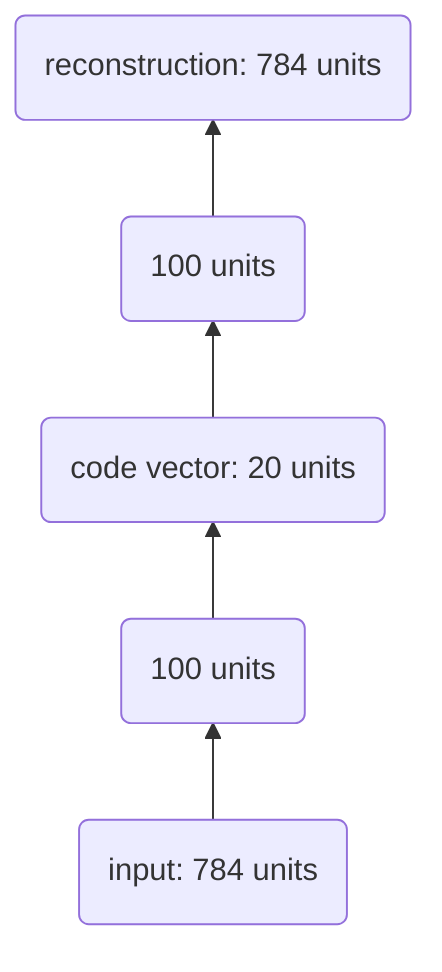
```mermaid
graph BT;
    A(input: 784 units) --> B(100 units) --> C(code vector: 20 units)
    C --> D(100 units) --> E(reconstruction: 784 units)
```
The lower half of the architecture is called **encoder** and the top half is called **decoder**. These autoencoders have non-linear activation functions after every feed-forward layer so they can learn more powerful codes for a given dimensionality, compared with linear autoencoders (PCA)
- Map high-dimensional data to two dimensions for visualization
- Learn abstract features in an unsupervised way so you can apply them to a supervised task (Unlabled data can be much more plentiful than labeled data)

Loss function is naturally $|| \bm x - \bm {\tilde x}||^2$, the sum of square error. It is proven result that the linear autoencoder is equivalent to PCA: If you restrict the autoencoder to:
- Linear activation functions (no ReLU/tanh)
- No bias terms
- Single hidden layer
- Mean-centered input

Then...
 - The autoencoder learn the same subspace as PCA!
- The weights of the encoder/decoder span the space of the top $k$ principal components.

| Property         | PCA                   | Autoencoder                                       |
| ---------------- | --------------------- | ------------------------------------------------- |
| Projection type  | Linear                | Can be nonlinear                                  |
| Reconstruction   | Orthogonal projection | Learned mapping                                   |
| Training         | SVD                   | Gradient descent                                  |
| Noise Handling   | Poor                  | Can use **denoising autoencoders**                |
| Dimensionality   | Fixed                 | Can use **variational AEs**, **sparse AEs**, etc. |


## Unsupervised Learning Techniques: Clustering

Sometimes the data form clusters, where examples within a cluster are similar to each other, and examples in different clusters are dissimilar. Such a distribution is **multimodal**, since it has multiple modes, or regions of high probability mass. Grouping data points into clusters, with no labels, is called **clustering**. Clustering is used in a wide variety of applications, including:

-  **Customer Segmentation**: you can cluster your customers based on their purchases, their activity on your website, and so on. This is useful to understand who your customers are and what they need, so you can adapt your products and marketing campaigns to each segment. For example, this can be useful in recommender systems to suggest content that other users in the same cluster enjoyed.
-  **Data Analysis**: when analyzing a new dataset, it is often useful to first discover clusters of similar instances, as it is often easier to analyze clusters separately.
- **Dimensionality Reduction**: once a dataset has been clustered, it is usually possible to measure each instance’s affinity with each cluster (affinity is any measure of how well an instance fits into a cluster). Each instance’s feature vector x can then be replaced with the vector of its cluster affinities. If there are k clusters, then this vector is k dimensional. This is typically much lower dimensional than the original feature vector, but it can preserve enough information for further processing.
- **Anomaly Detection** (also called outlier detection): any instance that has a low affinity to all the clusters is likely to be an anomaly. For example, if you have clustered the users of your website based on their behavior, you can detect users with unusual behavior, such as an unusual number of requests per second, and so on. Anomaly detection is particularly useful in detecting defects in manufacturing, or for fraud detection.
- **Semi-supervised Learning**: if you only have a few labels, you could perform clustering and propagate the labels to all the instances in the same cluster. This can greatly increase the amount of labels available for a subsequent supervised learning algorithm, and thus improve its performance.
-  **Search Engines**: Some search engines let you search for images that are similar to a reference image. To build such a system, you would first apply a clustering algorithm to all the images in your database: similar images would end up in the same cluster. Then when a user provides a reference image, all you need to do is to find this image’s cluster using the trained clustering model, and you can then simply return all the images from this cluster.
- **Segment Images**: by clustering pixels according to their color, then replacing each pixel’s color with the mean color of its cluster, it is possible to reduce the number of different colors in the image considerably. This technique is used in many object detection and tracking systems, as it makes it easier to detect the contour of each object.
  

###  K-Means

K-means is a famous hard clustering algorithm.  Assume the data $\bm x_1, \dots, \bm x_N$ lives in a Euclidean space, $\bm x_n ∈ \mathbb R^d$. Assume the data belongs to K classes (patterns), the data points from same class are similar, i.e. close in Euclidean distance. How can we identify those classes (data points that belong to each class)? K-means assumes there are K clusters, and each point is close to its cluster center (the mean of points in the cluster). If we knew the cluster assignment we could easily compute means. If we knew the means we could easily compute cluster assignment. 

For each data point $x_n$, we introduce a corresponding set of binary indicator variables $r_{nk} ∈ \{0, 1\}$, where $k =$ 1, . . . , K describing which of the K clusters the data point $x_n$ is assigned to, so that if data point $x_n$ is assigned to cluster k then $r_{nk} = 1$, and $r_{nj} = 0$ for $j \ne k$. We can then define an objective function,

$$
J=\sum_{n=1}^N\sum_{k=1}^K r_{nk} ||\bm x_n - \bm \mu_k||^2
$$

which represents the sum of the squares of the distances of each data point to its assigned vector $\bm \mu_k$. Our goal is to find values for the $r_{nk}$ and the $\bm \mu_k$ so as to minimize $J$.  We can do this through an iterative procedure in which each iteration involves two successive steps: 

 >First we choose some random initial values for the $\bm \mu_k$ (better if it is one of the points in the set). Then in the first phase we minimize $J$ with respect to the $r_{nk}$, keeping the $\bm \mu_k$ fixed. In the second phase we minimize $J$ with respect to the $\bm \mu_k$, keeping $r_{nk}$ fixed. 

<br> 

This two-stage optimization is then repeated until convergence. We shall see that these two stages of updating $r_{nk}$ and updating $\bm \mu_k$ correspond respectively to the E (expectation) and M (maximization) steps of the EM algorithm. Because $J$ is a linear function of $r_{nk}$, this optimization can be performed easily to give a closed form solution:

$$
r_{nk} =
\begin{cases}
1 &\text{if $k = \argmin_j ∥\bm x_n− \bm \mu_j∥^2$} \\
0 & \text{otherwise}
\end{cases}
$$

Now consider the optimization of the $\bm \mu_k$ given $r_{nk}$ which is an easy solution:

$$
\bm \mu_k = \frac{\sum_n r_{nk} \bm x_n}{\sum_n r_{nk}}
$$

The denominator in this expression is equal to the number of points assigned to cluster $k$. For this reason, the procedure is known as the K-means algorithm. K-Means can also be seen as a matrix factorization like PCA
$$
\min_{R} || X- RM||^2
$$

where $R$ is cluster assignment and $M$ are centroids. In K-means, each cluster forms a **Voronoi cell**: region closest to that centroid. The decision boundaries between clusters are linear — K-Means assumes spherical, equally sized clusters in Euclidean space. The K-means algorithm is based on the use of squared Euclidean distance as the measure of dissimilarity between a data point and a prototype vector. Not only does this limit the type of data variables that can be considered (it would be inappropriate for cases where some or all of the variables represent categorical labels for instance), but it can also make the determination of the cluster means nonrobust to outliers. We can generalize the K-means algorithm by introducing a more general dissimilarity measure between two vectors $\bm x$ and $\bm x'$. *K-means is sensetive to outliers as they can shift the mean significantly*. Use Robust alternatives (e.g., K-Medoids) by choosing a more approriate dissimilarity measure. 

Whenever an assignment is changed, the sum squared distances $J$ of data points from their assigned cluster centers is reduced. The objective $J$ is non-convex (so coordinate descent on $J$ is not guaranteed to converge to the global minimum - NP-hard, but Lloyd’s gives local optima.)  *Unfortunately, although the algorithm is guaranteed to converge, it may not converge to the right solution (i.e., it may get stuck at local minima): this depends on the centroid initialization*. 

<p align="center">
    
</p>

We could try non-local split-and-merge moves: simultaneously merge two nearby clusters and split a big cluster into two.  The general solution is to run the algorithm multiple times with different random initializations and keep the best solution. To select the number of cluster, you may use the elbow curve on k-means loss or  the mean **silhouette coefficient** over all the instances. An instance’s silhouette coefficient is equal to 

$$
\frac{b \; – \; a}{\max(a, b)}
$$ 

where $a$ is the mean distance to the other instances in the same cluster (it is the mean intra-cluster distance), and $b$ is the mean nearest-cluster distance, that is the mean distance to the instances of the next closest cluster (defined as the one that minimizes $b$, excluding the instance’s own cluster). The silhouette coefficient can vary between -1 and +1: $a$ coefficient close to +1 means that the instance is well inside its own cluster and far from other clusters, while a coefficient close to 0 means that it is close to a cluster boundary, and finally a coefficient close to -1 means that the instance may have been assigned to the wrong cluster. An even more informative visualization is obtained when you plot every instance’s silhouette coefficient, sorted by the cluster they are assigned to and by the value of the coefficient. This is called a *silhouette diagram*:

<p align="center">
    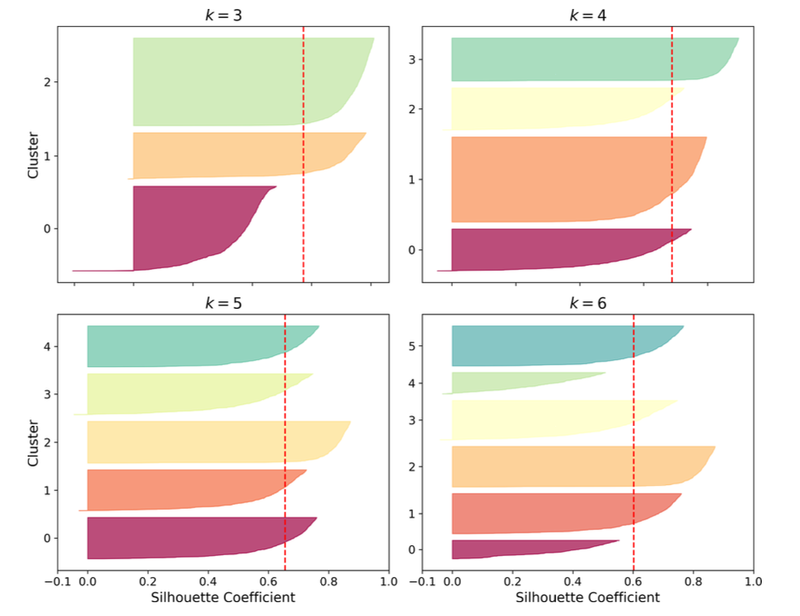
</p>


As the figure above shows, when k=5, all clusters have similar sizes, so even though the overall silhouette score from k=4 is slightly greater than for k=5, it seems like a good idea to use k=5 to get clusters of similar sizes. K-Means does not behave very well when the clusters have varying sizes, different densities, or non-spherical shapes. For example, the following figure shows how K-Means clusters a dataset containing three ellipsoidal clusters of different dimensions, densities and orientations:

<p align="center">
    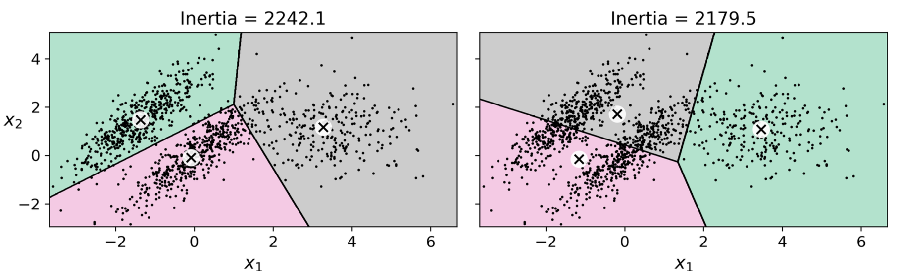
</p>

It is important to **scale the input features** before you run K-Means, or else the clusters may be very stretched, and K-Means will perform poorly. Scaling the features does not guarantee that all the clusters will be nice and spherical, but it generally improves things. You can also think of K-means as some sort of compression: every point is replaced by its cluster centroid.


### Mixtures of Gaussians

A Gaussian mixture model (GMM) is a probabilistic model that assumes that the instances were generated from a mixture of several Gaussian distributions whose parameters are unknown. All the instances generated from a single Gaussian distribution form a cluster that typically looks like an ellipsoid. Each cluster can have a different ellipsoidal shape, size, density and orientation. It is a generative model, meaning you can actually sample new instances from it. There are several GMM variants: in the simplest variant, implemented in the GaussianMixture class, you must know in advance the number $k$ of Gaussian distributions.

We now turn to a formulation of Gaussian mixtures in terms of discrete latent variables. This will provide us with a deeper insight into this important distribution, and will also serve to motivate the expectation-maximization algorithm. Gaussian mixture distribution can be written as a linear superposition of Gaussians in the form

$$
p(\bm x) = \sum_{k=1}^K π_k \mathcal{N}(\bm x \mid \bm {\mu}_k,  \Sigma_k)
$$

<p align="center">
    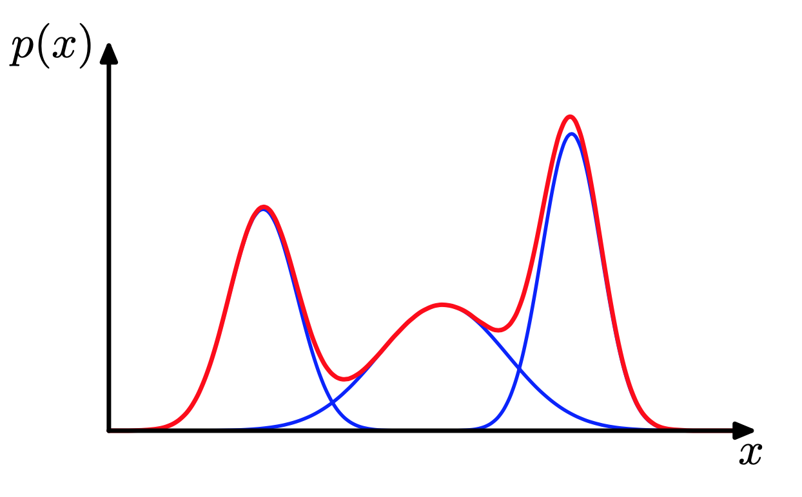
</p>

Let variable $\bm z$ having a 1-of-K representation in which a particular element $z_k$ is equal to 1 and all other elements are equal to 0. We shall define the joint distribution $p(\bm x, \bm z)$ in terms of a marginal distribution $p(\bm z)$ and a conditional distribution $p(\bm x\mid \bm z)$. The marginal distribution over $\bm z$ is $p(z_k = 1) = π_k$ where $\sum_k π_k = 1$. Because $\bm z$ uses a 1-of-K representation (remember, one and only one $z_k$ can be 1), we can also write this distribution in the form 

$$
p(\bm z) = \prod_k π_k^{z_k}
$$

Also, we have the conditional probability:

$$
p(\bm x \mid z_k = 1) = \mathcal N (\bm x \mid \bm {\mu}_k,  Σ_k)
$$

The joint distribution is given by $p(\bm z)p(\bm x\mid \bm z)$, and the marginal distribution of $\bm x$ is then obtained by summing the joint distribution over all possible states of $\bm z$ to give

$$
p(\bm x) = \sum_{\bm z} p(\bm z)p(\bm x\mid \bm z) = \sum_k π_k \mathcal{N}(\bm x \mid \bm {\mu}_k,  \Sigma_k)
$$

For every observation $\bm x_n$, there is a corresponding latent variable $\bm z_n$. Another quantity that will play an important role is the conditional probability of $p(\bm z\mid \bm x)$, whose value can be found using Bayes’ theorem:

$$
p(z_k=1 \mid x) = \frac{π_k \mathcal N(\bm x \mid \bm \mu_k, \Sigma_k)}{\sum_j π_j \mathcal{N}(\bm x \mid \bm {\mu}_j,  \Sigma_j)}
$$

Suppose we have a dataset of observations $\{\bm x_1, . . . , \bm x_N \}$, and we wish to model this data using a mixture of Gaussians. We can represent this dataset as an $N \times D$ matrix $X$ in which the nth row is given by $\bm x^T$. Similarly, the corresponding latent variables will be denoted by an $N × K$ matrix $Z$ with rows $\bm z_n^T$. If we assume that the data points are drawn independently from the distribution, then we can express the Gaussian mixture model for this i.i.d. dataset. The log of the likelihood function is given by

$$
\ln p(X \mid \bm π, \bm \mu, Σ) = \sum_{n=1}^N \ln \sum_{k=1}^K π_k \mathcal N (x_n \mid \bm µ_k, Σ_k).
$$

Maximizing the above log likelihood function turns out to be a more complex problem than for the case of a single Gaussian. The difficulty arises from the presence of the summation over k that appears inside the logarithm, so that the logarithm function no longer acts directly on the Gaussian. If we set the derivatives of the log likelihood to zero, we will no longer obtain a closed form solution. This summation affect could create a singularity in the process of maximization. This can occur when a Guassian collapses to a point. Assume $Σ_k = σ^2_k\bm I$ and $\bm \mu_j = \bm x_n$ for some value $n$. This data point contribute a term in the likelihood function of the form:

$$
\mathcal N (x_n \mid \bm x_n, σ^2_j\bm I) = \frac{1}{(2π)^{1/2}\sigma_j}
$$

If $\sigma_j \rightarrow 0$, then we see that this term goes to infinity and so the log likelihood function will also go to infinity. Thus the maximization of the log likelihood function is not a well posed problem because such singularities will always be present. Recall that this problem did not arise in the case of a single Gaussian distribution. However if a single Gaussian collapses onto a data point it will contribute multiplicative factors to the likelihood function arising from the other data points and these factors will go to zero exponentially fast, giving an overall likelihood that goes to zero rather than infinity. However, once we have (at least) two components in the mixture, one of the components can have a finite variance and therefore assign  finite probability to all of the data points while the other component can shrink onto one specific data point and thereby contribute an ever increasing additive value to the log likelihood. By data-complete we mean that for each observation in $X$, we were told the corresponding value of the latent variable $Z$. We shall call $\{X, Z\}$ the complete dataset, and we shall refer to the actual observed data $X$ as incomplete. Now consider the problem of maximizing the likelihood for the complete dataset $\{X, Z\}$. This likelihood function takes the form 

$$
p(X, Z \mid \mu, Σ, π) = p(X\mid Z, \mu, Σ, π) p(Z)  = \prod_{n=1}^N \prod_{k=1}^K π_k^{z_{nk}} \mathcal N(\bm x_n \mid \bm \mu_k, \Sigma_k)^{z_{nk}}
$$

where $z_{nk}$ denotes the kth component of $z_n$. Taking the logarithm, we obtain

$$
\ln p(X, Z \mid \mu, Σ, π) =  \sum_{n=1}^N \sum_{k=1}^K z_{nk} \Big( \ln π_k + \ln \mathcal N(\bm x_n \mid \bm \mu_k, \Sigma_k) \Big)
$$

with constraint $\sum_k π_k = 1$. The maximization with respect to a mean or a covariance is exactly as for a single Gaussian, except that it involves only the subset of data points that are ‘assigned’ to that component. For the maximization with respect to the mixing coefficients, again, this can be enforced using a Lagrange multiplier as before, and leads to the result

$$
π_k = \frac{1}{N} \sum_{n=1}^N z_{nk}
$$

So the complete-data log likelihood function can be maximized trivially in closed form. In practice, however, we do not have values for the latent variables. Our state of knowledge of the values of the latent variables in $Z$ is given only by the posterior distribution $p(Z|X, θ)$, in this case $p(Z\mid X, \mu, Σ, π) $. 

$$
p(Z \mid X, \mu, Σ, π) \propto p(X\mid Z, \mu, Σ, π) p(Z)  = \prod_{n=1}^N \prod_{k=1}^K π_k^{z_{nk}} \mathcal N(\bm x_n \mid \bm \mu_k, \Sigma_k)^{z_{nk}}
$$

Because we cannot use the complete-data log likelihood $\ln p(X, Z \mid \mu, Σ, π)$, we consider instead _its expected value under the posterior distribution of the latent variable to be maximized (according to EM algorithm)_:

$$
\begin{align*}
 \mathbb E_Z[ \ln p(X, Z \mid \mu, Σ, π)] & = \mathbb E_Z\Big[ \sum_{n=1}^N \sum_{k=1}^K z_{nk} \Big( \ln π_k + \ln \mathcal N(\bm x_n \mid \bm \mu_k, \Sigma_k) \Big)\Big]\\
 & = \sum_{n=1}^N \sum_{k=1}^K \mathbb E[z_{nk}] \Big( \ln π_k + \ln \mathcal N(\bm x_n \mid \bm \mu_k, \Sigma_k) \Big) \\
  & = \sum_{n=1}^N \sum_{k=1}^K \mathbb \gamma(z_{nk}) \Big( \ln π_k + \ln \mathcal N(\bm x_n \mid \bm \mu_k, \Sigma_k) \Big)
 \end{align*}
$$

Because

$$
p(z_k=1 \mid x) = \mathbb E[z_{nk}] = \frac{π_k \mathcal N(\bm x \mid \bm \mu_k, \Sigma_k)}{\sum_j π_j \mathcal{N}(\bm x \mid \bm {\mu}_j,  \Sigma_j)} = \gamma(z_{nk})
$$

according to Bayes' Theorem. According to EM algorithm, first we choose some initial values for the parameters $\mu_{\text{old}}$, $\Sigma_{\text{old}}$, $π_{\text{old}}$, and use these to evaluate the responsibilities $\gamma(z_{nk})$ (the E step) from the previous equation. We then keep the responsibilities fixed and maximize the expectation mentioned above with respect to $µ_k$, $Σ_k$ and $π_k$ (the M step). This leads to closed form solutions for $\mu_{\text{new}}$, $\Sigma_{\text{new}}$, $π_{\text{new}}$:

$$
\begin{align*}
\bm \mu_{\text{new}}^k & = \frac{1}{N_k} \sum_{n=1}^N  \gamma(z_{nk})  \bm x_n\\
 \Sigma_{\text{new}}^k & = \frac{1}{N_k} \sum_{n=1}^N  \gamma(z_{nk})  (\bm x_n - \bm \mu_{\text{new}}^k) (\bm x_n - \bm \mu_{\text{new}}^k)^T \\
  π_{\text{new}} & =  \frac{N_k}{N}
 \end{align*}
$$

where $N_k = \sum_{n=1}^N  \gamma(z_{nk})$. Evaluate the log likelihood

$$
\ln p(X \mid \bm π, \bm \mu, Σ) = \sum_{n=1}^N \ln \sum_{k=1}^K π_k \mathcal N (x_n \mid \bm µ_k, Σ_k).
$$

and check for convergence of either the parameters or the log likelihood. 

<p align="center">
    
</p>

If we knew the parameters $θ= \{π_k ,µ_k ,Σ_k \}$, we could infer which component a data point $\bm x$ probably belongs to by inferring its latent variable $\bm z_i$. This is just posterior inference, which we do using Bayes’ Rule:

$$
p(z_{k} \mid \bm x) = \frac{p(z_k)p(\bm x \mid z_k)}{\sum_k p(z_k)p(\bm x \mid z_k)}
$$

Just like Naive Bayes, GDA (meaning LDA amd QDA), etc. at test time.


We use EM for GMMs instead of GD because the objective involves latent variables (unobserved cluster assignments), making direct optimization via gradient descent intractable. EM is a closed-form, coordinate ascent method tailored for problems with hidden structure. Using gradient descent directly for 

$$
\ln p(X \mid \bm π, \bm \mu, Σ) = \sum_{n=1}^N \ln \sum_{k=1}^K π_k \mathcal N (x_n \mid \bm µ_k, Σ_k).
$$

is very messy gradient. Each point $\bm x_n$ could have come from any of K Gaussians, and we don’t know which. There is no closed-form gradient for mixture weights $π_k$ plus they should meet constraints (sum to 1) as well as covariance matrix contraint which makes derivatives expensive and complicated to compute. The solution of the above equation is invarient to permutation of parameters so its not a convex optimization just like neural networks. EM solves this neatly by using posterior probabilities as soft assignments and Turning the hard likelihood into an expected complete-data log-likelihood, which can be optimized in closed form.
​	
Unfortunately, just like K-Means, EM can end up converging to poor solutions, so it needs to be run several times, keeping only the best solution. When there are many dimensions, or many clusters, or few instances, EM can struggle to converge to the optimal solution. You might need to reduce the difficulty of the task by limiting the number of parameters that the algorithm has to learn: one way to do this is to limit the range of shapes and orientations that the clusters can have. This can be achieved by imposing constraints on the covariance matrices. 

The computational complexity of training a GaussianMixture model depends on the number of instances $m$, the number of dimensions $n$, the number of clusters $k$, and the constraints on the covariance matrices. If covariance_type is "spherical or "diag", it is $\mathcal O(kmn)$, assuming the data has a clustering structure. If covariance_type is "tied" or "full", it is $\mathcal O(kmn^2 + kn^3)$, so it will not scale to large numbers of features.
 
Using a Gaussian mixture model for anomaly detection is quite simple: _any instance located in a low-density region can be considered an anomaly_. You must define what density threshold you want to use. Gaussian mixture models try to fit all the data, including the outliers, so if you have too many of them, this will bias the model’s view of “normality”: some outliers may wrongly be considered as normal. If this happens, you can try to fit the model once, use it to detect and remove the most extreme outliers, then fit the model again on the cleaned up dataset. Another approach is to use robust covariance estimation methods.


### The General EM Algorithm

Given a joint distribution $p(X, Z \mid θ)$ over observed variables $X$ and latent variables $Z$, governed by parameters $θ$, the goal is to maximize the likelihood function $p(X\mid θ)$ with respect to $θ$.

1. Choose an initial setting for the parameters $\theta_{\text{old}}$.
2. **E step**: Evaluate $p(Z\mid X, \theta_{\text{old}})$.
3. **M step**: Evaluate $\theta_{\text{new}}$ given by
   $$ \theta_{\text{new}} = \argmax_{\theta} \mathcal Q(θ, \theta_{\text{old}}) $$
   where $$ \mathcal Q(θ, \theta_{\text{old}}) = \sum_Z p(Z\mid X, \theta_{\text{old}}) \ln p(X,Z\mid \theta)$$
4. Check for convergence of either the log likelihood or the parameter values. If the convergence criterion is not satisfied, then let $$ \theta_{\text{old}} \leftarrow \theta_{\text{new}}$$
 and return to step II.


### Relation to K-means
Comparison of the K-means algorithm with the EM algorithm for Gaussian mixtures shows that there is a close similarity. Whereas the K-means algorithm performs a _hard_ assignment of data points to clusters, in which each data point is associated uniquely with one cluster, the EM algorithm makes a soft assignment based on the posterior probabilities. In fact, we can derive the K-means algorithm as a particular limit of EM for Gaussian mixtures just like a soft version of K-means, with fixed priors and covariance. **GMM reduces to K-Means if all Gaussians have identical spherical covariances and assignments are hard**. See [Pattern Recognition and Machine Learning](https://www.microsoft.com/en-us/research/wp-content/uploads/2006/01/Bishop-Pattern-Recognition-and-Machine-Learning-2006.pdf), p443.


###  Bayesian Gaussian Mixture Models

Rather than manually searching for the optimal number of clusters, it is possible to use instead the BayesianGaussianMixture class which is capable of giving weights equal (or close) to zero to unnecessary clusters. Just set the number of clusters n_com ponents to a value that you have good reason to believe is greater than the optimal number of clusters (this assumes some minimal knowledge about the problem at hand), and the algorithm will eliminate the unnecessary clusters automatically.

```python
from sklearn.mixture import BayesianGaussianMixture
bgm = BayesianGaussianMixture(n_components=10, n_init=10, random_state=42)
bgm.fit(X)
np.round(bgm.weights_, 2)
```
<br>

```o
array([0.4 , 0.21, 0.4 , 0. , 0. , 0. , 0. , 0. , 0. , 0. ])
```

Perfect: the algorithm automatically detected that only 3 clusters are needed. In this model, the cluster parameters (including the weights, means and covariance matrices) are not treated as fixed model parameters anymore, but as latent random variables, like the cluster assignments.

Prior knowledge about the latent variables $\bm z$ can be encoded in a probability distribution $p(\bm z)$ called the prior. For example, we may have a prior belief that the clusters are likely to be few (low concentration), or conversely, that they are more likely to be plentiful (high concentration). This can be adjusted using the `weight_concentration_prior` hyperparameter. However, the more data we have, the less the priors matter. In fact, to plot diagrams with such large differences, you must use very strong priors and little data.


### The EM Algorithm: Why it Works

The expectation maximization algorithm, or EM algorithm, is a general technique for finding maximum likelihood solutions for probabilistic models having latent variables (Dempster et al., 1977; McLachlan and Krishnan, 1997). The goal of the EM algorithm is to find maximum likelihood solutions for models having latent variables like our situation here. The set of all model parameters is denoted by $θ$, and so the log likelihood function is given by

$$
\ln p(X \mid \theta) = \ln \sum_Z p(X,Z \mid \theta)
$$

A key observation is that the summation over the latent variables appears inside the logarithm. The presence of the sum prevents the logarithm from acting directly on the joint distribution, resulting in complicated expressions for the maximum likelihood solution. 

Consider a probabilistic model in which we collectively denote all of the observed variables by X and all of the hidden variables by Z. The joint distribution $p( X, Z|θ)$ is governed by a set of parameters denoted $θ$. Our goal is to maximize the likelihood function that is given by

$$
p(X\mid θ) = \sum_{Z} p(X, Z|θ).
$$

Here we are assuming Z is discrete, although the discussion is identical if Z comprises continuous variables or a combination of discrete and continuous variables, with summation replaced by integration as appropriate. We shall suppose that direct optimization of $p(X|θ)$ is difficult, but that optimization of the complete-data likelihood function $p(X, Z|θ)$ is significantly easier.  As mentioned before, in practice we are not given the complete dataset $\{X, Z\}$, but only the incomplete data $X$. Our state of knowledge of the values of the latent variables in $Z$ is given only by the posterior distribution $p(Z|X, θ)$. Because we cannot use the complete-data log likelihood, we consider instead its expected value under distribution of the latent variable, which corresponds (as we shall see) to the E step of the EM algorithm. Next we introduce a distribution $q(Z)$ defined over the latent variables.

$$
\begin{align*}
\ln p(X\mid θ) & = \sum_Z q(Z) \ln p(X\mid θ) \\ 
& = \sum_Z q(Z) \ln  \frac{p(X,Z\mid \theta)}{p(Z\mid X, \theta)} \\
& = \sum_Z q(Z) \ln  \frac{\frac{p(X,Z\mid \theta)}{q(Z)}}{\frac{p(Z\mid X, \theta)}{q(Z)}} \\
& = \sum_Z q(Z)  \ln \frac{p(X,Z\mid \theta)}{q(Z)} - \sum_Z q(Z)\ln \frac{p(Z\mid X, \theta)}{q(Z)}
\end{align*}
$$

The first term is named $\mathcal L(q, \theta) $ and the second term is  $KL(q \parallel p)$ is the **Kullback-Leibler divergence** between $q(Z)$ and the posterior distribution $p(Z|X, θ)$. So we obtain the decomposition:

$$
\begin{equation*}
 \ln p(X\mid θ) = \mathcal L(q, \theta) + \text{KL}(q\parallel p) \tag{\ddag} 
\end{equation*}
$$


Recall that the Kullback-Leibler divergence satisfies $KL(q \parallel p) \ge 0$, with equality if, and only if, $q(Z) = p(Z \mid X, θ)$. It therefore follows from the above equation that $\mathcal L(q, θ) \le \ln p(X|θ) \;\; \forall q, \theta $, in other words that $\mathcal L(q, \theta) $ is a lower bound on $\ln p(X|θ)$. 

The EM algorithm is a two-stage iterative optimization technique for finding maximum likelihood solutions. We can use the above decomposition to define the EM algorithm and to demonstrate that it does indeed maximize the log likelihood. Suppose that the current value of the parameter vector is $θ_\text{old}$. 
- In the E step, the lower bound $\mathcal L(q, θ_\text{old})$ is maximized with respect to $q(Z)$ while holding $θ_\text{old}$ fixed. The solution to this maximization problem is easily seen by noting that in equation ($\ddag$), the value of $\ln p(X\mid θ_\text{old})$ does not depend on $q(Z)$ (constant w.r.t $q(Z)$) and so the largest value of $\mathcal L(q, θ_\text{old})$ will occur when the Kullback-Leibler divergence is minimized (i.e. vanishes), in other words when $q(Z)$ is equal to the posterior distribution $p(Z\mid X, θ_\text{old})$  in which case, the lower bound will equal the log likelihood $\ln p(X|θ)$.
- In the subsequent M step, the distribution $q(Z)$ is held fixed and the lower bound $\mathcal L(q, θ)$ is maximized with respect to $θ$ to give some new value $θ_\text{new}$. This will cause the lower bound to increase (unless it is already at a maximum), which will necessarily cause the corresponding log likelihood function to increase. Because the distribution q is determined using the old parameter values rather than the new values and is held fixed during the $M$ step, it will not equal the new posterior distribution $\mathcal L(q, θ_\text{new})$, and hence there will be a nonzero $\text{KL}$ divergence.

<p align="center">
    
</p>

Substitute $q(Z) = p(Z|X, θ_\text{old})$ into definition of $\mathcal L(q, θ) $, we see that in the M step, the quantity that is being maximized is the expectation of the complete-data log likelihood

$$
\mathcal L(q, θ_\text{old}) = \sum_Z p(Z\mid X, θ_\text{old}) \ln P(X,Z \mid \theta) - \sum_Z p(Z\mid X, θ_\text{old}) \ln P(X,Z \mid θ_\text{old})
$$

where the second term is constant as it is simply the negative entropy of the $q$ distribution and is therefore independent of $θ$. Thus the EM algorithm are increasing the value of a well-defined bound on the log likelihood function and that the complete EM cycle will change the model parameters in such a way as to cause the log likelihood to increase (unless it is already at a maximum, in which case the parameters remain unchanged). 


We can also use the EM algorithm to maximize the posterior distribution $p(θ \mid X)$ for models in which we have introduced a prior $p(θ)$ over the parameters. To see this, we note that as a function of $θ$, we have $p(θ \mid X) = p(θ, X)/p(X)$ and so

$$
\begin{align*}
\ln p(θ\mid X) &= \mathcal L(q, θ) + KL(q\parallel p) + \ln p(θ)− \ln p(X)\\
&\ge \mathcal L(q, θ)  + \ln p(θ)− \ln p(X)\\
&\ge \mathcal L(q, θ)  + \ln p(θ).
\end{align*}
$$

where $\ln p(X)$ is a constant. We can again optimize the right-hand side alternately with respect to $q$ and $θ$. The optimization with respect to $q$ gives rise to the same E-step equations as for the standard EM algorithm, because $q$ only appears in $\mathcal L(q, θ)$. The M-step equations are modified through the introduction of the prior term $\ln p(θ)$, which typically requires only a small modification to the standard maximum likelihood M-step equations.


# Interpreting ML


**Partial dependence plots (PDP)** show the dependence between the objective function (target response) and a set of input features of interest, marginalizing over the values of all other input features (the ‘complement’ features). Intuitively, we can interpret the partial dependence as the expected target response as a function of the input features of interest.

Let $X_s$ be the set of input features of interest (i.e. the features parameter). Assuming the feature are not correlated (are independence), the partial dependence of the response  $f$ at a point  $x_s$ is defined as:

$$
\begin{align*}
\mathbb E_x[f(x_s,x)] & = \int f(x_s, x)  \; p_{X_c\mid X_s}(x)dx \\
& = \int f(x_s, x)  \; p_{X_c}(x)dx\\
& \approx  \frac{1}{n} \sum_{i=1}^n f(x_s, x^{(i)}_c)
\end{align*}
$$

where $n$ is the number of times $X_s = x_s$.  Due to the limits of human perception, the size of the set of input features of interest must be small (usually, one or two) thus the input features of interest are usually chosen among the most important features.

The **permutation feature importance** is defined to be the decrease in a model score when a single feature value is randomly shuffled.

### SHAPLEY Values

SHAP values are one of the most powerful and interpretable ways to understand how each feature affects an individual prediction. They’re based on solid math and are widely used in explainable ML. It is a concept from **game theory** - Nobel Prize in Economics 2012. In the ML context, the game is prediction of an instance, each player is a feature, coalitions are subsets of features, and the game payoff is the difference in predicted value for an instance and the mean prediction (i.e. null model with no features used in prediction). The **Shapley value** $\phi_i(v) $ is given by the formula:

$$
\frac{1}{\text{number of players}}\sum_{\text{coalitions excluding $i$}} \frac{\text{mariginal contribution of $i$ to coalition}}{\text{number of coalitions excluding $i$ of this size}}
$$

<!--  -->

As a simple example, suppose there are 3 features $a$, $b$ and $c$ used in a regression problem. The figure below shows the possible coalitions, where the members are listed in the first line and the predicted value for the outcome using just that coalition in the model is shown in the second line.

<p align="center">
    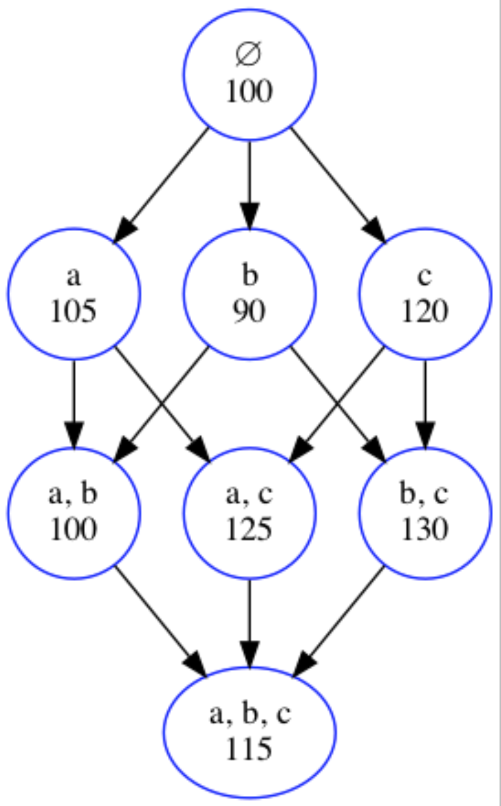
</p>
<!--  -->

Let's work out the Shapley value of feature $a$. First we work out the weights:

<p align="center">
    
</p>

The red arrows point to the coalitions where $a$ was added (and so made a contribution). To figure out the weights there are 2 rules:

- The total weights for a feature sum to 1
- The total weights on each row are equal to each other. Since there are 3 rows, the total weight of each row sums to $1/3$
- All weights within a row are equal - since the second row has two weights, each weight must be $1/6$

Now we multiply the weights by the **marginal contributions** - the value minus the coalition without that feature. So we have Shapely values as follows:

$$
\psi_a(v) = \frac{1}{3}(105-100) + \frac{1}{6}(125-120) + \frac{1}{6}(100-90) + \frac{1}{3}(115-130) \\
\psi_b(v) = \frac{1}{3}(90-100) + \frac{1}{6}(100-105) + \frac{1}{6}(130-120) + \frac{1}{3}(115-125) \\
\psi_c(v) = \frac{1}{3}(120-100) + \frac{1}{6}(125-105) + \frac{1}{6}(130-90) + \frac{1}{3}(115-100) \\
$$

then,

$$
\psi_a(v) = -0.833 \\
\psi_b(v) = -5.833\\
\psi_c(v) = 21.666\\
$$

So $\psi_a(v) + \psi_b(v) + \psi_c(v) = 14.999$. 
<!-- This explains additive property of Shapley values, that is they explain (add up to) the difference between the prediction for this specific instance from the null default prediction (which is the same from all instances).    -->


## SHAP

Shapley Additive exPlanations: 

Note that the sum of Shapley values for all features is the same as the difference between the predicted value of the full model (with all features) and the null model (with no features, which is the default prediction for all instances) . So the Shapley values provide an *additive* measure of feature importance. In fact, we have a simple linear model that explains the contributions of each feature.

- **Note 1**: The prediction is for each instance (observation), so this is a local interpretation. However, we can average over all observations to get a global value.
- **Note 2**: There are $2^n$ possible coalitions of $n$ features, so exact calculation of the Shapley values as illustrated is not feasible in practice. See the reference book for details of how calculations are done in practice.
- **Note 3**: Since Shapley values are additive, we can just add them up over different ML models, making it useful for ensembles.
- **Note 4**: Strictly, the calculation we show is known as **kernelSHAP**. There are variants for different algorithms that are faster such as **treeSHAP**, but the essential concept is the same.
- **Note 5**: The Shapeley values quantify the contributions of a feature when it is added to a coalition. This measures something different from the permutation feature importance, which assesses the loss in predictive ability when a feature is removed from the feature set.

You can just get an "importance" type bar graph, which shows the mean absolute Shapley value for each feature. You can also use max absolute Shapley value as well.


<p align="center">
    
</p>

Use a **Beeswarm Plot** to summarize the entire distribution of SHAP values for each feature:

<p align="center">
    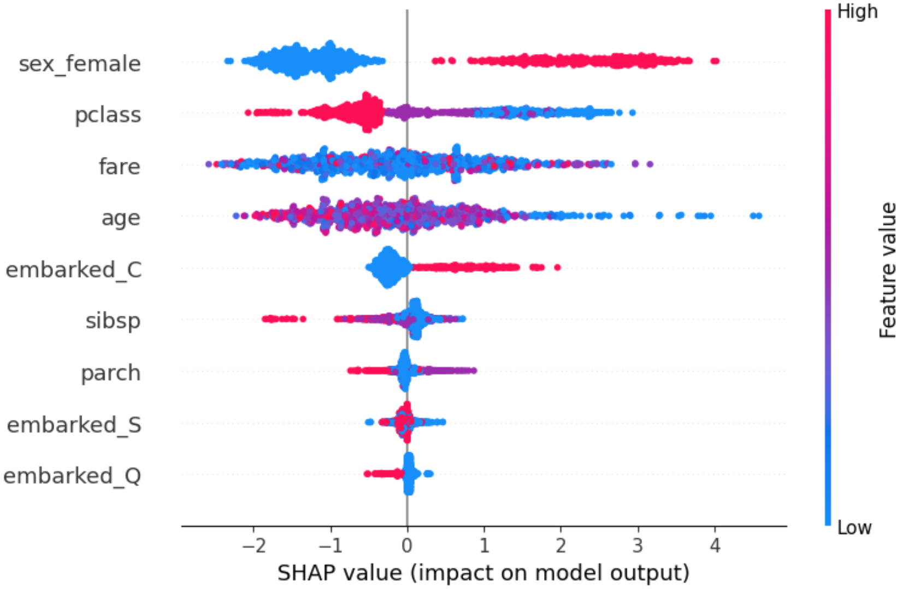
</p>

This shows the jittered Shapley values for all instances for each feature (Titanic dataset). An instance to the right of the vertical line (null model which predict the constant mean of target response for all inputs) means that the model predicts a higher probability of survival than the null model. If a point is on the right and is red, it means that for that instance, a high value of that feature predicts a higher probability of survival. For example, `sex_female` shows that if you have a high value (1 = female, 0 = male) your probability of survival is increased. Similarly, younger age predicts higher survival probability.

#### Force plot
We show the _forces_ acting on a single instance (index 10). The model predicts a probability of survival of 0.03, which is lower than the base probability of survival (0.39). The force plot shows which features affect the difference between the full and base model predictions. Blue arrows means that the feature decreases survival probability, red arrows means that the feature increases survival probability.

<p align="center">
    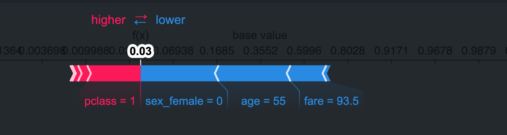
</p>


# MLOps: Machine Learning Pipelines in Production 


## Workspace Setup

  Here is a description of how to structure a workspace setup for a machine learning project optimized for production, covering Python environment, data pipeline, preprocessing, and deployment readiness:

```yaml
  ml_project/
│
├── data/                     # (optional local) raw & processed data
│   ├── raw/
│   └── processed/
│
├── notebooks/                # For exploratory analysis (EDA)
│
├── src/                      # Source code
│   ├── config/               # Config files or Hydra config scripts
│   ├── data_pipeline/        # Data ingestion + validation
│   ├── preprocessing/        # Transformations shared by training & inference
│   ├── models/               # Model training, saving, loading
│   ├── evaluation/           # Metrics & evaluation scripts
│   └── serving/              # Inference and deployment scripts (API, CLI)
│
├── scripts/                  # CLI tools to run various stages
│
├── tests/                    # Unit tests
│
├── Dockerfile                # Containerization
├── requirements.txt / pyproject.toml
├── .env                      # Secrets/config (never commit)
└── README.md
```

### Python Environment

Use virtual environments (like `venv`) and declare dependencies in `requirements.txt`.

| Category      | Libraries                                                  |
| ------------- | ---------------------------------------------------------- |
| Environment   |  `pip`, `venv (default, built-in), poetry`                     |
| Data          | `pandas`, `numpy`, `pyarrow`, `dask`, `polars`             |
| EDA           | `matplotlib`, `seaborn`, `sweetviz`, `pandas-profiling`    |
| ML Frameworks | `scikit-learn`, `xgboost`, `lightgbm`, `catboost`, `torch`, `tensorflow` |
| Pipelines     | `scikit-learn`, `dagster`, `airflow`, `prefect`, `kedro`   |
| Configs       | `Hydra`, `OmegaConf`, `dotenv`                             |
| Logging       | `loguru`, `mlflow`, `wandb`                                |
| Serving       | `FastAPI`, `Flask`, `BentoML`, `TorchServe`                |
| Testing       | `pytest`, `mypy`, `black`, `ruff`, `pylint`                |

```sh
python3 -m venv venv
source venv/bin/activate  # or venv\Scripts\activate on Windows
```

## Data Mining Tools
- Pandas: is still the default and most widely used data manipulation library in both industry and academia.
  
| Use Case                        | Is Pandas Ideal?             |
| ------------------------------- | ---------------------------- |
| Exploratory Data Analysis (EDA) | ✅ Best choice                |
| Clean, tabular data in memory   | ✅ Excellent                  |
| Feature engineering for ML      | ✅ Widely used                |
| >100MB–1GB datasets             | ⚠️ Still OK, but can slow    |
| >10GB datasets                  | ❌ Use Dask or Polars instead |


- Dask: A parallel computing library that scales pandas, NumPy, and even machine learning to multi-core or distributed systems.
    - Supports lazy evaluation, like Spark.
    - Can process data larger than RAM by breaking it into chunks and processing in parallel.
    - Drop-in replacement for pandas in many cases:

```python
import dask.dataframe as dd
df = dd.read_csv("big_file.csv")
df.groupby("col").mean().compute()
```

##### When to Use Dask
- You’re working with large datasets that don't fit in memory.
- You want parallel processing on a cluster or multi-core machine.
- You’re already in the Python ecosystem
- Data fits in single machine memory or medium-scale clusters
- You want to scale pandas, NumPy, or scikit-learn
- You need quick setup for ML preprocessing or light ETL
- You're working in Jupyter notebooks or ML dev environments
🧠 Best for data scientists, small/medium-scale ML pipelines, and exploratory workflows.

#### Spark:

##### When to Use Apache Spark
- You're processing TB–PB-scale data on a cluster
- You need enterprise-grade fault tolerance, streaming, or data lake integrations
- Your org already uses big data infrastructure (EMR, Databricks, Hadoop, etc.)
- You want to run batch + streaming jobs together
🧠 Best for big data engineers, production ETL jobs, and enterprise-scale analytics.

Many companies prototype in Dask, then move pipelines to Spark (or Databricks) for production-scale processing — especially if streaming or tight integration with data lakes is needed.


The moment your data is stored in the cloud, you usually want to move away from Dask/Spark clusters you manage directly and use cloud-native, serverless or managed alternatives.Here's a breakdown of cloud-native tools that replace Dask, Spark, and even Pandas workflows depending on the cloud provider:

| Workflow Type                     | Dask/Spark Equivalent in Cloud     | Cloud Tools (per provider)                                                                                       |
| --------------------------------- | ---------------------------------- | ---------------------------------------------------------------------------------------------------------------- |
| **Batch Data Processing (ETL)**   | Spark, Dask                        | - **AWS Glue** (serverless Spark)  <br> - **Google Dataflow** (Apache Beam)  <br> - **Azure Data Factory (ADF)** |
| **Interactive Queries (SQL)**     | Spark SQL, DuckDB, Dask DataFrames | - **Amazon Athena** (serverless SQL on S3)<br> - **BigQuery** (GCP) <br> - **Azure Synapse SQL Serverless**      |
| **Large-Scale ML Pipelines**      | Dask-ML, Spark MLlib               | - **SageMaker Pipelines** (AWS)<br> - **Vertex AI Pipelines** (GCP)<br> - **Azure ML Pipelines**                 |
| **DataFrame-like Querying**       | Pandas, Dask                       | - **Snowflake + Snowpark for Python**<br> - **BigQuery with `pandas-gbq` or `dbt`**                              |
| **Orchestrated Workflows (DAGs)** | Airflow, Dask Scheduler            | - **AWS Step Functions** <br> - **Cloud Composer (Airflow on GCP)** <br> - **Azure Data Factory Pipelines**      |
| **Streaming / Real-time**         | Spark Structured Streaming         | - **Kinesis Data Analytics (AWS)** <br> - **Dataflow + Pub/Sub (GCP)** <br> - **Azure Stream Analytics**         |
| **Parquet/Arrow file I/O**        | Dask, PyArrow                      | - **All clouds use Arrow + Parquet under the hood** <br> (via Athena, BigQuery, Snowflake, etc.)                 |


### Cloud-by-Cloud Breakdown

AWS
| Task                      | Tool                                |
| ------------------------- | ----------------------------------- |
| ETL Pipelines             | AWS Glue (Spark), AWS Data Wrangler |
| SQL on S3                 | Amazon Athena                       |
| ML Pipelines              | SageMaker Pipelines                 |
| Workflow Orchestration    | AWS Step Functions + EventBridge    |
| Serverless Python Queries | AWS Data Wrangler + Pandas          |

GCP
| Task                | Tool                            |
| ------------------- | ------------------------------- |
| ETL Pipelines       | Dataflow (Apache Beam)          |
| SQL on GCS          | BigQuery                        |
| ML Pipelines        | Vertex AI Pipelines             |
| Python/SQL Analysis | BigQuery + `pandas-gbq` / Colab |

Azure
| Task                | Tool                   |
| ------------------- | ---------------------- |
| ETL Pipelines       | Data Factory (ADF)     |
| SQL on Blob Storage | Synapse Serverless SQL |
| ML Pipelines        | Azure ML Pipelines     |
| Streaming           | Azure Stream Analytics |

## Data Pipeline Setup
Goal: Ingest raw data → validate → clean → store processed version
Tools & Steps:
- Ingestion: APIs, S3, databases (via SQLAlchemy, boto3, etc.)
- Validation: pandera, Great Expectations
- Orchestration: Airflow, Prefect, or Dagster for scheduling & monitoring
- Storage: parquet, feather, or Delta Lake (if using Spark)


## EDA and Feature Selection

- Use `pandas-profiling`, `sweetviz`, or `ydata-profiling` in notebooks.
- Visualize missing data, correlations, class balance, etc.
- Document key findings to improve reproducibility.

Exploratory Data Analysis (EDA) is a critical first step in any data science or ML project. It helps you understand the structure, patterns, and anomalies in your data before modeling. Below is a structured set of EDA steps along with the most useful tools for each stage.

1. Data Collection & Loading
-  Read data from source (CSV, Parquet, SQL, S3, etc.)
      - pandas / polars – for in-memory data
      - `pandas.read_parquet()` – for Parquet files
      - SQLAlchemy, BigQuery, Athena – for querying large/cloud-based data
      - Dask – for out-of-core or distributed CSV/Parquet reading
 - **Download the Data** available in a relational database or just download a single compressed file which contains a comma-separated value (CSV) file with all the data. 

Create a Python function to fetch and load the data into a EDA framework like Pandas: call `fetch_housing_data()` to creates a datasets directory in your workspace, downloads the compressed file, and extracts the `data.csv` from it in this directory.

2. Initial Overview
- Understand basic structure, shape, and types
- Use: `.shape`, `.columns`, `.dtypes`, `.head()`, `.info()`
    - Null counts: `df.isnull().sum()`
    -  `df.describe()` – summary statistics of the
    numerical attributes: the `count`, `mean`, `min`, and `max`, `std`, `percentiles` (25th, median, 75th), histograms for each numerical attribute ...

3. Data Types and Missing Values
- Identify categorical, numerical, datetime columns
    - Convert data types (`pd.to_datetime`, `astype()`)
    - Impute or flag missing data
- Use:
    - pandas, sklearn.impute, missingno (visualize null patterns)

4. Univariate Analysis
- Analyze each feature individually
    - Histograms for numerical data
    - Bar plots for categorical variables
    - Summary stats: mean, median, mode, std, skew, kurtosis
- Use:
    - `matplotlib`, `seaborn`
    - `pandas.describe()`
    - `ydata-profiling` (one-click)


5. Bivariate & Multivariate Analysis
- Understand relationships between variables
    - Correlation matrix (df.corr())
    - Scatter plots (num vs num), box plots (num vs cat), heatmaps
    - Grouping by categorical features
- Use:
    - `seaborn.pairplot`,` sns.heatmap`, `sns.boxplot`
    - `plotly.express.scatter_matrix`
    - `sklearn.preprocessing.LabelEncoder / OneHotEncoder`

6. Target Variable Analysis
- How features relate to your target (for supervised ML)
    - Distribution of target classes
    - Correlation with target
    - Grouped statistics (`df.groupby(target).mean()`)
- Use:
    - `seaborn`, `matplotlib`, `pandas`
  
7. Outlier Detection
- Identify and decide on treatment for outliers
    - Boxplots, IQR method, Z-score
    - Log transformation or capping
- Use:
    - `seaborn.boxplot`,` scipy.stats.zscore`, `sklearn.preprocessing`

8. Handling missing data: 
   - drop them, set their value (0, mean, median, impute them)
   - Handling Text and Categorical Attributes: ordinal encoders, one-hot encoding (you get sparse matrix for categorical attributes with thousands of categories to avoid memory waste but still slows training for very large possible categories- in this case group them into one or you could replace each category with a learnable low dimensional vector called an embedding)

9. Split Data into Train-Val-Test:  
   *Split data before applying any transformation that depends on data values*: 
   - Use stratified sampling to avoid significant sampling bias : the population is divided into homogeneous subgroups called strata, and the right number of instances is sampled from each stratum to guarantee that the test set is representative of the overall population. Suppose you chatted with experts who told you that the median income is a very important attribute to predict median housing prices. You may want to ensure that the test set is representative of the various categories of incomes in the whole dataset. Since the median income is a continuous numerical attribute, you first need to create an income category attribute, for example by binning. It is important to have a sufficient number of instances in your dataset for each stratum, or else the estimate of the stratum’s importance may be biased. This means that you should not have too many strata, and each stratum should be large enough. Now you are ready to do stratified sampling based on the income category.
   - Fix `random_state=42` for re-producibility. 

10. Data Quality Checks
- Ensure data consistency and integrity
    - Check for duplicates
    - Unexpected value ranges or patterns
    - Schema enforcement
Tools:
pandera, Great Expectations, pydeequ

11. Dimensionality Reduction (maybe - only if appropriate)
- Detect hidden structure in high-dimensional data
    - PCA, t-SNE, UMAP
- Use:
    - `scikit-learn`, `umap-learn`, `plotly`, `seaborn`

12.  Build a Full Preprocessing + Model Pipeline
    Write your own **Custom Transformers** for tasks such as custom cleanup operations or combining specific attributes. To work seamlessly with Scikit-Learn functionalities (such as pipelines), create a class and implement three methods: `fit()` (returning self), `transform()`, and `fit_transform()`. You can get the last one for free by simply adding `TransformerMixin` as a base class. Also, if you add `BaseEstimator` as a base class (and avoid `*args` and `**kargs` in your constructor) you will get two extra methods (`get_params()` and `set_params()`) that will be useful for auto‐matic hyperparameter tuning. These transformers are needed for preprocessing such as feature scaling (**min-max scaling** and **standardization**), outlier handling or any other transformation of data. Then the pipeline exposes the same methods as the final estimator. Here is an example of a pipeline using custom transformers performing several data processing steps.

        ```python
        from sklearn.pipeline import Pipeline
        from sklearn.compose import ColumnTransformer
        from sklearn.preprocessing import StandardScaler, OneHotEncoder
        from sklearn.impute import SimpleImputer
        from sklearn.ensemble import RandomForestClassifier

        # Split feature types
        numeric_cols = X.select_dtypes(include="number").columns
        cat_cols = X.select_dtypes(include="object").columns

        # Preprocessing pipelines
        numeric_pipeline = Pipeline([
            ('imputer', SimpleImputer(strategy='mean')),
            ('scaler', StandardScaler())
        ])

        cat_pipeline = Pipeline([
            ('imputer', SimpleImputer(strategy='most_frequent')),
            ('encoder', OneHotEncoder(handle_unknown='ignore'))
        ])

        # Combine column-wise
        preprocessor = ColumnTransformer([
            ('num', numeric_pipeline, numeric_cols),
            ('cat', cat_pipeline, cat_cols)
        ])

        ```

        Create and use custom pipeline if needed - for example, for dropping a column:

        ```python
        # Use a custom transformer inside the pipeline to drop a column cleanly
        from sklearn.base import BaseEstimator, TransformerMixin

        class ColumnDropper(BaseEstimator, TransformerMixin):
            def __init__(self, columns_to_drop=None):
                self.columns_to_drop = columns_to_drop or []

            def fit(self, X, y=None):
                return self

            def transform(self, X):
                return X.drop(columns=self.columns_to_drop)

        ```

        ```python
        drop_cols = ["id", "duplicate_flag"]  # columns you don't want passed to model

        dropper = ColumnDropper(columns_to_drop=drop_cols)
        ```
        Here is another production-safe version of an outlier removal transformer that drops rows during training, but is designed to not drop any rows during inference. This respects the real-world constraint that you usually cannot drop incoming data at inference time.

        - During `.fit()` and `.transform()` on training data, outliers are removed (rows dropped).
        - During `.transform()` on test or inference data, rows are left untouched (you’ll typically log or monitor them, not drop).

        ```python
        class OutlierRemover(BaseEstimator, TransformerMixin):
            def __init__(self, method='iqr', factor=1.5, z_thresh=3.0, apply_to='numeric'):
                    self.method = method  # 'iqr' or 'zscore'
                    self.factor = factor  # IQR factor
                    self.z_thresh = z_thresh  # Z-score threshold
                    self.apply_to = apply_to  # 'numeric' or list of column names
                    self.columns_ = None
                    self.stats_ = {}

            def fit(self, X, y=None):
                    X = pd.DataFrame(X)
                    if self.apply_to == 'numeric':
                        self.columns_ = X.select_dtypes(include='number').columns
                    else:
                        self.columns_ = self.apply_to

                    if self.method == 'iqr':
                        Q1 = X[self.columns_].quantile(0.25)
                        Q3 = X[self.columns_].quantile(0.75)
                        IQR = Q3 - Q1
                        self.stats_['lower'] = Q1 - self.factor * IQR
                        self.stats_['upper'] = Q3 + self.factor * IQR
                    elif self.method == 'zscore':
                        self.stats_['mean'] = X[self.columns_].mean()
                        self.stats_['std'] = X[self.columns_].std()
                    else:
                        raise ValueError("Method must be 'iqr' or 'zscore'")
                    return self

            def transform(self, X, y=None):
                    X = pd.DataFrame(X, columns=X.columns)
                    if self.method == 'iqr':
                        mask = ((X[self.columns_] >= self.stats_['lower']) & 
                                (X[self.columns_] <= self.stats_['upper'])).all(axis=1)
                    else:  # zscore
                        z_scores = (X[self.columns_] - self.stats_['mean']) / self.stats_['std']
                        mask = (np.abs(z_scores) < self.z_thresh).all(axis=1)

                    if y is not None:
                        return X[mask].reset_index(drop=True), y[mask].reset_index(drop=True)
                    else:
                        # ⚠️ At inference, do not drop rows — just return unchanged data
                        return X.reset_index(drop=True)
        ```
        It is import to know that scikit-learn pipelines are not designed to handle changes in the number of samples (rows) between steps like droping rows. They assume:
        - The number of samples (rows) in X and y stays the same
        - Each step transforms features (columns) only, not row counts
        
        Best Practice: Handle Row-Dropping Outside the Pipeline
        ```python
            # Step 1: Clean training data (row-dropping)
            remover = OutlierRemover(method='iqr', factor=1.5)
            X_train_clean, y_train_clean = remover.fit_transform(X_train, y_train)

            # Create the pipeline to include all steps
            pipeline = Pipeline([
                ('dropper', dropper),                   # ✅ Drop irrelevant cols
                ('outlier_capper', IQRCapper(factor=1.5))  # non-destructive capping for outliers
                ('preprocessing', preprocessor),        # numeric + cat
                ('model', RandomForestClassifier())     # model
            ])
        ```

        The pipeline ensures that preprocessing is fit only on the training folds and applied properly on val/test folds during CV.

        ```python
        # Fit Only on Training Data
        # Now it's safe to use cross-validation
        # Either
        cross_val_score(pipeline, X_train_clean, y_train_clean, cv=5)

        # Or -
        # full_pipeline.fit(X_train_clean, y_train_clean)
        ```
        Predict on Raw Test Data

        ```python
        # Step 3: Use .transform() at inference (rows not dropped)
        X_test_transformed = remover.transform(X_test)
        preds = pipeline.predict(X_test_transformed)
        ```
        Or, serialize the pipeline for deployment

        ```python
        # Serialize both objects separately for Deployment 
        from joblib import dump
        dump(remover, "outlier_remover.joblib")
        dump(pipeline, "model_pipeline.joblib")
        ```
        At inference:
        ```python

        from joblib import load

        # Load both parts
        remover = load("outlier_remover.joblib")
        pipeline = load("model_pipeline.joblib")

        # Raw new input (e.g. from user or API)
        new_data = pd.DataFrame({...})

        # Apply same outlier logic (no row dropping!)
        cleaned_data = remover.transform(new_data)

        # Predict
        predictions = pipeline.predict(cleaned_data)
        ```
        Optionally you could wrap both parts remover and pipeline into one piece like this:

        ```python
        class FullModelWithOutlierHandling:
            def __init__(self, remover, pipeline):
                self.remover = remover
                self.pipeline = pipeline

            def fit(self, X, y):
                X_clean, y_clean = self.remover.fit_transform(X, y)
                self.pipeline.fit(X_clean, y_clean)

            def predict(self, X):
                X_transformed = self.remover.transform(X)
                return self.pipeline.predict(X_transformed)

            def save(self, path_prefix="model"):
                from joblib import dump
                dump(self.remover, f"{path_prefix}_remover.joblib")
                dump(self.pipeline, f"{path_prefix}_pipeline.joblib")

            @classmethod
            def load(cls, path_prefix="model"):
                from joblib import load
                remover = load(f"{path_prefix}_remover.joblib")
                pipeline = load(f"{path_prefix}_pipeline.joblib")
                return cls(remover, pipeline)
        ```
        and use it like this:

        ```python
        # Training
        model = FullModelWithOutlierHandling(remover, pipeline)
        model.fit(X_train, y_train)
        model.save("rf_model")

        # Inference
        model = FullModelWithOutlierHandling.load("rf_model")
        preds = model.predict(new_data)
        ```

        Benefits of This Design
        - ✅ Prevents leakage and keeps logic modular
        - ✅ Easy to save/load entire system
        - ✅ Clean API: just .fit() and .predict()
        - ✅ Fully compatible with joblib, MLflow, or FastAPI deployment
        - ✅ Transparent and testable

        Serialized pipelines are reusable, versionable, deployable, and production-safe. Copying code is error-prone, inconsistent, and not scalable.  Imagine your training had StandardScaler() but your inference script forgot it — predictions will be totally wrong.

        #### Benefits of Serializing (joblib.dump, pickle, torch.save, etc.):

        | Why It Matters          | What It Solves                                              |
        | ----------------------- | ----------------------------------------------------------- |
        | 🛠 **Consistency**      | No need to re-run preprocessing manually in production      |
        | 🕰 **Time-saving**      | Avoid retraining or rewriting code to get the same result   |
        | 📦 **Deployment-ready** | Easily load pipeline in a web service (e.g. FastAPI, Flask) |
        | 💾 **Versioning**       | Save multiple models/pipelines with known behavior          |
        | ✅ **Integration**       | Works well with **MLflow**, **BentoML**, **SageMaker**, etc |
        | 🔄 **Reproducibility**  | Same output every time from the same serialized pipeline    |

        Fop pipelines involving Deep Learning or LLMs use Pytorch, TensorFlow or HiggingFace tools:

        | Framework                | Equivalent to `Pipeline`                 | Purpose                                    |
        | ------------------------ | ---------------------------------------- | ------------------------------------------ |
        | **PyTorch**              | `nn.Sequential`, custom classes          | Compose neural nets, transformations       |
        | **PyTorch Lightning**    | `LightningModule` + `DataModule`         | Structured, modular deep learning training |
        | **TensorFlow**           | `tf.keras.Sequential`, `tf.data.Dataset` | Model + input pipeline                     |
        | **Hugging Face**         | `Trainer`, `Pipeline`, `Transformers`    | Full stack for training/inference of LLMs  |
        | **FastAI**               | `Learner`, `DataBlock`                   | High-level abstraction for PyTorch         |
        | **BentoML** / **MLflow** | Model serving w/ pre/post logic          | Deployment of DL/LLMs with preprocessing   |

        ##### How It Maps:

        | Stage              | scikit-learn  | Deep Learning Equivalent                                      |
        | ------------------ | ------------- | ------------------------------------------------------------- |
        | Preprocessing      | `Pipeline`    | `torchvision.transforms`, `tf.data`, `datasets.Dataset.map()` |
        | Model definition   | `estimator`   | `nn.Module`, `Keras model`, HF `AutoModel`                    |
        | Fitting            | `.fit()`      | `.fit()` / `Trainer.train()` / `Trainer`                      |
        | Inference pipeline | `.predict()`  | `pipeline()` (Hugging Face), `.forward()`                     |
        | Deployment         | `joblib.dump` | `torch.save()`, `BentoML.save_model()`                        |


13. Visualization Dashboard (Optional)
- Create shareable visual overview
- Use:
    - plotly, dash, streamlit, panel
    - Jupyter Notebooks / Colab
    - ydata-profiling, sweetviz for auto-generated dashboards


For large data or cloud-stored data, use BigQuery, or Athena with SQL to do EDA in-place instead of loading it all into memory.


## Model Training, Selection and Evaluation

We want to explore data preparation options, trying out multiple models, shortlisting the best ones and fine-tuning their hyperparameters using GridSearchCV, and automating as much as possible. At this stage, we have a playground to try multiple model types, take care of overfitting/undefitting and parameter-tuning (optional to use grid search or randomized search when the hyperparameter search space is large) to choose the best model.  Use K-fold cross-validation if it is not costly to train the model several times. You can easily save a Scikit-Learn models by using *Python’s pickle module*, or using `sklearn.externals.joblib`, which is more efficient at serializing large NumPy arrays. Also, you may want to use ensemble models to improve prediction performance. 

- Use modular scripts for training (e.g., train.py) with config-driven hyperparameters via Hydra.
- Track experiments using MLflow or Weights & Biases.


## Evaluate Your System on the Test Set: 
After tweaking your models for a while, you eventually have a system that performs sufficiently well. Now is the time to evaluate the final model on the test set. There is nothing special about this process; just get the predictors and the labels from your test set, run your full_pipeline to transform the data (call `transform()`, not `fit_transform()`, you do not want to fit the test set!), and evaluate the final model on the test set:

- Evaluate using metrics appropriate to the task, and log them persistently.

```python
final_model = grid_search.best_estimator_
X_test = strat_test_set.drop("median_house_value", axis=1)
y_test = strat_test_set["median_house_value"].copy()
X_test_prepared = full_pipeline.transform(X_test)
final_predictions = final_model.predict(X_test_prepared)
final_mse = mean_squared_error(y_test, final_predictions)
final_rmse = np.sqrt(final_mse) # => evaluates to 47,730.2
```

Such a point estimate of the generalization error will not be quite enough to convince you to launch: what if it is just 0.1% better than the model currently in production? To have an idea of how precise this estimate is, you can compute a 95% confidence interval for the generalization error using `scipy.stats.t.interval()`:

```python
from scipy import stats
confidence = 0.95
squared_errors = (final_predictions - y_test) ** 2
np.sqrt(stats.t.interval(confidence, len(squared_errors) - 1,
loc=squared_errors.mean(),
scale=stats.sem(squared_errors)))
```
<br>

```o
array([45685.10470776, 49691.25001878])
```

##  Deployment-Ready Inference
Now comes the project prelaunch phase: you need to present your solution (highlighting what you have learned, what worked and what did not, what assumptions were made, and what your system’s limitations are), document everything, and create nice presentations with clear visualizations and easy-to-remember statements (e.g., “the median income is the number one predictor of housing prices”). The final performance of the system is not better than the experts’, but it may still be a good idea to launch it, especially if this frees up some time for the experts so they can work on more interesting and productive tasks.

Use FastAPI or Flask to create an API server:

```python
from fastapi import FastAPI
import joblib

app = FastAPI()
model = joblib.load("model.pkl")
preprocessor = joblib.load("preprocessor.pkl")

@app.post("/predict")
def predict(data: InputData):
    df = pd.DataFrame([data.dict()])
    X = preprocessor.transform(df)
    pred = model.predict(X)
    return {"prediction": pred.tolist()}
```

- Containerize with Docker.
- CI/CD for deployment using GitHub Actions + AWS (SageMaker, Lambda, EKS, etc.).

## Launch, Monitor, and Maintain Your System

Perfect, you got approval to launch! You need to 

- Get your solution ready for production, in particular by plugging the production input data sources into your system and writing tests.

-  Write monitoring code to check your system’s live performance at regular intervals and trigger alerts when it drops. This is important to catch not only sudden breakage, but also performance degradation. This is quite common because models tend to “rot” as data evolves over time, unless the models are regularly trained on fresh data.

- Evaluating your system’s performance will require sampling the system’s predictions and evaluating them. This will generally require a human analysis. These analysts may be field experts, or workers on a crowd sourcing platform.

- Evaluate the system’s input data quality. Sometimes
performance will degrade slightly because of a poor quality signal (e.g., a malfunctioning sensor sending random values, or another team’s output becoming stale), but it may take a while before your system’s performance degrades enough to trigger an alert. If you monitor your system’s inputs, you may catch this earlier. Monitoring the inputs is particularly important for online learning systems.

- Finally, you will generally want to train your models on a regular basis using fresh data. You should automate this process as much as possible. If you don’t, you are very likely to refresh your model only every six months (at best), and your system’s performance may fluctuate severely over time. If your system is an online learning system, you should make sure you save snapshots of its state at regular intervals so you can easily roll back to a previously working state.

## Best Practices for Production
- Environment isolation: Pin package versions and use lockfiles
- Logging & monitoring: Use loguru, mlflow, Prometheus/Grafana for deployed apps
- Data & model validation: Add Great Expectations, pytest for robustness
- Model drift detection: Track feature distribution or performance over time

A production-optimized ML workspace should:
- Separate code, config, and data
- Use consistent preprocessing for training and inference
- Support reproducibility (via pipelines, logs, config management)
- Be ready for CI/CD and containerized deployment


## Full Life Cycle of MLOps Pipeline 

Full life cycle of a typical ML pipeline — from raw data to live, monitored model — in a way that’s close to how companies actually build it in production.

1. **Problem Definition & Requirements**
Before touching code:
- Business goal: What are we predicting/optimizing? (e.g., fraud detection, churn prediction, recommendation)
- Success metrics: Accuracy, F1-score, AUC, latency, cost constraints.
- Constraints: Data privacy, real-time or batch, infrastructure limitations.

2. **Data Ingestion**
Bring in data from its source(s):
- Sources: Databases (SQL, NoSQL), APIs, data lakes (S3, GCS), event streams (Kafka).
- Ingestion methods: ETL/ELT jobs, scheduled pipelines (Airflow, Prefect).
- Versioning: Store raw snapshots with tags for reproducibility.
Example: `fraud_data_2025-08-13.csv` stored in `s3://bucket/data/raw/`

3. **Data Preprocessing**
Clean and prepare for modeling:
- Cleaning: Handle missing values, remove duplicates, fix inconsistent formats.
- Transformation: Scaling, encoding, feature extraction.
- Splitting: Train/validation/test or time-based splits for temporal data.
- Automation: Save preprocessed data to `data/processed/` or a feature store.
Example Tools: Pandas, PySpark, dbt, Feast.

4. **Feature Engineering**
Enhance model signal:
- Domain features: Derived variables (e.g., transaction frequency, rolling averages).
- Interaction features: Combinations or transformations of raw features.
- Embedding features: For text, images, categorical variables.
- Feature store: So models in training and production use identical transformations.

5. **Model Training**
Core ML step:
- Model choice: Logistic Regression, XGBoost, Neural Networks, LLMs.
- Training loop: Fit model on training data, tune hyperparameters.
- Cross-validation: Ensure robustness.
- Experiment tracking: MLflow, Weights & Biases (log metrics, parameters, artifacts).
- Model versioning: Tag models for reproducibility.

6. **Model Evaluation**
Check performance before deployment:
- Metrics: Precision, recall, ROC-AUC, MSE, etc.
- Business impact: Cost/benefit analysis of errors.
- Robustness tests: Stress test on edge cases, fairness checks.
- Sign-off: Decide if it meets production criteria.

7. **Packaging & Deployment**
Make it available for use:
- Formats: mlflow model, joblib pickle, TensorFlow SavedModel.
- Serving options:
    - Batch inference: Spark jobs, scheduled ETL.
    - Real-time API: FastAPI, Flask, gRPC, AWS SageMaker Endpoint.
- CI/CD integration: Auto-build & deploy on model approval.
- Containerization: Docker + orchestration (Kubernetes).

8. **Monitoring & Maintenance**
Keep it healthy after release:
- Performance drift: Drop in accuracy, recall, etc.
- Data drift: Feature distributions changing from training.
- Latency & uptime: API performance metrics.
- Retraining triggers: Schedule or event-based.
- Alerts: PagerDuty, Slack notifications.

9. **Continuous Improvement**
Pipeline is never truly done:
- Add new features
- Switch models
- Optimize for cost or speed
- A/B testing with new versions

### Typical ML pipeline:

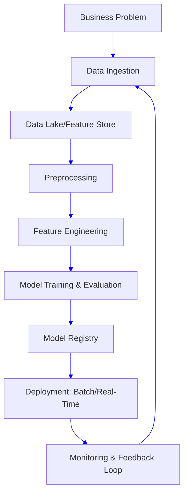
```mermaid
flowchart TD
    A[Business Problem] --> B[Data Ingestion]
    linkStyle 0 stroke: blue;
    B --> C[Data Lake/Feature Store]
    linkStyle 1 stroke: blue;
    C --> D[Preprocessing]
    linkStyle 2 stroke: blue;
    D --> E[Feature Engineering]
    linkStyle 3 stroke: blue;
    E --> F[Model Training & Evaluation]
    linkStyle 4 stroke: blue;
    F --> G[Model Registry]
    linkStyle 5 stroke: blue;
    G --> H[Deployment: Batch/Real-Time]
    linkStyle 6 stroke: blue;
    H --> I[Monitoring & Feedback Loop]
    linkStyle 7 stroke: blue;
    I --> B
    linkStyle 8 stroke: blue;
```

From raw data to live, monitored model — in a way that’s close to how companies actually build it in production.

Problem Definition & Requirements
Our case: Fraud detection
- Goal: Predict if a transaction is fraudulent
- Metric: ROC-AUC + precision/recall balance (fraud = high cost of false negatives)
- Constraint: Should support both batch scoring and real-time API scoring later.

Data Ingestion: 
- Can be  automated via Airflow DAG to pull latest data nightly. 
- Store both raw CSV and a Parquet copy for faster reads.

Data Preprocessing:  
- Can add `preprocessing.py` that outputs processed data into `data/processed/` although not necassary for every use case. I didn't.
- Save preprocessing logic in a `sklearn.Pipeline` object so training and inference match. This way you don't need to save processed data.

Feature Engineering: 
- Create `feature_engineering.py`. Example: transaction frequency per user, average transaction amount over last 30 days, etc.
- Store features in a feature store (could start with Feast local mode).

Model Training:
- Wrap training in train.py script with config-driven parameters (config.yaml)
- Log experiments to MLflow Tracking
- Save trained model to models/ and register in MLflow Model Registry.

Model Evaluation:
- Move metrics into `evaluate.py`
- Store evaluation JSON (metrics_{version_tag}.json) in `reports/`
- Generate HTML/Markdown reports for stakeholders

Packaging & Deployment:
- Create serve.py (FastAPI app)
  - For real-time: Deploy container to AWS SageMaker endpoint or ECS.
  - For batch: Create batch_inference.py to score incoming CSVs from S3.

Monitoring & Maintenance:
- Log predictions + actuals to a monitoring table
- Use Evidently AI or custom scripts for drift detection
Alerts via email/Slack when drift or performance drop is detected.

Continuous Improvement:
- Use feedback loop to retrain periodically
- Test new model architectures (XGBoost → LightGBM → Neural Net)
- Use A/B testing between old and new models in production.

#### Full ML pipeline diagram for the project 

```yaml
             ┌─────────────────────────┐
             │ 1. Problem Definition   │
             │ - Goal, metrics, SLA    │
             │ - Stakeholder alignment │
             └───────────┬─────────────┘
                         │
                         ▼
┌──────────────────────────────────────────────────────────┐
│ 2. Data Ingestion (Best practice: version everything)    │
│ - Source: S3 bucket / Data lake                          │
│ - Tool: boto3 or AWS CLI, Airflow DAG                    │
│ - Script: data_ingestion.py (save_data_local)            │
│ - Store raw CSV + Parquet in data/raw/                   │
└─────────────────────────┬────────────────────────────────┘
                          │
                          ▼
┌────────────────────────────────────────────────────────────────────────┐
│ 3. Data Preprocessing (Best practice: same logic in train & inference) │
│ - Tool: Pandas / PySpark                                               │
│ - Script: preprocessing.py                                             │
│ - Save output in data/processed/                                       │
│ - Package transformations in sklarn.Pipeline                           │
│ - Versioned with DVC or stored in Feature Store                        │
└─────────────────────────┬──────────────────────────────────────────────┘
                          │
                          ▼
┌─────────────────────────────────────────────────────────────────────────┐
│ 4. Feature Engineering (Best practice: store features in Feature Store) │
│ - Tool: Pandas, scikit-learn, Feature Store (Feast)                     │
│ - Script: feature_engineering.py                                        │
│ - Examples: rolling stats, frequency counts, embeddings                 │
│ - Store reusable features for multiple models                           │
└─────────────────────────┬───────────────────────────────────────────────┘
                          │
                          ▼
┌───────────────────────────────────────────────────────────────────────────┐
│ 5. Model Training (Best practice: reproducibility & tracking)             │
│ - Tool: scikit-learn, XGBoost, LightGBM, PyTorch                          │
│ - Experiment tracking: MLflow / Weights & Biases                          │
│ - Script: train.py                                                        │
│ - Config-driven parameters (config.yaml)                                  │
│ - Save model artifacts to models/ and register in MLflow Model Registry   │
└─────────────────────────┬─────────────────────────────────────────────────┘
                          │
                          ▼
┌─────────────────────────────────────────────────────────────────┐
│ 6. Model Evaluation (Best practice: report for stakeholders)    │
│ - Tool: scikit-learn metrics, Matplotlib, Seaborn               │
│ - Script: evaluate.py                                           │
│ - Output: metrics_{version_tag}.json + HTML report in reports/  │
│ - Sign-off before deployment                                    │
└─────────────────────────┬───────────────────────────────────────┘
                          │
                          ▼
┌─────────────────────────────────────────────────────────────────────────┐
│ 7. Packaging & Deployment (Best practice: CI/CD automated deployment)   │
│ - Format: MLflow model / joblib / ONNX                                  │
│ - Real-time: FastAPI → Docker → AWS ECS / SageMaker                     │
│ - Batch: batch_inference.py → scheduled via Airflow                     │
│ - CI/CD: GitHub Actions / GitLab CI for build & deploy                  │
└─────────────────────────┬───────────────────────────────────────────────┘
                          │
                          ▼
┌───────────────────────────────────────────────────────────────────────────┐
│ 8. Monitoring & Maintenance (Best practice: alerting on drift & latency)  │
│ - Tools: Evidently AI (data drift), Prometheus + Grafana (latency, uptime)│
│ - Log predictions + actuals to monitoring DB                              │
│ - Alerts via Slack / PagerDuty                                            │
└─────────────────────────┬─────────────────────────────────────────────────┘
                          │
                          ▼
┌───────────────────────────────────────────────────────┐
│ 9. Continuous Improvement                             │
│ - Retraining triggers: schedule or drift detection    │
│ - A/B testing new models                              │
│ - Incremental feature additions                       │
└───────────────────────────────────────────────────────┘

```
#### Key Best Practice Highlights
- **Version everything**— raw data, processed data, features, models.
- **Match preprocessing in training & inference** — store as a serialized pipeline.
- **Automate** — use Airflow or Prefect for recurring jobs.
- **Track experiments** — MLflow or Weights & Biases to reproduce results.
- **Containerize deployment** — Docker for portability, CI/CD for automation.
- **Monitor in production** — detect drift, performance drops, API latency issues.
- **Retrain on schedule or event-based triggers** — don’t wait for big accuracy drops.


### Airflow DAGs
Airflow DAGs are useful in an ML pipeline because they solve a very practical problem: getting all the steps of your pipeline to run automatically, in the right order, at the right time, and with the right dependencies tracked.

Here’s why teams use Airflow instead of ad-hoc scripts:

1. **Scheduling & Automation**
- Without Airflow: You’d manually run `data_ingestion.py` every day (or cron job it).
- With Airflow: You define a DAG (Directed Acyclic Graph) that says:
  - Pull latest raw data from S3
  - Preprocess & feature engineer
  - Train model if new data arrives
  - Evaluate & push model to registry
  - Airflow will run these steps daily, hourly, or event-based without you touching anything.

2. **Dependency Management**
- You can specify that Step B only runs if Step A succeeds.
Example:
  - If S3 ingestion fails, don’t bother training a model.
  - If evaluation fails (model worse than before), skip deployment.

3. **Versioned & Reproducible Workflows**
- Airflow logs which scripts ran, with which parameters, at what time, and with what outputs.
- If a step fails, you can rerun just that step without redoing everything else.

4. **Scalability**
Airflow can run steps on different machines or containers, not just your laptop. Example:
   - Data preprocessing runs on a Spark cluster.
   - Model training runs on a GPU node.
   - Deployment step pushes to AWS SageMaker.

5. **Monitoring & Alerts**
- Built-in UI to see pipeline runs.
- Can send Slack/Email alerts if:
  - Data didn’t arrive.
  - Training failed.
  - Model didn’t deploy.


In development phase, it’s often better to:
- Keep scripts modular (`preprocessing.py`, `train.py`, etc.)
- Run them manually or via a simple Makefile or shell script
- Track results in MLflow or Weights & Biases

Once your preprocessing, training, and evaluation scripts stop changing daily,
- Put them in a config-driven pipeline (e.g., Python scripts that take parameters)
- Maybe chain them together in a bash script or Makefile
Production phase:
- Wrap these stable scripts in Airflow DAGs
Schedule them
- Add monitoring, retries, and alerts

### DVC’s Role in ML Pipelines

DVC (Data Version Control) is not a replacement for Airflow, MLflow, or your scripts. It’s a data & artifact versioning system with reproducibility baked in. Think of it as Git for data and models.

1. **Versioning Data**
Tracks raw data, processed data, feature sets. Example:
    ```sh
    dvc add data/raw/fraud_data_2025-08-13.csv
    dvc push
    ```
   Ensures you can reproduce any experiment with the exact same dataset.

2. **Versioning Features & Models**
After preprocessing or feature engineering:
    ```sh
    dvc add data/processed/features_v1.parquet
    dvc add models/fraud_model_v1.pkl
    dvc push
    ```
    DVC tracks changes in `features/models`, so your Airflow DAG can always pull the right version for training or inference.

3. **Linking Pipeline Stages**
DVC can define stages with dependencies: raw data → preprocessing → features → training → evaluation. Each stage:
   - Knows its inputs and outputs
   - Can re-run only if inputs change

    Example:

    ```sh
    stages:
      preprocess:
        cmd: python src/preprocess.py
        deps:
          - data/raw/fraud_data.csv
        outs:
          - data/processed/features.parquet
      train:
        cmd: python src/train.py
        deps:
          - data/processed/features.parquet
        outs:
          - models/fraud_model.pkl
    ```

4. **Interaction with Airflow**
- Airflow orchestrates execution timing & dependencies, runs scripts.
- DVC ensures exact inputs/outputs are versioned and experiments are reproducible.

- Airflow + DVC combo:
  -  Airflow DAG runs preprocessing → training → evaluation
  - DVC makes sure data, features, and models are pinned to versions, so every DAG run is reproducible.

5. **Interaction with MLflow**
- MLflow tracks experiment metrics, parameters, model artifacts.
- DVC tracks raw data, processed features, and model files themselves.
- Together: MLflow + DVC = full reproducibility (metrics + code + data + model).

 ✅ In short:
-  DVC: version your data, features, models, and pipeline stages
-  Airflow: orchestrates when to run each stage
- MLflow: tracks metrics, parameters, and models
  
#### How to Use DVC

DVC starts locally, but its real power comes from remote storage integration. Let me clarify:

1. **Local tracking**
 - DVC creates `.dvc` files and a `dvc.lock` that track data, features, models locally.
- You can version them just like Git, but it doesn’t store the actual files in Git (only pointers).

2. Remote storage
You can configure DVC to use S3, GCS, Azure Blob, SSH, or even shared network drives as a remote storage.

    ```sh
    dvc remote add -d myremote s3://mybucket/ml-data
    dvc push
    dvc pull
    ```
  
    Now your data, features, and models are centralized and accessible to other team members or servers.

3. Pipeline reproducibility
Even if the pipeline runs on another machine or server, DVC can pull the exact same dataset and features for training.

✅ In short:
- Local: tracks versions and dependencies
- Remote: stores large files and ensures reproducibility across machines
- Airflow/MLflow: orchestrate and log runs, but DVC ensures the same data + model is always used.


DVC isn’t just for raw data. Best practices:

| Category                       | Example                                    | Notes                                                                                   |
| ------------------------------ | ------------------------------------------ | --------------------------------------------------------------------------------------- |
| **Raw data**                   | `data/raw/...`                             | Immutable, pulled from S3, external sources, or dumps                                   |
| **Processed / feature data**   | `data/processed/features.parquet`          | Store intermediate outputs that are expensive to compute, especially for large datasets |
| **Trained models**             | `models/model.pkl`, `models/xgboost/`      | Any model artifacts you want to version for reproducibility                             |
| **Metrics / reports**          | `reports/metrics.json`, `reports/figures/` | Optional but helpful to track experiments                                               |
| **Large experiment artifacts** | embeddings, vector stores, checkpoints     | Anything too big for Git but needed to reproduce results                                |

Rule of thumb: anything big, expensive to compute, or non-deterministic should go through DVC.

Let’s walk through a realistic DVC story with S3 using our fraud detection pipeline, step by step, and show how `dvc.yaml` orchestrates it.

### Scenario
You have:
- Raw transaction data on S3 (`s3://fraud-data-bucket/raw/fraud_2025-08-13.csv`)
- Preprocessing script: `src/preprocess.py` → outputs features to `data/processed/features.parquet`
- Training script: `src/train.py` → outputs `models/fraud_model.pkl`
You want everything versioned and reproducible with DVC

Step 1: **Initialize DVC**
```sh
git init
dvc init
git add .dvc .dvcignore .gitignore 
git commit -m "Init DVC for fraud pipeline"
```

Step 2: **Configure remote storage (S3)**
```sh
dvc remote add -d s3remote s3://fraud-data-bucket/dvc-storage
dvc remote modify s3remote access_key_id <YOUR_KEY>
dvc remote modify s3remote secret_access_key <YOUR_SECRET>
```
Step 3: **Track raw data with DVC**
```sh
# local file you just downloaded
dvc add data/raw/fraud_2025-08-13.csv
git add data/raw/fraud_2025-08-13.csv.dvc .gitignore
git commit -m "Track raw fraud dataset with DVC"
dvc push # sync to S3 remote
```
- `dvc add` creates a small file `fraud_2025-08-13.csv.dvc` in the same dir. this file is a pointer/metadata file telling DVC where the real data lives in the cache. It is the tracking file for the real file `fraud_2025-08-13.csv`.
-  Moves the real dataset into DVC cache directory `.dvc/cache/` using a hashed folder structure and replaces it in your working dir with a hard link to save space
-  Add the .dvc for to your Gir repo so it can be versioned in Git (not the dataset itself)
-  Git tracks the `.dvc` file (and `fraud_2025-08-13.csv.dvc`) so that collaborators know which version to use.
-  Creates `.gitignore` in `data/` so that Git does not try to commit the raw data files themselves. Don't delete it - without it you might accidentally commit big data files to Git 
-  When you `dvc push`, those hash-named files are uploaded to your remote where you see  
    ```sh
    files/md5/4f/2e57c55fbd3432f77c79d2c6b8a6f7
    files/md5/...
    ```
    each hash is a version of a file.
  - Anyone who clones your repo and runs `dvc pull` will get exactly the same files downloaded to their local dir based on the `.dvc` pointer files

DVC stores the file hash and keeps a pointer in Git. If the file content changes, DVC knows automatically. In our project, raw data was tracked as a stage output (from `ingest`) rather than via manual `dvc add`. Both approaches work - if a file is produced by a script, define it as an `out` in `dvc.yaml`; if its aone-off dataset you downloaded, use `dvc add`.

Step 4: **Define DVC pipeline (`dvc.yaml`) - (file-level DAG)**

   DVC enables automatic reproducibility: dvc repro reruns only what changed.

```sh
stages:
  preprocess:
    cmd: python src/preprocess.py --input data/raw/fraud_2025-08-13.csv --output data/processed/features.parquet
    deps:
      - src/preprocess.py
      - data/raw/fraud_2025-08-13.csv
    outs:
      - data/processed/features.parquet

  train:
    cmd: python src/train.py --input data/processed/features.parquet --output models/fraud_model.pkl
    deps:
      - src/train.py
      - data/processed/features.parquet
    outs:
      - models/fraud_model.pkl
    metrics:
      - reports/train_metrics.json
```
```sh
git add dvc.yaml dvc.lock params.yaml
git commit -m "pipeline +params"
```
- Deps: tell DVC what to watch for changes.
- Outs: tell DVC what files it manages and caches.
- Metrics: track evaluation results automatically.
- Params: contains parameters whose values used in `dvc.yaml`

  **Best practices**:
  - Track every stage that produces a reproducible output.
  - Include your code, input files (data), and parameters.
  - Commit the `dvc.yaml` + `dvc.lock` + `params.yaml` to Git — this is your “pipeline version.”
  - Use `dvc repro` to reproduce results on any machine.

Step 5: **Run the pipeline**
```sh
dvc repro  # runs only needed stages (hash-based)
```
In production, Airflow DAGs call these same scripts. DVC ensures exact versions of inputs/outputs, while Airflow handles scheduling and orchestration.

DVC automatically checks hashes of deps:
- If `data/raw/fraud_2025-08-13.csv` changed, it reruns preprocessing and training automatically.
- Runs preprocess if needed
- Runs train if features changed. It reruns training but keeps preprocessing cached without rerunning it
- Outputs and metrics are versioned

Step 6: **Push artifacts to S3**
```sh
dvc push  # pushes data to S3 remote
git push  # pushes code+pointers (no big files in Git)
```
- Raw data, features, and models are stored in S3.
- Another teammate or server can:

```sh
dvc pull
dvc repro
```
They get the exact same data + features + model, fully reproducible.


Step 7: **Track experiments**
- You can change `train.py` hyperparameters, run dvc repro → metrics change
- DVC keeps a history of inputs/outputs and works well with MLflow metrics logging for experiments

After setting up this:
- Raw data, processed features, and trained model now live in your S3 DVC remote
- Any teammate or server can dvc pull to reproduce the exact same data + model


When you manually tag your data (e.g., fraud_2025-08-13.csv), you control the version but that version is not tied to the content of the file. DVC versioning adds automatic reproducibility:
- DVC tracks the exact hash of the file (SHA256), so even if two files have the same name, DVC knows if contents changed.
- Every time the file changes, DVC can trigger pipeline stages to rerun (dvc repro) — you don’t have to manually manage version tags. DVC does this by noticing changes in **deps** and **outs**.
- DVC works with both local files and remote storage. The hash ensures reproducibility whether your file lives locally or in S3.

To quickly check to see what DVC thinks is tracked:
```sh
dvc list .
dvc status -c
```
#### What `dvc push` does?

- 1️⃣ Check .dvc files for tracked data
  - DVC reads `data.dvc` (or other `.dvc` metafiles) to know which files are tracked and what their hashes are.

- 2️⃣ Look in the local DVC cache
  - DVC sees if the blob with that MD5 hash exists in `.dvc/cache/4f/2e57c55fbd3432f77c79d2c6b8a6f7`. If it doesn’t exist, dvc push won’t work — you’d need to run dvc add or dvc commit first.

- 3️⃣ Compare cache with remote
  - DVC checks your remote storage (S3, GCS, Azure Blob, SSH, etc.) to see if the hash already exists there. If it does, nothing is uploaded. If it doesn’t, it schedules it for upload.

- 4️⃣ Upload to remote storage
  - For files that are missing remotely, DVC uploads them by hash, not by their original name. On S3, the object path might look like:
  `s3://my-dvc-bucket/4f/2e57c55fbd3432f77c79d2c6b8a6f7`. This way, DVC avoids duplication — even if you have 10 files with the same content, only one copy exists remotely.

- 5️⃣ Your `.dvc` file stays in Git
  - The actual big file is not in Git — only the small `.dvc` pointer file is versioned in Git.
  - You commit and push the `.dvc` file to GitHub so others know which dataset version you used.

Later, when someone runs `dvc pull`:
- They get your `.dvc` file from Git.
- DVC sees the hash and downloads the blob from your S3 remote into `.dvc/cache`.
- DVC places it back into `data/raw/fraud_data_v20250812_203000.csv` so your code can use it.

✅ In short:
`dvc push` takes the local cached data (already added with dvc add) and syncs it to your remote storage so you and your teammates can later `dvc pull` it anywhere.


#### What are deps and outs?
- deps (dependencies): the inputs for a stage. If any dep changes, DVC knows to rerun this stage. Examples: raw CSV, preprocessing script, config files.
- outs (outputs): the files that this stage produces. DVC tracks their hash and stores them in cache (and optionally remote). DVC knows downstream stages depend on these outputs.
- Together, deps + outs define a DAG of reproducible computation, similar to Airflow’s DAG but at the file level.
- deps and outs have to be local paths. For DVC to track the file content and hash, you must reference a local path.

| What Happens                    | Where              |
| ------------------------------- | ------------------ |
| Track inputs (for re-run logic) | `deps:`            |
| Track outputs (for versioning)  | `outs:`            |
| Store hashes & timestamps       | `dvc.lock`         |
| Cache outputs (reproduce later) | DVC internal cache |


DVC will handle syncing with remote storage, but it always works from local paths. For any outs of any stage in `dvc.yaml`, DVC automatically track them so no need to manually add them. 

| Concept     | What it does                                | Notes                                          |
| ----------- | ------------------------------------------- | ---------------------------------------------- |
| Manual tag  | You decide the filename/version             | Works, but DVC hash adds reproducibility       |
| DVC `dep`   | Input file/script that triggers stage rerun | Must be local path                             |
| DVC `out`   | Output file tracked by DVC cache            | Must be local path; can be pushed to S3 remote |
| `dvc repro` | Rebuilds stages whose deps changed          | Uses hashes, not filenames                     |


#### Key differences vs manual version tags

| Feature                      | Manual tags           | DVC hash workflow                                  |
| ---------------------------- | --------------------- | -------------------------------------------------- |
| Track raw data               | Filename only         | SHA256 hash, exact content tracked                 |
| Track processed features     | Filename + manual tag | DVC manages caching & reruns only if input changes |
| Trigger reruns automatically | ❌ Manual              | ✅ `dvc repro` handles dependencies automatically   |
| Reproducibility              | Manual                | ✅ Guaranteed (hash + remote storage)               |
| Team sharing                 | Manual sync           | ✅ `dvc push` + `dvc pull`                          |
| Remote storage support       | Manual copy/S3        | ✅ DVC handles sync to S3 automatically             |

In short: DVC replaces manual bookkeeping of versions with hash-based reproducibility and automated reruns. Your version tags can still exist as metadata, but DVC ensures you never accidentally rerun the wrong pipeline or lose a version.

#### Controlling what you push

- Pull a specific version
Check out a Git commit that points to the desired data version:

  ```sh
  git checkout <commit-hash>
  dvc pull
  ```
  DVC sees the `.dvc` files at that commit, pulls only the required hashes from remote.
- Push specific files
  By default, `dvc push` uploads all local cache files referenced in the current Git commit. To push a specific .dvc file: `dvc push data/processed/features_v1.parquet.dvc`

Use `dvc status -c` shows which outputs are in your remote vs local cache. Helps you know what will actually be pushed or pulled.


### Git vs DVC
 Git does hashing and pointers, but it’s not built for large data and ML pipelines. Here’s why DVC is necessary compared to git:

| Feature                   | Git                  | DVC                                                   |
| ------------------------- | -------------------- | ----------------------------------------------------- |
| File size                 | <100MB ideally       | Any size (GBs, TBs)                                   |
| Storage                   | Repo grows with data | Data stored in remote/cache, Git stores only pointers |
| Versioning large binaries | Inefficient          | Efficient (hash + remote storage)                     |
| Reproducible pipelines    | ❌                    | ✅ `dvc.yaml` stages, deps/outs                        |
| Partial rerun of pipeline | ❌                    | ✅ Only stages with changed deps rerun                 |

1. Git is for code, DVC is for data + experiments
- Git: tracks source code, small config files
- DVC: tracks datasets, features, models, and their dependencies for reproducibility - these are ignored by git so will not be commit to Git repo themselves. After Git repo clones and `dvc pull`, those will be pulled from remote repo and available to use.  
- ML experiments often involve large CSVs, Parquet, model binaries — Git can’t handle efficiently
2. Pipelines
- Git doesn’t know “if I change preprocessing, rerun training”
- DVC tracks deps/outs and only reruns stages that need it → like a lightweight make for ML
3. Remote storage & team collaboration
- Git pushes/pulls source code only
- DVC pushes/pulls data, features, models via S3, GCS, etc.
Your team can reproduce any experiment without manually downloading datasets

✅ In short:
- Git + DVC = code + data reproducibility.
- Git → code, version control
- DVC → data/models, pipeline stages, reproducibility, remote storage


#### Best practices for version control
- Always commit .dvc files + dvc.yaml + dvc.lock before pushing data.
- Use Git tags/branches to mark data versions.
- For experiments:
```sh
dvc exp run
dvc exp show
dvc exp apply <id>
```

This helps track metrics and versions without creating permanent Git commits immediately.
- Use `dvc gc` periodically to remove old cache and remote files not referenced by any commit.


#### Best practices for DVC+Airflow
1. Use DVC for reproducibility, Airflow for orchestration
- DVC ensures the exact same dataset and model is used.
- Airflow ensures the tasks run in order, on schedule, and with monitoring/logs.
2. Always `dvc pull` at the start of the DAG
- Ensures the DAG uses the correct version of data.
3. Use `dvc repro` for specific stages
- Avoid running the entire pipeline if only some steps changed.
4. Push outputs at the end
- `dvc push` after training/evaluation ensures models and processed data are available for future runs.


- Don’t include dvc pull inside the stage unless you really want to.
- Keep DVC stage purely as a reproducible transformation: inputs → outputs.
- Pull raw data in Airflow DAG or manual step before running dvc repro.

```yaml
                   +-----------------+
                   |   S3 Raw Data   |  <-- Remote storage (DVC)
                   +-----------------+
                             |
                             |  dvc pull
                             v
                   +-----------------+
                   |   Local Cache   |  <-- .dvc/cache stores hashes
                   +-----------------+
                             |
                             v
                   +-----------------+
                   | Preprocessing   |  <-- DVC stage
                   |  (pipeline.pkl) |
                   +-----------------+
                             |
                             v
                   +-----------------+
                   | Feature Eng.    |  <-- DVC stage
                   | (features.parquet)
                   +-----------------+
                             |
                             v
                   +-----------------+
                   | Model Training  |  <-- DVC stage
                   | (model.pkl)     |
                   +-----------------+
                             |
                             v
                   +-----------------+
                   | Metrics / Eval  |  <-- optional DVC stage
                   +-----------------+
                             |
                             v
                   +-----------------+
                   | DVC Push        |  <-- Upload processed data, features, models
                   +-----------------+
                             |
                             v
                   +-----------------+
                   | FastAPI Deploy  |  <-- Serve latest model
                   +-----------------+
```

#### How DVC + Airflow works
Airflow DAG tasks call:
- `dvc pull` → ensures correct raw data version
- `dvc repro <stage>` → runs stage if dependencies changed
- `dvc push` → updates remote with new outputs

DVC caching
- Local `.dvc/cache` stores all versions by hash
- Only changed outputs are recomputed
- Old versions remain cached for reproducibility

Versioning
- Git tracks `.dvc` pointer files (ex. `raw.dvc`, `pipeline.dvc`, etc.)
- Each DAG run can be associated with a Git commit + DVC hashes
- Allows rolling back or reproducing any previous run

✅ Takeaways
- DVC = data & artifact versioning, reproducibility, caching
- Airflow = scheduling, orchestration, logging, dependency management
- Integration = DAG calls DVC commands → fully automated, reproducible ML pipeline

| Feature                        | Benefit                            |
| ------------------------------ | ---------------------------------- |
| Fully reproducible pipeline    | ✅ Any version\_tag can be restored |
| Efficient re-runs              | ✅ Only runs when deps change       |
| Works with Airflow or manually | ✅ Trigger `dvc repro` anywhere     |


#### How versioning works in this DAG
- Pull data
  - `dvc pull data/raw.dvc` ensures you get the exact version referenced in your Git commit.
- Preprocess
  `dvc repro -s preprocess` checks:
  - deps: raw data + preprocessing script
  - If either changed → rerun
  - If unchanged → use cached output
- Feature engineering & training
  - Each stage only reruns if its dependencies changed.
  - Ensures you never mix versions of data and models.
- Push outputs
  - `dvc push` uploads new processed data, features, or models to remote.

Other team members can pull the same versions with dvc pull.

 
### Airflow for ML pipelines

We use airflow to run the main parts of the full cycle ML pipeline:

- DVC pipeline: ETL + Preprocessing + Model Training and Registering 
- Inference pipeline
- Monitoring pipeline
  
DVC pipeline already explained. We use 
- **MLFlow** for model versioning, experimenting and registering. 
- **S3 (`minio` for Dev)** as its backend for storage models, artifacts and DVC caches.


#### Initialize Airflow and Create a Dag
Use the official Airflow docker compose yaml file to run Airflow. Add your own Dockerfile for customizing the image, for example installing extra packages, env variables etc. Airflow docker compose configures and runs backend databases (Redis, Postgres), Airflow Scheduler, Airflow Worker and Airflow Webserver at `http://localhost:8000`. Airflow won’t show DAGs if syntax errors exist in their `.py` file.


Airflow creates folder for its operation such as `dags/` where we put our DAGs for each pipeline such as `dvc_dag.py`. This is a DVC versioned pipeline that controls data flow into processing, training models stages which also log/register ML pipelines or models.  This DAG meets the following objectives:

### Deep MLOps Pipeline (Full ML Lifecycle)

In this project we build a fraud detection pipeline with Airflow, DVC and MLflow along with inference server and some monitoring and observability best practices.

#### Fraud Detection
Data Schema

| Column Name       | Type         | Notes                       |
| ----------------- | ------------ | --------------------------- |
| transaction\_id   | int          | Unique ID                   |
| amount            | float        | Outliers here               |
| transaction\_time | float        | Seconds since account open  |
| transaction\_type | categorical  | e.g., “online”, “in-person” |
| location\_region  | categorical  | e.g., “US-West”, “EU”       |
| is\_fraud         | binary (0/1) | Target — imbalanced         |

Feature Example
| Feature Type    | Example Features                   |
| --------------- | ---------------------------------- |
| Numeric         | Transaction Amount, Time Delta     |
| Categorical     | Transaction Type, Region           |
| Derived         | Amount/Time ratio, Z-score outlier |
| Target (binary) | Fraud (1) vs Legit (0)             |

We use simulated data for and train models for fraud detection. I chose the task because it:
- Adds depth to inference pipeline
  - Monitor prediction confidence
  - Alert on anomaly spikes
- Builds class imbalance handling into pipeline
  - Showcase robust MLOps + Monitoring


| Component           | Decision                                  |
| ------------------- | ----------------------------------------- |
| Data Domain         | **Fraud Detection**                       |
| Data Ingestion      | CSV, simulate imbalanced + outliers       |
| Data Versioning     | **DVC** + structured filenames + metadata |
| Monitoring Use Case | Confidence, drift, outliers, latency      |

#### ML Pipeline: DVC + Airflow
Ml pipeline consists of steps from availability of raw data to up the trained models ready for deployment. This the scalable ETL + Preprocessing Pipeline + Training Pipeline with Versioning data and models. This pipeline is orchestrated with Airflow for maximum flexibility

| Component                  | Description                          | Tool/Option                     |
| -------------------------- | ------------------------------------ | ------------------------------- |
| **Data Preprocessing**     | Save preprocessing params/stats/pipelines      | sklearn + pickle                |
| **Model Versioning**       | Experiement/save models with parametes, inputs        | MLflow / S3              |
| **Data Versioning**        | Track datasets/artifacts used in ML pipeline      | DVC / manual logging            |
| **Pipeline Orchestration** | Automate full flow                   | Airflow DAGs                    |
| **Artifact Tracking**      | Logs, models, metrics tracked        | MLflow / S3          |
| **Train Trigger**          | DAG or API starts training on demand | Airflow trigger or FastAPI POST |

#### Airflow DAG — Automate Entire Lifecycle

| Stage                | Operator       | Description                       |
| -------------------- | -------------- | --------------------------------- |
| Raw Data Ingestion   | BashOperator   | Run ETL with `python etl_task.py` |
| Preprocess + Version | BashOperator   | `dvc repro preprocess`            |
| Train + Version      | BashOperator   | `dvc repro train`                 |
| Notify/Log           | PythonOperator | Slack or log output               |


This pipeline pulls a versioned data tagged (ex, `v20250817_175136`) from S3, saves it locally at `data/raw`. (The version tag here represents a sample of real data a model is built using it. This version tag may not be necessary because DVC automatic versioning will be applied instead of manual versioning.) 

As `data/raw` is in the output of a DVC stage in `dvc.yaml`, it will be tracked by DVC automatically; no need to manually `dvc add` it. ETL Task simulates data load (e.g., CSV from data_source/, or generate synthetic tabular data), clean nulls, format columns and saves to `data/raw/*.csv`. Preprocessing stage loads this data as its dependency `deps` and _fits_ a sklearn preprocessing pipeline (Scale e.g., StandardScaler, impute, encode, feature engineering)which is saved and tracked at `artifacts/preprocess`.  Next, we have two models to train: *Outlier Detector* and *Fraud Detector*. DVC stages `train_outlier` and `train_model` will run the train logic for each task using raw data in `data/raw` followed by preprocessor pipeline. Models, their parameters, metrics, sample inputs and related tags are logged, versioned and registered in MLFlow server. Also model artifacts are saved and tracked by DVC at `artifacts/models`. 

All the stages (inputs and outputs) in this pipeline are version controlled by DVC so they only run if previous stages changed. At every stage, versions of outputs `outs` are cached and pushed to the remote for reproducibility. Anyone can pull versions and reproduce the pipeline quickly. Model tags explicitly contain information (git commit hash) about the data version or the preprocessor version which trained the model. So it is easy to checkout from that specific version and exactly reproduce the pipeline that rained that particular version of the models. 

Now your teammate can reproduce the versioned pipeline as follows without needing to have the original data at all by cloning this Git repo:
  
```sh
git clone <this_repo>
cd <this_repo>
dvc pull 
 ```
After this:
- `git clone` gets the repo with `.dvc` metadata (or `dvc.yaml` + `.dvc/cache` refs)
- `dvc pull` fetches the actual dataset from the configured DVC remote `s3://mlflow-artifacts/files/md5/...`  into the corresponsding folder on local machine: ex. `data/raw` for raw data, `artifacts/preprocess` for preprocess pipeline etc.

That's it! No need for the original CSV data file or `.pkl` artifacts to be present. Thats exactly where DVC shines. If only data needed to be pulled, run `dvc pull data/raw`. If only a preprocess pipeline of a particular version needed, run

```sh
git checkout <commit-or-tag>  # pick the corresponding commit with the version
dvc pull  # downloads the exact deps/outs from remote
dvc repro preprocess. # returns the stage if the code has changed
```

- `git checkout` locks them to the pipeline + data version
- `dvc pull` fetches all cached files required for that commit
- `dvc repro` lets them rebuild if they want to regenerate

DVC remote storage is configured (S3, MinIO, GCS, etc.) so any output you choose to track is backed up in the cloud — but not cluttering your laptop/disk.


Note that we didnt save the processed data (clean data). 

| Element                    | Our Decision                                                |
| -------------------------- | ----------------------------------------------------------- |
| **Clean Data File**        | ❌ **Not saved** — we avoid storing processed data           |
| **Preprocessing Pipeline** | ✅ Saved as artifact (`pipeline_{tag}.pkl`)                  |
| **Training Data Source**   | ✅ Apply pipeline *on raw data again* at training time       |
| **Result**                 | Minimal storage, full reproducibility, modular and scalable |

#### Enforce Data Consistency 
To ensure data is consistent at training and inference:
- Save Preprocessing Artifacts
- Validate Data at Inference

1. Preprocess stage saves:
    - Feature names (features_final)
    - Scaler/encoder (e.g., pickle)
2. Train script loads these
    - Enforces data format before training
    - Saves the artifacts again for inference reuse
3. Inference step validates:
    - Incoming data columns == expected columns
    - Version match check via `version_tag_meta.json`


| Step                | File/Artifact                  |
| ------------------- | ------------------------------ |
| Preprocess saves    | `preprocess_metadata.json`     |
| Train loads + uses  | scaler, encoder, feature names |
| Inference uses same | Load scaler/encoder + validate |


#### DVC+Airflow+MinIO

To set up remote repo for DVC, You need to populate the `.dvc/config` with remote and credentials to connect to it.
```
# .dvc/config
[core]
    remote = minio
['remote "minio"']
    url = s3://mlflow-artifacts
    endpointurl = http://minio:9000
    access_key_id = minioadmin
    secret_access_key = minioadmin
    use_ssl = false
``` 
You can do this by running the following commands:

```bash
#!/bin/bash
dvc remote add -f minio s3://mlflow-artifacts
dvc remote modify minio endpointurl http://minio:9000
dvc remote modify minio access_key_id minioadmin
dvc remote modify minio secret_access_key minioadmin
dvc remote modify minio use_ssl false
dvc remote default minio
```
You can clean a remote using `dvc remote remove <previous-remote>`. You can use `mc` or Terraform/Ansible to set bucket policy at startup:

```bash
mc alias set minio http://minio:9000 minioadmin minioadmin
mc mb --ignore-existing minio/mlflow-artifacts
mc anonymous set public minio/mlflow-artifacts
```

You can test from inside the actual worker container using:
```sh
aws --endpoint-url http://minio:9000 s3 ls s3://mlflow-artifacts
dvc push
```

#### Why use DVC with S3/MinIO remote?
- Version control for data and models
  - DVC tracks file versions using content hashes. Even if your data lives remotely, DVC keeps a local cache and metadata so you can reproduce exactly the same pipeline outputs later, or roll back to previous versions easily.
- Reproducibility & Pipeline automation
  - DVC tracks pipeline stages, dependencies, and outputs, so you can run dvc repro and it only reruns what changed. It’s like make but for ML/data pipelines.
- Efficient storage & transfer
  - Because DVC tracks files by hash and caches locally, it only uploads/downloads changed files, not everything every time.
- Collaboration
  - Your team can share data & models through the remote storage (S3/MinIO), but still work with versioned files locally. DVC metadata (.dvc files, dvc.lock) stay in Git and track exactly which data version corresponds to code.
- Decoupling local storage & remote
  - You can keep large datasets off your local machine, fetching only what you need from remote via dvc pull, and pushing results back with dvc push.

#### What you shouldn't do with DVC + S3 remote
Don’t directly write pipeline outputs to S3 URLs in outs. DVC can’t cache remote outputs and can’t reproduce reliably. Always write outputs locally and let DVC push them to remote for versioning and storage.

It generally does not make sense to have deps or outs pointing directly to S3 (or MinIO) in your `dvc.yaml`. Why?
- DVC expects dependencies (deps) to be local files or files in your Git repo. It uses these to detect changes and decide what to rerun. If your dep is remote (S3), DVC cannot easily track changes or even check if it exists without downloading it. Outputs (outs) should be local paths where your pipeline writes data.
- DVC manages these local outputs, caches them, and then pushes them to the remote storage. It does not support having outputs directly on S3 because it can’t cache or track them properly.


Typical Workflow with DVC, Airflow, MLflow & S3

1. Data storage (S3 / MinIO)
   - Your raw data (e.g., logs, images, CSVs) is stored in a remote S3 bucket (MinIO).
   - This is your source of truth raw data, immutable and accessible from anywhere.

2. Data ingestion / Extraction (Airflow)
   - Airflow orchestrates the entire ML pipeline as a workflow with multiple tasks.
   - First step: download or copy the raw data from S3 into a local workspace inside your Airflow worker (or an ephemeral container).
   - This can be a DVC pull operation to bring a specific version of data or a direct download via awscli or mc command.

3. Preprocessing & Feature Engineering (DVC)
   - Now, you preprocess the raw data locally (cleaning, feature extraction, transforms).
   - DVC tracks this step as a pipeline stage:
   - The input: raw data files (local copies)
   - The command: preprocessing script (e.g. python preprocessing.py)
   - The output: processed data stored locally (e.g. data/processed/)
   - DVC tracks all input/output files by hashing content, so you know exactly which version of input produced which output.

4. Model Training 
   - Next pipeline stage: train your ML model using the processed data.
   - The output: trained model files locally (e.g. models/model.pkl).
   - DVC tracks the training stage, inputs, outputs.
   - You log metrics, parameters, artifacts, and model versions in MLflow.
   - MLflow acts as your model registry + experiment tracker.

5. Push artifacts and data 
   - After each stage, you push the generated artifacts and processed data to S3 (your remote DVC storage) with dvc push.
   - This lets all collaborators reproduce the pipeline and retrieve exact versions of data and models.


6. Deployment & Monitoring
   - Once the model is trained and registered, you might have:
   - Airflow tasks to deploy the model (e.g. to SageMaker, KFServing).
   - Airflow jobs to monitor model performance, data drift.
   - MLflow holds the model versions & deployment metadata.
   - DVC ensures full reproducibility of data and models.


| Step                    | Tool(s)                   | What it does                                 |
| ----------------------- | ------------------------- | -------------------------------------------- |
| Data storage            | S3 / MinIO                | Store raw and processed data remotely        |
| Pipeline orchestration  | Airflow                   | Schedule and monitor pipeline stages         |
| Data versioning         | DVC                       | Track input/output files, pipeline stages    |
| Model versioning        | MLflow                    | Log metrics, register model versions         |
| Execution               | Airflow triggers DVC cmds | Run stages like preprocess, train, push data |
| Deployment & Monitoring | Airflow + MLflow          | Deploy model, monitor, trigger retraining    |

Why not only DVC?
- DVC tracks data and pipeline stages locally and remotely, but it does not schedule jobs or handle retries.
- Airflow runs those stages on schedule, manages dependencies and resources.
MLflow manages model experiments, deployments, and metrics tracking — things DVC doesn’t do.


----------------

We don't save processed data here because it is just easy to apply the saved preprocess pipeline on the raw data at every stage, just like it is for inference later. 

-----------------

### Model Registry: MLflow

A professional-grade model registry used for model versioning, rollback, promotion, audit trails, and safe deployment. What Is a Model Registry? A Model Registry is like Docker Hub for ML models:
-  Stores versions of trained models to track all model artifacts, preprocessors, outlier detectors, and metadata.
- Provides CLI or API to list models, load by version, and rollback.
-  Keeps metadata (accuracy, dataset, hyperparameters).
-  Tracks model stages: staging → production → archived.
-  Allows rollback to prior models if issues arise.
-  Integrates with CI/CD for automated deployment.

#### MLflow Model Registry

| Feature              | MLflow Registry             | Comparable in Software         |
| -------------------- | --------------------------- | ------------------------------ |
| Model Versioning     | Each model gets a version   | Like Docker tags: v1, v2       |
| Promotion & Rollback | Move to “Production” stage  | Like Git branches/tags         |
| Storage Backend      | Local, S3, GCS, Azure       | Like Docker Hub or Artifactory |
| UI Dashboard         | Track models visually       | Like DockerHub Web UI          |
| Integration          | Airflow, FastAPI, DVC, etc. | Seamless in pipelines          |


#### MLflow vs DVC


| Aspect              | MLflow                      | DVC                         |
| ------------------- | --------------------------- | --------------------------- |
| Primary Purpose     | Model tracking & deployment | Data + model versioning for development    |
| Stores Artifacts    | Yes (models, metrics)       | Yes (models, datasets)      |
| Experiment Tracking | Built-in (metrics, params): Every training run auto-logged + versioned | No (but can log separately) |
| Rollback Support    | Yes (model promotion): Easily deploy previous model version      | Manual checkout             |
| UI Dashboard        | Yes (MLflow UI): Track runs, metrics, artifacts, and models via browser            | No UI for registry          |
| Integration         | REST API, Python, Airflow   | Git, CLI                    |
| **DVC + MLflow**         | Co-exist:  MLflow for registry          | Co-exist: DVC for pipeline 


🔹 DVC is:
   - Great for pre-production: experiments, pipelines, and versioning of data + intermediate artifacts (preprocessed data, trained models).
   - Good for collaboration: “hey, checkout this commit + dvc pull → you have my exact experiment.”
   - Not meant for serving: you don’t want your inference service doing `dvc pull` every time it needs a model. That’s slow, brittle, and couples serving infra to DVC.

🔹 MLflow is:
  - Model registry & serving: gives you a “decisive model” to promote as Production.
  - Single source of truth: at inference you fetch the blessed model version (e.g., `mlflow.sklearn.load_model("models:/fraud-detector/Production"`).
   - CI/CD friendly: fits cleanly into deployment pipelines.

🔹 Workflow pattern in many teams
- Experimentation:
  - Use DVC to version datasets, training code, and model artifacts.
  - Run experiments, track results in DVC + MLflow (DVC for reproducibility, MLflow for experiment logs & metrics).
- Model selection
  - Pick the best model from experiments.
  - Register that model in MLflow (or another registry).
- Production / Inference
  - Serving system pulls model only from MLflow (not from DVC).
  - DVC stays in the background, used only if someone wants to retrain or reproduce experiments.

So you can think of DVC as a pre-production (research + reproducibility) tool, and MLflow as the production-facing registry/serving tool.


#### MinIO prep - daul network (docker compose)
MinIO Prep: Create Bucket mlflow-artifacts
After starting MinIO:
- Go to http://localhost:9001 (MinIO console)
- Login with minioadmin:minioadmin
- Create bucket: mlflow-artifacts

Since you're using MinIO (an S3-compatible object store) for MLflow artifacts, MLflow uses boto3 (AWS SDK for Python) under the hood to access and download models from S3 (MinIO).

To keep databases isolated (also we have 2 postgres db), you want to:
- Isolate Postgres for MLflow on its own network (e.g., `mlflow_net`).
- Allow only MLflow to access it.
- Avoid conflicts with other Postgres instances (e.g., used by Airflow).
- Keep MLflow connected to `airflow_net` (for artifact storage, etc.).

Solution: **Dual-Network MLflow**
```
networks:
  airflow_net:
    external: true
  mlflow_net:
    driver: bridge
```
Put mlflow service on both networks:

```
  mlflow:
    image: ghcr.io/mlflow/mlflow:v2.11.1
    ...
    networks:
      - airflow_net
      - mlflow_net
```

- Postgres for MLflow is fully isolated.
- MLflow has access to Postgres + the rest of your stack.
- Other services (like Airflow) cannot access MLflow’s Postgres.


#### MLFlow Model Registry (Docker)

Setup MLflow with MinIO (resembles S3) via Docker Compose


| Feature                      | Status                               |
| ---------------------------- | ------------------------------------ |
| Metrics logging              | ✅ Done                               |
| Artifact logging             | ✅ Done                               |
| Model versioning             | ✅ Done                               |
| Rollback possible via UI     | ✅ Ready                              |
| Dockerized MLflow server     | ✅ Running                            |
| MLflow ↔ Airflow Integration | 🔧 In progress (network fix pending) |


### Inference Pipeline
We create a FastAPI server to deploy our inference logic and to expose inference metrics which is critical for monitoring of model performance and creating active alerts. FastAPI endpoint for single online inference applies:
- Outlier detection during inference
- Responds with `is_fraud`, `probability`, `is_outlier`, `version`


####  Inference Pipeline Plan
1. **Integrate registry with inference** to dynamically load latest or specific versions.
2. **Input Handling** (Robustness Layer)
   - Accept inputs as JSON, CSV, or API payload.  
   - Validate schema: column names, data types.
   - Handle missing values, unexpected categories, or out-of-range numerical values.
✨ Use **pydantic** for schema validation (popular in FastAPI).
3. **Preprocessing & Outlier Handling**
   - Use `preprocessor.transform(X)` to apply exact same transformations as training.
   - Detect and optionally flag/remove outliers: Z-score or IQR for numeric.
   - Novel category handling for categorical (via handle_unknown='ignore').
4. **Prediction Logic**
    - Apply pipeline to get **online predictions** + confidence scores.
    - Optionally support **batch inference** or streaming (FastAPI, Kafka, Airflow).
5. **Logging + Monitoring** (Best Practice)
   - Log each request + response for auditability.
   - Track model drift, data drift, input distribution changes.
   -  Send metrics to Prometheus.
6. **Error Handling + Alerts**
   - Catch inference failures, malformed inputs.
   - Return meaningful error messages (JSON with error codes).
   - Integrate with alerting system (email, Slack, etc.) or for automatic healing (model rollback)


#### Project Layout
```sh
project/
│
├── inference/
    ├── app/
    │   ├── __init__.py 
    │   ├── metrics.py 
    │   ├── model_loader.py   # Load pipeline & metadata
    │   ├── predict.py 
    │   ├── schema.py   # Input/Output Pydantic models
    │   ├── utils.py      # Optional: input checks outlier detection
    │   └── inference.log        # Logs
│   ├── docker-compose-inference.yaml
│   ├── Dockerfile
│   ├── main.py   # FastAPI app (main file)
│   ├── requirements.txt
├── artifacts/
│   ├── preprocess/pipeline.pkl
│   └── models/model.pkl   # Saved full pipeline
│
├── version_meta.json
```

#### Inference Types
1. **Online Inference** (Real-Time or Near Real-Time)
- Definition: Input comes in one or many requests via an API, and predictions are made immediately.
- Batch Input is possible, e.g., list of transactions, but the system waits for all predictions and returns them synchronously.
- Still called "online inference" because it's synchronous and API-driven.
Example: POST an array of transactions → get an array of results immediately.
1. **Batch Inference** (Offline or Async)
- Definition: Run large volume of predictions on stored data (e.g., CSV, database) in scheduled jobs or on demand.
- Typically no immediate response — output saved to file, database, or storage.
- Often run in Airflow, Spark, or via CLI scripts.
Example: Run predictions on 1 million transactions → save results to `predictions_vX.csv`.


#### Robust Inference – Best Practices
Goal: prevent the model from making wild predictions on anomalous inputs.

- **Outlier Detection & Handling** (Must-Have for Safety)  
   - **Flag Outliers** → log, discard, or fall back to safe prediction (e.g., “Not confident”):
      -  **Z-score or IQR-based filtering** (lightweight) – flag/remove extreme values.
         -  Save stats (like mean, std, IQR) at training time if using Z-score/IQR.
      - **Pre-trained Isolation Forest** (more powerful) – We trained it on training data, used it at inference to detect abnormal inputs. IsolationForest is stronger than  Z-score/IQR so skip it if using Isolation Forest.
      -  We saved and used the outlier detector artifact from training stage to be used for inference.

- **Feature Validation & Schema Enforcement**: We used **pydantic** for:
  - Input type checks (string, float, int, etc.)
  - Allowed ranges / categories
  - Missing fields, malformed inputs
    - Save feature schema in a JSON file at training → validate at inference.

- **Prediction Confidence Threshold**: Used `predict_proba` or model confidence.
  - If confidence < threshold → reject or flag prediction.
  - Useful for real-world deployment to avoid low-confidence decisions.

- **Drift Detection Hooks**: Log key stats at inference:
  - Feature means/stds → compare to training.
  - Use statistical tests (e.g., KL divergence, PSI) to track drift → log alerts to `/metrics`.

- **Fail-Safes & Fallbacks**
  - If any inference step fails → return HTTP 503 + log error.
  - Optional: default prediction or safe mode.
  - Use try-except block around the full inference flow.

To safeguard model prediction, we’ll fit **IsolationForest** as outlier detector on the preprocessed training data and save it. It 
  - Fits Isolation Forest on clean features.
  - Flags ~1% of data as outliers (via *contamination=0.01*).
  - Saves `outlier_detector_{version_tag}.pkl` to artifacts.
  - Registers outlier detector to model registry - MLFlow
  - Records its path in `version_meta.json`.

At inference, we first find its prediction on the input data. If predicted "outlier", we do not try to get Fraud Model prediction. 

We also added:
  - **Batch Inference Endpoint** – e.g., POST a file or list of transactions. Can be an  Airflow Task – Automate daily batch inference
  - **Metrics Exposure** – Add Prometheus-compatible `/metrics` 
  - **Logging Each Request** – To file or stdout (for monitoring/debugging)


In production systems, single vs. batch inference are often handled as separate endpoints for clarity, performance tuning, and scalability. Here's how it's treated in real systems:

| Use Case             | API Endpoint Example  | Reason for Separation                                    |
| -------------------- | --------------------- | -------------------------------------------------------- |
| **Single Inference** | `POST /predict`       | Simple, low latency, immediate feedback                  |
| **Batch Inference**  | `POST /predict/batch` | Vectorized operations, better throughput, async-friendly |

Why Separate?
- Validation Schemas Differ: `Single=TransactionInput`; `Batch=List[TransactionInput]`
- Error Handling: Batch may return partial results or per-item errors
- Performance Optimization: Batch may use bulk pre-processing or queuing
- Rate Limiting: You might throttle batch jobs differently
- Async Design: Batch can support async processing (submit → poll → download)


Full Next Steps Plan

1. **Monitoring & Metrics**
    - Ensure your inference endpoint exposes metrics at `/metrics` (Prometheus format) if you haven’t done it yet.
    - Add logging for batch inference with success/failure and summary stats.
    - Consider implementing basic monitoring for model drift, input feature distribution, and latency.
   - Optionally add alerting hooks for anomalies in prediction or performance.
2. **Batch Inference + Airflow Integration**
   - Make sure batch inference runs smoothly daily via Airflow DAG with logging.
   - Add error handling and retry logic.
   - Store batch output and metrics in versioned files.
   - Explore more advanced scheduling or event-driven triggering if needed.
3. **Inference Endpoint Robustness**
   - Input validation and type checking for single and batch requests.
   - Outlier detection integration to handle edge cases gracefully.
   - Optionally include lightweight preprocessing checks (e.g., range checks, missing values).
   - Consider adding rate limiting or authentication if deploying publicly.
4. **Documentation & Readme**
    - Write clear README summarizing:
    - Data flow pipeline (ETL, preprocessing, training, outlier, inference, batch, registry)
    - How to run locally, with Docker, and Airflow
    - How to add new data, retrain, and deploy updated models
    - How to monitor metrics and logs
    - Include example API requests and responses.


<!-- 
### Inference Pipeline — FastAPI Microservice

| Component    | Plan                                                                |
| ------------ | ------------------------------------------------------------------- |
| Model Loader | Load latest version from model registry                      |
| API Endpoint | `POST /predict` — accepts JSON, runs preprocessor + model pipeline  |
| Monitoring   | Log latency, prediction distribution → push to Prometheus + Grafana |
| Alerts       | If drift/anomaly in prediction → trigger webhook alert              | -->


### Monitoring
Monitoring and observability is the the critical part of any system. Without them we do not exactly know whether system is sharp and healthy or if not, where the problem might be. Among common tools to help us with observability is **Prometheus** for collecting metrics and creating alarms on them directly using its **Alert Manager**. We also need to connect Prometheus to a visualization tool such as **Grafana** to create dashboards with panels to visually watch how desired metrics are changing. Grafana also allows us to create alerts on those dashboards. These alerts will fire when conditions met to trigger some defined actions such as sending notifications, rolling back models and so on.

### Complete ML System Monitoring

| Scope                              | What We Monitor                                           |
| ---------------------------------- | --------------------------------------------------------- |
| **Model Performance**              | Accuracy, F1, Drift, Outlier %, Fraud Rate                |
| **API Inference Server (FastAPI)** | Request count, latency, error rate, throughput            |
| **Batch Jobs (Airflow)**           | Task duration, status (success/failure), retrain triggers |
| **System Health**                  | CPU, RAM, Disk (Docker containers)                        |

#### Model Performance Monitoring - Example
For example to monitor model performance, we can expose evaluation metrics via an endpoint (FastAPI, see `ml_metrics/`) so Prometheus can scrape an endpoint `/model-metrics`. Then build a Grafana dashboard + panels to visualize them and set alerts with thresholds to activate and notify admin or proceed with other actions. I created a FastAPI server to store model metrics and expose them for 


##### Two Key Alerts in Grafana
| Alert Name       | Trigger Condition                         |
| ---------------- | ----------------------------------------- |
| 🚨 Accuracy Drop | `model_accuracy < 0.85`                   |
| 🕒 Slow Training | `training_duration_seconds > 2.0` seconds |


- Add multiple panels (accuracy, duration etc.) to your dashboard (ML-Metrics)
    - Choose your dashboard, add visualization that is a panel, insert a query for Prometheus (ex. for accuracy `model_accuracy{model_name="LogisticRegression_v1"}`), choose type of panel (Gauge in this case), chooose, min/min value for allowed range, colors and so on. Save dashboard to have Accuracy panel added!
    - Repeat the same steps to create another panel for Training Duration, as Time Series type. Save the dashboard. You can repeat this for latency, inference count etc...
- Create Alerts for each panel: add alert rule for accuracy if its value below .85 to fire and trigger a webhook that send a payload to a POST endpoint served by FastApi metrics-server. This is done by creating Contact Point, as webhook type with url to be http://metrics-server:8000/alert ... Add this Contact Point to the alert. Repeat this for all panels.
- Go to Alert, Notification Policy to make sure it points to the Contact Point with webhook. Configure other things as desired. 
- Test the alerts, trigger Airflow pipeline to output a low accuracy (predict everything 0), and long training time (sleep for 2s). Watch the dashboard. Both alerts should fire and send a payload to FastApi alert endpoint

All the alerts can be logged in Redis (for history/audit) add actions on the alerts such as Auto-retraining model if accuracy alert fires.

Provisioning resources manually is not scalable, auditable and in short, not the best practice. We will do this using YAML/JSON file.

#### Monitoring Blueprint
1. **Expose Inference Server Metrics** (via `/metrics`)
     - Used `prometheus_fastapi_instrumentator` to automatically `/metrics` to  track: latencies, counts, status codes, etc.
     - Used `prometheus_client` to define custom metrics: outliers count, fraud count, request count, average fraud score, inference latency using Histograms
2. **Expose Airflow Metrics** (via Prometheus Exporter)
   - Airflow can emit metrics to Prometheus via statsd or prometheus-exporter
   - Monitor: DAG run duration, task failures, retries
3. **Container Health Metrics** (**Prometheus Node Exporter** / cAdvisor)
   - Monitors Docker container resource usage
   - CPU %, memory, disk I/O, network
   - Scrape via Prometheus
   - Grafana: dashboards for resource bottlenecks
4. **Grafana Dashboards** (Unified View)
   - Dashboard 1: Model Performance over time
   - Dashboard 2: API Inference Traffic (live)
   - Dashboard 3: Airflow Batch Job Monitoring
   - Dashboard 4: System Resources (cAdvisor)
5. Optional: Alerting Rules
     - Slack/Email alerts if:
     - API error rate > 5%
     - Fraud rate spike
     - Batch job fails
     - CPU > 90% for 5min


### Inference Monitoring

| Metric                   | Alert Strategy                          |
| ------------------------ | --------------------------------------- |
| Class distribution drift | Alert if % fraud spikes                 |
| Confidence score drop    | Alert if low confidence common          |
| Outlier count increase   | Alert on statistical outlier spike      |
| Latency per request      | Real-time latency alert (for inference) |


#### Instrument FastAPI
Add Prometheus Instrumentation to FastAPI which exposes `/metrics` Endpoint Automatically. This handles automatically by `instrumentator.expose(app)` — Prometheus can now scrape this.

| Library                             | Purpose                                             | Recommendation            |
| ----------------------------------- | --------------------------------------------------- | ------------------------- |
| `prometheus-client`                 | Low-level metric creation (Counters, Gauges)        | ✅ Use **both**            |
| `prometheus-fastapi-instrumentator` | Auto-instrument FastAPI (latency, error rate, etc.) | ✅ Use **for API metrics** |

Use prometheus-fastapi-instrumentator for automatic API monitoring,
AND use prometheus-client to define custom metrics like fraud_predictions_total.

### Prometheus Alerts

Using YAML-based configuration gives you reproducibility, automation, and portability — key principles for any production-grade monitoring stack. Here’s how you can achieve full YAML-based alerting and monitoring:

  -  **Prometheus + Alertmanager** (YAML-Configured)
  - Prometheus scrapes metrics and triggers alerts (from YAML).
  - Alertmanager receives alerts from Prometheus and routes them (email, Slack, etc.).
  - Grafana visualizes metrics and alerts, can optionally sync alert rules from Prometheus.

Use Alertmanager for Alerts, YAML-Configured, because
   - Alertmanager is standard with Prometheus.
   - Its YAML config supports routing, silencing, retries, etc.
   - Keeps alert logic centralized in Prometheus.
   - Grafana can just be your dashboard, not your alert engine.

#### How to Set Prometheus Alerts Up - Alertmanager
   - Add Alertmanager Docker Service (docker-compose)
   - Mount `alertmanager.yaml` for notification config (YAML-based)
   - Configure alerting rules in `alert_rules.yml`
   - Configure `prometheus.yml` to point to Alertmanager
   - Use `alertmanager.yaml` to configure alert an receiver such as api endpoint `/alert` 
   -  Let Grafana display alerts, but Prometheus will own them.

### Alerts to Trigger an Action: Model Rollback via MLflow
We can add an Airflow task for auto rollback on model performance drop - Example: 
 - If accuracy < threshold, load previous best model
 - If inference latency < threshold, load previous best model

This is where MLflow model versions + tags becomes useful. After setting up an alert such as "High Inference Latency", configure alert manager to have a receiver for this alert such as an API endpoint using hooks. In our case we used `fastapi-hook`to configure alert manager to send an high inference latency alert to our model server at `http://inference-api:8000/alert` which will handle the **model rollback** using MLflow and Airflow.  

To test this, construct an intentionally slower version of the current model in production by subclassing sklearn Logistic Regression and promote it to production using `/dags/test_model_rollback.py`. After receiving traffic, the high latency activates the alert which send a POST request to inference endpoint `/alert`. This part runs an Airflow DAG to rollback the model by de-promoting the running model to stage level and send back a signal to inference serve `/rollback_model` to reload the serving model which automatically loads the previous model in production. 

#### Automated Rollback Triggers:
- High latency (measured in Grafana alert → webhook to Airflow).
- Poor accuracy or drift (model monitoring).
- Outliers spike or business KPIs drop.


| Component             | Manual / Automated                                    |
| --------------------- | ----------------------------------------------------- |
| MLflow Model Register | Automated in `train_fraud_detector_task.py`                          |
| Rollback Decision     | Optional: manual OR automated                         |
| Model Rollback        | Automated via Airflow DAG                             |
| Inference Server Load | Automated as it's using dynamic load                       |
| Alerts to Trigger     | Automated (Prometheus → Alertmanager → FastAPI → DAG) |


#### How Models Get Loaded 
| Approach                 | Description                                                  |
| ------------------------ | ------------------------------------------------------------ |
| Static load (file)       | Loads `.pkl` model file once. Cannot rollback automatically. |
| **MLflow Registry Load** | Always loads **"Production" model** via MLflow URI.          |
| Reload Endpoint          | Allows triggering reload manually or via webhook.            |

#### Most Common Situations for Model Rollback :
- 🚨 Performance Degradation in Production
  - Real-time metrics (e.g., accuracy, latency, drift) show drop in performance. Example: Fraud detection model starts misclassifying legitimate transactions after retraining.
- ⚠️ Infrastructure or Deployment Failure
  - Model fails to load, crashes API, or increases latency significantly. Example: New model is too large, causing memory overload or timeout.
- 📊 Data Drift or Unexpected Input Patterns
  - Data in production shifts, and model can't handle it well, Example: New product types appear in e-commerce, model was never trained on them.
- 🧪 Failed A/B Test or Canary Deployment
  - New model loses to the old one in real-world A/B comparison.
Decision made to revert to previous stable version.
- 🔍 Audit or Regulatory Requirement
  - Need to revert for compliance reasons or errors found during post-deployment audits.

| Aspect                       | Manual Rollback                         | Automated Rollback                                          |
| ---------------------------- | --------------------------------------- | ----------------------------------------------------------- |
| **Trigger**                  | Human decision, often after monitoring. | Automated metrics (latency, accuracy) trigger rollback.     |
| **Common In**                | High-risk domains: finance, healthcare. | Low-latency systems, e.g., recommender engines, e-commerce. |
| **Tools Used**               | MLflow UI, scripts, CI/CD tools         | Airflow, Kubernetes, Argo, Prometheus + Alertmanager        |
| **Typical Time to Rollback** | Minutes to hours.                       | Seconds to minutes.                                         |

Mature MLOps setups rely on:
- Prometheus + Grafana Alerts + Airflow/K8s job → rollback.
- CI/CD pipelines that monitor key performance metrics and automatically revert if thresholds are crossed.

This is the critical decision point in production MLOps: When exactly should a model rollback be triggered automatically?

- 🎯 Step 1: Define Rollback Trigger Criteria
    - Option 1: **Latency Spike**
        - Metric: inference_latency_seconds (already set up in Prometheus)
        - Trigger: Average latency > 0.5s for 5 minutes.
    - Pros: Simple, fast to detect.
    - Cons: May be caused by infra, not the model.
    
    - Option 2: **Drop in Model Accuracy or Precision**
        - Metric: fraud_detection_accuracy or equivalent.
        - Trigger: Accuracy drops below 90% over X predictions.
    - Pros: Directly tied to model performance.
    - Cons: Needs ground truth or labeled data — not always available immediately.

    - Option 3: **Outlier Rate Surge**
        - Metric: Outlier counter (is_outlier == True) rate.
        - Trigger: Outlier rate > 10% for 5 minutes.
    - Pros: Detects data drift quickly.
    - Cons: May generate false positives.

    - Option 4: **Custom Business Logic**
    Example: % of flagged fraudulent transactions increases unexpectedly.
    Tied to KPIs.

- 🔧 Step 2: What Happens After Trigger?
Two Options for Rollback Execution:
  - A. Reload in FastAPI Automatically	FastAPI /reload_model endpoint loads previous version.
  - B. Airflow DAG triggers	Airflow finds last good model in MLflow and triggers reload by sending a request to FastAPI.

This URL is used in FastAPI to trigger a DAG in Airflow via its REST API.

```sh
AIRFLOW_TRIGGER_URL = "http://airflow-webserver:8080/api/v1/dags/model_rollback/dagRuns"
```

This URL is:
- The official Airflow API endpoint to trigger DAGs.
- Needs to be reachable from FastAPI (same Docker network).
- Auth must match Airflow credentials.


#### Model Rollback Mechanism based on High Latency Inference

After model is deployed inot production, latecy in inference increases shaply for some time (say 2m). High Inference Latency alert (Prometheus/Grafan alert - our case Prometheus) fires, and hits the Fastapi `/alert` endpoint which in turn, sends POST request to an Airflow DAG to start rollback the model to previous stable version. This module finds the previous version, depromotes the current version to staging from production and send the previous version back to a fastapi endpoint `/model_rollback` ro relaod the prevous model for inference. 

The main pipeline is logged and loaded using `mlflow.sklearn.log_model` or `mlflow.sklearn.load_model` which create a "sklearn flavor" model.

I had diffculty simulating a "delayed model" to be used for testing this pipeline. The idea was to use a model in production, device some deplay its pipeline and register it as the new vesion which goes to production. I subclassed a LogisticRegression instance `DelayedLogisticRegression()` to put sleep in time in it prediction methods and registered it.

```python
class DelayedLogisticRegression(LogisticRegression):
    def predict(self, X):
        time.sleep(5)
        return super().predict(X)

    def predict_proba(self, X):
        time.sleep(5)
        return super().predict_proba(X)
```

At the time of loading it for inference, it get error
```
ModuleNotFoundError: No module named 'unusual_prefix_83f8cee858e09b35f281415321530c3cdc750909_test_model_rollback'
```
When a custom model class is saved using `cloudpickle`, it stores the full module path. If your script/module structure has changed since the model was saved (e.g., different filename, renamed class, or the model was saved inside a notebook with a weird module name), MLflow can't locate the exact same class to unpickle. This means that cloudpickle expects that same module structure at load time. So I created a module in `utils` containing the subclass definition and made it avaialabe at loading time in the same path used when logging and registering so the import (`from utils.delayed_model import DelayedLogisticRegression`) works normally at loading (no need to put this line is script when loading beause it is not used explicitly but implcitly and internally when unpickling). This was an elegant solution to preserve sklearn flavor, keep things modular and clean so i could still keep the same methods `mlflow.sklearn.log_model` or `mlflow.sklearn.load_model` working for the customed delayed pipeline. Also put `/utils` in `PYTHONPATH` variable enviroment so python finds it when importing - i used ENV ... in Dockerfile. The other option would be to used `mlflow.pyfunc`for logging and loading which is a bit more invovled.

Now we just built a self-healing ML pipeline:
- 🚀 Delayed model deploys to production
- ⚠️ Latency detection triggers FastAPI /alert
- 🔁 FastAPI kicks off an Airflow DAG
- 🔙 Airflow rolls back the model to a previous, faster version
- ⚡ Inference server reloads the older version
- 🧠 System auto-stabilizes

We’ve operationalized:
- Model monitoring
- Automatic rollback
- Version management
- FastAPI + Airflow orchestration
- Resilient deployment with minimal manual intervention

#### Grafana as Code

What we built:

- Pre-defined Dashboard (via YAML/JSON) with:
  - Inference latency
  - Fraud prediction rate
  - Outlier count
  - Request count per version
  - Drift score
- Alert Rules (YAML or in Prometheus) for:
  - High latency (>500ms avg over 5m)
  - No predictions for 5 minutes
  - High outlier ratio (>10%)

Grafana provision dashboards + alerts on startup from YAML/JSON files. All configurable, reusable, version-controlled.


  ```sh
  /project/
  └── monitoring/
      ├── grafana/
      │   ├── dashboards/
      │   │   ├── system_monitoring.json
      │   │   └── model_monitoring.json   # Prebuilt dashboard
      │   └── provisioning/
      │       ├── alerting/
      │       │   ├── alerting_rules.yaml  
      │       ├── dashboards/     # Links dashboards at startup
      │       │   ├── dashboards.yaml  
      │       ├── datasources/     # Optional: Grafana alert rule
      │       │   └── datasource.yaml 
      ├── alertmanager/
      │   ├── alertmanager.yaml
      ├── prometheus/
      │   ├── alert_rules.yaml
      │   ├── prometheus.yaml
      ├── open_telemetry/
      │   ├── otel-config.yaml
  ```

Let's do a complete example: first configure Prometheus as a source for grafana using a yaml file such as `grafana/datasources/datasource.yaml`. Then we can auto-provision a Grafana dashboard + an alert for high inference latency using only YAML:
  - Dashboard with inference latency panel: `grafana/dashboards/model_monitoring.json`
  - Auto-provisioned alert if latency > 0.5 seconds: `grafana/provisioning/alerting/alerting_rules.yaml`
  - No manual UI setup.


Different dashboards = different monitoring concerns:
  - Model Performance → accuracy, fraud rate, outliers
  - System Health → latency, uptime, errors, throughput

| File                               | Purpose                                                                                                           |
| ---------------------------------- | ----------------------------------------------------------------------------------------------------------------- |
| `model_monitoring.json`            | Dashboard with **model-level metrics**/**inference_monitoring** (e.g., fraud prediction count, outliers count, inference latency (percentile 95), average inference latency etc.)              |
| `system_monitoring.json` | Dashboard focused on **system-level metrics**, CPU usage, Memory usage, Dicsk usage etc.  |

For System Monitoring Dashboard, we use **node-exporter** (is per host machine not per container) or **Docker stats** for container-level metrics. Add it to the same docker-compose as Prometheus for simplicity. Prometheus scrapes `http://node_exporter:9100/metrics`. Node-exporter exposes metrics on `http://localhost:9100/metrics` from the host system itself. Prometheus (inside Docker) can scrape it using host.docker.internal:9100 if on Mac/Windows, or using the actual IP on Linux. Replace mountpoint: should be `/root` of your system, in my case `/vscode`. Node Exporter gathers system metrics (CPU, memory, disk, network).


### Logging and Tracing

Basic tracing is worth it, especially for a real-time ML inference pipeline. It is useful for:

- Debugging latency & performance bottlenecks
  - Tracing shows you how much time is spent on each step (e.g., model load, prediction, data parsing). This is crucial in low-latency pipelines.
  - Better than logs for flow visualization
  - Logs tell you what happened, traces show you how long each component took and how they relate. This is useful when diagnosing unexpected slowdowns.
- Supports observability maturity
- Cheap to set up
  - A few decorators or context managers and you’re done. You don’t need full distributed tracing for a demo project — a single Jaeger pod can handle it.

```sh
[Your ML Service / API Container]
   ↓ sends metrics → Prometheus
   ↓ sends traces  → OpenTelemetry → Jaeger
   ↓ logs          → (stdout or ELK/other)
```

Use Jaeger (OpenTelemetry Backend) for tracing spans and full request paths:
- Visualizes individual request traces
-  Is great with FastAPI, Airflow, and others when you use `opentelemetry-instrumentation` packages:  `opentelemetry-sdk`, `opentelemetry-exporter-jaeger`, `opentelemetry-instrumentation-fastapi` etc. 
 - Add a `TracerProvider` and exporter
 - Add middleware in FastAPI to record traces, ex. `OpenTelemetry Collector` 

Use opentelemtry-sdk with OTLPExporter to send traces to the Collector. Open Jaeger UI `localhost:16686` -> search for your services -> see spans, timing and call paths. Create tracing object in a module `utils/tracing/tracing.py` and import them when needed

##### Instrument your FastAPI app
- Use OpenTelemery SDK and a tracing middleware (or manually add spans)
- Export traces via OTLP to your local OpenTelemetry Collector  
See `utils/tracing/tracing.py`
- Open Jaeger UI, slect your `service.name` (whatever set in your trace setup) from drop down to see each trace, with spans for function calls, DB querire etc... - spans represent operations line your `/predict` endpoint handler etc. Make a request to `/predict` to see the traces.


You can also add tracing spans and integrate them smoothly with your existing logging code:

1. Set Up OT middleware for FastAPI
Now instead of manually creating spans everywhere, use OpenTelemetry's automation instrumentation middleware for FastAPI.

```python
from fastapi import FastAPI
from opentelemetry.instrumentation.fastapi import FastAPIInstrumentor

app = FastAPI()

# Instrument app to automatically create spans for incoming HTTP requests
FastAPIInstrumentor.instrument_app(app)
```
This will automaticall trace every request, capture latency , HTTP status, route etc.

2. Add manual spans inside imprtant business logic
```python
from opentelemetry import trace

tracer = trace.get_tracer(__name__)

@app.post("/predict")
def predict(...):
    with tracer.start_as_current_span("predict_handler"):
        # your prediction logic here
        ...
```
This will create span named "predict_handler" that wraps your predict call, showing up in Jaeger UI

3. Add trace context to logs for easy correlation of your logs with traces by adding the trace ID and span ID in log messages.

-------------------------

Useful Docker Comands : 
```sh
docker-compose build --no-cache  # builds with ignoring cache
docker stop $(docker ps -aq)  # Stop all containers
docker rm $(docker ps -aq)   #Remove all containers
docker volume ls  # Identify airflow-related volumes
docker volume rm project_postgres-db-volume  # Replace with real names
docker network create -d bridge airflow_net # Create a shared network
docker network rm airflow_net  # Delete network
docker network inspect airflow_net # See which services are inside the network
```


<!-- 
## ML Pipeline — With Real Monitoring

- ✅ Stage 1 — Stream Data + Drift Detection (Redis)
    - Simulate real-time data stream
    - Inject drift after batch 5
    - Detect drift and log drift score
- ✅ Stage 2 — Model Training + Metric Logging
    - Train a real model (Logistic Regression)
    - Log accuracy, loss, training time to Prometheus
- ✅ Stage 3 — Monitoring with Prometheus + Grafana
    - Serve /metrics endpoint (FastAPI or Flask)
    - Add Prometheus scraper + Grafana dashboards


### Stage 1: Stream Data + Drift Detection (Redis)

#### Redis Streaming + Drift
Add Redis to Docker (already done), start it:
```sh
redis-server --daemonize yes

# Confirm it’s running:
redis-cli ping
# Should return: PONG
```

#### Add Redis Stream Function to DAG File
In `ml_pipeline_dag.py`, add this streaming task `stream_data_with_drift` as a function and add `detect_drift` function. Here we used redis list (queue) for storing messages as it is 
- ✅ Reliable — avoids drift task failure
- ✅ You can always switch to Kafka pub/sub later
- ✅ Industry uses queues too (e.g., Celery, RabbitMQ, SQS)

Upgrade to **Kafka Pub/Sub** later for production. Here 10 batch of data generated and after batch 5, we shift the mean by 2.0. This will be detected by the second task. Trigger the DAG and see the log:
```sh
Batch 1 - Drift score: 0.02 → No drift
...
Batch 7 - Drift score: 5.12 → ⚠️ Drift detected
...
``` -->


<!-- 
## ML Pipeline — With Real Monitoring

- ✅ Stage 1 — Stream Data + Drift Detection (Redis)
    - Simulate real-time data stream
    - Inject drift after batch 5
    - Detect drift and log drift score
- ✅ Stage 2 — Model Training + Metric Logging
    - Train a real model (Logistic Regression)
    - Log accuracy, loss, training time to Prometheus
- ✅ Stage 3 — Monitoring with Prometheus + Grafana
    - Serve /metrics endpoint (FastAPI or Flask)
    - Add Prometheus scraper + Grafana dashboards


### Stage 1: Stream Data + Drift Detection (Redis)

#### Redis Streaming + Drift
Add Redis to Docker (already done), start it:
```sh
redis-server --daemonize yes

# Confirm it’s running:
redis-cli ping
# Should return: PONG
```

#### Add Redis Stream Function to DAG File
In `ml_pipeline_dag.py`, add this streaming task `stream_data_with_drift` as a function and add `detect_drift` function. Here we used redis list (queue) for storing messages as it is 
- ✅ Reliable — avoids drift task failure
- ✅ You can always switch to Kafka pub/sub later
- ✅ Industry uses queues too (e.g., Celery, RabbitMQ, SQS)

Upgrade to **Kafka Pub/Sub** later for production. Here 10 batch of data generated and after batch 5, we shift the mean by 2.0. This will be detected by the second task. Trigger the DAG and see the log:
```sh
Batch 1 - Drift score: 0.02 → No drift
...
Batch 7 - Drift score: 5.12 → ⚠️ Drift detected
...
``` -->


