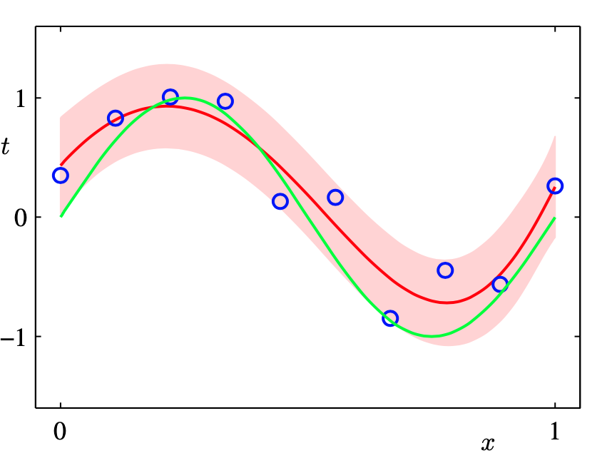
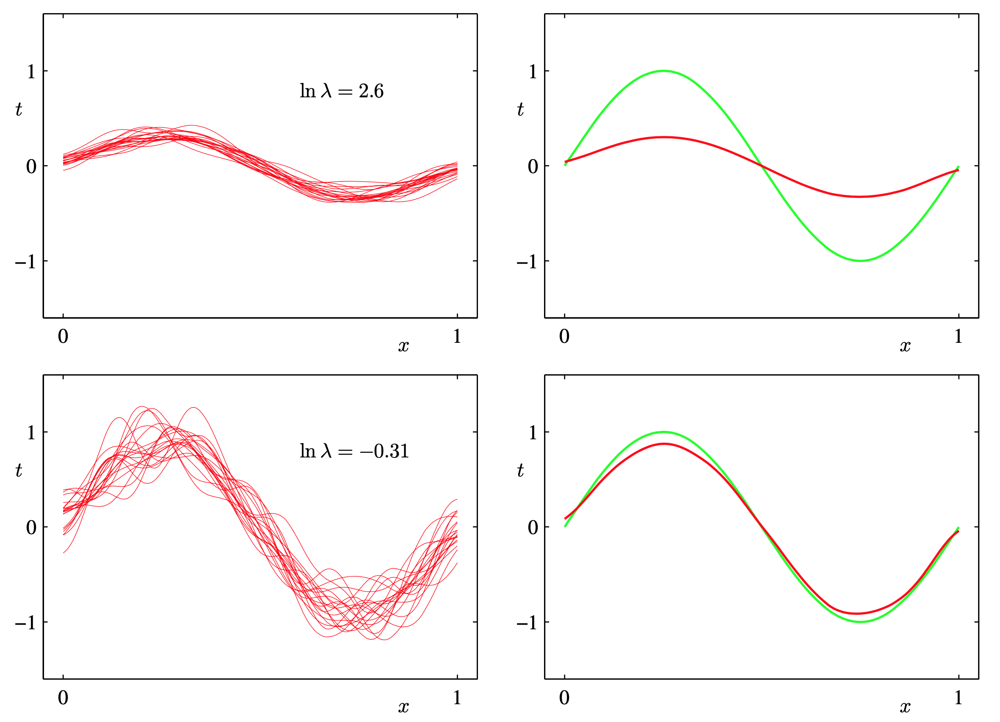
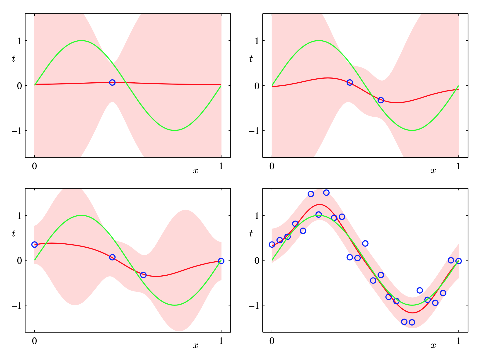
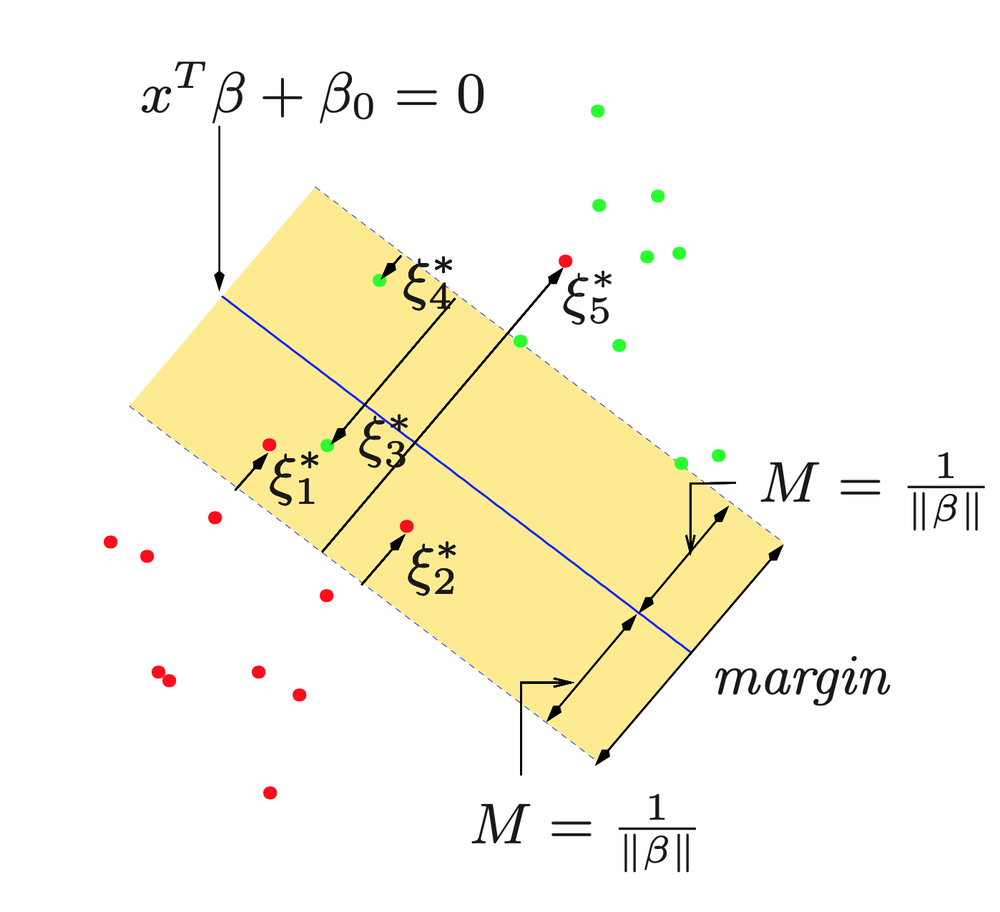
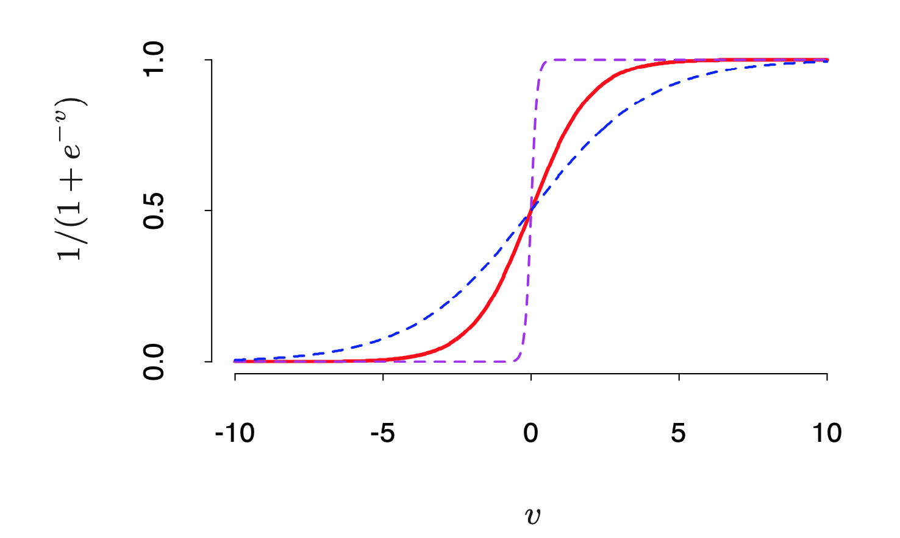
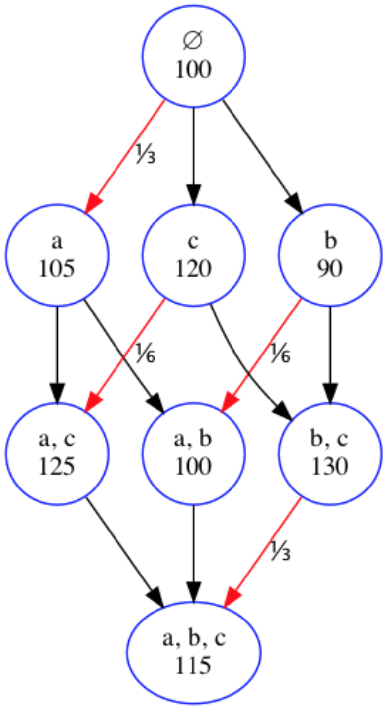
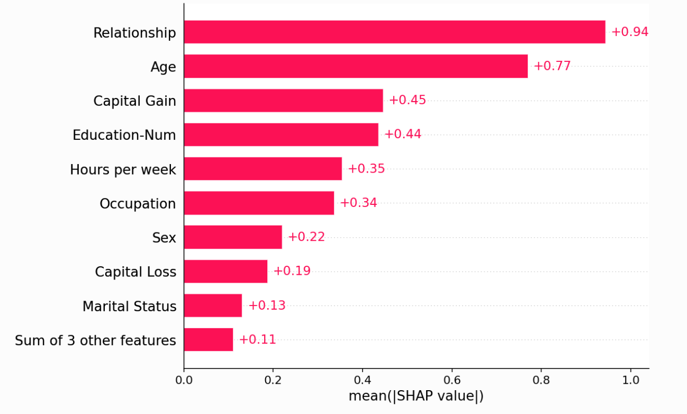

<h1 class='title'>Machine Learning</h1>

- [Linear Models for Regression](#linear-models-for-regression)
  - [Maximum likelihood and least squares](#maximum-likelihood-and-least-squares)
      - [Hypothesis Testing](#hypothesis-testing)
    - [Regularized least squares](#regularized-least-squares)
    - [Bias-Variance decomposition](#bias-variance-decomposition)
  - [Bayesian Linear Regression](#bayesian-linear-regression)
    - [Parameter distribution](#parameter-distribution)
    - [Predictive distribution](#predictive-distribution)
- [Linear Models for Classifications](#linear-models-for-classifications)
    - [Discriminant Functions](#discriminant-functions)
      - [Multiple classes](#multiple-classes)
    - [Least Squares for Classification](#least-squares-for-classification)
    - [Probabilistic Generative Models](#probabilistic-generative-models)
      - [Continuous inputs](#continuous-inputs)
    - [Maximum likelihood solution](#maximum-likelihood-solution)
      - [Regularized Discriminant Analysis](#regularized-discriminant-analysis)
    - [Discrete features](#discrete-features)
  - [Probabilistic Discriminative Models](#probabilistic-discriminative-models)
    - [Logistic regression](#logistic-regression)
- [Combining Models](#combining-models)
  - [Tree-Based Methods](#tree-based-methods)
    - [Regression Trees](#regression-trees)
    - [Classification Trees](#classification-trees)
  - [Ensemble](#ensemble)
    - [Bagging](#bagging)
    - [Boosting](#boosting)
      - [Boosting trees (XGBoost)](#boosting-trees-xgboost)
        - [Hyperparameter Tuning in XGBoost](#hyperparameter-tuning-in-xgboost)
    - [Stacking (Stacked Generalization)](#stacking-stacked-generalization)
    - [Voting Ensemble](#voting-ensemble)
- [Support Vector Machine](#support-vector-machine)
    - [Hard Margin SVM (Linearly Separable)](#hard-margin-svm-linearly-separable)
    - [Soft Margin SVM (Real-World, Noisy Data)](#soft-margin-svm-real-world-noisy-data)
      - [Dual Form \& Kernel Trick](#dual-form--kernel-trick)
    - [Support Vector Machines and Kernels](#support-vector-machines-and-kernels)
- [Neural Networks](#neural-networks)
    - [Fitting Neural Networks](#fitting-neural-networks)
      - [Backpropogation](#backpropogation)
      - [Neural Nets: Non-convex Optimization](#neural-nets-non-convex-optimization)
      - [Some Issues in Training Neural Networks](#some-issues-in-training-neural-networks)
        - [Starting Values](#starting-values)
        - [Overfitting](#overfitting)
        - [Scaling of the Inputs](#scaling-of-the-inputs)
        - [Number of Hidden Units and Layers](#number-of-hidden-units-and-layers)
    - [Regularization in Neural Networks](#regularization-in-neural-networks)
      - [Early stopping](#early-stopping)
      - [Mixture Density Networks](#mixture-density-networks)
- [Interpreting ML](#interpreting-ml)
    - [partial dependence plot](#partial-dependence-plot)
    - [Permutation importance](#permutation-importance)
    - [SHAPLEY Values](#shapley-values)
  - [SHAP](#shap)
        - [Force plot](#force-plot)
- [PCA and K-Means](#pca-and-k-means)
    - [Linear dimensionality reduction](#linear-dimensionality-reduction)
        - [Spectral Decomposition:](#spectral-decomposition)
      - [Singular value decomposition](#singular-value-decomposition)
      - [Limitation of PCA](#limitation-of-pca)
  - [Autoencoders (Advanced PCA) and Nonlinear Dimensionality Reduction](#autoencoders-advanced-pca-and-nonlinear-dimensionality-reduction)
- [Clustering and K-Means](#clustering-and-k-means)
  - [Mixtures of Gaussians](#mixtures-of-gaussians)
    - [The General EM Algorithm](#the-general-em-algorithm)
      - [Relation to K-means](#relation-to-k-means)
  - [The EM Algorithm: Why it Works](#the-em-algorithm-why-it-works)


## Bayesian Probabilities

Bayes’ theorem is used to convert a prior probability into a posterior probability by incorporating the evidence provided by the observed data. We capture our assumptions about $w$, before observing the data, in the form of a prior probability distribution $p(w)$. The effect of the observed data $\mathcal{D}= {t_1, . . . , t_N }$ is expressed through the conditional probability $p(\mathcal{D}|w)$. Bayes’ theorem, which takes the form

$$
p(\bm w\mid \mathcal{D}) = \frac{p(\mathcal{D}\mid \bm w)p(\bm w)}{p(\mathcal{D})}
$$

then allows us to evaluate the uncertainty in $\bm w$ after we have observed $\mathcal{D}$ in the form of the posterior probability $p(\bm w|\mathcal{D})$.

The quantity $p(\mathcal{D}\mid \bm w)$ on the right-hand side of Bayes’ theorem is evaluated for the observed data set $D$ and can be viewed as a function of the parameter vector $\bm w$, in which case it is called the **likelihood** function. It expresses how probable the observed data set is for different settings of the parameter vector w. Note that the likelihood is not a probability distribution over $\bm w$, and its integral with respect to $\bm w$ does not (necessarily) equal one.

Given this definition of likelihood, we can state Bayes’ theorem in words `posterior ∝ likelihood × prior` where all of these quantities are viewed as functions of $\bm w$. The denominator in the equation above is the normalization constant, which ensures that the posterior distribution on the left-hand side is a valid probability density and integrates to one. Indeed, integrating both sides of that equation with respect to $\bm w$, we can express the denominator in Bayes’ theorem in terms of the prior distribution and the likelihood function

$$
p(\mathcal{D}) = \int p(\mathcal{D}|\bm w)p(\bm w) d\bm w
.
$$

In both the Bayesian and frequentist paradigms, the likelihood function $p(\mathcal{D}\mid \bm w)$ plays a central role. However, the manner in which it is used is fundamentally different in the two approaches. In a frequentist setting, $\bm w$ is considered to be a fixed parameter, whose value is determined by some form of ‘estimator’, and error bars on this estimate are obtained by considering the distribution of possible data sets $\mathcal{D}$. By contrast, from the Bayesian viewpoint there is only a single data set $\mathcal{D}$ (namely the one that is actually observed), and the uncertainty in the parameters is expressed through a probability distribution over $\bm w$.

A widely used frequentist estimator is maximum likelihood, in which $\bm w$ is set to the value that maximizes the likelihood function $p(\mathcal{D}\mid \bm w)$. This corresponds to choosing the value of $\bm w$ for which the probability of the observed data set is maximized. In the machine learning literature, the negative log of the likelihood function is called an **error function**. Because the negative logarithm is a monotonically decreasing function, maximizing the likelihood is equivalent to minimizing the error.

One approach to determining frequentist error bars is the **bootstrap** (Efron, 1979; Hastie et al., 2001), in which multiple data sets are created as follows. Suppose our original data set consists of N data points $X= {x_1, \dots,  x_N }$. We can create a new data set $X_B$ by drawing $N$ points at random from $X$, with replacement, so that some points in $X$ may be replicated in $X_B$, whereas other points in $X$ may be absent from $X_B$. This process can be repeated $L$ times to generate $L$ data sets each of size $N$ and each obtained by sampling from the original data set $X$. The statistical accuracy of parameter estimates can then be evaluated by looking at the variability of predictions between the different bootstrap data sets.

One advantage of the Bayesian viewpoint is that the inclusion of prior knowledge arises naturally. Suppose, for instance, that a fair-looking coin is tossed three times and lands heads each time. A classical maximum likelihood estimate of the probability of landing heads would give 1 implying that all future tosses will land heads! By contrast, a Bayesian approach with any reasonable prior will lead to a much less extreme conclusion.

There has been much controversy and debate associated with the relative merits of the frequentist and Bayesian paradigms, which have not been helped by the fact that there is no unique frequentist, or even Bayesian, viewpoint. For instance, one common criticism of the Bayesian approach is that the prior distribution is often selected on the basis of mathematical convenience rather than as a reflection of any prior beliefs. Even the subjective nature of the conclusions through their dependence on the choice of prior is seen by some as a source of difficulty. Reducing the dependence on the prior is one motivation for so-called **noninformative priors**. However, these lead to difficulties when comparing different models, and indeed Bayesian methods based on poor choices of prior can give poor results with high confidence. Frequentist evaluation methods offer some protection from such problems, and techniques such as **cross-validation** remain useful in areas such as model comparison.

## Gaussian Distribution

It is convenient, however, to introduce here one of the most important probability distributions for continuous variables, called the normal or Gaussian distribution.

For the case of a single real-valued variable x, the Gaussian distribution is de-
fined by

$$
\mathcal{N}(x\mid \mu, \sigma^2) = \frac{1}{\sqrt{2\pi}\sigma} \exp\{-\frac{1}{2}\Big(\frac{x-\mu}{\sigma}\Big)^2\}
$$

which is governed by two parameters: $\mu$, called the mean, and $\sigma^2$, called the variance. The square root of the variance, given by $\sigma$, is called the standard deviation, and the reciprocal of the variance, written as β = 1/$\sigma^2$, is called the precision.

Gaussian distribution defined over a D-dimensional vector $x$ of continuous variables, which is given by

$$
\mathcal{N}(\bm x\mid \bm \mu,\bm \Sigma) = \frac{1}{{(2\pi)}^{D/2}} \frac{1}{|\Sigma|^{1/2}}\exp\{-\frac{1}{2}(x-\mu)^T\Sigma^{-1}(x-\mu)\}
$$

where the $D$-dimensional vector $\mu$ is called the mean, the $D × D$ matrix Σ is called the covariance, and $|Σ|$ denotes the determinant of $Σ$. The log likelihood function is:

$$
\ln p(\bm x \mid \mu, \sigma^2) = − \frac{1}{2\sigma^2}\sum_{n=1}^N\big(x_n-  \mu) ^2 + \frac{N}{2}\ln \sigma^2 − \frac{N}{2}\ln(2\pi)
.
$$

The maximum likelihood solution with respect to $\mu$ given by:

$$
\mu_{ML} = \frac{1}{N}\sum_{n=1}^N x_n
$$

which is the _sample mean_, i.e., the mean of the observed values $\{x_n\}$. Similarly, maximizing likelihood with respect to $σ^2$, we obtain the maximum likelihood solution for the variance in the form

$$
\sigma^2_{ML} = \frac{1}{N}\sum_{n=1}^N (x_n-\mu_{ML})^2
$$

which is the _sample variance_ measured with respect to the sample mean $\mu_{ML}$.

Note that the maximum likelihood solutions $µ_ML$ and $\sigma^2_{ML}$ are functions of the data set values $x_1, . . . , x_N$ . Consider the expectations of these quantities with respect to the data set values, which themselves come from a Gaussian distribution with parameters $µ_{ML}$ and $\sigma^2_{ML}$. It is straightforward to show that

$$
\begin{align*}
\mathbb E[\mu_{ML}] &= \mu\\
\mathbb E[\sigma^2_{ML}] &= \frac{N-1}{N}\sigma^2
\end{align*}
$$

so that on average the maximum likelihood estimate will obtain the correct mean but will underestimate the true variance by a factor $(N− 1)/N$. It follows that the following estimate for the variance parameter is unbiased:

$$
\tilde\sigma^2 = \frac{N-1}{N}\sigma^2_{ML} = \frac{1}{N-1}\sum_{n=1}^N (x_n-\mu_{ML})^2
$$

<p align="center">
    
</p>

The green curve shows the true Gaussian distribution from which data is generated, and the three red curves show the Gaussian distributions obtained by fitting to three data sets, each consisting of two data points shown in blue, us- ing the maximum likelihood results. Averaged across the three data sets, the mean is correct, but the variance is systematically under-estimated because it is measured relative to the sample mean and not relative to the true mean.

## Curve Fitting

Here we dicuss the curve fitting example and view it from a probabilistic perspective, thereby gaining some insights into error functions and regularization, as well as taking us towards a full Bayesian treatment. The goal in the curve fitting problem is to be able to make predictions for the target variable $t$ given some new value of the input variable $x$ on the basis of a set of training data comprising N input values $x = (x_1, . . . , x_N )$ and their corresponding target values $t = (t_1, . . . , t_N )$. We can express our uncertainty over the value of the target variable using a probability distribution. For this purpose, we shall assume that, given the value of $x$, the corresponding value of $t$ has a Gaussian distribution with a mean equal to the value $y(x,w)$ of the polynomial curve given by

$$
y(x,\bm w) = w_0 + w_1x + w_2x^2 +. . . + w_M x^M
= \sum_{j=0}^M w_jx^j.
$$

Thus we have

$$
p(t|x,\bm w, β) = \mathcal{N}(t|y(x,\bm w), β^{−1})
$$

Here we have defined a precision parameter β corresponding to the inverse variance of the distribution $\beta^{-1}=\sigma^2$.

<p align="center">
    
</p>

We now use the training data $\{\bm x, \bm t\}$ to determine the values of the unknown parameters $\bm w$ and β by maximum likelihood. If the data are assumed to be drawn independently from the distribution $p(t|x,\bm w, β)$, then the likelihood function is given by

$$
p(\bm t|\bm x,\bm w, β) = \prod_{n=1}^N \mathcal{N}(t_n \mid y(x_n, \bm w), \beta^{-1})
$$

It is convenient to maximize the logarithm of the likelihood function:

$$
\ln p(t|x, \bm w, β) =− \frac{\beta}{2}\sum_{n=1}^N\big(y(x_n, \bm w)− t_n\big )^2 + \frac{N}{2}\ln β − \frac{N}{2}\ln(2\pi)
.
$$

Consider first the determination of the maximum likelihood solution for the polynomial coefficients, which will be denoted by $\bm w_{ML}$ determined by maximizing w.r.t $\bm w$. For this purpose, we omit the last two terms on the right-hand side because they do not depend on $\bm w$. Also, we note that scaling the log likelihood by a positive constant coefficient does not alter the location of the maximum with respect to $\bm w$, and so we can replace the coefficient $β/2$ with $1/2$. We therefore see that maximizing likelihood is equivalent, so far as determining $\bm w$ is concerned, to minimizing the sum-of-squares error function defined by the above equation. Thus the sum-of-squares error function has arisen as a consequence of maximizing likelihood under the assumption of a **Gaussian noise distribution**.

We can also use maximum likelihood to determine the precision parameter β of the Gaussian conditional distribution. Maximizing (1.62) with respect to β gives

$$
\frac{1}{\beta_{ML}} = \frac{1}{N}\sum_{n=1}^N \big( y(x_n, \bm w_{ML}) - t_n\big)^2
$$

Having determined the parameters $\bm w$ and β, we can now make predictions for new values of $x$:

$$
p(\bm t \mid  x,\bm w_{ML}, \beta_{ML}) = \mathcal{N}(t \mid y(x, \bm w_{ML}), \beta^{-1}_{ML})
$$

Now let us take a step towards a more Bayesian approach and introduce a prior distribution over the polynomial coefficients $\bm w$. For simplicity, let us consider a Gaussian distribution of the form

$$
p(\bm w|α) = \mathcal{N}(\bm w\mid \bm 0, α^{−1}\bm I) = \Big(\frac{α}{2π}\Big)^{(M+1)/2}\exp\{−\frac{α}{2}\bm w^T \bm w\}
$$

where α is the precision of the distribution, and $M+1$ is the total number of elements in the vector $\bm w$ for an $M$th order polynomial. Variables such as α, which control the distribution of model parameters, are called _hyperparameters_. Using Bayes’ theorem, the posterior distribution for w is proportional to the product of the prior distribution and the likelihood function

$$
p(w\mid \bm x, \bm t, α, β) = \frac{p(\bm t\mid \bm x, w, β)p(w|α)}{\int p(\bm t\mid \bm x,\bm w)p(\bm w)dw}
$$

Or,

$$
p(w\mid \bm x, \bm t, α, β) ∝ p(\bm t\mid \bm x, w, β)p(w|α).
$$

We can now determine $w$ by finding the most probable value of $w$ given the data, in other words by maximizing the posterior distribution. This technique is called **maximum posterior**, or simply **MAP**. Taking the negative logarithm of the above and combining with the equation before, we find that the maximum of the posterior is given by the minimum of

$$
\frac{\beta}{2}\sum_{n=1}^N \big(y(x_n, \bm w)− t_n\big)^2 +
\frac{\alpha}{2}\bm w^T \bm w.
$$

Thus we see that maximizing the posterior distribution is equivalent to minimizing the regularized sum-of-squares error function, with a regularization parameter given by $λ= α/β$. In a fully Bayesian approach, we should consistently apply the sum and product rules of probability, which requires, as we shall see shortly, that we integrate over all values of $\bm w$. Such marginalizations lie at the heart of Bayesian methods for pattern recognition.

Now suppose we are given the training data $\bm x$ and $\bm t$, along with a new test point $x$, and our goal is to predict the value of $t$. We therefore wish to evaluate the predictive distribution $p(t|x,\bm x, \bm t)$. Here we shall assume that the parameters $α$ and $β$ are fixed and known in advance (in later chapters we shall discuss how such parameters can be inferred from data in a Bayesian setting). A Bayesian treatment simply corresponds to a consistent application of the sum and product rules of probability, which allow the predictive distribution to be written in the form

$$
p(t|x,\bm x, \bm t) = \int p(t|x, \bm w)p(\bm w|\bm x, \bm t) d\bm w.
$$

Here $p(t|x, \bm w)$ is given above, and we have omitted the dependence on α and β to simplify the notation. Here $p(\bm w|\bm x, \bm t)$ is the posterior distribution over parameters. We shall see this posterior distribution is a Gaussian and can be evaluated analytically. Similarly, the integration can also be performed analytically with the result that the predictive distribution is given by a Gaussian of the form

$$
p(t|x, \bm x, \bm t) = \mathcal{N}(t|m(x), s^2(x))
$$

where the mean and variance are given by:

$$
\begin{align*}
m(x) = \beta \phi(x)^T \bm S \sum_{n=1}^N \phi(x_n) t_n\\
s^2(x) = \beta^{-1} + \phi(x)^T \bm S \phi(x)
\end{align*}
$$

Here the matrix $\bm S$ is given by:

$$
\bm S^{-1} = \alpha \bm I + \beta \sum_{n=1}^N \phi(x_n)\phi(x)^T
$$

where $\bm I$ is the unit matrix, and we have defined the vector $\phi(x)$ with elements $\phi_i(x) = x^i$ for $i = 0, \dots , M$. We see that the variance, as well as the mean, of the predictive distribution is dependent on $x$. The first term in represents the uncertainty in the predicted value of $t$ due to the noise on the target variables and was expressed already in the maximum likelihood predictive distribution through $β−1$ ML. However, the second term arises from the uncertainty in the parameters $w$ and is a consequence of the Bayesian treatment. The predictive distribution for the synthetic sinusoidal regression problem:

<p align="center">
    
</p>

The predictive distribution resulting from a Bayesian treatment of polynomial curve fitting using an $M = 9$ polynomial, with the fixed parameters $α = 5 × 10−3$ and $β=11.1$ (corresponding to the known noise variance), in which the red curve denotes the mean of the predictive distribution and the red region corresponds to ±1 standard deviation around the mean.

## Model Selection

With regularized least squares, the regularization coefficient λ also controls the effective complexity of the model, whereas for more complex models, such as mixture distributions or neural networks there may be multiple parameters governing complexity. 

Furthermore, as well as finding the appropriate values for complexity parameters within a given model, we may wish to consider a range of different types of model in order to find the best one for our particular application. If data is plentiful, then one approach is simply to use some of the available data to train a range of models, or a given model with a range of values for its complexity parameters, and then to compare them on independent data, sometimes called a _validation set_, and select the one having the best predictive performance. If the model design is iterated many times using a limited size data set, then some over-fitting to the validation data can occur and so it may be necessary to keep aside a third _test set_ on which the performance of the selected model is finally evaluated.

In many applications, however, the supply of data for training and testing will be limited, and in order to build good models, we wish to use as much of the available data as possible for training. However, if the validation set is small, it will give a relatively noisy estimate of predictive performance. One solution to this dilemma is to use _cross-validation_.  This allows a proportion (S− 1)/S of the available data to be used for training while making use of all of the data to assess performance. When data is particularly scarce, it may be appropriate to consider the case S= N, where N is the total number of data points, which gives the _leave-one-out_ technique. In general, cross-validation works by taking the available data and partitioning it into S groups (in the simplest case these are of equal size). Then S− 1 of the groups are used to train a set of models that are then evaluated on the remaining group. This procedure is then repeated for all S possible choices for the held-out group, indicated here by the red blocks, and the performance scores from the S runs are then averaged.

<p align="center">
    
</p>


One major drawback of cross-validation is that the number of training runs that must be performed is increased by a factor of S, and this can prove problematic for models in which the training is itself computationally expensive. A further problem with techniques such as cross-validation that use separate data to assess performance is that we might have multiple complexity parameters for a single model (for instance, there might be several regularization parameters). Exploring combinations of settings for such parameters could, in the worst case, require a number of training runs that is exponential in the number of parameters.

### Curse of Dimensionality

It refers to the complexity of modeling of high dimensional data. An increase in the dimensions means an increase in the number of features. To model such data, we need to increase complexity of the model by increasing the number of parameters. The complexity of functions of many variables can grow exponentially with the dimension, and if we wish to be able to estimate such functions with the same accuracy as function in low dimensions, then we need the size of our training set to grow exponentially as well.

As another simple example, consider a sphere of radius $r = 1$ in a space of D dimensions, and ask what is the fraction of the volume of the sphere that lies between radius $r = 1−ϵ$ and $r = 1$. We can evaluate this fraction by noting that the volume of a sphere of radius $r$ in D dimensions must scale as $r$D, and so we write $V_D(r) = K_D r^D$ where K_D depends on D. Then 

$$
\frac{v_D(1)-V_D(1-\epsilon)}{V_D(1)} = 1 - (1-\epsilon)^D
$$

which tends to 1 ad D increases. Thus, in spaces of high dimensionality, most of the volume of a sphere is concentrated in a thin shell near the surface! Another similar example: in a high-dimensional space, most of the probability mass of a Gaussian is located within a thin shell at a specific radius. Simialrly, most of density for a multivariate unit uniform distribution is consentrated around the sides of the unit box. This leads to sparse sampling in high dimensions that means all sample points are close to an edge of the sample space.

One more example, consider the nearest-neighbor procedure for inputs uniformly distributed in a $d$-dimensional unit hypercube. Suppose we send out a hypercubical neighborhood about a target point to capture a fraction $r$ of the observations. Since this corresponds to a fraction r of the unit volume, the expected edge length will be $e_d(r) = r^{1/d}$. In ten dimensions $e_{10}(0.01) = 0.63$ and $e_{10}(0.1) = 0.80$, while the entire range for each input is only 1.0. So to capture 1% or 10% of the data to form a local average, we must cover 63% or 80% of the range of each input variable. Such neighborhoods are no longer “local.” Reducing $r$ dramatically does not help much either, since the fewer observations we average, the higher is the variance of our fit. 

Although the curse of dimensionality certainly raises important issues for pattern recognition applications, it does not prevent us from finding effective techniques applicable to high-dimensional spaces. 

First, real data will often be confined to a region of the space having lower effective dimensionality, and in particular the directions over which important variations in the target variables occur may be so confined. Second, real data will typically exhibit some smoothness properties (at least locally) so that for the most part small changes in the input variables will produce small changes in the target variables, and so we can exploit local interpolation-like techniques to allow us to make predictions of the target variables for new values of the input variables. For example, consider images captured of identical planar objects on a conveyor belt, in which the goal is to determine their orientation. Each image is a point in a high-dimensional space whose dimensionality is determined by the number of pixels. Because the objects can occur at different positions within the image and in different orientations, there are three degrees of freedom of variability between images, and a set of images will live on a three dimensional manifold embedded within the high-dimensional space.

## Inference and Decision

For an input vector $\bm x$ together with a corresponding vector $\bm t$ of target variables, and our goal is to predict $\bm t$ given a new value for $\bm x$. For regression problems, $\bm t$ will comprise continuous variables, whereas for classification problems $\bm t$ will represent class labels. The joint probability distribution $p(\bm x, \bm t)$ provides a complete summary of the uncertainty associated with these variables. Determination of $p(\bm x, \bm t)$ from a set of training data is an example of **inference** and is typically a very difficult problem. Although $p(\bm x, \bm t)$ can be a very useful and informative quantity, in the end we must decide which target value is assigned to the new $\bm x$. This is the **decision** step, and it is the subject of decision theory to tell us how to make optimal decisions given the appropriate probabilities. We shall see that the decision stage is generally very simple, even trivial, once we have solved the inference problem.

In classification problems, we are interested in the probabilities of the two classes given input $\bm x$, which are given by $p(C_k\mid \bm x)$. Using Bayes’ theorem, these probabilities can be expressed in the form
$$
p(C_k \mid \bm x) = \frac{p(\bm x\mid C_k)p(C_k)}{p(\bm x)}
$$

Note that any of the quantities appearing in Bayes’ theorem can be obtained from the joint distribution $p(\bm x, C_k)$ by either marginalizing or conditioning with respect to the appropriate variables. We can now interpret $p(C_k)$ as the prior probability for the class $C_k$, and $p(C_k\mid \bm x)$ as its posterior probability. For example, $p(C_1)$ represents the probability that a person has cancer, before we take the X-ray measurement. Similarly, $p(C_1\mid \bm x)$ is the corresponding probability, revised using Bayes’ theorem in light of the information contained in the X-ray. If our aim is to minimize the chance of assigning x to the wrong class, then intuitively we would choose the class having the higher posterior probability.

We need a rule that assigns each value of $\bm x$ to one of the available classes. Such a rule will divide the input space into regions $R_k$ called **decision regions**, one for each class, such that all points in $R_k$ are assigned to class $C_k$. The boundaries between decision regions are called **decision boundaries**. Note that each decision region need not be contiguous but could comprise some number of disjoint regions. In the case of 2 classes, a mistake occurs when an input vector belonging to class $C_1$ is assigned to class $C_2$ or vice versa. The probability of this occurring is given by

$$
\begin{align*}
p(\text{mistake}) &= p(x ∈ R_1, C_2) + p(x ∈ R_2, C_1) \\
&= \int_{R_1} p(x, C_2) dx + \int_{R_2}p(x, C_1) dx.
\end{align*}
$$

To minimize $p(\text{mistake}) $, we should arrange that each $\bm x$ is assigned to whichever class has the smaller value of the integrand in this equation. Thus, if $p(\bm x, C_1)  > p(\bm x, C_2)$ for a given value of $\bm x$, then we should assign that $\bm x$ to class $C_1$. From the product rule of probability we have $p(\bm x, C_k) = p(C_k \mid \bm x)p(\bm x)$. Because the factor $p(\bm x)$ is common to both terms, we can restate this result as saying that the minimum probability of making a mistake is obtained if each value of $\bm x$ is assigned to the class for which the posterior probability $p(C_k \mid \bm x)$ is largest.

### Minimizing the expected loss

For many applications, our objective will be more complex than simply minimizing the number of misclassifications. That is why we introduce a **loss function**, also called a _cost function_, which is a single, overall measure of loss incurred in taking any of the available decisions or actions. Our goal is then to minimize the total loss incurred. Suppose that, for a new value of $\bm x$, the true class is $C_k$ and that we assign $\bm x$ to class $C_j$ (where $j$ may or may not be equal to $k$). In so doing, we incur some level of loss that we denote by $L_{kj}$, which we can view as the $k, j$ element of a loss matrix. For a given input vector $\bm x$, our uncertainty in the true class is expressed through the joint probability distribution $p(\bm x, C_k)$ and so we seek instead to minimize the average loss, where the average is computed with respect to this distribution, which is given by

$$
\begin{align*}
\mathbb E[L] &= \sum_k \sum_j \int_{R_j} L_{jk} \; p(\bm x, C_k) d\bm x\\
&= \sum_j \int_{R_j} \sum_k L_{jk} \; p(\bm x, C_k) d\bm x
\end{align*}
$$

Each $\bm x$ can be assigned independently to one of the decision regions $R_j$. Our goal is to choose the regions $R_j$ in order to minimize the expected loss, which implies that for each $\bm x$, we should minimize $\sum_k L_{jk} \; p(\bm x, C_k)$. As before, we can use the product rule $p(\bm x, C_k) = p(C_k \mid \bm x)p(\bm x)$ to eliminate the common factor of $p(x)$. Thus the decision rule that minimizes the expected loss is the one that assigns each new $\bm x$ to the class $j$ for which the quantity 
$$
\sum_k L_{kj}p(C_k\mid \bm x)
$$

is a minimum. This is clearly trivial to do, once we know the posterior class probabilities $p(C_k\mid \bm x)$. 

#### Rejection Option

Classification errors arise from the regions of input space where the largest of the posterior probabilities $p(C_k\mid \bm x)$ is significantly less than unity, or equivalently where the joint distributions $p(\bm x, C_k)$ have comparable values. These are the regions where we are relatively uncertain about class membership. In some applications, it will be appropriate to avoid making decisions on the difficult cases in anticipation of a lower error rate on those examples for which a classification decision is made. This is known as the **reject option**. We can achieve this by introducing a threshold θ and rejecting those inputs x for which the largest of the posterior probabilities $p(C_k\mid \bm x)$ is less than or equal to θ.  Note that setting θ = 1 will ensure that all examples are rejected, whereas if there are K classes then setting θ < 1/K will ensure that no examples are rejected. Thus the fraction of examples that get rejected is controlled by the value of θ.

<p align="center">
    
</p>

### Loss functions for regression
So far, we have discussed decision theory in the context of classification problems. We now turn to the case of regression problems, such as the curve fitting example discussed earlier. The decision stage consists of choosing a specific estimate $y(\bm x)$ of the value of $t$ for each input $\bm x$. Suppose that in doing so, we incur a loss $L(t, y(\bm x))$. The average, or expected, loss is then given by

$$
\mathbb E[L] = \int\int L(t, y(\bm x)) p(\bm x, t) d\bm xdt
$$

A common choice of loss function in regression problems is the squared loss given by $L(t, y(\bm x)) =( {y(\bm x)− t}) ^2$:

$$
\mathbb E[L] = \int\int \{y(\bm x)− t\}^2 p(\bm x, t) d\bm xdt
$$

Our goal is to choose $y(\bm x)$ so as to minimize $\mathbb E[L]$. If we assume a completely flexible function $y(\bm x)$:

$$
\frac{\partial \mathbb E[L] }{\partial y(\bm x)} = 2 \int \{y(\bm x)− t\} p(\bm x, t) dt = 0.
$$

So:

$$
y(\bm x) = \frac{\int t p(\bm x, t) dt}{p(\bm x)} = \int t p(t\mid \bm x)dt = \mathbb E_t[t\mid \bm x]
$$

This can readily be extended to multiple target variables represented by the vector $\bm t$, in which case the optimal solution is the conditional average $y(\bm x) = \mathbb E_t[\bm t|\bm x]$.

<p align="center">
    
</p>

We can also derive this result in a slightly different way, which will also shed light on the nature of the regression problem. Armed with the knowledge that the optimal solution is the conditional expectation, we can expand the square term as follows

$$
\begin{align*}
\{y(\bm x)− t\}^2 &= \{y(\bm x)−  \mathbb E_t[ t|\bm x] +  \mathbb E_t[ t|\bm x] - t \}^2\\
&= \{y(\bm x) −  \mathbb E_t[ t|\bm x] \}^2 \\
&+  2 \{y(\bm x) - \mathbb E_t[ t|\bm x] \} \{\mathbb E_t[ t|\bm x] - t \} \\
&+  \{\mathbb E_t[ t|\bm x] - t \}^2
\end{align*}
$$

Substituting into the loss function and performing the integral over $t$, we see that the cross-term vanishes and we obtain an expression for the loss function in the form

$$
\begin{align*}
\mathbb E[L] & = \int  \{y(\bm x) −  \mathbb E_t[ t|\bm x] \}^2 p(\bm x)d\bm x +  
\int \{h(x) - t \}^2 p(\bm x, t)d\bm x dt  
% \int \text{Var}(t \mid \bm x)  p(\bm x)d\bm x
\end{align*}
$$

The function $y(\bm x)$ we seek to determine enters only in the first term, which will be minimized when $y(\bm x)= \mathbb E_t[ t|\bm x]$, in which case this term will vanish. rgets, and is called the Bayes error.
$y(\bm x)= \mathbb E_t[ t|\bm x]$ is the best we can ever hope to do with any learning algorithm. This is simply the result that we derived previously and that shows that the optimal least squares predictor is given by the conditional mean. The second term (called Bayes error) is the variance of the distribution of $t$, averaged over $\bm x$:
\[
\int \text{Var}(t \mid \bm x)  p(\bm x)d\bm x
\]

It represents the intrinsic variability of the target data and can be regarded as **noise**. Because it is independent of $y(\bm x)$, it represents the irreducible minimum value of the loss function. 


### Entropy

Considere a discrete random variable $\bm x$ and we ask how much information is received when we observe a specific value for this variable. The amount of information can be viewed as the ‘degree of surprise’ on learning the value of $\bm x$. If we are told that a highly improbable event has just occurred, we will have received more information than if we were told that some very likely event has just occurred, and if we knew that the event was certain to happen we would receive no information. Our measure of information content will therefore depend on the probability distribution $p(x)$, and we therefore look for a quantity $h(x)$ that is a monotonic function of the probability p(x) and that expresses the information content. Note that if we have two events $x$ and $y$ that are unrelated, then the information gain from observing both of them should be the sum of the information gained from each of them separately, so that $h(x, y) = h(x) + h(y)$. Two unrelated events will be statistically independent and so $p(x, y) = p(x)p(y)$. From these two relationships, it is easily shown that $h(x)$ must be given by the logarithm of $p(x)$: $ h(x) = -\log p(x)$. Note that low probability events $x$ correspond to high information content. The average amount of information is obtained by taking the expectation with respect to the distribution $p(x)$:

$$
H[x] =− \sum_x p(x) \log p(x).
$$

This important quantity is called the **entropy** of the random variable $x$. Note that $\lim_{p→0} p \ln p = 0$ and so we shall take $p(x) \ln p(x) = 0$ whenever we encounter a value for x such that $p(x) = 0$. _Distributions $p(x)$ that are sharply peaked around a few values will have a relatively low entropy, whereas those that are spread more evenly across many values will have higher entropy_. 

For example, when one of $p(x_i)$ is 1 and the rest is zero, entropy is at its minimum value 0. But if $p(x_1)=\dots=p(x_n)=1/n$ (all equal), the entropy is at maximum value $n$. Entropy defintion for continuous variables is similar: $H[x] = -\int  p(x) \log p(x) dx$. 

# Linear Models for Regression

The simplest form of linear regression models are also linear functions of the input variables. However, we can obtain a much more useful class of functions by taking linear combinations of a fixed set of nonlinear functions of the input variables, known as basis functions. Such models are linear functions of the parameters, which gives them simple analytical properties, and yet can be nonlinear with respect to the input variables.

The simplest linear model for regression is one that involves a linear combination of the input variables

\[
y(\bm x,\bm w) = w_0 + w_1x_1 +. . . + w_Dx_D
\]

where $x = (x_1, . . . , x_D)^T$. This is often simply known as_linear regression_. The key property of this model is that it is a linear function of the parameters $w_0, . . . , w_D$. It is also, however, a linear function of the input variables $x_i$, and this imposes significant limitations on the model. We therefore extend the class of models by considering linear combinations of fixed nonlinear functions of the input variables, of the form

\[
    y(\bm x,\bm w) = w_0 +\sum_{j=1}^{M−1} w_jφ_j(\bm x)
\]

where $φ_j(\bm x)$ are known as basis functions. By denoting the maximum value of the index $j$ by $M− 1$, the total number of parameters in this model will be $M$. The parameter $w_0$ allows for any fixed offset in the data and is sometimes called a bias parameter (not to be confused with ‘bias’ in a statistical sense). It is often convenient to define an additional dummy ‘basis function’ $φ_0(x) = 1$ so that

\[
    y(\bm x,\bm w) = \sum_{j=0}^{M−1} w_jφ_j(\bm x) = \bm w^T \bm \phi(x)
\]

The example of polynomial regression mentioned before is a particular example of this model in which there is a single input variable $x$, and the basis functions take the form of powers of $x$ so that $φ_j(x) = x^j$. One limitation of polynomial basis functions is that they are global functions of the input variable, so that changes in one region of input space affect all other regions. There are many other possible choices for the basis functions, for example

\[
φ_j(\bm x) = \exp\{-\frac{(x-\mu_j)^2}{2s^2} \}
\]

where the $µ_j$ govern the locations of the basis functions in input space, and the parameter $s$ governs their spatial scale. These are usually referred to as ‘Gaussian’ basis functions, although it should be noted that they are not required to have a probabilistic interpretation, and in particular the normalization coefficient is unimportant because these basis functions will be multiplied by adaptive parameters $w_j$. Another possibility is the sigmoidal basis function of the form

\[
φ_j(\bm x) = \sigma \Big (\frac{x-\mu_j}{s} \Big)
\]
 
 where $σ(a)$ is the sigmoid function. Yet another possible choice of basis function is the Fourier basis, which leads to an expansion in sinusoidal functions. Each basis function represents a specific frequency and has infinite spatial extent. Most of the discussion in this chapter, however, is independent of the particular choice of basis function set, and so for most of our discussion we shall not specify the particular form of the basis functions including the identity $φ(\bm x) =\bm x$.

 ## Maximum likelihood and least squares

 As before, we assume that the target variable $t$ is given by a deterministic function $y(\bm x,\bm w)$ with additive Gaussian noise so that

\[
t = y(\bm x,\bm w) + \epsilon,
\]

where $\epsilon$ is a zero mean Gaussian random variable with precision (inverse variance) β. Thus we can write
\[
p(t|\bm x, \bm w, β) = \mathcal N (t\mid y(\bm x,\bm w), β^{−1}).
\]

Recall that, if we assume a squared loss function, then the optimal prediction, for a new value of $\bm x$, will be given by the conditional mean of the target variable. In the case of a Gaussian conditional distribution of the form, the conditional mean will be simply

\[
\mathbb E[t\mid \bm x] = \int tp(t\mid \bm x) dt= y(\bm x, \bm w).
\]

Note that the Gaussian noise assumption implies that the conditional distribution of $t$ given $\bm x$ is unimodal, which may be inappropriate for some applications. An extension to mixtures of conditional Gaussian distributions, which permit _multimodal conditional distributions_, will be discussed later.

Now consider a data set of inputs $\bm X= \{ x_1, . . . ,x_N \}$ with corresponding target values $\bm t = (t_1, . . . , t_N)$ .  Making the assumption that these data points are drawn independently from the distribution (equivalently, $ϵ_i$ are distributed IID), we obtain the following expression for the likelihood function, which is a function of the adjustable parameters $\bm w$ and β, in the form

\[
p(\bm t \mid \bm X, \bm w, \beta) = \prod_{n=1}^N \mathcal N(t_n \mid \bm w^T \bm \phi(\bm x_n), \beta^{-1})
\]

Note that in supervised learning problems such as regression (and classification), we are not seeking to model the distribution of the input variables. Thus $x$ will always appear in the set of conditioning variables, and so from now on we will drop the explicit $x$ from expressions to keep the notation uncluttered. Taking the logarithm of the likelihood function, and making use of the standard form for the univariate Gaussian, we have

\[
\begin{align*}
\ln p(\bm t \mid \bm w, \beta) &= \sum_{n=1}^N \ln \mathcal N(t_n \mid \bm W^T \bm \phi(\bm x_n), \beta^{-1}) \\
& = \frac{N}{2} \ln \beta - \frac{N}{2} \ln 2\pi - \beta E_D(\bm w)
\end{align*}
\]

where 

\[
E_D(\bm w) = \frac{1}{2} \sum_{n=1}^N \{ t_n - \bm w^T \bm \phi(\bm x_n)\}^2 = \frac{1}{2} (\bm t - \bm  \Phi \bm w)^T(\bm t - \bm \Phi \bm w)
\]

Having written down the likelihood function, we can use maximum likelihood to determine $\bm w$ and $β$. Consider first the maximization with respect to $\bm w$.  **We see that maximization of the likelihood function under a conditional Gaussian noise distribution for a linear model is equivalent to minimizing a sum-of-squares error function given by $E_D(\bm w)$**. The gradient of the log likelihood function takes the form

\[
\begin{align*}
\nabla_{\bm w} \ln p(\bm t \mid \bm w, \beta) &= \sum_{n=1}^N \bm \phi(\bm x_n)^T \{ t_n - \bm w^T \bm \phi(\bm x_n)\} = \bm \Phi^T(\bm t - \bm \Phi \bm w), \\
\nabla^2_{\bm w} \ln p(\bm t \mid \bm w, \beta) &= \bm \Phi^T \bm \Phi.
\end{align*}
\]

Setting this gradient to zero and solving for $\bm w$, we obtain:

\[
\begin{align*}
\bm w_{ML} = (\bm \Phi^T \bm \Phi)^{-1} \bm \Phi^T \bm t
\end{align*}
\]

which are known as the normal equations for the least squares problem. Here $Φ$ is an N×M matrix, called the _design matrix_, whose elements are given by $Φ_{nj}= φ_j(x_n)$, so that

\[
\Phi = 
\begin{pmatrix}
 \phi_0(\bm x_1) & \phi_0(\bm x_1) &\dots& \phi_{M-1}(\bm x_1) \\
 \phi_0(\bm x_2) & \phi_0(\bm x_2) &\dots& \phi_{M-1}(\bm x_2) \\
 \vdots & \vdots & \dots & \vdots\\
 \phi_0(\bm x_N) & \phi_0(\bm x_N) &\dots& \phi_{M-1}(\bm x_N) 
\end{pmatrix}
\]

The quantity $\bm \Phi^{\dagger} = (\bm \Phi^T \bm \Phi)^{-1} \bm \Phi^T$ is known as the Moore-Penrose pseudo-inverse of the matrix. It can be regarded as a generalization of the notion of matrix inverse to nonsquare matrices. We can also maximize the log likelihood function  with respect to the noise precision parameter β, giving

\[
\begin{align}
\frac{1}{\beta_{ML}} = \frac{1}{N}\sum_{n=1}^N \{ t_n - \bm w^T_{ML} \bm \phi(\bm x_n)\}^2
\end{align}
\]

and so we see that the inverse of the noise precision is given by the residual variance of the target values around the regression function. Geometrical interpretation of the least-squares solution, in an N-dimensional space whose axes are the values of $t_1, . . . , t_N$ of the outputs in the training set. The least-squares regression function is obtained by finding the orthogonal projection of the data vector $\bm t=(t_1, . . . , t_N)$ onto the subspace spanned by the basis functions $φ_j(\bm x)$ in which each basis function is viewed as a vector $ϕ_j$ of length N with elements $φ_j(\bm x_n)$.

<p align="center">
    
</p>

In practice, a direct solution of the normal equations can lead to numerical difficulties when $Φ^TΦ$ is close to singular. In particular, when two or more of the basis vectors $ϕ_j$ are **co-linear** (perfectly correlated), or _nearly so_, the resulting parameter values can have large magnitudes or not uniquely defined. However, the fitted values are still the projection of $\bm t$ onto the space of $ϕ_j$s; there would just be more than one way to express that projection in terms of $ϕ_j$s. Such near degeneracies will not be uncommon when dealing with real data sets. The resulting numerical difficulties can be addressed using the technique of singular value decomposition, or SVD (Press et al., 1992; Bishop and Nabney, 2008). Most regression software packages detect these redundancies and automatically implement some strategy for removing them. Rank deficiencies can also occur in signal and image analysis, where the number of inputs can exceed the number of training cases N. In this case, the features are typically reduced by filtering. Note that the addition of a regularization term ensures that the matrix is non-singular, even in the presence of degeneracies.

In machine learning the more common way to optimize the objective function is to use iterative algorithms such as **gradient descent**:

$$
\bm w^{(\tau+1)} \leftarrow \bm w^{(\tau)} - \alpha \nabla_{\bm w} E_D(\bm w) 
$$

The constant $α$ is known as a **learning rate**, typically with small values e.g. 0.01 or 0.0001 . With gradient descent, we never actually reach the optimum, but merely approach it gradually. Why, then, would we ever prefer gradient descent? Two reasons:

1. We can only solve the system of equations in closed-form for a handful of models. By contrast, we can apply gradient descent to any model for which we can compute the gradient. Importantly, this can usually be done automatically, so software packages like Theano and TensorFlow can save us from ever having to compute partial derivatives by hand.

2. Solving a large system of linear equations can be expensive (matrix inversion is an $\mathcal O(D^3)$ algorithm), possibly many orders of magnitude more expensive than a single gradient descent update. Therefore, gradient descent can sometimes find a reasonable solution much faster than solving the linear system. Therefore, gradient descent is often more practical than computing exact solutions, even for models where we are able to derive the latter.

To implement algorithms in Python, we vectorize algorithms by expressing them in terms of vectors and matrices (using Numpy or deep learning libraries, for example). This way, the equations, and the code, will be simpler and more readable. Also we get rid of dummy variables/indices! Vectorized code is much faster. It Cut down on Python interpreter overhead. It uses highly optimized linear algebra libraries, fast matrix multiplication on a Graphics Processing Unit (GPU).


So far, we have considered the case of a single target variable $t$. In some applications, we may wish to predict K > 1 target variables, which we denote collectively by the target vector $t$. This could be done by introducing a different set of basis functions for each component of $t$, leading to multiple, independent regression problems. However, a more interesting, and more common, approach is to use the same set of basis functions to model all of the components of the target vector so that $y(\bm x, \bm w) = \bm W^T \bm \phi(\bm x)$ where $\bm W$ is a matrix. Everything goes similar to single output $t$:

\[
\bm W_{ML} = (\bm \Phi^T \bm \Phi)^{-1} \bm \Phi^T \bm T
\]

If we examine this result for each target variable $t_k$, we have $ \bm w_k = (\bm \Phi^T \bm \Phi)^{-1} \bm \Phi^T \bm t_k$. Thus the solution to the regression problem decouples between the different target variables, and we need only compute a single pseudo-inverse matrix $Φ^†$, which is shared by all of the vectors $\bm w_k$. 

The extension to general Gaussian noise distributions having arbitrary covariance matrices is straightforward. This leads to a decoupling into K independent regression problems. This result is unsurprising because the parameters $\bm W$ define only the mean of the Gaussian noise distribution, and we know that the maximum likelihood solution for the mean of a multivariate Gaussian is independent of the covariance. From now on, we shall therefore consider a single target variable $t$ for simplicity.

#### Hypothesis Testing
Up to now we have made minimal assumptions about the true distribution of the data. We now assume that the observations $t_i$ are uncorrelated and we chose them to have precision $\beta$, or constant variance $\frac{1}{\beta}$. Recal that $\bm w_{ML}$ was an unbias estimator of $\bm w$:

\[
\begin{align*}
\mathbb E[\bm w_{ML}] = \mathbb E [(\bm \Phi^T \bm \Phi)^{-1} \bm \Phi^T \bm t] = (\bm \Phi^T \bm \Phi)^{-1} \bm \Phi^T \mathbb [\bm t] = (\bm \Phi^T \bm \Phi)^{-1} \bm \Phi^T \bm \Phi \bm w = \bm w
\end{align*}
\]

 The variance–covariance matrix of the least squares parameter estimates $\bm w_{ML}$ is easily derived from equation its definition and is given by

$$
\text{Var}(\bm w_{ML}) = \Big((\bm \Phi^T \bm \Phi)^{-1} \bm \Phi^T \Big)  \text{Var}(\bm t)  \Big ((\bm \Phi^T \bm \Phi)^{-1} \bm \Phi^T\Big)^T = \frac{1}{\beta}(\bm \Phi^T \bm \Phi)^{-1}
$$

because $\text{Var}(\bm t)  = \frac{1}{\beta} \bm I$. We gave the maximum likelihood estimate of $ \beta$ before which is bias. Typically one estimates the variance $ \frac{1}{\beta}$ by

$$
 \hat \sigma^2 = \frac{1}{\hat \beta} = \frac{1}{N-M}\sum_{n=1}^N \{ t_n - \bm w^T_{ML} \bm \phi(\bm x_n)\}^2
$$

The $N−M$ rather than $N$ in the denominator makes $  \hat \sigma^2$ an unbiased estimate of $ \sigma^2$. Therfore, we can say: $\bm w_{ML} \sim \mathcal N(\bm w, \frac{1}{\beta}(\bm \Phi^T \bm \Phi)^{-1})$. Assuming $t_i$ are independent, every $\frac{N-M}{\hat \beta} \sim \frac{1}{\beta} \chi^2_{N-M}$, a chi-squared distribution with $N−M$ degrees of freedom. In addition $\bm w_{ML} $ and $\frac{1}{\beta}$ are statistically independent. We use these distributional properties to form tests of hypothesis and confidence intervals for the parameters $\bm w^j_{ML}$.

For example, to test the hypothesis that a particular coefficient $w_j = 0$, we form the standardized coefficient or $Z$-score:

\[
    z_j = \frac{w^j_{ML} - 0}{\hat \sigma \sqrt{v_j}}
\]

where $\hat \sigma = \frac{1}{\sqrt {\hat \beta}}$ and $v_j$ is the $j$th diagonal element of $(\Phi^T \Phi)^{−1}$. Under the null hypothesis that $β_j = 0$, $z_j$ is distributed as t_{N−M} (a $t$ distribution with $N−M$ degrees of freedom), and hence a large (absolute) value of $z_j$ will lead to rejection of this null hypothesis. If $\hat σ$ is replaced by a known value $σ$, then $z_j$ would have a standard normal distribution. The difference between the tail quantiles of a t-distribution and a standard normal become negligible as the sample size increases, and so we typically use the normal quantiles.


### Regularized least squares

The idea of adding a regularization term to an error function in order to control over-fitting to improve generalization is common practice. So the total error to be minimized is $E_D(\bm w) + \lambda E_W(\bm w)$ where λ is the regularization coefficient that controls the relative importance of the data-dependent error $E_D(\bm w)$ and the regularization term $E_W (\bm w)$. One of the simplest forms of regularizer is given by the sum-of-squares of the weight vector elements $E_W(\bm w) = \frac{1}{2}\bm w^T \bm w$. So the total error function becomes:

\[
\frac{1}{2} \sum_{n=1}^N \{  t_n - \bm w^T \bm \phi(\bm x_n)\}^2 + \frac{\lambda}{2}\bm w^T \bm w
\]

This particular choice of regularizer encourages weight values to decay towards zero, unless supported by the data. It has the advantage that the error function remains a quadratic function of $\bm w$, and so its exact minimizer can be found in closed form. Specifically, setting the gradient with respect to $\bm w$ to zero, and solving for $\bm w$ as before, we obtain:

\[
\bm w = (λ\bm I + \bm Φ^T\bm Φ)^{−1} \bm Φ^T \bm t
\]

The solution adds a positive constant to the diagonal of $\bm Φ^T\bm Φ$ before inversion. This makes the problem nonsingular, even if $\bm Φ^T\bm Φ$ is not of full rank, and was the main motivation for **ridge regression ** when it was first introduced in statistics (Hoerl and Kennard, 1970).

A more general regularizer is sometimes used, for which the regularized error takes the form

\[
\frac{1}{2} \sum_{n=1}^N \{  t_n - \bm w^T \bm \phi(\bm x_n)\}^2 + \frac{\lambda}{2} \sum_{j=1}^M | w_j|^q
\]

where $q = 2$ corresponds to the quadratic regularizer. For $q = 1$, we have L1-regularized that encourages weights to be exactly zero. The optimal weight vector will be sparse, i.e. many of the weights will be exactly zero. This is useful in situations where you have lots of features, but only a
small fraction of them are likely to be relevant (e.g. genetics).
The above cost function is a quadratic program, a more difficult
optimization problem than for L2 regularization.
What would go wrong if you just apply gradient descent?
Fast algorithms are implemented in frameworks like scikit-learn.

<p align="center">
    
</p>

As λ is increased, so an increasing number of parameters are driven to zero. Regularization allows complex models to be trained on data sets of limited size without severe over-fitting, essentially by limiting the effective model complexity.


### Bias-Variance decomposition

Let's consider a frequentist viewpoint of the model complexity issue, known as the _bias-variance trade-off_. When we discussed decision theory for regression problems, we considered various loss functions each of which leads to a corresponding optimal prediction once we are given the conditional distribution $p(t|\bm x)$. A popular choice is the squared loss function, for which the optimal prediction is given by the conditional expectation, which we denote by $h(x)$ and which is given by

\[
h(\bm x) = \mathbb E[t\mid \bm x] = \int t p(t\mid x)dt
\]

We showed that the expected squared loss can be written in the form

$$
\begin{align*}
\mathbb E[L] = \int  \{y(\bm x) −  h(x) \}^2 p(\bm x)d\bm x \\+  \int \{h(x) - t \}^2 p(\bm x, t)d\bm x dt
\end{align*}
$$

Recall that the second term, which is independent of $y(\bm x)$, arises from the intrinsic noise on the data and represents the minimum achievable value of the expected loss. The first term depends on our choice for the function $y(\bm x)$, and we will seek a solution for $y(\bm x)$ which makes this term a minimum. Because it is nonnegative, the smallest that we can hope to make this term is zero.  However, in practice we have a data set $\mathcal D$ containing only a finite number N of data points not unlimited amount of data, and consequently we try to estimate the regression function $h(\bm x)$. If we model the $h(\bm x)$ using a parametric function $y(\bm x, \bm w)$ governed by a parameter vector $\bm w$, then from a Bayesian perspective the uncertainty in our model is expressed through a posterior distribution over $\bm w$. A frequentist treatment, however, involves making a point estimate of $\bm w$ based on the data set $\mathcal D$, and tries instead to interpret the uncertainty of this estimate through the following thought experiment:

Suppose we had a large number of data sets each of size N and each drawn independently from the distribution $p(t,\bm x)$. For any given data set $\mathcal D$, we can run our learning algorithm and obtain a prediction function $y(\bm x; \mathcal D)$. Different data sets from the ensemble will give different functions and consequently different values of the squared loss. The performance of a particular learning algorithm is then assessed by taking the average over this ensemble of data sets. Now the expectation of squared error with respect to $\mathcal D$ is

$$
\begin{align*}
\mathbb E_{ \mathcal D} & \Big[ \Big( y(\bm x; \mathcal D) − h(t) \Big)  ^2 \Big] = \\
 & = \mathbb E_{ \mathcal D} \Big[ \Big ( y(\bm x; \mathcal D) −  \mathbb E_{ \mathcal D}[ y(\bm x; \mathcal D)] +  \mathbb E_{\mathcal D} [ y(\bm x; \mathcal D)] - h(t) \Big )^2\Big]  \\ 
 &= \mathbb E_{\mathcal D} \Big[ \Big( y(\bm x; \mathcal D) −  \mathbb E_{ \mathcal D}[ y(\bm x; \mathcal D)]  \Big )^2 \Big] + \\
& +  \cancel {\mathbb E_{ \mathcal D} \Big[ 2 \big( y(\bm x; \mathcal D) - \mathbb E_{ \mathcal D}[ y(\bm x; \mathcal D)]  \big)  \big (\mathbb E_{ \mathcal D}[ y(\bm x; \mathcal D)] - h(t) \big) \Big ] }\\ 
&+ \mathbb E_{ \mathcal D}\Big [  \big ( \mathbb E_{\mathcal D} [ y(\bm x; \mathcal D)]- h(t) \big ) ^2 \Big ] = \\
& =  \big ( \mathbb E_{\mathcal D} [ y(\bm x; \mathcal D)]- h(t) \big ) ^2  +  
\mathbb E_{\mathcal D} \Big[ \Big( y(\bm x; \mathcal D) −  \mathbb E_{ \mathcal D}[ y(\bm x; \mathcal D)]  \Big )^2 \Big]
\end{align*}
$$

We see that the expected squared difference between $y(\bm x; \mathcal D)$ and the regression function $h(x)$ can be expressed as the sum of two terms. The first term, called the _squared bias_, represents the extent to which the average prediction over all data sets differs from the desired regression function. The second term, called the _variance_, measures the extent to which the solutions for individual data sets vary around their average, and hence this measures the extent to which the function $y(\bm x; \mathcal D)$ is sensitive to the particular choice of data set.

So far, we have considered a single input value $x$. If we substitute this expansion back into (3.37), we obtain the following decomposition of the expected squared loss:

>  $\;\;\;\;\;\;\;\;\;\;\;\;\;\;\;\;\;\;\;\;\;\;\text{expected loss} = (\text{bias})^2 + \text{variance} + \text{noise}$

where:

$$
\begin{align*}
\text{(bias)}^2 &=  \int   \big ( \mathbb E_{\mathcal D} [ y(\bm x; \mathcal D)]- h(t) \big ) ^2 p(\bm x) d\bm x \\
\text{variance of $y$} &= \int \mathbb E_{\mathcal D} \Big[ \Big( y(\bm x; \mathcal D) −  \mathbb E_{ \mathcal D}[ y(\bm x; \mathcal D)]  \Big )^2 \Big] \\
\text{noise (Bayes error)} &=  \int \{h(\bm x) - t \}^2 p(\bm x, t)d\bm x dt
\end{align*}
$$

and the bias and variance terms now refer to integrated quantities. We just split the expected loss into three components:
- **bias**: how wrong the expected prediction is (corresponds to underfitting)
- **variance**: the amount of variability in the predictions (corresponds to overfitting)
- **Bayes error**: the inherent unpredictability of the targets

Our goal is to minimize the expected loss, which we have decomposed into the sum of a (squared) bias, a variance, and a constant noise term. As we shall see, there is a trade-off between bias and variance, with very flexible models having low bias and high variance, and relatively rigid models having high bias and low variance. The model with the optimal predictive capability is the one that leads to the best balance between bias and variance. 

If we have an overly simple model (e.g. KNN with large k), it might have
- high bias (because it’s too simplistic to capture the structure in the data)
- low variance (because there’s enough data to get a stable estimate of the decision boundary)

If you have an overly complex model (e.g. KNN with k = 1), it might have
- low bias (since it learns all the relevant structure)
- high variance (it fits the quirks of the data you happened to sample)


To have an example for the above discussion to get clear, we create 100 datasets ($l=1,\dots,100$) each containing N=25 data points, independently from the sinusoidal curve $h(x) = \sin(2\pi x)$.  For each dataset $\mathcal D^l$, we fit a model with 24 Gaussina basis fucntion by minimizing the regularized error function (coefficient $\lambda$) to give a prediction function $y^l(x)$. Large value of the regularization coefficient λ  gives low variance but high bias. 

<p align="center">
    
</p>

Conversely on the bottom row, for which λ is small, there is large variance (shown by the high variability between the red curves in the left plot) but low bias (shown by the good fit between the average model fit and the original sinusoidal function). Note that the result of averaging many solutions for the complex model with M = 25 is a very good fit to the regression function, which suggests that averaging may be a beneficial procedure. Indeed, a weighted averaging of multiple solutions lies at the heart of a Bayesian approach, although the averaging is with respect to the posterior distribution of parameters, not with respect to multiple data sets.

The average prediction is estimated from
\[
\bar y(x) = \frac{1}{100} \sum_{l=1}^{100} y^l(x)
\]

and the integrated squared bias and integrated variance are then given by

$$
\begin{align*}
\text{(bias)}^2 &=  \frac{1}{25} \sum_{n=1}^{25} \big (\bar y(x_n) - h(x_n) \big)^2\\
\text{variance} &= \frac{1}{25} \sum_{n=1}^{25} \frac{1}{100} \sum_{n=1}^{100} \big (\bar y(x_n) - y^l(x_n) \big)^2 \\
% \text{noise} &=  \int \{h(\bm x) - t \}^2 p(\bm x, t)d\bm x dt
\end{align*}
$$

where the integral over x weighted by the distribution p(x) is approximated by a finite sum over data points drawn from that distribution. We see that small values of λ allow the model to become finely tuned to the noise on each individual data set leading to large variance. Conversely, a large value of λ pulls the weight parameters towards zero leading to large bias. 

Although the bias-variance decomposition may provide some interesting insights into the model complexity issue from a frequentist perspective, it is of limited practical value because the bias-variance decomposition is based on averages with respect to ensembles of data sets, whereas in practice we have only the single observed data set. If we had a large number of independent training sets of a given size, we would be better off combining them into a single large training set, which of course would reduce the level of over-fitting for a given model complexity.


## Bayesian Linear Regression

We have seen that the effective model complexity, governed by the number of basis functions, needs to be controlled according to the size of the data set. Adding a regularization term to the log likelihood function means the effective model complexity can then be controlled by the value of the regularization coefficient, although the choice of the number and form of the basis functions is of course still important in determining the overall behaviour of the model. This leaves the issue of deciding the appropriate model complexity for the particular problem, which cannot be decided simply by maximizing the likelihood function, because this always leads to excessively complex models and over-fitting. In- dependent hold-out data can be used to determine model complexity, but this can be both computationally expensive and wasteful of valuable data. We therefore turn to a Bayesian treatment of linear regression.

### Parameter distribution

We begin our discussion of the Bayesian treatment of linear regression by introducing a prior probability distribution over the model parameters $\bm w$. For the moment, we shall treat the noise precision parameter $β$ as a known constant. First note that the likelihood function $p(\bm t \mid \bm w)$ (or $p(\bm t \mid \bm x, \bm w)$ - recall that we decided not to mention $\bm x$ because we are not modeling its distribution) is the exponential of a quadratic function of $\bm w$.  The corresponding conjugate prior is therefore given by a Gaussian distribution of the form 

$$
p(\bm w) = \mathcal N (\bm w \mid \bm m_0, \bm S_0)
$$ 

having mean $\bm m_0$ and covariance $\bm S_0$. Next we compute the posterior distribution, which is proportional to the product of the likelihood function and the prior. For simplicity, we consider a zero-mean isotropic Gaussian governed by a single precision parameter α so that

$$
p(\bm w\mid \alpha) = \mathcal N (\bm w \mid \bm 0, \alpha^{-1}\bm I)
$$ 

Due to the choice of a conjugate Gaussian prior distribution, the posterior distribution over $\bm w$ will also be Gaussian:

$$
p(\bm w \mid \bm t) = \mathcal N (\bm w \mid \bm m_N, \bm S_N)
$$

where

$$
\begin{align*}
m_N & = \beta S_N Φ^T\bm t \\
S^{−1}_N & = \alpha \bm I + βΦ^TΦ
\end{align*}
$$

The log of the posterior distribution is given by the sum of the log likelihood and the log of the prior and, as a function of $\bm w$, takes the form

\[
\begin{align*}
\ln p( \bm w \mid \bm t) &= -\frac{\beta}{2}\sum_{n=1}^N \{ t_n - \bm w^T \bm \phi(\bm x_n)\}^2  - \frac{\alpha}{2}\bm w^T \bm w + \text{cont.}
\end{align*}
\]

**Maximization of this posterior distribution with respect to $\bm w$ is therefore equivalent to the minimization of the sum-of-squares error function with the addition of a quadratic regularization term $λ= α/β$**.

We can illustrate Bayesian learning in a linear basis function model, using a simple example involving straight-line fitting. Consider a single input variable $x$, a single target variable $t$ and a linear model of the form $y(x,\bm w) = w_0 + w_1x$.Because this has just two adaptive parameters, we can plot the prior and posterior distributions directly in parameter space. We generate synthetic data from the function $f(x,\bm a) = a_0 +a_1x$ with parameter values $a_0 =−0.3$ and $a_1 = 0.5$ by first choosing values of $x_n \sim  U(−1, 1)$ from the uniform distribution, then evaluating $f(x_n, \bm a)$, and finally adding Gaussian noise with standard deviation of 0.2 to obtain the target values $t_n$. 

Our goal is to recover the values of $a_0$ and $a_1$ from such data, and we will explore the dependence on the size of the data set. We assume here that the noise variance is known and hence we set the precision parameter to its true value β = (1/0.2)2 = 25. Similarly, we fix the parameter α to 2.0.  The following Figure shows the results of Bayesian learning in this model as the size of the data set increases and demonstrates the sequential nature of Bayesian learning in which the current posterior distribution forms the prior when a new data point is observed. 

<p align="center">
    
</p>

The first row of this figure corresponds to the situation before any data points are observed and shows a plot of the prior distribution in $\bm w$ space together with six samples of the function $y(\bm x,\bm w)$ in which the values of $\bm w$ are drawn from the prior. In the second row, we see the situation after observing a single data point. The location $(\bm x, t)$ of the data point is shown by a blue circle in the right-hand column. In the left-hand column is a plot of the likelihood function $p(t\mid \bm x, \bm w)$ for this data point as a function of $\bm w$. 

Note that the likelihood function provides a soft constraint that the line must pass close to the data point, where close is determined by the noise precision β. For comparison, the true parameter values $a_0 =−0.3$ and $a_1 = 0.5$ used to generate the data set are shown by a white cross in the plots in the left column. When we multiply this likelihood function by the prior from the top row, and normalize, we obtain the posterior distribution shown in the middle plot on the second row. Samples of the regression function $y(\bm x,\bm w)$ obtained by drawing samples of $\bm w$ from this posterior distribution are shown in the right-hand plot. Note that these sample lines all pass close to the data point. The third row of this figure shows the effect of observing a second data point, again shown by a blue circle in the plot in the right-hand column. The corresponding likelihood function for this second data point alone is shown in the left plot. When we multiply this likelihood function by the posterior distribution from the second row, we obtain the posterior distribution shown in the middle plot of the third row. Note that this is exactly the same posterior distribution as would be obtained by combining the original prior with the likelihood function for the two data points. This posterior has now been influenced by two data points, and because two points are sufficient to define a line this already gives a relatively compact posterior distribution. Samples from this posterior distribution give rise to the functions shown in red in the third column, and we see that these functions pass close to both of the data points. The fourth row shows the effect of observing a total of 20 data points. The left-hand plot shows the likelihood function for the 20th data point alone, and the middle plot shows the resulting posterior distribution that has now absorbed information from all 20 observations. Note how the posterior is much sharper than in the third row. In the limit of an infinite number of data points, the posterior distribution would become a delta function centred on the true parameter values, shown by the white cross.

### Predictive distribution

In practice, we are not usually interested in the value of w itself but rather in making predictions of $t$ for new values of $x$. This requires that we evaluate the predictive distribution defined by

$$
p(t|\bm t, α, β) = \int p(t|\bm w, β)p(\bm w|\bm t, α, β) d\bm w
$$

in which $t$ is the vector of target values from the training set, and we have omitted the corresponding input vectors. This equation involves the convolution of two Gaussian distributions, we see that the predictive distribution takes the form

$$
p(t \mid \bm x, \bm t, α, β) = \mathcal N (t \mid \bm m^T_N \bm φ(\bm x), σ^2_N (\bm x))
$$

where the variance $σ^2_N (\bm x)$ of the predictive distribution is given by

$$
\sigma^2_N(\bm x) = \frac{1}{\beta} + \bm \phi(\bm x)^TS_N\bm \phi(\bm x)
$$

The first term represents the noise on the data whereas the second term reflects the uncertainty associated with the parameters $\bm w$. Because the noise process and the distribution of $\bm w$ are independent Gaussians, their variances are additive. Note that, as additional data points are observed, the posterior distribution becomes narrower. As a consequence it can be shown that $\sigma^2_{N+1}(\bm x)\leq \sigma^2_N(\bm x)$. In the limit $N → ∞$, the second term goes to zero, and the variance of the predictive distribution arises solely from the additive noise governed by the parameter β.

As an illustration of the predictive distribution for Bayesian linear regression models, let us return to the synthetic sinusoidal data set.

<p align="center">
    
</p>

We fit a model comprising a linear combination of Gaussian basis functions to data sets of various sizes and then look at the corresponding posterior distributions. Here the green curves correspond to the function $sin(2πx)$ from which the data points were generated (with the addition of Gaussian noise). Data sets of size N = 1, N = 2, N = 4, and N = 25 are shown in the four plots by the blue circles. For each plot, the red curve shows the mean of the corresponding Gaussian predictive distribution, and the red shaded region spans one standard deviation either side of the mean. Note that the predictive uncertainty depends on x and is smallest in the neighbourhood of the data points. Also note that the level of uncertainty decreases as more data points are observed.


# Linear Models for Classifications

The goal in classification is to take an input vector $x$ and to assign it to one of K discrete classes $C_k$ where $k = 1, . . . , K$. In the most common scenario, the classes are taken to be disjoint, so that each input is assigned to one and only one class. The input space is thereby divided into decision regions whose boundaries are called **decision boundaries** or _decision surfaces_. Here we consider linear models for classification, by which we mean that the decision surfaces are linear functions of the input vector $x$ and hence are defined by (D−1)-dimensional hyperplanes within the D-dimensional input space. Data sets whose classes can be separated exactly by linear decision surfaces are said to be _linearly separable_.

For regression problems, the target variable t was simply the vector of real numbers. In the case of classification, there are various ways of using target values to represent class labels. In the case of two-class problems, is the binary representation in which there is a single target variable $t ∈ \{0, 1 \}$ such that $t = 1$ represents class $C_1$ and $t = 0$ represents class $C_2$. Also we can interpret the value of $t$ as the probability that the class is $C_1$, with the values of probability taking only the extreme values of 0 and 1. For K > 2 classes, it is convenient to use a one-hot vector in which $t$ is a vector of length K such that if the class is $C_j$, then all elements $t_k$ of $t$ are zero except element $t_j$, which takes the value 1. For instance, if we have K = 5 classes, then a pattern from class 2 would be given the target vector $t = (0, 1, 0, 0, 0)^T$.

### Discriminant Functions

The simplest representation of a linear discriminant function is obtained by taking a linear function of the input vector so that $y(\bm x) = \bm w^T\bm x + w_0$ where $\bm w$ is called a weight vector, and $w_0$ is a bias (not in the statistical sense). The negative of the bias is sometimes called a _threshold_. An input vector $x$ is assigned to class $C_1$ if $y(\bm x) \geq 0$ and to class $C_2$ otherwise. The corresponding decision boundary is therefore defined by the relation $y(\bm x) = 0$. It is more convenient to expres it as $y(\bm x) = \tilde {\bm w}^T\tilde {\bm  x}$ when $\tilde {\bm w} = (w_0, \bm w)$ and $\tilde x = (1, \bm x)$.

#### Multiple classes
Now consider the extension of linear discriminants to K > 2 classes. We might be tempted be to build a K-class discriminant by combining a number of two-class discriminant functions. However, this leads to some serious difficulties.  Consider K(K− 1)/2 binary discriminant functions, one for every possible pair of classes. This is known as a _one-versus-one_ classifier. Each point is then classified according to a majority vote amongst the discriminant functions. However, this too runs into the problem of ambiguous regions, as illustrated in the right-hand follwing diagram.

<p align="center">
    
</p>

Alternaively, consider the use of K−1 classifiers each of which solves a two-class problem of separating points in a particular class $C_k$ from points not in that class. This is known as a _one-versus-the-rest_ classifier. We can avoid these difficulties by considering a single K-class discriminant comprising K linear functions of the form 

$$
y_k(\bm x) = \bm w^T_k \bm x + w_{k0}
$$

and then assigning a point $x$ to class $C_k$ if $y_k(\bm x) > y_j(\bm x)$ for all $j \neq k$. The decision boundary between class $C_k$ and class $C_j$ is therefore given by $y_k(\bm x) = y_j(\bm x)$ and hence corresponds to a (D− 1)-dimensional hyperplane defined by

$$
(\bm w_k− \bm w_j)^T \bm x + (w_{k0}− w_{j0}) = 0,
$$

which has the same form as the decision boundary for the two-class. For two lines as the discriminants, the angle bisector of them becomes the decision boundry. The decision regions of such a discriminant are always simply connected and convex. To see this, consider two points $x_A$ and $x_B$ both of which lie inside decision region $\mathcal R_k$.  Any point $\hat x$ that lies on the line connecting $x_A$ and $x_B$ can be expressed in the form $\hat x = λx_A + (1− λ)x_B, 0 \leq \lambda \leq 1$. So $y_k(\hat x) = λy_k(x_A) + (1− λ)y_k(x_B)$. So  $y_k(\hat {\bm x}) > y_j(\hat {\bm x})$ for all $j\neq k$ . 

<p align="center">
    
</p>

### Least Squares for Classification

Consider a general classification problem with K classes, with a one-hot vector for the target vector $\bm t$ . One justification for using least squares in such a context is that it approximates the conditional expectation $\mathbb E[\bm t \mid \bm x]$ of the target values given the input vector. 

Each class $C_k$ is described by its own linear model so that

$$
y_k(\bm x) = \bm w^T_k \bm x +w_{k0}
$$

where $k = 1, . . . , K$. We can conveniently group these together using vector notation so that

$$
y(\bm x) = \tilde {\bm W}^T\bm {\tilde x}
$$

where $\tilde {\bm W}^T$ is a matrix whose $k$-th column comprises the D + 1-dimensional vector $\bm {\tilde w_k}$ and $\bm {\tilde x}$ is the corresponding augmented input vector $(1,\bm x)^T$ with a dummy input $x_0 = 1$. We now determine the parameter matrix $\tilde {\bm W}^T$ by minimizing a sum-of-squares error function, as we did for regression. Consider a training data set $\{x_n, t_n \}$ where $n = 1, . . . , N$, and define a matrix $\bm T$ whose $n$-th row is the vector $\bm t_n^T$ together with a matrix X whose $n$th row. The sum-of-squares error function can then be written as

$$
E_D(\tilde {\bm W}) = \frac{1}{2} Tr \{ (\tilde {\bm X}\tilde {\bm W}− \bm T)^T(\tilde {\bm X}\tilde {\bm W}− \bm T) \}.
$$

Setting the derivative with respect to $\tilde {\bm W}$ to zero, and rearranging, we then obtain the solution for $\tilde {\bm W}$ in the form

$$
\tilde {\bm W}_{LE} = (\tilde {\bm X}^T\tilde {\bm X})^{-1}\tilde {\bm X}^T\bm T
$$

We then obtain the discriminant function in the form

$$
y(\bm x) = \tilde {\bm W}^T_{LE}\tilde {\bm x} = (\tilde {\bm X}^T\tilde {\bm X})^{-1}\tilde {\bm X}^T \bm T\tilde {\bm x}
$$

An interesting property of least-squares solutions with multiple target variables is that if every target vector in the training set satisfies some linear constraint  $\bm a^T\bm t_n + b = 0$,  for some constants $a$ and $b$, then the model prediction for any value of $\bm x$ will satisfy the same constraint so that $\bm a^Ty(\bm x) + b = 0$. Thus if we use one-hot vector for K classes, then the predictions made by the model will have the property that the elements of $y(\bm x)$ will sum to 1 for any value of $\bm x$. 

The least-squares approach gives an exact closed-form solution for the discriminant function parameters. However, even as a discriminant function (where we use it to make decisions directly and dispense with any probabilistic interpretation) it suffers from some severe problems. We have already seen that least-squares solutions lack robustness to outliers, and this applies equally to the classification application. Here we see that the additional data points in the right-hand figure produce a significant change in the location of the decision boundary, even though these points would be correctly classified by the original decision boundary. The sum-of-squares error function penalizes predictions that are ‘too correct’ in that they lie a long way on the correct side of the decision. 

However, problems with least squares can be more severe than simply lack of robustness. This shows a synthetic data set drawn from three classes in a two-dimensional input space (x1, x2), having the property that linear decision boundaries can give excellent separation between the classes. The follwoing figure hsows the decision boundary found by least squares (magenta curve) and also by the logistic regression model (green curve). Indeed, the technique of logistic regression, described later, gives a satisfactory solution as seen in the right-hand plot. However, the least-squares solution gives poor results when extra data points are added at the bottom left of the diagram, showing that least squares is highly sensitive to outliers, unlike logistic regression.

<p align="center">
    
</p>

The failure of least squares should not surprise us when we recall that it corresponds to maximum likelihood under the assumption of a Gaussian conditional distribution, whereas binary target vectors clearly have a distribution that is far from Gaussian. By adopting more appropriate probabilistic models, we shall obtain classification techniques with much better properties than least squares.

From historical point of view, there is another linear discriminant model called  **perceptron algorithm**. See p.192 in parttern recognision .. book for more inof about it. 

### Probabilistic Generative Models

Here we shall adopt a generative approach in which we model the class-conditional densities $p(\bm x\mid C_k)$, as well as the class priors $p(C_k)$, and then use these to compute posterior probabilities $p(C_k \mid \bm x)$ through Bayes’ theorem.

Consider first of all the case of two classes. The posterior probability for class $C_1$ can be written as

$$
\begin{align*}
p(C_1\mid x) & = \frac{p(\bm x\mid C_1) p(C_1)}{p(\bm x\mid C_1) p(C_1) + p(\bm x\mid C_2) p(C_2)} \\
& = \frac{1}{1+ e^{-a}} = \sigma(a)
\end{align*}
$$

where $σ(a)$ is the _logistic sigmoid_  function and 

$$
\begin{align*}
a & = \ln \frac{p(\bm x\mid C_1) p(C_1)}{p(\bm x \mid C_2) p(C_2)}\\
& = \ln \frac{p(C_1\mid \bm x)}{p(C_2 \mid \bm x)}
\end{align*}
$$

represents the log of the ratio of probabilities for the two classes, also known as the _log odds_.  We shall shortly consider situations in which $a(\bm x)$ is a linear function of $\bm x$, in which case the posterior probability is governed by a generalized linear model.

For the case of K > 2 classes, we have

$$
\begin{align*}
p(C_k \mid \bm x) & =  \frac{p(\bm x\mid C_k) p(C_k)}{\sum_j p(\bm x \mid C_j) p(C_j)}\\
& =  \frac{e^{a_k}}{\sum_j e^{a_j}}
\end{align*}
$$

which is known as the normalized exponential and can be regarded as a multiclass generalization of the logistic sigmoid. Here the quantities $a_k$ are defined by $a_k = \ln p(\bm x \mid C_k)p(C_k)$. The normalized exponential is also known as the softmax function, as it represents a smoothed version of the ‘max’ function because, if $a_k ≫ a_j$ for all $j \neq k$, then $p(C_k\mid \bm x) \approx 1$, and $p(C_j \mid \bm x) \approx 0$.  We now investigate the consequences of choosing specific forms for the class-conditional densities, looking first at continuous input variables $\bm x$ and then discussing briefly the case of discrete inputs.

#### Continuous inputs

Let us assume that the class-conditional densities are Gaussian and then explore the resulting form for the posterior probabilities. To start with, we shall assume that all classes share the same covariance matrix. Thus the density for class $C_k$ is given by

$$
p(\bm x \mid C_k) = \frac{1}{(2π)^{D/2}} \frac{1}{|\Sigma|^{1/2}}\; e^{ -\frac{1}{2}(\bm x− \bm µ_k)^T \bm Σ^{−1}(\bm x− \bm µ_k)}
$$

Consider first the case of two classes: 

$$
p(C_1 \mid \bm x) = \sigma(\bm w^T \bm x + w_0)
$$

or equivalently, 

$$
\ln \frac{ p(C_1\mid \bm x)}{p(C_2\mid \bm x)} = \ln \frac{p(\bm x\mid C_1) p(C_1)}{p(\bm x \mid C_2) p(C_2)} = \bm w^T \bm x + w_0
$$

Due to the assumption of common covariance matrices, simplifying this last equation implies:

$$
\begin{align*}
\bm w & = \Sigma^{-1} (\bm \mu_1 - \bm \mu_2) \\
w_0 & =  -\frac{1}{2} \bm \mu_1^T \Sigma^{-1} \bm \mu_1 + \frac{1}{2} \bm \mu_2^T \Sigma^{-1} \bm \mu_2 + \ln \frac{p(C_1)}{p(C_2)}
\end{align*}
$$

This result is illustrated for the case of a two-dimensional input space x in the following figure. The left-hand plot shows the class-conditional densities for two classes, denoted red and blue. On the right is the corresponding posterior probability $p(C_1\mid \bm x)$, which is given by a logistic sigmoid of a linear function of $\bm x$. The surface in the right-hand plot is coloured using a proportion of red ink given by $p(C_1 \mid \bm x)$ and a proportion of blue ink given by $p(C_2\mid \bm x) = 1 − p(C_1 \mid \bm x)$.

<p align="center">
    
</p>

The decision boundaries correspond to surfaces along which the posterior probabilities $p(C_k \mid \bm x)$ are constant and so will be given by linear functions of x, and therefore the decision boundaries are _linear_ in input space. The prior probabilities $p(C_k)$ enter only through the bias parameter $w_0$ so that changes in the priors have the effect of making parallel shifts of the decision boundary and more generally of the parallel contours of constant posterior probability.

For the general case of K classes we have:
$$
a_k(\bm x) = \bm w^T_k \bm x + w_{k0} = \ln p(\bm x \mid C_k)p(C_k)
$$

where:

$$
\begin{align*}
\bm w_k & = \Sigma^{-1} \bm \mu_k,  \\
w_0 & =  -\frac{1}{2} \bm \mu_k^T \Sigma^{-1} \bm \mu_k  + \ln p(C_k).
\end{align*}
$$

The resulting decision boundaries, corresponding to the minimum misclassification rate, will occur when two of the posterior probabilities (the two largest) are equal, and so will be defined by linear functions of $\bm x$, and so again we have a generalized linear model called **linear** discriminant (LDA). The K centroids in p-dimensional input space lie in an affine subspace of dimension ≤K−1, and if n is much larger than K, this will be a considerable drop in dimension. Moreover, in locating the closest centroid, we can ignore distances orthogonal to this subspace, since they will contribute equally to each class. Thus we might just as well project the $X^∗$ onto this centroid-spanning subspace $H_{K−1}$, and make distance comparisons there. Thus there is a fundamental dimension reduction in LDA, namely, that we need only consider the data in a subspace of dimension at most $K−1$. If K = 3, for instance, this could allow us to view the data in a two-dimensional plot, color-coding the classes.

If we relax the assumption of a shared covariance matrix and allow each class-conditional density $p(\bm x \mid C_k)$ to have its own covariance matrix $Σ_k$, then the earlier cancellations will no longer occur, and we will obtain quadratic functions of $\bm x$, giving rise to a _**quadratic** discriminant._

### Maximum likelihood solution

Once we have specified a parametric functional form for the class-conditional densities $p(\bm x \mid C_k)$, we can then determine the values of the parameters, together with the prior class probabilities $p(C_k)$, using maximum likelihood. This requires a data set comprising observations of $\bm x$ along with their corresponding class labels.

Consider first the case of two classes, each having a Gaussian class-conditional density with a shared covariance matrix, and suppose we have a data set $\{x_n, t_n \}$ where $n = 1, . . . , N$. Here $t_n = 1$ denotes class $C_1$ and $t_n = 0$ denotes class $C_2$. We denote the prior class probability $p(C_1) = π$, so that $p(C_2) = 1− π$. For example, for a data point $x_n$ from class $C_1$, we have:

$$
p(\bm x_n, C_1) = p(C_1)p(\bm x_n \mid C_1) = \pi \mathcal N(\bm x_n \mid \mu_1, \Sigma)
$$

Thus the likelihood function is given by:

$$
p(t \mid π, µ_1, µ_2, \Sigma) =  \prod_{n=1}^N [π \mathcal N (\bm x_n \mid \bm µ_1, Σ)]^{t_n} [(1− π)\mathcal N (\bm x_n \mid \bm µ_2, Σ)]^{1−t_n}
$$

where $\bm t = (t_1, \dots, t_N)^T$. Setting the derivative with respect to $π$ equal to zero and rearranging, we obtain:

$$
π = \frac{1}{N}\sum_{n=1}^N t_n = \frac{N_1}{N} = \frac{N_1}{N_1+N_2}
$$

Thus the maximum likelihood estimate for $π$ is simply the fraction of points in class $C_1$ as expected. This result is easily generalized to the multiclass case where again the maximum likelihood estimate of the prior probability associated. Setting the derivative with respect to $µ_1$ to zero and rearranging, we obtain

$$
µ_1 = \frac{1}{N_1}\sum_{n=1}^N t_n \bm x_n
$$

which is simply the mean of all the input vectors xn assigned to class $C_1$. It is similar for $µ_2$. The maximum likelihood solution for the shared covariance matrix $Σ$ is 

$$
\begin{align*}
\bm \Sigma & = \frac{N_1}{N}\bm S_1 + \frac{N_2}{N}\bm S_2,  \\
\bm S_1 &=  \frac{1}{N_1} \sum_{n\in C_1} (\bm x_n - \bm \mu_1)(\bm x_n - \bm \mu_1)^T,\\
\bm S_2 &=  \frac{1}{N_2} \sum_{n\in C_2} (\bm x_n - \bm \mu_2)(\bm x_n - \bm \mu_2)^T,
\end{align*}
$$

which represents a weighted average of the covariance matrices associated with each of the two classes separately. This result is easily extended to the K class problem to obtain the corresponding maximum likelihood solutions for the parameters in which each class-conditional density is Gaussian with a shared covariance matrix. _Note that the approach of fitting Gaussian distributions to the classes is not robust to outliers, because the maximum likelihood estimation of a Gaussian is not robust_.

#### Regularized Discriminant Analysis
Friedman (1989) proposed a compromise between LDA and QDA, which allows one to shrink the separate covariances of QDA toward a common covariance as in LDA. These methods are very similar in flavor to ridge regression. The regularized covariance matrices have the form
$$
\hat \Sigma_k (\alpha) = \hat \Sigma_k (\alpha) + (1-\alpha) \hat \Sigma_k 
$$

where $Σ$ is the pooled covariance matrix as used in LDA. Here $α ∈[0,1]$ allows a continuum of models between LDA and QDA, and needs to be specified. In practice $α$ can be chosen based on the performance of the model on validation data, or by cross-validation.


### Discrete features
Let us now consider the case of discrete feature values $x_i$. For simplicity, we begin by looking at binary feature values $x_i \in \{0, 1 \}$ and discuss the extension to more general discrete features shortly. If there are D inputs, then a general distribution would correspond to a table of $2^D$ numbers for each class, containing $2^D− 1$ independent variables (due to the summation constraint). Because this grows exponentially with the number of features, we might seek a more restricted representation. Here we will make the naive Bayes assumption in which _the feature values are treated as independent, conditioned on the class $C_k$_. Thus we have class-conditional distributions of the form

$$
p(\bm x \mid C_k) = \prod_{i=1}^D \mu^{x_i}_{ki} (1- \mu^{x_i}_{ki})^{1-x_i}
$$

which contain D independent parameters for each class. This implies that:

$$
a_k(\bm x) = \ln p(C_k) + \sum_{i=1}^D (x_i\ln \mu_{ki} + (1-x_i) \ln(1-\mu_{ki})) 
$$

which again are linear functions of the input values $x_i$. Analogous results are obtained for discrete variables each of which can take M > 2 states. For both Gaussian distributed and discrete inputs, the posterior class probabilities are given by generalized linear models with logistic sigmoid (K=2 classes) or softmax (K 2 classes) activation functions. These are particular cases of a more general result obtained by assuming that the class-conditional densities $p(\bm x|C_k)$ are members of the exponential family of distributions.


Many techniques are based on models for the class densities:
- linear and quadratic discriminant analysis use Gaussian densities;
- more flexible mixtures of Gaussians allow for nonlinear decision boundaries
- general nonparametric density estimates for each class density allow the most flexibility 
- Naive Bayes models are a variant of the previous case, and assume that each of the class densities are products of marginal densities; that is, they assume that the inputs are conditionally independent in each class

## Probabilistic Discriminative Models

For the two-class classification problem, we have seen that the posterior probability of class $C_1$ can be written as a logistic sigmoid acting on a linear function of $x$, for a wide choice of class-conditional distributions $p(\bm x \mid C_k)$. Similarly, for the multiclass case, the posterior probability of class $C_k$ is given by a softmax transformation of a linear function of $\bm x$. For specific choices of the class-conditional densities $p(\bm x\mid C_k)$, we have used maximum likelihood to determine the parameters of the densities as well as the class priors $p(C_k)$ and then used Bayes’ theorem to find the posterior class probabilities.

However, an alternative approach is to use the functional form of the generalized linear model explicitly and to determine its parameters directly by using maximum likelihood. The indirect approach to finding the parameters of a generalized linear model, by fitting class-conditional densities and class priors separately and then applying Bayes’ theorem, represents an example of **generative modelling**, because we could take such a model and generate synthetic data by drawing values of x from the marginal distribution $p(\bm x)$. In the direct approach, we are maximizing a likelihood function defined through the conditional distribution $p(C_k \mid \bm x)$, which represents a form of discriminative training. One advantage of the discriminative approach is that there will typically be fewer adaptive parameters to be determined.

### Logistic regression

The posterior probability of class $C_1$ can be written as a logistic sigmoid acting on a linear function of the feature vector φ so that

$$
p(C_1 \mid \phi) = y(\phi) = \sigma(\bm w^T \phi)
$$

For an M-dimensional feature space $φ$, this model has M adjustable parameters. By contrast, if we had fitted Gaussian class conditional densities using maximum likelihood, we would have used 2M parameters for the means and M(M + 1)/2 parameters for the (shared) covariance matrix. 

For a data set ${φ_n, t_n}$, where $t_n ∈ \{0, 1\}$ and $φ_n= φ(x_n)$ with $n=1, . . . , N$, the likelihood function can be written:

$$
p(\bm t \mid \bm w) = \prod_{n=1}^N  y_n^{t_n} (1-y_n )^{1-t_n}
$$

where $\bm t = (t_1, . . . , t_N )^T$ and $y_n = p(C_1 \mid φ_n) = \sigma(\bm w^T \phi_n)$. As usual, we can define an error function by taking the negative logarithm of the likelihood, which gives the **cross-entropy** error function in the form

$$
E(\bm w) =− \ln p(\bm t\mid w) =− \sum_{n=1}^N (t_n \ln y_n + (1− t_n) \ln(1− y_n) )
$$

Taking the gradient of the error function with respect to $\bm w$, we obtain

$$
∇_wE(\bm w) = \sum_{n=1}^N (y_n− t_n)φ_n
$$

It is worth noting that maximum likelihood can exhibit severe overfitting for data sets that are linearly separable. This arises because the maximum likelihood solution occurs when the hyperplane corresponding to σ = 0.5, equivalent to $\bm w^T \phi=0$, separates the two classes and the magnitude of $\bm w$ goes to infinity.


# Combining Models

Model combination is to select one of the models to make the prediction depending on the input variables. Thus different models become responsible for making predictions in different regions of input space. One widely used framework of this kind is known as a **decision tree** in which the selection process can be described as a sequence of binary selections corresponding to the traversal of a tree structure. In this case, the individual models are generally chosen to be very simple, and the overall flexibility of the model arises from the input-dependent selection process. Decision trees can be applied to both classification and regression problems. 

One limitation of decision trees is that the division of input space is based on hard splits in which only one model is responsible for making predictions for any given value of the input variables. The decision process can be softened by moving to a probabilistic framework for combining models like Gaussian Mixture Models. Such models can be viewed as mixture distributions in which the component densities, as well as the mixing coefficients, are conditioned on the input variables and are known as mixtures of experts.

##  Tree-Based Methods

Tree-based methods partition the feature space into a set of rectangles whose edges are aligned with the axes, and then assigning a simple model (for example, a constant) to each region. This process repeats recursively until the desired performance is reached. 

They can be viewed as a model combination method in which only one model is responsible for making predictions at any given point in input space. The process of selecting a specific model, given a new input $\bm x$, can be described by a sequential decision making process corresponding to the traversal of a binary tree (one that splits into two branches at each node). At internal nodes, spliting variable and its threshold is calculated, branching is determined by threshold value and  leaf nodes are outputs (predictions). Each path from root to a leaf defines a region $R_m$ of input space.

The following figure illustration of a recursive binary partitioning of the input space, along with the corresponding tree structure.

<p align="center">
    
</p>

The first step divides the whole of the input space into two regions according to whether $x_1 \leq θ_1$ or $x_1 > θ_1$ where $θ_1$ is a parameter of the model. This creates two subregions, each of which can then be subdivided independently. For instance, the region $x_1 \leq θ_1$  is further subdivided according to whether $x_2 \leq θ_2$  or $x_2 > θ_2$, giving rise to the regions denoted $A$ and $B$. The recursive subdivision can be described by the traversal of the binary tree shown below:

<p align="center">
    
</p>

For any new input $\bm x$, we determine which region it falls into by starting at the top of the tree at the root node and following a path down to a specific leaf node according to the decision criteria at each node. Note that such decision trees are not probabilistic graphical models.

### Regression Trees

Suppose our data consists of p inputs and a response, for each of $N$ observations: that is, $(x_i,y_i)$ for $i = 1,2,...,N$, with $x_i = (x_{i1},x_{i2},\dots,x_{ip})$. The algorithm needs to automatically decide on the splitting variables and split points, and also what topology (shape) the tree should have. Learning the simplest (smallest) decision tree is an NP complete problem. We proceed with a greedy algorithm. Starting with all of the data, consider a splitting variable $j$ and split point $s$, and define the pair of half-planes $R_1(j,s) = \{ X \mid X_j ≤s \}$ and $R_2(j,s) = \{ X \mid X_j >s \}$. Then we seek the splitting variable $j$ and split point $s$ that solve 

$$
\min_{j, s} \Big(
\min_{c_1} \sum_{x_i ∈R_1(j,s)} (y_i−c_1)^2 + \min_{c_2} \sum_{x_i ∈R_2(j,s)} (y_i−c_2)^2 \Big)
$$

if we adopt the sum of squares as a measure for distance. For any choice $j$ and $s$, the inner minimization is solved by
$$
\hat c_1 = \text{ave}(y_i \mid x_i ∈ R_1(j,s)),\\
\hat c_2 = \text{ave}(y_i\mid x_i ∈R_2(j,s)).
$$

For each splitting variable, the determination of the split point s can be done very quickly and hence by scanning through all of the inputs, determination of the best pair (j,s) is feasible. Having found the best split, we partition the data into the two resulting regions and repeat the splitting process on each of the two regions. Then this process is repeated on all of the resulting regions. If we have a partition into $M$ regions $R_1,R_2,\dots,R_M$ , and we model the response as a constant $c_m$ in each region: $f(x) = \sum_{m=1}^M c_m I(x∈R_m)$.

Clearly a very large tree might overfit the data, while a small tree might not capture the important structure. Tree size is a tuning parameter governing the model’s complexity. Some possible strategy could be to grow a large tree $T_0$, stopping the splitting process only when some minimum node size (say 5) is reached. Then this large tree could be pruned if needed.

Greedy algorithms don’t necessarily yield the global optimum.

### Classification Trees
If the target is a classification outcome taking values 1,2,...,K, the only changes needed in the tree algorithm pertain to the criteria for splitting nodes and pruning the tree. For regression we used the squared-error node but this is not suitable for classification. In a node $m$, representing a region $R_m$ with $N_m$ observations, let

$$
\hat p_{mk} = \frac{1}{N_m}\sum_{x_i \in R_m} I(y_i = k)
$$

The proportion of observation in class $k$ in node $m$. Then we classify the observations in node $m$ to class 
$$
k(m) = \argmax_k \hat p_{mk}
$$

the majority class in node $m$. Different measures of node impurity include the following:

$$
\begin{align*}
\text{Misclassification error}&: 1 - \hat p_{mk}\\
\text{Gini index}&: \sum _{k=1}^K \hat p_{mk}(1 - \hat p_{mk}) \\
\text{Cross-entropy}&: -  \sum _{k=1}^K \hat p_{mk}\log\hat p_{mk}
\end{align*}
$$

All three are similar, but cross-entropy and the Gini index are differentiable, and hence more amenable to numerical optimization. 

Advantages of decision trees over KNN
- Good when there are lots of attributes, but only a few are important
- Good with categorical variables
- Easily deals with missing values (just treat as another value)
- Robust to scale of inputs
- Fast at test time
- More interpretable
  
Advantages of KNN over decision trees
- Few hyperparameters
- Able to handle attributes/features that interact in complex ways (e.g. pixels)
- Can incorporate interesting distance measures (e.g. shape contexts)
- Typically make better predictions in practice

One major problem with trees is their high variance. Often a small change in the data can result in a very different series of splits, making interpretation somewhat precarious. The major reason for this instability is the hierarchical nature of the process: the effect of an error in the top split is propagated down to all of the splits below it. **Bagging** averages many trees to reduce this variance. As we’ll see next lecture, ensembles of decision trees are much stronger. But they lose some of the advantages listed above.

## Ensemble

An ensemble of predictors is a set of predictors whose individual decisions are combined in some way to classify new examples. For this to be nontrivial, the classifiers  must differ somehow, e.g.
- Different algorithm
- Different choice of hyperparameters
- Trained on different data
- Trained with different weighting of the training examples


### Bagging

The simplest way to construct a ensemble is to average the predictions of a set of individual independent models. Bagging reduces variance in predition of the final model.

In practice, of course, we have only a single data set, and so we have to find a way to introduce variability between the different models within the committee. One approach is to use **bootstrap datasets**. Consider a regression problem in which we are trying to predict the value of a single continuous variable, and suppose we generate M bootstrap datasets and then use each to train a separate copy $y_m(\bm x)$ of a predictive model where $m = 1, . . . , M$. The committee prediction is given by

$$
y_{\text{COM}} = \frac{1}{M}\sum_{m=1}^M y_m(\bm x)
$$

This procedure is known as bootstrap aggregation or bagging. Suppose the true regression function that we are trying to predict is given by $h(x)$, so that the output of each of the models can be written as the true value plus an error in the form $y_m(\bm x) = h(\bm x) + ϵ_m(\bm x)$ so that $\mathbb E_{\bm x} [ϵ_m(\bm x)] = 0$.

How does this affect the three terms of the expected loss in the bias-variance equation?
- Bayes error: unchanged because we have no control over it
- Bias: unchanged, since the averaged prediction has the same expectation 
  $$ 
  \mathbb E_{\bm x}[y_{\text{COM}}] = \mathbb E_{\bm x}[\frac{1}{M}\sum_{n=1}^M y_m(\bm x)] = \mathbb E_{\bm x}[y_m(\bm x)]
  $$
- Variance: reduced, assuming errors are independent (independent samples):
  $$
    \text{Var} [y_{\text{COM}}] =  \text{Var} \Big( \frac{1}{M}\sum_{m=1}^M y_m(\bm x) \Big) = \frac{1}{M^2}\sum_{m=1}^M \text{Var} [y_m(\bm x)] = \frac{1}{M}\ \text{Var} [y_m(\bm x)]
  $$

This apparently dramatic result suggests that the average error of a model can be reduced by a factor of M simply by averaging M versions of the model. Unfortunately, it depends on the key assumption that the errors due to the individual models are uncorrelated. In practice, the errors are typically highly correlated, and the reduction in overall error is generally small. It can, however, be shown that the expected committee error will not exceed the expected error of the constituent models, so that
 $\text{Var} [y_{\text{COM}}] \leq \text{Var} [y_m(\bm x)]$. Ironically, it can be advantageous to introduce additional variability into your algorithm, as long as it reduces the correlation between sampled predictions. It can help to use average over multiple algorithms, or multiple configurations of the same algorithm. 

That is why **random forests** exists. It is a bagged decision trees, with one extra trick to decorrelate the predictions: _when choosing each node of the decision tree, choose a random set of d input features, and only consider splits on those features_. Random forests often work well with no tuning whatsoever.

In short, 
- bagging reduces overfitting by averaging predictions
- does not reduce bias
- random forest add more randomness to remove correlation between classifiers

### Boosting 

Boosting is a powerful technique for combining multiple base models to produce a form of committee whose performance can be significantly better than that of any of the base models.  Boosting can achieve low bias but sensitive to overfitting without regularization. AdaBoost, short for ‘adaptive boosting’, developed by Freund and Schapire (1996) is a common boosting algorithm. Boosting can give good results even if the base models have a performance that is only slightly better than random, and hence sometimes the base models are known as weak learners. Originally designed for solving classification problems, boosting can also be extended to regression.

Weak learner is a learning algorithm that outputs a hypothesis (e.g., a classifier) that performs slightly better than chance, e.g., it predicts the correct label with probability 0.6. We are interested in weak learners that are computationally efficient.
- Decision trees
- Even simpler: Decision Stump: A decision tree with only a single split (i.e. a single node)

Given a vector of predictor variables $X$, a classifier $G(X)$ produces a prediction taking one of the two values $\{−1,1\}$. The error rate on the training sample is $\text{err}_m = \frac{\sum_{i=1}^N w_i I(y_i \neq G(x_i))}{\sum_i w_i}$. The purpose of boosting is to sequentially apply the weak classification algorithm to repeatedly modified versions of the data, thereby producing a sequence of weak classifiers $G_m(x)$, $m = 1,2,...,M$. The data modifications at each boosting step consist of applying weights $w_1,w_2,\dots,w_N$ to each of the training observations $(x_i,y_i)$, $i= 1,2,...,N$. Initially all of the weights are set to $w_i = 1/N$, so that the first step simply trains the classifier on the data in the usual manner. For each successive iteration $m = 2,3,...,M$ the observation weights are individually modified and the classification algorithm is reapplied to the weighted observations:

$$
\begin{align*}
\alpha_m & = \log\big((1- \text{err}_m)/ \text{err}_m\big), \\
w_i^{(m+1)} & \leftarrow w_i^{(m)} e^{\alpha_m I(y_i \neq G_m(x_i))} 
\end{align*}
$$

At step $m$, those observations that were misclassified by the previous classifier $G_{m−1}(x)$ have their weights increased, whereas the weights are decreased for those that were classified correctly. Thus as iterations proceed, observations that are difficult to classify correctly receive ever-increasing influence. Each weak learner is thereby forced to concentrate on those training observations that are missed by previous ones in the sequence to reduce the weighted error because misclassifying a high-weight example hurts more than misclassifying a low-weight one. In AdaBoost, input weights tell the new learner which samples to focus on — they affect the loss function during training. The learner is trained to do well on the weighted data distribution, not uniformly across the dataset.
 
Make predictions using the final model, which is given by

$$
Y_M (\bm x) = \text{sign} \Big( \sum_{m=1}^M \alpha_m y_m(\bm x) \Big)
$$

Key steps of AdaBoost:
-  At each iteration we re-weight the training samples by assigning larger weights to samples (i.e., data points) that were classified incorrectly
-  We train a new weak classifier based on the re-weighted samples 
-  We add this weak classifier to the ensemble of classifiers. This is our new classifier.
-  We repeat the process many times.

AdaBoost reduces bias by making each classifier focus on previous mistakes. Friedman et al. (2000) gave a different and very simple interpretation of boosting in terms of the sequential minimization of an exponential error function. See p659.

#### Boosting trees (XGBoost)
It is a boosting algorithm where each training step will add one entirly new tree from scratch, so that at step $t$ the ensemble contains  $K=t$ trees. Mathematically, we can write our model in the form
$$
\hat y_i = \sum_{k=1}^K f_k(x_i)
$$

where functions $f_k$  each containing the structure of the tree and the leaf scores. It is intractable to learn all the trees at once. Instead, an **additive strategy** is used: fix what has been learned, and add one new tree at a time. Which tree do we want at each step? Add the one that optimizes our objective!

$$
\begin{align*}
\text{obj}^{(t)} & = \sum_{i=1}^n l(y_i, \hat y_i^{(t)}) + \sum_{k=1}^t \omega(f_k) \\
& = \sum_{i=1}^n l(y_i, \hat y_i^{(t-1)} + f_t(x_i)) + \omega(f_t) + \text{const.} \\
&  \approx \sum_{i=1}^n \Big( l(y_i, \hat y_i^{(t-1)}) + g_i f_t(x_i) + \frac{1}{2}h_i f_t(x_i)^2 \Big) + \omega(f_t) + \text{const.} \\
& = \sum_{i=1}^n \Big(  g_i f_t(x_i) + \frac{1}{2}h_i f_t(x_i)^2 \Big) + \omega(f_t) + \text{const.}
\end{align*}
$$

where 

$$
\begin{align*}
g_i & = \frac{\partial}{\partial y} l(y_i,y) |_{y=\hat y_i^{(t-1)}}, \\
h_i & = \frac{\partial^2}{\partial y^2} l(y_i,y) |_{y=\hat y_i^{(t-1)}},
\end{align*}
$$

The third line is _Taylor expansion of the loss function $l$ up to the second order_ used by XGBoost. After removing constants, the objective approximately becomes: $$\sum_{i=1}^n \Big(  g_i f_t(x_i) + \frac{1}{2}h_i f_t(x_i)^2 \Big) + \omega(f_t) $$ which should be minimized for the new tree. One important advantage of this definition is that the value of the objective function only depends on  and . This is how XGBoost supports custom loss functions. We can optimize every loss function, including logistic regression and pairwise ranking, using exactly the same solver that takes  and  as input! 

The value $f_t(x)$ is the score of the leaf where input $x$ belongs to in the tree $t$. Let $w \in \mathbb R^T$ be the vector of scores on the leaves of tree $t$ where $T$ is the number of leaves. In XGBoost, we define:

$$
\omega(f) = \gamma T + \frac{1}{2}\lambda \sum_{j=1}^T w_j^2
$$

Which is the regularization part of the objective define before. Now the objective is rewritten as 

$$
\begin{align*}
\text{obj}^{(t)} & \approx \sum_{i=1}^n \Big(  g_i w(x_i) + \frac{1}{2}h_i w^2(x_i) \Big) + \gamma T + \frac{1}{2}\lambda \sum_{j=1}^T w_j^2
\end{align*}
$$

where $w(x_i)$ is the score of the leaf $x_i$ falls into. Because $x_i$ in the same leaf $j$ get the same score $w_j$, we can rearrage this sum as

$$
\begin{align*}
\text{obj}^{(t)} & \approx \sum_{j=1}^T \Big(  G_j w_j + \frac{1}{2}(H_j + \lambda) w_j^2 \Big) + \gamma T 
\end{align*}
$$

where $G_j = \sum_{x_i \in \text{leaf}_j}g_i$ and $H_j = \sum_{x_i \in \text{leaf}_j}h_i$. Since this objective is quadratic with respect to $w_j$, we can find the optimal leaf score $w_j^\star$ that minimizes the objective:

$$
w_j^\star  = -\frac{G_j}{H_j+\lambda}
$$

So the minimum value of the objective with respect to leaf scores is 

$$
\text{obj}^\star  = - \frac{1}{2}\sum_{j=1}^T\frac{G_j^2}{H_j+\lambda} + \gamma T \tag{\maltese}
$$

So if we have the tree structure, then we have $G_j$ and $H_j$ from which we get the optimal leaf scores for that tree structure. Having this, we can only compare two trees and say whcih one is more optimal, i.e. gives smaller objective value. What is the best tree? ideally we would enumerate all possible trees and pick the best one.  In practice this is intractable, so we will go greedy and try to optimize one level of the tree at a time at every split. According to equation $\maltese$,  the difference in the objective because of a split at a node is:

$$
\text{Gain} = \frac{1}{2} \Big ( \frac{G^2_L}{H_L+\lambda} + \frac{G^2_R}{H_R+\lambda} - \frac{(G_L + G_R)^2}{H_L + H_R+\lambda} \Big) - \gamma
$$

If this is positive, the new objective is smaller. However the hyperparameter $\gamma$ is the minimum required gain to make a split. In XGBoost, feature importance is calculated base on the total gain obtained by all splits using the feature.  These gains are summed (or averaged) per feature over all trees and reported as feature importance. The best feature contributes most to reducing the error. It is better to use **SHAP Values** as a more modern and precise way to evaluate feature impartanct. It calculates feature attribution per prediction and can give:
- Global feature importance
- Local explanations (per prediction)
- Handles feature interaction and correlation better

SHAP is slower, but more accurate and interpretable, especially for regulated or sensitive domains.

On the other hand, increasing hyperparameter $\lambda$ would decrease the leaf scores at every split which in turn, makes splitting a more conservative because less gain would then be obatined from a split. So in XGBoost, splits are not made by impurity or variance like in standard decision trees. Instead, they’re made by directly minimizing the second-order Taylor approximation of the loss.

As it was clear from the above $\text{obj}^t$, the new tree $f_t$ tries to decrease the residual of the previous model $y - \hat y^{(t-1)}$. In other words, it reduces the current model's error. The learning rate $\eta$ controls how much f_t contributes to this reduction. So the new tree is added with shrinkage to the model to imporve it. This how gradient boosting learns sequentially — always training the next model to fix the mistakes of the combined model so far.

Gradient boosting is a low-bias, high-variance model:

| 🔧 Tuning           | Effect                                        |
| ------------------- | --------------------------------------------- |
| Shallow trees       | Increases bias, reduces variance              |
| Many deep trees     | Lowers bias but risks overfitting (↑variance) |
| Small learning rate | More trees needed; better generalization      |
| Regularization      | Helps reduce variance (e.g. L1/L2 in XGBoost) |


##### Hyperparameter Tuning in XGBoost

| Hyperparameter      | Purpose                                                                             |
| ------------------- | ----------------------------------------------------------------------------------- |
| `max_depth`         | Controls complexity of each tree (↓ depth = ↑ bias)                                 |
| `learning_rate` (η) | Shrinks update per tree (smaller = better generalization, needs more trees)         |
| `n_estimators`      | Total trees to train                                                                |
| `subsample`         | Fraction of data used per tree (↓ = regularization)                                 |
| `colsample_bytree`  | Fraction of features used per tree (↓ = less overfitting)                           |
| `lambda`, `alpha`   | L2 and L1 regularization on weights                                                 |
| `min_child_weight`  | Minimum sum of instance weights (hessian) in a child — prevents small, noisy splits |


Reference: [Introduction to Boosted Trees](https://xgboost.readthedocs.io/en/stable/tutorials/model.html)


### Stacking (Stacked Generalization)
- This method combine diverse models (e.g., decision tree, SVM, neural net).
- Their predictions are passed to a meta-learner (often logistic regression or another tree).
- The meta-model learns to correct the weaknesses of the base models.
🔧 Example:
- Base models: Random Forest, Gradient Boosting, SVM
- Meta model: Logistic Regression trained on their predictions

### Voting Ensemble
Combine predictions of several models without training a meta-model.
Types:
- Hard Voting: Majority class vote (classification)
- Soft Voting: Average class probabilities

```python
from sklearn.ensemble import VotingClassifier

ensemble = VotingClassifier(estimators=[
    ('lr', LogisticRegression()),
    ('rf', RandomForestClassifier()),
    ('svc', SVC(probability=True))
], voting='soft')
```


# Support Vector Machine 

SVM is a supervised learning algorithm used for binary classification (and extended to regression or multiclass). It starts with finding a linear classifier so that,  given data points from two classes, the hyperplane best separates the two classes with the **maximum margin**. In SVM, the decision function is

$$
f(x) = \text{sign}\big(\bm w^T\bm x+b\big)
$$

 If $f(x) > 0$, $x$ is classified as +1.   If $f(x) < 0$, $x$ is classified as -1 in the binary classification of labels $\{ -1, 1\}$.

### Hard Margin SVM (Linearly Separable)
Mathematically, the objective becomes:

$$
\begin{cases}
\max_{\bm w, b} C \\
 \text{s.t.}\;\; \frac{t^{(i)}(\bm w^T\bm x^{(i)}+b)}{||\bm w||_2} \ge C &\forall i= 1,\dots, N
\end{cases}
$$

where $t_i \in \{ -1, 1\}$.  Because the left side is not dependent on the length of $||\bm w||_2$, whatever the optimal value of $C$ is, we can write $C = \frac{1}{||\bm w||_2}$ for some $||\bm w||_2$. Therefore the above optimization objective is equivalent to 

$$
\begin{cases}
\min_{\bm w, b} ||\bm w||^2_2 \\
 \text{s.t.}\;\; t^{(i)}(\bm w^T\bm x^{(i)}+b) \ge 1 &\forall i= 1,\dots, N
\end{cases}
$$

Note that distant points $x^{(i)}$ to the line do not affect the solution of this problem so, we could remove it from the training set and the optimal w would be the same. The important training examples are the ones with algebraic margin 1, and are called _support vectors_. Hence, this algorithm is called the hard Support Vector Machine (SVM) (or Support Vector Classifier). SVM-like algorithms are often called max-margin or large-margin. The support vectors in hard SVM lie exactly on the margin boundaries:

$$
t^{(i)}(\bm w^T\bm x^{(i)}+b) = 1
$$

Removing a support vector would change the decision boundary. How can we apply the max-margin principle if the data are not linearly separable?

### Soft Margin SVM (Real-World, Noisy Data)

The strategy for solving this is to:
- Allow some points to be within the margin or even be misclassified; we represent this with slack variables $ξ_i$.
- But constrain or penalize the total amount of slack as a regularizer.

<p align="center">
    
</p>

So the soft margin constraint could be expressed as:

$$
\begin{cases}
\min_{\bm w, b, \bm \xi} ||\bm w||^2_2 + \gamma \sum_i \xi_i \\
 \text{s.t.}\;\; t^{(i)}(\bm w^T\bm x^{(i)}+b) \ge 1-\xi_i &\forall i= 1,\dots, N \\
 \xi_i \ge 0 &\forall i= 1,\dots, N
\end{cases}
$$

<!-- $γ$ is a hyperparameter that trades off the margin with the amount of slack.
- For $γ = 0$, we’ll get $\bm w = 0$ because $\xi_i = 0$, $b=1$ is a trivial solution.
- As $γ →∞$, we get the hard-margin objective because $\xi_i → 0$. -->

We can simplify the soft margin constraint by eliminating $ξ_i$. The constraint can be rewritten as $\xi_i \ge 1-t^{(i)}(\bm w^T\bm x^{(i)}+b)$. So:
- If $1- t^{(i)}(\bm w^T\bm x^{(i)}+b)$ is negative, $\xi_i = 0$ is the trivial solution.
- If $1- t^{(i)}(\bm w^T\bm x^{(i)}+b)$ is positive, then the trivial solution is $\xi_i = 1- t^{(i)}(\bm w^T\bm x^{(i)}+b)$.
  
In fact $\xi_i = \max\big (0, 1- t^{(i)}(\bm w^T\bm x^{(i)}+b)\big)$ is th solution for $\xi$. Therefore our objective is now summarizes to the following:

$$
\min_{\bm w, b} \sum_{i=1}^N \max\big (0, 1- t^{(i)}(\bm w^T\bm x^{(i)}+b)\big) + \frac{1}{2\gamma} ||\bm w||^2_2
$$

The loss function $L(y,t) = \max(0, 1-ty)$ is called the **hinge** loss. The second term is the L2-norm of the weights. Hence, the soft-margin SVM can be seen as a linear classifier with hinge loss and an L2 regularizer.


#### Dual Form & Kernel Trick
The Lagrange (primal) function corresponding to the previous optimization objective is:

$$
L_p = ||\bm w||^2_2 + \gamma \sum_i \xi_i - \sum_i \alpha_i \big( t^{(i)}(\bm w^T\bm x^{(i)}+b) - (1-\xi_i) \big) - \sum_i\mu_i\xi_i
$$

which we minimize with respect to $\bm w, b$ and $\xi_i$. Settig the respective derivatives to zero, we get

$$
\begin{align}
\bm w & = \sum_i \alpha_it^{(i)} \bm x^{(i)} \\
0 & = \sum_i \alpha_i t^{(i)} \\
\alpha_i & = \gamma - \mu_i
\end{align}
$$

as well as the positivity constraints $α_i, µ_i, ξ_i ≥0$ for all $i$. By substituting the above equations into $L_P$, we obtain the Lagrangian (Wolfe) dual objective function

$$
\max_{\alpha} \sum_{i=1}^n \alpha_i - \frac{1}{2} \sum_{i=1}^N \sum_{j=1}^N \alpha_i\alpha_j t^{(i)} t^{(j)}   \bm {x^{(i)}}^T  \bm {x^{(j)}} 
$$

In addition to (1)–(3), the Karush–Kuhn–Tucker conditions include
the constraints

$$
\begin{align}
\alpha_i \big( t^{(i)}(\bm w^T\bm x^{(i)}+b) - (1-\xi_i)\big) & = 0\\
\mu_i\xi_i & = 0\\
t^{(i)}(\bm w^T\bm x^{(i)}+b) - (1-\xi_i) & \ge 0
\end{align}
$$

From equation (1), we see that the solution for $\bm w$ has the form
$$
\begin{align}
\bm {\hat w}  = \sum_i \hat \alpha_it^{(i)} \bm x^{(i)} 
\end{align}
$$

with $\hat α_i > 0$ only for those observations $i$ for which 

$$
t^{(i)}(\bm {\hat w}^T\bm x^{(i)} + \hat b) = 1- \hat \xi_i
$$

otherwise condition (4) implies $\hat α_i = 0$. These observations are called the **support vectors**, since the solution $\bm {\hat w}$ only depends on them. Among these support points, some will lie on the edge of the margin $\hat ξ_i = 0$, some inside the margin $0 < \hat ξ_i < 1$, and others are misclassified $\hat ξ_i > 1$ (on the wrong side of the decision boundary).

### Support Vector Machines and Kernels

The support vector classifier described so far finds linear boundaries in the input feature space. As with other linear methods, we can make the procedure more flexible by enlarging the feature space using basis expansions such as polynomials or splines. Generally linear boundaries in the enlarged space achieve better training-class separation, and translate to nonlinear boundaries in the original space. Once the basis functions $h_m(\bm x), m= 1,...,M$ are selected, the procedure is the same as before. We fit the SV classifier using input features $h(\bm x_i) = (h_1(\bm x_i),h_2(\bm x_i),...,h_M (\bm x_i))$, $i = 1,...,N$, and produce the (nonlinear) function $f(\bm x) = \bm w^Th(\bm x) + b$.  The classifier is
$\text{sign}  f(\bm x)$ as before. 

For example, if $\bm x = (x_1,x_2)$ then $h$ could be defined as 

$$
h(\bm x) = (x_1^2, \sqrt{2}x_1x_2, x_2^2, \sqrt{2}x_1, \sqrt{2}x_2,1)
$$ 

which is a mapping into 6-dim space. Then we can calculate 

$$
\begin{align*}
K(\bm x^{(i)}, \bm x^{(j)}) & = \left < h(\bm x^{(i)}) , h(\bm x^{(j)}) \right> =  \Big(\left < \bm x^{(i)} , \bm x^{(j)} \right> +1 \Big)^2 
\end{align*}
$$ 

The SVM optimization problem can be directly expressed for the transformed feature vectors $h(\bm x_i)$ so these inner products can be computed very cheaply. The Lagrange dual function has the form

$$
\sum_{i=1}^n \alpha_i - \frac{1}{2} \sum_{i=1}^N\sum_{j=1}^N \alpha_i\alpha_j t^{(i)} t^{(j)}   h(\bm x^{(i)})^Th(\bm x^{(j)})
$$

The SVM classifier on the feature mapping into 6-dim space has the solution $f(x)$ that can be written as the following using equation (7):

$$
\begin{align*}
f(x) = \bm w^T h(\bm x) + b & = \sum_i \hat \alpha_i t^{(i)} h(\bm x^{(i)})^Th(\bm x) + \hat b\\
& = \sum_i \hat \alpha_i t^{(i)} K(\bm x^{(i)}, \bm x) + \hat b
\end{align*} 
$$

In fact, we need not specify the transformation $h(\bm x)$ at all, but require only knowledge of the kernel function $K(\bm x^{(i)}, \bm x^{(j)}) = \left< h(\bm x^{(i)}) h(\bm x^{(j)})\right>$ that computes inner products in the transformed space. $K$ should be a symmetric positive (semi-) definite function. Three popular choices for K in the SVM literature are:

- $d$th-Degree polynomial: $K(x,x') = (1 + ⟨x,x'⟩)^d$
- Radial basis: $K(x,x') = \exp(−γ∥x−x'∥^2)$,
- Neural network: $K(x,x') = \tanh(κ_1⟨x,x'⟩+ κ_2)$


# Neural Networks

The models we have seen are making some assumption about the data. Although they are powerful but still have limited power to handle many important tasks due to the complexity of data or the tasks. To expand their capabilities, they might require us to create new features to help them learn more complex and general patterns. Inspired by how human brain works or learn, neural networks created to overcome these difficulties more efficiently.

In a basic neural network model, first we construct $M$ linear combinations of the input variables $x_1, . . . , x_D$ in the form

$$
a_j(x_i) = \sum_{i=1}^D w^{(1)}_{ji} x_i + w^{(1)}_{j0}
$$

where $j = 1, . . . , M$, and the superscript  `(1)` indicates that the corresponding parameters are in the first _layer_ of the network. We shall refer to the parameters $w^{(1)}_{ji}$ as **weights** and the parameters $w^{(1)}_{j0}$ as **biases**. The quantities $a_j$ are known as **activations**. Each of them is then transformed using a differentiable, nonlinear activation function $h(·)$ to give

$$
z_j(x_i) = h(a_j(x_i)).
$$

These quantities correspond to the outputs of the basis functions that, in the context of neural networks, are called **hidden units**. These units in the middle of the network, computing the derived features, are called hidden units because the values $z_j$ are not directly observed. The nonlinear functions $h(·)$ are generally chosen to be sigmoidal functions such as the logistic sigmoid or the `tanh` function. These values are again linearly combined to give output unit activations:

$$
a_k(x_i) = \sum_{i=1}^M w^{(2)}_{ki} z_i(x_i) + w^{(2)}_{k0}
$$

where $k = 1, . . . , K$, and $K$ is the total number of outputs. This transformation corresponds to the second layer of the network. A multilayer network consisting of fully connected layers is called a **multilayer perceptron (MLP)**. Finally, the output unit activations are transformed using an appropriate activation function to give a set of network outputs $\bm y_k$. 

We can connect lots of units together into a _directed acyclic graph_. This gives a _feed-forward_ neural network. That’s
in contrast to _recurrent_ neural networks, which can have cycles. Typically, units are grouped together into _layers_. Each layer connects N input units to M output units. In the simplest case, all input units are connected to all output units. We call this a _fully connected_ layer. Layer structure of neural networks provide modularity: we can implement
each layer’s computations as a black box and then combine or stack them as need. 

Some common activation functions are:
- Linear: $y=x$ 
- Rectified Linear Unit (ReLU): $y = \max(0, x)$
- Hyperbolic Tangent ($\tanh$)
- Logisic Sgimoid

The rate of activation of the sigmoid depends on the norm of $\bm a_k$, and if $||\bm a_k||$ is very small, the unit will indeed be operating in the linear part of its activation function.

<p align="center">
    
</p>

The choice of activation function is determined by the nature of the data and the assumed distribution of target variables. Thus for standard regression problems, the activation function is the identity so that $\bm y_k =\bm  a_k$, regressing $K$ targets.  Similarly, for multiple binary classification problems, each output unit activation is transformed using a logistic sigmoid function so that $\bm y_k = σ(\bm a_k)$.  For $K$-class multiclass classification, there are $K$ units at the top, with the $k$th unit modeling the probability of class $k$ using softmax activation function. There are $K$ target measurements $t_k$, $k= 1,...,K$, each being coded as a 0−1 variable for the $k$th class and the corresponding classifier is $C(x) = \argmax_k y_k(x_i)$. With the softmax activation function and the cross-entropy error function, the neural network model is exactly a linear logistic regression model in the hidden units, and all the parameters are estimated by maximum likelihood.

Sigmoid and tanh squash inputs to small ranges making their derivatives become tiny for large inputs (i.e., vanishing gradients). But with ReLU, the gradient is strong and doesn’t vanish for $x>0$. It is very fast to compute and empirically, ReLU often leads to faster training and better local minima in deep networks compared to sigmoid or tanh. On the other hand, If a neuron’s input is always negative, its output is always 0, and its gradient is 0 — it never learns. To fix this, **Leaky ** ReLU is used: small slope for $x<0$, e.g., $\text{LeakyReLU}(x)=\max(0.01x,x)$. Since the output of ReLU is not bounded, gradient can explode in deep nets if not normalized properly which BatchNormalization iecomes useful here.

If the activation functions of all the hidden units in a network are taken to be linear (or removed), then the entire model collapses to a linear model in the inputs. This follows from the fact that the composition of successive linear transformations is itself a linear transformation. In fact, networks of only linear units give rise to principal component analysis.  Hence a neural network can be thought of as a nonlinear generalization of the linear model, both for regression and classification. 

Another generalization of the network architecture is to include skip-layer connections, each of which is associated with a corresponding adaptive parameter. Furthermore, the network can be sparse, with not all possible connections within a layer being present. While we can develop more general network mappings by considering more complex network diagrams. However, these must be restricted to a feed-forward architecture, in other words to one having no closed directed cycles, to ensure that the outputs are deterministic functions of the inputs.

<p align="center">
    
</p>

Neural networks are therefore said to be universal approximators. For example, a two-layer network with linear outputs can uniformly approximate any continuous function on a compact input domain to arbitrary accuracy provided the network has a sufficiently large number of hidden units. This result holds for a wide range of hidden unit activation functions, but excluding polynomials.

Neural nets can be viewed as a way of learning features: the hidden units in the middle layers are the learned features that lead to the final output of the net. Suppose we’re trying to classify images of handwritten digits. Each image is represented as a vector of 28 ×28 = 784 pixel values. Each first-layer hidden unit computes $σ(\bm w^T_i \bm x)$. It acts as a **feature detector**. We can visualize $\bm w$ by reshaping it into an image to see that each image is a small learned feature such as edges of the original image. 


### Fitting Neural Networks
The neural network model has unknown weights and we seek values for them that make the model fit the training data well, i.e, minimizing the error function.

For regression, we use sum-of-squared errors as our measure of fit (error function):

$$
E(\bm w) = \sum_{k=1}^K \sum_{i=1}^N (y_k(x_i) - t_k(x_i))^2
$$

For classification we use either squared error or cross-entropy (deviance):

$$
E(\bm w) = - \sum_{k=1}^K \sum_{i=1}^N t_k(x_i)\log y_{k}(x_i)
$$

Because there is clearly no hope of finding an analytical solution to the equation $∇_{\bm w} E(\bm w) = 0$ we resort to iterative numerical procedures. Most techniques involve choosing some initial value $\bm w(0)$ for the weight vector and then moving through weight space in a succession of steps of the form $\bm w^{(τ+1)} = \bm w^{(τ)} + ∆\bm w^{(τ)} $ where $τ$ labels the iteration step. Different algorithms involve different choices for the weight vector update $∆\bm w^{(τ)}$. Many algorithms make use of gradient information and therefore require that, after each update, the value of $∇E(\bm w)$ is evaluated at the new weight vector $w^{(τ+1)}$.

The generic approach to minimizing $E(\bm w)$ is by gradient descent, called **back-propagation** in this setting. Because of the compositional form of the model, the gradient can be easily derived using the chain rule for differentiation. This can be computed by a forward and backward sweep over the network, keeping track only of quantities local to each unit. 

#### Backpropogation

Backpropogation can be implemented with a two-pass algorithm. In the forward pass, the current weights are fixed and the predicted values $y_k (x_i)$ are computed. In the backward pass, the errors $∆\bm w^{(τ)}$ are computed, and then back-propagated to give the errors. The gradient updates are a kind of batch learning, with the parameter updates being a sum over all of the training cases. Learning can also be carried out **online**—processing each observation one at a time, updating the gradient after each training case, and cycling through the training cases many times.  A training **epoch ** refers to one sweep through the entire training set. Online training allows the network to handle very large training sets, and also to update the weights as new observations come in.


We want to compute the cost gradient $dJ/d\bm w$, which is the vector of partial derivatives. This is the average of $dL/d\bm w$ over all the training examples, so in this lecture we focus on computing $dL/d\bm w$. Take one layer perceptron as an example with regularizer:

$$
\begin{align*}
z & =  w x + b\\
y & = \sigma(z)\\
L & = \frac{1}{2}(y-t)^2\\
R &= \frac{1}{2} w^2\\
L_R & = L + \lambda R
\end{align*}
$$

We can diagram out the computations using a **computation graph**. The nodes represent all the inputs and computed quantities, and the edges represent which nodes are computed directly as a function of which other nodes. 


The forward pass is straightforward. For now assume that we are dealing with single variables and single-value functions. The backward pass goes according to the chain rule:

Notation: $\dot y = \frac{\partial L_R}{\partial y}$
$$
\begin{align*}
\dot L_R & =  1\\
\dot R & =  \dot L_R \frac{\partial L_R}{\partial R} = \dot L_R \lambda \\
\dot L & =  \dot L_R \frac{\partial L_R}{\partial L} =\dot L_R \\
\dot y & =  \dot L \frac{\partial L}{\partial y} = \dot L (y-t)\\
\dot z & = \dot y \frac{\partial y}{\partial z} = \dot y \sigma'(z) \\
\dot b & = \dot z \frac{\partial z}{\partial b} = \dot z  \\
\dot w & = \dot z \frac{\partial z}{\partial w} +  \dot R \frac{\partial R}{\partial w} = \dot z x +  \dot R w
\end{align*}
$$

To perform these computations efficiently, we need to vectorize these computations in matrix form. For a fully connected layer connection $z \rightarrow y$, the backprop rules will be:

$$
\dot z_j = \sum_i \dot y_i \frac{\partial y_i}{\partial z_j}
$$


which looks like the following in matrix form:

$$
\dot {\bm z} =  \frac{\partial \bm y}{\partial \bm z}^T \dot {\bm y} 
$$

where 

$$ 
\frac{\partial \bm y}{\partial \bm z} =
\begin{pmatrix}
\frac{\partial y_1}{\partial z_1} &\dots &\frac{\partial y_1}{\partial z_n} \\
\vdots & \ddots & \vdots \\
\frac{\partial y_m}{\partial z_1} &\dots &\frac{\partial y_m}{\partial z_n} 
\end{pmatrix}
$$ 

is the Jacobian matrix. So If $\bm z = \bm W \bm x$, then $\frac{\partial \bm z}{\partial \bm x} = \bm W$ and $\dot {\bm x} = \bm W^T \dot {\bm z}$.

Backprop is used to train the overwhelming majority of neural nets today. Check your derivatives numerically by plugging in a small value of h,
e.g. 10−10. This is known as finite differences.

$$
\frac{\partial }{\partial x_i} f(x_1, \dots, x_N) = \lim_{h \rightarrow 0} \frac{f(x_1,\dots, x_i+h,\dots, x_N) - f(x_1,\dots, x_i-h,\dots, x_N)}{2h}
$$

Run gradient checks on small, randomly chosen inputs. Use double precision floats (not the default for TensorFlow, PyTorch, etc.!), Compute the relative error: $|a−b| / (|a|+ |b|)$. The relative error should be very small, e.g. $10^{−6}$. Gradient checking is really important! Learning algorithms often appear to work even if the math is wrong.

#### Neural Nets: Non-convex Optimization

Training a network with hidden units cannot be convex because of **permutation symmetries**. Suppose you have a simple feed-forward network: `x → Hidden Layer → Output`. Let’s say the hidden layer has 3 neurons. Each neuron applies:

$$
h_j = \sigma(w_j^T x + b_j)
$$

Then you compute:

$$
\hat y = \sum_{j=1}^3 v_j h_j + c
$$

Now suppose you swap  $w_1 \leftrightarrow w_2$ and $b_1 \leftrightarrow b_2$  and then swap output weights  $v_1 \leftrightarrow v_2$. The function computed by the network does not change at all. There are 3! of these permutations of hidden units that compute the same function (For a layer with m neurons: m! possible permutations).  Suppose we average the parameters of all 3! permutations and consider the model with these averages as parameter values. It is a degenerate model because all the hidden units are identical. On the other hand, if the minimizing the loss was a convex optimization problem, we should have smaller loss for this average parameters because loss of average is less than the average of loss. This implies that the degenerate model should be better choice which is ridiculous. Hence, training multilayer neural nets is non-convex. Permutation symmetries imply that  the loss surface has many equivalent minima. These are not isolated points — they’re connected by symmetrical transformations

​	
 

#### Some Issues in Training Neural Networks

There is quite an art in training neural networks. The model is generally overparametrized, and the optimization problem is nonconvex and unstable unless certain guidelines are followed. 

##### Starting Values
Note that if the weights are near zero, then the operative part of the sigmoid is roughly linear. Usually starting values for weights are chosen to be random values near zero. Hence the model starts out nearly linear, and becomes nonlinear as the weights increase. Individual units localize to directions and introduce nonlinearities where needed. Use of exact zero weights leads to zero derivatives and perfect symmetry, and the algorithm never moves. Starting instead with large weights often leads to poor solutions.

##### Overfitting
Often neural networks have too many weights and will overfit the data at the global minimum of R. In early developments of neural networks, either by design or by accident, an _early stopping_ rule was used to avoid overfitting. Here we train the model only for a while, and stop well before we approach the global minimum.  A validation dataset is useful for determining when to stop, since we expect the validation error to start increasing. A more explicit method for regularization is weight decay, which is analogous to ridge regression used for linear models. 

##### Scaling of the Inputs
Since the scaling of the inputs determines the effective scaling of the weights in the bottom layer, it can have a large effect on the quality of the final solution. At the outset it is best to standardize all inputs to have mean zero. and standard deviation one. This ensures all inputs are treated equally in the regularization process, and allows one to choose a meaningful range for the random starting weights.

##### Number of Hidden Units and Layers

It is most common to put down a reasonably large number of units and train them with regularization. Some researchers use. Choice of the number of hidden layers is guided by background knowledge. and experimentation. Each layer extracts features of the input for regression or classification. Use of multiple hidden layers allows construction of hierarchical features at different levels of resolution.

### Regularization in Neural Networks 

Note that $M$, the number of hidden units controls the number of parameters (weights and biases) in the network, and so we might expect that in a maximum likelihood setting there will be an optimum value of $M$ that gives the best generalization performance, corresponding to the optimum balance between under-fitting and over-fitting. The generalization error, however, is not a simple function of $M$ due to the presence of local minima in the error function. Here we see the effect of choosing multiple random initializations for the weight vector for a range of values of $M$. The overall best validation set performance in this case occurred for a particular solution having $M = 8$. In practice, one approach to choosing $M$ is in fact to plot a graph of the kind shown below and then to choose the specific solution having the smallest validation set error.

<p align="center">
    
</p>

Examples of two-layer networks trained on $10$ data points drawn from the sinusoidal data set. The graphs show the result of fitting networks having $M = 1, 3$ and $10$ hidden units, respectively, by minimizing a sum-of-squares error function using a scaled conjugate-gradient algorithm. There are, however, other ways to control the complexity of a neural network model in order to avoid over-fitting. The simplest regularizer is the quadratic, giving a regularized error. The simplest regularizer is the quadratic, giving a regularized error of the form

$$
\tilde E(\bm w) = E(\bm w) + \frac{\lambda}{2} \bm w^T \bm w.
$$

This regularizer is also known as weight decay and has been discussed at length. Larger values of $λ$ will tend to shrink the weights toward zero: typically cross-validation is used to estimate λ. The effective model complexity is then determined by the choice of the regularization coefficient $λ$. As we have seen previously, this regularizer can be interpreted as the negative logarithm of a zero-mean Gaussian prior distribution over the weight vector $\bm w$.


#### Early stopping

An alternative to regularization as a way of controlling the effective complexity of a network is the procedure of early stopping. The training of nonlinear network models corresponds to an iterative reduction of the error function defined with respect to a set of training data. For many of the optimization algorithms used for network training, such as conjugate gradients, the error is a nonincreasing function of the iteration index. However, the error measured with respect to independent data, generally called a validation set, often shows a decrease at first, followed by an increase as the network starts to over-fit. Training can therefore be stopped at the point of smallest error with respect to the validation data set in order to obtain a network having good generalization performance.

The behaviour of the network in this case is sometimes explained qualitatively in terms of the effective number of degrees of freedom in the network, in which this number starts out small and then to grows during the training process, corresponding to a steady increase in the effective complexity of the model. 

#### Mixture Density Networks

The goal of supervised learning is to model a conditional distribution $p(\bm t \mid \bm x)$, which for many simple regression problems is chosen to be Gaussian. However, practical machine learning problems can often have significantly non-Gaussian distributions. These can arise, for example, with inverse problems in which the distribution can be multimodal, in which case the Gaussian assumption can lead to very poor predictions.

As demonstration, data for this problem is generated by sampling a variable $\bm x$ uniformly over the interval $(0, 1)$, to give a set of values $\{x_n \}$, and the corresponding target values $t_n$ are obtained by computing the function $x_n + 0.3 \sin(2πx_n)$ and then adding uniform noise over the interval $(−0.1,0.1)$. The inverse problem is then obtained by keeping the same data points but exchanging the roles of $x$ and $t$.

<p align="center">
    
</p>

Least squares corresponds to maximum likelihood under a Gaussian assumption. We see that this leads to a very poor model for the highly non-Gaussian inverse problem. We therefore seek a general framework for modelling conditional probability distributions. This can be achieved by using a mixture model for $p(\bm t\mid \bm x)$ in which both the mixing coefficients as well as the component densities are flexible functions of the input vector $x$, giving rise to the mixture density network.  For any given value of $\bm x$, the mixture model provides a general formalism for modelling an arbitrary conditional density function $p(\bm t \mid \bm x)$. Here we shall develop the model explicitly for Gaussian components, so that
$$
p(\bm t\mid \bm x) = \sum_{k=1}^K π_k(\bm x) \mathcal N (\bm t \mid \bm \mu_k (\bm x), σ^2_k(\bm x))
$$

This is an example of a heteroscedastic model since the noise variance on the data is a function of the input vector $x$. Instead of Gaussians, we can use other distributions for the components, such as Bernoulli distributions if the target variables are binary rather than continuous. We have also specialized to the case of isotropic covariances for the components, although the mixture density network can readily be extended to allow for general covariance matrices by representing the covariances using a Cholesky factorization. We now take the various parameters of the mixture model, namely the mixing coefficients $π_k(\bm x)$, the means $µ_k(\bm x)$, and the variances $σ^2_k(\bm x)$, to be governed by the outputs of a conventional neural network that takes $\bm x$ as its input.

If there are $L$ components in the mixture model, and if $\bm t$ has K components, then the network will have $L$ output unit activations denoted by $a^π_k$ that determine the mixing coefficients $π_k(\bm x)$, K outputs denoted by $a^σ_k$ that determine the kernel widths $σ_k(\bm x)$, and L × K outputs denoted by $a^µ_{kj}$ that determine the components $µ_{kj}(\bm x)$ of the kernel centres $µ_k(\bm x)$. The total number of network outputs is given by (K + 2) L, as compared with the usual K outputs for a network, which simply predicts the conditional means of the target variables. The mixing coefficients must satisfy the constraints

$$
\sum_{k=1}^K \pi_k(\bm x) = 1
$$

which can be achieved using a set of softmax outputs:

$$
\pi_k(\bm x) = \frac{e^{a^{\pi}_k}}{\sum_{l=1}^K e^{a^{\pi}_l}}
$$

Similarly, the variances must satisfy $σ^2_k(\bm x) \geq 0$ and so can be represented in terms of the exponentials of the corresponding network activations using $\sigma_k(\bm x) = e^{a^{\sigma}_k}$. Because the means $\bm µ_k(\bm x)$ have real components, they can be represented directly by the network output activations $\mu_{kj}(\bm x) = a^{\mu}_{kj}$. 

The adaptive parameters of the mixture density network comprise the vector $\bm w$ of weights and biases in the neural network, that can be set by maximum likelihood, or equivalently by minimizing an error function defined to be the negative logarithm of the likelihood. For independent data, this error function takes the form

$$
E(\bm w) =− \sum_{k=1}^N \ln \Big( \sum_{k=1}^k \pi_k(\bm x, \bm w) \mathcal N (\bm t_n \mid \bm \mu_k(\bm x_n,  \bm w), \sigma^2_k(\bm x_n, \bm w)) \Big)
$$

where we have made the dependencies on $\bm w$ explicit.

<p align="center">
    
</p>

Plot of the mixing coefficients $π_k(\bm x)$ as a function of $\bm x$ for the three kernel functions in a mixture density network trained on the data. The model has three Gaussian components, and uses a two-layer multi-layer perceptron with five ‘tanh’ sigmoidal units in the hidden layer, and nine outputs (corresponding to the 3 means and 3 variances of the Gaussian components and the 3 mixing coefficients). At both small and large values of $\bm x$, where the conditional probability density of the target data is unimodal, only one of the kernels has a high value for its prior probability, while at intermediate values of $\bm x$, where the conditional density is trimodal, the three mixing coefficients have comparable values. (b) Plots of the means $\bm \mu_k(\bm x)$ using the same colour coding as for the mixing coefficients. (c) Plot of the contours of the corresponding conditional probability density of the target data for the same mixture density network. (d) Plot of the approximate conditional mode, shown by the red points, of the conditional density.

Once a mixture density network has been trained, it can predict the conditional density function of the target data for any given value of the input vector. This conditional density represents a complete description of the generator of the data, so far as the problem of predicting the value of the output vector is concerned. One of the simplest of these is the mean, corresponding to the conditional average of the target data, and is given by

$$
\mathbb E [\bm t\mid \bm x] = \int \bm t p(\bm t \mid \bm x) d\bm t= \sum_{k=1}^K π_k(\bm x) \bm \mu_k(\bm x)
$$

We can similarly evaluate the variance of the density function about the conditional averag - see p277.

# Interpreting ML

### partial dependence plot

Partial dependence plots (PDP) show the dependence between the objective function (target response) and a set of input features of interest, marginalizing over the values of all other input features (the ‘complement’ features). Intuitively, we can interpret the partial dependence as the expected target response as a function of the input features of interest.

Let $X_s$ be the set of input features of interest (i.e. the features parameter). Assuming the feature are not correlated (are independence), the partial dependence of the response  $f$ at a point  $x_s$ is defined as:

$$
\begin{align*}
\mathbb E_x[f(x_s,x)] & = \int f(x_s, x)  \; p_{X_c\mid X_s}(x)dx \\
& = \int f(x_s, x)  \; p_{X_c}(x)dx\\
& \approx  \frac{1}{n} \sum_{i=1}^n f(x_s, x^{(i)}_c)
\end{align*}
$$

where $n$ is the number of times $X_s = x_s$. 

Due to the limits of human perception, the size of the set of input features of interest must be small (usually, one or two) thus the input features of interest are usually chosen among the most important features.

### Permutation importance

The permutation feature importance is defined to be the decrease in a model score when a single feature value is randomly shuffled.

### SHAPLEY Values

SHAP values are one of the most powerful and interpretable ways to understand how each feature affects an individual prediction. They’re based on solid math and are widely used in explainable ML.

A concept from game theory - Nobel Prize in Economics 2012. In the ML context, the game is prediction of an instance, each player is a feature, coalitions are subsets of features, and the game payoff is the difference in predicted value for an instance and the mean prediction (i.e. null model with no features used in prediction). The **Shapley value** is given by the formula

$$
\phi_i(v) = \frac{1}{\text{number of players}}\sum_{\text{coalitions excluding $i$}} \frac{\text{mariginal contribution of $i$ to coalition}}{\text{number of coalitions excluding $i$ of this size}}
$$

<!--  -->

We will give a simple example - suppose there are 3 features $a$, $b$ and $c$ used in a regression problem. The figure shows the possible coalitions, where the members are listed in the first line and the predicted value for the outcome using just that coalition in the model is shown in the second line.

<p align="center">
    
</p>
<!--  -->

Let's work out the Shapley value of feature $a$. First we work out the weights

<p align="center">
    
</p>

The red arrows point to the coalitions where $a$ was added (and so made a contribution). To figure out the weights there are 2 rules:

- The total weights for a feature sum to 1
- The total weights on each row are equal to each other. Since there are 3 rows, the total weight of each row sums to $1/3$
- All weights within a row are equal - since the second row has two weights, each weight must be $1/6$

Now we multiply the weights by the marginal contributions - the value minus the coalition without that feature. So we have Shapely values as follows:

$$
\psi_a(v) = \frac{1}{3}(105-100) + \frac{1}{6}(125-120) + \frac{1}{6}(100-90) + \frac{1}{3}(115-130) \\
\psi_b(v) = \frac{1}{3}(90-100) + \frac{1}{6}(100-105) + \frac{1}{6}(130-120) + \frac{1}{3}(115-125) \\
\psi_c(v) = \frac{1}{3}(120-100) + \frac{1}{6}(125-105) + \frac{1}{6}(130-90) + \frac{1}{3}(115-100) \\
$$

then,

$$
\psi_a(v) = -0.833 \\
\psi_b(v) = -5.833\\
\psi_c(v) = 21.666\\
$$

So $\psi_a(v) + \psi_b(v) + \psi_c(v) = 14.999$.


## SHAP

Shapley Additive exPlanations: 

Note that the sum of Shapley values for all features is the same as the difference between the predicted value of the full model (with all features) and the null model (with no features). So the Shapley values provide an *additive* measure of feature importance. In fact, we have a simple linear model that explains the contributions of each feature.

- Note 1: The prediction is for each instance (observation), so this is a local interpretation. However, we can average over all observations to get a global value.
- Note 2: There are $2^n$ possible coalitions of $n$ features, so exact calculation of the Shapley values as illustrated is not feasible in practice. See the reference book for details of how calculations are done in practice.
- Note 3: Since Shapley values are additive, we can just add them up over different ML models, making it useful for ensembles.
- Note 4: Strictly, the calculation we show is known as kernelSHAP. There are variants for different algorithms that are faster such as treeSHAP, but the essential concept is the same.
- Note 5: The Shapeley values quantify the contributions of a feature when it is added to a coalition. This measures something different from the permutation feature importance, which assesses the loss in predictive ability when a feature is removed from the feature set.

You can just get an "importance" type bar graph, which shows the mean absolute Shapley value for each feature. You can also use max absolute Shapley value as well.


<p align="center">
    
</p>

Use a beeswarm plot to summarize the entire distribution of SHAP values for each feature:

<p align="center">
    
</p>

This shows the jittered Shapley values for all instances for each feature (Titanic dataset). An instance to the right of the vertical line (null model which predict the constant mean of target response for all inputs) means that the model predicts a higher probability of survival than the null model. If a point is on the right and is red, it means that for that instance, a high value of that feature predicts a higher probability of survival. For example, `sex_female` shows that if you have a high value (1 = female, 0 = male) your probability of survival is increased. Similarly, younger age predicts higher survival probability.

##### Force plot
We show the _forces_ acting on a single instance (index 10). The model predicts a probability of survival of 0.03, which is lower than the base probability of survival (0.39). The force plot shows which features affect the difference between the full and base model predictions. Blue arrows means that the feature decreases survival probability, red arrows means that the feature increases survival probability.

<p align="center">
    
</p>


# PCA and K-Means

In dimensionality reduction, we try to learn a mapping to a lower dimensional space that preserves as much information as possible about the input. Dimensionality reduction techniques can save computation/memory, reduce overfitting, help visualize in 2 dimensions.

### Linear dimensionality reduction

PCA is defined as an orthogonal linear transformation on the feature vectors of a dataset that transforms the data to a new coordinate system such that the transformed feature vectors expand in the directions of the greatest variances and they are uncorrelated. 

Suppose $X$ is a $n\times p$ data matrix of $n$ samples with $p$ features with column-wise zero empirical mean per feature. Otherwise replace rows $\bm x_i$ of $X$ with $\bm x_i - \bm \mu$ where $\bm \mu=1/n\sum_i \bm x_i$. We are looking for an orthonormal $p\times p$ matrix $W$ to change the basis of the space into a new basis representing the direction of maximum variances. The columns of $W$ are the unit basis vectors we are looking for.  Note that the sample variance of data along a unit vector $\bm w$ is $\frac{||X\bm w||^2}{n-1}$. So our first unit basis vector is obtained as follows:

$$
\bm w_1 = \argmax_{\bm w} \frac{||X\bm w||^2}{||\bm w||^2} =   \argmax_{\bm w} \frac{\bm w^T X^T X\bm w}{\bm w^T \bm w} 
$$

A standard result for a positive semidefinite matrix such as $X^TX$ is that the quotient's maximum possible value is the largest eigenvalue of the matrix, which occurs when $\bm w$ is the corresponding eigenvector. So $\bm w_1$ is the eigenvalue of $X^TX$ corresponding to the largest eigenvector. To find the second max variance unit basis vector, we repeat the same process for the new data matrix $X'$ whose rows are subtraction od $X$ rows from $\bm w_1$: $X' = X - X\bm w_1\bm w_1^T$ and so on until we find the $p$th vector $\bm w_p$. It turns out that each step gives the remaining eigenvectors of $X^TX$ in the decreasing order of eigenvalues. The basis vectors which are the eigenvectors of $X^TX$ are also called **principal components**. The transformation $X W$ maps a data vector $x_i$ from an original space to a new space of p variables which are uncorrelated over the dataset.

A dimensionality reduction of data $X$ is obtained selecting the first few columns of $XW$ which represent the highest data variations in a smaller feature space of $<p$ dimensions.  For example, keeping only the first two principal components finds the two-dimensional plane through the high-dimensional dataset in which the data is most spread out, so if the data contains clusters these too may be most spread out, and therefore most visible to be plotted out in a two-dimensional diagram; whereas if any two random directions through the data are chosen, the clusters may be much less spread apart from each other, and may in fact be much more likely to substantially overlay each other, making them indistinguishable.

Similarly, in regression analysis, the larger the number of explanatory variables allowed, the greater is the chance of overfitting the model, producing conclusions that fail to generalize. One approach, especially when there are strong correlations between different possible explanatory variables, is to reduce them to a few principal components and then run the regression against them, a method called _principal component regression_.

In machine learning, the orthogonal projection of a data point $\bm x$ onto the subspace $\mathcal S$ spanned by a subset of principal components is the point  $\bm {\tilde x} ∈ \mathcal S$ closest to $\bm x$ and is called the reconstruction of $\bm x$. Choosing a subspace to maximize the projected variance, or minimize the reconstruction error, is called principal component analysis (PCA). 

PCA can be viewed from another point. The matrix $\frac{1}{n-1}X^TX$ itself is the **empirical sample covariance** matrix of the dataset.  By definition, given a sample consisting of $n$ independent observations $\bm x_1,\dots, \bm x_n$ of multivariate random variable $\bm X$, an unbiased estimator of the (p×p) covariance matrix $\Sigma = \mathbb E[(\bm X-\mathbb E[\bm X])(\bm X-\mathbb E[\bm X])^T]$ is the sample covariance matrix

$$
\frac{1}{n-1} \sum_{i=1}^n (\bm x_i - \bm \mu)(\bm x_i - \bm \mu)^T.
$$

Note that every term in the above sum is a $p\times p$ matrix. In our context, this is exactly the matrix $\frac{1}{n-1}X^TX$ in a compact way - recall that WLOG we assumed $\bm \mu = \bm 0$. Here matrix product $A\times B$ is being done in an equivalent way: column $i$ of $A$ is matrix-multiplied by row $i$ of $B$ for every $i$ from 1 to $p$, then add all these matrices to get $A\times B$. 

##### Spectral Decomposition: 
A symmetric matrix A has a full set of real eigenvectors, which can be chosen to be orthonormal. This gives a decomposition $A= QΛQ^⊤$, where $Q$ is orthonormal and $Λ$ is diagonal. The columns of $Q$ are eigenvectors, and the diagonal entries $λ_j$ of Λ are the corresponding eigenvalues. I.e., symmetric matrices are diagonal in some basis.
  
A symmetric matrix A is positive semidefinite iff each $λj ≥0$. Being a symmetric, positive semi-definite matrix, $X^TX$ is diagonalizable:

$$
X^TX = W \Lambda W^T
$$

where $\Lambda$ is the diagonal matrix of eigenvalues of $X^TX$. The columns of $W$ are eigenvectors of  $X^TX$ which are also the principal components. 

Because trace is invariant under the change of basis and since the original diagonal entries in the covariance matrix $X^TX$ are the variances of the features, the sum of the eigenvalues must also be equal to the sum of the original variances. In other words, the cumulative proportion of the top $k$ eigenvalue is the "explained variance" of the first $k$ principal components.

#### Singular value decomposition

The spectral decomposition is a special case of the singular value decomposition, which states that any matrix $A_{m\times n}$ can be expressed as  $A=UΣV$ where  $U_{m \times m}$  and  $V_{n\times n}$ are unitary matrices and $Σ_{m\times n}$ is a diagonal matrix.

The principal components transformation can also be associated with another matrix factorization, the **singular value decomposition (SVD)** of $X$,

$$
X = U\Sigma W^T
$$

- $Σ$ is an n-by-p rectangular diagonal matrix of positive numbers, called the singular values of $X$; Only the top-left $r\times r$ block is non-zero; its non-zero diagonal entries are  the square roots of the eigenvalues of $X^TX$ (or $XX^T$ which are the same: $\lambda_i = \sigma^2_i$)

- $U$ is an n-by-n matrix, the columns of which are orthogonal unit vectors of length n called the left singular vectors of $X$ (eigenvectors of $XX^T$)

- $W$ is a p-by-p matrix whose columns are orthogonal unit vectors of length p and called the right singular vectors of $X$ (eigenvectors of $X^TX$ and principal components). 


#### Limitation of PCA

- **Assumes Linearity**: PCA relies on a linear model. If a dataset has a pattern hidden inside it that is nonlinear, then PCA can actually steer the analysis in the complete opposite direction of progress. It cannot capture nonlinear structure, curved manifolds, or class clusters separated in a nonlinear way
  
- **Sensitive to Scaling**: PCA is at a disadvantage if the data has not been standardized before applying the algorithm to it. In fields such as astronomy, all the signals are non-negative, and the mean-removal process will force the mean of some astrophysical exposures to be zero which requires some effort to recover the true magnitude of the signals
 
- **Poor Interpretability**: PCA transforms the original data into data that is relevant to the principal components of that data, but the new data variables cannot be interpreted in the same ways that the originals were. Also PCA assumes the directions with highest variance are the most “informative.” which is not true. Variance might come from noise.

- PCA may not preserve locality. Use t-SNE instead. The t-SNE algorithm was designed to preserve local distances between points in the original space. This means that t-SNE is particularly effective at preserving **clusters** in the original space. The full t-SNE algorithm is quite complex, so we just sketch the ideas here.

## Autoencoders (Advanced PCA) and Nonlinear Dimensionality Reduction

An **autoencoder** is a feed-forward neural net whose job it is to take an input $\bm x$ and predict itself $\bm x$. To make this non-trivial, we need to add a bottleneck layer whose dimension is much smaller than the input. Deep nonlinear autoencoders learn to project the data, not onto a subspace, but onto a nonlinear manifold.


The lower half of the architecture is called **encoder** and the top half is called **decoder**. These autoencoders have non-linear activation functions after every feed-forward layer so they can learn more powerful codes for a given dimensionality, compared with linear autoencoders (PCA)
- Map high-dimensional data to two dimensions for visualization
- Learn abstract features in an unsupervised way so you can apply them to a supervised task (Unlabled data can be much more plentiful than labeled data)

Loss function is naturally $|| \bm x - \bm {\tilde x}||^2$. It is proven result that the linear autoencoder is equivalent to PCA: If you restrict the autoencoder to:
- Linear activation functions (no ReLU/tanh)
- No bias terms
- Single hidden layer
- Mean-centered input

Then...
 - The autoencoder learns the same subspace as PCA!
- The weights of the encoder/decoder span the space of the top $k$ principal components.

| Property         | PCA                   | Autoencoder                                       |
| ---------------- | --------------------- | ------------------------------------------------- |
| Projection type  | Linear                | Can be nonlinear                                  |
| Reconstruction   | Orthogonal projection | Learned mapping                                   |
| Training         | SVD                   | Gradient descent                                  |
| Noise Handling   | Poor                  | Can use **denoising autoencoders**                |
| Dimensionality   | Fixed                 | Can use **variational AEs**, **sparse AEs**, etc. |


# Clustering and K-Means

Sometimes the data form clusters, where examples within a cluster are similar to each other, and examples in different clusters are dissimilar. Such a distribution is **multimodal**, since it has multiple modes, or regions of high probability mass. Grouping data points into clusters, with no labels, is called clustering.

Assume the data $\bm x_1, \dots, \bm x_N$ lives in a Euclidean space, $\bm x_n ∈ \mathbb R^d$. Assume the data belongs to K classes (patterns), the data points from same class are similar, i.e. close in Euclidean distance. How can we identify those classes (data points that belong to each class)? K-means assumes there are K clusters, and each point is close to its cluster center (the mean of points in the cluster). If we knew the cluster assignment we could easily compute means. If we knew the means we could easily compute cluster assignment. 

For each data point $x_n$, we introduce a corresponding set of binary indicator variables $r_{nk} ∈ \{0, 1\}$, where $k =$ 1, . . . , K describing which of the K clusters the data point $x_n$ is assigned to, so that if data point $x_n$ is assigned to cluster k then $r_{nk} = 1$, and $r_{nj} = 0$ for $j \ne k$. We can then define an objective function,

$$
J=\sum_{n=1}^N\sum_{k=1}^K r_{nk} ||\bm x_n - \bm \mu_k||^2
$$

which represents the sum of the squares of the distances of each data point to its assigned vector $\bm \mu_k$. Our goal is to find values for the $r_{nk}$ and the $\bm \mu_k$ so as to minimize $J$.  We can do this through an iterative procedure in which each iteration involves two successive steps: 

 >First we choose some random initial values for the $\bm \mu_k$ (better if it is one of the points in the set). Then in the first phase we minimize $J$ with respect to the $r_{nk}$, keeping the $\bm \mu_k$ fixed. In the second phase we minimize $J$ with respect to the $\bm \mu_k$, keeping $r_{nk}$ fixed. 

<br> 

This two-stage optimization is then repeated until convergence. We shall see that these two stages of updating $r_{nk}$ and updating $\bm \mu_k$ correspond respectively to the E (expectation) and M (maximization) steps of the EM algorithm. Because $J$ is a linear function of $r_{nk}$, this optimization can be performed easily to give a closed form solution:

$$
r_{nk} =
\begin{cases}
1 &\text{if $k = \argmin_j ∥\bm x_n− \bm \mu_j∥^2$} \\
0 & \text{otherwise}
\end{cases}
$$

Now consider the optimization of the $\bm \mu_k$ given $r_{nk}$ which is an easy solution:

$$
\bm \mu_k = \frac{\sum_n r_{nk} \bm x_n}{\sum_n r_{nk}}
$$

The denominator in this expression is equal to the number of points assigned to cluster $k$. For this reason, the procedure is known as the K-means algorithm. K-Means can also be seen as a matrix factorization like PCA
$$
\min_{R} || X- RM||^2
$$

where $R$ is cluster assignment and $M$ are centroids. In K-means, each cluster forms a Voronoi cell: region closest to that centroid. The decision boundaries between clusters are linear — K-Means assumes spherical, equally sized clusters in Euclidean space. The K-means algorithm is based on the use of squared Euclidean distance as the measure of dissimilarity between a data point and a prototype vector. Not only does this limit the type of data variables that can be considered (it would be inappropriate for cases where some or all of the variables represent categorical labels for instance), but it can also make the determination of the cluster means nonrobust to outliers. We can generalize the K-means algorithm by introducing a more general dissimilarity measure between two vectors $\bm x$ and $\bm x'$. K-means is sensetive to outliers as they can shift the mean significantly. Use Robust alternatives (e.g., K-Medoids) by choosing a more approriate dissimilarity measure. 

Whenever an assignment is changed, the sum squared distances $J$ of data points from their assigned cluster centers is reduced. The objective $J$ is non-convex (so coordinate descent on $J$ is not guaranteed to converge to the global minimum - NP-hard, but Lloyd’s gives local optima.) There is nothing to prevent k-means getting stuck at local minima. We could try many random starting points, we could try non-local split-and-merge moves: simultaneously merge two nearby clusters and split a big cluster into two.  You can also think of k-means as some sort of compression: every point is replaced by its cluster centroid.


## Mixtures of Gaussians

We now turn to a formulation of Gaussian mixtures in terms of discrete latent variables. This will provide us with a deeper insight into this important distribution, and will also serve to motivate the expectation-maximization algorithm. Gaussian mixture distribution can be written as a linear superposition of Gaussians in the form

$$
p(\bm x) = \sum_{k=1}^K π_k \mathcal{N}(\bm x \mid \bm {\mu}_k,  \Sigma_k)
$$

Let variable $\bm z$ having a 1-of-K representation in which a particular element $z_k$ is equal to 1 and all other elements are equal to 0. We shall define the joint distribution $p(\bm x, \bm z)$ in terms of a marginal distribution $p(\bm z)$ and a conditional distribution $p(\bm x\mid \bm z)$. The marginal distribution over $\bm z$ is $p(z_k = 1) = π_k$ where $\sum_k π_k = 1$. Because $\bm z$ uses a 1-of-K representation (remember, one and only one $z_k$ can be 1), we can also write this distribution in the form 

$$
p(\bm z) = \prod_k π_k^{z_k}
$$

Also, we have the conditional probability:

$$
p(\bm x \mid z_k = 1) = \mathcal N (\bm x \mid \bm {\mu}_k,  Σ_k)
$$

The joint distribution is given by $p(\bm z)p(\bm x\mid \bm z)$, and the marginal distribution of $\bm x$ is then obtained by summing the joint distribution over all possible states of $\bm z$ to give

$$
p(\bm x) = \sum_{\bm z} p(\bm z)p(\bm x\mid \bm z) = \sum_k π_k \mathcal{N}(\bm x \mid \bm {\mu}_k,  \Sigma_k)
$$

For every observation $\bm x_n$, there is a corresponding latent variable $\bm z_n$. Another quantity that will play an important role is the conditional probability of $p(\bm z\mid \bm x)$, whose value can be found using Bayes’ theorem:

$$
p(z_k=1 \mid x) = \frac{π_k \mathcal N(\bm x \mid \bm \mu_k, \Sigma_k)}{\sum_j π_j \mathcal{N}(\bm x \mid \bm {\mu}_j,  \Sigma_j)}
$$

Suppose we have a data set of observations $\{\bm x_1, . . . , \bm x_N \}$, and we wish to model this data using a mixture of Gaussians. We can represent this data set as an $N \times D$ matrix $X$ in which the nth row is given by $\bm x^T$. Similarly, the corresponding latent variables will be denoted by an $N × K$ matrix $Z$ with rows $\bm z_n^T$. If we assume that the data points are drawn independently from the distribution, then we can express the Gaussian mixture model for this i.i.d. data set. The log of the likelihood function is given by

$$
\ln p(X \mid \bm π, \bm \mu, Σ) = \sum_{n=1}^N \ln \sum_{k=1}^K π_k \mathcal N (x_n \mid \bm µ_k, Σ_k).
$$

Maximizing the above log likelihood function turns out to be a more complex problem than for the case of a single Gaussian. The difficulty arises from the presence of the summation over k that appears inside the logarithm, so that the logarithm function no longer acts directly on the Gaussian. If we set the derivatives of the log likelihood to zero, we will no longer obtain a closed form solution. This summation affect could create a singularity in the process of maximization. This can occur when a Guassian collapses to a point. Assume $Σ_k = σ^2_k\bm I$ and $\bm \mu_j = \bm x_n$ for some value $n$. This data point contribute a term in the likelihood function of the form:

$$
\mathcal N (x_n \mid \bm x_n, σ^2_j\bm I) = \frac{1}{(2π)^{1/2}\sigma_j}
$$

If $\sigma_j \rightarrow 0$, then we see that this term goes to infinity and so the log likelihood function will also go to infinity. Thus the maximization of the log likelihood function is not a well posed problem because such singularities will always be present. Recall that this problem did not arise in the case of a single Gaussian distribution. However if a single Gaussian collapses onto a data point it will contribute multiplicative factors to the likelihood function arising from the other data points and these factors will go to zero exponentially fast, giving an overall likelihood that goes to zero rather than infinity. However, once we have (at least) two components in the mixture, one of the components can have a finite variance and therefore assign  finite probability to all of the data points while the other component can shrink onto one specific data point and thereby contribute an ever increasing additive value to the log likelihood.


By data-complete we mean that for each observation in $X$, we were told the corresponding value of the latent variable $Z$. We shall call $\{X, Z\}$ the complete data set, and we shall refer to the actual observed data $X$ as incomplete. Now consider the problem of maximizing the likelihood for the complete data set $\{X, Z\}$. This likelihood function takes the form 

$$
p(X, Z \mid \mu, Σ, π) = p(X\mid Z, \mu, Σ, π) p(Z)  = \prod_{n=1}^N \prod_{k=1}^K π_k^{z_{nk}} \mathcal N(\bm x_n \mid \bm \mu_k, \Sigma_k)^{z_{nk}}
$$

where $z_{nk}$ denotes the kth component of $z_n$. Taking the logarithm, we obtain

$$
\ln p(X, Z \mid \mu, Σ, π) =  \sum_{n=1}^N \sum_{k=1}^K z_{nk} \Big( \ln π_k + \ln \mathcal N(\bm x_n \mid \bm \mu_k, \Sigma_k) \Big)
$$

with constraint $\sum_k π_k = 1$. The maximization with respect to a mean or a covariance is exactly as for a single Gaussian, except that it involves only the subset of data points that are ‘assigned’ to that component. For the maximization with respect to the mixing coefficients, again, this can be enforced using a Lagrange multiplier as before, and leads to the result

$$
π_k = \frac{1}{N} \sum_{n=1}^N z_{nk}
$$

So the complete-data log likelihood function can be maximized trivially in closed form. In practice, however, we do not have values for the latent variables. Our state of knowledge of the values of the latent variables in $Z$ is given only by the posterior distribution $p(Z|X, θ)$, in this case $p(Z\mid X, \mu, Σ, π) $. 

$$
p(Z \mid X, \mu, Σ, π) \propto p(X\mid Z, \mu, Σ, π) p(Z)  = \prod_{n=1}^N \prod_{k=1}^K π_k^{z_{nk}} \mathcal N(\bm x_n \mid \bm \mu_k, \Sigma_k)^{z_{nk}}
$$

Because we cannot use the complete-data log likelihood $\ln p(X, Z \mid \mu, Σ, π)$, we consider instead its expected value under the posterior distribution of the latent variable to be maximized (according to EM algorithm):

$$
\begin{align*}
 \mathbb E_Z[ \ln p(X, Z \mid \mu, Σ, π)] & = \mathbb E_Z\Big[ \sum_{n=1}^N \sum_{k=1}^K z_{nk} \Big( \ln π_k + \ln \mathcal N(\bm x_n \mid \bm \mu_k, \Sigma_k) \Big)\Big]\\
 & = \sum_{n=1}^N \sum_{k=1}^K \mathbb E[z_{nk}] \Big( \ln π_k + \ln \mathcal N(\bm x_n \mid \bm \mu_k, \Sigma_k) \Big) \\
  & = \sum_{n=1}^N \sum_{k=1}^K \mathbb \gamma(z_{nk}) \Big( \ln π_k + \ln \mathcal N(\bm x_n \mid \bm \mu_k, \Sigma_k) \Big)
 \end{align*}
$$

Because

$$
p(z_k=1 \mid x) = \mathbb E[z_{nk}] = \frac{π_k \mathcal N(\bm x \mid \bm \mu_k, \Sigma_k)}{\sum_j π_j \mathcal{N}(\bm x \mid \bm {\mu}_j,  \Sigma_j)} = \gamma(z_{nk})
$$

as mentioned before. According to EM algorithm, first we choose some initial values for the parameters $\mu_{\text{old}}$, $\Sigma_{\text{old}}$, $π_{\text{old}}$, and use these to evaluate the responsibilities $\gamma(z_{nk})$ (the E step) from the previous equation. We then keep the responsibilities fixed and maximize the expectation mentioned above with respect to $µ_k$, $Σ_k$ and $π_k$ (the M step). This leads to closed form solutions for $\mu_{\text{new}}$, $\Sigma_{\text{new}}$, $π_{\text{new}}$:

$$
\begin{align*}
\bm \mu_{\text{new}}^k & = \frac{1}{N_k} \sum_{n=1}^N  \gamma(z_{nk})  \bm x_n\\
 \Sigma_{\text{new}}^k & = \frac{1}{N_k} \sum_{n=1}^N  \gamma(z_{nk})  (\bm x_n - \bm \mu_{\text{new}}^k) (\bm x_n - \bm \mu_{\text{new}}^k)^T \\
  π_{\text{new}} & =  \frac{N_k}{N}
 \end{align*}
$$

where $N_k = \sum_{n=1}^N  \gamma(z_{nk})$. Evaluate the log likelihood

$$
\ln p(X \mid \bm π, \bm \mu, Σ) = \sum_{n=1}^N \ln \sum_{k=1}^K π_k \mathcal N (x_n \mid \bm µ_k, Σ_k).
$$

and check for convergence of either the parameters or the log likelihood. 

<p align="center">
    
</p>

We use EM for GMMs because the objective involves latent variables (unobserved cluster assignments), making direct optimization via gradient descent intractable. EM is a closed-form, coordinate ascent method tailored for problems with hidden structure. Using gradient descent directly for 

$$
\ln p(X \mid \bm π, \bm \mu, Σ) = \sum_{n=1}^N \ln \sum_{k=1}^K π_k \mathcal N (x_n \mid \bm µ_k, Σ_k).
$$

is very messy gradient. Each point $\bm x_n$ could have come from any of K Gaussians, and we don’t know which. There is no closed-form gradient for mixture weights $π_k$ plus they should meet constraints (sum to 1) as well as covariance matrix contraint. EM solves this neatly by using posterior probabilities as soft assignments and Turning the hard likelihood into an expected complete-data log-likelihood, which can be optimized in closed form.
​	
 

### The General EM Algorithm

Given a joint distribution $p(X, Z \mid θ)$ over observed variables $X$ and latent variables $Z$, governed by parameters $θ$, the goal is to maximize the likelihood function $p(X\mid θ)$ with respect to $θ$.

1. Choose an initial setting for the parameters $\theta_{\text{old}}$.
2. **E step**: Evaluate $p(Z\mid X, \theta_{\text{old}})$.
3. **M step**: Evaluate $\theta_{\text{new}}$ given by
   $$ \theta_{\text{new}} = \argmax_{\theta} \mathcal Q(θ, \theta_{\text{old}}) $$
   where $$ \mathcal Q(θ, \theta_{\text{old}}) = \sum_Z p(Z\mid X, \theta_{\text{old}}) \ln p(X,Z\mid \theta)$$
4. Check for convergence of either the log likelihood or the parameter values. If the convergence criterion is not satisfied, then let $$ \theta_{\text{old}} \leftarrow \theta_{\text{new}}$$
 and return to step II.


#### Relation to K-means
Comparison of the K-means algorithm with the EM algorithm for Gaussian
mixtures shows that there is a close similarity. Whereas the K-means algorithm performs a _hard_ assignment of data points to clusters, in which each data point is associated uniquely with one cluster, the EM algorithm makes a soft assignment based on the posterior probabilities. In fact, we can derive the K-means algorithm as a particular limit of EM for Gaussian mixtures as follows. GMM reduces to K-Means if all Gaussians have identical spherical covariances and assignments are hard. See Bishop p443.

## The EM Algorithm: Why it Works

The expectation maximization algorithm, or EM algorithm, is a general technique for finding maximum likelihood solutions for probabilistic models having latent variables (Dempster et al., 1977; McLachlan and Krishnan, 1997). The goal of the EM algorithm is to find maximum likelihood solutions for models having latent variables like our situation here. The set of all model parameters is denoted by $θ$, and so the log likelihood function is given by

$$
\ln p(X \mid \theta) = \ln \sum_Z p(X,Z \mid \theta)
$$

A key observation is that the summation over the latent variables appears inside the logarithm. The presence of the sum prevents the logarithm from acting directly on the joint distribution, resulting in complicated expressions for the maximum likelihood solution. 

Consider a probabilistic model in which we collectively denote all of the observed variables by X and all of the hidden variables by Z. The joint distribution $p( X, Z|θ)$ is governed by a set of parameters denoted $θ$. Our goal is to maximize the likelihood function that is given by

$$
p(X\mid θ) = \sum_{Z} p(X, Z|θ).
$$

Here we are assuming Z is discrete, although the discussion is identical if Z comprises continuous variables or a combination of discrete and continuous variables, with summation replaced by integration as appropriate. We shall suppose that direct optimization of $p(X|θ)$ is difficult, but that optimization of the complete-data likelihood function $p(X, Z|θ)$ is significantly easier.  As mentioned before, in practice we are not given the complete data set $\{X, Z\}$, but only the incomplete data $X$. Our state of knowledge of the values of the latent variables in $Z$ is given only by the posterior distribution $p(Z|X, θ)$. Because we cannot use the complete-data log likelihood, we consider instead its expected value under distribution of the latent variable, which corresponds (as we shall see) to the E step of the EM algorithm. Next we introduce a distribution $q(Z)$ defined over the latent variables.

$$
\begin{align*}
\ln p(X\mid θ) & = \sum_Z q(Z) \ln p(X\mid θ) \\ 
& = \sum_Z q(Z) \ln  \frac{p(X,Z\mid \theta)}{p(Z\mid X, \theta)} \\
& = \sum_Z q(Z) \ln  \frac{\frac{p(X,Z\mid \theta)}{q(Z)}}{\frac{p(Z\mid X, \theta)}{q(Z)}} \\
& = \sum_Z q(Z)  \ln \frac{p(X,Z\mid \theta)}{q(Z)} - \sum_Z q(Z)\ln \frac{p(Z\mid X, \theta)}{q(Z)}
\end{align*}
$$

The first term is named $\mathcal L(q, \theta) $ and the second term is  $KL(q \parallel p)$ is the **Kullback-Leibler divergence** between $q(Z)$ and the posterior distribution $p(Z|X, θ)$. So we obtain the decomposition:

$$
 \ln p(X\mid θ) = \mathcal L(q, \theta) + \text{KL}(q\parallel p)
$$


Recall that the Kullback-Leibler divergence satisfies $KL(q \parallel p) \ge 0$, with equality if, and only if, $q(Z) = p(Z \mid X, θ)$. It therefore follows from the above equation that $\mathcal L(q, θ) \le \ln p(X|θ) \;\; \forall q, \theta $, in other words that $\mathcal L(q, \theta) $ is a lower bound on $\ln p(X|θ)$. 

The EM algorithm is a two-stage iterative optimization technique for finding maximum likelihood solutions. We can use the above decomposition to define the EM algorithm and to demonstrate that it does indeed maximize the log likelihood. Suppose that the current value of the parameter vector is $θ_\text{old}$. 
- In the E step, the lower bound $\mathcal L(q, θ_\text{old})$ is maximized with respect to $q(Z)$ while holding $θ_\text{old}$ fixed. The solution to this maximization problem is easily seen by noting that the value of $\ln p(X\mid θ_\text{old})$ does not depend on $q(Z)$ and so the largest value of $\mathcal L(q, θ_\text{old})$ will occur when the Kullback-Leibler divergence is minimized (i.e. vanishes), in other words when $q(Z)$ is equal to the posterior distribution $p(Z\mid X, θ_\text{old})$  in which case, the lower bound will equal the log likelihood $\ln p(X|θ)$.
- In the subsequent M step, the distribution $q(Z)$ is held fixed and the lower bound $\mathcal L(q, θ)$ is maximized with respect to $θ$ to give some new value $θ_\text{new}$. This will cause the lower bound to increase (unless it is already at a maximum), which will necessarily cause the corresponding log likelihood function to increase. Because the distribution q is determined using the old parameter values rather than the new values and is held fixed during the $M$ step, it will not equal the new posterior distribution $\mathcal L(q, θ_\text{new})$, and hence there will be a nonzero $\text{KL}$ divergence.

<p align="center">
    
</p>

Substitute $q(Z) = p(Z|X, θ_\text{old})$ into definition of $\mathcal L(q, θ) $, we see that in the M step, the quantity that is being maximized is the expectation of the complete-data log likelihood

$$
\mathcal L(q, θ_\text{old}) = \sum_z p(Z\mid X, θ_\text{old}) \ln P(X,Z \mid \theta) - \sum_z p(Z\mid X, θ_\text{old}) \ln P(X,Z \mid θ_\text{old})
$$

where the second term is constant as it is simply the negative entropy of the $q$ distribution and is therefore independent of $θ$. 

Thus the EM algorithm are increasing the value of a well-defined bound on the log likelihood function and that the complete EM cycle will change the model parameters in such a way as to cause the log likelihood to increase (unless it is already at a maximum, in which case the parameters remain unchanged). We can also use the EM algorithm to maximize the posterior distribution $p(θ \mid X)$ for models in which we have introduced a prior $p(θ)$ over the parameters. To see this, we note that as a function of $θ$, we have $p(θ \mid X) = p(θ, X)/p(X)$ and so

$$
\ln p(θ\mid X) = \mathcal L(q, θ) + KL(q\parallel p) + \ln p(θ)− \ln p(X)\\
\ge \mathcal L(q, θ)  + \ln p(θ)− \ln p(X). 
$$

where $\ln p(X)$ is a constant. We can again optimize the right-hand side alternately with respect to $q$ and $θ$. The optimization with respect to $q$ gives rise to the same E-step equations as for the standard EM algorithm, because $q$ only appears in $\mathcal L(q, θ)$. The M-step equations are modified through the introduction of the prior term $\ln p(θ)$, which typically requires only a small modification to the standard maximum likelihood M-step equations.
