Let’s branch System Design & Distributed Computing for ML Engineers into a comprehensive interview prep roadmap. Since you’re targeting ML Engineer (systems) roles, we want to cover not just generic distributed systems, but how they intersect with ML workflows.
### 🌐 System Design & Distributed Computing for ML Engineers – Main Subtopics
1. **Foundations of Distributed Systems** - 

- Scalability & Latency - vertical vs horizontal scaling, throughput, tail latency
- Consistency Models – CAP theorem, eventual vs strong consistency.
- Fault Tolerance – replication, leader election, retries, checkpointing.
- Partitioning & Sharding – data distribution, hashing strategies.
- Queues & Messaging – Kafka, RabbitMQ, SQS for decoupled pipelines.

1. **Data Engineering & Pipelines for ML**
- ETL / ELT Patterns – batch vs streaming pipelines.
- Data Formats – Parquet, ORC, Avro, JSON, memory-efficient representations.
- Idempotency & Incremental Computing – avoiding duplicates, checkpointing, exactly-once semantics.
- Lazy vs Eager Computation – Spark, Dask, Ray.
- Best Practices – monitoring data quality, schema evolution, governance.

1. **Model Training at Scale**
- Parallel Training – data parallelism, model parallelism, pipeline parallelism.
- Distributed Training Frameworks – Horovod, PyTorch DDP, DeepSpeed, Ray Train.
- Resource Management – GPUs, TPUs, Kubernetes, autoscaling.
- Checkpoints & Fault Recovery – saving intermediate states, rollback.
- Hyperparameter Tuning at Scale – distributed search, population-based training.

1. **Model Serving & Inference Systems**
- Serving Architectures – batch inference, online serving, streaming inference.
- Low Latency Serving – gRPC vs REST, optimized serialization.
- Scalability & Load Balancing – autoscaling, canary deployments.
- Caching & Pre-computation – feature store integration, embedding caching.
- Specialized Serving – vector databases (Pinecone, FAISS, Milvus) for retrieval, LLM serving challenges.

1. **Monitoring & Reliability**
- Observability – logs, metrics, tracing for ML pipelines.
- Model Monitoring – drift detection, data quality checks, bias detection.
- System Reliability – SLOs, SLAs, error budgets, retries/backoff.
- Alerting & Incident Response – Prometheus, Grafana, ELK stack.

1. **Security & Privacy in Distributed ML**
- Data Security – encryption at rest & in transit, RBAC.
- Federated Learning – secure aggregation, privacy-preserving training.
- Compliance – GDPR, HIPAA, SOC2 in ML pipelines.

1. **Tradeoffs & Design Patterns for Interviews**
- Batch vs Streaming – throughput vs latency tradeoff.
- Consistency vs Availability – CAP tradeoffs in ML systems.
- Synchronous vs Asynchronous – job orchestration, queues, micro-batching.
- Storage Choices – SQL vs NoSQL, object storage vs data warehouses.
- Compute Placement – edge vs cloud serving.

✅ With this structure, you’ll be able to answer ML system design interview questions comprehensively: start from foundational distributed systems concepts, then tie them directly to ML-specific challenges (training, serving, monitoring).


# Designing data intensive applications

We call an application **data-intensive** if data is its primary challenge is the quantity of data, the complexity of data, or the speed at which it is changing as opposed to compute-intensive, where CPU cycles are the bottleneck.

CPU clock speeds are barely increasing, but multi-core processors are standard, and networks are getting faster. This means parallelism and distributed computing is only going to increase. Nowadays, even if you work on a small team, you can now build systems that are distributed across many machines and even multiple geographic regions, thanks to infrastructure as a service (IaaS) such as AWS.


New types of database systems (“NoSQL”) have been getting lots of attention, but message queues, caches, search indexes, frameworks for batch and stream processing, and related technologies are very important too. Many applications use some combination of these. Fortunately, behind the rapid changes in technology, there are enduring principles that remain true, no matter which version of a particular tool you are using. If you understand those principles, you’re in a position to see where each tool fits in, how to make good use of it, and how to avoid its pitfalls.

## Reliable, Scalable, and Maintainable Applications

A data-intensive application is typically built from standard building blocks that provide commonly needed functionality. For example, many applications need to:

- **Databases** to store data so that they, or another application, can find it again later 
- **Caching** to remember the result of an expensive operation, to speed up reads 
- **Search Index** to allow users to search data by keyword or filter it in various ways
- **Messaging/Stream Processing** to send a message to another process, to be handled asynchronously 
- **Batch Processing** to periodically crunch a large amount of accumulated data 

There are many database systems with different characteristics, because different applications have different requirements. There are various approaches to caching, several ways of building search indexes, and so on. When building an application, we still need to figure out which tools and which approaches are the most appropriate for the task at hand. And it can be hard to combine tools when you need to do something that a single tool cannot do alone. When you combine several tools in order to provide a service, the service’s interface or **application programming interface (API)** usually hides those implementation details from clients. Now you have essentially created a new, special-purpose data system from smaller, general-purpose components. Your composite data system may provide certain guarantees: e.g., that the cache will be correctly invalidated or updated on writes so that outside clients see consistent results. You are now not only an application developer, but also a data system designer.

### Reliability

For software, typical expectations for reliability include:
- The application performs the function that the user expected.
- It can tolerate the user making mistakes or using the software in unexpected ways.
- Its performance is good enough  under the expected load and data volume.
- The system prevents any unauthorized access and abuse. 
  
The things that can go wrong are called **faults**, and systems that anticipate faults and can cope with them are called **fault-tolerant** or **resilient**. Note that a fault is not the same as a failure. A fault is usually defined as one component of the system deviating from its spec, whereas a failure is when the system as a whole stops providing the required service to the user. It is impossible to reduce the probability of a fault to zero; therefore it is usually best to design fault-tolerance mechanisms that prevent faults from causing failures.


#### Hardware Faults
Hardware faults are such as hard disks crash, RAM becomes faulty, the power grid has a blackout, someone unplugs the wrong network cable. These things happen all the time when you have a lot of machines. Hard disks are reported as having a mean time to failure of about 10 to 50 years. Thus, on a storage cluster with 10,000 disks, we should expect on average one disk to die per day.

Our first response is usually to add **redundancy** to the individual hardware components in order to reduce the failure rate of the system. When one component dies, the redundant component can take its place while the broken component is replaced. This approach cannot completely prevent hardware problems from causing failures, but it is well understood and can often keep a machine running uninterrupted for years.

#### Software Errors
Another class of fault is a systematic error within the system. Such faults are harder to anticipate, and because they are correlated across nodes, they tend to cause many more system failures than uncorrelated hardware faults. Examples include:
- A *software bug* that causes every instance of an application server to crash when given a particular bad input. 
- A *runaway process* that uses up some shared resource—CPU time, memory, disk space, or network bandwidth. Or a service that the system depends on that slows down, becomes unresponsive, or starts returning corrupted responses.
- *Cascading failures*, where a small fault in one component triggers a fault in another component, which in turn triggers further faults.

Possible responses are:
- Carefully thinking about assumptions and interactions in the system
- Thorough testing
- Process isolation: allowing processes to crash and restart
- Measuring, monitoring, and analyzing system behavior in production can help preventing software faults. 

#### Human Errors
Humans design and build software systems, and the operators who keep the systems running are also humans which are known to be unreliable.  How do we make our systems reliable, in spite of unreliable humans? 

- Design systems in a way that _minimizes opportunities for error_. For example, well-designed abstractions, APIs, and admin interfaces make it easy to do “the right thing” and discourage “the wrong thing.” 
- Decouple the places where people make the most mistakes from the places where they can cause failures. In particular, provide fully featured non-production sandbox environments where people can explore and experiment safely, using real data, without affecting real users.
- *Test thoroughly* at all levels, from unit tests to whole-system integration tests and manual tests. Automated testing is widely used, well understood, and especially valuable for covering corner cases that rarely arise in normal operation.

- *Allow quick and easy recovery* from human errors, to minimize the impact in the case of a failure. For example, make it fast to roll back configuration changes, roll out new code gradually (so that any unexpected bugs affect only a small subset of users), and provide tools to recompute data (in case it turns out that the old computation was incorrect).

- Set up *detailed and clear monitoring*, such as performance metrics and error rates. In other engineering disciplines this is referred to as **telemetry**. (Once a rocket has left the ground, telemetry is essential for tracking what is happening, and for understanding failures.) Monitoring can show us early warning signals and allow us to check whether any assumptions or constraints are being violated. When a problem occurs, metrics can be invaluable in diagnosing the issue.

### Scalability
One common reason for degradation of system is increased **load**. 

#### Describe Load
Load can be described with a few numbers which we call *load parameters*. The best choice of parameters depends on the architecture of your system: it may be 
- *requests per second* to a web server, 
- the *ratio of reads to writes* in a database, 
- the *number of simultaneously active users* in a chat room, 
- the *hit rate on a cache*, etc. 
 
Perhaps the average case is what matters for you, or perhaps your bottleneck is dominated by a small number of extreme cases.

#### Describe Performance
Once you have described the load on your system, you can investigate what happens when the load increases. You can look at it in two ways:
- When you increase a load parameter and keep the system resources (CPU, memory, network bandwidth, etc.) unchanged, how is the performance of your system affected?
- When you increase a load parameter, how much do you need to increase the resources if you want to keep performance unchanged?

Both questions require performance numbers, so let’s look briefly at describing the performance of a system.

In a **batch processing system** such as Hadoop, we usually care about **throughput**: the number of records we can process per second, or the total time it takes to run a job on a dataset of a certain size. In o**nline systems**, what’s usually more important is the service’s **response time**, that is, the time between a client sending a request and receiving a response. 
 
**Latency** and response time are often used synonymously, but they are not the same. The response time is what the client sees: besides the actual time to process the request (the service time), it includes network delays and queueing delays. Latency is the duration that a request is waiting to be handled—during which it is latent,  awaiting service.

In practice, in a system handling a variety of requests, the response time can vary a lot.  Even in a scenario where you’d think all requests should take the same time, you get variation: random additional latency could be introduced by a context switch to a background process, the loss of a network packet and TCP retransmission, a garbage collection pause, a page fault forcing a read from disk, mechanical vibrations in the server rack, or many other causes. We therefore need to think of response time not as a single number, but as a **distribution** of values that you can measure. It’s common to see the **average** response time of a service reported. However, the mean is not a very good metric if you want to know your “typical” response time, because it doesn’t tell you how many users actually experienced that delay. Usually it is better to use **percentiles** such as median p50, 95th percentile p95, or 99th percentile p99 or 99.9th percentile are common. For example, if p95 = 1.5 seconds, that means 95 out of 100 requests take less than 1.5 seconds, and 5 out of 100 requests take 1.5 seconds or more.

High percentiles of response times, also known as **tail latencies**, are important. For example, Amazon describes response time requirements for internal services in terms of the 99.9th percentile, even though it only affects 1 in 1,000 requests. This is because the customers with the slowest requests are often those who have the most data on their accounts—that is, they’re the most valuable customers. Amazon has also observed that a 100 ms increase in response time reduces sales by 1%, and others report that a 1-second slowdown reduces a customer satisfaction metric by 16%. On the other hand, reducing response times at very high percentiles is more difficult because they are easily affected by random events outside of your control, and the benefits are diminishing. Percentiles are often used in **service level objectives** (SLOs) and **service level agreements** (SLAs), contracts that define the expected performance and availability of a service. These metrics set expectations for clients of the service and allow customers to demand a refund if the SLA is not met. 

Queueing delays often account for a large part of the response time at high percentiles. As a server can only process a small number of things in parallel (limited by its number of CPU cores, etc.), it only takes a small number of slow requests to hold up the processing of subsequent requests. Due to this effect, it is important to measure response times on the client side.

#### Approaches for Coping with Load

People often talk of a dichotomy between **scaling up** (vertical scaling, moving to a more powerful machine) and **scaling out** (horizontal scaling, distributing the load across multiple smaller machines).  In reality, good architectures usually involve a pragmatic mixture of approaches:  using several fairly powerful machines can still be simpler and cheaper than a large number of small virtual machines.

Some systems are **elastic**, meaning that they can automatically add computing resources when they detect a load increase, whereas other systems are *scaled manually* (a human analyzes the capacity and decides to add more machines to the system). An elastic system can be useful if load is highly unpredictable, but manually scaled systems are simpler and may have fewer operational surprises.

An architecture that scales well for a particular application is built around assumptions of which operations will be common and which will be rare—the load parameters. If those assumptions turn out to be wrong, the engineering effort for scaling is at best wasted, and at worst counterproductive. In an early-stage startup or an unproven product it’s usually more important to be able to iterate quickly on product features than it is to scale to some hypothetical future load.


### Maintainability
It is well known that the majority of the cost of software is not in its initial development, but in its ongoing maintenance—fixing bugs, keeping its systems operational, investigating failures, adapting it to new platforms, modifying it for new use cases, repaying technical debt, and adding new features. Yet, unfortunately, many people working on software systems dislike maintenance of so-called *legacy* systems—perhaps it involves fixing other people’s mistakes, or working with platforms that are now outdated. However, we can and should design software in such a way that it will hopefully minimize pain during maintenance, and thus avoid creating legacy software ourselves. To this end, we will pay particular attention to three design principles for software systems:

#### Operability
Make it easy for operations teams to keep the system running smoothly. A good operations team typically is responsible for the following, and more:
- Monitoring the health of the system and quickly restoring service if it goes into a bad state
- Tracking down the cause of problems, such as system failures or degraded performance
- Keeping software and platforms up to date, including security patches
- Anticipating future problems and solving them before they occur (e.g., capacity planning)
- Establishing good practices and tools for deployment, configuration management, and more
- Performing complex maintenance tasks, such as moving an application from one platform to another
- Maintaining the security of the system as configuration changes are made
- Defining processes that make operations predictable and help keep the production environment stable
- Preserving the organization’s knowledge about the system, even as individual people come and go

Good operability means making routine tasks easy, allowing the operations team to focus their efforts on high-value activities. Data systems can do various things to make routine tasks easy, including:
- Providing visibility into the runtime behavior and internals of the system, with good monitoring
- Providing good support for automation and integration with standard tools
- Avoiding dependency on individual machines (allowing machines to be taken down for maintenance while the system as a whole continues running uninterrupted)
- Providing good documentation and an easy-to-understand operational model (“If I do X, Y will happen”)
- Providing good default behavior, but also giving administrators the freedom to override defaults when needed
- Self-healing where appropriate, but also giving administrators manual control over the system state when needed
- Exhibiting predictable behavior, minimizing surprises

#### Simplicity
Make it easy for new engineers to understand the system, by removing as much complexity as possible from the system. There are various possible symptoms of complexity: 
- Explosion of the state space, 
- Tight coupling of modules, 
- Tangled dependencies, 
- Inconsistent naming and terminology, 
- Hacks aimed at solving performance problems, 
- Special-casing to work around issues elsewhere, 

and many more. 

One of the best tools we have for removing accidental complexity is **abstraction**. A good abstraction can hide a great deal of implementation detail behind a clean, simple-to-understand façade. A good abstraction can also be used for a wide range of different applications. Abstraction helps avoiding reimplementation of similar things multiple times, but it also leads to higher-quality software. For example, high-level programming languages are abstractions that hide machine code, CPU registers, and syscalls. SQL is an abstraction that hides complex on-disk and in-memory data structures, concurrent requests from other clients, and inconsistencies after crashes. Of course, when programming in a high-level language, we are still using machine code; we are just not using it directly, because the programming language abstraction saves us from having to think about it. Creating APIs is another example of good abstractions.

#### Evolvability
Make it easy for engineers to make changes to the system in the future, adapting it for unanticipated use cases as requirements change. Also known as **extensibility**, **modifiability**, or **plasticity**.

In terms of organizational processes, **Agile** working patterns provide a framework for adapting to change. The Agile community has also developed technical tools and patterns that are helpful when developing software in a frequently changing environment, such as test-driven development (TDD) and refactoring.

### Exercise
Design a system to serve an ML model (say fraud detection) to thousands of requests per second with <100ms latency.

#### Assumptions 
- Target throughput: 5,000 requests/sec (you can replace with the interviewer’s number).
- Latency SLO: p99 < 100 ms end-to-end.
- Model: medium-size fraud model (features + light neural/logistic model) — CPU-friendly but can use GPU if heavy.
- Availability: 99.9% (or state the SLA you want).
- Data constraints: features may require online store reads (low-latency) and historical features from feature store.

2. High-level architecture (short diagram verbally)
Client → CDN / API Gateway → Load Balancer → Front-end Inference API (k8s / SageMaker endpoints) → (1) Fast Feature Cache (Redis) / Feature Store → (2) Preprocessor → (3) Model Runtime (optimized binary or vLLM / torchserve / TF-Serving) → (4) Result Cache & Throttling → Async Logging / Event Stream (Kafka) → Offline Feature Store / Monitoring / Alerting

##### Key infra pieces:
- API Gateway / NLB: route traffic, TLS termination, IP whitelisting, rate limiting.
- Autoscaling inference fleet: Kubernetes HPA or managed endpoints (SageMaker, Cloud Run, etc.). Use a mix of warm pools + autoscaling.
- Feature cache (Redis / Memcached): store recent features and precomputed results to reduce read latency.
- Feature store: online store for per-user features (low-latency reads).
- Batching layer: dynamic batching for throughput on GPU or vectorized CPU inference.
- Result cache: cache decisions for identical requests (TTL small for fraud).
- Observability: Prometheus/Grafana, histogram metrics, tracing (Jaeger), SLO alerts on p95/p99.
- Event pipeline: produce every request/outcome to Kafka for auditing, re-training, and offline metrics.
3) Where your initial ideas fit (and small corrections)
- SageMaker / Kubernetes: both are valid. K8s gives more control; managed endpoints speed up ops. Mention both as options and tradeoffs (ops complexity vs control).
- Load balancer + autoscaling: correct. Use NLB for TCP-level, ALB for HTTP with path-based routing — mention autoscaling based on custom metrics (queue length, p99 latency), not only CPU.
- Move app closer to users (edge): good for extreme geo dispersion. For fraud, often user locality matters less than central feature availability, but for low-latency inference at the edge it’s valid.
- Caching (Redis, vLLM): right — two caches: feature cache and result cache. vLLM is relevant for LLM inference; for fraud models, optimized runtimes and quantization are more relevant.
- Async / batch: absolutely — for notifications, score recomputation, heavy offline features. But for realtime fraud blocking (<100ms) you usually need synchronous flow with micro-batching on the inference service if it helps throughput without violating latency.
4) Capacity & latency math (step-by-step) — example for 5,000 RPS
We must compute required concurrency. Do arithmetic digit-by-digit.
Assume (conservative example):
   - Preprocess + network overhead = 20 ms
   - Model inference (optimized, CPU) = 15 ms
   - Postprocess + writeback = 5 ms
    So  per-request compute time = 20 + 15 + 5 = 40 ms.
- A single CPU core, if run synchronously and fully utilized, can handle:
    - 1000 ms / 40 ms = 25 requests/sec per core.
- For 5,000 req/s, needed cores = 5000 / 25 = 200 cores.
- If using instances with 8 cores each, number of instances = 200 / 8 = 25 instances.
- Add headroom for autoscaling / p99 spikes — provision a warm pool of 30%:
25 * 1.3 = 32.5 → 33 instances warm (rounded up).
- If you instead use GPU inference with batching and average effective per-request latency amortized to 5 ms, then:
  - 1000 / 5 = 200 req/s per GPU.
  - GPUs required = 5000 / 200 = 25 GPUs (and batching introduces additional complexity but reduces instance count).

- **Important**: these numbers are illustrative. In interview, show the calculation method and explain you’d benchmark real model latency (cold vs warm), network overhead, and adjust autoscaling & instance sizing.

5) Important implementation details and performance knobs
- Dynamic Batching
  - Aggregate small requests into micro-batches for GPU/TPU or optimized CPU vectorized inference.
  - Control max batch size and max wait time (e.g., 5–10 ms) to meet p99.
- Warm Instances & Model Hot-Start
  - Keep a warm pool with loaded model (avoid cold start).
  - Use pre-loaded containers or persistent model-serving processes.
- Concurrency / Worker Model
    - Prefer async I/O in API layer to avoid thread blocking while waiting for network/feature fetches.
    - Use worker pools for CPU-bound model execution.
- Feature Caching & Precomputation
    - Put most-used features in Redis (hot path).
    - Precompute heavy aggregations periodically and store in feature store.
- Result Caching & Similarity Cache
    - For identical requests (or heuristic matches), return cached decision with short TTL.
- Backpressure & Graceful Degradation
    - If overloaded, fall back to simpler model or rule-based decision (safe default).
  - Use queueing and rate-limit upstream clients.
- Model Optimizations
  - Quantization, pruning, knowledge distillation to smaller models for low-latency paths.
  - Use model compilation (ONNX, TensorRT) to reduce per-inference latency.
- Autoscaling Strategy
    - Scale on p99 latency, queue length, and request rate, not just CPU.
    - Use predictive autoscaling if traffic patterns are predictable.
- Geographic Considerations
    - If users across regions, deploy regional inference clusters plus a global router.
    - Keep feature stores replicated or cache features regionally.
- Security, Auditing & GDPR
    - Log decisions, but mask PII when sending to downstream systems.
    - Secure feature stores and in-transit encryption.
6) Observability & SLOs
- Metrics: request rate, p50/p95/p99 latency, error rate, cache hit ratio, queue length, model version.
- Tracing: capture span for feature read, preprocessing, inference, postprocess to identify hotspots.
- Alerts: SLO breaches (p99 >100ms), spike in error rate, drop in model accuracy.
- Logging of input features + decision (for later audits / retraining) — stream to Kafka.
7) Failure modes & mitigation (what to say in interview)
- Cold-start latency → use warm pool.
- Feature store outage → use cached features with TTL fallback to safe default.
- Model regression after deploy → use canary + rollout + rollback.
- Traffic spike → rate limit & degrade to rule-based scoring.

8) 4–5 minute spoken answer (interview script)
“First I’d clarify SLOs — for example let’s assume 5k RPS and p99 <100 ms. I’d build a layered system: an API gateway and global load balancer in front that routes to a fleet of inference services deployed either on Kubernetes or managed endpoints like SageMaker. The inference service does: fast feature lookup from Redis/online feature store, light preprocessing, the model call, then postprocessing and result caching. To hit latency and throughput I’d use dynamic batching when it helps (with tight max wait time), and keep a warm pool of preloaded models to avoid cold starts. Autoscaling should be driven by p99 latency and queue length rather than raw CPU. For reliability I’d stream every request & label to Kafka for auditing and retraining, add canary deployments and automatic rollback on drift, and implement graceful degradation—if overloaded return a rule-based fallback. Finally I’d instrument the whole path with tracing and p99 alerts so we can quickly find bottlenecks. Capacity planning is driven by measured per-request latencies — for example if a request takes 40 ms total, one core handles ~25 RPS, so 5k RPS needs ~200 cores (roughly 25 8-core instances) plus warm-headroom; if GPU batching drops amortized cost to 5 ms per request a GPU can support more and reduce instance count. I’d iterate with benchmarks and load tests to tune batch sizes, instance sizes and autoscaling thresholds.”
(Deliver that confidently, then invite constraints/questions.)

9) Short checklist to include in your notes (copyable)
- Clarify throughput, latency, accuracy, geo distribution, cost.
- Choose serving infra (k8s vs managed) and justify.
- Design feature fast-path (Redis) + reliable feature store.
- Implement dynamic batching & warm pools.
- Autoscale on latency / queue metrics.
- Add result caching & fallback policy.
 - Instrument: p50/p95/p99, traces, cache hit ratio.
 - Streaming log to Kafka for retrain/audit.
 - Chaos / load testing & canary deployments.


1. Feature Caching vs Feature Store
🔹 Feature Store
   - Centralized system to manage features for ML models.
   - Guarantees consistency between training and serving (same feature transformations used).
   - Has two layers:
      - Offline store → for training, batch updates (e.g., BigQuery, S3).
      - Online store → low-latency lookups at inference (<10ms), often Redis, Cassandra, DynamoDB.
   - Example: Feast, Tecton, SageMaker Feature Store.

    🔹 Feature Caching
    - Sits in front of the feature store.
    - Used when:
        - Some features are hot (repeatedly accessed for same users/accounts).
        - Accessing the online feature store is still a bottleneck.
        - Tools: Redis, Memcached.
        Example: If user X logs in 5 times in 1 minute, instead of fetching features from DynamoDB every time, you cache them in Redis for a short TTL (e.g., 1 min).
    - Why needed?
        - Lower latency → keep inference <100ms.
        - Reduce load on the online feature store.
        - Handle bursts of traffic more smoothly.

2. Why Cache Results of Inference?
- If the same request repeats often, you can skip recomputation.
Example: Credit card transaction scoring — if the same merchant/user transaction pattern repeats, cached score might be valid for a few seconds.
- Short TTL caching can drastically reduce load (think CDN for ML).
Also useful for fallback — if the model service is under stress, return cached results for recent queries.
- Tools: Redis, CDN edge caches (Cloudflare Workers KV, Fastly).

3. Why Use Queue Services in ML Systems?
- Queues (Kafka, SQS, Pub/Sub, RabbitMQ) decouple producers and consumers.
🔹 Benefits
    - Decoupling: Inference service doesn’t directly depend on feature pipeline’s speed.
    - Backpressure: If downstream is slow, queue absorbs bursts instead of crashing the service.
    - Replayability: Kafka can replay events for retraining/debugging.
    - Scalability: Multiple consumers can process events in parallel.

    🔹 Example
    - Fraud pipeline: incoming transactions → Kafka → (1) real-time scoring service, (2) async consumer for logging & retraining.
    - Recommendation pipeline: user clicks → Kafka → online model updates.

    Without queues, spikes in requests would either drop or overwhelm downstream services.

4. API Gateway vs Load Balancer
They look similar because both route traffic, but they operate at different levels:
🔹 Load Balancer (LB)
    - Operates at L4/L7 networking layers.
    - Main job: distribute traffic across multiple backend instances.
    - Examples:
        - L4 (Network LB): TCP/UDP level, raw socket balancing.
        - L7 (Application LB): HTTP/S, path-based routing.
    - Usually doesn’t care about API versioning, auth, or rate limiting.

    🔹 API Gateway
    - A “smarter” front door, often sitting in front of the LB.
    - Provides:
        - Authentication & Authorization (OAuth, API keys).
        - Rate limiting / throttling.
        - Request transformation (e.g., v1 → v2).
        - Metrics & logging per API.
        - Examples: Kong, AWS API Gateway, Apigee, NGINX with plugin.
        👉 In practice:
            - API Gateway → controls who can access your APIs and applies policies.
            - Load Balancer → decides which backend instance handles the request.
1. How ChatGPT (and LLMs) Are Deployed
At a high level:
    - Model serving infra (like Triton Inference Server, vLLM, or custom runtime) loads the giant LLM into GPU memory.
    - Orchestrator (Ray, Kubernetes) manages thousands of inference replicas across GPU clusters.
    - API Gateway + Load Balancers sit in front to handle millions of incoming requests.
    - Dynamic batching: group multiple prompts together to efficiently use GPUs without violating latency.
    - Caching layers:
        - KV cache inside the model runtime (so it doesn’t recompute tokens).
        - Redis-style external cache for repeated completions.
        - Observability: distributed tracing + token throughput monitoring.
        - Safety layer: moderation + filtering often as a separate microservice in the request path.
        - Queues (Kafka/RabbitMQ): used for async tasks (e.g., logging prompts/responses for retraining).
    
    In simple flow terms:
    - User → API Gateway (auth, rate limit) → LB → Inference Router (decides which GPU pod) → Model Server (vLLM/Triton) → KV cache (inside model runtime for fast token gen) → Return response

    ChatGPT is not deployed as “one giant model server” — it’s a distributed cluster of GPU-serving nodes with routing, caching, batching, and observability around them.

✅ So, tying it together:
Feature store = truth for features, feature cache = speed.
Result cache = avoid recomputation, help failover.
Queues = decouple, smooth spikes, replay logs.
API Gateway vs LB = control vs routing.
ChatGPT deployment = large-scale distributed inference cluster with batching, caching, orchestration.

Example: At very large scale (tens of millions of users, global, high concurrency), the cost to serve ChatGPT continuously is likely in the tens to hundreds of millions USD/year, possibly billions depending on growth, redundancy, and compute intensity.
On a per-day basis at full scale, you might expect $1-10 million/day depending on how many tokens/requests/provisioned capacity.


#### KV caching for LLM:
Refers to caching the intermediate results of transformer layers when generating tokens sequentially.
- In LLMs, generating each token requires attending over all previous tokens.
- Naïve approach: for each new token, recompute attention over all prior tokens → O(n²) work.
- With caching:
When you compute the hidden states (keys & values) for tokens 1..N, you store them.
- For token N+1, you don’t recompute tokens 1, ..., N — you just reuse the cache and compute attention against stored KV vectors.
This reduces per-token complexity from O(n²) to O(n).

👉 That’s why models like vLLM, FasterTransformer, and Hugging Face’s generation API use KV caching — it speeds up inference drastically, especially for long prompts and long outputs.


So for the next token at position t+1:
- You only compute its new Q, K, V.
- You then attend to all previous cached K, V (which already carry positional info for their slots).
- This is why you don’t need to recompute everything each time — the positions are locked in when you first compute them.

Example (simplified)
- Say you generated tokens [A, B, C].
- For each layer, you’ve cached K/V for A@pos1, B@pos2, C@pos3.
- Now generating token D@pos4:
    - Compute Q/K/V for D with its pos4 encoding.
    - Attention step: Q(D) attends over {K(A,pos1), K(B,pos2), K(C,pos3)}.
    - You didn’t have to recompute A, B, C, because their position encoding is already baked into cached Ks and Vs.

In short, we store hidden matrices associated to sequence up to t-1, and use it to calculate step t without recomputing all previous tokens. All serious LLM inference frameworks today use it (vLLM, TensorRT-LLM, FasterTransformer, Hugging Face, etc.).


Different model architectures (decoder-only like GPT, encoder-decoder like T5, or hybrid multimodal ones) require different caching strategies because the attention structure isn’t the same. Inference frameworks (like Hugging Face transformers, vLLM, TensorRT-LLM, FasterTransformer, etc.) have model-specific logic that knows:
- Which layers produce cacheable tensors
    - For GPT-like (decoder-only): cache keys & values from self-attention at every decoder block.
    - For encoder-decoder (T5, BART):
        - Encoder runs once → its outputs are reused, no cache needed.
        - Decoder uses two types of attention:
            - Self-attention (causal) → requires KV caching like GPT.
            - Cross-attention (attending over encoder outputs) → no caching, because encoder output is static.
- How to organize the cache in memory
    - For batch generation, cache shape = (batch_size, num_heads, sequence_length, head_dim).
    - With padding, variable sequence lengths, beam search, etc., frameworks must carefully manage cache reuse and updates.
Trade-offs
     - Some models have rotary embeddings (RoPE), ALiBi, or other positional tricks → cache must include positional offsets.
    - Optimized inference engines know exactly when to reuse vs recompute.

##### Why important in serving ML systems?
- Inference servers for chat models handle millions of requests → every millisecond matters.
- KV caching enables faster throughput and lower latency per token.
- It also reduces GPU recomputation, saving $$$ at scale (important for ChatGPT, Anthropic, etc.).

#### What is FlashAttention?
FlashAttention is an algorithm + CUDA kernel that restructures how attention is computed so it’s:
- Memory-efficient: avoids materializing the huge QKᵀ attention matrix (which is O(n²)).
- Faster: by doing attention in blocks directly in GPU SRAM (on-chip memory), instead of repeatedly writing to slower GPU global memory.
- Numerically stable: uses fused softmax + matmul kernels to avoid precision issues.

So instead of:
1. Compute QKᵀ (big matrix in memory),
2. Apply softmax (more memory),
3. Multiply by V (yet more memory),

FlashAttention fuses these into one streaming kernel that only keeps small blocks in fast memory at any time. 

- So KV caching reduces redundant recomputation across timesteps.
- FlashAttention reduces memory bandwidth + compute overhead inside a single attention op.

They’re complementary:
- Training (long sequences, no caching): FlashAttention gives huge speedups.
- Inference (step-by-step decoding with KV cache): frameworks often use FlashAttention with incremental KV cache updates.

In fact, modern inference engines (like vLLM, TensorRT-LLM, DeepSpeed) combine both:
- KV cache stores the past.
- FlashAttention kernels process the incremental new Q against cached K,V efficiently. It’s considered the default for high-performance training and inference because it significantly reduces memory usage and speeds up attention computations, especially for long sequences.

During autoregressive decoding, FlashAttention is typically used on top of KV caching:
- KV cache stores past K/V.
- FlashAttention processes the new token efficiently against the cached K/V without blowing up memory.

This combo is basically how ChatGPT/GPT-4 inference works at scale.


## Data Models and Query Languages

Data models are perhaps the most important part of developing software: not only on how the software is written, but also on how we think about the problem that we are solving. Most applications are built by layering one data model on top of another. 

The engineers who built your database software decided on a way of representing JSON/XML/relational/graph data in terms of bytes in memory, on disk, or on a network. The representation may allow the data to be queried, searched, manipulated, and processed in various ways.

Most application development today is done in object-oriented programming languages, which leads to a common criticism of the SQL data model: if data is stored in relational tables, an awkward translation layer is required between the objects in the application code and the database model of tables, rows, and columns. The disconnect between the models is sometimes called an impedance mismatch.

### Relational Model Versus Document Model

- **Relational Databases (SQL)**
The best-known data model today is probably that of SQL, based on the **relational model**: data is organized into relations (called tables in SQL), where each relation is an unordered collection of tuples (rows in SQL). By the mid-1980s, relational database management systems (RDBMSes) and SQL had become the tools of choice for storing and querying data with some kind of regular structure in business data processing. The use cases such as: transaction processing (entering sales or banking transactions, airline reservations, stock-keeping in warehouses) and batch processing (customer invoicing, payroll, reporting). Much of what you see on the web today is still powered by relational databases, be it online publishing, discussion, social networking, ecommerce, games, software-as-a-service productivity applications, or much more.

-  **Document Databases (NoSQL)**
NoSQL is the latest attempt to overthrow the relational model’s dominance. The name “NoSQL” has been retroactively reinterpreted as Not Only SQL. There are several driving forces behind the adoption of NoSQL databases, including:
   - A need for greater scalability including very large datasets or very **high write throughput**
   - A widespread preference for free and open source software over commercial database products
   - Specialized query operations that are not well supported by the relational model
   - Frustration with the restrictiveness of relational schemas, and a desire for a more dynamic and expressive data model

For a data structure like a résumé, which is mostly a self-contained document, a JSON representation can be quite appropriate: 

```
{
"user_id": 251,
"first_name": "Bill",
"last_name": "Gates",
"summary": "Co-chair of the Bill & Melinda Gates... Active blogger.",
"region_id": "us:91",
"industry_id": 131,
"photo_url": "/p/7/000/253/05b/308dd6e.jpg",
"positions": [
    {"job_title": "Co-chair", "organization": "Bill & Melinda Gates Foundation"},
    {"job_title": "Co-founder, Chairman", "organization": "Microsoft"}
    ],
    "education": [
    {"school_name": "Harvard University", "start": 1973, "end": 1975},
    {"school_name": "Lakeside School, Seattle", "start": null, "end": null}
    ],
    "contact_info": {
    "blog": "http://thegatesnotes.com",
    "twitter": "http://twitter.com/BillGates"
    }
}
```

JSON has the appeal of being much simpler than XML. Document-oriented databases like MongoDB or DynamoDB do this type of storage efficiently.  The JSON representation has better locality than the multi-table schema. If you want to fetch a profile in the relational DB, you need to either perform multiple queries (query each table by user_id) or perform a messy multiway join between the users table and its subordinate tables. In the JSON representation, all the relevant information is in one place, and one query is sufficient. 

The one-to-many relationships from the user profile to the user’s positions, educational history, and contact information imply a tree structure in the data, and the JSON representation makes this tree structure explicit

<p align="center">
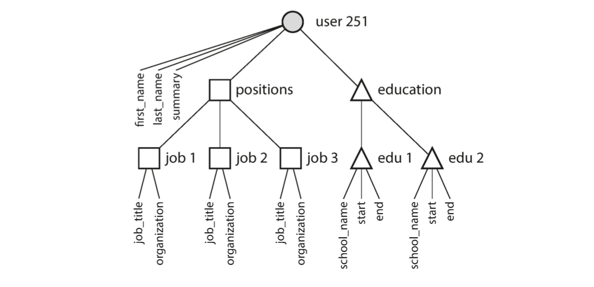
</p>

If the user interface has free-text fields for entering the region and the industry, it makes sense to store them as plain-text strings. But there are advantages to having standardized lists of geographic regions and industries, and letting users choose from a drop-down list or autocompleter:
- Consistent style and spelling across profiles
- Avoiding ambiguity (e.g., if there are several cities with the same name)
-  Ease of updating—the name is stored in only one place, so it is easy to update across the board if it ever needs to be changed 
- Localization support—when the site is translated into other languages, the standardized lists can be localized, so the region and industry can be displayed in the viewer’s language
- Better search—e.g., a search for philanthropists in the state of Washington can match this profile, because the list of regions can encode the fact that Seattle is in Washington (which is not apparent from the string "Greater Seattle Area")

Whether you store an ID or a text string is a question of duplication. When you use an ID, the information that is meaningful to humans is stored in only one place, and everything that refers to it uses an ID. When you store the text directly (containing location, type of industry, age etc.), you are duplicating the human-meaningful information in every record that uses it.  If that information is duplicated, all the redundant copies need to be updated. That incurs write overheads, and risks inconsistencies (where some copies of the information are updated but others aren’t). Removing such duplication is the key idea behind normalization in databases.

If normalizing data requires many-to-one relationships (many peo‐
ple live in one particular region, many people work in one particular industry), it doesn’t fit nicely into the document model. In. relational databases, it’s normal to refer to rows in other tables by ID, because joins are easy. In document databases, joins are not needed for one-to-many tree structures, and support for joins is often weak. If the database itself does not support joins, you have to emulate a join in application code by making multiple queries to the database (the work of making the join is shifted from the database to the application code.)


### Relational Versus Document Databases Today
There are many differences to consider when comparing relational databases to document databases, including fault-tolerance properties and handling of concurrency . In this chapter, we will concentrate only on the differences in the data model.

The main arguments in favor of the document data model are 
- **schema flexibility**, 
- **better performance due to locality**
- for some applications, it is **closer to the data structures** used by the application. 
 
The relational model counters by 
- providing better support for joins, and many-to-one and many-to-many relationships. 
 
Which data model leads to simpler application code?

If the data in your application has a document-like structure (i.e., a tree of one-to-many relationships, where typically the entire tree is loaded at once), then it’s probably a good idea to use a document model. The relational technique of shredding—splitting a document-like structure into multiple tables (like positions, education, and contact_info)—can lead to cumbersome schemas and unnecessarily complicated application code.

The document model has limitations: for example, you cannot refer directly to a nested item within a document, but instead you need to say something like “the second item in the list of positions for user 251” (much like an access path in the hierarchical model). However, as long as documents are not too deeply nested, that is not usually a problem.

The poor support for joins in document databases may or may not be a problem, depending on the application. For example, many-to-many relationships may never be needed in an analytics application that uses a document database to record which events occurred at which time. However, if your application does use many-to-many relationships, the document model becomes less appealing. 

It’s possible to reduce the need for joins by denormalizing, but then the application code needs to do additional work to keep the denormalized data consistent. Joins can be emulated in application code by making multiple requests to the database, but that also moves complexity into the application and is usually slower than a join performed by specialized code inside the database.

In such cases, using a document model can lead to significantly more complex application code and worse performance. For highly interconnected data, the document model is awkward, the relational model is acceptable, and graph models are the most
natural.

#### Schema Flexibility in the Document Model
No schema means that arbitrary keys and values can be added to a document, and when reading, clients have no guarantees as to what fields the documents may contain. However the code that reads the data usually assumes some kind of structure—i.e., there is an implicit schema, but it is not enforced by the database. So a more accurate term is **schema-on-read** (the structure of the data is implicit, and only interpreted when the data is read), in contrast with **schema-on-write** (the traditional approach of relational databases, where the schema is explicit and the database ensures all written data conforms to it)

The schema-on-read approach is advantageous if the items in the collection don’t all have the same structure for some reason (i.e., the data is heterogeneous)—for example, because:
- There are many different types of objects, and it is not practical to put each type of object in its own table. 
- The structure of the data is determined by external systems over which you have no control and which may change at any time.

In cases where all records are expected to have the same structure, schemas are a useful mechanism for documenting and enforcing that structure.

#### Data Locality for Queries
A document is usually stored as a single continuous string, encoded as JSON, XML, or a binary variant thereof. If your application often
needs to access the entire document (for example, to render it on a web page), there is a performance advantage to this storage locality. If data is split across multiple tables, multiple index lookups are required to retrieve it all, which may require more disk seeks and take more time. The locality advantage only applies if you need large parts of the document at the
same time.

#### MapReduce Querying

MapReduce is a programming model for processing large amounts of data in bulk across many machines. The logic of the query is expressed with snippets of code, which are called repeatedly by the processing framework. It is based on the map (also known as collect) and reduce (also known as fold or inject) functions that exist in many functional programming languages. 

In PostgreSQL you might express that query like this:

```sql
SELECT date_trunc('month', observation_timestamp) AS observation_month,
sum(num_animals) AS total_animals
FROM observations
WHERE family = 'Sharks'
GROUP BY observation_month;
```

The `date_trunc('month', timestamp)` function determines the calendar month containing timestamp, and returns another timestamp representing the beginning of that month. In other words, it rounds a timestamp down to the nearest month. This query first filters the observations to only show species in the Sharks family, then groups the observations by the calendar month in which they occurred, and finally adds up the number of animals seen in all observations in that month.

The map and reduce functions are somewhat restricted in what they are allowed to do. They must only use the data that is passed to them as input, they cannot perform additional database queries, and they must not have any side effects. These restrictions allow the database to run the functions anywhere, in any order, and rerun them on failure. However, they are nevertheless powerful: they can parse strings, call library functions, perform calculations, and more.

### Graph-Like Data Models

If your application has mostly one-to-many relationships (tree-structured data) or no relationships between records, the document model is appropriate. But what if many-to-many relationships are very common in your data? The relational model can handle simple cases of many-to-many relationships, but as the connections within your data become more complex, it becomes more natural to start modeling your data as a graph.

A graph consists of **vertices** (also known as nodes or entities) and
**edges** (also known as relationships or arcs). Many kinds of data can be modeled as a graph. Typical examples include:
- Social graphs
Vertices are people, and edges indicate which people know each other.
- The web graph
Vertices are web pages, and edges indicate HTML links to other pages.
- Road or rail networks
Vertices are junctions, and edges represent the roads or railway lines between

Well-known algorithms can operate on these graphs: for example, car navigation systems search for the shortest path between two points in a road network, and PageRank can be used on the web graph to determine the popularity of a web page and thus its ranking in search results.

Facebook maintains a single graph with many different types of vertices and edges: vertices represent people, locations, events, checkins, and comments made by users; edges indicate which people are friends with each other, which checking happened in which location, who commented on which post, who attended which event, and so on.

There are several different, but related, ways of structuring and querying data in graphs. In this section we will discuss the property graph model (implemented by Neo4j, Titan, and InfiniteGraph) and the triple-store model (implemented by Datomic, AllegroGraph, and others).

#### Property Graphs
In the property graph model, each vertex consists of:
- A unique identifier
-  A set of outgoing edges
- A set of incoming edges
- A collection of properties (key-value pairs)

Each edge consists of:
- A unique identifier
- The vertex at which the edge starts (the tail vertex)
- The vertex at which the edge ends (the head vertex)
- A label to describe the kind of relationship between the two vertices
- A collection of properties (key-value pairs)

<p align="center">
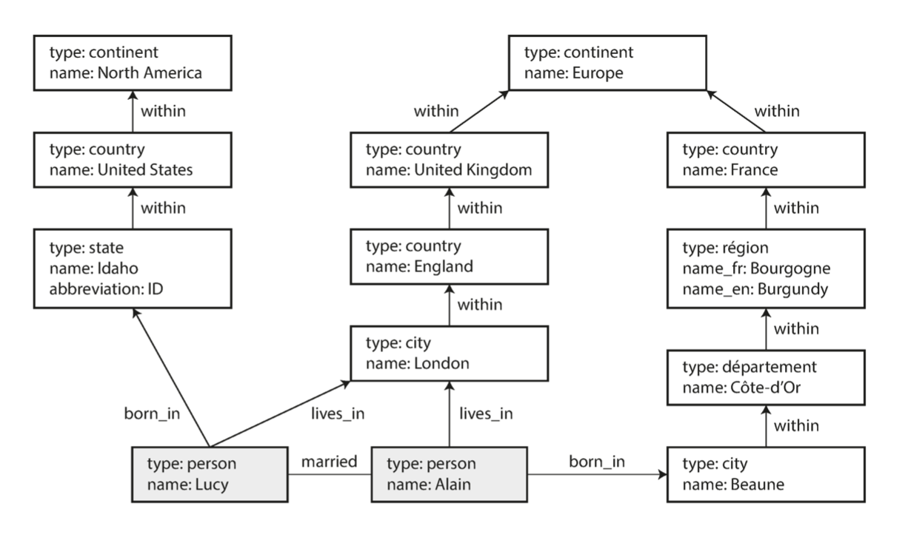
</p>

You can think of a graph store as consisting of two relational tables, one for vertices and one for edges, The head and tail vertex are stored for each edge; if you want the set of incoming or outgoing edges for a vertex, you can query the edges table by head_vertex or tail_vertex, respectively. Some important aspects of this model are:
1. Any vertex can have an edge connecting it with any other vertex. There is **no schema** that restricts which kinds of things can or cannot be associated.
2. Given any vertex, you can efficiently find both its incoming and its outgoing edges, and thus traverse the graph—i.e., follow a path through a chain of vertices—both forward and backward. 
3. By using different labels for different kinds of relationships, you can store several different kinds of information in a single graph, while still maintaining a clean data model.

Those features give graphs a great deal of flexibility for data modeling/ You could imagine extending the graph to also include many other relations. For instance, you could use it to indicate any food allergies they have (by introducing a vertex for each allergen, and an edge between a person and an allergen to indicate an allergy), and link the allergens with a set of vertices that show which foods contain which substances. Then you could write a query to find out what is safe for each person to eat. Graphs are good for evolvability: as you add features to your application, a graph can easily be extended to accommodate changes in your application’s data structures.


### Summary

One thing that document and graph databases have in common is that they typically don’t enforce a schema for the data they store, which can make it easier to adapt applications to changing requirements. However, your application most likely still assumes that data has a certain structure; it’s just a question of whether the schema is explicit (enforced on write) or implicit (handled on read). Each data model comes with its own query language or framework such as SQL, MapReduce, MongoDB’s aggregation pipeline, Cypher, SPARQL, and Datalog.


## Storage and Retrieval

A database needs to do two things: when you give it some data, it should store the data, and when you ask it again later, it should give the data back to you. Why should you, as an application developer, care how the database handles storage and retrieval internally? You’re probably not going to implement your own storage engine from scratch, but you do need to select a storage engine that is appropriate for your application, from the many that are available. In order to tune a storage engine to perform well on your kind of workload, you need to have a rough idea of what the storage engine is doing under the hood. In particular, there is a big difference between storage engines that are optimized for transactional workloads and those that are optimized for analytics.

We will examine two families of storage engines: log-structured storage engines, and page-oriented storage engines such as B-trees.  Real databases have more issues to deal with (such as concurrency control, reclaiming disk space so that the log doesn’t grow forever, and handling errors and partially written records), but the basic principle is the same. Logs are incredibly useful, and we will encounter them several times in the rest of this book.

In order to efficiently find the value for a particular key in the database, we need a different data structure: an **index**.  The general idea behind index is to keep some additional metadata on the side, which acts as a signpost and helps you to locate the data you want. If you want to search the same data in several different ways, you may need several different indexes on different parts of the data.

An index is an additional structure that is derived from the primary data. Many databases allow you to add and remove indexes, and this doesn’t affect the contents of the database; it only affects the performance of queries. Maintaining additional structures incurs overhead, especially on writes. Any kind of index usually slows down writes, because the index also needs to be updated every time data is written.

This is an important trade-off in storage systems: _well-chosen indexes speed up read queries, but every index slows down writes_. For this reason, databases don’t usually index everything by default, but require you—the application developer or database administrator—to choose indexes manually, using your knowledge of the application’s typical query patterns. You can then choose the indexes that give your application the greatest benefit, without introducing more overhead than necessary.

### Hash Indexes
Let’s start with indexes for key-value data. Key-value stores are quite similar to the *dictionary* type that you can find in most programming languages, and which is usually implemented as a hash map (hash table).  Let’s say our data storage consists only of appending to a file. Then the simplest possible indexing strategy is this: keep an in-memory hash map where every key is mapped to a byte offset in the data file—the location at which the value can be found. When you want to look up a value, use the hash map to find the offset in the data file, seek to that location, and read the value. This what Bitcask does. It offers high-performance reads and writes, subject to the requirement that all the keys fit in the available RAM, since the hash map is kept completely in memory. The values can use more space than there is available memory, since they can be loaded from disk with just one disk seek. Bitcask is well suited to situations where the value for each key is updated frequently. For example, the key might be the URL of a cat video, and the value might be the number of times it has been played (incremented every time someone hits the play button). In this kind of workload, there are a lot of writes, but there are not too many distinct keys—you have a large number of writes per key, but it’s feasible to keep all keys in memory.

How do we avoid eventually running out of disk space? A good solution is to break the log into segments of a certain size by closing a segment file when it reaches a certain size, and making subsequent writes to a new segment file. **Compaction** means throwing away duplicate keys in the log, and keeping only the most recent update for each key. 

Each segment now has its own in-memory hash table, mapping keys to file offsets. In order to find the value for a key, we first check the most recent segment’s hash map; if the key is not present we check the second-most-recent segment, and so on. The merging process keeps the number of segments small, so lookups don’t need to check many hash maps. Segments are never modified after they have been written, so the merged segment is written to a new file. The merging and compaction of frozen segments can be done in a background thread, and while it is going on, we can still continue to serve read and write requests as normal, using the old segment files.

<p align="center">
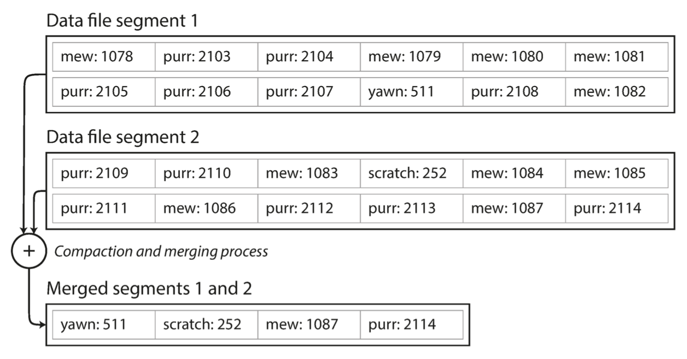
</p>

Lots of detail goes into making this simple idea work in practice. Briefly, some of the issues that are important in a real implementation are:

##### File format
CSV is not the best format for a log. It’s faster and simpler to use a binary format that first encodes the length of a string in bytes, followed by the raw string (without need for escaping).

##### Deleting records
If you want to delete a key and its associated value, you have to append a special deletion record to the data file (sometimes called a tombstone). When log segments are merged, the tombstone tells the merging process to discard any previous values for the deleted key.

##### Crash recovery
If the database is restarted, the in-memory hash maps are lost. In principle, you can restore each segment’s hash map by reading the entire segment file from beginning to end and noting the offset of the most recent value for every key as you go along. However, that might take a long time if the segment files are large, which would make server restarts painful. Bitcask speeds up recovery by storing a snapshot of each segment’s hash map on disk, which can be loaded into memory more quickly.

##### Partially written records
The database may crash at any time, including halfway through appending a record to the log. Bitcask files include checksums, allowing such corrupted parts of the log to be detected and ignored.

##### Concurrency control
As writes are appended to the log in a strictly sequential order, a common implementation choice is to have only one writer thread. Data file segments are append-only and otherwise immutable, so they can be read concurrently by multiple threads. However, the hash table index also has limitations:
- The hash table must fit in memory, so if you have a very large number of keys, you’re out of luck. In principle, you could maintain a hash map on disk, but unfortunately it is difficult to make an on-disk hash map perform well. It requires a lot of random access I/O, it is expensive to grow when it becomes full, and hash collisions require fiddly logic.
- Range queries are not efficient. For example, you cannot easily scan over all keys between kitty00000 and kitty99999—you’d have to look up each key individually in the hash maps.


### SSTables and LSM-Trees
Each log-structured storage segment is a sequence of key-value pairs. These pairs appear in the order that they were written. We can require that the sequence of key-value pairs is *sorted by key*. We call this format **Sorted String Table** (SSTable). SSTables have several big advantages over log segments with hash indexes:

1. Merging segments is simple and efficient, even if the files are bigger than the available memory. The approach is like the one used in the mergesort algorithm. You start reading the input files side by side, look at the first key in each file, copy the lowest key (according to the sort order) to the output file, and repeat. This produces a new merged segment file, also sorted by key.
   
    <p align="center">
    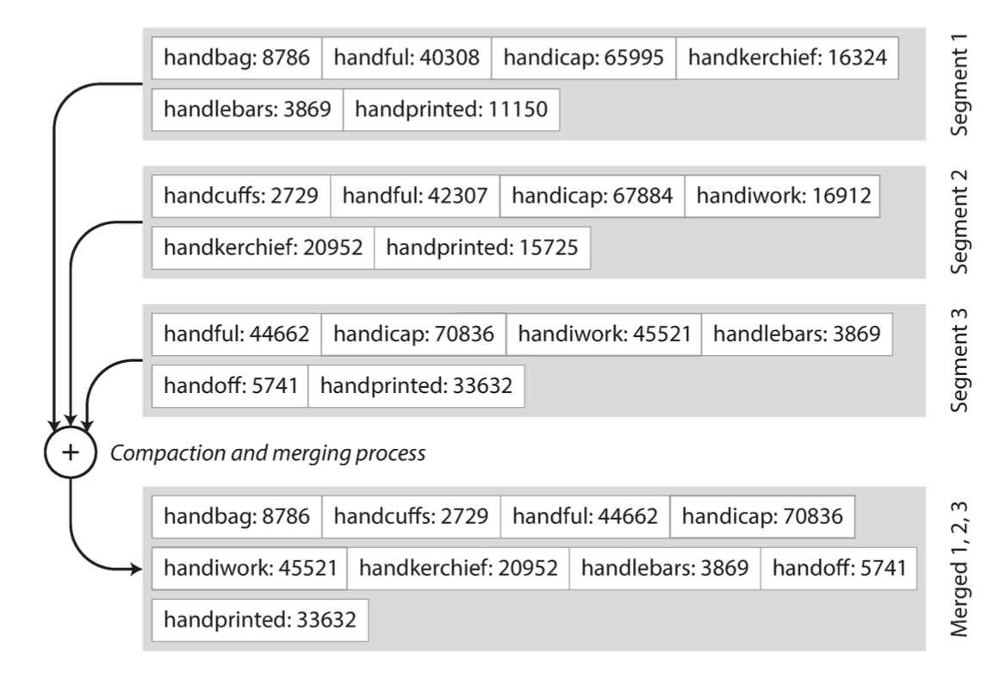
    </p>

    When multiple segments contain the same key, we can keep the value from the most recent segment and discard the values in older segments.

2. In order to find a particular key in the file, you no longer need to keep an index of *all* the keys in memory. Say you’re looking for the key handiwork, but you don’t know the exact offset of that key in the segment file. However, you do know the offsets for the keys handbag and handsome, and because of the sorting you know that handiwork must appear between those two. This means you can jump to the offset for handbag and scan from there until you find handiwork (or not, if the key is not present in the file). You still need an in-memory index to tell you the offsets for some of the keys, but it can be sparse: one key for every few kilobytes of segment file is sufficient, because a few kilobytes can be scanned very quickly.

3.  Since read requests need to scan over several key-value pairs in the requested range anyway, it is possible to group those records into a block and compress it before writing it to disk. Each entry of the sparse in-memory index then points at the start of a compressed block. Besides saving disk space, compression also reduces the I/O bandwidth use.

Maintaining a sorted structure on disk is possible, but maintaining it in memory is much easier. There are plenty of well-known tree data structures that you can use, such as **red-black** trees or **AVL** trees. With these data structures, you can insert keys in any order and read them back in sorted order. This scheme only suffers from one problem: if the database crashes, the most recent writes (which are in the memtable but not yet written out to disk) are lost. In order to avoid that problem, we can keep a separate log on disk to which every write is immediately appended, just like in the previous section. That log is not in sorted order, but that doesn’t matter, because its only purpose is to restore the memtable after a crash. Every time the memtable is written out to an SSTable, the corresponding log can be discarded. 

Originally this indexing structure was described by Patrick O’Neil et al. under the name **Log-Structured Merge-Tree** (or LSM-Tree), building on earlier work on log-structured filesystems. Storage engines that are based on this principle of merging and compacting sorted files are often called LSM storage engines. Similar storage engines are used in Cassandra and HBase, both of which
were inspired by Google’s Bigtable paper (which introduced the terms SSTable and memtable).

### B-Trees

The most widely used indexing structure is the B-tree. B-trees have stood the test of time very well. They remain the standard index implementation in almost all relational databases, and many nonrelational databases use them too.

Like SSTables, B-trees keep key-value pairs sorted by key.  The log-structured indexes we saw earlier break the database down into variable-size *segments*, typically several megabytes or more in size, and always write a segment sequentially. By contrast, B-trees break the database down into fixed-size blocks or pages, traditionally 4 KB in size (sometimes bigger), and read or write one page at a time. Each page can be identified using an address or location, which allows one page to refer to another—similar to a pointer, but on disk instead of in memory. We can use these page references to construct a tree of pages.

<p align="center">

</p>

Suppose we are looking for the key 251, so we know that we need to follow the page reference between the boundaries 200 and 300. That takes us to a similar-looking page that further breaks down the 200–300 range into subranges. Eventually we get down to a page containing individual keys (a leaf page), which either contains the value for each key inline or contains references to the pages where the values can be found. The number of references to child pages in one page of the B-tree is called the branching factor. This algorithm ensures that the tree remains balanced: a B-tree with n keys always has a depth of O(log n).

### Comparing B-Trees and LSM-Trees

Both B-trees and LSM-trees (Log-Structured Merge-trees) are storage engine designs that organize data on disk to balance:
- Write efficiency
- Read performance
- Space usage
- Crash recovery

They just make different trade-offs based on the cost of random vs sequential I/O.

#### B-Tree
- A page-oriented, mutable tree structure where each node corresponds to a disk page.
- Keys are sorted across tree nodes.
- Each node (page) has pointers to children → O(log N) lookup.
- To insert/update, the database finds the right leaf page and updates it in place.

##### Advantages:
- ✅ Fast point lookups and range scans (data already sorted).
- ✅ Mature implementation in most relational DBs (MySQL, Postgres, Oracle).
- ✅ Predictable performance under mixed read/write load.

##### Drawbacks:
- ❌ Each write causes random I/O (find & update a page).
- ❌ Limited write throughput when writes are small and frequent.
- ❌ Fragmentation from in-place updates → needs vacuum/defrag.

##### Best for:
OLTP systems (many small queries, balanced reads/writes).

#### LSM-Tree (Log-Structured Merge-Tree)
- An append-only, multi-level structure that turns random writes into sequential ones.
- Writes go to an in-memory buffer (memtable).
- When full → flush to disk as an immutable SSTable (sorted-string table).
- Background compaction merges smaller SSTables into bigger ones (maintaining sort order).

##### Advantages:
- ✅ Extremely fast writes (sequential disk append).
- ✅ Great for high ingestion rates and SSD optimization.
- ✅ Easy crash recovery (append-only, WAL).

##### Drawbacks:
- ❌ Reads may need to check multiple SSTables → higher read amplification.
- ❌ Compaction causes write amplification (same data rewritten).
- ❌ Higher read latency for point queries unless cached/indexed carefully.

##### Best for:
Write-heavy or log-structured workloads — Cassandra, RocksDB, LevelDB, HBase, Kafka Streams, feature stores.

#### Side-by-Side Summary

| Aspect                  | **B-Tree**            | **LSM-Tree**                             |
| :---------------------- | :-------------------- | :--------------------------------------- |
| **Writes**              | In-place (random I/O) | Append-only (sequential)                 |
| **Reads**               | Fast, single location | Slower, may check many SSTables          |
| **Range queries**       | Very efficient        | OK but affected by compaction state      |
| **Space overhead**      | Moderate              | Slightly higher (multiple levels)        |
| **Write amplification** | Low–medium            | High (compaction rewrites data)          |
| **Read amplification**  | Low                   | Medium–high                              |
| **Best for**            | Read-heavy OLTP       | Write-heavy ingestion, time-series, logs |
| **Examples**            | MySQL, Postgres       | Cassandra, RocksDB, LevelDB              |

#### ML/AI Engineering Relevance

| Scenario                                                      | Recommended Engine                                 | Why                                    |
| ------------------------------------------------------------- | -------------------------------------------------- | -------------------------------------- |
| **Online feature store (frequent updates, append-only logs)** | LSM-based (RocksDB, Cassandra)                     | Sequential writes, compaction tolerant |
| **Inference DB (low-latency lookups per user)**               | B-Tree (Postgres, MySQL, SQLite)                   | Fast key/range reads                   |
| **Embedding retrieval / RAG index metadata**                  | Often hybrid: LSM for ingestion, memory for lookup | Balances write & read needs            |


🧠 B-Tree: “keep it sorted and update in place.”
⚡ LSM-Tree: “just keep appending and clean up later.”

LSM-trees are typically faster for writes, whereas B-trees are thought to be faster for reads. Reads are typically slower on LSM-trees because they have to check several different data structures and SSTables at different stages of compaction. In write-heavy applications, the performance bottleneck might be the rate at which the database can write to disk. The more that a storage engine writes to disk, the fewer writes per second it can handle within the available disk bandwidth. LSM-trees are typically able to sustain higher write throughput than B-trees, partly because they sometimes have lower write amplification (although this depends on the storage engine configuration and workload), and partly because they sequentially write compact SSTable files rather than having to overwrite several pages in the tree. A downside of log-structured storage is that the compaction process can sometimes interfere with the performance of ongoing reads and writes.

An advantage of B-trees is that each key exists in exactly one place in the index, whereas a log-structured storage engine may have multiple copies of the same key in different segments. This aspect makes B-trees attractive in databases that want to offer strong transactional semantics. There is no quick and easy rule for determining which type of storage engine is better for your use case, so it is worth testing empirically.

### Other Indexing Structures
So far we have only discussed key-value indexes, which are like a **primary key** index in the relational model. A primary key *uniquely* identifies one row in a relational table, or one document in a document database, or one vertex in a graph database. It is also very common to have **secondary indexes** on non-primary keys to speed up queries that filter by others. In relational databases, you can several secondary indexes on the same table using the `CREATE INDEX` command, and they are often crucial for performing joins efficiently. You could have a secondary index on the `user_id` columns so that you can find all the rows belonging to the same user in each of the tables. For example:

- Table: `users(id, email, city)`
- Primary `key = id`
- Secondary index on `city` → faster lookups like
  
```sql
SELECT * FROM users WHERE city='Toronto';
```

- The index stores (`city → user_id`) mappings, often as a B-Tree or LSM structure.
- On retrieval, the database uses the index to find matching IDs, then fetches the full rows (`index lookup + table lookup`).

#### Trade-offs:
- Speeds up reads but slows down writes (each insert/update must update the index too).
- May consume extra storage.

Used in: practically every OLTP database (MySQL, Postgres, Cassandra, MongoDB, etc.). In ML feature stores, secondary indexes are useful for searching by entity ID + feature type.


### Multi-column indexes

The indexes discussed so far only map a single key to a value. That is not sufficient if we need to query multiple columns of a table (or multiple fields in a document) simultaneously. It is one index that covers multiple columns in order. The most common type of multi-column index is called a **concatenated index**, which simply combines several fields into one key by appending one column to another (the index definition specifies in which order the fields are concatenated). This is like an old-fashioned paper phone book, which provides an index from (lastname, first-name) to phone number. Due to the sort order, the index can be used to find all the people with a particular last name, or all the people with a particular lastname- firstname combination. However, the index is useless if you want to find all the people with a particular first name.  A two-dimensional range query like the following:
```sql
SELECT * FROM restaurants 
WHERE latitude > 51.4946 AND latitude < 51.5079
AND longitude > -0.1162 AND longitude < -0.1004;
```

The standard B-tree or LSM-tree index is not able to answer that kind of query efficiently: it can give you either all the restaurants in a range of latitudes (but at any longitude), or all the restaurants in a range of longitudes (but anywhere between the North and South poles), but not both simultaneously. One option is to translate a two-dimensional location into a single number using a space-filling curve, and then to use a regular B-tree index. More commonly, specialized spatial indexes such as R-trees are used. 

In general, one can create multidimensional indexes to imporve query efficiency. For example, on an ecommerce website you could use a three-dimensional index on the dimensions `(red, green, blue)` to search for products in a certain range of colors, or in a database of weather observations you could have a two-dimensional index on (date, temperature) in order to efficiently search for all the observations during the year 2013 where the temperature was between 25 and 30℃. With a one-dimensional index, you would have to either scan over all the records from 2013 (regardless of temperature) and then filter them by temperature, or vice versa. A 2D index could narrow down by timestamp and temperature simultaneously.

###  Full-Text Search Indexes
All the indexes discussed so far assume that you have exact data and allow you to query for exact values of a key, or a range of values of a key with a sort order. What they don’t allow you to do is search for similar keys not exact matches, such as misspelled words. Such fuzzy querying requires different techniques. Full-text search engines commonly allow a search for one word to be expanded to include synonyms of the word, to ignore grammatical variations of words, and to search for occurrences of words near each other in the same document, and support various other features that depend on linguistic analysis of the text. The general idea is to break text into tokens → build an inverted index mapping each token to documents that contain it.

Example (simplified):
- "Toronto is great" → {Toronto: [doc1], great: [doc1]}
- "Great pizza in Toronto" → {great: [doc1, doc2], Toronto: [doc1, doc2], pizza: [doc2]}
- Query: "great Toronto" → intersection of postings [doc1, doc2].

Extras:
- Stemming, stop words, TF-IDF, BM25 ranking.
- Supports phrase queries, prefixes, synonyms.

Engines:
- Lucene, Elasticsearch, OpenSearch, Meilisearch, Vespa.
- Used widely in RAG or retrieval-based ML systems.

**Fuzzy Indexes** handle typos, approximate matches, or similar strings. Instead of exact match → use distance metric (e.g., Levenshtein edit distance). How:
- Create n-gram index (“Tor”, “oro”, “ron”, …).
- Search by overlapping grams → approximate nearest matches.
- Or use metric trees (BK-Tree, VP-Tree) for distance-based lookup.

Example:
- Search “Tornto” → finds “Toronto” since edit distance = 1. Used in:
- Spell correction, user-input search, entity resolution (think: feature store entity linking).

### Keeping everything in memory
Compared to main memory, disks are awkward to deal with. However, we tolerate this awkwardness because disks are durable (their contents are not lost if the power is turned off). Many datasets are simply not that big, so it’s quite feasible to keep them entirely in memory, potentially distributed across several machines. This has led to the development of **in-memory databases (IMDBs)**, a key idea for ultra-low latency ML serving, caching, and real-time analytics...

Some in-memory key-value stores, such as **Memcached**, are intended for caching use only, where it’s acceptable for data to be lost if a machine is restarted. But other in-memory databases aim for durability, which can be achieved with special hardware (such as battery-powered RAM), by writing a log of changes to disk, by writing periodic snapshots to disk, or by replicating the in-memory state to other machines. When an in-memory database is restarted, it needs to reload its state, either from disk or over the network from a replica (unless special hardware is used). Despite writing to disk, it’s still an in-memory database, because the disk is merely used as an append-only log for durability, and reads are served entirely from memory. 

Writing to disk also has operational advantages: files on disk can easily be backed up, inspected, and analyzed by external utilities. Redis and Couchbase provide weak durability by writing to disk asynchronously. Counterintuitively, the performance advantage of in-memory databases is not due to the fact that they don’t need to read from disk. Even a disk-based storage engine may never need to read from disk if you have enough memory, because the operating sys‐
tem caches recently used disk blocks in memory anyway. So the real bottleneck isn’t just disk I/O. Rather, they can be faster because they can avoid the overheads of encoding in-memory data structures in a form that can be written to disk.  Traditional disk-based databases have to:
- Represent all data in on-disk pages (fixed-size 4KB/8KB blocks).
- Serialize/deserialize in-memory structures (rows, indexes, tuples) to that binary on-disk format.
- Manage buffer pools, dirty page tracking, write-ahead logs, etc.
- Maintain multiple copies of the same data (in-memory representation + on-disk page representation).
- Even if all data lives in memory (because of OS caching), you still pay for:
  - Copying between buffers,
  - Converting internal structs to/from disk format,
  - Latching and concurrency control for pages,
  - Writing through the WAL (write-ahead log).

That’s a ton of CPU overhead per query — even though you never actually hit the disk. An in-memory database can store data in pure _native memory structures_ — pointers, hash tables, skip lists — exactly how the CPU likes to use them. That means:
- No page encoding or serialization.
- No buffer pool layer.
- No distinction between “in-memory cache” vs “on-disk data.”
- Direct pointer dereferences instead of I/O abstractions.

This Result: 10×–100× faster, not because the disk is skipped, but because the entire software path is simplified.

#### Analogy
It’s like the difference between:
- Writing a note on paper (disk-based DB): you must fit it in fixed lines, use proper format, erase and rewrite carefully.
- Talking to yourself in your head (in-memory DB): instant, flexible, no formatting needed.

Besides performance, another interesting area for in-memory databases is providing data models that are difficult to implement with disk-based indexes. When everything must be stored on disk, databases are constrained by disk-friendly data structures — usually B-Trees or  LSM trees — because these minimize disk seeks and group data into fixed-size blocks. When data is entirely in RAM, you can store it in native CPU structures — direct pointers, variable-length objects, dynamic graphs, etc. For example, Redis doesn’t just store key→value. It supports: Lists, sets, proiority queues, sorted sets, hashes, bitmaps, geospatial indexes, streams. All kept in memory with O(1) or  (log n) operations — impossible to store efficiently on disk.   For real-time ML pipelines:
- You can keep graph features (user–item relationships) in memory for low-latency scoring.
- Maintain online feature aggregates (counts, averages, rates) directly in Redis streams or MemSQL.
- Store semantic caches (recent embeddings, user states) in memory structures not suitable for disk indexes.
- Basically, in-memory databases enable stateful, structure-rich ML serving — something disk-based DBs can’t handle at the required speed.

Disk-based systems would need complex serialization (e.g., store list as blobs), which destroys the ability to query inside it efficiently.

### Transaction Processing or Analytics?
In the early days of business data processing, a write to the database typically corresponded to a commercial transaction taking place: making a sale, placing an order with a supplier, paying an employee’s salary, etc. As databases expanded into areas that didn’t involve money changing hands, the term transaction nevertheless stuck. An application typically looks up a small number of records by some key, using an index. Records are inserted or updated based on the user’s input. Because these applications are interactive, the access pattern became known as **online transaction processing (OLTP)**. However, databases also started being increasingly used for **data analytics**, which has very different access patterns. Usually an analytic query needs to scan over a huge number of records, only reading a few columns per record, and calculates aggregate statistics (such as count, sum, or average) rather than returning the raw data to the user.

These queries are often written by business analysts, and feed into reports that help the management of a company make better decisions (business intelligence). In order to differentiate this pattern of using databases from transaction processing, it has been called online analytic processing (OLAP). The separate database used for analytics was called a **data warehouse**.

The data warehouse contains a read-only copy of the data in all the various OLTP systems in the company. Data is extracted from OLTP databases (using either a periodic data dump or a continuous stream of updates), transformed into an analysis-friendly schema, cleaned up, and then loaded into the data warehouse. This process of getting data into the warehouse is known as **Extract–Transform–Load (ETL)**.

<p align="center">
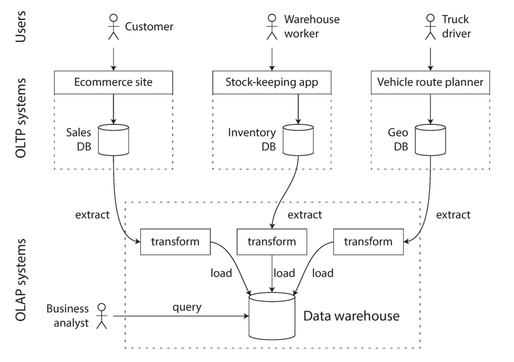
</p>

On the surface, a data warehouse and a relational OLTP database look similar, because they both have a SQL query interface. However, the internals of the systems can look quite different, because they are optimized for very different query patterns. Many database vendors now focus on supporting either transaction processing or analytics workloads, but not both. Some databases, such as Microsoft SQL Server and SAP HANA, have support for transaction processing and data warehousing in the same product. However, they are increasingly becoming two separate storage and query engines, which happen to be accessible through a common SQL interface.

Data warehouse vendors such as Teradata, Vertica, SAP HANA, and ParAccel typically sell their systems under expensive commercial licenses. Amazon RedShift is a hosted version of ParAccel. More recently, a plethora of open source SQL-on-Hadoop projects have emerged; they are young but aiming to compete with commercial data warehouse systems. These include Apache Hive, Spark SQL, Cloudera Impala, Facebook Presto, Apache Tajo, and Apache Drill.


| **Aspect**                         | **Transaction Processing (OLTP)**                                | **Analytics (OLAP / Data Warehouse)**                                        |
| ---------------------------------- | ---------------------------------------------------------------- | ---------------------------------------------------------------------------- |
| **Main Purpose**                   | Run business operations in real time (orders, payments, updates) | Analyze historical data for insights and reporting                           |
| **Typical Queries**                | Simple, short read/write operations                              | Complex, long-running analytical queries (aggregations, joins, filters)      |
| **Query Type**                     | Point queries (find one record)                                  | Scans over large portions of data                                            |
| **Data Volume Accessed per Query** | Small (1–100 rows)                                               | Huge (millions–billions of rows)                                             |
| **Data Freshness**                 | Current / real-time                                              | Periodically refreshed (batch or streaming ETL)                              |
| **Concurrency**                    | Thousands of concurrent users doing small transactions           | Few analysts or dashboards doing heavy queries                               |
| **Data Model**                     | Highly normalized (to avoid redundancy and ensure consistency)   | Denormalized (star/snowflake schemas for faster aggregation)                 |
| **Typical Storage Engine**         | B-trees for random reads/writes                                  | Columnar storage for fast scans and compression                              |
| **Indexing Strategy**              | Many secondary indexes for fast lookups                          | Few indexes (full scans or columnar access)                                  |
| **Write Pattern**                  | Random small writes, frequent updates/deletes                    | Large batch inserts (append-only), rarely updates                            |
| **Workload Goal**                  | Low-latency response (milliseconds)                              | High throughput (process GBs–TBs efficiently)                                |
| **Hardware Design**                | Optimized for latency (SSD, caches, concurrency control)         | Optimized for throughput (parallel scans, compression, vectorized execution) |
| **Examples**                       | MySQL, PostgreSQL, Oracle, SQL Server                            | Snowflake, BigQuery, Redshift, Spark SQL, DuckDB                             |
| **Users**                          | End-user applications (web/mobile)                               | Data analysts, BI tools, ML pipelines                                        |
| **Consistency Model**              | Strict ACID guarantees                                           | Often relaxed consistency, batch-updated data                                |
| **Schema Evolution**               | Rare — tied to application logic                                 | Frequent — analysts may reshape data for queries                             |
| **Optimization Focus**             | Transaction isolation, locking, replication                      | Query planning, join optimization, data compression                          |


In analytics, there is much less diversity of data models. Many data warehouses are used in a fairly formulaic style, known as a **star schema**.  The following shows a data warehouse that might be found at a grocery retailer. At the center of the schema is a so-called fact table (`fact_sales`). Each row of the fact table represents an event that occurred at a particular time (here, each row represents a customer’s purchase of a product). If we were analyzing website traffic rather than retail sales, each row might represent a page view or a click by a user.

<p align="center">
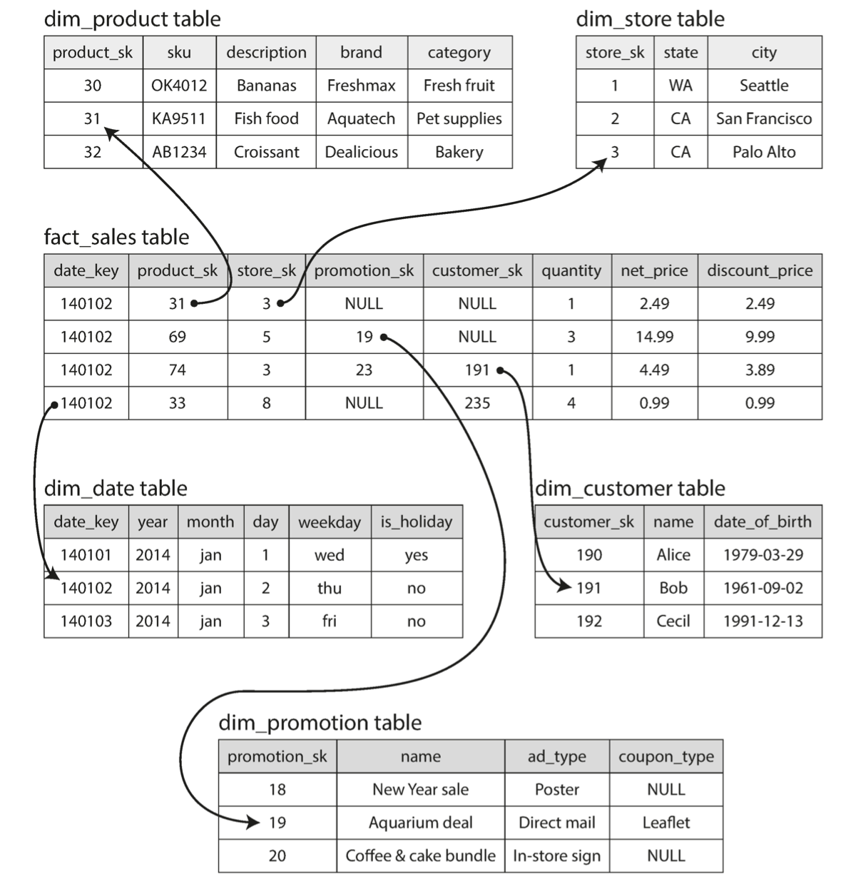
</p>

Facts are captured as individual events, because this allows maximum flexibility of analysis later. But this means the fact table can become extremely large. A big enterprise like Apple, Walmart, or eBay may have tens of petabytes of transaction history in its data warehouse, most of which is in fact tables. 

##### Star Schema 
- A central fact table (events: sales, clicks, orders)
- Surrounded by denormalized dimension tables (product, customer, date, store).
- Dimensions are kept wide (lots of attributes) to avoid joins.
- Used in OLAP because it minimizes joins and makes aggregations fast.

Shape: Fact table in the center, dimension tables radiating out → looks like a star.

A variation of this template is known as the snowflake schema, where dimensions are further broken down into subdimensions. Snowflake schemas are more normalized than star schemas, but star schemas are often preferred because they are simpler for analysts to work with. 

##### Snowflake Schema (normalized star)
- Same central fact table,
- But dimension tables are normalized into multiple related tables.
e.g., Product → Category → Department
- Reduces redundancy but requires more joins, so slower for analytics.

Shape: Dimensions branch out like a snowflake. In a typical data warehouse, tables are often very wide: fact tables often have over 100 columns, sometimes several hundred. Dimension tables can also be very wide, as they include all the metadata that may be relevant for analysis.

### Column-Oriented Storage
If you have trillions of rows and petabytes of data in your fact tables, storing and querying them efficiently becomes a challenging problem. Dimension tables are usually much smaller (millions of rows), so in this section we will concentrate primarily on storage of facts. Although fact tables are often over 100 columns wide, a typical data warehouse query only accesses 4 or 5 of them at one time ("SELECT *" queries are rarely needed for analytics). Take the query in the previous example: it accesses a large number of rows (every occurrence of someone buying fruit or candy during the 2013 calendar year), but it only needs to access three columns of the fact_sales table: `date_key`, `product_sk`, and `quantity`. The query ignores all other columns.

```sql
SELECT
dim_date.weekday, dim_product.category,
SUM(fact_sales.quantity) AS quantity_sold
FROM fact_sales
JOIN dim_date ON fact_sales.date_key = dim_date.date_key
JOIN dim_product ON fact_sales.product_sk = dim_product.product_sk
WHERE
dim_date.year = 2013 AND
dim_product.category IN ('Fresh fruit', 'Candy')
GROUP BY
dim_date.weekday, dim_product.category;
```

How can we execute this query efficiently? In most OLTP databases, storage is laid out in a row-oriented fashion: all the values from one row of a table are stored next to each other. Document databases are similar: an entire document is typically stored as one contiguous sequence of bytes. 

In order to process a query like the above, you may have indexes on `fact_sales.date_key` and/or `fact_sales.product_sk` that tell the storage engine where to find all the sales for a particular date or for a particular product. But then, a row-oriented storage engine still needs to load all of those rows (each consisting of over 100 attributes) from disk into memory, parse them, and filter out those that don’t meet the required conditions. That can take a long time. The idea behind **column-oriented storage** is simple: don’t store all the values from one row together, but store all the values from each column together instead. If each column is stored in a separate file, a query only needs to read and parse those columns that are used in that query, which can save a lot of work. Queries run across dozens or hundreds of CPU cores.

Column-oriented storage is extremely common in industry, especially anywhere analytics or large-scale data processing is involved. Today, it is the dominant storage format for modern data warehouses and BI systems. It is used in Cloud Data Warehouses (mainstream) under the hood for services such as Snowflake, BigQuery, Amazon Redshift, Azure Synapse Analytics. Columnar formats like **Parquet** and **ORC** and **Arrow memory** format are industry standard for analytical data. Almost every modern data pipeline ends with Parquet files in object storage (S3, GCS, Azure Blob). Large companies rely on column-stores to power dashboards, aggregations, and queries over billions of records. They run queries like:

```sql
SELECT region, SUM(revenue) FROM sales GROUP BY region;
```

This only needs 2–3 columns → column stores crush this workload.Column stores use **column compression** to reduce the demands on disk throughput. Same types of values in contiguous memory makes it easy for column stores to group similar values → high repetitiveness.

Also instead of processing one row at a time, the query engine processes batches of 1,000–10,000 values at once using CPU SIMD instructions. This is massive for performance which is called **vectorized processing**.  It also allows parallel execution across many nodes. Distributed warehouses split data into shards and process them in parallel:
- Snowflake → micro-partitions
- Redshift → slices on compute nodes
- BigQuery → Dremel slots

Queries run across dozens or hundreds of CPU cores.

#### When NOT to Use a Column-Store
Column-stores are terrible for traditional OLTP workloads because they are optimized for analytics, not transactions. Avoid column stores when:

-  You need fast single-row writes (`INSERT/UPDATE/DELETE`)
Column stores store each column separately → updating one row means touching many column files. Bad for:
   - User profiles
   - Orders table
   - Session storage
   - Real-time transactional systems
   - High-write systems (e.g., millions of small writes/sec)
   - Row-stores (Postgres, MySQL) do better here.
  
- You need low-latency point queries
    ```sql
    SELECT * FROM users WHERE user_id = 1234;
    ```
    A row-store can fetch this in one disk seek.
    A column store must fetch many column files → slower.

- The table is very small
    - Column stores shine with big tables.
    - For tiny tables, overhead is not worth it.

- You frequently return full rows (many columns)
    - If you always need all columns, the column-store’s benefit disappears.

High-level, all columnar warehouses do the following:

1. Data is stored in column chunks ("columnar stripes")
Instead of storing:
    ```sh
    row1: A,B,C,D
    row2: A,B,C,D
    row3: A,B,C,D
    ```
    A column-store stores:

    ```sh
    colA: [A1, A2, A3, A4 ...]
    colB: [B1, B2, B3, B4 ...]
    colC: [...]
    colD: [...]
    ```
2. Query planner reads only the columns needed
    ```sql
    SELECT SUM(revenue) FROM sales WHERE region = 'EU';
    ```
    The engine loads only:
    - column "revenue"
    - column "region"
    - Nothing else.
  
    This is why column stores are 10–100x faster for analytics.
3. Predicate pushdown
Filtering happens before decompression, using metadata like:
   - column min/max values
   - bloom filters
   - encoding dictionaries

    This helps skip entire blocks. Example: If a block has `region = ['US', 'CA']`, it’s skipped for `WHERE region = 'EU'`.

1. Vectorized execution
Instead of processing one row at a time, the query engine processes batches of 1,000–10,000 values at once using CPU SIMD instructions. This is massive for performance (explained more below).

1. Parallel execution across many nodes
Distributed warehouses split data into shards and process them in parallel:
   - Snowflake → micro-partitions
   - Redshift → slices on compute nodes
   - BigQuery → Dremel slots


## Encoding and Evolution
Applications inevitably change over time. Features are added or modified as new products are launched, user requirements become better understood, or business circumstances change. A  change to an application’s features might also require a change to data that it stores: perhaps a new field or record type needs to be captured. When a data format or schema changes, a corresponding change to application code often needs to happen. Tha means, with server-side applications you may want to perform a rolling deployment to check whether the new version is running smoothly, and gradually working your way through all the nodes. With client-side applications you’re at the mercy of the user, who may not install the update for some time. In order for the system to continue running smoothly, we need to maintain compatibility in both directions:
- Backward compatibility: Newer code can read data that was written by older code.
- Forward compatibility: Older code can read data that was written by newer code.

In this chapter we will look at several formats for encoding data, including JSON, XML, Protocol Buffers, Thrift, and Avro. In particular, we will look at how they handle schema changes and how they support systems where old and new data and code need to coexist. We will then discuss how those formats are used for data storage and for communication: in web services, Representational State Transfer (REST), and remote procedure calls (RPC), as well as message-passing systems such as actors and message queues.

### Formats for Encoding Data
Programs usually work with data in (at least) two different representations:
1. In memory, data is kept in objects, structs, lists, arrays, hash tables, trees, and so on. These data structures are optimized for efficient access and manipulation by the CPU (typically using pointers).

2. When you want to write data to a file or send it over the network, you have to encode it as some kind of **self-contained sequence of bytes** (for example, a JSON document). Since a pointer wouldn’t make sense to any other process, this sequence-of-bytes representation looks quite different from the data structures that are normally used in memory.

The translation from the in-memory representation to a byte sequence is called **encoding** (also known as **serialization** which is a more common term or marshalling), and the reverse is called **decoding** (parsing, deserialization, unmarshalling). Many programming languages come with built-in support for encoding in-memory objects into byte sequences: Java has `java.io.Serializable`  and Python has `pickle`. These encoding libraries are very convenient,  however, they also have a number of deep problems:

-  The encoding is often tied to a particular programming language. If you store or transmit data in such an encoding, you are committing yourself to your current programming language for potentially a very long time, and precluding integrating your systems with those of other organizations (which may use different languages).

- In order to restore data in the same object types, the decoding process needs to be able to instantiate arbitrary classes. This is frequently a source of security problems: if an attacker can get your application to decode an arbitrary byte sequence, they can instantiate arbitrary classes, which in turn often allows them to do terrible things such as remotely executing arbitrary code.

- Efficiency (CPU time taken to encode or decode, and the size of the encoded structure) is also often an afterthought. For example, Java’s built-in serialization is notorious for its bad performance and bloated encoding.

For these reasons it’s generally a bad idea to use your language’s built-in encoding for anything other than very transient purposes.

### JSON, XML, and Binary Variants
Moving to standardized encodings that can be written and read by many programming languages, JSON and XML are the obvious contenders. They are widely known, widely supported, and almost as widely disliked.  JSON’s popularity is mainly due to its built-in support in web browsers (by virtue of being a subset of JavaScript) and simplicity relative to XML. CSV is another popular language-independent format, albeit less powerful. JSON, XML, and CSV are textual formats, and thus somewhat human-readable (although the syntax is a popular topic of debate). Besides the superficial syntactic issues, they also have some subtle problems:
- In XML and CSV, you cannot distinguish between a number and a string that happens to consist of digits (except by referring to an external schema). JSON distinguishes strings and numbers, but it doesn’t distinguish integers and floating-point numbers, and it doesn’t specify a precision. This is a problem when dealing with large numbers; for example, integers greater than 253 cannot be exactly represented in an IEEE 754 double-precision floating-point number, so such numbers become inaccurate when parsed in a language
that uses floating-point numbers (such as JavaScript). 

- JSON and XML have good support for Unicode character strings (i.e., human-readable text), but they don’t support binary strings (sequences of bytes without a character encoding). Binary strings are a useful feature, so people get around this limitation by encoding the binary data as text using Base64. The schema is then used to indicate that the value should be interpreted as Base64-encoded. This works, but it’s somewhat hacky and increases the data size by 33%.
- CSV does not have any schema, so it is up to the application to define the meaning of each row and column. If an application change adds a new row or column, you have to handle that change manually. CSV is also a quite vague format (what happens if a value contains a comma or a newline character?). Although its escaping rules have been formally specified, not all parsers implement them correctly.
  
Despite these flaws, JSON, XML, and CSV are good enough for many purposes.

### Binary Encoding
For data that is used only internally within your organization, you could choose a format that is more compact or faster to parse.  JSON is less verbose than XML, but both still use a lot of space compared to binary formats. This observation led to the development of binary encodings for JSON  and for XML. The binary encoding of the JSON object

```json
{
"userName": "Martin",
"favoriteNumber": 1337,
"interests": ["daydreaming", "hacking"]
}
```

is 66 bytes long, which is only a little less than the 81 bytes taken by the textual JSON encoding (with whitespace removed). It’s not clear whether such a small space reduction (and perhaps a speedup in parsing) is worth the loss of human-readability.

<p align="center">
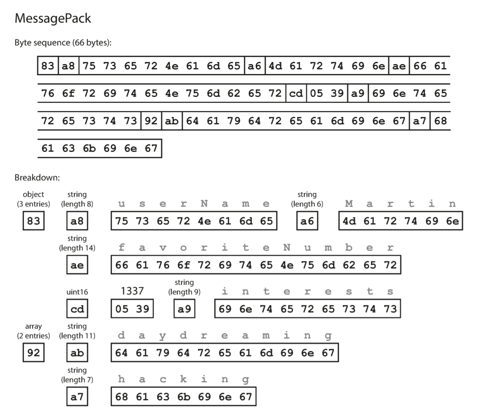
</p>

#### Thrift and Protocol Buffers
**Apache Thrift** and **Protocol Buffers** (protobuf - developed by Google) are binary encoding libraries that are based on the same principle. Both Thrift and Protocol Buffers require a schema for any data that is encoded. For example, the schema definition for Protocol Buffers for the JSON object mentioned before looks like:

```json
message Person {
required string user_name = 1;
optional int64 favorite_number = 2;
repeated string interests = 3;
}
```

Thrift and Protocol Buffers each come with a code generation tool that takes a schema definition like the ones shown here, and produces classes that implement the schema in various programming languages. Your application code can call this generated code to encode or decode records of the schema. Protocol Buffers does the bit packing slightly differently, but is otherwise very similar to Thrift’s CompactProtocol. Protocol Buffers fits the same record in 33 bytes while Thrift’s CompactProtocol is 34 bytes. 

<p align="center">
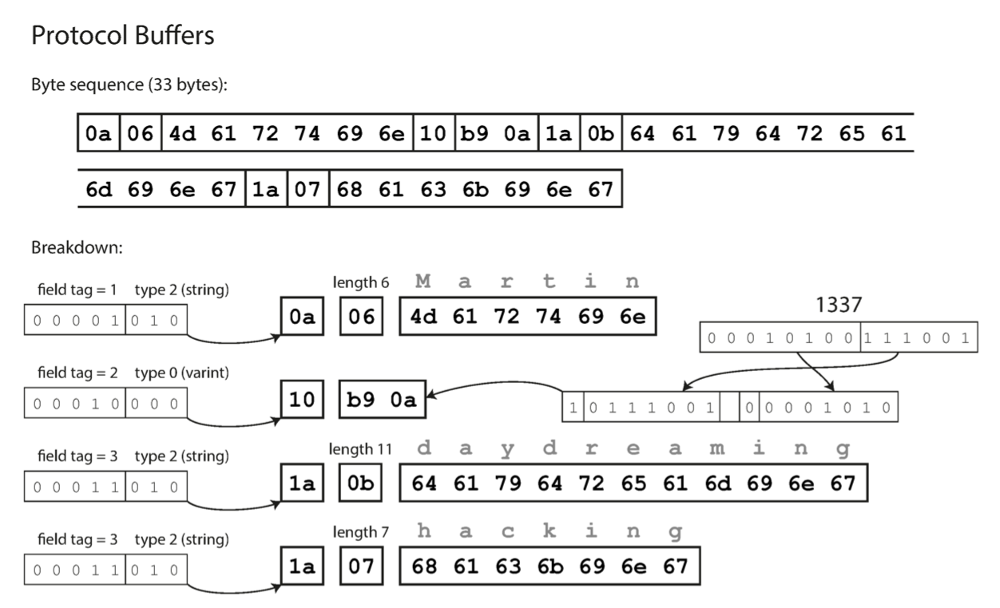
</p>

#####  Field tags and schema evolution
We said previously that schemas inevitably need to change over time. We call this *schema evolution*. How do Thrift and Protocol Buffers handle schema changes while keeping backward and forward compatibility?

As you can see from the examples, an encoded record is just the concatenation of its encoded fields. Each field is identified by its tag number (the numbers 1, 2, 3 in the sample schemas) and annotated with a datatype (e.g., string or integer). If a field value is not set, it is simply omitted from the encoded record. From this you can see that field tags are critical to the meaning of the encoded data. You can change the name of a field in the schema, since the encoded data never refers to field names, but you cannot change a field’s tag, since that would make all existing encoded data invalid.

You can add new fields to the schema, provided that you give each field a new tag number. If old code (which doesn’t know about the new tag numbers you added) tries to read data written by new code, including a new field with a tag number it doesn’t recognize, it can simply ignore that field. The datatype annotation allows the parser to determine how many bytes it needs to skip. This maintains forward compatibility: old code can read records that were written by new code.

What about backward compatibility? As long as each field has a unique tag number, new code can always read old data, because the tag numbers still have the same meaning. The only detail is that if you add a new field, you cannot make it required. If you were to add a field and make it required, that check would fail if new code read data written by old code, because the old code will not have written the new field that you added. Therefore, to maintain backward compatibility, every field you add must be optional or have a default value.

##### Datatypes and schema evolution

What about changing the datatype of a field? That may be possible—check the documentation for details—but there is a risk that values will lose precision or get truncated. For example, say you change a 32-bit integer into a 64-bit integer. New code can easily read data written by old code, because the parser can fill in any missing bits with zeros. However, if old code reads data written by new code, the old code is still using a 32-bit variable to hold the value. If the decoded 64-bit value won’t fit in 32 bits, it will be truncated.

Protocol Buffers does not have a list or array datatype, but instead has a *repeated* marker for fields (which is a third option alongside required and optional). This has the nice effect that it’s okay to change an optional (single-valued) field into a repeated (multi-valued) field. New code reading old data sees a list with zero or one elements (depending on whether the field was present); old code reading new data sees only the last element of the list.

Thrift has a dedicated list datatype, which is parameterized with the datatype of the list elements. This does not allow the same evolution from single-valued to multi-valued as Protocol Buffers does, but it has the advantage of supporting nested lists. **Apache Avro** is another binary encoding format that also uses a schema to specify the structure of the data being encoded. So, we can see that although textual data formats such as JSON, XML, and CSV are widespread, binary encodings based on schemas are also a viable option.

### Modes of Dataflow

At the beginning of this chapter we said that whenever you want to send some data to another process with which you don’t share memory—for example, whenever you want to send data over the network or write it to a file—you need to encode it as a sequence of bytes. We then discussed a variety of different encodings for doing this. We talked about forward and backward compatibility, which are important for evolvability (making change easy by allowing you to upgrade different parts of your system independently, and not having to change everything at once). Compatibility is a relationship between one process that encodes the data, and another process that decodes it. 

In this chapter we will explore some of the most common ways how data flows *between processes*:
- **Via databases** 
- **Via service calls** 
- **Via asynchronous message passing**

#### Dataflow Through Databases

In a database, the process that writes to the database encodes the data, and the process that reads from the database decodes it. Backward compatibility is clearly necessary here; otherwise your future self won’t be able to decode what you previously wrote. In general, it’s common for several different processes to be accessing a database at the same time. Those processes might be several different applications or services, or they may simply be several instances of the same service (running in parallel for scalability or fault tolerance). This means that a value in the database may be written by a newer version of the code, and subsequently read by an older version of the code that is still running. Thus, forward compatibility is also often required for databases.

Say you add a field to a record schema, and the newer code writes a value for that new field to the database. In this situation, the desirable behavior is usually for the old code to keep the new field intact, even though it couldn’t be interpreted. The encoding formats discussed previously support such preservation of unknown fields, but sometimes you need to take care at an application level. For example, if you decode a database value into model objects in the application, and later reencode those model objects, the unknown field might be lost in that translation process. Solving this is not a hard problem; you just need to be aware of it. Most relational databases allow simple schema changes, such as adding a new column with a `null` default value, without rewriting existing data.v When an old row is read, the database fills in nulls for any columns that are missing from the encoded data on disk. LinkedIn’s document database Espresso uses Avro for storage, allowing it to use Avro’s schema evolution rules.

##### Archival storage
Perhaps you take a snapshot of your database from time to time, say for backup purposes or for loading into a data warehouse. In this case, the data dump will typically be encoded using the latest schema, even if the original encoding in the source database contained a mixture of schema versions from different eras. Since you’re copying the data anyway, you might as well encode the copy of the data consistently. This is also a good opportunity to encode the data in an analytics-friendly column-oriented format such as **Parquet**. 

#### Dataflow Through Services: REST and RPC

When you have processes that need to communicate over a network, the most common arrangement is to have two roles: **clients** and **servers**. The servers expose an API over the network, and the clients can connect to the servers to make requests to that API. The API exposed by the server is known as a **service**. The web works this way: clients (web browsers) make requests to web servers, making GET requests to download HTML, CSS, JavaScript, images, etc., and making POST requests to submit data to the server. The API consists of a standardized set of protocols and data formats (HTTP, URLs, SSL/TLS, HTML, etc.). Because web browsers, web servers, and website authors mostly agree on these standards, you can use any web browser to access any website.

Web browsers are not the only type of client. A native app running on a mobile device or a desktop computer can also make network requests to a server, and a client-side JavaScript application running inside a web browser can use `XMLHttpRequest` to become an HTTP client (this technique is known as `Ajax`). In this case, the server’s response is typically not HTML for displaying to a human, but rather data in an encoding that is convenient for further processing by the client-side application code (such as JSON). Although HTTP may be used as the transport protocol, the API implemented on top is application-specific, and the client and server need to agree on the details of that API. 

Moreover, a server can itself be a client to another service (for example, a typical web app server acts as client to a database). This approach is often used to decompose a large application into smaller services by area of functionality, such that one service makes a request to another when it requires some functionality or data from that service. This way of building applications has traditionally been called a *service-oriented architecture (SOA)*, more recently refined and rebranded as **microservices architecture**.

A key design goal of a service-oriented/microservices architecture is to make the application easier to change and maintain by making services independently deployable and evolvable. For example, each service should be owned by one team, and that team should be able to release new versions of the service frequently, without having to coordinate with other teams. In other words, we should expect old and new versions of servers and clients to be running at the same time, and so the data encoding used by servers and clients must be compatible across versions of the service API.

#### Web services
When HTTP is used as the underlying protocol for talking to the service, it is called a **web service**.  There are two popular approaches to web services: **REST** and **SOAP**.

SOAP is an XML-based protocol for making network API requests. The API of a SOAP web service is described using an XML-based language called the Web Services Description Language, or WSDL. As WSDL is not designed to be human-readable, and as SOAP messages are often too complex to construct manually, users of SOAP rely heavily on tool support, code generation, and IDEs. Even though SOAP and its various extensions are ostensibly standardized, interoperability between different vendors’ implementations often causes problems. For all of these reasons, SOAP has fallen out of favor in most smaller companies.

REST is not a protocol, but rather a design philosophy that builds upon the principles of HTTP. It emphasizes simple data formats, using URLs for identifying resources and using HTTP features for cache control, authentication, and content type negotiation. REST has been gaining popularity compared to SOAP and is often associated with microservices. An API designed according to the principles of REST is called **RESTful**. RESTful APIs tend to favor simpler approaches, typically involving less code generation and automated tooling. A definition format such as OpenAPI, also known as Swagger, can be used to describe RESTful APIs and produce documentation.

### The problems with remote procedure calls (RPCs)

Web services are merely the latest incarnation of a long line of technologies for making API requests over a network, many of which received a lot of hype but have serious problems. The **remote procedure call (RPC)** model tries to make a request to a remote network service look the same as calling a function or method in your programming language, within the same process. Although RPC seems convenient at first, the approach is fundamentally flawed  because a network request is very different from a local function call:

- A local function call is predictable and either succeeds or fails, depending only on input under your control. A network request is unpredictable: the request or response may be lost due to a network problem, or the remote machine may be slow or unavailable, and such problems are entirely outside of your control. Network problems are common, so you have to anticipate them, for example by retrying a failed request.
- A local function call either returns a result, or throws an exception, or never returns (because it goes into an infinite loop or the process crashes). A network request may return without a result, due to a timeout. In that case, you simply don’t know what happened: if you don’t get a response from the remote service, you have no way of knowing whether the request got through or not. 
- If you retry a failed network request, it could happen that the requests are actually getting through, and only the responses are getting lost. In that case, retrying will cause the action to be performed multiple times, unless you build a mechanism for **idempotency** into the protocol. Local function calls don’t have this problem. 
- Every time you call a local function, it normally takes about the same time to execute. A network request is much slower than a function call, and its latency is also wildly variable: at good times it may complete in less than a millisecond, but when the network is congested or the remote service is overloaded it may take many seconds to do exactly the same thing.
- When you call a local function, you can efficiently pass it references (pointers) to objects in local memory. When you make a network request, all those parameters need to be encoded into a sequence of bytes that can be sent over the network. That’s okay if the parameters are primitives like numbers or strings, but quickly becomes problematic with larger objects.
- The client and the service may be implemented in different programming languages, so the RPC framework must translate datatypes from one language into another. This can end up ugly, and this problem doesn’t exist in a single process written in a single language.

Despite all these problems, RPC isn’t going away. Various RPC frameworks have been built on top of all the encodings mentioned before. `gRPC` is an RPC implementation using Protocol Buffers. This new generation of RPC frameworks is more explicit about the fact that a remote request is different from a local function call. gRPC supports *streams*, where a call consists of not just one request and one response, but a series of requests and responses over time. Some of these frameworks also provide **service discovery**—that is, allowing a client to find out at which IP address and port number it can find a particular service.

Custom RPC protocols with a binary encoding format can achieve better performance than something generic like JSON over REST. However, a RESTful API has other significant advantages: it is good for experimentation and debugging (you can simply make requests to it using a web browser or the command-line tool curl, without any code generation or software installation), it is supported by all main‐stream programming languages and platforms, and there is a vast ecosystem of tools available (servers, caches, load balancers, proxies, firewalls, monitoring, debugging tools, testing tools, etc.). For these reasons, REST seems to be the predominant style for public APIs. The main focus of RPC frameworks is on requests between services owned by the same organization, typically within the same datacenter.

### Data Encoding and Evolution 
The backward and forward compatibility properties of an RPC scheme are inherited from whatever encoding it uses:
- gRPC (Protocol Buffers), and Avro RPC can be evolved according to the
compatibility rules of the respective encoding format.
- RESTful APIs most commonly use JSON (without a formally specified schema) for responses, and JSON or URI-encoded/form-encoded request parameters for requests. Adding optional request parameters and adding new fields to response objects are usually considered changes that maintain compatibility.

If a compatibility-breaking change is required, the service provider often ends up maintaining multiple versions of the service API side by side. For RESTful APIs, common approaches are to use a version number in the URL or in the HTTP Accept header. For services that use API keys to identify a particular client, another option is to store a client’s requested API version on the server and to allow this version selection to be updated through a separate administrative interface.

### Message-Passing Dataflow
We have been looking at the different ways encoded data flows from one process to another. So far, we’ve discussed REST and RPC. Now we briefly look at another option: **asynchronous message-passing systems**. The client’s request (called a *message*) is delivered to another process with low latency before it is delivered to the main service to be process. This intermediary service is called a **message broker** (or **message queue** or message-oriented middleware), which stores the message temporarily. Using a message broker has several advantages compared to direct RPC:
- Acts as a buffer if the recipient is unavailable or overloaded, and thus improve system reliability.
• Automatically redelivers messages to a process that has crashed, and thus prevent messages from being lost.
• Avoids the sender needing to know the IP address and port number of the recipient (particularly useful in a cloud deployment where virtual machines often come and go).
• Allows one message to be sent to several recipients.
• Logically decouples the sender from the recipient (the sender just publishes messages and doesn’t care who consumes them).
 
However, a difference compared to RPC is that message-passing communication is usually one-way: a sender normally doesn’t expect to receive a reply to its messages. It is possible for a process to send a response, but this would usually be done on a separate channel. This communication pattern is **asynchronous**: the sender doesn’t wait for the message to be delivered, but simply sends it and then forgets about it.

More recently, open source implementations of message brokers such as RabbitMQ, ActiveMQ, and **Apache Kafka** have become popular. In general, message brokers are used as follows: one process sends a message to a **named queue** or **topic**, and the broker ensures that the message is delivered to one or more **consumers** of or **subscribers** to that queue or topic. There can be many **producers** and many consumers on the same topic. A topic provides only **one-way dataflow**. However, a consumer may itself publish messages to another topic (so you can chain them together), or to a reply queue that is consumed by the sender of the original message (allowing a request/response dataflow, similar to RPC).

Message brokers typically don’t enforce any particular data model—a message is just a sequence of bytes with some metadata, so you can use any encoding format. If the encoding is backward and forward compatible, you have the greatest flexibility to change publishers and consumers independently and deploy them in any order.


# Distributed Data

There are various reasons why you might want to distribute a database across multiple machines:
- **Scalability**
If your data volume, read load, or write load grows bigger than a single machine can handle, you can potentially spread the load across multiple machines.
- **Fault tolerance/high availability**
If your application needs to continue working even if one machine (or several machines, or the network, or an entire datacenter) goes down, you can use multiple machines to give you redundancy. When one fails, another one can take over.
- **Latency**
If you have users around the world, you might want to have servers at various locations worldwide so that each user can be served from a datacenter that is geographically close to them. That avoids the users having to wait for network packets to travel halfway around the world.


There are two common ways data is distributed across multiple nodes:
- **Replication**
Keeping a copy of the same data on several different nodes, potentially in different locations. Replication provides redundancy: if some nodes are unavailable, the data can still be served from the remaining nodes. Replication can also help improve performance.
- **Partitioning**
Splitting a big database into smaller subsets called partitions so that different partitions can be assigned to different nodes (also known as **sharding**).  Ex. Partition 1, Replica 1 - Partition 2, Replica 1 - Partition 1, Replica 2 etc. 


## Replication

Replication means keeping a copy of the same data on multiple machines that are connected via a network. There are several reasons why you might want to replicate data:
-  To keep data geographically close to your users (**reduce latency**)
-  To allow the system to continue working even if some of its parts have failed (**increase availability**)
-  To scale out the number of machines that can serve read queries (**increase read throughput**)

In this chapter we will assume that your dataset is so small that each machine can hold a copy of the entire dataset. In the next chapter, we will discuss partitioning (sharding) of datasets that are too big fo a single machine. If the data that you’re replicating does not change over time, then replication is easy: you just need to copy the data to every node once, and you’re done. All of the difficulty in replication lies in handling changes to replicated data. Three popular algorithms for replicating changes between nodes are: **single-leader**, **multi-leader**, and **leaderless replication**. Almost all distributed databases use one of these three approaches.

### Leaders and Followers
Each node that stores a copy of the database is called a **replica**. With multiple replicas, how do we ensure that all the data ends up on all the replicas? Every write to the database needs to be processed by every replica; otherwise, the replicas would no longer contain the same data. The most common solution for this is called **leader-based replication** (also known as *active/passive* or *master–slave replication*). It works as follows:

1. One of the replicas is designated the **leader** (also known as master or primary). When clients want to write to the database, they must send their requests to the leader, which first writes the new data to its local storage.

2. The other replicas are known as **followers** (read replicas, slaves, secondaries, or hot standbys).i Whenever the leader writes new data to its local storage, it also sends the data change to all of its followers as part of a replication log or change stream. Each follower takes the log from the leader and updates its local copy of the database accordingly, by applying all writes in the same order as they were processed on the leader.
3. When a client wants to read from the database, it can query either the leader or any of the followers. However, writes are only accepted on the leader (the followers are read-only from the client’s point of view).


    <p align="center">
    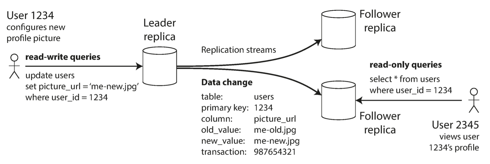
    </p>

This mode of replication is a built-in feature of many relational databases, such as PostgreSQL, MySQL, Oracle Data Guard, and SQL Server’s AlwaysOn Availability Groups. It is also used in some nonrelational databases, including MongoDB, RethinkDB, and Espresso. Finally, leader-based replication is not restricted to only databases: distributed message brokers such as Kafka and RabbitMQ highly available queues also use it.


### Synchronous Versus Asynchronous Replication
An important detail of a replicated system is whether the replication happens *synchronously* or *asynchronously*. At some point in time, the client sends the request to the leader. At some point, the leader forwards the data change to the followers. Eventually, the leader notifies the client that the update was successful.

<p align="center">

</p>

In the example shown above, the replication to follower 1 is synchronous: the leader waits until follower 1 has confirmed that it received the write before reporting success to the user, and before making the write visible to other clients. The replication to follower 2 is asynchronous: the leader sends the message, but doesn’t wait for a response from the follower.

The diagram shows that there is a substantial delay before follower 2 processes the message. Normally, replication is quite fast: most database systems apply changes to followers in less than a second. However, there is no guarantee of how long it might take. There are circumstances when followers might fall behind the leader by several minutes or more; for example, if a follower is recovering from a failure, if the system is operating near maximum capacity, or if there are network problems between the nodes.

The advantage of synchronous replication is that the follower is guaranteed to have an up-to-date copy of the data that is consistent with the leader. If the leader suddenly fails, we can be sure that the data is still available on the follower. The disadvantage is that if the synchronous follower doesn’t respond (because it has crashed, or there is a network fault, or for any other reason), the write cannot be processed. The leader must block all writes and wait until the synchronous replica is available again. For that reason, it is impractical for all followers to be synchronous: any one node outage would cause the whole system to grind to a halt. In practice, if you enable synchronous replication on a database, it usually means that one of the followers is synchronous, and the others are asynchronous. If the synchronous follower becomes unavailable or slow, one of the asynchronous followers is made synchronous. This guarantees that you have an up-to-date copy of the data on at least two nodes: Replication leader and one synchronous follower. This configuration is sometimes also called **semi-synchronous**.

Often, leader-based replication is configured to be completely asynchronous. In this case, if the leader fails and is not recoverable, any writes that have not yet been replicated to followers are lost. This means that a write is not guaranteed to be durable, even if it has been confirmed to the client. However, a fully asynchronous configuration has the advantage that the leader can continue processing writes, even if all of its followers have fallen behind. Weakening durability may sound like a bad trade-off, but asynchronous replication is nevertheless widely used, especially if there are many followers or if they are geographically distributed.

### Setting Up New Followers

From time to time, you need to set up new followers—perhaps to increase the number of replicas, or to replace failed nodes. How do you ensure that the new follower has an accurate copy of the leader’s data?

Simply copying data files from one node to another is typically not sufficient: clients are constantly writing to the database, and the data is always in flux, so a standard file copy would see different parts of the database at different points in time. The result might not make any sense.

You could make the files on disk consistent by locking the database (making it unavailable for writes), but that would go against our goal of high availability. Fortunately, setting up a follower can usually be done without downtime. Conceptually, the process looks like this:

1. Take a **consistent snapshot** of the leader’s database at some point in time—if possible, without taking a lock on the entire database. Most databases have this feature, as it is also required for backups. 

2. Copy the snapshot to the new follower node.

3. The follower connects to the leader and requests all the data changes that have happened since the snapshot was taken. This requires that the snapshot is associated with an exact position in the **leader’s replication log**.

4. When the follower has processed the backlog of data changes since the snapshot, we say it has caught up. It can now continue to process data changes from the leader as they happen.

### Handling Node Outages
Any node in the system can go down, perhaps unexpectedly due to a fault, but just as likely due to planned maintenance (for example, rebooting a machine to install a kernel security patch). Being able to reboot individual nodes without downtime is a big advantage for operations and maintenance. How do you achieve high availability with leader-based replication?

#### Follower failure: Catch-up recovery
On its local disk, each follower keeps a log of the data changes it has received from the leader. If a follower crashes and is restarted, or if the network between the leader and the follower is temporarily interrupted, the follower can recover quite easily:

from its log, it knows the last transaction that was processed before the fault occurred. Thus, the follower can connect to the leader and request all the data changes that occurred during the time when the follower was disconnected. When it has applied these changes, it has caught up to the leader and can continue receiving a stream of data changes as before.

#### Leader failure: Failover
Handling a failure of the leader is trickier: one of the followers needs to be promoted to be the new leader, clients need to be reconfigured to send their writes to the new leader, and the other followers need to start consuming data changes from the new leader. This process is called **failover**. Failover can happen manually (an administrator) or automatically.  An automatic failover process usually consists of the following steps:

- **Determining that the leader has failed**: most systems simply use a **timeout**: nodes frequently bounce messages back and forth between each other, and if a node doesn’t respond for some period of time—say, 30 seconds—it is
assumed to be dead.
- **Choosing a new leader**: This could be done through an election process (where the leader is chosen by a majority of the remaining replicas), or a new leader could be appointed by a previously elected controller node. The best candidate for leadership is usually the replica with the most up-to-date data changes from the old leader (to minimize any data loss).
- **Reconfiguring the system to use the new leader**: Clients now need to send their write requests to the new leader. If the old leader comes back, it might still believe that it is the leader, not realizing that the other replicas have forced it to step down. The system needs to ensure that the old leader becomes a follower and recognizes the new leader.

During failover some things can go wrong:
- If asynchronous replication is used, the new leader may not have received all the writes from the old leader before it failed. If the former leader rejoins the cluster after a new leader has been chosen, what should happen to those writes? The new leader may have received conflicting writes in the meantime. The most common solution is for the old leader’s unreplicated writes to simply be discarded, which may violate clients’ durability expectations.

- Discarding writes is especially dangerous if other storage systems outside of the database need to be coordinated with the database contents. 
- In certain fault scenarios (see Chapter 8), it could happen that two nodes both believe that they are the leader. This situation is called split brain, and it is dangerous: if both leaders accept writes, and there is no process for resolving conflicts (see “Multi-Leader Replication” on page 168), data is likely to be lost or corrupted. As a safety catch, some systems have a mechanism to shut down one node if two leaders are detected.ii However, if this mechanism is not carefully designed, you can end up with both nodes being shut down

- What is the right timeout before the leader is declared dead? A longer timeout means a longer time to recovery in the case where the leader fails. However, if the timeout is too short, there could be unnecessary failovers. For example, a temporary load spike could cause a node’s response time to increase above the timeout, or a network glitch could cause delayed packets. If the system is already struggling with high load or network problems, an unnecessary failover is likely to make the situation worse, not better.

There are no easy solutions to these problems. For this reason, some operations teams prefer to perform failovers manually, even if the software supports automatic failover. These issues—node failures; unreliable networks; and trade-offs around replica consistency, durability, availability, and latency—are in fact fundamental problems in distributed systems.

#### Implementation of Replication Logs
How does leader-based replication work under the hood? Several different replication methods are used in practice, so let’s look at each one briefly.

##### Statement-based replication
In the simplest case, the leader logs every write request (statement) that it executes and sends that statement log to its followers. For a relational database, this means that every INSERT, UPDATE, or DELETE statement is forwarded to followers, and each follower parses and executes that SQL statement as if it had been received from a client. Although this may sound reasonable, there are various ways in which this approach to replication can break down:

- Calling a nondeterministic function, such as `NOW()` to get the current date and time or `RAND()` to get a random number, is likely to generate a different value on each replica
- Statements that have side effects (e.g., triggers, stored procedures, user-defined functions) may result in different side effects occurring on each replica, unless the side effects are absolutely deterministic.
  
Because there are so many edge cases, other replication methods are now generally preferred.

##### Logical (row-based) log replication
An alternative is to use different log formats for replication and for the storage engine, which allows the replication log to be decoupled from the storage engine internals. This kind of replication log is called a logical log, to distinguish it from the storage engine’s (physical) data representation. A logical log for a relational database is usually a sequence of records describing writes to database tables at the granularity of a row:
- For an inserted row, the log contains the new values of all columns.
- For a deleted row, the log contains enough information to uniquely identify the row that was deleted. Typically this would be the primary key, but if there is no primary key on the table, the old values of all columns need to be logged.
- For an updated row, the log contains enough information to uniquely identify the updated row, and the new values of all columns (or at least the new values of all columns that changed).

A transaction that modifies several rows generates several such log records, followed by a record indicating that the transaction was committed.

#### Problems with Replication Lag

Leader-based replication requires all writes to go through a single node, but read-only queries can go to any replica. For workloads that consist of mostly reads and only a small percentage of writes (a common pattern on the web), there is an attractive option: create many followers, and distribute the read requests across those followers. This removes load from the leader and allows read requests to be served by nearby replicas.

In this read-scaling architecture, you can increase the capacity for serving read-only requests simply by adding more followers. However, this approach only realistically works with asynchronous replication—if you tried to synchronously replicate to all followers, a single node failure or network outage would make the entire system unavailable for writing. And the more nodes you have, the likelier it is that one will be down, so a fully synchronous configuration would be very unreliable.

Unfortunately, if an application reads from an asynchronous follower, it may see out‐dated information if the follower has fallen behind. This leads to apparent inconsistencies in the database: if you run the same query on the leader and a follower at the same time, you may get different results, because not all writes have been reflected in the follower. This inconsistency is just a temporary state—if you stop writing to the database and wait a while, the followers will eventually catch up and become consistent with the leader. For that reason, this effect is known as **eventual consistency**. The word “eventually” refers to the fact that there is no limit to how far a replica can fall behind. In normal operation, the delay between a write happening on the leader and being reflected on a follower—**the replication lag**—may be only a fraction of a second, and not noticeable in practice. However, if the system is operating near capacity or if there is a problem in the network, the lag can easily increase to several seconds or even minutes.

#### Reading Your Own Writes
Many applications let the user submit some data and then view what they have submitted. With asynchronous replication, there is a problem: if the user views the data shortly after making a write, the new data may not yet have reached the replica. To the user, it looks as though the data they submitted was lost, so they will be understandably unhappy. In this situation, we need **read-after-write consistency**, also known as *read-your-writes consistency*. This is a guarantee that if the user reloads the page, they will always see any updates they submitted themselves. It makes no promises about other users: other users’ updates may not be visible until some later time. However, it reassures the user that their own input has been saved correctly.

How can we implement read-after-write consistency in a system with leader-based replication? There are various possible techniques. To mention a few:

-  When reading something that the user may have modified, read it from the
leader; otherwise, read it from a follower. For example, user profile information on a social network is normally only editable by the owner of the profile, not by anybody else. Thus, a simple rule is: always read the user’s own profile from the leader, and any other users’ profiles from a follower.
- If most things in the application are potentially editable by the user, that approach won’t be effective, as most things would have to be read from the leader (negating the benefit of read scaling). In that case, other criteria may be used to decide whether to read from the leader. For example, you could track the time of the last update and, for one minute after the last update, make all reads from the leader. You could also monitor the replication lag on followers and prevent queries on any follower that is more than one minute behind the leader.
- The client can remember the timestamp of its most recent write—then the system can ensure that the replica serving any reads for that user reflects updates at least until that timestamp. If a replica is not sufficiently up to date, either the read can be handled by another replica or the query can wait until the replica has caught up. The timestamp could be a logical timestamp (something that indicates ordering of writes, such as the log sequence number) or the actual system clock (in which case clock synchronization becomes critical;
- If your replicas are distributed across multiple datacenters (for geographical proximity to users or for availability), there is additional complexity. Any request that needs to be served by the leader must be routed to the datacenter that contains the leader.

Another complication arises when the same user is accessing your service from multiple devices, for example a desktop web browser and a mobile app. In this case you may want to provide cross-device read-after-write consistency: if the user enters some information on one device and then views it on another device, they should see the information they just entered.

#### Monotonic Reads
Our second example of an anomaly that can occur when reading from asynchronous followers is that it’s possible for a user to see things moving backward in time. This can happen if a user makes several reads from different replicas. **Monotonic reads** is a guarantee that this kind of anomaly does not happen. It’s a lesser guarantee than strong consistency, but a stronger guarantee than eventual consistency. This means the user will not read older data after having previously  read newer data.

One way of achieving monotonic reads is to make sure that each user always makes their reads from the same replica (different users can read from different replicas). For example, the replica can be chosen based on a hash of the user ID, rather than randomly. However, if that replica fails, the user’s queries will need to be rerouted to another replica.

#### Consistent Prefix Reads

**Consistent prefix reads guarantee **says that if a sequence of writes happens in a certain order, then anyone reading those writes will see them appear in the same order. This is a particular problem in partitioned (sharded) databases. If the database always applies writes in the same order, reads always see a consistent prefix, so this anomaly cannot happen. However, in many distributed databases, different partitions operate independently, so there is no global ordering of writes: when a user reads from the database, they may see some parts of the database in an older state and some in a newer state.

#### Solutions for Replication Lag
When working with an eventually consistent system, it is worth thinking about how the application behaves if the replication lag increases to several minutes or even hours. If the answer is “no problem,” that’s great. However, if the result is a bad experience for users, it’s important to design the system to provide a stronger guarantee, such as read-after-write. 

There are ways in which an application can provide a stronger guarantee than the underlying database—for example, by performing certain kinds of reads on the leader. However, dealing with these issues in application code is com‐ plex and easy to get wrong. It would be better if application developers didn’t have to worry about subtle replication issues and could just trust their databases to “do the right thing.” This is why **transactions **exist: they are a way for a database to provide stronger guarantees so that the application can be simpler.

Single-node transactions have existed for a long time. However, in the move to distributed (replicated and partitioned) databases, many systems have abandoned them, claiming that transactions are too expensive in terms of performance and availability, and asserting that eventual consistency is inevitable in a scalable system. There is some truth in that statement, but it is overly simplistic, and we will develop a more nuanced view over the course of the rest of this book.

### Multi-Leader Replication
Leader-based replication has one major downside: there is only one leader, and all writes must go through it. If you can’t connect to the leader for any reason, for example due to a network interruption between you and the leader, you can’t write to the database. A natural extension of the leader-based replication model is to allow more than one node to accept writes. Replication still happens in the same way: each node that processes a write must forward that data change to all the other nodes. We call this a **multi-leader configuration**. In this setup, each leader simultaneously acts as a follower to the other leaders.

#### Use Cases for Multi-Leader Replication
It rarely makes sense to use a multi-leader setup within a single datacenter, because the benefits rarely outweigh the added complexity.

##### Multi-datacenter operation
Imagine you have a database with replicas in several different datacenters (perhaps so that you can tolerate failure of an entire datacenter, or perhaps in order to be closer to your users). With a normal leader-based replication setup, the leader has to be in one of the datacenters, and all writes must go through that datacenter.

In a multi-leader configuration, you can have a leader in each datacenter. Within each datacenter, regular leader–follower replication is used; between datacenters, each datacenter’s leader replicates its changes to the leaders in other datacenters.

<p align="center">
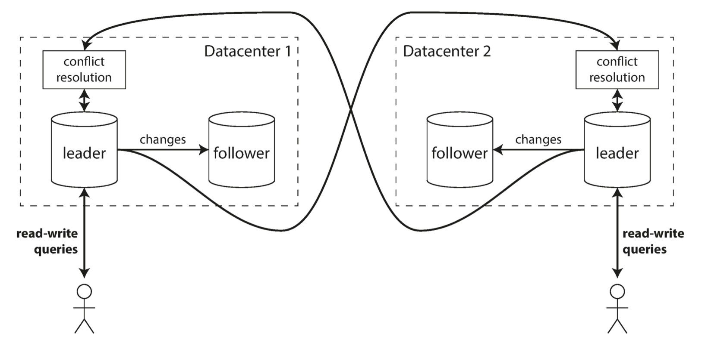
</p>


- Performance: in a multi-leader configuration, every write can be processed in the local datacenter and is replicated asynchronously to the other datacenters. Thus, the inter-datacenter network delay is hidden from users, which means the perceived performance may be better.

- Tolerance of datacenter outages: in a single-leader configuration, if the datacenter with the leader fails, failover can promote a follower in another datacenter to be leader. In a multi-leader configuration, each datacenter can continue operating independently of the others, and replication catches up when the failed datacenter comes back online.

- Tolerance of network problems: traffic between datacenters usually goes over the public internet, which may be less reliable than the local network within a datacenter. A single-leader configuration is very sensitive to problems in this inter-datacenter link, because writes are made synchronously over this link. A multi-leader configuration with asynchronous replication can usually tolerate network problems better: a temporary network interruption does not prevent writes being processed.

Although multi-leader replication has advantages, it also has a big downside: the same data may be concurrently modified in two different datacenters, and those **write conflicts** must be resolved. 

##### Clients with offline operation
Another situation in which multi-leader replication is appropriate is if you have an application that needs to continue to work while it is disconnected from the internet.  In this case, every device has a local database that acts as a leader (it accepts write requests), and there is an asynchronous multi-leader replication process (sync) between the replicas of your calendar on all of your devices. The replication lag may be hours or even days, depending on when you have internet access available. From an architectural point of view, this setup is essentially the same as multi-leader replication between datacenters, taken to the extreme: each device is a “datacenter,” and the network connection between them is extremely unreliable. As the rich history of broken calendar sync implementations demonstrates, multi-leader replication is a tricky thing to get right. There are tools that aim to make this kind of multi-leader configuration easier. For example, CouchDB is designed for this mode of operation.

##### Collaborative editing
Real-time collaborative editing applications allow several people to edit a document simultaneously. For example, Google Docs allow multiple
people to concurrently edit a text document or spreadsheet.  To allow multiple users to edit simultaneously, all the challenges of multi-leader replication, including requiring conflict resolution should be resolved.

### Handling Write Conflicts
The biggest problem with multi-leader replication is that write conflicts can occur, which means that conflict resolution is required. For example, consider a wiki page that is simultaneously being edited by two users. User 1 changes the title of the page from A to B, and user 2 changes the title from A to C at the same time. Each user’s change is successfully applied to their local leader. However, when the changes are asynchronously replicated, a conflict is detected. This problem does not occur in a single-leader database.

<p align="center">
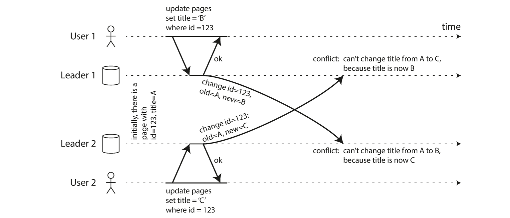
</p>

#### Synchronous versus asynchronous conflict detection

In a single-leader database, the second writer will either block and wait for the first write to complete, or abort the second write transaction, forcing the user to retry the write. On the other hand, in a multi-leader setup, both writes are successful, and the conflict is only detected asynchronously at some later point in time. At that time, it may be too late to ask the user to resolve the conflict.

In principle, you could make the conflict detection synchronous—i.e., wait for the write to be replicated to all replicas before telling the user that the write was successful. However, by doing so, you would lose the main advantage of multi-leader replication: allowing each replica to accept writes independently. If you want synchronous conflict detection, you might as well just use single-leader replication.

#### Conflict avoidance
The simplest strategy for dealing with conflicts is to avoid them: if the application can ensure that all writes for a particular record go through the same leader, then conflicts cannot occur. Since many implementations of multi-leader replication handle conflicts quite poorly, avoiding conflicts is a frequently recommended approach. For example, in an application where a user can edit their own data, you can ensure that requests from a particular user are always routed to the same datacenter and use the leader in that datacenter for reading and writing. Different users may have different “home” datacenters (perhaps picked based on geographic proximity to the user), but from any one user’s point of view the configuration is essentially single-leader.

However, sometimes you might want to change the designated leader for a record—perhaps because one datacenter has failed and you need to reroute traffic to another datacenter, or perhaps because a user has moved to a different location and is now closer to a different datacenter. In this situation, conflict avoidance breaks down, and you have to deal with the possibility of concurrent writes on different leaders.

#### Converging toward a consistent state
A single-leader database applies writes in a sequential order: if there are several updates to the same field, the last write determines the final value of the field. In a multi-leader configuration, there is no defined ordering of writes, so it’s not clear what the final value should be. At leader 1 the title is first updated to B and then to C; at leader 2 it is first updated to C and then to B. Neither order is “more correct” than the other. If each replica simply applied writes in the order that it saw the writes, the database would end up in an inconsistent state: the final value would be C at leader 1 and B at leader 2. That is not acceptable—every replication scheme must ensure that the data is eventually the same in all replicas. Thus, the database must resolve the conflict in a convergent way, which means that all replicas must arrive at the same final value when all changes have been replicated.

#### Multi-Leader Replication Topologies
A replication topology describes the communication paths along which writes are propagated from one node to another. If you have two leaders, like in Figure 5-7, there is only one plausible topology: leader 1 must send all of its writes to leader 2, and vice versa. With more than two leaders, various different topologies are possible.

<p align="center">
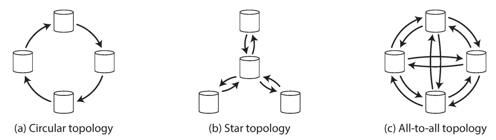
</p>

The most general topology is all-to-all (Figure 5-8 [c]), in which every leader sends its writes to every other leader. In circular and star topologies, a write may need to pass through several nodes before it reaches all replicas. Therefore, nodes need to forward data changes they receive from other nodes. To prevent infinite replication loops, each node is given a unique identifier, and in the replication log, each write is tagged with the identifiers of all the nodes it has passed through. 

A problem with circular and star topologies is that if just one node fails it can interrupt the flow of replication messages between other nodes, causing them to be unable to communicate until the node is fixed. The topology could be reconfigured to work around the failed node, but in most deployments such reconfiguration would have to be done manually. The fault tolerance of a more densely connected topology (such as all-to-all) is better because it allows messages to travel along different paths, avoiding a single point of failure.

In the following figure, client A inserts a row into a table on leader 1, and client B updates that row on leader 3. However, leader 2 may receive the writes in a different order: it may first receive the update (which, from its point of view, is an update to a row that does not exist in the database) and only later receive the corresponding insert (which should have preceded the update). This is a problem of causality. The update depends on the prior insert, so we need to make sure that all nodes process the insert first, and then the update. Simply attaching a timestamp to every write is not sufficient, because clocks cannot be trusted to be sufficiently in sync to correctly order these events at leader 2. To order these events correctly, a technique called **version vectors** can be used, which we will discuss later in this chapter. However, conflict detection techniques are poorly implemented in many multi-leader replication systems. If you are using a system with multi-leader replication, it is worth being aware of these issues, carefully reading the documentation, and thoroughly testing your data‐
base to ensure that it really does provide the guarantees you believe it to have.

<p align="center">
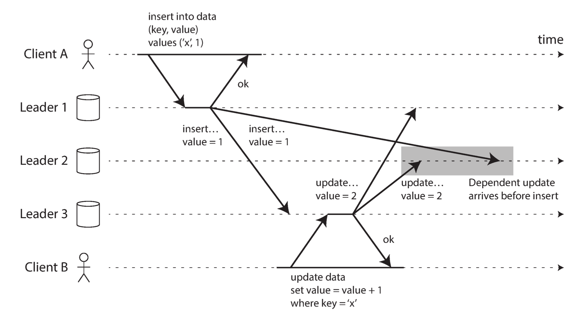
</p>


### Leaderless Replication

The replication approaches we have discussed so far in this chapter—single-leader and multi-leader replication—are based on the idea that a client sends a write request to one node (the leader), and the database system takes care of copying that write to the other replicas. A leader determines the order in which writes should be processed, and followers apply the leader’s writes in the same order.

Some data storage systems take a different approach, abandoning the concept of a leader and allowing any replica to directly accept writes from clients. The idea of leaderless systems were mostly forgotten during the era of dominance of relational databases. It once again became a fashionable architecture for databases after **Amazon** used it for its in-house *Dynamo system*. Cassandra, and Voldemort are open source datastores with leaderless replication models inspired by Dynamo, so this kind of database is also known as Dynamo-style. In some leaderless implementations, the client directly sends its writes to several replicas, while in others, a coordinator node does this on behalf of the client. However, unlike a leader database, that coordinator does not enforce a particular ordering of writes. As we shall see, this difference in design has profound consequences for the way the database is used.


On the other hand, in a leaderless configuration, failover does not exist. Suppose the client (user 1234) sends the write to all three replicas in parallel, and the two available replicas accept the write but the unavailable replica misses it. Let’s say that it’s sufficient for two out of three replicas to acknowledge the write: after user 1234 has received two ok responses, we consider the write to be successful. The client simply ignores the fact that one of the replicas missed the write.

<p align="center">

</p>

Now imagine that the unavailable node comes back online, and clients start reading from it. Any writes that happened while the node was down are missing from that node. Thus, if you read from that node, you may get stale (outdated) values as responses. To solve that problem, when a client reads from the database, it doesn’t just send its request to one replica: read requests are also sent to several nodes in parallel. The client may get different responses from different nodes; i.e., the up-to-date value from one node and a stale value from another. **Version numbers** are used to determine which value is newer.


#### Read repair and anti-entropy
The replication scheme should ensure that eventually all the data is copied to every replica. After an unavailable node comes back online, how does it catch up on the writes that it missed? Two mechanisms are often used in Dynamo-style datastores:
- **Read repair**
When a client makes a read from several nodes in parallel, it can detect any stale responses. The client sees which replica  has a stale value and writes the newer value back to that replica. This approach works well for values that are frequently read.
- **Anti-entropy process**
In addition, some datastores have a background process that constantly looks for differences in the data between replicas and copies any missing data from one replica to another. Unlike the replication log in leader-based replication, this anti-entropy process does not copy writes in any particular order, and there may be a significant delay before data is copied.

Note that without an anti-entropy process, values that are rarely read may be missing from some replicas and thus have reduced durability, because read repair is only performed when a value is read by the application.


#### Monitoring Staleness

From an operational perspective, it’s important to monitor whether your databases are returning up-to-date results. Even if your application can tolerate stale reads, you need to be aware of the health of your replication. If it falls behind significantly, it should alert you so that you can investigate the cause (for example, a problem in the network or an overloaded node). For leader-based replication, the database typically exposes metrics for the replication lag, which you can feed into a monitoring system. This is possible because writes are applied to the leader and to followers in the same order, and each node has a position in the replication log (the number of writes it has applied locally). By subtracting a follower’s current position from the leader’s current position, you can measure the amount of replication lag.


#### Multi-datacenter operation
Leaderless replication is also suitable for multi-datacenter operation, since it is designed to tolerate conflicting concurrent writes, network interruptions, and latency spikes. Cassandra and Voldemort implement their multi-datacenter support within the normal leaderless model: the number of replicas n includes nodes in all datacenters, and in the configuration you can specify how many of the n replicas you want to have in each datacenter. Each write from a client is sent to all replicas, regardless of datacenter, but the client usually only waits for acknowledgment from a quorum of nodes within its local datacenter so that it is unaffected by delays and interruptions on the cross-datacenter link. The higher-latency writes to other datacenters are often configured to happen asynchronously, although there is some flexibility in the configuration.


#### Detecting Concurrent Writes
Dynamo-style databases allow several clients to concurrently write to the same key, which means that conflicts will occur even if strict quorums are used. If each node simply overwrote the value for a key whenever it received a write request from a client, the nodes would become permanently inconsistent, as shown by the final get request in the following figure: it shows two clients, A and B, simultaneously writing to a key X in a three-node datastore node 2 thinks that the final value of X is B, whereas the other nodes think that the value is A.

<p align="center">
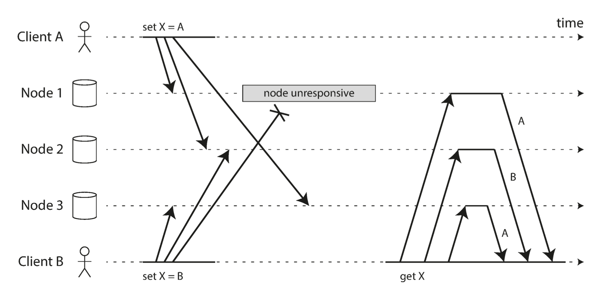
</p>

In order to become eventually consistent, the replicas should converge toward the same value. Unfortunately if you want to avoid losing data, you—the application developer—need to know a lot about the internals of your database’s conflict handling. Before we wrap up this chapter, let’s explore the issue in a bit more detail.


#### Last write wins (discarding concurrent writes)
One approach for achieving eventual convergence is to declare that each replica need only store the most “recent” value and allow “older” values to be overwritten and discarded. Then, as long as we have some way of unambiguously determining which write is more “recent,” and every write is eventually copied to every replica, the replicas will eventually converge to the same value.

As indicated by the quotes around “recent,” this idea is actually quite misleading. We say the writes are concurrent, so their order is undefined. Even though the writes don’t have a natural ordering, we can force an arbitrary order on them. For example, we can attach a **timestamp** to each write, pick the biggest timestamp as the most “recent,” and discard any writes with an earlier timestamp. This conflict resolution algorithm, called **last write wins (LWW)**, is the only supported conflict resolution method in Cassandra, and an optional feature in Riak. LWW achieves the goal of eventual convergence, but at the cost of durability: if there are several concurrent writes to the same key, even if they were all reported as successful to the client (because they were written to w replicas), only one of the writes will survive and the others will be silently discarded. Moreover, LWW may even drop writes that are not concurrent.

There are some situations, such as caching, in which lost writes are perhaps acceptable. If losing data is not acceptable, LWW is a poor choice for conflict resolution. The only safe way of using a database with LWW is to ensure that a key is only written once and thereafter treated as immutable, thus avoiding any concurrent updates to the same key. For example, a recommended way of using Cassandra is to use a UUID as the key, thus giving each write operation a unique key.


#### The “happens-before” relationship and concurrency
How do we decide whether two operations are concurrent or not? An operation A **happens before** another operation B if B knows about A, or depends on A, or builds upon A in some way. Whether one operation happens before another operation is the key to defining what concurrency means. In fact, we can simply say that two operations are concurrent if neither happens before the other (i.e., neither knows about the other). What we need is an algorithm to tell us whether two operations are concurrent or not. If one operation happened before another, the later operation should overwrite the earlier operation, but if the operations are concurrent, we have a conflict that needs to be resolved.

It is not important whether they literally overlap in time. Because of problems with clocks in distributed systems, it is actually quite difficult to tell whether two things happened at exactly the same time. In computer systems, two operations might be concurrent even though the speed of light would in principle have allowed one operation to affect the other. For example, if the network was slow or interrupted at the time, two operations can occur some time apart and still be concurrent, because the network problems prevented one operation from being able to know about the other.


#### Capturing the happens-before relationship
Let’s look at an algorithm that determines whether two operations are concurrent, or whether one happened before another. The following figure shows two clients concurrently adding items to the same shopping cart. Initially, the cart is empty. 

<p align="center">
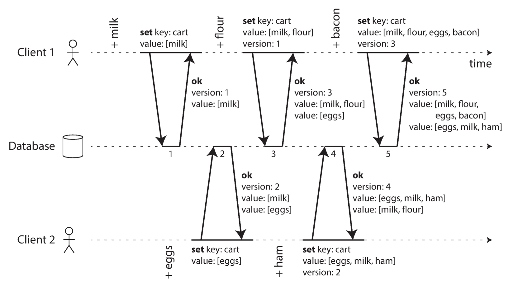
</p>

The arrows indicate which operation happened before which other operation, in the sense that the later operation knew about or depended on the earlier one. In this example, the clients are never fully up to date with the data on the server, since there is always another operation going on concurrently. But old versions of the value do get overwritten eventually, and no writes are lost.

<p align="center">
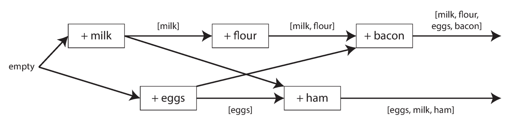
</p>

Note that the server can determine whether two operations are concurrent by looking at the version numbers—it does not need to interpret the value itself (so the value could be any data structure). The algorithm works as follows:

- The server maintains a version number for every key, increments the version number every time that key is written, and stores the new version number along with the value written.

- When a client reads a key, the server returns all values that have not been overwritten, as well as the latest version number. A client must read a key before writing.

- When a client writes a key, it must include the version number from the prior read, and it must merge together all values that it received in the prior read. (The response from a write request can be like a read, returning all current values, which allows us to chain several writes like in the shopping cart example.)

- When the server receives a write with a particular version number, it can overwrite all values with that version number or below (since it knows that they have been merged into the new value), but it must keep all values with a higher version number (because those values are concurrent with the incoming write).

#### Version Vectors
The example in above figure used only a single replica. How does the algorithm change when there are multiple replicas, but no leader? The figure uses a single version number to capture dependencies between operations, but that is not sufficient when there are multiple replicas accepting writes concurrently. Instead, we need to use **a version number per replica** as well as per key. Each replica increments its own version number when processing a write, and also keeps track of the version numbers it has seen from each of the other replicas. This information indicates which values to overwrite and which values to keep as siblings. The collection of version numbers from all the replicas is called a **version vector**. Version vectors are sent from the database replicas to clients when values are read, and need to be sent back to the database when a value is subsequently written. The version vector allows the database to distinguish between overwrites and concurrent writes.


# Partitioning
