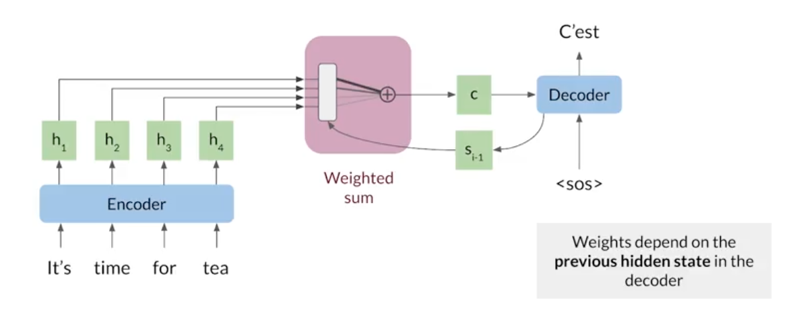
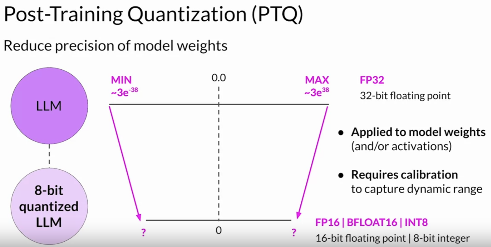

<h1 class='title'>Natural Language Processing</h1>

<!-- ---
**Author:** Yaser Eftekhari  
**Date:** April 11, 2025
--- -->

<!-- ## Neural Language Models -->

**Neural Language Models** or NLMs are a class of language model designed to overcome the curse of dimensionality problem for modeling natural language sequences by using a distributed representation of words. Unlike class-based n-gram models, neural language models are able to recognize that two words are similar without losing the ability to encode each word as distinct from the other.

# Sequence Modeling

## N-Grams Overview

N-grams are fundamental and give you a foundation that will allow you to understand more complicated models in the specialization. These models allow you to calculate probabilities of certain words happening in a specific sequence. Using that, you can build an auto-correct or even a search suggestion tool. Other applications of N-gram language modeling include: 

- **Speech Recognition**: $P(\text{I saw a van}) > P(\text{eyes awe of an})$
- **Spelling Correction**: $P(\text{entered the shop to buy}) > P(\text{entered the shop to buy})$
- **Augmentative Communication**: prdict modt likely word from menu for people unable to physically talk or sign

An N-gram is a sequence of N words sitting next to each other in the corpus. Example:
Corpus: `I am happy becuse I am learning`
Unigrams: {`I`, `am`, `happy`, `because`, `learning`}
Bigrams: {`I am`, `am happy`, `happy because`, `because I`, `am learning`}
Bigrams: {`I am happy`, `am happy becuse`, `happy because I`, `becuase I am`, `I am learning`}

Given the corpus:

\[
\begin{align*}
P(\text{I}) &= \frac{2}{7}\\
P(\text{happy}) &= \frac{1}{7}\\
P(\text{am}|\text{I}) &= \frac{C(\text{I am})}{C(\text{I})} = \frac{2}{2} = 1\\
P(\text{happy}|\text{I}) &= \frac{0}{0} = 0 \\
\end{align*}
\]

Probability of bigram $x, y$ is $P(y|x)$. In general, n-gram probability $w_1,...,w_n$ are estimated like this $P(w_n|w_1,...w_{n-1})$. Approximate the probability of a sentence using 

$$P(A,B,C,D)=P(A)P(B∣A)P(C∣A,B)P(D∣A,B,C).$$ 

Example:

$$P(\text{the teacher drinks tea})= P(\text{the})P( \text{teacher} | \text{the})P(\text{drinks}| \text{the teacher})P(\text{tea}∣\text{the teacher drinks})$$

I practice, the corpus rarely contains the exact same phrases as the ones you computed your probabilities on. Hence, you can easily end up getting a probability of 0. To make an estimation of these probabilities, we might want to follow the Markov assumption that indicates only the last word matters. Hence: you can model the entire sentence as follows:

$$P(w_n | w_1^{n-1}) \approx P(w_n | w_{n-N+1}^{n-1})$$

for some $N$. You can model the entire sentence as follows:

$$P(w^n_1) \approx \prod^n_{i=1} P(w_i | w_{i-1})$$

To avoid **underflow**, you can multiply by the log:

$$\log P(w^n_1) \approx \sum^n_{i=1} \log P(w_i | w_{i-1})$$

Now that we have joint distribution of words, we have a generative model using N-grams:
- Choose sentence start
- Choose next bigram starting with previous word
- Continue until `</s>` is picked 

##### Starting and Ending Sentences

We usually start and end a sentence with the following tokens respectively: `<s> </s>`.  When computing probabilities using a unigram, you can append an `<s>` in the beginning of the sentence. To generalize to an N-gram language model, you can add N-1 start tokens `<s>`.  For the end of sentence token `</s>`, you only need one even if it is an N-gram. Example of bigram:

corpus=`<s>Lyn drinks chocolate</s> <s>John drinks tea</s> <s>Lyn eats chocolate</s>`

\[
\begin{align*}
P(\text{John}|<s>)&=\frac{1}{3}\\
P(\text{</s>}|tea)&=\frac{1}{1}\\
P(Lyn|\text{</s>})&=\frac{2}{3}\\
P(\text{chocolate}|\text{eats})&=\frac{1}{1}
\end{align*}
\]


# Training Tokenizers

How a computer can represent language such as words and sentences, in a numeric format that can then later be used to train neural networks. This process is called **tokenization**.

Consider the word "listen,"and it consists of six letters. How can a computer understand this word? Assign a number to each letter? A common coding formatis called ASCII, where common letters and symbols are encoded into the values from 0 to 255. It's useful in that only one byte is needed to store the value for a letter. For example, the letter L is 76, I is 73, and so on. This is a perfectly valid encoding but then it becomes much harder to extract meaning from these numbers after breaking down the structure to the smallest building blocks like this. For example, in a sentence, if we change the order of words, one can still extract the moeaning of the sentence. But at character level, this is not easy for English language. For example the words LISTEN and SILENT are totally irrelevant although made of the same letters. 

There are some other subtelty into how to tokenize. Consider the sentenct: `"Don't you love 🤗 Transformers? We sure do."`. If tokenized by whit space only, Then we get `["Don't", "you", "love", "🤗", "Transformers?", "We", "sure", "do."]`. The punctuations are attached to the words "Transformer" and "do", which is suboptimal. We should take the punctuation into account so that a model does not have to learn a different representation of a word and every possible punctuation symbol that could follow it, which would explode the number of representations the model has to learn. Taking punctuation into account, tokenizing our exemplary text would give:

```sh
["Don", "'", "t", "you", "love", "🤗", "Transformers", "?", "We", "sure", "do", "."]
```
Better. However, it is disadvantageous, how the tokenization dealt with the word "Don't". "Don't" stands for "do not", so it would be better tokenized as `["Do", "n't"]`. Depending on the rules we apply for tokenizing a text, a different tokenized output is generated for the same text. A pretrained model only performs properly if you feed it an input that was tokenized with the same rules that were used to tokenize its training data. 

For instance, the BertTokenizer tokenizes `"I have a new GPU!"` as follows:

```python
from transformers import BertTokenizer

tokenizer = BertTokenizer.from_pretrained("bert-base-uncased")
tokenizer.tokenize("I have a new GPU!")
```
```sh
["i", "have", "a", "new", "gp", "##u", "!"]
```
Because we are considering the uncased model, the sentence was lowercased first. We can see that the words `["i", "have", "a", "new"]` are present in the tokenizer's vocabulary, but the word "gpu" is not. Consequently, the tokenizer splits `"gpu"` into known subwords: `["gp" and "##u"]`. `"##"` means that the rest of the token should be attached to the previous one, without space (for decoding or reversal of the tokenization).

The way we tokenize would directly affect the output vocabulary size. A large vocab size forces the model to have an enormous embedding matrix as the input and output layer, which causes both an increased memory and time complexity at training and for inference as well. In general, transformers models rarely have a vocabulary size greater than 50,000, especially if they are pretrained only on a single language. 

There are known algorithms for tokenizing text which uses the corpus statistics to decide how to segment a text into tokens. Instead of just breaking words at every white space or at every character (in Chinese, for example), these algorithms use the data to determine how to tokenize it. This family is often called **subword tokenization** because tokens can be parts of words or a whole word. Three common algorithm here are:

- **Byte Pair Encoding (BPE)** 
- **WordPiece**
- **Unigram Language Modeling Tokenization**


These tokenizers have 2 parts: 
- A token learner that takes raw training corpus and induces a vocabulary (se set of tokens)
- A token segmenter that takes a raw test sentence and tokenizes it according to that vocabulary

These algorithms are implmented in Pytorch, [TensorFlow](https://www.tensorflow.org/text/guide/subwords_tokenizer) or Hugging Face. 

### Byte Pair Encoding (BPE) Tokenizer

BPE relies on a pre-tokenizer that splits the training data into words. Pretokenization can be as simple as space tokenization, e.g. GPT-2, Roberta. More advanced pre-tokenization include rule-based tokenization, e.g. XLM, FlauBERT which uses Moses for most languages, or GPT which uses Spacy and ftfy, to count the frequency of each word in the training corpus.

After pre-tokenization, a set of unique words has been created and the frequency with which each word occurred in the training data has been determined. Next, BPE creates a base vocabulary consisting of all symbols that occur in the set of unique words and learns merge rules to form a new symbol from two symbols of the base vocabulary. It does so until the vocabulary has attained the desired vocabulary size. Note that the desired vocabulary size is a hyperparameter to define before training the tokenizer.

Byte pair encoding replaces the highest-frequency pair of bytes with a new byte that was not contained in the initial dataset. A lookup table of the replacements is required to rebuild the initial dataset. The modified version builds "tokens" (units of recognition) that match varying amounts of source text, from single characters (including single digits or single punctuation marks) to whole words (even long compound words).

Start with characters as initial set of tokens. Repeats the following:
1. Choose the two toekns that are most frequently adjacent in the training corpus (say 'A', 'B')
2. Add a new merged symbol 'AB' to vocabulary
3. Replace every adjacent 'A''B' in the corpus with 'AB'

Continue until k merges have been done. 

Based on this algorithm, the tokenizer has learned a set of merges in a specific order (first merge was 'A', 'B' -> 'AB' and son on). Each merge operation produces a new symbol which represents a character n-gram. Frequent character n-grams (or whole words) are eventually merged into a single symbol, thus BPE requires no shortlist. The final symbol vocabulary size is equal to the size of the initial vocabulary, plus the number of merge operations – the latter is the only hyperparameter of the algorithm.

For the test set (a new sentenct probably not existed in the trainng set), the tokenizer will do the same merges it learned at the time of training in the same order. There might inevitably be some symbols that are enencodable by the generated vocabulary. One solution is to replace any unencodable symbol with a special name UNK ("unknown"). 

The byte-level BPE is another approach. It simply converts the text into UTF-8 first, and treat it as a stream of bytes. This guarantees that any text encoded in UTF-8 can be encoded by the BPE. This has been used in BERT-like models like RoBERTa, BART, and DeBERTa, and GPT-like models like GPT-2. A base vocabulary that includes all possible base characters can be quite large if e.g. all unicode characters are considered as base characters. To have a better base vocabulary, GPT-2 uses bytes as the base vocabulary, which is a clever trick to force the base vocabulary to be of size 256 while ensuring that every base character is included in the vocabulary. With some additional rules to deal with punctuation, the GPT2's tokenizer can tokenize every text without the need for the symbol. GPT-2 has a vocabulary size of 50,257, which corresponds to the 256 bytes base tokens, a special end-of-text token and the symbols learned with 50,000 merges.

BPE tokens usually include frequent words and frequent subwords (like -est, -er, -un, -ly). The algorithm initially treats the set of unique characters as 1-character-long n-grams (the initial tokens). Then, successively, the most frequent pair of adjacent tokens is merged into a new, longer n-gram and all instances of the pair are replaced by this new token. This is repeated until a vocabulary of prescribed size is obtained. 

Maximum number of merges are determined by the vocabulary size chosen. If we choose a large vocab size, then the text will be compressed too much into bigger tokens which may not be ideal. 


### WordPiece Tokenizer

WordPiece is the tokenization algorithm Google developed to pretrain BERT. It has since been reused in quite a few Transformer models based on BERT, such as DistilBERT, MobileBERT, Funnel Transformers, and MPNET. IT has two versions of the WordPiece algorithm: Bottom-up and top-down. In both cases goal is the same: "Given a training corpus and a number of desired tokens D, the optimization problem is to select D wordpieces such that the resulting corpus is minimal in the number of wordpieces when segmented according to the chosen wordpiece model."

The original bottom-up WordPiece algorithm, is based on byte-pair encoding. Like BPE, It starts with the alphabet, and iteratively combines common bigrams to form word-pieces and words. Like BPE, WordPiece starts from a small vocabulary including the special tokens used by the model and the initial alphabet. Since it identifies subwords by adding a prefix (like ## for BERT), each word is initially split by adding that prefix to all the characters inside the word. So, for instance, "word" gets split like this `w ##o ##r ##d`. 

Thus, the initial alphabet contains all the characters present at the beginning of a word and the characters present inside a word preceded by the WordPiece prefix. Then, again like BPE, WordPiece learns merge rules. The main difference is the way the pair to be merged is selected. Instead of selecting the most frequent pair, WordPiece computes a score for each pair, using the following formula:

$$
\text{score} =  \frac{\text{freq\_of\_pair}}{\text{freq\_of\_first\_element} \times \text{freq\_of\_second\_element}}
$$

By dividing the frequency of the pair by the product of the frequencies of each of its parts, the algorithm prioritizes the merging of pairs not only based on the frequency of the individual parts but more weight on the frequency of the combination itself in the vocabulary. For instance, it won’t necessarily merge ("un", "##able") even if that pair occurs very frequently in the vocabulary, because "un" and "##able" will likely have high frequencies as they appear in a lot of other words as well. In contrast, a pair like ("hu", "##gging") will probably be merged faster (assuming the word “hugging” appears often in the vocabulary) since "hu" and "##gging" are likely to be less frequent individually.

Source: [Hugging Face](https://huggingface.co/learn/llm-course/en/chapter6/6)


TensorFlow Text's vocabulary generator follows the top-down implementation from BERT. Starting with words and breaking them down into smaller components until they hit the frequency threshold, or can't be broken down further. The top-down WordPiece generation algorithm takes in a set of (word, count) pairs and a threshold T, and returns a vocabulary V. To see more details, look at this [notebook](https://www.tensorflow.org/text/guide/subwords_tokenizer).
<!-- ### Sentence Tokenizer -->


### Unigram Tokenizer

The Unigram algorithm is often used in **SentencePiece**, which is the tokenization algorithm used by models like AlBERT, T5, mBART, Big Bird, and XLNet. Unigram is not used directly for any of the models in the transformers, but it's used in conjunction with SentencePiece.

Compared to BPE and WordPiece, Unigram works in the other direction: it starts from a big vocabulary and removes tokens from it until it reaches the desired vocabulary size. There are several options to use to build that base vocabulary: we can take the most common substrings in pre-tokenized words, for instance, or apply top-down BPE on the initial corpus with a large vocabulary size.

At each step of the training, the Unigram algorithm computes a loss over the corpus given the current vocabulary. Then, for each symbol in the vocabulary, the algorithm computes how much the overall loss would increase if the symbol was removed, and looks for the symbols that would increase it the least. Those symbols have a lower effect on the overall loss over the corpus, so in a sense they are “less needed” and are the best candidates for removal.

This is all a very costly operation, so we don’t just remove the single symbol associated with the lowest loss increase, but the $p$ being a hyperparameter you can control, usually 10 or 20 percent of the symbols associated with the lowest loss increase. This process is then repeated until the vocabulary has reached the desired size. Note that we never remove the base characters, to make sure any word can be tokenized.

Now, this is still a bit vague: the main part of the algorithm is to compute a loss over the corpus and see how it changes when we remove some tokens from the vocabulary, but we haven’t explained how to do this yet. This step relies on the tokenization algorithm of a Unigram model, so we’ll dive into this next.

Source: [Hugging Face](https://huggingface.co/learn/llm-course/en/chapter6/7)


### SentencePiece
All tokenization algorithms described so far have the same problem: It is assumed that the input text uses spaces to separate words. However, not all languages use spaces to separate words. One possible solution is to use language specific pre-tokenizers, e.g. XLM uses a specific Chinese, Japanese, and Thai pre-tokenizer). To solve this problem more generally, SentencePiece: [A simple and language independent subword tokenizer and detokenizer for Neural Text Processing (Kudo et al., 2018)](https://arxiv.org/pdf/1808.06226) treats the input as a raw input stream, thus including the space in the set of characters to use. It then uses the BPE or unigram algorithm to construct the appropriate vocabulary.

The XLNetTokenizer uses SentencePiece for example, which is also why the "▁" character was included in the vocabulary. Decoding with SentencePiece is very easy since all tokens can just be concatenated and "▁" is replaced by a space.

```python
from transformers import XLNetTokenizer

tokenizer = XLNetTokenizer.from_pretrained("xlnet-base-cased")
tokenizer.tokenize("Don't you love 🤗 Transformers? We sure do.")
```
```sh
["▁Don", "'", "t", "▁you", "▁love", "▁", "🤗", "▁", "Transform", "ers", "?", "▁We", "▁sure", "▁do", "."]
```
All transformers models in the library that use SentencePiece use it in combination with unigram. Examples of models using SentencePiece are ALBERT, XLNet, Marian, and T5.


# Word Embedding

Neural language models share statistical strength between one word (and its context) and other similar words and contexts. For example, if the word `dog` and the word `cat` map to representations that share many attributes, then sentences that contain the word cat can inform the predictions that will be made by the model for sentences that contain the word `dog`, and vice-versa. Because there are many such attributes, there are many ways in which generalization can happen, transferring information from each training sentence to an exponentially large number of semantically related sentences. The curse of dimensionality requires the model to generalize to a number of sentences that is exponential in the sentence length. We sometimes call these word representations **word embeddings**.

The word representations embed those points in a feature space of lower dimension. In the original space, every word is represented by a **one-hot vector** using a vocabulary we choose (for example, if man is the word number 5391 in this dictionary, we represent it with a vector with 1 in position 5391 and zero anywhere else). So every pair of words is at Euclidean distance $\sqrt 2$ from each other. For large vocabularies, it can be very computationally expensive to represent an output distribution over the choice of a word, because the vocabulary size is large. In many applications, $|V|$ contains hundreds of thousands of words. So this representation is prone to the curse of dimensionality. Another weaknesses of this representation is that it makes no semantic connection between words such synonyms or opposites etc. Also it does not distinguish them in a meaningful way. For example, the relationship between apple and orange is not any closer as the relationship between any of the other words man, woman, king, queen, and orange. So it's not easy for the learning algorithm to generalize from knowing that knowldge into another similar one.  Also dot product between any two different one-hot vector is zero.

In the embedding space, words that frequently appear in similar contexts (or any pair of words sharing some “features” learned by the model) are close to each other in the embedding space. This often results in words with similar meanings being neighbors. So semantically similar words map to representations that are close to each other. 

The following figure shows 2-dimensional visualizations of word embeddings obtained from a neural machine translation model ( Bahdanau et al. 2015 , ), zooming in on specific areas where semantically related words have embedding vectors that are close to each other. Countries appear on the left and numbers on the right. Keep in mind that these embeddings are 2-D for the purpose of visualization (using algorithms like t-SNE). In real applications, embeddings typically have higher dimensionality and can simultaneously capture many kinds of similarity between words.

<p align="center">
    
</p>

In short, the pros for word embedding are:
- Low dimensions (less than V)
- Allow you to encode meaning

### How to Create Word Embeddings?

To create word embeddings you always need a corpus of text, and an embedding method. The context of a word tells you what type of words tend to occur near that specific word. The context is important as this is what will give meaning to each word embedding.

There are many types of possible methods that allow you to learn the word embeddings but mainly they involve a machine learning model performs a learning task, and the main by-products of this task are the word embeddings. The task could be to learn to predict a word based on the surrounding words in a sentence of the corpus. These vectors capture information about the meaning of the word based on the surrounding words. 

**Word2vec** is a technique in natural language processing (NLP) for obtaining vector representations of words. The word2vec algorithm estimates these representations by modeling text in a large corpus. Once trained, such a model can detect synonymous words or suggest additional words for a partial sentence. Word2vec was developed by Tomáš Mikolov and colleagues at Google and published in 2013. Word2vec represents a word as a high-dimension vector of numbers which capture relationships between words. In particular, words which appear in similar contexts are mapped to vectors which are nearby as measured by cosine similarity. This indicates the level of semantic similarity between the words, so for example the vectors for walk and ran are nearby, as are those for "but" and "however", and "Berlin" and "Germany". Word2vec can use either of two model architectures to produce these distributed representations of words: 
- continuous bag of words (CBOW) 
- continuously sliding skip-gram

In both architectures, word2vec considers both individual words and a sliding context window as it iterates over the corpus.

The CBOW can be viewed as a ‘fill in the blank’ task, where the word embedding represents the way the word influences the relative probabilities of other words in the context window. Words which are semantically similar should influence these probabilities in similar ways, because semantically similar words should be used in similar contexts. The order of context words does not influence prediction (bag of words assumption).

In the continuous skip-gram architecture, the model uses the current word to predict the surrounding window of context words.[1][2] The skip-gram architecture weighs nearby context words more heavily than more distant context words. According to the authors' note,[3] CBOW is faster while skip-gram does a better job for infrequent words.

These tasks are **self-supervised**: it is both unsupervised in the sense that the input data — the corpus — is unlabelled, and supervised in the sense that the data itself provides the necessary context which would ordinarily make up the labels. 


#### Continuous Bag of Words Model (CBOW)

In the case of the continuous bag-of-words model, the objective of the task is to predict a missing word based on the surrounding words. Here is a visualization that shows you how the models works.

<p align="center">
    
</p>

The window size in the image above is 5. The context size, C, is 2. C usually tells you how many words before or after the center word the model will use to make the prediction. 

Before implementing any natural language processing algorithm, you might want to clean the data and tokenize it into words. This step is called **preprocessing**. Here are a few things to keep track of when handling your data. Cleaning include:

- adjusting letter case (all lower case)
- removing/replacing punctuations ([,!.?"<>])
- numbers 
- special characters or special words (#nlp)
- eliminate handles and URLs
- remove stop words like "and, is, a, on, etc"
- stemming - or convert every wird to its stem. 'dancer', 'dancing', 'danced' all become 'dance'

Loop over the text and clean it line by line. You can add as many conditions as you want in the lines to convert them into a dictionary of word tokens, called a **vocabulary** $V$. It is the set of all words appearing in the corpus. Every word in this vocabulary represented by a one-hot vector. A sentence then can be represented by the sum or average of the one-hot vectors of the words in the sentence. 


<p align="center">
    
</p>

As a result you end up having the following vectors that you can use for your training:

Context words | Context words vector | Center word | Center word vector
-------------  | --------------        | ---------    |  -----------------
I am because I | [0.25, 0.25, 0.0, 0.5, 0.0] | happy | [0, 0, 1, 0, 0]

Our goal is to learn one vector $v_{w}\in \mathbb {R} ^{n}$ for each word  $w\in V$. The architecture for the CBOW model could be described as follows

<p align="center">
    
</p>

where $m$ is the batch size. The final layer goes through a softmax which gives you a distribution over V, vocabulary words. You pick the vocabulary word that corresponds to the `argmax` of the output. 

The cost function for the CBOW model is a cross-entropy loss defined as:
$$J = -\sum_{i=1}^V y_i \log \hat y_i,$$ which needs to be minimized. This is equivalent to maximizing log likelihood $$\prod P(w_i|w_j; j=i\pm n, n\in \mathbb N),$$ because $y_k=0$ except for one entry. Similarly, loss on the batch is $$J_{\text{batch}} = -\frac{1}{m}\sum_{i=1}^m\sum_{j=1}^V y_k \log \hat y_k.$$ After the model is trained, One can use the first or second weight matrix as embeddings. For example, $W_1$ is of dim $V\times N$, where $N$ is the embedding dimension. So column 1 is the embedding for word 1 and so on. The weight matrix $W_2^T$ of the second layer can similarly be taken as the embedding matrix. Even the average of the two can be considered as the embedding: $\frac{1}{2}(W_1 + W_2^T)$.


#### Continuous Skip-grams

While a bag-of-words model predicts a word given the neighboring context, a skip-gram model predicts the context (or neighbors) of a word, given the word itself. The model is trained on skip-grams, which are n-grams that allow tokens to be skipped (see the diagram below for an example). The context of a word can be represented through a set of skip-gram pairs of (target_word, context_word) where context_word appears in the neighboring context of target_word. Given a word in a sentence as target and a window size, we randomly choose a word in the sentence within the window length around the target as its context. For example, if the sentence is "With seven courses this semester, I have to study hard at school", then we could have the following as some skip-grams with window size 6:

target | context
--------| ------
course  | semester
course | study
course | seven

For every target word as input, the model predicts the corresponding target. The architecture of the model could be similar to the one for CBOW. This could be as simple as one-hot vector of target ($c$) --> affine transformation --> softmax ($\theta$) --> $\hat{y}$. By this model, 

$$\hat y_i = P(c|t) = \frac{e^{\theta_t^Tc}}{\sum_{c \in V} e^{\theta_{t}^Tc}},$$

where $\theta_t$ output of softmax when model input is one-hot vector $t$ for target $t$, and $c$ is the one-hot vector for context word. The loss is cross-entropy the same as mentioned before. Only one probability vector $\hat y$ is computed. Skip-gram treats each context word equally : the models computes the probability for each word of appearing in the context independently of its distance to the center word. 

Loss functions for CBOW and SkipGram are expensive to compute because of the softmax normalization, where we sum over all $|V|$ scores! Computing the denominator of this formulation involves performing a full softmax over the entire vocabulary words, which are often large terms. See [notes](https://web.stanford.edu/class/cs224n/readings/cs224n-2019-notes01-wordvecs1.pdf) for more details.


#### High-Dimensional Outputs

In many applications, vocabulary $V$ contains hundreds of thousands of words. The naive approach to representing such a distribution is to apply an affine transformation from a hidden representation to the output space, then apply the softmax function. Suppose we have a vocabulary $V$ with size $|V|$. The weight matrix describing the linear component of this affine transformation is very large, because its output dimension is $|V|$. This imposes a high memory cost to represent the matrix, and a high computational cost to multiply by it. Because the softmax is normalized across all $|V|$ outputs, it is necessary to perform the full matrix multiplication at training time as well as test time—we cannot calculate only the dot product with the weight vector for the correct output. The high computational costs of the output layer thus arise both at training time (to compute the likelihood and its gradient) and at test time (to compute probabilities for all or selected words). More clearly, the affine-softmax output layer performs the following computations:

\[
\begin{equation*}
\begin{split}
\bm a &= \bm b + \bm W \bm h,\\
\bm {\hat y} &= \text{softmax}(\bm a). 
\end{split}
\end{equation*}
\]

If $\bm h$ contains $n_h$ elements then the above operation is $O(|V|n_h)$. With $n_h$ in the thousands and $|V|$ in the hundreds of thousands, this operation dominates the computation of most neural language models. There are some ways to reduce this cost:
- Use of a Short List
- Hierarchical Softmax
- Importance Sampling (or Negative Sampling)

##### Negative Sampling
A simple idea is we could instead just approximate the loss function. For every training step, instead of looping over the entire vocabulary, we can just sample several negative examples! We "sample" from a noise distribution (Pn(w)) whose probabilities match the ordering of the frequency of the vocabulary. To augment our formulation of the problem to incorporate Negative Sampling, all we need to do is update the objective function, then gradient and the update rule. See [notes](https://web.stanford.edu/class/cs224n/readings/cs224n-2019-notes01-wordvecs1.pdf) for more details. Using this technique, the computational complexity of gradient estimation for the output layer is reduced to be proportional to the number of negative samples rather than proportional to the size of the output vector.

### Some application of word embedding?
- Sentiment Analysis: use well-know word embeddings to train RNNs for sentiment analysis - many-to-one RNNs... takes a sentence which is a sequence of word embeddings and outputs a a fix number of class prediction (positive/negative) 
- Debiasing Word Embeddings: Modify word embedding so they are less bias


### Evaluation of Language Model

We will now discuss the train/val/test splits and perplexity.

##### Train/Val/Test splits
Smaller Corpora: 
- 80% train
- 10% val 
- 10% test

Larger Corpora: 
- 98% train
- 1% val 
- 1% test

There are two main methods for splitting the data: 
- Continous Text
- Random Short Sequences

#### Perplexity
Perplexity is used to tell us whether a set of sentences look like they were written by humans rather than by a simple program choosing words at random. A text that is written by humans is more likely to have lower perplexity, where a text generated by random word choice would have a higher perplexity.
Perplexity is defined as the exponentiated average negative log-likelihood of a sequence. If we have a tokenized sequence $\bm X = (\bm x^{(1)}, ..., X^{(t)})$, then the perplexitiy of $\bm X$ is

$$
PPL(\bm X) = \sqrt[t]{\prod_{i=1}^t \frac{1}{P(x^{(i)}|x^{(i-1)}, ..., x^{(1)})}}
$$

Use log for more computationally stable formula:

$$
PPL(\bm X) = \exp(-\frac{1}{t}{\sum_{i=1}^t \log P(x^{(i)}|x^{(i-1)}, ..., x^{(1)})})
$$

Another version of this uses $P(x^{(i)}|x^{(i-1)})$ instead of $P(x^{(i)}|x^{(i-1)}, ..., x^{(1)})$ in th eabove formula. If there are $m$ sentences $(s_1,..., s_m)$ in the text, the formula becomes:

$$
PPL(\bm X) = \sqrt[m]{\prod_{i=1}^m \prod_{j=1}^{|s_i|} \frac{1}{P(x_i^{(j)}|x_i^{(j-1)})}}
$$

Probabilities are given according to our model. Intuitively, perplexitiy can be thought of as an evaluation of the model’s ability to predict uniformly among the set of specified tokens in a corpus. Importantly, this means that the tokenization procedure has a direct impact on a model’s perplexity which should always be taken into consideration when comparing different models.  This is also equivalent to the exponentiation of the cross-entropy between the data and model predictions. 


## Recurrent Neural Nets (RNNs)

Previously, we tried using traditional language models, but it turns out they took a lot of space and RAM.  For example, in the sentence below: 

`Nour was supposed to study with me. I called her but she did not -----`.

An N-gram (trigram) would only look at "did not" and would try to complete the sentence from there based on frequencies. As a result, the model will not be able to see the beginning of the sentence "I called her but she" and understand dependecies of the end of the sentence on the beginning so probably the most likely word is to have after "did not". RNNs help us solve this problem by being able to track dependencies that are much further apart from each other. 

Recurrent neural networks or RNNs are a family of neural networks for processing sequential data. Much as a convolutional network is a neural network that is specialized for processing a grid of values X such as an image, a recurrent neural network is a neural network that is specialized for processing a sequence of vectors (such as one-hot vectors) $\bm {x}(1)$, ..., $\bm {x}(τ)$. Just as convolutional networks can readily scale to images with large width and height, and some convolutional networks can process images of variable size, recurrent networks can scale to much longer sequences than would be practical for networks without sequence-based specialization. Most recurrent networks can also process sequences of variable length.

To go from multilayer networks to recurrent networks, we need to take advantage of one of the early ideas found in machine learning and statistical models of the 1980s: _sharing parameters across different parts of a model_. If we had separate parameters for each value of the time index, we could not generalize to sequence lengths not seen during training, nor share statistical strength across different sequence lengths and across different positions in time. A traditional fully connected feedforward network would have separate parameters for each input feature, so it would need to learn all of the rules of the language separately at each position in the sentence. By comparison, _a recurrent neural network shares the same weights across several time steps_. The convolution operation allows a network to share parameters across time, but is shallow. The output of convolution is a sequence where each member of the output is a function of a small number of neighboring members of the input. The idea of parameter sharing manifests in the application of the same convolution kernel at each time step. Recurrent networks share parameters in a different way. Each member of the output is a function of the previous members of the output. Each member of the output is produced using the same update rule applied to the previous outputs. This recurrent formulation results in the sharing of parameters through a very deep computational graph.

We refer to RNNs as operating on a sequence that contains vectors x(t) with the time step index t ranging from 1 to $τ$. the time step index need not literally refer to the passage of time in the real world. Sometimes it refers only to the position in the sequence. RNNs extends the idea of a computational graph to include cycles. These cycles represent the influence of the present value of a variable on its own value at a future time step. Such computational graphs allow us to define recurrent neural networks.


Many recurrent neural networks use equation like the following or a similar one to define the values of their hidden units. 

$$
\bm {h}^{(t)} = f(\bm {h}^{(t-1)}, \bm {x}^{(t)}; \bm {\theta})
$$

It uses the same transition function $f$ with the same parameters at every time step. Typical RNNs will add extra architectural features such as output layers that read information out of the state $h$ to make predictions. When the recurrent network is trained to perform a task that requires predicting the future from the past, the network typically learns to use ${\bm h}^{(t)}$ as a kind of lossy summary of the task-relevant aspects of the past sequence of inputs up to $t$. This summary is in general necessarily lossy, since it maps an arbitrary length sequence

$$
(\bm {x}^{(t)}, \bm {x}^{(t-1)}, \bm {x}^{(t-2)},...,\bm {x}^{(2)},\bm {x}^{(1)})
$$

to a fixed length vector $\bm {h}^{(t)}$. Depending on the training criterion, this summary might selectively keep some aspects of the past sequence with more precision than other aspects. For example, if the RNN is used in statistical language modeling, typically to predict the next word given previous words, it may not be necessary to store all of the information in the input sequence up to time $t$, but rather only enough information to predict the rest of the sentence. 

### Training RNN
Learning a single, shared model allows generalization to sequence lengths that did not appear in the training set, and allows the model to be estimated with far fewer training examples than would be required without parameter sharing. The followoing is a computational graph to compute the training loss of a recurrent network that maps an input sequence ofx values to a corresponding sequence of output $\bm o$ values. A loss $L$ measures how far each $\bm o$ is from the corresponding training target $\bm y$. When using softmax outputs, we assume $\bm o$ is the _unnormalized log probabilities_ of each possible value of the target variable. The loss $L$ internally computes the normalized probabilities $\hat {\bm y}= softmax(\bm o)$ over the output and compares this to the target $\bm y$. The RNN has input to hidden connections parametrized by a weight matrix $\bm U$ , hidden-to-hidden recurrent connections parametrized by a weight matrix $\bm W$ , and hidden-to-output connections parametrized by a weight matrix $\bm V$. 

<p align="center">
    
</p>

Forward propagation begins with a specification of the initial state $\bm {h}(0)$. Then, for each time step from $t=1$ to $t=t$, we apply the following update equations:

\[
\begin{equation}
\begin{split}
{\bm a}^{(t)} &= {\bm b} + {\bm {Wh}}^{(t-1)} + {\bm {Ux}}^{(t)} \\ 
{\bm h}^{(t)} &= \text{tanh}({\bm a}^{(t)}) \\
{\bm o}^{(t)} &= {\bm c} + {\bm {Vh}}^{(t)}\\
{\hat {\bm y}^{(t)}} &= \text{softmax}({\bm o}^{(t)})
\end{split}
\end{equation}
\]

The non-linearity $\text{tanh}$ can be replaced by Relu. Also $W$ and $U$ can be horizontally stack and $\bm h^{(t-1)}$, $\bm x^{(t)}$ veritcally stacked to do only one matrix multiplication to optimize computations. This also perfectly matches backprop gradient using the same way of stacking gradiants and inputs.   

This is an example of a recurrent network that maps an input sequence to an output sequence of the same length. The total loss for a given sequence of $\bm x$ values paired with a sequence of $\bm y$ values would then be just the sum of the losses over all the time steps. For example, if $L^{(t)}$ is the negative log-likelihood of $y{(t)}$, given $(\bm {x}^{(t)}, \bm {x}^{(t-1)}, \bm {x}^{(t-2)},...,\bm {x}^{(2)},\bm {x}^{(1)})
$, then

\[
\begin{equation*}
\begin{split}
L \Big((\bm {x}^{(1)}, \bm {x}^{(2)},...,\bm {x}^{(t)}),\; &(\bm {y}^{(1)}, \bm {y}^{(2)},...,\bm {y}^{(t)})\Big) \\ 
&= \sum_t L^{(t)}\\
&= -\sum_t log\; p_{\text{model}} \Big( y^{(t)} \; | \; \bm {x}^{(1)}, \bm {x}^{(2)},...,\bm {x}^{(t)}\Big)
\end{split}
\end{equation*}
\]

where $p_{\text{model}} \Big( y^{(t)} \; | \; \bm {x}^{(1)}, \bm {x}^{(2)},...,\bm {x}^{(t)}\Big)$ is given by reading the entry for $y^{(t)}$ from the model’s output vector $\bm {\hat y}^{(t)}$. In other words,

\[
\begin{equation*}
\begin{split}
p_{\text{model}} \Big( y^{(t)} \; | \; \bm {x}^{(1)},\; \bm {x}^{(2)},...,\bm {x}^{(t)}\Big)= (\text{softmax}(\bm {o^{(t)}}))_k 
\end{split}
\end{equation*}
\]

where $k$ is the index of token $y^{(t)}$ in the target $\bm y$. Note that length of vectors $\bm {\hat y}^{(t)}$ and $\bm o^{(t)}$ are the same as the size of vocabulary.

Computing the gradient of this loss function with respect to the parameters is an expensive operation. The runtime is $O(τ)$ and cannot be reduced by parallelization because the forward propagation graph is inherently sequential; each time step may only be computed after the previous one. States computed in the forward pass must be stored until they are reused during the backward pass, so the memory cost is also $O(τ)$. The back-propagation algorithm applied to the unrolled graph with $O(τ)$ cost is called back-propagation through time or BPTT.

#### Computing the Gradient in RNN

Computing the gradient through a recurrent neural network is straightforward. One simply applies the generalized back-propagation algorithm. Gradients obtained by backpropagation may then be used with any general-purpose gradient-based techniques to train an RNN. To gain some intuition for how the BPTT algorithm behaves, we provide an example of how to compute gradients by BPTT for the RNN equations above. 

The nodes of our computational graph include the parameters $\bm U , \bm V , \bm W , \bm b, \bm c$ as well as the sequence of the nodes indexed by $\bm x^{(t)}, \bm h^{(t)}, \bm o^{(t)},  L^{(t)}$. For each node N we need to compute the gradient $∇_N L$ recursively, based on the gradient computed at nodes that follow it in the graph. We start the recursion with the nodes immediately preceding the final loss

$$
\frac{\partial L}{\partial L^{(t)}} = 1
$$

Assuming that the loss is the negative log-likelihood of the true target $y^{(t)}$ given the input:

\[
\begin{equation*}
\begin{split}
(∇_{\bm o^{(t)}} L)_i &= \frac{\partial L}{\partial o^{(t)}_i} \\
&= \frac{\partial L}{\partial L^{(t)}} \frac{\partial L^{(t)}}{\partial o^{(t)}_i}\\
&= \frac{\partial L^{(t)}}{\partial o^{(t)}_i}\\
&= \frac{\partial }{\partial o^{(t)}_i} - \text{log} \; p_{\text{model}} \Big( y^{(t)} \; | \; \bm {x}^{(1)},\; \bm {x}^{(2)},...,\bm {x}^{(t)}\Big)\\
&= \frac{\partial }{\partial o^{(t)}_i} - \log (\text{softmax}(\bm {o^{(t)}}))_k\\
&= - \frac{\partial }{\partial o^{(t)}_i} \log \frac{e^{o_k^{(t)}}}{\sum_j e^{o_j^{(t)}}}\\
&= \frac{e^{o_i^{(t)}}}{\sum_j e^{o_j^{(t)}}} - \delta_{ik} \\
&= \hat y_i - \delta_{ik}
\end{split}
\end{equation*}
\]

where $k$ is the index of token $y^{(t)}$ in the target $\bm y$.

We work our way backwards, starting from the end of the sequence. At the final time step , $τ$, ${\bm h}(τ)$ only has ${\bm o}^{(τ)}$ as a descendent, so its gradient is simple:

$$
(∇_{\bm h^{(τ)}} L) = {\bm V}^T ∇_{\bm o^{(τ)}} L
$$

Because

\[
\begin{equation*}
\begin{split}
\frac{\partial L}{\partial h_j^{(t)}} &= \frac{\partial L^{(t)}}{\partial h^{(t)}_j} \\
&= \sum_i  \frac{\partial L^{(t)}}{\partial o^{(t)}_i}\frac{\partial o_i^{(t)}}{\partial h_j^{(t)}}\\
& = \sum_i  \frac{\partial L^{(t)}}{\partial o^{(t)}_i} V_{ij}
\end{split}
\end{equation*}
\]

for $t = τ$. For $t<τ$, ${\bm h}^{(t)}$ has as descendents both ${\bm o}^{(t)}$ and ${\bm h}^{(t+1)}$. Its gradient is thus given by

\[
\begin{equation*}
\begin{split}
\frac{\partial L}{\partial {\bm h}^{(t)}} 
&= \Big(\frac{\partial {\bm h}^{(t+1)}}{\partial {\bm h}^{(t)}}\Big)^T ∇_{\bm h^{(t+1)}} L + \Big(\frac{\partial {\bm o}^{(t)}}{\partial {\bm h}^{(t)}}\Big)^T ∇_{\bm o^{(t)}} L\\
&= {\bm W}^T ∇_{\bm h^{(t+1)}} L \; \text{diag}\Big( 1 - ({\bm h}^{(t+1)})^2\Big) + {\bm V}^T ∇_{\bm o^{(t)}} L
\end{split}
\end{equation*}
\]

where $\text{diag}\Big( 1 - ({\bm h}^{(t+1)})^2\Big)$ indicates the diagonal matrix continnig the elemets $ 1 - ({\bm h_i}^{(t+1)})^2$ which is the Jacobian of the hyperbolic tangent associates with the hidden unit $i$ at time $t+1$.

Once the gradients on the internal nodes of the computational graph are obtained, it is easy obtain the gradients on the parameter nodes. Look at [Deep Learning by Ian Goodfellow, Yoshua Bengio, Aaron Courville](https://www.amazon.ca/Deep-Learning-Ian-Goodfellow/dp/0262035618/ref=asc_df_0262035618/?tag=googleshopc0c-20&linkCode=df0&hvadid=706745562943&hvpos=&hvnetw=g&hvrand=4165137193847264239&hvpone=&hvptwo=&hvqmt=&hvdev=c&hvdvcmdl=&hvlocint=&hvlocphy=9000826&hvtargid=pla-416263148149&psc=1&mcid=d1d85934bcd73af29621fd70386e098c&gad_source=1), Chapter 10, page 386, to see calucaltions for $∇_{\bm c} L$, $∇_{\bm b} L$, $∇_{\bm V} L$, $∇_{\bm W} L$ and $∇_{\bm U} L$.


### Different Types of RNNs

RNNs could be used in a variety of tasks ranging from machine translation to caption generation. There are many ways to implement an RNN model:

-  **Many-to-many**: map a sequence of inputs to a sequence of outputs. Example: machine translation which have different input and output length. Might have a encoder-decoder design which is more flexible than RNN above
- **Many-to-one**: map a sequence of inputs to a single output. Example: sentiment classification for reviews: positive or negative  
- **One-to-many**: Single input (a number or empty even) maps to multiple outputs. Example: music generation whcihch maps a number indicating a genre to a sequence of music notes. Or given an image, you can predict what the caption is going to be
- **One to One**: given some scores of a championship, you can predict the winner

Some examples of important design patterns for recurrent neural networks include the following:

- Recurrent networks that produce an output at each time step and have recurrent connections between hidden units (many-to-many). The input and output size might be different. This is the simple RNN application. Part-of-speech tagging as sequence labeling is an application.

    <p align="center">
        
    </p>

- Recurrent networks that produce an output at each time step and have recurrent connections only from the output at one time step to the hidden units at the next time step. Machine translation is an application for this network.

    <p align="center">
        
    </p>

    The advantage of eliminating hidden-to-hidden recurrence is that, for any loss function based on comparing the prediction at time $t$ to the training target at time $t$, all the time steps are decoupled. Thus _training can thus be parallelized  (becuase previous hidden state not needed) and the gradient for each step can be computed in isolation_. Because this network lacks hidden-to-hidden recurrence, it requires that the output units capture all of the information about the past that the network will use to predict the future. Because the output units are explicitly trained to match the training set targets, they are unlikely to capture the necessary information about the past history of the input, unless the user knows how to describe the full state of the system an provides it as part of the training set targets. This training technique is called **teacher forcing**. At train time, we feed the correct output $\bm y{(t)}$ (instead of $\bm h{(t)}$) drawn from the train set as input to $\bm h{(t+1)}$. When the model is deployed, the true output is generally not known. In this case, we approximate the correct output $\bm y^{(t)}$ with the model’s output $\bm o^{(t)}$, and feed the output back into the model. Teacher forcing is very common technique for training that emerges from the maximum likelihood criterion, in which during training the model receives the ground truth output $\bm y{(t)}$ as input at time $t+1$. Teacher forcing is commonly used for training models with hidden-to-hidden connections such as NMT as shwon below: 
    <p align="center">
        
    </p>

    Or for language modeling:
    <p align="center">
        
    </p>

    Source: [Speech and Language Processing](https://web.stanford.edu/~jurafsky/slp3)

    In these cases, target value $\bm y{(t)}$ at eah time step becomes the input to the model at the next time step. 

- Recurrent networks with recurrent connections between hidden units that read an entire sequence and then produce a single output (many-to-one). Snetence classification is an application for this network.

<p align="center">
    
</p>

## Language models and Text Generation

Recall that we saw how to generate text from an n-gram language model by adapting a sampling technique. We first randomly sample a word to begin a sequence based on its suitability as the start of a sequence. We then continue to sample words conditioned on our previous choices until we reach a pre-determined length, or an end of sequence token is generated.

Today, this approach of using a language model to incrementally generate words by repeatedly sampling the next word conditioned on our previous choices is called **autoregressive generation**  or **causal LM generation**. Technically an autoregressive model is a model that predicts a value at time $t$ based on a linear function of the previous values at times $t−1$, $t−2$, and so on. Although
language models are not linear (since they have many layers of non-linearities), we loosely refer to this generation technique as autoregressive generation since the word generated at each time step is conditioned on the word selected by the network from the previous step.eally linear functions as they have non-linear layers.

Text generation is of enormous practical importance, part of tasks like question answering, machine translation, text summarization, grammar correction, story generation, and conversational dialogue; any task where a system needs to produce text, conditioned on some other text. This use of a language model to generate text is one of the areas in which the impact of neural language models on NLP has been the largest. Text generation, along with image generation and code generation, constitute a new area of AI that is often called **generative AI**.

Language modeling is one of the most basic and important task in natural language processing. What is a language model? Let's say you're building a speech recognition system and you hear the sentence, "The apple and pear salad was delicious". What did you just hear me say? Did I say the apple and pair salad? Or did I say the apple and pear salad? You probably think the second sentence is much more likely. In fact, that's what a good speech recognition system would output, even though these two sentences sound exactly the same. The way a speech recognition system picks the second sentence is by using a language model which tells it what is the probability of either of these two sentences. 

How do you build a language model in English? To build a language model using a RNN, you will first need a training set comprising a **large corpus** of English text. The word corpus just means a large body or a very large number of English sentences. Let's say you have a sentence in your training set: "_cats average 15 hours of sleep a day_.". The first thing you would do is to **tokenize** the sentence: form a vocabulary, and then map each of these words to one-hot vectors or to indices in your vocabulary. Also model when sentences end commonly done by adding an extra token called `<EOS>` that stands for end of sentence. But the EOS token can be appended to the end of every sentence in your training set if you want your model to explicitly capture when sentences end: "_cats average 15 hours of sleep a day_`<EOS>`".

In this example, we have nine inputs including the end of sentence token. Doing the tokenization step, you can decide whether or not the period should be a token as well. If some of the words in your training set are not in your vocabulary? If your vocabulary uses 10,000 words, maybe the 10,000 most common words in English, then the term "Mau" as a breed of cat might not be in one of your top 10,000 tokens. In that case, you could take the word "Mau" and replace it with a unique token called `<UNK>`, which stands for unknown words. Having carried out the tokenization step, let's build an RNN to model the chance of these different sequences. One of the things we'll see later is that you end up setting the inputs $\bm x^{(t)}$ to be equal to $\bm y^{(t-1)}$. 

Let's go on to build the RNN model, and I'm going to continue to use this sentence as the running example. This will be the RNN architecture. At time zero, set the initial state $\bm h_0 = \bm 0$ by convention. Also set the first input $\bm x^{(1)} = \bm 0$, zero vector. Model will make a Softmax prediction to try to figure out the probability of the first word $\bm y^{(1)}$. The Softmax generates the probability of any word in the dictionary to be the winning candidate for $\bm y^{(1)}$. In our example, this would be a 10,000 way Softmax output if you have 10,000 word vocabulary (or 10,002, I guess you can't unknown word and the sentence has two additional tokens). 

Then the RNN steps forward to the next step and it tries to figure out what is the second word. But now we will also give it the correct first word as input (teacher forcing mentioned before). We'll tell it that the first word was actually "cats", so that's $\bm y^{(1)}$, so tell it cats. This is why $\bm y^{(1)}$ is equal to $\bm x^{(2)}$. At the second step, the output is again predicted by Softmax, the RNN's job is to predict what's the chance of it being whatever word it is, given what had come previously. In this case, the right answer was "average" since the sentence starts with "cats average". 

$$\bm y^{(2)} = P(\text{"average"} \; | \; \text{"cats"})$$

So the word "cats" is input. At the next stage, you go on to the next step of the RNN to predict what is the third word which is "15", we can now give it the first two words. This next input $\bm x^{(3)}$ will be equal to "15" and the model will calculate 

$$\bm y^{(3)} = P(\text{"15"} \; | \; \text{"cats average"})$$


Until at the end, you end up feeding it $\bm x^{(9)}$ which is equal to $\bm y^{(8)}$ which is the word "day". Hopefully you'll predict that there's a high chance of `<EOS>` in the sentence token. This RNN learns to predict one word at a time going from left to right. To train this through a network, we're going to define the cost function. At a certain time $t$, if the true word was $\bm y^{(t)}$ and your network Softmax predicted some $\bm {\hat y}^{(t)}$ which is the Softmax loss function, 

$$
L^{(t)}(\bm {\hat y}^{(t)}, \bm {y}^{(t)}) = - \sum_i \bm {y_i}^{(t)}\;\text{log} \;\bm {\hat y_i}^{(t)}
$$

and then the overall loss is just the sum over all time steps of the losses associated with the individual predictions

$$
L = \sum_t L^{(t)}(\bm {\hat y}^{(t)}, \bm {y}^{(t)}) 
$$

In general, the RNN defines a directed graphical model over the $\bm {y}^{(t)}$ variables. We parametrize the joint distribution of these observations using the chain rule for conditional probabilities:

$$
P(\bm {y}^{(t)}, ..., \bm {y}^{(τ)}) = \prod_{t=1}^τ P(\bm {y}^{(t)} | \bm {y}^{(t-1)}, \bm {y}^{(t-2)}, ..., \bm {y}^{(1)})
$$

where the right-hand side of the bar is empty for $t=1$ of course. For example, given a new sentence, say $\bm  y_1^{(t)}$, $\bm y_2^{(t)}$, $\bm y_3^{(t)}$, with just three words for simplicity, we have:

$$
P(\bm  y^{(t_1)}, \bm  y^{(t_2)}, \bm  y^{(t_3)}) = P(\bm  y^{(t_3)} \; | \; \bm  y^{(t_2)}, \bm  y^{(t_1)}) P(\bm  y^{(t_2)} \;| \;\bm  y^{(t_1)})P(\bm  y^{(t_1)})
$$

The first term on the right is the third Softmax, the second one is the second softmax and the third one is the first softmax. That's the basic structure of how you can train a language model using an RNN. 


<p align="center">
    
</p>

The edges in a graphical model indicate which variables depend directly on other variables. Many graphical models aim to achieve statistical and computational efficiency by omitting edges that do not correspond to strong interactions. For example, it is common to make the **Markov** assumption that the graphical model should only contain edges from $\bm  y^{(t-k)}, ..., \bm  y^{(t-1)}$ to $\bm y^{(t)}$ rather than containing edges from the entire past history. However, in some cases, we believe that all past inputs should have an influence on the next element of the sequence. RNNs are useful when we believe that the distribution over $\bm  y^{(t)}$ may depend on a value of $\bm  y^{(i)}$ from the distant past in a way that is not captured by the effect of $\bm  y^{(i)}$ on $\bm y^{(t-1)}$. 

It is more interesting to consider the graphical model structure of RNNs that results from regarding the hidden units $\bm  h^{(t)}$ as random variables. Including the hidden units in the graphical model reveals that the RNN provides a very efficient parametrization of the joint distribution over the observations.

The parameter sharing used in recurrent networks relies on the assumption that the same parameters can be used for different time steps. Equivalently, the assumption is that the conditional probability distribution over the variables at time $t+1$ given the variables at time $t$ is **stationary**, meaning that the relationship between the previous time step and the next time step does not depend on $t$. In principle, it would be possible to use t as an extra input at each time step and let the learner discover any time-dependence while sharing as much as it can between different time steps. This would already be much better than using a different conditional probability distribution for each t, but the network would then have to $t$ extrapolate when faced with new values of $t$.

### Sampling from RNNs

To complete our view of an RNN as a graphical model, we must describe how to draw samples from the model. The main operation that we need to perform is simply to sample from the conditional distribution at each time step. However, there is one additional complication. The RNN must have some mechanism for determining the length of the sequence.

After you train a sequence model, one of the ways you can informally get a sense of what is learned is to have a sample novel sequences. First sample what is the first word you want your model to generate. For that you input the usual $\bm  x_1^{(t)} = 0$. And now your first time stamp will have some softmax probability over possible outputs. So you then randomly sample according to this softmax distribution. You take this vector and use, for example, the numpy command `np.random.choice` to sample according to distribution defined by this vector probabilities, and that lets you sample the first words. You then take the $\bm  y_1^{(t)}$ that you just sampled and pass that as the input to the next timestep and so on. 

<!-- <p align="center">
    
</p> -->

The RNN must have some mechanism for determining the length of the sequence. This can be achieved in various ways. If the end of sentence token is part of your vocabulary, you could keep sampling until you generate an `<EOS>` token and then the sampling process stops.  Or alternatively, you can also just decide to sample 20 words or 100 words or something, and then keep going until you've reached that number of time steps. And this particular procedure will sometimes generate an unknown word token. If you want to make sure that your algorithm never generates this token, one thing you could do is just reject any sample that came out as unknown word token and just keep resampling from the rest of the vocabulary until you get a word that's not an unknown word. Or you can just leave it in the output as well if you don't mind having an unknown word output. 

Another way to determine the sequence length $τ$ is to add an extra output to the model that predicts the integer and then sample $τ$ itself. The model can sample a value of $τ$ steps worth of data. This approach requires adding an extra input to the recurrent update at each time step so that the recurrent update is aware of whether it is near the end of the generated sequence. This extra input can either consist of the value of $τ$ or can consist of $τ-t$, the number of remaining time steps. Without this extra input, the RNN might generate sequences that end abruptly, such as a sentence that ends before it is complete. This approach is based on the decomposition

$$
P(\bm  x^{(1)}, ..., \bm  x^{(τ)}) = P(τ)P(\bm  x^{(1)}, ..., \bm  x^{(τ)}\; | \;τ)
$$


## Modeling Sequences Conditioned on Context with RNNs
In the previous section we described how an RNN could correspond to a directed graphical model over a sequence of random variables $\bm  y^{(t)}$ with no inputs $\bm x$. Of course, our development of RNNs included a sequence of inputs $\bm x^{(1)}$, $\bm x^{(2)}$,..., $\bm x^{(1)}$. In general, RNNs allow the extension of the graphical model view to represent not only a joint distribution over the $y$ variables but also a conditional distribution over $y$ given $x$. As discussed in the context of feedforward networks, any model representing a variable $P(\bm y ; \bm θ)$ can be reinterpreted as a model representing a conditional distribution $P(\bm y|\bm ω)$ with $\bm ω = \bm θ$. We can extend such a model to represent a distribution $P(\bm y|\bm x)$ by using the same $P(\bm y|\bm ω)$ as before, but making $\bm ω$ a function of $\bm x$. In the case of an RNN, this can be achieved in different ways. We review here the most common and obvious choices. 


Previously, we have discussed RNNs that take a sequence of vectors $\bm x^{(t)}$ for $t= 1,...,τ$ as input. Another option is to take only a single vector $x$ as input. When $\bm x$ is a fixed-size vector, we can simply make it an extra input of the RNN that generates the $\bm y$ sequence. Some common ways of providing an extra input to an RNN are:
1. as an extra input at each time step, or
2. as the initial state $\bm h(0)$
3. both

The interaction between the input $\bm x$ and each hidden unit vector $\bm h^{(t)}$ is parametrized by a newly introduced weight matrix $\bm R$ that was absent from the model of only the sequence of $y$ values. The same product $\bm x^T\bm R$ is added as additional input to the hidden units at every time step. We can think of the choice of $\bm x$ as determining the value of $\bm x^T\bm R$ that is effectively a new bias parameter used for each of the hidden units. The weights remain independent of the input. We can think of this model as taking the parameters $\bm θ$ of the non-conditional model and turning them into ω, where the bias parameters within $\bm ω$ are now a function of the input.

Shown in the picture below, an RNN that maps a fixed-length vector $\bm x$ into a distribution over sequences $Y$. This RNN is appropriate for tasks such as image captioning, where a single image is used as input to a model that then produces a sequence of words describing the image. Each element $\bm y^{(t)}$ of the observed output sequence serves both as input (for the current time step) and, during training, as target (for the previous time step).

<p align="center">
    
</p>


Rather than receiving only a single vector $\bm x$ as input, the RNN may receive a sequence of vectors $\bm x^{(t)}$ as input. The RNN described in equations (1) corresponds to a conditional distribution $P(\bm y^{(1)},..., \bm y^{(τ)} \;| \;\bm x^{(1)},..., \bm x^{(τ)})$ that makes a conditional independence assumption that this distribution factorizes as

$$
P(\bm y^{(1)},..., \bm y^{(τ)} \;| \;\bm x^{(1)},..., \bm x^{(τ)}) = \prod_t P(\bm y^{(t)} \;| \;\bm x^{(1)},..., \bm x^{(t)})
$$

To remove the conditional independence assumption, we can add connections from the output at time $t$ to the hidden unit at time $t+ 1$, as shown in figure below. The
model can then represent arbitrary probability distributions over the y sequence. This kind of model representing a distribution over a sequence given another sequence still has one restriction, which is that the length of both sequences must
be the same. We describe how to remove this restriction later.

<p align="center">
    
</p>

The above RNN shows a conditional recurrent neural network mapping a variable-length sequence of $\bm x$ values into a distribution over sequences of $\bm y$ values of the same length. Compared to RNN in equations (1), this RNN contains connections from the previous output to the current state. These connections allow this RNN to model an _arbitrary distribution over sequences of $\bm y$ given sequences of $\bm x$ of the same length_. The RNN in equations (1) is only able to represent distributions in which they values are conditionally independent from each other given the values.


## Bidirectional RNNs

All of the recurrent networks we have considered up to now have a “causal” structure, meaning that the state at time $t$ only captures information from the past, $\bm x^{(1)}, ..., \bm x^{(t-1)}$, and the present input $\bm x^{(t)}$. Some of the models we have discussed also allow information from past $\bm y$ values to affect the current state when the $\bm y$ values are available.

However, in many applications we want to output a prediction of $\bm y^{(t)}$ which may depend on the _whole input sequence_. For example, in speech recognition, the correct interpretation of the current sound as a phoneme may depend on the next few phonemes because of co-articulation and potentially may even depend on the next few words because of the linguistic dependencies between nearby words: if there are two interpretations of the current word that are both acoustically plausible, we may have to look far into the future (and the past) to disambiguate them. This is also true of handwriting recognition and many other sequence-to-sequence learning tasks. **Bidirectional** recurrent neural networks (or bidirectional RNNs) were invented to address that need. They have been extremely successful in applications where that need arises, such as handwriting recognition, speech recognition and bioinformatics.

As the name suggests, bidirectional RNNs combine an RNN that moves forward through time beginning from the start of the sequence with another RNN that moves backward through time beginning from the end of the sequence. Figure below illustrates the typical bidirectional RNN, with $\bm h^{(t)}$ standing for the state of the sub-RNN that moves forward through time and $\bm g^{(t)}$ standing for the state of the sub-RNN that moves backward through time. This allows the output units to compute a representation that depends on both the past and the future but is most sensitive to the input values around time $t$, without having to specify a fixed-size window around $t$ (as one would have to do with a feedforward network, a convolutional network, or a regular RNN with a fixed-size look-ahead buffer).

<p align="center">
    
</p>

Computation of a typical bidirectional recurrent neural network, meant to learn to map input sequences $\bm x$ to target sequences $\bm y$, with loss $L^{(t)}$ at each step $t$. Thus at each point $\bm t$, the output units $\bm o(t)$ can benefit from a relevant summary of the past in its $\bm h(t)$ input and from a relevant summary of the future in its $\bm g^{(t)}$ input.

## The Challenge of Long-Term Dependencies

RNNs allow us to capture dependancies within a short range and they take up less RAM than other n-gram models. However, there is mathematical challenges of learning long-term dependencies in recurrent networks. The basic problem is that gradients propagated over many stages tend to either vanish (most of the time) or explode (rarely, but with much damage to the optimization). Even if we assume that the parameters are such that the recurrent network is stable (can store memories, with gradients not exploding), the difficulty with long-term dependencies arises from the exponentially smaller weights given to long-term interactions (involving the multiplication of many Jacobians) compared to short-term ones.

Recurrent networks involve the composition of the same function multiple times, once per time step. These compositions can result in extremely nonlinear behavior. In particular, the function composition employed by recurrent neural networks somewhat resembles matrix multiplication. We can think of the recurrence relation $\bm h^{(t)} = \bm W^T \bm h^{(t-1)}$ as a very simple recurrent neural network lacking a nonlinear activation function, and lacking inputs $\bm x$. This recurrence relation essentially describes the power method. It may be simplified to $\bm h^{(t)} = \bm (W^T)^t \bm h^{(0)}$, and if $\bm W$ admits an eigendecomposition of the form $\bm W = \bm Q \bm \Lambda \bm Q^T$. With orthogonal $\bm Q$, the recurrence may be simplified further to $\bm h^{(t)} = \bm Q \bm \Lambda^t \bm Q^T\bm h^{(0)}$. 

The eigenvalues are raised to the power of $t$ causing eigenvalues with magnitude less than one to decay to zero and eigenvalues with magnitude greater than one to explode. Any component of $\bm h^{(0)}$ that is not aligned with the largest eigenvector will eventually be discarded. Specifically, whenever the model is able to represent long term dependencies, the gradient of a long term interaction has exponentially smaller magnitude than the gradient of a short term interaction. It does not mean that it is impossible to learn, but that it might take a very long time to learn long-term dependencies, because the signal about these dependencies will tend to be hidden by the smallest fluctuations arising from short-term dependencies. 

In practice, as we increase the span of the dependencies that need to be captured, gradient-based optimization becomes increasingly difficult, with the probability of successful training of a traditional RNN via SGD rapidly reaching 0 for sequences of only length 10 or 20. So it is more difficult for gradient singal to reach the begining of the sequence and then more difficult to reduce the error at each stage. 


## The Long Short-Term Memory and Other Gated RNNs

One of first attempts to obtain paths on which the product of derivatives is close to one is to have units with linear self-connections and a weight near one on these connections. When we _accumulate_ a running average $\mu^{(t)}$ of some value $v^{(t)}$ by applying the update $\mu^{(t)} \leftarrow \alpha\mu^{(t-1)} + (1-\alpha)v^{(t)}$ the $\alpha$ parameter is an example of a linear self-connection from $\mu^{(t-1)}$ to $\mu^{(t)}$. When $\alpha$ is near one, the running average remembers information about the past for a long time, and when α is near zero, information about the past is rapidly discarded. Hidden units with linear self-connections can behave similarly to such running averages. Such hidden units are called **leaky units**. The linear self-connection approach allows this effect to be adapted more smoothly and flexibly by adjusting the real-valued α rather than by adjusting the integer-valued skip length.

The most effective sequence models derived from RNNs and used in practical applications are called **gated** RNNs. These include the _long short-term memory_ and networks based on the _gated recurrent unit_. Like leaky units, gated RNNs are based on the idea of creating paths through time that have derivatives that neither vanish nor explode. Leaky units did this with connection weights that were either manually chosen constants or were parameters. Gated RNNs generalize this to connection weights that may change at each time step.

Leaky units allow the network to accumulate information (such as evidence for a particular feature or category) over a long duration. However, once that information has been used, it might be useful for the neural network to forget the old state. For example, if a sequence is made of sub-sequences and we want a leaky unit to accumulate evidence inside each sub-subsequence, we need a mechanism to forget the old state by setting it to zero. Instead of manually deciding when to clear the state, we want the neural network to learn to decide when to do it. This is what gated RNNs do.

## LSTM

Introducing self-loops to produce paths where the gradient can flow for long durations is a core contribution of the initial long short-term memory (LSTM) model. A crucial addition has been to make the weight on this self-loop conditioned on the context, rather than fixed. By making the weight of this self-loop gated (controlled by another hidden unit), the time scale of integration can be changed dynamically.  LSTM recurrent networks have “LSTM cells” that have an internal recurrence (a self-loop), in addition to the outer recurrence of the RNN. 

<p align="center">
    
</p>

The most important component is the state unit $s_i^{(t)}$ that has a linear self-loop similar to the leaky units. However, here, the self-loop weight is controlled by a **forget gate** unit $f_i^{(t)}$, that sets this weight to a value between 0 and 1 via a sigmoid unit:

$$
f_i^{(t)} = \sigma \Big( b_i^f + \sum_j U^f_{i,j} x^{(t)}_j + \sum_j W^f_{i,j}h_j^{(t-1)}\Big)
$$

where $\bm x^{(t)}$ is the current input vector and $\bm h^{(t)}$ is the current hidden layer vector, containing the outputs of all the LSTM cells, and $\bm b^f$, $\bm U^f$, $\bm W^f$ are respectively biases, input weights and recurrent weights for the forget gates. The LSTM cell internal state is thus updated as follows, but with a conditional self-loop weight $f_i^{(t)}$:

$$
s_i^{(t)} = f_i^{(t)} s_i^{(t-1)} + g_i^{(t)} \; \sigma \Big( b_i + \sum_j U_{i,j} x^{(t)}_j + \sum_j W_{i,j}h_j^{(t-1)}\Big)
$$

where $\bm b$, $\bm U$ and $\bm W$ respectively denote the biases, input weights and recurrent weights into the LSTM cell. Sigmoid can be replaced by `tanh()`. The external **input gate** unit $g_i^{(t)}$ is computed similarly to the forget gate (with a sigmoid unit to obtain a gating value between 0 and 1), but with its own parameters:

$$
g_i^{(t)} = \sigma \Big( b_i^g + \sum_j U^g_{i,j} x^{(t)}_j + \sum_j W^g_{i,j}h_j^{(t-1)}\Big)
$$

The output $\bm h_i^{(t)}$ of the LSTM cell can also be shut off, via the output gate $\bm q_i^{(t)}$ which also uses a sigmoid unit for gating:

\[
\begin{equation*}
\begin{split}
h_i^{(t)} &= \text{tanh}(s_i^{(t)}) \; q_i^{(t)} \\
q_i^{(t)} &= \sigma \Big( b_i^o + \sum_j U^o_{i,j} x^{(t)}_j + \sum_j W^o_{i,j}h_j^{(t-1)}\Big)
\end{split}
\end{equation*}
\]

which has parameters $\bm b^o$, $\bm U^o$, $\bm W^o$ for its biases, input weights and recurrent weights, respectively. Among the variants, one can choose to use the cell states $s_i^{(t)}$ as an extra input (with its weight) into the three gates of the $i$-th unit. This would require three additional parameters.

The LSTM allows your model to remember and forget certain inputs. It consists of a cell state and a hidden state with three gates. The gates allow the gradients to flow unchanged. You can think of the three gates as follows: 

- **Input gate**: tells you how much information to input at any time point. 
- **Forget gate**: tells you how much information to forget at any time point. 
- **Output gate**: tells you how much information to pass over at any time point. 

LSTM networks have been shown to learn long-term dependencies more easily than the simple recurrent architectures, first on artificial data sets designed for testing the ability to learn long-term dependencies, then on challenging sequence processing tasks where state-of-the-art performance was obtained.


## Gated Recurrent Units (GRU)

Which pieces of the LSTM architecture are actually necessary? What other successful architectures could be designed that allow the network to dynamically control the time scale and forgetting behavior of different units? Some answers to these questions are given with the recent work on gated RNNs, whose units are also known as gated recurrent units or GRUs. The main difference with the LSTM is that a single gating unit simultaneously controls the forgetting factor and the decision to update the state unit. Gated recurrent units are very similar to vanilla RNNs, except that they have a "relevance" and "update" gate that allow the model to update and get relevant information.

$$
s_i^{(t)} = u_i^{(t-1)} h_i^{(t-1)} + (1-u_i^{(t-1)}) \; \sigma \Big( b_i + \sum_j U_{i,j} x^{(t-1)}_j + \sum_j W_{i,j}r_j^{(t-1)} h_j^{(t-1)}\Big)
$$

where $\bm u$ stands for “update” gate and $\bm r$ for “relevance” gate. Their value is defined as usual:

\[
\begin{equation*}
\begin{split}
u_i^{(t)} &= \sigma \Big( b^u_i + \sum_j U^u_{i,j} x^{(t+1)}_j + \sum_j W^u_{i,j} h_j^{(t)}\Big) \\
r_i^{(t)} &= \sigma \Big( b^r_i + \sum_j U^r_{i,j} x^{(t+1)}_j + \sum_j W^r_{i,j} h_j^{(t)}\Big)
\end{split}
\end{equation*}
\]

The relevance and updates gates can individually “ignore” parts of the state vector. The update gates act like conditional leaky integrators that can linearly gate any dimension, thus choosing to copy it (at one extreme of the sigmoid) or completely ignore it (at the other extreme) by replacing it by the new “target state” value (towards which the leaky integrator wants to converge). The relevance gates control which parts of the state get used to compute the next target state, introducing an additional nonlinear effect in the relationship between past state and future state. The first gate $u$ allows you to decide how much you want to update the weights by. The second gate $r$, helps you find a relevance score. You can compute the new $h$ by using the relevance gate. Finally you can compute h, using the update gate. GRUs “decide” how to update the hidden state. GRUs help preserve important information.

However, several investigations over architectural variations of the LSTM and GRU found no variant that would clearly beat both of these across a wide range of tasks.

## Clipping Gradients

Strongly nonlinear functions such as those computed by a recurrent net over many time steps tend to have derivatives that can be either very large or very small in magnitude. This is illustrated in the following picture in which we see that the objective function (as a function of the parameters) has a “landscape” in which one finds “cliffs”: wide and rather flat regions separated by tiny regions where the objective function changes quickly, forming a kind of cliff.

Gradient descent without gradient clipping overshoots the bottom of this small ravine, then receives a very large gradient from the cliff face. The large gradient catastrophically propels the parameters outside the axes of the plot. Gradient descent with gradient clipping has a more moderate reaction to the cliff. While it does ascend the cliff face, the step size is restricted so that it cannot be propelled away from steep region near the solution.

<p align="center">
    
</p>

One optionis to clip the parameter gradient from aminibatch element-wise just before the parameter update. Another is to clip the norm $||\bm g||$ of the gradient $\bm g$ just before the parameter update: if $||\bm g|| > v$ then $\bm g \leftarrow \frac{\bm g v}{||\bm g||}$ where $v$ is the norm threshold and $\bm g$ is used to update parameters. Because the gradient of all the parameters (including different groups of parameters, such as weights and biases) is renormalized jointly with a single scaling factor, the latter method has the advantage that it guarantees that each step is still in the gradient direction, but experiments suggest that both forms work similarly.

Traditional stochastic gradient descent uses an unbiased estimate of the gradient, while gradient descent with norm clipping introduces a heuristic bias that we know empirically to be useful. With element-wise clipping, the direction of the update is not aligned with the true gradient or the minibatch gradient, but it is still a descent direction.


## Encoder-Decoder Model with RNNs

We have seen how an RNN can map an input sequence to a fixed-size vector. We have seen how an RNN can map an input sequence to an output sequence of the same length. Recall that in the sequence labeling task, we have two sequences, but they are the same length (for example in part-of-speech tagging each token gets an associated tag), each input is associated with a specific output, and the labeling for that output takes mostly local information. Thus deciding whether a word is a verb or a noun, we look mostly at the word and the neighboring words.

Here we discuss how an RNN model can be trained to map an input sequence to an output sequence which is not necessarily of the same length. **Encoder-decoder networks**, sometimes called **sequence-to-sequence networks**, are models capable of generating contextually appropriate, arbitrary length, output sequences given an input sequence. Encoder-decoder networks have been applied to a very wide range of applications including summarization, question answering, speech recognition and dialogue, but they are particularly popular for machine translation. The key idea underlying these networks is the use of an encoder network that takes an input sequence and creates a contextualized representation of it, often called the **context**. We want to produce a representation of this context $C$ that summarize the input sequence $\bm X = (\bm x^{(1)}, ..., \bm x^{(n_x)})$. This representation is then passed to a decoder which generates a task- specific output sequence.

The idea of encoder-decoder or sequence-to-sequence architecture is very simple: 

- An **encoder** or **reader** or **input RNN** that processes the input sequence and emits a sequence of contextualized representations $h_i$s (could be hidden states). LSTMs, CNNs, and transformers can all be employed as encoders.

- A **context vector**, $c$, which is a function of $h_i$s, and conveys the essence of the input to the decoder.

- A **decoder** or **writer** or **output RNN** is conditioned on that fixed-length context vector $c$ to generate the output sequence $\bm Y = (\bm y^{(1)}, ..., \bm y^{(n_y)})$. The innovation of this kind of architecture over those presented in earlier sections of this chapter is that the lengths $n_x$ of input and $n_y$ of the output can vary from each other, while previous architectures constrained $n_x = n_y = τ$. 

Example of an encoder-decoder or sequence-to-sequence RNN architecture, for learning to generate an output sequence $(\bm y^{(1)},...,\bm y^{(n_y)})$ given an input sequence $(\bm x^{(1)},\bm x^{(2)},...,\bm x^{(n_x)})$ is shown below. It is composed of an encoder RNN that reads the input sequence and a decoder RNN that generates the output sequence (or computes the probability of a given output sequence). The final hidden state of the encoder RNN is used to compute a generally fixed-size context variable C which represents a semantic summary of the input sequence and is given as input to the decoder RNN.

<p align="center">
    
</p>

In a sequence-to-sequence architecture, the two RNNs are trained jointly to maximize the average of 

$$
\text{log} \; P(\bm y^{(1)},..., \bm y^{(n_y)} \;| \; \bm x^{(1)},...,\bm x^{(n_x)})
$$

over all the pairs of $\bm x$, $\bm y$ sequences in the training set. The last  state $\bm h^{(n_x)}$ of the encoder RNN is typically used as a representation $C$ of the input sequence that is provided as input to the decoder RNN. If the context $C$ is a vector, then the decoder RNN is simply a vector-to-sequence RNN as described before. As we have seen, there are at least two ways for a vector-to-sequence RNN to receive input. The input can be provided as the initial state of the RNN, or the input can be connected to the hidden units at each time step. These two ways can also be combined. There is no constraint that the encoder must have the same size of hidden layer as the decoder.

The following figure shows translating a sentence at inference time for the basic RNN-based encoder-decoder architecture. The final hidden state of the encoder RNN, $h^e_n$, serves as the context for the decoder RNN, and is also made available to each decoder hidden state.

<p align="center">
    
</p>

Source: [Speech and Language Processing](https://web.stanford.edu/~jurafsky/slp3)


One clear limitation of this architecture is when the context encoder RNN has a dimension that is too small to properly summarize a long sequence. Becuase of this flaw, only a fixed amont of information can be passed to decoder no matter how inofrmation exists in the encoder. So the power of seq-to-seq which allows variable sizes of input and output becomes less effective with this bottleneck. The result is lower model performance as the sequence size increases. In other words, one fixed size hidden state from encoder is that it struglles to compress longer sequences and it ends up throttling itself and punishing the decoder. This phenomenon known as **information bottleneck** was observed by Bahdanau et al. 2015 in the context of machine translation. They proposed to make $c$ a variable-length sequence rather than a fixed-size vector. Additionally, they introduced an **attention mechanism** that learns to associate elements of the sequence $C$ to elements of the output sequence.


## Machine Translation Model: Sampling

You can think of machine translation as building a conditional language model. In language modeling, the network could be based on a simple RNNs with $\bm x^{(t)} = \bm y^{(t-1)}$. And this model allows you to estimate the probability of a sentence $P(\bm y^{(1)},...,\bm y^{(t_y)})$ as described before. You could also use this model to generate novel sentences. The machine translation model has a encoder-decoder architecture because it needs to generate sequences of diffrent length. The decoder network looks pretty much identical to the language model that we had before. So machine translation model is very similar to the language model, except that instead of always starting with the vector of all zeros, it  with the output of the encoder (called conditioned on the encoder).  

Now, if you want to apply this model to actually translate a sentence from French into English, the model might tell you what is the probability of difference in corresponding English translations. So, $\bm x$ is the French sentence, "Jane visite l'Afrique en septembre." And, this now tells you what is the probability of different English translations of that French input. And, what you do not want is to sample outputs at random. If you sample words from this distribution, $P(\bm y|\bm x)$ maybe one time you get a pretty good translation, "Jane is visiting Africa in September." But, maybe another time you get a different translation, "Jane is going to be visiting Africa in September. " Which sounds a little awkward but is not a terrible translation, just not the best one. What you would like is to find the English sentence, $\bm y$, that maximizes that conditional probability. So in developing a machine translation system, one of the things you need to do is come up with an algorithm that can actually find the value of y that maximizes this term over here:

$$
\text{argmax}_{\bm y^{(1)}, ..., \bm y^{(t_y)}}P(\bm y^{(1)}, ..., \bm y^{(t_y)}| \bm x).
$$

The answer could be **beam search**. This can not be a greedy search. You canot find $\text{argmax}_{\bm y^{(1)}}P(\bm y^{(1)}| \bm x)$ and then $\text{argmax}_{\bm y^{(1)}, \bm y^{(2)}}P(\bm y^{(1)}, \bm y^{(2)}| \bm x)$ and so on. So, it's quite possible that if you just pick the third word based on whatever maximizes the probability of just the first three words, you end up choosing non optimal option . So, if you have just 10,000 words in a dictionary and if you're contemplating translations that are up to ten words long, then there are 10000 to the tenth possible sentences that are ten words long which is just a huge space of possible sentences, and it's impossible to rate them all, which is why the most common thing to do is use an approximate search algorithm. Even though it's not guaranteed to find the value of y that maximizes this, it usually does a good enough job. 

### Beam Search

Beam search is the most widely used algorithm to get the best output sequence. It's a heuristic (approximate) search algorithm which is an improvement to greedy search algorithm. While greedy search will pick only the one most likely words at each step and move on, Beam Search instead can consider multiple alternatives. It has a parameter called B, which is called the beam width. This means that Beam search will consider not just one possibility but three at the time. 

Let's say evaluating this probability over different choices the first words, it finds that the choices in, Jane and September are the most likely three possibilities for the first words in the English outputs. Then Beam search will keep in memory which were the top three choices from softmax output of $\bm y^{(1)}$. For each of these three choices, Beam Search will consider what should be the second word. To evaluate the probability of second word, it will use the decoder portion to decide what comes after in. Beam Search will pick 3 of the pairs $\bm y^{(1)}, \bm y^{(2)}$ that maximize $p(\bm y^{(1)}, \bm y^{(2)} | \bm x)$ where $\bm x$ is input from the decoder. And so on ... . Note that 
$$p(\bm y^{(1)}, \bm y^{(2)} | \bm x) = p(\bm y^{(2)}| \bm y^{(1)}, \bm x)p(\bm y^{(1)}| \bm x).$$

The two terms on the right are model outputs. Finally, with $B=1$, Beam search is the same as Greedy search. The larger $B$ give better are results but it will be more computationally expensive. In practice, you might see in the production setting $B=10$. However, $B>100$ is uncommon. In preactice, we should calulate Log probabilities instead of probabilies themselves to **avoid underflow** because $P(\bm y^{(1)}, ..., \bm y^{(t)})$ is the product of many probabilities which might be very small numbers (near zero). 

#### Error Abalysis in Beam Search

Beam Search doesnt always output the most likely sentence. Suppose Beam Search translation of the sentence x = "Jane visite l’Afrique en septembre" is y="Jane visited Africa last September" but the human answer is y*= "Jane visits Africa in September" which is right. So the result of the model is not satisfactory. There are two possible cases:

- $P(\bm y^*|\bm x) > P(\bm {\hat y}|\bm x)$: means model is perfomring fine but Beam Search is not doing its job. So we need to fix Beam Search part
- $P(\bm y^*|\bm x) \leq P(\bm {\hat y}|\bm x)$: means model is not performing to its best and its nothign about Beam Search to be fixed. Maybe we need to improve the model

It makes sense to collect more of these examples and investigate them before concluding which part is really at fault. 


## Seq-to-Seq Models with Attention Mechanisms
Recurrent models typically take in a sequence in the order it is written and use that to output a sequence. Each element in the sequence is associated with its step in computation time $t$, i.e. if a word is in the third element, it will be computed at $t_3$. These models generate a sequence of hidden states $\bm h^{(t)}$, as a function of the previous hidden state $h^{(t−1)}$ and the input for position $t$.

The sequential nature of models you learned in the previous course (RNNs, LSTMs, GRUs) does not allow for **parallelization** within training examples, which becomes critical at longer sequence lengths, as memory constraints limit batching across examples. In other words, if you rely on sequences and you need to know the beginning of a text before being able to compute something about the ending of it, then you can not use parallel computing. You would have to wait until the initial computations are complete. This is not good, because if your text is too long, then 

1) It will take a long time for you to process it
2) you will lose a good amount of information mentioned earlier in the text as you approach the end 

Therefore, **attention mechanisms** have become critical for sequence modeling in various tasks, allowing modeling of dependencies without caring too much about their distance in the input or output sequences. Two other issues with RNNs are the:
- **Loss of Information**: For example, it is harder to keep track of whether the subject is singular or plural as you move further away from the subject.
- **Vanishing Gradient**: when you back-propagate, the gradients can become really small and as a result, your model will not be learning much. 

Later we will learn about **transformers** are based on attention only  and don't require any sequential computation per layer.Additionally, the gradient steps that need to be taken from the last output to the first input in a transformer is just one. For RNNs, the number of steps increases with longer sequences. Finally transformers don't suffer from vanishing gradients problems that are related to the length of the sequences. 


Vanilla RNN Encoder-Decoder architecture passes only the last hidden state from the encoder to the decoder. This leads to the problem that information has to be compressed into a fixed length vector and information can be lost in this compression. Especially information found early in the sequence tends to be “forgotten” after the entire sequence is processed. The addition of bi-directional layers remedies this by processing the input in reversed order. While this helps for shorter sequences, the problem still persists for long input sequences. The development of attention enables the decoder to attend to the whole sequence and thus use the context of the entire sequence during the decoding step.

<p align="center">
    
</p>

In 2014, Bahdanau, Cho, and Bengio (2014) proposed attention to fix the information problem that the early encoder-decoder architecture faced. Decoders without attention are trained to predict  $(\bm y^{(1)}, ..., \bm y^{(t)})$. The fixed length context vector is computed with $c = q(\bm h^{(1)}, ..., \bm h^{(\tau)})$ are the the hidden states of the encoder for the input sequence $\bm x = (\bm x^{(1)}, ..., \bm x^{(\tau)})$ and $q$ is a non-linear function. Sutskever, Vinyals, and Le (2014) for example used  $c = \bm h^{(\tau)}$ as their non-linear transformation which remains a popular choice for architectures without attention. It is also commonly used for the initialisation of the decoder hidden states. The hidden state  $\bm h^{(t)}$ has a strong focus on the $t$-th word in the input sequence and its surroundings. If a bi-directional encoder is used, each  $\bm h^{(t)}$ is computed by a concatenation of the forward $\overrightarrow{\bm {h^{(t)}}}$ and backward $\overleftarrow{\bm {h^{(t)}}}$ hidden states: $\bm h^{(t)}=[\overrightarrow{\bm {h^{(t)}}}; \overleftarrow{\bm {h^{(t)}}}]$ for $1,..., \tau$. 

Attention was originally developed for machine translation, but it's since being used in many other domains with great success. Here's a comparison of the performance between different models from the Bahdanau paper using the bleu score, a performance metric that you'll learn about later. The dashed lines, they showed the scores for bidirectional seq-to-seq model as the length of the input sentence is increased. The 30 and 50 denotes the maximum sequence length used to train the models. 

<p align="center">
    
</p>

The seq-to-seq models perform well when sentences have about 10-20 words, but they fall off beyond that. This is expected because seq-to-seq models must store the meaning of the entire input sequence, any single vector. The models developed in the paper, RNN search 13-15, use bidirectional encoders and decoders, but with attention. First, these models perform better than the traditional seq-to-seq models across all sentence length. The RNN search 50 model has basically no fall off in performance as sentence lengths increase. This is because the models are able to focus on specific inputs to predict words in the output translation, instead of having to memorize the entire input sentence. 

As explained before, traditional seq-to-seq models, use the final hidden states of the encoder as the initial hidden state of the decoder. This forces the encoder to store the meaning of the entire input sequence into this one hidden states. Instead of using only the final hidden states, you can pass all the hidden states to the decoder. However, this quickly becomes inefficient as you must retain the hidden states for each input step in memory. 


Attention replaces the single context vector $c$ that a decoder uses by a sequence of context vectors $\bm c^{(t)}$s which are weighted sum of the encoder hidden states. These weights are indications of how important some states are for the next decoder outputs based of the size of them. This way, the context vector holds more information about the most important words and less information about other words. 

<p align="center">
    
</p>

But how are these weights calculated to determine which input words are important at each step? The decoders previous hidden states, denoted as $\bm s^{(t'-1)}$, contains information about the previous words in the output translation. This means, you can compare the decoder states with each encoder state to determine the most important inputs. Intuitively, the decoder can set the weights such that if it focuses on only the most important inputs words for the next prediction, it decides which parts of the input sequence to pay attention to. The goal of the attention layer is to return a context vector that contains the relevant information from the encoder states. The first step is to calculate the **alignments**, $e_{tt'} = \text{score}(\bm s^{(t'-1)}, \bm h^{(t)})$, which is a score of how well the inputs around $t$ match the expected output around $t'$. The higher the match, the higher of this score is expected and as a resuult, the next word in the decoder's output will be more strongly influenced by this word than by other words in the sequence. 

The simplest such score, called **dot-product attention**, implements relevance or alignment as similarity: measuring how similar the decoder hidden state $\bm s^{(t'-1)}$ is to an encoder hidden state $\bm h^{(t)}$, by computing the dot product between them:

$$\text{score}(\bm s^{(t'-1)}, \bm h^{(t)}) = \bm s^{(t'-1)} \cdot \bm h^{(t)}$$

When this scalar is normalized, it indicates how aligned the two vectors are. The bigger the number, the closer (or more similar) are the vectors. The vector of these scores across all the encoder hidden states gives us the relevance of each encoder state to the current step of the decoder.

<p align="center">
    
</p>

It’s also possible to create more sophisticated scoring functions for attention models. Instead of simple dot product attention, we can get a more powerful function that computes the relevance of each encoder hidden state to the decoder hidden state using a feedforward neural network with the encoder and decoder hidden states as inputs, where the weights for the feedforward network are learned along with the rest of the seq-to-seq model. The scores are then normalized using the softmax function into weights $\alpha_{t,t'}$ called **alignment weights** which range from zero to one. This means the weights can be thought of as a probability distribution which sum to one. Finally, each encoder states is multiplied by its respective weights and sum together into one context vector $\bm c^{(t')}$:

$$
\bm c^{(t')} = \sum^{\tau}_{t=1} \alpha_{t,t'}h^{(t)},\\
\alpha_{t,t'} = \frac{\exp(\text{score}(\bm s^{(t'-1)},\bm h^{(t)}))}{\sum_{t=1}^\tau\exp(\text{score}(\bm s^{(t'-1)},\bm h^{(t)}))},
$$

with $\bm s^{(t'-1)}$ being the hidden state of the decoder at time-step $t'-1$. Since the weights are the probability distribution, this is equivalent to calculating an expected value across word alignments. 

<p align="center">
    
</p>

The normalized alignment score $\alpha_{t,t'}$ models how well input $\bm x^{(t)}$ and output $y^{(t)}$ match and assigns the weight to $\bm h^{(t)}$. At time-point $t'$, the decoder hidden state $\bm s^{(t')}$ is computed as $\bm s^{(t')} = f(\bm s^{(t'-1)}, \bm y^{(t'-1)}, \bm c^{(t')})$ is the function resulting from the use of a RNN, LSTM or GRU cell.

Bahdanau, Cho, and Bengio (2014) parametrize their alignment score with a single-hidden-layer feed-forward neural network which is jointly trained with the other parts of the architecture. The score function used by Bahdanau et al. is given as

$$
\text{score}(\bm s^{(t'-1)},\bm h^{(t)}) = V^T_\alpha\tanh(\bm W_\alpha[\bm s^{(t'-1)};\bm h^{(t)}]).
$$

The attention model proposed by Bahdanau et al. is also called a **global attention model** as it attends to every input in the sequence. Another name this attention model is **soft attention** because the attention is spread thinly/weakly/softly over the input and does not have an inherent hard focus on specific inputs. A nice by-product of attention mechanisms is the matrix of alignment scores which can be visualised to show the correlation between source and target words:

<p align="center">
    
</p>

Alignment Matrix visualised for a French to English translation. White squares indicate high aligment weights between input and output (Source:Bahdanau, Cho, and Bengio 2014).

### Train a RNN Neural Machine Translation with Attention


- Use pre-trained vector embeddings. Otherwise, initially represent words with one-hot vectors
<p align="center">
    
</p>
<p align="center">
    
</p>

- Keep track of index mappings with word2ind and ind2word dictionaries. Given any input, you transform it into indices and then vice versa when you make the predictions

- Add end of sequence tokens `<EOS>`
- Pad the token vectors with zeros to match the longest sequence
- User teacher forcing to train your model: Use the ground truth words as decoder inputs instead of the decoder outputs. Even if the model makes a wrong prediction, it pretends as if it's made the correct one and this can continue. This method makes training much faster and has a special name, teacher forcing. There are some variations on this tool. For example, you can slowly start using decoder outputs over time, so that leads into training, you are no longer feeding in the target words. This is known as curriculum learning. You are now familiar with teacher forcing, and you can add this technique to your toolbox, to help you with training your model, and to help you get a better accuracy.

<p align="center">
    
</p>

#### A Possible Architecture for NMT

There is an encoder that gets the input sequence, a decoder which is supposed to do the translation, and an Attention Mechanism which would help the decoder focus on the important parts of the input sequence. Recall that the decoder is supposed to pass hidden states to the Attention Mechanism to get context vectors. The pass of the hidden states from the decoder to the Attention Mechanism could not be easy to implement. Instead, you will be using two decoders, a pre-attention decoder to provide hidden states, and a post-attention decoder which will provide the translation. 

A general overview of the modified model looks as follows: You will have the encoder and a pre-attention decoder that's got the inputs and target sequences. Then for the pre-attention decoder, the target sequence is shifted right, which is how you'll be implementing the teacher forcing. From the encoder and pre-attention decoder, you will retrieve the hidden states at each step and use them as inputs for the Attention Mechanism. You will use the hidden states from the encoder as the keys and values, while those from the decoder are the queries. As you have seen in previous lectures, the Attention Mechanism will use these values to compute the context vectors. Finally, the post-attention decoder will use the context vectors as inputs to provide the predicted sequence. 

<p align="center">
    
</p>

Now, let's take a closer look at each piece of the model. The initial step is to make two copies of the input tokens and the target tokens because you will need them in different places of the model. One copy of the input tokens is fed into the encoder, which is used to transform them into the key and value vectors, while a copy of the target tokens goes into the pre-attention decoder. Note that the computations done in the encoder and pre-attention decoder could be done in parallel, since they don't depend on each other. Within the pre-attention decoder, you shift each sequence to the right and add a start of sentence token. In the encoder and pre-attention decoder, the inputs and targets go through an embedding layer before going to LSTMs. After getting the query key and value vectors, you have to prepare them for the attention layer. 

<p align="center">
    
</p>

You'll use a function to help you get a padding mask to help the attention layer determine the padding tokens. This step is where you will use the copy of the input tokens. Now, everything is ready for attention. You pass the queries, keys, values, and the mask to the attention layer that outputs the context vector and the mask. Before going through the decoder, you drop the mask. You then pass the context vectors through the decoder composed of an LSTM, a dense layer, and a LogSoftmax. In the end, your model returns log probabilities and the copy of the target tokens that you made at the beginning. 

[NLP with Attention - Week1](https://www.coursera.org/learn/attention-models-in-nlp/home/week/1) - Lectures on Coursera


## Self-Attention: Queries, Keys, Values

The concept of “attention” in deep learning has its roots in the effort to improve Recurrent Neural Networks (RNNs) for handling longer sequences or sentences. For instance, consider translating a sentence from one language to another. Translating a sentence word-by-word does not work effectively. To overcome this issue, attention mechanisms were introduced to give access to all sequence elements at each time step. The key is to be selective and determine which words are most important in a specific context. In 2017, the transformer architecture introduced a standalone self-attention mechanism, eliminating the need for RNNs altogether.

We can think of self-attention as a mechanism that enhances the information content of an input embedding by including information about the input’s context. In other words, the self-attention mechanism enables the model to weigh the importance of different elements in an input sequence and dynamically adjust their influence on the output. This is especially important for language processing tasks, where the meaning of a word can change based on its context within a sentence or document. Note that there are many variants of self-attention. A particular focus has been on making self-attention more efficient. However, most papers still implement the original **scaled dot product attention** mechanism since it usually results in superior accuracy and because self-attention is rarely a computational bottleneck for most companies training large-scale transformers.


Transformers use the scaled dot product attention as the attention mechanism which works very similar to attention mechanism for RNNs. The scaled dot product attention, which is integrated into the transformer architecture utilizes three weight matrices (to be trained), referred to as $\bm W_Q, \bm W_K, $ and $\bm W_V$, which are adjusted as model parameters during training. These matrices serve to project the inputs into **query** $Q$, **key** $K$, and **value** $V$ matrices that are used for computing aligmnet weights of the sequence. Conceptually, you can think of keys and values as a **look up table**. _The query is matched to a key and the value associated with that key is returned_. For example, if we are translating between French and English, the word `l'heure` matches with `time`. So we'd like to get the value for time, in practice to the queries, keys and values are all represented by vectors. Embedding vectors for example. 

<p align="center">
    
</p>

Due to this, you don't get exact matches but the model can learn which words are the most similar between the source and target languages. The similarity between words is called alignment. The query and key vectors are used to calculate alignment scores that are measures of how well the query and keys match. These alignment scores are then turned into weights used for weighted sum of the value vectors, this weighted sum of the value vectors is returned as the attention vector. This process can be performed using scale dot product attention. The queries for each step are packed together into a matrix $Q$. So attention can be computed simultaneously for each query. The keys and values are also packed into matrices $K$ and $V$. These matrices are the inputs for the attention function shown as a diagram on the left and mathematically on the rights.

<!-- <p align="center">
    
</p> -->


First, the queries and keys matrices are multiplied together to get a matrix of alignments score. These are then scaled by the square root of the key vector dimension $d_k$. The scaling improves the model performance for larger model sizes and could be seen as a regularization constants. Next the scale scores are converted to weights using the softmax function. Such that the weights for each query sum to one. Finally the weights and the value matrices are multiplied to get the **attention vectors** for each query. You can think of the keys and the values as being the same. So when you multiply the softmax output with $V$ you are taking a linear combination of your initial input which is then being fed to the decoder. 

Note that unlike the original form of attention, scale dot-product attention consists of only two Matrix multiplications and no neural networks. Since matrix multiplication is highly optimized in modern deep learning frameworks, this form of attention is much faster to compute but this also means that the alignments between the source and target languages must be learned elsewhere. Typically, alignment is learned in the input embeddings or in other linear layers before the attention layer. The alignment weights form a matrix with queries or targets words on the rows and keys or source words on the columns. Each entry in this matrix is the weight for the correspondent (query, key) pair or word pairs that have similar meanings, $K$ and $T$, for example, will have larger weights than the similar words like day and time. 

<p align="center">
    
</p>


Through training, the model learns which words have similar meanings and encodes that information in the query and key vectors. Learning alignment like this is beneficial for translating between languages with different grammatical structures. Since attention looks at the entire input and target sentences at once and calculates alignments based on word pairs, weights are assigned appropriately regardless of word order. 


- Self-attention is permutation invariant
- We expect values along the diaogonal of the attention matrix to be the highest.


Also see [A more modern implementation of a seq2seq model (for Spanish-to-English translation) roughly based on Effective Approaches to Attention-based Neural Machine Translation (Luong et al., 2015)](https://www.tensorflow.org/text/tutorials/nmt_with_attention) using TensorFlow.


# Transformers

Transformer is the standard architecture for building large language models. Transformer-based large language models have completely changed the field of speech and language processing. Indeed, every coming topic from now on will make use of them. We’ll focus for now on left-to-right (sometimes called causal or autoregressive) language modeling, in which we are given a sequence of input tokens and predict output tokens one by one by conditioning on the prior context.

RNNs were, prior to Transformers, the state-of-the-art model for machine translation, language modeling and other NLP tasks. But the sequential nature of a RNN precludes _parallelization within training examples_. This becomes critical at longer sequence lengths as memory constraints limit batching across examples. While much has been done to minimize these problems, they are inherent in the architecture and thus still remain. An attention mechanism allows the modelling of dependencies without regard for the distance in either input or output sequences. 

The Transformer is a purely attention based model that was developed at Google to remedy the problems with RNNs. No RNN is needed but _Attention is all you need_. Remember that with RNNs, it is inevitable to take sequential steps to encode your inputs from the beginning and to make computations at every step until you reach the end. Then you decode the information following a similar sequential procedure in the decoder. The more words you have in the input sentence, the more time and memory it will take to process that sentence. On the other hand, the information tends to get lost within the network and vanishing gradients problems arise related to the length of your input sequences. LSTMs and GRUs help a little with these problems, but even those architectures stop working well when they try to process very long sequences due to the information bottleneck. 

The transformer is a neural network with a specific structure that includes a mechanism called **self-attention** or **multi-head attention**. Attention can be thought of as a way to build contextual representations of a token’s meaning by attending to and integrating information from surrounding tokens, helping the model learn how tokens relate to each other over large spans.

<!-- <p align="center">
    
</p> -->

A transformer has three major components. At the center are columns of stacked transformer blocks. Each block is a multilayer network (a multi-head attention layer, feedforward networks and layer normalization steps) that maps an input vector $x_i$ in column $i$ (corresponding to input token i) to an output vector $h_i$. The set of $n$ blocks maps an entire context window of input vectors $(x_1,...,x_n)$ to a window of output vectors $(h_1,...,h_n)$ of the same length. A column might contain from 12 to 96 or more stacked blocks. The column of blocks is preceded by the input encoding component, which processes an input token into a contextual vector representation, using an embedding matrix $E$ and a mechanism for encoding token position. Each column is followed by a language modeling head, which takes the embedding output by the final transformer block, passes it through an embedding matrix $U$ and a softmax over the vocabulary to generate a single token for that column. 

## Transformer: Encoder-Decoder Architecture

While the Transformer architecture doesn’t use recurrent or convolutional networks, it retains the popular encoder-decoder architecture. 

<p align="center">
    
</p>


The encoder is composed of a stack of $N = 6$  identical layers.

<p align="center">
    
</p>

Each of these layers has two sub-layers: 
- A multi-head self-attention mechanism
- A position-wise fully connected feed-forward network

Transformers can build contextual representations of word meaning, contextual embeddings, by integrating the meaning of these helpful contextual words. In a transformer, layer by layer, we build up richer and richer contextualized representations of the meanings of input tokens. At each layer, we compute the representation of a token $i$ by combining information about $i$ from the previous layer with information about the neighboring tokens to produce a contextualized representation for each word at each position. Attention is the mechanism in the transformer that weighs and combines the representations from appropriate other tokens in the context from layer $k−1$ to build the representation for tokens in layer $k$.


The sub-layers have a residual connection around the main components which is followed by a normalization layer. The output of each sub-layer is $\text{LayerNorm}(x + \text{Sublayer}(x))$ where $\text{Sublayer}(x)$ is the output of the function of the sublayer itself. All sub-layers and the embedding layer before the encoder/decoder produce outputs of dimension 512 to allow these residual connections to work. The position-wise feed-forward network used in the sublayer is applied to each position separately and identically. This network consists of two linear transformations with a ReLU activation function in between.

The decoder is composed of a stack of $N$ identical layers. 

<p align="center">
    
</p>

It inserts, in addition to the two already known sub-layers from the encoder, a third sub-layer which also performs multihead attention. This third sub-layer uses the encoder output as two of its three input values, which will be described in the next part of the chapter, for the multi-head attention. This sub-layer is in its function very close to the before seen attention mechanisms between encoders and decoders. It uses, same as the encoder, residual connections around each of the sub-layers.  The decoder also uses a modified, **masked self-attention** sub-layer to prevent positions from attending to subsequent positions - Vaswani et al. (2017). This, coupled with the fact that the output embeddings are shifted by one position to the right ensures that the predictions for position $i$ only depend on previous known outputs. The output of this layer become the third input value for the multi-head attention. This attention is called **cross attention** becuase it calulate attention between input (after encoding) and output after masking. 


### Queries, Keys, Values


The follwoing figure shows information flow in **causal self-attention**. When processing each input $x_i$, the model attends to all the inputs up to, and including $x_i$. The arrows shows the inputs to each attention at evry position $i$.


<p align="center">

</p>

The **attention head** allows us to distinctly represent three different roles that each input embedding plays during the course of the attention process:

- As the current element being compared to the preceding inputs. We’ll refer to this role as a **query**.
- In its role as a preceding input that is being compared to the current element to determine a similarity weight. We’ll refer to this role as a **key**.
- And finally, as a **value** of a preceding element that gets weighted and summed up to compute the output for the current element.


To capture these three different roles, transformers introduce weight matrices $W_Q$, $W_K$, and $W_V$. These weights will project each input vector xi into a representation of its role as a key, query, or value:

- Query sequence: $\bm q_i=\bm x_i\bm W_Q$ 
- Key sequence: $\bm k_i=\bm x_i\bm W_K$ 
- Query sequence: $\bm v_i=\bm x_i\bm W_V$ 

for every embedding input $\bm x_i$. The index $i$ refers to the token index position in the input sequence. Vectors $q_i$ and $k_i$ are of dimension $d_k$. The projection matrices $\bm W_Q$ and $\bm W_K$ have dimension $d\times d_k$, while $\bm W_V$ is of dimension $d\times d_v$. $d$ represents the size of each word vector $\bm x_i$ in the embedding space, i.e. embedding dimension. 

Given these projections, when we are computing the similarity of the current element $x_i$ with some prior element $x_j$, we’ll use the dot product between the current element’s query vector $q_i$ and the preceding element’s key vector $\bm k_j$ for $j\leq i$. Furthermore, the result of a dot product can be an arbitrarily large (positive or negative) value, and exponentiating large values can lead to numerical issues and loss of gradients during training. To avoid this, we scale the dot product by a factor related to the size of the embeddings, via dividing by the square root of the dimensionality of the query and key vectors $d_k$. The ensuing softmax calculation resulting in $α_{ij}$ remains the same, but the output calculation for **head**$_i$ is now based on a weighted sum over the value vectors $\bm v$. This will lead to an atttenion type called **scale dot-product attention**.

Here’s a final set of equations for computing attention for a single causal attention output vector $\bm a_i$ from a single input vector $\bm x_i$. This version of attention computes $\bm a_i$ by summing the values of the prior elements, each weighted by the similarity of its key to the query from the current element:

$$
\begin{align*}
\bm q_i = \bm x_i\bm W_Q, \; \bm k_i&=\bm x_i\bm W_K, \; \bm v_i=\bm x_i\bm W_V \\
\text{score}(\bm x_i, \bm x_j) &= \frac{\bm q_i \cdot \bm k_j}{\sqrt d_k} \\
\alpha_{ij} &= \text{softmax}(\text{score}(\bm x_i, \bm x_j)) \;\; \forall j\leq i\\
\text{head}_i &= \sum_{j\leq i} \alpha_{ij} \bm v_j\\
\bm a_i &= \text{head}_i \bm W_O
\end{align*}
$$

The figure below shows calculating the value of $\bm a_3$, the third element of a sequence using causal (left-to-right) self-attention.

<p align="center">

</p>

At the end, the attention head is multiplied by the matrix $W_O$. This is necessary to reshape the output of the head. The input to attention $\bm x_i$ and the output from attention $\bm a_i$ both have the same dimensionality $[1 \times d]$. We often call $d$ the model dimensionality. Later we see that the output $h_i$ of each transformer block, as well as the intermediate vectors inside the transformer block also have the same dimensionality $[1 \times d]$. Having everything be the same dimensionality makes the transformer very modular.


### Multi-head Attention

So far we have described a single attention head. But actually, transformers use multiple attention heads. The intuition is that each head might be attending to the context for different purposes: heads might be specialized to represent different linguistic relationships between context elements and the current token, or to look for particular kinds of patterns in the context. So in **multi-head attention**, we have $n$ separate attention heads that reside in parallel layers at the same depth in a model, each with its own set of parameters that allows the head to model different aspects of the relationships among inputs. Thus each **head**$_h$ in a self-attention layer has its own set of key, query and value matrices: $\bm W^h_{Q}, \bm W^h_{K}, \bm W^h_{V}$. These are used to project the inputs into separate key, value, and query embeddings for each head. 

When using multiple heads the model dimension $d$ is still used for the input and output, the key and query embeddings have dimensionality $d_k$, and the value embeddings are of dimensionality $d_v$ (again, in the original transformer paper $d_k = d_v = 64, A= 8$, and $d= 512$). Thus for each **head**$_h$, we have weight layers $\bm W^h_Q$ of shape $d \times d_k$, $\bm W^h_K$ of shape $d \times d_k$, and $W^h_V$ of shape $d ×d_v$. Each attention head calulates its output the same way as described before: $\text{head}_h = \sum_{j\leq i} \alpha_{ij} \bm v_j$. 

$$
\bm a_i = (\text{head}_1 \oplus \dots \oplus \text{head}_n) \bm W_o
$$

Multihead attention concatnates them to produce a single output with domensionality $1 \times nd_v$. Then we use yet another linear projection $\bm W_O$ of dimension $nd_v \times d$ to reshape it, resulting in the multi-head attention vector $\bm a_i$ with the correct output shape $1 ×d$ at each input $i$. 

<p align="center">

</p>


### Transformer Blocks

The attention calculation lies at the core of what’s called a **transformer block**, which, in addition to the attention layer, includes three other kinds of layers:

- A feedforward layer
- Residual connections
- Normalizing layers (colloquially called **layer norm**).

The input $\bm x_i$ at the bottom of the stream is an embedding for a token, which has dimensionality $d$. This initial embedding gets passed up (by **residual connections**), and is progressively added to by the other components of the transformer: the attention layer and a feedforward layer. Before the attention and feedforward layer is a computation called the **layer norm**. Thus the initial vector is passed through a layer norm and attention layer, and the result is added back into the stream, in this case to the original input vector $\bm x_i$. And then this summed vector is again passed through another layer norm and a feedforward layer, and the output of those is added back into the residual, and we’ll use $h_i$ to refer to the resulting output of the transformer block for token $i$. Residual connections were first successfully used in the CNNs architecture **ResNet** in form of skip connections which allowed training much deeper nets of stacked layers (strengthened backprop signals). 

The **feedforward layer** is a fully-connected 2-layer network, i.e., one hidden layer, two weight matrices. The weights are the same for each token position $i$, but are different from layer to layer. It is common to make the dimensionality $dff$ of the hidden layer of the feedforward network be larger than the model dimensionality $d$. For example, in the original transformer model, $d= 512$ and $dff= 2048$.

$$
FFN(\bm x_i) = \text{ReLU}(\bm x_i\bm W_1 + \bm b_1)\bm W_2 + \bm b_2 
$$

At two stages in the transformer block, we normalize the vector. This process, called **layer norm** (short for layer normalization), is one of many forms of normalization that can be used to improve training performance in deep neural networks by keeping the values of a hidden layer in a range that facilitates gradient-based training. Layer norm is a variation of the $z$-score from statistics, applied to _a single vector_ in a hidden layer. That is, the term layer norm is a bit confusing; layer norm is **not** applied to an entire transformer layer or over all tokens, but just to the embedding vector of a single token. Thus the input to layer norm is a single vector of dimensionality $d$ and the output is that vector normalized, again of dimensionality $d$. The first step in layer normalization is to calculate the mean, $\mu$, and standard deviation, $\sigma$ , over the elements of the vector to be normalized. Given an embedding vector $x$ of dimensionality $d$, these values are calculated as follows:

$$
\begin{align*}
\mu &= \frac{1}{d}\sum_{i=1}^d x_i \\
\sigma &=\sqrt{\frac{1}{d}\sum_{i=1}^d (x_i-\mu)^2}
\end{align*}
$$

Given these values, the vector components are normalized by subtracting the mean from each and dividing by the standard deviation. The result of this computation is a new vector with zero mean and a standard deviation of one:

$$
\hat x= \frac{\bm x - \bm \mu}{\bm \sigma}
$$

Finally, in the standard implementation of layer normalization, two learnable parameters, $\gamma$ and $\beta$, representing gain and offset values, are introduced: 

$$
\text{LayerNorm}(\bm x) = \gamma \frac{\bm x - \bm \mu}{\bm \sigma} +\beta
$$

The function computed by a transformer block can be expressed by breaking it down with one equation for each component computation,
using $t$ (of shape $1 ×d$) to stand for transformer and superscripts to demarcate each computation inside the block:

$$
\begin{align*}
\bm t^1_i &= \text{LayerNorm}(\bm x_i) \\
\bm t^2_i &= \text{MultiHeadAttention}(\bm t^1_j, [\bm t^1_1, \dots, \bm t^1_N]) \\
\bm t^3_i &= \bm t^2_i + \bm x_i \\
\bm t^4_i &= \text{LayerNorm}(\bm t^3_i) \\
\bm t^5_i &= FFN(\bm t^4_i) \\
\bm h_i &= \bm t^5_i + \bm t^3_i
\end{align*}
$$

Notice that the only component that takes as input information from other tokens (other residual streams) is multi-head attention, which looks at all the neighboring tokens in the context. The output from attention, however, is then added into this token’s embedding stream. In fact, Elhage et al. (2021) show that we can view attention heads as literally moving information from the residual stream of a neighboring token into the current stream. The high-dimensional embedding space at each position thus contains information about the current token and about neighboring tokens, albeit in different subspaces of the vector space. 

Crucially, the input and output dimensions of transformer blocks are matched so they can be stacked. Each token vector $x_i$ at the input to the block has dimensionality $d$, and the output $h_i$ also has dimensionality $d$. Transformers for large language models stack many of these blocks, from 12 layers (used for the T5 or GPT-3-small language models) to 96 layers (used for GPT-3 large), to even more for more recent models. 

#### Matrix Form of Computation

This description of multi-head attention and the rest of the transformer block has been from the perspective of computing a single output at a single time step $i$ in a single residual stream. But as we pointed out earlier, the attention computation performed for each token to compute $\bm a_i$ is independent of the computation for each other token, and that’s also true for all the computation in the transformer block computing $\bm h_i$ from the input $\bm x_i$. That means we can easily parallelize the entire computation by taking advantage of efficient matrix multiplication  routines.

Data enters the transformer block in the form of an input matrix $\bm X$ of dimension $N \times d$ whose rows are the embeddings for the N tokens of the input sequence. Each row of $\bm X$ is the embedding of one token of the input. Transformers for large language models commonly have an input length $N$ from 1K to 32K; much longer contexts of 128K or even up to millions of tokens can also be achieved with architectural changes like special long-context mechanisms. 

For every head $i$, we multiply $\bm X$ by the key, query, and value matrices $\bm W_{Q_i}$ of shape $d \times d_k$, $\bm W_{K_i}$ of shape $d \times d_k$, and $W_{V_i}$ of shape $d \times d_v$, to produce matrices $\bm Q_i$ of shape $N \times d_k$, $\bm K_i$ of shape $N \times d_k$, and $\bm V_i$ of shape $N \times d_v$, containing all the key, query, and value vectors:

$$
\bm Q_i = \bm X\bm W_{Q_i}, \; \bm K_i = \bm X\bm W_{k_i}, \; \bm V_i=\bm X\bm W_{v_i}
$$

Given these matrices we can compute all the requisite query-key comparisons simultaneously by multiplying $\bm Q_i$ and $\bm K_i^T$ in a single matrix multiplication. The product is of shape $N \times N$. Then we can very efficiently scale these scores, take the softmax, and then multiply the result by $\bm V$ resulting in a matrix of shape $N \times d$: a vector embedding representation for each token in the input. We’ve reduced the entire self-attention step for an entire sequence of $N$ tokens for head $i$ to

$$
\begin{align*}
\text{\bf head}_i &= \text{Attention}(\bm Q_i, \bm K_i, \bm V_i) = \text{softmax} \Big( \text{mask}\big(\frac{\bm Q_i \bm K_i^T}{\sqrt{d_k}} \big)\bm V_i \Big)
\end{align*}
$$

The **mask** function is used for causal attention only. It just adds a mask matrix $\bm M$ in which $\bm M_{i j}=−\infty$,  $\forall j >i$ (i.e. for the upper-triangular portion) and $\bm M_{i j}= 0$ otherwise.  The elements in the upper-triangular portion of the matrix are set to $-\infty$, which the softmax will turn to zero, thus eliminating any knowledge of words that follow in the sequence. For self-attention, $\bm M= \bm 0$ so mask has no effect.

Finally, we use a final linear projection $\bm W_O$ of shape $nd_v\times d$ (for $n$ heads), that reshape its input to the original dimension of the input data $\bm X$. Multiplying the concatenated $N \times nd_v$ matrix output by $\bm W^O$ of shape $nd_v \times d$ yields the attention output of shape $N \times d$:

$$
\begin{align*}
\text{MultiHeadAttention}(X) = (\text{\bf head}_1 \oplus \cdots \oplus \text{\bf head}_n) \; \bm W_O
\end{align*}
$$

We can also break down the computation performed in a transformer layer, showing one equation for each component computation. We’ll use $\bm T^i$ of shape $N \times d$ to stand for transformer and superscripts to demarcate each computation inside the block, and again use X to mean the input to the block from the previous layer or the initial embedding:

$$
\begin{align*}
\bm T^1 &= \text{LayerNorm}(\bm X) \\
\bm T^2 &= \text{MultiHeadAttention}(\bm T^1) \\
\bm T^3 &= \bm T^2 + \bm X \\
\bm T^4 &= \text{LayerNorm}(\bm T^3) \\
\bm T^5 &= FFN(\bm T^4) \\
\bm H &= \bm T^5 + \bm T^3
\end{align*}
$$

### Input Embeddings

Given a sequence of $N$ tokens ($N$ is the context length in tokens), the matrix $\bm X$ of shape $N \times d$ has an embedding for each word in the context. The transformer does this by separately computing two embeddings: an input token embedding, and an input positional embedding. A token embedding is a vector of dimension $d$ that will be our initial representation for the input token. As we pass vectors up through the transformer layers in the residual stream, this embedding representation will change and grow, incorporating context and playing a different role depending on the kind of language model we are building. The set of initial embeddings are stored in the embedding matrix $\bm E$, which has a row for each of the $|V|$ tokens in the vocabulary. Thus each word is a row vector of $d$ dimensions, and $\bm E$ has shape $|V |\times d$. Given an input token string like `Thanks for all the`, we first convert the tokens into vocabulary indices (these were created when we first tokenized the input using BPE or SentencePiece). So the representation of thanks for all the might be $w = [5,4000,10532,2224]$. Next we use indexing to select the corresponding rows from $\bm E$, (row 5, row 4000, row 10532, row 2224). Another way to think about selecting token embeddings from the embedding matrix is to represent tokens as one-hot vectors of shape $1 ×|V |$, i.e., with one dimension for each word in the vocabulary. Recall that in a one-hot vector all the elements are 0 except one, the element whose dimension is the word’s index in the vocabulary, which has value 1. Multiplying by a one-hot vector simply selects out the relevant row vector for word $i$, resulting in the embedding for word $i$.


These token embeddings are not position-dependent. Transformers also incorporate a positional encoding stage which encodes each input position in the sequence. This is necessary because transformers dont use recurrent or convolutional neural networks but the word order is relevant for any word language. To this end, some _positional encodings_ will be added to the input embeddings at the bottoms of the encoder and decoder stack. They have the same dimension $d$ as embedding.   

To represent the position of each token in the sequence, we combine these token embeddings with positional embeddings specific to each position in an input sequence. Where do we get these positional embeddings? The simplest method, called *absolute position*, is to start with randomly initialized embeddings corresponding to each possible input position up to some maximum length. For example, just as we have an embedding for the word `fish`, we’ll have an embedding for the position 3. As with word embeddings, these positional embeddings are _learned_ along with other parameters during training. We can store them in a matrix $\bm E_{pos}$ of shape $N \times d$.

To produce an input embedding that captures positional information, we just add the word embedding for each input to its corresponding positional embedding. The individual token and position embeddings are both of size $1 \times d$, so their sum is also $1 \times d$. This new embedding serves as the input for further processing. 


A potential problem with the simple position embedding approach is that there will be plenty of training examples for the initial positions in our inputs and correspondingly fewer at the outer length limits. These latter embeddings may be poorly trained and may not generalize well during testing. An alternative is to choose a static function that maps integer inputs to real-valued vectors in a way that better handle sequences of arbitrary length. A combination of sine and cosine functions with differing frequencies was used in the original transformer work. Sinusoidal position embeddings may also help in capturing the inherent relationships among the positions, like the fact that position 4 in an input is more closely related to position 5 than it is to position 17.

Among the choices for positional encodings (learned or fixed), Vaswani et al. (2017) chose the `sine` and `cosine` function of different frequencies for positional encodings:

\[
\begin{equation*}
\begin{split}
PE(pos, 2i) = \sin\Big(\frac{pos}{10000^{\frac{2i}{d}}}\Big),\\
PE(pos, 2i+1) = \cos\Big(\frac{pos}{10000^{\frac{2i}{d}}}\Big),
\end{split}
\end{equation*}
\]

where $pos$ is the position 0, 1, 2, 3, ... and $i$ is the index of token $0,1,...,d$ in the embedding matrix. Note that for any fixed offset $k$, $PE(pos+k)$ is a linear function of $PE(pos)$.

All these features make transformer architecture easy to parallelize compared to RNN models so that it can be trained much more efficiently with multiple GPUs. It can also scale to learn multiple tasks on large datasets.


### Language Model Head

The last component of the transformer is the language modeling head. The job of the language modeling head is to take the output of the final transformer layer from the last token $i$ and use it to predict the upcoming word at position $i + 1$. This is done by taking the output of the last token at the last layer and producing a probability distribution over words in the vocabulary. This is shown the following figure: A transformer language model (decoder-only), stacking transformer blocks and mapping from an input token $w_i$ to to a predicted next token $w_{i+1}$.

<p align="center">

</p>

Sources: 
- Source: [Speech and Language Processing](https://web.stanford.edu/~jurafsky/slp3)
 


# Generative AI: Large Language Models

Here is a collection of **foundation models**, sometimes called **base models** and their relative size in terms of #parameters which are based on transformers. Either using these models as they are or by applying fine tuning techniques to adapt them to your specific use case, you can rapidly build customize solutions without the need to train a model from scratch. _The input to LLM is called prompt and the output is called completion_.

<p align="center">
    
</p>


You can split the components transformer model apart for variations of the architecture. **Encoder-only** models also works as seq2seq models (input and output length are the same) but with further modification, you can perform tasks such as sentiment analysis. **BERT** is an example of only encoder model. 

**Encoder-decoder** models allows for different input output size such as `T5`. **Decoder-only** models are some the most commonly used ones such as `GPT`, `BLOOM`, `Lalma`.


## Large Language Models with Transformers

We have introduced most of the components of a transformer in the domain of language modeling: the **transformer block** including multi-head attention, the **language modeling head**, and the **positional encoding** of the input. In the following sections we’ll introduce the remaining aspects of the transformer LLM: **sampling** and **training**.

We can use transformer-based large language models to NLP tasks. The tasks that are cases of **conditional generation**. Conditional generation is the task of generating text conditioned on an input piece of text. That is, we give the LLM an input piece of text, generally called a **prompt**, and then have the LLM continue generating text token by token, conditioned on the prompt and the previously generated tokens. The fact that transformers have such long contexts (many thousands of tokens) makes them very powerful for conditional generation, because they can look back so far into the prompting text. The insight of large language modeling is that _many practical NLP tasks can be cast as word prediction_, and that a powerful-enough language model can solve them with a high degree of accuracy. Tasks such as text completion, text summarization, qeustion-answering, naming entity recognition, sentiment analysis are a few examples.

Which words do we generate at each step? One simple way to generate words is to always generate the most likely word given the context. Generating the most likely word given the context is called **greedy decoding**. A greedy algorithm is one that make a choice that is locally optimal, whether or not it will turn out to have been the best choice globally.

### Sampling for LLM Generation  

The core of the generation process for large language models is the task of choosing the single word to generate next based on the context and based on the probabilities that the model assigns to possible words. This task of choosing a word to generate based on the model’s probabilities is called **decoding**. Decoding from a language model in a left-to-right manner (or right-to-left for languages like Arabic in which we read from right to left), and thus repeatedly choosing the next word conditioned on our previous choices is called **autoregressive generation** or **causal LM generation**.

We will give a tour of the currently most prominent decoding methods, mainly **Greedy search**, **Beam search**, **Top-K sampling** and **Top-p sampling**.

Let's quickly install transformers and load the model. We will use GPT2 in Tensorflow 2.1 for demonstration, but the API is 1-to-1 the same for PyTorch.

```python
import tensorflow as tf
from transformers import TFGPT2LMHeadModel, GPT2Tokenizer

tokenizer = GPT2Tokenizer.from_pretrained("gpt2")
```
```python
# add the EOS token as PAD token to avoid warnings
model = TFGPT2LMHeadModel.from_pretrained("gpt2", pad_token_id=tokenizer.eos_token_id)
```

#### Greedy Search

One simple way to generate words is to always generate the most likely word given the context. Generating the most likely word given the context is called **greedy decoding** or greedy search.
In practice, however, we don’t use greedy decoding with large language models. A major problem with greedy decoding is that because the words it chooses are (by definition) extremely predictable, the resulting text is generic and often quite repeti- tive. Indeed, greedy decoding is so predictable that it is deterministic; if the context is identical, and the probabilistic model is the same, greedy decoding will always result in generating exactly the same string.

<p align="center">
    
</p>

Starting from the word "The" , the algorithm greedily chooses the next word of highest probability  "nice"  and so on, so that the final generated word sequence is  "The", "nice", "woman"  having an overall probability of 0.5×0.4=0.2 . Generate word sequences using GPT2:

```python
# encode context the generation is conditioned on
input_ids = tokenizer.encode('I enjoy walking with my cute dog', return_tensors='tf')

# generate text until the output length (which includes the context length) reaches 50
greedy_output = model.generate(input_ids, max_length=50)

print(tokenizer.decode(greedy_output[0], skip_special_tokens=True))
```
```sh
I enjoy walking with my cute dog, but I'm not sure if I'll ever be able to walk with my dog. I'm not sure if I'll ever be able to walk with my dog.
I'm not sure if I'll
```

The generated words following the context are reasonable, but the model quickly starts repeating itself! This is a very common problem in language generation in general and seems to be even more so in greedy and beam search. The major drawback of greedy search though is that it might miss high probability words hidden behind a low probability word which results in a smaller joint probability of the two. For example, the word  "has"  with its high conditional probability of  0.9  is hidden behind the word  "dog" , which has only the second-highest conditional probability, so that greedy search misses the word sequence  "The","dog","has" . Beam search can alleviate this problem!

#### Beam Search
Beam search reduces the risk of missing hidden high probability word sequences by keeping the most likely `num_beams` of hypotheses at each time step and eventually choosing the hypothesis that has the overall highest probability. We set `num_beams > 1` and `early_stopping=True` so that generation is finished when all beam hypotheses reached the EOS token. Let's illustrate with `num_beams=5`:

```python
# activate beam search and early_stopping
beam_output = model.generate(
    input_ids,  
    max_length=50, 
    num_beams=5, 
    early_stopping=True
)

print(tokenizer.decode(beam_output[0], skip_special_tokens=True))
```
```sh
I enjoy walking with my cute dog, but I'm not sure if I'll ever be able to walk with him again.
I'm not sure if I'll ever be able to walk with him again. I'm not sure if I'll
```
While the result is arguably more fluent, the output still includes repetitions of the same word sequences. A simple remedy is to introduce n-grams (a.k.a word sequences of n words) penalties. The most common n-grams penalty makes sure that no n-gram appears twice by manually setting the probability of next words that could create an already seen n-gram to  0.

```python
# set no_repeat_ngram_size to 2
beam_output = model.generate(
    input_ids, 
    max_length=50, 
    num_beams=5, 
    no_repeat_ngram_size=2, 
    early_stopping=True
)

print(tokenizer.decode(beam_output[0], skip_special_tokens=True))
```
```sh
I enjoy walking with my cute dog, but I'm not sure if I'll ever be able to walk with him again.
I've been thinking about this for a while now, and I think it's time for me to take a break
```

It looks much better! No repetition. Nevertheless, n-gram penalties have to be used with care. An article generated about the city New York should not use a 2-gram penalty or otherwise, the name of the city would only appear once in the whole text!

Another important feature about beam search is that we can compare the top beams after generation and choose the generated beam that fits our purpose best. In transformers, we simply set the parameter num_return_sequences to the number of highest scoring beams that should be returned. Make sure though that `num_return_sequences <= num_beams`!

Source: Hugging Face, [Colab Notebook](https://colab.research.google.com/github/huggingface/blog/blob/main/notebooks/53_constrained_beam_search.ipynb#scrollTo=KxLvv6UaPa33) for contrained beam search. 


The most common method for decoding in large language models is sampling.

#### Sampling

Sampling means randomly picking the next word according to its conditional probability distribution. Language generation using sampling is not deterministic anymore. The word  "car"  is sampled from the conditioned probability distribution $P( \; .\;|\text{'The'})$ , followed by sampling  "drives"  from distribution $P(\; .\; |\text{'The', 'car'})$. In transformers, we set `do_sample=True` and deactivate Top-K sampling `top_k=0`:

```python
# set seed to reproduce results. Feel free to change the seed though to get different results
tf.random.set_seed(0)

# activate sampling and deactivate top_k by setting top_k sampling to 0
sample_output = model.generate(
    input_ids, 
    do_sample=True, 
    max_length=50, 
    top_k=0
)

print(tokenizer.decode(sample_output[0], skip_special_tokens=True))
```
```sh
I enjoy walking with my cute dog. He just gave me a whole new hand sense."
But it seems that the dogs have learned a lot from teasing at the local batte harness once they take on the outside.
"I take
```
Interesting! The text seems alright - but when taking a closer look, it is not very coherent. The 3-grams _new hand sense_ and _local batte harness_ are very weird and don't sound like they were written by a human. That is the big problem when sampling word sequences: The models often generate incoherent gibberish.

The algorithm above is called **random sampling**, and it turns out random sampling doesn’t work well enough. The problem is that even though random sampling is mostly going to generate sensible, high-probable words, there are many odd, low probability words in the tail of the distribution, and even though each one is low probability, if you add up all the rare words, they constitute a large enough portion of the distribution that they get chosen often enough to result in generating weird sentences. For this reason, instead of random sampling, we usually use sampling
methods that avoid generating the very unlikely words.

#### Temperature:
A trick is to make the distribution sharper (increasing the likelihood of high probability words and decreasing the likelihood of low probability words) by lowering the so-called **temperature** of the softmax. Temprature changes the variance of probability distribution from the softmax layer. The smaller temperature (cooler) results in less variance or more peak distribution. So smaller number of words have higher probability of being picked. The warmer the temp, the flatter the distribution  with more variability that helps generating text that sounds more creative! Temperature value = 1 leaves the softmax output as default.

<p align="center">
    
</p>

The conditional next word distribution of step becomes much sharper leaving almost no chance for word "car" to be selected.

Let's see how we can cool down the distribution in the library by setting `temperature=0.7`:

```python
# set seed to reproduce results. Feel free to change the seed though to get different results
tf.random.set_seed(0)

# use temperature to decrease the sensitivity to low probability candidates
sample_output = model.generate(
    input_ids, 
    do_sample=True, 
    max_length=50, 
    top_k=0, 
    temperature=0.7
)

print(tokenizer.decode(sample_output[0], skip_special_tokens=True))
```
```sh
I enjoy walking with my cute dog, but I don't like to be at home too much. I also find it a bit weird when I'm out shopping. I am always away from my house a lot, but I do have a few friends
```
OK. There are less weird n-grams and the output is a bit more coherent now! While applying temperature can make a distribution less random, in its limit, when setting temperature close to 0, temperature scaled sampling becomes equal to greedy decoding and will suffer from the same problems as before.

#### Top-k Sampling

**Top-k sampling** is a simple generalization of greedy decoding. Instead of choosing the single most probable word to generate, we first truncate the distribution to the top k most likely words, renormalize to produce a legitimate probability distribution, and then randomly sample from within these k words according to their renormalized probabilities.

GPT2 adopted this sampling scheme, which was one of the reasons for its success in story generation. We extend the range of words used for both sampling steps in the example above from 3 words to 10 words to better illustrate Top-k sampling.

<p align="center">
    
</p>

Having set $k=6$, we limit our sampling pool to 6 words. In the second step, it successfully eliminates the rather weird candidates "not", "the", "small", "told"  in the second sampling step.

```python
# set seed to reproduce results. Feel free to change the seed though to get different results
tf.random.set_seed(0)

# set top_k to 50
sample_output = model.generate(
    input_ids, 
    do_sample=True, 
    max_length=50, 
    top_k=50
)

print(tokenizer.decode(sample_output[0], skip_special_tokens=True))
```
```sh
I enjoy walking with my cute dog. It's so good to have an environment where your dog is available to share with you and we'll be taking care of you.
We hope you'll find this story interesting!
I am from
```
Not bad at all! 

One concern though with Top-k sampling is that it does not dynamically adapt the number of words that are filtered from the next word probability distribution. This can be problematic as some words might be sampled from a very sharp distribution, whereas others from a much more flat distribution. For example, in step one, Top-K eliminates the possibility to sample  "people", "big", "house", "cat", which seem like reasonable candidates. On the other hand, in step two, the method includes the arguably ill-fitted words  "down", "a" in the sample pool of words. Thus, limiting the sample pool to a fixed size K could endanger the model to produce gibberish for sharp distributions and limit the model's creativity for flat distribution. This intuition led to create **Top-p** or **nucleus-sampling**.

#### Top-p Sampling

Instead of sampling only from the most likely k words, Top-p sampling chooses from the smallest possible set of words whose cumulative probability exceeds the probability p. The probability mass is then redistributed among this set of words. This way, the size of the pool of words can dynamically increase and decrease according to the next word's probability distribution.

<p align="center">
    
</p>

Having set $𝑝=0.92$ , Top-p sampling picks the minimum number of words to exceed together  $p=92\%$ of the probability mass. We activate Top-p sampling by setting $0 < top_p < 1$:

```python
# set seed to reproduce results. Feel free to change the seed though to get different results
tf.random.set_seed(0)

# deactivate top_k sampling and sample only from 92% most likely words
sample_output = model.generate(
    input_ids, 
    do_sample=True, 
    max_length=50, 
    top_p=0.92, 
    top_k=0
)

print(tokenizer.decode(sample_output[0], skip_special_tokens=True))
```
```sh
I enjoy walking with my cute dog. He will never be the same. I watch him play.
Guys, my dog needs a name. Especially if he is found with wings.
What was that? I had a lot of
```
While in theory, Top-p seems more elegant than Top-k, both methods work well in practice. Top-p can also be used in combination with Top-k, which can avoid very low ranked words while allowing for some dynamic selection.

Finally, to get multiple independently sampled outputs, we can again set the parameter `num_return_sequences > 1`:

```python
# set seed to reproduce results. Feel free to change the seed though to get different results
tf.random.set_seed(0)

# set top_k = 50 and set top_p = 0.95 and num_return_sequences = 3
sample_outputs = model.generate(
    input_ids,
    do_sample=True, 
    max_length=50, 
    top_k=50, 
    top_p=0.95, 
    num_return_sequences=3
)

for i, sample_output in enumerate(sample_outputs):
  print("{}: {}".format(i, tokenizer.decode(sample_output, skip_special_tokens=True)))
```
```sh
0: I enjoy walking with my cute dog. It's so good to have the chance to walk with a dog. But I have this problem with the dog and how he's always looking at us and always trying to make me see that I can do something
1: I enjoy walking with my cute dog, she loves taking trips to different places on the planet, even in the desert! The world isn't big enough for us to travel by the bus with our beloved pup, but that's where I find my love
2: I enjoy walking with my cute dog and playing with our kids," said David J. Smith, director of the Humane Society of the US.

"So as a result, I've got more work in my time," he said.
```
Source: Hugging Face, [Colab Notebook](https://colab.research.google.com/github/huggingface/blog/blob/main/notebooks/02_how_to_generate.ipynb) for implementing the code.


Training language models involves multiple stages and methods, depending on the goal (e.g., general language understanding, specific domain expertise, or conversational ability). Here’s a breakdown of the key methods and phases:


# Training Large Language Models

Training large language models involves multiple stages and methods, depending on the goal (e.g., general language understanding, specific domain expertise, or conversational ability). Here’s a breakdown of the key methods and phases:

1. **Pretraining**
This is the foundational stage where the model learns from massive text corpora, usually in an unsupervised or self-supervised way.  Data sources are Books, Wikipedia, Common Crawl, web data, forums, etc.

    - **Masked Language Modeling (MLM)**: Used by models like **BERT**. Random words are masked in the input, and the model predicts them.
    - **Causal Language Modeling (CLM)**: Used by **GPT** models. The model predicts the next word in a sequence, learning context by processing left-to-right.
    - **Next Sentence Prediction (NSP)**: Used in some **BERT** variants to help the model understand sentence relationships.

   
2. **Fine-tuning**
Once pretrained, the model is fine-tuned on specific tasks or datasets.

    - **Supervised fine-tuning**: Labeled datasets are used for tasks like question answering, sentiment analysis, or summarization.
    - **Domain-specific fine-tuning**: The model is trained on medical, legal, or technical texts to specialize in that domain.
    - **Low-rank adaptation (LoRA) / adapters**: Lightweight fine-tuning methods that introduce small trainable components, making it more efficient.

3. **Reinforcement Learning from Human Feedback (RLHF)**
Used in models like **ChatGPT** to improve helpfulness, safety, and alignment.

    - **Human labelers** rank different outputs.
    - **Reward models** are trained on these rankings.
    - **Reinforcement learning** (e.g., Proximal Policy Optimization or PPO) optimizes the model toward preferred behavior.

4. **Prompt Engineering & In-context Learning**
No actual training happens here, but it's a method to guide the model’s behavior using specially designed prompts.

    - **Few-shot learning**: Provide a few examples in the prompt.
    - **Zero-shot learning**: Just ask the question/task directly without examples.
    - **Chain-of-thought prompting**: Helps the model reason by example.

5. **Distillation and Quantization (Efficiency Training)**
Post-training methods used to make large models smaller and faster.

    - **Knowledge distillation**: A smaller model is trained to mimic a larger one.
    - **Quantization**: Reduces the precision of weights to speed up inference with minimal accuracy loss.

6. **Continual Learning / Online Learning**
The model keeps learning from new data without forgetting what it already knows. This is a hard problem (avoiding “_catastrophic forgetting_”), but useful for staying up to date.

We will cover the first two training types of language models. In causal language modeling the model has to predict the next token in the sentence so the labels are the same as the inputs but shifted to the right by one step. To make sure the model does not cheat, it gets an attention mask that will prevent it to access the tokens after token $i$ when trying to predict the token $i+1$ in the sentence. In masked language modeling the model has to predict some tokens that are masked in the input. It still has access to the whole sentence, so it can use the tokens before and after the tokens masked to predict their value.


## Pertaining Large Language Models 


We introduced most of the components of a transformer in the domain of language modeling: **transformer block** including multi-head attention, the **language modeling head**, and the **positional encoding** of the input and **sampling**. But how do we teach a transformer to be a language model? What is the algorithm and what data do we train on?


To train a transformer as a language model, we use the same **self-supervision** (or **self-training**): we take a corpus of text as training material and at each time step, ask the model to predict the next word. We call such a model self-supervised because we don’t have to add any special gold labels to the data; the natural sequence of words is its own supervision! We simply train the model to minimize the error in predicting the true next word in the training sequence, using cross-entropy as the loss function.:

$$
L = - \sum_{w\in V} \bm y_t(w)\; \log \hat y_t(w)
$$

Thus at each word position $t$ of the input, the model takes as input the correct sequence of tokens $w_1,...,w_t$, and uses them to compute a probability distribution over possible next words so as to compute the model’s loss for the next token $w_{t+1}$. Then we move to the next word, we ignore what the model predicted for the next word and instead use the correct sequence of tokens $w1,...,w_{t+1}$ to estimate the probability of token $w_{t+2}$. This idea that we always give the model the correct history sequence to predict the next word (rather than feeding the model its best case prediction from the previous time step) is called **teacher forcing**. This is demonstrated in the following figure in which the transformer block is repeated for the illustration porpuse.

<p align="center">
    
</p>

Note the key difference between the above figure and the earlier RNN-based version. There the calculation of the outputs and the losses at each step was inherently serial given the recurrence in the calculation of the hidden states (hidden-to-hidden states connections). With transformers, each training item can be processed in parallel since the output for each element in the sequence is computed separately.

Large language models are mainly trained on text scraped from the web, augmented by more carefully curated data. Because these training corpora are so large, they are likely to contain many natural examples that can be helpful for NLP tasks, such as question and answer pairs (for example from FAQ lists), translations of sentences between various languages, documents together with their summaries, and so on. Web text is usually taken from corpora of automatically-crawled web pages like the common crawl, a series of snapshots of the entire web produced by the non- profit [Common Crawl](https://commoncrawl.org/) that each have billions of webpages. Various versions of common crawl data exist, such as the Colossal Clean Crawled Corpus (C4; Raffel et al. 2020), a corpus of 156 billion tokens of English that is filtered in various ways (deduplicated, removing non-natural language like code, sentences with offensive words from a blocklist). This C4 corpus seems to consist in large part of patent text documents, Wikipedia, and news sites (Dodge et al., 2021). Wikipedia plays a role in lots of language model training, as do corpora of books. The Pile (Gao et al., 2020) is an 825 GB English text corpus that is constructed by publicly released code, containing again a large amount of text scraped from the web as well as books and Wikipedia. Dolma is a larger open corpus of English, created with public tools, containing three trillion tokens, which similarly consists of web text, academic papers, code, books, encyclopedic materials, and social media.


There were three variance of the transformer model: encoder-only, encoder-decoder models, and decode-only. Each of these is trained on a different objective, and so learns how to carry out different tasks.


### Autoencoding Models

<p align="center">
    
</p>

**Encoder-only models** are also known as **Autoencoding models**, and they are pre-trained using _masked language modeling_. Here, tokens in the input sequence or randomly mask, and the training objective is to predict the mask tokens in order to reconstruct the original sentence. This is also called a **denoising objective**. Autoencoding models spilled bi-directional representations of the input sequence, meaning that the model has an understanding of the full context of a token and not just of the words that come before. Encoder-only models are ideally suited to task that benefit from this bi-directional contexts. You can use them to carry out _sentence classification tasks_, for example, _sentiment analysis_ or token-level tasks like _name entity recognition_ or _word classification_. Some well-known examples of an autoencoder model are BERT and RoBERTa. 


#### Autoregressive Models

Now, let's take a look at **decoder-only** or **autoregressive models**, which are pre-trained using **causal language modeling**. Here, the _training objective is to predict the next token based on the previous sequence of tokens_. Predicting the next token is sometimes called full language modeling by researchers. Decoder-based autoregressive models, mask the input sequence and can only see the input tokens leading up to the token in question. The model has no knowledge of the end of the sentence. The model then iterates over the input sequence one by one to predict the following token. In contrast to the encoder architecture, this means that the context is unidirectional. By learning to predict the next token from a vast number of examples, the model builds up a statistical representation of language. Models of this type make use of the decoder component off the original architecture without the encoder. **Decoder-only** models are often used for text generation, although larger decoder-only models show strong zero-shot inference abilities, and can often perform a range of tasks well. Well known examples of decoder-based autoregressive models are GBT and BLOOM. 

<p align="center">
    
</p>

#### Seq-to-Seq Models

The final variation of the transformer model is the **sequence-to-sequence model** that uses both the encoder and decoder parts off the original transformer architecture. The exact details of the pre-training objective vary from model to model. A popular sequence-to-sequence model T5, pre-trains the encoder using span corruption, which masks random sequences of input tokens. Those mass sequences are then replaced with a unique **Sentinel token**, shown here as x. Sentinel tokens are special tokens added to the vocabulary, but do not correspond to any actual word from the input text. The decoder is then tasked with reconstructing the mask token sequences auto-regressively. The output is the Sentinel token followed by the predicted tokens. You can use sequence-to-sequence models for translation, summarization, and question-answering. They are generally useful in cases where you have a body of texts as both input and output. Besides T5, which you'll use in the labs in this course, another well-known encoder-decoder model is BART, not bird. 

To summarize, here's a quick comparison of the different model architectures and the targets off the pre-training objectives. Autoencoding models are pre-trained using masked language modeling. They correspond to the encoder part of the original transformer architecture, and are often used with sentence classification or token classification. 

<p align="center">
    
</p>

Researchers have found that the larger a model, the more likely it is to work as you needed to without additional in-context learning or further training. This observed trend of increased model capability with size has driven the development of larger and larger models in recent years. This growth has been fueled by inflection points and research, such as the introduction of the highly scalable transformer architecture, access to massive amounts of data for training, and the development of more powerful compute resources.

<p align="center">
    
</p>

It turns out that training these enormous models is difficult and very expensive, so much so that it may be infeasible to continuously train larger and larger models.

### Computational challenges of training LLMs
One of the most common issues you still counter when you try to train large language models is running out of memory. If you've ever tried training or even just loading your model on Nvidia GPUs, this error message might look familiar.

**CUDA**, short for Compute Unified Device Architecture, is a collection of libraries and tools developed for Nvidia GPUs. Libraries such as PyTorch and TensorFlow use CUDA to boost performance on metrics multiplication and other operations common to deep learning. You'll encounter these out-of-memory issues because most LLMs are huge, and require a ton of memory to store and train all of their parameters.

Let's do some quick math to develop intuition about the scale of the problem. A single parameter is typically represented by a 32-bit float, which is a way computers represent real numbers. You'll see more details about how numbers gets stored in this format shortly. A 32-bit float takes up 4 bytes of memory. So to store one billion parameters you'll need four bytes times one billion parameters, or _4 gigabyte of GPU RAM at 32-bit full precision_. This is a lot of memory, and note, if only accounted for the memory to store the model weights so far. If you want to train the model, you'll have to plan for additional components that use GPU memory during training. _These include two Adam optimizer states, gradients, activations, and temporary variables_ needed by your functions. This can easily lead to 20 extra bytes of memory per model parameter. In fact, to account for all of these overhead during training, you’ll actually require approximately 6 times the amount of GPU RAM that the model weights alone take up. _To train a 1 billion parameter model at 32-bit full precision, you'll need approximately 24 gigabyte of GPU RAM_. This is definitely too large for consumer hardware, and even challenging for hardware used in data centers, if you want to train with a single processor. What options do you have to reduce the memory required for training?

One technique that you can use to reduce the memory is called **quantization**. The main idea here is that you reduce the memory required to store the weights of your model by reducing their precision from 32-bit floating point numbers to 16-bit floating point numbers, or eight-bit integer numbers. 

The corresponding data types used in deep learning frameworks and libraries are FP32 for 32-bit full position, FP16, or Bfloat16 for 16-bit half precision, and int8 eight-bit integers. The range of numbers you can represent with FP32 goes from approximately -3*10^38 to 3*10^38. By default, model weights, activations, and other model parameters are stored in FP32. Quantization statistically projects the original 32-bit floating point numbers into a lower precision space, using scaling factors calculated based on the range of the original 32-bit floating point numbers. 

Let's look at an example. Suppose you want to store a PI to six decimal places in different positions. Floating point numbers are stored as a series of bits zeros and ones. The 32 bits to store numbers in full precision with FP32 consist of one bit for the sign where zero indicates a positive number, and one a negative number. Then 8 bits for the exponent of the number, and 23 bits representing the fraction of the number. The fraction is also referred to as the _significant_. It represents the precision bits off the number. _If you convert the 32-bit floating point value back to a decimal value, you notice the slight loss in precision_. For reference, here's the real value of Pi to 19 decimal places. Now, let's see what happens if you project this FP32 representation of Pi into the FP16, 16-bit lower precision space. The 16 bits consists of one bit for the sign, as you saw for FP32, but now FP16 only assigns five bits to represent the exponent and 10 bits to represent the fraction.

<p align="center">
    
</p>

Therefore, the range of numbers you can represent with FP16 is vastly smaller from negative 65,504 to positive 65,504. The original FP32 value gets projected to 3.140625 in the 16-bit space. Notice that you lose some precision with this projection. There are only six places after the decimal point now. You'll find that this loss in precision is acceptable in most cases because you're trying to optimize for memory footprint. Storing a value in FP32 requires 4 bytes of memory. In contrast, storing a value on FP16 requires only two bytes of memory, so with quantization you have reduced the memory requirement by half. 

The AI research community has explored ways to optimize16-bit quantization. One datatype in particular `BFLOAT16`, has recently become a popular alternative to `FP16`. `BFLOAT16`, short for Brain Floating Point Format developed at Google Brain has become a popular choice in deep learning. Many LLMs, including FLAN-T5, have been pre-trained with BFLOAT16. BFLOAT16 or BF16 is a hybrid between half precision FP16 and full precision FP32. BF16 significantly helps with training stability and is supported by newer GPU's such as NVIDIA's A100. BFLOAT16 is often described as a truncated 32-bit float, as it captures the full dynamic range of the full 32-bit float, that uses only 16-bits. BFLOAT16 uses the full 8 bits to represent the exponent, but truncates the fraction to just 7 bits. This not only saves memory, but also increases model performance by speeding up calculations. The downside is that BF16 is not well suited for integer calculations, but these are relatively rare in deep learning. For completeness let's have a look at what happens if you quantize Pi from the 32-bit into the even lower precision eight bit space.

<p align="center">
    
</p>

If you use one bit for the sign INT8 values are represented by the remaining seven bits. This gives you a range to represent numbers from negative 128 to positive 127 and unsurprisingly Pi gets projected two or three in the 8-bit lower precision space. This brings new memory requirement down from originally four bytes to just one byte, but obviously results in a pretty dramatic loss of precision.

By applying quantization, you can reduce your memory consumption required to store the model parameters down to only two gigabyte using 16-bit half precision of 50% saving. Note that in all these cases you still have a model with one billion parameters. As you can see, the circles representing the models are the same size. Quantization will give you the same degree of savings when it comes to training. However, many models now have sizes in excess of 50 billion or even 100 billion parameters. Meaning you'd need up to 500 times more memory capacity to train them, tens of thousands of gigabytes.

### Efficient multi-GPU compute strategies

It's very likely that at some point you will need to scale your model training efforts beyond a single GPU. Even if your model does fit onto a single GPU, there are benefits to using multiple GPUs to speed up your training. So it is useful to know how to distribute compute across GPUs even when you're working with a small model.

Let's discuss how you can carry out this scaling across multiple GPUs in an efficient way. You'll begin by considering the case where your model is still fits on a single GPU. _The first step in scaling model training is to distribute large data-sets across multiple GPUs and process these batches of data in parallel_. A popular implementation of this model replication technique is **Pytorch’ s distributed data-parallel** (DDP). 

<p align="center">
    
</p>

DDP copies your model onto each GPU and sends batches of data to each of the GPUs in parallel. Each data-set is processed in parallel and then a synchronization step combines the results of each GPU, which in turn updates the model on each GPU, which is always identical across chips.
This implementation allows parallel computations across all GPUs that results in faster training. _Note that DDP requires that your model weights and all of the additional parameters, gradients, and optimizer states that are needed for training, fit onto a single GPU_. 

If your model is too big for this, you should look into another technique called **model sharding**. A popular implementation of model sharding is Pytorch is **fully sharded data parallel (FSDP)**. FSDP is motivated by a paper published by researchers at Microsoft in 2019 that proposed a technique called **ZeRO**. ZeRO stands for _zero redundancy optimizer_ and the goal of ZeRO is to optimize memory by distributing or sharding model states across GPUs with ZeRO data overlap. This allows you to scale model training across GPUs when your model doesn't fit in the memory of a single chip.


One limitation of the model replication strategy that I showed about DDP is that you need to keep a full model copy on each GPU, which leads to redundant memory consumption. You are storing the same numbers on every GPU. ZeRO, on the other hand, eliminates this redundancy by distributing (also referred to as sharding) the model parameters, gradients, and optimizer states across GPUs instead of replicating them. At the same time, the communication overhead for a sinking model states stays close to that of the previously discussed ADP. ZeRO offers three optimization stages. 

- ZeRO Stage 1: shards only optimizer states across GPUs, this can reduce your memory footprint by up to a factor of 4
- ZeRO Stage 2: shards the gradients across chips. When applied together with Stage 1, this can reduce your memory footprint by up to 8 times
- ZeRO Stage 3: shards all components including the model parameters across GPUs 

<p align="center">
    
</p>

For example, sharding across 64 GPUs could reduce your memory by a factor of 64. Let's apply this concept to the visualization of GDP and replace the LLM by the memory representation of model parameters, gradients, and optimizer states. When you use FSDP, you distribute the data across multiple GPUs as you saw happening in GDP. But with FSDP, you also distributed or shard the model parameters, gradients, and optimize the states across the GPU nodes using one of the strategies specified in the ZeRO paper. With this strategy, you can now work with models that are too big to fit on a single chip. In contrast to GDP, where each GPU has all of the model states required for processing each batch of data available locally, FSDP requires you to collect this data from all of the GPUs before the forward and backward pass.

<p align="center">
    
</p>

Each GPU requests data from the other GPUs on-demand to materialize the sharded data into uncharted data for the duration of the operation. After the operation, you release the uncharted non-local data back to the other GPUs as original sharded data. You can also choose to keep it for future operations during backward pass for example. Note, this requires more GPU RAM again, this is a typical performance versus memory trade-off decision. In the final step after the backward pass, FSDP is synchronizes the gradients across the GPUs in the same way they were for DDP. Model sharding S described with FSDP allows you to reduce your overall GPU memory utilization. Optionally, you can specify that FSDP offloads part of the training computation to GPUs to further reduce your GPU memory utilization.

### Pre-training for domain adaptation
If your target domain uses vocabulary and language structures that are not commonly used in day to day language, you may need to perform domain adaptation to achieve good model performance. For example, imagine you're a developer building an app to help lawyers and paralegals summarize legal briefs. Legal writing makes use of very specific terms. These words are rarely used outside of the legal world, which means that they are unlikely to have appeared widely in the training text of existing LLMs. As a result, the models may have difficulty understanding these terms or using them correctly. Another issue is that legal language sometimes uses everyday words in a different context, or for similar reasons, you may face challenges if you try to use an existing LLM in a medical application. Medical language contains many uncommon words to describe medical conditions and procedures. And these may not appear frequently in training datasets consisting of web scrapes and book texts.

Pretraining your model from scratch will result in better models for highly specialized domains like law, medicine, finance or science. Now let's return to BloombergGPT, first announced in 2023 in a paper by Shijie Wu, Steven Lu, and colleagues at Bloomberg. BloombergGPT is an example of a large language model that has been pretrained for a specific domain, in this case, finance. The researchers chose data consisting of 51% financial data and 49% public data.

These two graphs compare a number of LLMs, including BloombergGPT, to scaling laws that have been discussed by researchers.

## Mask Language Models
We have introduced the transformer and saw how to pretrain a transformer language model as a causal or left-to-right language model. Here we introduce a second paradigm for pretrained language models, the **bidirectional transformer encoder**, and the most widely-used version, the **BERT** model (Devlin et al., 2019). This model is trained via **masked language modeling**, where instead of predicting the following word, we mask a word in the middle and ask the model to guess the word given the words on both sides. This method thus allows the model to see both the right and left context.

### Bidirectional Encoder Representations from Transformers (BERT)


Bidirectional Encoder representations from transformers underlies models like BERT and its descendants like RoBERTa (Liu et al., 2019) or SpanBERT (Joshi et al., 2020). We introduced causal (left-to-right) transformers and saw how they can serve as the basis for language models that can be applied to autoregressive contextual generation problems like question answering or summarization. But this left-to-right nature of these models is also a limitation, because there are tasks for which it would be useful, when processing a token, to be able to peak at future tokens. This is especially true for **sequence labeling** tasks in which we want to tag each token with a label, such as the **named entity tagging** task.

The focus of bidirectional encoders is instead on computing contextualized representations of the input tokens. Bidirectional encoders use self-attention to map sequences of input embeddings $(\bm x_1,...,\bm x_n)$ to sequences of output embeddings of the **same** length $(\bm h_1,..., \bm h_n)$, where the output vectors have been contextualized using information from the entire input sequence. These output embeddings are contextualized representations of each input token that are useful across a range of applications where we need to do a classification or a decision based on the token in context. The masked language models of we talk about here are sometimes called **encoder-only**, because they produce an encoding for each input token but generally aren’t used to produce running text by decoding or sampling. That’s an important point: **masked language models are not used for generation**. _They are generally instead used for interpretative tasks_. They do not have the decoder part (of the full encoder-decoder transformer architecture) which is used for generating text.

Bidirectional encoders allow the attention mechanism to attend to all tokens ranging over the entire input. This is simply the self-attention, without mask (as the case for the causal attention). The original English-only bidirectional transformer encoder model, BERT (Devlin et al., 2019), consisted of the following:
- An English-only subword vocabulary consisting of 30,000 tokens generated using the **WordPiece** algorithm (Schuster and Nakajima, 2012)
- Input context window N=512 tokens, and model dimensionality d=768. So X, the input to the model, is of shape $N \times d= 512 \times 768$
- L=12 layers of transformer blocks, each with A=12 (bidirectional) multihead attention layers
- The resulting model has about 100M parameters.

The larger multilingual XLM-RoBERTa model, trained on 100 languages, has
- A multilingual subword vocabulary with 250,000 tokens generated using the SentencePiece Unigram LM algorithm (Kudo and Richardson, 2018b)
- Input context window N=512 tokens, and model dimensionality d=1024, hence X, the input to the model, is of shape $N \times d= 512 ×1024$
- L=24 layers of transformer blocks, with A=16 multihead attention layers each
- The resulting model has about 550M parameters.

Note that 550M parameters is relatively small as large language models go (Llama 3 has 405B parameters, so is 3 orders of magnitude bigger). Indeed, masked language models tend to be much smaller than causal language models. BERT was pre-trained simultaneously on two tasks: Masked Language Modeling, Next Sentence Prediction

<p align="center">
    
</p>


**Masked Language Modeling (MLM)**: In MLM training, the model is presented with a series of sentences from the training corpus in which a percentage of tokens (15% in the BERT model) have been randomly chosen to be manipulated by the masking procedure. Given an input sentence `lunch was delicious` and assume we randomly chose the 3rd token delicious to be manipulated,

- 80% of the time: The token is replaced with the special vocabulary token named `[MASK]`, e.g. `lunch was delicious` → `lunch was [MASK]`.
- 10% of the time: The token is replaced with another token, randomly sampled from the vocabulary based on token unigram probabilities. e.g. `lunch was delicious` → `lunch was gasp`.
- 10% of the time: the token is left unchanged. e.g. `lunch was delicious` → `lunch was delicious`.

We then train the model to guess the correct token for the manipulated tokens. Why the three possible manipulations? Adding the `[MASK]` token creates a mismatch between pretraining and downstream fine-tuning or inference, since when we employ the MLM model to perform a downstream task, we don’t use any `[MASK]` tokens. If we just replaced tokens with the `[MASK]`, the model might only predict tokens when it sees a `[MASK]`, but we want the model to try to always predict the input token. 

To train the model to make the prediction, the original input sequence is tokenized using a subword model and tokens are sampled to be manipulated. Word embeddings for all of the tokens in the input are retrieved from the $E$ embedding matrix and combined with positional embeddings to form the input to the transformer, passed through the stack of bidirectional transformer blocks, and then the language modeling head. The MLM training objective is to predict the original inputs for each of the masked tokens and the cross-entropy loss from these predictions drives the training process for all the parameters in the model. That is, all of the input tokens play a role in the self-attention process, but only the sampled tokens are used for learning.

In the following figure, three of the input tokens are selected, two of which are masked and the third is replaced with an unrelated word. The probabilities assigned by the model to these three items are used as the training loss. The other 5 tokens don’t play a role in training loss.

<p align="center">
    
</p>


The focus of mask-based learning is on predicting words from surrounding contexts with the goal of producing effective word-level representations. However, an important class of applications involves determining the relationship between pairs of sentences. These include tasks like paraphrase detection (detecting if two sentences have similar meanings), entailment (detecting if the meanings of two sentences entail or contradict each other) discourse coherence (deciding if two neighboring sentences form a coherent discourse).

For this reason, some models in the BERT family include a second learning objective called **Next Sentence Prediction (NSP)**. In this task, the model is presented with pairs of sentences and is asked to predict whether each pair consists of an actual pair of adjacent sentences from the training corpus or a pair of unrelated sentences. In BERT, 50% of the training pairs consisted of positive pairs, and in the other 50% the second sentence of a pair was randomly selected from elsewhere in the corpus. The NSP loss is based on how well the model can distinguish true pairs from random pairs.

To facilitate NSP training, BERT introduces two special tokens to the input representation (tokens that will prove useful for finetuning as well). After tokenizing the input with the subword model, the token `[CLS]` (for "classify") is prepended to the input sentence pair, and the token `[SEP]` (for "separate") is placed between the sentences and after the final token of the second sentence. There are actually two more special tokens, a ‘First Segment’ token, and a ‘Second Segment’ token. These tokens are added in the input stage to the word and positional embeddings. That is, each token of the input X is actually formed by summing 3 embeddings: word, position, and first/second segment embeddings. 

After processing the two spans, the 1st output vector (the vector coding for `[CLS]`) is passed to a separate neural network for the binary classification. In fact, we add a special head, in this case an NSP head, which consists of a learned set of classification weights for binary classification (outputs `[IsNext]` or `[NotNext]`).

<p align="center">
    
</p>

But how BERT inputs are fed into the model? You start with position embeddings to indicate the position of words in the sentence. Then you have the segment embeddings to indicate whether it's a sentence A or sentence B (remember in BERT you also use next sentence prediction). Then you have the token embeddings or the input embeddings. You also have a `CLS` token, which is used to indicate the beginning of the sentence, and a `SEP` token, which is used to indicate the end of the sentence. Then you just take the sum of the token embeddings, the segmentation embeddings, and the position embeddings, and then you get your new input.

<p align="center">
    
</p>

Over here you can see you have masked sentence A, you have masked sentence B, they go into tokens, and then you have the `CLS` token, which is a special classification symbol added in front of every input. Then you have the `SEP` token, which is the special separator token. You convert them into the embeddings so then you get your transformer blocks. Then you can see at the end you get your $T_1,...,T_N$, and $T'_1,...T'_M$. Each $T_i$ embedding will be used to predict the masked word via a simple softmax. You have this C also, embedding, which can be used for next sentence prediction. 

<p align="center">
    
</p>

### Fine-Tuning for Classification

The power of pretrained language models lies in their ability to extract generalizations from large amounts of text—generalizations that are useful for myriad downstream applications. There are two ways to make practical use of the generalizations to solve downstream tasks. The most common way is to use natural language to prompt the model, putting it in a state where it contextually generates what we want.


Alternative way to use pretrained language models for downstream applications. In the kind of finetuning used for masked language models, we add application-specific head on top of pretrained models, taking their output as its input. The finetuning process consists of using labeled data about the application to train these additional application-specific parameters. Typically, this training will either freeze or make only minimal adjustments to the pretrained language model parameters.

#### Sequence Classification
For sequence classification we represent the entire input to be classified by a single vector. We can represent a sequence in various ways. One way is to take the sum or the mean of the last output vector from each token in the sequence. For BERT, the output vector in the final layer of the model for the `[CLS]` input token represents the entire input sequence and serves as the input to a classifier head, a logistic regression or neural network classifier that makes the relevant decision.

As an example, let’s return to the problem of **sentiment classification**. Finetuning a classifier for this application involves learning a set of weights, $W_C$, to map the output vector for the `[CLS]` token to a set of scores over the possible sentiment classes. Assuming a three-way sentiment classification task (positive, negative, neutral) and dimensionality $d$ as the model dimension, $W_C$ will be of size $d ×3$. Finetuning the values in WC requires supervised training data consisting of input sequences labeled with the appropriate sentiment class. Training proceeds in the usual way; cross-entropy loss between the softmax output and the correct answer is used to drive the learning that produces WC.


### Fine-Tuning for Sequence Labelling: Named Entity Recognition

A named entity is, roughly speaking, anything that can be referred to with a proper name: a person, a location, an organization. The task of **named entity recognition (NER)** is to find spans of text that constitute proper names and tag the type of the entity. Four entity tags are most common: **PER** (person), **LOC** (location), **ORG** (organization), or **GPE** (geo-political entity).

Named entity recognition is a useful step in various natural language processing tasks, including linking text to information in structured knowledge sources like Wikipedia, measuring sentiment or attitudes toward a particular entity in text, or even as part of anonymizing text for privacy. The NER task is is difficult because of the ambiguity of segmenting NER spans, figuring out which tokens are entities and which aren’t, since most words in a text will not be named entities. Another difficulty is caused by type ambiguity. The mention Washington can refer to a person, a sports team, a city, or the US government

One standard approach to sequence labeling for a span-recognition problem like NER is **BIO tagging** (Ramshaw and Marcus, 1995). This is a method that allows us to treat NER like a word-by-word sequence labeling task, via tags that capture both the boundary and the named entity type. In BIO tagging we label any token that begins a span of interest with the label **B**, tokens that occur inside a span are tagged with an **I**, and any tokens outside of any span of interest are labeled **O**.

In sequence labeling, we pass the final output vector corresponding to each input token to a classifier that produces a softmax distribution over the possible set of tags. A greedy approach, where the argmax tag for each token is taken as a likely answer, can be used to generate the final output tag sequence. Note that supervised training data for **NER** is typically in the form of BIO tags associated with text segmented at the word level. For example the following sentence containing two named entities:
<br>
```o
Mt.  Sanitas  is in Sunshine Canyon .
B-LOC I-LOC   O  O   B-LOC   I-LOC. O
```

Unfortunately, the sequence of WordPiece tokens for this sentence doesn’t align directly with BIO tags in the annotation:
<br>
```o
’Mt’, ’.’, ’San’, ’##itas’, ’is’, ’in’, ’Sunshine’, ’Canyon’ ’.’
```

To deal with this misalignment, we need a way to assign BIO tags to subword tokens during training and a corresponding way to recover word-level tags from subwords during decoding. For training, we can just assign the gold-standard tag associated with each word to all of the subword tokens derived from it. For decoding, the simplest approach is to use the argmax BIO tag associated with the first subword token of a word. Thus, in our example, the BIO tag assigned to “Mt” would be assigned to “Mt.” and the tag assigned to “San” would be assigned to “Sanitas”, effectively ignoring the information in the tags assigned to “.” and “##itas”. More complex approaches combine the distribution of tag probabilities across the subwords in an attempt to find an optimal word-level tag.

#### Evaluating Named Entity Recognition

Named entity recognizers are evaluated by **recall**, **precision**, and **F1 measure**. Recall that recall is the ratio of the number of correctly labeled responses to the total that should have been labeled; precision is the ratio of the number of correctly labeled responses to the total labeled; and F-measure is the harmonic mean of the two. To know if the difference between the F1 scores of two NER systems is a significant difference, we use the paired bootstrap test, or the similar randomization test.


BERT can be used for some other NLP tasks in a similar way. Form example, if you want to go on to **MNLI** or like hypothesis-premise scenario, then instead of having sentence A and sentence B, you're going to feed in the hypothesis and the premise. For question answering, you will have SQuAD, for example, you'll have your question and your answer instead of A and B. You can feed data for different tasks just as shown in the following picture. You can do the question and answering, Name Entity Recognition, hypothesis and premise, summary of text, given the place of sentence A and sentence B, or fill it with a text in parts for sentence A for tasks such as Text classification, sentiment analysis. 

<p align="center">
    
</p>

Sources:
- [Speech and Language Processing](https://web.stanford.edu/~jurafsky/slp3)


# Prompting, In-Context Learning and Parameter Efficient Finetuning (PEFT)

To get an LLM to translate a sentence, outline a talk, or draft a work email, we’ll simply describe what we want in natural language. We call these instructions we give to language models **prompts**. Prompting relies on **contextual generation**. Given the prompt as context, the language model generates the next token based on its token probability, conditioned on the prompt: $P(w_i|w_{<i})$. A prompt can be a question (like “What is a transformer network?”), possibly in a structured format (like “Q: What is a transformer network? A:”), or can be an instruction (like “Translate the following sentence into Hindi: ‘Chop the garlic finely’”). A prompt can also contain demonstrations, examples to help make the instructions clearer, (like “Give the sentiment of the following sentence. Example Input: “I really loved Taishan Cuisine.” Output: positive”.) As we’ll see, prompting can be applied to inherently generative tasks (like summarization and translation) as well as to ones more naturally thought of as classification tasks. Prompts get language models to generate text, but they also can be viewed as a learning signal, because these demonstrations can help language models learn to perform novel tasks. For this reason we also refer to prompting as **in-context-learning** that improves model performance or reduces some loss but does not involve gradient-based updates to the model’s underlying parameters.

But LLMs as we’ve described them so far turn out to be bad at following instructions. _Pretraining isn’t sufficient to make them **helpful**_. We’ll introduce **instruction tuning**, a technique that helps LLMs learn to correctly respond to instructions by finetuning them on a corpus of instructions with their corresponding response. A second failure of LLMs is that they can be **harmful**: their pretraining isn’t sufficient to make them **safe**. Pretrained language models can say things that are dangerous or false (like giving unsafe medical advice) and they can verbally attack users or say toxic or hateful things. 

Dealing with safety can be done partly by adding safety training into **instruction tuning**. But an important aspect of safety training is a second technique, **preference alignment** (often implemented, as we’ll see, with the **RLHF** or **DPO** algorithms) in which a separate model is trained to decide how much a candidate response aligns with human preferences. Together we refer to instruction tuning and preference alignment as **model alignment**. The intuition is that we want the learning objectives of models to be **aligned** with the goals of the humans that use them.

**Parameter Efficient Fine-Tuning (PEFT)** updates only a small subset of parameters. This helps prevent catastrophic forgetting. Training LLMs is computationally intensive. Full fine-tuning requires memory not just to store the model, but various other parameters that are required during the training process. Even if your computer can hold the model weights, which are now on the order of hundreds of gigabytes for the largest models, you must also be able to allocate memory for optimizer states, gradients, forward activations, and temporary memory throughout the training process. Some math techniques freeze most of the model weights and focus on fine tuning a subset of existing model parameters, for example, particular layers or components. Other techniques don't touch the original model weights at all, and instead add a small number of new parameters or layers and fine-tune only the new components. _With PEFT, most if not all of the LLM weights are kept frozen_. In some cases, just 15-20% of the original LLM weights. In fact, PEFT can often be performed on a single GPU. And because the original LLM is only slightly modified or left unchanged, PEFT is less prone to the catastrophic forgetting problems of full fine-tuning. 

Full fine-tuning results in a new version of the model for every task you train on. Each of these is the same size as the original model, so it can create an expensive storage problem if you're fine-tuning for multiple tasks. Let's see how you can use PEFT to improve the situation. With parameter efficient fine-tuning, you train only a small number of weights, which results in a much smaller footprint overall, as small as megabytes depending on the task. The new parameters are combined with the original LLM weights for inference. The PEFT weights are trained for each task and can be easily swapped out for inference, allowing efficient adaptation of the original model to multiple tasks. There are several methods you can use for parameter efficient fine-tuning, each with trade-offs on parameter efficiency, memory efficiency, training speed, model quality, and inference costs. 

Let's take a look at the three main classes of PEFT methods:

- **Selective** methods are those that fine-tune only a subset of the original LLM parameters. There are several approaches that you can take to identify which parameters you want to update. You have the option to train only certain components of the model or specific layers, or even individual parameter types. Researchers have found that the performance of these methods is mixed and there are significant trade-offs between parameter efficiency and compute efficiency. We won't focus on them in this course.

- **Reparameterization** methods also work with the original LLM parameters, but reduce the number of parameters to train by creating new low rank transformations of the original network weights. A commonly used technique of this type is **LoRA**, which we'll explore in detail. 

- **Additive** methods carry out fine-tuning by keeping all of the original LLM weights frozen and introducing new trainable components. Here there are two main approaches. Adapter methods add new trainable layers to the architecture of the model, typically inside the encoder or decoder components after the attention or feed-forward layers. **Soft prompt** methods, on the other hand, keep the model architecture fixed and frozen, and focus on manipulating the input to achieve better performance. This can be done by adding trainable parameters to the prompt embeddings or keeping the input fixed and retraining the embedding weights. In this lesson, you'll take a look at a specific soft prompts technique called **prompt tuning**.


## Prompting

A prompt is a text string that a user issues to a language model to get the model to do something useful. In prompting, the user’s prompt string is passed to the language model, which iteratively generates tokens conditioned on the prompt. Thus the prompt creates a context that guides LLMs to generate useful outputs to achieve some user goal. The process of finding effective prompts for a task is known as prompt engineering.

Let’s see how to prompt a language model to solve a simple sentiment classification task. Consider this hotel review from the BLT corpus (Salvetti et al., 2016):

```
Did not like the service that I was provided, when I entered the hotel. I also did not like the area, in which the hotel was located. Too much noise and events going on for me to feel relax.
``` 
We can get the model to classify the sentiment of this text by taking the text and appending an incomplete statement to the review like: "In short, our stay was":

``` 
Did not like the service that I was provided, when I entered the hotel. I also did not like the area, in which the hotel was located. Too much noise and events going on for me to feel relax. In short, our stay was
```
```sh
... not a pleasant one. The staff at the front desk were not welcoming or friendly, and seemed disinterested in providing good customer service.

... uncomfortable and not worth the price we paid. We will not be returning to this hotel.
```
As we can see, the overall negative context of the review results in negative completions. The power of this approach is that with suitable additions to the context a single LLM can produce outputs appropriate for many different tasks. For example, given a review we might want any of the following:
- A summary,
- Whether the review was truthful or likely to have been fabricated,
- A translation to another language

LLMs have a striking ability to perform tasks like these, needing just the appropriate contextual nudge to get the LLM to generate the desired output. 

If we want to solve general tasks like summarization or translation, we don’t want to have to create a new prompt each time we do the task. Instead the first step in prompting is to design one or more **templates**: task-specific prompting text along with slots for the particular input that is being processed. 

Consider the following basic prompt templates for a variety of tasks:

- Summarization: `{input}; tldr;`
- Translation `{input}; translate to French:`
- Sentiment `{input}; Overall, it was`
- Fine-Grained-Sentiment: `{input}; What aspects were important in this review?`

Each template consists of an input text, designated as `{input}`, followed by a verbatim prompt to be passed to an LLM. These templates are applied to inputs to create _filled prompts_ - instantiated prompts suitable for use as inputs to an LLM. Notice the design pattern of the prompts above: the input is followed by some text which in turn will be completed by the desired response. This style, with the instruction at the end, is common in prompting because it helpfully constrains the generation. For example, consider the following prompt:

```
Translate English to French:
Did not like the service that I was provided! 
```

This prompt doesn’t do a good job of constraining possible continuations. Instead of a French translation, models given this prompt may instead generate another sentence in English that simply extends the English review. Prompts need to be designed unambiguously, so that any reasonable continuation would accomplish the desired task.

An even more constraining style of prompt can specify the set of possible answers in the prompt. For example here is a prompt template to do sentiment analysis that prespecifies the potential answers:

```
Human: Do you think that “input” has negative or positive sentiment?
Choices:
(P) Positive
(N) Negative
Assistant: I believe the best answer is: (
```


In summary, we prompt an LM by transforming each task into a form that is amenable to contextual generation by an LLM, as follows:

1. For a given task, develop a a task-specific template that has a free parameter for the input text

2. Given that input and the task-specific template, the input is used to instantiate a filled prompt that is then passed to a pretrained language model

3. Autoregressive decoding is then used to generate a sequence of token outputs

4. The output of the model can either be used directly as the desired output (as in the case of naturally generative tasks such as translation or summarization), or a task-appropriate answer can be extracted from the generated output (as in the case of classification)

### Few-Shot Prompting

The task of prompting with examples is sometimes called **few-shot prompting**, as contrasted with **zero- shot prompting** which means instructions that don’t include labeled examples. The following feagure shows a few-shot example from an extractive question answering task. The context combines the task definition along with three gold-standard question and answer pairs from the training set.

```
Definition: This task is about writing a correct answer for the reading comprehension task. Based on the information provided in a given passage, you should identify the shortest continuous text span from the passage that serves as an answer to the given question. Avoid answers that are incorrect or provides incomplete justification for the question. 

Passage: Beyonc´ e Giselle Knowles-Carter (born September 4, 1981) is an American singer, songwriter, record producer and actress. Born and raised in Houston, Texas, she performed in various singing and dancing competitions as a child, and rose to fame in the late 1990s as lead singer of R&B girl-group Destiny’s Child. Managed by her father, Mathew Knowles, the group became one of the world’s best-selling girl groups of all time. Their hiatus saw the release of Beyonc´ e’s debut album, Dangerously in Love (2003), which established her as a solo artist worldwide, earned five Grammy Awards and featured the Billboard Hot 100 number-one singles “Crazy in Love” and “Baby Boy”.

Examples:
Q: In what city and state did Beyonc´ e grow up?
A: Houston, Texas
Q: What areas did Beyonc´ e compete in when she was growing up?
A: singing and dancing
Q: When did Beyonc´ e release Dangerously in Love?
A: 2003
-------------------------------------
Q: When did Beyonc´ e start becoming popular?
A:
```

How Many Demonstrations? The number of demonstrations doesn’t have to be large. A small number of randomly selected labeled examples used as demonstrations can be sufficient to improve performance over the zero-shot setting. Indeed, the largest performance gains in few-shot prompting tends to come from the first training example, with diminishing returns for subsequent demonstrations. This is in contrast with finetuning of specialized classifier heads. Why isn’t it useful to have more demonstrations? The reason is that the primary benefit in examples is to demonstrate the task to be performed to the LLM and the format of the sequence, not to provide relevant information as to the right answer for any particular question. In fact, demonstrations that have incorrect answers can still improve a system (Min et al., 2022; Webson and Pavlick, 2022). Adding too many examples seems to cause the model to overfit to details of the exact examples chosen and generalize poorly.

How to Select Demonstrations? Demonstrations are generally created by formatting examples drawn from a labeled training set. There are some heuristics about what makes a good demonstration. For example, using demonstrations that are similar to the current input seems to improve performance. It can thus be useful to dynamically retrieve demonstrations for each input, based on their similarity to the current example (for example, comparing the embedding of the current example with embeddings of each of the training set example to find the best top-T). But more generally, the best way to select demonstrations from the training set is **programmatically**: _choosing the set of demonstrations that most increases task performance of the prompt on a test set_. Task performance for sentiment analysis or multiple-choice question answering can be measured in accuracy; for machine translation with chrF, and for summarization via Rouge. Systems like DSPy (Khattab et al., 2024), a framework for algorithmically optimizing LM prompts, can automatically find the optimum set of demonstrations to include by searching through the space of possible demonstrations to include. We’ll return to automatic prompt optimization.

## Post-training and Model Alignment

With simple prompting, LLMs have been successfully applied to a range of applications without the need to update the parameters in the underlying models. Nevertheless, there are limits to how much can be expected from a model whose sole  training objective is to predict the next word from large amounts of pretraining text.

Consider the following failed examples of following instructions from early work with GPT:

```
Prompt: Explain the moon landing to a six year old in a few sentences.
Output: Explain the theory of gravity to a 6 year old.
---------------------------
Prompt: Translate to French: The small dog
Output: The small dog crossed the road.
```

Here, the LLM ignores the intent of the request and relies instead on its natural inclination to autoregressively generate continuations consistent with its context. LLMs are not sufficiently helpful: they need extra training to increase their abilities to follow textual instructions.

A deeper problem is that LLMs can simultaneously be too harmful. Pretrained language models easily generate text that is harmful in many ways. They can generate text that is false, including unsafe misinformation like giving dangerously incorrect answers to medical questions. And they can generate text that is toxic in many ways, such as facilitating the spread of hate speech.

In an attempt to address these two problems, language models generally include two additional kinds of training for **model alignment**: methods designed to adjust LLMs to better align them to human needs for models to be helpful and non-harmful. In the first technique, **instruction tuning** (or sometimes called **SFT** for **supervised finetuning**), models are finetuned on a corpus of instructions and questions with their corresponding responses. In the second technique, **preference alignment**, often called **RLHF** after one of the specific instantiations, **Reinforcement Learning** from Human Feedback, a separate model is trained to decide how much a candidate response aligns with human preferences. This model is then used to finetune the base model. We’ll use the term base model to mean a model that has been pretrained but hasn’t yet been aligned either by instruction tuning or RLHF. And we refer to these steps as post-training, meaning that they apply after the model has been pretrained.

### Model Alignment: Instruction Tuning
It involves taking a base pretrained LLM and training it to follow instructions for a range of tasks, from machine translation to meal planning, by finetuning it on a corpus of instructions and responses. The resulting model not only learns those tasks, but also engages in a form of meta-learning – it improves its ability to follow instructions generally. Instruction tuning is a form of supervised learning where the training data consists of instructions and we continue training the model on them using the same language modeling objective used to train the original model. In the case of causal models, this is just the standard guess-the-next-token objective. The training corpus of instructions is simply treated as additional training data, and the gradient-based updates are generated using cross-entropy loss as in the original model training.

Even though it is trained to predict the next token (which we traditionally think of as self-supervised), we call this method supervised fine tuning (or SFT) because unlike in pretraining, each instruction or question in the instruction tuning data has a supervised objective: a correct answer to the question or a response to the instruction. Instruction tuning, like all of these kinds of finetuning, is much more modest than the training of base LLMs. Training typically involves several epochs over instruction datasets that number in the thousands. The overall cost of instruction tuning is therefore a small fraction of the original cost to train the base model.


You saw that some models are capable of identifying instructions contained in a prompt and correctly carrying out zero shot inference, while others, such as smaller LLMs, may fail to carry out the task. You also saw that including one or more examples of what you want the model to do, known as one shot or few shot inference, can be enough to help the model identify the task and generate a good completion.

In contrast to pre-training, where you train the LLM using vast amounts of unstructured textual data via self-supervised learning, _fine-tuning is a supervised learning process where you use a data set of labeled examples to update the weights of the LLM_. The labeled examples are prompt completion pairs, the fine-tuning process extends the training of the model to improve its ability to generate good completions for a specific task. 

One strategy, known as **instruction fine tuning**, is particularly good at improving a model's performance on a variety of tasks.  

<p align="center">
    
</p>

The data set you use for training includes many pairs of prompt completion examples for the task you're interested in, each of which includes an instruction. For example, if you want to fine tune your model to improve its summarization ability, you'd build up a data set of examples that begin with the instruction summarize, the following text or a similar phrase. And if you are improving the model’s translation skills, your examples would include instructions like translate this sentence. These prompt completion examples allow the model to learn to generate responses that follow the given instructions.


So how do you actually go about instruction, fine-tuning and LLM? The first step is to prepare your training data. There are many publicly available datasets that have been used to train earlier generations of language models, although most of them are not formatted as instructions. Luckily, developers have assembled prompt template libraries that can be used to take existing datasets, for example, the large data set of Amazon product reviews and turn them into instruction prompt datasets for fine-tuning. Prompt template libraries include many templates for different tasks and different data sets.

Here are three prompts that are designed to work with the Amazon reviews dataset and that can be used to fine tune models for classification, text generation and text summarization tasks.  The result is a prompt that now contains both an instruction and the example from the data set. Once you have your instruction data set ready, as with standard supervised learning, you divide the data set into training validation and test splits. As in standard supervised learning, you can define separate evaluation steps to measure your LLM performance using the holdout validation data set. This will give you the validation accuracy, and after you've completed your fine tuning, you can perform a final performance evaluation using the holdout test data set.

This will give you the test accuracy. The fine-tuning process results in a new version of the base model, often called an instruct model that is better at the tasks you are interested in. Fine-tuning with instruction prompts is the most common way to fine-tune LLMs these days.

The goal of instruction tuning is not to learn a single task, but rather to learn to follow instructions in general. Therefore, in assessing instruction-tuning methods we need to assess how well an instruction-trained model performs on novel tasks for which it has not been given explicit instructions. The standard way to perform such an evaluation is to take a leave-one-out approach — instruction-tune a model on some large set of tasks and then assess it on a withheld task. But the enormous numbers of tasks in instruction-tuning datasets often overlap. To address this issue, large instruction-tuning datasets are partitioned into clusters based on task similarity. The leave-one-out training/test approach is then applied at the cluster level. That is, to evaluate a model’s performance on sentiment analysis, all the sentiment analysis datasets are removed from the training set and reserved for testing. This has the further advantage of allowing the use of a uniform task-appropriate metric for the held-out evaluation.


### Multitask fine-tuning

Multitask fine-tuning is an extension of single task fine-tuning, where the training dataset is comprised of example inputs and outputs for multiple tasks. Here, the dataset contains examples that instruct the model to carry out a variety of tasks, including summarization, review rating, code translation, and entity recognition. You train the model on this mixed dataset so that it can improve the performance of the model on all the tasks simultaneously, thus avoiding the issue of catastrophic forgetting. 

_One drawback to multitask fine-tuning is that it requires a lot of data. You may need as many as 50-100,000 examples in your training set. However, it can be really worthwhile and worth the effort to assemble this data._ The resulting models are often very capable and suitable for use in situations where good performance at many tasks is desirable.

Instruct model variance differ based on the datasets and tasks used during fine-tuning. One example is the **FLAN** family of models. FLAN, which stands for fine-tuned language net, is a specific set of instructions used to fine-tune different models. Because they're FLAN fine-tuning is the last step of the training process the authors of the original paper called it the metaphorical dessert to the main course of pre-training. **FLAN-T5**, the FLAN instruct version of the T5 foundation model while FLAN-PALM is the flattening struct version of the palm foundation model. 

FLAN-T5 is a great general purpose instruct model. In total, it's been fine tuned on 473 datasets across 146 task categories. Those datasets are chosen from other models and papers as shown here. One example of a prompt dataset used for summarization tasks in FLAN-T5 is SAMSum. It's part of the muffin collection of tasks and datasets and is used to train language models to summarize dialogue. SAMSum is a dataset with 16,000 messenger like conversations with summaries. 

Three examples are shown below with the dialogue on the left and the summaries on the right. The dialogues and summaries were crafted by linguists for the express purpose of generating a high-quality training dataset for language models. The linguists were asked to create conversations similar to those that they would write on a daily basis, reflecting their proportion of topics of their real life messenger conversations. Although language experts then created short summaries of those conversations that included important pieces of information and names of the people in the dialogue. Here is a prompt template designed to work with this SAMSum dialogue summary dataset. 

<p align="center">
    
</p>

Three examples are shown here with the dialogue on the left and the summaries on the right. The dialogues and summaries were crafted by linguists for the express purpose of generating a high-quality training dataset for language models. The linguists were asked to create conversations similar to those that they would write on a daily basis, reflecting their proportion of topics of their real life messenger conversations. Although language experts then created short summaries of those conversations that included important pieces of information and names of the people in the dialogue. Here is a prompt template designed to work with this SAMSum dialogue summary dataset. 

<p align="center">
    
</p>

The template is actually comprised of several different instructions that all basically ask the model to do this same thing. Summarize a dialogue. For example, briefly summarize that dialogue. What is a summary of this dialogue? What was going on in that conversation? Including different ways of saying the same instruction helps the model generalize and perform better. Just like the prompt templates you saw earlier. You see that in each case, the dialogue from the SAMSum dataset is inserted into the template wherever the dialogue field appears. The summary is used as the label. After applying this template to each row in the SAMSum dataset, you can use it to fine tune a dialogue summarization task.

While FLAN-T5 is a great general-use model that shows good capability in many tasks you may still find that it has room for improvement on tasks for your specific use case. For example, imagine you’re a data scientist building an app to support your customer service team, process requests received through a chat bot, like the one shown here. Your customer service team needs a summary of every dialogue to identify the key actions that the customer is requesting and to determine what actions should be taken in response. The SAMSum dataset gives FLAN-T5 some abilities to summarize conversations. However, the examples in the dataset are mostly conversations between friends about day-to-day activities and don't overlap much with the language structure observed in customer service chats. You can perform additional fine-tuning of the FLAN-T5 model using a dialogue dataset that is much closer to the conversations that happened with your bot. This is the exact scenario that you'll explore in the lab this week. You'll make use of an additional domain specific summarization dataset called dialogsum to improve FLAN-T5's is ability to summarize support chat conversations. This dataset consists of over 13,000 support chat dialogues and summaries. The dialogue some dataset is not part of the FLAN-T5 training data, so the model has not seen these conversations before. Let's take a look at example from dialogsum and discuss how a further round of fine-tuning can improve the model. This is a support chat that is typical of the examples in the dialogsum dataset. The conversation is between a customer and a staff member at a hotel check-in desk. The chat has had a template applied so that the instruction to summarize the conversation is included at the start of the text. Now, let's take a look at how FLAN-T5 responds to this prompt before doing any additional fine-tuning, note that the prompt is now condensed on the left to give you more room to examine the completion of the model.

Here is the model's response to the instruction. You can see that the model does as it's able to identify that the conversation was about a reservation for Tommy. However, it does not do as well as the human-generated baseline summary, which includes important information such as Mike asking for information to facilitate check-in and the models completion has also invented information that was not included in the original conversation. Specifically the name of the hotel and the city it was located in. Now let's take a look at how the model does after fine-tuning on the dialogue some dataset, hopefully, you will agree that this is closer to the human-produced summary. There is no fabricated information and the summary includes all of the important details, including the names of both people participating in the conversation. This example, use the public dialogue, some dataset to demonstrate fine-tuning on custom data.

In practice, you'll get the most out of fine-tuning by using your company's own internal data. For example, the support chat conversations from your customer support application. This will help the model learn the specifics of how your company likes to summarize conversations and what is most useful to your customer service colleagues.

Language models are evaluated in many ways. We introduced some evaluations for including measuring the language model’s perplexity on a test set, evaluating its accuracy on various NLP tasks, as well as benchmarks that help measure efficiency, toxicity, fairness, and so on. Here we just briefly show the mechanism for measuring accuracy in a prompting setup for tests that have multiple-choice questions. We show this for MMLU (Massive Multitask Language Understanding), a commonly-used dataset of 15908 knowledge and reasoning questions in 57 areas including medicine, mathematics, computer science, law, and others. MMLU turns these questions into prompted tests of a language model, in this case showing an example prompt with 2 demonstrations.


MMLU mathematics prompt

```
The following are multiple choice questions about high school mathematics.
How many numbers are in the list 25, 26, ..., 100?
(A) 75 (B) 76 (C) 22 (D) 23
Answer: B
Compute i + i^2 + i^3 +···+ i^258 + i^259
.
(A) -1 (B) 1 (C) i (D) -i
Answer: A
If 4 daps = 7 yaps, and 5 yaps = 3 baps, how many daps equal 42 baps?
(A) 28 (B)21 (C)40 (D)30
Answer:
```

## Helping LLMs reason and plan with chain-of-thought
As you saw, it is important that LLMs can reason through the steps that an application must take, to satisfy a user request. Unfortunately, complex reasoning can be challenging for LLMs, especially for problems that involve multiple steps or mathematics. These problems exist even in large models that show good performance at many other tasks. Here's one example where an LLM has difficulty completing the task. 


<p align="center">
    
</p>


You're asking the model to solve a simple multi-step math problem, to determine how many apples a cafeteria has after using some to make lunch, and then buying some more. Your prompt includes a similar example problem, complete with the solution, to help the model understand the task through one-shot inference. After processing the prompt, the model generates the completion shown here, stating that the answer is 27. This answer is incorrect, the cafeteria actually only has nine apples remaining. Researchers have been exploring ways to improve the performance of large language models on reasoning tasks, like the one you just saw. One strategy that has demonstrated some success is prompting the model to think more like a human, by breaking the problem down into steps. What do I mean by thinking more like a human? Well, here is the one-shot example problem from the prompt on the previous slide. The task here is to calculate how many tennis balls Roger has after buying some new ones. One way that a human might tackle this problem is as follows. Begin by determining the number of tennis balls Roger has at the start. Then note that Roger buys two cans of tennis balls. Each can contains three balls, so he has a total of six new tennis balls.
Next, add these 6 new balls to the original 5, for a total of 11 balls. These intermediate calculations form the reasoning steps that a human might take, and the full sequence of steps illustrates the chain of thought that went into solving the problem. Asking the model to mimic this behavior is known as chain of thought prompting. 


It works by including a series of intermediate reasoning steps into any examples that you use for one or few-shot inference. By structuring the examples in this way, you're essentially teaching the model how to reason through the task to reach a solution. Here's the same apples problem, now reworked as a chain of thought prompt. The story of Roger buying the tennis balls is still used as the one-shot example. But this time you include intermediate reasoning steps in the solution text. You then send this chain of thought prompt to the large language model, which generates a completion. Notice that the model has now produced a more robust and transparent response that explains its reasoning steps, following a similar structure as the one-shot example. The model now correctly determines that nine apples are left. Thinking through the problem has helped the model come to the correct answer.

One thing to note is that while the input prompt is shown here in a condensed format to save space, the entire prompt is actually included in the output. You can use chain of thought prompting to help LLMs improve their reasoning of other types of problems too, in addition to arithmetic. 

Here's an example of a simple physics problem, where the model is being asked to determine if a gold ring would sink to the bottom of a swimming pool. The chain of thought prompt included as the one-shot example here, shows the model how to work through this problem, by reasoning that a pair would flow because it's less dense than water. When you pass this prompt to the LLM, it generates a similarly structured completion. The model correctly identifies the density of gold, which it learned from its training data, and then reasons that the ring would sink because gold is much more dense than water.

Chain of thought prompting is a powerful technique that improves the ability of your model to reason through problems. While this can greatly improve the performance of your model, the limited math skills of LLMs can still cause problems if your task requires accurate calculations, like totaling sales on an e-commerce site, calculating tax, or applying a discount.

### Prompting and prompt engineering

The text that you feed into the model is called **prompt**. The active generating text is called **inference** and the output text is called completion. The full amount of text of the memory that is available to use for the prompt is called the context window. _The model might not produce the desired outcome on the first try so you may have to revise the language in your prompt several times to get the model behave the way you want_. This way of improving the model output is called **prompt engineering**. This requires including examples of the task that you want the model to carry out inside the prompt. Proving examples inside the context window is called **in-context learning**. In the following example the input contains instruction on the first line that ask the model to classify the sentiment of a review, followed by some context which is the review itself and an instruction to produce a sentiment at the end. This method (including your data within the prompt) is called **zero-shot inference**.

<p align="center">
    
</p>

The smaller models however can struggle with this. Here is an example that completion is generated by GPT2.

<p align="center">
    
</p>

As seen, the model doesn’t follow the instructions as it can not figure out the details of the task. In the following, a completed example is provided to demonstrate the task to be carried out by the model. Then the prompt adds instruction again and asks for the result. Now there is a better chance for smaller model to understand the task and the format of the response you want:

<p align="center">
    
</p>

The inclusion of a single example in the prompt is called **one-shot inference**. Similarly, you might add a few examples to the prompt which is called **few-shot inference**.

In short, while large models are good at zero shot inference, smaller models might benefit from zero or a few shot inference. But mind the size of context window because the is limit for the amount of income text. Generally, if you find your model is not performing well when including 5, 6 examples, you should try fine-tuning your model instead.

#### Generative Configuration 
These are the configurations invoked at the inference time. Normally the token with maximum probability is chosen (greedy) unless random(-weighted) sampling is manually chosen. For more flexibility with random sampling, use top-k and top-p sampling adjustments.

<p align="center">
    
</p>


<p align="center">
    
</p>

<p align="center">
    
</p>


### Generative AI Project Lifecycle

Throughout the rest of this course, you're going to learn the techniques required to develop and deploy an LLM powered application. We now walk through a generative AI project life cycle that can help guide you through this work. This framework maps out the tasks required to take your project from conception to launch. By the end of this course, you should have some good intuition about the important decisions that you'll have to make, the potential difficulties you'll encounter, and the infrastructure that you'll need to develop and deploy your application. 

Here is a diagram of the overall life cycle. We're going to talk through it stage by stage. The most important step in any project is to define the scope as accurately and narrowly as you can. As you've seen in this course so far, LLMs are capable of carrying out many tasks, but their abilities depend strongly on the size and architecture of the model.


<p align="center">
    
</p>

You should think about what function the LLM will have in your specific application. Do you need the model to be able to carry out many different tasks, including long-form text generation or with a high degree of capability, or is the task much more specific like named entity recognition so that your model only needs to be good at one thing. As you'll see, getting really specific about what you need your model to do can save you time and perhaps more importantly, compute cost. Once you're happy, and you've scoped your model requirements enough to begin development. Your first decision will be whether to train your own model from scratch or work with an existing base model. In general, you'll start with an existing model (called foundation model), although there are some cases where you may find it necessary to train a model from scratch. With your model in hand, the next step is to assess its performance and carry out additional training if needed for your application. 

As you saw, prompt engineering can sometimes be enough to get your model to perform well, so you'll likely start by trying _in-context learning_, using examples suited to your task and use case. There are still cases, however, where the model may not perform as well as you need, even with one or a few short inference, and in that case, you can try _fine-tuning_ your model. As models become more capable, it's becoming increasingly important to ensure that they behave well and in a way that is aligned with human preferences in deployment. There is an additional fine-tuning technique called **reinforcement learning** with human feedback, which can help to make sure that your model behaves well. An important aspect of all of these techniques is **evaluation**. Later we will explore some metrics and benchmarks that can be used to determine how well your model is performing or how well aligned it is to your preferences.

You may start by trying prompt engineering and evaluating the outputs, then using fine-tuning to improve performance and then revisiting and evaluating prompt engineering one more time to get the performance that you need.Finally, when you've got a model that is meeting your performance needs and is well aligned, you can deploy it into your infrastructure and integrate it with your application. At this stage, an important step is to optimize your model for deployment. This can ensure that you're making the best use of your compute resources and providing the best possible experience for the users of your application. The last but very important step is to consider any additional infrastructure that your application will require to work well. 

There are some fundamental limitations of LLMs that can be difficult to overcome through training alone like their tendency to invent information when they don't know an answer, or their limited ability to carry out complex reasoning and mathematics. Later, you'll learn some powerful techniques that you can use to overcome these limitations.


### Chain of Thought

We can do even more with prompts. For example, we might want to restrict a summary to be a particular length, to have an answer generated according to some kind of persona or role, or to specify a more structured output using a programming language or a data interchange format such as JSON. Or we may want to prompt the system to break down complex tasks, using methods like chain-of-thought.


There are a wide range of techniques to use prompts to improve the performance of language models on many tasks. Here we describe one of them, called chain-of-thought prompting. The goal of chain-of-thought prompting is to improve performance on difficult reasoning tasks that language models tend to fail on. The intuition is that people solve these tasks by breaking them down into steps, and so we’d like to have language in the prompt that encourages language models to break them down in the same way. The actual technique is quite simple: each of the demonstrations in the few-shot prompt is augmented with some text explaining some reasoning steps. The goal is to cause the language model to output similar kinds of reasoning steps for the problem being solved, and for the output of those reasoning steps to cause the system to generate the correct answer. Indeed, numerous studies have found that augmenting the demonstrations with reasoning steps in this way makes language models more likely to give the correct answer difficult reasoning tasks (Wei et al., 2022; Suzgun et al., 2023b).


<p align="center">
    
</p>


### Catastrophic Forgetting
However, there is a potential downside to fine-tuning on a single task. The process may lead to a phenomenon called **catastrophic forgetting**. Catastrophic forgetting happens because the full fine-tuning process modifies the weights of the original LLM. While this leads to great performance on the single fine-tuning task, it can degrade performance on other tasks. For example, while fine-tuning can improve the ability of a model to perform sentiment analysis on a review and result in a quality completion, the model may forget how to do other tasks. This model knew how to carry out named entity recognition before fine-tuning correctly identifying Charlie as the name of the cat in the sentence. But after fine-tuning, the model can no longer carry out this task, confusing both the entity it is supposed to identify and exhibiting behavior related to the new task. What options do you have to avoid catastrophic forgetting? First of all, it's important to decide whether catastrophic forgetting actually impacts your use case. If all you need is reliable performance on the single task you fine-tuned on, it may not be an issue that the model can't generalize to other tasks. If you do want or need the model to maintain its multitask generalized capabilities, you can perform fine-tuning on multiple tasks at one time.

Our second option is to perform parameter efficient fine-tuning (PEFT) instead of full fine-tuning. PEFT is a set of techniques that preserves the weights of the original LLM and trains only a small number of task-specific adapter layers and parameters. PEFT shows greater robustness to catastrophic forgetting since most of the pre-trained weights are left unchanged.

### PEFT techniques 1: Soft FineTuning

With LoRA, the goal was to find an efficient way to update the weights of the model without having to train every single parameter again. There are also additive methods within PEFT that aim to improve model performance without changing the weights at all. 

**Prompt Tuning** sounds a bit like prompt engineering, but they are quite different from each other. With prompt engineering, you work on the language of your prompt to get the completion you want. This could be as simple as trying different words or phrases or more complex, like including examples for one or few-shot inference. The goal is to help the model understand the nature of the task you’re asking it to carry out and to generate a better completion. However, it can require a lot of manual effort by humans to write and try different prompts. You're also limited by the length of the context window, and at the end of the day, you may still not achieve the performance you need for your task.  Soft prompts are *learned embeddings*, not human-written text. They're prepended to your input, like this:

```
[soft_prompt_1] [soft_prompt_2] ... [soft_prompt_n] Input text
```

Each `[soft_prompt_i]` is a learned embedding vector (same size as normal token embeddings), not associated with any real word. These tokens aren't words—they're trainable vectors (think of them as virtual tokens that can take on any value within the continuous multidimensional embedding space) that live in the same embedding space as real tokens. You add additional trainable tokens to your prompt and leave it up to the supervised learning process to determine their optimal values. The set of trainable tokens is called a **soft prompt**, and it gets prepended to embedding vectors that represent your input text. Therefore the soft prompt vectors have the same length as the embedding vectors of the language tokens. And including somewhere between 20 and 100 virtual tokens can be sufficient for good performance. The tokens that represent natural language are hard in the sense that they each correspond to a fixed location in the embedding vector space. 

<p align="center">
    
</p>

During training the LLM’s weights stay frozen (no updates). Only the soft prompts are updated to optimize performance on your task. Instead of fine-tuning the whole model, you train a small set of learnable "soft prompts"—basically special input embeddings—that guide the model to perform a specific task. Instead, the embedding vectors of the soft prompt gets updated over time to optimize the model's completion of the prompt. Prompt tuning is a very parameter efficient strategy because only a few parameters are being trained. In contrast with the millions to billions of parameters in full fine tuning, similar to what you saw with LoRA. It is also much faster than full fine-tuning. During training or inference with soft prompts, the input looks like this: 

```sh
[soft_prompt_1] [soft_prompt_2] ... [soft_prompt_n] Input text
```
Just like in regular language modeling, the model is still predicting the next token (or sequence of tokens), based on the full input. That doesn't change. When we use soft prompt tuning, we’re not changing the goal of the model. We're changing the context it sees at the start of every input via learnable embeddings. So the model is still doing its usual job (e.g., predicting a translation, a summary, a classification label, etc.), but now it’s guided by a trained prefix.

Think of the soft prompts as adding task-specific context to the model’s input space. Here’s what’s happening: These embeddings are prepended to the tokenized input. The full sequence (soft prompts + real tokens) goes through the frozen LLM. During training, the model’s weights don’t change. The gradients flow only into the soft prompt vectors, which are updated to better “steer” the model toward the desired output. At inference time, you just stick the trained soft prompts in front of any input to get task-specific behavior. So you're not tuning the model internally, but you're optimizing how it uses what it already knows.

You can train a different set of soft prompts for each task and then easily swap them out at inference time. You can train a set of soft prompts for one task and a different set for another. To use them for inference, you prepend your input prompt with the learned tokens to switch to another task, you simply change the soft prompt. Soft prompts are very small on disk, so this kind of fine tuning is extremely efficient and flexible. You'll notice the same LLM is used for all tasks, all you have to do is switch out the soft prompts at inference time.

<p align="center">
    
</p>

So how well does prompt tuning perform? In the original paper, "Exploring the Method" by Brian Lester and collaborators at Google. The authors compared prompt tuning to several other methods for a range of model sizes.

In this figure from the paper, you can see the Model size on the X axis and the SuperGLUE score on the Y axis. This is the evaluation benchmark you learned about earlier this week that grades model performance on a number of different language tasks. The red line shows the scores for models that were created through full fine tuning on a single task. While the orange line shows the score for models created using multitask fine tuning. The green line shows the performance of prompt tuning and finally, the blue line shows scores for prompt engineering only. As you can see, prompt tuning doesn't perform as well as full fine tuning for smaller LLMs. However, as the model size increases, so does the performance of prompt tuning. And once models have around 10 billion parameters, prompt tuning can be as effective as full fine tuning and offers a significant boost in performance over prompt engineering alone. One potential issue to consider is the interpretability of learned virtual tokens. Remember, because the soft prompt tokens can take any value within the continuous embedding vector space. The trained tokens don't correspond to any known token, word, or phrase in the vocabulary of the LLM.

<p align="center">
    
</p>

However, an analysis of the nearest neighbor tokens to the soft prompt location shows that they form tight semantic clusters. In other words, the words closest to the soft prompt tokens have similar meanings. The words identified usually have some meaning related to the task, suggesting that the prompts are learning word like representations. You explored two PEFT methods in this lesson LoRA, which uses rank decomposition matrices to update the model parameters in an efficient way. And Prompt Tuning, where trainable tokens are added to your prompt and the model weights are left untouched. Both methods enable you to fine tune models with the potential for improved performance on your tasks while using much less compute than full fine tuning methods. LoRA is broadly used in practice because of the comparable performance to full fine tuning for many tasks and data sets.


## PEFT techniques 2: Finetuning 

Many open-source models are available for members of the AI community like you to use in your application. The developers of some of the major frameworks for building generative AI applications like Hugging Face and PyTorch, have curated **hubs** where you can browse these models. A really useful feature of these hubs is the inclusion of **model cards**, that describe important details including the best use cases for each model, how it was trained, and known limitations. You'll find some links to these **model hubs** in the reading at the end of the week. The exact model that you'd choose will depend on the details of the task you need to carry out. _Variance of the transformer model architecture are suited to different language tasks, largely because of differences in how the models are trained._ 


Although the enormous pretraining data for a large language model includes text from many domains, it’s often the case that we want to apply it in a new domain or task that might not have appeared sufficiently in the pre-training data. For example, we might want a language model that’s specialized to legal or medical text. Or we might have a multilingual language model that knows many languages but might benefit from some more data in our particular language of interest. Or we want a language model that is specialized to a particular task. In such cases, we can simply continue training the model on relevant data from the new domain or language.

This process of taking a fully pretrained model and running additional training passes on some new data is called **finetuning**. Finetuning means the process of taking a pre- trained model and further adapting some or all of its parameters to some new data. But they differ on exactly which parameters get updated.

In a sense it’s as if the new data were at the tail end of the pretraining data, and so you’ll sometimes see this method called **continued pre-training**. Retraining all the parameters of the model is very slow and expensive when the language model is huge. So instead we can **freeze** some of the parameters (i.e., leave them unchanged from their pretrained value) and train only a subset of parameters on the new data. This is described as the second variety of finetuning, called **parameter-efficient finetuning**, or **PEFT**, because we efficiently select specific parameters to update when finetuning, and leave the rest in their pretrained values.

A third kind of finetuning is also parameter-efficient. Its goal is to use a language model as a kind of classifier or labeler for a specific task. For example we might train the model to be a sentiment classifier. We do this by **adding an extra head** after the top layer of the model. This _classification head_ takes as input some of the top layer embeddings of the transformer and produces as output a classification. In this method, most commonly used with masked language models like BERT, we freeze the entire pretrained model and only train the classification head on some new data, usually labeled with some class that we want to predict.

A fourth kind of finetuning, that is a crucial component of the largest language models: **supervised finetuning** or **SFT**. SFT is often used for **instruction finetuning**, in which we want a pretrained language model to learn to follow text instructions, for example to answer questions or follow a command to write something. Here we create a dataset of prompts and desired responses (for example questions and their answers, or commands and their fulfillments), and we train the language model using the normal cross-entropy loss to predict each token in the instruction prompt iteratively, essentially training it to produce the desired response from the command in the prompt. It’s called supervised because unlike in pretraining, where we just take any data and predict the words in it, we build the special finetuning dataset by hand, creating supervised responses to each command.


Fine-tuning can be very difficult with very large language models, because there are enormous numbers of parameters to train; each pass of batch gradient descent has to backpropagate through many many huge layers. This makes finetuning huge language models extremely expensive in processing power, in memory, and in time. For this reason, there are alternative methods that allow a model to be finetuned _without changing all the parameters_. Such methods are called parameter-efficient fine tuning or sometimes PEFT, because we efficiently select a subset of parameters to update when finetuning. For example we freeze some of the parameters (don’t change them), and only update some particular subset of parameters.

One such model, called **LoRA**, for **Low-Rank Adaptation**. LoRA is a parameter efficient fine-tuning technique that falls into the re parameterization category. The intuition of LoRA is that transformers have many dense layers which perform matrix multiplication (for example the $\bm W_Q,, \bm W_K, \bm W_V , \bm W_O$ layers in the attention computation). Instead of updating these layers during finetuning, with LoRA we freeze these layers and instead update a low-rank approximation that has fewer parameters. 

LoRA is a strategy that reduces the number of parameters to be trained during fine-tuning by freezing all of the original model parameters $W$ and then injecting a pair of rank decomposition matrices $A$ of size $N \times r$ and $B$ of size $r \times d$ alongside the original weights such that $r$ << $\min(N,d)$ while size of $W$ is the same as that of $A \times B$. You then keep the original weights $W$ of the LLM layer frozen and train the smaller matrices using the same supervised learning process you saw earlier. For inference, the two low-rank matrices are multiplied together to create a matrix with the same dimensions as the frozen weights.

<p align="center">
    
</p>

You then add this to the original weights and replace them in the model with these updated values $W \leftarrow W + A\times B$. You now have a LoRA fine-tuned model that can carry out your specific task. _Because this model has the same number of parameters as the original, there is little to no impact on inference latency_. 

In its original version LoRA was applied just to the matrices in the attention computation (the $W_Q, W_K, W_V$, and $W_O$ layers). Many variants of LoRA exist. However, in principle, you can also use LoRA on other components like the feed-forward layers. But since most of the parameters of LLMs are in the attention layers, you get the biggest savings in trainable parameters by applying LoRA to these weights matrices. Let's look at a practical example using the transformer architecture described in the Attention is All You Need paper. The paper specifies that the transformer weights have dimensions of 512 by 64. This means that each weights matrix has 32,768 trainable parameters. If you use LoRA as a fine-tuning method with the rank equal to 8, you will instead train two small rank decomposition matrices whose small dimension is 8. This means that Matrix A will have dimensions of 512 by 8, resulting in 4,096 total parameters. Matrix B will have dimensions of 8 by 64, or 512 trainable parameters. By updating the weights of these new low-rank matrices $A\times B$, instead of the original weights, you'll be training 4,608 parameters instead of 32,768 and 86% reduction. 

LoRA has a number of advantages. It dramatically reduces hardware requirements, since gradients don’t have to be calculated for most parameters. The weight updates can be simply added in to the pretrained weights, since $A\times B$ has the same size as $W$. That means it doesn’t add any time during inference. And it also means it’s possible to build LoRA modules for different domains and just swap them in and out by adding them in or subtracting them from W. Because LoRA allows you to significantly reduce the number of trainable parameters, you can often perform this method of parameter efficient fine tuning with a single GPU and avoid the need for a distributed cluster of GPUs. 

Since the rank-decomposition matrices are small, you can fine-tune a different set for each task and then switch them out at inference time by updating the weights. Suppose you train a pair of LoRA matrices for a specific task A. To carry out inference on this task, you would multiply these matrices together and then add the resulting matrix to the original frozen weights.

<p align="center">
    
</p>

If instead, you want to carry out a different task, say Task B, you simply take the LoRA matrices you trained for this task, calculate their product, and then add this matrix to the original weights and update the model again. The memory required to store these LoRA matrices is very small. So in principle, you can use LoRA to train for many tasks. Switch out the weights when you need to use them, and avoid having to store multiple full-size versions of the LLM.

How good are these models? Let's use the ROUGE metric you learned about earlier this week to compare the performance of a LoRA fine-tune model to both an original base model and a full fine-tuned version. 

Let's focus on fine-tuning the FLAN-T5 for dialogue summarization, which you explored earlier in the week. Just to remind you, the FLAN-T5-base model has had an initial set of full fine-tuning carried out using a large instruction data set. First, let's set a baseline score for the FLAN-T5 base model and the summarization data set we discussed earlier. Here are the ROUGE scores for the base model where a higher number indicates better performance. You should focus on the ROUGE 1 score for this discussion, but you could use any of these scores for comparison. As you can see, the scores are fairly low. Next, look at the scores for a model that has had additional full fine-tuning on dialogue summarization. Remember, although FLAN-T5 is a capable model, it can still benefit from additional fine-tuning on specific tasks. With full fine-tuning, you update every way in the model during supervised learning. You can see that this results in a much higher ROUGE 1 score increasing over the base FLAN-T5 model by 0.19. 

<p align="center">
    
</p>


The additional round of fine-tuning has greatly improved the performance of the model on the summarization task. Now let's take a look at the scores for the LoRA fine-tune model. You can see that this process also resulted in a big boost in performance. The ROUGE-1 score has increased from the baseline by 0.17. This is a little lower than full fine-tuning, but not much. However, using LoRA for fine-tuning trained a much smaller number of parameters than full fine-tuning using significantly less compute, so this small trade-off in performance may well be worth it. 

You might be wondering how to choose the rank of the LoRA matrices. This is a good question and still an active area of research. In principle, the smaller the rank, the smaller the number of trainable parameters, and the bigger the savings on compute. However, there are some issues related to model performance to consider. In the paper that first proposed LoRA, researchers at Microsoft explored how different choices of rank impacted the model performance on language generation tasks. You can see the summary of the results in the table here. The table shows the rank of the LoRA matrices in the first column, the final loss value of the model, and the scores for different metrics, including BLEU and ROUGE. The bold values indicate the best scores that were achieved for each metric. 

<p align="center">
    
</p>


The authors found a plateau in the loss value for ranks greater than 16. In other words, using larger LoRA matrices didn't improve performance. _The takeaway here is that ranks in the range of 4-32 can provide you with a good trade-off between reducing trainable parameters and preserving performance_. Optimizing the choice of rank is an ongoing area of research and best practices may evolve as more practitioners like you make use of LoRA. LoRA is a powerful fine-tuning method that achieves great performance. The principles behind the method are useful not just for training LLMs, but for models in other domains.


# Question Answering, Information Retrieval, and Retrieval-Augmented Generation

Source: [Speech and Language Processing](https://web.stanford.edu/~jurafsky/slp3)

Modern NLP systems answer questions using large language models, in one of two ways. The first is to make use of the method such as prompting a pretrained and instruction-tuned LLM, an LLM that has been finetuned on question/answer datasets with the question in the prompt. For example, we could prompt a causal language model with a string like
```
Q: Where is the Louvre Museum located? A:
```

have it do conditional generation given this prefix, and take the response as the answer. The idea is that language models have read a lot of facts in their pretraining data, presumably including the location of the Louvre, and have encoded this information in their parameters. Simply prompting an LLM can be a useful approach to answer many factoid questions. But it is not yet a complete solution for question answering. The first and main problem is that large language models often give the wrong answer! Large language models hallucinate. A **hallucination** is a response that is not faithful to the facts of the world. That is, when asked questions, large language models simply make up answers that sound reasonable. And it’s not always possible to tell when language models are hallucinating, partly because LLMs aren’t well-calibrated. In a calibrated system, the confidence of a system in the correctness of its answer is highly correlated with the probability of an answer being correct. So if a calibrated system is wrong, at least it might hedge its answer or tell us to go check another source. But since language models are not well-calibrated, they often give a very wrong answer with complete certainty.

A second problem is that simply prompting a large language model doesn’t allow us to ask questions about proprietary data. A common use of question answering is about data like our personal email or medical records. Or a company may have internal documents that contain answers for customer service or internal use. Or legal firms need to ask questions about legal discovery from proprietary documents. Finally, static large language models also have problems with questions about rapidly changing information (like questions about something that happened last week) since LLMs won’t have up-to-date information from after their release data.

For this reason the most common way to do question-answering with LLMs is **retrieval-augmented generation** or **RAG**. In RAG, we use **information retrieval** (IR) techniques to retrieve documents that are likely to have information that might help answer the question. Then we use a large language model to generate an answer given these documents.

Basing our answers on retrieved documents can solve some of the problems with using simple prompting to answer questions. First, it helps ensure that the answer is grounded in facts from some curated dataset. And the system can give the user the answer accompanied by the context of the passage or document the answer came from. This information can help users have confidence in the accuracy of the answer (or help them spot when it is wrong!). And these retrieval techniques can be used on any proprietary data we want, such as legal or medical data for those applications.

## Information Retrieval

**Information retrieval** or **IR** is the name of the field encompassing the retrieval of all manner of media based on user information needs. The resulting IR system is often called a **search engine**. 

The IR task we consider is called **ad hoc retrieval**, in which a user poses a query to a retrieval system, which then returns an ordered set of **documents** from some **collection**. A document refers to whatever unit of text the system indexes and retrieves (web pages, scientific papers, news articles, or even shorter passages like paragraphs). A collection refers to a set of documents being used to satisfy user requests. A term refers to a word in a collection, but it may also include phrases. Finally, a query represents a user’s information need expressed as a set of terms.

<p align="center">
    
</p>

The basic IR architecture uses the **vector space model** in which we map queries and document to vectors based on unigram word counts, and use the _cosine similarity_ between the vectors to rank potential documents. This is thus an example of the bag-of-words model since words are considered independently of their positions.

### Information Retrieval with Dense Vectors
One can use tf-idf or BM25 algorithms to represent words and documents as vectors. From there, we can score document $\bm d$ using its cosine metric with the query vector $\bm q$:

$$
\text{score}(\bm q, \bm d) = \cos(\bm q, \bm d) = \frac{\bm q\cdot \bm d}{|\bm q||\bm d|}
$$

As we know, the classic tf-idf or BM25 algorithms do not capture semantic relation between words as good as word embeddings. Based on these reperesentations, two documents are  similar depending on how many exact same words exist in both documents. So using them for IR brings a known conceptual flaw: they work only if there is exact overlap of words between the query and document. In other words, the user posing a query (or asking a question) needs to guess exactly what words the writer of the answer might have used, an issue called the vocabulary mismatch problem.

The solution to this problem is to use an approach that can handle synonymy: instead of (sparse) word-count vectors, using (dense) embeddings. The most powerful approach is to present both the query and the document to a single encoder, allowing the transformer self-attention to see all the tokens of both the query and the document, and thus building a representation that is sensitive to the meanings of both query and document. Then a linear layer can be put on top of the `[CLS]` token to predict a similarity score for the query/document tuple.

<p align="center">
    
</p>

You can use separate encoders for query and document, and use the dot product between `CLS` token outputs for the query and document as the score. This is less compute-expensive, but not as accurate. The problem with the full BERT architecture in (one encoder only) is the expense in computation and time. With this architecture, every time we get a query, we have to pass every single document in our entire collection through a BERT encoder jointly with the new query! This enormous use of resources is impractical for real cases.

At the other end of the computational spectrum is a much more efficient architecture, the bi-encoder. In this architecture we can encode the documents in the collection only one time by using two separate encoder models, one to encode the query and one to encode the document. We encode each document, and store all the encoded document vectors in advance. When a query comes in, we encode just this query and then use the dot product between the query vector and the precomputed document vectors as the score for each candidate document. For example, if we used BERT, we would have two encoders BERTQ and BERTD and

Usually the retrieval step is not done on an entire document. Instead documents are broken up into smaller passages, such as non-overlapping fixed-length chunks of say 100 tokens, and the retriever encodes and retrieves these passages rather than entire documents. The query and document have to be made to fit in the BERT 512-token window, for example by truncating the query to 64 tokens and truncating the document if necessary so that it, the query, `[CLS]`, and `[SEP]` fit in 512 tokens. The BERT system together with the linear layer U can then be fine-tuned for the relevance task by gathering a tuning dataset of relevant and non-relevant passages.

Efficiency is an important issue, since every possible document must be ranked for its similarity to the query. For sparse word-count vectors, the inverted index allows this very efficiently. For dense vector algorithms finding the set of dense document vectors that have the highest dot product with a dense query vector is an instance of the problem of **nearest neighbor search**. Modern systems therefore make use of approximate nearest neighbor vector search algorithms like **Faiss**.


### Answering Questions with RAG

The dominant paradigm for question answering is to answer a user’s question by first finding supportive text segments from the web or another other large collection of documents, and then generating an answer based on the documents. The method of generating based on retrieved documents is called retrieval-augmented generation or RAG, and the two components are sometimes called the retriever and the reader. 

In the first stage of the 2-stage retrieve and read model, we retrieve relevant passages from a text collection, for example using the dense retrievers of the previous section. In the second reader stage, we generate the answer via retrieval-augmented generation. In this method, we take a large pretrained language model, give it the set of retrieved passages and other text as its prompt, and autoregressively generate a new answer token by token.

<p align="center">
    
</p>

### Retrieval-Augmented Generation

The standard reader algorithm is to generate from a large language model, conditioned on the retrieved passages. This method is known as **retrieval-augmented generation**, or **RAG**. Recall that in simple conditional generation, we can cast the task of question answering as word prediction by giving a language model a question and a token like `A:` suggesting that an answer should come next:
`Q: Who wrote the book ‘‘The Origin of Species"? A:`

Then we generate autoregressively conditioned on this text. The idea of retrieval-augmented generation is to address these problems by conditioning on the retrieved passages as part of the prefix, perhaps with some prompt text like “Based on these texts, answer this question:”. Let’s suppose we have a query $q$, and call the set of retrieved passages based on it $R(q)$. For example, we could have a prompt like:

```
retrieved passage 1

retrieved passage 2

...

retrieved passage n

Based on these texts, answer this question: Q: Who wrote the book ‘‘The Origin of Species"? A:
```

Or more formally,

$$
p(x_1,\dots, x_n) = \prod^n_{i=1}p(x_i | \;R(q);\text{propmt};[Q:];q;[A:];x_{<i})
$$

As with the span-based extraction reader, successfully applying the retrieval- augmented generation algorithm for QA requires a successful retriever, and often a two-stage retrieval algorithm is used in which the retrieval is reranked. Some complex questions may require multi-hop architectures, in which a query is used to retrieve documents, which are then appended to the original query for a second stage of retrieval. Details of prompt engineering also have to be worked out, like deciding whether to demarcate passages, for example with `[SEP]` tokens, and so on. Combinations of private data and public data involving an externally hosted large language model may lead to privacy concerns that need to be worked out. Much research in this area also focuses on ways to more tightly integrate the retrieval and reader stages.

### Evaluating Question Answering

Three techniques are commonly employed to evaluate question-answering systems, with the choice depending on the type of question and QA situation. For multiple choice questions like in MMLU, we report exact match:
- **Exact match**: The % of predicted answers that match the gold answer exactly.

For questions with free text answers, like Natural Questions, we commonly evaluated with token F1 score to roughly measure the partial string overlap between the answer and the reference answer:

- F1 score: The average token overlap between predicted and gold answers. Treat the prediction and gold as a bag of tokens, and compute F1 for each question, then return the average F1 over all questions.

Finally, in some situations QA systems give multiple ranked answers. In such cases we evaluated using **mean reciprocal rank**, or **MRR** (Voorhees, 1999). MRR is designed for systems that return a short ranked list of answers or passages for each test set question, which we can compare against the (human-labeled) correct answer.

First, each test set question is scored with the reciprocal of the rank of the first correct answer. For example if the system returned five answers to a question but the first three are wrong (so the highest-ranked correct answer is ranked fourth), the reciprocal rank for that question is 1/4. The score for questions that return no correct answer is 0. The MRR of a system is the average of the scores for each question in the test set. In some versions of MRR, questions with a score of zero are ignored in this calculation. More formally, for a system returning ranked answers to each question in a test set Q, (or in the alternate version, let Q be the subset of test set questions that have non-zero scores). MRR is then defined as

$$
MRR = \frac{1}{|Q|}\sum^{|Q|}_{i=1}\frac{1}{rank_i}
$$


# Model optimizations for deployment
Now that you've explored the work required to adapt and align large language models to your tasks, let's talk about the things you'll have to consider to integrate your model into applications.

There are a number of important questions to ask at this stage. The first set is related to how your LLM will function in deployment. 

- How fast do you need your model to generate completions? 
- What compute budget do you have available?
- Are you willing to trade off model performance for improved inference speed or lower storage?

The second set of questions is tied to additional resources that your model may need:
- Do you intend for your model to interact with external data or other applications?
- If so, how will you connect to those resources?

Lastly, there's the question of how your model will be consumed:
- What will the intended application or API interface that your model will be consumed through look like?

Let's start by exploring a few methods that can be used to optimize your model before deploying it for inference. Large language models present inference challenges in terms of computing and storage requirements, as well as ensuring low latency for consuming applications. These challenges persist whether you're deploying on premises or to the cloud, and become even more of an issue when deploying to edge devices.

One of the primary ways to improve application performance
is to _reduce the size of the LLM_. This can allow for quicker loading of the model, which reduces inference latency. However, the challenge is to reduce the size of the model while still maintaining model performance. 

- **Distillation** uses a larger model, the teacher model, to train a smaller model, the student model. You then use the smaller model for inference to lower your storage and compute budget.  
- **Post Training Quantization** transforms a model's weights to a lower precision representation, such as a 16- bit floating point or eight bit integer. This reduces the memory footprint of your model. 
- **Model Pruning** removes redundant model parameters that contribute little to the model's performance. 

Let's talk through each of these options in more detail. 

Model Distillation is a technique that focuses on having a larger teacher model train a smaller student model. The student model learns to statistically mimic the behavior of the teacher model, either just in the final prediction layer or in the model's hidden layers as well. You'll focus on the first option here. You start with your fine tune LLM as your teacher model and create a smaller LLM for your student model. You freeze the teacher model's weights and use it to generate completions for your training data. At the same time, you generate completions for the training data using your student model. The knowledge distillation between teacher and student model is achieved by minimizing a loss function called the **distillation loss**. To calculate this loss, distillation uses the probability distribution over tokens that is produced by the teacher model's softmax layer. Now, the teacher model is already fine tuned on the training data. So the probability distribution likely closely matches the ground truth data and won't have much variation in tokens. That's why Distillation applies a little trick adding a temperature parameter to the softmax function. As you learned in lesson one, a higher temperature increases the creativity of the language the model generates. With a temperature parameter greater than one, the probability distribution becomes broader and less strongly peaked. This softer distribution provides you with a set of tokens that are similar to the ground truth tokens.


<p align="center">
    
</p>


In the context of Distillation, the teacher model's output is often referred to as **soft labels** and the student model’s predictions as **soft predictions**. In parallel, you train the student model to generate the correct predictions based on your ground truth training data. Here, you don't vary the temperature setting and instead use the standard softmax function. Distillation refers to the student model outputs as the hard predictions and hard labels. The loss between these two is the student loss. The combined distillation and student losses are used to update the weights of the student model via back propagation. The key benefit of distillation methods is that the smaller student model can be used for inference in deployment instead of the teacher model. In practice, distillation is not as effective for generative decoder models. It's typically more effective for encoder only models, such as BERT that have a lot of representation redundancy.

Let's have a look at the next model optimization technique that actually reduces the size of your LLM. You were introduced to the second method, quantization in the context of training, specifically **Quantization Aware Training (QAT)**. However, after a model is trained, you can perform post training quantization to optimize it for deployment. PTQ transforms a model's weights to a lower precision representation, such as 16-bit floating point or 8-bit integer. 


<p align="center">
    
</p>


To reduce the model size and memory footprint, as well as the compute resources needed for model serving, quantization can be applied to just the model weights or to both weights and activation layers. In general, quantization approaches that include the activations can have a higher impact on model performance. Quantization also requires an extra calibration step to statistically capture the dynamic range of the original parameter values. As with other methods, there are tradeoffs because sometimes quantization results in a small percentage reduction in model evaluation metrics. However, that reduction can often be worth the cost savings and performance gains. 

The last model optimization technique is pruning. At a high level, the goal is to reduce model size for inference by eliminating weights that are not contributing much to overall model performance. These are the weights with values very close to or equal to zero. Note that some pruning methods require full retraining of the model, while others fall into the category of parameter efficient fine tuning, such as LoRA. There are also methods that focus on post-training Pruning. In theory, this reduces the size of the model and improves performance. In practice, however, there may not be much impact on the size and performance if only a small percentage of the model weights are close to zero. 

Quantization, Distillation and Pruning all aim to reduce model size to improve model performance during inference without impacting accuracy. Optimizing your model for deployment will help ensure that your application functions well and provides your users with the best possible experience sense. Some techniques work better than others for generative models, and there are tradeoffs between accuracy and performance.


### Using the LLM in applications

Although all the training, tuning and aligning techniques you've explored can help you build a great model for your application. There are some broader challenges with large language models that can't be solved by training alone. 
- One issue is that the internal knowledge held by a **model cuts off** at the moment of pretraining. For example, if you ask a model that was trained in early 2022 who the British Prime Minister is, it will probably tell you Boris Johnson. This knowledge is out of date. The model does not know that Johnson left office in late 2022 because that event happened after its training. 

- Models can also struggle with complex math. If you prompt a model to behave like a calculator, it may get the answer wrong, depending on the difficulty of the problem. Note the LLMs do not carry out mathematical operations. They are still just trying to predict the next best token based on their training, and as a result, can easily get the answer wrong. 

- Lastly, one of the best known problems of LLMs is their tendency to generate text even when they don't know the answer to a problem. This is often called **hallucination**, and here you can see the model clearly making up a description of a nonexistent plant, the Martian Dunetree. Although there is still no definitive evidence of life on Mars, the model will happily tell you otherwise. 

In this section, you'll learn about some techniques that you can use to help your LLM overcome these issues by _connecting to external data sources and applications_. You'll have a bit more work to do to be able to connect your LLM to these external components and fully integrate everything for deployment within your application. Your application must manage the passing of user input to the large language model and the return of completions. This is often done through some type of _orchestration library_. This layer can enable some powerful technologies that augment and enhance the performance of the LLM at runtime by providing access to external data sources or connecting to existing APIs of other applications. One implementation example is **LangChain**.

Let's start by considering how to connect LLMs to external data sources.

**Retrieval Augmented Generation (RAG)** is a framework for building LLM powered systems that make use of external data sources. And applications to overcome some of the limitations of these models. _RAG is a great way to overcome the knowledge cutoff issue and help the model update its understanding of the world_. While you could retrain the model on new data, this would quickly become very expensive. And require repeated retraining to regularly update the model with new knowledge. A more flexible and less expensive way to overcome knowledge cutoffs is to give your model access to additional external data at inference time.

RAG is useful in any case where you want the language model to have access to data that it may not have seen. This could be new information documents not included in the original training data, or proprietary knowledge stored in your organization's private databases. Providing your model with external information, can improve both the relevance and accuracy of its completions. Retrieval augmented generation isn't a specific set of technologies, but rather a framework for providing LLMs access to data they did not see during training. A number of different implementations exist, and the one you choose will depend on the details of your task and the format of the data you have to work with. 

Here you'll walk through the implementation discussed in one of the earliest papers on RAG by researchers at Facebook, originally published in 2020. At the heart of this implementation is a model component called the **Retriever**, which consists of a query encoder and an external data source. The encoder takes the user's input prompt and encodes it into a form that can be used to query the data source. In the Facebook paper, the external data is a vector store but it could instead be a SQL database, CSV files, or other data storage format. These two components are trained together to find documents within the external data that are most relevant to the input query. The Retriever returns the best single or group of documents from the data source and combines the new information with the original user query. The new expanded prompt is then passed to the language model, which generates a completion that makes use of the data.

For example, imagine you are a lawyer using a large language model to help you in the discovery phase of a case. A Rag architecture can help you ask questions of a corpus of documents, for example, previous court filings. Here you ask the model about the plaintiff named in a specific case number.
The prompt is passed to the query encoder, which encodes the data in the same format as the external documents. And then searches for a relevant entry in the corpus of documents.

Having found a piece of text that contains the requested information, the Retriever then combines the new text with the original prompt. The expanded prompt that now contains information about the specific case of interest is then passed to the LLM. The model uses the information in the context of the prompt to generate a completion that contains the correct answer. The use case you have seen here is quite simple and only returns a single piece of information that could be found by other means. But imagine the power of Rag to be able to generate summaries of filings or identify specific people, places and organizations within the full corpus of the legal documents. Allowing the model to access information contained in this external data set greatly increases its utility for this specific use case.

In addition to overcoming knowledge cutoffs, rag also helps you avoid the problem of the model hallucinating when it doesn't know the answer. RAG architectures can be used to integrate multiple types of external information sources. You can augment large language models with access to local documents, including private wikis and expert systems. Rag can also enable access to the Internet to extract information posted on web pages, for example, Wikipedia. By encoding the user input prompt as a SQL query, RAG can also interact with databases. 

Another important data storage strategy is a **Vector Store**, which contains vector representations of text. This is a particularly useful data format for language models, since internally they work with vector representations of language to generate text. Vector stores enable a fast and efficient kind of relevant search based on similarity. Note that implementing RAG is a little more complicated than simply adding text into the large language model. There are a couple of key considerations to be aware of, starting with the size of the context window. Most text sources are too long to fit into the limited context window of the model, which is still at most just a few thousand tokens. Instead, the external data sources are chopped up into many chunks, each of which will fit in the context window. Packages like LangChain can handle this work for you. 

Second, the data must be available in a format that allows for easy retrieval of the most relevant text. Recall that large language models don't work directly with text, but instead create vector representations of each token in an embedding space. Rag methods take the small chunks of external data and process them through the large language model, to create embedding vectors for each. These new representations of the data can be stored in structures called vector stores, which allow for fast searching of datasets and efficient identification of semantically related text.

**Vector databases** are a particular implementation of a vector store where each vector is also identified by a key. This can allow, for instance, the text generated by RAG to also include a citation for the document from which it was received. So you've seen how access to external data sources can help a model overcome limits to its internal knowledge. By providing up to date relevant information and avoiding hallucinations, you can greatly improve the experience of using your application for your users.


### Interacting with external applications

In the previous section, you saw how LLMs can interact with external datasets. Now let's take a look at how they can interact with external applications. To motivate the types of problems and use cases that require this kind of augmentation of the LLM, you'll revisit the customer service bot example you saw earlier in the course. During this walkthrough of one customer's interaction with ShopBot, you'll take a look at the integrations that you'd need to allow the app to process a return requests from end to end. In this conversation, the customer has expressed that they want to return some genes that they purchased. ShopBot responds by asking for the order number, which the customer then provides. ShopBot then looks up the order number in the transaction database. One way it could do this is by using a rag implementation of the kind you saw earlier in the previous video.

In this case here, you would likely be retrieving data through a SQL query to a back-end order database rather than retrieving data from a corpus of documents. Once ShopBot has retrieved the customers order, the next step is to confirm the items that will be returned. The bot ask the customer if they'd like to return anything other than the genes. After the user states their answer, the bot initiates a request to the company's shipping partner for a return label. The body uses the shippers Python API to request the label ShopBot is going to email the shipping label to the customer. It also asks them to confirm their email address. The customer responds with their email address and the bot includes this information in the API call to the shipper. Once the API request is completed, the Bartlett's the customer know that the label has been sent by email, and the conversation comes to an end. This short example illustrates just one possible set of interactions that you might need an LLM to be capable of to power and application. In general, connecting LLMs to external applications allows the model to interact with the broader world, extending their utility beyond language tasks. As the shop bot example showed, LLMs can be used to trigger actions when given the ability to interact with APIs. LLMs can also connect to other programming resources. For example, a Python interpreter that can enable models to incorporate accurate calculations into their outputs. It's important to note that prompts and completions are at the very heart of these workflows. 

The actions that the app will take in response to user requests will be determined by the LLM, which serves as the application's reasoning engine. In order to trigger actions, the completions generated by the LLM must contain certain important information. First, the model needs to be able to generate a set of instructions so that the application knows what actions to take. These instructions need to be understandable and correspond to allowed actions. In the ShopBot example for instance, the important steps were; checking the order ID, requesting a shipping label, verifying the user email, and emailing the user the label. Second, the completion needs to be formatted in a way that the broader application can understand. This could be as simple as a specific sentence structure or as complex as writing a script in Python or generating a SQL command. For example, here is a SQL query that would determine whether an order is present in the database of all orders. Lastly, the model may need to collect information that allows it to validate an action. For example, in the ShopBot conversation, the application needed to verify the email address the customer used to make the original order. Any information that is required for validation needs to be obtained from the user and contained in the completion so it can be passed through to the application. Structuring the prompts in the correct way is important for all of these tasks and can make a huge difference in the quality of a plan generated or the adherence to a desired output format specification.


# Fine-tuning using Hugging Face

Although the enormous pretraining data for a large language model includes text from many domains, it’s often the case that we want to apply it in a new domain or task that might not have appeared sufficiently in the pre-training data. For example, we might want a language model that’s specialized to legal or medical text. Or we might have a multilingual language model that knows many languages but might benefit from some more data in our particular language of interest. Or we want a language model that is specialized to a particular task. In such cases, we can simply continue training the model on relevant data from the new domain or language. This process of taking a fully pretrained model and running additional training passes on some new data is called **finetuning**. In the first kind of finetuning we retrain all the parameters of the model on this new data, using the same method (word prediction) and loss function (cross-entropy loss) as for pretraining. In a sense it’s as if the new data were at the tail end of the pretraining data, and so you’ll sometimes see this method called **continued pre-training**. Retraining all the parameters of the model is very slow and expensive when the
language model is huge. So instead we can **freeze** some of the parameters (i.e., leave them unchanged from their pretrained value) and train only a subset of parameters on the new data. The following examples are of this type of finetuning. 

Here we breifly discuss examples of Hugging Face API for handling common NLP tasks such as Text Classification, Question Answering, Summarization.

### Text Classification
The following is a summarization of this [Colab Notebook](https://colab.research.google.com/github/huggingface/notebooks/blob/main/examples/text_classification.ipynb) for text classification (sentiment analysis - positive, negative in this example) task of the **[GLUE Benchmark](https://gluebenchmark.com)**. The GLUE Benchmark is a group of _nine classification tasks on sentences or pairs of sentences_. These tasks are [CoLA](https://www.google.com/url?q=https%3A%2F%2Fnyu-mll.github.io%2FCoLA%2F), [MNLI](https://www.google.com/url?q=https%3A%2F%2Farxiv.org%2Fabs%2F1704.05426), [MRPC](https://www.google.com/url?q=https%3A%2F%2Fwww.microsoft.com%2Fen-us%2Fdownload%2Fdetails.aspx%3Fid%3D52398), [QNLI](https://www.google.com/url?q=https%3A%2F%2Frajpurkar.github.io%2FSQuAD-explorer%2F), [QQP](https://www.google.com/url?q=https%3A%2F%2Fdata.quora.com%2FFirst-Quora-Dataset-Release-Question-Pairs), [RTE](https://www.google.com/url?q=https%3A%2F%2Faclweb.org%2Faclwiki%2FRecognizing_Textual_Entailment), [SST-2](https://www.google.com/url?q=https%3A%2F%2Fnlp.stanford.edu%2Fsentiment%2Findex.html), [SST-B](https://www.google.com/url?q=http%3A%2F%2Fixa2.si.ehu.es%2Fstswiki%2Findex.php%2FSTSbenchmark) and [WNLI](https://www.google.com/url?q=https%3A%2F%2Fcs.nyu.edu%2Ffaculty%2Fdavise%2Fpapers%2FWinogradSchemas%2FWS.html).

Any model checkpoint from the [Model Hub](https://huggingface.co/models) can be used here as long as that model has a version with a classification head. Depending on you model and the GPU you are using, you might need to adjust the batch size to avoid out-of-memory errors. Set those three parameters, then the rest of the notebook should run smoothly:

```python
task = "cola"
model_checkpoint = "distilbert-base-uncased"
batch_size = 16
```
Load the dataset:

```python
from datasets import load_dataset, load_metric

actual_task = "mnli" if task == "mnli-mm" else task
dataset = load_dataset("glue", actual_task)
metric = load_metric('glue', actual_task)
```
Note that load_metric has loaded the proper metric associated to your task so the metric object only computes the one(s) needed for your task. See the actual data:
```python
dataset["train"][0]
```
```sh
{'idx': 0,
 'label': 1,
 'sentence': "Our friends won't buy this analysis, let alone the next one we propose."}
 ```
Before we can feed those texts to our model, we need to preprocess them using 🤗 Transformers Tokenizer which will tokenize the inputs (including converting the tokens to their corresponding IDs in the pretrained vocabulary) and put it in a format the model expects, as well as generate the other inputs that model requires corresponding to its architecture.

```python
from transformers import AutoTokenizer
    
tokenizer = AutoTokenizer.from_pretrained(model_checkpoint, use_fast=True)
```

To preprocess our dataset, we will thus need the names of the columns containing the sentence(s). The following dictionary keeps track of the correspondence task to column names:
```python
task_to_keys = {
    "cola": ("sentence", None),
    "mnli": ("premise", "hypothesis"),
    "mnli-mm": ("premise", "hypothesis"),
    "mrpc": ("sentence1", "sentence2"),
    "qnli": ("question", "sentence"),
    "qqp": ("question1", "question2"),
    "rte": ("sentence1", "sentence2"),
    "sst2": ("sentence", None),
    "stsb": ("sentence1", "sentence2"),
    "wnli": ("sentence1", "sentence2"),
}

sentence1_key, sentence2_key = task_to_keys[task]
```
We can then write the function that will preprocess our samples. We just feed them to the tokenizer with the argument truncation=True. This will ensure that an input longer that what the model selected can handle will be truncated to the maximum length accepted by the model.

```python
def preprocess_function(examples):
    if sentence2_key is None:
        return tokenizer(examples[sentence1_key], truncation=True)
    return tokenizer(examples[sentence1_key], examples[sentence2_key], truncation=True)
```
Example:
```python
preprocess_function(dataset['train'][:5])
```
```sh
{'input_ids': [[101, 2256, 2814, 2180, 1005, 1056, 4965, 2023, 4106, 1010, 2292, 2894, 1996, 2279, 2028, 2057, 16599, 1012, 102], [101, 2028, 2062, 18404, 2236, 3989, 1998, 1045, 1005, 1049, 3228, 2039, 1012, 102], [101, 2028, 2062, 18404, 2236, 3989, 2030, 1045, 1005, 1049, 3228, 2039, 1012, 102], [101, 1996, 2062, 2057, 2817, 16025, 1010, 1996, 13675, 16103, 2121, 2027, 2131, 1012, 102], [101, 2154, 2011, 2154, 1996, 8866, 2024, 2893, 14163, 8024, 3771, 1012, 102]], 'attention_mask': [[1, 1, 1, 1, 1, 1, 1, 1, 1, 1, 1, 1, 1, 1, 1, 1, 1, 1, 1], [1, 1, 1, 1, 1, 1, 1, 1, 1, 1, 1, 1, 1, 1], [1, 1, 1, 1, 1, 1, 1, 1, 1, 1, 1, 1, 1, 1], [1, 1, 1, 1, 1, 1, 1, 1, 1, 1, 1, 1, 1, 1, 1], [1, 1, 1, 1, 1, 1, 1, 1, 1, 1, 1, 1, 1]]}
```
Apply this function to all the sentences (or pairs of sentences) in our dataset:

```python
encoded_dataset = dataset.map(preprocess_function, batched=True)
```
#### Fine-tune the model

Now that our data is ready, we can download the pretrained model and fine-tune it. Since our task is about sentence classification, we use the `AutoModelForSequenceClassification` class. Like with the tokenizer, the `from_pretrained` method will download and cache the model. However we have to specify the number of labels for the task (always 2, except for STS-B which is a regression problem and 3 for MNLI):

```python
from transformers import AutoModelForSequenceClassification, TrainingArguments, Trainer

num_labels = 3 if task.startswith("mnli") else 1 if task=="stsb" else 2
model = AutoModelForSequenceClassification.from_pretrained(model_checkpoint, num_labels=num_labels)
```

```sh
Some weights of the model checkpoint at distilbert-base-uncased were not used when initializing DistilBertForSequenceClassification: ['vocab_transform.weight', 'vocab_transform.bias', 'vocab_layer_norm.weight', 'vocab_layer_norm.bias', 'vocab_projector.weight', 'vocab_projector.bias']
Some weights of DistilBertForSequenceClassification were not initialized from the model checkpoint at distilbert-base-uncased and are newly initialized: ['pre_classifier.weight', 'pre_classifier.bias', 'classifier.weight', 'classifier.bias']
You should probably TRAIN this model on a down-stream task to be able to use it for predictions and inference.
```

It seems that the top layers of the pretrained model are replaced by some feed forward layer for classification tasks. In this case, `vocab_transform`, `vocab_layer_norm` and `vocab_projector` are replaced by `pre_classifier` and `classifier` initialized randomly. Declare folder name to save the checkpoints of the model (and all other arguments are optional):

```python
metric_name = "pearson" if task == "stsb" else "matthews_correlation" if task == "cola" else "accuracy"
model_name = model_checkpoint.split("/")[-1]

args = TrainingArguments(
    f"{model_name}-finetuned-{task}",
    evaluation_strategy = "epoch",
    save_strategy = "epoch",
    learning_rate=2e-5,
    per_device_train_batch_size=batch_size,
    per_device_eval_batch_size=batch_size,
    num_train_epochs=5,
    weight_decay=0.01,
    load_best_model_at_end=True,
    metric_for_best_model=metric_name,
    push_to_hub=True,
)
```
The last thing to define for our Trainer is how to compute the loss from the predictions. We need to define a function for this, which will just use the metric we loaded earlier, the only preprocessing we have to do is to take the argmax of our predicted logits (our just squeeze the last axis in the case of STS-B):

```python
def compute_metrics(eval_pred):
    predictions, labels = eval_pred
    if task != "stsb":
        predictions = np.argmax(predictions, axis=1)
    else:
        predictions = predictions[:, 0]
    return metric.compute(predictions=predictions, references=labels)
```

Pass all of this along with our datasets to the `Trainer`:
```python
validation_key = "validation_mismatched" if task == "mnli-mm" else "validation_matched" if task == "mnli" else "validation"
trainer = Trainer(
    model,
    args,
    train_dataset=encoded_dataset["train"],
    eval_dataset=encoded_dataset[validation_key],
    tokenizer=tokenizer,
    compute_metrics=compute_metrics
)
```
You might wonder why we pass along the tokenizer when we already preprocessed our data. This is because we will use it once last time to make all the samples we gather the same length by applying padding, which requires knowing the model's preferences regarding padding (to the left or right? with which token?). The tokenizer has a pad method that will do all of this right for us, and the Trainer will use it. You can customize this part by defining and passing your own `data_collator` which will receive the samples like the dictionaries seen above and will need to return a dictionary of tensors.

```python
trainer.train()
```
```sh
Epoch	Training Loss	Validation Loss	  Matthews Correlation
1	    0.520979	    0.469752	      0.474288
2	    0.348630	    0.462370	      0.516637
3	    0.239764	    0.656372	      0.543258
4	    0.164460	    0.785657	      0.509128
5	    0.123922	    0.830915	      0.530497
TrainOutput(global_step=2675, training_loss=0.26824118355724297)
```
We can check with the evaluate method that our Trainer did reload the best model properly (if it was not the last one):
```
trainer.evaluate()
```
```sh
{'eval_loss': 0.6563718318939209,
 'eval_matthews_correlation': 0.5432575763528743,
 'epoch': 5.0,
 'total_flos': 354601098011100}
```
To see how your model fared you can compare it to the GLUE Benchmark leaderboard. You can now upload the result of the training to the Hub and load it when needed.

#### Hyperparameter Search
The Trainer supports hyperparameter search using `optuna` or `Ray Tune`. During hyperparameter search, the Trainer will run several trainings, so it needs to have the model defined via a function (so it can be reinitialized at each new run) instead of just having it passed. See the Colab referenced above for more detail on this.

### Text Summarization

Here we use the XSum dataset (for extreme summarization) which contains BBC articles accompanied with single-sentence summaries. Any model checkpoint from the Model Hub can be used as long as that model has a sequence-to-sequence version in the Transformers library. Here we picked the **t5-small** checkpoint.

```python
model_checkpoint = "t5-small"
```

Download the data and get the metric we need to use for evaluation (to compare our model to the benchmark). This can be easily done with the functions `load_dataset` and `load_metric`.

```python
from datasets import load_dataset
from evaluate import load

raw_datasets = load_dataset("xsum")
metric = load("rouge")
```
Have a look at the data:
```
raw_datasets["train"][0]
```
```sh
{'document': 'The full cost of damage in Newton Stewart, one of the areas worst affected, is still being assessed.\nRepair work is ongoing in Hawick and many roads in Peeblesshire remain badly affected by standing water.\nTrains on the west coast mainline face disruption due to damage at the Lamington Viaduct.\nMany businesses and householders were affected by flooding in Newton Stewart after the River Cree overflowed into the town.\nFirst Minister Nicola Sturgeon visited the area to inspect the damage.\nThe waters breached a retaining wall, flooding many commercial properties on Victoria Street - the main shopping thoroughfare.\nJeanette Tate, who owns the Cinnamon Cafe which was badly affected, said she could not fault the multi-agency response once the flood hit.\nHowever, she said more preventative work could have been carried out to ensure the retaining wall did not fail.\n"It is difficult but I do think there is so much publicity for Dumfries and the Nith - and I totally appreciate that - but it is almost like we\'re neglected or forgotten," she said.\n"That may not be true but it is perhaps my perspective over the last few days.\n"Why were you not ready to help us a bit more when the warning and the alarm alerts had gone out?"\nMeanwhile, a flood alert remains in place across the Borders because of the constant rain.\nPeebles was badly hit by problems, sparking calls to introduce more defences in the area.\nScottish Borders Council has put a list on its website of the roads worst affected and drivers have been urged not to ignore closure signs.\nThe Labour Party\'s deputy Scottish leader Alex Rowley was in Hawick on Monday to see the situation first hand.\nHe said it was important to get the flood protection plan right but backed calls to speed up the process.\n"I was quite taken aback by the amount of damage that has been done," he said.\n"Obviously it is heart-breaking for people who have been forced out of their homes and the impact on businesses."\nHe said it was important that "immediate steps" were taken to protect the areas most vulnerable and a clear timetable put in place for flood prevention plans.\nHave you been affected by flooding in Dumfries and Galloway or the Borders? Tell us about your experience of the situation and how it was handled. Email us on selkirk.news@bbc.co.uk or dumfries@bbc.co.uk.',
 'summary': 'Clean-up operations are continuing across the Scottish Borders and Dumfries and Galloway after flooding caused by Storm Frank.',
 'id': '35232142'}
 ```

Load the tokenizer and its associated components:

```python
from transformers import AutoTokenizer
    
tokenizer = AutoTokenizer.from_pretrained(model_checkpoint)
```

If you are using one of the five T5 checkpoints, you have to prefix the inputs with "summarize:" - the model can also translate and it needs the prefix for that task as you can see later.

```python
if model_checkpoint in ["t5-small", "t5-base", "t5-large", "t5-3b", "t5-11b"]:
    prefix = "summarize: "
else:
    prefix = ""
```

We can then write the function that will preprocess our samples. We just feed them to the tokenizer with the argument `truncation=True`. This will ensure that an input longer that what the model selected can handle will be truncated to the maximum length accepted by the model. The padding will be dealt with later on (in a data collator) so we pad examples to the longest length in the batch and not the whole dataset.

```python
max_input_length = 1024
max_target_length = 128

def preprocess_function(examples):
    inputs = [prefix + doc for doc in examples["document"]]
    model_inputs = tokenizer(inputs, max_length=max_input_length, truncation=True)

    # Setup the tokenizer for targets
    labels = tokenizer(text_target=examples["summary"], max_length=max_target_length, truncation=True)

    model_inputs["labels"] = labels["input_ids"]
    return model_inputs
```

Apply this function on all the pairs of sentences in our dataset using the `map` method of our dataset object.

```python
tokenized_datasets = raw_datasets.map(preprocess_function, batched=True)
```

Since our task is of the sequence-to-sequence kind, we use the `AutoModelForSeq2SeqLM` class. Like with the tokenizer, the from_pretrained method will download and cache the model for us.

```python
from transformers import AutoModelForSeq2SeqLM, DataCollatorForSeq2Seq, Seq2SeqTrainingArguments, Seq2SeqTrainer

model = AutoModelForSeq2SeqLM.from_pretrained(model_checkpoint)
```

_Note that we don't get a warning like in our classification example in the previous section. This means we used all the weights of the pretrained model and there is no randomly initialized head in this case._

To instantiate a `Seq2SeqTrainer`, use the `Seq2SeqTrainingArguments` class.

```python
batch_size = 16
model_name = model_checkpoint.split("/")[-1]
args = Seq2SeqTrainingArguments(
    f"{model_name}-finetuned-xsum",
    evaluation_strategy = "epoch",
    learning_rate=2e-5,
    per_device_train_batch_size=batch_size,
    per_device_eval_batch_size=batch_size,
    weight_decay=0.01,
    save_total_limit=3,
    num_train_epochs=1,
    predict_with_generate=True,
    fp16=True,
    push_to_hub=True,
)
```
Then, we need a special kind of data collator, which will not only pad the inputs to the maximum length in the batch, but also the labels:

```python
data_collator = DataCollatorForSeq2Seq(tokenizer, model=model)
```
The last thing to define for our Seq2SeqTrainer is how to compute the metrics from the predictions. This function also show how to decode prediction tokens before passing them to the metric.

```python
import nltk
import numpy as np

def compute_metrics(eval_pred):
    predictions, labels = eval_pred
    decoded_preds = tokenizer.batch_decode(predictions, skip_special_tokens=True)
    # Replace -100 in the labels as we can't decode them.
    labels = np.where(labels != -100, labels, tokenizer.pad_token_id)
    decoded_labels = tokenizer.batch_decode(labels, skip_special_tokens=True)
    
    # Rouge expects a newline after each sentence
    decoded_preds = ["\n".join(nltk.sent_tokenize(pred.strip())) for pred in decoded_preds]
    decoded_labels = ["\n".join(nltk.sent_tokenize(label.strip())) for label in decoded_labels]
    
    # Note that other metrics may not have a `use_aggregator` parameter
    # and thus will return a list, computing a metric for each sentence.
    result = metric.compute(predictions=decoded_preds, references=decoded_labels, use_stemmer=True, use_aggregator=True)
    # Extract a few results
    result = {key: value * 100 for key, value in result.items()}
    
    # Add mean generated length
    prediction_lens = [np.count_nonzero(pred != tokenizer.pad_token_id) for pred in predictions]
    result["gen_len"] = np.mean(prediction_lens)
    
    return {k: round(v, 4) for k, v in result.items()}
```
Create the trainer object:

```python
trainer = Seq2SeqTrainer(
    model,
    args,
    train_dataset=tokenized_datasets["train"],
    eval_dataset=tokenized_datasets["validation"],
    data_collator=data_collator,
    tokenizer=tokenizer,
    compute_metrics=compute_metrics
)
```
And start training:
```python
trainer.train()
```
Source: Hugging Face [Colab Notebook](https://colab.research.google.com/github/huggingface/notebooks/blob/main/examples/summarization.ipynb).


### Translation
We will use the `WMT dataset` to fine-tune one of the 🤗 Transformers model for a translation task. Any model checkpoint from the Model Hub can be used as long as that model has a sequence-to-sequence version in the Transformers library. Here we picked the `Helsinki-NLP/opus-mt-en-ro` checkpoint. We use the English/Romanian part of the WMT dataset here.

```python
from datasets import load_dataset, load_metric

raw_datasets = load_dataset("wmt16", "ro-en")
metric = load_metric("sacrebleu")
```
Load the pretrained model and its tokenizers:

```python
from transformers import AutoTokenizer
    
tokenizer = AutoTokenizer.from_pretrained(model_checkpoint)
```
For this tokenizer, we need to set the source and target languages (so the texts are preprocessed properly). You can check the language codes [here](https://huggingface.co/facebook/mbart-large-cc25) if you are using this notebook on a different pairs of languages.
```python
if "mbart" in model_checkpoint:
    tokenizer.src_lang = "en-XX"
    tokenizer.tgt_lang = "ro-RO"
```
If you are using one of the five T5 checkpoints that require a special prefix to put before the inputs, you should adapt the following cell.

```python
if model_checkpoint in ["t5-small", "t5-base", "t5-larg", "t5-3b", "t5-11b"]:
    prefix = "translate English to Romanian: "
else:
    prefix = ""
```
We can then write the function that will preprocess our samples. We just feed them to the tokenizer with the argument `truncation=True`. This will ensure that an input longer that what the model selected can handle will be truncated to the maximum length accepted by the model. The padding will be dealt with later on (in a data collator) so we pad examples to the longest length in the batch and not the whole dataset.

```python
max_input_length = 128
max_target_length = 128
source_lang = "en"
target_lang = "ro"

def preprocess_function(examples):
    inputs = [prefix + ex[source_lang] for ex in examples["translation"]]
    targets = [ex[target_lang] for ex in examples["translation"]]
    model_inputs = tokenizer(inputs, max_length=max_input_length, truncation=True)

    # Setup the tokenizer for targets
    with tokenizer.as_target_tokenizer():
        labels = tokenizer(targets, max_length=max_target_length, truncation=True)

    model_inputs["labels"] = labels["input_ids"]
    return model_inputs
```
```python
tokenized_datasets = raw_datasets.map(preprocess_function, batched=True)
```

We omit the rest here becuase it is the same as summarization task because our task is of the sequence-to-sequence kind. See Hugging Face [Colab Notebook](https://colab.research.google.com/github/huggingface/notebooks/blob/main/examples/translation.ipynb).


### Train a Language Model from Scratch

This section describe a demo on how to train a “small” model (84 M parameters = 6 layers, 768 hidden size, 12 attention heads) – that’s the same number of layers & heads as DistilBERT – on Esperanto. We’ll then fine-tune the model on a downstream task of part-of-speech tagging. 

We’ll use the Esperanto portion of the [OSCAR corpus](https://oscar-project.org) (Open Super-large Crawled Aggregated coRpus) from INRIA. OSCAR is an Open Source project aiming to provide web-based multilingual resources and datasets for Machine Learning (ML) and Artificial Intelligence (AI) applications. It is a huge multilingual corpus obtained by language classification and filtering of Common Crawl dumps of the Web. 

The Esperanto portion of the dataset is only 299MB, so we’ll concatenate with the Esperanto sub-corpus of the [Leipzig Corpora Collection](https://wortschatz.uni-leipzig.de/en/download), which is comprised of text from diverse sources like news, literature, and wikipedia. The final training corpus has a size of 3 GB, which is still small – for your model, you will get better results the more data you can get to pretrain on.

```python
!wget -c https://cdn-datasets.huggingface.co/EsperBERTo/data/oscar.eo.txt
```

#### Train a Tokenizer
We choose to train a byte-level Byte-pair encoding tokenizer (the same as GPT-2), with the same special tokens as RoBERTa. Let’s arbitrarily pick its size to be 52,000. We recommend training a byte-level BPE (rather than let’s say, a WordPiece tokenizer like BERT) because it will start building its vocabulary from an alphabet of single bytes, so all words will be decomposable into tokens (no more `<unk>` tokens!).

```python
# Install `transformers` from master if not installed
!pip install git+https://github.com/huggingface/transformers
!pip list | grep -E 'transformers|tokenizers'
```
```sh
sentence-transformers                 3.4.1
tokenizers                            0.21.1
transformers                          4.52.0.dev0
```
```python
%%time 
from pathlib import Path
from tokenizers import ByteLevelBPETokenizer

paths = [str(x) for x in Path(".").glob("**/*.txt")]

# Initialize a tokenizer
tokenizer = ByteLevelBPETokenizer()

# Customize training
tokenizer.train(files=paths, vocab_size=52_000, min_frequency=2, special_tokens=[
    "<s>",
    "<pad>",
    "</s>",
    "<unk>",
    "<mask>",
])
```
```sh
CPU times: user 16min 28s, sys: 6.26 s, total: 16min 34s
Wall time: 10min 44s
```
Save tokenizer and its components to disk:
```python
!mkdir EsperBERTo
tokenizer.save_model("EsperBERTo")
```
```sh
['EsperBERTo/vocab.json', 'EsperBERTo/merges.txt']
```
The output consists of `vocab.json` of all 52000 tokens and their ids statring from special tokens:
<br>

```sh
{"<s>":0,"<pad>":1,"</s>":2,"<unk>":3,"<mask>":4,"!":5,"\"":6,"#":7,"$":8,"%":9,"&":10,"'":11,"(":12,")":13,"*":14,"+":15,",":16,"-":17,".":18,"/":19,"0":20,"1":21,"2":22,"3":23,"4":24,"5":25,"6":26,"7":27,"8":28,"9":29,":":30,";":31,"<":32,"=":33,">":34,"?":35,"@":36,"A":37,"B":38,"C":39,"D":40,"E":41,"F":42,"G":43,"H":44,"I":45,"J":46,"K":47,"L":48,"M":49,"N":50,"O":51,"P":52,"Q":53,"R":54,"S":55,"T":56,"U":57,"V":58,"W":59,"X":60,"Y":61,"Z":62,"[":63, ... ,"Ġpanojn":51989,"ĠKorto":51990,"ãĥ¢":51991,"ĠFont":51992,"ĠStewart":51993,"Ġteatrajn":51994,"UnuiÄĿinta":51995,"ĠformiÄĿi":51996,"Ġsabatan":51997,"Ġkontinentojn":51998,"Ġmalfacilaĵon":51999}
```
and the merges it learned saved in `merges.txt`:
<br>
```sh
#version: 0.2
l a
Ġ k
o n
Ġ la
Ġ e
t a
Ġ p
Ġ d
o j
.
.
.
ĠFon t
ĠSte wart
Ġtea trajn
Unu iÄĿinta
Ġform iÄĿi
Ġsab atan
Ġkontin entojn
Ġmalfacila ĵon
```
which contains 51740 merges. Compared to a generic tokenizer trained for English, this tokenizer has more native words represented by a single, unsplit tokens. Diacritics, i.e. accented characters used in Esperanto – ĉ, ĝ, ĥ, ĵ, ŝ, and ŭ – are encoded natively. We also represent sequences in a more efficient manner. On this corpus, the average length of encoded sequences is ~30% smaller as when using the pretrained GPT-2 tokenizer.

We  now complete our tokenizer by configuring its post-processing according to BERT family models including adding our special tokens.

```python
from tokenizers.implementations import ByteLevelBPETokenizer
from tokenizers.processors import BertProcessing

tokenizer = ByteLevelBPETokenizer(
    "./EsperBERTo/vocab.json",
    "./EsperBERTo/merges.txt",
)
```

```python
tokenizer._tokenizer.post_processor = BertProcessing(
    ("</s>", tokenizer.token_to_id("</s>")),
    ("<s>", tokenizer.token_to_id("<s>")),
)
tokenizer.enable_truncation(max_length=512)
```
```python
tokenizer.encode("Mi estas Julien.")
```
```sh
Encoding(num_tokens=7, attributes=[ids, type_ids, tokens, offsets, attention_mask, special_tokens_mask, overflowing])
```
```python
print(tokenizer.encode("Mi estas Julien.").tokens)
print(tokenizer.encode("Mi estas Julien.").special_tokens_mask)
```
```sh
['<s>', 'Mi', 'Ġestas', 'ĠJuli', 'en', '.', '</s>']
[1, 0, 0, 0, 0, 0, 1]
```
#### Train a BERT-like Model from Scratch

We’ll train a [RoBERTa](https://huggingface.co/docs/transformers/model_doc/roberta) model, which is a BERT-like with a couple of changes.  It is based on Google’s BERT model released in 2018. It builds on BERT and modifies key hyperparameters, removing the next-sentence pretraining objective and training with much larger mini-batches and learning rates.

- RoBERTa has the same architecture as BERT but uses a byte-level BPE as a tokenizer (same as GPT-2) and uses a different pretraining scheme.

- RoBERTa doesn’t have token_type_ids, so you don’t need to indicate which token belongs to which segment. Just separate your segments with the separation token tokenizer.sep_token (or </s>).

Make sure GPU is available:
```python
!nvidia-smi
```

```python
import torch
torch.cuda.is_available()
```
```sh
True
```

Define the config for the model:

```python
from transformers import RobertaConfig

config = RobertaConfig(
    vocab_size=52_000,
    max_position_embeddings=514,
    num_attention_heads=12,
    num_hidden_layers=6,
    type_vocab_size=1,
)
```
Load our tokenizer from the file path:

```python
from transformers import RobertaTokenizerFast

tokenizer = RobertaTokenizerFast.from_pretrained("./EsperBERTo", max_len=512)
```

Initialize the model:
```python
from transformers import RobertaForMaskedLM

model = RobertaForMaskedLM(config=config)
```
```python
model.num_parameters()
```
```sh
83504416
```
Install `datasets` to help load the data:

```python
!pip install datasets
```
```python
from datasets import load_dataset

# Replace with the path to your file
dataset = load_dataset("text", data_files="./oscar.eo.txt")

# See the first few entries
print(dataset["train"][0])
```
```sh
{'text': 'Ĉu ... preĝi | mediti | ricevi instigojn || kanti | muziki || informiĝi | legi | studi || prepari Diservon'}
```
Apply tokenizer to this example:
```python
tokenizer(dataset["train"][0]['text'])
```
```sh
{'input_ids': [0, 2503, 1747, 12015, 870, 16846, 870, 2811, 20113, 7506, 8719, 870, 19922, 7506, 13140, 870, 2177, 870, 6019, 7506, 7283, 19999, 2], 'attention_mask': [1, 1, 1, 1, 1, 1, 1, 1, 1, 1, 1, 1, 1, 1, 1, 1, 1, 1, 1, 1, 1, 1, 1]}
```
Preprocess data:
```python
def tokenize_function(examples):
    return tokenizer(examples["text"], truncation=True, max_length=128)

tokenized_datasets = dataset.map(tokenize_function, num_proc=4, remove_columns=["text"])
```
```python
from transformers import DataCollatorForLanguageModeling

data_collator = DataCollatorForLanguageModeling(
    tokenizer=tokenizer, mlm=True, mlm_probability=0.15
)
```
Set up the trainer:
```python
from transformers import Trainer, TrainingArguments

training_args = TrainingArguments(
    output_dir="./EsperBERTo",
    overwrite_output_dir=True,
    num_train_epochs=1,
    per_gpu_train_batch_size=64,
    save_steps=10_000,
    save_total_limit=2,
    prediction_loss_only=True,
)

trainer = Trainer(
    model=model,
    args=training_args,
    data_collator=data_collator,
    train_dataset=tokenized_datasets['train'],
)
```
Start training:
```python
trainer.train()
```
Save the model:
```python
trainer.save_model("./EsperBERTo")
```

Aside from looking at the training and eval losses going down, the easiest way to check whether our language model is learning anything interesting is via the `FillMaskPipeline`.

Pipelines are simple wrappers around tokenizers and models, and the _fill-mask_ one will let you input a sequence containing a masked token (here, `<mask>`) and return a list of the most probable filled sequences, with their probabilities.


```python
from transformers import pipeline

fill_mask = pipeline(
    "fill-mask",
    model="./EsperBERTo",
    tokenizer="./EsperBERTo"
)

fill_mask("Jen la komenco de bela <mask>.")
```
```sh
[{'score': 0.01814725436270237,
  'sequence': '<s> Jen la komenco de bela urbo.</s>',
  'token': 871},
 {'score': 0.015888698399066925,
  'sequence': '<s> Jen la komenco de bela vivo.</s>',
  'token': 1160},
 {'score': 0.015662025660276413,
  'sequence': '<s> Jen la komenco de bela tempo.</s>',
  'token': 1021},
 {'score': 0.015555007383227348,
  'sequence': '<s> Jen la komenco de bela mondo.</s>',
  'token': 945},
 {'score': 0.01412549614906311,
  'sequence': '<s> Jen la komenco de bela tago.</s>',
  'token': 1633}]
  ```

Source: Hugging Face [Colab Notebook](https://colab.research.google.com/github/huggingface/blog/blob/main/notebooks/01_how_to_train.ipynb)


## Transformer Applications
Here is a brief summary of all the different applications you can build using transformers:

- Text Summarization
- Auto Complete
- Named-Entity Recognition
- Question Answering 
- Translation
- Chatbots

and other NLP tasks such as:

- Sentiment Analysis
- Market Intelligence
- Text Classification
- Character Recognition
- Spell Checking


#### Bleu Score

One of the challenges of machine translation is that, given a French sentence, there could be multiple English translations that are equally good translations of that French sentence. So how do you evaluate a machine translation system if there are multiple equally good answers, unlike, say, image recognition where there's one right answer? You just measure accuracy. If there are multiple great answers, how do you measure accuracy? The way this is done conventionally is through something called the **BLEU score**. 

Example: 

Input = "Le chat est sur le tapis."
R1 = "The cat is on the mat." (human reference 1)
R2 = "There is a cat on the mat." (human reference 2)
ML: "the the the the the the the." (Machine Translation output)

**Precision** = 7/7, becuase all seven words in predictions appear in both R1, R2.

**Modified Precision** = 2/7. We put a cap on the number of time a word can be counted, in this case is 2 because it repeated at most 2 times in a reference.

We can measure Bleu score on bigrams too. Bleu score is great but it neither consider semantic meaning of words nor the sentence structure


#### ROUGE-N Score

candidate = `I I am I`
Reference 1 = `Younes said I am hungry`
Reference 2 = `He said I am hungry`

How many words from each reference appear in the candiate translations? Like Recall...

ROUGE_N = max (R1: 2/5=0.4, R2:2/5=0.4) = 0.4

Then find F1 score of Bleu and ROUGE_N = 1/2 (Precision x Recal)/ (Precision+ Recall) = 1/2 (0.5x0.4)/(0.5+0.4) ~ 0.44


## Transfer Learning in NLP

Transfer learning will come in two basic forms: **Feature-Based Learning** and **Fine-Tuning**.


- In feature based transfer learning, you learn new features or word embeddings by training one model and then you use those word embeddings in a different model on a different task. Fine-tuning is to take an existing model with its weights, and then you tweak them a little bit to make sure that they work on the specific task you're working on. 

    <p align="center">
        
    </p>

    Now, on the fine-tuning side, you have your embeddings, you feed it into your model, you get a prediction, and then you fine-tune on this model on the downstream task. Let's say you have movies and you're predicting one star, two stars, or three stars. You pre-trained and now you have course reviews. One way you can do this is you fix all of these weights that you already have. Then you add a new feed-forward network while keeping everything else frozen here. Then you just tune on this new network that you just added. 

    <p align="center">
        
    </p>

- Data affects performance a lot. The more data, the larger model (and generally better) you can build and then you get a much better outcome. Usually you have way more unlabeled text data than labeled text data. In pre-training, you have no labels. Then in downstream task, you could have something like, feed this into your model and you get the prediction which is the label for you data. 

    <p align="center">
        
    </p>

- You can also use unlabelled data when pre-training by masking words and trying to predict which word was masked.  A **self-supervised** task: You have the unlabeled data from which you create input features, targets or labels. You're trying to predict the target. You feed this into your model to get the prediction. The target is friend, here prediction goes in. You have the loss here and then you use this loss to update your model. This is basic language modeling that you've already seen before. 

    <p align="center">
        
    </p>

Let's look at fine-tuning a model in the downstream task. You did some pre-training on your model either by masking words or predicting the next sentence. Then use this model to train it on downstream tasks. You can  fine-tune this model on translation or summarization, or question answering. 

<p align="center">
    
</p>

[Slides Source](https://www.coursera.org/learn/attention-models-in-nlp/lecture/qMRXX/transfer-learning-in-nlp) - Lectures on Coursera.


### ELMo, GPT, BERT, T5

Some famous models discovered in the following order:

`CBOW --> ELMo --> GPT --> BERT --> T5`

In CBOW, you want to encode a word as a vector. To do this we used the context before the word and the context after the word and we use that model to learn and create features for the word. CBOW however uses a fixed window C (for the context). 

As an improvement to CBOW, ELMo uses a bi-directional LSTM to have the context from the left and the right of the traget word in an RNN model.

<p align="center">
    
</p>


Open AI introduced GPT, which is a uni-directional model that uses transformer decoder stack only (no encoder). Although ELMo was bi-directional, it suffered from some issues such as capturing longer-term dependencies becuase it was RNN based model, which transformers tackle much better. GPT solved that using transformers but as we know, decoder uses masked attention (also known as causal attention) which prevents attending to future words beyond a target word. That means the right side context of a word is not accessible. 


### Transformer T5
T5, also known as text-to-text transformer, can be used on several tasks and it is trained similar to BERT, that is, using mask language modelling and transfer learning. It also uses encoder-decoder transformers when training. One of the major techniques that allowed the T5 model to reach state of the art is the concept of masking:

<p align="center">
    
</p>

For example, you represent the “for inviting” with `<X>` and last with `<Y>` then the model predicts what the `X` should be and what the `Y` should be. This is exactly what we saw in the BERT loss. You can also mask out a few positions, not just one. The loss is only on the mask for BERT, for T5 it is on the target.


 <p align="center">
    
</p>

So we start with the basic encoder-decoder representation.  There you have a fully visible attention in the encoder and then causal attention in the decoder. So light gray lines correspond to causal masking. And dark gray lines correspond to the fully visible masking. In the middle we have the language model which consists of a single transformer layer stack. And it's being fed the concatenation of the inputs and the target. So it uses causal masking throughout as you can see because they're all gray lines. And you have X1 going inside, you get `X2`, `X2` goes into the model and you get `X3` and so forth. To the right, we have prefix language model which corresponds to allowing fully visible masking over the inputs as you can see with the dark arrows. And then causal masking in the rest.

#### Multi-Task Training Strategy
This is a reminder of how the T5 model works:

<p align="center">
    
</p>

You can see that you only have to add a small prefix to the input and the model as a result will solve the task for you. There are many tasks that the T5 model can do for you. It is possible to formulate most NLP tasks in a “text-to-text” format – that is, a task where the model is fed some text for context or conditioning and is then asked to produce some output text. This framework provides a consistent training objective both for pre-training and fine-tuning. Specifically, the model is trained with a maximum likelihood objective (using “teacher forcing” ) regardless of the task. The main objective of the multitasking training strategy is to improve the performance of the various tasks by learning them together.

Last but not least, T5 uses the encoder and the decoder transformer architectures with bidirectional context which makes it a robust model. T5 can perform several tasks including question answering. How do you know which task the model is performing? Include the word specifies the task at the begining of the request: "classify", "summarize", "question" etc. Here is an illustration of how it works.

<p align="center">
    
</p>


### GLUE Benchmark

This is used to train, evaluate, analyze NLP tasks. The glue benchmark stands for **General Language Understanding Evaluation**. It is basically a 
- Collection that is used to train, evaluate, analyze natural language understanding systems
- Has a lot of datasets and each dataset has several genres and there are different sizes and different difficulties. Some of them are, for example, used for co-reference resolution. Others are just used for simple sentiment analysis, others are used for question answering, and so forth 
- Used with a leaderboard, so people can use the datasets and see how well their models perform compared to others

<p align="center">
    
</p>
 

It is also a model agnostic, so it doesn't matter which model you use. Just evaluate on GLUE and see how well your model performs. Finally, it allows you to make use of transfer learning because you have access to several datasets and you can learn certain things from different datasets that will help you evaluate on a completely new datasets within GLUE. 

See [Attention-models-in-nlp](https://www.coursera.org/learn/attention-models-in-nlp/home/week/3) - Lectures on Coursera.

# Hugging Face

Transformers Python Library is a great tool for using transformer models in your projects on top of Pytorch, TensorFlow of Flax. You can use it for:
1. Applying state of art transformer model out of the box for variety of NLP tasks
2. Fine tuning pertained models using datasets provided by Hugging Face
3. The transformer library has a pipeline object that encapsulates everything you need to run a model in your examples. Pipelines takes care of:
    - Pre-processing your inputs
    - Running the model to obtain output
    - Post-processing to the final inference

To use a transformer model, you need to indicate the task that you need your pipeline to work on, plus the model checkpoint to be used. Pipelines are objects built for specific NLP tasks such as _sentiment analysis, question answering, fill-mask_ and more. Hugging Face has a growing library with > 15K pretrained model check points that you can use to fine tune the most popular transformer architectures. A checkpoint is a set of parameters learned for a specific model trained with a specific dataset for a specific task like question-answering. You can fine tune a model starting from a check point using one of the thousands datasets available at hugging face or your own data. 

The transformer library offers **tokenizers** associated with every check point to preprocess the data by translating your text to be readable for the model you want to fine tune. It's important to use the associated pretrained tokenizer becuase this ensures the text is split the same way as the pretraining corpus, and uses the same corresponding tokens-to-index (usually referred to as the vocab) during pretraining.

<p align="center">
    
</p>

## Preprocessing and Tokenizers
There are three main types of tokenizers used in 🤗 Transformers: **Byte-Pair Encoding (BPE)**, **WordPiece**, and **SentencePiece**, and show examples of which tokenizer type is used by which model. Note that on each model page, you can look at the documentation of the associated tokenizer to know which tokenizer type was used by the pretrained model. For instance, if we look at BertTokenizer, we can see that the model uses WordPiece.

Load a pretrained tokenizer with the `AutoTokenizer.from_pretrained()` method. This downloads the vocab a model was pretrained with.

The output can be translated back to human readable text using the same tokenizer. Hugging Face also provides metrics to be integrated in the training process to evaluate your model:

```python
from transformers import AutoTokenizer
tokenizer = AutoTokenizer.from_pretrained("bert-base-cased")

encoded_input = tokenizer("Do not meddle in the affairs of wizards, for they are subtle and quick to anger.")
print(encoded_input)
```

Return your input by decoding the `input_ids`:

```python
tokenizer.decode(encoded_input["input_ids"])
```
As you can see, the tokenizer added two special tokens - `CLS` and `SEP` (classifier and separator) - to the sentence. Not all models need special tokens, but if they do, the tokenizer automatically adds them for you. This how the data was prepared for the pre-trained model before training. If there are several sentences you want to preprocess, pass them as a list to the tokenizer:

```python
batch_sentences = [
    "But what about second breakfast?",
    "Don't think he knows about second breakfast, Pip.",
    "What about elevensies?",
]
encoded_inputs = tokenizer(batch_sentences)
print(encoded_inputs)
```

### Padding

Sentences aren't always the same length which can be an issue because tensors, the model inputs, need to have a uniform shape. Padding is a strategy for ensuring tensors are rectangular by adding a special padding token to shorter sentences.  Set the padding parameter to True to pad the shorter sequences in the batch to match the longest sequence in the batch 
```python
tokenizer(batch_sentences, padding=True)
```

### Truncation
On the other end of the spectrum, sometimes a sequence may be too long for a model to handle. In this case, you'll need to truncate the sequence to a shorter length. Set the truncation parameter to True to truncate a sequence to the maximum length accepted by the model: 
```python
tokenizer(batch_sentences, padding=True, truncation=True)
```

### Build tensors and apply preprocessing transformations

Finally, you want the tokenizer to return the actual tensors that get fed to the model. Set the return_tensors parameter to either `pt` for PyTorch, or `tf` for TensorFlow:

```python
tokenizer(batch_sentences, padding=True, truncation=True, return_tensors="pt")
```
You may want to use some transformation function before batching into tensors. Also you want to so the process using Python generator so data is not fully loaded into the memory.


Source: Hugging Face [Colab Notebook](https://github.com/huggingface/transformers/tree/main/notebooks) for more about preparing data for Computer Vision or Multimodal Tasks. 


### Train your own tokenizer

After some preprocesing, you can feed the training corpus (either the list of list or an iterator) to the `train_new_from_iterator` method. We also have to specify the vocabulary size we want to use:

```python
new_tokenizer = tokenizer.train_new_from_iterator(batch_iterator(), vocab_size=25000)
```

And that's all there is to it! The training goes very fast thanks to the 🤗 Tokenizers library, backed by Rust. You now have a new tokenizer ready to preprocess your data and train a language model. You can feed it input texts as usual. You can save it locally with the save_pretrained method: 
```python
new_tokenizer.save_pretrained("my-new-tokenizer")
```
```sh
('my-new-tokenizer/tokenizer_config.json',
 'my-new-tokenizer/special_tokens_map.json',
 'my-new-tokenizer/vocab.json',
 'my-new-tokenizer/merges.txt',
 'my-new-tokenizer/added_tokens.json',
 'my-new-tokenizer/tokenizer.json')
 ```
Or even push it to the Hugging Face Hub to use that new tokenzier from anywhere. The tokenizer can now be reloaded on this machine with:

```python
new_tokenizer.from_pretrained("my-new-tokenizer")
```

To understand how to build your tokenizer from scratch, we have to dive a little bit more in the 🤗 Tokenizers library and the tokenization pipeline. This pipeline takes several steps:
- **Normalization**: Executes all the initial transformations over the initial input string. For example when you need to lowercase some text, maybe strip it, or even apply one of the common unicode normalization process, you will add a Normalizer.
- **Pre-tokenization**: In charge of splitting the initial input string. That's the component that decides where and how to pre-segment the origin string. The simplest example would be to simply split on spaces.
- **Model**: Handles all the sub-token discovery and generation, this is the part that is trainable and really dependent of your input data.
- **Post-Processing**: Provides advanced construction features to be compatible with some of the Transformers-based SoTA models. For instance, for BERT it would wrap the tokenized sentence around `[CLS]` and `[SEP]` tokens.
- **Decoding**: In charge of mapping back a tokenized input to the original string. The decoder is usually chosen according to the PreTokenizer we used previously. This method will be used for inference.

For the training of the model, the 🤗 Tokenizers library provides a Trainer class that we will use. The `tokenizer` library can help you build these components and then combine them to create working tokenization pipelines. 

```python
from tokenizers import decoders, models, normalizers, pre_tokenizers, processors, trainers, Tokenizer
```

As an example, we replicate BERT. To build a tokenizer such as the one for BERT, begin with WordPiece model:

```python
tokenizer = Tokenizer(models.WordPiece(unk_token="[UNK]"))
```
Use lowercasing as a normalizaion step:
```python
tokenizer.normalizer = normalizers.BertNormalizer(lowercase=True)
```

You can also combine multiple normalization step using sequence method:

```python
tokenizer.normalizer = normalizers.Sequence(
    [normalizers.NFD(), normalizers.Lowercase(), normalizers.StripAccents()]
)
```
There is also a `BertPreTokenizer` we can use directly. It pre-tokenizes using white space and punctuation:

```python
tokenizer.pre_tokenizer = pre_tokenizers.BertPreTokenizer()
tokenizer.pre_tokenizer.pre_tokenize_str("This is an example!")
```
```sh
[('This', (0, 4)),
 ('is', (5, 7)),
 ('an', (8, 10)),
 ('example', (11, 18)),
 ('!', (18, 19))]
 ```
 We can now train our tokenizer. Although the pipeline is not entirely finished but we will need a trained tokenizer to build the post-processor. We use a `WordPieceTrainer` for that. The key thing to remember is to pass along the special tokens to the trainer, as they won't be seen in the corpus.

 ```python
 special_tokens = ["[UNK]", "[PAD]", "[CLS]", "[SEP]", "[MASK]"]
trainer = trainers.WordPieceTrainer(vocab_size=25000, special_tokens=special_tokens)
```
Now train the tokenizer:
```python
tokenizer.train_from_iterator(batch_iterator(), trainer=trainer)
```
Now that the tokenizer is trained, we can define the post-processor: we need to add the `CLS` token at the beginning and the `SEP` token at the end (for single sentences) or several `SEP` tokens (for pairs of sentences). We use a `TemplateProcessing` to do this, which requires to know the IDs of the `CLS` and `SEP` token (which is why we waited for the training).
```python
cls_token_id = tokenizer.token_to_id("[CLS]")
sep_token_id = tokenizer.token_to_id("[SEP]")
print(cls_token_id, sep_token_id)
```
```sh
2 3
```

And here is how we can build our post processor. We have to indicate in the template how to organize the special tokens with one sentence `$A` or two sentences `$A` and `$B`. The `:` followed by a number indicates the token type ID to give to each part.
```python
tokenizer.post_processor = processors.TemplateProcessing(
    single=f"[CLS]:0 $A:0 [SEP]:0",
    pair=f"[CLS]:0 $A:0 [SEP]:0 $B:1 [SEP]:1",
    special_tokens=[
        ("[CLS]", cls_token_id),
        ("[SEP]", sep_token_id),
    ],
)
```
Check that we get the expected results by encoding a pair of sentences for instance:
```python
encoding = tokenizer.encode("This is one sentence.", "With this one we have a pair.")
encoding.tokens
```
```sh
['[CLS]',
 'this',
 'is',
 'one',
 'sentence',
 '.',
 '[SEP]',
 'with',
 'this',
 'one',
 'we',
 'have',
 'a',
 'pair',
 '.',
 '[SEP]']
 ```
 ```
 encoding.type_ids
 ```
 ```sh
 [0, 0, 0, 0, 0, 0, 0, 1, 1, 1, 1, 1, 1, 1, 1, 1]
 ```
The last piece in this tokenizer is the decoder, we use a WordPiece decoder and indicate the special prefix `##`:
```python
tokenizer.decoder = decoders.WordPiece(prefix="##")
```
Now that our tokenizer is finished, we need to wrap it inside a Transformers object to be able to use it with the Transformers library. More specifically, we have to put it inside the class of tokenizer fast corresponding to the model we want to use, here a BertTokenizerFast:
```python
from transformers import BertTokenizerFast
new_tokenizer = BertTokenizerFast(tokenizer_object=tokenizer)
```
And like before, we can use this tokenizer as a normal Transformers tokenizer, and use the save_pretrained or push_to_hub methods. 

Source: Hugging Face, [Colab Notebook](https://colab.research.google.com/github/huggingface/notebooks/blob/main/examples/tokenizer_training.ipynb) for tokenizers of T5 or GPT2.


### Causal Language Model Training

Here is how to load and preprocess the dataset for each one of those tasks, and how to use 🤗 Trainer API to train a model on it.

1. Assuming you have trained a tokenizer on your corpus, first load your data (could be a csv or a JSON file as well) using 🤗 Datasets library:
```python
from datasets import load_dataset

datasets = load_dataset('wikitext', 'wikitext-2-raw-v1')
```
For causal language modeling (CLM), we can concatenate all the text after they are tokenized and then split them into examples of a certain sequence length up to the maximum length allowed by the model. As said before, the labels will be the same as the inputs, shifted to the left. 

We will use the **gpt2** architecture here. You can pick any of the checkpoints instead. For the tokenizer, you can replace the checkpoint by the one you trained yourself:
```python
model_checkpoint = "gpt2"
tokenizer_checkpoint = "sgugger/gpt2-like-tokenizer"
```
To tokenize all our texts with the same vocabulary that was used when training the model, we have to download a pretrained tokenizer. This is all done by the `AutoTokenizer` class:
```python
from transformers import AutoTokenizer
    
tokenizer = AutoTokenizer.from_pretrained(tokenizer_checkpoint)
```
Use the `map` method from the Datasets library to apply tokenizer to the examples in the batch. We won't need the text column afterward, so we discard it.

```python
tokenized_datasets = datasets.map(lambda ex: tokenizer(ex['text']), batched=True, num_proc=4, remove_columns=["text"])

# Look at a typical example in the dataset
tokenized_datasets["train"][1]
```

```sh
{'attention_mask': [1, 1, 1, 1, 1, 1],
 'input_ids': [238, 8576, 9441, 2987, 238, 252]}
 ```

Now concatenate all our texts together and then split the result in small chunks of a certain `block_size` length. To do this, use the `map` method again, with the option `batched=True`. Choose the maximum length our model was pretrained with as `block_size` if not too big to fit in your GPU RAM. Otherwise take a bit less at just 128!
```python
# block_size = tokenizer.model_max_length
block_size = 128

lm_datasets = tokenized_datasets.map(
    group_texts, # The function that concats and then cuts text to size
    batched=True,
    batch_size=1000,
    num_proc=4,
)
```
See what you got:
```python
tokenizer.decode(lm_datasets["train"][1]["input_ids"])
```
```sh
' the " Nameless ", a penal military unit serving the nation of Gallia during the Second Europan War who perform secret black operations and are pitted against the Imperial unit " Calamaty Raven ". \n The game began development in 2010, carrying over a large portion of the work done on Valkyria Chronicles II. While it retained the standard features of the series, it also underwent multiple adjustments, such as making the game more forgiving for series newcomers. Character designer Raita Honjou and composer Hitoshi Sakimoto both returned from previous entries, along with Valkyria Chronicles II director Takeshi Ozawa. A large'
```

Now that the data has been cleaned, we're ready to instantiate our `Trainer`. First we create the model using the same config as our checkpoint, but initialized with random weights:

```python
from transformers import AutoConfig, AutoModelForCausalLM

config = AutoConfig.from_pretrained(model_checkpoint)
model = AutoModelForCausalLM.from_config(config)
```

Before we start training, make it clear if you want to push the trained model to the Hub regularly during training or you want to save your model locally in a name that is different than the name of the repository it will be pushed, or if you want to push your model under an organization and not your name space. 
```python
from transformers import Trainer, TrainingArguments

training_args = TrainingArguments(
    f"{model_checkpoint}-wikitext2",
    evaluation_strategy = "epoch",
    learning_rate=2e-5,
    weight_decay=0.01,
    push_to_hub=True
)
```
```python
trainer = Trainer(
    model=model,
    args=training_args,
    train_dataset=lm_datasets["train"],
    eval_dataset=lm_datasets["validation"],
)
```
And we can train our model:

```python
trainer.train()
```
Evaluate the model:
```python
import math
eval_results = trainer.evaluate()
print(f"Perplexity: {math.exp(eval_results['eval_loss']):.2f}")
```
You can now upload the result of the training to the Hub, just execute this instruction `trainer.push_to_hub()`. Then you can load it with the identifier you chose:
```python
from transformers import AutoModelForCausalLM

model = AutoModelForCausalLM.from_pretrained("sgugger/my-awesome-model")
```

### Masked language model Training
For masked language modeling (MLM) we are going to use the same preprocessing as before for our dataset with one additional step: we will randomly mask some tokens (by replacing them by `[MASK]`) and the labels will be adjusted to only include the masked tokens (we don't have to predict the non-masked tokens). If you use a tokenizer you trained yourself, make sure the `[MASK]` token is among the special tokens you passed during training!

We will use the bert-base-cased model for this example. You can pick any of the checkpoints listed here instead. For the tokenizer, replace the checkpoint by the one you trained.

```python
model_checkpoint = "bert-base-cased"
tokenizer_checkpoint = "sgugger/bert-like-tokenizer"
```
We can apply the same tokenization function as before, we just need to update our tokenizer to use the checkpoint we just picked:

```python
tokenizer = AutoTokenizer.from_pretrained(tokenizer_checkpoint)
tokenized_datasets = datasets.map(lambda ex: tokenizer(ex['text']), batched=True, num_proc=4, remove_columns=["text"])
```
And like before, group texts together and chunk them in samples of length block_size. You can skip that step if your dataset is composed of individual sentences.

```python
lm_datasets = tokenized_datasets.map(
    group_texts,
    batched=True,
    batch_size=1000,
    num_proc=4,
)
```
Use a model suitable for masked LM:
```python
from transformers import AutoConfig, AutoModelForMaskedLM

config = AutoConfig.from_pretrained(model_checkpoint)
model = AutoModelForMaskedLM.from_config(config)

training_args = TrainingArguments(
    "test-clm",
    evaluation_strategy = "epoch",
    learning_rate=2e-5,
    weight_decay=0.01,
    push_to_hub=True,
    push_to_hub_model_id=f"{model_checkpoint}-wikitext2",
)
```
Use `data_collator` to ensure the random masking is done in a new way each time we go over the data. The library provides a `DataCollatorForLanguageModeling`. We can adjust the probability of the masking:

```python
from transformers import DataCollatorForLanguageModeling
data_collator = DataCollatorForLanguageModeling(tokenizer=tokenizer, mlm_probability=0.15)
```
Pass everything to Trainer and begin training:
```python
trainer = Trainer(
    model=model,
    args=training_args,
    train_dataset=lm_datasets["train"],
    eval_dataset=lm_datasets["validation"],
    data_collator=data_collator,
)
```
```python
trainer.train()
```
Evaluate the model on the validation set. The perplexity is much lower than for the CLM objective because for the MLM objective, we only have to make predictions for the masked tokens (which represent 15% of the total here) while having access to the rest of the tokens. It's thus an easier task for the model.
```python
eval_results = trainer.evaluate()
print(f"Perplexity: {math.exp(eval_results['eval_loss']):.2f}")
```

Source: Hugging Face, [Colab Notebook](https://colab.research.google.com/github/huggingface/notebooks/blob/main/examples/language_modeling_from_scratch.ipynb) for full implementation.


--------
Reference: Mainly from the following

- [Generative AI with Large Language Models](https://www.coursera.org/learn/generative-ai-with-llms)
- [Natural Language Processing with Attention Models](https://www.coursera.org/learn/attention-models-in-nlp)
- [Speech and Language Processing](https://web.stanford.edu/~jurafsky/slp3)
