# Operating Systems
### Professor John Kubi. UCB-CS162, Fall 2010


### Time frame for sections

| time      | topic                                    |
|-----------|------------------------------------------|
| 1 week    | Fundamentals                             |
| 1.5 weeks | Process control and Threads              |
| 2.5 weeks | Synchronization and scheduling           |
| 2 weeks   | Protection, address translation, caching |
| 1 week    | Demand paging                            |
| 1 week    | File systems                             |
| 2.5 weeks | Networking and Distributed systems       |
| 1 week    | Protection and Securing                  |
| ??        | Advanced topics                          |

### Projects
1. Build a thread system
2. Implement Multi-threading
3. Caching and Virtual Memory
4. Networking and Distributed systems

# Lecture 1

### What is an Operating System

**Moore's Law**  
The number of transistors is doubling every 18 months.
so, y-axis is log, x-axis is linear --> linear graph. else, y=x^2
"The world is a large parallel system"

people-computer ratio is decreasing as well exponentially

**Joy's Law**  
Performance of computers doubling every 18 months.
Stopped in 2003 - because power became a problem - we need more power to get the performance (power density is very high, comparable with rocket nozzel) Moore's law is continuing
so, now, we have more processors.

Multicore/Manycore --> many processors per chip

Parallelism must be exploited at all levels to get the performance (like Go lang does, heard this in the podcast
about JRuby)

VxWorks OS --> Realtime OS for Mars Rovers

Then viewing a video and on shifting to something else, if there is a glitch, it is the fault of a bad scheduler
we must make sure that a faulting program doesn't crash everything else. also, any program mustn't have access to all the hardware

### Virtual Machine Abstraction
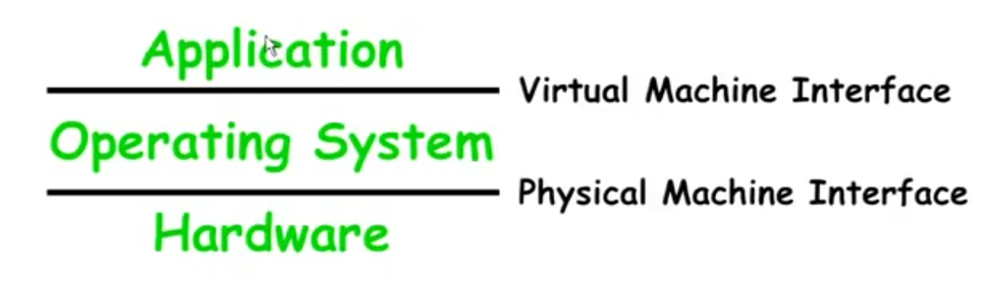


### Virtual Machine
Software emulation of some hardware machine. makes it look like the hardware has the features you like (eg, TCP/IP)
It makes the process think it has all the memory, cpu, hardware etc
VMs also provide portability, eg, Java

### Components of an OS

- Memory Management
- I/O management
- CPU scheduling
- Communications
- Multitasking/Multiprogramming

(MS put windowing into the OS, UNIX doesn't)

Source code -> Compiler -> Object Code -> Hardware

The OS is responsible for loading the object code onto hardware.

If there is just one application, (eg, early PCs, embedded controllers like elevators etc)
then the OS becomes just a library of standard services - standard device drivers, interrupt handles, math libraries eg CP/M

### Examples of OS design

MS-DOS had a very simple structure

1. It had a basic ROM, with a BIOS which tell you how to do I/O
2. some device drivers
3. cmd.com which let you type commands
4. application program ran on top of that

Recall in such simple OSes, in some applications,
some programs would bypass the OS and write data directly to the video memory (as we read in Code by Charles P)
The OS allowed that

<p align="center">
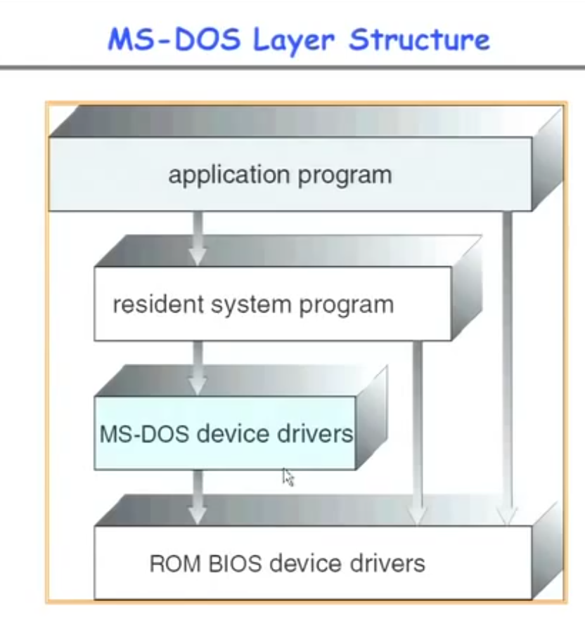
</p>

### Why study Operating Systems
1. Build complex systems
2. Engineering pleasure

### How does the OS help us
1. gives a virtual machine abstraction to handle diverse hardware
2. coordinate resources and protect users from one another
3. simplify applications - give them a single API to talk to hardware
4. fault containment, recovery, tolerance

Make programs that don't crash other programs or the OS

### How?...   2 ways

**Address Translation**  
Programs are not allowed to read or write memory of other programs or of OS (Programs live in a small virtual container)

Address translation is when the addresses the program is reading/writing is translated into other addresses

<p align="center">
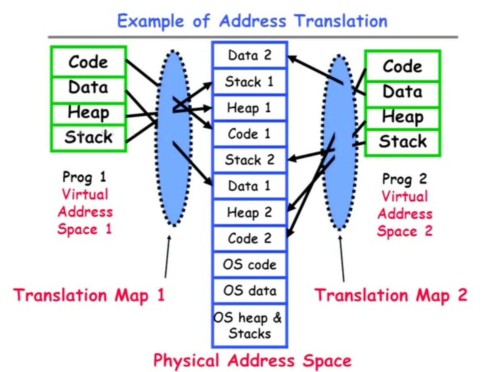
</p>

Note the addresses don't collide
also, when the entire physical address space is filled up, we swap the data to disk and so,effectively we have as
large an address space as the disk size

the process should not be able to change the translation map (not be able to write to it)

### Dual Mode Operation  
Talked about it in next lec

# Lecture 2

review of lecture 1: we will treat the OS as a VM abstraction that makes the hardware easy to program and make it more
reliable, fault tolerant etc

So, the OS takes in the hardware interface (provided by the hardware) and gives us the virtual machine interface
that is easier to program on. It hides away the different hardware details and gives us a uniform virtual machine interface to work with.
POSIX is basically an effort to make sure all the OSes give the same virtual machine interface. So that it is easy to write portable programs

We also talked about Protecting processes from crashing each other in 2 ways, _address translation_ and _dual mode_


### Goals for Today

#### History of Operating Systems

The factor of improvement is insane.
One of the first machines was ENIAC.

#### Phase 1 - Hardware expensive, humans cheap
+ more efficient use of hardware. lack of interaction between user and computer
+ batch mode was popular - load, run, print, repeat
+ no protection, what if batch program has bug?
+ dump core -- the term came from core memory which stored data as magnetization in iron rings


#### Phase 1.5 (late 60s)
+ _started optimizing for I/O_: make sure I/O and compute overlap so when doing I/O, somthing else is computing (original reason for multitasking)
+ i/o and computing was made asynchronously
+ _multiprogramming_ - several programs run simultaneously - this is complex, which job to run when (short jobs not delayed by large ones), how to protect their memory from each others and the OS's, , more I/O-CPU overlap
+ _complexity got out of control_ multics was the child of this, also OS 360
+ _concurrecy_ started - not parallel - single processor, two threads are running alternately and only one get CPU at the time, Later multicore made it possible for multiple threads run at the same time in real parallel ; multiplexed

#### Phase 2 (70-85)
+ hardware cheaper, humans expensive
+ OS maturing - UNIX based on Multics but vastly simplified
+ interactive timesharing - you have terminals (like VT-100) to let multiple users use a computer
+ users can do debugging, editing, email
+ cpu time traded for response time
+ thrashing - performance very non-linear vs load. thrashing caused by many factors including swapping, queuing
+ ARPANet also happened at this time.


#### Phase 3 (81-)
+ hardware very cheap, humans very expensive
+ personal computers came up. the early OSes on PC was simple (MSDOS, CP/M)
+ the PCs become powerful their OSes got the features of the big machine OSes (parallelism etc)
+ GUIs came around (in 1981, Xerox built the first machine with mice and windows - Apple did it afterwards in 1984)
+ The early windows OSes had no protection, there was just one level (not dual mode)
+ MS Windows went from being single level, to HAL, to full protection. HAL was hardware abstraction level.
  it made the OS portable by having device dependent software so the OS running on top of HAL thinks it has the same hardware
  but it had some caused inefficiencies
+ _Internet_ was establishing: TCP/IP, DNS became stable, mainly research and military netwroks whcih were separate from public by gateways


#### Phase 4 (88-) Modern distributed systems
+ client-server model: concept of clients separate from servers became common
+ networking becomes as important as compute
  + Networking (Local Area Networking)
  + Different machines share resources
  + Printers, File Servers, Web Servers
+ the rise of the internet: combination of university research and work in industry
+ the Interface Message Processors - were 256 addresses. so they shifted to IPv4?
+ Internet got shared access to computing resources, data/files

#### Phase 5 (95-) Mobile System
+ laptops, mobiles, powerful PCs
+ peer - to - peer
+ the computer is a datacenter. the network is the OS.

### Operating System Services
- program execusion: how to excecuse concurrent sequences  of instructions?
- I/O operations: standardize interfaces to extremley diverse devices
- file system manipulations: how to read, write, preserve files, find files
- communications: networking protocols ... 
- resource allocation
- error detection & recovery
- accounting

### OS structures and organizations

1. Process management
2. Main memory management
3. i/o system management

The system call interface - the API exposed by the OS (POSIX says, make this consistent)

The structure of the OS:
1. simple - one level (like MS-DOS, CP/M)
2. layered - like UNIX (the higher levels use the lower levels)
<p align="center">
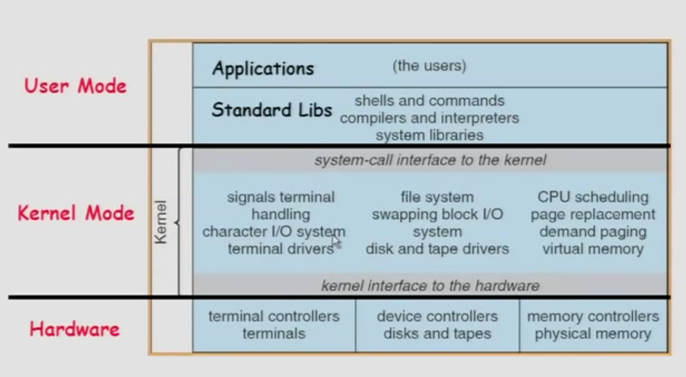
</p>
3. microkernel - OS build from many processes that live in the user space. so, different parts of the OS cannot mess each other up 

<p align="center">
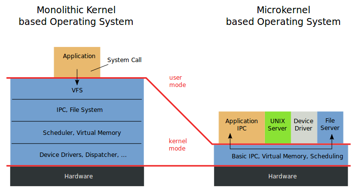
</p>

4. Modular - core kernel with dynamically loaded modules, like Linux.

All the various techniques are used to manage complexity.

*** Address translation
Transmit virtual addressess (from the CPU) into physical addresses in memory
this is done in Hardware by Memory Management Unit.

<p align="center">
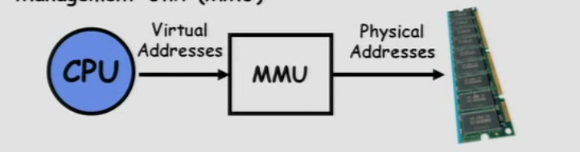
</p>


the mapping part should not be writable by the process, it must be outside it's control
enter; dual mode operating
there are 2 modes of operating in most hardware - microprocessors (x86 has 4 modes):
1. user mode
2. kernel mode

some hardware would be accessible by only the kernel mode, eg, MMU
it works by restricting some instructions in user mode.

to transition for user mode to kernel mode is via - system calls, interrupts, other exceptions


<p align="center">
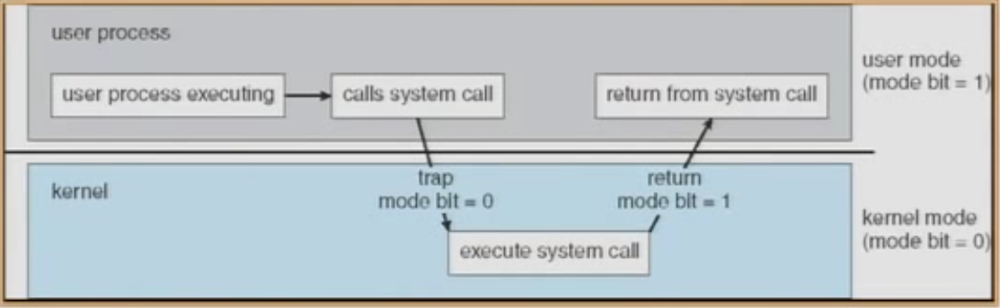
</p>

the kernel can tell a hardware timer to cause a hardware interrupt to enter the kernel mode.


<p align="center">

</p>


note the monolithic structure of kernel.


# Lecture 3: Concurrency - Processes, Threads, and Address Spaces

review - history is fun, can teach you more about why things are the way they are

### Goals for Today

### Finish discussion of OS structure

Microkernel only does a few things, handles Virtual memory, scheduling and a basic IPC. in the traditional system, if the
device driver wants to talk to the file server, it can make a procedure call(they are all part of the same process so they share the virtual memory space).
but in the microkernel, it cannot because they are protected from each other, so we need some sort of inter process communication (IPC).

so, the monolithic kernel is *one big program*. handling everything from FS, to IPC, to scheduling etc

<p align="center">
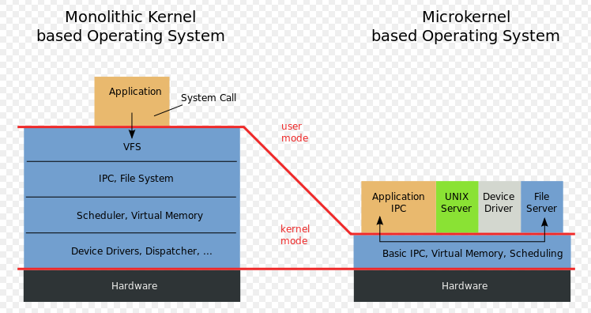
</p>

Microkernel is easier to extend, easier to port, more secure.
But it was slow because the communication between the different components required crossing the protection boundaries

### Concurrency

_one processor multiplexed_ that's concurrent execution. There is only one CPU but we want multiple things
running at the same time. How do we provide the illusion of multiple processors (CPUs)? multiplex in time. 
- Each virtual CPU needs a structure to hold:
  - program counter (PC), stack pointer (SP)
  - registers (Integers, Floating, others ... ?)
- how switch from one CPU to another:
  - save PC, SP, and registers in current state block
  - load PC, SP and registers from new state block
  
<p align="center">
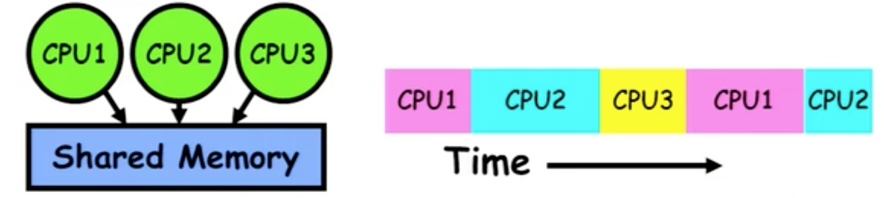
</p>

- when should we switch:
  - timer (eg, cpu gets stuck for long time computing something and doesnt give up - set a time to force it, prevet inifite loop), I/O (a cpu goes to read form the disk and data is not ready - switch here), other things

In this case: 
- all CPUs share the same non-CPU resources: I/O devices and memory
- each thread can access data from every other thread (good for sharing but bad for protection)

### How to protect threads from one another?
Needs 3 important things:
1. Protection of memory: no threads has access to other thread memory
2. Protection of I/O devices: no access of other threads devices. if it did, then we have no file system protection, no networking protection
3. Protect access to processor: make sure thread can not permanently take CPU and refuses to return - Use timer that canot be disabled by usercode


many processors - that's parallelism

Concurrency is Not Parallelism

Concurrency is about dealing with a lot of things at once
Parallelism is about doing a lot of things at once

C is _a way to structure things_ so that maybe we can use P to do a better job, for eg, all the different i/o devices in your PC are run concurrently by the single core PC

C gives you a way to structure your problem into independent pieces, that need to coordinate to work together, so they need some form of communication.

Structuring the program as cooperating parts can make it run much faster. This can even beat blunt parallelism where you have multiple instances of the process working towards the solution independently
Now, if you parallelise this concurrent model, things would run much much faster

*** What are processes

**** how to protect threads from one another?
so, threads are an abstraction of a running program that can be used to effectively multiplex them and
give the illusion of a many programs running together in a single core; but recall they the threads had no protection from one another.

processes are an abstraction of a group of threads - they get their separate address space
Need 3 important things:
1. protection of memory (every task does not have access to all memory)
2. protection of i/o devices (every task does not have access to every device)
3. protection of access to processor - make sure they give it up, use a timer etc

((so, the thread is the actual program, the process is an abstraction of a group of threads to protect it from others))

### what does the program's address space look like
note, the y axis is the address space available to the program, the thread and it is virtual (also, it is *all the addresses*, eg, in a 32 bit processor, all 2^32 addresses, it will be mapped to real ram address by the MMU)
- text - where the instructions are
- data - the static data allocated at the beginning of the program
- heap - dynamically allocated memory (where the objects live in Java etc)
- stack - for procedural calls; local variables used by procedural calls.
          when we make procedural calls recursively, the copies of the local variables go on the stack
- the blue part is unallocated memory

<p align="center">
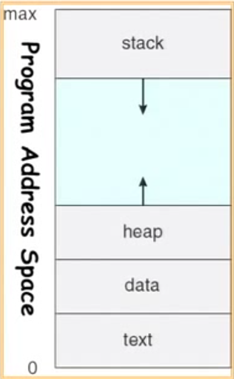
</p>

the program address space is the set of all accessible addresses (the entire thing) + state associated with them (their data?)
in C/C++, you have to manage this yourself. in Java, it is managed for you

what happens when you read or write in the blue portion, it can ignore writes
(if it a read only memory address - like the text segment, or it can cause a read-only segfault), it can cause exception segmentation fault
(this can happen when that address is not mapped to an actual address on the ram, {or you are not allowed to write there})

Using this address translation mechanism we can actually protect threads running in each address space if this momory doesnt overlap, not user manipulateble. when the a new thread starts to execute, it's translation map is loaded so that it's virtual addresses can be converted to actual addresses. So switching CPUs for concurrency is about swapping their map. This is easy, we just put a new base pointer in a register. 

#### What's the execution sequence?
1. you fetch the instruction at the program counter (PC) from memory
2. decode the instruction, execute it, possibly updating registers
3. write the results to registers or memory
4. compute the next PC
5. repeat


## What is a process?

An OS abstraction to represent what is needed to run a single program (formally - a single, sequential stream of execution thread in its own address space)- This is called **heavyweight process**.
It effectively just adds protection to threads. (protected memory, protected i/o access, protected CPU access)

by "protected memory" we mean, the process is protected from other processes and other processes are protected from this process

A process has 2 parts: 
- Sequantial Program Execution Stream which is a thread:
  - executed as a single sequential stream of execution
  - includes state of CPU registers, PC, SP which is stored in a _process control block_
- Protected Resources:
  - main memory state (contents of address space), protection given by the already discussed memory mapping, kernel/user duality, I/O state (eg. file descriptors) if the programs want to do i/o, enter kernel mode and the kernel makes sure the program is not using somebody else's resources

so, a process === "thread" (concurrency) + "address space" (protection)

__There is no concurrency in heavyweight process__
It is a single thread traditional unix process. If you want to have two threads runing at the same time, you actually have to make two processes. Thats why is called heavy weight.

### How to multiplex processes?
- The current state of process held in a process control block - it is a snapshot of the execution environment
only one PCB active at a time in the CPU (we still are in a single core world)

The PCB has all the metadata about the process

<p align="center">
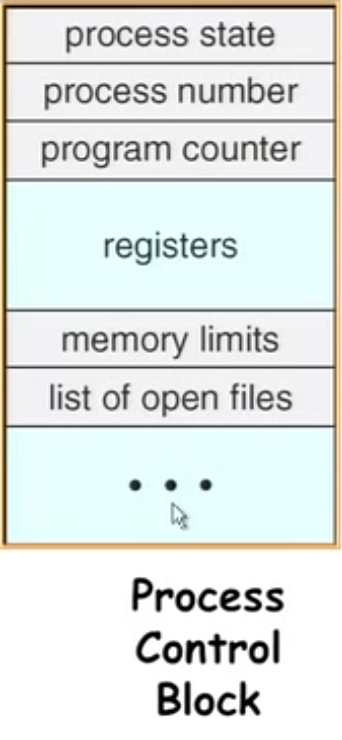
</p>

- Give out CPUs to different processes - SCHEDULING
  - only one process running at a time
  - give more time to important processes

Decising which process gets the CPU and resources is scheduling. 

- Protect resources given to processes so they are used by other processes - PROTECTION: control access to non-CPU resources
    - memory mapping: to protect memory by giveing specific address spaces 
    - kernel/user duality: to protect I/O through syste calls. For users to use I/O rsources, they have to go into kernel and kernel makes sure not to let one user use other user resources


### CPU Switch from Process to Process - Context Switch

<p align="center">
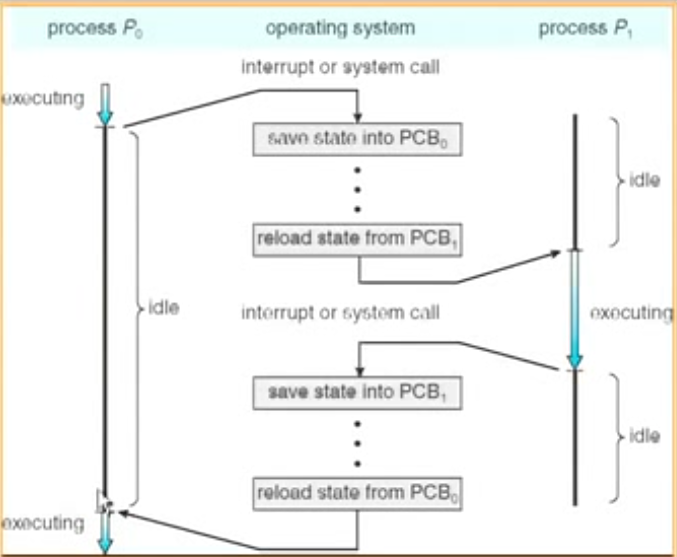
</p>

Note how Process0 is executing, then the OS receives an invocation to switch to process1 via an interrupt/system call so it "saves state of P0 into PCB0, loads the state of PCB1, and starts executing P1" aka context switch, from P0 to P1. Note the 2 processes don't overlap since there is only one cpu still. 

Note also the overhead for this switching if it is code executed in kernel. But if you have SMT/hyperthreading, you effectively might have 2 processes running together, the hardware manages the switching there so not much overhead and is faster in that case.

This has also been called "branching" in Code. When process P0 is interrupted, it saves the program counter value on the stack and when the process P1 is done, pops it and starts executing from where it left.
This makes sense for when the processes don't have virtual memory, but it also makes sense here. The PCB would know the value of the Program counter etc here.

### Process state

The process goes from new to ready queue, is chosen to be running by the scheduler, runs, can be interrupted by an I/O or event wait call and be put on the waiting queue, then on ready and can be run again. Finally, after is has finished executing, it can be terminated

<p align="center">
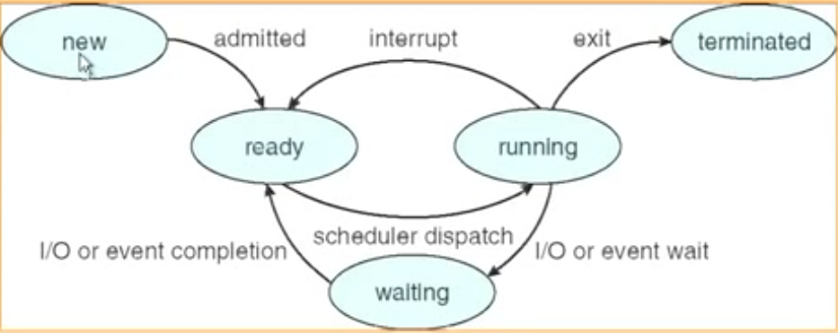
</p>

terminated - dead processes, but the resources are not yet given back to the system (zombie processes)

As a process executes, it chnages its states:
- new - the process is being created
- ready - the process is ready and waiting to run
- running - instructions are being executed
- waiting - process waiting for some event to occur
- terminated - process has finished execution

### Process Scheduling

PCBs move from queue to queue as they change state

<p align="center">
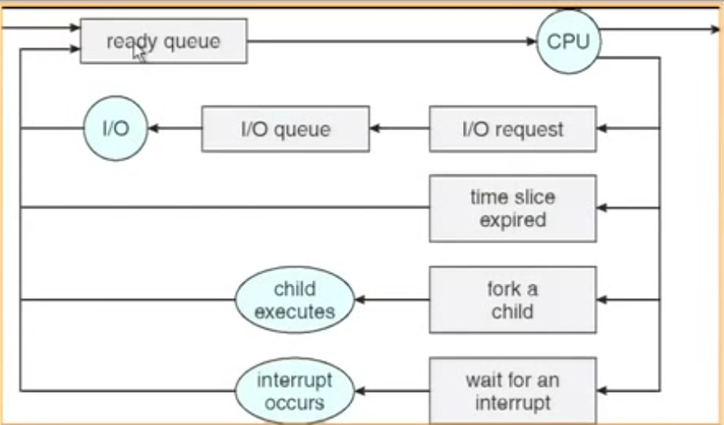
</p>


Here only one PCB is executing in a single core machine - still old school.
If an PCB is waiting for data from a disk to arrive, it is put on a disk waiting queue and when the data arrives, it starts executing

scheduling - which pcb to execute, when etc - many algorithms for that

_When a process forks another process, the child process executes and the parent process stops till the child is done_

### How to make a process?
- must make a PCB - expensive
- must set up a page table - very expensive
_In original unix, when a process forked, the child process got a complete copy of the parent memory and i/o state that was very expensive. much less expensive was "copy on write".
- must copy i/o state (file handles etc) - medium expensive


### Is the process >=< program

A process is more than the program
- the program is just part of the process state
- the process has state (heap, stack, etc) and when the program starts executing does it get the state and becomes more that it was just as a program

On the other hands, a program is more than the process
- the program may create a whole bunch of processes
- eg, when you run cc, it starts a lot of processes that pipe data to each other -- cc is the compiler

## Multiple processes collaborate on a task
If a program has multiple processes, they have to collaborate(beginnings of parallelism), they have to talk to each other (IPC)
- Separate address spaces isolates processes so we need communication mechanism:
  1. Shared-Memory Mapping
     - accomplished by mapping addresses to common DRAM (RAM)
     - read and write thru that memory address

<p align="center">
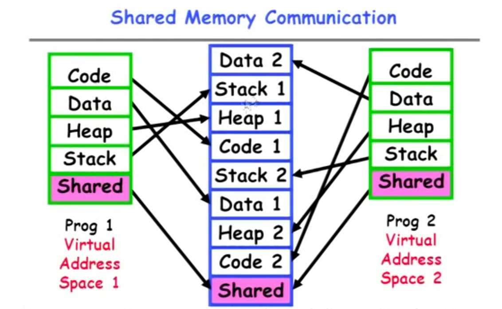
</p>

This is cheap (just reading and writing memory) with low overhead communication, but causes complex synchronization problems.

  2. Message Passing:
    - on a single box, set up a socket connection b/w processes to `send()` and `receive()` messages
    - works across network. so, processes on different machines can now communicate.
    - you can even have hardware support for message passing
    - all the message passing takes place via queues. so, they don't have to be listening for the messages
    - we can also use select() which is a facility in the unix kernel that says put me to sleep until something arrives(then put me on ready queue)
      (recall we came across this in twisted code, when we wrote the server using python socket library)

### Modern Lightweight Process with Threads
**Thread**: a sequential execution stream within process (sometimes called a "Lightweight process")
  - Processes still contains a single Address Space
  - No protection between threads. Threads in the same process all share the same memory

**Multithreading**: a single program made up of a number of different concurrent activities
A multithreading process has multiple copies of registers and stacks because every thread needs its own stack. Multiple threads per address space make collaboration between threads easy since they share memory but they can also crash each other. In this case, the process boundary containing these threads prevents the crash to spread to other processes or the OS itself.  


<p align="center">
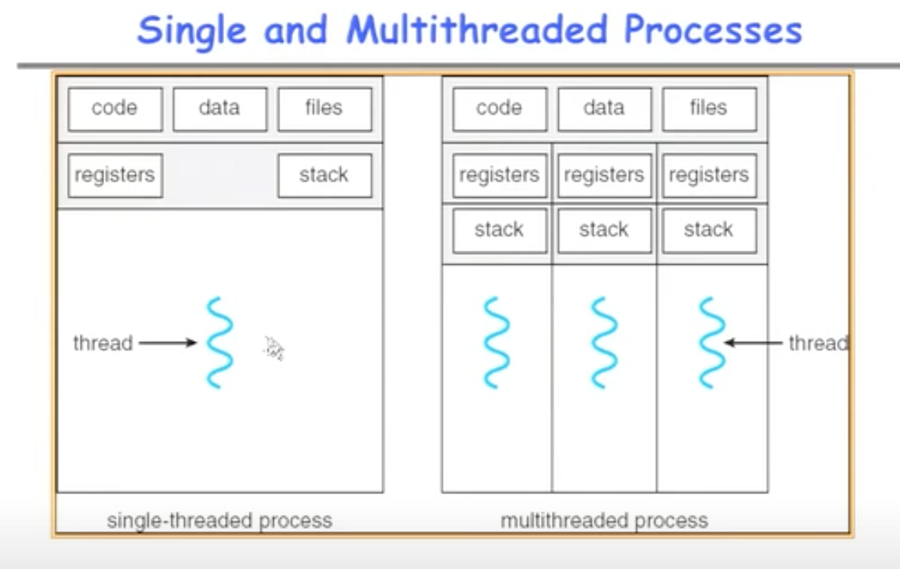
</p>

### Thread State

- State shared by all threads in process/address space
  - contents of memory (global varibales, network connections, heap)
  - I/O state (file system, network connections, etc)
- State private to each thread
  - kept in TCB = Threads Control Block
  - CPU registers (including PC)

<p align="center">

</p>

A thread is a execution stream, so each needs it's own stack, registers, etc like before (Thread control block) but share the memory(heap) and I/O state

Stack holds temporary results and permits recursive execution crucial to modern languages.

<p align="center">
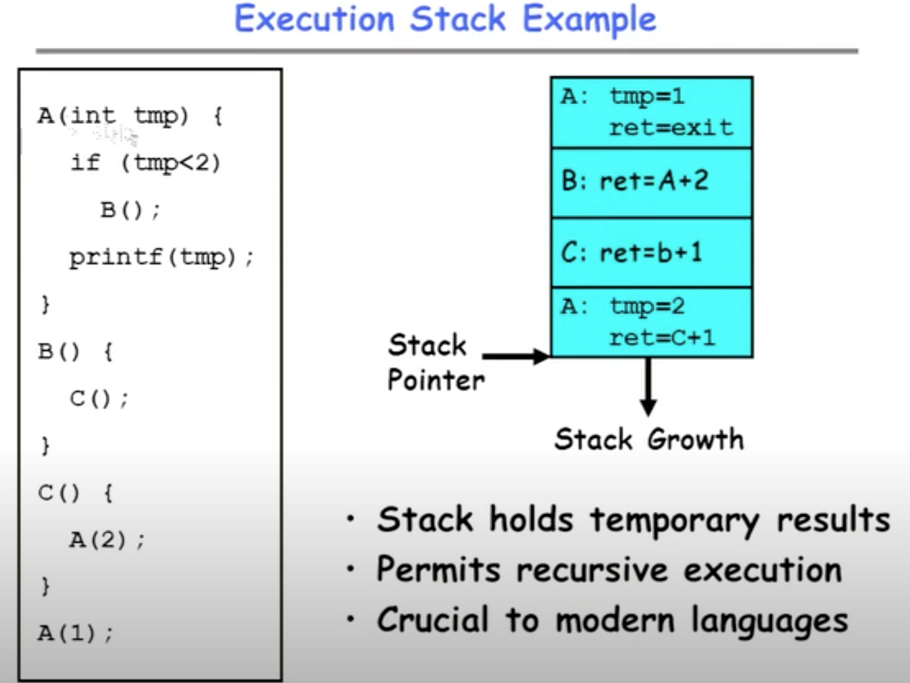
</p>


### Summary

we saw that in a single core cpu, we can provide multiprogramming by multiplexing threads i.e. running them asynchronously. We would load the registers of the thread before it was executed and load it's translation maps. The downside was that the threads aren't protected from one another and if one thread went bad, it could get down the whole system -- it's like the entire OS is one process only
this was what happened in old windows, macs etc. the threads had separate address spaces, but other threads could read the address space of one thread and change the data as well.

To solve this problem, we got in processes - they initially had a single thread in them (heavyweight processes)
now the threads (encapsulated in a process) were safe from one another. The new problem this caused was inter process communication, we solved it by using sockets, shared parts of memory.

Later, people put multiple threads in a process (lightweight process) and thus we got the free memory sharing b/w related threads and also the separate address space to protect from other processes.

single threads (CP/M) --> multiple threads (embedded applications) --> multiple processes with single threads (heavyweight processes) --> lightweight processes (processes with many threads)

  

----------------------------------------------------
----------------------------------------------------  
# Lecture 4
 
[YouTube](https://www.youtube.com/watch?v=Sj4OHlvOls4&list=PLggtecHMfYHA7j2rF7nZFgnepu_uPuYws&index=4)

**Review**:
- Process: OS abstraction to represent what is needed to run a single or multithreaded program

- Has two parts:
  - Multiple Threads: each thread is a single, sequential stream of execution
  - Protected Resources:
    - Main Memory State: contents of Address Space
    - I/O state 

- Threads encapsulate concurrency
  - Active component of a process
- Address spaces encapsulate protection
  - Keeps buggy program from trashing the system
  - Passive component of a process


We have the following diagram.

<p align="center">

</p>


- one thread/AS, one address space -->
    CP/M, ms/dos, Uniprogramming - a single thread at a time, no multiprogramming supported. easy to crash system

- many threads/AS, one AS --> embedded systems. so, here there is multiplexing of threads. they aren't protected from each other, all share memory. this is effectively just like a single process running.

- one thread/AS, many AS --> traditional heavyweight unix process, the threads are protected from one another. multiprogramming possible
- many threads/AS, many AS --> there can be many processes, and they can each have many threads


** Further understanding threads

Threads share:
- address space with other threads in a process (i.e. the global heap)
- and i/o state (file system, network connections etc)

and don't share stuff in TCB
- which includes registers
- execution stack (parameters, temp variables)

<p align="center">
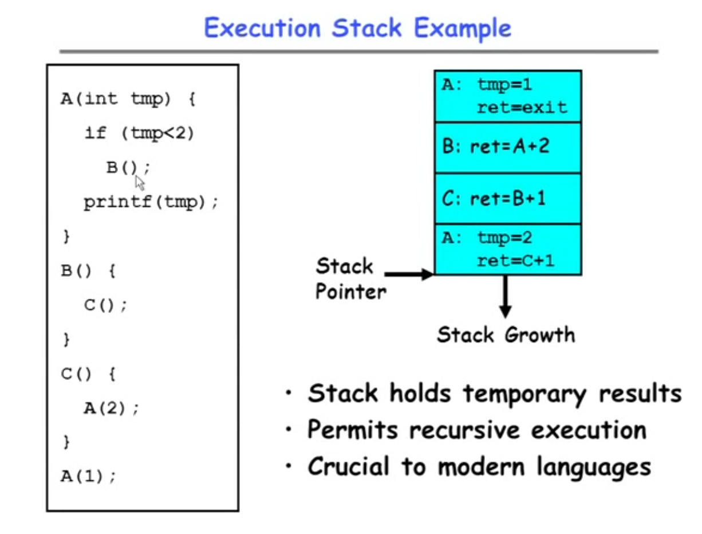
</p>


We start by calling A, which calls B, then C and then finally A again. when a procedure is called, it is allocated a frame on the stack when it returns, the frame is popped off

if we keep on calling endlessly, (eg, due to some bug, B calls B), we get stack overflow, segmentation fault.
the compilers use stacks a lot to compile code etc

when we say A calls B, here, A is the caller, B is the callee
typical register usage, eg in MIPS processor, we have 32 registers: 0-31

| register number | function                |
|-----------------|-------------------------|
|               0 | always zero             |
|     4-7 (a0-a3) | argument passing        | (this is the case with risc arch, x86 has too few registers, so args go to stack)
|            8-15 | caller saves            | (aka volatile registers)
|           16-23 | callee saves            | (aka non-volatile registers)
|          26, 27 | reserved for the kernel |
|              28 | pointer to global area  |
|              29 | stack pointer           |
|              30 | frame pointer           |
|              31 | return address          |


The stack pointer points to the current stack frame.
the frame pointer points to a fixed offset wrt frame, which separates stack(statically allocated stuff) from heap(dynamically allocated)

"clobbering" a file or computer memory is overwriting it's contents (eg, by using echo "foo" > file.txt)

"caller calls the callee". "the callee is called by the caller"

caller-saved registers
 - used to hold temporary qualities that need not be preserved across calls
 - so, it is the caller's responsibility to push these registers to stack if it wants to restore their values after a procedure call

callee-saved registers - used to hold long lived values that should be preserved across calls.
 - when a caller makes a procedure call, it can expect that these registers will hold the same value after the callee returns
 - thus, it is the responsibility of the callee to save them and restore them before returning back to the caller

before calling a procedure -
save the "caller-save" regs,
save the return address. we need to save the "caller-save" because the new procedure can clobber them.

after calling a procedure (after return) -
we save callee-saves,
gp, sp, fp are OK!
other things thrashed


### Single and multi threaded example


```
main() {
  ComputePI("pi.txt");  # write contents to pi.txt
  PrintClassList("clist.text");  # print the contents of clist.text
}
```

Here, the 2nd command never runs, because the first one never terminates. So you wont see the class list.


```
main() {
  CreateThread(ComputePI("pi.txt")); # write contents to pi.txt
  CreateThread(PrintClassList("clist.text")); # print the contents of clist.text
}
```

Here, the 2nd line gets executed because they are running independently on different threads so we will see the class list.

Memory footprint of the above program:
- we will see 2 sets of stacks
- 2 sets of registers
- they share anything in the memory. They share the same heap


<p align="center">
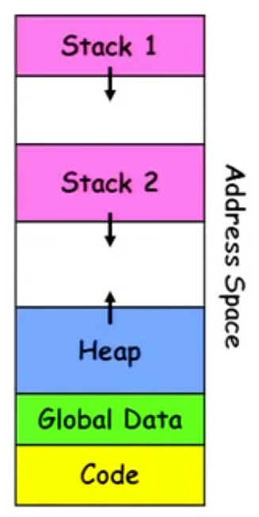
</p>

How are the 2 stacks positioned wrt each other?
- one thread may need more space compared to the other
- if we have a predefined stack size, it may crash the other thread if it is overshot
- if the stacks are linked lists, it might work, but C expects stacks to be linear in memory
- we can put a "guard page" at a certain address and if the thread uses more than that, we cause a trap and use it

--> if the code is compiled by a bad compiler, and it grabs an offset that is more than one page wide, it could bypass the guard page and we would never notice
--> when we call the procedure, we decrement the stack pointer and create a new stack frame to make space for the procedure. if we decrement it too much, then we may jump over the guard page and start writing in the next stack without noticing it

### What's in the TCB
- execution state - cpu registers, program counter, pointer to stack
- scheduling info - state, priority, cpu time
- accounting info
- pointer to scheduling queues
- pointer to enclosing PCB

<!-- ## In Nachos - Thread is a class, has the TCB. -->

### Waiting Queue
we have a queue for every device, signal, condition etc
each queue can have a different scheduler policy

<p align="center">
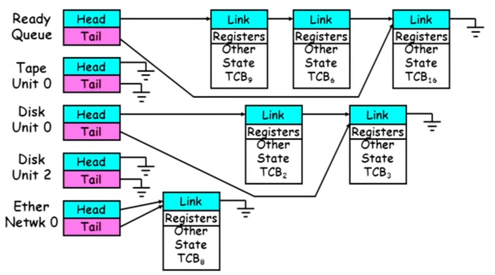
</p>

Queues are linked lists!
Note how the queue stores the pointer to the first and last member of each queue. Each block is just a TCB/PCB - doesn't matter which exactly so, a lot of what the OS does is queue management.

When the thread is not running, TCB is in some shceduler queue:
- separate queue for each device/signal/condition
- each queue can have a different scheduler policy

## Thread dispatching

### Dispatch Loop
The dispatching loop of the OS looks like so:


```
Loop {
    RunThread(); // loads it's state (registers, PC, SP) into CPU, load environment (virtual memory space), jump to PC
    ChooseNextThread();
    SaveStateOfCPU(curTCB); // (internal)-> when the thread yields control, (external)-> there is an interrupt, or i/o blocking call
                            // waiting for a signal etc
    LoadStateOfCPU(newTCB);
}
```
This is an infinite loop done by OS. Maybe this all the OS does. _If there are no threads to run, the OS runs the idle thread - which puts the cpu in a low power mode_


### How does the dispatcher get control back?

- Internal events: threads returns control voluntarily (eg, yield)
- External events: thread gets preempted - intrupt cpu and grab it back

### Example of Internal Events
- Blocking on I/O
  - The act of requesting I/O implicitly yields the cpu
    - such printing, writing to a file ... when a thread goes to I/O, that is a great time to pull another thread off the ready queue and start it running
- Waiting on a _signal_ from anothe thread
  - thread asks to wait and thus yields the cpu
- Thread executes a `yield()`
  - Thread volunteers to give up CPU


Example:
```
computePI() {
    while(True) {
        ComputeNextDigit();
        yield();
    }
}
```

### What happens when we yield?

<p align="center">
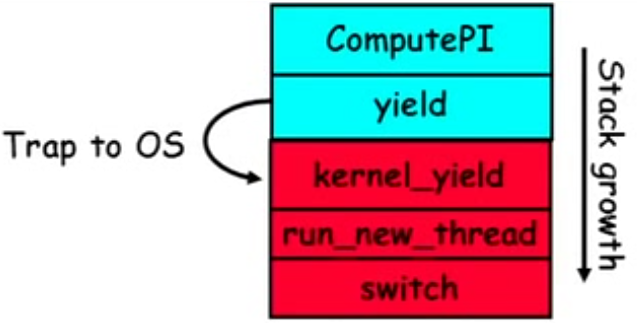
</p>

Blue is user mode, Red is kernel mode

We go to kernel mode, a specific part of the kernel i.e.
and execute run_new_thread()

```
run_new_thread() {
    newThread = PickNewThread();
    switch(curThread, newThread); // save all the regs, pc, stack and load the new thread's regs, pc, stack
    ThreadHouseKeeping(); //next lec
}
```

<p align="center">
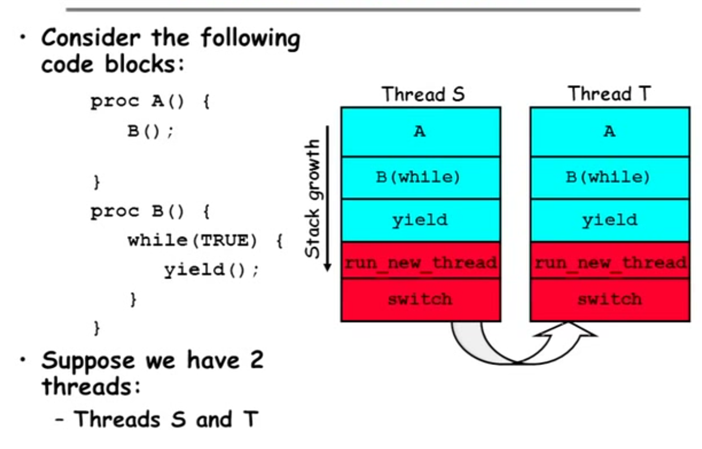
</p>

Note: these threads belong to the same process, so you can simply start executing the other without having to switch the PCB

What happens:
- Thread S, proc A
- Thread S, proc B
- Thread S, yield
- Thread S, run_new_thread --> kernel mode
- Thread S, switch ((now when the switch returns, we are at a different stack, because we switched the sp))
- Thread T, run_new_thread
- Thread T, yield # this is an internal stack of the B procedure, it has no meaning outside of B, so we go up one step
- Thread T, proc B
- Thread T, yield
- Thread T, run_new_thread,
- Thread T, switch
- Thread S, run_new_thread
and so on...

(This a see-saw back and forth in infinite loop)

### What happens when switching: pseudo code for switch

```
switch(tCur, tNew) {
// unload old thread - saving it's state to it's tcb
    TCP[tCur].regs.r7 = CPU.r7;
    TCP[tCur].regs.r6 = CPU.r6;
             ...
    TCP[tCur].regs.sp = CPU.sp;
    TCP[tCur].regs.retpc = CPU.retpc; //store the return address of the

// load and execute the new thread
    CPU.r7 = TCB[tNew].regs.r7;
    CPU.r6 = TCB[tNew].regs.r6;
            ...
    CPU.sp = TCB[tNew].regs.sp;
    CPU.retpc = TCB[tNew].regs.retpc;
    return; //this will return to CPU.retpc which has the address to the new thread's pc
}
```

In reality, retpc is implemented as a "jump" -- aka "branching" in Code switch.s is written in assembly, (it has to touch the registers explicitly)

If you make a mistake in switching (for eg, forget to save a register) it leads to non-deterministic bug
it will result in an error if that register matters(to the new thread), not otherwise

### What happens when thread blocks on I/O?

It is the same when the thread blocks on i/o. I/O represent a system call (the read() system call) - eg, when it requests a block of data from the file system the user invokes the read() system call, and the thread is put on the FS waiting queue. Then a new thread starts and switch.

<p align="center">
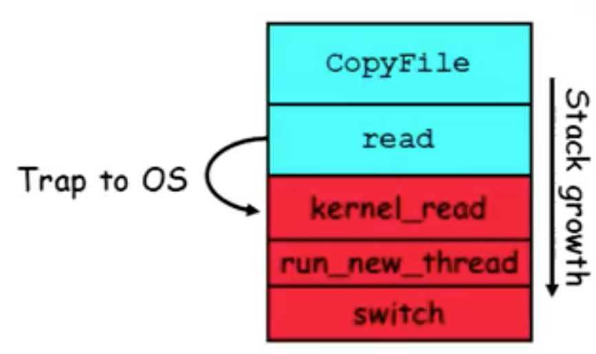
</p>


### what happens if the thread never yields?
i.e. if it never does any i/o, never waits, never yields control

Answer - utilize external events
- interrupts - signals from hardware(eg: timer, look below) or software(the hardware has some bits that can be set by software to cause interrupts etc) that stop the running code and jump to kernel
- timer - go off every some many miliseconds

Consider this:

we are executing a code, we get a network interrupt, this causes the processor pipeline to stall right there and flush the values of the registers (like pc, (retpc?) etc, so that we know how to return), we go to supervisor mode (kernel mode?), the kernel runs a handler
that takes in the packets, saves them to some buffer or sockets etc, moves some thread that was waiting for this interrupt on the waiting queue to the ready queue so that it executes next time etc, then we are done, so we restore the registers and continue doing what we were doing.

<p align="center">
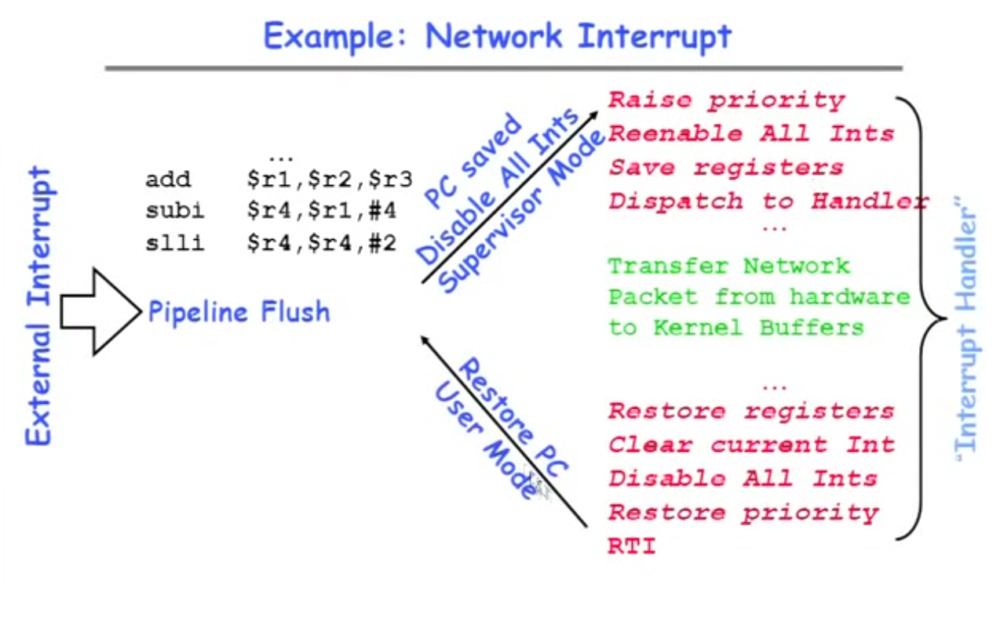
</p>

The timer interrupt generally invokes rescheduling.
_the rti instruction loads the old regs, sp, pc, takes us back to user mode_
so, user land process --> kernel mode process which calls the right handler --> the interrupt handler process --> the kernel mode process that loads back initial running process --> initial user land process

interrupts have priorities - the hardware interrupt is high priority.

### Beginnings of thread scheduling

How does the dispatcher choose which thread to run next?
- 0 threads on the ready queue - run the idle thread
- exactly 1 thread - don't need to perform the switch, continue running it
- more than 1 thread - search thru the list and run the one with the highest priority.


### how to do priorities?
- LIFO (works for some kinds of parallelism)
- Random
- FIFO (Nachos does this)
- priority queue - keep ready list sorted by TCB priority field (eg using heapsort)

What to choose? depends on what your PC is suppose to do?
eg, real time os needs choose the one with the nearest deadline

Switch can be expensive - depending on the architecture.
a simple optimization - check if the floating point registers are used by the program. if they aren't switch the floating point unit
off (this will mean we have less registers to save and load on each switch) and if you ever try to use it, you set a trap which turns it back on.


------------------------------------------------
------------------------------------------------

# Lecture 5

**Review**

The Thread control block has
+ execution state - cpu registers, program counter, pointer to stack
+ scheduling info - state(more later), priority, cpu time
+ accounting info
+ various pointers - for implementing scheduling queues
+ pointer to enclosing process (PCB)
+ etc (add more if needed)

The TCBs are linked together in a linked list, in a queue which links the 1st one and the last one

Yielding(giving up control) can be:
 - implicit(waiting on i/o for eg) or
 - explicit(the thread yields control itself)

Threads can be user level as well. Because we are just changing the registers and any program can change it's own registers. so, they can be controlled from the user space. The processes are always in the kernel space because that involves changing address spaces.

We learned about the 2 threads yielding indefinitely, how the return of "switch" would result in the execution beginning in a different stack because the pc has been changed. All the programmer has to think is that "the thread s froze in time, then it will continue later again from where it left"

#### when a new thread is created, first a stub is created, and the code is run from the top. after that is done, it will start yielding and never go back to proc (procedure) A

#+ATTR_ORG: :width 400
#+ATTR_ORG: :height 400
[[./assets/operating-system/ucbOS_23.png]]


### More on interrupts

what is an interrupt - a physical signal coming from something - (eg, cdrom, floppy rom, network) is a wire which when is 1 (high, asserted) it says I need a service. it may be level triggered or edge triggered.
Level triggered -- when the level goes from 0 to 1, it may be triggered (or the other way round, 1->0), stays triggered for the entire duration when the level is 1 (or 0)
edge triggered -- when the level goes from 0 to 1, it triggers at that instant, at the "level up"

*** triggering
triggering is making the circuit active.

**** it can be level triggered
- the circuit becomes active when the clock pulse is on a particular level (eg, 1). so, two types of level triggering - positive level triggering or negative level triggering

**** edge triggered
- becomes active on the negative or positive edge of the clock signal. 2 types again - positive edge triggered - will take the input when the clock signal goes from low to high. negative edge triggered - will take the input when the clock signal goes from positive to negative.


*** interrupt controller

<p align="center">

</p>

1. interrupt mask
note all the devices go to the interrupt mask which is responsible for deciding which of the interrupts can bother the processor.
(eg, it can set a 0 for the floppy drive, then it's interrupts will be ignored)
it does this based on the priority instructions from the OS

2. priority encode
if we get more than 2 interrupts at one, it picks one(randomly, because as far as the OS is concerned, they are both same priority), gives it an id, and gives it to the cpu with the interrupt
it says to the cpu - "here's the interrupt you should service, and here is it's number"

3. the cpu
if it is receiving interrupts at all(i.e. Int Disable bit is not 1), will stop what it is doing and will run an interrupt routine based on the IntID (it will branch off)
there are also NMI - non maskable interrupts that cannot be ignored and have to be serviced. (used for power off, serious memory errors etc)

4. timer
this is for threads/processes that don't yield (preemption)

5. software interrupt
it has some bits that can be turned on by software and be used to issue interrupts

Ha, this is what is happening with our trackpad. it's interrupts get disabled maybe and hence, we aren't able to send our requests to the cpu

_Generally, the interrupt signal from any device is kept asserted till the interrupt is serviced by the cpu. so, even if the Int Disable is set, the cpu won't miss the interrupt. (this is only possible with the level triggered interrupts, right?)_

When the cpu is servicing a interrupt, the cpu can set the Int Disable bit set to 1. Also, what we can do is we manipulate the interrupt mask to raise the priority and all devices of lower priority won't interrupt the cpu

External interrupts are asynchronous. Interrupts in the your code are synchronous.

If some threads don't yield, we can use the timer to cause it to yeild. This is called preemptive multithreading.

## Thread creation/destruction

Now we'll talk about the threads start.

### ThreadFork() - creating a new thread
User level procedure that creates a thread and places it on the ready queue. (we called it CreateThread earlier in the C code example)

ThreadFork() needs the following args
1. pointer to function routine (fcnPtr)
2. pointer to array of arguments (fcnArgPtr)
3. size of stack to allocate

How to implement it?
1. sanity check the args (check the args aren't invalid, eg, null pointers, have permisssions etc)
2. enter kernel mode and sanity check again (check that the thread isn't asking us to do insane things, like clear global heap of other processes etc)
3. allocate new stack(in the process memory) and tcb
4. initialize tcb and place on ready list

### How do we initialize the tcb and stack?
1. we point the tcb at the stack (sp made to point to stack)
2. PC return address(r31) pointed to OS routine ThreadRoot()
3. two arg registers (a0(r4), a1(r5)) initialized to fcnPtr and fcnArgPtr respectively. So, we initialize only 4 registers.

Each thread starts with ThreadRoot stub on the it's newly allocated stack. So, in our previous yielding example, if we create a new thread T, and the already running thread S yields to it, we will first execute ThreadRoot stub on the new stack of the new thread

<p align="center">
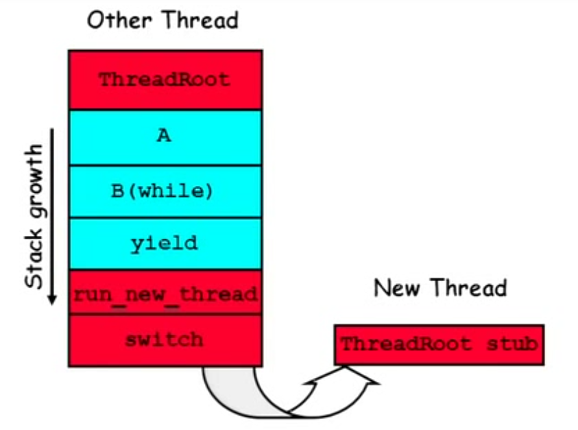
</p>

Consider thread S running already and we create a new thread T which just has ThreadRoot stub on the stack
1. Thread S, A
2. Thread S, B
3. Thread S, yield
4. Thread S, run_new_thread
5. Thread S, switch
6. Thread T, ThreadRoot stub
7. Thread T, A
8. Thread T, B
9. Thread T, yield
10. Thread T, run_new_thread
11. Thread T, switch
12. Thread S, run_new_thread
13. Thread S, yield
14. Thread S, B
15. Thread S, yield
16. Thread S, run_new_thread
17. Thread S, switch
18. Thread T, run_new_thread
  and so on... (we are back to where we were, like in the previous diagram)


**** ThreadRoot()
ThreadRoot is the complete life cycle of the thread. It starts in the kernel mode, goes to user mode, executes the code of the fcn it points to, and when that function code returns, threadfinish() is called, we enter kernel mode (via a system call), it needs to wake up all the threads that are waiting for it to finish, and then the thread is killed.

The stack is not cleared as of yet because we are running on the stack(the threadfinish() is running on the thread stack), we cannot clear it ourselves (we are running on it!)
so, we switch to a different thread and let it deallocate us. we basically put a flag on the thread that says "ready to be deallocated."

Zombie processes are the processes that are ready to be deallocated. they can show up if something that is responsible to clear them isn't working, doing it's jobs.

```
ThreadRoot() {
    DoStartupHouseKeeping(); // statistics like start time of thread etc
    UserModeSwitch(); //enter user mode
    Call fcbPtr(fcnArgPtr); //this is the user's code ((here, we will yield continously)), the stack grows and shrinks with execution of thread
    ThreadFinish(); //the final return from the thread returns into ThreadRoot which calls ThreadFinish (as it is the next instruction below it) and the thread is killed.
}
```

(ThreadFinish calls run_new_thread)

Recall run_new_thread's code:
```
run_new_thread()
{
    newThread = PickNewThread();
    switch(curThread, newThread);
    ThreadHouseKeeping(); // this is responsible for clearing old threads
}
```

ThreadFork is a asynchronous procedure call (runs procedure in separate thread, calling thread doesn't wait for it to finish)
this is unlike the UNIX fork which creates a new process with it's own copy of address space (the heap)

If the thread wants to exit early, it can use the `exit()` system call. ThreadFinish() and exit() are essentially the same thing (both are in the user level).

_Processes/Threads have a parent-child relationship. init process starts everything, the grand-daddy_

<p align="center">
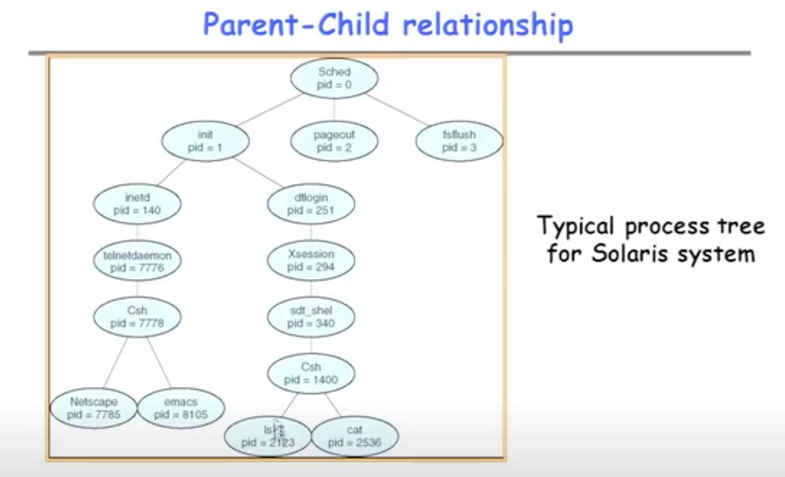
</p>


### ThreadJoin() system call
- One thread can wait for another thread to finish with the ThreadJoin(tid) call. 
  - Calling thread will be taken off the run queue and placed on the waiting queue for thread tid. When that thread is killed, (ThreadFinish), we will get notified (waked up)
- This is similar to wait() system call in UNIX from the man wait:

ThreadJoin is an important thread synchronization idea. You can make the parent wait for the child finish and then it wakes up again which in turn, puts them back on ready queue and they are running again. 

"""
   wait() and waitpid()
       The  wait() system call suspends execution of the calling process until
       one of its children terminates.
"""

Every thread has a waiting queue for the threads waiting for it. The waiting queue is inside the TCB of the tid thread itself which we are waiting for. So, the ThreadFinish() can look into it's (own's) TCB and wake every one on the waiting queue up, saying I am about to die, wake up.*

<p align="center">
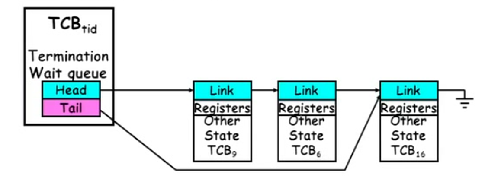
</p>

Thus, this queue is in the user mode sorta. and every process can have a wait queue with folks waiting for it.

Traditional procedure call logically equivalent to a fork followed by a join.

```
A() { B(); }
B() { // complex things }

A'() {
    tid = ThreadFork(B, null);
    ThreadJoin(tid); //this causes the thread A to go to sleep till thread B exits
}
```

_both are effectively the same_
Here the parent is going to compute something while B is running in parallel and then a join at the end.

In real life, we might use the 2nd pattern :point_down:  , if we want A' to do some work first and not join immediately.


## Kernel-mode versus user-mode threads

**The kernel schedules threads. not processes**
So, a process might have 20 threads, some may be on the wait queue, some could be running (multiplexed of course,we are still at 1 core) etc

Kernel threads
- expensive because we have to go to the kernel mode to schedule after each switch.

This led people to ask why not have threads in the user mode, and the program handle it's own switching, by keeping it's tcbs at the user level.
downside is we can't use the timer interrupt now, because this requires the kernel. so,the threads have to yield themselves now. the yield would call a user level routine that switches the tcbs.
*note*, :top: is about threads in the same process. the JVM etc takes care of this part, you don't need to worry about switching the TCBs etc, the JVM provides that functionality for you

This idea led to user level threads. user programs provided scheduler and thread packages.
the kernel knows about the main program "THREAD", which infact have many user level "threads" inside of it.
but since we don't have preemptive interruption, if one of the "threads" blocks, and doesn't yield, all the others don't run(all the others inside the THREAD).
the kernel still multiplexes the THREAD (it has the timer to force any THREAD to quit), but the "threads" are blocked.
this is exactly what we came across in twisted tutorials. we were asked to not do blocking i/o calls synchronously, but to do them asynchronously.

One research idea to solve this problem: scheduler activations have kernel inform the user level when the "thread" blocks. after receiving this tip, we can make the "thread" yield and make something else run

<p align="center">
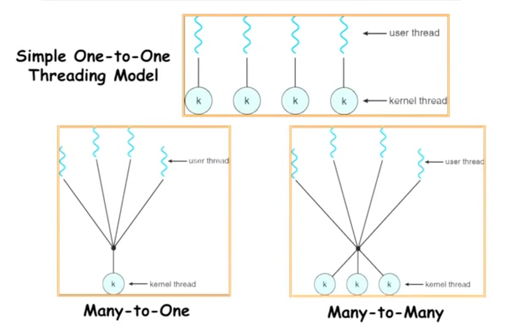
</p>

The kernel thread (or many kernel threads) may be a part of the kernel process

### One to one threading model
each "THREAD" has only one "thread". this makes the "thread" expensive, since we have to go to the kernel mode on each switch for scheduling.
but it means the kernel makes sure we don't block "threads" in our code indefinitely (because we have only one "thread")

### Many-to-one threading model
this is what we discussed above. here, we get a lot of light weight threads in the user mode and we can schedule them, etc without disturbing the kernel. but if one thread decides to block, the others cannot execute (idea of scheduler activations can be used here)

### Many to many threads
this is when we can have many threads in the user space be represented by many threads in the kernel space.

all this is taken care of by the std library of the language you are using, so the developer doesn't have to worry a lot about this.
when we create a thread using the Java Std Lib, we create a user level thread. But the JVM may create kernel level threads to handle our user level threads etc. All that is taken care of for us.

Some definitions:
- multiprocessing - more than 1 cpu (more than 1 core)
- multiprogramming - more than 1 job (threads/task/process running together by being multiplexed)
- multithreading - more than 1 thread per process


When we say two threads run concurrently
- scheduler free to run threads in any order and interleaving them (fifo, random, lifo etc)
- dispatcher can choose to run each thread to completion or time slick them into smaller chunks

<p align="center">
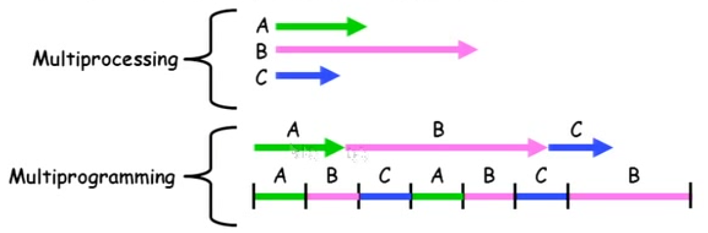
</p>

as a developer, you have to assume they are running together to be able to program.

** Cooperating threads

*** independent threads
this is not a problem if the threads are independent. no matter what the scheduler does, the threads are deterministic, run successfully.

*** cooperating threads
if there are cooperating threads, they share state - share file, share some variable in memory etc. they are non deterministic. Can introduce not reproducable bugs, (Heisenbugs)


--------------------------------------------------
--------------------------------------------------
# Lecture 6 - Synchronization

**Review**

ThreadFork() used to create a new thread, when it returns, we have a new thread that is placed on the ready queue ready to run args required by ThreadFork:
- pointer to application routine fcnPtr
- pointer to array of args fcnArgptr
- size of stack to allocate


+ this will first sanity the check the args (twice actually),
+ then create a new TCB, the sp pointing to the stack with just the ThreadRoot stub
+ put the TCB on the ready queue

when the scheduler makes the new thread run for the first time:
- we are in kernel mode(because we get to the ThreadRoot stub which is in kernel mode), it will do some housekeeping
- go to user mode, run the fcnPtr code
- when that returns, go to kernel mode, inform others it is dying, flag it as "readytobeDeallocated" and switch to next thread which deallocates it


## Synchronization
no 2 threads are completely independent - they share the same file system, same device driver, same operating system

### Advantages of cooperating threads
- they can help solve the computation problem faster.
- one computer, many users
- embedded systems (robot control - coordinate arm and hand)
- *modularity* - chop large problem into simper pieces. eg, gcc capps cpp | cc1 | cc2 | as | ld
  this makes the code simpler, system easier to extend

### Example of cooperating threads
You have a blog and a million folks visit it, so you fork off a thread for each request to serve it. Here we are processing connections which requirs waiting for I/O.

```
serverLoop()
{
    connection = AcceptCon();
    ThreadFork(ServiceWebPage(), connection);  // note, this is asynchronous. Using ThreadJoin would make this synchronous
}
```

Advantages of this system:
- Can share file caches, results of CGI scripts
- Threads are much cheaper to create than processes, so this is lower overhead per request
- Many requests can be processed at one (by multiplexing them), albeit each is a little slower now individually

If a *LOT of threads* are created because too many users are visiting at once, you have more overhead than real computation, because you are only switching all the time. It can even crash the application. This is the unbounded thread problem.

_Solution_: "thread pool"
To solve the problem of unbounded threads, we bound the threads. i.e. we allocate a pool of a fixed number of threads. That is the maximum level of multiprogramming going on at the time.

If all the threads in the thread pool are occupied, the new requests have to wait till one of the thread finishes serving the old request

<p align="center">
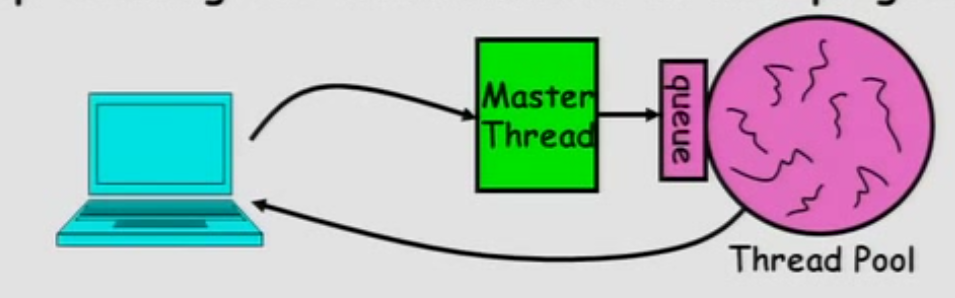
</p>

Every request from the user gets put in a queue, a thread from the pool takes it in, executes it and returns. The address the master thread only allocates a bunch of threads, accepts a new connection, puts it on the queue, "wakes up" the queue and repeat

```
master() // run by master the thread
{
    allocThreads(slave, queue); // create the thread pool
    while(True)
    {
        con = AcceptCon();
        Enqueue(queue, con); //put the connection on the queue
        wakeUP(queue); // wakes up a free thread if it is sleeping and gives it a connection to execute
    }
}
```
The master thread is not doing any computation. ITs just grabbing a connection, putting them on the queue. If there is thread sleeping, it will wake it up.

Each one of threads goes in an infinite loop of dequeueing something. If the queue is null, it goes to sleep otherwsie, it will service the webpage.

```
slave(queue) //this is executed by the "thread pool" (each thread in the thread pool?)
{
    while(True)
    {
    con = Dequeue(queue) // take a connection from the queue
    if (con==null) // if there are no connections on the queue, just go to sleep waiting on the queue
        sleepOn(queue); //the master's wakeUP call wakes the thread from this sleepOn call
    else
        ServiceWebpage(con);
    }
}
```

So, thread pool helps us solve the unbounded parallelism problem, and gives us the advantage of having more than one thread.

### Synchronization in more detail
ATM bank server problem - we are serving a lot of concurrent requests. We have to make sure to
- service a set of requests
- do so without corrupting the database
- dont hand-out too much money

_Solution 1_ - perform synchronously
take a request, process it, take another one
but will annoy atm customers because each one has to wait for somebody else.

```
BankServer() {
  while(True) {
    ReceiveRequest(&op, &acctId, &amount);
    ProcessRequest(op, acctId, amount);
  }
}
```

```
ProcessRequest(op, acctId, amount) {
  if (op==deposit) Deposit(acctId, amount);
  else if ...
  }
```

```
Deposit(acctId, amount) {
    acct = GetAccount(accId); // disk i/o, if not cached
    acct->balance+=amount;
    StoreAccount(acct); // disk i/o
}
```

To speed this up:

_Solution 2_ -> event driven technique-Concurrency (You only have one CPU: overlap computation and i/o)

_for a disk seek - 1million cpu cycles are needed (lesses if we have SSD)_

Without threads, we would have to rewrite the program in event-driven style. Threads can overlap I/O and computation without deconstructing the code.

This is what we learned with Twisted. there is a main loop (reactor loop) that listens for events, and triggers a callback functions when that event is detected. We basically divide the code into three parts - recall the Rob Pike video on the gofers burning some documentation. We split the problem in some cooperating parts - separate the blocking parts from non blocking parts and rewrite the entire thing in event driven pattern - like the Twisted tutorials.

We get a request, we do process it by a thread till it gets to a disk seek - this is a blocking call. So, we don't wait, we take up another request (another thread takes control of cpu) and then get it to the disk seek part as well. By this time, the old disk seek (old thread) is ready, we get the callback and finish the old transaction. We dont explicitly overlap I/O ourselves in our code because it happens as a side effect of using multiple threads. 


```
BankServer()
{
  while(True)
    {
        event=WaitForNextEvent();
        if (event==ATMRequest)
          StartOnRequest();
        else if (event==AccAvail)
          ContinueRequest();
        else if (event==AccStored)
          FinishRequest();
   }
}
```

_Unfortunately, shared state can get corrupted_: if we have two threads are in the deposit routine and they are processing two transactions on the same account. So when threads switch at some point, they might completely undo the work of the other thread because they are manipulating the same data which is the account balance here (maybe one deposit gets lost because overwritten by another thread). 

<p align="center">
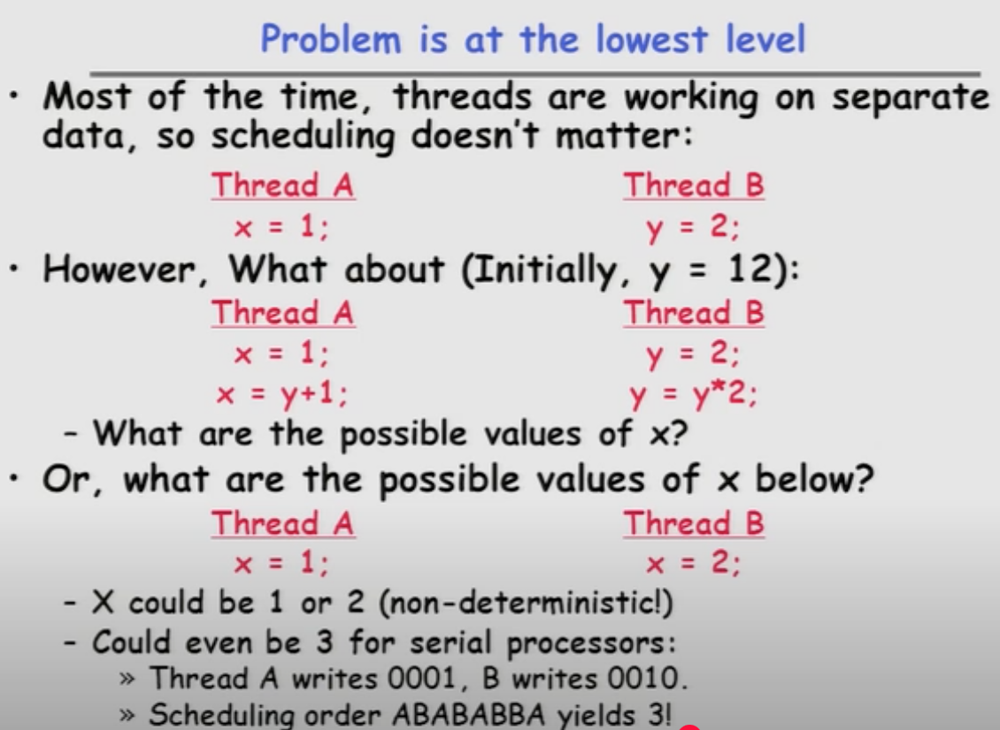
</p>

If the threads are independent, (i.e. they act on different data, it is not a problem) so the interleaving doesn't matter but, if they share some data - synchronization problems may occur. 

For ex, let y = 12.
| thread 1 | thread 2 |
|----------|----------|
| x=1     | y=2    |
| x=y+1   | y=y*2   |

Then x can be - 13 (12+1), 3(2+1), 5(2*2+1)

In the case of the previous bank example, the deposit part should be an atomic operation, it should not be interleaved. Always think the scheduler is an adversary - it will try to interleave your threads in such a way that it will break.

If we have a non-atomic "load" store, where some bits can be set for others like a serial processor, it is possible that thread 1 adds some bits, thread 2 sets some bits, and we get 3 if we interleave etc. eg, thread 1 write 0001 and B writes 0010. if they are interleaved like so: ABABABBA, we get: 00000101 which is 3. this can happen for serial processors

 ### Atomic Operations

_An operation that is indivisible, it either runs to completion or not at all (recall the "transactions" in databases)_ (eg, load and modify store operation in the bank example)
- It is indivisible - cannot be stopped in middle and state cannot be modified by someone else in the middle
- fundamental building block - if no atomic operations, we have no way for the threads to work together
- on most machines, memory references and assignments("load"/"store") of words are atomic
- many operations are not atomic, eg, double precision floating point store (see eg above), IBM360 had an instruction to copy a whole array


Another example of concurrent program:

| thread 1            | thread 2             |
|---------------------|----------------------|
| i=0;                | i=0;                 |
| while(i<10); i=i+1; | while(i>-10): i=i-1; |
| printf("A wins!");  | printf("B wins!");   |

Either or neither could win
assuming memory loads and stores are atomic, but incrementing, decrementing are not atomic.

We can solve problems like this by producing atomic sections with only load and store as atomic

***** motivation:

<p align="center">
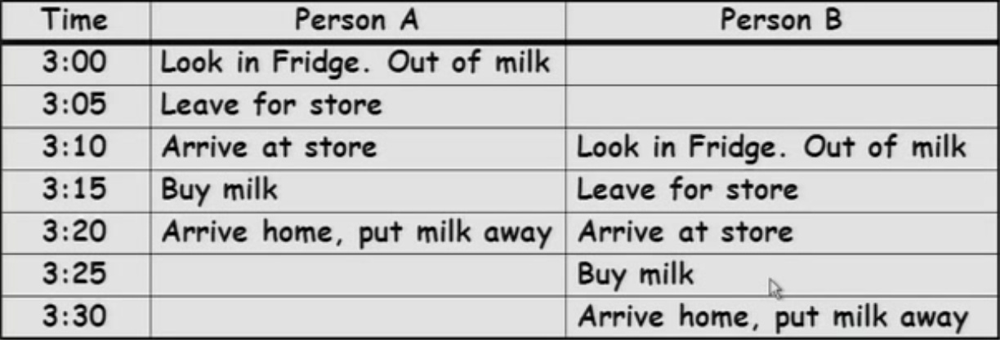
</p>


now we have too much milk!

**** can we fix this problem with only load/store as atomic?
1. defination of synchronization:
- using atomic operations to ensure threads cooperate and give the correct behaviour.
- we currently have "load"/"store" as the only atomic operations.

2. defination of mutual exclusion:
- allowing only 1 thread to do a particular critical thing at a time (eg, purchasing milk)

3. critical section
- the thing you do mutual exclusion on, the piece of code that only one thread can execute at once

4. lock
- prevents someone from doing something(makes them "wait").
- lock before entering critical section and before accessing shared data
- in the above eg, check if the fridge has milk, if not, lock the fridge, go out get some, unlock the fridge, put it in
  we have locked the fella out the fridge, so he can't access the orange juice now too. that's the downside here

how to solve the problem?
--> think first, then code
correctness properties for our problem:
1. never more than 1 person buys
2. someone buys if needed


***** solution 1 - use a note
- leave a note before buying (kind of "lock")
- remove note after buying (kind of "unlock")
- don't buy if note (wait)

#+begin_src c
if (noMilk) {
 if (noNote) {
  leave Note;
  buy milk;
  remove note;
 }
}
#+end_src

downside - the operations are non atmoic, so, sometimes, both you and your roommate (2 threads) look at the no milk and don't see any note and head out to buy milk after putting the note. synchronization condition built in the code here.

this is horrible - because it introduces non-deterministic bugs(sometimes too much milk), a race condition

# one easy way to get atomicity would be to disable interrupts, start execution, re-enable interrupts

***** solution 1.5 - put the note first
earlier, we checked for milk and then put the note. if we put it first, before checking would be better.
no body buys any milk if - A leaves a note, swapped out, B leaves a note, swapped out. A notices there is a note, so doesn't buy milk
B does the same thing. (both then remove the note without getting the milk)

#+begin_src c
leave Note;
if (noMilk) {
 if (noNote) {
  leave Note;
  buy milk;
 }
}
 remove Note;
#+end_src

***** solution 2 - labeled notes
we have different notes for both fellas
#+ATTR_ORG: :width 400
#+ATTR_ORG: :height 400
[[./assets/operating-system/ucbOS_32.png]]

this won't work - A leaves a noteA, B leaves a noteB, nobody buys any milk.
this reduces the probability of synchronization problem but it can still happen

original unix had these a lot

***** solution 3 - 2 note solution

#+ATTR_ORG: :width 400
#+ATTR_ORG: :height 400
[[./assets/operating-system/ucbOS_33.png]]

note the asymmetric code here. this works.
at X:
 - if no note B, safe for A to buy
 - else wait to let B complete it's thing
at Y:
 - if no note A, B can buy
 - else, A is doing something(buying or waiting for B to quit), you can leave.

here, the critical part is
```
   if (noMilk): buy milk;
```
only one of the threads do it at any time.

this is complex, what if there are 10 threads?
also, while A is waiting for what happens with B's note, it is wasting CPU cycles doing nothing. this is called "busy waiting"

better way is make the hardware provide good (better) primitives.
like, *a atomic lock operation. (if 2 threads are waiting for the lock and both see it as free, only one succeeds in getting it)*
- Lock.acquire() --> wait until lock is free, then grab it(till then, sleep -- no busy waiting)
- Lock.release() --> unlock, wake up anyone waiting for the lock to release

with this in place, solution is easy:
#+begin_src c
milklock.Acquire():
 if (nomilk) // the lock is around the critical section
  buy milk;
milklock.Release();
#+end_src

so, this is solution 1, except with an atomic lock. (earlier the problem was that the lock was unatomic. so, both the threads see no lock--or no note, and both go ahead and put it and get some milk from the market)

we see in this solution that the critical section is guarded by an atomic lock.
   
-----------------------------------------
-----------------------------------------
# Lecture 21 - Networking

[YouTube](https://www.youtube.com/watch?v=k9xiA9hCnPA&list=PLggtecHMfYHA7j2rF7nZFgnepu_uPuYws&index=21)

### Authorization - who can do what?

We store a Access control matrix
 - rows are domains - a potential user, users/groups etc
 - columns are objects you are controlling access to - eg: files etc
 - 0 if no access, 1 if access

Disadvantage: table is too huge and sparse

### Two Implmentation Choices for Authorization:

- Access Control Lists
  - store permissions with object
  - easy changing of an object's permissions
  - remove/add an entry to the list to add/remove permissions
  - Takes effect immediately since ACL is checked on each object access
  - need a way to verify identity of changer (mechanism to prove identity)
- Capability List: each process tracks which objects has permissions to touch
  - I as a user keep a tab on what I can access
  - This is what happens for the page table for eg. Each process has a list of pages it has access to, not that the page has to keep a list of processes that can access it.
  - Easy to change/augment permissions
  - Implementation - capability like a "key" for access

UNIX has a combination of both. Users have capabilities (like root user has all the capabilities) and objects have ACLs which allow certain users or groups.


## Centralized vs Distributed systems

### Centralized systems
 - Major functions performed by a single physical computer
 - Originally, everything on a single computer - everyone shared it
 - Later, client-server model. That is still centralized

### Distributed systems
 - Early model - multiple servers working together (aka clusters)
 - Later, peer-to-peer
 - Cheaper and easier to build a lot of simple computers
 - Easier to scale out (horizontally) based on demand
 - Higher availability: one machine goes down, replace it
 - Better durability: store data in multiple locations
 - More security: easier to make each piece secure

<p align="center">

</p>

The peer to peer model is more powerful, there are upto O(n^2) connections here. But there are problems as well. Like knowing what is the most up to date version of a file etc. This is clear in the centralized version. 

Why use Distributed systems:
 - Distributed system is cheaper (cheaper to buy many small computers than one big computer)
 - easier to scale
 - easier to collaborate b/w users (via network file systems for eg)
 - provide a better level of anonymity 


In reality, peer2peer systems have had less availability (due to some system somewhere being down and you cannot work due to that), less durability (because the meta data of some file wasn't shared properly and the system having the data is down), less security (more machines, more points of failure)

Also, coordination in distributed systems is more difficult. (what is the latest copy of data?)

You can also have machines that are somewhere in between. So, client-servers, with the "servers" made up of many coordinating machines etc

### Goals of a distributed system
 - transparency - hide complexity and provide a simple interface
   - location - don't care where the data is stored
   - migration - resources may move without user knowing
   - replication - cant tell how many copies of data exits
   - concurrency - cant tell how many users there are
   - parallelism: splitting large jobs into smaller and process in prallel for faster 
   - fault tolerance: hide various things go wrong in system

Transparency and collaboration require some way for different processors to communicate with one another, i.e. we need a good networking layer

### Networking definitions

<p align="center">

</p>


 - Network - physical connection that allows two computers to communicate
 - Packet - unit of transfer, sequence of bits carried ove the network
  - notworks carry packets from cpu to cpu
 - Protocol - agreement beween 2 parties as to how to exchange these packets (eg: IP, TCP, UDP)
 - Frames - the lowest level transmission chunk

## Types of network

- ### Broadcast Network: Shared Communication Medium  

<p align="center">

</p>

    - inside the computer, this is called a bus
    - all devices simultaneously connected to devices
    - all messages are broadcast to everyone in the network
    - originally ethernet was a broadcast network

Problem with broadcast network is:
 - Conflict (2 machines talking at once)
 - No privacy: messages goes to everyone in the network. So its necessary to use secure protocols

Eg: cellular phones, GSM, EDGE, CDMA, 802.11 (wireless standard) - these are all standards that are broadcast networks

### How do the packets reach the intended destination? 
(If you want to communicate with a particular machine on the network)

<p align="center">

</p>

- We attach a header with the ID of the machine (the MAC address, which is a 48bit ID) it is intended for. Everyone gets the packet, discard it if not the target. 
- In Ethernet, this is generally done at the hardware level(unless you have used the promiscuous mode in which the OS receives every packet coming on the wire). You can do this with broadcast media using some software but it add overhead and slows the system. You are not supposed to take in a message is not for you unless you are snooping
- This is a form of layering. We're going to build complex network protocols by layering on top of the packet. We need to do more layering to send our packet to Europe etc.

### How to handle collision?

 - Arbitration - act of negotiating the shared media
   - Aloha network - this was an early network from Hawaii (70s) which used a checksum at the end of the message. If the message was received correctly, send back an ack. 
   - an example of a checksum - take all the bytes, rotate every byte, XOR them together, get a byte. Check both the cheksums, the one you started with and the one at reception - if they don't match, you got a problem. 

Sender waits for a while, if no ack, resend. This is done after some random wait, so that there is no collision feedback loop. 

   - another problem is that, what if someone starts talking too, when the other fella is at near the end of their communication? Then the whole message would have to be re-transmitted 


All this led to "CSMACD" - carrier sense, multiple access/collision detection 
(this is used in ethernet :top:)

"Carrier sense" - talk only if there is no one else talking
"collision detect" - sender checks if packet trampled
"backoff scheme" - choose randomized wait time which adapts according to collisions (if collisions increase, pick a little higher randomized wait time - 2x, 4x, 8x etc - exponential backoff) - we are sacrificing thruput for the ability to get messages thru

 - Point to point network: why use broadcast (shared bus) networks? They have collisions etc. Simple answer: they are cheaper that point2point networks. Every wire is between 2 machines only. But we need to introduce some mechanism by which we can make point2point connections connect many machines at once - eg, using switches, routers etc

 - Switches - a bridge that transforms a shared-bus (broadcast) configuration into a point-2-point network
(except initially, to get the mac address of everyone - ARP protocol?)

 - Hub - broadcast to everyone
 - Router - they connect 2 networks. They decide if the packets go to within the network or do they need to be sent over to another network (another switches). They look at the IP address and decide on the basis of that (check if the IP belongs to the same subnet or a different subnet). They carry IP packages.

Switches only work on a subnet, routers can work above individual subnets to connect subnets

_"Switches use MAC addresses, routers use higher level protocols like IP"_

Advantages of point2point over broadcast 
- higher bandwidth that broadcast networks (due to less/no collisions)
- easy to add incremental capability
- better fault tolerance, lower latency
- more expensive

Eg: switched ethernet (ethernet is broadcast, but when you use a switch with it, the broadcast part is not user because the switch sends to whoever needs the message only)

Switchers have a processor in it, they need to forward the packets to the right machines.

How to handle overload? Queue the packets, if the queue is full, drop the packet. It is the responsibility of TCP to retransmit it (UDP won't care)

Every computer connected to the internet doesn't have an IP address, they can be placed under an router for eg and then only the router will have an IP (all the machines under the router will use the internet from the router's IP address). **This is done using NAT - network address translation**. Whole companies are behind NAT firewalls as a way of protecting things.

### Subnets
A network connecting a set of hosts with related destination addresses. All addresses are related by a prefix of bits
- Mask: the number of matching prefix bits. Expressed as a single value or a set of ones in a 32-bit value
- Subnet is identified by 32-bit value, with the bits which differ set to zero, floowed by a slash and a mask, ex. 128.32.131.0/24 whcih covers all addresses in form of 128.32.131.XX

### Address Ranges in IPv4

<p align="center">
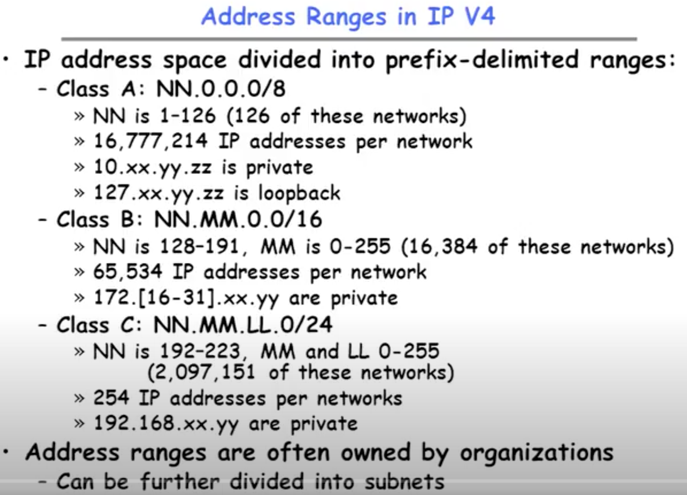
</p>

### How can we build a network with millions of hosts? ...  Hierarchy!
- Not every host connected to every other one
- Use a network of routers to connect subnets together
  - Routing is often by prefix, first router matches first 8 bits of address, next router matches more

<p align="center">
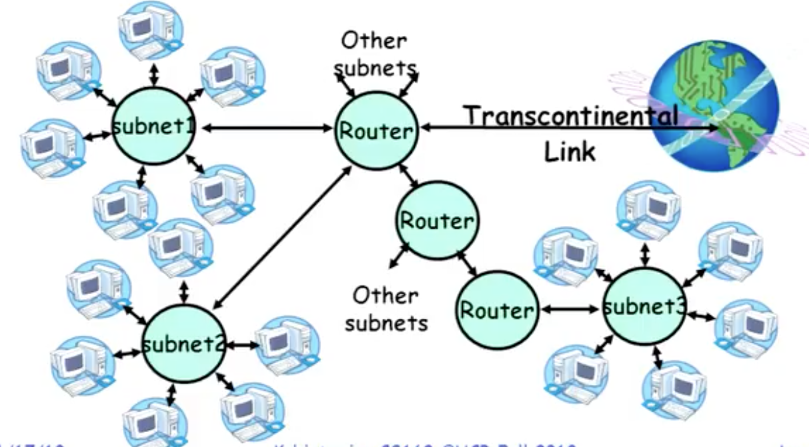
</p>

### Local Area Network (LAN)
Designed to cover small geographical area
- Multi-access bus, ring, or star network
- Speed is about 10-1000 Mb/s
- Braodcast is fast and cheap
- In small organization, a LAN could consist of a single subnet. In large organization, a LAN contains many subnets
- Wide-Area Network (WAN): links geographically separated sites, speed 1.5-45 Mb/s 
- Broadcast usually require multiple messages

### Routing
- Routing: the process of forwarding packets hop-by-hop through routers to reach their destination
  - Need more than jst a destination address
  - Post Office Analogy (pakages sent to multiple hubs through distribution network)
- Internet routing mechanism: **routing tables**
  - Each router does table lookup to decide which link to use to get packet closer to destination
  - Dont need 4 billion entries in table: routing is by subnet
  - Could packets be sent in a loop? yes, if tables incorrect
- Routing table contains:
  - Destination address range 
  - Default entry (for subnets without entries)

### Domain Name System
- DNS is the mechanism used to map human-readable names to IP addresses because 
  - IP addresses are hard to remember
  - IP addresses change
- DNS is a hierarchical system for turning domain names into IP addresses
  - Names are separated (by dot .) of domain from right to left: "www.esc.berkeley.edu"
  - Top level domain ("edu") is handled by ICANN, second level domain ("berkeley"), subdomains ("esc", "www"), etc
  - Each domain is owned by an organization
- DNS _resolves_ a domain name into an IP address using a series of queries to successive DNS servers
- Caching: queries take time so results cached for period of time

### Performance Consideration
- Overhead: CPU time to put packet on wire
- Throughput: Max number of bytes per second, depends on wire speed, limited by lowest router or by congestion at router
- Latency: time until first bit of packet arrives at receiver: raw tansfer time + overhead at each routing hop

### Contributions to Latency
- Wire Latency: depends on speed of light on wire
- Router Latency: depends on internals of router (< 1ms for a good router)
- Requirements for good performance:
   - Local area: minimize overhead/improve bandwidth
   - Wide area: keep pipeline full

### Network Protocols
- Protocol: Agreement between 2 parties as to how information is to be transmitted. 
  - Example: system calls are the protocol between the operating system and application
  - Networking examples: many layers
    - Physical: mechanical and electrical network (how 0, 1 represented)
    - Link: pocket formats/error control
    - Network: network routing, addressing
    - Transport: reliable message delivery

<p align="center">
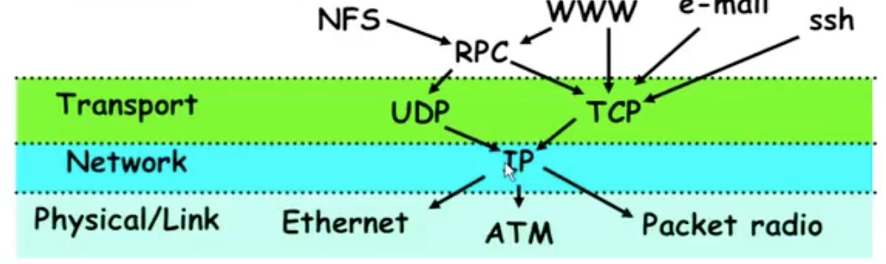
</p>

### Network Layers: building complex services from simple ones

Each layer provides services needed by higher layers by utilizing services provided by lower layers

- Physical layer is pretty limited: packet are of limited size 200-1500 byte
- Handling arbitrary sized messages:
  - Split big message into smaller ones (called fragments). These pieces must be reassemble at destination
  - Checksum computed on each fragment or whole message
- Internet Protocol (IP): send packets to arbitrary destination in network
  - Deliver messages unreliably ("best effort") from one machine in internet to another
  - Since intermidiate links may have limited size, must be able to fragment/reassemble packets on demand
  - Includes 256 different "sub-protocols" build on top of IP. ex: ICMP(1), TCP(6), UDP(17), IPSEC(50, 51)

### IP Packet Format:

<p align="center">
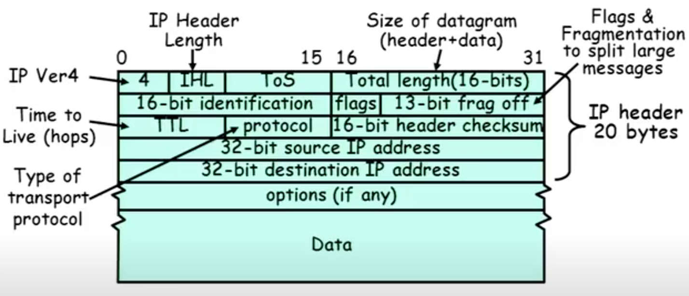
</p>

### Building a message service
- Process to process communication
  - Basic routing gets packets from machine to machine
  - What we really want is routing from process to process
    - Add ports (16 bit identifiers)
    - A communication channel (connection) defined by 5 items (source addr, source port, dest addr, dest port, protocol)
- UDP: the unreliable datagram protocol
  - Layered on top of basic IP (IP Protocol 17)
  - Unreliable, unordered
  - Low overhead, used for high-banddwidth video streams

### Ordered Messages
- Several network services are best constructed by ordered messaging
  - ask the remote machine to first do x, then do y etc.
- Unfortunately, underlying network is packet based, can take different paths or be delayed individually
- IP can reorder packets P0, P1 might arrive P1, P0
- Solution requirs queuing at destination
  - Need to hold onto packets to undo misordering
  - Total degree of reordering impacts queue size

______________________________
______________________________

# Lecture 23 

[YouTube](https://www.youtube.com/watch?v=YPPq5gNpcjU&list=PLggtecHMfYHA7j2rF7nZFgnepu_uPuYws&index=23)

### How to ensure transmission of packets?
- Detect garbling at receiver via checksum, discard if bad
- Receiver acknowledges (by sending "ack") when packet received properly at destination
- Timeout at sender: if no ack, retransmit
- Aviod duplicate received message:
  - Put a sequence number in message to identify re-transmitted packets, reciever checks for duplicate #s and discard if detected
  - Requirements:
    - Sender keeps copy of unacked messages; receiver tracks possible duplicate message
- What if packet gets garbled/dropped?
  - Sender will timeout waiting for ack packet; resend 
  missing packets; receiver gets packets out of order

### Transmission Control Protocol (TCP)
- TCP layered on top of IP
- Reliable byte stream between 2 processes on different machines over internet (read, write, flush)
- Fragments byte stream into packets, hands packets to IP
- Automatically retransmits lost packets
- Adjusts rate of transmission to avoid congestion

## How do we use TCP? Sockets!

**Sockets**: an abstraction of a network I/O queue
  - Embodies one side of a communication channel
    - Same interface regardless of location of other end
    - Could be local machine (called "UNIX socket" for communication between two processes on the same machine) or remote machines (called "network socket")
    - First introduced in 4.2 BSD UNIX: big innovation at time
      - Now most operating systems provide some notion of socket

### How to use Socket interface (C/C++)? client-server
- On server: set up "server-socket"
  - `Create` socket: Bind to protocol(TCP), gives it a local address and port
  - Call `listen()`: tells server socket to accept incoming requests
  - Perform multiple `accept()` calls in a loop: each accept call returns a socket to accept incoming connection request
  - Each successful accept() returns a new socket for a new connection; can pass this off to handler thread 
- On client: 
  - Create socket: Bind to protocol(TCP), gives it a local address and port
  - Perform `connect()` on socket to make connection
  - If `connect()` successful, have a socket connected to server

<p align="center">
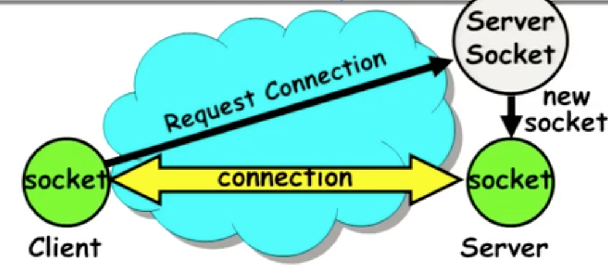
</p>

- Things to remember:
  - Connection involves 5 values:
  [Client Addr, Client Port, Server Addr, Server Port, Protocol]
  - Often, Client Port "randomly" assinged done by OS during client socket setup
  - Server Port often "well-known" (0-1023): 80(web), 443(secure web), 25(sendmail)
- Note that the uniqueness of the tuple is really about two Addr/Port pairs and protocol
- For every incoming client connection, the server socket on the server creates a new server socket with the same port number

