### What happens when you type a URL into your browser? 

URL stand for Universal Resource Locator composed of 
- **Scheme**: http, https for encrypted connection
- **Domain** (or Base URL): the domain name of the site
- **Path**
- **Resource**  

Think of path and resource as directory in the file system, which is also called the Route, location of the web server. Together, they specify the resource on the server we want to load.

<p align="center">
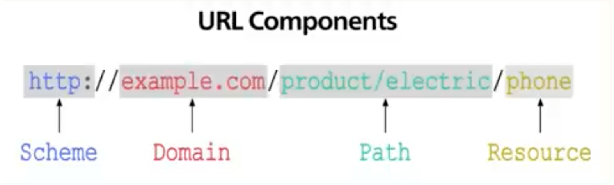
</p>


- After typing URL, the browser needs to know how to reach the server, in this case `example.com`. This is done through a procedure called “DNS lookup”. DNS stands for Domain Name System. Think of it as the phone book of the internet. DNS translates doman names into IP addresses. 
- To make the lookup process fast, the DNS information is heavily cashed. First the browser itself cashes the information for a short period of time. If the browser don't have it, it asks the operating system for it. OS itself checks its own cache otherwise it makes a query to the internet to a DNS resolver server. This process involves many servers in the DNS infrastructure and the answer is cached very step of the way.

- Finally the browser has the IP address of the server. Next the browser establishes a TCP connection to the server using the IP address received. This step involves a handshake with several network round trips for this step to complete. 
- To keep the loading process fast, modern browsers use something called “keep alive connection” to try to reuse an established TCP connection to the server as much as possible. If the protocol is HTTPS, the process is even more involved requiring a SSL-TLS handshake to establish an encrypted connection between the browser and the server. 
- Finally the browser sends an HTTP request to the server over the established connection. The server sends back a response and the browser receives the response and renders the HTTP content. Often times, there are additional resources to load: the JavaScripts bundles and images. The browser repeats the process above to finish fetching all the other resources.   


<p align="center">
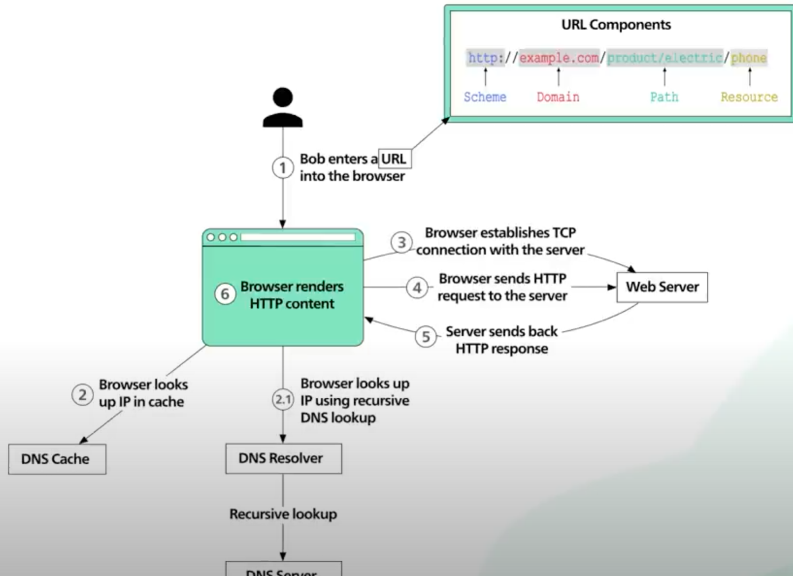
</p>

----------------------

### How does DNS work? 

DNS is the internet directory. It translate human readable domain names to machine readable IP addresses. When a browser makes a DNS query, it is asking a DNS resolver which could be an ISP, or a popular DNS provider like CloudFlare 1.1.1.1 or Google 8.8.8.8. If the resolver don't have the IP in its cache, it finds an Authoritative Name Server and asks it. When we update a domain name record, we are updating Authoritative Name Server. How the resolver finds Authoritative Name Server? There are 3 main level servers of Authoritative Name Server: **Root Nameservers**, **TLD Nameservers**, **Authoritative Nameservers**.  

The root name servers store the IP addresses of the TLD (Top Level Domain) name servers. There are 13 logical root name servers. There are actually many physical servers behind each IP address but we get routed to the one closest to us. 

The TLD nameservers store the IP address of Authoritative Nameservers of all the domain under them. There are many types of TLD names like `.com`, `.org`, `.edu` or for countries like `.uk`, `.de` . 

When we register a domain, the registrar hosts the authoritative name server by default but we can change them to others.

Now lets walk through a typical DNS query. The user types google.com into the browser. The browser first checks its cache. If there is no answer, it makes OS system call and OS checks its cache and if not found, it reaches out to the DNS resolver. The DNs first checks its cache, if it is not there or if the answer is expired, it asks root name server. Root server responds with a list of .com TLD servers. The AND resolver then reaches out to .com TLD name server and that returns the Authoritative Nameserver for google.com. Finally DNS resolver reaches out to  google.com authoritative and it returns the IP addresses of google.com. The DNs resolver the returns the IP address to operating system and OS returns it tot he browser. 

<p align="center">
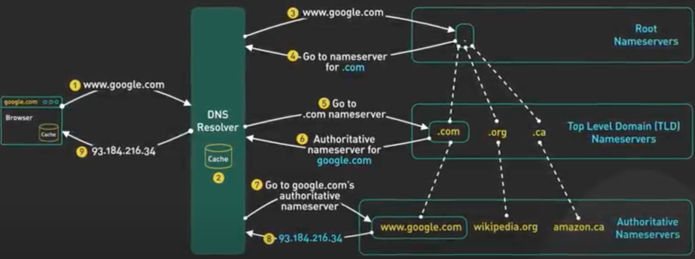
</p>

DNs propagation is slow because there is a TTL on each DNS record which could be pretty long. There are 2 practical steps to take: first reduce the TTL for the record we want to change to say 60s well in advance before the update actually happens. This gives enough time to all DNS sever to receive the shortened TTL. Second, leave the server running with old IP addresses for a while. Only decommission server when traffic dies down to an acceptable level.

-------------------------
### How does HTTPS work?

With HTTP, the communication between the browser and the server is plain text. This means the password you enter, or the credit card you send over the internet can be read by anyone who has the ability to intercept it. HTTPS is designed to solve this problem to make the data sent over the internet to be unreadable by anyone other than the sender and the receiver. HTTPS is an extension of the HTTP protocol. 

With HTTPs, data is sent in an encrypted form using TLS (Transport Layer Security) protocol. In this case, if the encrypted data get intercepted by a hacker, all they could see is jebrish only data. 

Let’s take a look at how TLS handshake work. 

1. The browser establishes a TCP connection with the server
2. TLS handshake begins. The process send a client hello to the server. In this hello massage, the browser tells the server 
   - What TLS version it supports 1.2, 1.3 etc
   - What cipher suite it supports which is set of encryption algorithms to encrypt data
3. After receiving the client hello, the server gets to choose from the options and sends a hello server message back to the client. 
4. The server also sends the certificate to the client. This certificate includes a lot of different things. One of the key things is the public key of the server that the client uses this public key for symmetric encryption. In symmetric encryption, the data encrypted by a public key can only be decrypted by the associated private key. At this point the client has the server certificate and the server and client agreed on TLS versions and cyber suite to use for encryption.  

5. Next is client exchange key. Here we use RSA as an example. With RSA, the client generates an encryption key called the session key and encrypts it with the public key server sent to the client earlier. The client send this session to the server over the internet and the server decrypts it using its own private key. Now both sides have the session key which is used for encrypting data travelling between the client and the server over the internet.
    
Symmetric encryption is computationally expensive and is not suitable for bulk data transmission. TLS 1.2 take 2 network round trip while TLS 1.3 take it 1 network round trip. TLS 1.3 uses Diffi Hellman for exchanging session keys instead of RSA which does not require sending public key over the network. 

<p align="center">
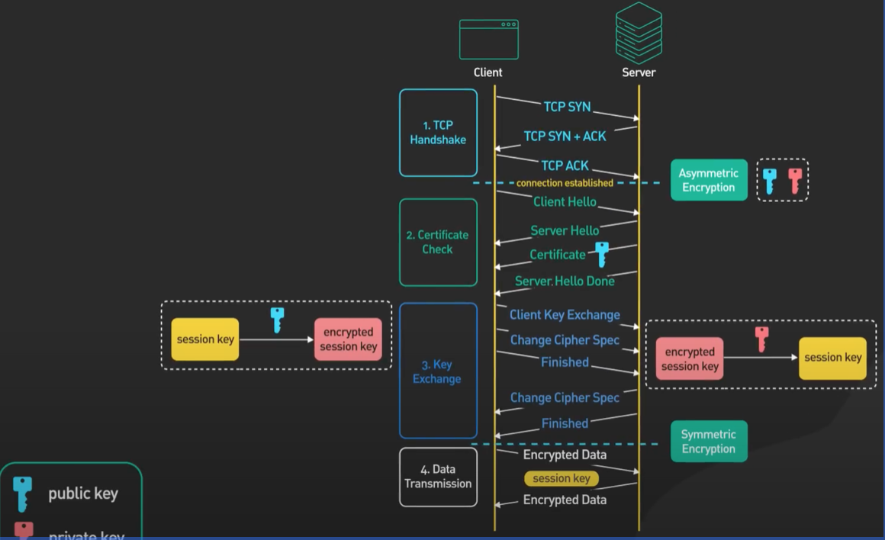
</p>

-----------

### HTTP Status codes:

**200x**: These are basically the server is giving a high 5!… 200 OK means everything went well on the server side.

- **201 Created** is another thumbs up for when something new was created say you built an API that adds user profiles. 

**400x**: the server way of saying: check what you sent me!. Something in the request just doesn’t make sense. 

- **401 Unauthorized** means we are missing the right credentials. The door will not open until the right authentication key is provided. 

- **403 Forbidden** means I know you but you can’t come in here.  It’s like trying to get admin feature with a guest account.

- **404 NotFound** means the requested file isn’t there. Double check those routes and endpoints.

- **429 Too Many Request** means we are hitting rate limits. Slow down!. You are throttled. We need to implement retries with backoffs.


**500x**: means something went wrong server side. Sever overloads, network glitches or just misconfigurations. 

- **503 Service Unavailable** means the server can not process the request now due to maintenance or traffic overload

- **502 Bad Gateway** is about problematic communication between the servers.

**300x**: Redirection
301 Moved permanently with the location pointed to a new URL

**100x**: Informational

Tools Like Postman can be invaluable when testing requests and responses for troubleshooting here. Also server Logs are very important if you have access to them.


-------------------------

### What is REST API? 

**REST (Representational State Transfer) API** is the most common standard between computers over internet. API stands for Application Programming Interface. It is the standard way for most mobile and web applications to talk to servers. 

REST APIs provide a flexible, lightweight way to integrate applications, and have emerged as the most common method for connecting components in microservices architectures. It is an architectural style that defines how applications should communicate with each other within a network. 

An API has three characteristics that classify it as RESTful:

- **Manages all requests through HTTP**: REST APIs communicate via HTTP requests to perform standard functions like creating, reading, updating, and deleting records (also known as CRUD) within a resource. For example, a REST API would use a POST request to create a record, a GET request to retrieve a record, a PUT request to update a record, and a DELETE request to delete a record. 

- **Stateless client-server communication**: REST APIs are stateless, meaning that each request contains all the information required to process it. Roy Fielding, the originator of REST, said in his dissertation. “_Each request from client to server must contain all of the information necessary to understand the request, and cannot take advantage of any stored context on the server_". Session state is therefore kept entirely on the client.” This stateless nature of REST APIs also makes them scalable. 

- **Uniform interface between components**: The main benefit of RESTful APIs is the uniform interface, regardless of where the request originates. The REST API should ensure that the same piece of data, such as the product id, belongs to only one uniform resource identifier (or URI). And resources should contain every piece of information that the client might need. 

#### Basics of REST:

- RESTful APIs organize resources into a set of unique URIs (uniform resource idenfiers). URIs differentiate different type of resources on a server. The resources should be grouped by nouns not verbs such as `https://example.com/api/v3/products` (not `https://example.com/api/v3/getAllProducts` for example) 
  

- The client interacts with a resource by making a call to the endpoint of the resource over HTTP. The request has a specific format. It contains the URI of the resource preceded by a verb `POST`, `GET`, `PUT`, `DELETE`. 

    - A POST request means we want to create a new resource 
    - A GET request means we want to read the data about an existing resource
    - A PUT means we are updating an existing resource
    - A DELETE is for removing an existing resource

    Acronym CRUD stands for these 4 operations. In the body of these request, there could be an optional HTTP request body that contains a custom payload of data usually encoded in JSON. 

- The server received the request, processes it and forms the result into a response. The first line of the response contains  a  HTTP status code to tell the client what happened to the request. 
  

#### Best implementation and design practices for REST API

- Use **clear naming**: plural names indicates to users that they are dealing with collection of resources. Ex `https://example.com/api/v1/carts/123` instead of `https://example.com/api/v1/cart/123`
  
- A well written API returns a proper **HTTP status code**. 

    - 200-level status code means the request was successful. 
    - 400-level status code means something was wrong with the request specially with syntax
    - 500-level status code means something went wrong at the server level - For example, the service was unavailable. 
  
- A well written API should take care of **idempotency** when identical request come in again. Typically POST requests are not naturally idempotent. Sending that request twice could duplicate that resource


- A REST implementation should be **stateless**. It means the 2 parties don’t need to restore any information about each other. _Every request and response is independent from others_. This leads to web application be easy to scale and well-behaved.

- Use **pagination** if the API returns a lot of data. Pagination uses limit and offset as parameters. If not specified, the server should assume sensible default values. It prevents overwhelming consumers from receiving data all at once. 

- **Versions APIs** are very important. It allows an  implementation to provide backward compatibility so that when breaking changes introduced, consumers have enough time to move from one version to another. The most common way to version is to specify a version number before the resource like: `/v1/products` or `/v2/products` in `https://example.com/api/v1/carts/123` and `https://example.com/api/v2/carts/123`

- **Use clear query strings** for sorting and filtering API data such as `GET /users?sort_by=registered` or `GET /products?filter=size:10&sort_by=data_added`

- Dont make **security** an after thought when design an API. Secure connections using TLS and add access control using OAuth2.0 or similar tools

<p align="center">
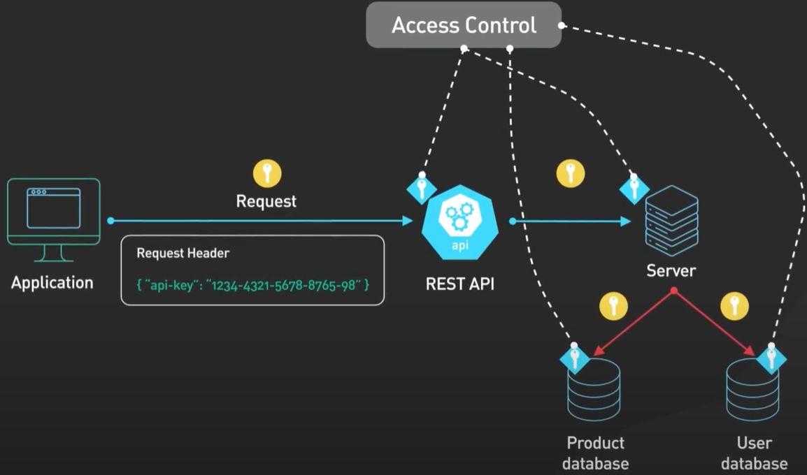
</p>

- **Keep cross-resource references simple** to avoid messy query params:  `https://example.com/api/v1/carts/123/items/321` not `https://example.com/api/v1/items?card_id=123&item_id=321`

- Plan for **Rate Limiting**: You can set it up based on IP addresses, User Accounts or endpoint categories.

The other popular APIs are GraphDL and gRPC.

-------------
### API Gateway

When your online store follows microservices architecture, some of those services will be:
- A product information service that shares basic information about the product such as id, name, and price
- An inventory service that reveals what’s available in stock
- An order service that enables customers to place an order for a product
- An authentication service to validate users on the platform

So, how does a client access the microservices? This is a problem when you need to interact with multiple APIs. 

An API Gateway is an API management tool that sits between a client and a collection of backend services. It aggregates the various services required to fulfill them and returns the appropriate result. 

An API Gateway typically provides several important functions:

- Authentication and Security Policy Enforcement
- Load Balancing and Circuit Breaking
- Protocol Translation and Service Discovery
- Monitoring, Logging, analytics and billing
- Caching

An API Gateway 

- Can help you to protect your APIs from malicious usage or overuse. 
- Allows you to use an authentication service with rate limiting
- Increase or decrease the number of service instances, scale up/down
- Analyze your APIs, using an analytics and monitoring service 
- Monetize your APIs using a billing system
- Present a single point of contact to your various microservices and provides a single response to a request
- Reduces the number of requests or round trips by caching

You can add or remove APIs seamlessly without the client’s knowledge about the services running at the backend. Replace your existing service, for example, an ordering service, with a new one. The client’s access to the services remains undisturbed.

API Gateway insulates the clients from how the application is partitioned into microservices. In other words, it simplifies the client side by moving the logic for calling multiple services from the client to the API Gateway. Lets take look at how requests are process through API Gateway:

- The client send a request to API Gateway which is typically HTTP based (it could be REST, GraphQL or some other high level abstractions)
- Validates the HTTP request
- Checks the callers IP address in HTTP header against an allow/deny list. At this point, it can also perform a basic rate limit checks to perhaps reject a request from an IP address exceeding a certain rate
- Sends the request to an identity provider for Authentication and Authorization
- Receives an authenticated session back from identity provider with the scope of access to resources
- Checks requests in the authenticated session against rate limits for actions allowed - if its over the limit, the request is rejected at this point
- With the help of service discovery component, API Gateway locates the appropriate backend service to handle the request by path matching
- API Gateway transform the request into an appropriate protocol (ex., gRPC) and sends it to the backend service. When the response come from backend, API transforms it back to the public facing protocol to send it to the client

<p align="center">
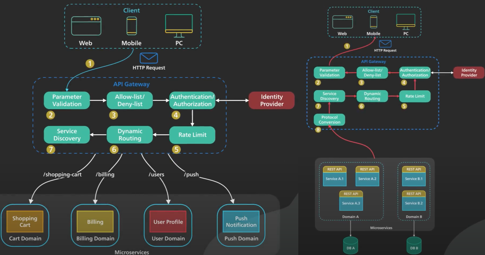
</p>

Also, a Gateway will increase the response time due to this additional network step in the execution of the application. 

There are plenty of API Gateway products available on the market. You can choose from managed or open-source options. From IBM, an industry-leading, high-security application gateway called IBM DataPower Gateway. Google has two offerings based on your needs: Apigee or Cloud Endpoints. Microsoft Azure and Amazon AWS also offer gateways on their platforms. While those are managed products, in the open source world, some famous names are: Kong, being top of the list in popularity, Apache APISIX, Tyk, which also has a managed version, and finally, Gloo, which is also available as an enterprise version.

### Creating REST API - Example: Flask

Flask is classified as a micro web framework to host Python web applications as it does not require particular tools or libraries. It was built with scalability and simplicity in mind. Flask applications are known for being lightweight compared to other frameworks. Since Flask is not opinionated about what database or template engine to use, it is a good choice for RESTful APIs. 

After installing Flask, you create the `hello.py` file with the content shown. You then run the Flask server to host this python file and the output will be displayed.

```
# hello.py
from flask import Flask
app = Flask(__name__)

@app.route("/“)
Def hello_world():
	return “Hello World"
```

```
$ flask —app hello run
```

When you open this ‘hello world’ web application in the browser by navigating to `127.0.0.1` and port `5000`, you will see the response “Hello World”. 

You can now create a new python file with the name `products.py` which will provide all endpoints for your products microservice. You are not using any database to persist these products, so every time you restart the API, you start with the same list of products. Next, you define the GET method to retrieve all the products. This method implicitly returns `200`, which in HTTP means OK.

```
from flask import Flask
import json

app = Flask(__name__)

product = [
	{‘id’:143, ‘name’: ‘Notebook’, ‘price’: 5.49},
	{‘id’:144, ‘name’: ‘Black Marker’, ‘price’: 1.99}
]

@app.route(“/products", methods=['GET'])
Def get_products():
	return json.dump(products)
```

#### Making API requests using curl and postman

Transferring data to and from a server requires tools that support the necessary network protocols. Linux has multiple tools created for this purpose, the most popular being `curl`, short for "Client URL" is a command line tool that enables data transfer over various network protocols. Developed in 1998, it has since been used to communicate with web or application servers by specifying a relevant URL and the data that need to be sent or received. `curl` can either be used at the command line or in scripts to transfer data. 

The most common use cases for `curl` are: downloading files from the internet, endpoint testing, debugging, and error logging. Some of the common protocols supported by curl are: `HTTP`, `HTTPS`, `FTP`, and `IMAP`.

If you run this example curl command, you will receive the output as shown. 

```
$ curl -X ‘GET' \
'http://127.0.0.1:5000/products' \
-H 'accept: application/json'
```

```o
[
	{‘id’:143, ‘name’: ‘Notebook’, ‘price’: 5.49},
	{‘id’:144, ‘name’: ‘Black Marker’, ‘price’: 1.99}
]
```

`curl` accepts a wide array of options, which makes it an extremely versatile command. Options start with one or two dashes, and if they do not require additional values, the single-dash options can be written together. So, let’s breakdown the command and output. '- X' means you are explicitly specifying the HTTP function, which in this case is GET. We then specify the URL to evaluate. '- H' allows you to define headers, which in our case is telling the web server that we want to work with JSON. Our output is the list of products returned by the product’s microservice represented in JSON. 

Now, Postman is an API platform for building and using APIs based on a wide range of extremely user-friendly power tools, enabling the developers to easily create, test, share, and document APIs. Postman simplifies each step of the API lifecycle by allowing to orchestrate multiple requests which can be performed in several repetitions or iterations, and help you streamline collaboration so you can create better APIs—faster. And, due to its simplicity, it is one of the most popular and convenient tools for testing a wide variety of APIs supporting many protocols-- --for example, HTTP requests like GET, POST, PUT, and PATCH--and then convert the API to code for languages like JavaScript and Python.

------------
### What is OAuth 2.0?

OAuth 2.0 is about giving a client a special key to allow them to have a access to specific resources without having to share a password (Authorization). And yes, we can revoke that key at anytime. 

Suppose we store our images using an app called SnapStore. Now we want to print them using app PrintMagic. We need to allow PrintMagic to have access to our photos without using our credentials for SnapStore. This is done using OAuth 2.0. SnapStore is the resource server and PrintMagic is the client and we are the owner. The **Authorization Server** could be part of SnapStore as identity provider and responsible for handling OAuth 2.0. 

Let’s follow the OAuth 2.0 in this scenario. It begins when we interact PrintMagic to fetch photos from SnapStore. PrintMagic sends the client id and scope of access level for SnapStore authorization server. As a resource owner, we authenticate directly with SnapStore and grant PrintMagic the consent to access our photos. Once the consent is granted, the authorization sends an **authorization code** back to PrintMagic. PrintMagic presents this code along with client id and client secret to the authorization server in order to receive a **access token** and a list of **scopes of access** granted by that token. When received, PrintMagic sends this token to SnapStore in an **HTTP Authorization request header** to access our photos. It is possible to send tokens as URI query-string parameters, but we don't recommend it, because URI parameters can end up in log files that are not completely secure. Also, it is good REST practice to avoid creating unnecessary URI parameter names.


<p align="center">
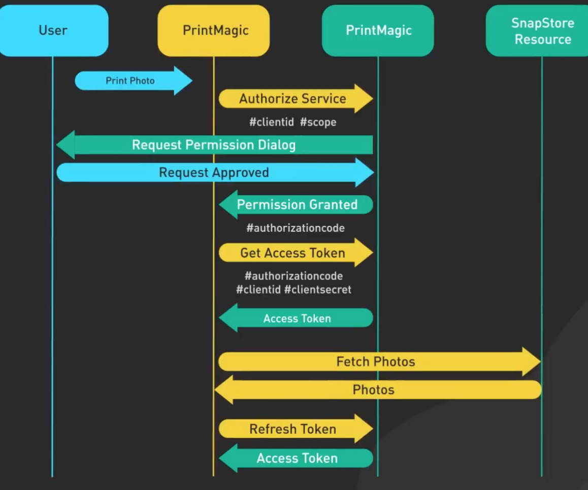
</p>

Access tokens have limited lifetimes. If your application needs access beyond the lifetime of a single access token, it can obtain a **refresh access token**.

Here is another example of how Google APIs use OAuth2 to grant access to users.

<p align="center">
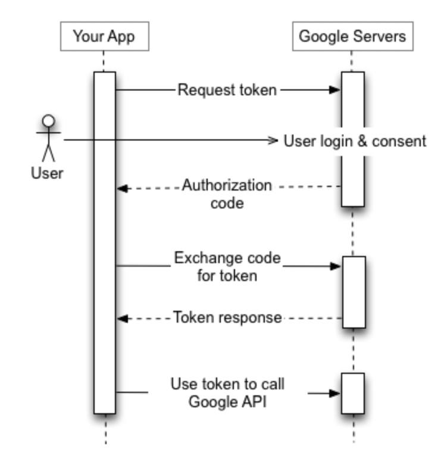
</p>

OAuth 2.0 is essential for web security structure and the backbone of many secure seamless app interaction we use daily. 

---------------------
### What is JWT?

JSON Web Tokens commonly known as “jots” is a robust way of securely transmitting information between parties as JSON objects.

It has become a corner stone in web security for good reasons. JSON is a light weight data interchange format which is easy to read and write for humans and simple for machines to parse generally. JSON represents the payload for JWT which is where you store the data you want to transmit. JWT have the structure of 3 parts: header, payload and signature each separated by period. 

<p align="center">
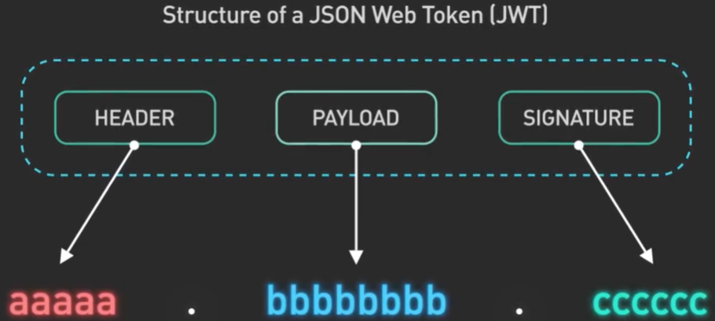
</p>


- The header consists of token type which is jwt and the algorithm being used. 
- While jwt payloads can be encrypted using JSON Web Encryption, most implementation used signed but not encrypted tokens. This means while the data is encoded (usually base64), it is not encrypted so it can be read if intercepted. This is why sensitive information should never travel in a jot payload unless it is encrypted first.

- There are two main types of signing algorithms. Symmetric algorithms use a shared secret key for both signing and verification (both the encryption and decryption processes). Asymmetric encryption, also known as public-key encryption, uses two keys, a public key for encryption and a corresponding private key for decryption. When the public key is used for encryption, the corresponding private key must be used for decryption. Symmetric keys are quick and simple but the secret key must be shared between parties ahead of time. Asymmetric keys allow verification of the creator without sharing private keys but it is slower. 

<p align="center">
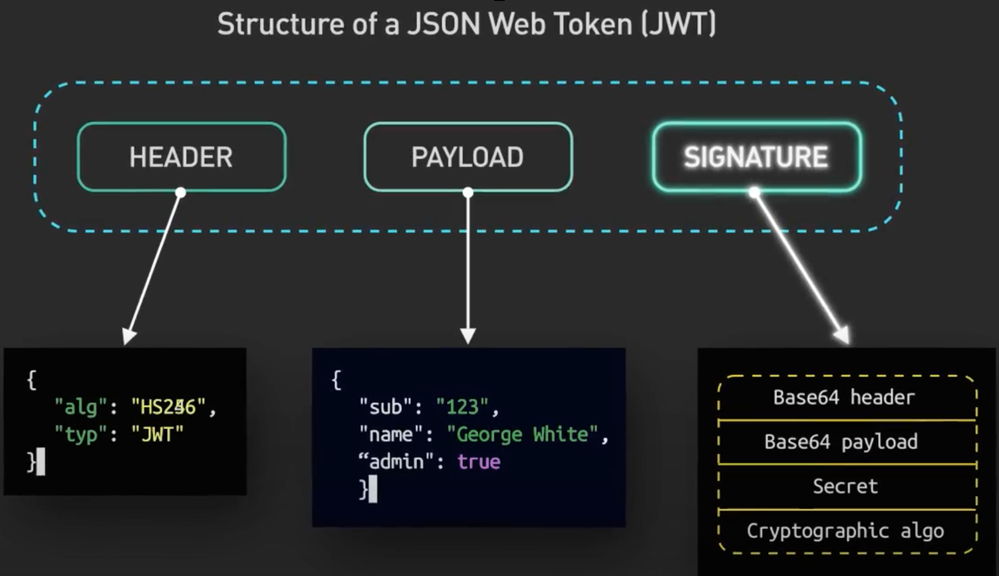
</p>

Upon login, the server creates a signed jot with the user detail and sends it back. Client uses this to access protected resources by sending the token in HTTP header

Jots are commonly used in standards like OAuth2 and OpenID Connect (OIDC) for Authentication and Authorization. 

JWTs are ideal for managing user sessions since they are stateless. Revoking JWT access can be challenging. Some common vulnerabilities to be aware of includes token highjacking when an attacker steals a valid JWT to impersonate a user. JWT is vulnerable to cryptographic weaknesses if using weak hashing algorithms. An Automated brute force attacks may try to crack the token signatures. 

Keep JWT payloads compact with only the necessary user claims using short token expiration times when possible storing tokens securely and invalidating any leaked token.

<p align="center">
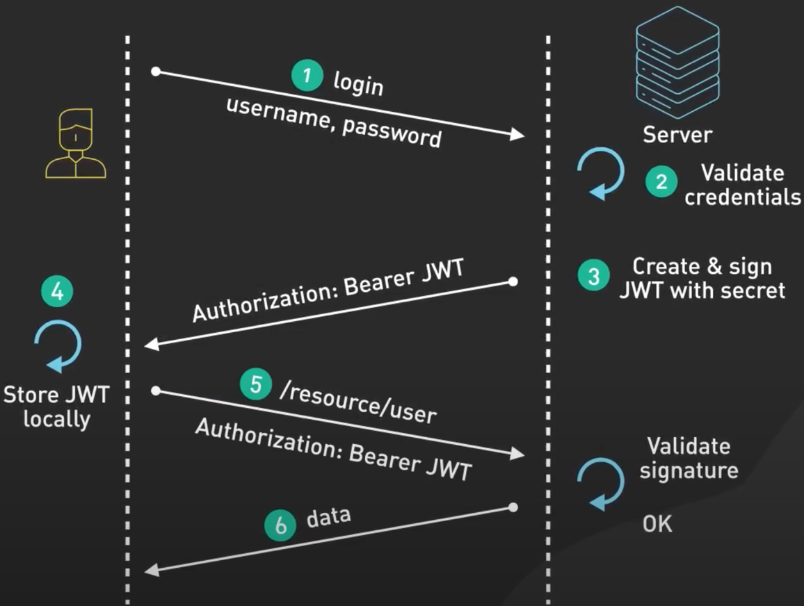
</p>

The pros are clear: 
- JWTs are self-contained , portable and don’t require server side storage. 
- JWTs are vulnerable to theft and if intercepted, can provide full access to resources. 
- The payload can get quiet large if too much info is included which affects the performance.
- JWT provides scalable way to handle authentication, authorization and information exchange if implemented properly and carefully. 

----------

### What is Single Sign-On? 

SSO is an authentication scheme. _It enables a user to securely access multiple applications and services using a single id_. SSO is integrated into apps like Gmail, Workday or Slack. It provides a pop up widget or log-in page for the same set of credentials. With SSO, users can access many apps without having to log-in each time. 

_This is built on a concept called **federated identity** which enables sharing of identity information across trusted identity providers_. There are two common protocols for this authentication process: **SAML** (Security Assertion Markup Language, an XML base open standard for exchanging identity information between services) and **OpenID Connect**. When we use our personal google account to sign into an application like YouTube, we are using OpenID Connect. It uses JWT to share information between services. 

Let’s walk through a typical SSO login workflow to see how it works. Here we focus on SAML. 


A office worker visits an application like Gmail. In SAML terms Gmail is a service provider. The Gmail server detects the user is from a work domain and return a **SAML authentication request** (SAR) back to the browser. The browser redirects the user to the **identity provider** that the company specified in the SAML authentication request. The identity provider shows a login page where a user insert its login credentials. Once the user is authenticated, the identity provider generates a SAML respond (called SAML Assertion) and returns that to the browser. SAML assertion is a cryptography signed XML document that contains information about the user and scope of access with the service provider. The browser forwards the signed SAML assertion to the service provider. The service provider validates that the assertion was signed by the trusted identity provider. This validation is usually done with a public key cryptography. The service provider returns the protected resource to the browser based on what the user is allowed to access specified in the SAML assertion. 


<p align="center">
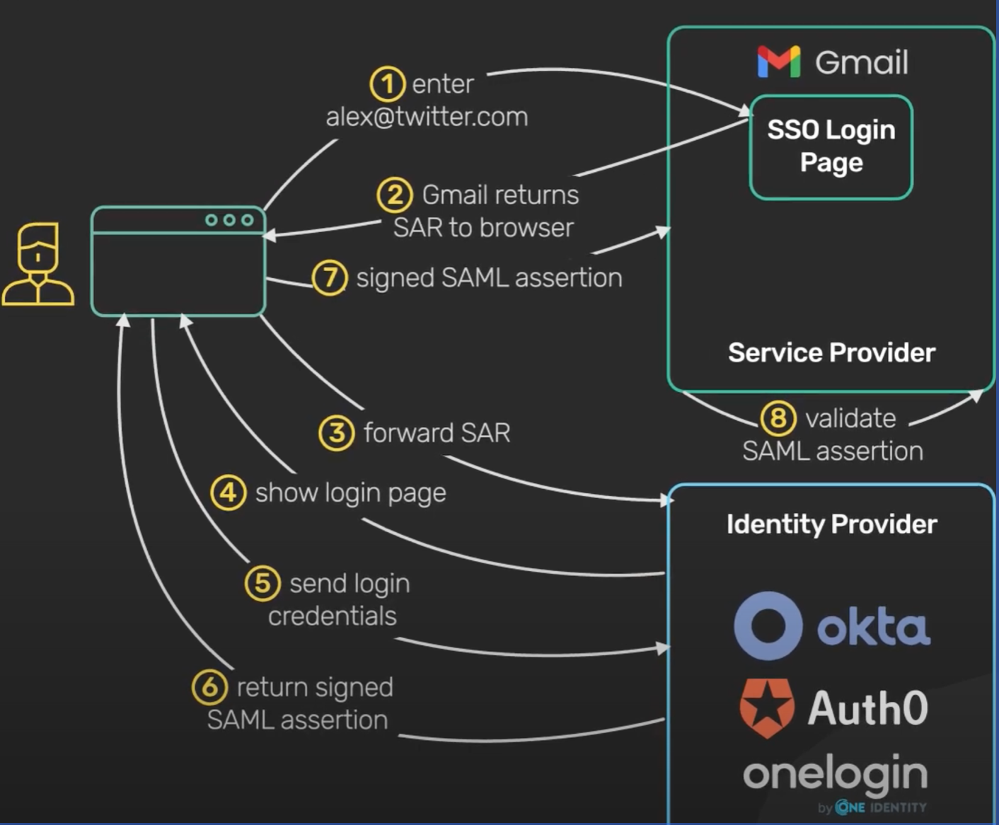
</p>


If the user want to login to Wordday, identity provider notices the user has logged in before so it skips the login page step and just returns the signed SAML assertion back to the browser. Next the browser send it to Workday and Workday  grants access after checking the assertion validity with the identity provider.

_OpenID Connect is similar to SAML but instead of passing the signed XML document around, it passes JWT, a signed JSON document_. The implementation details is a bit different but the overall concept is the same. Both methods are secure.

<p align="center">
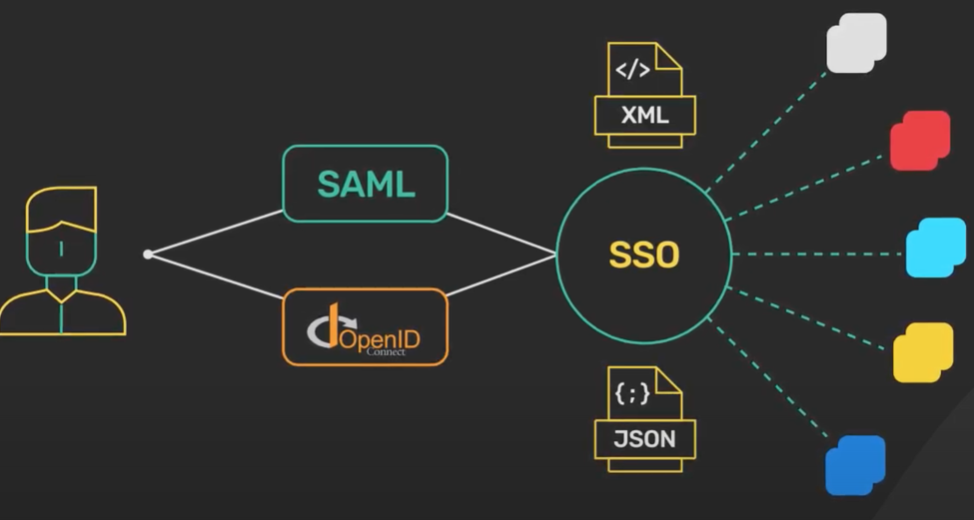
</p>


-----------
### Serverless Computing

The Cloud Native Computing Foundation (or CNCF) defines serverless as "The concept of building and running applications that _do not require server management_. _It describes a finer-grained deployment model where applications, bundled as one or more functions, are uploaded to a platform and then executed, scaled, and billed in response to the exact demand needed at the moment_". In other words, serverless computing offloads the responsibility of infrastructure management to cloud providers, enabling developers to focus on the application business logic. Think of serverless computing as a combination of function-as-a-service (or FaaS) platforms and backend-as-a-service (or BaaS) services. FaaS platforms are used to run functions. BaaS represents backend cloud services, such as cloud databases, object storage services, and message queues. 

Now, the history of IT computing shows a progressive trend from traditional computing to serverless computing, leading to faster deployments, shorter lifespans, and increased productivity. Several milestones mark this evolutional trend: 
- Traditional computing uses physical machines but is hampered by upfront investments, capacity planning, and more. 
- Physical machines take weeks or months to deploy and have a lifespan of several years. 
- Virtualization technology is implemented in cloud computing for faster provisioning, high scalability and availability. Virtualization facilitates the creation of multiple virtual machines (VMs) or containers. VMs take minutes to deploy and have a lifespan of days or weeks. Containers, which are based on operating system virtualization, require seconds to deploy and live for minutes or hours. 
- Serverless applications require only a serverless architecture for the core code. Serverless functions take milliseconds to deploy and have a lifespan of seconds. 
- It is an architectural style where code runs using a cloud platform, and the cloud provider manages the hardware and software setup, security, scalability, and so on. 
- The client is billed only for usage and not for CPU idle time. And developers only need to focus on their application code in the form of functions. 


Serverless computing exhibits the following characteristics: 

- It is hostless, meaning developers do not have to procure, manage, and maintain servers
- It’s elastic because autoscaling is immediate and inherent for serverless. 
- It offers automated load balancing that distributes the incoming traffic across multiple backend systems. 
- It is stateless, which results in faster performance and higher scalability. 
- It’s event driven, meaning functions are triggered only when events occur. 
- It provides high availability with no extra effort or cost. 
- It is usage-based with granular billing. 

So, how do functions work in a serverless world? Consider, for example, the steps required to create a Docker or Kubernetes container. The developer creates a function by writing code in a language supported by the cloud provider, such as Python, Java, Node.js, C#, or Go. Next, the developer uploads the function to the cloud. Then, events are defined that trigger the function, such as a user click. And, once the event occurs, the trigger is invoked, and the cloud provider runs the function, resulting in the container object. Having developers spend more time creating high-quality and optimized applications greatly benefits organizations. Developers can build functions using any popular programming language, extend the functionality of apps by adding additional features, perform better testing since functions perform only one task at a time, optimize apps and functions, and improve the user experience. To accomplish the goal of zero operational considerations, cloud providers take responsibility for routine infrastructure management and maintenance tasks such as maximizing compute, memory, and networking utilization while minimizing costs, providing server management that includes OS updates and security patches, enabling autoscaling, maintaining high availability, implementing security, configuring high performance (or low latency), and setting up monitoring and logging. 


In comparing different cloud service models shown in this figure, let’s look at your responsibilities versus the cloud provider, and more so, regarding the serverless service model. We start with the extreme left stack (traditional), which you manage entirely. In the IaaS model, you manage the layers from the OS up to the top, while the cloud provider manages the lower four layers. In the PaaS model, you manage the first two layers, Application and Data, while the cloud provider manages the remaining layers. In the Serverless model, you manage only the Application layer, while the cloud provider manages the remaining layers. And in the SaaS model, the cloud provider manages the entire stack. 


<p align="center">
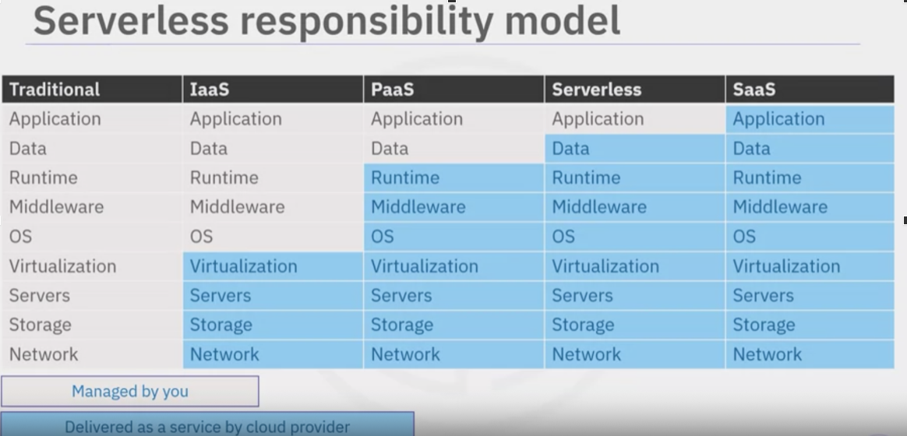
</p>


#### Serverless Pros and Cons

In traditional computing, development and operations teams set up and maintain their own infrastructure. These processes take a lot of time, are complex, and require capital investments. However, with the arrival of cloud, containers, and serverless computing, development teams can focus on writing high-quality code and building and running their applications in milliseconds without worrying about infrastructure, scalability, and fault tolerance. 

Serverless computing also has its share of challenges, including **vendor lock-in**, **third-party dependencies**, and **networking**. Let's look at the benefits and constraints of serverless computing and then compare the same versus containers and traditional computing. 

With serverless computing, cloud providers take on a large share of the work, which brings many benefits. 
- There are no infrastructure setup and maintenance requirements as a cloud provider manages the same, thereby reducing costs. 
- Cloud providers ensure reliability, which results in high availability and fault tolerance. Developers benefit because they focus on applications and do what they enjoy best. 
- Without serverless, all parts of your applications are constantly running, thereby wasting resources. Serverless functions allow you to configure your application to only run certain parts when needed. For example, an application’s front end must run continuously to keep users logged in. But an authentication service saves resources and costs since it is only invoked occasionally. Functions run in milliseconds, while run times for containers or virtual machines (VMs) are in seconds and minutes, respectively. Many cloud providers include a built-in code editor called an Integrated Development Environment, or IDE, for faster developments, deployments, and updates. 
- You are charged on a pay-per-request basis and not for any idle resources. You can use any popular programming language for development. 
- Plenty of third-party support is available for authentication, database, and other backend services. Since developers purely focus on development, organizations can focus on their business and release products faster than the competition. 
- The serverless environment allows more innovation and experimentation, even if subject to failures. And with no infrastructure to manage, greener computing also becomes a definite possibility. 

However, serverless computing is not best for every situation as it does have some constraints: 
- For workloads characterized by long-running processes, a traditional environment can be more cost-effective. 
- Dependencies on cloud providers’ technologies or environments lead to vendor lock-in risks. 
- If requests are received after long intervals, the applications must often restart all processes, known as a cold start. This increases the function run time. 
- Serverless latency is unacceptable for time-critical applications such as banking, health care, or edge-related applications. 
- Security concerns increase due to changes in the attack surfaces from endpoints to source code and the limitations in the provider’s security implementations. 
- Monitoring and debugging are complex in any distributed system. 
- Since you cannot imitate the backend-as-a-service (or BaaS) environment in your local system, it’s challenging to test the complete functionality and debug application issues. 
- Language support is dependent on the cloud provider. Not all cloud providers offer support for all programming languages; hence you are limited to the languages supported by your cloud provider. 
- There are no servers to optimize for utilization or performance since you have no control over the servers. 
- There is no state persistence. For example, the previous run state will not be available in the next invocation of the same function. Since local cache lasts only a few hours, it’s better to include low-latency external caches like Redis or Memcached. 
 
Can serverless and containers work together? Absolutely! 

Let’s compare serverless computing and containerization, starting with the pros of serverless and the cons of containers: 
- Serverless computing is more cost-effective since you only pay for what you use. 
- For serverless, scalability is handled entirely by the cloud provider. The cloud provider manages all the infrastructure. 
- The time to deploy is a matter of milliseconds rather than seconds. And in terms of speed to market, as development is fast, organizations can focus on their core business and not worry about the infrastructure. 

Now, let’s consider the pros of containers and the cons of serverless:
 - With containers, testing in a local environment or in the cloud is easier. 
 - It’s easier to port containers as they are operating system agnostic, language agnostic, and provider agnostic. 
 - Latency is very low for containers, so it’s suitable even for time-critical workloads. 
 - Containers are also ideal for long-running apps as there are no time restrictions to complete batch jobs. 
 - With containers, you can configure both apps and resources. And for language support, containerization supports any language.


---------
### Create, save a docker image and then transport it
If for some reasons, it is not ideal to pull an image from hub, then you can save a copy of the image and load it later. 

```
$ docker buildx build --platform=linux/amd64 -t envoy:v1.31.0 —platform=linux/amd64
```
`—platform=linux/amd64` is necessary if using Apple M arch. Save the image and send it to the remote sever (a node in k8s cluster, for example):

```
$ docker save -o envoy.tar envoy 
$ scp envoy.tar yas@10.0.0.191:.
```
Load the tar image using `containerd` - specify namespace  `k8s.io` so it is available to Kubernetes - otherwise it will be loaded in the default namespace which is not accessible by k8s.
```
$ sudo ctr -n=k8s.io images import envoy.tar
```

Check the list of available images 
```
$ sudo crictl images ls
```
Now image address in the manifest is `envoy:v1.31.0`. The image is accessible by K8s and will be installed in the cluster along with other configurations ins th manifest. 
